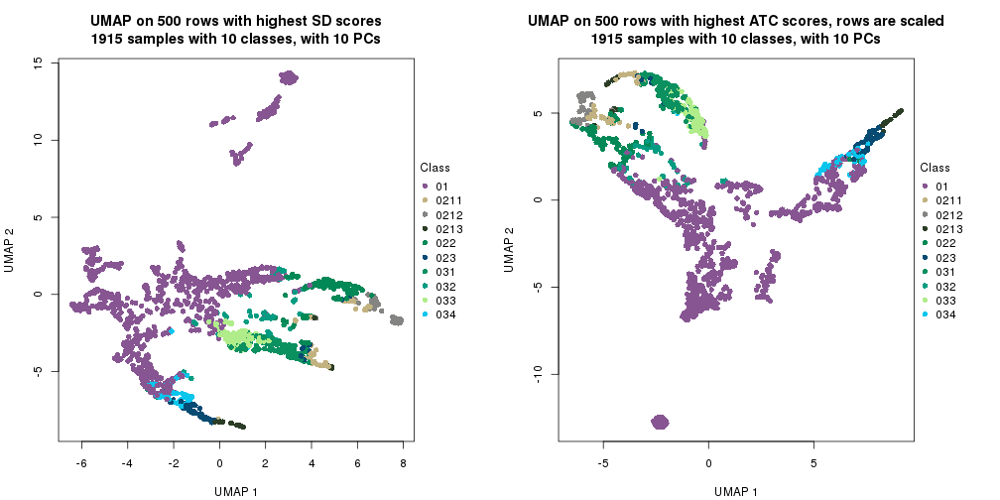
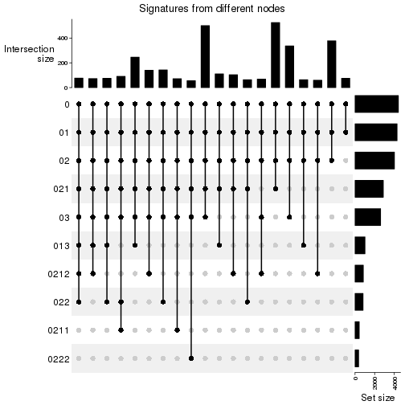
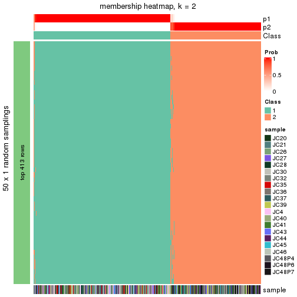
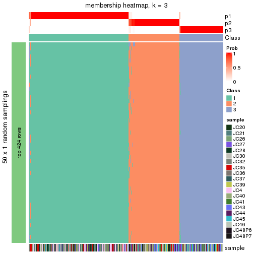
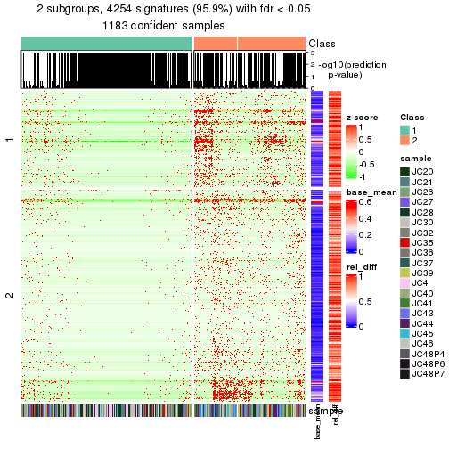
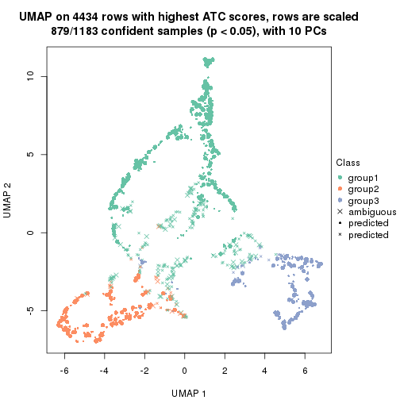
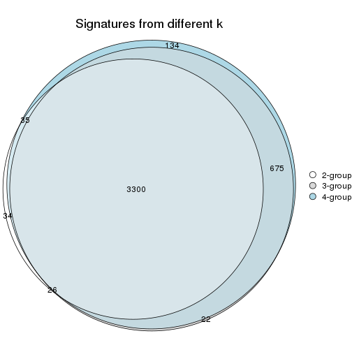
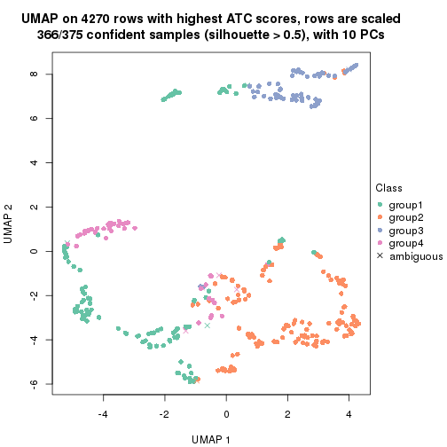
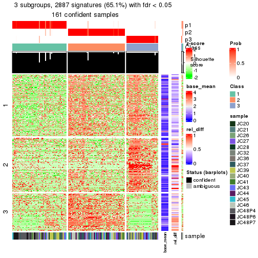
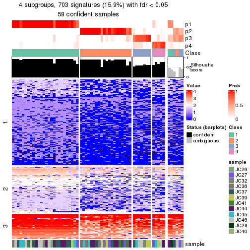

cola Report for Hierarchical Partitioning - 'GrunHSC'
==================

**Date**: 2021-07-26 10:30:10 CEST, **cola version**: 1.9.4

----------------------------------------------------------------

<style type='text/css'>

body, td, th {
   font-family: Arial,Helvetica,sans-serif;
   background-color: white;
   font-size: 13px;
  max-width: 800px;
  margin: auto;
  margin-left:210px;
  padding: 0px 10px 0px 10px;
  border-left: 1px solid #EEEEEE;
  line-height: 150%;
}

tt, code, pre {
   font-family: 'DejaVu Sans Mono', 'Droid Sans Mono', 'Lucida Console', Consolas, Monaco, 

monospace;
}

h1 {
   font-size:2.2em;
}

h2 {
   font-size:1.8em;
}

h3 {
   font-size:1.4em;
}

h4 {
   font-size:1.0em;
}

h5 {
   font-size:0.9em;
}

h6 {
   font-size:0.8em;
}

a {
  text-decoration: none;
  color: #0366d6;
}

a:hover {
  text-decoration: underline;
}

a:visited {
   color: #0366d6;
}

pre, img {
  max-width: 100%;
}
pre {
  overflow-x: auto;
}
pre code {
   display: block; padding: 0.5em;
}

code {
  font-size: 92%;
  border: 1px solid #ccc;
}

code[class] {
  background-color: #F8F8F8;
}

table, td, th {
  border: 1px solid #ccc;
}

blockquote {
   color:#666666;
   margin:0;
   padding-left: 1em;
   border-left: 0.5em #EEE solid;
}

hr {
   height: 0px;
   border-bottom: none;
   border-top-width: thin;
   border-top-style: dotted;
   border-top-color: #999999;
}

@media print {
   * {
      background: transparent !important;
      color: black !important;
      filter:none !important;
      -ms-filter: none !important;
   }

   body {
      font-size:12pt;
      max-width:100%;
   }

   a, a:visited {
      text-decoration: underline;
   }

   hr {
      visibility: hidden;
      page-break-before: always;
   }

   pre, blockquote {
      padding-right: 1em;
      page-break-inside: avoid;
   }

   tr, img {
      page-break-inside: avoid;
   }

   img {
      max-width: 100% !important;
   }

   @page :left {
      margin: 15mm 20mm 15mm 10mm;
   }

   @page :right {
      margin: 15mm 10mm 15mm 20mm;
   }

   p, h2, h3 {
      orphans: 3; widows: 3;
   }

   h2, h3 {
      page-break-after: avoid;
   }
}
</style>


## Summary


First the variable is renamed to `res_rh`.


```r
res_rh = rh
```


The partition hierarchy and all available functions which can be applied to `res_rh` object.


```r
res_rh
```

```
#> A 'HierarchicalPartition' object with 'ATC:skmeans' method.
#>   On a matrix with 4434 rows and 1915 columns.
#>   Performed in total 4350 partitions.
#>   There are 19 groups under the following parameters:
#>     - min_samples: 19
#>     - mean_silhouette_cutoff: 0.9
#>     - min_n_signatures: 206 (signatures are selected based on:)
#>       - fdr_cutoff: 0.05
#>       - group_diff (scaled values): 0.5
#> 
#> Hierarchy of the partition:
#>   0, 1915 cols
#>   |-- 01, 1183 cols, 1031 signatures
#>   |   |-- 011, 658 cols, 6 signatures (c)
#>   |   |-- 012, 197 cols (a)
#>   |   |-- 013, 205 cols, 445 signatures
#>   |   |   |-- 0131, 111 cols, 84 signatures (c)
#>   |   |   `-- 0132, 94 cols, 135 signatures (c)
#>   |   `-- 014, 123 cols, 83 signatures (c)
#>   |-- 02, 375 cols, 3836 signatures
#>   |   |-- 021, 163 cols, 2813 signatures
#>   |   |   |-- 0211, 62 cols, 412 signatures
#>   |   |   |   |-- 02111, 32 cols (b)
#>   |   |   |   `-- 02112, 30 cols (b)
#>   |   |   |-- 0212, 64 cols, 752 signatures
#>   |   |   |   |-- 02121, 30 cols (b)
#>   |   |   |   `-- 02122, 34 cols (b)
#>   |   |   `-- 0213, 37 cols (b)
#>   |   |-- 022, 142 cols, 805 signatures
#>   |   |   |-- 0221, 54 cols, 57 signatures (c)
#>   |   |   |-- 0222, 45 cols, 372 signatures
#>   |   |   |   |-- 02221, 31 cols (b)
#>   |   |   |   `-- 02222, 14 cols (b)
#>   |   |   `-- 0223, 43 cols, 30 signatures (c)
#>   |   `-- 023, 70 cols, 204 signatures (c)
#>   `-- 03, 357 cols, 2187 signatures
#>       |-- 031, 144 cols, 168 signatures (c)
#>       |-- 032, 62 cols, 120 signatures (c)
#>       |-- 033, 101 cols, 123 signatures (c)
#>       `-- 034, 50 cols, 134 signatures (c)
#> Stop reason:
#>   a) Mean silhouette score was too small
#>   b) Subgroup had too few columns.
#>   c) There were too few signatures.
#> 
#> Following methods can be applied to this 'HierarchicalPartition' object:
#>  [1] "all_leaves"            "all_nodes"             "cola_report"           "collect_classes"      
#>  [5] "colnames"              "compare_signatures"    "dimension_reduction"   "functional_enrichment"
#>  [9] "get_anno_col"          "get_anno"              "get_children_nodes"    "get_classes"          
#> [13] "get_matrix"            "get_signatures"        "is_leaf_node"          "max_depth"            
#> [17] "merge_node"            "ncol"                  "node_info"             "node_level"           
#> [21] "nrow"                  "rownames"              "show"                  "split_node"           
#> [25] "suggest_best_k"        "test_to_known_factors" "top_rows_heatmap"      "top_rows_overlap"     
#> 
#> You can get result for a single node by e.g. object["01"]
```

The call of `hierarchical_partition()` was:


```
#> hierarchical_partition(data = lt$mat, anno = lt$anno, subset = 500, cores = 4)
```

Dimension of the input matrix:


```r
mat = get_matrix(res_rh)
dim(mat)
```

```
#> [1] 4434 1915
```

All the methods that were tried:


```r
res_rh@param$combination_method
```

```
#> [[1]]
#> [1] "ATC"     "skmeans"
```

### Density distribution

The density distribution for each sample is visualized as one column in the following heatmap.
The clustering is based on the distance which is the Kolmogorov-Smirnov statistic between two distributions.


```r
library(ComplexHeatmap)
densityHeatmap(mat, top_annotation = HeatmapAnnotation(df = get_anno(res_rh), 
    col = get_anno_col(res_rh)), ylab = "value", cluster_columns = TRUE, show_column_names = FALSE,
    mc.cores = 1)
```


Some values about the hierarchy:


```r
all_nodes(res_rh)
```

```
#>  [1] "0"     "01"    "011"   "012"   "013"   "0131"  "0132"  "014"   "02"    "021"   "0211"  "02111"
#> [13] "02112" "0212"  "02121" "02122" "0213"  "022"   "0221"  "0222"  "02221" "02222" "0223"  "023"  
#> [25] "03"    "031"   "032"   "033"   "034"
```

```r
all_leaves(res_rh)
```

```
#>  [1] "011"   "012"   "0131"  "0132"  "014"   "02111" "02112" "02121" "02122" "0213"  "0221"  "02221"
#> [13] "02222" "0223"  "023"   "031"   "032"   "033"   "034"
```

```r
node_info(res_rh)
```

```
#>       id best_method depth best_k n_columns n_signatures p_signatures is_leaf
#> 1      0 ATC:skmeans     1      3      1915         4133      0.93212   FALSE
#> 2     01 ATC:skmeans     2      4      1183         1031      0.23252   FALSE
#> 3    011 ATC:skmeans     3      2       658            6      0.00135    TRUE
#> 4    012 ATC:skmeans     3      3       197           NA           NA    TRUE
#> 5    013 ATC:skmeans     3      2       205          445      0.10036   FALSE
#> 6   0131 ATC:skmeans     4      2       111           84      0.01894    TRUE
#> 7   0132 ATC:skmeans     4      2        94          135      0.03045    TRUE
#> 8    014 ATC:skmeans     3      2       123           83      0.01872    TRUE
#> 9     02 ATC:skmeans     2      3       375         3836      0.86513   FALSE
#> 10   021 ATC:skmeans     3      3       163         2813      0.63442   FALSE
#> 11  0211 ATC:skmeans     4      2        62          412      0.09292   FALSE
#> 12 02111 not applied     5     NA        32           NA           NA    TRUE
#> 13 02112 not applied     5     NA        30           NA           NA    TRUE
#> 14  0212 ATC:skmeans     4      2        64          752      0.16960   FALSE
#> 15 02121 not applied     5     NA        30           NA           NA    TRUE
#> 16 02122 not applied     5     NA        34           NA           NA    TRUE
#> 17  0213 not applied     4     NA        37           NA           NA    TRUE
#> 18   022 ATC:skmeans     3      3       142          805      0.18155   FALSE
#> 19  0221 ATC:skmeans     4      2        54           57      0.01286    TRUE
#> 20  0222 ATC:skmeans     4      2        45          372      0.08390   FALSE
#> 21 02221 not applied     5     NA        31           NA           NA    TRUE
#> 22 02222 not applied     5     NA        14           NA           NA    TRUE
#> 23  0223 ATC:skmeans     4      2        43           30      0.00677    TRUE
#> 24   023 ATC:skmeans     3      2        70          204      0.04601    TRUE
#> 25    03 ATC:skmeans     2      4       357         2187      0.49323   FALSE
#> 26   031 ATC:skmeans     3      2       144          168      0.03789    TRUE
#> 27   032 ATC:skmeans     3      2        62          120      0.02706    TRUE
#> 28   033 ATC:skmeans     3      2       101          123      0.02774    TRUE
#> 29   034 ATC:skmeans     3      2        50          134      0.03022    TRUE
```

In the output from `node_info()`, there are the following columns:

- `id`: The node id.
- `best_method`: The best method selected.
- `depth`: Depth of the node in the hierarchy.
- `best_k`: Best number of groups of the partition on that node.
- `n_columns`: Number of columns in the submatrix.
- `n_signatures`: Number of signatures with the `best_k`.
- `p_signatures`: Proportion of hte signatures in total number of rows in the matrix.
- `is_leaf`: Whether the node is a leaf.

Labels of nodes are encoded in a special way. The number of digits
correspond to the depth of the node in the hierarchy and the value of the
digits correspond to the index of the subgroup in the current node, E.g. a label
of “012” means the node is the second subgroup of the partition which is the
first subgroup of the root node.

### Suggest the best k


Following table shows the best `k` (number of partitions) for each node in the
partition hierarchy. Clicking on the node name in the table goes to the
corresponding section for the partitioning on that node.

[The cola vignette](https://jokergoo.github.io/cola_vignettes/cola.html#toc_13)
explains the definition of the metrics used for determining the best
number of partitions.


```r
suggest_best_k(res_rh)
```


|Node                  |Best method                                         |Is leaf   |Best k |1-PAC |Mean silhouette |Concordance | #samples|   |
|:---------------------|:---------------------------------------------------|:---------|:------|:-----|:---------------|:-----------|--------:|:--|
|[Node0](#Node0)       |ATC:skmeans                                         |          |3      |0.95  |0.96            |0.97        |     1915|*  |
|[Node01](#Node01)     |ATC:skmeans                                         |          |4      |1.00  |0.97            |0.99        |     1183|** |
|Node011-leaf          |ATC:skmeans                                         |✓ (&#99;) |4      |0.92  |0.89            |0.94        |      658|*  |
|Node012-leaf          |ATC:skmeans                                         |✓ (a)     |3      |0.81  |0.86            |0.94        |      197|   |
|[Node013](#Node013)   |ATC:skmeans                                         |          |4      |0.92  |0.91            |0.96        |      205|*  |
|Node0131-leaf         |ATC:skmeans                                         |✓ (&#99;) |2      |0.88  |0.92            |0.97        |      111|   |
|Node0132-leaf         |ATC:skmeans                                         |✓ (&#99;) |2      |0.95  |0.94            |0.98        |       94|** |
|Node014-leaf          |ATC:skmeans                                         |✓ (&#99;) |2      |1.00  |0.97            |0.99        |      123|** |
|[Node02](#Node02)     |ATC:skmeans                                         |          |4      |0.98  |0.93            |0.97        |      375|** |
|[Node021](#Node021)   |ATC:skmeans                                         |          |4      |0.98  |0.95            |0.97        |      163|** |
|[Node0211](#Node0211) |ATC:skmeans                                         |          |3      |0.93  |0.94            |0.97        |       62|*  |
|Node02111-leaf        |<span style='color:grey;'><i>not applied</i></span> |✓ (b)     |       |      |                |            |       32|   |
|Node02112-leaf        |<span style='color:grey;'><i>not applied</i></span> |✓ (b)     |       |      |                |            |       30|   |
|[Node0212](#Node0212) |ATC:skmeans                                         |          |2      |1.00  |0.98            |0.99        |       64|** |
|Node02121-leaf        |<span style='color:grey;'><i>not applied</i></span> |✓ (b)     |       |      |                |            |       30|   |
|Node02122-leaf        |<span style='color:grey;'><i>not applied</i></span> |✓ (b)     |       |      |                |            |       34|   |
|Node0213-leaf         |<span style='color:grey;'><i>not applied</i></span> |✓ (b)     |       |      |                |            |       37|   |
|[Node022](#Node022)   |ATC:skmeans                                         |          |4      |0.93  |0.90            |0.95        |      142|*  |
|Node0221-leaf         |ATC:skmeans                                         |✓ (&#99;) |2      |0.96  |0.94            |0.98        |       54|** |
|[Node0222](#Node0222) |ATC:skmeans                                         |          |2      |1.00  |0.95            |0.98        |       45|** |
|Node02221-leaf        |<span style='color:grey;'><i>not applied</i></span> |✓ (b)     |       |      |                |            |       31|   |
|Node02222-leaf        |<span style='color:grey;'><i>not applied</i></span> |✓ (b)     |       |      |                |            |       14|   |
|Node0223-leaf         |ATC:skmeans                                         |✓ (&#99;) |3      |0.91  |0.92            |0.96        |       43|*  |
|Node023-leaf          |ATC:skmeans                                         |✓ (&#99;) |3      |0.98  |0.31            |0.67        |       70|** |
|[Node03](#Node03)     |ATC:skmeans                                         |          |4      |0.98  |0.95            |0.97        |      357|** |
|Node031-leaf          |ATC:skmeans                                         |✓ (&#99;) |2      |0.90  |0.93            |0.97        |      144|   |
|Node032-leaf          |ATC:skmeans                                         |✓ (&#99;) |3      |0.95  |0.93            |0.96        |       62|** |
|Node033-leaf          |ATC:skmeans                                         |✓ (&#99;) |2      |0.98  |0.95            |0.98        |      101|** |
|Node034-leaf          |ATC:skmeans                                         |✓ (&#99;) |2      |1.00  |0.99            |0.99        |       50|** |


Stop reason: a) Mean silhouette score was too small b) Subgroup had too few columns. c) There were too few signatures. 

\*\*: 1-PAC > 0.95, \*: 1-PAC > 0.9


### Partition hierarchy

The nodes of the hierarchy can be merged by setting the `merge_node` parameters. Here we 
control the hierarchy with the `min_n_signatures` parameter. The value of `min_n_signatures` is
from `node_info()`.


<style type='text/css'>


.ui-helper-hidden {
	display: none;
}
.ui-helper-hidden-accessible {
	border: 0;
	clip: rect(0 0 0 0);
	height: 1px;
	margin: -1px;
	overflow: hidden;
	padding: 0;
	position: absolute;
	width: 1px;
}
.ui-helper-reset {
	margin: 0;
	padding: 0;
	border: 0;
	outline: 0;
	line-height: 1.3;
	text-decoration: none;
	font-size: 100%;
	list-style: none;
}
.ui-helper-clearfix:before,
.ui-helper-clearfix:after {
	content: "";
	display: table;
	border-collapse: collapse;
}
.ui-helper-clearfix:after {
	clear: both;
}
.ui-helper-zfix {
	width: 100%;
	height: 100%;
	top: 0;
	left: 0;
	position: absolute;
	opacity: 0;
	filter:Alpha(Opacity=0); 
}

.ui-front {
	z-index: 100;
}


.ui-state-disabled {
	cursor: default !important;
	pointer-events: none;
}


.ui-icon {
	display: inline-block;
	vertical-align: middle;
	margin-top: -.25em;
	position: relative;
	text-indent: -99999px;
	overflow: hidden;
	background-repeat: no-repeat;
}

.ui-widget-icon-block {
	left: 50%;
	margin-left: -8px;
	display: block;
}


.ui-widget-overlay {
	position: fixed;
	top: 0;
	left: 0;
	width: 100%;
	height: 100%;
}
.ui-accordion .ui-accordion-header {
	display: block;
	cursor: pointer;
	position: relative;
	margin: 2px 0 0 0;
	padding: .5em .5em .5em .7em;
	font-size: 100%;
}
.ui-accordion .ui-accordion-content {
	padding: 1em 2.2em;
	border-top: 0;
	overflow: auto;
}
.ui-autocomplete {
	position: absolute;
	top: 0;
	left: 0;
	cursor: default;
}
.ui-menu {
	list-style: none;
	padding: 0;
	margin: 0;
	display: block;
	outline: 0;
}
.ui-menu .ui-menu {
	position: absolute;
}
.ui-menu .ui-menu-item {
	margin: 0;
	cursor: pointer;
	
	list-style-image: url("data:image/gif;base64,R0lGODlhAQABAIAAAAAAAP///yH5BAEAAAAALAAAAAABAAEAAAIBRAA7");
}
.ui-menu .ui-menu-item-wrapper {
	position: relative;
	padding: 3px 1em 3px .4em;
}
.ui-menu .ui-menu-divider {
	margin: 5px 0;
	height: 0;
	font-size: 0;
	line-height: 0;
	border-width: 1px 0 0 0;
}
.ui-menu .ui-state-focus,
.ui-menu .ui-state-active {
	margin: -1px;
}


.ui-menu-icons {
	position: relative;
}
.ui-menu-icons .ui-menu-item-wrapper {
	padding-left: 2em;
}


.ui-menu .ui-icon {
	position: absolute;
	top: 0;
	bottom: 0;
	left: .2em;
	margin: auto 0;
}


.ui-menu .ui-menu-icon {
	left: auto;
	right: 0;
}
.ui-button {
	padding: .4em 1em;
	display: inline-block;
	position: relative;
	line-height: normal;
	margin-right: .1em;
	cursor: pointer;
	vertical-align: middle;
	text-align: center;
	-webkit-user-select: none;
	-moz-user-select: none;
	-ms-user-select: none;
	user-select: none;

	
	overflow: visible;
}

.ui-button,
.ui-button:link,
.ui-button:visited,
.ui-button:hover,
.ui-button:active {
	text-decoration: none;
}


.ui-button-icon-only {
	width: 2em;
	box-sizing: border-box;
	text-indent: -9999px;
	white-space: nowrap;
}


input.ui-button.ui-button-icon-only {
	text-indent: 0;
}


.ui-button-icon-only .ui-icon {
	position: absolute;
	top: 50%;
	left: 50%;
	margin-top: -8px;
	margin-left: -8px;
}

.ui-button.ui-icon-notext .ui-icon {
	padding: 0;
	width: 2.1em;
	height: 2.1em;
	text-indent: -9999px;
	white-space: nowrap;

}

input.ui-button.ui-icon-notext .ui-icon {
	width: auto;
	height: auto;
	text-indent: 0;
	white-space: normal;
	padding: .4em 1em;
}


input.ui-button::-moz-focus-inner,
button.ui-button::-moz-focus-inner {
	border: 0;
	padding: 0;
}
.ui-controlgroup {
	vertical-align: middle;
	display: inline-block;
}
.ui-controlgroup > .ui-controlgroup-item {
	float: left;
	margin-left: 0;
	margin-right: 0;
}
.ui-controlgroup > .ui-controlgroup-item:focus,
.ui-controlgroup > .ui-controlgroup-item.ui-visual-focus {
	z-index: 9999;
}
.ui-controlgroup-vertical > .ui-controlgroup-item {
	display: block;
	float: none;
	width: 100%;
	margin-top: 0;
	margin-bottom: 0;
	text-align: left;
}
.ui-controlgroup-vertical .ui-controlgroup-item {
	box-sizing: border-box;
}
.ui-controlgroup .ui-controlgroup-label {
	padding: .4em 1em;
}
.ui-controlgroup .ui-controlgroup-label span {
	font-size: 80%;
}
.ui-controlgroup-horizontal .ui-controlgroup-label + .ui-controlgroup-item {
	border-left: none;
}
.ui-controlgroup-vertical .ui-controlgroup-label + .ui-controlgroup-item {
	border-top: none;
}
.ui-controlgroup-horizontal .ui-controlgroup-label.ui-widget-content {
	border-right: none;
}
.ui-controlgroup-vertical .ui-controlgroup-label.ui-widget-content {
	border-bottom: none;
}


.ui-controlgroup-vertical .ui-spinner-input {

	
	width: 75%;
	width: calc( 100% - 2.4em );
}
.ui-controlgroup-vertical .ui-spinner .ui-spinner-up {
	border-top-style: solid;
}

.ui-checkboxradio-label .ui-icon-background {
	box-shadow: inset 1px 1px 1px #ccc;
	border-radius: .12em;
	border: none;
}
.ui-checkboxradio-radio-label .ui-icon-background {
	width: 16px;
	height: 16px;
	border-radius: 1em;
	overflow: visible;
	border: none;
}
.ui-checkboxradio-radio-label.ui-checkboxradio-checked .ui-icon,
.ui-checkboxradio-radio-label.ui-checkboxradio-checked:hover .ui-icon {
	background-image: none;
	width: 8px;
	height: 8px;
	border-width: 4px;
	border-style: solid;
}
.ui-checkboxradio-disabled {
	pointer-events: none;
}
.ui-datepicker {
	width: 17em;
	padding: .2em .2em 0;
	display: none;
}
.ui-datepicker .ui-datepicker-header {
	position: relative;
	padding: .2em 0;
}
.ui-datepicker .ui-datepicker-prev,
.ui-datepicker .ui-datepicker-next {
	position: absolute;
	top: 2px;
	width: 1.8em;
	height: 1.8em;
}
.ui-datepicker .ui-datepicker-prev-hover,
.ui-datepicker .ui-datepicker-next-hover {
	top: 1px;
}
.ui-datepicker .ui-datepicker-prev {
	left: 2px;
}
.ui-datepicker .ui-datepicker-next {
	right: 2px;
}
.ui-datepicker .ui-datepicker-prev-hover {
	left: 1px;
}
.ui-datepicker .ui-datepicker-next-hover {
	right: 1px;
}
.ui-datepicker .ui-datepicker-prev span,
.ui-datepicker .ui-datepicker-next span {
	display: block;
	position: absolute;
	left: 50%;
	margin-left: -8px;
	top: 50%;
	margin-top: -8px;
}
.ui-datepicker .ui-datepicker-title {
	margin: 0 2.3em;
	line-height: 1.8em;
	text-align: center;
}
.ui-datepicker .ui-datepicker-title select {
	font-size: 1em;
	margin: 1px 0;
}
.ui-datepicker select.ui-datepicker-month,
.ui-datepicker select.ui-datepicker-year {
	width: 45%;
}
.ui-datepicker table {
	width: 100%;
	font-size: .9em;
	border-collapse: collapse;
	margin: 0 0 .4em;
}
.ui-datepicker th {
	padding: .7em .3em;
	text-align: center;
	font-weight: bold;
	border: 0;
}
.ui-datepicker td {
	border: 0;
	padding: 1px;
}
.ui-datepicker td span,
.ui-datepicker td a {
	display: block;
	padding: .2em;
	text-align: right;
	text-decoration: none;
}
.ui-datepicker .ui-datepicker-buttonpane {
	background-image: none;
	margin: .7em 0 0 0;
	padding: 0 .2em;
	border-left: 0;
	border-right: 0;
	border-bottom: 0;
}
.ui-datepicker .ui-datepicker-buttonpane button {
	float: right;
	margin: .5em .2em .4em;
	cursor: pointer;
	padding: .2em .6em .3em .6em;
	width: auto;
	overflow: visible;
}
.ui-datepicker .ui-datepicker-buttonpane button.ui-datepicker-current {
	float: left;
}


.ui-datepicker.ui-datepicker-multi {
	width: auto;
}
.ui-datepicker-multi .ui-datepicker-group {
	float: left;
}
.ui-datepicker-multi .ui-datepicker-group table {
	width: 95%;
	margin: 0 auto .4em;
}
.ui-datepicker-multi-2 .ui-datepicker-group {
	width: 50%;
}
.ui-datepicker-multi-3 .ui-datepicker-group {
	width: 33.3%;
}
.ui-datepicker-multi-4 .ui-datepicker-group {
	width: 25%;
}
.ui-datepicker-multi .ui-datepicker-group-last .ui-datepicker-header,
.ui-datepicker-multi .ui-datepicker-group-middle .ui-datepicker-header {
	border-left-width: 0;
}
.ui-datepicker-multi .ui-datepicker-buttonpane {
	clear: left;
}
.ui-datepicker-row-break {
	clear: both;
	width: 100%;
	font-size: 0;
}


.ui-datepicker-rtl {
	direction: rtl;
}
.ui-datepicker-rtl .ui-datepicker-prev {
	right: 2px;
	left: auto;
}
.ui-datepicker-rtl .ui-datepicker-next {
	left: 2px;
	right: auto;
}
.ui-datepicker-rtl .ui-datepicker-prev:hover {
	right: 1px;
	left: auto;
}
.ui-datepicker-rtl .ui-datepicker-next:hover {
	left: 1px;
	right: auto;
}
.ui-datepicker-rtl .ui-datepicker-buttonpane {
	clear: right;
}
.ui-datepicker-rtl .ui-datepicker-buttonpane button {
	float: left;
}
.ui-datepicker-rtl .ui-datepicker-buttonpane button.ui-datepicker-current,
.ui-datepicker-rtl .ui-datepicker-group {
	float: right;
}
.ui-datepicker-rtl .ui-datepicker-group-last .ui-datepicker-header,
.ui-datepicker-rtl .ui-datepicker-group-middle .ui-datepicker-header {
	border-right-width: 0;
	border-left-width: 1px;
}


.ui-datepicker .ui-icon {
	display: block;
	text-indent: -99999px;
	overflow: hidden;
	background-repeat: no-repeat;
	left: .5em;
	top: .3em;
}
.ui-dialog {
	position: absolute;
	top: 0;
	left: 0;
	padding: .2em;
	outline: 0;
}
.ui-dialog .ui-dialog-titlebar {
	padding: .4em 1em;
	position: relative;
}
.ui-dialog .ui-dialog-title {
	float: left;
	margin: .1em 0;
	white-space: nowrap;
	width: 90%;
	overflow: hidden;
	text-overflow: ellipsis;
}
.ui-dialog .ui-dialog-titlebar-close {
	position: absolute;
	right: .3em;
	top: 50%;
	width: 20px;
	margin: -10px 0 0 0;
	padding: 1px;
	height: 20px;
}
.ui-dialog .ui-dialog-content {
	position: relative;
	border: 0;
	padding: .5em 1em;
	background: none;
	overflow: auto;
}
.ui-dialog .ui-dialog-buttonpane {
	text-align: left;
	border-width: 1px 0 0 0;
	background-image: none;
	margin-top: .5em;
	padding: .3em 1em .5em .4em;
}
.ui-dialog .ui-dialog-buttonpane .ui-dialog-buttonset {
	float: right;
}
.ui-dialog .ui-dialog-buttonpane button {
	margin: .5em .4em .5em 0;
	cursor: pointer;
}
.ui-dialog .ui-resizable-n {
	height: 2px;
	top: 0;
}
.ui-dialog .ui-resizable-e {
	width: 2px;
	right: 0;
}
.ui-dialog .ui-resizable-s {
	height: 2px;
	bottom: 0;
}
.ui-dialog .ui-resizable-w {
	width: 2px;
	left: 0;
}
.ui-dialog .ui-resizable-se,
.ui-dialog .ui-resizable-sw,
.ui-dialog .ui-resizable-ne,
.ui-dialog .ui-resizable-nw {
	width: 7px;
	height: 7px;
}
.ui-dialog .ui-resizable-se {
	right: 0;
	bottom: 0;
}
.ui-dialog .ui-resizable-sw {
	left: 0;
	bottom: 0;
}
.ui-dialog .ui-resizable-ne {
	right: 0;
	top: 0;
}
.ui-dialog .ui-resizable-nw {
	left: 0;
	top: 0;
}
.ui-draggable .ui-dialog-titlebar {
	cursor: move;
}
.ui-draggable-handle {
	-ms-touch-action: none;
	touch-action: none;
}
.ui-resizable {
	position: relative;
}
.ui-resizable-handle {
	position: absolute;
	font-size: 0.1px;
	display: block;
	-ms-touch-action: none;
	touch-action: none;
}
.ui-resizable-disabled .ui-resizable-handle,
.ui-resizable-autohide .ui-resizable-handle {
	display: none;
}
.ui-resizable-n {
	cursor: n-resize;
	height: 7px;
	width: 100%;
	top: -5px;
	left: 0;
}
.ui-resizable-s {
	cursor: s-resize;
	height: 7px;
	width: 100%;
	bottom: -5px;
	left: 0;
}
.ui-resizable-e {
	cursor: e-resize;
	width: 7px;
	right: -5px;
	top: 0;
	height: 100%;
}
.ui-resizable-w {
	cursor: w-resize;
	width: 7px;
	left: -5px;
	top: 0;
	height: 100%;
}
.ui-resizable-se {
	cursor: se-resize;
	width: 12px;
	height: 12px;
	right: 1px;
	bottom: 1px;
}
.ui-resizable-sw {
	cursor: sw-resize;
	width: 9px;
	height: 9px;
	left: -5px;
	bottom: -5px;
}
.ui-resizable-nw {
	cursor: nw-resize;
	width: 9px;
	height: 9px;
	left: -5px;
	top: -5px;
}
.ui-resizable-ne {
	cursor: ne-resize;
	width: 9px;
	height: 9px;
	right: -5px;
	top: -5px;
}
.ui-progressbar {
	height: 2em;
	text-align: left;
	overflow: hidden;
}
.ui-progressbar .ui-progressbar-value {
	margin: -1px;
	height: 100%;
}
.ui-progressbar .ui-progressbar-overlay {
	background: url("data:image/gif;base64,R0lGODlhKAAoAIABAAAAAP///yH/C05FVFNDQVBFMi4wAwEAAAAh+QQJAQABACwAAAAAKAAoAAACkYwNqXrdC52DS06a7MFZI+4FHBCKoDeWKXqymPqGqxvJrXZbMx7Ttc+w9XgU2FB3lOyQRWET2IFGiU9m1frDVpxZZc6bfHwv4c1YXP6k1Vdy292Fb6UkuvFtXpvWSzA+HycXJHUXiGYIiMg2R6W459gnWGfHNdjIqDWVqemH2ekpObkpOlppWUqZiqr6edqqWQAAIfkECQEAAQAsAAAAACgAKAAAApSMgZnGfaqcg1E2uuzDmmHUBR8Qil95hiPKqWn3aqtLsS18y7G1SzNeowWBENtQd+T1JktP05nzPTdJZlR6vUxNWWjV+vUWhWNkWFwxl9VpZRedYcflIOLafaa28XdsH/ynlcc1uPVDZxQIR0K25+cICCmoqCe5mGhZOfeYSUh5yJcJyrkZWWpaR8doJ2o4NYq62lAAACH5BAkBAAEALAAAAAAoACgAAAKVDI4Yy22ZnINRNqosw0Bv7i1gyHUkFj7oSaWlu3ovC8GxNso5fluz3qLVhBVeT/Lz7ZTHyxL5dDalQWPVOsQWtRnuwXaFTj9jVVh8pma9JjZ4zYSj5ZOyma7uuolffh+IR5aW97cHuBUXKGKXlKjn+DiHWMcYJah4N0lYCMlJOXipGRr5qdgoSTrqWSq6WFl2ypoaUAAAIfkECQEAAQAsAAAAACgAKAAAApaEb6HLgd/iO7FNWtcFWe+ufODGjRfoiJ2akShbueb0wtI50zm02pbvwfWEMWBQ1zKGlLIhskiEPm9R6vRXxV4ZzWT2yHOGpWMyorblKlNp8HmHEb/lCXjcW7bmtXP8Xt229OVWR1fod2eWqNfHuMjXCPkIGNileOiImVmCOEmoSfn3yXlJWmoHGhqp6ilYuWYpmTqKUgAAIfkECQEAAQAsAAAAACgAKAAAApiEH6kb58biQ3FNWtMFWW3eNVcojuFGfqnZqSebuS06w5V80/X02pKe8zFwP6EFWOT1lDFk8rGERh1TTNOocQ61Hm4Xm2VexUHpzjymViHrFbiELsefVrn6XKfnt2Q9G/+Xdie499XHd2g4h7ioOGhXGJboGAnXSBnoBwKYyfioubZJ2Hn0RuRZaflZOil56Zp6iioKSXpUAAAh+QQJAQABACwAAAAAKAAoAAACkoQRqRvnxuI7kU1a1UU5bd5tnSeOZXhmn5lWK3qNTWvRdQxP8qvaC+/yaYQzXO7BMvaUEmJRd3TsiMAgswmNYrSgZdYrTX6tSHGZO73ezuAw2uxuQ+BbeZfMxsexY35+/Qe4J1inV0g4x3WHuMhIl2jXOKT2Q+VU5fgoSUI52VfZyfkJGkha6jmY+aaYdirq+lQAACH5BAkBAAEALAAAAAAoACgAAAKWBIKpYe0L3YNKToqswUlvznigd4wiR4KhZrKt9Upqip61i9E3vMvxRdHlbEFiEXfk9YARYxOZZD6VQ2pUunBmtRXo1Lf8hMVVcNl8JafV38aM2/Fu5V16Bn63r6xt97j09+MXSFi4BniGFae3hzbH9+hYBzkpuUh5aZmHuanZOZgIuvbGiNeomCnaxxap2upaCZsq+1kAACH5BAkBAAEALAAAAAAoACgAAAKXjI8By5zf4kOxTVrXNVlv1X0d8IGZGKLnNpYtm8Lr9cqVeuOSvfOW79D9aDHizNhDJidFZhNydEahOaDH6nomtJjp1tutKoNWkvA6JqfRVLHU/QUfau9l2x7G54d1fl995xcIGAdXqMfBNadoYrhH+Mg2KBlpVpbluCiXmMnZ2Sh4GBqJ+ckIOqqJ6LmKSllZmsoq6wpQAAAh+QQJAQABACwAAAAAKAAoAAAClYx/oLvoxuJDkU1a1YUZbJ59nSd2ZXhWqbRa2/gF8Gu2DY3iqs7yrq+xBYEkYvFSM8aSSObE+ZgRl1BHFZNr7pRCavZ5BW2142hY3AN/zWtsmf12p9XxxFl2lpLn1rseztfXZjdIWIf2s5dItwjYKBgo9yg5pHgzJXTEeGlZuenpyPmpGQoKOWkYmSpaSnqKileI2FAAACH5BAkBAAEALAAAAAAoACgAAAKVjB+gu+jG4kORTVrVhRlsnn2dJ3ZleFaptFrb+CXmO9OozeL5VfP99HvAWhpiUdcwkpBH3825AwYdU8xTqlLGhtCosArKMpvfa1mMRae9VvWZfeB2XfPkeLmm18lUcBj+p5dnN8jXZ3YIGEhYuOUn45aoCDkp16hl5IjYJvjWKcnoGQpqyPlpOhr3aElaqrq56Bq7VAAAOw==");
	height: 100%;
	filter: alpha(opacity=25); 
	opacity: 0.25;
}
.ui-progressbar-indeterminate .ui-progressbar-value {
	background-image: none;
}
.ui-selectable {
	-ms-touch-action: none;
	touch-action: none;
}
.ui-selectable-helper {
	position: absolute;
	z-index: 100;
	border: 1px dotted black;
}
.ui-selectmenu-menu {
	padding: 0;
	margin: 0;
	position: absolute;
	top: 0;
	left: 0;
	display: none;
}
.ui-selectmenu-menu .ui-menu {
	overflow: auto;
	overflow-x: hidden;
	padding-bottom: 1px;
}
.ui-selectmenu-menu .ui-menu .ui-selectmenu-optgroup {
	font-size: 1em;
	font-weight: bold;
	line-height: 1.5;
	padding: 2px 0.4em;
	margin: 0.5em 0 0 0;
	height: auto;
	border: 0;
}
.ui-selectmenu-open {
	display: block;
}
.ui-selectmenu-text {
	display: block;
	margin-right: 20px;
	overflow: hidden;
	text-overflow: ellipsis;
}
.ui-selectmenu-button.ui-button {
	text-align: left;
	white-space: nowrap;
	width: 14em;
}
.ui-selectmenu-icon.ui-icon {
	float: right;
	margin-top: 0;
}
.ui-slider {
	position: relative;
	text-align: left;
}
.ui-slider .ui-slider-handle {
	position: absolute;
	z-index: 2;
	width: 1.2em;
	height: 1.2em;
	cursor: default;
	-ms-touch-action: none;
	touch-action: none;
}
.ui-slider .ui-slider-range {
	position: absolute;
	z-index: 1;
	font-size: .7em;
	display: block;
	border: 0;
	background-position: 0 0;
}


.ui-slider.ui-state-disabled .ui-slider-handle,
.ui-slider.ui-state-disabled .ui-slider-range {
	filter: inherit;
}

.ui-slider-horizontal {
	height: .8em;
}
.ui-slider-horizontal .ui-slider-handle {
	top: -.3em;
	margin-left: -.6em;
}
.ui-slider-horizontal .ui-slider-range {
	top: 0;
	height: 100%;
}
.ui-slider-horizontal .ui-slider-range-min {
	left: 0;
}
.ui-slider-horizontal .ui-slider-range-max {
	right: 0;
}

.ui-slider-vertical {
	width: .8em;
	height: 100px;
}
.ui-slider-vertical .ui-slider-handle {
	left: -.3em;
	margin-left: 0;
	margin-bottom: -.6em;
}
.ui-slider-vertical .ui-slider-range {
	left: 0;
	width: 100%;
}
.ui-slider-vertical .ui-slider-range-min {
	bottom: 0;
}
.ui-slider-vertical .ui-slider-range-max {
	top: 0;
}
.ui-sortable-handle {
	-ms-touch-action: none;
	touch-action: none;
}
.ui-spinner {
	position: relative;
	display: inline-block;
	overflow: hidden;
	padding: 0;
	vertical-align: middle;
}
.ui-spinner-input {
	border: none;
	background: none;
	color: inherit;
	padding: .222em 0;
	margin: .2em 0;
	vertical-align: middle;
	margin-left: .4em;
	margin-right: 2em;
}
.ui-spinner-button {
	width: 1.6em;
	height: 50%;
	font-size: .5em;
	padding: 0;
	margin: 0;
	text-align: center;
	position: absolute;
	cursor: default;
	display: block;
	overflow: hidden;
	right: 0;
}

.ui-spinner a.ui-spinner-button {
	border-top-style: none;
	border-bottom-style: none;
	border-right-style: none;
}
.ui-spinner-up {
	top: 0;
}
.ui-spinner-down {
	bottom: 0;
}
.ui-tabs {
	position: relative;
	padding: .2em;
}
.ui-tabs .ui-tabs-nav {
	margin: 0;
	padding: .2em .2em 0;
}
.ui-tabs .ui-tabs-nav li {
	list-style: none;
	float: left;
	position: relative;
	top: 0;
	margin: 1px .2em 0 0;
	border-bottom-width: 0;
	padding: 0;
	white-space: nowrap;
}
.ui-tabs .ui-tabs-nav .ui-tabs-anchor {
	float: left;
	padding: .5em 1em;
	text-decoration: none;
}
.ui-tabs .ui-tabs-nav li.ui-tabs-active {
	margin-bottom: -1px;
	padding-bottom: 1px;
}
.ui-tabs .ui-tabs-nav li.ui-tabs-active .ui-tabs-anchor,
.ui-tabs .ui-tabs-nav li.ui-state-disabled .ui-tabs-anchor,
.ui-tabs .ui-tabs-nav li.ui-tabs-loading .ui-tabs-anchor {
	cursor: text;
}
.ui-tabs-collapsible .ui-tabs-nav li.ui-tabs-active .ui-tabs-anchor {
	cursor: pointer;
}
.ui-tabs .ui-tabs-panel {
	display: block;
	border-width: 0;
	padding: 1em 1.4em;
	background: none;
}
.ui-tooltip {
	padding: 8px;
	position: absolute;
	z-index: 9999;
	max-width: 300px;
}
body .ui-tooltip {
	border-width: 2px;
}

.ui-widget {
	font-family: Arial,Helvetica,sans-serif;
	font-size: 1em;
}
.ui-widget .ui-widget {
	font-size: 1em;
}
.ui-widget input,
.ui-widget select,
.ui-widget textarea,
.ui-widget button {
	font-family: Arial,Helvetica,sans-serif;
	font-size: 1em;
}
.ui-widget.ui-widget-content {
	border: 1px solid #c5c5c5;
}
.ui-widget-content {
	border: 1px solid #dddddd;
	background: #ffffff;
	color: #333333;
}
.ui-widget-content a {
	color: #333333;
}
.ui-widget-header {
	border: 1px solid #dddddd;
	background: #e9e9e9;
	color: #333333;
	font-weight: bold;
}
.ui-widget-header a {
	color: #333333;
}


.ui-state-default,
.ui-widget-content .ui-state-default,
.ui-widget-header .ui-state-default,
.ui-button,


html .ui-button.ui-state-disabled:hover,
html .ui-button.ui-state-disabled:active {
	border: 1px solid #c5c5c5;
	background: #f6f6f6;
	font-weight: normal;
	color: #454545;
}
.ui-state-default a,
.ui-state-default a:link,
.ui-state-default a:visited,
a.ui-button,
a:link.ui-button,
a:visited.ui-button,
.ui-button {
	color: #454545;
	text-decoration: none;
}
.ui-state-hover,
.ui-widget-content .ui-state-hover,
.ui-widget-header .ui-state-hover,
.ui-state-focus,
.ui-widget-content .ui-state-focus,
.ui-widget-header .ui-state-focus,
.ui-button:hover,
.ui-button:focus {
	border: 1px solid #cccccc;
	background: #ededed;
	font-weight: normal;
	color: #2b2b2b;
}
.ui-state-hover a,
.ui-state-hover a:hover,
.ui-state-hover a:link,
.ui-state-hover a:visited,
.ui-state-focus a,
.ui-state-focus a:hover,
.ui-state-focus a:link,
.ui-state-focus a:visited,
a.ui-button:hover,
a.ui-button:focus {
	color: #2b2b2b;
	text-decoration: none;
}

.ui-visual-focus {
	box-shadow: 0 0 3px 1px rgb(94, 158, 214);
}
.ui-state-active,
.ui-widget-content .ui-state-active,
.ui-widget-header .ui-state-active,
a.ui-button:active,
.ui-button:active,
.ui-button.ui-state-active:hover {
	border: 1px solid #003eff;
	background: #007fff;
	font-weight: normal;
	color: #ffffff;
}
.ui-icon-background,
.ui-state-active .ui-icon-background {
	border: #003eff;
	background-color: #ffffff;
}
.ui-state-active a,
.ui-state-active a:link,
.ui-state-active a:visited {
	color: #ffffff;
	text-decoration: none;
}


.ui-state-highlight,
.ui-widget-content .ui-state-highlight,
.ui-widget-header .ui-state-highlight {
	border: 1px solid #dad55e;
	background: #fffa90;
	color: #777620;
}
.ui-state-checked {
	border: 1px solid #dad55e;
	background: #fffa90;
}
.ui-state-highlight a,
.ui-widget-content .ui-state-highlight a,
.ui-widget-header .ui-state-highlight a {
	color: #777620;
}
.ui-state-error,
.ui-widget-content .ui-state-error,
.ui-widget-header .ui-state-error {
	border: 1px solid #f1a899;
	background: #fddfdf;
	color: #5f3f3f;
}
.ui-state-error a,
.ui-widget-content .ui-state-error a,
.ui-widget-header .ui-state-error a {
	color: #5f3f3f;
}
.ui-state-error-text,
.ui-widget-content .ui-state-error-text,
.ui-widget-header .ui-state-error-text {
	color: #5f3f3f;
}
.ui-priority-primary,
.ui-widget-content .ui-priority-primary,
.ui-widget-header .ui-priority-primary {
	font-weight: bold;
}
.ui-priority-secondary,
.ui-widget-content .ui-priority-secondary,
.ui-widget-header .ui-priority-secondary {
	opacity: .7;
	filter:Alpha(Opacity=70); 
	font-weight: normal;
}
.ui-state-disabled,
.ui-widget-content .ui-state-disabled,
.ui-widget-header .ui-state-disabled {
	opacity: .35;
	filter:Alpha(Opacity=35); 
	background-image: none;
}
.ui-state-disabled .ui-icon {
	filter:Alpha(Opacity=35); 
}


.ui-icon {
	width: 16px;
	height: 16px;
}
.ui-icon,
.ui-widget-content .ui-icon {
	background-image: url("images/ui-icons_444444_256x240.png");
}
.ui-widget-header .ui-icon {
	background-image: url("images/ui-icons_444444_256x240.png");
}
.ui-state-hover .ui-icon,
.ui-state-focus .ui-icon,
.ui-button:hover .ui-icon,
.ui-button:focus .ui-icon {
	background-image: url("images/ui-icons_555555_256x240.png");
}
.ui-state-active .ui-icon,
.ui-button:active .ui-icon {
	background-image: url("images/ui-icons_ffffff_256x240.png");
}
.ui-state-highlight .ui-icon,
.ui-button .ui-state-highlight.ui-icon {
	background-image: url("images/ui-icons_777620_256x240.png");
}
.ui-state-error .ui-icon,
.ui-state-error-text .ui-icon {
	background-image: url("images/ui-icons_cc0000_256x240.png");
}
.ui-button .ui-icon {
	background-image: url("images/ui-icons_777777_256x240.png");
}


.ui-icon-blank { background-position: 16px 16px; }
.ui-icon-caret-1-n { background-position: 0 0; }
.ui-icon-caret-1-ne { background-position: -16px 0; }
.ui-icon-caret-1-e { background-position: -32px 0; }
.ui-icon-caret-1-se { background-position: -48px 0; }
.ui-icon-caret-1-s { background-position: -65px 0; }
.ui-icon-caret-1-sw { background-position: -80px 0; }
.ui-icon-caret-1-w { background-position: -96px 0; }
.ui-icon-caret-1-nw { background-position: -112px 0; }
.ui-icon-caret-2-n-s { background-position: -128px 0; }
.ui-icon-caret-2-e-w { background-position: -144px 0; }
.ui-icon-triangle-1-n { background-position: 0 -16px; }
.ui-icon-triangle-1-ne { background-position: -16px -16px; }
.ui-icon-triangle-1-e { background-position: -32px -16px; }
.ui-icon-triangle-1-se { background-position: -48px -16px; }
.ui-icon-triangle-1-s { background-position: -65px -16px; }
.ui-icon-triangle-1-sw { background-position: -80px -16px; }
.ui-icon-triangle-1-w { background-position: -96px -16px; }
.ui-icon-triangle-1-nw { background-position: -112px -16px; }
.ui-icon-triangle-2-n-s { background-position: -128px -16px; }
.ui-icon-triangle-2-e-w { background-position: -144px -16px; }
.ui-icon-arrow-1-n { background-position: 0 -32px; }
.ui-icon-arrow-1-ne { background-position: -16px -32px; }
.ui-icon-arrow-1-e { background-position: -32px -32px; }
.ui-icon-arrow-1-se { background-position: -48px -32px; }
.ui-icon-arrow-1-s { background-position: -65px -32px; }
.ui-icon-arrow-1-sw { background-position: -80px -32px; }
.ui-icon-arrow-1-w { background-position: -96px -32px; }
.ui-icon-arrow-1-nw { background-position: -112px -32px; }
.ui-icon-arrow-2-n-s { background-position: -128px -32px; }
.ui-icon-arrow-2-ne-sw { background-position: -144px -32px; }
.ui-icon-arrow-2-e-w { background-position: -160px -32px; }
.ui-icon-arrow-2-se-nw { background-position: -176px -32px; }
.ui-icon-arrowstop-1-n { background-position: -192px -32px; }
.ui-icon-arrowstop-1-e { background-position: -208px -32px; }
.ui-icon-arrowstop-1-s { background-position: -224px -32px; }
.ui-icon-arrowstop-1-w { background-position: -240px -32px; }
.ui-icon-arrowthick-1-n { background-position: 1px -48px; }
.ui-icon-arrowthick-1-ne { background-position: -16px -48px; }
.ui-icon-arrowthick-1-e { background-position: -32px -48px; }
.ui-icon-arrowthick-1-se { background-position: -48px -48px; }
.ui-icon-arrowthick-1-s { background-position: -64px -48px; }
.ui-icon-arrowthick-1-sw { background-position: -80px -48px; }
.ui-icon-arrowthick-1-w { background-position: -96px -48px; }
.ui-icon-arrowthick-1-nw { background-position: -112px -48px; }
.ui-icon-arrowthick-2-n-s { background-position: -128px -48px; }
.ui-icon-arrowthick-2-ne-sw { background-position: -144px -48px; }
.ui-icon-arrowthick-2-e-w { background-position: -160px -48px; }
.ui-icon-arrowthick-2-se-nw { background-position: -176px -48px; }
.ui-icon-arrowthickstop-1-n { background-position: -192px -48px; }
.ui-icon-arrowthickstop-1-e { background-position: -208px -48px; }
.ui-icon-arrowthickstop-1-s { background-position: -224px -48px; }
.ui-icon-arrowthickstop-1-w { background-position: -240px -48px; }
.ui-icon-arrowreturnthick-1-w { background-position: 0 -64px; }
.ui-icon-arrowreturnthick-1-n { background-position: -16px -64px; }
.ui-icon-arrowreturnthick-1-e { background-position: -32px -64px; }
.ui-icon-arrowreturnthick-1-s { background-position: -48px -64px; }
.ui-icon-arrowreturn-1-w { background-position: -64px -64px; }
.ui-icon-arrowreturn-1-n { background-position: -80px -64px; }
.ui-icon-arrowreturn-1-e { background-position: -96px -64px; }
.ui-icon-arrowreturn-1-s { background-position: -112px -64px; }
.ui-icon-arrowrefresh-1-w { background-position: -128px -64px; }
.ui-icon-arrowrefresh-1-n { background-position: -144px -64px; }
.ui-icon-arrowrefresh-1-e { background-position: -160px -64px; }
.ui-icon-arrowrefresh-1-s { background-position: -176px -64px; }
.ui-icon-arrow-4 { background-position: 0 -80px; }
.ui-icon-arrow-4-diag { background-position: -16px -80px; }
.ui-icon-extlink { background-position: -32px -80px; }
.ui-icon-newwin { background-position: -48px -80px; }
.ui-icon-refresh { background-position: -64px -80px; }
.ui-icon-shuffle { background-position: -80px -80px; }
.ui-icon-transfer-e-w { background-position: -96px -80px; }
.ui-icon-transferthick-e-w { background-position: -112px -80px; }
.ui-icon-folder-collapsed { background-position: 0 -96px; }
.ui-icon-folder-open { background-position: -16px -96px; }
.ui-icon-document { background-position: -32px -96px; }
.ui-icon-document-b { background-position: -48px -96px; }
.ui-icon-note { background-position: -64px -96px; }
.ui-icon-mail-closed { background-position: -80px -96px; }
.ui-icon-mail-open { background-position: -96px -96px; }
.ui-icon-suitcase { background-position: -112px -96px; }
.ui-icon-comment { background-position: -128px -96px; }
.ui-icon-person { background-position: -144px -96px; }
.ui-icon-print { background-position: -160px -96px; }
.ui-icon-trash { background-position: -176px -96px; }
.ui-icon-locked { background-position: -192px -96px; }
.ui-icon-unlocked { background-position: -208px -96px; }
.ui-icon-bookmark { background-position: -224px -96px; }
.ui-icon-tag { background-position: -240px -96px; }
.ui-icon-home { background-position: 0 -112px; }
.ui-icon-flag { background-position: -16px -112px; }
.ui-icon-calendar { background-position: -32px -112px; }
.ui-icon-cart { background-position: -48px -112px; }
.ui-icon-pencil { background-position: -64px -112px; }
.ui-icon-clock { background-position: -80px -112px; }
.ui-icon-disk { background-position: -96px -112px; }
.ui-icon-calculator { background-position: -112px -112px; }
.ui-icon-zoomin { background-position: -128px -112px; }
.ui-icon-zoomout { background-position: -144px -112px; }
.ui-icon-search { background-position: -160px -112px; }
.ui-icon-wrench { background-position: -176px -112px; }
.ui-icon-gear { background-position: -192px -112px; }
.ui-icon-heart { background-position: -208px -112px; }
.ui-icon-star { background-position: -224px -112px; }
.ui-icon-link { background-position: -240px -112px; }
.ui-icon-cancel { background-position: 0 -128px; }
.ui-icon-plus { background-position: -16px -128px; }
.ui-icon-plusthick { background-position: -32px -128px; }
.ui-icon-minus { background-position: -48px -128px; }
.ui-icon-minusthick { background-position: -64px -128px; }
.ui-icon-close { background-position: -80px -128px; }
.ui-icon-closethick { background-position: -96px -128px; }
.ui-icon-key { background-position: -112px -128px; }
.ui-icon-lightbulb { background-position: -128px -128px; }
.ui-icon-scissors { background-position: -144px -128px; }
.ui-icon-clipboard { background-position: -160px -128px; }
.ui-icon-copy { background-position: -176px -128px; }
.ui-icon-contact { background-position: -192px -128px; }
.ui-icon-image { background-position: -208px -128px; }
.ui-icon-video { background-position: -224px -128px; }
.ui-icon-script { background-position: -240px -128px; }
.ui-icon-alert { background-position: 0 -144px; }
.ui-icon-info { background-position: -16px -144px; }
.ui-icon-notice { background-position: -32px -144px; }
.ui-icon-help { background-position: -48px -144px; }
.ui-icon-check { background-position: -64px -144px; }
.ui-icon-bullet { background-position: -80px -144px; }
.ui-icon-radio-on { background-position: -96px -144px; }
.ui-icon-radio-off { background-position: -112px -144px; }
.ui-icon-pin-w { background-position: -128px -144px; }
.ui-icon-pin-s { background-position: -144px -144px; }
.ui-icon-play { background-position: 0 -160px; }
.ui-icon-pause { background-position: -16px -160px; }
.ui-icon-seek-next { background-position: -32px -160px; }
.ui-icon-seek-prev { background-position: -48px -160px; }
.ui-icon-seek-end { background-position: -64px -160px; }
.ui-icon-seek-start { background-position: -80px -160px; }

.ui-icon-seek-first { background-position: -80px -160px; }
.ui-icon-stop { background-position: -96px -160px; }
.ui-icon-eject { background-position: -112px -160px; }
.ui-icon-volume-off { background-position: -128px -160px; }
.ui-icon-volume-on { background-position: -144px -160px; }
.ui-icon-power { background-position: 0 -176px; }
.ui-icon-signal-diag { background-position: -16px -176px; }
.ui-icon-signal { background-position: -32px -176px; }
.ui-icon-battery-0 { background-position: -48px -176px; }
.ui-icon-battery-1 { background-position: -64px -176px; }
.ui-icon-battery-2 { background-position: -80px -176px; }
.ui-icon-battery-3 { background-position: -96px -176px; }
.ui-icon-circle-plus { background-position: 0 -192px; }
.ui-icon-circle-minus { background-position: -16px -192px; }
.ui-icon-circle-close { background-position: -32px -192px; }
.ui-icon-circle-triangle-e { background-position: -48px -192px; }
.ui-icon-circle-triangle-s { background-position: -64px -192px; }
.ui-icon-circle-triangle-w { background-position: -80px -192px; }
.ui-icon-circle-triangle-n { background-position: -96px -192px; }
.ui-icon-circle-arrow-e { background-position: -112px -192px; }
.ui-icon-circle-arrow-s { background-position: -128px -192px; }
.ui-icon-circle-arrow-w { background-position: -144px -192px; }
.ui-icon-circle-arrow-n { background-position: -160px -192px; }
.ui-icon-circle-zoomin { background-position: -176px -192px; }
.ui-icon-circle-zoomout { background-position: -192px -192px; }
.ui-icon-circle-check { background-position: -208px -192px; }
.ui-icon-circlesmall-plus { background-position: 0 -208px; }
.ui-icon-circlesmall-minus { background-position: -16px -208px; }
.ui-icon-circlesmall-close { background-position: -32px -208px; }
.ui-icon-squaresmall-plus { background-position: -48px -208px; }
.ui-icon-squaresmall-minus { background-position: -64px -208px; }
.ui-icon-squaresmall-close { background-position: -80px -208px; }
.ui-icon-grip-dotted-vertical { background-position: 0 -224px; }
.ui-icon-grip-dotted-horizontal { background-position: -16px -224px; }
.ui-icon-grip-solid-vertical { background-position: -32px -224px; }
.ui-icon-grip-solid-horizontal { background-position: -48px -224px; }
.ui-icon-gripsmall-diagonal-se { background-position: -64px -224px; }
.ui-icon-grip-diagonal-se { background-position: -80px -224px; }


.ui-corner-all,
.ui-corner-top,
.ui-corner-left,
.ui-corner-tl {
	border-top-left-radius: 3px;
}
.ui-corner-all,
.ui-corner-top,
.ui-corner-right,
.ui-corner-tr {
	border-top-right-radius: 3px;
}
.ui-corner-all,
.ui-corner-bottom,
.ui-corner-left,
.ui-corner-bl {
	border-bottom-left-radius: 3px;
}
.ui-corner-all,
.ui-corner-bottom,
.ui-corner-right,
.ui-corner-br {
	border-bottom-right-radius: 3px;
}


.ui-widget-overlay {
	background: #aaaaaa;
	opacity: .3;
	filter: Alpha(Opacity=30); 
}
.ui-widget-shadow {
	-webkit-box-shadow: 0px 0px 5px #666666;
	box-shadow: 0px 0px 5px #666666;
} 
</style>
<script src='js/jquery-1.12.4.js'></script>
<script src='js/jquery-ui.js'></script>

<script>
$( function() {
	$( '#tabs-collect-classes-from-hierarchical-partition' ).tabs();
} );
</script>
<div id='tabs-collect-classes-from-hierarchical-partition'>
<ul>
<li><a href='#tab-collect-classes-from-hierarchical-partition-1'>n_signatures ≥ 372</a></li>
<li><a href='#tab-collect-classes-from-hierarchical-partition-2'>n_signatures ≥ 412</a></li>
<li><a href='#tab-collect-classes-from-hierarchical-partition-3'>n_signatures ≥ 445</a></li>
<li><a href='#tab-collect-classes-from-hierarchical-partition-4'>n_signatures ≥ 752</a></li>
<li><a href='#tab-collect-classes-from-hierarchical-partition-5'>n_signatures ≥ 805</a></li>
<li><a href='#tab-collect-classes-from-hierarchical-partition-6'>n_signatures ≥ 1031</a></li>
<li><a href='#tab-collect-classes-from-hierarchical-partition-7'>n_signatures ≥ 2187</a></li>
<li><a href='#tab-collect-classes-from-hierarchical-partition-8'>n_signatures ≥ 2813</a></li>
<li><a href='#tab-collect-classes-from-hierarchical-partition-9'>n_signatures ≥ 3836</a></li>
<li><a href='#tab-collect-classes-from-hierarchical-partition-10'>n_signatures ≥ 4133</a></li>
</ul>
<div id='tab-collect-classes-from-hierarchical-partition-1'>
<pre><code class="r">collect_classes(res_rh, merge_node = merge_node_param(min_n_signatures = 372))
</code></pre>

<pre><code>#&gt; Error in dimnames(x) &lt;- dn: length of &#39;dimnames&#39; [2] not equal to array extent
</code></pre>

</div>
<div id='tab-collect-classes-from-hierarchical-partition-2'>
<pre><code class="r">collect_classes(res_rh, merge_node = merge_node_param(min_n_signatures = 412))
</code></pre>

<pre><code>#&gt; Error in dimnames(x) &lt;- dn: length of &#39;dimnames&#39; [2] not equal to array extent
</code></pre>

</div>
<div id='tab-collect-classes-from-hierarchical-partition-3'>
<pre><code class="r">collect_classes(res_rh, merge_node = merge_node_param(min_n_signatures = 445))
</code></pre>

<pre><code>#&gt; Error in dimnames(x) &lt;- dn: length of &#39;dimnames&#39; [2] not equal to array extent
</code></pre>

</div>
<div id='tab-collect-classes-from-hierarchical-partition-4'>
<pre><code class="r">collect_classes(res_rh, merge_node = merge_node_param(min_n_signatures = 752))
</code></pre>

<pre><code>#&gt; Error in dimnames(x) &lt;- dn: length of &#39;dimnames&#39; [2] not equal to array extent
</code></pre>

</div>
<div id='tab-collect-classes-from-hierarchical-partition-5'>
<pre><code class="r">collect_classes(res_rh, merge_node = merge_node_param(min_n_signatures = 805))
</code></pre>

<pre><code>#&gt; Error in dimnames(x) &lt;- dn: length of &#39;dimnames&#39; [2] not equal to array extent
</code></pre>

</div>
<div id='tab-collect-classes-from-hierarchical-partition-6'>
<pre><code class="r">collect_classes(res_rh, merge_node = merge_node_param(min_n_signatures = 1031))
</code></pre>

<pre><code>#&gt; Error in dimnames(x) &lt;- dn: length of &#39;dimnames&#39; [2] not equal to array extent
</code></pre>

</div>
<div id='tab-collect-classes-from-hierarchical-partition-7'>
<pre><code class="r">collect_classes(res_rh, merge_node = merge_node_param(min_n_signatures = 2187))
</code></pre>

<pre><code>#&gt; Error in dimnames(x) &lt;- dn: length of &#39;dimnames&#39; [2] not equal to array extent
</code></pre>

</div>
<div id='tab-collect-classes-from-hierarchical-partition-8'>
<pre><code class="r">collect_classes(res_rh, merge_node = merge_node_param(min_n_signatures = 2813))
</code></pre>

<pre><code>#&gt; Error in dimnames(x) &lt;- dn: length of &#39;dimnames&#39; [2] not equal to array extent
</code></pre>

</div>
<div id='tab-collect-classes-from-hierarchical-partition-9'>
<pre><code class="r">collect_classes(res_rh, merge_node = merge_node_param(min_n_signatures = 3836))
</code></pre>

<pre><code>#&gt; Error in dimnames(x) &lt;- dn: length of &#39;dimnames&#39; [2] not equal to array extent
</code></pre>

</div>
<div id='tab-collect-classes-from-hierarchical-partition-10'>
<pre><code class="r">collect_classes(res_rh, merge_node = merge_node_param(min_n_signatures = 4133))
</code></pre>

<pre><code>#&gt; Error in dimnames(x) &lt;- dn: length of &#39;dimnames&#39; [2] not equal to array extent
</code></pre>

</div>
</div>

Following shows the table of the partitions (You need to click the **show/hide
code output** link to see it).


<script>
$( function() {
	$( '#tabs-get-classes-from-hierarchical-partition' ).tabs();
} );
</script>
<div id='tabs-get-classes-from-hierarchical-partition'>
<ul>
<li><a href='#tab-get-classes-from-hierarchical-partition-1'>n_signatures ≥ 372</a></li>
<li><a href='#tab-get-classes-from-hierarchical-partition-2'>n_signatures ≥ 412</a></li>
<li><a href='#tab-get-classes-from-hierarchical-partition-3'>n_signatures ≥ 445</a></li>
<li><a href='#tab-get-classes-from-hierarchical-partition-4'>n_signatures ≥ 752</a></li>
<li><a href='#tab-get-classes-from-hierarchical-partition-5'>n_signatures ≥ 805</a></li>
<li><a href='#tab-get-classes-from-hierarchical-partition-6'>n_signatures ≥ 1031</a></li>
<li><a href='#tab-get-classes-from-hierarchical-partition-7'>n_signatures ≥ 2187</a></li>
<li><a href='#tab-get-classes-from-hierarchical-partition-8'>n_signatures ≥ 2813</a></li>
<li><a href='#tab-get-classes-from-hierarchical-partition-9'>n_signatures ≥ 3836</a></li>
<li><a href='#tab-get-classes-from-hierarchical-partition-10'>n_signatures ≥ 4133</a></li>
</ul>

<div id='tab-get-classes-from-hierarchical-partition-1'>
<p><a id='tab-get-classes-from-hierarchical-partition-1-a' style='color:#0366d6' href='#'>show/hide code output</a></p>
<pre><code class="r">get_classes(res_rh, merge_node = merge_node_param(min_n_signatures = 372))
</code></pre>

<pre><code>#&gt;               JC4_349_HSC_FE_S13_               JC4_350_HSC_FE_S13_ 
#&gt;                             &quot;011&quot;                             &quot;011&quot; 
#&gt;               JC4_351_HSC_FE_S13_               JC4_352_HSC_FE_S13_ 
#&gt;                             &quot;011&quot;                             &quot;011&quot; 
#&gt;               JC4_353_HSC_FE_S13_               JC4_354_HSC_FE_S13_ 
#&gt;                             &quot;011&quot;                             &quot;011&quot; 
#&gt;               JC4_355_HSC_FE_S13_               JC4_356_HSC_FE_S13_ 
#&gt;                             &quot;011&quot;                             &quot;011&quot; 
#&gt;               JC4_357_HSC_FE_S13_               JC4_358_HSC_FE_S13_ 
#&gt;                             &quot;011&quot;                             &quot;011&quot; 
#&gt;               JC4_359_HSC_FE_S13_               JC4_360_HSC_FE_S13_ 
#&gt;                             &quot;011&quot;                             &quot;033&quot; 
#&gt;               JC4_361_HSC_FE_S13_               JC4_362_HSC_FE_S13_ 
#&gt;                             &quot;011&quot;                             &quot;011&quot; 
#&gt;               JC4_363_HSC_FE_S13_               JC4_364_HSC_FE_S13_ 
#&gt;                             &quot;033&quot;                             &quot;011&quot; 
#&gt;               JC4_365_HSC_FE_S13_               JC4_366_HSC_FE_S13_ 
#&gt;                             &quot;011&quot;                             &quot;014&quot; 
#&gt;               JC4_368_HSC_FE_S13_               JC4_369_HSC_FE_S13_ 
#&gt;                             &quot;011&quot;                             &quot;011&quot; 
#&gt;               JC4_371_HSC_FE_S13_               JC4_372_HSC_FE_S13_ 
#&gt;                             &quot;011&quot;                             &quot;011&quot; 
#&gt;               JC4_373_HSC_FE_S13_               JC4_374_HSC_FE_S13_ 
#&gt;                             &quot;014&quot;                             &quot;011&quot; 
#&gt;               JC4_375_HSC_FE_S13_               JC4_376_HSC_FE_S13_ 
#&gt;                             &quot;011&quot;                             &quot;011&quot; 
#&gt;               JC4_377_HSC_FE_S13_               JC4_378_HSC_FE_S13_ 
#&gt;                             &quot;011&quot;                             &quot;011&quot; 
#&gt;               JC4_379_HSC_FE_S13_               JC4_380_HSC_FE_S13_ 
#&gt;                             &quot;011&quot;                             &quot;011&quot; 
#&gt;               JC4_382_HSC_FE_S13_               JC4_383_HSC_FE_S13_ 
#&gt;                             &quot;011&quot;                             &quot;011&quot; 
#&gt;               JC4_384_HSC_FE_S13_               JC4_385_HSC_FE_S13_ 
#&gt;                             &quot;033&quot;                             &quot;011&quot; 
#&gt;               JC4_386_HSC_FE_S13_               JC4_387_HSC_FE_S13_ 
#&gt;                             &quot;011&quot;                             &quot;011&quot; 
#&gt;               JC4_388_HSC_FE_S13_               JC4_389_HSC_FE_S13_ 
#&gt;                             &quot;011&quot;                             &quot;011&quot; 
#&gt;               JC4_390_HSC_FE_S13_               JC4_391_HSC_FE_S13_ 
#&gt;                             &quot;011&quot;                             &quot;011&quot; 
#&gt;               JC4_392_HSC_FE_S13_               JC4_393_HSC_FE_S13_ 
#&gt;                             &quot;011&quot;                             &quot;011&quot; 
#&gt;               JC4_394_HSC_FE_S13_               JC4_395_HSC_FE_S13_ 
#&gt;                             &quot;011&quot;                             &quot;011&quot; 
#&gt;               JC4_397_HSC_FE_S13_               JC4_398_HSC_FE_S13_ 
#&gt;                             &quot;014&quot;                             &quot;011&quot; 
#&gt;               JC4_399_HSC_FE_S13_               JC4_400_HSC_FE_S13_ 
#&gt;                             &quot;014&quot;                             &quot;031&quot; 
#&gt;               JC4_401_HSC_FE_S13_               JC4_402_HSC_FE_S13_ 
#&gt;                             &quot;011&quot;                             &quot;011&quot; 
#&gt;               JC4_403_HSC_FE_S13_               JC4_404_HSC_FE_S13_ 
#&gt;                             &quot;011&quot;                             &quot;011&quot; 
#&gt;               JC4_405_HSC_FE_S13_               JC4_406_HSC_FE_S13_ 
#&gt;                             &quot;011&quot;                             &quot;011&quot; 
#&gt;               JC4_407_HSC_FE_S13_               JC4_408_HSC_FE_S13_ 
#&gt;                             &quot;011&quot;                             &quot;011&quot; 
#&gt;               JC4_409_HSC_FE_S13_               JC4_410_HSC_FE_S13_ 
#&gt;                             &quot;011&quot;                             &quot;011&quot; 
#&gt;               JC4_411_HSC_FE_S13_               JC4_412_HSC_FE_S13_ 
#&gt;                             &quot;011&quot;                             &quot;011&quot; 
#&gt;               JC4_413_HSC_FE_S13_               JC4_414_HSC_FE_S13_ 
#&gt;                             &quot;011&quot;                             &quot;011&quot; 
#&gt;               JC4_415_HSC_FE_S13_               JC4_416_HSC_FE_S13_ 
#&gt;                             &quot;011&quot;                             &quot;011&quot; 
#&gt;               JC4_417_HSC_FE_S13_               JC4_418_HSC_FE_S13_ 
#&gt;                             &quot;011&quot;                             &quot;011&quot; 
#&gt;               JC4_419_HSC_FE_S13_               JC4_420_HSC_FE_S13_ 
#&gt;                             &quot;011&quot;                             &quot;011&quot; 
#&gt;               JC4_421_HSC_FE_S13_               JC4_422_HSC_FE_S13_ 
#&gt;                             &quot;011&quot;                             &quot;011&quot; 
#&gt;               JC4_423_HSC_FE_S13_               JC4_424_HSC_FE_S13_ 
#&gt;                             &quot;011&quot;                             &quot;011&quot; 
#&gt;               JC4_425_HSC_FE_S13_               JC4_426_HSC_FE_S13_ 
#&gt;                             &quot;011&quot;                             &quot;011&quot; 
#&gt;               JC4_427_HSC_FE_S13_               JC4_428_HSC_FE_S13_ 
#&gt;                             &quot;011&quot;                             &quot;011&quot; 
#&gt;               JC4_429_HSC_FE_S13_               JC4_430_HSC_FE_S13_ 
#&gt;                             &quot;011&quot;                             &quot;011&quot; 
#&gt;               JC4_431_HSC_FE_S13_               JC4_432_HSC_FE_S13_ 
#&gt;                             &quot;011&quot;                             &quot;011&quot; 
#&gt;               JC4_433_HSC_FE_S13_               JC4_434_HSC_FE_S13_ 
#&gt;                             &quot;011&quot;                             &quot;011&quot; 
#&gt;               JC4_435_HSC_FE_S13_               JC4_436_HSC_FE_S13_ 
#&gt;                             &quot;011&quot;                             &quot;011&quot; 
#&gt;                  JC20_1.1_FE_S25_                  JC20_2.1_FE_S25_ 
#&gt;                             &quot;011&quot;                             &quot;011&quot; 
#&gt;                  JC20_3.1_FE_S25_                  JC20_4.1_FE_S25_ 
#&gt;                             &quot;011&quot;                             &quot;011&quot; 
#&gt;                  JC20_5.1_FE_S25_                  JC20_6.1_FE_S25_ 
#&gt;                             &quot;011&quot;                             &quot;011&quot; 
#&gt;                  JC20_7.1_FE_S25_                  JC20_8.1_FE_S25_ 
#&gt;                             &quot;011&quot;                             &quot;011&quot; 
#&gt;                  JC20_9.1_FE_S25_                 JC20_10.1_FE_S25_ 
#&gt;                             &quot;011&quot;                             &quot;011&quot; 
#&gt;                 JC20_11.1_FE_S25_                 JC20_12.1_FE_S25_ 
#&gt;                             &quot;011&quot;                             &quot;011&quot; 
#&gt;                  JC20_1.2_FE_S25_                  JC20_2.2_FE_S25_ 
#&gt;                             &quot;011&quot;                             &quot;011&quot; 
#&gt;                  JC20_3.2_FE_S25_                  JC20_4.2_FE_S25_ 
#&gt;                             &quot;011&quot;                             &quot;011&quot; 
#&gt;                  JC20_5.2_FE_S25_                  JC20_6.2_FE_S25_ 
#&gt;                             &quot;032&quot;                             &quot;011&quot; 
#&gt;                  JC20_7.2_FE_S25_                  JC20_8.2_FE_S25_ 
#&gt;                             &quot;011&quot;                             &quot;011&quot; 
#&gt;                  JC20_9.2_FE_S25_                 JC20_10.2_FE_S25_ 
#&gt;                             &quot;011&quot;                             &quot;011&quot; 
#&gt;                 JC20_11.2_FE_S25_                 JC20_12.2_FE_S25_ 
#&gt;                             &quot;011&quot;                             &quot;011&quot; 
#&gt;                 JC20_13.1_FE_S25_                 JC20_14.1_FE_S25_ 
#&gt;                             &quot;011&quot;                             &quot;011&quot; 
#&gt;                 JC20_15.1_FE_S25_                 JC20_16.1_FE_S25_ 
#&gt;                             &quot;011&quot;                             &quot;011&quot; 
#&gt;                 JC20_17.1_FE_S25_                 JC20_18.1_FE_S25_ 
#&gt;                             &quot;011&quot;                             &quot;014&quot; 
#&gt;                 JC20_19.1_FE_S25_                 JC20_20.1_FE_S25_ 
#&gt;                             &quot;011&quot;                             &quot;011&quot; 
#&gt;                 JC20_21.1_FE_S25_                 JC20_22.1_FE_S25_ 
#&gt;                             &quot;011&quot;                             &quot;011&quot; 
#&gt;                 JC20_23.1_FE_S25_                 JC20_24.1_FE_S25_ 
#&gt;                             &quot;012&quot;                             &quot;011&quot; 
#&gt;                 JC20_13.2_FE_S25_                 JC20_14.2_FE_S25_ 
#&gt;                             &quot;011&quot;                             &quot;011&quot; 
#&gt;                 JC20_15.2_FE_S25_                 JC20_16.2_FE_S25_ 
#&gt;                             &quot;011&quot;                             &quot;011&quot; 
#&gt;                 JC20_17.2_FE_S25_                 JC20_18.2_FE_S25_ 
#&gt;                             &quot;011&quot;                             &quot;011&quot; 
#&gt;                 JC20_19.2_FE_S25_                 JC20_20.2_FE_S25_ 
#&gt;                             &quot;011&quot;                             &quot;012&quot; 
#&gt;                 JC20_21.2_FE_S25_             JC20_22.2_big_FE_S25_ 
#&gt;                             &quot;011&quot;                             &quot;011&quot; 
#&gt;                 JC20_23.2_FE_S25_                 JC20_24.2_FE_S25_ 
#&gt;                             &quot;011&quot;                             &quot;011&quot; 
#&gt;                 JC20_25.1_FE_S25_                 JC20_26.1_FE_S25_ 
#&gt;                             &quot;011&quot;                             &quot;012&quot; 
#&gt;                 JC20_27.1_FE_S25_                 JC20_29.1_FE_S25_ 
#&gt;                             &quot;011&quot;                           &quot;02112&quot; 
#&gt;                 JC20_33.1_FE_S25_                 JC20_34.1_FE_S25_ 
#&gt;                             &quot;011&quot;                             &quot;011&quot; 
#&gt;                 JC20_36.1_FE_S25_                 JC20_25.2_FE_S25_ 
#&gt;                             &quot;011&quot;                             &quot;011&quot; 
#&gt;                 JC20_26.2_FE_S25_                 JC20_27.2_FE_S25_ 
#&gt;                             &quot;011&quot;                             &quot;011&quot; 
#&gt;                 JC20_28.2_FE_S25_                 JC20_29.2_FE_S25_ 
#&gt;                             &quot;011&quot;                             &quot;011&quot; 
#&gt;                 JC20_30.2_FE_S25_                 JC20_31.2_FE_S25_ 
#&gt;                             &quot;011&quot;                             &quot;011&quot; 
#&gt;                 JC20_33.2_FE_S25_                 JC20_34.2_FE_S25_ 
#&gt;                             &quot;011&quot;                             &quot;011&quot; 
#&gt;                 JC20_35.2_FE_S25_                 JC20_36.2_FE_S25_ 
#&gt;                             &quot;011&quot;                             &quot;011&quot; 
#&gt;                 JC20_37.1_FE_S25_                 JC20_39.1_FE_S25_ 
#&gt;                             &quot;011&quot;                             &quot;011&quot; 
#&gt;                 JC20_41.1_FE_S25_               JC20_42.1.1_FE_S25_ 
#&gt;                             &quot;011&quot;                             &quot;011&quot; 
#&gt;               JC20_43.1.1_FE_S25_               JC20_44.1.1_FE_S25_ 
#&gt;                             &quot;011&quot;                             &quot;011&quot; 
#&gt;               JC20_45.1.2_FE_S25_               JC20_46.1.2_FE_S25_ 
#&gt;                             &quot;011&quot;                             &quot;011&quot; 
#&gt;               JC20_48.1.2_FE_S25_                 JC20_37.2_FE_S25_ 
#&gt;                            &quot;0131&quot;                             &quot;011&quot; 
#&gt;                 JC20_38.2_FE_S25_                 JC20_39.2_FE_S25_ 
#&gt;                             &quot;011&quot;                             &quot;011&quot; 
#&gt;                 JC20_40.2_FE_S25_                 JC20_41.2_FE_S25_ 
#&gt;                             &quot;011&quot;                             &quot;011&quot; 
#&gt;               JC20_42.2.1_FE_S25_               JC20_43.2.1_FE_S25_ 
#&gt;                            &quot;0131&quot;                             &quot;014&quot; 
#&gt;               JC20_44.2.1_FE_S25_               JC20_45.2.2_FE_S25_ 
#&gt;                             &quot;011&quot;                             &quot;011&quot; 
#&gt;               JC20_46.2.2_FE_S25_               JC20_47.2.2_FE_S25_ 
#&gt;                             &quot;014&quot;                             &quot;034&quot; 
#&gt;               JC20_48.2.2_FE_S25_                 JC21_49.1_FE_S25_ 
#&gt;                             &quot;011&quot;                             &quot;011&quot; 
#&gt;                 JC21_50.1_FE_S25_                 JC21_51.1_FE_S25_ 
#&gt;                             &quot;012&quot;                            &quot;0221&quot; 
#&gt;                 JC21_52.1_FE_S25_                 JC21_53.1_FE_S25_ 
#&gt;                             &quot;011&quot;                             &quot;012&quot; 
#&gt;                 JC21_54.1_FE_S25_                 JC21_55.1_FE_S25_ 
#&gt;                             &quot;011&quot;                             &quot;012&quot; 
#&gt;                 JC21_56.1_FE_S25_                 JC21_57.1_FE_S25_ 
#&gt;                             &quot;014&quot;                             &quot;011&quot; 
#&gt;                 JC21_58.1_FE_S25_                 JC21_59.1_FE_S25_ 
#&gt;                             &quot;011&quot;                             &quot;011&quot; 
#&gt;                 JC21_60.1_FE_S25_                 JC21_49.2_FE_S25_ 
#&gt;                             &quot;011&quot;                             &quot;012&quot; 
#&gt;                 JC21_50.2_FE_S25_                 JC21_51.2_FE_S25_ 
#&gt;                             &quot;011&quot;                            &quot;0221&quot; 
#&gt;                 JC21_52.2_FE_S25_                 JC21_53.2_FE_S25_ 
#&gt;                             &quot;011&quot;                             &quot;012&quot; 
#&gt;                 JC21_54.2_FE_S25_                 JC21_55.2_FE_S25_ 
#&gt;                             &quot;011&quot;                             &quot;012&quot; 
#&gt;                 JC21_56.2_FE_S25_                 JC21_57.2_FE_S25_ 
#&gt;                           &quot;02112&quot;                             &quot;012&quot; 
#&gt;                 JC21_58.2_FE_S25_                 JC21_59.2_FE_S25_ 
#&gt;                             &quot;011&quot;                             &quot;012&quot; 
#&gt;                 JC21_60.2_FE_S25_                 JC21_61.1_FE_S25_ 
#&gt;                           &quot;02221&quot;                             &quot;012&quot; 
#&gt;                 JC21_62.1_FE_S25_                 JC21_63.1_FE_S25_ 
#&gt;                             &quot;012&quot;                             &quot;014&quot; 
#&gt;                 JC21_64.1_FE_S25_                 JC21_65.1_FE_S25_ 
#&gt;                             &quot;014&quot;                             &quot;011&quot; 
#&gt;                 JC21_66.1_FE_S25_                 JC21_67.1_FE_S25_ 
#&gt;                             &quot;011&quot;                             &quot;011&quot; 
#&gt;                 JC21_68.1_FE_S25_                 JC21_69.1_FE_S25_ 
#&gt;                             &quot;011&quot;                             &quot;034&quot; 
#&gt;                 JC21_70.1_FE_S25_                 JC21_71.1_FE_S25_ 
#&gt;                             &quot;011&quot;                             &quot;014&quot; 
#&gt;                 JC21_72.1_FE_S25_                 JC21_61.2_FE_S25_ 
#&gt;                             &quot;011&quot;                             &quot;012&quot; 
#&gt;                 JC21_62.2_FE_S25_                 JC21_63.2_FE_S25_ 
#&gt;                             &quot;012&quot;                             &quot;011&quot; 
#&gt;                 JC21_64.2_FE_S25_                 JC21_65.2_FE_S25_ 
#&gt;                             &quot;012&quot;                             &quot;012&quot; 
#&gt;                 JC21_66.2_FE_S25_                 JC21_67.2_FE_S25_ 
#&gt;                             &quot;023&quot;                             &quot;032&quot; 
#&gt;                 JC21_68.2_FE_S25_                 JC21_69.2_FE_S25_ 
#&gt;                             &quot;032&quot;                             &quot;011&quot; 
#&gt;                 JC21_70.2_FE_S25_                 JC21_71.2_FE_S25_ 
#&gt;                             &quot;011&quot;                             &quot;011&quot; 
#&gt;                 JC21_72.2_FE_S25_                 JC21_73.1_FE_S25_ 
#&gt;                             &quot;011&quot;                             &quot;011&quot; 
#&gt;                 JC21_74.1_FE_S25_                 JC21_75.1_FE_S25_ 
#&gt;                             &quot;014&quot;                             &quot;011&quot; 
#&gt;                 JC21_76.1_FE_S25_                 JC21_77.1_FE_S25_ 
#&gt;                            &quot;0223&quot;                             &quot;011&quot; 
#&gt;                 JC21_78.1_FE_S25_                 JC21_79.1_FE_S25_ 
#&gt;                             &quot;014&quot;                             &quot;011&quot; 
#&gt;                 JC21_80.1_FE_S25_                 JC21_81.1_FE_S25_ 
#&gt;                             &quot;011&quot;                            &quot;0132&quot; 
#&gt;                 JC21_82.1_FE_S25_                 JC21_83.1_FE_S25_ 
#&gt;                             &quot;011&quot;                             &quot;032&quot; 
#&gt;                 JC21_84.1_FE_S25_                 JC21_73.2_FE_S25_ 
#&gt;                           &quot;02112&quot;                             &quot;014&quot; 
#&gt;                 JC21_74.2_FE_S25_                 JC21_75.2_FE_S25_ 
#&gt;                             &quot;012&quot;                             &quot;011&quot; 
#&gt;                 JC21_76.2_FE_S25_                 JC21_77.2_FE_S25_ 
#&gt;                           &quot;02221&quot;                             &quot;011&quot; 
#&gt;                 JC21_78.2_FE_S25_                 JC21_79.2_FE_S25_ 
#&gt;                             &quot;011&quot;                             &quot;011&quot; 
#&gt;                 JC21_80.2_FE_S25_                 JC21_81.2_FE_S25_ 
#&gt;                             &quot;032&quot;                             &quot;011&quot; 
#&gt;                 JC21_82.2_FE_S25_                 JC21_83.2_FE_S25_ 
#&gt;                             &quot;011&quot;                             &quot;011&quot; 
#&gt;                 JC21_84.2_FE_S25_                 JC21_85.1_FE_S25_ 
#&gt;                             &quot;011&quot;                             &quot;011&quot; 
#&gt;                 JC21_86.1_FE_S25_                 JC21_87.1_FE_S25_ 
#&gt;                             &quot;011&quot;                             &quot;011&quot; 
#&gt;                 JC21_88.1_FE_S25_                 JC21_89.1_FE_S25_ 
#&gt;                             &quot;011&quot;                             &quot;011&quot; 
#&gt;                 JC21_90.1_FE_S25_                 JC21_91.1_FE_S25_ 
#&gt;                             &quot;011&quot;                             &quot;011&quot; 
#&gt;                 JC21_92.1_FE_S25_                 JC21_93.1_FE_S25_ 
#&gt;                             &quot;011&quot;                             &quot;011&quot; 
#&gt;                 JC21_94.1_FE_S25_                 JC21_95.1_FE_S25_ 
#&gt;                             &quot;011&quot;                             &quot;011&quot; 
#&gt;                 JC21_96.1_FE_S25_                 JC21_85.2_FE_S25_ 
#&gt;                             &quot;011&quot;                             &quot;012&quot; 
#&gt;                 JC21_86.2_FE_S25_                 JC21_87.2_FE_S25_ 
#&gt;                             &quot;011&quot;                             &quot;011&quot; 
#&gt;                 JC21_88.2_FE_S25_                 JC21_89.2_FE_S25_ 
#&gt;                             &quot;011&quot;                             &quot;011&quot; 
#&gt;                 JC21_90.2_FE_S25_                 JC21_91.2_FE_S25_ 
#&gt;                             &quot;011&quot;                             &quot;011&quot; 
#&gt;                 JC21_92.2_FE_S25_                 JC21_93.2_FE_S25_ 
#&gt;                             &quot;011&quot;                             &quot;011&quot; 
#&gt;                 JC21_94.2_FE_S25_                 JC21_95.2_FE_S25_ 
#&gt;                             &quot;011&quot;                             &quot;011&quot; 
#&gt;                 JC21_96.2_FE_S25_                    JC26_98.1_S32_ 
#&gt;                             &quot;011&quot;                             &quot;011&quot; 
#&gt;                    JC26_99.1_S32_                 JC26_100.1_W_S32_ 
#&gt;                             &quot;032&quot;                           &quot;02121&quot; 
#&gt;                   JC26_101.1_S32_                   JC26_102.1_S32_ 
#&gt;                             &quot;032&quot;                             &quot;011&quot; 
#&gt;                   JC26_103.1_S32_                   JC26_104.1_S32_ 
#&gt;                            &quot;0132&quot;                            &quot;0132&quot; 
#&gt;                 JC26_106.1.3_S32_                 JC26_108.1.3_S32_ 
#&gt;                             &quot;012&quot;                             &quot;011&quot; 
#&gt;                     JC26_146_S32_                    JC26_98.2_S32_ 
#&gt;                             &quot;032&quot;                             &quot;011&quot; 
#&gt;                    JC26_99.2_S32_                 JC26_100.2_W_S32_ 
#&gt;                           &quot;02111&quot;                            &quot;0223&quot; 
#&gt;                   JC26_101.2_S32_                   JC26_102.2_S32_ 
#&gt;                             &quot;011&quot;                            &quot;0131&quot; 
#&gt;                   JC26_103.2_S32_                   JC26_104.2_S32_ 
#&gt;                             &quot;014&quot;                           &quot;02221&quot; 
#&gt;                 JC26_105.2.3_S32_                 JC26_106.2.3_S32_ 
#&gt;                             &quot;012&quot;                             &quot;011&quot; 
#&gt;                 JC26_107.2.3_S32_                 JC26_108.2.3_S32_ 
#&gt;                             &quot;011&quot;                             &quot;012&quot; 
#&gt;                 JC26_109.1.3_S32_                 JC26_110.1.4_S32_ 
#&gt;                             &quot;014&quot;                             &quot;011&quot; 
#&gt;                 JC26_111.1.4_S32_                 JC26_112.1.4_S32_ 
#&gt;                             &quot;011&quot;                            &quot;0132&quot; 
#&gt;                 JC26_113.1.4_S32_                   JC26_114.1_S32_ 
#&gt;                             &quot;012&quot;                             &quot;032&quot; 
#&gt;                 JC26_115.1.5_S32_                 JC26_116.1.5_S32_ 
#&gt;                             &quot;014&quot;                             &quot;032&quot; 
#&gt;                 JC26_117.1.5_S32_                   JC26_118.1_S32_ 
#&gt;                             &quot;011&quot;                             &quot;034&quot; 
#&gt;               JC26_119.1_W.6_S32_                 JC26_120.1.6_S32_ 
#&gt;                            &quot;0132&quot;                             &quot;014&quot; 
#&gt;                 JC26_109.2.3_S32_                 JC26_110.2.4_S32_ 
#&gt;                             &quot;032&quot;                             &quot;011&quot; 
#&gt;                 JC26_111.2.4_S32_                 JC26_112.2.4_S32_ 
#&gt;                            &quot;0223&quot;                            &quot;0132&quot; 
#&gt;                 JC26_113.2.4_S32_                   JC26_114.2_S32_ 
#&gt;                             &quot;014&quot;                             &quot;011&quot; 
#&gt;                 JC26_115.2.5_S32_                 JC26_116.2.5_S32_ 
#&gt;                             &quot;014&quot;                            &quot;0221&quot; 
#&gt;                 JC26_117.2.5_S32_                   JC26_118.2_S32_ 
#&gt;                             &quot;011&quot;                             &quot;011&quot; 
#&gt;               JC26_119.2_W.6_S32_                 JC26_120.2.6_S32_ 
#&gt;                             &quot;034&quot;                             &quot;011&quot; 
#&gt;                 JC26_121.1.6_S32_                 JC26_122.1.6_S32_ 
#&gt;                            &quot;0221&quot;                             &quot;011&quot; 
#&gt;                 JC26_123.1.6_S32_                 JC26_125.1.6_S32_ 
#&gt;                             &quot;011&quot;                             &quot;023&quot; 
#&gt;                   JC26_127.1_S32_                 JC26_128.1.7_S32_ 
#&gt;                             &quot;032&quot;                           &quot;02222&quot; 
#&gt;               JC26_129.1_W.7_S32_                 JC26_130.1.7_S32_ 
#&gt;                             &quot;011&quot;                           &quot;02222&quot; 
#&gt;                 JC26_131.1.7_S32_                 JC26_132.1.7_S32_ 
#&gt;                           &quot;02111&quot;                             &quot;023&quot; 
#&gt;                 JC26_121.2.6_S32_                 JC26_122.2.6_S32_ 
#&gt;                             &quot;032&quot;                             &quot;032&quot; 
#&gt;                 JC26_123.2.6_S32_                 JC26_124.2.6_S32_ 
#&gt;                             &quot;032&quot;                             &quot;014&quot; 
#&gt;                 JC26_125.2.6_S32_                   JC26_126.2_S32_ 
#&gt;                             &quot;014&quot;                             &quot;011&quot; 
#&gt;                   JC26_127.2_S32_                 JC26_128.2.7_S32_ 
#&gt;                            &quot;0131&quot;                            &quot;0223&quot; 
#&gt;               JC26_129.2_W.7_S32_                 JC26_130.2.7_S32_ 
#&gt;                             &quot;011&quot;                             &quot;011&quot; 
#&gt;                 JC26_131.2.7_S32_                 JC26_132.2.7_S32_ 
#&gt;                             &quot;011&quot;                             &quot;011&quot; 
#&gt;                 JC26_135.1.7_S32_                 JC26_136.1.7_S32_ 
#&gt;                             &quot;014&quot;                             &quot;014&quot; 
#&gt;                 JC26_137.1.8_S32_                   JC26_147.8_S32_ 
#&gt;                             &quot;011&quot;                             &quot;011&quot; 
#&gt;                 JC26_139.1.8_S32_                 JC26_140.1.8_S32_ 
#&gt;                             &quot;011&quot;                             &quot;014&quot; 
#&gt;                   JC26_141.1_S32_                   JC26_142.1_S32_ 
#&gt;                             &quot;011&quot;                             &quot;011&quot; 
#&gt;                 JC26_143.1_W_S32_                   JC26_144.1_S32_ 
#&gt;                            &quot;0221&quot;                             &quot;011&quot; 
#&gt;                 JC26_134.2.7_S32_                 JC26_135.2.7_S32_ 
#&gt;                             &quot;011&quot;                            &quot;0131&quot; 
#&gt;                 JC26_136.2.7_S32_                 JC26_137.2.8_S32_ 
#&gt;                            &quot;0132&quot;                             &quot;012&quot; 
#&gt;                 JC26_140.2.8_S32_                   JC26_141.2_S32_ 
#&gt;                             &quot;011&quot;                             &quot;011&quot; 
#&gt;                 JC26_143.2_W_S32_                   JC26_144.2_S32_ 
#&gt;                             &quot;011&quot;                             &quot;011&quot; 
#&gt;            JC27_149.1_W.9_MA_S33_              JC27_151.1.9_MA_S33_ 
#&gt;                             &quot;011&quot;                             &quot;011&quot; 
#&gt;              JC27_152.1.9_MA_S33_              JC27_153.1.9_MA_S33_ 
#&gt;                             &quot;011&quot;                             &quot;011&quot; 
#&gt;              JC27_154.1.9_MA_S33_              JC27_155.1.9_MA_S33_ 
#&gt;                             &quot;011&quot;                             &quot;011&quot; 
#&gt;              JC27_156.1.9_MA_S33_                JC27_157.1_MA_S33_ 
#&gt;                             &quot;011&quot;                           &quot;02122&quot; 
#&gt;                JC27_158.1_MA_S33_                JC27_159.1_MA_S33_ 
#&gt;                             &quot;011&quot;                             &quot;011&quot; 
#&gt;                JC27_160.1_MA_S33_            JC27_149.2_W.9_MA_S33_ 
#&gt;                             &quot;011&quot;                            &quot;0213&quot; 
#&gt;              JC27_150.2.9_MA_S33_          JC27_151.2_big.9_MA_S33_ 
#&gt;                             &quot;011&quot;                             &quot;014&quot; 
#&gt;              JC27_152.2.9_MA_S33_              JC27_153.2.9_MA_S33_ 
#&gt;                             &quot;014&quot;                             &quot;032&quot; 
#&gt;              JC27_154.2.9_MA_S33_              JC27_155.2.9_MA_S33_ 
#&gt;                             &quot;011&quot;                             &quot;011&quot; 
#&gt;              JC27_156.2.9_MA_S33_                JC27_157.2_MA_S33_ 
#&gt;                            &quot;0132&quot;                             &quot;011&quot; 
#&gt;                JC27_158.2_MA_S33_                JC27_159.2_MA_S33_ 
#&gt;                             &quot;011&quot;                           &quot;02221&quot; 
#&gt;                JC27_160.2_MA_S33_                JC27_162.1_MA_S33_ 
#&gt;                           &quot;02221&quot;                             &quot;014&quot; 
#&gt;                JC27_163.1_MA_S33_                JC27_164.1_MA_S33_ 
#&gt;                             &quot;012&quot;                           &quot;02112&quot; 
#&gt;                JC27_165.1_MA_S33_                JC27_166.1_MA_S33_ 
#&gt;                             &quot;012&quot;                             &quot;012&quot; 
#&gt;                JC27_167.1_MA_S33_                JC27_168.1_MA_S33_ 
#&gt;                             &quot;011&quot;                            &quot;0223&quot; 
#&gt;                JC27_169.1_MA_S33_                JC27_170.1_MA_S33_ 
#&gt;                             &quot;012&quot;                            &quot;0221&quot; 
#&gt;                JC27_171.1_MA_S33_                JC27_172.1_MA_S33_ 
#&gt;                             &quot;014&quot;                           &quot;02221&quot; 
#&gt;                JC27_161.2_MA_S33_                JC27_162.2_MA_S33_ 
#&gt;                            &quot;0223&quot;                             &quot;011&quot; 
#&gt;                JC27_163.2_MA_S33_                JC27_164.2_MA_S33_ 
#&gt;                            &quot;0221&quot;                             &quot;034&quot; 
#&gt;                JC27_165.2_MA_S33_                JC27_166.2_MA_S33_ 
#&gt;                             &quot;014&quot;                            &quot;0131&quot; 
#&gt;                JC27_167.2_MA_S33_                JC27_168.2_MA_S33_ 
#&gt;                            &quot;0132&quot;                           &quot;02121&quot; 
#&gt;                JC27_169.2_MA_S33_                JC27_170.2_MA_S33_ 
#&gt;                           &quot;02221&quot;                             &quot;012&quot; 
#&gt;                JC27_172.2_MA_S33_                JC27_173.1_MA_S33_ 
#&gt;                            &quot;0223&quot;                            &quot;0131&quot; 
#&gt;                JC27_174.1_MA_S33_                JC27_175.1_MA_S33_ 
#&gt;                            &quot;0132&quot;                            &quot;0221&quot; 
#&gt;            JC27_177.1_big_MA_S33_                JC27_178.1_MA_S33_ 
#&gt;                             &quot;011&quot;                            &quot;0221&quot; 
#&gt;              JC27_180.1_W_MA_S33_                JC27_181.1_MA_S33_ 
#&gt;                             &quot;011&quot;                             &quot;012&quot; 
#&gt;              JC27_182.1_W_MA_S33_                JC27_183.1_MA_S33_ 
#&gt;                             &quot;014&quot;                            &quot;0223&quot; 
#&gt;                JC27_184.1_MA_S33_            JC27_173.2_big_MA_S33_ 
#&gt;                           &quot;02122&quot;                             &quot;011&quot; 
#&gt;                JC27_174.2_MA_S33_                JC27_175.2_MA_S33_ 
#&gt;                             &quot;023&quot;                            &quot;0132&quot; 
#&gt;              JC27_176.2_W_MA_S33_                JC27_177.2_MA_S33_ 
#&gt;                             &quot;012&quot;                             &quot;011&quot; 
#&gt;                JC27_178.2_MA_S33_                JC27_179.2_MA_S33_ 
#&gt;                             &quot;011&quot;                             &quot;011&quot; 
#&gt;              JC27_180.2_W_MA_S33_            JC27_181.2_big_MA_S33_ 
#&gt;                             &quot;014&quot;                             &quot;011&quot; 
#&gt;              JC27_182.2_W_MA_S33_                JC27_183.2_MA_S33_ 
#&gt;                             &quot;011&quot;                             &quot;011&quot; 
#&gt;                JC27_184.2_MA_S33_                JC27_185.1_MA_S33_ 
#&gt;                             &quot;012&quot;                            &quot;0221&quot; 
#&gt;                JC27_186.1_MA_S33_                JC27_187.1_MA_S33_ 
#&gt;                             &quot;011&quot;                             &quot;014&quot; 
#&gt;                JC27_188.1_MA_S33_                JC27_189.1_MA_S33_ 
#&gt;                             &quot;011&quot;                             &quot;014&quot; 
#&gt;                JC27_190.1_MA_S33_                JC27_191.1_MA_S33_ 
#&gt;                             &quot;011&quot;                             &quot;014&quot; 
#&gt;              JC27_192.1_W_MA_S33_          JC27_193.1_._big_MA_S33_ 
#&gt;                            &quot;0213&quot;                             &quot;014&quot; 
#&gt;                JC27_193.3_MA_S33_                JC27_195.1_MA_S33_ 
#&gt;                             &quot;011&quot;                           &quot;02121&quot; 
#&gt;                JC27_196.1_MA_S33_                JC27_185.2_MA_S33_ 
#&gt;                           &quot;02111&quot;                             &quot;011&quot; 
#&gt;                JC27_186.2_MA_S33_                JC27_187.2_MA_S33_ 
#&gt;                             &quot;011&quot;                           &quot;02122&quot; 
#&gt;                JC27_188.2_MA_S33_                JC27_189.2_MA_S33_ 
#&gt;                           &quot;02112&quot;                             &quot;011&quot; 
#&gt;                JC27_190.2_MA_S33_                JC27_191.2_MA_S33_ 
#&gt;                            &quot;0132&quot;                             &quot;014&quot; 
#&gt;              JC27_192.2_W_MA_S33_                JC27_193.2_MA_S33_ 
#&gt;                             &quot;011&quot;                             &quot;011&quot; 
#&gt;                JC27_193.4_MA_S33_                JC27_195.2_MA_S33_ 
#&gt;                            &quot;0132&quot;                             &quot;011&quot; 
#&gt;                JC27_196.2_MA_S33_                JC28_197.1_FE_S33_ 
#&gt;                             &quot;011&quot;                             &quot;014&quot; 
#&gt;                JC28_198.1_FE_S33_             JC28_200.1.23_FE_S33_ 
#&gt;                             &quot;011&quot;                             &quot;011&quot; 
#&gt;             JC28_201.1.23_FE_S33_                JC28_202.1_FE_S33_ 
#&gt;                             &quot;011&quot;                             &quot;011&quot; 
#&gt;                JC28_203.1_FE_S33_                JC28_205.1_FE_S33_ 
#&gt;                             &quot;011&quot;                             &quot;011&quot; 
#&gt;                JC28_206.1_FE_S33_                JC28_207.1_FE_S33_ 
#&gt;                             &quot;011&quot;                             &quot;011&quot; 
#&gt;                JC28_208.1_FE_S33_                JC28_197.2_FE_S33_ 
#&gt;                             &quot;011&quot;                             &quot;011&quot; 
#&gt;            JC28_198.2_big_FE_S33_             JC28_199.2.23_FE_S33_ 
#&gt;                             &quot;011&quot;                             &quot;011&quot; 
#&gt;             JC28_201.2.23_FE_S33_                JC28_202.2_FE_S33_ 
#&gt;                             &quot;011&quot;                             &quot;014&quot; 
#&gt;                JC28_203.2_FE_S33_                JC28_204.2_FE_S33_ 
#&gt;                            &quot;0132&quot;                             &quot;011&quot; 
#&gt;                JC28_205.2_FE_S33_                JC28_206.2_FE_S33_ 
#&gt;                             &quot;011&quot;                             &quot;014&quot; 
#&gt;                JC28_207.2_FE_S33_                JC28_208.2_FE_S33_ 
#&gt;                             &quot;011&quot;                             &quot;011&quot; 
#&gt;                JC28_210.1_FE_S33_                JC28_211.1_FE_S33_ 
#&gt;                             &quot;011&quot;                             &quot;014&quot; 
#&gt;                JC28_212.1_FE_S33_             JC28_213.1.26_FE_S33_ 
#&gt;                             &quot;023&quot;                             &quot;011&quot; 
#&gt;             JC28_214.1.26_FE_S33_             JC28_215.1.26_FE_S33_ 
#&gt;                            &quot;0132&quot;                             &quot;014&quot; 
#&gt;             JC28_216.1.26_FE_S33_             JC28_217.1.26_FE_S33_ 
#&gt;                             &quot;011&quot;                             &quot;034&quot; 
#&gt;                JC28_218.1_FE_S33_                JC28_220.1_FE_S33_ 
#&gt;                             &quot;014&quot;                             &quot;011&quot; 
#&gt;                JC28_209.2_FE_S33_                JC28_210.2_FE_S33_ 
#&gt;                             &quot;011&quot;                             &quot;034&quot; 
#&gt;                JC28_211.2_FE_S33_                JC28_212.2_FE_S33_ 
#&gt;                             &quot;023&quot;                             &quot;023&quot; 
#&gt;             JC28_214.2.26_FE_S33_             JC28_216.2.26_FE_S33_ 
#&gt;                             &quot;023&quot;                             &quot;011&quot; 
#&gt;             JC28_217.2.26_FE_S33_                JC28_218.2_FE_S33_ 
#&gt;                             &quot;014&quot;                             &quot;014&quot; 
#&gt;                JC28_219.2_FE_S33_                JC28_220.2_FE_S33_ 
#&gt;                            &quot;0223&quot;                           &quot;02121&quot; 
#&gt;                JC28_222.1_FE_S33_                JC28_223.1_FE_S33_ 
#&gt;                             &quot;011&quot;                             &quot;032&quot; 
#&gt;             JC28_228.1.29_FE_S33_             JC28_229.1.29_FE_S33_ 
#&gt;                             &quot;011&quot;                             &quot;023&quot; 
#&gt;             JC28_230.1.29_FE_S33_                JC28_231.1_FE_S33_ 
#&gt;                             &quot;023&quot;                             &quot;011&quot; 
#&gt;                JC28_232.1_FE_S33_                JC28_221.2_FE_S33_ 
#&gt;                             &quot;011&quot;                             &quot;011&quot; 
#&gt;                JC28_222.2_FE_S33_                JC28_223.2_FE_S33_ 
#&gt;                             &quot;011&quot;                             &quot;011&quot; 
#&gt;                JC28_224.2_FE_S33_             JC28_225.2.29_FE_S33_ 
#&gt;                             &quot;014&quot;                             &quot;011&quot; 
#&gt;             JC28_226.2.29_FE_S33_             JC28_227.2.29_FE_S33_ 
#&gt;                             &quot;011&quot;                             &quot;011&quot; 
#&gt;             JC28_229.2.29_FE_S33_             JC28_230.2.29_FE_S33_ 
#&gt;                             &quot;011&quot;                             &quot;011&quot; 
#&gt;                JC28_232.2_FE_S33_              JC28_233.3_T_FE_S33_ 
#&gt;                             &quot;014&quot;                             &quot;032&quot; 
#&gt;                JC28_235.1_FE_S33_                JC28_236.1_FE_S33_ 
#&gt;                             &quot;011&quot;                             &quot;011&quot; 
#&gt;                JC28_237.1_FE_S33_                JC28_238.1_FE_S33_ 
#&gt;                             &quot;011&quot;                             &quot;011&quot; 
#&gt;                JC28_239.1_FE_S33_                JC28_240.1_FE_S33_ 
#&gt;                             &quot;011&quot;                             &quot;011&quot; 
#&gt;                JC28_241.1_FE_S33_                JC28_242.1_FE_S33_ 
#&gt;                             &quot;011&quot;                             &quot;011&quot; 
#&gt;                JC28_243.1_FE_S33_                JC28_244.1_FE_S33_ 
#&gt;                             &quot;011&quot;                             &quot;011&quot; 
#&gt;              JC28_233.2_T_FE_S33_                JC28_234.2_FE_S33_ 
#&gt;                             &quot;011&quot;                             &quot;011&quot; 
#&gt;                JC28_235.2_FE_S33_                JC28_236.2_FE_S33_ 
#&gt;                             &quot;011&quot;                             &quot;011&quot; 
#&gt;                JC28_237.2_FE_S33_                JC28_238.2_FE_S33_ 
#&gt;                             &quot;011&quot;                             &quot;011&quot; 
#&gt;                JC28_239.2_FE_S33_                JC28_240.2_FE_S33_ 
#&gt;                             &quot;011&quot;                             &quot;011&quot; 
#&gt;                JC28_241.2_FE_S33_                JC28_242.2_FE_S33_ 
#&gt;                             &quot;011&quot;                             &quot;011&quot; 
#&gt;                JC28_243.2_FE_S33_                     JC30_245.1_MA 
#&gt;                             &quot;011&quot;                             &quot;014&quot; 
#&gt;                     JC30_246.1_MA                     JC30_247.1_MA 
#&gt;                             &quot;011&quot;                             &quot;011&quot; 
#&gt;                  JC30_248.1.32_MA                  JC30_249.1.32_MA 
#&gt;                             &quot;014&quot;                             &quot;012&quot; 
#&gt;                  JC30_250.1.32_MA                     JC30_251.1_MA 
#&gt;                             &quot;011&quot;                             &quot;011&quot; 
#&gt;                   JC30_252.1_T_MA                   JC30_252.3_T_MA 
#&gt;                             &quot;034&quot;                             &quot;014&quot; 
#&gt;                     JC30_254.1_MA                     JC30_255.1_MA 
#&gt;                             &quot;014&quot;                             &quot;012&quot; 
#&gt;                     JC30_256.1_MA                     JC30_245.2_MA 
#&gt;                             &quot;011&quot;                             &quot;012&quot; 
#&gt;                     JC30_246.2_MA                     JC30_247.2_MA 
#&gt;                           &quot;02221&quot;                             &quot;012&quot; 
#&gt;                  JC30_248.2.32_MA                  JC30_249.2.32_MA 
#&gt;                             &quot;011&quot;                             &quot;011&quot; 
#&gt;                  JC30_250.2.32_MA                     JC30_251.2_MA 
#&gt;                             &quot;011&quot;                             &quot;011&quot; 
#&gt;                   JC30_252.2_T_MA                     JC30_254.3_MA 
#&gt;                             &quot;011&quot;                             &quot;011&quot; 
#&gt;                   JC30_254.2_._MA                     JC30_255.2_MA 
#&gt;                             &quot;011&quot;                            &quot;0131&quot; 
#&gt;                     JC30_256.2_MA                     JC30_257.1_MA 
#&gt;                             &quot;011&quot;                             &quot;011&quot; 
#&gt;                  JC30_258.1.33_MA                JC30_259.1_W.33_MA 
#&gt;                             &quot;011&quot;                             &quot;011&quot; 
#&gt;                JC30_260.1_W.33_MA                  JC30_261.1.34_MA 
#&gt;                             &quot;011&quot;                             &quot;011&quot; 
#&gt;                  JC30_261.3.34_MA                  JC30_263.1.34_MA 
#&gt;                             &quot;011&quot;                             &quot;011&quot; 
#&gt;                JC30_264.1_W.34_MA                     JC30_265.1_MA 
#&gt;                             &quot;011&quot;                             &quot;012&quot; 
#&gt;               JC30_265.3_._big_MA                     JC30_265.4_MA 
#&gt;                             &quot;014&quot;                             &quot;011&quot; 
#&gt;                     JC30_268.1_MA                     JC30_257.2_MA 
#&gt;                             &quot;034&quot;                             &quot;011&quot; 
#&gt;                  JC30_258.2.33_MA                JC30_259.2_W.33_MA 
#&gt;                             &quot;011&quot;                             &quot;011&quot; 
#&gt;                JC30_260.2_W.33_MA                JC30_261.2_..34_MA 
#&gt;                             &quot;011&quot;                             &quot;011&quot; 
#&gt;                  JC30_261.4.34_MA                  JC30_263.2.34_MA 
#&gt;                             &quot;011&quot;                             &quot;011&quot; 
#&gt;                JC30_264.2_W.34_MA                     JC30_265.2_MA 
#&gt;                             &quot;011&quot;                             &quot;011&quot; 
#&gt;                     JC30_265.5_MA                     JC30_265.6_MA 
#&gt;                             &quot;011&quot;                             &quot;014&quot; 
#&gt;                     JC30_268.2_MA                   JC30_269.1_W_MA 
#&gt;                             &quot;034&quot;                             &quot;011&quot; 
#&gt;                   JC30_270.1_W_MA                   JC30_271.1_W_MA 
#&gt;                             &quot;011&quot;                             &quot;011&quot; 
#&gt;                   JC30_272.1_W_MA                     JC30_273.1_MA 
#&gt;                             &quot;012&quot;                             &quot;011&quot; 
#&gt;                     JC30_273.3_MA                   JC30_275.1_T_MA 
#&gt;                             &quot;014&quot;                             &quot;011&quot; 
#&gt;                     JC30_276.1_MA                   JC30_277.1_T_MA 
#&gt;                             &quot;011&quot;                             &quot;011&quot; 
#&gt;                   JC30_277.3_T_MA                     JC30_279.1_MA 
#&gt;                             &quot;011&quot;                             &quot;011&quot; 
#&gt;                     JC30_280.1_MA                   JC30_269.2_W_MA 
#&gt;                             &quot;011&quot;                             &quot;011&quot; 
#&gt;                   JC30_270.2_W_MA                   JC30_271.2_W_MA 
#&gt;                             &quot;011&quot;                             &quot;011&quot; 
#&gt;                   JC30_272.2_W_MA                   JC30_273.2_._MA 
#&gt;                             &quot;011&quot;                             &quot;011&quot; 
#&gt;                   JC30_275.3_T_MA                   JC30_275.2_T_MA 
#&gt;                             &quot;011&quot;                             &quot;011&quot; 
#&gt;                     JC30_276.2_MA                   JC30_277.2_T_MA 
#&gt;                             &quot;011&quot;                             &quot;011&quot; 
#&gt;                   JC30_279.3_._MA                     JC30_279.2_MA 
#&gt;                             &quot;011&quot;                             &quot;011&quot; 
#&gt;                     JC30_280.2_MA                     JC30_281.1_MA 
#&gt;                             &quot;011&quot;                             &quot;011&quot; 
#&gt;                     JC30_282.1_MA                     JC30_283.1_MA 
#&gt;                             &quot;011&quot;                             &quot;011&quot; 
#&gt;                     JC30_284.1_MA                     JC30_285.1_MA 
#&gt;                             &quot;011&quot;                             &quot;011&quot; 
#&gt;                     JC30_286.1_MA                     JC30_287.1_MA 
#&gt;                             &quot;011&quot;                             &quot;011&quot; 
#&gt;                   JC30_288.1_._MA                     JC30_288.3_MA 
#&gt;                             &quot;014&quot;                             &quot;011&quot; 
#&gt;                     JC30_290.1_MA                     JC30_291.1_MA 
#&gt;                             &quot;011&quot;                             &quot;011&quot; 
#&gt;                     JC30_292.1_MA                     JC30_281.2_MA 
#&gt;                             &quot;011&quot;                             &quot;011&quot; 
#&gt;                     JC30_282.2_MA                     JC30_283.2_MA 
#&gt;                             &quot;011&quot;                             &quot;032&quot; 
#&gt;                     JC30_284.2_MA                     JC30_285.2_MA 
#&gt;                             &quot;011&quot;                             &quot;011&quot; 
#&gt;                     JC30_286.2_MA                     JC30_287.2_MA 
#&gt;                             &quot;011&quot;                             &quot;011&quot; 
#&gt;                     JC30_288.2_MA                     JC30_289.2_MA 
#&gt;                             &quot;011&quot;                             &quot;011&quot; 
#&gt;                     JC30_289.1_MA                     JC30_291.2_MA 
#&gt;                             &quot;014&quot;                             &quot;011&quot; 
#&gt;                     JC30_292.2_MA                     JC32_293.1_W_ 
#&gt;                             &quot;011&quot;                             &quot;011&quot; 
#&gt;                    JC32_294.1.37_                  JC32_295.1_T.37_ 
#&gt;                            &quot;0132&quot;                             &quot;011&quot; 
#&gt;                  JC32_296.1_T.37_                  JC32_296.3_T.37_ 
#&gt;                             &quot;011&quot;                            &quot;0132&quot; 
#&gt;                    JC32_298.1.37_                  JC32_300.2_..38_ 
#&gt;                           &quot;02221&quot;                             &quot;034&quot; 
#&gt;                  JC32_300.3_..38_                    JC32_302.1.38_ 
#&gt;                             &quot;011&quot;                             &quot;011&quot; 
#&gt;                    JC32_303.1.38_                     JC32_293.2_W_ 
#&gt;                             &quot;034&quot;                             &quot;011&quot; 
#&gt;                    JC32_294.2.37_                JC32_295.2_T_W.37_ 
#&gt;                             &quot;011&quot;                             &quot;011&quot; 
#&gt;                  JC32_296.2_T.37_                JC32_295.3_T_W.37_ 
#&gt;                             &quot;011&quot;                             &quot;011&quot; 
#&gt;                JC32_298.2_big.37_                       JC32_299.2_ 
#&gt;                             &quot;011&quot;                             &quot;011&quot; 
#&gt;                  JC32_300.1_..38_                  JC32_300.4_..38_ 
#&gt;                             &quot;011&quot;                             &quot;011&quot; 
#&gt;                    JC32_302.2.38_                    JC32_303.2.38_ 
#&gt;                             &quot;011&quot;                             &quot;011&quot; 
#&gt;                    JC32_304.2.39_                    JC32_305.1.39_ 
#&gt;                             &quot;011&quot;                             &quot;011&quot; 
#&gt;                    JC32_306.1.39_                    JC32_307.1.39_ 
#&gt;                             &quot;011&quot;                             &quot;011&quot; 
#&gt;                    JC32_308.1.40_                  JC32_309.1_..40_ 
#&gt;                             &quot;011&quot;                             &quot;011&quot; 
#&gt;                    JC32_309.3.40_                    JC32_311.1.40_ 
#&gt;                             &quot;011&quot;                             &quot;011&quot; 
#&gt;                    JC32_312.1.40_                    JC32_314.1.41_ 
#&gt;                             &quot;011&quot;                             &quot;011&quot; 
#&gt;                  JC32_315.1_T.41_                  JC32_315.3_T.41_ 
#&gt;                           &quot;02122&quot;                             &quot;012&quot; 
#&gt;                    JC32_305.2.39_                    JC32_306.2.39_ 
#&gt;                             &quot;011&quot;                             &quot;011&quot; 
#&gt;                    JC32_307.2.39_                    JC32_308.2.40_ 
#&gt;                            &quot;0131&quot;                             &quot;011&quot; 
#&gt;                    JC32_309.2.40_                    JC32_309.4.40_ 
#&gt;                            &quot;0132&quot;                             &quot;011&quot; 
#&gt;                    JC32_311.2.40_                    JC32_312.2.40_ 
#&gt;                             &quot;011&quot;                             &quot;011&quot; 
#&gt;                    JC32_313.2.40_                    JC32_314.2.41_ 
#&gt;                             &quot;011&quot;                             &quot;011&quot; 
#&gt;                  JC32_315.2_T.41_                    JC32_317.3.41_ 
#&gt;                            &quot;0131&quot;                             &quot;011&quot; 
#&gt;                    JC32_317.1.41_                    JC32_318.1.41_ 
#&gt;                             &quot;011&quot;                             &quot;011&quot; 
#&gt;                    JC32_319.1.41_                    JC32_320.1.41_ 
#&gt;                            &quot;0132&quot;                             &quot;014&quot; 
#&gt;                    JC32_321.1.41_                    JC32_322.1.41_ 
#&gt;                             &quot;011&quot;                            &quot;0213&quot; 
#&gt;                    JC32_323.1.42_                    JC32_324.1.42_ 
#&gt;                            &quot;0213&quot;                             &quot;011&quot; 
#&gt;                  JC32_325.1_W.42_                  JC32_326.1_..42_ 
#&gt;                             &quot;011&quot;                             &quot;011&quot; 
#&gt;                    JC32_326.3.42_                    JC32_328.1.43_ 
#&gt;                             &quot;011&quot;                            &quot;0132&quot; 
#&gt;                  JC32_317.2_..41_                    JC32_318.2.41_ 
#&gt;                             &quot;011&quot;                             &quot;011&quot; 
#&gt;                    JC32_319.2.41_                    JC32_320.2.41_ 
#&gt;                             &quot;011&quot;                             &quot;011&quot; 
#&gt;                    JC32_321.2.41_                    JC32_322.2.41_ 
#&gt;                             &quot;011&quot;                             &quot;011&quot; 
#&gt;                    JC32_323.2.42_                    JC32_324.2.42_ 
#&gt;                             &quot;011&quot;                             &quot;032&quot; 
#&gt;                  JC32_325.2_W.42_                    JC32_326.2.42_ 
#&gt;                             &quot;011&quot;                             &quot;011&quot; 
#&gt;                    JC32_327.2.42_                    JC32_328.2.43_ 
#&gt;                             &quot;011&quot;                             &quot;011&quot; 
#&gt;                    JC32_329.1.43_                    JC32_330.1.43_ 
#&gt;                             &quot;032&quot;                             &quot;034&quot; 
#&gt;                    JC32_331.1.43_                    JC32_331.3.43_ 
#&gt;                             &quot;011&quot;                             &quot;011&quot; 
#&gt;                    JC32_333.1.43_                    JC32_334.1.44_ 
#&gt;                             &quot;011&quot;                             &quot;011&quot; 
#&gt;                    JC32_335.1.44_                    JC32_336.1.44_ 
#&gt;                             &quot;011&quot;                             &quot;011&quot; 
#&gt;                    JC32_337.1.44_                    JC32_338.1.44_ 
#&gt;                             &quot;011&quot;                            &quot;0131&quot; 
#&gt;              JC32_338.3_._big.44_                     JC32_340.1_T_ 
#&gt;                             &quot;032&quot;                             &quot;011&quot; 
#&gt;                    JC32_329.2.43_                    JC32_330.2.43_ 
#&gt;                            &quot;0132&quot;                           &quot;02221&quot; 
#&gt;                    JC32_331.2.43_              JC32_331.4_._big.43_ 
#&gt;                             &quot;011&quot;                             &quot;011&quot; 
#&gt;                    JC32_333.2.43_                    JC32_334.2.44_ 
#&gt;                            &quot;0131&quot;                             &quot;011&quot; 
#&gt;                    JC32_335.2.44_                    JC32_336.2.44_ 
#&gt;                             &quot;023&quot;                             &quot;011&quot; 
#&gt;                    JC32_337.2.44_                    JC32_338.2.44_ 
#&gt;                             &quot;011&quot;                            &quot;0132&quot; 
#&gt;                     JC32_340.3_T_                     JC32_340.2_T_ 
#&gt;                            &quot;0221&quot;                            &quot;0132&quot; 
#&gt;             JC35_437.1.45_MA_S45_       JC35_437.3_._big.45_MA_S45_ 
#&gt;                             &quot;011&quot;                            &quot;0131&quot; 
#&gt;             JC35_437.5.45_MA_S45_             JC35_437.7.45_MA_S45_ 
#&gt;                             &quot;011&quot;                             &quot;011&quot; 
#&gt;             JC35_441.1.46_MA_S45_             JC35_442.1.46_MA_S45_ 
#&gt;                             &quot;011&quot;                             &quot;011&quot; 
#&gt;             JC35_443.1.47_MA_S45_           JC35_444.1_T.47_MA_S45_ 
#&gt;                             &quot;011&quot;                             &quot;011&quot; 
#&gt;           JC35_444.3_T.47_MA_S45_             JC35_446.1.48_MA_S45_ 
#&gt;                             &quot;011&quot;                             &quot;011&quot; 
#&gt;             JC35_447.1.48_MA_S45_             JC35_448.1.48_MA_S45_ 
#&gt;                             &quot;011&quot;                             &quot;011&quot; 
#&gt;             JC35_437.2.45_MA_S45_             JC35_437.4.45_MA_S45_ 
#&gt;                             &quot;011&quot;                             &quot;011&quot; 
#&gt;             JC35_437.6.45_MA_S45_             JC35_437.8.45_MA_S45_ 
#&gt;                             &quot;011&quot;                             &quot;011&quot; 
#&gt;             JC35_441.2.46_MA_S45_             JC35_442.2.46_MA_S45_ 
#&gt;                             &quot;011&quot;                             &quot;011&quot; 
#&gt;             JC35_443.2.47_MA_S45_           JC35_444.2_T.47_MA_S45_ 
#&gt;                             &quot;011&quot;                             &quot;011&quot; 
#&gt;       JC35_451.3_._big.48_MA_S45_             JC35_446.2.48_MA_S45_ 
#&gt;                             &quot;011&quot;                             &quot;011&quot; 
#&gt;             JC35_447.2.48_MA_S45_             JC35_448.2.48_MA_S45_ 
#&gt;                             &quot;011&quot;                             &quot;012&quot; 
#&gt;             JC35_449.1.48_MA_S45_             JC35_450.1.48_MA_S45_ 
#&gt;                             &quot;014&quot;                             &quot;011&quot; 
#&gt;             JC35_451.1.48_MA_S45_            JC35_452.1_adi_MA_S45_ 
#&gt;                             &quot;011&quot;                             &quot;011&quot; 
#&gt;              JC35_453.1_._MA_S45_                JC35_453.3_MA_S45_ 
#&gt;                             &quot;012&quot;                             &quot;011&quot; 
#&gt;              JC35_455.1_T_MA_S45_             JC35_456.1.49_MA_S45_ 
#&gt;                             &quot;011&quot;                             &quot;034&quot; 
#&gt;             JC35_457.1.49_MA_S45_             JC35_458.1.49_MA_S45_ 
#&gt;                            &quot;0131&quot;                             &quot;014&quot; 
#&gt;             JC35_459.1.50_MA_S45_             JC35_460.1.50_MA_S45_ 
#&gt;                             &quot;012&quot;                             &quot;012&quot; 
#&gt;             JC35_449.2.48_MA_S45_             JC35_450.2.48_MA_S45_ 
#&gt;                             &quot;011&quot;                             &quot;011&quot; 
#&gt;             JC35_451.2.48_MA_S45_            JC35_445.1_adi_MA_S45_ 
#&gt;                             &quot;014&quot;                             &quot;011&quot; 
#&gt;                JC35_453.2_MA_S45_              JC35_455.3_T_MA_S45_ 
#&gt;                             &quot;012&quot;                             &quot;011&quot; 
#&gt;              JC35_455.2_T_MA_S45_             JC35_456.2.49_MA_S45_ 
#&gt;                           &quot;02221&quot;                             &quot;034&quot; 
#&gt;             JC35_457.2.49_MA_S45_             JC35_458.2.49_MA_S45_ 
#&gt;                             &quot;032&quot;                             &quot;034&quot; 
#&gt;             JC35_459.2.50_MA_S45_             JC35_460.2.50_MA_S45_ 
#&gt;                             &quot;011&quot;                             &quot;012&quot; 
#&gt;              JC35_461.1_._MA_S45_              JC35_461.4_._MA_S45_ 
#&gt;                             &quot;011&quot;                             &quot;011&quot; 
#&gt;                JC35_463.1_MA_S45_             JC35_464.1.51_MA_S45_ 
#&gt;                             &quot;011&quot;                            &quot;0131&quot; 
#&gt;           JC35_465.1_T.51_MA_S45_           JC35_465.3_T.51_MA_S45_ 
#&gt;                             &quot;011&quot;                             &quot;011&quot; 
#&gt;           JC35_467.3_..52_MA_S45_           JC35_467.4_..52_MA_S45_ 
#&gt;                             &quot;011&quot;                             &quot;011&quot; 
#&gt;           JC35_469.1_T.52_MA_S45_              JC35_470.1_._MA_S45_ 
#&gt;                           &quot;02221&quot;                             &quot;011&quot; 
#&gt;                JC35_470.3_MA_S45_                JC35_472.1_MA_S45_ 
#&gt;                             &quot;011&quot;                             &quot;012&quot; 
#&gt;              JC35_461.2_._MA_S45_              JC35_461.3_._MA_S45_ 
#&gt;                             &quot;011&quot;                             &quot;032&quot; 
#&gt;                JC35_463.2_MA_S45_             JC35_464.2.51_MA_S45_ 
#&gt;                             &quot;011&quot;                             &quot;012&quot; 
#&gt;           JC35_465.2_T.51_MA_S45_           JC35_467.1_..52_MA_S45_ 
#&gt;                             &quot;011&quot;                             &quot;011&quot; 
#&gt;           JC35_467.2_..52_MA_S45_           JC35_469.3_T.52_MA_S45_ 
#&gt;                             &quot;011&quot;                            &quot;0131&quot; 
#&gt;           JC35_469.2_T.52_MA_S45_                JC35_470.2_MA_S45_ 
#&gt;                             &quot;011&quot;                             &quot;011&quot; 
#&gt;              JC35_475.3_T_MA_S45_                JC35_484.1_MA_S45_ 
#&gt;                             &quot;011&quot;                             &quot;011&quot; 
#&gt;                JC35_473.1_MA_S45_                JC35_474.1_MA_S45_ 
#&gt;                             &quot;012&quot;                             &quot;014&quot; 
#&gt;              JC35_475.1_T_MA_S45_           JC35_476.1_W.53_MA_S45_ 
#&gt;                             &quot;011&quot;                             &quot;012&quot; 
#&gt;             JC35_477.1.53_MA_S45_             JC35_478.1.53_MA_S45_ 
#&gt;                             &quot;011&quot;                             &quot;011&quot; 
#&gt;                JC35_479.1_MA_S45_           JC35_480.1_W.54_MA_S45_ 
#&gt;                             &quot;011&quot;                            &quot;0131&quot; 
#&gt;             JC35_481.1.54_MA_S45_             JC35_482.1.55_MA_S45_ 
#&gt;                             &quot;011&quot;                            &quot;0131&quot; 
#&gt;           JC35_483.1_W.55_MA_S45_                JC35_472.2_MA_S45_ 
#&gt;                             &quot;011&quot;                             &quot;011&quot; 
#&gt;                JC35_473.2_MA_S45_                JC35_474.2_MA_S45_ 
#&gt;                             &quot;011&quot;                             &quot;014&quot; 
#&gt;              JC35_475.2_T_MA_S45_           JC35_476.2_W.53_MA_S45_ 
#&gt;                             &quot;011&quot;                             &quot;011&quot; 
#&gt;             JC35_477.2.53_MA_S45_             JC35_478.2.53_MA_S45_ 
#&gt;                             &quot;011&quot;                             &quot;014&quot; 
#&gt;                JC35_479.2_MA_S45_           JC35_480.2_W.54_MA_S45_ 
#&gt;                             &quot;011&quot;                             &quot;011&quot; 
#&gt;             JC35_481.2.54_MA_S45_             JC35_482.2.55_MA_S45_ 
#&gt;                             &quot;011&quot;                             &quot;012&quot; 
#&gt;           JC35_483.2_W.55_MA_S45_                JC35_484.2_MA_S45_ 
#&gt;                             &quot;011&quot;                             &quot;011&quot; 
#&gt;           JC36_486.1_T.56_MA_S46_           JC36_486.3_T.56_MA_S46_ 
#&gt;                           &quot;02122&quot;                            &quot;0221&quot; 
#&gt;             JC36_488.1.56_MA_S46_         JC36_490.4_._W.57_MA_S46_ 
#&gt;                             &quot;033&quot;                             &quot;012&quot; 
#&gt;             JC36_492.3.57_MA_S46_             JC36_494.1.58_MA_S46_ 
#&gt;                             &quot;012&quot;                           &quot;02121&quot; 
#&gt;             JC36_495.1.58_MA_S46_             JC36_496.1.58_MA_S46_ 
#&gt;                             &quot;012&quot;                             &quot;011&quot; 
#&gt;           JC36_486.2_T.56_MA_S46_           JC36_488.3_..56_MA_S46_ 
#&gt;                             &quot;011&quot;                            &quot;0221&quot; 
#&gt;             JC36_488.2.56_MA_S46_             JC36_489.2.56_MA_S46_ 
#&gt;                             &quot;014&quot;                             &quot;012&quot; 
#&gt;         JC36_490.2_._W.57_MA_S46_         JC36_490.3_._W.57_MA_S46_ 
#&gt;                             &quot;012&quot;                             &quot;012&quot; 
#&gt;             JC36_492.2.57_MA_S46_           JC36_495.3_..58_MA_S46_ 
#&gt;                             &quot;011&quot;                             &quot;012&quot; 
#&gt;             JC36_494.2.58_MA_S46_             JC36_495.2.58_MA_S46_ 
#&gt;                             &quot;012&quot;                             &quot;012&quot; 
#&gt;           JC36_497.1_W.58_MA_S46_              JC36_499.1_W_MA_S46_ 
#&gt;                           &quot;02112&quot;                             &quot;032&quot; 
#&gt;                JC36_500.1_MA_S46_              JC36_501.1_._MA_S46_ 
#&gt;                             &quot;012&quot;                            &quot;0213&quot; 
#&gt;                JC36_501.3_MA_S46_          JC36_503.1_._adi_MA_S46_ 
#&gt;                           &quot;02122&quot;                            &quot;0131&quot; 
#&gt;             JC36_505.1.59_MA_S46_             JC36_506.1.59_MA_S46_ 
#&gt;                             &quot;032&quot;                           &quot;02222&quot; 
#&gt;             JC36_507.3.59_MA_S46_           JC36_497.2_W.58_MA_S46_ 
#&gt;                             &quot;012&quot;                             &quot;032&quot; 
#&gt;              JC36_499.2_W_MA_S46_                JC36_500.2_MA_S46_ 
#&gt;                            &quot;0221&quot;                             &quot;012&quot; 
#&gt;                JC36_501.2_MA_S46_                JC36_503.3_MA_S46_ 
#&gt;                           &quot;02122&quot;                             &quot;014&quot; 
#&gt;                JC36_503.2_MA_S46_             JC36_504.2.59_MA_S46_ 
#&gt;                             &quot;014&quot;                             &quot;032&quot; 
#&gt;             JC36_505.2.59_MA_S46_             JC36_506.2.59_MA_S46_ 
#&gt;                             &quot;012&quot;                             &quot;012&quot; 
#&gt;             JC36_507.2.59_MA_S46_              JC36_520.3_T_MA_S46_ 
#&gt;                             &quot;012&quot;                            &quot;0221&quot; 
#&gt;           JC36_511.1_W.61_MA_S46_                JC36_513.1_MA_S46_ 
#&gt;                            &quot;0223&quot;                           &quot;02122&quot; 
#&gt;             JC36_514.1.62_MA_S46_       JC36_515.1_._big.62_MA_S46_ 
#&gt;                             &quot;014&quot;                           &quot;02222&quot; 
#&gt;             JC36_515.3.62_MA_S46_             JC36_515.5.62_MA_S46_ 
#&gt;                             &quot;012&quot;                             &quot;012&quot; 
#&gt;              JC36_518.1_._MA_S46_              JC36_519.3_._MA_S46_ 
#&gt;                             &quot;014&quot;                            &quot;0213&quot; 
#&gt;              JC36_520.1_T_MA_S46_           JC36_511.2_W.61_MA_S46_ 
#&gt;                             &quot;012&quot;                             &quot;032&quot; 
#&gt;           JC36_512.2_W.61_MA_S46_                JC36_513.2_MA_S46_ 
#&gt;                            &quot;0131&quot;                             &quot;012&quot; 
#&gt;             JC36_514.2.62_MA_S46_             JC36_515.2.62_MA_S46_ 
#&gt;                             &quot;011&quot;                             &quot;011&quot; 
#&gt;             JC36_515.4.62_MA_S46_             JC36_515.6.62_MA_S46_ 
#&gt;                             &quot;012&quot;                             &quot;014&quot; 
#&gt;              JC36_518.2_._MA_S46_              JC36_519.4_._MA_S46_ 
#&gt;                             &quot;011&quot;                             &quot;034&quot; 
#&gt;              JC36_520.2_T_MA_S46_                JC36_521.1_MA_S46_ 
#&gt;                           &quot;02221&quot;                            &quot;0221&quot; 
#&gt;             JC36_523.1.63_MA_S46_           JC36_524.1_..63_MA_S46_ 
#&gt;                             &quot;011&quot;                             &quot;014&quot; 
#&gt;             JC36_524.3.63_MA_S46_             JC36_524.5.63_MA_S46_ 
#&gt;                             &quot;011&quot;                             &quot;014&quot; 
#&gt;                JC36_527.1_MA_S46_                JC36_528.1_MA_S46_ 
#&gt;                             &quot;012&quot;                             &quot;012&quot; 
#&gt;              JC36_529.1_._MA_S46_              JC36_530.1_._MA_S46_ 
#&gt;                             &quot;011&quot;                            &quot;0221&quot; 
#&gt;                JC36_531.1_MA_S46_                JC36_532.1_MA_S46_ 
#&gt;                            &quot;0132&quot;                            &quot;0223&quot; 
#&gt;                JC36_521.2_MA_S46_                JC36_522.2_MA_S46_ 
#&gt;                             &quot;011&quot;                             &quot;012&quot; 
#&gt;             JC36_523.2.63_MA_S46_             JC36_524.2.63_MA_S46_ 
#&gt;                             &quot;012&quot;                             &quot;012&quot; 
#&gt;             JC36_524.4.63_MA_S46_              JC36_531.3_._MA_S46_ 
#&gt;                             &quot;032&quot;                             &quot;014&quot; 
#&gt;                JC36_527.2_MA_S46_                JC36_528.2_MA_S46_ 
#&gt;                            &quot;0223&quot;                             &quot;012&quot; 
#&gt;              JC36_529.2_._MA_S46_              JC36_530.2_._MA_S46_ 
#&gt;                           &quot;02121&quot;                           &quot;02221&quot; 
#&gt;                JC36_531.2_MA_S46_                JC36_532.2_MA_S46_ 
#&gt;                            &quot;0213&quot;                            &quot;0223&quot; 
#&gt;           JC37_533.1_W.64_MA_S46_             JC37_533.3.64_MA_S46_ 
#&gt;                             &quot;023&quot;                             &quot;034&quot; 
#&gt;             JC37_534.1.64_MA_S46_             JC37_534.4.64_MA_S46_ 
#&gt;                             &quot;012&quot;                             &quot;032&quot; 
#&gt;                JC37_537.1_MA_S46_                JC37_538.1_MA_S46_ 
#&gt;                            &quot;0132&quot;                           &quot;02121&quot; 
#&gt;           JC37_539.1_..65_MA_S46_             JC37_539.3.65_MA_S46_ 
#&gt;                             &quot;014&quot;                             &quot;012&quot; 
#&gt;             JC37_541.1.65_MA_S46_             JC37_542.1.65_MA_S46_ 
#&gt;                             &quot;014&quot;                           &quot;02112&quot; 
#&gt;             JC37_543.1.65_MA_S46_           JC37_544.1_..65_MA_S46_ 
#&gt;                           &quot;02122&quot;                           &quot;02122&quot; 
#&gt;         JC37_533.2_._W.64_MA_S46_             JC37_534.3.64_MA_S46_ 
#&gt;                            &quot;0131&quot;                             &quot;012&quot; 
#&gt;             JC37_534.5.64_MA_S46_                JC37_537.2_MA_S46_ 
#&gt;                            &quot;0132&quot;                            &quot;0132&quot; 
#&gt;                JC37_538.2_MA_S46_             JC37_539.2.65_MA_S46_ 
#&gt;                             &quot;012&quot;                             &quot;014&quot; 
#&gt;             JC37_544.3.65_MA_S46_             JC37_541.2.65_MA_S46_ 
#&gt;                             &quot;032&quot;                           &quot;02121&quot; 
#&gt;             JC37_542.2.65_MA_S46_             JC37_544.2.65_MA_S46_ 
#&gt;                            &quot;0132&quot;                             &quot;032&quot; 
#&gt;           JC37_545.1_T.65_MA_S46_           JC37_545.3_T.65_MA_S46_ 
#&gt;                           &quot;02121&quot;                             &quot;032&quot; 
#&gt;                JC37_547.1_MA_S46_                JC37_548.1_MA_S46_ 
#&gt;                           &quot;02121&quot;                           &quot;02112&quot; 
#&gt;                JC37_549.1_MA_S46_              JC37_550.1_._MA_S46_ 
#&gt;                             &quot;011&quot;                           &quot;02112&quot; 
#&gt;                JC37_551.1_MA_S46_                JC37_553.3_MA_S46_ 
#&gt;                             &quot;032&quot;                            &quot;0213&quot; 
#&gt;      JC37_553.1_._big_adi_MA_S46_                JC37_554.1_MA_S46_ 
#&gt;                           &quot;02221&quot;                            &quot;0213&quot; 
#&gt;             JC37_555.1.66_MA_S46_             JC37_556.1.66_MA_S46_ 
#&gt;                            &quot;0223&quot;                             &quot;012&quot; 
#&gt;           JC37_545.2_T.65_MA_S46_                JC37_550.3_MA_S46_ 
#&gt;                           &quot;02122&quot;                             &quot;032&quot; 
#&gt;                JC37_547.2_MA_S46_                JC37_548.2_MA_S46_ 
#&gt;                             &quot;012&quot;                            &quot;0221&quot; 
#&gt;                JC37_549.2_MA_S46_                JC37_550.2_MA_S46_ 
#&gt;                             &quot;012&quot;                           &quot;02221&quot; 
#&gt;                JC37_551.2_MA_S46_                JC37_553.4_MA_S46_ 
#&gt;                             &quot;012&quot;                           &quot;02121&quot; 
#&gt;                JC37_553.2_MA_S46_                JC37_554.2_MA_S46_ 
#&gt;                           &quot;02112&quot;                             &quot;012&quot; 
#&gt;             JC37_555.2.66_MA_S46_             JC37_556.2.66_MA_S46_ 
#&gt;                            &quot;0223&quot;                             &quot;031&quot; 
#&gt;         JC37_557.1_ery.66_MA_S46_             JC37_558.1.66_MA_S46_ 
#&gt;                             &quot;014&quot;                             &quot;012&quot; 
#&gt;         JC37_559.1_ery.66_MA_S46_                JC37_560.1_MA_S46_ 
#&gt;                             &quot;011&quot;                            &quot;0221&quot; 
#&gt;            JC37_561.1_ery_MA_S46_           JC37_562.4_..67_MA_S46_ 
#&gt;                             &quot;032&quot;                             &quot;023&quot; 
#&gt;             JC37_564.1.67_MA_S46_             JC37_566.1.67_MA_S46_ 
#&gt;                            &quot;0223&quot;                             &quot;011&quot; 
#&gt;         JC37_567.1_ery.67_MA_S46_                JC37_568.1_MA_S46_ 
#&gt;                             &quot;032&quot;                            &quot;0223&quot; 
#&gt;         JC37_558.2_ery.66_MA_S46_         JC37_559.2_ery.66_MA_S46_ 
#&gt;                             &quot;011&quot;                             &quot;011&quot; 
#&gt;                JC37_560.2_MA_S46_                JC37_561.2_MA_S46_ 
#&gt;                            &quot;0221&quot;                             &quot;012&quot; 
#&gt;       JC37_562.2_._ery.67_MA_S46_           JC37_562.3_..67_MA_S46_ 
#&gt;                             &quot;011&quot;                             &quot;011&quot; 
#&gt;             JC37_564.2.67_MA_S46_             JC37_565.2.67_MA_S46_ 
#&gt;                            &quot;0213&quot;                             &quot;011&quot; 
#&gt;             JC37_566.2.67_MA_S46_             JC37_567.2.67_MA_S46_ 
#&gt;                             &quot;011&quot;                             &quot;014&quot; 
#&gt;             JC37_570.1.68_MA_S46_           JC37_571.1_..68_MA_S46_ 
#&gt;                           &quot;02122&quot;                             &quot;011&quot; 
#&gt;           JC37_571.4_..68_MA_S46_                JC37_573.1_MA_S46_ 
#&gt;                            &quot;0213&quot;                             &quot;011&quot; 
#&gt;              JC37_574.1_T_MA_S46_              JC37_574.3_T_MA_S46_ 
#&gt;                             &quot;011&quot;                             &quot;011&quot; 
#&gt;         JC37_576.1_T_W.69_MA_S46_             JC37_577.1.69_MA_S46_ 
#&gt;                             &quot;034&quot;                             &quot;011&quot; 
#&gt;                JC37_578.1_MA_S46_              JC37_579.1_._MA_S46_ 
#&gt;                             &quot;012&quot;                           &quot;02122&quot; 
#&gt;                JC37_579.3_MA_S46_                JC37_569.2_MA_S46_ 
#&gt;                           &quot;02121&quot;                             &quot;011&quot; 
#&gt;             JC37_570.2.68_MA_S46_           JC37_571.3_..68_MA_S46_ 
#&gt;                            &quot;0221&quot;                            &quot;0131&quot; 
#&gt;                JC37_573.2_MA_S46_              JC37_574.2_T_MA_S46_ 
#&gt;                             &quot;032&quot;                            &quot;0132&quot; 
#&gt;         JC37_576.3_T_W.69_MA_S46_           JC37_576.2_T.69_MA_S46_ 
#&gt;                             &quot;023&quot;                           &quot;02221&quot; 
#&gt;             JC37_577.2.69_MA_S46_                JC37_578.2_MA_S46_ 
#&gt;                            &quot;0213&quot;                             &quot;012&quot; 
#&gt;                JC37_579.2_MA_S46_             JC39_581.3.70_FE_S23_ 
#&gt;                             &quot;023&quot;                             &quot;023&quot; 
#&gt;             JC39_583.1.70_FE_S23_           JC39_585.1_T.70_FE_S23_ 
#&gt;                            &quot;0132&quot;                             &quot;014&quot; 
#&gt;           JC39_585.3_T.70_FE_S23_             JC39_587.1.70_FE_S23_ 
#&gt;                             &quot;034&quot;                           &quot;02112&quot; 
#&gt;             JC39_588.1.70_FE_S23_             JC39_589.3.71_FE_S23_ 
#&gt;                             &quot;034&quot;                             &quot;032&quot; 
#&gt;           JC39_591.3_..71_FE_S23_           JC39_591.4_..71_FE_S23_ 
#&gt;                           &quot;02122&quot;                           &quot;02112&quot; 
#&gt;             JC39_581.2.70_FE_S23_             JC39_581.4.70_FE_S23_ 
#&gt;                             &quot;023&quot;                            &quot;0131&quot; 
#&gt;             JC39_583.2.70_FE_S23_         JC39_584.2_div.70_FE_S23_ 
#&gt;                             &quot;031&quot;                             &quot;014&quot; 
#&gt;           JC39_585.2_T.70_FE_S23_             JC39_588.3.70_FE_S23_ 
#&gt;                           &quot;02112&quot;                           &quot;02112&quot; 
#&gt;             JC39_587.2.70_FE_S23_           JC39_588.2_..70_FE_S23_ 
#&gt;                            &quot;0131&quot;                            &quot;0213&quot; 
#&gt;             JC39_589.2.71_FE_S23_           JC39_591.1_..71_FE_S23_ 
#&gt;                            &quot;0132&quot;                             &quot;034&quot; 
#&gt;           JC39_591.2_..71_FE_S23_             JC39_594.3.71_FE_S23_ 
#&gt;                             &quot;023&quot;                             &quot;023&quot; 
#&gt;             JC39_593.1.71_FE_S23_           JC39_594.1_..71_FE_S23_ 
#&gt;                            &quot;0131&quot;                            &quot;0221&quot; 
#&gt;             JC39_595.1.72_FE_S23_             JC39_596.1.72_FE_S23_ 
#&gt;                             &quot;012&quot;                             &quot;023&quot; 
#&gt;              JC39_597.1_T_FE_S23_              JC39_597.3_T_FE_S23_ 
#&gt;                             &quot;011&quot;                            &quot;0132&quot; 
#&gt;                JC39_599.1_FE_S23_              JC39_600.1_._FE_S23_ 
#&gt;                            &quot;0221&quot;                            &quot;0223&quot; 
#&gt;                JC39_601.1_FE_S23_                JC39_602.1_FE_S23_ 
#&gt;                             &quot;012&quot;                             &quot;012&quot; 
#&gt;              JC39_603.1_T_FE_S23_                JC39_604.1_FE_S23_ 
#&gt;                            &quot;0223&quot;                             &quot;034&quot; 
#&gt;             JC39_593.2.71_FE_S23_             JC39_594.2.71_FE_S23_ 
#&gt;                             &quot;014&quot;                           &quot;02112&quot; 
#&gt;             JC39_595.2.72_FE_S23_             JC39_596.2.72_FE_S23_ 
#&gt;                             &quot;012&quot;                             &quot;012&quot; 
#&gt;              JC39_597.2_T_FE_S23_              JC39_603.3_T_FE_S23_ 
#&gt;                            &quot;0132&quot;                            &quot;0131&quot; 
#&gt;                JC39_599.2_FE_S23_                JC39_600.2_FE_S23_ 
#&gt;                            &quot;0132&quot;                             &quot;012&quot; 
#&gt;                JC39_601.2_FE_S23_                JC39_602.2_FE_S23_ 
#&gt;                           &quot;02122&quot;                            &quot;0223&quot; 
#&gt;              JC39_603.2_T_FE_S23_                JC39_604.2_FE_S23_ 
#&gt;                            &quot;0131&quot;                           &quot;02222&quot; 
#&gt;                JC39_605.1_FE_S23_                JC39_606.1_FE_S23_ 
#&gt;                           &quot;02121&quot;                            &quot;0213&quot; 
#&gt;                JC39_607.1_FE_S23_              JC39_608.1_._FE_S23_ 
#&gt;                            &quot;0213&quot;                            &quot;0221&quot; 
#&gt;                JC39_608.3_FE_S23_                JC39_610.1_FE_S23_ 
#&gt;                            &quot;0213&quot;                           &quot;02112&quot; 
#&gt;                JC39_611.1_FE_S23_             JC39_612.1.73_FE_S23_ 
#&gt;                           &quot;02112&quot;                            &quot;0213&quot; 
#&gt;           JC39_613.1_..73_FE_S23_             JC39_613.3.73_FE_S23_ 
#&gt;                           &quot;02122&quot;                             &quot;023&quot; 
#&gt;                JC39_615.1_FE_S23_                JC39_616.1_FE_S23_ 
#&gt;                             &quot;012&quot;                            &quot;0132&quot; 
#&gt;                JC39_605.2_FE_S23_                JC39_606.2_FE_S23_ 
#&gt;                            &quot;0223&quot;                            &quot;0131&quot; 
#&gt;                JC39_607.2_FE_S23_                JC39_608.2_FE_S23_ 
#&gt;                           &quot;02112&quot;                            &quot;0132&quot; 
#&gt;              JC39_618.4_._FE_S23_                JC39_610.2_FE_S23_ 
#&gt;                             &quot;011&quot;                             &quot;014&quot; 
#&gt;                JC39_611.2_FE_S23_             JC39_612.2.73_FE_S23_ 
#&gt;                             &quot;011&quot;                           &quot;02112&quot; 
#&gt;             JC39_613.2.73_FE_S23_             JC39_613.4.73_FE_S23_ 
#&gt;                             &quot;011&quot;                             &quot;023&quot; 
#&gt;                JC39_615.2_FE_S23_                JC39_616.2_FE_S23_ 
#&gt;                             &quot;034&quot;                             &quot;023&quot; 
#&gt;                JC39_617.1_FE_S23_              JC39_618.3_._FE_S23_ 
#&gt;                            &quot;0221&quot;                             &quot;012&quot; 
#&gt;                JC39_619.1_FE_S23_                JC39_620.1_FE_S23_ 
#&gt;                             &quot;011&quot;                            &quot;0132&quot; 
#&gt;              JC39_621.1_._FE_S23_                JC39_621.3_FE_S23_ 
#&gt;                             &quot;011&quot;                             &quot;011&quot; 
#&gt;                JC39_623.1_FE_S23_              JC39_624.1_T_FE_S23_ 
#&gt;                             &quot;014&quot;                             &quot;032&quot; 
#&gt;              JC39_624.3_T_FE_S23_              JC39_626.1_T_FE_S23_ 
#&gt;                             &quot;011&quot;                             &quot;014&quot; 
#&gt;                JC39_627.1_FE_S23_                JC39_628.1_FE_S23_ 
#&gt;                            &quot;0221&quot;                             &quot;012&quot; 
#&gt;              JC39_618.1_._FE_S23_              JC39_618.2_._FE_S23_ 
#&gt;                             &quot;012&quot;                             &quot;012&quot; 
#&gt;                JC39_619.2_FE_S23_                JC39_620.2_FE_S23_ 
#&gt;                             &quot;032&quot;                             &quot;012&quot; 
#&gt;                JC39_621.2_FE_S23_                JC39_623.3_FE_S23_ 
#&gt;                            &quot;0213&quot;                             &quot;034&quot; 
#&gt;              JC39_623.2_._FE_S23_              JC39_624.2_T_FE_S23_ 
#&gt;                           &quot;02122&quot;                             &quot;014&quot; 
#&gt;              JC39_626.3_T_FE_S23_              JC39_626.2_T_FE_S23_ 
#&gt;                             &quot;034&quot;                            &quot;0223&quot; 
#&gt;                JC39_627.2_FE_S23_                JC39_628.2_FE_S23_ 
#&gt;                            &quot;0221&quot;                             &quot;012&quot; 
#&gt;             JC40_629.1.74_FE_S23_             JC40_630.1.74_FE_S23_ 
#&gt;                             &quot;011&quot;                            &quot;0131&quot; 
#&gt;             JC40_631.1.74_FE_S23_             JC40_632.1.75_FE_S23_ 
#&gt;                             &quot;011&quot;                            &quot;0213&quot; 
#&gt;             JC40_633.1.75_FE_S23_             JC40_634.1.75_FE_S23_ 
#&gt;                             &quot;023&quot;                             &quot;011&quot; 
#&gt;           JC40_635.1_T.76_FE_S23_           JC40_635.3_T.76_FE_S23_ 
#&gt;                             &quot;011&quot;                             &quot;011&quot; 
#&gt;             JC40_637.1.76_FE_S23_           JC40_638.1_T.76_FE_S23_ 
#&gt;                             &quot;012&quot;                             &quot;012&quot; 
#&gt;                JC40_639.1_FE_S23_                JC40_640.1_FE_S23_ 
#&gt;                             &quot;012&quot;                            &quot;0131&quot; 
#&gt;             JC40_629.2.74_FE_S23_             JC40_630.2.74_FE_S23_ 
#&gt;                             &quot;011&quot;                             &quot;012&quot; 
#&gt;             JC40_631.2.74_FE_S23_             JC40_632.2.75_FE_S23_ 
#&gt;                             &quot;011&quot;                           &quot;02221&quot; 
#&gt;             JC40_633.2.75_FE_S23_             JC40_634.2.75_FE_S23_ 
#&gt;                           &quot;02221&quot;                             &quot;014&quot; 
#&gt;           JC40_635.2_T.76_FE_S23_           JC40_638.3_T.76_FE_S23_ 
#&gt;                             &quot;011&quot;                             &quot;011&quot; 
#&gt;             JC40_637.2.76_FE_S23_           JC40_638.2_T.76_FE_S23_ 
#&gt;                             &quot;011&quot;                            &quot;0131&quot; 
#&gt;                JC40_639.2_FE_S23_                JC40_640.2_FE_S23_ 
#&gt;                             &quot;012&quot;                             &quot;032&quot; 
#&gt;                JC40_641.1_FE_S23_                JC40_642.1_FE_S23_ 
#&gt;                             &quot;011&quot;                             &quot;011&quot; 
#&gt;             JC40_643.1.77_FE_S23_             JC40_644.1.77_FE_S23_ 
#&gt;                             &quot;011&quot;                           &quot;02122&quot; 
#&gt;             JC40_645.1.77_FE_S23_             JC40_646.1.77_FE_S23_ 
#&gt;                             &quot;011&quot;                             &quot;011&quot; 
#&gt;                JC40_647.1_FE_S23_             JC40_648.1.78_FE_S23_ 
#&gt;                             &quot;011&quot;                             &quot;012&quot; 
#&gt;           JC40_649.1_T.78_FE_S23_           JC40_649.3_T.78_FE_S23_ 
#&gt;                             &quot;023&quot;                             &quot;032&quot; 
#&gt;             JC40_651.1.78_FE_S23_                JC40_652.1_FE_S23_ 
#&gt;                             &quot;034&quot;                             &quot;011&quot; 
#&gt;                JC40_641.2_FE_S23_                JC40_642.2_FE_S23_ 
#&gt;                             &quot;012&quot;                           &quot;02221&quot; 
#&gt;             JC40_643.2.77_FE_S23_             JC40_644.2.77_FE_S23_ 
#&gt;                             &quot;014&quot;                             &quot;032&quot; 
#&gt;             JC40_645.2.77_FE_S23_             JC40_646.2.77_FE_S23_ 
#&gt;                            &quot;0131&quot;                             &quot;012&quot; 
#&gt;                JC40_647.2_FE_S23_             JC40_648.2.78_FE_S23_ 
#&gt;                             &quot;011&quot;                             &quot;012&quot; 
#&gt;           JC40_649.2_T.78_FE_S23_              JC40_652.3_._FE_S23_ 
#&gt;                             &quot;012&quot;                             &quot;012&quot; 
#&gt;             JC40_651.2.78_FE_S23_                JC40_652.2_FE_S23_ 
#&gt;                           &quot;02111&quot;                             &quot;012&quot; 
#&gt;              JC40_653.1_W_FE_S23_                JC40_654.1_FE_S23_ 
#&gt;                             &quot;032&quot;                             &quot;011&quot; 
#&gt;             JC40_655.1.79_FE_S23_             JC40_656.1.79_FE_S23_ 
#&gt;                             &quot;034&quot;                            &quot;0131&quot; 
#&gt;           JC40_657.1_..79_FE_S23_             JC40_657.3.79_FE_S23_ 
#&gt;                             &quot;014&quot;                             &quot;011&quot; 
#&gt;             JC40_659.1.79_FE_S23_             JC40_660.1.79_FE_S23_ 
#&gt;                             &quot;023&quot;                            &quot;0132&quot; 
#&gt;             JC40_660.5.79_FE_S23_                JC40_662.1_FE_S23_ 
#&gt;                            &quot;0131&quot;                             &quot;032&quot; 
#&gt;                JC40_663.1_FE_S23_             JC40_664.1.80_FE_S23_ 
#&gt;                             &quot;012&quot;                           &quot;02221&quot; 
#&gt;              JC40_653.2_W_FE_S23_                JC40_654.2_FE_S23_ 
#&gt;                             &quot;012&quot;                             &quot;012&quot; 
#&gt;             JC40_655.2.79_FE_S23_             JC40_656.2.79_FE_S23_ 
#&gt;                             &quot;011&quot;                            &quot;0131&quot; 
#&gt;             JC40_657.2.79_FE_S23_           JC40_660.3_..79_FE_S23_ 
#&gt;                            &quot;0131&quot;                             &quot;032&quot; 
#&gt;             JC40_659.2.79_FE_S23_             JC40_660.2.79_FE_S23_ 
#&gt;                            &quot;0131&quot;                            &quot;0131&quot; 
#&gt;             JC40_660.4.79_FE_S23_                JC40_662.2_FE_S23_ 
#&gt;                            &quot;0132&quot;                            &quot;0223&quot; 
#&gt;                JC40_663.2_FE_S23_             JC40_664.2.80_FE_S23_ 
#&gt;                             &quot;011&quot;                             &quot;012&quot; 
#&gt;             JC40_665.1.80_FE_S23_             JC40_666.1.81_FE_S23_ 
#&gt;                             &quot;032&quot;                            &quot;0131&quot; 
#&gt;             JC40_667.1.81_FE_S23_             JC40_668.1.81_FE_S23_ 
#&gt;                             &quot;011&quot;                             &quot;034&quot; 
#&gt;             JC40_669.1.81_FE_S23_           JC40_670.1_W.81_FE_S23_ 
#&gt;                             &quot;011&quot;                             &quot;011&quot; 
#&gt;             JC40_671.1.82_FE_S23_             JC40_672.1.82_FE_S23_ 
#&gt;                             &quot;011&quot;                             &quot;014&quot; 
#&gt;             JC40_673.1.82_FE_S23_              JC40_674.1_T_FE_S23_ 
#&gt;                             &quot;011&quot;                             &quot;012&quot; 
#&gt;              JC40_674.3_T_FE_S23_              JC40_676.1_T_FE_S23_ 
#&gt;                             &quot;012&quot;                             &quot;011&quot; 
#&gt;             JC40_665.2.80_FE_S23_             JC40_666.2.81_FE_S23_ 
#&gt;                             &quot;011&quot;                            &quot;0131&quot; 
#&gt;             JC40_667.2.81_FE_S23_             JC40_668.2.81_FE_S23_ 
#&gt;                             &quot;011&quot;                             &quot;011&quot; 
#&gt;             JC40_669.2.81_FE_S23_           JC40_670.2_W.81_FE_S23_ 
#&gt;                             &quot;011&quot;                             &quot;014&quot; 
#&gt;             JC40_671.2.82_FE_S23_             JC40_672.2.82_FE_S23_ 
#&gt;                             &quot;011&quot;                             &quot;011&quot; 
#&gt;             JC40_673.2.82_FE_S23_              JC40_674.2_T_FE_S23_ 
#&gt;                             &quot;014&quot;                             &quot;012&quot; 
#&gt;              JC40_676.3_T_FE_S23_              JC40_676.2_T_FE_S23_ 
#&gt;                           &quot;02112&quot;                             &quot;011&quot; 
#&gt;             JC41_677.1.83_FE_S52_           JC41_678.1_..83_FE_S52_ 
#&gt;                            &quot;0223&quot;                            &quot;0221&quot; 
#&gt;             JC41_678.3.83_FE_S52_                JC41_680.1_FE_S52_ 
#&gt;                            &quot;0223&quot;                            &quot;0223&quot; 
#&gt;             JC41_681.1.84_FE_S52_             JC41_682.1.84_FE_S52_ 
#&gt;                            &quot;0221&quot;                             &quot;034&quot; 
#&gt;             JC41_683.1.85_FE_S52_             JC41_684.1.85_FE_S52_ 
#&gt;                            &quot;0131&quot;                            &quot;0132&quot; 
#&gt;             JC41_685.1.85_FE_S52_           JC41_686.1_..85_FE_S52_ 
#&gt;                            &quot;0131&quot;                             &quot;011&quot; 
#&gt;             JC41_686.3.85_FE_S52_              JC41_688.3_._FE_S52_ 
#&gt;                            &quot;0131&quot;                            &quot;0223&quot; 
#&gt;             JC41_677.2.83_FE_S52_             JC41_678.2.83_FE_S52_ 
#&gt;                            &quot;0221&quot;                             &quot;032&quot; 
#&gt;                JC41_680.3_FE_S52_              JC41_680.2_._FE_S52_ 
#&gt;                            &quot;0131&quot;                           &quot;02122&quot; 
#&gt;             JC41_681.2.84_FE_S52_             JC41_682.2.84_FE_S52_ 
#&gt;                             &quot;011&quot;                            &quot;0221&quot; 
#&gt;             JC41_683.2.85_FE_S52_             JC41_684.2.85_FE_S52_ 
#&gt;                            &quot;0131&quot;                            &quot;0131&quot; 
#&gt;             JC41_685.2.85_FE_S52_             JC41_686.2.85_FE_S52_ 
#&gt;                            &quot;0131&quot;                             &quot;011&quot; 
#&gt;              JC41_688.1_._FE_S52_              JC41_688.2_._FE_S52_ 
#&gt;                             &quot;014&quot;                             &quot;012&quot; 
#&gt;              JC41_688.4_._FE_S52_             JC41_690.1.86_FE_S52_ 
#&gt;                             &quot;034&quot;                             &quot;012&quot; 
#&gt;             JC41_691.1.86_FE_S52_                JC41_693.1_FE_S52_ 
#&gt;                             &quot;012&quot;                            &quot;0131&quot; 
#&gt;                JC41_694.1_FE_S52_           JC41_695.1_W.87_FE_S52_ 
#&gt;                            &quot;0132&quot;                             &quot;012&quot; 
#&gt;             JC41_696.1.87_FE_S52_              JC41_697.1_._FE_S52_ 
#&gt;                             &quot;014&quot;                            &quot;0132&quot; 
#&gt;              JC41_697.4_._FE_S52_             JC41_699.1.88_FE_S52_ 
#&gt;                             &quot;023&quot;                             &quot;012&quot; 
#&gt;           JC41_700.1_T.88_FE_S52_           JC41_700.3_T.88_FE_S52_ 
#&gt;                            &quot;0131&quot;                            &quot;0223&quot; 
#&gt;          JC41_690.2.86.88_FE_S52_             JC41_691.2.86_FE_S52_ 
#&gt;                             &quot;032&quot;                             &quot;012&quot; 
#&gt;                JC41_692.2_FE_S52_                JC41_693.2_FE_S52_ 
#&gt;                             &quot;012&quot;                             &quot;023&quot; 
#&gt;                JC41_694.2_FE_S52_           JC41_695.2_W.87_FE_S52_ 
#&gt;                            &quot;0221&quot;                             &quot;012&quot; 
#&gt;         JC41_696.2_div.87_FE_S52_              JC41_697.2_._FE_S52_ 
#&gt;                           &quot;02221&quot;                           &quot;02221&quot; 
#&gt;              JC41_697.3_._FE_S52_                JC41_699.2_FE_S52_ 
#&gt;                            &quot;0221&quot;                           &quot;02112&quot; 
#&gt;              JC41_700.2_T_FE_S52_              JC41_701.1_W_FE_S52_ 
#&gt;                            &quot;0131&quot;                            &quot;0132&quot; 
#&gt;              JC41_702.1_._FE_S52_                JC41_702.3_FE_S52_ 
#&gt;                            &quot;0213&quot;                             &quot;014&quot; 
#&gt;                JC41_704.1_FE_S52_              JC41_705.1_._FE_S52_ 
#&gt;                            &quot;0131&quot;                             &quot;014&quot; 
#&gt;                JC41_705.3_FE_S52_             JC41_707.1.89_FE_S52_ 
#&gt;                            &quot;0132&quot;                           &quot;02112&quot; 
#&gt;           JC41_708.1_T.89_FE_S52_             JC41_709.1.90_FE_S52_ 
#&gt;                            &quot;0132&quot;                           &quot;02221&quot; 
#&gt;           JC41_710.1_W.90_FE_S52_             JC41_711.1.90_FE_S52_ 
#&gt;                            &quot;0213&quot;                             &quot;012&quot; 
#&gt;             JC41_712.1.90_FE_S52_              JC41_701.2_W_FE_S52_ 
#&gt;                             &quot;012&quot;                            &quot;0132&quot; 
#&gt;                JC41_702.2_FE_S52_           JC41_708.3_T.89_FE_S52_ 
#&gt;                            &quot;0132&quot;                             &quot;014&quot; 
#&gt;                JC41_704.2_FE_S52_                JC41_705.2_FE_S52_ 
#&gt;                           &quot;02221&quot;                             &quot;011&quot; 
#&gt;                JC41_705.4_FE_S52_           JC41_708.2_T.89_FE_S52_ 
#&gt;                           &quot;02121&quot;                             &quot;032&quot; 
#&gt;             JC41_709.2.90_FE_S52_           JC41_710.2_W.90_FE_S52_ 
#&gt;                             &quot;012&quot;                             &quot;014&quot; 
#&gt;             JC41_711.2.90_FE_S52_             JC41_712.2.90_FE_S52_ 
#&gt;                            &quot;0132&quot;                            &quot;0131&quot; 
#&gt;             JC41_713.1.90_FE_S52_                JC41_714.1_FE_S52_ 
#&gt;                            &quot;0132&quot;                             &quot;023&quot; 
#&gt;                JC41_715.1_FE_S52_                JC41_716.1_FE_S52_ 
#&gt;                             &quot;033&quot;                            &quot;0221&quot; 
#&gt;                JC41_717.1_FE_S52_             JC41_718.1.91_FE_S52_ 
#&gt;                           &quot;02221&quot;                            &quot;0221&quot; 
#&gt;             JC41_719.1.91_FE_S52_           JC41_719.3_..91_FE_S52_ 
#&gt;                           &quot;02122&quot;                           &quot;02221&quot; 
#&gt;             JC41_721.1.91_FE_S52_           JC41_722.1_T.91_FE_S52_ 
#&gt;                             &quot;014&quot;                            &quot;0221&quot; 
#&gt;             JC41_723.1.91_FE_S52_                JC41_724.1_FE_S52_ 
#&gt;                             &quot;032&quot;                             &quot;014&quot; 
#&gt;             JC41_713.2.90_FE_S52_                JC41_714.2_FE_S52_ 
#&gt;                             &quot;011&quot;                           &quot;02112&quot; 
#&gt;                JC41_715.2_FE_S52_                JC41_716.2_FE_S52_ 
#&gt;                             &quot;014&quot;                             &quot;011&quot; 
#&gt;                JC41_717.2_FE_S52_             JC41_718.2.91_FE_S52_ 
#&gt;                            &quot;0223&quot;                            &quot;0223&quot; 
#&gt;             JC41_719.2.91_FE_S52_           JC41_722.3_T.91_FE_S52_ 
#&gt;                             &quot;034&quot;                            &quot;0132&quot; 
#&gt;             JC41_721.2.91_FE_S52_           JC41_722.2_T.91_FE_S52_ 
#&gt;                             &quot;014&quot;                            &quot;0221&quot; 
#&gt;             JC41_723.2.91_FE_S52_                JC41_724.2_FE_S52_ 
#&gt;                             &quot;012&quot;                           &quot;02111&quot; 
#&gt;           JC43_725.1_T.92_FE_S27_           JC43_725.3_T.92_FE_S27_ 
#&gt;                            &quot;0132&quot;                            &quot;0132&quot; 
#&gt;           JC43_727.1_T.92_FE_S27_             JC43_728.1.92_FE_S27_ 
#&gt;                             &quot;014&quot;                             &quot;023&quot; 
#&gt;           JC43_729.1_T.92_FE_S27_           JC43_729.3_T.92_FE_S27_ 
#&gt;                             &quot;011&quot;                             &quot;012&quot; 
#&gt;             JC43_731.1.92_FE_S27_             JC43_732.1.93_FE_S27_ 
#&gt;                            &quot;0131&quot;                             &quot;012&quot; 
#&gt;   JC43_733.1_big_adipo.93_FE_S27_           JC43_734.1_T.94_FE_S27_ 
#&gt;                           &quot;02222&quot;                            &quot;0221&quot; 
#&gt;             JC43_735.1.94_FE_S27_             JC43_736.1.94_FE_S27_ 
#&gt;                             &quot;023&quot;                            &quot;0131&quot; 
#&gt;           JC43_725.2_T.92_FE_S27_           JC43_727.3_T.92_FE_S27_ 
#&gt;                            &quot;0132&quot;                            &quot;0131&quot; 
#&gt;           JC43_727.2_T.92_FE_S27_             JC43_728.2.92_FE_S27_ 
#&gt;                            &quot;0223&quot;                             &quot;023&quot; 
#&gt;           JC43_729.2_T.92_FE_S27_           JC43_734.3_T.92_FE_S27_ 
#&gt;                            &quot;0132&quot;                             &quot;012&quot; 
#&gt;             JC43_731.2.92_FE_S27_   JC43_732.2_big_adipo.93_FE_S27_ 
#&gt;                             &quot;011&quot;                             &quot;032&quot; 
#&gt;             JC43_733.2.93_FE_S27_           JC43_734.2_T.94_FE_S27_ 
#&gt;                             &quot;012&quot;                             &quot;012&quot; 
#&gt;             JC43_735.2.94_FE_S27_             JC43_736.2.94_FE_S27_ 
#&gt;                             &quot;023&quot;                             &quot;011&quot; 
#&gt;           JC43_738.1_T.95_FE_S27_           JC43_738.3_T.95_FE_S27_ 
#&gt;                             &quot;032&quot;                            &quot;0131&quot; 
#&gt;             JC43_740.1.95_FE_S27_             JC43_740.3.95_FE_S27_ 
#&gt;                            &quot;0131&quot;                            &quot;0221&quot; 
#&gt;             JC43_742.1.95_FE_S27_           JC43_743.1_..95_FE_S27_ 
#&gt;                             &quot;023&quot;                            &quot;0132&quot; 
#&gt;           JC43_743.4_..95_FE_S27_         JC43_745.1_big.95_FE_S27_ 
#&gt;                            &quot;0131&quot;                           &quot;02222&quot; 
#&gt;           JC43_746.1_T.95_FE_S27_           JC43_747.1_..95_FE_S27_ 
#&gt;                             &quot;012&quot;                            &quot;0221&quot; 
#&gt;             JC43_747.3.95_FE_S27_             JC43_737.2.95_FE_S27_ 
#&gt;                            &quot;0131&quot;                            &quot;0221&quot; 
#&gt;           JC43_738.2_T.95_FE_S27_           JC43_746.3_T.95_FE_S27_ 
#&gt;                            &quot;0131&quot;                            &quot;0131&quot; 
#&gt;           JC43_740.2_..95_FE_S27_             JC43_740.4.95_FE_S27_ 
#&gt;                            &quot;0223&quot;                            &quot;0131&quot; 
#&gt;             JC43_742.2.95_FE_S27_           JC43_743.2_..95_FE_S27_ 
#&gt;                             &quot;011&quot;                            &quot;0132&quot; 
#&gt;           JC43_743.3_..95_FE_S27_             JC43_745.2.95_FE_S27_ 
#&gt;                            &quot;0131&quot;                            &quot;0131&quot; 
#&gt;           JC43_746.2_T.95_FE_S27_             JC43_747.2.95_FE_S27_ 
#&gt;                             &quot;012&quot;                            &quot;0221&quot; 
#&gt;             JC43_749.3.95_FE_S27_           JC43_749.1_..95_FE_S27_ 
#&gt;                            &quot;0131&quot;                            &quot;0213&quot; 
#&gt;             JC43_749.4.95_FE_S27_                JC43_751.1_FE_S27_ 
#&gt;                            &quot;0131&quot;                             &quot;012&quot; 
#&gt;              JC43_752.1_._FE_S27_                JC43_752.3_FE_S27_ 
#&gt;                            &quot;0213&quot;                            &quot;0132&quot; 
#&gt;           JC43_754.1_T.96_FE_S27_           JC43_755.1_..96_FE_S27_ 
#&gt;                             &quot;023&quot;                            &quot;0132&quot; 
#&gt;             JC43_755.3.96_FE_S27_             JC43_757.1.96_FE_S27_ 
#&gt;                            &quot;0132&quot;                             &quot;023&quot; 
#&gt;             JC43_758.1.97_FE_S27_           JC43_759.1_T.97_FE_S27_ 
#&gt;                             &quot;012&quot;                             &quot;012&quot; 
#&gt;           JC43_759.3_T.97_FE_S27_             JC43_749.2.95_FE_S27_ 
#&gt;                            &quot;0132&quot;                             &quot;011&quot; 
#&gt;          JC43_751.2_._big_FE_S27_                JC43_752.2_FE_S27_ 
#&gt;                            &quot;0213&quot;                            &quot;0131&quot; 
#&gt;           JC43_754.3_T.96_FE_S27_           JC43_754.2_T.96_FE_S27_ 
#&gt;                            &quot;0131&quot;                            &quot;0131&quot; 
#&gt;             JC43_755.2.96_FE_S27_             JC43_757.3.96_FE_S27_ 
#&gt;                             &quot;012&quot;                            &quot;0131&quot; 
#&gt;           JC43_757.2_..96_FE_S27_             JC43_758.2.97_FE_S27_ 
#&gt;                            &quot;0213&quot;                             &quot;012&quot; 
#&gt;           JC43_759.2_T.97_FE_S27_           JC43_761.1_T.97_FE_S27_ 
#&gt;                             &quot;011&quot;                            &quot;0131&quot; 
#&gt;                JC43_762.1_FE_S27_             JC43_763.1.98_FE_S27_ 
#&gt;                           &quot;02112&quot;                            &quot;0132&quot; 
#&gt;             JC43_764.1.98_FE_S27_             JC43_765.1.98_FE_S27_ 
#&gt;                            &quot;0131&quot;                            &quot;0131&quot; 
#&gt;             JC43_766.1.98_FE_S27_                JC43_767.1_FE_S27_ 
#&gt;                             &quot;034&quot;                             &quot;012&quot; 
#&gt;                JC43_768.1_FE_S27_                JC43_769.1_FE_S27_ 
#&gt;                             &quot;012&quot;                             &quot;012&quot; 
#&gt;                JC43_771.3_FE_S27_              JC43_771.1_._FE_S27_ 
#&gt;                             &quot;034&quot;                           &quot;02112&quot; 
#&gt;           JC43_761.2_T.97_FE_S27_                JC43_762.2_FE_S27_ 
#&gt;                            &quot;0131&quot;                             &quot;023&quot; 
#&gt;             JC43_763.2.98_FE_S27_             JC43_764.2.98_FE_S27_ 
#&gt;                            &quot;0132&quot;                            &quot;0132&quot; 
#&gt;             JC43_765.2.98_FE_S27_         JC43_766.2_ery.98_FE_S27_ 
#&gt;                            &quot;0131&quot;                             &quot;011&quot; 
#&gt;                JC43_767.2_FE_S27_                JC43_768.2_FE_S27_ 
#&gt;                             &quot;012&quot;                             &quot;012&quot; 
#&gt;                JC43_769.2_FE_S27_                JC43_771.4_FE_S27_ 
#&gt;                            &quot;0223&quot;                             &quot;034&quot; 
#&gt;                JC43_771.2_FE_S27_                JC43_772.2_FE_S27_ 
#&gt;                             &quot;011&quot;                             &quot;012&quot; 
#&gt;           JC44_773.1_W.99_FE_S27_             JC44_774.1.99_FE_S27_ 
#&gt;                            &quot;0221&quot;                           &quot;02221&quot; 
#&gt;             JC44_775.1.99_FE_S27_              JC44_776.1_._FE_S27_ 
#&gt;                            &quot;0131&quot;                            &quot;0131&quot; 
#&gt;                JC44_776.3_FE_S27_                JC44_778.3_FE_S27_ 
#&gt;                             &quot;034&quot;                            &quot;0223&quot; 
#&gt;                JC44_780.1_FE_S27_                JC44_781.1_FE_S27_ 
#&gt;                             &quot;012&quot;                             &quot;012&quot; 
#&gt;            JC44_782.1.100_FE_S27_            JC44_783.1.100_FE_S27_ 
#&gt;                            &quot;0132&quot;                             &quot;011&quot; 
#&gt;            JC44_784.1.100_FE_S27_           JC44_773.2_W.99_FE_S27_ 
#&gt;                             &quot;011&quot;                            &quot;0132&quot; 
#&gt;             JC44_774.2.99_FE_S27_             JC44_775.2.99_FE_S27_ 
#&gt;                            &quot;0131&quot;                            &quot;0131&quot; 
#&gt;                JC44_776.2_FE_S27_                JC44_776.4_FE_S27_ 
#&gt;                             &quot;034&quot;                           &quot;02121&quot; 
#&gt;                JC44_778.2_FE_S27_                JC44_778.4_FE_S27_ 
#&gt;                             &quot;012&quot;                             &quot;014&quot; 
#&gt;                JC44_780.2_FE_S27_                JC44_781.2_FE_S27_ 
#&gt;                             &quot;032&quot;                           &quot;02122&quot; 
#&gt;            JC44_782.2.100_FE_S27_            JC44_783.2.100_FE_S27_ 
#&gt;                            &quot;0132&quot;                            &quot;0132&quot; 
#&gt;            JC44_784.2.100_FE_S27_          JC44_785.1_..100_FE_S27_ 
#&gt;                            &quot;0213&quot;                             &quot;012&quot; 
#&gt;            JC44_785.3.100_FE_S27_              JC44_787.1_T_FE_S27_ 
#&gt;                            &quot;0213&quot;                            &quot;0223&quot; 
#&gt;      JC44_788.1_big_adipo_FE_S27_              JC44_789.1_._FE_S27_ 
#&gt;                             &quot;011&quot;                           &quot;02121&quot; 
#&gt;                JC44_789.3_FE_S27_              JC44_791.1_T_FE_S27_ 
#&gt;                            &quot;0132&quot;                             &quot;023&quot; 
#&gt;                JC44_792.1_FE_S27_              JC44_793.1_._FE_S27_ 
#&gt;                             &quot;012&quot;                            &quot;0221&quot; 
#&gt;                JC44_793.3_FE_S27_                JC44_795.1_FE_S27_ 
#&gt;                             &quot;032&quot;                             &quot;011&quot; 
#&gt;              JC44_796.1_._FE_S27_            JC44_785.2.100_FE_S27_ 
#&gt;                            &quot;0131&quot;                             &quot;011&quot; 
#&gt;              JC44_787.3_T_FE_S27_              JC44_787.2_T_FE_S27_ 
#&gt;                             &quot;011&quot;                             &quot;012&quot; 
#&gt;                JC44_788.2_FE_S27_                JC44_789.2_FE_S27_ 
#&gt;                             &quot;012&quot;                             &quot;023&quot; 
#&gt;              JC44_791.3_T_FE_S27_              JC44_791.2_T_FE_S27_ 
#&gt;                           &quot;02122&quot;                           &quot;02122&quot; 
#&gt;                JC44_792.2_FE_S27_                JC44_793.2_FE_S27_ 
#&gt;                            &quot;0223&quot;                            &quot;0223&quot; 
#&gt;                JC44_795.3_FE_S27_              JC44_795.2_._FE_S27_ 
#&gt;                            &quot;0221&quot;                           &quot;02122&quot; 
#&gt;              JC44_796.2_._FE_S27_              JC44_796.3_._FE_S27_ 
#&gt;                           &quot;02122&quot;                           &quot;02122&quot; 
#&gt;            JC44_798.1.101_FE_S27_            JC44_799.1.101_FE_S27_ 
#&gt;                            &quot;0131&quot;                            &quot;0131&quot; 
#&gt;                JC44_800.1_FE_S27_            JC44_801.1.102_FE_S27_ 
#&gt;                           &quot;02121&quot;                            &quot;0213&quot; 
#&gt;            JC44_802.1.102_FE_S27_            JC44_803.1.102_FE_S27_ 
#&gt;                           &quot;02121&quot;                             &quot;032&quot; 
#&gt;              JC44_804.1_T_FE_S27_              JC44_804.3_T_FE_S27_ 
#&gt;                             &quot;014&quot;                             &quot;023&quot; 
#&gt;                JC44_806.1_FE_S27_            JC44_807.1.103_FE_S27_ 
#&gt;                            &quot;0223&quot;                             &quot;023&quot; 
#&gt;            JC44_808.1.103_FE_S27_            JC44_798.2.101_FE_S27_ 
#&gt;                           &quot;02121&quot;                            &quot;0131&quot; 
#&gt;            JC44_799.2.101_FE_S27_                JC44_800.2_FE_S27_ 
#&gt;                            &quot;0131&quot;                           &quot;02222&quot; 
#&gt;            JC44_801.2.102_FE_S27_            JC44_802.2.102_FE_S27_ 
#&gt;                             &quot;012&quot;                            &quot;0131&quot; 
#&gt;            JC44_803.2.102_FE_S27_              JC44_804.2_T_FE_S27_ 
#&gt;                            &quot;0131&quot;                            &quot;0221&quot; 
#&gt;          JC44_808.3_..103_FE_S27_                JC44_806.2_FE_S27_ 
#&gt;                           &quot;02121&quot;                            &quot;0221&quot; 
#&gt;            JC44_807.2.103_FE_S27_            JC44_808.2.103_FE_S27_ 
#&gt;                            &quot;0132&quot;                            &quot;0223&quot; 
#&gt;            JC44_808.4.103_FE_S27_          JC44_810.1_T.103_FE_S27_ 
#&gt;                            &quot;0131&quot;                            &quot;0131&quot; 
#&gt;          JC44_810.3_T.103_FE_S27_            JC44_812.1.103_FE_S27_ 
#&gt;                            &quot;0131&quot;                             &quot;012&quot; 
#&gt;          JC44_813.1_T.104_FE_S27_            JC44_814.1.104_FE_S27_ 
#&gt;                             &quot;011&quot;                             &quot;011&quot; 
#&gt;            JC44_815.1.105_FE_S27_            JC44_816.1.105_FE_S27_ 
#&gt;                             &quot;012&quot;                             &quot;012&quot; 
#&gt;              JC44_817.1_._FE_S27_                JC44_817.3_FE_S27_ 
#&gt;                             &quot;011&quot;                             &quot;012&quot; 
#&gt;            JC44_819.1_big_FE_S27_                JC44_820.1_FE_S27_ 
#&gt;                           &quot;02222&quot;                            &quot;0213&quot; 
#&gt;            JC44_808.5.103_FE_S27_          JC44_810.2_T.103_FE_S27_ 
#&gt;                            &quot;0132&quot;                             &quot;023&quot; 
#&gt;              JC44_813.3_T_FE_S27_            JC44_812.2.103_FE_S27_ 
#&gt;                             &quot;012&quot;                             &quot;011&quot; 
#&gt;          JC44_813.2_T.104_FE_S27_            JC44_814.2.104_FE_S27_ 
#&gt;                             &quot;012&quot;                             &quot;011&quot; 
#&gt;            JC44_815.2.105_FE_S27_            JC44_816.2.105_FE_S27_ 
#&gt;                             &quot;012&quot;                             &quot;011&quot; 
#&gt;                JC44_817.2_FE_S27_                JC44_818.2_FE_S27_ 
#&gt;                            &quot;0223&quot;                            &quot;0221&quot; 
#&gt;                JC44_819.2_FE_S27_                JC44_820.2_FE_S27_ 
#&gt;                           &quot;02221&quot;                             &quot;011&quot; 
#&gt;            JC45_821.1.106_FE_S30_            JC45_822.1.106_FE_S30_ 
#&gt;                            &quot;0213&quot;                             &quot;023&quot; 
#&gt;            JC45_823.1.106_FE_S30_            JC45_824.1.106_FE_S30_ 
#&gt;                             &quot;012&quot;                            &quot;0131&quot; 
#&gt;                JC45_825.1_FE_S30_            JC45_826.1.107_FE_S30_ 
#&gt;                           &quot;02112&quot;                             &quot;023&quot; 
#&gt;            JC45_827.1.107_FE_S30_            JC45_828.1.107_FE_S30_ 
#&gt;                             &quot;031&quot;                            &quot;0131&quot; 
#&gt;            JC45_829.1.107_FE_S30_          JC45_830.1_._big_FE_S30_ 
#&gt;                            &quot;0131&quot;                           &quot;02121&quot; 
#&gt;                JC45_830.5_FE_S30_                JC45_830.3_FE_S30_ 
#&gt;                             &quot;014&quot;                             &quot;012&quot; 
#&gt;            JC45_821.2.106_FE_S30_            JC45_822.2.106_FE_S30_ 
#&gt;                            &quot;0132&quot;                            &quot;0221&quot; 
#&gt;            JC45_823.2.106_FE_S30_            JC45_824.2.106_FE_S30_ 
#&gt;                            &quot;0132&quot;                             &quot;011&quot; 
#&gt;                JC45_825.2_FE_S30_            JC45_826.2.107_FE_S30_ 
#&gt;                             &quot;031&quot;                            &quot;0132&quot; 
#&gt;            JC45_827.2.107_FE_S30_            JC45_828.2.107_FE_S30_ 
#&gt;                            &quot;0132&quot;                            &quot;0131&quot; 
#&gt;            JC45_829.2.107_FE_S30_                JC45_830.2_FE_S30_ 
#&gt;                             &quot;034&quot;                             &quot;023&quot; 
#&gt;                JC45_830.4_FE_S30_          JC45_835.3_T.108_FE_S30_ 
#&gt;                             &quot;023&quot;                            &quot;0131&quot; 
#&gt;                JC45_833.1_FE_S30_            JC45_834.1.108_FE_S30_ 
#&gt;                            &quot;0131&quot;                           &quot;02122&quot; 
#&gt;          JC45_835.1_T.108_FE_S30_            JC45_836.1.109_FE_S30_ 
#&gt;                           &quot;02122&quot;                            &quot;0132&quot; 
#&gt;          JC45_837.1_T.109_FE_S30_          JC45_837.3_T.109_FE_S30_ 
#&gt;                             &quot;034&quot;                             &quot;034&quot; 
#&gt;            JC45_839.1.110_FE_S30_            JC45_840.1.110_FE_S30_ 
#&gt;                             &quot;011&quot;                            &quot;0131&quot; 
#&gt;            JC45_841.1_big_FE_S30_                JC45_842.1_FE_S30_ 
#&gt;                             &quot;014&quot;                            &quot;0223&quot; 
#&gt;                JC45_843.1_FE_S30_            JC45_844.1.111_FE_S30_ 
#&gt;                             &quot;012&quot;                            &quot;0132&quot; 
#&gt;                JC45_833.2_FE_S30_            JC45_834.2.108_FE_S30_ 
#&gt;                            &quot;0131&quot;                             &quot;011&quot; 
#&gt;          JC45_835.2_T.108_FE_S30_            JC45_836.2.109_FE_S30_ 
#&gt;                             &quot;011&quot;                            &quot;0223&quot; 
#&gt;          JC45_837.2_T.109_FE_S30_            JC45_850.3.112_FE_S30_ 
#&gt;                            &quot;0131&quot;                            &quot;0131&quot; 
#&gt;            JC45_839.2.110_FE_S30_            JC45_840.2.110_FE_S30_ 
#&gt;                            &quot;0131&quot;                            &quot;0131&quot; 
#&gt;                JC45_841.2_FE_S30_                JC45_842.2_FE_S30_ 
#&gt;                            &quot;0131&quot;                             &quot;034&quot; 
#&gt;                JC45_843.2_FE_S30_            JC45_844.2.111_FE_S30_ 
#&gt;                             &quot;032&quot;                             &quot;032&quot; 
#&gt;            JC45_845.1.111_FE_S30_            JC45_846.1.111_FE_S30_ 
#&gt;                             &quot;034&quot;                            &quot;0131&quot; 
#&gt;                JC45_847.1_FE_S30_                JC45_848.1_FE_S30_ 
#&gt;                            &quot;0131&quot;                             &quot;012&quot; 
#&gt;          JC45_850.1_..112_FE_S30_            JC45_851.1.112_FE_S30_ 
#&gt;                            &quot;0132&quot;                             &quot;011&quot; 
#&gt;            JC45_852.1.112_FE_S30_            JC45_852.3.112_FE_S30_ 
#&gt;                            &quot;0132&quot;                            &quot;0132&quot; 
#&gt;            JC45_854.1.112_FE_S30_            JC45_855.1.112_FE_S30_ 
#&gt;                            &quot;0132&quot;                             &quot;014&quot; 
#&gt;                JC45_856.1_FE_S30_            JC45_845.2.111_FE_S30_ 
#&gt;                           &quot;02121&quot;                             &quot;023&quot; 
#&gt;            JC45_846.2.111_FE_S30_                JC45_847.2_FE_S30_ 
#&gt;                             &quot;011&quot;                             &quot;023&quot; 
#&gt;                JC45_848.2_FE_S30_                JC45_849.2_FE_S30_ 
#&gt;                             &quot;012&quot;                            &quot;0132&quot; 
#&gt;        JC45_851.2_ery.112_FE_S30_          JC45_852.2_..112_FE_S30_ 
#&gt;                             &quot;011&quot;                            &quot;0132&quot; 
#&gt;                JC45_856.3_FE_S30_            JC45_855.2.112_FE_S30_ 
#&gt;                           &quot;02222&quot;                             &quot;023&quot; 
#&gt;              JC45_856.2_._FE_S30_                JC45_857.1_FE_S30_ 
#&gt;                           &quot;02121&quot;                            &quot;0131&quot; 
#&gt;                JC45_858.1_FE_S30_                JC45_860.1_FE_S30_ 
#&gt;                            &quot;0132&quot;                           &quot;02222&quot; 
#&gt;                JC45_861.1_FE_S30_                JC45_862.1_FE_S30_ 
#&gt;                           &quot;02121&quot;                             &quot;011&quot; 
#&gt;                JC45_863.1_FE_S30_              JC45_864.1_._FE_S30_ 
#&gt;                            &quot;0221&quot;                             &quot;014&quot; 
#&gt;                JC45_866.1_FE_S30_            JC45_867.1.113_FE_S30_ 
#&gt;                             &quot;012&quot;                             &quot;012&quot; 
#&gt;   JC45_868.1_big_mega.113_FE_S30_                JC45_857.2_FE_S30_ 
#&gt;                           &quot;02112&quot;                            &quot;0131&quot; 
#&gt;                JC45_858.2_FE_S30_                JC45_853.1_FE_S30_ 
#&gt;                            &quot;0132&quot;                             &quot;012&quot; 
#&gt;                JC45_860.2_FE_S30_                JC45_861.2_FE_S30_ 
#&gt;                            &quot;0223&quot;                           &quot;02122&quot; 
#&gt;                JC45_853.2_FE_S30_                JC45_863.2_FE_S30_ 
#&gt;                             &quot;012&quot;                            &quot;0221&quot; 
#&gt;            JC45_867.3.113_FE_S30_                JC45_866.2_FE_S30_ 
#&gt;                             &quot;023&quot;                             &quot;012&quot; 
#&gt;          JC45_867.2_..113_FE_S30_            JC45_868.2.113_FE_S30_ 
#&gt;                           &quot;02222&quot;                             &quot;023&quot; 
#&gt;            JC46_869.1.114_FE_S30_            JC46_870.1.114_FE_S30_ 
#&gt;                           &quot;02121&quot;                            &quot;0132&quot; 
#&gt;            JC46_871.1.114_FE_S30_            JC46_872.1.114_FE_S30_ 
#&gt;                             &quot;034&quot;                             &quot;011&quot; 
#&gt;                JC46_873.1_FE_S30_                JC46_874.1_FE_S30_ 
#&gt;                             &quot;034&quot;                            &quot;0131&quot; 
#&gt;   JC46_875.1_T_emperi_big_FE_S30_              JC46_875.3_T_FE_S30_ 
#&gt;                           &quot;02122&quot;                             &quot;032&quot; 
#&gt;              JC46_877.1_T_FE_S30_      JC46_878.1_._big.115_FE_S30_ 
#&gt;                            &quot;0221&quot;                           &quot;02222&quot; 
#&gt;            JC46_878.3.115_FE_S30_            JC46_878.4.115_FE_S30_ 
#&gt;                             &quot;012&quot;                            &quot;0131&quot; 
#&gt;            JC46_869.2.114_FE_S30_            JC46_870.2.114_FE_S30_ 
#&gt;                             &quot;014&quot;                             &quot;023&quot; 
#&gt;            JC46_871.2.114_FE_S30_            JC46_872.2.114_FE_S30_ 
#&gt;                           &quot;02122&quot;                             &quot;034&quot; 
#&gt;                JC46_873.2_FE_S30_                JC46_874.2_FE_S30_ 
#&gt;                            &quot;0131&quot;                           &quot;02122&quot; 
#&gt;              JC46_875.2_T_FE_S30_              JC46_877.3_T_FE_S30_ 
#&gt;                             &quot;012&quot;                             &quot;012&quot; 
#&gt;              JC46_877.2_T_FE_S30_            JC46_878.2.115_FE_S30_ 
#&gt;                             &quot;011&quot;                             &quot;012&quot; 
#&gt;            JC46_878.5.115_FE_S30_            JC46_878.6.115_FE_S30_ 
#&gt;                             &quot;023&quot;                             &quot;011&quot; 
#&gt;            JC46_878.7.115_FE_S30_            JC46_882.1.116_FE_S30_ 
#&gt;                             &quot;011&quot;                           &quot;02122&quot; 
#&gt;            JC46_883.1.116_FE_S30_                JC46_884.1_FE_S30_ 
#&gt;                             &quot;023&quot;                             &quot;012&quot; 
#&gt;                JC46_885.1_FE_S30_            JC46_886.1.117_FE_S30_ 
#&gt;                           &quot;02221&quot;                             &quot;023&quot; 
#&gt;            JC46_887.1.117_FE_S30_            JC46_888.1.117_FE_S30_ 
#&gt;                             &quot;023&quot;                             &quot;014&quot; 
#&gt;                JC46_889.1_FE_S30_                JC46_890.1_FE_S30_ 
#&gt;                             &quot;012&quot;                             &quot;012&quot; 
#&gt;            JC46_891.1.118_FE_S30_          JC46_892.1_T.118_FE_S30_ 
#&gt;                             &quot;011&quot;                            &quot;0132&quot; 
#&gt;            JC46_878.8.115_FE_S30_            JC46_882.2.116_FE_S30_ 
#&gt;                            &quot;0131&quot;                           &quot;02112&quot; 
#&gt;            JC46_883.2.116_FE_S30_                JC46_884.2_FE_S30_ 
#&gt;                            &quot;0132&quot;                             &quot;012&quot; 
#&gt;                JC46_885.2_FE_S30_            JC46_886.2.117_FE_S30_ 
#&gt;                             &quot;012&quot;                           &quot;02121&quot; 
#&gt;            JC46_887.2.117_FE_S30_            JC46_888.2.117_FE_S30_ 
#&gt;                            &quot;0221&quot;                           &quot;02112&quot; 
#&gt;                JC46_889.2_FE_S30_                JC46_890.2_FE_S30_ 
#&gt;                           &quot;02112&quot;                             &quot;012&quot; 
#&gt;            JC46_891.2.118_FE_S30_          JC46_892.2_T.118_FE_S30_ 
#&gt;                             &quot;023&quot;                            &quot;0132&quot; 
#&gt;          JC46_892.3_T.118_FE_S30_            JC46_894.1.118_FE_S30_ 
#&gt;                             &quot;034&quot;                             &quot;034&quot; 
#&gt;            JC46_895.1.118_FE_S30_            JC46_896.1.118_FE_S30_ 
#&gt;                             &quot;034&quot;                            &quot;0132&quot; 
#&gt; JC46_897.1_emperi_big.118_FE_S30_                JC46_898.1_FE_S30_ 
#&gt;                            &quot;0213&quot;                            &quot;0132&quot; 
#&gt;                JC46_899.1_FE_S30_            JC46_900.1.119_FE_S30_ 
#&gt;                           &quot;02222&quot;                             &quot;012&quot; 
#&gt;            JC46_901.1.119_FE_S30_                JC46_902.1_FE_S30_ 
#&gt;                             &quot;012&quot;                             &quot;023&quot; 
#&gt;            JC46_903.1.120_FE_S30_            JC46_904.1.120_FE_S30_ 
#&gt;                             &quot;023&quot;                             &quot;014&quot; 
#&gt;          JC46_895.3_..118_FE_S30_            JC46_894.2.118_FE_S30_ 
#&gt;                             &quot;023&quot;                            &quot;0132&quot; 
#&gt;            JC46_895.2.118_FE_S30_            JC46_896.2.118_FE_S30_ 
#&gt;                            &quot;0132&quot;                            &quot;0213&quot; 
#&gt;            JC46_897.2.118_FE_S30_                JC46_898.2_FE_S30_ 
#&gt;                             &quot;034&quot;                            &quot;0132&quot; 
#&gt;                JC46_899.2_FE_S30_            JC46_900.2.119_FE_S30_ 
#&gt;                            &quot;0213&quot;                             &quot;012&quot; 
#&gt;            JC46_901.2.119_FE_S30_                JC46_902.2_FE_S30_ 
#&gt;                             &quot;012&quot;                             &quot;023&quot; 
#&gt;            JC46_903.2.120_FE_S30_            JC46_904.2.120_FE_S30_ 
#&gt;                             &quot;023&quot;                            &quot;0221&quot; 
#&gt;            JC46_905.1.120_FE_S30_            JC46_906.1.120_FE_S30_ 
#&gt;                             &quot;014&quot;                            &quot;0131&quot; 
#&gt;            JC46_906.3.120_FE_S30_              JC46_908.1_T_FE_S30_ 
#&gt;                             &quot;023&quot;                             &quot;011&quot; 
#&gt;            JC46_909.1.121_FE_S30_            JC46_910.1.121_FE_S30_ 
#&gt;                           &quot;02121&quot;                           &quot;02121&quot; 
#&gt;            JC46_911.1.121_FE_S30_          JC46_912.3_..121_FE_S30_ 
#&gt;                           &quot;02122&quot;                             &quot;023&quot; 
#&gt;                JC46_913.1_FE_S30_                JC46_914.1_FE_S30_ 
#&gt;                             &quot;012&quot;                            &quot;0132&quot; 
#&gt;                JC46_915.1_FE_S30_                JC46_916.1_FE_S30_ 
#&gt;                             &quot;012&quot;                             &quot;012&quot; 
#&gt;            JC46_905.2.120_FE_S30_          JC46_906.2_..120_FE_S30_ 
#&gt;                             &quot;034&quot;                             &quot;011&quot; 
#&gt;              JC46_908.3_T_FE_S30_              JC46_908.2_T_FE_S30_ 
#&gt;                             &quot;012&quot;                             &quot;011&quot; 
#&gt;            JC46_909.2.121_FE_S30_            JC46_910.2.121_FE_S30_ 
#&gt;                           &quot;02121&quot;                             &quot;012&quot; 
#&gt;            JC46_911.2.121_FE_S30_            JC46_912.4.121_FE_S30_ 
#&gt;                             &quot;023&quot;                            &quot;0213&quot; 
#&gt;                JC46_913.2_FE_S30_                JC46_914.2_FE_S30_ 
#&gt;                             &quot;012&quot;                           &quot;02121&quot; 
#&gt;                JC46_915.2_FE_S30_                JC46_916.2_FE_S30_ 
#&gt;                             &quot;012&quot;                             &quot;032&quot; 
#&gt;             JC48P4_917_HSC_FE_S8_             JC48P4_918_HSC_FE_S8_ 
#&gt;                             &quot;031&quot;                             &quot;031&quot; 
#&gt;             JC48P4_919_HSC_FE_S8_             JC48P4_920_HSC_FE_S8_ 
#&gt;                             &quot;033&quot;                             &quot;033&quot; 
#&gt;             JC48P4_921_HSC_FE_S8_             JC48P4_922_HSC_FE_S8_ 
#&gt;                             &quot;031&quot;                             &quot;031&quot; 
#&gt;             JC48P4_923_HSC_FE_S8_             JC48P4_924_HSC_FE_S8_ 
#&gt;                             &quot;031&quot;                             &quot;031&quot; 
#&gt;             JC48P4_925_HSC_FE_S8_             JC48P4_926_HSC_FE_S8_ 
#&gt;                             &quot;033&quot;                             &quot;031&quot; 
#&gt;             JC48P4_927_HSC_FE_S8_             JC48P4_928_HSC_FE_S8_ 
#&gt;                             &quot;031&quot;                             &quot;031&quot; 
#&gt;             JC48P4_929_HSC_FE_S8_             JC48P4_930_HSC_FE_S8_ 
#&gt;                             &quot;033&quot;                             &quot;031&quot; 
#&gt;             JC48P4_931_HSC_FE_S8_             JC48P4_932_HSC_FE_S8_ 
#&gt;                             &quot;033&quot;                             &quot;031&quot; 
#&gt;             JC48P4_933_HSC_FE_S8_             JC48P4_934_HSC_FE_S8_ 
#&gt;                             &quot;031&quot;                             &quot;033&quot; 
#&gt;             JC48P4_935_HSC_FE_S8_             JC48P4_936_HSC_FE_S8_ 
#&gt;                             &quot;031&quot;                             &quot;031&quot; 
#&gt;             JC48P4_937_HSC_FE_S8_             JC48P4_938_HSC_FE_S8_ 
#&gt;                             &quot;031&quot;                             &quot;014&quot; 
#&gt;             JC48P4_939_HSC_FE_S8_             JC48P4_940_HSC_FE_S8_ 
#&gt;                           &quot;02111&quot;                           &quot;02111&quot; 
#&gt;             JC48P4_941_HSC_FE_S8_             JC48P4_942_HSC_FE_S8_ 
#&gt;                             &quot;031&quot;                             &quot;031&quot; 
#&gt;             JC48P4_943_HSC_FE_S8_             JC48P4_944_HSC_FE_S8_ 
#&gt;                           &quot;02111&quot;                           &quot;02111&quot; 
#&gt;             JC48P4_945_HSC_FE_S8_             JC48P4_946_HSC_FE_S8_ 
#&gt;                             &quot;031&quot;                             &quot;031&quot; 
#&gt;             JC48P4_947_HSC_FE_S8_             JC48P4_948_HSC_FE_S8_ 
#&gt;                             &quot;031&quot;                             &quot;031&quot; 
#&gt;             JC48P4_949_HSC_FE_S8_             JC48P4_950_HSC_FE_S8_ 
#&gt;                             &quot;033&quot;                             &quot;031&quot; 
#&gt;             JC48P4_951_HSC_FE_S8_             JC48P4_952_HSC_FE_S8_ 
#&gt;                             &quot;031&quot;                             &quot;033&quot; 
#&gt;             JC48P4_953_HSC_FE_S8_             JC48P4_954_HSC_FE_S8_ 
#&gt;                             &quot;031&quot;                             &quot;031&quot; 
#&gt;             JC48P4_955_HSC_FE_S8_             JC48P4_956_HSC_FE_S8_ 
#&gt;                             &quot;031&quot;                             &quot;031&quot; 
#&gt;             JC48P4_957_HSC_FE_S8_             JC48P4_958_HSC_FE_S8_ 
#&gt;                             &quot;031&quot;                             &quot;031&quot; 
#&gt;             JC48P4_959_HSC_FE_S8_             JC48P4_960_HSC_FE_S8_ 
#&gt;                             &quot;031&quot;                             &quot;031&quot; 
#&gt;             JC48P4_961_HSC_FE_S8_             JC48P4_962_HSC_FE_S8_ 
#&gt;                             &quot;031&quot;                           &quot;02111&quot; 
#&gt;             JC48P4_963_HSC_FE_S8_             JC48P4_964_HSC_FE_S8_ 
#&gt;                           &quot;02111&quot;                           &quot;02111&quot; 
#&gt;             JC48P4_965_HSC_FE_S8_             JC48P4_966_HSC_FE_S8_ 
#&gt;                             &quot;031&quot;                             &quot;033&quot; 
#&gt;             JC48P4_967_HSC_FE_S8_             JC48P4_968_HSC_FE_S8_ 
#&gt;                             &quot;031&quot;                             &quot;031&quot; 
#&gt;             JC48P4_969_HSC_FE_S8_             JC48P4_970_HSC_FE_S8_ 
#&gt;                           &quot;02111&quot;                             &quot;031&quot; 
#&gt;             JC48P4_971_HSC_FE_S8_             JC48P4_972_HSC_FE_S8_ 
#&gt;                             &quot;031&quot;                           &quot;02111&quot; 
#&gt;             JC48P4_973_HSC_FE_S8_             JC48P4_974_HSC_FE_S8_ 
#&gt;                             &quot;031&quot;                             &quot;031&quot; 
#&gt;             JC48P4_975_HSC_FE_S8_             JC48P4_976_HSC_FE_S8_ 
#&gt;                             &quot;031&quot;                             &quot;031&quot; 
#&gt;             JC48P4_977_HSC_FE_S8_             JC48P4_978_HSC_FE_S8_ 
#&gt;                            &quot;0213&quot;                             &quot;031&quot; 
#&gt;             JC48P4_979_HSC_FE_S8_             JC48P4_980_HSC_FE_S8_ 
#&gt;                             &quot;031&quot;                             &quot;031&quot; 
#&gt;             JC48P4_981_HSC_FE_S8_             JC48P4_982_HSC_FE_S8_ 
#&gt;                           &quot;02111&quot;                             &quot;031&quot; 
#&gt;             JC48P4_983_HSC_FE_S8_             JC48P4_984_HSC_FE_S8_ 
#&gt;                             &quot;031&quot;                             &quot;033&quot; 
#&gt;             JC48P4_985_HSC_FE_S8_             JC48P4_986_HSC_FE_S8_ 
#&gt;                             &quot;031&quot;                            &quot;0213&quot; 
#&gt;             JC48P4_987_HSC_FE_S8_             JC48P4_988_HSC_FE_S8_ 
#&gt;                             &quot;031&quot;                             &quot;031&quot; 
#&gt;             JC48P4_989_HSC_FE_S8_             JC48P4_990_HSC_FE_S8_ 
#&gt;                             &quot;031&quot;                             &quot;031&quot; 
#&gt;             JC48P4_991_HSC_FE_S8_             JC48P4_992_HSC_FE_S8_ 
#&gt;                             &quot;031&quot;                             &quot;031&quot; 
#&gt;             JC48P4_993_HSC_FE_S8_             JC48P4_994_HSC_FE_S8_ 
#&gt;                             &quot;031&quot;                           &quot;02111&quot; 
#&gt;             JC48P4_995_HSC_FE_S8_             JC48P4_996_HSC_FE_S8_ 
#&gt;                             &quot;031&quot;                             &quot;031&quot; 
#&gt;             JC48P4_997_HSC_FE_S8_             JC48P4_998_HSC_FE_S8_ 
#&gt;                             &quot;031&quot;                           &quot;02111&quot; 
#&gt;             JC48P4_999_HSC_FE_S8_            JC48P4_1000_HSC_FE_S8_ 
#&gt;                             &quot;031&quot;                           &quot;02111&quot; 
#&gt;            JC48P4_1001_HSC_FE_S8_            JC48P4_1002_HSC_FE_S8_ 
#&gt;                             &quot;031&quot;                             &quot;014&quot; 
#&gt;            JC48P4_1004_HSC_FE_S8_            JC48P4_1005_HSC_FE_S8_ 
#&gt;                             &quot;031&quot;                             &quot;031&quot; 
#&gt;            JC48P4_1006_HSC_FE_S8_            JC48P4_1007_HSC_FE_S8_ 
#&gt;                             &quot;033&quot;                             &quot;031&quot; 
#&gt;            JC48P4_1008_HSC_FE_S8_            JC48P4_1009_HSC_FE_S8_ 
#&gt;                           &quot;02111&quot;                           &quot;02111&quot; 
#&gt;            JC48P4_1010_HSC_FE_S8_            JC48P4_1011_HSC_FE_S8_ 
#&gt;                           &quot;02111&quot;                             &quot;031&quot; 
#&gt;            JC48P4_1012_HSC_FE_S8_            JC48P7_1013_HSC_FE_S8_ 
#&gt;                             &quot;031&quot;                             &quot;031&quot; 
#&gt;            JC48P7_1014_HSC_FE_S8_            JC48P7_1015_HSC_FE_S8_ 
#&gt;                             &quot;033&quot;                             &quot;033&quot; 
#&gt;            JC48P7_1016_HSC_FE_S8_            JC48P7_1017_HSC_FE_S8_ 
#&gt;                             &quot;033&quot;                             &quot;031&quot; 
#&gt;            JC48P7_1018_HSC_FE_S8_            JC48P7_1019_HSC_FE_S8_ 
#&gt;                             &quot;033&quot;                             &quot;033&quot; 
#&gt;            JC48P7_1020_HSC_FE_S8_            JC48P7_1022_HSC_FE_S8_ 
#&gt;                           &quot;02221&quot;                             &quot;033&quot; 
#&gt;            JC48P7_1023_HSC_FE_S8_            JC48P7_1024_HSC_FE_S8_ 
#&gt;                             &quot;033&quot;                             &quot;033&quot; 
#&gt;            JC48P7_1025_HSC_FE_S8_            JC48P7_1026_HSC_FE_S8_ 
#&gt;                             &quot;033&quot;                             &quot;014&quot; 
#&gt;            JC48P7_1027_HSC_FE_S8_            JC48P7_1028_HSC_FE_S8_ 
#&gt;                             &quot;031&quot;                             &quot;033&quot; 
#&gt;            JC48P7_1029_HSC_FE_S8_            JC48P7_1030_HSC_FE_S8_ 
#&gt;                             &quot;031&quot;                             &quot;033&quot; 
#&gt;            JC48P7_1031_HSC_FE_S8_            JC48P7_1032_HSC_FE_S8_ 
#&gt;                             &quot;033&quot;                             &quot;033&quot; 
#&gt;            JC48P7_1033_HSC_FE_S8_            JC48P7_1034_HSC_FE_S8_ 
#&gt;                             &quot;031&quot;                             &quot;033&quot; 
#&gt;            JC48P7_1035_HSC_FE_S8_            JC48P7_1036_HSC_FE_S8_ 
#&gt;                             &quot;033&quot;                             &quot;014&quot; 
#&gt;            JC48P7_1037_HSC_FE_S8_            JC48P7_1038_HSC_FE_S8_ 
#&gt;                             &quot;033&quot;                           &quot;02111&quot; 
#&gt;            JC48P7_1039_HSC_FE_S8_            JC48P7_1040_HSC_FE_S8_ 
#&gt;                             &quot;033&quot;                             &quot;031&quot; 
#&gt;            JC48P7_1041_HSC_FE_S8_            JC48P7_1042_HSC_FE_S8_ 
#&gt;                             &quot;031&quot;                             &quot;031&quot; 
#&gt;            JC48P7_1043_HSC_FE_S8_            JC48P7_1044_HSC_FE_S8_ 
#&gt;                             &quot;014&quot;                             &quot;033&quot; 
#&gt;            JC48P7_1045_HSC_FE_S8_            JC48P7_1046_HSC_FE_S8_ 
#&gt;                             &quot;033&quot;                             &quot;033&quot; 
#&gt;            JC48P7_1047_HSC_FE_S8_            JC48P7_1048_HSC_FE_S8_ 
#&gt;                             &quot;031&quot;                             &quot;031&quot; 
#&gt;            JC48P7_1049_HSC_FE_S8_            JC48P7_1050_HSC_FE_S8_ 
#&gt;                             &quot;031&quot;                             &quot;033&quot; 
#&gt;            JC48P7_1051_HSC_FE_S8_            JC48P7_1052_HSC_FE_S8_ 
#&gt;                           &quot;02111&quot;                             &quot;033&quot; 
#&gt;            JC48P7_1053_HSC_FE_S8_            JC48P7_1054_HSC_FE_S8_ 
#&gt;                             &quot;031&quot;                           &quot;02111&quot; 
#&gt;            JC48P7_1055_HSC_FE_S8_            JC48P7_1056_HSC_FE_S8_ 
#&gt;                             &quot;031&quot;                             &quot;033&quot; 
#&gt;            JC48P7_1057_HSC_FE_S8_            JC48P7_1058_HSC_FE_S8_ 
#&gt;                             &quot;033&quot;                             &quot;033&quot; 
#&gt;            JC48P7_1059_HSC_FE_S8_            JC48P7_1060_HSC_FE_S8_ 
#&gt;                             &quot;033&quot;                             &quot;031&quot; 
#&gt;            JC48P7_1061_HSC_FE_S8_            JC48P7_1062_HSC_FE_S8_ 
#&gt;                             &quot;031&quot;                             &quot;031&quot; 
#&gt;            JC48P7_1063_HSC_FE_S8_            JC48P7_1064_HSC_FE_S8_ 
#&gt;                             &quot;033&quot;                             &quot;031&quot; 
#&gt;            JC48P7_1065_HSC_FE_S8_            JC48P7_1066_HSC_FE_S8_ 
#&gt;                             &quot;031&quot;                             &quot;031&quot; 
#&gt;            JC48P7_1067_HSC_FE_S8_            JC48P7_1068_HSC_FE_S8_ 
#&gt;                             &quot;033&quot;                             &quot;031&quot; 
#&gt;            JC48P7_1070_HSC_FE_S8_            JC48P7_1071_HSC_FE_S8_ 
#&gt;                             &quot;031&quot;                             &quot;033&quot; 
#&gt;            JC48P7_1072_HSC_FE_S8_            JC48P7_1073_HSC_FE_S8_ 
#&gt;                             &quot;031&quot;                             &quot;033&quot; 
#&gt;            JC48P7_1074_HSC_FE_S8_            JC48P7_1075_HSC_FE_S8_ 
#&gt;                             &quot;033&quot;                             &quot;031&quot; 
#&gt;            JC48P7_1076_HSC_FE_S8_            JC48P7_1077_HSC_FE_S8_ 
#&gt;                             &quot;031&quot;                             &quot;033&quot; 
#&gt;            JC48P7_1078_HSC_FE_S8_            JC48P7_1079_HSC_FE_S8_ 
#&gt;                             &quot;011&quot;                             &quot;033&quot; 
#&gt;            JC48P7_1080_HSC_FE_S8_            JC48P7_1081_HSC_FE_S8_ 
#&gt;                             &quot;031&quot;                             &quot;033&quot; 
#&gt;            JC48P7_1082_HSC_FE_S8_            JC48P7_1083_HSC_FE_S8_ 
#&gt;                             &quot;031&quot;                             &quot;031&quot; 
#&gt;            JC48P7_1084_HSC_FE_S8_            JC48P7_1085_HSC_FE_S8_ 
#&gt;                           &quot;02111&quot;                             &quot;011&quot; 
#&gt;            JC48P7_1086_HSC_FE_S8_            JC48P7_1087_HSC_FE_S8_ 
#&gt;                             &quot;023&quot;                             &quot;031&quot; 
#&gt;            JC48P7_1088_HSC_FE_S8_            JC48P7_1089_HSC_FE_S8_ 
#&gt;                             &quot;031&quot;                            &quot;0213&quot; 
#&gt;            JC48P7_1090_HSC_FE_S8_            JC48P7_1091_HSC_FE_S8_ 
#&gt;                             &quot;031&quot;                           &quot;02111&quot; 
#&gt;            JC48P7_1092_HSC_FE_S8_            JC48P7_1093_HSC_FE_S8_ 
#&gt;                           &quot;02111&quot;                           &quot;02111&quot; 
#&gt;            JC48P7_1094_HSC_FE_S8_            JC48P7_1095_HSC_FE_S8_ 
#&gt;                             &quot;031&quot;                             &quot;031&quot; 
#&gt;            JC48P7_1096_HSC_FE_S8_            JC48P7_1097_HSC_FE_S8_ 
#&gt;                             &quot;014&quot;                             &quot;033&quot; 
#&gt;            JC48P7_1098_HSC_FE_S8_            JC48P7_1099_HSC_FE_S8_ 
#&gt;                             &quot;033&quot;                             &quot;031&quot; 
#&gt;            JC48P7_1100_HSC_FE_S8_            JC48P7_1101_HSC_FE_S8_ 
#&gt;                           &quot;02111&quot;                             &quot;031&quot; 
#&gt;            JC48P7_1102_HSC_FE_S8_            JC48P7_1103_HSC_FE_S8_ 
#&gt;                             &quot;031&quot;                             &quot;031&quot; 
#&gt;            JC48P7_1104_HSC_FE_S8_            JC48P7_1105_HSC_FE_S8_ 
#&gt;                           &quot;02111&quot;                             &quot;031&quot; 
#&gt;            JC48P7_1106_HSC_FE_S8_            JC48P7_1107_HSC_FE_S8_ 
#&gt;                             &quot;031&quot;                             &quot;031&quot; 
#&gt;            JC48P7_1108_HSC_FE_S8_            JC48P6_1109_HSC_FE_S8_ 
#&gt;                           &quot;02111&quot;                             &quot;031&quot; 
#&gt;            JC48P6_1110_HSC_FE_S8_            JC48P6_1111_HSC_FE_S8_ 
#&gt;                             &quot;033&quot;                             &quot;033&quot; 
#&gt;            JC48P6_1112_HSC_FE_S8_            JC48P6_1113_HSC_FE_S8_ 
#&gt;                             &quot;031&quot;                             &quot;031&quot; 
#&gt;            JC48P6_1114_HSC_FE_S8_            JC48P6_1115_HSC_FE_S8_ 
#&gt;                             &quot;033&quot;                             &quot;033&quot; 
#&gt;            JC48P6_1116_HSC_FE_S8_            JC48P6_1117_HSC_FE_S8_ 
#&gt;                             &quot;014&quot;                             &quot;033&quot; 
#&gt;            JC48P6_1118_HSC_FE_S8_            JC48P6_1119_HSC_FE_S8_ 
#&gt;                             &quot;031&quot;                             &quot;033&quot; 
#&gt;            JC48P6_1120_HSC_FE_S8_            JC48P6_1121_HSC_FE_S8_ 
#&gt;                             &quot;033&quot;                             &quot;033&quot; 
#&gt;            JC48P6_1122_HSC_FE_S8_            JC48P6_1123_HSC_FE_S8_ 
#&gt;                             &quot;014&quot;                             &quot;033&quot; 
#&gt;            JC48P6_1124_HSC_FE_S8_            JC48P6_1125_HSC_FE_S8_ 
#&gt;                             &quot;014&quot;                             &quot;033&quot; 
#&gt;            JC48P6_1126_HSC_FE_S8_            JC48P6_1127_HSC_FE_S8_ 
#&gt;                             &quot;014&quot;                             &quot;033&quot; 
#&gt;            JC48P6_1128_HSC_FE_S8_            JC48P6_1129_HSC_FE_S8_ 
#&gt;                             &quot;031&quot;                             &quot;031&quot; 
#&gt;            JC48P6_1130_HSC_FE_S8_            JC48P6_1131_HSC_FE_S8_ 
#&gt;                             &quot;033&quot;                             &quot;033&quot; 
#&gt;            JC48P6_1132_HSC_FE_S8_            JC48P6_1133_HSC_FE_S8_ 
#&gt;                             &quot;014&quot;                             &quot;033&quot; 
#&gt;            JC48P6_1134_HSC_FE_S8_            JC48P6_1135_HSC_FE_S8_ 
#&gt;                             &quot;033&quot;                             &quot;023&quot; 
#&gt;            JC48P6_1136_HSC_FE_S8_            JC48P6_1137_HSC_FE_S8_ 
#&gt;                             &quot;031&quot;                             &quot;033&quot; 
#&gt;            JC48P6_1138_HSC_FE_S8_            JC48P6_1139_HSC_FE_S8_ 
#&gt;                             &quot;033&quot;                             &quot;033&quot; 
#&gt;            JC48P6_1140_HSC_FE_S8_            JC48P6_1141_HSC_FE_S8_ 
#&gt;                             &quot;033&quot;                             &quot;033&quot; 
#&gt;            JC48P6_1142_HSC_FE_S8_            JC48P6_1143_HSC_FE_S8_ 
#&gt;                             &quot;033&quot;                             &quot;031&quot; 
#&gt;            JC48P6_1144_HSC_FE_S8_            JC48P6_1145_HSC_FE_S8_ 
#&gt;                             &quot;033&quot;                             &quot;033&quot; 
#&gt;            JC48P6_1146_HSC_FE_S8_            JC48P6_1147_HSC_FE_S8_ 
#&gt;                             &quot;033&quot;                             &quot;033&quot; 
#&gt;            JC48P6_1148_HSC_FE_S8_            JC48P6_1149_HSC_FE_S8_ 
#&gt;                             &quot;023&quot;                             &quot;033&quot; 
#&gt;            JC48P6_1150_HSC_FE_S8_            JC48P6_1151_HSC_FE_S8_ 
#&gt;                             &quot;033&quot;                             &quot;033&quot; 
#&gt;            JC48P6_1152_HSC_FE_S8_            JC48P6_1153_HSC_FE_S8_ 
#&gt;                             &quot;033&quot;                             &quot;033&quot; 
#&gt;            JC48P6_1154_HSC_FE_S8_            JC48P6_1155_HSC_FE_S8_ 
#&gt;                             &quot;031&quot;                             &quot;031&quot; 
#&gt;            JC48P6_1156_HSC_FE_S8_            JC48P6_1157_HSC_FE_S8_ 
#&gt;                             &quot;023&quot;                             &quot;031&quot; 
#&gt;            JC48P6_1158_HSC_FE_S8_            JC48P6_1159_HSC_FE_S8_ 
#&gt;                             &quot;033&quot;                           &quot;02111&quot; 
#&gt;            JC48P6_1160_HSC_FE_S8_            JC48P6_1161_HSC_FE_S8_ 
#&gt;                             &quot;031&quot;                             &quot;031&quot; 
#&gt;            JC48P6_1162_HSC_FE_S8_            JC48P6_1163_HSC_FE_S8_ 
#&gt;                             &quot;033&quot;                             &quot;033&quot; 
#&gt;            JC48P6_1164_HSC_FE_S8_            JC48P6_1165_HSC_FE_S8_ 
#&gt;                             &quot;031&quot;                             &quot;033&quot; 
#&gt;            JC48P6_1166_HSC_FE_S8_            JC48P6_1167_HSC_FE_S8_ 
#&gt;                             &quot;033&quot;                             &quot;031&quot; 
#&gt;            JC48P6_1168_HSC_FE_S8_            JC48P6_1169_HSC_FE_S8_ 
#&gt;                             &quot;033&quot;                             &quot;033&quot; 
#&gt;            JC48P6_1170_HSC_FE_S8_            JC48P6_1171_HSC_FE_S8_ 
#&gt;                             &quot;023&quot;                             &quot;031&quot; 
#&gt;            JC48P6_1172_HSC_FE_S8_            JC48P6_1173_HSC_FE_S8_ 
#&gt;                             &quot;031&quot;                             &quot;031&quot; 
#&gt;            JC48P6_1174_HSC_FE_S8_            JC48P6_1175_HSC_FE_S8_ 
#&gt;                             &quot;033&quot;                             &quot;031&quot; 
#&gt;            JC48P6_1176_HSC_FE_S8_            JC48P6_1177_HSC_FE_S8_ 
#&gt;                             &quot;031&quot;                             &quot;031&quot; 
#&gt;            JC48P6_1178_HSC_FE_S8_            JC48P6_1179_HSC_FE_S8_ 
#&gt;                             &quot;031&quot;                             &quot;033&quot; 
#&gt;            JC48P6_1180_HSC_FE_S8_            JC48P6_1181_HSC_FE_S8_ 
#&gt;                             &quot;031&quot;                             &quot;033&quot; 
#&gt;            JC48P6_1182_HSC_FE_S8_            JC48P6_1183_HSC_FE_S8_ 
#&gt;                             &quot;031&quot;                             &quot;033&quot; 
#&gt;            JC48P6_1184_HSC_FE_S8_            JC48P6_1185_HSC_FE_S8_ 
#&gt;                             &quot;031&quot;                             &quot;033&quot; 
#&gt;            JC48P6_1186_HSC_FE_S8_            JC48P6_1187_HSC_FE_S8_ 
#&gt;                             &quot;033&quot;                             &quot;031&quot; 
#&gt;            JC48P6_1188_HSC_FE_S8_            JC48P6_1189_HSC_FE_S8_ 
#&gt;                             &quot;031&quot;                             &quot;033&quot; 
#&gt;            JC48P6_1190_HSC_FE_S8_            JC48P6_1191_HSC_FE_S8_ 
#&gt;                             &quot;014&quot;                             &quot;031&quot; 
#&gt;            JC48P6_1192_HSC_FE_S8_            JC48P6_1193_HSC_FE_S8_ 
#&gt;                             &quot;033&quot;                             &quot;033&quot; 
#&gt;            JC48P6_1194_HSC_FE_S8_            JC48P6_1195_HSC_FE_S8_ 
#&gt;                             &quot;031&quot;                             &quot;033&quot; 
#&gt;            JC48P6_1196_HSC_FE_S8_            JC48P6_1197_HSC_FE_S8_ 
#&gt;                             &quot;031&quot;                             &quot;031&quot; 
#&gt;            JC48P6_1198_HSC_FE_S8_            JC48P6_1199_HSC_FE_S8_ 
#&gt;                             &quot;033&quot;                             &quot;031&quot; 
#&gt;            JC48P6_1200_HSC_FE_S8_            JC48P6_1201_HSC_FE_S8_ 
#&gt;                             &quot;031&quot;                             &quot;031&quot; 
#&gt;            JC48P6_1202_HSC_FE_S8_            JC48P6_1203_HSC_FE_S8_ 
#&gt;                             &quot;033&quot;                             &quot;031&quot; 
#&gt;            JC48P6_1204_HSC_FE_S8_ 
#&gt;                             &quot;031&quot;
</code></pre>

<script>
$('#tab-get-classes-from-hierarchical-partition-1-a').parent().next().next().hide();
$('#tab-get-classes-from-hierarchical-partition-1-a').click(function(){
  $('#tab-get-classes-from-hierarchical-partition-1-a').parent().next().next().toggle();
  return(false);
});
</script>
</div>

<div id='tab-get-classes-from-hierarchical-partition-2'>
<p><a id='tab-get-classes-from-hierarchical-partition-2-a' style='color:#0366d6' href='#'>show/hide code output</a></p>
<pre><code class="r">get_classes(res_rh, merge_node = merge_node_param(min_n_signatures = 412))
</code></pre>

<pre><code>#&gt;               JC4_349_HSC_FE_S13_               JC4_350_HSC_FE_S13_ 
#&gt;                             &quot;011&quot;                             &quot;011&quot; 
#&gt;               JC4_351_HSC_FE_S13_               JC4_352_HSC_FE_S13_ 
#&gt;                             &quot;011&quot;                             &quot;011&quot; 
#&gt;               JC4_353_HSC_FE_S13_               JC4_354_HSC_FE_S13_ 
#&gt;                             &quot;011&quot;                             &quot;011&quot; 
#&gt;               JC4_355_HSC_FE_S13_               JC4_356_HSC_FE_S13_ 
#&gt;                             &quot;011&quot;                             &quot;011&quot; 
#&gt;               JC4_357_HSC_FE_S13_               JC4_358_HSC_FE_S13_ 
#&gt;                             &quot;011&quot;                             &quot;011&quot; 
#&gt;               JC4_359_HSC_FE_S13_               JC4_360_HSC_FE_S13_ 
#&gt;                             &quot;011&quot;                             &quot;033&quot; 
#&gt;               JC4_361_HSC_FE_S13_               JC4_362_HSC_FE_S13_ 
#&gt;                             &quot;011&quot;                             &quot;011&quot; 
#&gt;               JC4_363_HSC_FE_S13_               JC4_364_HSC_FE_S13_ 
#&gt;                             &quot;033&quot;                             &quot;011&quot; 
#&gt;               JC4_365_HSC_FE_S13_               JC4_366_HSC_FE_S13_ 
#&gt;                             &quot;011&quot;                             &quot;014&quot; 
#&gt;               JC4_368_HSC_FE_S13_               JC4_369_HSC_FE_S13_ 
#&gt;                             &quot;011&quot;                             &quot;011&quot; 
#&gt;               JC4_371_HSC_FE_S13_               JC4_372_HSC_FE_S13_ 
#&gt;                             &quot;011&quot;                             &quot;011&quot; 
#&gt;               JC4_373_HSC_FE_S13_               JC4_374_HSC_FE_S13_ 
#&gt;                             &quot;014&quot;                             &quot;011&quot; 
#&gt;               JC4_375_HSC_FE_S13_               JC4_376_HSC_FE_S13_ 
#&gt;                             &quot;011&quot;                             &quot;011&quot; 
#&gt;               JC4_377_HSC_FE_S13_               JC4_378_HSC_FE_S13_ 
#&gt;                             &quot;011&quot;                             &quot;011&quot; 
#&gt;               JC4_379_HSC_FE_S13_               JC4_380_HSC_FE_S13_ 
#&gt;                             &quot;011&quot;                             &quot;011&quot; 
#&gt;               JC4_382_HSC_FE_S13_               JC4_383_HSC_FE_S13_ 
#&gt;                             &quot;011&quot;                             &quot;011&quot; 
#&gt;               JC4_384_HSC_FE_S13_               JC4_385_HSC_FE_S13_ 
#&gt;                             &quot;033&quot;                             &quot;011&quot; 
#&gt;               JC4_386_HSC_FE_S13_               JC4_387_HSC_FE_S13_ 
#&gt;                             &quot;011&quot;                             &quot;011&quot; 
#&gt;               JC4_388_HSC_FE_S13_               JC4_389_HSC_FE_S13_ 
#&gt;                             &quot;011&quot;                             &quot;011&quot; 
#&gt;               JC4_390_HSC_FE_S13_               JC4_391_HSC_FE_S13_ 
#&gt;                             &quot;011&quot;                             &quot;011&quot; 
#&gt;               JC4_392_HSC_FE_S13_               JC4_393_HSC_FE_S13_ 
#&gt;                             &quot;011&quot;                             &quot;011&quot; 
#&gt;               JC4_394_HSC_FE_S13_               JC4_395_HSC_FE_S13_ 
#&gt;                             &quot;011&quot;                             &quot;011&quot; 
#&gt;               JC4_397_HSC_FE_S13_               JC4_398_HSC_FE_S13_ 
#&gt;                             &quot;014&quot;                             &quot;011&quot; 
#&gt;               JC4_399_HSC_FE_S13_               JC4_400_HSC_FE_S13_ 
#&gt;                             &quot;014&quot;                             &quot;031&quot; 
#&gt;               JC4_401_HSC_FE_S13_               JC4_402_HSC_FE_S13_ 
#&gt;                             &quot;011&quot;                             &quot;011&quot; 
#&gt;               JC4_403_HSC_FE_S13_               JC4_404_HSC_FE_S13_ 
#&gt;                             &quot;011&quot;                             &quot;011&quot; 
#&gt;               JC4_405_HSC_FE_S13_               JC4_406_HSC_FE_S13_ 
#&gt;                             &quot;011&quot;                             &quot;011&quot; 
#&gt;               JC4_407_HSC_FE_S13_               JC4_408_HSC_FE_S13_ 
#&gt;                             &quot;011&quot;                             &quot;011&quot; 
#&gt;               JC4_409_HSC_FE_S13_               JC4_410_HSC_FE_S13_ 
#&gt;                             &quot;011&quot;                             &quot;011&quot; 
#&gt;               JC4_411_HSC_FE_S13_               JC4_412_HSC_FE_S13_ 
#&gt;                             &quot;011&quot;                             &quot;011&quot; 
#&gt;               JC4_413_HSC_FE_S13_               JC4_414_HSC_FE_S13_ 
#&gt;                             &quot;011&quot;                             &quot;011&quot; 
#&gt;               JC4_415_HSC_FE_S13_               JC4_416_HSC_FE_S13_ 
#&gt;                             &quot;011&quot;                             &quot;011&quot; 
#&gt;               JC4_417_HSC_FE_S13_               JC4_418_HSC_FE_S13_ 
#&gt;                             &quot;011&quot;                             &quot;011&quot; 
#&gt;               JC4_419_HSC_FE_S13_               JC4_420_HSC_FE_S13_ 
#&gt;                             &quot;011&quot;                             &quot;011&quot; 
#&gt;               JC4_421_HSC_FE_S13_               JC4_422_HSC_FE_S13_ 
#&gt;                             &quot;011&quot;                             &quot;011&quot; 
#&gt;               JC4_423_HSC_FE_S13_               JC4_424_HSC_FE_S13_ 
#&gt;                             &quot;011&quot;                             &quot;011&quot; 
#&gt;               JC4_425_HSC_FE_S13_               JC4_426_HSC_FE_S13_ 
#&gt;                             &quot;011&quot;                             &quot;011&quot; 
#&gt;               JC4_427_HSC_FE_S13_               JC4_428_HSC_FE_S13_ 
#&gt;                             &quot;011&quot;                             &quot;011&quot; 
#&gt;               JC4_429_HSC_FE_S13_               JC4_430_HSC_FE_S13_ 
#&gt;                             &quot;011&quot;                             &quot;011&quot; 
#&gt;               JC4_431_HSC_FE_S13_               JC4_432_HSC_FE_S13_ 
#&gt;                             &quot;011&quot;                             &quot;011&quot; 
#&gt;               JC4_433_HSC_FE_S13_               JC4_434_HSC_FE_S13_ 
#&gt;                             &quot;011&quot;                             &quot;011&quot; 
#&gt;               JC4_435_HSC_FE_S13_               JC4_436_HSC_FE_S13_ 
#&gt;                             &quot;011&quot;                             &quot;011&quot; 
#&gt;                  JC20_1.1_FE_S25_                  JC20_2.1_FE_S25_ 
#&gt;                             &quot;011&quot;                             &quot;011&quot; 
#&gt;                  JC20_3.1_FE_S25_                  JC20_4.1_FE_S25_ 
#&gt;                             &quot;011&quot;                             &quot;011&quot; 
#&gt;                  JC20_5.1_FE_S25_                  JC20_6.1_FE_S25_ 
#&gt;                             &quot;011&quot;                             &quot;011&quot; 
#&gt;                  JC20_7.1_FE_S25_                  JC20_8.1_FE_S25_ 
#&gt;                             &quot;011&quot;                             &quot;011&quot; 
#&gt;                  JC20_9.1_FE_S25_                 JC20_10.1_FE_S25_ 
#&gt;                             &quot;011&quot;                             &quot;011&quot; 
#&gt;                 JC20_11.1_FE_S25_                 JC20_12.1_FE_S25_ 
#&gt;                             &quot;011&quot;                             &quot;011&quot; 
#&gt;                  JC20_1.2_FE_S25_                  JC20_2.2_FE_S25_ 
#&gt;                             &quot;011&quot;                             &quot;011&quot; 
#&gt;                  JC20_3.2_FE_S25_                  JC20_4.2_FE_S25_ 
#&gt;                             &quot;011&quot;                             &quot;011&quot; 
#&gt;                  JC20_5.2_FE_S25_                  JC20_6.2_FE_S25_ 
#&gt;                             &quot;032&quot;                             &quot;011&quot; 
#&gt;                  JC20_7.2_FE_S25_                  JC20_8.2_FE_S25_ 
#&gt;                             &quot;011&quot;                             &quot;011&quot; 
#&gt;                  JC20_9.2_FE_S25_                 JC20_10.2_FE_S25_ 
#&gt;                             &quot;011&quot;                             &quot;011&quot; 
#&gt;                 JC20_11.2_FE_S25_                 JC20_12.2_FE_S25_ 
#&gt;                             &quot;011&quot;                             &quot;011&quot; 
#&gt;                 JC20_13.1_FE_S25_                 JC20_14.1_FE_S25_ 
#&gt;                             &quot;011&quot;                             &quot;011&quot; 
#&gt;                 JC20_15.1_FE_S25_                 JC20_16.1_FE_S25_ 
#&gt;                             &quot;011&quot;                             &quot;011&quot; 
#&gt;                 JC20_17.1_FE_S25_                 JC20_18.1_FE_S25_ 
#&gt;                             &quot;011&quot;                             &quot;014&quot; 
#&gt;                 JC20_19.1_FE_S25_                 JC20_20.1_FE_S25_ 
#&gt;                             &quot;011&quot;                             &quot;011&quot; 
#&gt;                 JC20_21.1_FE_S25_                 JC20_22.1_FE_S25_ 
#&gt;                             &quot;011&quot;                             &quot;011&quot; 
#&gt;                 JC20_23.1_FE_S25_                 JC20_24.1_FE_S25_ 
#&gt;                             &quot;012&quot;                             &quot;011&quot; 
#&gt;                 JC20_13.2_FE_S25_                 JC20_14.2_FE_S25_ 
#&gt;                             &quot;011&quot;                             &quot;011&quot; 
#&gt;                 JC20_15.2_FE_S25_                 JC20_16.2_FE_S25_ 
#&gt;                             &quot;011&quot;                             &quot;011&quot; 
#&gt;                 JC20_17.2_FE_S25_                 JC20_18.2_FE_S25_ 
#&gt;                             &quot;011&quot;                             &quot;011&quot; 
#&gt;                 JC20_19.2_FE_S25_                 JC20_20.2_FE_S25_ 
#&gt;                             &quot;011&quot;                             &quot;012&quot; 
#&gt;                 JC20_21.2_FE_S25_             JC20_22.2_big_FE_S25_ 
#&gt;                             &quot;011&quot;                             &quot;011&quot; 
#&gt;                 JC20_23.2_FE_S25_                 JC20_24.2_FE_S25_ 
#&gt;                             &quot;011&quot;                             &quot;011&quot; 
#&gt;                 JC20_25.1_FE_S25_                 JC20_26.1_FE_S25_ 
#&gt;                             &quot;011&quot;                             &quot;012&quot; 
#&gt;                 JC20_27.1_FE_S25_                 JC20_29.1_FE_S25_ 
#&gt;                             &quot;011&quot;                           &quot;02112&quot; 
#&gt;                 JC20_33.1_FE_S25_                 JC20_34.1_FE_S25_ 
#&gt;                             &quot;011&quot;                             &quot;011&quot; 
#&gt;                 JC20_36.1_FE_S25_                 JC20_25.2_FE_S25_ 
#&gt;                             &quot;011&quot;                             &quot;011&quot; 
#&gt;                 JC20_26.2_FE_S25_                 JC20_27.2_FE_S25_ 
#&gt;                             &quot;011&quot;                             &quot;011&quot; 
#&gt;                 JC20_28.2_FE_S25_                 JC20_29.2_FE_S25_ 
#&gt;                             &quot;011&quot;                             &quot;011&quot; 
#&gt;                 JC20_30.2_FE_S25_                 JC20_31.2_FE_S25_ 
#&gt;                             &quot;011&quot;                             &quot;011&quot; 
#&gt;                 JC20_33.2_FE_S25_                 JC20_34.2_FE_S25_ 
#&gt;                             &quot;011&quot;                             &quot;011&quot; 
#&gt;                 JC20_35.2_FE_S25_                 JC20_36.2_FE_S25_ 
#&gt;                             &quot;011&quot;                             &quot;011&quot; 
#&gt;                 JC20_37.1_FE_S25_                 JC20_39.1_FE_S25_ 
#&gt;                             &quot;011&quot;                             &quot;011&quot; 
#&gt;                 JC20_41.1_FE_S25_               JC20_42.1.1_FE_S25_ 
#&gt;                             &quot;011&quot;                             &quot;011&quot; 
#&gt;               JC20_43.1.1_FE_S25_               JC20_44.1.1_FE_S25_ 
#&gt;                             &quot;011&quot;                             &quot;011&quot; 
#&gt;               JC20_45.1.2_FE_S25_               JC20_46.1.2_FE_S25_ 
#&gt;                             &quot;011&quot;                             &quot;011&quot; 
#&gt;               JC20_48.1.2_FE_S25_                 JC20_37.2_FE_S25_ 
#&gt;                            &quot;0131&quot;                             &quot;011&quot; 
#&gt;                 JC20_38.2_FE_S25_                 JC20_39.2_FE_S25_ 
#&gt;                             &quot;011&quot;                             &quot;011&quot; 
#&gt;                 JC20_40.2_FE_S25_                 JC20_41.2_FE_S25_ 
#&gt;                             &quot;011&quot;                             &quot;011&quot; 
#&gt;               JC20_42.2.1_FE_S25_               JC20_43.2.1_FE_S25_ 
#&gt;                            &quot;0131&quot;                             &quot;014&quot; 
#&gt;               JC20_44.2.1_FE_S25_               JC20_45.2.2_FE_S25_ 
#&gt;                             &quot;011&quot;                             &quot;011&quot; 
#&gt;               JC20_46.2.2_FE_S25_               JC20_47.2.2_FE_S25_ 
#&gt;                             &quot;014&quot;                             &quot;034&quot; 
#&gt;               JC20_48.2.2_FE_S25_                 JC21_49.1_FE_S25_ 
#&gt;                             &quot;011&quot;                             &quot;011&quot; 
#&gt;                 JC21_50.1_FE_S25_                 JC21_51.1_FE_S25_ 
#&gt;                             &quot;012&quot;                            &quot;0221&quot; 
#&gt;                 JC21_52.1_FE_S25_                 JC21_53.1_FE_S25_ 
#&gt;                             &quot;011&quot;                             &quot;012&quot; 
#&gt;                 JC21_54.1_FE_S25_                 JC21_55.1_FE_S25_ 
#&gt;                             &quot;011&quot;                             &quot;012&quot; 
#&gt;                 JC21_56.1_FE_S25_                 JC21_57.1_FE_S25_ 
#&gt;                             &quot;014&quot;                             &quot;011&quot; 
#&gt;                 JC21_58.1_FE_S25_                 JC21_59.1_FE_S25_ 
#&gt;                             &quot;011&quot;                             &quot;011&quot; 
#&gt;                 JC21_60.1_FE_S25_                 JC21_49.2_FE_S25_ 
#&gt;                             &quot;011&quot;                             &quot;012&quot; 
#&gt;                 JC21_50.2_FE_S25_                 JC21_51.2_FE_S25_ 
#&gt;                             &quot;011&quot;                            &quot;0221&quot; 
#&gt;                 JC21_52.2_FE_S25_                 JC21_53.2_FE_S25_ 
#&gt;                             &quot;011&quot;                             &quot;012&quot; 
#&gt;                 JC21_54.2_FE_S25_                 JC21_55.2_FE_S25_ 
#&gt;                             &quot;011&quot;                             &quot;012&quot; 
#&gt;                 JC21_56.2_FE_S25_                 JC21_57.2_FE_S25_ 
#&gt;                           &quot;02112&quot;                             &quot;012&quot; 
#&gt;                 JC21_58.2_FE_S25_                 JC21_59.2_FE_S25_ 
#&gt;                             &quot;011&quot;                             &quot;012&quot; 
#&gt;                 JC21_60.2_FE_S25_                 JC21_61.1_FE_S25_ 
#&gt;                            &quot;0222&quot;                             &quot;012&quot; 
#&gt;                 JC21_62.1_FE_S25_                 JC21_63.1_FE_S25_ 
#&gt;                             &quot;012&quot;                             &quot;014&quot; 
#&gt;                 JC21_64.1_FE_S25_                 JC21_65.1_FE_S25_ 
#&gt;                             &quot;014&quot;                             &quot;011&quot; 
#&gt;                 JC21_66.1_FE_S25_                 JC21_67.1_FE_S25_ 
#&gt;                             &quot;011&quot;                             &quot;011&quot; 
#&gt;                 JC21_68.1_FE_S25_                 JC21_69.1_FE_S25_ 
#&gt;                             &quot;011&quot;                             &quot;034&quot; 
#&gt;                 JC21_70.1_FE_S25_                 JC21_71.1_FE_S25_ 
#&gt;                             &quot;011&quot;                             &quot;014&quot; 
#&gt;                 JC21_72.1_FE_S25_                 JC21_61.2_FE_S25_ 
#&gt;                             &quot;011&quot;                             &quot;012&quot; 
#&gt;                 JC21_62.2_FE_S25_                 JC21_63.2_FE_S25_ 
#&gt;                             &quot;012&quot;                             &quot;011&quot; 
#&gt;                 JC21_64.2_FE_S25_                 JC21_65.2_FE_S25_ 
#&gt;                             &quot;012&quot;                             &quot;012&quot; 
#&gt;                 JC21_66.2_FE_S25_                 JC21_67.2_FE_S25_ 
#&gt;                             &quot;023&quot;                             &quot;032&quot; 
#&gt;                 JC21_68.2_FE_S25_                 JC21_69.2_FE_S25_ 
#&gt;                             &quot;032&quot;                             &quot;011&quot; 
#&gt;                 JC21_70.2_FE_S25_                 JC21_71.2_FE_S25_ 
#&gt;                             &quot;011&quot;                             &quot;011&quot; 
#&gt;                 JC21_72.2_FE_S25_                 JC21_73.1_FE_S25_ 
#&gt;                             &quot;011&quot;                             &quot;011&quot; 
#&gt;                 JC21_74.1_FE_S25_                 JC21_75.1_FE_S25_ 
#&gt;                             &quot;014&quot;                             &quot;011&quot; 
#&gt;                 JC21_76.1_FE_S25_                 JC21_77.1_FE_S25_ 
#&gt;                            &quot;0223&quot;                             &quot;011&quot; 
#&gt;                 JC21_78.1_FE_S25_                 JC21_79.1_FE_S25_ 
#&gt;                             &quot;014&quot;                             &quot;011&quot; 
#&gt;                 JC21_80.1_FE_S25_                 JC21_81.1_FE_S25_ 
#&gt;                             &quot;011&quot;                            &quot;0132&quot; 
#&gt;                 JC21_82.1_FE_S25_                 JC21_83.1_FE_S25_ 
#&gt;                             &quot;011&quot;                             &quot;032&quot; 
#&gt;                 JC21_84.1_FE_S25_                 JC21_73.2_FE_S25_ 
#&gt;                           &quot;02112&quot;                             &quot;014&quot; 
#&gt;                 JC21_74.2_FE_S25_                 JC21_75.2_FE_S25_ 
#&gt;                             &quot;012&quot;                             &quot;011&quot; 
#&gt;                 JC21_76.2_FE_S25_                 JC21_77.2_FE_S25_ 
#&gt;                            &quot;0222&quot;                             &quot;011&quot; 
#&gt;                 JC21_78.2_FE_S25_                 JC21_79.2_FE_S25_ 
#&gt;                             &quot;011&quot;                             &quot;011&quot; 
#&gt;                 JC21_80.2_FE_S25_                 JC21_81.2_FE_S25_ 
#&gt;                             &quot;032&quot;                             &quot;011&quot; 
#&gt;                 JC21_82.2_FE_S25_                 JC21_83.2_FE_S25_ 
#&gt;                             &quot;011&quot;                             &quot;011&quot; 
#&gt;                 JC21_84.2_FE_S25_                 JC21_85.1_FE_S25_ 
#&gt;                             &quot;011&quot;                             &quot;011&quot; 
#&gt;                 JC21_86.1_FE_S25_                 JC21_87.1_FE_S25_ 
#&gt;                             &quot;011&quot;                             &quot;011&quot; 
#&gt;                 JC21_88.1_FE_S25_                 JC21_89.1_FE_S25_ 
#&gt;                             &quot;011&quot;                             &quot;011&quot; 
#&gt;                 JC21_90.1_FE_S25_                 JC21_91.1_FE_S25_ 
#&gt;                             &quot;011&quot;                             &quot;011&quot; 
#&gt;                 JC21_92.1_FE_S25_                 JC21_93.1_FE_S25_ 
#&gt;                             &quot;011&quot;                             &quot;011&quot; 
#&gt;                 JC21_94.1_FE_S25_                 JC21_95.1_FE_S25_ 
#&gt;                             &quot;011&quot;                             &quot;011&quot; 
#&gt;                 JC21_96.1_FE_S25_                 JC21_85.2_FE_S25_ 
#&gt;                             &quot;011&quot;                             &quot;012&quot; 
#&gt;                 JC21_86.2_FE_S25_                 JC21_87.2_FE_S25_ 
#&gt;                             &quot;011&quot;                             &quot;011&quot; 
#&gt;                 JC21_88.2_FE_S25_                 JC21_89.2_FE_S25_ 
#&gt;                             &quot;011&quot;                             &quot;011&quot; 
#&gt;                 JC21_90.2_FE_S25_                 JC21_91.2_FE_S25_ 
#&gt;                             &quot;011&quot;                             &quot;011&quot; 
#&gt;                 JC21_92.2_FE_S25_                 JC21_93.2_FE_S25_ 
#&gt;                             &quot;011&quot;                             &quot;011&quot; 
#&gt;                 JC21_94.2_FE_S25_                 JC21_95.2_FE_S25_ 
#&gt;                             &quot;011&quot;                             &quot;011&quot; 
#&gt;                 JC21_96.2_FE_S25_                    JC26_98.1_S32_ 
#&gt;                             &quot;011&quot;                             &quot;011&quot; 
#&gt;                    JC26_99.1_S32_                 JC26_100.1_W_S32_ 
#&gt;                             &quot;032&quot;                           &quot;02121&quot; 
#&gt;                   JC26_101.1_S32_                   JC26_102.1_S32_ 
#&gt;                             &quot;032&quot;                             &quot;011&quot; 
#&gt;                   JC26_103.1_S32_                   JC26_104.1_S32_ 
#&gt;                            &quot;0132&quot;                            &quot;0132&quot; 
#&gt;                 JC26_106.1.3_S32_                 JC26_108.1.3_S32_ 
#&gt;                             &quot;012&quot;                             &quot;011&quot; 
#&gt;                     JC26_146_S32_                    JC26_98.2_S32_ 
#&gt;                             &quot;032&quot;                             &quot;011&quot; 
#&gt;                    JC26_99.2_S32_                 JC26_100.2_W_S32_ 
#&gt;                           &quot;02111&quot;                            &quot;0223&quot; 
#&gt;                   JC26_101.2_S32_                   JC26_102.2_S32_ 
#&gt;                             &quot;011&quot;                            &quot;0131&quot; 
#&gt;                   JC26_103.2_S32_                   JC26_104.2_S32_ 
#&gt;                             &quot;014&quot;                            &quot;0222&quot; 
#&gt;                 JC26_105.2.3_S32_                 JC26_106.2.3_S32_ 
#&gt;                             &quot;012&quot;                             &quot;011&quot; 
#&gt;                 JC26_107.2.3_S32_                 JC26_108.2.3_S32_ 
#&gt;                             &quot;011&quot;                             &quot;012&quot; 
#&gt;                 JC26_109.1.3_S32_                 JC26_110.1.4_S32_ 
#&gt;                             &quot;014&quot;                             &quot;011&quot; 
#&gt;                 JC26_111.1.4_S32_                 JC26_112.1.4_S32_ 
#&gt;                             &quot;011&quot;                            &quot;0132&quot; 
#&gt;                 JC26_113.1.4_S32_                   JC26_114.1_S32_ 
#&gt;                             &quot;012&quot;                             &quot;032&quot; 
#&gt;                 JC26_115.1.5_S32_                 JC26_116.1.5_S32_ 
#&gt;                             &quot;014&quot;                             &quot;032&quot; 
#&gt;                 JC26_117.1.5_S32_                   JC26_118.1_S32_ 
#&gt;                             &quot;011&quot;                             &quot;034&quot; 
#&gt;               JC26_119.1_W.6_S32_                 JC26_120.1.6_S32_ 
#&gt;                            &quot;0132&quot;                             &quot;014&quot; 
#&gt;                 JC26_109.2.3_S32_                 JC26_110.2.4_S32_ 
#&gt;                             &quot;032&quot;                             &quot;011&quot; 
#&gt;                 JC26_111.2.4_S32_                 JC26_112.2.4_S32_ 
#&gt;                            &quot;0223&quot;                            &quot;0132&quot; 
#&gt;                 JC26_113.2.4_S32_                   JC26_114.2_S32_ 
#&gt;                             &quot;014&quot;                             &quot;011&quot; 
#&gt;                 JC26_115.2.5_S32_                 JC26_116.2.5_S32_ 
#&gt;                             &quot;014&quot;                            &quot;0221&quot; 
#&gt;                 JC26_117.2.5_S32_                   JC26_118.2_S32_ 
#&gt;                             &quot;011&quot;                             &quot;011&quot; 
#&gt;               JC26_119.2_W.6_S32_                 JC26_120.2.6_S32_ 
#&gt;                             &quot;034&quot;                             &quot;011&quot; 
#&gt;                 JC26_121.1.6_S32_                 JC26_122.1.6_S32_ 
#&gt;                            &quot;0221&quot;                             &quot;011&quot; 
#&gt;                 JC26_123.1.6_S32_                 JC26_125.1.6_S32_ 
#&gt;                             &quot;011&quot;                             &quot;023&quot; 
#&gt;                   JC26_127.1_S32_                 JC26_128.1.7_S32_ 
#&gt;                             &quot;032&quot;                            &quot;0222&quot; 
#&gt;               JC26_129.1_W.7_S32_                 JC26_130.1.7_S32_ 
#&gt;                             &quot;011&quot;                            &quot;0222&quot; 
#&gt;                 JC26_131.1.7_S32_                 JC26_132.1.7_S32_ 
#&gt;                           &quot;02111&quot;                             &quot;023&quot; 
#&gt;                 JC26_121.2.6_S32_                 JC26_122.2.6_S32_ 
#&gt;                             &quot;032&quot;                             &quot;032&quot; 
#&gt;                 JC26_123.2.6_S32_                 JC26_124.2.6_S32_ 
#&gt;                             &quot;032&quot;                             &quot;014&quot; 
#&gt;                 JC26_125.2.6_S32_                   JC26_126.2_S32_ 
#&gt;                             &quot;014&quot;                             &quot;011&quot; 
#&gt;                   JC26_127.2_S32_                 JC26_128.2.7_S32_ 
#&gt;                            &quot;0131&quot;                            &quot;0223&quot; 
#&gt;               JC26_129.2_W.7_S32_                 JC26_130.2.7_S32_ 
#&gt;                             &quot;011&quot;                             &quot;011&quot; 
#&gt;                 JC26_131.2.7_S32_                 JC26_132.2.7_S32_ 
#&gt;                             &quot;011&quot;                             &quot;011&quot; 
#&gt;                 JC26_135.1.7_S32_                 JC26_136.1.7_S32_ 
#&gt;                             &quot;014&quot;                             &quot;014&quot; 
#&gt;                 JC26_137.1.8_S32_                   JC26_147.8_S32_ 
#&gt;                             &quot;011&quot;                             &quot;011&quot; 
#&gt;                 JC26_139.1.8_S32_                 JC26_140.1.8_S32_ 
#&gt;                             &quot;011&quot;                             &quot;014&quot; 
#&gt;                   JC26_141.1_S32_                   JC26_142.1_S32_ 
#&gt;                             &quot;011&quot;                             &quot;011&quot; 
#&gt;                 JC26_143.1_W_S32_                   JC26_144.1_S32_ 
#&gt;                            &quot;0221&quot;                             &quot;011&quot; 
#&gt;                 JC26_134.2.7_S32_                 JC26_135.2.7_S32_ 
#&gt;                             &quot;011&quot;                            &quot;0131&quot; 
#&gt;                 JC26_136.2.7_S32_                 JC26_137.2.8_S32_ 
#&gt;                            &quot;0132&quot;                             &quot;012&quot; 
#&gt;                 JC26_140.2.8_S32_                   JC26_141.2_S32_ 
#&gt;                             &quot;011&quot;                             &quot;011&quot; 
#&gt;                 JC26_143.2_W_S32_                   JC26_144.2_S32_ 
#&gt;                             &quot;011&quot;                             &quot;011&quot; 
#&gt;            JC27_149.1_W.9_MA_S33_              JC27_151.1.9_MA_S33_ 
#&gt;                             &quot;011&quot;                             &quot;011&quot; 
#&gt;              JC27_152.1.9_MA_S33_              JC27_153.1.9_MA_S33_ 
#&gt;                             &quot;011&quot;                             &quot;011&quot; 
#&gt;              JC27_154.1.9_MA_S33_              JC27_155.1.9_MA_S33_ 
#&gt;                             &quot;011&quot;                             &quot;011&quot; 
#&gt;              JC27_156.1.9_MA_S33_                JC27_157.1_MA_S33_ 
#&gt;                             &quot;011&quot;                           &quot;02122&quot; 
#&gt;                JC27_158.1_MA_S33_                JC27_159.1_MA_S33_ 
#&gt;                             &quot;011&quot;                             &quot;011&quot; 
#&gt;                JC27_160.1_MA_S33_            JC27_149.2_W.9_MA_S33_ 
#&gt;                             &quot;011&quot;                            &quot;0213&quot; 
#&gt;              JC27_150.2.9_MA_S33_          JC27_151.2_big.9_MA_S33_ 
#&gt;                             &quot;011&quot;                             &quot;014&quot; 
#&gt;              JC27_152.2.9_MA_S33_              JC27_153.2.9_MA_S33_ 
#&gt;                             &quot;014&quot;                             &quot;032&quot; 
#&gt;              JC27_154.2.9_MA_S33_              JC27_155.2.9_MA_S33_ 
#&gt;                             &quot;011&quot;                             &quot;011&quot; 
#&gt;              JC27_156.2.9_MA_S33_                JC27_157.2_MA_S33_ 
#&gt;                            &quot;0132&quot;                             &quot;011&quot; 
#&gt;                JC27_158.2_MA_S33_                JC27_159.2_MA_S33_ 
#&gt;                             &quot;011&quot;                            &quot;0222&quot; 
#&gt;                JC27_160.2_MA_S33_                JC27_162.1_MA_S33_ 
#&gt;                            &quot;0222&quot;                             &quot;014&quot; 
#&gt;                JC27_163.1_MA_S33_                JC27_164.1_MA_S33_ 
#&gt;                             &quot;012&quot;                           &quot;02112&quot; 
#&gt;                JC27_165.1_MA_S33_                JC27_166.1_MA_S33_ 
#&gt;                             &quot;012&quot;                             &quot;012&quot; 
#&gt;                JC27_167.1_MA_S33_                JC27_168.1_MA_S33_ 
#&gt;                             &quot;011&quot;                            &quot;0223&quot; 
#&gt;                JC27_169.1_MA_S33_                JC27_170.1_MA_S33_ 
#&gt;                             &quot;012&quot;                            &quot;0221&quot; 
#&gt;                JC27_171.1_MA_S33_                JC27_172.1_MA_S33_ 
#&gt;                             &quot;014&quot;                            &quot;0222&quot; 
#&gt;                JC27_161.2_MA_S33_                JC27_162.2_MA_S33_ 
#&gt;                            &quot;0223&quot;                             &quot;011&quot; 
#&gt;                JC27_163.2_MA_S33_                JC27_164.2_MA_S33_ 
#&gt;                            &quot;0221&quot;                             &quot;034&quot; 
#&gt;                JC27_165.2_MA_S33_                JC27_166.2_MA_S33_ 
#&gt;                             &quot;014&quot;                            &quot;0131&quot; 
#&gt;                JC27_167.2_MA_S33_                JC27_168.2_MA_S33_ 
#&gt;                            &quot;0132&quot;                           &quot;02121&quot; 
#&gt;                JC27_169.2_MA_S33_                JC27_170.2_MA_S33_ 
#&gt;                            &quot;0222&quot;                             &quot;012&quot; 
#&gt;                JC27_172.2_MA_S33_                JC27_173.1_MA_S33_ 
#&gt;                            &quot;0223&quot;                            &quot;0131&quot; 
#&gt;                JC27_174.1_MA_S33_                JC27_175.1_MA_S33_ 
#&gt;                            &quot;0132&quot;                            &quot;0221&quot; 
#&gt;            JC27_177.1_big_MA_S33_                JC27_178.1_MA_S33_ 
#&gt;                             &quot;011&quot;                            &quot;0221&quot; 
#&gt;              JC27_180.1_W_MA_S33_                JC27_181.1_MA_S33_ 
#&gt;                             &quot;011&quot;                             &quot;012&quot; 
#&gt;              JC27_182.1_W_MA_S33_                JC27_183.1_MA_S33_ 
#&gt;                             &quot;014&quot;                            &quot;0223&quot; 
#&gt;                JC27_184.1_MA_S33_            JC27_173.2_big_MA_S33_ 
#&gt;                           &quot;02122&quot;                             &quot;011&quot; 
#&gt;                JC27_174.2_MA_S33_                JC27_175.2_MA_S33_ 
#&gt;                             &quot;023&quot;                            &quot;0132&quot; 
#&gt;              JC27_176.2_W_MA_S33_                JC27_177.2_MA_S33_ 
#&gt;                             &quot;012&quot;                             &quot;011&quot; 
#&gt;                JC27_178.2_MA_S33_                JC27_179.2_MA_S33_ 
#&gt;                             &quot;011&quot;                             &quot;011&quot; 
#&gt;              JC27_180.2_W_MA_S33_            JC27_181.2_big_MA_S33_ 
#&gt;                             &quot;014&quot;                             &quot;011&quot; 
#&gt;              JC27_182.2_W_MA_S33_                JC27_183.2_MA_S33_ 
#&gt;                             &quot;011&quot;                             &quot;011&quot; 
#&gt;                JC27_184.2_MA_S33_                JC27_185.1_MA_S33_ 
#&gt;                             &quot;012&quot;                            &quot;0221&quot; 
#&gt;                JC27_186.1_MA_S33_                JC27_187.1_MA_S33_ 
#&gt;                             &quot;011&quot;                             &quot;014&quot; 
#&gt;                JC27_188.1_MA_S33_                JC27_189.1_MA_S33_ 
#&gt;                             &quot;011&quot;                             &quot;014&quot; 
#&gt;                JC27_190.1_MA_S33_                JC27_191.1_MA_S33_ 
#&gt;                             &quot;011&quot;                             &quot;014&quot; 
#&gt;              JC27_192.1_W_MA_S33_          JC27_193.1_._big_MA_S33_ 
#&gt;                            &quot;0213&quot;                             &quot;014&quot; 
#&gt;                JC27_193.3_MA_S33_                JC27_195.1_MA_S33_ 
#&gt;                             &quot;011&quot;                           &quot;02121&quot; 
#&gt;                JC27_196.1_MA_S33_                JC27_185.2_MA_S33_ 
#&gt;                           &quot;02111&quot;                             &quot;011&quot; 
#&gt;                JC27_186.2_MA_S33_                JC27_187.2_MA_S33_ 
#&gt;                             &quot;011&quot;                           &quot;02122&quot; 
#&gt;                JC27_188.2_MA_S33_                JC27_189.2_MA_S33_ 
#&gt;                           &quot;02112&quot;                             &quot;011&quot; 
#&gt;                JC27_190.2_MA_S33_                JC27_191.2_MA_S33_ 
#&gt;                            &quot;0132&quot;                             &quot;014&quot; 
#&gt;              JC27_192.2_W_MA_S33_                JC27_193.2_MA_S33_ 
#&gt;                             &quot;011&quot;                             &quot;011&quot; 
#&gt;                JC27_193.4_MA_S33_                JC27_195.2_MA_S33_ 
#&gt;                            &quot;0132&quot;                             &quot;011&quot; 
#&gt;                JC27_196.2_MA_S33_                JC28_197.1_FE_S33_ 
#&gt;                             &quot;011&quot;                             &quot;014&quot; 
#&gt;                JC28_198.1_FE_S33_             JC28_200.1.23_FE_S33_ 
#&gt;                             &quot;011&quot;                             &quot;011&quot; 
#&gt;             JC28_201.1.23_FE_S33_                JC28_202.1_FE_S33_ 
#&gt;                             &quot;011&quot;                             &quot;011&quot; 
#&gt;                JC28_203.1_FE_S33_                JC28_205.1_FE_S33_ 
#&gt;                             &quot;011&quot;                             &quot;011&quot; 
#&gt;                JC28_206.1_FE_S33_                JC28_207.1_FE_S33_ 
#&gt;                             &quot;011&quot;                             &quot;011&quot; 
#&gt;                JC28_208.1_FE_S33_                JC28_197.2_FE_S33_ 
#&gt;                             &quot;011&quot;                             &quot;011&quot; 
#&gt;            JC28_198.2_big_FE_S33_             JC28_199.2.23_FE_S33_ 
#&gt;                             &quot;011&quot;                             &quot;011&quot; 
#&gt;             JC28_201.2.23_FE_S33_                JC28_202.2_FE_S33_ 
#&gt;                             &quot;011&quot;                             &quot;014&quot; 
#&gt;                JC28_203.2_FE_S33_                JC28_204.2_FE_S33_ 
#&gt;                            &quot;0132&quot;                             &quot;011&quot; 
#&gt;                JC28_205.2_FE_S33_                JC28_206.2_FE_S33_ 
#&gt;                             &quot;011&quot;                             &quot;014&quot; 
#&gt;                JC28_207.2_FE_S33_                JC28_208.2_FE_S33_ 
#&gt;                             &quot;011&quot;                             &quot;011&quot; 
#&gt;                JC28_210.1_FE_S33_                JC28_211.1_FE_S33_ 
#&gt;                             &quot;011&quot;                             &quot;014&quot; 
#&gt;                JC28_212.1_FE_S33_             JC28_213.1.26_FE_S33_ 
#&gt;                             &quot;023&quot;                             &quot;011&quot; 
#&gt;             JC28_214.1.26_FE_S33_             JC28_215.1.26_FE_S33_ 
#&gt;                            &quot;0132&quot;                             &quot;014&quot; 
#&gt;             JC28_216.1.26_FE_S33_             JC28_217.1.26_FE_S33_ 
#&gt;                             &quot;011&quot;                             &quot;034&quot; 
#&gt;                JC28_218.1_FE_S33_                JC28_220.1_FE_S33_ 
#&gt;                             &quot;014&quot;                             &quot;011&quot; 
#&gt;                JC28_209.2_FE_S33_                JC28_210.2_FE_S33_ 
#&gt;                             &quot;011&quot;                             &quot;034&quot; 
#&gt;                JC28_211.2_FE_S33_                JC28_212.2_FE_S33_ 
#&gt;                             &quot;023&quot;                             &quot;023&quot; 
#&gt;             JC28_214.2.26_FE_S33_             JC28_216.2.26_FE_S33_ 
#&gt;                             &quot;023&quot;                             &quot;011&quot; 
#&gt;             JC28_217.2.26_FE_S33_                JC28_218.2_FE_S33_ 
#&gt;                             &quot;014&quot;                             &quot;014&quot; 
#&gt;                JC28_219.2_FE_S33_                JC28_220.2_FE_S33_ 
#&gt;                            &quot;0223&quot;                           &quot;02121&quot; 
#&gt;                JC28_222.1_FE_S33_                JC28_223.1_FE_S33_ 
#&gt;                             &quot;011&quot;                             &quot;032&quot; 
#&gt;             JC28_228.1.29_FE_S33_             JC28_229.1.29_FE_S33_ 
#&gt;                             &quot;011&quot;                             &quot;023&quot; 
#&gt;             JC28_230.1.29_FE_S33_                JC28_231.1_FE_S33_ 
#&gt;                             &quot;023&quot;                             &quot;011&quot; 
#&gt;                JC28_232.1_FE_S33_                JC28_221.2_FE_S33_ 
#&gt;                             &quot;011&quot;                             &quot;011&quot; 
#&gt;                JC28_222.2_FE_S33_                JC28_223.2_FE_S33_ 
#&gt;                             &quot;011&quot;                             &quot;011&quot; 
#&gt;                JC28_224.2_FE_S33_             JC28_225.2.29_FE_S33_ 
#&gt;                             &quot;014&quot;                             &quot;011&quot; 
#&gt;             JC28_226.2.29_FE_S33_             JC28_227.2.29_FE_S33_ 
#&gt;                             &quot;011&quot;                             &quot;011&quot; 
#&gt;             JC28_229.2.29_FE_S33_             JC28_230.2.29_FE_S33_ 
#&gt;                             &quot;011&quot;                             &quot;011&quot; 
#&gt;                JC28_232.2_FE_S33_              JC28_233.3_T_FE_S33_ 
#&gt;                             &quot;014&quot;                             &quot;032&quot; 
#&gt;                JC28_235.1_FE_S33_                JC28_236.1_FE_S33_ 
#&gt;                             &quot;011&quot;                             &quot;011&quot; 
#&gt;                JC28_237.1_FE_S33_                JC28_238.1_FE_S33_ 
#&gt;                             &quot;011&quot;                             &quot;011&quot; 
#&gt;                JC28_239.1_FE_S33_                JC28_240.1_FE_S33_ 
#&gt;                             &quot;011&quot;                             &quot;011&quot; 
#&gt;                JC28_241.1_FE_S33_                JC28_242.1_FE_S33_ 
#&gt;                             &quot;011&quot;                             &quot;011&quot; 
#&gt;                JC28_243.1_FE_S33_                JC28_244.1_FE_S33_ 
#&gt;                             &quot;011&quot;                             &quot;011&quot; 
#&gt;              JC28_233.2_T_FE_S33_                JC28_234.2_FE_S33_ 
#&gt;                             &quot;011&quot;                             &quot;011&quot; 
#&gt;                JC28_235.2_FE_S33_                JC28_236.2_FE_S33_ 
#&gt;                             &quot;011&quot;                             &quot;011&quot; 
#&gt;                JC28_237.2_FE_S33_                JC28_238.2_FE_S33_ 
#&gt;                             &quot;011&quot;                             &quot;011&quot; 
#&gt;                JC28_239.2_FE_S33_                JC28_240.2_FE_S33_ 
#&gt;                             &quot;011&quot;                             &quot;011&quot; 
#&gt;                JC28_241.2_FE_S33_                JC28_242.2_FE_S33_ 
#&gt;                             &quot;011&quot;                             &quot;011&quot; 
#&gt;                JC28_243.2_FE_S33_                     JC30_245.1_MA 
#&gt;                             &quot;011&quot;                             &quot;014&quot; 
#&gt;                     JC30_246.1_MA                     JC30_247.1_MA 
#&gt;                             &quot;011&quot;                             &quot;011&quot; 
#&gt;                  JC30_248.1.32_MA                  JC30_249.1.32_MA 
#&gt;                             &quot;014&quot;                             &quot;012&quot; 
#&gt;                  JC30_250.1.32_MA                     JC30_251.1_MA 
#&gt;                             &quot;011&quot;                             &quot;011&quot; 
#&gt;                   JC30_252.1_T_MA                   JC30_252.3_T_MA 
#&gt;                             &quot;034&quot;                             &quot;014&quot; 
#&gt;                     JC30_254.1_MA                     JC30_255.1_MA 
#&gt;                             &quot;014&quot;                             &quot;012&quot; 
#&gt;                     JC30_256.1_MA                     JC30_245.2_MA 
#&gt;                             &quot;011&quot;                             &quot;012&quot; 
#&gt;                     JC30_246.2_MA                     JC30_247.2_MA 
#&gt;                            &quot;0222&quot;                             &quot;012&quot; 
#&gt;                  JC30_248.2.32_MA                  JC30_249.2.32_MA 
#&gt;                             &quot;011&quot;                             &quot;011&quot; 
#&gt;                  JC30_250.2.32_MA                     JC30_251.2_MA 
#&gt;                             &quot;011&quot;                             &quot;011&quot; 
#&gt;                   JC30_252.2_T_MA                     JC30_254.3_MA 
#&gt;                             &quot;011&quot;                             &quot;011&quot; 
#&gt;                   JC30_254.2_._MA                     JC30_255.2_MA 
#&gt;                             &quot;011&quot;                            &quot;0131&quot; 
#&gt;                     JC30_256.2_MA                     JC30_257.1_MA 
#&gt;                             &quot;011&quot;                             &quot;011&quot; 
#&gt;                  JC30_258.1.33_MA                JC30_259.1_W.33_MA 
#&gt;                             &quot;011&quot;                             &quot;011&quot; 
#&gt;                JC30_260.1_W.33_MA                  JC30_261.1.34_MA 
#&gt;                             &quot;011&quot;                             &quot;011&quot; 
#&gt;                  JC30_261.3.34_MA                  JC30_263.1.34_MA 
#&gt;                             &quot;011&quot;                             &quot;011&quot; 
#&gt;                JC30_264.1_W.34_MA                     JC30_265.1_MA 
#&gt;                             &quot;011&quot;                             &quot;012&quot; 
#&gt;               JC30_265.3_._big_MA                     JC30_265.4_MA 
#&gt;                             &quot;014&quot;                             &quot;011&quot; 
#&gt;                     JC30_268.1_MA                     JC30_257.2_MA 
#&gt;                             &quot;034&quot;                             &quot;011&quot; 
#&gt;                  JC30_258.2.33_MA                JC30_259.2_W.33_MA 
#&gt;                             &quot;011&quot;                             &quot;011&quot; 
#&gt;                JC30_260.2_W.33_MA                JC30_261.2_..34_MA 
#&gt;                             &quot;011&quot;                             &quot;011&quot; 
#&gt;                  JC30_261.4.34_MA                  JC30_263.2.34_MA 
#&gt;                             &quot;011&quot;                             &quot;011&quot; 
#&gt;                JC30_264.2_W.34_MA                     JC30_265.2_MA 
#&gt;                             &quot;011&quot;                             &quot;011&quot; 
#&gt;                     JC30_265.5_MA                     JC30_265.6_MA 
#&gt;                             &quot;011&quot;                             &quot;014&quot; 
#&gt;                     JC30_268.2_MA                   JC30_269.1_W_MA 
#&gt;                             &quot;034&quot;                             &quot;011&quot; 
#&gt;                   JC30_270.1_W_MA                   JC30_271.1_W_MA 
#&gt;                             &quot;011&quot;                             &quot;011&quot; 
#&gt;                   JC30_272.1_W_MA                     JC30_273.1_MA 
#&gt;                             &quot;012&quot;                             &quot;011&quot; 
#&gt;                     JC30_273.3_MA                   JC30_275.1_T_MA 
#&gt;                             &quot;014&quot;                             &quot;011&quot; 
#&gt;                     JC30_276.1_MA                   JC30_277.1_T_MA 
#&gt;                             &quot;011&quot;                             &quot;011&quot; 
#&gt;                   JC30_277.3_T_MA                     JC30_279.1_MA 
#&gt;                             &quot;011&quot;                             &quot;011&quot; 
#&gt;                     JC30_280.1_MA                   JC30_269.2_W_MA 
#&gt;                             &quot;011&quot;                             &quot;011&quot; 
#&gt;                   JC30_270.2_W_MA                   JC30_271.2_W_MA 
#&gt;                             &quot;011&quot;                             &quot;011&quot; 
#&gt;                   JC30_272.2_W_MA                   JC30_273.2_._MA 
#&gt;                             &quot;011&quot;                             &quot;011&quot; 
#&gt;                   JC30_275.3_T_MA                   JC30_275.2_T_MA 
#&gt;                             &quot;011&quot;                             &quot;011&quot; 
#&gt;                     JC30_276.2_MA                   JC30_277.2_T_MA 
#&gt;                             &quot;011&quot;                             &quot;011&quot; 
#&gt;                   JC30_279.3_._MA                     JC30_279.2_MA 
#&gt;                             &quot;011&quot;                             &quot;011&quot; 
#&gt;                     JC30_280.2_MA                     JC30_281.1_MA 
#&gt;                             &quot;011&quot;                             &quot;011&quot; 
#&gt;                     JC30_282.1_MA                     JC30_283.1_MA 
#&gt;                             &quot;011&quot;                             &quot;011&quot; 
#&gt;                     JC30_284.1_MA                     JC30_285.1_MA 
#&gt;                             &quot;011&quot;                             &quot;011&quot; 
#&gt;                     JC30_286.1_MA                     JC30_287.1_MA 
#&gt;                             &quot;011&quot;                             &quot;011&quot; 
#&gt;                   JC30_288.1_._MA                     JC30_288.3_MA 
#&gt;                             &quot;014&quot;                             &quot;011&quot; 
#&gt;                     JC30_290.1_MA                     JC30_291.1_MA 
#&gt;                             &quot;011&quot;                             &quot;011&quot; 
#&gt;                     JC30_292.1_MA                     JC30_281.2_MA 
#&gt;                             &quot;011&quot;                             &quot;011&quot; 
#&gt;                     JC30_282.2_MA                     JC30_283.2_MA 
#&gt;                             &quot;011&quot;                             &quot;032&quot; 
#&gt;                     JC30_284.2_MA                     JC30_285.2_MA 
#&gt;                             &quot;011&quot;                             &quot;011&quot; 
#&gt;                     JC30_286.2_MA                     JC30_287.2_MA 
#&gt;                             &quot;011&quot;                             &quot;011&quot; 
#&gt;                     JC30_288.2_MA                     JC30_289.2_MA 
#&gt;                             &quot;011&quot;                             &quot;011&quot; 
#&gt;                     JC30_289.1_MA                     JC30_291.2_MA 
#&gt;                             &quot;014&quot;                             &quot;011&quot; 
#&gt;                     JC30_292.2_MA                     JC32_293.1_W_ 
#&gt;                             &quot;011&quot;                             &quot;011&quot; 
#&gt;                    JC32_294.1.37_                  JC32_295.1_T.37_ 
#&gt;                            &quot;0132&quot;                             &quot;011&quot; 
#&gt;                  JC32_296.1_T.37_                  JC32_296.3_T.37_ 
#&gt;                             &quot;011&quot;                            &quot;0132&quot; 
#&gt;                    JC32_298.1.37_                  JC32_300.2_..38_ 
#&gt;                            &quot;0222&quot;                             &quot;034&quot; 
#&gt;                  JC32_300.3_..38_                    JC32_302.1.38_ 
#&gt;                             &quot;011&quot;                             &quot;011&quot; 
#&gt;                    JC32_303.1.38_                     JC32_293.2_W_ 
#&gt;                             &quot;034&quot;                             &quot;011&quot; 
#&gt;                    JC32_294.2.37_                JC32_295.2_T_W.37_ 
#&gt;                             &quot;011&quot;                             &quot;011&quot; 
#&gt;                  JC32_296.2_T.37_                JC32_295.3_T_W.37_ 
#&gt;                             &quot;011&quot;                             &quot;011&quot; 
#&gt;                JC32_298.2_big.37_                       JC32_299.2_ 
#&gt;                             &quot;011&quot;                             &quot;011&quot; 
#&gt;                  JC32_300.1_..38_                  JC32_300.4_..38_ 
#&gt;                             &quot;011&quot;                             &quot;011&quot; 
#&gt;                    JC32_302.2.38_                    JC32_303.2.38_ 
#&gt;                             &quot;011&quot;                             &quot;011&quot; 
#&gt;                    JC32_304.2.39_                    JC32_305.1.39_ 
#&gt;                             &quot;011&quot;                             &quot;011&quot; 
#&gt;                    JC32_306.1.39_                    JC32_307.1.39_ 
#&gt;                             &quot;011&quot;                             &quot;011&quot; 
#&gt;                    JC32_308.1.40_                  JC32_309.1_..40_ 
#&gt;                             &quot;011&quot;                             &quot;011&quot; 
#&gt;                    JC32_309.3.40_                    JC32_311.1.40_ 
#&gt;                             &quot;011&quot;                             &quot;011&quot; 
#&gt;                    JC32_312.1.40_                    JC32_314.1.41_ 
#&gt;                             &quot;011&quot;                             &quot;011&quot; 
#&gt;                  JC32_315.1_T.41_                  JC32_315.3_T.41_ 
#&gt;                           &quot;02122&quot;                             &quot;012&quot; 
#&gt;                    JC32_305.2.39_                    JC32_306.2.39_ 
#&gt;                             &quot;011&quot;                             &quot;011&quot; 
#&gt;                    JC32_307.2.39_                    JC32_308.2.40_ 
#&gt;                            &quot;0131&quot;                             &quot;011&quot; 
#&gt;                    JC32_309.2.40_                    JC32_309.4.40_ 
#&gt;                            &quot;0132&quot;                             &quot;011&quot; 
#&gt;                    JC32_311.2.40_                    JC32_312.2.40_ 
#&gt;                             &quot;011&quot;                             &quot;011&quot; 
#&gt;                    JC32_313.2.40_                    JC32_314.2.41_ 
#&gt;                             &quot;011&quot;                             &quot;011&quot; 
#&gt;                  JC32_315.2_T.41_                    JC32_317.3.41_ 
#&gt;                            &quot;0131&quot;                             &quot;011&quot; 
#&gt;                    JC32_317.1.41_                    JC32_318.1.41_ 
#&gt;                             &quot;011&quot;                             &quot;011&quot; 
#&gt;                    JC32_319.1.41_                    JC32_320.1.41_ 
#&gt;                            &quot;0132&quot;                             &quot;014&quot; 
#&gt;                    JC32_321.1.41_                    JC32_322.1.41_ 
#&gt;                             &quot;011&quot;                            &quot;0213&quot; 
#&gt;                    JC32_323.1.42_                    JC32_324.1.42_ 
#&gt;                            &quot;0213&quot;                             &quot;011&quot; 
#&gt;                  JC32_325.1_W.42_                  JC32_326.1_..42_ 
#&gt;                             &quot;011&quot;                             &quot;011&quot; 
#&gt;                    JC32_326.3.42_                    JC32_328.1.43_ 
#&gt;                             &quot;011&quot;                            &quot;0132&quot; 
#&gt;                  JC32_317.2_..41_                    JC32_318.2.41_ 
#&gt;                             &quot;011&quot;                             &quot;011&quot; 
#&gt;                    JC32_319.2.41_                    JC32_320.2.41_ 
#&gt;                             &quot;011&quot;                             &quot;011&quot; 
#&gt;                    JC32_321.2.41_                    JC32_322.2.41_ 
#&gt;                             &quot;011&quot;                             &quot;011&quot; 
#&gt;                    JC32_323.2.42_                    JC32_324.2.42_ 
#&gt;                             &quot;011&quot;                             &quot;032&quot; 
#&gt;                  JC32_325.2_W.42_                    JC32_326.2.42_ 
#&gt;                             &quot;011&quot;                             &quot;011&quot; 
#&gt;                    JC32_327.2.42_                    JC32_328.2.43_ 
#&gt;                             &quot;011&quot;                             &quot;011&quot; 
#&gt;                    JC32_329.1.43_                    JC32_330.1.43_ 
#&gt;                             &quot;032&quot;                             &quot;034&quot; 
#&gt;                    JC32_331.1.43_                    JC32_331.3.43_ 
#&gt;                             &quot;011&quot;                             &quot;011&quot; 
#&gt;                    JC32_333.1.43_                    JC32_334.1.44_ 
#&gt;                             &quot;011&quot;                             &quot;011&quot; 
#&gt;                    JC32_335.1.44_                    JC32_336.1.44_ 
#&gt;                             &quot;011&quot;                             &quot;011&quot; 
#&gt;                    JC32_337.1.44_                    JC32_338.1.44_ 
#&gt;                             &quot;011&quot;                            &quot;0131&quot; 
#&gt;              JC32_338.3_._big.44_                     JC32_340.1_T_ 
#&gt;                             &quot;032&quot;                             &quot;011&quot; 
#&gt;                    JC32_329.2.43_                    JC32_330.2.43_ 
#&gt;                            &quot;0132&quot;                            &quot;0222&quot; 
#&gt;                    JC32_331.2.43_              JC32_331.4_._big.43_ 
#&gt;                             &quot;011&quot;                             &quot;011&quot; 
#&gt;                    JC32_333.2.43_                    JC32_334.2.44_ 
#&gt;                            &quot;0131&quot;                             &quot;011&quot; 
#&gt;                    JC32_335.2.44_                    JC32_336.2.44_ 
#&gt;                             &quot;023&quot;                             &quot;011&quot; 
#&gt;                    JC32_337.2.44_                    JC32_338.2.44_ 
#&gt;                             &quot;011&quot;                            &quot;0132&quot; 
#&gt;                     JC32_340.3_T_                     JC32_340.2_T_ 
#&gt;                            &quot;0221&quot;                            &quot;0132&quot; 
#&gt;             JC35_437.1.45_MA_S45_       JC35_437.3_._big.45_MA_S45_ 
#&gt;                             &quot;011&quot;                            &quot;0131&quot; 
#&gt;             JC35_437.5.45_MA_S45_             JC35_437.7.45_MA_S45_ 
#&gt;                             &quot;011&quot;                             &quot;011&quot; 
#&gt;             JC35_441.1.46_MA_S45_             JC35_442.1.46_MA_S45_ 
#&gt;                             &quot;011&quot;                             &quot;011&quot; 
#&gt;             JC35_443.1.47_MA_S45_           JC35_444.1_T.47_MA_S45_ 
#&gt;                             &quot;011&quot;                             &quot;011&quot; 
#&gt;           JC35_444.3_T.47_MA_S45_             JC35_446.1.48_MA_S45_ 
#&gt;                             &quot;011&quot;                             &quot;011&quot; 
#&gt;             JC35_447.1.48_MA_S45_             JC35_448.1.48_MA_S45_ 
#&gt;                             &quot;011&quot;                             &quot;011&quot; 
#&gt;             JC35_437.2.45_MA_S45_             JC35_437.4.45_MA_S45_ 
#&gt;                             &quot;011&quot;                             &quot;011&quot; 
#&gt;             JC35_437.6.45_MA_S45_             JC35_437.8.45_MA_S45_ 
#&gt;                             &quot;011&quot;                             &quot;011&quot; 
#&gt;             JC35_441.2.46_MA_S45_             JC35_442.2.46_MA_S45_ 
#&gt;                             &quot;011&quot;                             &quot;011&quot; 
#&gt;             JC35_443.2.47_MA_S45_           JC35_444.2_T.47_MA_S45_ 
#&gt;                             &quot;011&quot;                             &quot;011&quot; 
#&gt;       JC35_451.3_._big.48_MA_S45_             JC35_446.2.48_MA_S45_ 
#&gt;                             &quot;011&quot;                             &quot;011&quot; 
#&gt;             JC35_447.2.48_MA_S45_             JC35_448.2.48_MA_S45_ 
#&gt;                             &quot;011&quot;                             &quot;012&quot; 
#&gt;             JC35_449.1.48_MA_S45_             JC35_450.1.48_MA_S45_ 
#&gt;                             &quot;014&quot;                             &quot;011&quot; 
#&gt;             JC35_451.1.48_MA_S45_            JC35_452.1_adi_MA_S45_ 
#&gt;                             &quot;011&quot;                             &quot;011&quot; 
#&gt;              JC35_453.1_._MA_S45_                JC35_453.3_MA_S45_ 
#&gt;                             &quot;012&quot;                             &quot;011&quot; 
#&gt;              JC35_455.1_T_MA_S45_             JC35_456.1.49_MA_S45_ 
#&gt;                             &quot;011&quot;                             &quot;034&quot; 
#&gt;             JC35_457.1.49_MA_S45_             JC35_458.1.49_MA_S45_ 
#&gt;                            &quot;0131&quot;                             &quot;014&quot; 
#&gt;             JC35_459.1.50_MA_S45_             JC35_460.1.50_MA_S45_ 
#&gt;                             &quot;012&quot;                             &quot;012&quot; 
#&gt;             JC35_449.2.48_MA_S45_             JC35_450.2.48_MA_S45_ 
#&gt;                             &quot;011&quot;                             &quot;011&quot; 
#&gt;             JC35_451.2.48_MA_S45_            JC35_445.1_adi_MA_S45_ 
#&gt;                             &quot;014&quot;                             &quot;011&quot; 
#&gt;                JC35_453.2_MA_S45_              JC35_455.3_T_MA_S45_ 
#&gt;                             &quot;012&quot;                             &quot;011&quot; 
#&gt;              JC35_455.2_T_MA_S45_             JC35_456.2.49_MA_S45_ 
#&gt;                            &quot;0222&quot;                             &quot;034&quot; 
#&gt;             JC35_457.2.49_MA_S45_             JC35_458.2.49_MA_S45_ 
#&gt;                             &quot;032&quot;                             &quot;034&quot; 
#&gt;             JC35_459.2.50_MA_S45_             JC35_460.2.50_MA_S45_ 
#&gt;                             &quot;011&quot;                             &quot;012&quot; 
#&gt;              JC35_461.1_._MA_S45_              JC35_461.4_._MA_S45_ 
#&gt;                             &quot;011&quot;                             &quot;011&quot; 
#&gt;                JC35_463.1_MA_S45_             JC35_464.1.51_MA_S45_ 
#&gt;                             &quot;011&quot;                            &quot;0131&quot; 
#&gt;           JC35_465.1_T.51_MA_S45_           JC35_465.3_T.51_MA_S45_ 
#&gt;                             &quot;011&quot;                             &quot;011&quot; 
#&gt;           JC35_467.3_..52_MA_S45_           JC35_467.4_..52_MA_S45_ 
#&gt;                             &quot;011&quot;                             &quot;011&quot; 
#&gt;           JC35_469.1_T.52_MA_S45_              JC35_470.1_._MA_S45_ 
#&gt;                            &quot;0222&quot;                             &quot;011&quot; 
#&gt;                JC35_470.3_MA_S45_                JC35_472.1_MA_S45_ 
#&gt;                             &quot;011&quot;                             &quot;012&quot; 
#&gt;              JC35_461.2_._MA_S45_              JC35_461.3_._MA_S45_ 
#&gt;                             &quot;011&quot;                             &quot;032&quot; 
#&gt;                JC35_463.2_MA_S45_             JC35_464.2.51_MA_S45_ 
#&gt;                             &quot;011&quot;                             &quot;012&quot; 
#&gt;           JC35_465.2_T.51_MA_S45_           JC35_467.1_..52_MA_S45_ 
#&gt;                             &quot;011&quot;                             &quot;011&quot; 
#&gt;           JC35_467.2_..52_MA_S45_           JC35_469.3_T.52_MA_S45_ 
#&gt;                             &quot;011&quot;                            &quot;0131&quot; 
#&gt;           JC35_469.2_T.52_MA_S45_                JC35_470.2_MA_S45_ 
#&gt;                             &quot;011&quot;                             &quot;011&quot; 
#&gt;              JC35_475.3_T_MA_S45_                JC35_484.1_MA_S45_ 
#&gt;                             &quot;011&quot;                             &quot;011&quot; 
#&gt;                JC35_473.1_MA_S45_                JC35_474.1_MA_S45_ 
#&gt;                             &quot;012&quot;                             &quot;014&quot; 
#&gt;              JC35_475.1_T_MA_S45_           JC35_476.1_W.53_MA_S45_ 
#&gt;                             &quot;011&quot;                             &quot;012&quot; 
#&gt;             JC35_477.1.53_MA_S45_             JC35_478.1.53_MA_S45_ 
#&gt;                             &quot;011&quot;                             &quot;011&quot; 
#&gt;                JC35_479.1_MA_S45_           JC35_480.1_W.54_MA_S45_ 
#&gt;                             &quot;011&quot;                            &quot;0131&quot; 
#&gt;             JC35_481.1.54_MA_S45_             JC35_482.1.55_MA_S45_ 
#&gt;                             &quot;011&quot;                            &quot;0131&quot; 
#&gt;           JC35_483.1_W.55_MA_S45_                JC35_472.2_MA_S45_ 
#&gt;                             &quot;011&quot;                             &quot;011&quot; 
#&gt;                JC35_473.2_MA_S45_                JC35_474.2_MA_S45_ 
#&gt;                             &quot;011&quot;                             &quot;014&quot; 
#&gt;              JC35_475.2_T_MA_S45_           JC35_476.2_W.53_MA_S45_ 
#&gt;                             &quot;011&quot;                             &quot;011&quot; 
#&gt;             JC35_477.2.53_MA_S45_             JC35_478.2.53_MA_S45_ 
#&gt;                             &quot;011&quot;                             &quot;014&quot; 
#&gt;                JC35_479.2_MA_S45_           JC35_480.2_W.54_MA_S45_ 
#&gt;                             &quot;011&quot;                             &quot;011&quot; 
#&gt;             JC35_481.2.54_MA_S45_             JC35_482.2.55_MA_S45_ 
#&gt;                             &quot;011&quot;                             &quot;012&quot; 
#&gt;           JC35_483.2_W.55_MA_S45_                JC35_484.2_MA_S45_ 
#&gt;                             &quot;011&quot;                             &quot;011&quot; 
#&gt;           JC36_486.1_T.56_MA_S46_           JC36_486.3_T.56_MA_S46_ 
#&gt;                           &quot;02122&quot;                            &quot;0221&quot; 
#&gt;             JC36_488.1.56_MA_S46_         JC36_490.4_._W.57_MA_S46_ 
#&gt;                             &quot;033&quot;                             &quot;012&quot; 
#&gt;             JC36_492.3.57_MA_S46_             JC36_494.1.58_MA_S46_ 
#&gt;                             &quot;012&quot;                           &quot;02121&quot; 
#&gt;             JC36_495.1.58_MA_S46_             JC36_496.1.58_MA_S46_ 
#&gt;                             &quot;012&quot;                             &quot;011&quot; 
#&gt;           JC36_486.2_T.56_MA_S46_           JC36_488.3_..56_MA_S46_ 
#&gt;                             &quot;011&quot;                            &quot;0221&quot; 
#&gt;             JC36_488.2.56_MA_S46_             JC36_489.2.56_MA_S46_ 
#&gt;                             &quot;014&quot;                             &quot;012&quot; 
#&gt;         JC36_490.2_._W.57_MA_S46_         JC36_490.3_._W.57_MA_S46_ 
#&gt;                             &quot;012&quot;                             &quot;012&quot; 
#&gt;             JC36_492.2.57_MA_S46_           JC36_495.3_..58_MA_S46_ 
#&gt;                             &quot;011&quot;                             &quot;012&quot; 
#&gt;             JC36_494.2.58_MA_S46_             JC36_495.2.58_MA_S46_ 
#&gt;                             &quot;012&quot;                             &quot;012&quot; 
#&gt;           JC36_497.1_W.58_MA_S46_              JC36_499.1_W_MA_S46_ 
#&gt;                           &quot;02112&quot;                             &quot;032&quot; 
#&gt;                JC36_500.1_MA_S46_              JC36_501.1_._MA_S46_ 
#&gt;                             &quot;012&quot;                            &quot;0213&quot; 
#&gt;                JC36_501.3_MA_S46_          JC36_503.1_._adi_MA_S46_ 
#&gt;                           &quot;02122&quot;                            &quot;0131&quot; 
#&gt;             JC36_505.1.59_MA_S46_             JC36_506.1.59_MA_S46_ 
#&gt;                             &quot;032&quot;                            &quot;0222&quot; 
#&gt;             JC36_507.3.59_MA_S46_           JC36_497.2_W.58_MA_S46_ 
#&gt;                             &quot;012&quot;                             &quot;032&quot; 
#&gt;              JC36_499.2_W_MA_S46_                JC36_500.2_MA_S46_ 
#&gt;                            &quot;0221&quot;                             &quot;012&quot; 
#&gt;                JC36_501.2_MA_S46_                JC36_503.3_MA_S46_ 
#&gt;                           &quot;02122&quot;                             &quot;014&quot; 
#&gt;                JC36_503.2_MA_S46_             JC36_504.2.59_MA_S46_ 
#&gt;                             &quot;014&quot;                             &quot;032&quot; 
#&gt;             JC36_505.2.59_MA_S46_             JC36_506.2.59_MA_S46_ 
#&gt;                             &quot;012&quot;                             &quot;012&quot; 
#&gt;             JC36_507.2.59_MA_S46_              JC36_520.3_T_MA_S46_ 
#&gt;                             &quot;012&quot;                            &quot;0221&quot; 
#&gt;           JC36_511.1_W.61_MA_S46_                JC36_513.1_MA_S46_ 
#&gt;                            &quot;0223&quot;                           &quot;02122&quot; 
#&gt;             JC36_514.1.62_MA_S46_       JC36_515.1_._big.62_MA_S46_ 
#&gt;                             &quot;014&quot;                            &quot;0222&quot; 
#&gt;             JC36_515.3.62_MA_S46_             JC36_515.5.62_MA_S46_ 
#&gt;                             &quot;012&quot;                             &quot;012&quot; 
#&gt;              JC36_518.1_._MA_S46_              JC36_519.3_._MA_S46_ 
#&gt;                             &quot;014&quot;                            &quot;0213&quot; 
#&gt;              JC36_520.1_T_MA_S46_           JC36_511.2_W.61_MA_S46_ 
#&gt;                             &quot;012&quot;                             &quot;032&quot; 
#&gt;           JC36_512.2_W.61_MA_S46_                JC36_513.2_MA_S46_ 
#&gt;                            &quot;0131&quot;                             &quot;012&quot; 
#&gt;             JC36_514.2.62_MA_S46_             JC36_515.2.62_MA_S46_ 
#&gt;                             &quot;011&quot;                             &quot;011&quot; 
#&gt;             JC36_515.4.62_MA_S46_             JC36_515.6.62_MA_S46_ 
#&gt;                             &quot;012&quot;                             &quot;014&quot; 
#&gt;              JC36_518.2_._MA_S46_              JC36_519.4_._MA_S46_ 
#&gt;                             &quot;011&quot;                             &quot;034&quot; 
#&gt;              JC36_520.2_T_MA_S46_                JC36_521.1_MA_S46_ 
#&gt;                            &quot;0222&quot;                            &quot;0221&quot; 
#&gt;             JC36_523.1.63_MA_S46_           JC36_524.1_..63_MA_S46_ 
#&gt;                             &quot;011&quot;                             &quot;014&quot; 
#&gt;             JC36_524.3.63_MA_S46_             JC36_524.5.63_MA_S46_ 
#&gt;                             &quot;011&quot;                             &quot;014&quot; 
#&gt;                JC36_527.1_MA_S46_                JC36_528.1_MA_S46_ 
#&gt;                             &quot;012&quot;                             &quot;012&quot; 
#&gt;              JC36_529.1_._MA_S46_              JC36_530.1_._MA_S46_ 
#&gt;                             &quot;011&quot;                            &quot;0221&quot; 
#&gt;                JC36_531.1_MA_S46_                JC36_532.1_MA_S46_ 
#&gt;                            &quot;0132&quot;                            &quot;0223&quot; 
#&gt;                JC36_521.2_MA_S46_                JC36_522.2_MA_S46_ 
#&gt;                             &quot;011&quot;                             &quot;012&quot; 
#&gt;             JC36_523.2.63_MA_S46_             JC36_524.2.63_MA_S46_ 
#&gt;                             &quot;012&quot;                             &quot;012&quot; 
#&gt;             JC36_524.4.63_MA_S46_              JC36_531.3_._MA_S46_ 
#&gt;                             &quot;032&quot;                             &quot;014&quot; 
#&gt;                JC36_527.2_MA_S46_                JC36_528.2_MA_S46_ 
#&gt;                            &quot;0223&quot;                             &quot;012&quot; 
#&gt;              JC36_529.2_._MA_S46_              JC36_530.2_._MA_S46_ 
#&gt;                           &quot;02121&quot;                            &quot;0222&quot; 
#&gt;                JC36_531.2_MA_S46_                JC36_532.2_MA_S46_ 
#&gt;                            &quot;0213&quot;                            &quot;0223&quot; 
#&gt;           JC37_533.1_W.64_MA_S46_             JC37_533.3.64_MA_S46_ 
#&gt;                             &quot;023&quot;                             &quot;034&quot; 
#&gt;             JC37_534.1.64_MA_S46_             JC37_534.4.64_MA_S46_ 
#&gt;                             &quot;012&quot;                             &quot;032&quot; 
#&gt;                JC37_537.1_MA_S46_                JC37_538.1_MA_S46_ 
#&gt;                            &quot;0132&quot;                           &quot;02121&quot; 
#&gt;           JC37_539.1_..65_MA_S46_             JC37_539.3.65_MA_S46_ 
#&gt;                             &quot;014&quot;                             &quot;012&quot; 
#&gt;             JC37_541.1.65_MA_S46_             JC37_542.1.65_MA_S46_ 
#&gt;                             &quot;014&quot;                           &quot;02112&quot; 
#&gt;             JC37_543.1.65_MA_S46_           JC37_544.1_..65_MA_S46_ 
#&gt;                           &quot;02122&quot;                           &quot;02122&quot; 
#&gt;         JC37_533.2_._W.64_MA_S46_             JC37_534.3.64_MA_S46_ 
#&gt;                            &quot;0131&quot;                             &quot;012&quot; 
#&gt;             JC37_534.5.64_MA_S46_                JC37_537.2_MA_S46_ 
#&gt;                            &quot;0132&quot;                            &quot;0132&quot; 
#&gt;                JC37_538.2_MA_S46_             JC37_539.2.65_MA_S46_ 
#&gt;                             &quot;012&quot;                             &quot;014&quot; 
#&gt;             JC37_544.3.65_MA_S46_             JC37_541.2.65_MA_S46_ 
#&gt;                             &quot;032&quot;                           &quot;02121&quot; 
#&gt;             JC37_542.2.65_MA_S46_             JC37_544.2.65_MA_S46_ 
#&gt;                            &quot;0132&quot;                             &quot;032&quot; 
#&gt;           JC37_545.1_T.65_MA_S46_           JC37_545.3_T.65_MA_S46_ 
#&gt;                           &quot;02121&quot;                             &quot;032&quot; 
#&gt;                JC37_547.1_MA_S46_                JC37_548.1_MA_S46_ 
#&gt;                           &quot;02121&quot;                           &quot;02112&quot; 
#&gt;                JC37_549.1_MA_S46_              JC37_550.1_._MA_S46_ 
#&gt;                             &quot;011&quot;                           &quot;02112&quot; 
#&gt;                JC37_551.1_MA_S46_                JC37_553.3_MA_S46_ 
#&gt;                             &quot;032&quot;                            &quot;0213&quot; 
#&gt;      JC37_553.1_._big_adi_MA_S46_                JC37_554.1_MA_S46_ 
#&gt;                            &quot;0222&quot;                            &quot;0213&quot; 
#&gt;             JC37_555.1.66_MA_S46_             JC37_556.1.66_MA_S46_ 
#&gt;                            &quot;0223&quot;                             &quot;012&quot; 
#&gt;           JC37_545.2_T.65_MA_S46_                JC37_550.3_MA_S46_ 
#&gt;                           &quot;02122&quot;                             &quot;032&quot; 
#&gt;                JC37_547.2_MA_S46_                JC37_548.2_MA_S46_ 
#&gt;                             &quot;012&quot;                            &quot;0221&quot; 
#&gt;                JC37_549.2_MA_S46_                JC37_550.2_MA_S46_ 
#&gt;                             &quot;012&quot;                            &quot;0222&quot; 
#&gt;                JC37_551.2_MA_S46_                JC37_553.4_MA_S46_ 
#&gt;                             &quot;012&quot;                           &quot;02121&quot; 
#&gt;                JC37_553.2_MA_S46_                JC37_554.2_MA_S46_ 
#&gt;                           &quot;02112&quot;                             &quot;012&quot; 
#&gt;             JC37_555.2.66_MA_S46_             JC37_556.2.66_MA_S46_ 
#&gt;                            &quot;0223&quot;                             &quot;031&quot; 
#&gt;         JC37_557.1_ery.66_MA_S46_             JC37_558.1.66_MA_S46_ 
#&gt;                             &quot;014&quot;                             &quot;012&quot; 
#&gt;         JC37_559.1_ery.66_MA_S46_                JC37_560.1_MA_S46_ 
#&gt;                             &quot;011&quot;                            &quot;0221&quot; 
#&gt;            JC37_561.1_ery_MA_S46_           JC37_562.4_..67_MA_S46_ 
#&gt;                             &quot;032&quot;                             &quot;023&quot; 
#&gt;             JC37_564.1.67_MA_S46_             JC37_566.1.67_MA_S46_ 
#&gt;                            &quot;0223&quot;                             &quot;011&quot; 
#&gt;         JC37_567.1_ery.67_MA_S46_                JC37_568.1_MA_S46_ 
#&gt;                             &quot;032&quot;                            &quot;0223&quot; 
#&gt;         JC37_558.2_ery.66_MA_S46_         JC37_559.2_ery.66_MA_S46_ 
#&gt;                             &quot;011&quot;                             &quot;011&quot; 
#&gt;                JC37_560.2_MA_S46_                JC37_561.2_MA_S46_ 
#&gt;                            &quot;0221&quot;                             &quot;012&quot; 
#&gt;       JC37_562.2_._ery.67_MA_S46_           JC37_562.3_..67_MA_S46_ 
#&gt;                             &quot;011&quot;                             &quot;011&quot; 
#&gt;             JC37_564.2.67_MA_S46_             JC37_565.2.67_MA_S46_ 
#&gt;                            &quot;0213&quot;                             &quot;011&quot; 
#&gt;             JC37_566.2.67_MA_S46_             JC37_567.2.67_MA_S46_ 
#&gt;                             &quot;011&quot;                             &quot;014&quot; 
#&gt;             JC37_570.1.68_MA_S46_           JC37_571.1_..68_MA_S46_ 
#&gt;                           &quot;02122&quot;                             &quot;011&quot; 
#&gt;           JC37_571.4_..68_MA_S46_                JC37_573.1_MA_S46_ 
#&gt;                            &quot;0213&quot;                             &quot;011&quot; 
#&gt;              JC37_574.1_T_MA_S46_              JC37_574.3_T_MA_S46_ 
#&gt;                             &quot;011&quot;                             &quot;011&quot; 
#&gt;         JC37_576.1_T_W.69_MA_S46_             JC37_577.1.69_MA_S46_ 
#&gt;                             &quot;034&quot;                             &quot;011&quot; 
#&gt;                JC37_578.1_MA_S46_              JC37_579.1_._MA_S46_ 
#&gt;                             &quot;012&quot;                           &quot;02122&quot; 
#&gt;                JC37_579.3_MA_S46_                JC37_569.2_MA_S46_ 
#&gt;                           &quot;02121&quot;                             &quot;011&quot; 
#&gt;             JC37_570.2.68_MA_S46_           JC37_571.3_..68_MA_S46_ 
#&gt;                            &quot;0221&quot;                            &quot;0131&quot; 
#&gt;                JC37_573.2_MA_S46_              JC37_574.2_T_MA_S46_ 
#&gt;                             &quot;032&quot;                            &quot;0132&quot; 
#&gt;         JC37_576.3_T_W.69_MA_S46_           JC37_576.2_T.69_MA_S46_ 
#&gt;                             &quot;023&quot;                            &quot;0222&quot; 
#&gt;             JC37_577.2.69_MA_S46_                JC37_578.2_MA_S46_ 
#&gt;                            &quot;0213&quot;                             &quot;012&quot; 
#&gt;                JC37_579.2_MA_S46_             JC39_581.3.70_FE_S23_ 
#&gt;                             &quot;023&quot;                             &quot;023&quot; 
#&gt;             JC39_583.1.70_FE_S23_           JC39_585.1_T.70_FE_S23_ 
#&gt;                            &quot;0132&quot;                             &quot;014&quot; 
#&gt;           JC39_585.3_T.70_FE_S23_             JC39_587.1.70_FE_S23_ 
#&gt;                             &quot;034&quot;                           &quot;02112&quot; 
#&gt;             JC39_588.1.70_FE_S23_             JC39_589.3.71_FE_S23_ 
#&gt;                             &quot;034&quot;                             &quot;032&quot; 
#&gt;           JC39_591.3_..71_FE_S23_           JC39_591.4_..71_FE_S23_ 
#&gt;                           &quot;02122&quot;                           &quot;02112&quot; 
#&gt;             JC39_581.2.70_FE_S23_             JC39_581.4.70_FE_S23_ 
#&gt;                             &quot;023&quot;                            &quot;0131&quot; 
#&gt;             JC39_583.2.70_FE_S23_         JC39_584.2_div.70_FE_S23_ 
#&gt;                             &quot;031&quot;                             &quot;014&quot; 
#&gt;           JC39_585.2_T.70_FE_S23_             JC39_588.3.70_FE_S23_ 
#&gt;                           &quot;02112&quot;                           &quot;02112&quot; 
#&gt;             JC39_587.2.70_FE_S23_           JC39_588.2_..70_FE_S23_ 
#&gt;                            &quot;0131&quot;                            &quot;0213&quot; 
#&gt;             JC39_589.2.71_FE_S23_           JC39_591.1_..71_FE_S23_ 
#&gt;                            &quot;0132&quot;                             &quot;034&quot; 
#&gt;           JC39_591.2_..71_FE_S23_             JC39_594.3.71_FE_S23_ 
#&gt;                             &quot;023&quot;                             &quot;023&quot; 
#&gt;             JC39_593.1.71_FE_S23_           JC39_594.1_..71_FE_S23_ 
#&gt;                            &quot;0131&quot;                            &quot;0221&quot; 
#&gt;             JC39_595.1.72_FE_S23_             JC39_596.1.72_FE_S23_ 
#&gt;                             &quot;012&quot;                             &quot;023&quot; 
#&gt;              JC39_597.1_T_FE_S23_              JC39_597.3_T_FE_S23_ 
#&gt;                             &quot;011&quot;                            &quot;0132&quot; 
#&gt;                JC39_599.1_FE_S23_              JC39_600.1_._FE_S23_ 
#&gt;                            &quot;0221&quot;                            &quot;0223&quot; 
#&gt;                JC39_601.1_FE_S23_                JC39_602.1_FE_S23_ 
#&gt;                             &quot;012&quot;                             &quot;012&quot; 
#&gt;              JC39_603.1_T_FE_S23_                JC39_604.1_FE_S23_ 
#&gt;                            &quot;0223&quot;                             &quot;034&quot; 
#&gt;             JC39_593.2.71_FE_S23_             JC39_594.2.71_FE_S23_ 
#&gt;                             &quot;014&quot;                           &quot;02112&quot; 
#&gt;             JC39_595.2.72_FE_S23_             JC39_596.2.72_FE_S23_ 
#&gt;                             &quot;012&quot;                             &quot;012&quot; 
#&gt;              JC39_597.2_T_FE_S23_              JC39_603.3_T_FE_S23_ 
#&gt;                            &quot;0132&quot;                            &quot;0131&quot; 
#&gt;                JC39_599.2_FE_S23_                JC39_600.2_FE_S23_ 
#&gt;                            &quot;0132&quot;                             &quot;012&quot; 
#&gt;                JC39_601.2_FE_S23_                JC39_602.2_FE_S23_ 
#&gt;                           &quot;02122&quot;                            &quot;0223&quot; 
#&gt;              JC39_603.2_T_FE_S23_                JC39_604.2_FE_S23_ 
#&gt;                            &quot;0131&quot;                            &quot;0222&quot; 
#&gt;                JC39_605.1_FE_S23_                JC39_606.1_FE_S23_ 
#&gt;                           &quot;02121&quot;                            &quot;0213&quot; 
#&gt;                JC39_607.1_FE_S23_              JC39_608.1_._FE_S23_ 
#&gt;                            &quot;0213&quot;                            &quot;0221&quot; 
#&gt;                JC39_608.3_FE_S23_                JC39_610.1_FE_S23_ 
#&gt;                            &quot;0213&quot;                           &quot;02112&quot; 
#&gt;                JC39_611.1_FE_S23_             JC39_612.1.73_FE_S23_ 
#&gt;                           &quot;02112&quot;                            &quot;0213&quot; 
#&gt;           JC39_613.1_..73_FE_S23_             JC39_613.3.73_FE_S23_ 
#&gt;                           &quot;02122&quot;                             &quot;023&quot; 
#&gt;                JC39_615.1_FE_S23_                JC39_616.1_FE_S23_ 
#&gt;                             &quot;012&quot;                            &quot;0132&quot; 
#&gt;                JC39_605.2_FE_S23_                JC39_606.2_FE_S23_ 
#&gt;                            &quot;0223&quot;                            &quot;0131&quot; 
#&gt;                JC39_607.2_FE_S23_                JC39_608.2_FE_S23_ 
#&gt;                           &quot;02112&quot;                            &quot;0132&quot; 
#&gt;              JC39_618.4_._FE_S23_                JC39_610.2_FE_S23_ 
#&gt;                             &quot;011&quot;                             &quot;014&quot; 
#&gt;                JC39_611.2_FE_S23_             JC39_612.2.73_FE_S23_ 
#&gt;                             &quot;011&quot;                           &quot;02112&quot; 
#&gt;             JC39_613.2.73_FE_S23_             JC39_613.4.73_FE_S23_ 
#&gt;                             &quot;011&quot;                             &quot;023&quot; 
#&gt;                JC39_615.2_FE_S23_                JC39_616.2_FE_S23_ 
#&gt;                             &quot;034&quot;                             &quot;023&quot; 
#&gt;                JC39_617.1_FE_S23_              JC39_618.3_._FE_S23_ 
#&gt;                            &quot;0221&quot;                             &quot;012&quot; 
#&gt;                JC39_619.1_FE_S23_                JC39_620.1_FE_S23_ 
#&gt;                             &quot;011&quot;                            &quot;0132&quot; 
#&gt;              JC39_621.1_._FE_S23_                JC39_621.3_FE_S23_ 
#&gt;                             &quot;011&quot;                             &quot;011&quot; 
#&gt;                JC39_623.1_FE_S23_              JC39_624.1_T_FE_S23_ 
#&gt;                             &quot;014&quot;                             &quot;032&quot; 
#&gt;              JC39_624.3_T_FE_S23_              JC39_626.1_T_FE_S23_ 
#&gt;                             &quot;011&quot;                             &quot;014&quot; 
#&gt;                JC39_627.1_FE_S23_                JC39_628.1_FE_S23_ 
#&gt;                            &quot;0221&quot;                             &quot;012&quot; 
#&gt;              JC39_618.1_._FE_S23_              JC39_618.2_._FE_S23_ 
#&gt;                             &quot;012&quot;                             &quot;012&quot; 
#&gt;                JC39_619.2_FE_S23_                JC39_620.2_FE_S23_ 
#&gt;                             &quot;032&quot;                             &quot;012&quot; 
#&gt;                JC39_621.2_FE_S23_                JC39_623.3_FE_S23_ 
#&gt;                            &quot;0213&quot;                             &quot;034&quot; 
#&gt;              JC39_623.2_._FE_S23_              JC39_624.2_T_FE_S23_ 
#&gt;                           &quot;02122&quot;                             &quot;014&quot; 
#&gt;              JC39_626.3_T_FE_S23_              JC39_626.2_T_FE_S23_ 
#&gt;                             &quot;034&quot;                            &quot;0223&quot; 
#&gt;                JC39_627.2_FE_S23_                JC39_628.2_FE_S23_ 
#&gt;                            &quot;0221&quot;                             &quot;012&quot; 
#&gt;             JC40_629.1.74_FE_S23_             JC40_630.1.74_FE_S23_ 
#&gt;                             &quot;011&quot;                            &quot;0131&quot; 
#&gt;             JC40_631.1.74_FE_S23_             JC40_632.1.75_FE_S23_ 
#&gt;                             &quot;011&quot;                            &quot;0213&quot; 
#&gt;             JC40_633.1.75_FE_S23_             JC40_634.1.75_FE_S23_ 
#&gt;                             &quot;023&quot;                             &quot;011&quot; 
#&gt;           JC40_635.1_T.76_FE_S23_           JC40_635.3_T.76_FE_S23_ 
#&gt;                             &quot;011&quot;                             &quot;011&quot; 
#&gt;             JC40_637.1.76_FE_S23_           JC40_638.1_T.76_FE_S23_ 
#&gt;                             &quot;012&quot;                             &quot;012&quot; 
#&gt;                JC40_639.1_FE_S23_                JC40_640.1_FE_S23_ 
#&gt;                             &quot;012&quot;                            &quot;0131&quot; 
#&gt;             JC40_629.2.74_FE_S23_             JC40_630.2.74_FE_S23_ 
#&gt;                             &quot;011&quot;                             &quot;012&quot; 
#&gt;             JC40_631.2.74_FE_S23_             JC40_632.2.75_FE_S23_ 
#&gt;                             &quot;011&quot;                            &quot;0222&quot; 
#&gt;             JC40_633.2.75_FE_S23_             JC40_634.2.75_FE_S23_ 
#&gt;                            &quot;0222&quot;                             &quot;014&quot; 
#&gt;           JC40_635.2_T.76_FE_S23_           JC40_638.3_T.76_FE_S23_ 
#&gt;                             &quot;011&quot;                             &quot;011&quot; 
#&gt;             JC40_637.2.76_FE_S23_           JC40_638.2_T.76_FE_S23_ 
#&gt;                             &quot;011&quot;                            &quot;0131&quot; 
#&gt;                JC40_639.2_FE_S23_                JC40_640.2_FE_S23_ 
#&gt;                             &quot;012&quot;                             &quot;032&quot; 
#&gt;                JC40_641.1_FE_S23_                JC40_642.1_FE_S23_ 
#&gt;                             &quot;011&quot;                             &quot;011&quot; 
#&gt;             JC40_643.1.77_FE_S23_             JC40_644.1.77_FE_S23_ 
#&gt;                             &quot;011&quot;                           &quot;02122&quot; 
#&gt;             JC40_645.1.77_FE_S23_             JC40_646.1.77_FE_S23_ 
#&gt;                             &quot;011&quot;                             &quot;011&quot; 
#&gt;                JC40_647.1_FE_S23_             JC40_648.1.78_FE_S23_ 
#&gt;                             &quot;011&quot;                             &quot;012&quot; 
#&gt;           JC40_649.1_T.78_FE_S23_           JC40_649.3_T.78_FE_S23_ 
#&gt;                             &quot;023&quot;                             &quot;032&quot; 
#&gt;             JC40_651.1.78_FE_S23_                JC40_652.1_FE_S23_ 
#&gt;                             &quot;034&quot;                             &quot;011&quot; 
#&gt;                JC40_641.2_FE_S23_                JC40_642.2_FE_S23_ 
#&gt;                             &quot;012&quot;                            &quot;0222&quot; 
#&gt;             JC40_643.2.77_FE_S23_             JC40_644.2.77_FE_S23_ 
#&gt;                             &quot;014&quot;                             &quot;032&quot; 
#&gt;             JC40_645.2.77_FE_S23_             JC40_646.2.77_FE_S23_ 
#&gt;                            &quot;0131&quot;                             &quot;012&quot; 
#&gt;                JC40_647.2_FE_S23_             JC40_648.2.78_FE_S23_ 
#&gt;                             &quot;011&quot;                             &quot;012&quot; 
#&gt;           JC40_649.2_T.78_FE_S23_              JC40_652.3_._FE_S23_ 
#&gt;                             &quot;012&quot;                             &quot;012&quot; 
#&gt;             JC40_651.2.78_FE_S23_                JC40_652.2_FE_S23_ 
#&gt;                           &quot;02111&quot;                             &quot;012&quot; 
#&gt;              JC40_653.1_W_FE_S23_                JC40_654.1_FE_S23_ 
#&gt;                             &quot;032&quot;                             &quot;011&quot; 
#&gt;             JC40_655.1.79_FE_S23_             JC40_656.1.79_FE_S23_ 
#&gt;                             &quot;034&quot;                            &quot;0131&quot; 
#&gt;           JC40_657.1_..79_FE_S23_             JC40_657.3.79_FE_S23_ 
#&gt;                             &quot;014&quot;                             &quot;011&quot; 
#&gt;             JC40_659.1.79_FE_S23_             JC40_660.1.79_FE_S23_ 
#&gt;                             &quot;023&quot;                            &quot;0132&quot; 
#&gt;             JC40_660.5.79_FE_S23_                JC40_662.1_FE_S23_ 
#&gt;                            &quot;0131&quot;                             &quot;032&quot; 
#&gt;                JC40_663.1_FE_S23_             JC40_664.1.80_FE_S23_ 
#&gt;                             &quot;012&quot;                            &quot;0222&quot; 
#&gt;              JC40_653.2_W_FE_S23_                JC40_654.2_FE_S23_ 
#&gt;                             &quot;012&quot;                             &quot;012&quot; 
#&gt;             JC40_655.2.79_FE_S23_             JC40_656.2.79_FE_S23_ 
#&gt;                             &quot;011&quot;                            &quot;0131&quot; 
#&gt;             JC40_657.2.79_FE_S23_           JC40_660.3_..79_FE_S23_ 
#&gt;                            &quot;0131&quot;                             &quot;032&quot; 
#&gt;             JC40_659.2.79_FE_S23_             JC40_660.2.79_FE_S23_ 
#&gt;                            &quot;0131&quot;                            &quot;0131&quot; 
#&gt;             JC40_660.4.79_FE_S23_                JC40_662.2_FE_S23_ 
#&gt;                            &quot;0132&quot;                            &quot;0223&quot; 
#&gt;                JC40_663.2_FE_S23_             JC40_664.2.80_FE_S23_ 
#&gt;                             &quot;011&quot;                             &quot;012&quot; 
#&gt;             JC40_665.1.80_FE_S23_             JC40_666.1.81_FE_S23_ 
#&gt;                             &quot;032&quot;                            &quot;0131&quot; 
#&gt;             JC40_667.1.81_FE_S23_             JC40_668.1.81_FE_S23_ 
#&gt;                             &quot;011&quot;                             &quot;034&quot; 
#&gt;             JC40_669.1.81_FE_S23_           JC40_670.1_W.81_FE_S23_ 
#&gt;                             &quot;011&quot;                             &quot;011&quot; 
#&gt;             JC40_671.1.82_FE_S23_             JC40_672.1.82_FE_S23_ 
#&gt;                             &quot;011&quot;                             &quot;014&quot; 
#&gt;             JC40_673.1.82_FE_S23_              JC40_674.1_T_FE_S23_ 
#&gt;                             &quot;011&quot;                             &quot;012&quot; 
#&gt;              JC40_674.3_T_FE_S23_              JC40_676.1_T_FE_S23_ 
#&gt;                             &quot;012&quot;                             &quot;011&quot; 
#&gt;             JC40_665.2.80_FE_S23_             JC40_666.2.81_FE_S23_ 
#&gt;                             &quot;011&quot;                            &quot;0131&quot; 
#&gt;             JC40_667.2.81_FE_S23_             JC40_668.2.81_FE_S23_ 
#&gt;                             &quot;011&quot;                             &quot;011&quot; 
#&gt;             JC40_669.2.81_FE_S23_           JC40_670.2_W.81_FE_S23_ 
#&gt;                             &quot;011&quot;                             &quot;014&quot; 
#&gt;             JC40_671.2.82_FE_S23_             JC40_672.2.82_FE_S23_ 
#&gt;                             &quot;011&quot;                             &quot;011&quot; 
#&gt;             JC40_673.2.82_FE_S23_              JC40_674.2_T_FE_S23_ 
#&gt;                             &quot;014&quot;                             &quot;012&quot; 
#&gt;              JC40_676.3_T_FE_S23_              JC40_676.2_T_FE_S23_ 
#&gt;                           &quot;02112&quot;                             &quot;011&quot; 
#&gt;             JC41_677.1.83_FE_S52_           JC41_678.1_..83_FE_S52_ 
#&gt;                            &quot;0223&quot;                            &quot;0221&quot; 
#&gt;             JC41_678.3.83_FE_S52_                JC41_680.1_FE_S52_ 
#&gt;                            &quot;0223&quot;                            &quot;0223&quot; 
#&gt;             JC41_681.1.84_FE_S52_             JC41_682.1.84_FE_S52_ 
#&gt;                            &quot;0221&quot;                             &quot;034&quot; 
#&gt;             JC41_683.1.85_FE_S52_             JC41_684.1.85_FE_S52_ 
#&gt;                            &quot;0131&quot;                            &quot;0132&quot; 
#&gt;             JC41_685.1.85_FE_S52_           JC41_686.1_..85_FE_S52_ 
#&gt;                            &quot;0131&quot;                             &quot;011&quot; 
#&gt;             JC41_686.3.85_FE_S52_              JC41_688.3_._FE_S52_ 
#&gt;                            &quot;0131&quot;                            &quot;0223&quot; 
#&gt;             JC41_677.2.83_FE_S52_             JC41_678.2.83_FE_S52_ 
#&gt;                            &quot;0221&quot;                             &quot;032&quot; 
#&gt;                JC41_680.3_FE_S52_              JC41_680.2_._FE_S52_ 
#&gt;                            &quot;0131&quot;                           &quot;02122&quot; 
#&gt;             JC41_681.2.84_FE_S52_             JC41_682.2.84_FE_S52_ 
#&gt;                             &quot;011&quot;                            &quot;0221&quot; 
#&gt;             JC41_683.2.85_FE_S52_             JC41_684.2.85_FE_S52_ 
#&gt;                            &quot;0131&quot;                            &quot;0131&quot; 
#&gt;             JC41_685.2.85_FE_S52_             JC41_686.2.85_FE_S52_ 
#&gt;                            &quot;0131&quot;                             &quot;011&quot; 
#&gt;              JC41_688.1_._FE_S52_              JC41_688.2_._FE_S52_ 
#&gt;                             &quot;014&quot;                             &quot;012&quot; 
#&gt;              JC41_688.4_._FE_S52_             JC41_690.1.86_FE_S52_ 
#&gt;                             &quot;034&quot;                             &quot;012&quot; 
#&gt;             JC41_691.1.86_FE_S52_                JC41_693.1_FE_S52_ 
#&gt;                             &quot;012&quot;                            &quot;0131&quot; 
#&gt;                JC41_694.1_FE_S52_           JC41_695.1_W.87_FE_S52_ 
#&gt;                            &quot;0132&quot;                             &quot;012&quot; 
#&gt;             JC41_696.1.87_FE_S52_              JC41_697.1_._FE_S52_ 
#&gt;                             &quot;014&quot;                            &quot;0132&quot; 
#&gt;              JC41_697.4_._FE_S52_             JC41_699.1.88_FE_S52_ 
#&gt;                             &quot;023&quot;                             &quot;012&quot; 
#&gt;           JC41_700.1_T.88_FE_S52_           JC41_700.3_T.88_FE_S52_ 
#&gt;                            &quot;0131&quot;                            &quot;0223&quot; 
#&gt;          JC41_690.2.86.88_FE_S52_             JC41_691.2.86_FE_S52_ 
#&gt;                             &quot;032&quot;                             &quot;012&quot; 
#&gt;                JC41_692.2_FE_S52_                JC41_693.2_FE_S52_ 
#&gt;                             &quot;012&quot;                             &quot;023&quot; 
#&gt;                JC41_694.2_FE_S52_           JC41_695.2_W.87_FE_S52_ 
#&gt;                            &quot;0221&quot;                             &quot;012&quot; 
#&gt;         JC41_696.2_div.87_FE_S52_              JC41_697.2_._FE_S52_ 
#&gt;                            &quot;0222&quot;                            &quot;0222&quot; 
#&gt;              JC41_697.3_._FE_S52_                JC41_699.2_FE_S52_ 
#&gt;                            &quot;0221&quot;                           &quot;02112&quot; 
#&gt;              JC41_700.2_T_FE_S52_              JC41_701.1_W_FE_S52_ 
#&gt;                            &quot;0131&quot;                            &quot;0132&quot; 
#&gt;              JC41_702.1_._FE_S52_                JC41_702.3_FE_S52_ 
#&gt;                            &quot;0213&quot;                             &quot;014&quot; 
#&gt;                JC41_704.1_FE_S52_              JC41_705.1_._FE_S52_ 
#&gt;                            &quot;0131&quot;                             &quot;014&quot; 
#&gt;                JC41_705.3_FE_S52_             JC41_707.1.89_FE_S52_ 
#&gt;                            &quot;0132&quot;                           &quot;02112&quot; 
#&gt;           JC41_708.1_T.89_FE_S52_             JC41_709.1.90_FE_S52_ 
#&gt;                            &quot;0132&quot;                            &quot;0222&quot; 
#&gt;           JC41_710.1_W.90_FE_S52_             JC41_711.1.90_FE_S52_ 
#&gt;                            &quot;0213&quot;                             &quot;012&quot; 
#&gt;             JC41_712.1.90_FE_S52_              JC41_701.2_W_FE_S52_ 
#&gt;                             &quot;012&quot;                            &quot;0132&quot; 
#&gt;                JC41_702.2_FE_S52_           JC41_708.3_T.89_FE_S52_ 
#&gt;                            &quot;0132&quot;                             &quot;014&quot; 
#&gt;                JC41_704.2_FE_S52_                JC41_705.2_FE_S52_ 
#&gt;                            &quot;0222&quot;                             &quot;011&quot; 
#&gt;                JC41_705.4_FE_S52_           JC41_708.2_T.89_FE_S52_ 
#&gt;                           &quot;02121&quot;                             &quot;032&quot; 
#&gt;             JC41_709.2.90_FE_S52_           JC41_710.2_W.90_FE_S52_ 
#&gt;                             &quot;012&quot;                             &quot;014&quot; 
#&gt;             JC41_711.2.90_FE_S52_             JC41_712.2.90_FE_S52_ 
#&gt;                            &quot;0132&quot;                            &quot;0131&quot; 
#&gt;             JC41_713.1.90_FE_S52_                JC41_714.1_FE_S52_ 
#&gt;                            &quot;0132&quot;                             &quot;023&quot; 
#&gt;                JC41_715.1_FE_S52_                JC41_716.1_FE_S52_ 
#&gt;                             &quot;033&quot;                            &quot;0221&quot; 
#&gt;                JC41_717.1_FE_S52_             JC41_718.1.91_FE_S52_ 
#&gt;                            &quot;0222&quot;                            &quot;0221&quot; 
#&gt;             JC41_719.1.91_FE_S52_           JC41_719.3_..91_FE_S52_ 
#&gt;                           &quot;02122&quot;                            &quot;0222&quot; 
#&gt;             JC41_721.1.91_FE_S52_           JC41_722.1_T.91_FE_S52_ 
#&gt;                             &quot;014&quot;                            &quot;0221&quot; 
#&gt;             JC41_723.1.91_FE_S52_                JC41_724.1_FE_S52_ 
#&gt;                             &quot;032&quot;                             &quot;014&quot; 
#&gt;             JC41_713.2.90_FE_S52_                JC41_714.2_FE_S52_ 
#&gt;                             &quot;011&quot;                           &quot;02112&quot; 
#&gt;                JC41_715.2_FE_S52_                JC41_716.2_FE_S52_ 
#&gt;                             &quot;014&quot;                             &quot;011&quot; 
#&gt;                JC41_717.2_FE_S52_             JC41_718.2.91_FE_S52_ 
#&gt;                            &quot;0223&quot;                            &quot;0223&quot; 
#&gt;             JC41_719.2.91_FE_S52_           JC41_722.3_T.91_FE_S52_ 
#&gt;                             &quot;034&quot;                            &quot;0132&quot; 
#&gt;             JC41_721.2.91_FE_S52_           JC41_722.2_T.91_FE_S52_ 
#&gt;                             &quot;014&quot;                            &quot;0221&quot; 
#&gt;             JC41_723.2.91_FE_S52_                JC41_724.2_FE_S52_ 
#&gt;                             &quot;012&quot;                           &quot;02111&quot; 
#&gt;           JC43_725.1_T.92_FE_S27_           JC43_725.3_T.92_FE_S27_ 
#&gt;                            &quot;0132&quot;                            &quot;0132&quot; 
#&gt;           JC43_727.1_T.92_FE_S27_             JC43_728.1.92_FE_S27_ 
#&gt;                             &quot;014&quot;                             &quot;023&quot; 
#&gt;           JC43_729.1_T.92_FE_S27_           JC43_729.3_T.92_FE_S27_ 
#&gt;                             &quot;011&quot;                             &quot;012&quot; 
#&gt;             JC43_731.1.92_FE_S27_             JC43_732.1.93_FE_S27_ 
#&gt;                            &quot;0131&quot;                             &quot;012&quot; 
#&gt;   JC43_733.1_big_adipo.93_FE_S27_           JC43_734.1_T.94_FE_S27_ 
#&gt;                            &quot;0222&quot;                            &quot;0221&quot; 
#&gt;             JC43_735.1.94_FE_S27_             JC43_736.1.94_FE_S27_ 
#&gt;                             &quot;023&quot;                            &quot;0131&quot; 
#&gt;           JC43_725.2_T.92_FE_S27_           JC43_727.3_T.92_FE_S27_ 
#&gt;                            &quot;0132&quot;                            &quot;0131&quot; 
#&gt;           JC43_727.2_T.92_FE_S27_             JC43_728.2.92_FE_S27_ 
#&gt;                            &quot;0223&quot;                             &quot;023&quot; 
#&gt;           JC43_729.2_T.92_FE_S27_           JC43_734.3_T.92_FE_S27_ 
#&gt;                            &quot;0132&quot;                             &quot;012&quot; 
#&gt;             JC43_731.2.92_FE_S27_   JC43_732.2_big_adipo.93_FE_S27_ 
#&gt;                             &quot;011&quot;                             &quot;032&quot; 
#&gt;             JC43_733.2.93_FE_S27_           JC43_734.2_T.94_FE_S27_ 
#&gt;                             &quot;012&quot;                             &quot;012&quot; 
#&gt;             JC43_735.2.94_FE_S27_             JC43_736.2.94_FE_S27_ 
#&gt;                             &quot;023&quot;                             &quot;011&quot; 
#&gt;           JC43_738.1_T.95_FE_S27_           JC43_738.3_T.95_FE_S27_ 
#&gt;                             &quot;032&quot;                            &quot;0131&quot; 
#&gt;             JC43_740.1.95_FE_S27_             JC43_740.3.95_FE_S27_ 
#&gt;                            &quot;0131&quot;                            &quot;0221&quot; 
#&gt;             JC43_742.1.95_FE_S27_           JC43_743.1_..95_FE_S27_ 
#&gt;                             &quot;023&quot;                            &quot;0132&quot; 
#&gt;           JC43_743.4_..95_FE_S27_         JC43_745.1_big.95_FE_S27_ 
#&gt;                            &quot;0131&quot;                            &quot;0222&quot; 
#&gt;           JC43_746.1_T.95_FE_S27_           JC43_747.1_..95_FE_S27_ 
#&gt;                             &quot;012&quot;                            &quot;0221&quot; 
#&gt;             JC43_747.3.95_FE_S27_             JC43_737.2.95_FE_S27_ 
#&gt;                            &quot;0131&quot;                            &quot;0221&quot; 
#&gt;           JC43_738.2_T.95_FE_S27_           JC43_746.3_T.95_FE_S27_ 
#&gt;                            &quot;0131&quot;                            &quot;0131&quot; 
#&gt;           JC43_740.2_..95_FE_S27_             JC43_740.4.95_FE_S27_ 
#&gt;                            &quot;0223&quot;                            &quot;0131&quot; 
#&gt;             JC43_742.2.95_FE_S27_           JC43_743.2_..95_FE_S27_ 
#&gt;                             &quot;011&quot;                            &quot;0132&quot; 
#&gt;           JC43_743.3_..95_FE_S27_             JC43_745.2.95_FE_S27_ 
#&gt;                            &quot;0131&quot;                            &quot;0131&quot; 
#&gt;           JC43_746.2_T.95_FE_S27_             JC43_747.2.95_FE_S27_ 
#&gt;                             &quot;012&quot;                            &quot;0221&quot; 
#&gt;             JC43_749.3.95_FE_S27_           JC43_749.1_..95_FE_S27_ 
#&gt;                            &quot;0131&quot;                            &quot;0213&quot; 
#&gt;             JC43_749.4.95_FE_S27_                JC43_751.1_FE_S27_ 
#&gt;                            &quot;0131&quot;                             &quot;012&quot; 
#&gt;              JC43_752.1_._FE_S27_                JC43_752.3_FE_S27_ 
#&gt;                            &quot;0213&quot;                            &quot;0132&quot; 
#&gt;           JC43_754.1_T.96_FE_S27_           JC43_755.1_..96_FE_S27_ 
#&gt;                             &quot;023&quot;                            &quot;0132&quot; 
#&gt;             JC43_755.3.96_FE_S27_             JC43_757.1.96_FE_S27_ 
#&gt;                            &quot;0132&quot;                             &quot;023&quot; 
#&gt;             JC43_758.1.97_FE_S27_           JC43_759.1_T.97_FE_S27_ 
#&gt;                             &quot;012&quot;                             &quot;012&quot; 
#&gt;           JC43_759.3_T.97_FE_S27_             JC43_749.2.95_FE_S27_ 
#&gt;                            &quot;0132&quot;                             &quot;011&quot; 
#&gt;          JC43_751.2_._big_FE_S27_                JC43_752.2_FE_S27_ 
#&gt;                            &quot;0213&quot;                            &quot;0131&quot; 
#&gt;           JC43_754.3_T.96_FE_S27_           JC43_754.2_T.96_FE_S27_ 
#&gt;                            &quot;0131&quot;                            &quot;0131&quot; 
#&gt;             JC43_755.2.96_FE_S27_             JC43_757.3.96_FE_S27_ 
#&gt;                             &quot;012&quot;                            &quot;0131&quot; 
#&gt;           JC43_757.2_..96_FE_S27_             JC43_758.2.97_FE_S27_ 
#&gt;                            &quot;0213&quot;                             &quot;012&quot; 
#&gt;           JC43_759.2_T.97_FE_S27_           JC43_761.1_T.97_FE_S27_ 
#&gt;                             &quot;011&quot;                            &quot;0131&quot; 
#&gt;                JC43_762.1_FE_S27_             JC43_763.1.98_FE_S27_ 
#&gt;                           &quot;02112&quot;                            &quot;0132&quot; 
#&gt;             JC43_764.1.98_FE_S27_             JC43_765.1.98_FE_S27_ 
#&gt;                            &quot;0131&quot;                            &quot;0131&quot; 
#&gt;             JC43_766.1.98_FE_S27_                JC43_767.1_FE_S27_ 
#&gt;                             &quot;034&quot;                             &quot;012&quot; 
#&gt;                JC43_768.1_FE_S27_                JC43_769.1_FE_S27_ 
#&gt;                             &quot;012&quot;                             &quot;012&quot; 
#&gt;                JC43_771.3_FE_S27_              JC43_771.1_._FE_S27_ 
#&gt;                             &quot;034&quot;                           &quot;02112&quot; 
#&gt;           JC43_761.2_T.97_FE_S27_                JC43_762.2_FE_S27_ 
#&gt;                            &quot;0131&quot;                             &quot;023&quot; 
#&gt;             JC43_763.2.98_FE_S27_             JC43_764.2.98_FE_S27_ 
#&gt;                            &quot;0132&quot;                            &quot;0132&quot; 
#&gt;             JC43_765.2.98_FE_S27_         JC43_766.2_ery.98_FE_S27_ 
#&gt;                            &quot;0131&quot;                             &quot;011&quot; 
#&gt;                JC43_767.2_FE_S27_                JC43_768.2_FE_S27_ 
#&gt;                             &quot;012&quot;                             &quot;012&quot; 
#&gt;                JC43_769.2_FE_S27_                JC43_771.4_FE_S27_ 
#&gt;                            &quot;0223&quot;                             &quot;034&quot; 
#&gt;                JC43_771.2_FE_S27_                JC43_772.2_FE_S27_ 
#&gt;                             &quot;011&quot;                             &quot;012&quot; 
#&gt;           JC44_773.1_W.99_FE_S27_             JC44_774.1.99_FE_S27_ 
#&gt;                            &quot;0221&quot;                            &quot;0222&quot; 
#&gt;             JC44_775.1.99_FE_S27_              JC44_776.1_._FE_S27_ 
#&gt;                            &quot;0131&quot;                            &quot;0131&quot; 
#&gt;                JC44_776.3_FE_S27_                JC44_778.3_FE_S27_ 
#&gt;                             &quot;034&quot;                            &quot;0223&quot; 
#&gt;                JC44_780.1_FE_S27_                JC44_781.1_FE_S27_ 
#&gt;                             &quot;012&quot;                             &quot;012&quot; 
#&gt;            JC44_782.1.100_FE_S27_            JC44_783.1.100_FE_S27_ 
#&gt;                            &quot;0132&quot;                             &quot;011&quot; 
#&gt;            JC44_784.1.100_FE_S27_           JC44_773.2_W.99_FE_S27_ 
#&gt;                             &quot;011&quot;                            &quot;0132&quot; 
#&gt;             JC44_774.2.99_FE_S27_             JC44_775.2.99_FE_S27_ 
#&gt;                            &quot;0131&quot;                            &quot;0131&quot; 
#&gt;                JC44_776.2_FE_S27_                JC44_776.4_FE_S27_ 
#&gt;                             &quot;034&quot;                           &quot;02121&quot; 
#&gt;                JC44_778.2_FE_S27_                JC44_778.4_FE_S27_ 
#&gt;                             &quot;012&quot;                             &quot;014&quot; 
#&gt;                JC44_780.2_FE_S27_                JC44_781.2_FE_S27_ 
#&gt;                             &quot;032&quot;                           &quot;02122&quot; 
#&gt;            JC44_782.2.100_FE_S27_            JC44_783.2.100_FE_S27_ 
#&gt;                            &quot;0132&quot;                            &quot;0132&quot; 
#&gt;            JC44_784.2.100_FE_S27_          JC44_785.1_..100_FE_S27_ 
#&gt;                            &quot;0213&quot;                             &quot;012&quot; 
#&gt;            JC44_785.3.100_FE_S27_              JC44_787.1_T_FE_S27_ 
#&gt;                            &quot;0213&quot;                            &quot;0223&quot; 
#&gt;      JC44_788.1_big_adipo_FE_S27_              JC44_789.1_._FE_S27_ 
#&gt;                             &quot;011&quot;                           &quot;02121&quot; 
#&gt;                JC44_789.3_FE_S27_              JC44_791.1_T_FE_S27_ 
#&gt;                            &quot;0132&quot;                             &quot;023&quot; 
#&gt;                JC44_792.1_FE_S27_              JC44_793.1_._FE_S27_ 
#&gt;                             &quot;012&quot;                            &quot;0221&quot; 
#&gt;                JC44_793.3_FE_S27_                JC44_795.1_FE_S27_ 
#&gt;                             &quot;032&quot;                             &quot;011&quot; 
#&gt;              JC44_796.1_._FE_S27_            JC44_785.2.100_FE_S27_ 
#&gt;                            &quot;0131&quot;                             &quot;011&quot; 
#&gt;              JC44_787.3_T_FE_S27_              JC44_787.2_T_FE_S27_ 
#&gt;                             &quot;011&quot;                             &quot;012&quot; 
#&gt;                JC44_788.2_FE_S27_                JC44_789.2_FE_S27_ 
#&gt;                             &quot;012&quot;                             &quot;023&quot; 
#&gt;              JC44_791.3_T_FE_S27_              JC44_791.2_T_FE_S27_ 
#&gt;                           &quot;02122&quot;                           &quot;02122&quot; 
#&gt;                JC44_792.2_FE_S27_                JC44_793.2_FE_S27_ 
#&gt;                            &quot;0223&quot;                            &quot;0223&quot; 
#&gt;                JC44_795.3_FE_S27_              JC44_795.2_._FE_S27_ 
#&gt;                            &quot;0221&quot;                           &quot;02122&quot; 
#&gt;              JC44_796.2_._FE_S27_              JC44_796.3_._FE_S27_ 
#&gt;                           &quot;02122&quot;                           &quot;02122&quot; 
#&gt;            JC44_798.1.101_FE_S27_            JC44_799.1.101_FE_S27_ 
#&gt;                            &quot;0131&quot;                            &quot;0131&quot; 
#&gt;                JC44_800.1_FE_S27_            JC44_801.1.102_FE_S27_ 
#&gt;                           &quot;02121&quot;                            &quot;0213&quot; 
#&gt;            JC44_802.1.102_FE_S27_            JC44_803.1.102_FE_S27_ 
#&gt;                           &quot;02121&quot;                             &quot;032&quot; 
#&gt;              JC44_804.1_T_FE_S27_              JC44_804.3_T_FE_S27_ 
#&gt;                             &quot;014&quot;                             &quot;023&quot; 
#&gt;                JC44_806.1_FE_S27_            JC44_807.1.103_FE_S27_ 
#&gt;                            &quot;0223&quot;                             &quot;023&quot; 
#&gt;            JC44_808.1.103_FE_S27_            JC44_798.2.101_FE_S27_ 
#&gt;                           &quot;02121&quot;                            &quot;0131&quot; 
#&gt;            JC44_799.2.101_FE_S27_                JC44_800.2_FE_S27_ 
#&gt;                            &quot;0131&quot;                            &quot;0222&quot; 
#&gt;            JC44_801.2.102_FE_S27_            JC44_802.2.102_FE_S27_ 
#&gt;                             &quot;012&quot;                            &quot;0131&quot; 
#&gt;            JC44_803.2.102_FE_S27_              JC44_804.2_T_FE_S27_ 
#&gt;                            &quot;0131&quot;                            &quot;0221&quot; 
#&gt;          JC44_808.3_..103_FE_S27_                JC44_806.2_FE_S27_ 
#&gt;                           &quot;02121&quot;                            &quot;0221&quot; 
#&gt;            JC44_807.2.103_FE_S27_            JC44_808.2.103_FE_S27_ 
#&gt;                            &quot;0132&quot;                            &quot;0223&quot; 
#&gt;            JC44_808.4.103_FE_S27_          JC44_810.1_T.103_FE_S27_ 
#&gt;                            &quot;0131&quot;                            &quot;0131&quot; 
#&gt;          JC44_810.3_T.103_FE_S27_            JC44_812.1.103_FE_S27_ 
#&gt;                            &quot;0131&quot;                             &quot;012&quot; 
#&gt;          JC44_813.1_T.104_FE_S27_            JC44_814.1.104_FE_S27_ 
#&gt;                             &quot;011&quot;                             &quot;011&quot; 
#&gt;            JC44_815.1.105_FE_S27_            JC44_816.1.105_FE_S27_ 
#&gt;                             &quot;012&quot;                             &quot;012&quot; 
#&gt;              JC44_817.1_._FE_S27_                JC44_817.3_FE_S27_ 
#&gt;                             &quot;011&quot;                             &quot;012&quot; 
#&gt;            JC44_819.1_big_FE_S27_                JC44_820.1_FE_S27_ 
#&gt;                            &quot;0222&quot;                            &quot;0213&quot; 
#&gt;            JC44_808.5.103_FE_S27_          JC44_810.2_T.103_FE_S27_ 
#&gt;                            &quot;0132&quot;                             &quot;023&quot; 
#&gt;              JC44_813.3_T_FE_S27_            JC44_812.2.103_FE_S27_ 
#&gt;                             &quot;012&quot;                             &quot;011&quot; 
#&gt;          JC44_813.2_T.104_FE_S27_            JC44_814.2.104_FE_S27_ 
#&gt;                             &quot;012&quot;                             &quot;011&quot; 
#&gt;            JC44_815.2.105_FE_S27_            JC44_816.2.105_FE_S27_ 
#&gt;                             &quot;012&quot;                             &quot;011&quot; 
#&gt;                JC44_817.2_FE_S27_                JC44_818.2_FE_S27_ 
#&gt;                            &quot;0223&quot;                            &quot;0221&quot; 
#&gt;                JC44_819.2_FE_S27_                JC44_820.2_FE_S27_ 
#&gt;                            &quot;0222&quot;                             &quot;011&quot; 
#&gt;            JC45_821.1.106_FE_S30_            JC45_822.1.106_FE_S30_ 
#&gt;                            &quot;0213&quot;                             &quot;023&quot; 
#&gt;            JC45_823.1.106_FE_S30_            JC45_824.1.106_FE_S30_ 
#&gt;                             &quot;012&quot;                            &quot;0131&quot; 
#&gt;                JC45_825.1_FE_S30_            JC45_826.1.107_FE_S30_ 
#&gt;                           &quot;02112&quot;                             &quot;023&quot; 
#&gt;            JC45_827.1.107_FE_S30_            JC45_828.1.107_FE_S30_ 
#&gt;                             &quot;031&quot;                            &quot;0131&quot; 
#&gt;            JC45_829.1.107_FE_S30_          JC45_830.1_._big_FE_S30_ 
#&gt;                            &quot;0131&quot;                           &quot;02121&quot; 
#&gt;                JC45_830.5_FE_S30_                JC45_830.3_FE_S30_ 
#&gt;                             &quot;014&quot;                             &quot;012&quot; 
#&gt;            JC45_821.2.106_FE_S30_            JC45_822.2.106_FE_S30_ 
#&gt;                            &quot;0132&quot;                            &quot;0221&quot; 
#&gt;            JC45_823.2.106_FE_S30_            JC45_824.2.106_FE_S30_ 
#&gt;                            &quot;0132&quot;                             &quot;011&quot; 
#&gt;                JC45_825.2_FE_S30_            JC45_826.2.107_FE_S30_ 
#&gt;                             &quot;031&quot;                            &quot;0132&quot; 
#&gt;            JC45_827.2.107_FE_S30_            JC45_828.2.107_FE_S30_ 
#&gt;                            &quot;0132&quot;                            &quot;0131&quot; 
#&gt;            JC45_829.2.107_FE_S30_                JC45_830.2_FE_S30_ 
#&gt;                             &quot;034&quot;                             &quot;023&quot; 
#&gt;                JC45_830.4_FE_S30_          JC45_835.3_T.108_FE_S30_ 
#&gt;                             &quot;023&quot;                            &quot;0131&quot; 
#&gt;                JC45_833.1_FE_S30_            JC45_834.1.108_FE_S30_ 
#&gt;                            &quot;0131&quot;                           &quot;02122&quot; 
#&gt;          JC45_835.1_T.108_FE_S30_            JC45_836.1.109_FE_S30_ 
#&gt;                           &quot;02122&quot;                            &quot;0132&quot; 
#&gt;          JC45_837.1_T.109_FE_S30_          JC45_837.3_T.109_FE_S30_ 
#&gt;                             &quot;034&quot;                             &quot;034&quot; 
#&gt;            JC45_839.1.110_FE_S30_            JC45_840.1.110_FE_S30_ 
#&gt;                             &quot;011&quot;                            &quot;0131&quot; 
#&gt;            JC45_841.1_big_FE_S30_                JC45_842.1_FE_S30_ 
#&gt;                             &quot;014&quot;                            &quot;0223&quot; 
#&gt;                JC45_843.1_FE_S30_            JC45_844.1.111_FE_S30_ 
#&gt;                             &quot;012&quot;                            &quot;0132&quot; 
#&gt;                JC45_833.2_FE_S30_            JC45_834.2.108_FE_S30_ 
#&gt;                            &quot;0131&quot;                             &quot;011&quot; 
#&gt;          JC45_835.2_T.108_FE_S30_            JC45_836.2.109_FE_S30_ 
#&gt;                             &quot;011&quot;                            &quot;0223&quot; 
#&gt;          JC45_837.2_T.109_FE_S30_            JC45_850.3.112_FE_S30_ 
#&gt;                            &quot;0131&quot;                            &quot;0131&quot; 
#&gt;            JC45_839.2.110_FE_S30_            JC45_840.2.110_FE_S30_ 
#&gt;                            &quot;0131&quot;                            &quot;0131&quot; 
#&gt;                JC45_841.2_FE_S30_                JC45_842.2_FE_S30_ 
#&gt;                            &quot;0131&quot;                             &quot;034&quot; 
#&gt;                JC45_843.2_FE_S30_            JC45_844.2.111_FE_S30_ 
#&gt;                             &quot;032&quot;                             &quot;032&quot; 
#&gt;            JC45_845.1.111_FE_S30_            JC45_846.1.111_FE_S30_ 
#&gt;                             &quot;034&quot;                            &quot;0131&quot; 
#&gt;                JC45_847.1_FE_S30_                JC45_848.1_FE_S30_ 
#&gt;                            &quot;0131&quot;                             &quot;012&quot; 
#&gt;          JC45_850.1_..112_FE_S30_            JC45_851.1.112_FE_S30_ 
#&gt;                            &quot;0132&quot;                             &quot;011&quot; 
#&gt;            JC45_852.1.112_FE_S30_            JC45_852.3.112_FE_S30_ 
#&gt;                            &quot;0132&quot;                            &quot;0132&quot; 
#&gt;            JC45_854.1.112_FE_S30_            JC45_855.1.112_FE_S30_ 
#&gt;                            &quot;0132&quot;                             &quot;014&quot; 
#&gt;                JC45_856.1_FE_S30_            JC45_845.2.111_FE_S30_ 
#&gt;                           &quot;02121&quot;                             &quot;023&quot; 
#&gt;            JC45_846.2.111_FE_S30_                JC45_847.2_FE_S30_ 
#&gt;                             &quot;011&quot;                             &quot;023&quot; 
#&gt;                JC45_848.2_FE_S30_                JC45_849.2_FE_S30_ 
#&gt;                             &quot;012&quot;                            &quot;0132&quot; 
#&gt;        JC45_851.2_ery.112_FE_S30_          JC45_852.2_..112_FE_S30_ 
#&gt;                             &quot;011&quot;                            &quot;0132&quot; 
#&gt;                JC45_856.3_FE_S30_            JC45_855.2.112_FE_S30_ 
#&gt;                            &quot;0222&quot;                             &quot;023&quot; 
#&gt;              JC45_856.2_._FE_S30_                JC45_857.1_FE_S30_ 
#&gt;                           &quot;02121&quot;                            &quot;0131&quot; 
#&gt;                JC45_858.1_FE_S30_                JC45_860.1_FE_S30_ 
#&gt;                            &quot;0132&quot;                            &quot;0222&quot; 
#&gt;                JC45_861.1_FE_S30_                JC45_862.1_FE_S30_ 
#&gt;                           &quot;02121&quot;                             &quot;011&quot; 
#&gt;                JC45_863.1_FE_S30_              JC45_864.1_._FE_S30_ 
#&gt;                            &quot;0221&quot;                             &quot;014&quot; 
#&gt;                JC45_866.1_FE_S30_            JC45_867.1.113_FE_S30_ 
#&gt;                             &quot;012&quot;                             &quot;012&quot; 
#&gt;   JC45_868.1_big_mega.113_FE_S30_                JC45_857.2_FE_S30_ 
#&gt;                           &quot;02112&quot;                            &quot;0131&quot; 
#&gt;                JC45_858.2_FE_S30_                JC45_853.1_FE_S30_ 
#&gt;                            &quot;0132&quot;                             &quot;012&quot; 
#&gt;                JC45_860.2_FE_S30_                JC45_861.2_FE_S30_ 
#&gt;                            &quot;0223&quot;                           &quot;02122&quot; 
#&gt;                JC45_853.2_FE_S30_                JC45_863.2_FE_S30_ 
#&gt;                             &quot;012&quot;                            &quot;0221&quot; 
#&gt;            JC45_867.3.113_FE_S30_                JC45_866.2_FE_S30_ 
#&gt;                             &quot;023&quot;                             &quot;012&quot; 
#&gt;          JC45_867.2_..113_FE_S30_            JC45_868.2.113_FE_S30_ 
#&gt;                            &quot;0222&quot;                             &quot;023&quot; 
#&gt;            JC46_869.1.114_FE_S30_            JC46_870.1.114_FE_S30_ 
#&gt;                           &quot;02121&quot;                            &quot;0132&quot; 
#&gt;            JC46_871.1.114_FE_S30_            JC46_872.1.114_FE_S30_ 
#&gt;                             &quot;034&quot;                             &quot;011&quot; 
#&gt;                JC46_873.1_FE_S30_                JC46_874.1_FE_S30_ 
#&gt;                             &quot;034&quot;                            &quot;0131&quot; 
#&gt;   JC46_875.1_T_emperi_big_FE_S30_              JC46_875.3_T_FE_S30_ 
#&gt;                           &quot;02122&quot;                             &quot;032&quot; 
#&gt;              JC46_877.1_T_FE_S30_      JC46_878.1_._big.115_FE_S30_ 
#&gt;                            &quot;0221&quot;                            &quot;0222&quot; 
#&gt;            JC46_878.3.115_FE_S30_            JC46_878.4.115_FE_S30_ 
#&gt;                             &quot;012&quot;                            &quot;0131&quot; 
#&gt;            JC46_869.2.114_FE_S30_            JC46_870.2.114_FE_S30_ 
#&gt;                             &quot;014&quot;                             &quot;023&quot; 
#&gt;            JC46_871.2.114_FE_S30_            JC46_872.2.114_FE_S30_ 
#&gt;                           &quot;02122&quot;                             &quot;034&quot; 
#&gt;                JC46_873.2_FE_S30_                JC46_874.2_FE_S30_ 
#&gt;                            &quot;0131&quot;                           &quot;02122&quot; 
#&gt;              JC46_875.2_T_FE_S30_              JC46_877.3_T_FE_S30_ 
#&gt;                             &quot;012&quot;                             &quot;012&quot; 
#&gt;              JC46_877.2_T_FE_S30_            JC46_878.2.115_FE_S30_ 
#&gt;                             &quot;011&quot;                             &quot;012&quot; 
#&gt;            JC46_878.5.115_FE_S30_            JC46_878.6.115_FE_S30_ 
#&gt;                             &quot;023&quot;                             &quot;011&quot; 
#&gt;            JC46_878.7.115_FE_S30_            JC46_882.1.116_FE_S30_ 
#&gt;                             &quot;011&quot;                           &quot;02122&quot; 
#&gt;            JC46_883.1.116_FE_S30_                JC46_884.1_FE_S30_ 
#&gt;                             &quot;023&quot;                             &quot;012&quot; 
#&gt;                JC46_885.1_FE_S30_            JC46_886.1.117_FE_S30_ 
#&gt;                            &quot;0222&quot;                             &quot;023&quot; 
#&gt;            JC46_887.1.117_FE_S30_            JC46_888.1.117_FE_S30_ 
#&gt;                             &quot;023&quot;                             &quot;014&quot; 
#&gt;                JC46_889.1_FE_S30_                JC46_890.1_FE_S30_ 
#&gt;                             &quot;012&quot;                             &quot;012&quot; 
#&gt;            JC46_891.1.118_FE_S30_          JC46_892.1_T.118_FE_S30_ 
#&gt;                             &quot;011&quot;                            &quot;0132&quot; 
#&gt;            JC46_878.8.115_FE_S30_            JC46_882.2.116_FE_S30_ 
#&gt;                            &quot;0131&quot;                           &quot;02112&quot; 
#&gt;            JC46_883.2.116_FE_S30_                JC46_884.2_FE_S30_ 
#&gt;                            &quot;0132&quot;                             &quot;012&quot; 
#&gt;                JC46_885.2_FE_S30_            JC46_886.2.117_FE_S30_ 
#&gt;                             &quot;012&quot;                           &quot;02121&quot; 
#&gt;            JC46_887.2.117_FE_S30_            JC46_888.2.117_FE_S30_ 
#&gt;                            &quot;0221&quot;                           &quot;02112&quot; 
#&gt;                JC46_889.2_FE_S30_                JC46_890.2_FE_S30_ 
#&gt;                           &quot;02112&quot;                             &quot;012&quot; 
#&gt;            JC46_891.2.118_FE_S30_          JC46_892.2_T.118_FE_S30_ 
#&gt;                             &quot;023&quot;                            &quot;0132&quot; 
#&gt;          JC46_892.3_T.118_FE_S30_            JC46_894.1.118_FE_S30_ 
#&gt;                             &quot;034&quot;                             &quot;034&quot; 
#&gt;            JC46_895.1.118_FE_S30_            JC46_896.1.118_FE_S30_ 
#&gt;                             &quot;034&quot;                            &quot;0132&quot; 
#&gt; JC46_897.1_emperi_big.118_FE_S30_                JC46_898.1_FE_S30_ 
#&gt;                            &quot;0213&quot;                            &quot;0132&quot; 
#&gt;                JC46_899.1_FE_S30_            JC46_900.1.119_FE_S30_ 
#&gt;                            &quot;0222&quot;                             &quot;012&quot; 
#&gt;            JC46_901.1.119_FE_S30_                JC46_902.1_FE_S30_ 
#&gt;                             &quot;012&quot;                             &quot;023&quot; 
#&gt;            JC46_903.1.120_FE_S30_            JC46_904.1.120_FE_S30_ 
#&gt;                             &quot;023&quot;                             &quot;014&quot; 
#&gt;          JC46_895.3_..118_FE_S30_            JC46_894.2.118_FE_S30_ 
#&gt;                             &quot;023&quot;                            &quot;0132&quot; 
#&gt;            JC46_895.2.118_FE_S30_            JC46_896.2.118_FE_S30_ 
#&gt;                            &quot;0132&quot;                            &quot;0213&quot; 
#&gt;            JC46_897.2.118_FE_S30_                JC46_898.2_FE_S30_ 
#&gt;                             &quot;034&quot;                            &quot;0132&quot; 
#&gt;                JC46_899.2_FE_S30_            JC46_900.2.119_FE_S30_ 
#&gt;                            &quot;0213&quot;                             &quot;012&quot; 
#&gt;            JC46_901.2.119_FE_S30_                JC46_902.2_FE_S30_ 
#&gt;                             &quot;012&quot;                             &quot;023&quot; 
#&gt;            JC46_903.2.120_FE_S30_            JC46_904.2.120_FE_S30_ 
#&gt;                             &quot;023&quot;                            &quot;0221&quot; 
#&gt;            JC46_905.1.120_FE_S30_            JC46_906.1.120_FE_S30_ 
#&gt;                             &quot;014&quot;                            &quot;0131&quot; 
#&gt;            JC46_906.3.120_FE_S30_              JC46_908.1_T_FE_S30_ 
#&gt;                             &quot;023&quot;                             &quot;011&quot; 
#&gt;            JC46_909.1.121_FE_S30_            JC46_910.1.121_FE_S30_ 
#&gt;                           &quot;02121&quot;                           &quot;02121&quot; 
#&gt;            JC46_911.1.121_FE_S30_          JC46_912.3_..121_FE_S30_ 
#&gt;                           &quot;02122&quot;                             &quot;023&quot; 
#&gt;                JC46_913.1_FE_S30_                JC46_914.1_FE_S30_ 
#&gt;                             &quot;012&quot;                            &quot;0132&quot; 
#&gt;                JC46_915.1_FE_S30_                JC46_916.1_FE_S30_ 
#&gt;                             &quot;012&quot;                             &quot;012&quot; 
#&gt;            JC46_905.2.120_FE_S30_          JC46_906.2_..120_FE_S30_ 
#&gt;                             &quot;034&quot;                             &quot;011&quot; 
#&gt;              JC46_908.3_T_FE_S30_              JC46_908.2_T_FE_S30_ 
#&gt;                             &quot;012&quot;                             &quot;011&quot; 
#&gt;            JC46_909.2.121_FE_S30_            JC46_910.2.121_FE_S30_ 
#&gt;                           &quot;02121&quot;                             &quot;012&quot; 
#&gt;            JC46_911.2.121_FE_S30_            JC46_912.4.121_FE_S30_ 
#&gt;                             &quot;023&quot;                            &quot;0213&quot; 
#&gt;                JC46_913.2_FE_S30_                JC46_914.2_FE_S30_ 
#&gt;                             &quot;012&quot;                           &quot;02121&quot; 
#&gt;                JC46_915.2_FE_S30_                JC46_916.2_FE_S30_ 
#&gt;                             &quot;012&quot;                             &quot;032&quot; 
#&gt;             JC48P4_917_HSC_FE_S8_             JC48P4_918_HSC_FE_S8_ 
#&gt;                             &quot;031&quot;                             &quot;031&quot; 
#&gt;             JC48P4_919_HSC_FE_S8_             JC48P4_920_HSC_FE_S8_ 
#&gt;                             &quot;033&quot;                             &quot;033&quot; 
#&gt;             JC48P4_921_HSC_FE_S8_             JC48P4_922_HSC_FE_S8_ 
#&gt;                             &quot;031&quot;                             &quot;031&quot; 
#&gt;             JC48P4_923_HSC_FE_S8_             JC48P4_924_HSC_FE_S8_ 
#&gt;                             &quot;031&quot;                             &quot;031&quot; 
#&gt;             JC48P4_925_HSC_FE_S8_             JC48P4_926_HSC_FE_S8_ 
#&gt;                             &quot;033&quot;                             &quot;031&quot; 
#&gt;             JC48P4_927_HSC_FE_S8_             JC48P4_928_HSC_FE_S8_ 
#&gt;                             &quot;031&quot;                             &quot;031&quot; 
#&gt;             JC48P4_929_HSC_FE_S8_             JC48P4_930_HSC_FE_S8_ 
#&gt;                             &quot;033&quot;                             &quot;031&quot; 
#&gt;             JC48P4_931_HSC_FE_S8_             JC48P4_932_HSC_FE_S8_ 
#&gt;                             &quot;033&quot;                             &quot;031&quot; 
#&gt;             JC48P4_933_HSC_FE_S8_             JC48P4_934_HSC_FE_S8_ 
#&gt;                             &quot;031&quot;                             &quot;033&quot; 
#&gt;             JC48P4_935_HSC_FE_S8_             JC48P4_936_HSC_FE_S8_ 
#&gt;                             &quot;031&quot;                             &quot;031&quot; 
#&gt;             JC48P4_937_HSC_FE_S8_             JC48P4_938_HSC_FE_S8_ 
#&gt;                             &quot;031&quot;                             &quot;014&quot; 
#&gt;             JC48P4_939_HSC_FE_S8_             JC48P4_940_HSC_FE_S8_ 
#&gt;                           &quot;02111&quot;                           &quot;02111&quot; 
#&gt;             JC48P4_941_HSC_FE_S8_             JC48P4_942_HSC_FE_S8_ 
#&gt;                             &quot;031&quot;                             &quot;031&quot; 
#&gt;             JC48P4_943_HSC_FE_S8_             JC48P4_944_HSC_FE_S8_ 
#&gt;                           &quot;02111&quot;                           &quot;02111&quot; 
#&gt;             JC48P4_945_HSC_FE_S8_             JC48P4_946_HSC_FE_S8_ 
#&gt;                             &quot;031&quot;                             &quot;031&quot; 
#&gt;             JC48P4_947_HSC_FE_S8_             JC48P4_948_HSC_FE_S8_ 
#&gt;                             &quot;031&quot;                             &quot;031&quot; 
#&gt;             JC48P4_949_HSC_FE_S8_             JC48P4_950_HSC_FE_S8_ 
#&gt;                             &quot;033&quot;                             &quot;031&quot; 
#&gt;             JC48P4_951_HSC_FE_S8_             JC48P4_952_HSC_FE_S8_ 
#&gt;                             &quot;031&quot;                             &quot;033&quot; 
#&gt;             JC48P4_953_HSC_FE_S8_             JC48P4_954_HSC_FE_S8_ 
#&gt;                             &quot;031&quot;                             &quot;031&quot; 
#&gt;             JC48P4_955_HSC_FE_S8_             JC48P4_956_HSC_FE_S8_ 
#&gt;                             &quot;031&quot;                             &quot;031&quot; 
#&gt;             JC48P4_957_HSC_FE_S8_             JC48P4_958_HSC_FE_S8_ 
#&gt;                             &quot;031&quot;                             &quot;031&quot; 
#&gt;             JC48P4_959_HSC_FE_S8_             JC48P4_960_HSC_FE_S8_ 
#&gt;                             &quot;031&quot;                             &quot;031&quot; 
#&gt;             JC48P4_961_HSC_FE_S8_             JC48P4_962_HSC_FE_S8_ 
#&gt;                             &quot;031&quot;                           &quot;02111&quot; 
#&gt;             JC48P4_963_HSC_FE_S8_             JC48P4_964_HSC_FE_S8_ 
#&gt;                           &quot;02111&quot;                           &quot;02111&quot; 
#&gt;             JC48P4_965_HSC_FE_S8_             JC48P4_966_HSC_FE_S8_ 
#&gt;                             &quot;031&quot;                             &quot;033&quot; 
#&gt;             JC48P4_967_HSC_FE_S8_             JC48P4_968_HSC_FE_S8_ 
#&gt;                             &quot;031&quot;                             &quot;031&quot; 
#&gt;             JC48P4_969_HSC_FE_S8_             JC48P4_970_HSC_FE_S8_ 
#&gt;                           &quot;02111&quot;                             &quot;031&quot; 
#&gt;             JC48P4_971_HSC_FE_S8_             JC48P4_972_HSC_FE_S8_ 
#&gt;                             &quot;031&quot;                           &quot;02111&quot; 
#&gt;             JC48P4_973_HSC_FE_S8_             JC48P4_974_HSC_FE_S8_ 
#&gt;                             &quot;031&quot;                             &quot;031&quot; 
#&gt;             JC48P4_975_HSC_FE_S8_             JC48P4_976_HSC_FE_S8_ 
#&gt;                             &quot;031&quot;                             &quot;031&quot; 
#&gt;             JC48P4_977_HSC_FE_S8_             JC48P4_978_HSC_FE_S8_ 
#&gt;                            &quot;0213&quot;                             &quot;031&quot; 
#&gt;             JC48P4_979_HSC_FE_S8_             JC48P4_980_HSC_FE_S8_ 
#&gt;                             &quot;031&quot;                             &quot;031&quot; 
#&gt;             JC48P4_981_HSC_FE_S8_             JC48P4_982_HSC_FE_S8_ 
#&gt;                           &quot;02111&quot;                             &quot;031&quot; 
#&gt;             JC48P4_983_HSC_FE_S8_             JC48P4_984_HSC_FE_S8_ 
#&gt;                             &quot;031&quot;                             &quot;033&quot; 
#&gt;             JC48P4_985_HSC_FE_S8_             JC48P4_986_HSC_FE_S8_ 
#&gt;                             &quot;031&quot;                            &quot;0213&quot; 
#&gt;             JC48P4_987_HSC_FE_S8_             JC48P4_988_HSC_FE_S8_ 
#&gt;                             &quot;031&quot;                             &quot;031&quot; 
#&gt;             JC48P4_989_HSC_FE_S8_             JC48P4_990_HSC_FE_S8_ 
#&gt;                             &quot;031&quot;                             &quot;031&quot; 
#&gt;             JC48P4_991_HSC_FE_S8_             JC48P4_992_HSC_FE_S8_ 
#&gt;                             &quot;031&quot;                             &quot;031&quot; 
#&gt;             JC48P4_993_HSC_FE_S8_             JC48P4_994_HSC_FE_S8_ 
#&gt;                             &quot;031&quot;                           &quot;02111&quot; 
#&gt;             JC48P4_995_HSC_FE_S8_             JC48P4_996_HSC_FE_S8_ 
#&gt;                             &quot;031&quot;                             &quot;031&quot; 
#&gt;             JC48P4_997_HSC_FE_S8_             JC48P4_998_HSC_FE_S8_ 
#&gt;                             &quot;031&quot;                           &quot;02111&quot; 
#&gt;             JC48P4_999_HSC_FE_S8_            JC48P4_1000_HSC_FE_S8_ 
#&gt;                             &quot;031&quot;                           &quot;02111&quot; 
#&gt;            JC48P4_1001_HSC_FE_S8_            JC48P4_1002_HSC_FE_S8_ 
#&gt;                             &quot;031&quot;                             &quot;014&quot; 
#&gt;            JC48P4_1004_HSC_FE_S8_            JC48P4_1005_HSC_FE_S8_ 
#&gt;                             &quot;031&quot;                             &quot;031&quot; 
#&gt;            JC48P4_1006_HSC_FE_S8_            JC48P4_1007_HSC_FE_S8_ 
#&gt;                             &quot;033&quot;                             &quot;031&quot; 
#&gt;            JC48P4_1008_HSC_FE_S8_            JC48P4_1009_HSC_FE_S8_ 
#&gt;                           &quot;02111&quot;                           &quot;02111&quot; 
#&gt;            JC48P4_1010_HSC_FE_S8_            JC48P4_1011_HSC_FE_S8_ 
#&gt;                           &quot;02111&quot;                             &quot;031&quot; 
#&gt;            JC48P4_1012_HSC_FE_S8_            JC48P7_1013_HSC_FE_S8_ 
#&gt;                             &quot;031&quot;                             &quot;031&quot; 
#&gt;            JC48P7_1014_HSC_FE_S8_            JC48P7_1015_HSC_FE_S8_ 
#&gt;                             &quot;033&quot;                             &quot;033&quot; 
#&gt;            JC48P7_1016_HSC_FE_S8_            JC48P7_1017_HSC_FE_S8_ 
#&gt;                             &quot;033&quot;                             &quot;031&quot; 
#&gt;            JC48P7_1018_HSC_FE_S8_            JC48P7_1019_HSC_FE_S8_ 
#&gt;                             &quot;033&quot;                             &quot;033&quot; 
#&gt;            JC48P7_1020_HSC_FE_S8_            JC48P7_1022_HSC_FE_S8_ 
#&gt;                            &quot;0222&quot;                             &quot;033&quot; 
#&gt;            JC48P7_1023_HSC_FE_S8_            JC48P7_1024_HSC_FE_S8_ 
#&gt;                             &quot;033&quot;                             &quot;033&quot; 
#&gt;            JC48P7_1025_HSC_FE_S8_            JC48P7_1026_HSC_FE_S8_ 
#&gt;                             &quot;033&quot;                             &quot;014&quot; 
#&gt;            JC48P7_1027_HSC_FE_S8_            JC48P7_1028_HSC_FE_S8_ 
#&gt;                             &quot;031&quot;                             &quot;033&quot; 
#&gt;            JC48P7_1029_HSC_FE_S8_            JC48P7_1030_HSC_FE_S8_ 
#&gt;                             &quot;031&quot;                             &quot;033&quot; 
#&gt;            JC48P7_1031_HSC_FE_S8_            JC48P7_1032_HSC_FE_S8_ 
#&gt;                             &quot;033&quot;                             &quot;033&quot; 
#&gt;            JC48P7_1033_HSC_FE_S8_            JC48P7_1034_HSC_FE_S8_ 
#&gt;                             &quot;031&quot;                             &quot;033&quot; 
#&gt;            JC48P7_1035_HSC_FE_S8_            JC48P7_1036_HSC_FE_S8_ 
#&gt;                             &quot;033&quot;                             &quot;014&quot; 
#&gt;            JC48P7_1037_HSC_FE_S8_            JC48P7_1038_HSC_FE_S8_ 
#&gt;                             &quot;033&quot;                           &quot;02111&quot; 
#&gt;            JC48P7_1039_HSC_FE_S8_            JC48P7_1040_HSC_FE_S8_ 
#&gt;                             &quot;033&quot;                             &quot;031&quot; 
#&gt;            JC48P7_1041_HSC_FE_S8_            JC48P7_1042_HSC_FE_S8_ 
#&gt;                             &quot;031&quot;                             &quot;031&quot; 
#&gt;            JC48P7_1043_HSC_FE_S8_            JC48P7_1044_HSC_FE_S8_ 
#&gt;                             &quot;014&quot;                             &quot;033&quot; 
#&gt;            JC48P7_1045_HSC_FE_S8_            JC48P7_1046_HSC_FE_S8_ 
#&gt;                             &quot;033&quot;                             &quot;033&quot; 
#&gt;            JC48P7_1047_HSC_FE_S8_            JC48P7_1048_HSC_FE_S8_ 
#&gt;                             &quot;031&quot;                             &quot;031&quot; 
#&gt;            JC48P7_1049_HSC_FE_S8_            JC48P7_1050_HSC_FE_S8_ 
#&gt;                             &quot;031&quot;                             &quot;033&quot; 
#&gt;            JC48P7_1051_HSC_FE_S8_            JC48P7_1052_HSC_FE_S8_ 
#&gt;                           &quot;02111&quot;                             &quot;033&quot; 
#&gt;            JC48P7_1053_HSC_FE_S8_            JC48P7_1054_HSC_FE_S8_ 
#&gt;                             &quot;031&quot;                           &quot;02111&quot; 
#&gt;            JC48P7_1055_HSC_FE_S8_            JC48P7_1056_HSC_FE_S8_ 
#&gt;                             &quot;031&quot;                             &quot;033&quot; 
#&gt;            JC48P7_1057_HSC_FE_S8_            JC48P7_1058_HSC_FE_S8_ 
#&gt;                             &quot;033&quot;                             &quot;033&quot; 
#&gt;            JC48P7_1059_HSC_FE_S8_            JC48P7_1060_HSC_FE_S8_ 
#&gt;                             &quot;033&quot;                             &quot;031&quot; 
#&gt;            JC48P7_1061_HSC_FE_S8_            JC48P7_1062_HSC_FE_S8_ 
#&gt;                             &quot;031&quot;                             &quot;031&quot; 
#&gt;            JC48P7_1063_HSC_FE_S8_            JC48P7_1064_HSC_FE_S8_ 
#&gt;                             &quot;033&quot;                             &quot;031&quot; 
#&gt;            JC48P7_1065_HSC_FE_S8_            JC48P7_1066_HSC_FE_S8_ 
#&gt;                             &quot;031&quot;                             &quot;031&quot; 
#&gt;            JC48P7_1067_HSC_FE_S8_            JC48P7_1068_HSC_FE_S8_ 
#&gt;                             &quot;033&quot;                             &quot;031&quot; 
#&gt;            JC48P7_1070_HSC_FE_S8_            JC48P7_1071_HSC_FE_S8_ 
#&gt;                             &quot;031&quot;                             &quot;033&quot; 
#&gt;            JC48P7_1072_HSC_FE_S8_            JC48P7_1073_HSC_FE_S8_ 
#&gt;                             &quot;031&quot;                             &quot;033&quot; 
#&gt;            JC48P7_1074_HSC_FE_S8_            JC48P7_1075_HSC_FE_S8_ 
#&gt;                             &quot;033&quot;                             &quot;031&quot; 
#&gt;            JC48P7_1076_HSC_FE_S8_            JC48P7_1077_HSC_FE_S8_ 
#&gt;                             &quot;031&quot;                             &quot;033&quot; 
#&gt;            JC48P7_1078_HSC_FE_S8_            JC48P7_1079_HSC_FE_S8_ 
#&gt;                             &quot;011&quot;                             &quot;033&quot; 
#&gt;            JC48P7_1080_HSC_FE_S8_            JC48P7_1081_HSC_FE_S8_ 
#&gt;                             &quot;031&quot;                             &quot;033&quot; 
#&gt;            JC48P7_1082_HSC_FE_S8_            JC48P7_1083_HSC_FE_S8_ 
#&gt;                             &quot;031&quot;                             &quot;031&quot; 
#&gt;            JC48P7_1084_HSC_FE_S8_            JC48P7_1085_HSC_FE_S8_ 
#&gt;                           &quot;02111&quot;                             &quot;011&quot; 
#&gt;            JC48P7_1086_HSC_FE_S8_            JC48P7_1087_HSC_FE_S8_ 
#&gt;                             &quot;023&quot;                             &quot;031&quot; 
#&gt;            JC48P7_1088_HSC_FE_S8_            JC48P7_1089_HSC_FE_S8_ 
#&gt;                             &quot;031&quot;                            &quot;0213&quot; 
#&gt;            JC48P7_1090_HSC_FE_S8_            JC48P7_1091_HSC_FE_S8_ 
#&gt;                             &quot;031&quot;                           &quot;02111&quot; 
#&gt;            JC48P7_1092_HSC_FE_S8_            JC48P7_1093_HSC_FE_S8_ 
#&gt;                           &quot;02111&quot;                           &quot;02111&quot; 
#&gt;            JC48P7_1094_HSC_FE_S8_            JC48P7_1095_HSC_FE_S8_ 
#&gt;                             &quot;031&quot;                             &quot;031&quot; 
#&gt;            JC48P7_1096_HSC_FE_S8_            JC48P7_1097_HSC_FE_S8_ 
#&gt;                             &quot;014&quot;                             &quot;033&quot; 
#&gt;            JC48P7_1098_HSC_FE_S8_            JC48P7_1099_HSC_FE_S8_ 
#&gt;                             &quot;033&quot;                             &quot;031&quot; 
#&gt;            JC48P7_1100_HSC_FE_S8_            JC48P7_1101_HSC_FE_S8_ 
#&gt;                           &quot;02111&quot;                             &quot;031&quot; 
#&gt;            JC48P7_1102_HSC_FE_S8_            JC48P7_1103_HSC_FE_S8_ 
#&gt;                             &quot;031&quot;                             &quot;031&quot; 
#&gt;            JC48P7_1104_HSC_FE_S8_            JC48P7_1105_HSC_FE_S8_ 
#&gt;                           &quot;02111&quot;                             &quot;031&quot; 
#&gt;            JC48P7_1106_HSC_FE_S8_            JC48P7_1107_HSC_FE_S8_ 
#&gt;                             &quot;031&quot;                             &quot;031&quot; 
#&gt;            JC48P7_1108_HSC_FE_S8_            JC48P6_1109_HSC_FE_S8_ 
#&gt;                           &quot;02111&quot;                             &quot;031&quot; 
#&gt;            JC48P6_1110_HSC_FE_S8_            JC48P6_1111_HSC_FE_S8_ 
#&gt;                             &quot;033&quot;                             &quot;033&quot; 
#&gt;            JC48P6_1112_HSC_FE_S8_            JC48P6_1113_HSC_FE_S8_ 
#&gt;                             &quot;031&quot;                             &quot;031&quot; 
#&gt;            JC48P6_1114_HSC_FE_S8_            JC48P6_1115_HSC_FE_S8_ 
#&gt;                             &quot;033&quot;                             &quot;033&quot; 
#&gt;            JC48P6_1116_HSC_FE_S8_            JC48P6_1117_HSC_FE_S8_ 
#&gt;                             &quot;014&quot;                             &quot;033&quot; 
#&gt;            JC48P6_1118_HSC_FE_S8_            JC48P6_1119_HSC_FE_S8_ 
#&gt;                             &quot;031&quot;                             &quot;033&quot; 
#&gt;            JC48P6_1120_HSC_FE_S8_            JC48P6_1121_HSC_FE_S8_ 
#&gt;                             &quot;033&quot;                             &quot;033&quot; 
#&gt;            JC48P6_1122_HSC_FE_S8_            JC48P6_1123_HSC_FE_S8_ 
#&gt;                             &quot;014&quot;                             &quot;033&quot; 
#&gt;            JC48P6_1124_HSC_FE_S8_            JC48P6_1125_HSC_FE_S8_ 
#&gt;                             &quot;014&quot;                             &quot;033&quot; 
#&gt;            JC48P6_1126_HSC_FE_S8_            JC48P6_1127_HSC_FE_S8_ 
#&gt;                             &quot;014&quot;                             &quot;033&quot; 
#&gt;            JC48P6_1128_HSC_FE_S8_            JC48P6_1129_HSC_FE_S8_ 
#&gt;                             &quot;031&quot;                             &quot;031&quot; 
#&gt;            JC48P6_1130_HSC_FE_S8_            JC48P6_1131_HSC_FE_S8_ 
#&gt;                             &quot;033&quot;                             &quot;033&quot; 
#&gt;            JC48P6_1132_HSC_FE_S8_            JC48P6_1133_HSC_FE_S8_ 
#&gt;                             &quot;014&quot;                             &quot;033&quot; 
#&gt;            JC48P6_1134_HSC_FE_S8_            JC48P6_1135_HSC_FE_S8_ 
#&gt;                             &quot;033&quot;                             &quot;023&quot; 
#&gt;            JC48P6_1136_HSC_FE_S8_            JC48P6_1137_HSC_FE_S8_ 
#&gt;                             &quot;031&quot;                             &quot;033&quot; 
#&gt;            JC48P6_1138_HSC_FE_S8_            JC48P6_1139_HSC_FE_S8_ 
#&gt;                             &quot;033&quot;                             &quot;033&quot; 
#&gt;            JC48P6_1140_HSC_FE_S8_            JC48P6_1141_HSC_FE_S8_ 
#&gt;                             &quot;033&quot;                             &quot;033&quot; 
#&gt;            JC48P6_1142_HSC_FE_S8_            JC48P6_1143_HSC_FE_S8_ 
#&gt;                             &quot;033&quot;                             &quot;031&quot; 
#&gt;            JC48P6_1144_HSC_FE_S8_            JC48P6_1145_HSC_FE_S8_ 
#&gt;                             &quot;033&quot;                             &quot;033&quot; 
#&gt;            JC48P6_1146_HSC_FE_S8_            JC48P6_1147_HSC_FE_S8_ 
#&gt;                             &quot;033&quot;                             &quot;033&quot; 
#&gt;            JC48P6_1148_HSC_FE_S8_            JC48P6_1149_HSC_FE_S8_ 
#&gt;                             &quot;023&quot;                             &quot;033&quot; 
#&gt;            JC48P6_1150_HSC_FE_S8_            JC48P6_1151_HSC_FE_S8_ 
#&gt;                             &quot;033&quot;                             &quot;033&quot; 
#&gt;            JC48P6_1152_HSC_FE_S8_            JC48P6_1153_HSC_FE_S8_ 
#&gt;                             &quot;033&quot;                             &quot;033&quot; 
#&gt;            JC48P6_1154_HSC_FE_S8_            JC48P6_1155_HSC_FE_S8_ 
#&gt;                             &quot;031&quot;                             &quot;031&quot; 
#&gt;            JC48P6_1156_HSC_FE_S8_            JC48P6_1157_HSC_FE_S8_ 
#&gt;                             &quot;023&quot;                             &quot;031&quot; 
#&gt;            JC48P6_1158_HSC_FE_S8_            JC48P6_1159_HSC_FE_S8_ 
#&gt;                             &quot;033&quot;                           &quot;02111&quot; 
#&gt;            JC48P6_1160_HSC_FE_S8_            JC48P6_1161_HSC_FE_S8_ 
#&gt;                             &quot;031&quot;                             &quot;031&quot; 
#&gt;            JC48P6_1162_HSC_FE_S8_            JC48P6_1163_HSC_FE_S8_ 
#&gt;                             &quot;033&quot;                             &quot;033&quot; 
#&gt;            JC48P6_1164_HSC_FE_S8_            JC48P6_1165_HSC_FE_S8_ 
#&gt;                             &quot;031&quot;                             &quot;033&quot; 
#&gt;            JC48P6_1166_HSC_FE_S8_            JC48P6_1167_HSC_FE_S8_ 
#&gt;                             &quot;033&quot;                             &quot;031&quot; 
#&gt;            JC48P6_1168_HSC_FE_S8_            JC48P6_1169_HSC_FE_S8_ 
#&gt;                             &quot;033&quot;                             &quot;033&quot; 
#&gt;            JC48P6_1170_HSC_FE_S8_            JC48P6_1171_HSC_FE_S8_ 
#&gt;                             &quot;023&quot;                             &quot;031&quot; 
#&gt;            JC48P6_1172_HSC_FE_S8_            JC48P6_1173_HSC_FE_S8_ 
#&gt;                             &quot;031&quot;                             &quot;031&quot; 
#&gt;            JC48P6_1174_HSC_FE_S8_            JC48P6_1175_HSC_FE_S8_ 
#&gt;                             &quot;033&quot;                             &quot;031&quot; 
#&gt;            JC48P6_1176_HSC_FE_S8_            JC48P6_1177_HSC_FE_S8_ 
#&gt;                             &quot;031&quot;                             &quot;031&quot; 
#&gt;            JC48P6_1178_HSC_FE_S8_            JC48P6_1179_HSC_FE_S8_ 
#&gt;                             &quot;031&quot;                             &quot;033&quot; 
#&gt;            JC48P6_1180_HSC_FE_S8_            JC48P6_1181_HSC_FE_S8_ 
#&gt;                             &quot;031&quot;                             &quot;033&quot; 
#&gt;            JC48P6_1182_HSC_FE_S8_            JC48P6_1183_HSC_FE_S8_ 
#&gt;                             &quot;031&quot;                             &quot;033&quot; 
#&gt;            JC48P6_1184_HSC_FE_S8_            JC48P6_1185_HSC_FE_S8_ 
#&gt;                             &quot;031&quot;                             &quot;033&quot; 
#&gt;            JC48P6_1186_HSC_FE_S8_            JC48P6_1187_HSC_FE_S8_ 
#&gt;                             &quot;033&quot;                             &quot;031&quot; 
#&gt;            JC48P6_1188_HSC_FE_S8_            JC48P6_1189_HSC_FE_S8_ 
#&gt;                             &quot;031&quot;                             &quot;033&quot; 
#&gt;            JC48P6_1190_HSC_FE_S8_            JC48P6_1191_HSC_FE_S8_ 
#&gt;                             &quot;014&quot;                             &quot;031&quot; 
#&gt;            JC48P6_1192_HSC_FE_S8_            JC48P6_1193_HSC_FE_S8_ 
#&gt;                             &quot;033&quot;                             &quot;033&quot; 
#&gt;            JC48P6_1194_HSC_FE_S8_            JC48P6_1195_HSC_FE_S8_ 
#&gt;                             &quot;031&quot;                             &quot;033&quot; 
#&gt;            JC48P6_1196_HSC_FE_S8_            JC48P6_1197_HSC_FE_S8_ 
#&gt;                             &quot;031&quot;                             &quot;031&quot; 
#&gt;            JC48P6_1198_HSC_FE_S8_            JC48P6_1199_HSC_FE_S8_ 
#&gt;                             &quot;033&quot;                             &quot;031&quot; 
#&gt;            JC48P6_1200_HSC_FE_S8_            JC48P6_1201_HSC_FE_S8_ 
#&gt;                             &quot;031&quot;                             &quot;031&quot; 
#&gt;            JC48P6_1202_HSC_FE_S8_            JC48P6_1203_HSC_FE_S8_ 
#&gt;                             &quot;033&quot;                             &quot;031&quot; 
#&gt;            JC48P6_1204_HSC_FE_S8_ 
#&gt;                             &quot;031&quot;
</code></pre>

<script>
$('#tab-get-classes-from-hierarchical-partition-2-a').parent().next().next().hide();
$('#tab-get-classes-from-hierarchical-partition-2-a').click(function(){
  $('#tab-get-classes-from-hierarchical-partition-2-a').parent().next().next().toggle();
  return(false);
});
</script>
</div>

<div id='tab-get-classes-from-hierarchical-partition-3'>
<p><a id='tab-get-classes-from-hierarchical-partition-3-a' style='color:#0366d6' href='#'>show/hide code output</a></p>
<pre><code class="r">get_classes(res_rh, merge_node = merge_node_param(min_n_signatures = 445))
</code></pre>

<pre><code>#&gt;               JC4_349_HSC_FE_S13_               JC4_350_HSC_FE_S13_ 
#&gt;                             &quot;011&quot;                             &quot;011&quot; 
#&gt;               JC4_351_HSC_FE_S13_               JC4_352_HSC_FE_S13_ 
#&gt;                             &quot;011&quot;                             &quot;011&quot; 
#&gt;               JC4_353_HSC_FE_S13_               JC4_354_HSC_FE_S13_ 
#&gt;                             &quot;011&quot;                             &quot;011&quot; 
#&gt;               JC4_355_HSC_FE_S13_               JC4_356_HSC_FE_S13_ 
#&gt;                             &quot;011&quot;                             &quot;011&quot; 
#&gt;               JC4_357_HSC_FE_S13_               JC4_358_HSC_FE_S13_ 
#&gt;                             &quot;011&quot;                             &quot;011&quot; 
#&gt;               JC4_359_HSC_FE_S13_               JC4_360_HSC_FE_S13_ 
#&gt;                             &quot;011&quot;                             &quot;033&quot; 
#&gt;               JC4_361_HSC_FE_S13_               JC4_362_HSC_FE_S13_ 
#&gt;                             &quot;011&quot;                             &quot;011&quot; 
#&gt;               JC4_363_HSC_FE_S13_               JC4_364_HSC_FE_S13_ 
#&gt;                             &quot;033&quot;                             &quot;011&quot; 
#&gt;               JC4_365_HSC_FE_S13_               JC4_366_HSC_FE_S13_ 
#&gt;                             &quot;011&quot;                             &quot;014&quot; 
#&gt;               JC4_368_HSC_FE_S13_               JC4_369_HSC_FE_S13_ 
#&gt;                             &quot;011&quot;                             &quot;011&quot; 
#&gt;               JC4_371_HSC_FE_S13_               JC4_372_HSC_FE_S13_ 
#&gt;                             &quot;011&quot;                             &quot;011&quot; 
#&gt;               JC4_373_HSC_FE_S13_               JC4_374_HSC_FE_S13_ 
#&gt;                             &quot;014&quot;                             &quot;011&quot; 
#&gt;               JC4_375_HSC_FE_S13_               JC4_376_HSC_FE_S13_ 
#&gt;                             &quot;011&quot;                             &quot;011&quot; 
#&gt;               JC4_377_HSC_FE_S13_               JC4_378_HSC_FE_S13_ 
#&gt;                             &quot;011&quot;                             &quot;011&quot; 
#&gt;               JC4_379_HSC_FE_S13_               JC4_380_HSC_FE_S13_ 
#&gt;                             &quot;011&quot;                             &quot;011&quot; 
#&gt;               JC4_382_HSC_FE_S13_               JC4_383_HSC_FE_S13_ 
#&gt;                             &quot;011&quot;                             &quot;011&quot; 
#&gt;               JC4_384_HSC_FE_S13_               JC4_385_HSC_FE_S13_ 
#&gt;                             &quot;033&quot;                             &quot;011&quot; 
#&gt;               JC4_386_HSC_FE_S13_               JC4_387_HSC_FE_S13_ 
#&gt;                             &quot;011&quot;                             &quot;011&quot; 
#&gt;               JC4_388_HSC_FE_S13_               JC4_389_HSC_FE_S13_ 
#&gt;                             &quot;011&quot;                             &quot;011&quot; 
#&gt;               JC4_390_HSC_FE_S13_               JC4_391_HSC_FE_S13_ 
#&gt;                             &quot;011&quot;                             &quot;011&quot; 
#&gt;               JC4_392_HSC_FE_S13_               JC4_393_HSC_FE_S13_ 
#&gt;                             &quot;011&quot;                             &quot;011&quot; 
#&gt;               JC4_394_HSC_FE_S13_               JC4_395_HSC_FE_S13_ 
#&gt;                             &quot;011&quot;                             &quot;011&quot; 
#&gt;               JC4_397_HSC_FE_S13_               JC4_398_HSC_FE_S13_ 
#&gt;                             &quot;014&quot;                             &quot;011&quot; 
#&gt;               JC4_399_HSC_FE_S13_               JC4_400_HSC_FE_S13_ 
#&gt;                             &quot;014&quot;                             &quot;031&quot; 
#&gt;               JC4_401_HSC_FE_S13_               JC4_402_HSC_FE_S13_ 
#&gt;                             &quot;011&quot;                             &quot;011&quot; 
#&gt;               JC4_403_HSC_FE_S13_               JC4_404_HSC_FE_S13_ 
#&gt;                             &quot;011&quot;                             &quot;011&quot; 
#&gt;               JC4_405_HSC_FE_S13_               JC4_406_HSC_FE_S13_ 
#&gt;                             &quot;011&quot;                             &quot;011&quot; 
#&gt;               JC4_407_HSC_FE_S13_               JC4_408_HSC_FE_S13_ 
#&gt;                             &quot;011&quot;                             &quot;011&quot; 
#&gt;               JC4_409_HSC_FE_S13_               JC4_410_HSC_FE_S13_ 
#&gt;                             &quot;011&quot;                             &quot;011&quot; 
#&gt;               JC4_411_HSC_FE_S13_               JC4_412_HSC_FE_S13_ 
#&gt;                             &quot;011&quot;                             &quot;011&quot; 
#&gt;               JC4_413_HSC_FE_S13_               JC4_414_HSC_FE_S13_ 
#&gt;                             &quot;011&quot;                             &quot;011&quot; 
#&gt;               JC4_415_HSC_FE_S13_               JC4_416_HSC_FE_S13_ 
#&gt;                             &quot;011&quot;                             &quot;011&quot; 
#&gt;               JC4_417_HSC_FE_S13_               JC4_418_HSC_FE_S13_ 
#&gt;                             &quot;011&quot;                             &quot;011&quot; 
#&gt;               JC4_419_HSC_FE_S13_               JC4_420_HSC_FE_S13_ 
#&gt;                             &quot;011&quot;                             &quot;011&quot; 
#&gt;               JC4_421_HSC_FE_S13_               JC4_422_HSC_FE_S13_ 
#&gt;                             &quot;011&quot;                             &quot;011&quot; 
#&gt;               JC4_423_HSC_FE_S13_               JC4_424_HSC_FE_S13_ 
#&gt;                             &quot;011&quot;                             &quot;011&quot; 
#&gt;               JC4_425_HSC_FE_S13_               JC4_426_HSC_FE_S13_ 
#&gt;                             &quot;011&quot;                             &quot;011&quot; 
#&gt;               JC4_427_HSC_FE_S13_               JC4_428_HSC_FE_S13_ 
#&gt;                             &quot;011&quot;                             &quot;011&quot; 
#&gt;               JC4_429_HSC_FE_S13_               JC4_430_HSC_FE_S13_ 
#&gt;                             &quot;011&quot;                             &quot;011&quot; 
#&gt;               JC4_431_HSC_FE_S13_               JC4_432_HSC_FE_S13_ 
#&gt;                             &quot;011&quot;                             &quot;011&quot; 
#&gt;               JC4_433_HSC_FE_S13_               JC4_434_HSC_FE_S13_ 
#&gt;                             &quot;011&quot;                             &quot;011&quot; 
#&gt;               JC4_435_HSC_FE_S13_               JC4_436_HSC_FE_S13_ 
#&gt;                             &quot;011&quot;                             &quot;011&quot; 
#&gt;                  JC20_1.1_FE_S25_                  JC20_2.1_FE_S25_ 
#&gt;                             &quot;011&quot;                             &quot;011&quot; 
#&gt;                  JC20_3.1_FE_S25_                  JC20_4.1_FE_S25_ 
#&gt;                             &quot;011&quot;                             &quot;011&quot; 
#&gt;                  JC20_5.1_FE_S25_                  JC20_6.1_FE_S25_ 
#&gt;                             &quot;011&quot;                             &quot;011&quot; 
#&gt;                  JC20_7.1_FE_S25_                  JC20_8.1_FE_S25_ 
#&gt;                             &quot;011&quot;                             &quot;011&quot; 
#&gt;                  JC20_9.1_FE_S25_                 JC20_10.1_FE_S25_ 
#&gt;                             &quot;011&quot;                             &quot;011&quot; 
#&gt;                 JC20_11.1_FE_S25_                 JC20_12.1_FE_S25_ 
#&gt;                             &quot;011&quot;                             &quot;011&quot; 
#&gt;                  JC20_1.2_FE_S25_                  JC20_2.2_FE_S25_ 
#&gt;                             &quot;011&quot;                             &quot;011&quot; 
#&gt;                  JC20_3.2_FE_S25_                  JC20_4.2_FE_S25_ 
#&gt;                             &quot;011&quot;                             &quot;011&quot; 
#&gt;                  JC20_5.2_FE_S25_                  JC20_6.2_FE_S25_ 
#&gt;                             &quot;032&quot;                             &quot;011&quot; 
#&gt;                  JC20_7.2_FE_S25_                  JC20_8.2_FE_S25_ 
#&gt;                             &quot;011&quot;                             &quot;011&quot; 
#&gt;                  JC20_9.2_FE_S25_                 JC20_10.2_FE_S25_ 
#&gt;                             &quot;011&quot;                             &quot;011&quot; 
#&gt;                 JC20_11.2_FE_S25_                 JC20_12.2_FE_S25_ 
#&gt;                             &quot;011&quot;                             &quot;011&quot; 
#&gt;                 JC20_13.1_FE_S25_                 JC20_14.1_FE_S25_ 
#&gt;                             &quot;011&quot;                             &quot;011&quot; 
#&gt;                 JC20_15.1_FE_S25_                 JC20_16.1_FE_S25_ 
#&gt;                             &quot;011&quot;                             &quot;011&quot; 
#&gt;                 JC20_17.1_FE_S25_                 JC20_18.1_FE_S25_ 
#&gt;                             &quot;011&quot;                             &quot;014&quot; 
#&gt;                 JC20_19.1_FE_S25_                 JC20_20.1_FE_S25_ 
#&gt;                             &quot;011&quot;                             &quot;011&quot; 
#&gt;                 JC20_21.1_FE_S25_                 JC20_22.1_FE_S25_ 
#&gt;                             &quot;011&quot;                             &quot;011&quot; 
#&gt;                 JC20_23.1_FE_S25_                 JC20_24.1_FE_S25_ 
#&gt;                             &quot;012&quot;                             &quot;011&quot; 
#&gt;                 JC20_13.2_FE_S25_                 JC20_14.2_FE_S25_ 
#&gt;                             &quot;011&quot;                             &quot;011&quot; 
#&gt;                 JC20_15.2_FE_S25_                 JC20_16.2_FE_S25_ 
#&gt;                             &quot;011&quot;                             &quot;011&quot; 
#&gt;                 JC20_17.2_FE_S25_                 JC20_18.2_FE_S25_ 
#&gt;                             &quot;011&quot;                             &quot;011&quot; 
#&gt;                 JC20_19.2_FE_S25_                 JC20_20.2_FE_S25_ 
#&gt;                             &quot;011&quot;                             &quot;012&quot; 
#&gt;                 JC20_21.2_FE_S25_             JC20_22.2_big_FE_S25_ 
#&gt;                             &quot;011&quot;                             &quot;011&quot; 
#&gt;                 JC20_23.2_FE_S25_                 JC20_24.2_FE_S25_ 
#&gt;                             &quot;011&quot;                             &quot;011&quot; 
#&gt;                 JC20_25.1_FE_S25_                 JC20_26.1_FE_S25_ 
#&gt;                             &quot;011&quot;                             &quot;012&quot; 
#&gt;                 JC20_27.1_FE_S25_                 JC20_29.1_FE_S25_ 
#&gt;                             &quot;011&quot;                            &quot;0211&quot; 
#&gt;                 JC20_33.1_FE_S25_                 JC20_34.1_FE_S25_ 
#&gt;                             &quot;011&quot;                             &quot;011&quot; 
#&gt;                 JC20_36.1_FE_S25_                 JC20_25.2_FE_S25_ 
#&gt;                             &quot;011&quot;                             &quot;011&quot; 
#&gt;                 JC20_26.2_FE_S25_                 JC20_27.2_FE_S25_ 
#&gt;                             &quot;011&quot;                             &quot;011&quot; 
#&gt;                 JC20_28.2_FE_S25_                 JC20_29.2_FE_S25_ 
#&gt;                             &quot;011&quot;                             &quot;011&quot; 
#&gt;                 JC20_30.2_FE_S25_                 JC20_31.2_FE_S25_ 
#&gt;                             &quot;011&quot;                             &quot;011&quot; 
#&gt;                 JC20_33.2_FE_S25_                 JC20_34.2_FE_S25_ 
#&gt;                             &quot;011&quot;                             &quot;011&quot; 
#&gt;                 JC20_35.2_FE_S25_                 JC20_36.2_FE_S25_ 
#&gt;                             &quot;011&quot;                             &quot;011&quot; 
#&gt;                 JC20_37.1_FE_S25_                 JC20_39.1_FE_S25_ 
#&gt;                             &quot;011&quot;                             &quot;011&quot; 
#&gt;                 JC20_41.1_FE_S25_               JC20_42.1.1_FE_S25_ 
#&gt;                             &quot;011&quot;                             &quot;011&quot; 
#&gt;               JC20_43.1.1_FE_S25_               JC20_44.1.1_FE_S25_ 
#&gt;                             &quot;011&quot;                             &quot;011&quot; 
#&gt;               JC20_45.1.2_FE_S25_               JC20_46.1.2_FE_S25_ 
#&gt;                             &quot;011&quot;                             &quot;011&quot; 
#&gt;               JC20_48.1.2_FE_S25_                 JC20_37.2_FE_S25_ 
#&gt;                            &quot;0131&quot;                             &quot;011&quot; 
#&gt;                 JC20_38.2_FE_S25_                 JC20_39.2_FE_S25_ 
#&gt;                             &quot;011&quot;                             &quot;011&quot; 
#&gt;                 JC20_40.2_FE_S25_                 JC20_41.2_FE_S25_ 
#&gt;                             &quot;011&quot;                             &quot;011&quot; 
#&gt;               JC20_42.2.1_FE_S25_               JC20_43.2.1_FE_S25_ 
#&gt;                            &quot;0131&quot;                             &quot;014&quot; 
#&gt;               JC20_44.2.1_FE_S25_               JC20_45.2.2_FE_S25_ 
#&gt;                             &quot;011&quot;                             &quot;011&quot; 
#&gt;               JC20_46.2.2_FE_S25_               JC20_47.2.2_FE_S25_ 
#&gt;                             &quot;014&quot;                             &quot;034&quot; 
#&gt;               JC20_48.2.2_FE_S25_                 JC21_49.1_FE_S25_ 
#&gt;                             &quot;011&quot;                             &quot;011&quot; 
#&gt;                 JC21_50.1_FE_S25_                 JC21_51.1_FE_S25_ 
#&gt;                             &quot;012&quot;                            &quot;0221&quot; 
#&gt;                 JC21_52.1_FE_S25_                 JC21_53.1_FE_S25_ 
#&gt;                             &quot;011&quot;                             &quot;012&quot; 
#&gt;                 JC21_54.1_FE_S25_                 JC21_55.1_FE_S25_ 
#&gt;                             &quot;011&quot;                             &quot;012&quot; 
#&gt;                 JC21_56.1_FE_S25_                 JC21_57.1_FE_S25_ 
#&gt;                             &quot;014&quot;                             &quot;011&quot; 
#&gt;                 JC21_58.1_FE_S25_                 JC21_59.1_FE_S25_ 
#&gt;                             &quot;011&quot;                             &quot;011&quot; 
#&gt;                 JC21_60.1_FE_S25_                 JC21_49.2_FE_S25_ 
#&gt;                             &quot;011&quot;                             &quot;012&quot; 
#&gt;                 JC21_50.2_FE_S25_                 JC21_51.2_FE_S25_ 
#&gt;                             &quot;011&quot;                            &quot;0221&quot; 
#&gt;                 JC21_52.2_FE_S25_                 JC21_53.2_FE_S25_ 
#&gt;                             &quot;011&quot;                             &quot;012&quot; 
#&gt;                 JC21_54.2_FE_S25_                 JC21_55.2_FE_S25_ 
#&gt;                             &quot;011&quot;                             &quot;012&quot; 
#&gt;                 JC21_56.2_FE_S25_                 JC21_57.2_FE_S25_ 
#&gt;                            &quot;0211&quot;                             &quot;012&quot; 
#&gt;                 JC21_58.2_FE_S25_                 JC21_59.2_FE_S25_ 
#&gt;                             &quot;011&quot;                             &quot;012&quot; 
#&gt;                 JC21_60.2_FE_S25_                 JC21_61.1_FE_S25_ 
#&gt;                            &quot;0222&quot;                             &quot;012&quot; 
#&gt;                 JC21_62.1_FE_S25_                 JC21_63.1_FE_S25_ 
#&gt;                             &quot;012&quot;                             &quot;014&quot; 
#&gt;                 JC21_64.1_FE_S25_                 JC21_65.1_FE_S25_ 
#&gt;                             &quot;014&quot;                             &quot;011&quot; 
#&gt;                 JC21_66.1_FE_S25_                 JC21_67.1_FE_S25_ 
#&gt;                             &quot;011&quot;                             &quot;011&quot; 
#&gt;                 JC21_68.1_FE_S25_                 JC21_69.1_FE_S25_ 
#&gt;                             &quot;011&quot;                             &quot;034&quot; 
#&gt;                 JC21_70.1_FE_S25_                 JC21_71.1_FE_S25_ 
#&gt;                             &quot;011&quot;                             &quot;014&quot; 
#&gt;                 JC21_72.1_FE_S25_                 JC21_61.2_FE_S25_ 
#&gt;                             &quot;011&quot;                             &quot;012&quot; 
#&gt;                 JC21_62.2_FE_S25_                 JC21_63.2_FE_S25_ 
#&gt;                             &quot;012&quot;                             &quot;011&quot; 
#&gt;                 JC21_64.2_FE_S25_                 JC21_65.2_FE_S25_ 
#&gt;                             &quot;012&quot;                             &quot;012&quot; 
#&gt;                 JC21_66.2_FE_S25_                 JC21_67.2_FE_S25_ 
#&gt;                             &quot;023&quot;                             &quot;032&quot; 
#&gt;                 JC21_68.2_FE_S25_                 JC21_69.2_FE_S25_ 
#&gt;                             &quot;032&quot;                             &quot;011&quot; 
#&gt;                 JC21_70.2_FE_S25_                 JC21_71.2_FE_S25_ 
#&gt;                             &quot;011&quot;                             &quot;011&quot; 
#&gt;                 JC21_72.2_FE_S25_                 JC21_73.1_FE_S25_ 
#&gt;                             &quot;011&quot;                             &quot;011&quot; 
#&gt;                 JC21_74.1_FE_S25_                 JC21_75.1_FE_S25_ 
#&gt;                             &quot;014&quot;                             &quot;011&quot; 
#&gt;                 JC21_76.1_FE_S25_                 JC21_77.1_FE_S25_ 
#&gt;                            &quot;0223&quot;                             &quot;011&quot; 
#&gt;                 JC21_78.1_FE_S25_                 JC21_79.1_FE_S25_ 
#&gt;                             &quot;014&quot;                             &quot;011&quot; 
#&gt;                 JC21_80.1_FE_S25_                 JC21_81.1_FE_S25_ 
#&gt;                             &quot;011&quot;                            &quot;0132&quot; 
#&gt;                 JC21_82.1_FE_S25_                 JC21_83.1_FE_S25_ 
#&gt;                             &quot;011&quot;                             &quot;032&quot; 
#&gt;                 JC21_84.1_FE_S25_                 JC21_73.2_FE_S25_ 
#&gt;                            &quot;0211&quot;                             &quot;014&quot; 
#&gt;                 JC21_74.2_FE_S25_                 JC21_75.2_FE_S25_ 
#&gt;                             &quot;012&quot;                             &quot;011&quot; 
#&gt;                 JC21_76.2_FE_S25_                 JC21_77.2_FE_S25_ 
#&gt;                            &quot;0222&quot;                             &quot;011&quot; 
#&gt;                 JC21_78.2_FE_S25_                 JC21_79.2_FE_S25_ 
#&gt;                             &quot;011&quot;                             &quot;011&quot; 
#&gt;                 JC21_80.2_FE_S25_                 JC21_81.2_FE_S25_ 
#&gt;                             &quot;032&quot;                             &quot;011&quot; 
#&gt;                 JC21_82.2_FE_S25_                 JC21_83.2_FE_S25_ 
#&gt;                             &quot;011&quot;                             &quot;011&quot; 
#&gt;                 JC21_84.2_FE_S25_                 JC21_85.1_FE_S25_ 
#&gt;                             &quot;011&quot;                             &quot;011&quot; 
#&gt;                 JC21_86.1_FE_S25_                 JC21_87.1_FE_S25_ 
#&gt;                             &quot;011&quot;                             &quot;011&quot; 
#&gt;                 JC21_88.1_FE_S25_                 JC21_89.1_FE_S25_ 
#&gt;                             &quot;011&quot;                             &quot;011&quot; 
#&gt;                 JC21_90.1_FE_S25_                 JC21_91.1_FE_S25_ 
#&gt;                             &quot;011&quot;                             &quot;011&quot; 
#&gt;                 JC21_92.1_FE_S25_                 JC21_93.1_FE_S25_ 
#&gt;                             &quot;011&quot;                             &quot;011&quot; 
#&gt;                 JC21_94.1_FE_S25_                 JC21_95.1_FE_S25_ 
#&gt;                             &quot;011&quot;                             &quot;011&quot; 
#&gt;                 JC21_96.1_FE_S25_                 JC21_85.2_FE_S25_ 
#&gt;                             &quot;011&quot;                             &quot;012&quot; 
#&gt;                 JC21_86.2_FE_S25_                 JC21_87.2_FE_S25_ 
#&gt;                             &quot;011&quot;                             &quot;011&quot; 
#&gt;                 JC21_88.2_FE_S25_                 JC21_89.2_FE_S25_ 
#&gt;                             &quot;011&quot;                             &quot;011&quot; 
#&gt;                 JC21_90.2_FE_S25_                 JC21_91.2_FE_S25_ 
#&gt;                             &quot;011&quot;                             &quot;011&quot; 
#&gt;                 JC21_92.2_FE_S25_                 JC21_93.2_FE_S25_ 
#&gt;                             &quot;011&quot;                             &quot;011&quot; 
#&gt;                 JC21_94.2_FE_S25_                 JC21_95.2_FE_S25_ 
#&gt;                             &quot;011&quot;                             &quot;011&quot; 
#&gt;                 JC21_96.2_FE_S25_                    JC26_98.1_S32_ 
#&gt;                             &quot;011&quot;                             &quot;011&quot; 
#&gt;                    JC26_99.1_S32_                 JC26_100.1_W_S32_ 
#&gt;                             &quot;032&quot;                           &quot;02121&quot; 
#&gt;                   JC26_101.1_S32_                   JC26_102.1_S32_ 
#&gt;                             &quot;032&quot;                             &quot;011&quot; 
#&gt;                   JC26_103.1_S32_                   JC26_104.1_S32_ 
#&gt;                            &quot;0132&quot;                            &quot;0132&quot; 
#&gt;                 JC26_106.1.3_S32_                 JC26_108.1.3_S32_ 
#&gt;                             &quot;012&quot;                             &quot;011&quot; 
#&gt;                     JC26_146_S32_                    JC26_98.2_S32_ 
#&gt;                             &quot;032&quot;                             &quot;011&quot; 
#&gt;                    JC26_99.2_S32_                 JC26_100.2_W_S32_ 
#&gt;                            &quot;0211&quot;                            &quot;0223&quot; 
#&gt;                   JC26_101.2_S32_                   JC26_102.2_S32_ 
#&gt;                             &quot;011&quot;                            &quot;0131&quot; 
#&gt;                   JC26_103.2_S32_                   JC26_104.2_S32_ 
#&gt;                             &quot;014&quot;                            &quot;0222&quot; 
#&gt;                 JC26_105.2.3_S32_                 JC26_106.2.3_S32_ 
#&gt;                             &quot;012&quot;                             &quot;011&quot; 
#&gt;                 JC26_107.2.3_S32_                 JC26_108.2.3_S32_ 
#&gt;                             &quot;011&quot;                             &quot;012&quot; 
#&gt;                 JC26_109.1.3_S32_                 JC26_110.1.4_S32_ 
#&gt;                             &quot;014&quot;                             &quot;011&quot; 
#&gt;                 JC26_111.1.4_S32_                 JC26_112.1.4_S32_ 
#&gt;                             &quot;011&quot;                            &quot;0132&quot; 
#&gt;                 JC26_113.1.4_S32_                   JC26_114.1_S32_ 
#&gt;                             &quot;012&quot;                             &quot;032&quot; 
#&gt;                 JC26_115.1.5_S32_                 JC26_116.1.5_S32_ 
#&gt;                             &quot;014&quot;                             &quot;032&quot; 
#&gt;                 JC26_117.1.5_S32_                   JC26_118.1_S32_ 
#&gt;                             &quot;011&quot;                             &quot;034&quot; 
#&gt;               JC26_119.1_W.6_S32_                 JC26_120.1.6_S32_ 
#&gt;                            &quot;0132&quot;                             &quot;014&quot; 
#&gt;                 JC26_109.2.3_S32_                 JC26_110.2.4_S32_ 
#&gt;                             &quot;032&quot;                             &quot;011&quot; 
#&gt;                 JC26_111.2.4_S32_                 JC26_112.2.4_S32_ 
#&gt;                            &quot;0223&quot;                            &quot;0132&quot; 
#&gt;                 JC26_113.2.4_S32_                   JC26_114.2_S32_ 
#&gt;                             &quot;014&quot;                             &quot;011&quot; 
#&gt;                 JC26_115.2.5_S32_                 JC26_116.2.5_S32_ 
#&gt;                             &quot;014&quot;                            &quot;0221&quot; 
#&gt;                 JC26_117.2.5_S32_                   JC26_118.2_S32_ 
#&gt;                             &quot;011&quot;                             &quot;011&quot; 
#&gt;               JC26_119.2_W.6_S32_                 JC26_120.2.6_S32_ 
#&gt;                             &quot;034&quot;                             &quot;011&quot; 
#&gt;                 JC26_121.1.6_S32_                 JC26_122.1.6_S32_ 
#&gt;                            &quot;0221&quot;                             &quot;011&quot; 
#&gt;                 JC26_123.1.6_S32_                 JC26_125.1.6_S32_ 
#&gt;                             &quot;011&quot;                             &quot;023&quot; 
#&gt;                   JC26_127.1_S32_                 JC26_128.1.7_S32_ 
#&gt;                             &quot;032&quot;                            &quot;0222&quot; 
#&gt;               JC26_129.1_W.7_S32_                 JC26_130.1.7_S32_ 
#&gt;                             &quot;011&quot;                            &quot;0222&quot; 
#&gt;                 JC26_131.1.7_S32_                 JC26_132.1.7_S32_ 
#&gt;                            &quot;0211&quot;                             &quot;023&quot; 
#&gt;                 JC26_121.2.6_S32_                 JC26_122.2.6_S32_ 
#&gt;                             &quot;032&quot;                             &quot;032&quot; 
#&gt;                 JC26_123.2.6_S32_                 JC26_124.2.6_S32_ 
#&gt;                             &quot;032&quot;                             &quot;014&quot; 
#&gt;                 JC26_125.2.6_S32_                   JC26_126.2_S32_ 
#&gt;                             &quot;014&quot;                             &quot;011&quot; 
#&gt;                   JC26_127.2_S32_                 JC26_128.2.7_S32_ 
#&gt;                            &quot;0131&quot;                            &quot;0223&quot; 
#&gt;               JC26_129.2_W.7_S32_                 JC26_130.2.7_S32_ 
#&gt;                             &quot;011&quot;                             &quot;011&quot; 
#&gt;                 JC26_131.2.7_S32_                 JC26_132.2.7_S32_ 
#&gt;                             &quot;011&quot;                             &quot;011&quot; 
#&gt;                 JC26_135.1.7_S32_                 JC26_136.1.7_S32_ 
#&gt;                             &quot;014&quot;                             &quot;014&quot; 
#&gt;                 JC26_137.1.8_S32_                   JC26_147.8_S32_ 
#&gt;                             &quot;011&quot;                             &quot;011&quot; 
#&gt;                 JC26_139.1.8_S32_                 JC26_140.1.8_S32_ 
#&gt;                             &quot;011&quot;                             &quot;014&quot; 
#&gt;                   JC26_141.1_S32_                   JC26_142.1_S32_ 
#&gt;                             &quot;011&quot;                             &quot;011&quot; 
#&gt;                 JC26_143.1_W_S32_                   JC26_144.1_S32_ 
#&gt;                            &quot;0221&quot;                             &quot;011&quot; 
#&gt;                 JC26_134.2.7_S32_                 JC26_135.2.7_S32_ 
#&gt;                             &quot;011&quot;                            &quot;0131&quot; 
#&gt;                 JC26_136.2.7_S32_                 JC26_137.2.8_S32_ 
#&gt;                            &quot;0132&quot;                             &quot;012&quot; 
#&gt;                 JC26_140.2.8_S32_                   JC26_141.2_S32_ 
#&gt;                             &quot;011&quot;                             &quot;011&quot; 
#&gt;                 JC26_143.2_W_S32_                   JC26_144.2_S32_ 
#&gt;                             &quot;011&quot;                             &quot;011&quot; 
#&gt;            JC27_149.1_W.9_MA_S33_              JC27_151.1.9_MA_S33_ 
#&gt;                             &quot;011&quot;                             &quot;011&quot; 
#&gt;              JC27_152.1.9_MA_S33_              JC27_153.1.9_MA_S33_ 
#&gt;                             &quot;011&quot;                             &quot;011&quot; 
#&gt;              JC27_154.1.9_MA_S33_              JC27_155.1.9_MA_S33_ 
#&gt;                             &quot;011&quot;                             &quot;011&quot; 
#&gt;              JC27_156.1.9_MA_S33_                JC27_157.1_MA_S33_ 
#&gt;                             &quot;011&quot;                           &quot;02122&quot; 
#&gt;                JC27_158.1_MA_S33_                JC27_159.1_MA_S33_ 
#&gt;                             &quot;011&quot;                             &quot;011&quot; 
#&gt;                JC27_160.1_MA_S33_            JC27_149.2_W.9_MA_S33_ 
#&gt;                             &quot;011&quot;                            &quot;0213&quot; 
#&gt;              JC27_150.2.9_MA_S33_          JC27_151.2_big.9_MA_S33_ 
#&gt;                             &quot;011&quot;                             &quot;014&quot; 
#&gt;              JC27_152.2.9_MA_S33_              JC27_153.2.9_MA_S33_ 
#&gt;                             &quot;014&quot;                             &quot;032&quot; 
#&gt;              JC27_154.2.9_MA_S33_              JC27_155.2.9_MA_S33_ 
#&gt;                             &quot;011&quot;                             &quot;011&quot; 
#&gt;              JC27_156.2.9_MA_S33_                JC27_157.2_MA_S33_ 
#&gt;                            &quot;0132&quot;                             &quot;011&quot; 
#&gt;                JC27_158.2_MA_S33_                JC27_159.2_MA_S33_ 
#&gt;                             &quot;011&quot;                            &quot;0222&quot; 
#&gt;                JC27_160.2_MA_S33_                JC27_162.1_MA_S33_ 
#&gt;                            &quot;0222&quot;                             &quot;014&quot; 
#&gt;                JC27_163.1_MA_S33_                JC27_164.1_MA_S33_ 
#&gt;                             &quot;012&quot;                            &quot;0211&quot; 
#&gt;                JC27_165.1_MA_S33_                JC27_166.1_MA_S33_ 
#&gt;                             &quot;012&quot;                             &quot;012&quot; 
#&gt;                JC27_167.1_MA_S33_                JC27_168.1_MA_S33_ 
#&gt;                             &quot;011&quot;                            &quot;0223&quot; 
#&gt;                JC27_169.1_MA_S33_                JC27_170.1_MA_S33_ 
#&gt;                             &quot;012&quot;                            &quot;0221&quot; 
#&gt;                JC27_171.1_MA_S33_                JC27_172.1_MA_S33_ 
#&gt;                             &quot;014&quot;                            &quot;0222&quot; 
#&gt;                JC27_161.2_MA_S33_                JC27_162.2_MA_S33_ 
#&gt;                            &quot;0223&quot;                             &quot;011&quot; 
#&gt;                JC27_163.2_MA_S33_                JC27_164.2_MA_S33_ 
#&gt;                            &quot;0221&quot;                             &quot;034&quot; 
#&gt;                JC27_165.2_MA_S33_                JC27_166.2_MA_S33_ 
#&gt;                             &quot;014&quot;                            &quot;0131&quot; 
#&gt;                JC27_167.2_MA_S33_                JC27_168.2_MA_S33_ 
#&gt;                            &quot;0132&quot;                           &quot;02121&quot; 
#&gt;                JC27_169.2_MA_S33_                JC27_170.2_MA_S33_ 
#&gt;                            &quot;0222&quot;                             &quot;012&quot; 
#&gt;                JC27_172.2_MA_S33_                JC27_173.1_MA_S33_ 
#&gt;                            &quot;0223&quot;                            &quot;0131&quot; 
#&gt;                JC27_174.1_MA_S33_                JC27_175.1_MA_S33_ 
#&gt;                            &quot;0132&quot;                            &quot;0221&quot; 
#&gt;            JC27_177.1_big_MA_S33_                JC27_178.1_MA_S33_ 
#&gt;                             &quot;011&quot;                            &quot;0221&quot; 
#&gt;              JC27_180.1_W_MA_S33_                JC27_181.1_MA_S33_ 
#&gt;                             &quot;011&quot;                             &quot;012&quot; 
#&gt;              JC27_182.1_W_MA_S33_                JC27_183.1_MA_S33_ 
#&gt;                             &quot;014&quot;                            &quot;0223&quot; 
#&gt;                JC27_184.1_MA_S33_            JC27_173.2_big_MA_S33_ 
#&gt;                           &quot;02122&quot;                             &quot;011&quot; 
#&gt;                JC27_174.2_MA_S33_                JC27_175.2_MA_S33_ 
#&gt;                             &quot;023&quot;                            &quot;0132&quot; 
#&gt;              JC27_176.2_W_MA_S33_                JC27_177.2_MA_S33_ 
#&gt;                             &quot;012&quot;                             &quot;011&quot; 
#&gt;                JC27_178.2_MA_S33_                JC27_179.2_MA_S33_ 
#&gt;                             &quot;011&quot;                             &quot;011&quot; 
#&gt;              JC27_180.2_W_MA_S33_            JC27_181.2_big_MA_S33_ 
#&gt;                             &quot;014&quot;                             &quot;011&quot; 
#&gt;              JC27_182.2_W_MA_S33_                JC27_183.2_MA_S33_ 
#&gt;                             &quot;011&quot;                             &quot;011&quot; 
#&gt;                JC27_184.2_MA_S33_                JC27_185.1_MA_S33_ 
#&gt;                             &quot;012&quot;                            &quot;0221&quot; 
#&gt;                JC27_186.1_MA_S33_                JC27_187.1_MA_S33_ 
#&gt;                             &quot;011&quot;                             &quot;014&quot; 
#&gt;                JC27_188.1_MA_S33_                JC27_189.1_MA_S33_ 
#&gt;                             &quot;011&quot;                             &quot;014&quot; 
#&gt;                JC27_190.1_MA_S33_                JC27_191.1_MA_S33_ 
#&gt;                             &quot;011&quot;                             &quot;014&quot; 
#&gt;              JC27_192.1_W_MA_S33_          JC27_193.1_._big_MA_S33_ 
#&gt;                            &quot;0213&quot;                             &quot;014&quot; 
#&gt;                JC27_193.3_MA_S33_                JC27_195.1_MA_S33_ 
#&gt;                             &quot;011&quot;                           &quot;02121&quot; 
#&gt;                JC27_196.1_MA_S33_                JC27_185.2_MA_S33_ 
#&gt;                            &quot;0211&quot;                             &quot;011&quot; 
#&gt;                JC27_186.2_MA_S33_                JC27_187.2_MA_S33_ 
#&gt;                             &quot;011&quot;                           &quot;02122&quot; 
#&gt;                JC27_188.2_MA_S33_                JC27_189.2_MA_S33_ 
#&gt;                            &quot;0211&quot;                             &quot;011&quot; 
#&gt;                JC27_190.2_MA_S33_                JC27_191.2_MA_S33_ 
#&gt;                            &quot;0132&quot;                             &quot;014&quot; 
#&gt;              JC27_192.2_W_MA_S33_                JC27_193.2_MA_S33_ 
#&gt;                             &quot;011&quot;                             &quot;011&quot; 
#&gt;                JC27_193.4_MA_S33_                JC27_195.2_MA_S33_ 
#&gt;                            &quot;0132&quot;                             &quot;011&quot; 
#&gt;                JC27_196.2_MA_S33_                JC28_197.1_FE_S33_ 
#&gt;                             &quot;011&quot;                             &quot;014&quot; 
#&gt;                JC28_198.1_FE_S33_             JC28_200.1.23_FE_S33_ 
#&gt;                             &quot;011&quot;                             &quot;011&quot; 
#&gt;             JC28_201.1.23_FE_S33_                JC28_202.1_FE_S33_ 
#&gt;                             &quot;011&quot;                             &quot;011&quot; 
#&gt;                JC28_203.1_FE_S33_                JC28_205.1_FE_S33_ 
#&gt;                             &quot;011&quot;                             &quot;011&quot; 
#&gt;                JC28_206.1_FE_S33_                JC28_207.1_FE_S33_ 
#&gt;                             &quot;011&quot;                             &quot;011&quot; 
#&gt;                JC28_208.1_FE_S33_                JC28_197.2_FE_S33_ 
#&gt;                             &quot;011&quot;                             &quot;011&quot; 
#&gt;            JC28_198.2_big_FE_S33_             JC28_199.2.23_FE_S33_ 
#&gt;                             &quot;011&quot;                             &quot;011&quot; 
#&gt;             JC28_201.2.23_FE_S33_                JC28_202.2_FE_S33_ 
#&gt;                             &quot;011&quot;                             &quot;014&quot; 
#&gt;                JC28_203.2_FE_S33_                JC28_204.2_FE_S33_ 
#&gt;                            &quot;0132&quot;                             &quot;011&quot; 
#&gt;                JC28_205.2_FE_S33_                JC28_206.2_FE_S33_ 
#&gt;                             &quot;011&quot;                             &quot;014&quot; 
#&gt;                JC28_207.2_FE_S33_                JC28_208.2_FE_S33_ 
#&gt;                             &quot;011&quot;                             &quot;011&quot; 
#&gt;                JC28_210.1_FE_S33_                JC28_211.1_FE_S33_ 
#&gt;                             &quot;011&quot;                             &quot;014&quot; 
#&gt;                JC28_212.1_FE_S33_             JC28_213.1.26_FE_S33_ 
#&gt;                             &quot;023&quot;                             &quot;011&quot; 
#&gt;             JC28_214.1.26_FE_S33_             JC28_215.1.26_FE_S33_ 
#&gt;                            &quot;0132&quot;                             &quot;014&quot; 
#&gt;             JC28_216.1.26_FE_S33_             JC28_217.1.26_FE_S33_ 
#&gt;                             &quot;011&quot;                             &quot;034&quot; 
#&gt;                JC28_218.1_FE_S33_                JC28_220.1_FE_S33_ 
#&gt;                             &quot;014&quot;                             &quot;011&quot; 
#&gt;                JC28_209.2_FE_S33_                JC28_210.2_FE_S33_ 
#&gt;                             &quot;011&quot;                             &quot;034&quot; 
#&gt;                JC28_211.2_FE_S33_                JC28_212.2_FE_S33_ 
#&gt;                             &quot;023&quot;                             &quot;023&quot; 
#&gt;             JC28_214.2.26_FE_S33_             JC28_216.2.26_FE_S33_ 
#&gt;                             &quot;023&quot;                             &quot;011&quot; 
#&gt;             JC28_217.2.26_FE_S33_                JC28_218.2_FE_S33_ 
#&gt;                             &quot;014&quot;                             &quot;014&quot; 
#&gt;                JC28_219.2_FE_S33_                JC28_220.2_FE_S33_ 
#&gt;                            &quot;0223&quot;                           &quot;02121&quot; 
#&gt;                JC28_222.1_FE_S33_                JC28_223.1_FE_S33_ 
#&gt;                             &quot;011&quot;                             &quot;032&quot; 
#&gt;             JC28_228.1.29_FE_S33_             JC28_229.1.29_FE_S33_ 
#&gt;                             &quot;011&quot;                             &quot;023&quot; 
#&gt;             JC28_230.1.29_FE_S33_                JC28_231.1_FE_S33_ 
#&gt;                             &quot;023&quot;                             &quot;011&quot; 
#&gt;                JC28_232.1_FE_S33_                JC28_221.2_FE_S33_ 
#&gt;                             &quot;011&quot;                             &quot;011&quot; 
#&gt;                JC28_222.2_FE_S33_                JC28_223.2_FE_S33_ 
#&gt;                             &quot;011&quot;                             &quot;011&quot; 
#&gt;                JC28_224.2_FE_S33_             JC28_225.2.29_FE_S33_ 
#&gt;                             &quot;014&quot;                             &quot;011&quot; 
#&gt;             JC28_226.2.29_FE_S33_             JC28_227.2.29_FE_S33_ 
#&gt;                             &quot;011&quot;                             &quot;011&quot; 
#&gt;             JC28_229.2.29_FE_S33_             JC28_230.2.29_FE_S33_ 
#&gt;                             &quot;011&quot;                             &quot;011&quot; 
#&gt;                JC28_232.2_FE_S33_              JC28_233.3_T_FE_S33_ 
#&gt;                             &quot;014&quot;                             &quot;032&quot; 
#&gt;                JC28_235.1_FE_S33_                JC28_236.1_FE_S33_ 
#&gt;                             &quot;011&quot;                             &quot;011&quot; 
#&gt;                JC28_237.1_FE_S33_                JC28_238.1_FE_S33_ 
#&gt;                             &quot;011&quot;                             &quot;011&quot; 
#&gt;                JC28_239.1_FE_S33_                JC28_240.1_FE_S33_ 
#&gt;                             &quot;011&quot;                             &quot;011&quot; 
#&gt;                JC28_241.1_FE_S33_                JC28_242.1_FE_S33_ 
#&gt;                             &quot;011&quot;                             &quot;011&quot; 
#&gt;                JC28_243.1_FE_S33_                JC28_244.1_FE_S33_ 
#&gt;                             &quot;011&quot;                             &quot;011&quot; 
#&gt;              JC28_233.2_T_FE_S33_                JC28_234.2_FE_S33_ 
#&gt;                             &quot;011&quot;                             &quot;011&quot; 
#&gt;                JC28_235.2_FE_S33_                JC28_236.2_FE_S33_ 
#&gt;                             &quot;011&quot;                             &quot;011&quot; 
#&gt;                JC28_237.2_FE_S33_                JC28_238.2_FE_S33_ 
#&gt;                             &quot;011&quot;                             &quot;011&quot; 
#&gt;                JC28_239.2_FE_S33_                JC28_240.2_FE_S33_ 
#&gt;                             &quot;011&quot;                             &quot;011&quot; 
#&gt;                JC28_241.2_FE_S33_                JC28_242.2_FE_S33_ 
#&gt;                             &quot;011&quot;                             &quot;011&quot; 
#&gt;                JC28_243.2_FE_S33_                     JC30_245.1_MA 
#&gt;                             &quot;011&quot;                             &quot;014&quot; 
#&gt;                     JC30_246.1_MA                     JC30_247.1_MA 
#&gt;                             &quot;011&quot;                             &quot;011&quot; 
#&gt;                  JC30_248.1.32_MA                  JC30_249.1.32_MA 
#&gt;                             &quot;014&quot;                             &quot;012&quot; 
#&gt;                  JC30_250.1.32_MA                     JC30_251.1_MA 
#&gt;                             &quot;011&quot;                             &quot;011&quot; 
#&gt;                   JC30_252.1_T_MA                   JC30_252.3_T_MA 
#&gt;                             &quot;034&quot;                             &quot;014&quot; 
#&gt;                     JC30_254.1_MA                     JC30_255.1_MA 
#&gt;                             &quot;014&quot;                             &quot;012&quot; 
#&gt;                     JC30_256.1_MA                     JC30_245.2_MA 
#&gt;                             &quot;011&quot;                             &quot;012&quot; 
#&gt;                     JC30_246.2_MA                     JC30_247.2_MA 
#&gt;                            &quot;0222&quot;                             &quot;012&quot; 
#&gt;                  JC30_248.2.32_MA                  JC30_249.2.32_MA 
#&gt;                             &quot;011&quot;                             &quot;011&quot; 
#&gt;                  JC30_250.2.32_MA                     JC30_251.2_MA 
#&gt;                             &quot;011&quot;                             &quot;011&quot; 
#&gt;                   JC30_252.2_T_MA                     JC30_254.3_MA 
#&gt;                             &quot;011&quot;                             &quot;011&quot; 
#&gt;                   JC30_254.2_._MA                     JC30_255.2_MA 
#&gt;                             &quot;011&quot;                            &quot;0131&quot; 
#&gt;                     JC30_256.2_MA                     JC30_257.1_MA 
#&gt;                             &quot;011&quot;                             &quot;011&quot; 
#&gt;                  JC30_258.1.33_MA                JC30_259.1_W.33_MA 
#&gt;                             &quot;011&quot;                             &quot;011&quot; 
#&gt;                JC30_260.1_W.33_MA                  JC30_261.1.34_MA 
#&gt;                             &quot;011&quot;                             &quot;011&quot; 
#&gt;                  JC30_261.3.34_MA                  JC30_263.1.34_MA 
#&gt;                             &quot;011&quot;                             &quot;011&quot; 
#&gt;                JC30_264.1_W.34_MA                     JC30_265.1_MA 
#&gt;                             &quot;011&quot;                             &quot;012&quot; 
#&gt;               JC30_265.3_._big_MA                     JC30_265.4_MA 
#&gt;                             &quot;014&quot;                             &quot;011&quot; 
#&gt;                     JC30_268.1_MA                     JC30_257.2_MA 
#&gt;                             &quot;034&quot;                             &quot;011&quot; 
#&gt;                  JC30_258.2.33_MA                JC30_259.2_W.33_MA 
#&gt;                             &quot;011&quot;                             &quot;011&quot; 
#&gt;                JC30_260.2_W.33_MA                JC30_261.2_..34_MA 
#&gt;                             &quot;011&quot;                             &quot;011&quot; 
#&gt;                  JC30_261.4.34_MA                  JC30_263.2.34_MA 
#&gt;                             &quot;011&quot;                             &quot;011&quot; 
#&gt;                JC30_264.2_W.34_MA                     JC30_265.2_MA 
#&gt;                             &quot;011&quot;                             &quot;011&quot; 
#&gt;                     JC30_265.5_MA                     JC30_265.6_MA 
#&gt;                             &quot;011&quot;                             &quot;014&quot; 
#&gt;                     JC30_268.2_MA                   JC30_269.1_W_MA 
#&gt;                             &quot;034&quot;                             &quot;011&quot; 
#&gt;                   JC30_270.1_W_MA                   JC30_271.1_W_MA 
#&gt;                             &quot;011&quot;                             &quot;011&quot; 
#&gt;                   JC30_272.1_W_MA                     JC30_273.1_MA 
#&gt;                             &quot;012&quot;                             &quot;011&quot; 
#&gt;                     JC30_273.3_MA                   JC30_275.1_T_MA 
#&gt;                             &quot;014&quot;                             &quot;011&quot; 
#&gt;                     JC30_276.1_MA                   JC30_277.1_T_MA 
#&gt;                             &quot;011&quot;                             &quot;011&quot; 
#&gt;                   JC30_277.3_T_MA                     JC30_279.1_MA 
#&gt;                             &quot;011&quot;                             &quot;011&quot; 
#&gt;                     JC30_280.1_MA                   JC30_269.2_W_MA 
#&gt;                             &quot;011&quot;                             &quot;011&quot; 
#&gt;                   JC30_270.2_W_MA                   JC30_271.2_W_MA 
#&gt;                             &quot;011&quot;                             &quot;011&quot; 
#&gt;                   JC30_272.2_W_MA                   JC30_273.2_._MA 
#&gt;                             &quot;011&quot;                             &quot;011&quot; 
#&gt;                   JC30_275.3_T_MA                   JC30_275.2_T_MA 
#&gt;                             &quot;011&quot;                             &quot;011&quot; 
#&gt;                     JC30_276.2_MA                   JC30_277.2_T_MA 
#&gt;                             &quot;011&quot;                             &quot;011&quot; 
#&gt;                   JC30_279.3_._MA                     JC30_279.2_MA 
#&gt;                             &quot;011&quot;                             &quot;011&quot; 
#&gt;                     JC30_280.2_MA                     JC30_281.1_MA 
#&gt;                             &quot;011&quot;                             &quot;011&quot; 
#&gt;                     JC30_282.1_MA                     JC30_283.1_MA 
#&gt;                             &quot;011&quot;                             &quot;011&quot; 
#&gt;                     JC30_284.1_MA                     JC30_285.1_MA 
#&gt;                             &quot;011&quot;                             &quot;011&quot; 
#&gt;                     JC30_286.1_MA                     JC30_287.1_MA 
#&gt;                             &quot;011&quot;                             &quot;011&quot; 
#&gt;                   JC30_288.1_._MA                     JC30_288.3_MA 
#&gt;                             &quot;014&quot;                             &quot;011&quot; 
#&gt;                     JC30_290.1_MA                     JC30_291.1_MA 
#&gt;                             &quot;011&quot;                             &quot;011&quot; 
#&gt;                     JC30_292.1_MA                     JC30_281.2_MA 
#&gt;                             &quot;011&quot;                             &quot;011&quot; 
#&gt;                     JC30_282.2_MA                     JC30_283.2_MA 
#&gt;                             &quot;011&quot;                             &quot;032&quot; 
#&gt;                     JC30_284.2_MA                     JC30_285.2_MA 
#&gt;                             &quot;011&quot;                             &quot;011&quot; 
#&gt;                     JC30_286.2_MA                     JC30_287.2_MA 
#&gt;                             &quot;011&quot;                             &quot;011&quot; 
#&gt;                     JC30_288.2_MA                     JC30_289.2_MA 
#&gt;                             &quot;011&quot;                             &quot;011&quot; 
#&gt;                     JC30_289.1_MA                     JC30_291.2_MA 
#&gt;                             &quot;014&quot;                             &quot;011&quot; 
#&gt;                     JC30_292.2_MA                     JC32_293.1_W_ 
#&gt;                             &quot;011&quot;                             &quot;011&quot; 
#&gt;                    JC32_294.1.37_                  JC32_295.1_T.37_ 
#&gt;                            &quot;0132&quot;                             &quot;011&quot; 
#&gt;                  JC32_296.1_T.37_                  JC32_296.3_T.37_ 
#&gt;                             &quot;011&quot;                            &quot;0132&quot; 
#&gt;                    JC32_298.1.37_                  JC32_300.2_..38_ 
#&gt;                            &quot;0222&quot;                             &quot;034&quot; 
#&gt;                  JC32_300.3_..38_                    JC32_302.1.38_ 
#&gt;                             &quot;011&quot;                             &quot;011&quot; 
#&gt;                    JC32_303.1.38_                     JC32_293.2_W_ 
#&gt;                             &quot;034&quot;                             &quot;011&quot; 
#&gt;                    JC32_294.2.37_                JC32_295.2_T_W.37_ 
#&gt;                             &quot;011&quot;                             &quot;011&quot; 
#&gt;                  JC32_296.2_T.37_                JC32_295.3_T_W.37_ 
#&gt;                             &quot;011&quot;                             &quot;011&quot; 
#&gt;                JC32_298.2_big.37_                       JC32_299.2_ 
#&gt;                             &quot;011&quot;                             &quot;011&quot; 
#&gt;                  JC32_300.1_..38_                  JC32_300.4_..38_ 
#&gt;                             &quot;011&quot;                             &quot;011&quot; 
#&gt;                    JC32_302.2.38_                    JC32_303.2.38_ 
#&gt;                             &quot;011&quot;                             &quot;011&quot; 
#&gt;                    JC32_304.2.39_                    JC32_305.1.39_ 
#&gt;                             &quot;011&quot;                             &quot;011&quot; 
#&gt;                    JC32_306.1.39_                    JC32_307.1.39_ 
#&gt;                             &quot;011&quot;                             &quot;011&quot; 
#&gt;                    JC32_308.1.40_                  JC32_309.1_..40_ 
#&gt;                             &quot;011&quot;                             &quot;011&quot; 
#&gt;                    JC32_309.3.40_                    JC32_311.1.40_ 
#&gt;                             &quot;011&quot;                             &quot;011&quot; 
#&gt;                    JC32_312.1.40_                    JC32_314.1.41_ 
#&gt;                             &quot;011&quot;                             &quot;011&quot; 
#&gt;                  JC32_315.1_T.41_                  JC32_315.3_T.41_ 
#&gt;                           &quot;02122&quot;                             &quot;012&quot; 
#&gt;                    JC32_305.2.39_                    JC32_306.2.39_ 
#&gt;                             &quot;011&quot;                             &quot;011&quot; 
#&gt;                    JC32_307.2.39_                    JC32_308.2.40_ 
#&gt;                            &quot;0131&quot;                             &quot;011&quot; 
#&gt;                    JC32_309.2.40_                    JC32_309.4.40_ 
#&gt;                            &quot;0132&quot;                             &quot;011&quot; 
#&gt;                    JC32_311.2.40_                    JC32_312.2.40_ 
#&gt;                             &quot;011&quot;                             &quot;011&quot; 
#&gt;                    JC32_313.2.40_                    JC32_314.2.41_ 
#&gt;                             &quot;011&quot;                             &quot;011&quot; 
#&gt;                  JC32_315.2_T.41_                    JC32_317.3.41_ 
#&gt;                            &quot;0131&quot;                             &quot;011&quot; 
#&gt;                    JC32_317.1.41_                    JC32_318.1.41_ 
#&gt;                             &quot;011&quot;                             &quot;011&quot; 
#&gt;                    JC32_319.1.41_                    JC32_320.1.41_ 
#&gt;                            &quot;0132&quot;                             &quot;014&quot; 
#&gt;                    JC32_321.1.41_                    JC32_322.1.41_ 
#&gt;                             &quot;011&quot;                            &quot;0213&quot; 
#&gt;                    JC32_323.1.42_                    JC32_324.1.42_ 
#&gt;                            &quot;0213&quot;                             &quot;011&quot; 
#&gt;                  JC32_325.1_W.42_                  JC32_326.1_..42_ 
#&gt;                             &quot;011&quot;                             &quot;011&quot; 
#&gt;                    JC32_326.3.42_                    JC32_328.1.43_ 
#&gt;                             &quot;011&quot;                            &quot;0132&quot; 
#&gt;                  JC32_317.2_..41_                    JC32_318.2.41_ 
#&gt;                             &quot;011&quot;                             &quot;011&quot; 
#&gt;                    JC32_319.2.41_                    JC32_320.2.41_ 
#&gt;                             &quot;011&quot;                             &quot;011&quot; 
#&gt;                    JC32_321.2.41_                    JC32_322.2.41_ 
#&gt;                             &quot;011&quot;                             &quot;011&quot; 
#&gt;                    JC32_323.2.42_                    JC32_324.2.42_ 
#&gt;                             &quot;011&quot;                             &quot;032&quot; 
#&gt;                  JC32_325.2_W.42_                    JC32_326.2.42_ 
#&gt;                             &quot;011&quot;                             &quot;011&quot; 
#&gt;                    JC32_327.2.42_                    JC32_328.2.43_ 
#&gt;                             &quot;011&quot;                             &quot;011&quot; 
#&gt;                    JC32_329.1.43_                    JC32_330.1.43_ 
#&gt;                             &quot;032&quot;                             &quot;034&quot; 
#&gt;                    JC32_331.1.43_                    JC32_331.3.43_ 
#&gt;                             &quot;011&quot;                             &quot;011&quot; 
#&gt;                    JC32_333.1.43_                    JC32_334.1.44_ 
#&gt;                             &quot;011&quot;                             &quot;011&quot; 
#&gt;                    JC32_335.1.44_                    JC32_336.1.44_ 
#&gt;                             &quot;011&quot;                             &quot;011&quot; 
#&gt;                    JC32_337.1.44_                    JC32_338.1.44_ 
#&gt;                             &quot;011&quot;                            &quot;0131&quot; 
#&gt;              JC32_338.3_._big.44_                     JC32_340.1_T_ 
#&gt;                             &quot;032&quot;                             &quot;011&quot; 
#&gt;                    JC32_329.2.43_                    JC32_330.2.43_ 
#&gt;                            &quot;0132&quot;                            &quot;0222&quot; 
#&gt;                    JC32_331.2.43_              JC32_331.4_._big.43_ 
#&gt;                             &quot;011&quot;                             &quot;011&quot; 
#&gt;                    JC32_333.2.43_                    JC32_334.2.44_ 
#&gt;                            &quot;0131&quot;                             &quot;011&quot; 
#&gt;                    JC32_335.2.44_                    JC32_336.2.44_ 
#&gt;                             &quot;023&quot;                             &quot;011&quot; 
#&gt;                    JC32_337.2.44_                    JC32_338.2.44_ 
#&gt;                             &quot;011&quot;                            &quot;0132&quot; 
#&gt;                     JC32_340.3_T_                     JC32_340.2_T_ 
#&gt;                            &quot;0221&quot;                            &quot;0132&quot; 
#&gt;             JC35_437.1.45_MA_S45_       JC35_437.3_._big.45_MA_S45_ 
#&gt;                             &quot;011&quot;                            &quot;0131&quot; 
#&gt;             JC35_437.5.45_MA_S45_             JC35_437.7.45_MA_S45_ 
#&gt;                             &quot;011&quot;                             &quot;011&quot; 
#&gt;             JC35_441.1.46_MA_S45_             JC35_442.1.46_MA_S45_ 
#&gt;                             &quot;011&quot;                             &quot;011&quot; 
#&gt;             JC35_443.1.47_MA_S45_           JC35_444.1_T.47_MA_S45_ 
#&gt;                             &quot;011&quot;                             &quot;011&quot; 
#&gt;           JC35_444.3_T.47_MA_S45_             JC35_446.1.48_MA_S45_ 
#&gt;                             &quot;011&quot;                             &quot;011&quot; 
#&gt;             JC35_447.1.48_MA_S45_             JC35_448.1.48_MA_S45_ 
#&gt;                             &quot;011&quot;                             &quot;011&quot; 
#&gt;             JC35_437.2.45_MA_S45_             JC35_437.4.45_MA_S45_ 
#&gt;                             &quot;011&quot;                             &quot;011&quot; 
#&gt;             JC35_437.6.45_MA_S45_             JC35_437.8.45_MA_S45_ 
#&gt;                             &quot;011&quot;                             &quot;011&quot; 
#&gt;             JC35_441.2.46_MA_S45_             JC35_442.2.46_MA_S45_ 
#&gt;                             &quot;011&quot;                             &quot;011&quot; 
#&gt;             JC35_443.2.47_MA_S45_           JC35_444.2_T.47_MA_S45_ 
#&gt;                             &quot;011&quot;                             &quot;011&quot; 
#&gt;       JC35_451.3_._big.48_MA_S45_             JC35_446.2.48_MA_S45_ 
#&gt;                             &quot;011&quot;                             &quot;011&quot; 
#&gt;             JC35_447.2.48_MA_S45_             JC35_448.2.48_MA_S45_ 
#&gt;                             &quot;011&quot;                             &quot;012&quot; 
#&gt;             JC35_449.1.48_MA_S45_             JC35_450.1.48_MA_S45_ 
#&gt;                             &quot;014&quot;                             &quot;011&quot; 
#&gt;             JC35_451.1.48_MA_S45_            JC35_452.1_adi_MA_S45_ 
#&gt;                             &quot;011&quot;                             &quot;011&quot; 
#&gt;              JC35_453.1_._MA_S45_                JC35_453.3_MA_S45_ 
#&gt;                             &quot;012&quot;                             &quot;011&quot; 
#&gt;              JC35_455.1_T_MA_S45_             JC35_456.1.49_MA_S45_ 
#&gt;                             &quot;011&quot;                             &quot;034&quot; 
#&gt;             JC35_457.1.49_MA_S45_             JC35_458.1.49_MA_S45_ 
#&gt;                            &quot;0131&quot;                             &quot;014&quot; 
#&gt;             JC35_459.1.50_MA_S45_             JC35_460.1.50_MA_S45_ 
#&gt;                             &quot;012&quot;                             &quot;012&quot; 
#&gt;             JC35_449.2.48_MA_S45_             JC35_450.2.48_MA_S45_ 
#&gt;                             &quot;011&quot;                             &quot;011&quot; 
#&gt;             JC35_451.2.48_MA_S45_            JC35_445.1_adi_MA_S45_ 
#&gt;                             &quot;014&quot;                             &quot;011&quot; 
#&gt;                JC35_453.2_MA_S45_              JC35_455.3_T_MA_S45_ 
#&gt;                             &quot;012&quot;                             &quot;011&quot; 
#&gt;              JC35_455.2_T_MA_S45_             JC35_456.2.49_MA_S45_ 
#&gt;                            &quot;0222&quot;                             &quot;034&quot; 
#&gt;             JC35_457.2.49_MA_S45_             JC35_458.2.49_MA_S45_ 
#&gt;                             &quot;032&quot;                             &quot;034&quot; 
#&gt;             JC35_459.2.50_MA_S45_             JC35_460.2.50_MA_S45_ 
#&gt;                             &quot;011&quot;                             &quot;012&quot; 
#&gt;              JC35_461.1_._MA_S45_              JC35_461.4_._MA_S45_ 
#&gt;                             &quot;011&quot;                             &quot;011&quot; 
#&gt;                JC35_463.1_MA_S45_             JC35_464.1.51_MA_S45_ 
#&gt;                             &quot;011&quot;                            &quot;0131&quot; 
#&gt;           JC35_465.1_T.51_MA_S45_           JC35_465.3_T.51_MA_S45_ 
#&gt;                             &quot;011&quot;                             &quot;011&quot; 
#&gt;           JC35_467.3_..52_MA_S45_           JC35_467.4_..52_MA_S45_ 
#&gt;                             &quot;011&quot;                             &quot;011&quot; 
#&gt;           JC35_469.1_T.52_MA_S45_              JC35_470.1_._MA_S45_ 
#&gt;                            &quot;0222&quot;                             &quot;011&quot; 
#&gt;                JC35_470.3_MA_S45_                JC35_472.1_MA_S45_ 
#&gt;                             &quot;011&quot;                             &quot;012&quot; 
#&gt;              JC35_461.2_._MA_S45_              JC35_461.3_._MA_S45_ 
#&gt;                             &quot;011&quot;                             &quot;032&quot; 
#&gt;                JC35_463.2_MA_S45_             JC35_464.2.51_MA_S45_ 
#&gt;                             &quot;011&quot;                             &quot;012&quot; 
#&gt;           JC35_465.2_T.51_MA_S45_           JC35_467.1_..52_MA_S45_ 
#&gt;                             &quot;011&quot;                             &quot;011&quot; 
#&gt;           JC35_467.2_..52_MA_S45_           JC35_469.3_T.52_MA_S45_ 
#&gt;                             &quot;011&quot;                            &quot;0131&quot; 
#&gt;           JC35_469.2_T.52_MA_S45_                JC35_470.2_MA_S45_ 
#&gt;                             &quot;011&quot;                             &quot;011&quot; 
#&gt;              JC35_475.3_T_MA_S45_                JC35_484.1_MA_S45_ 
#&gt;                             &quot;011&quot;                             &quot;011&quot; 
#&gt;                JC35_473.1_MA_S45_                JC35_474.1_MA_S45_ 
#&gt;                             &quot;012&quot;                             &quot;014&quot; 
#&gt;              JC35_475.1_T_MA_S45_           JC35_476.1_W.53_MA_S45_ 
#&gt;                             &quot;011&quot;                             &quot;012&quot; 
#&gt;             JC35_477.1.53_MA_S45_             JC35_478.1.53_MA_S45_ 
#&gt;                             &quot;011&quot;                             &quot;011&quot; 
#&gt;                JC35_479.1_MA_S45_           JC35_480.1_W.54_MA_S45_ 
#&gt;                             &quot;011&quot;                            &quot;0131&quot; 
#&gt;             JC35_481.1.54_MA_S45_             JC35_482.1.55_MA_S45_ 
#&gt;                             &quot;011&quot;                            &quot;0131&quot; 
#&gt;           JC35_483.1_W.55_MA_S45_                JC35_472.2_MA_S45_ 
#&gt;                             &quot;011&quot;                             &quot;011&quot; 
#&gt;                JC35_473.2_MA_S45_                JC35_474.2_MA_S45_ 
#&gt;                             &quot;011&quot;                             &quot;014&quot; 
#&gt;              JC35_475.2_T_MA_S45_           JC35_476.2_W.53_MA_S45_ 
#&gt;                             &quot;011&quot;                             &quot;011&quot; 
#&gt;             JC35_477.2.53_MA_S45_             JC35_478.2.53_MA_S45_ 
#&gt;                             &quot;011&quot;                             &quot;014&quot; 
#&gt;                JC35_479.2_MA_S45_           JC35_480.2_W.54_MA_S45_ 
#&gt;                             &quot;011&quot;                             &quot;011&quot; 
#&gt;             JC35_481.2.54_MA_S45_             JC35_482.2.55_MA_S45_ 
#&gt;                             &quot;011&quot;                             &quot;012&quot; 
#&gt;           JC35_483.2_W.55_MA_S45_                JC35_484.2_MA_S45_ 
#&gt;                             &quot;011&quot;                             &quot;011&quot; 
#&gt;           JC36_486.1_T.56_MA_S46_           JC36_486.3_T.56_MA_S46_ 
#&gt;                           &quot;02122&quot;                            &quot;0221&quot; 
#&gt;             JC36_488.1.56_MA_S46_         JC36_490.4_._W.57_MA_S46_ 
#&gt;                             &quot;033&quot;                             &quot;012&quot; 
#&gt;             JC36_492.3.57_MA_S46_             JC36_494.1.58_MA_S46_ 
#&gt;                             &quot;012&quot;                           &quot;02121&quot; 
#&gt;             JC36_495.1.58_MA_S46_             JC36_496.1.58_MA_S46_ 
#&gt;                             &quot;012&quot;                             &quot;011&quot; 
#&gt;           JC36_486.2_T.56_MA_S46_           JC36_488.3_..56_MA_S46_ 
#&gt;                             &quot;011&quot;                            &quot;0221&quot; 
#&gt;             JC36_488.2.56_MA_S46_             JC36_489.2.56_MA_S46_ 
#&gt;                             &quot;014&quot;                             &quot;012&quot; 
#&gt;         JC36_490.2_._W.57_MA_S46_         JC36_490.3_._W.57_MA_S46_ 
#&gt;                             &quot;012&quot;                             &quot;012&quot; 
#&gt;             JC36_492.2.57_MA_S46_           JC36_495.3_..58_MA_S46_ 
#&gt;                             &quot;011&quot;                             &quot;012&quot; 
#&gt;             JC36_494.2.58_MA_S46_             JC36_495.2.58_MA_S46_ 
#&gt;                             &quot;012&quot;                             &quot;012&quot; 
#&gt;           JC36_497.1_W.58_MA_S46_              JC36_499.1_W_MA_S46_ 
#&gt;                            &quot;0211&quot;                             &quot;032&quot; 
#&gt;                JC36_500.1_MA_S46_              JC36_501.1_._MA_S46_ 
#&gt;                             &quot;012&quot;                            &quot;0213&quot; 
#&gt;                JC36_501.3_MA_S46_          JC36_503.1_._adi_MA_S46_ 
#&gt;                           &quot;02122&quot;                            &quot;0131&quot; 
#&gt;             JC36_505.1.59_MA_S46_             JC36_506.1.59_MA_S46_ 
#&gt;                             &quot;032&quot;                            &quot;0222&quot; 
#&gt;             JC36_507.3.59_MA_S46_           JC36_497.2_W.58_MA_S46_ 
#&gt;                             &quot;012&quot;                             &quot;032&quot; 
#&gt;              JC36_499.2_W_MA_S46_                JC36_500.2_MA_S46_ 
#&gt;                            &quot;0221&quot;                             &quot;012&quot; 
#&gt;                JC36_501.2_MA_S46_                JC36_503.3_MA_S46_ 
#&gt;                           &quot;02122&quot;                             &quot;014&quot; 
#&gt;                JC36_503.2_MA_S46_             JC36_504.2.59_MA_S46_ 
#&gt;                             &quot;014&quot;                             &quot;032&quot; 
#&gt;             JC36_505.2.59_MA_S46_             JC36_506.2.59_MA_S46_ 
#&gt;                             &quot;012&quot;                             &quot;012&quot; 
#&gt;             JC36_507.2.59_MA_S46_              JC36_520.3_T_MA_S46_ 
#&gt;                             &quot;012&quot;                            &quot;0221&quot; 
#&gt;           JC36_511.1_W.61_MA_S46_                JC36_513.1_MA_S46_ 
#&gt;                            &quot;0223&quot;                           &quot;02122&quot; 
#&gt;             JC36_514.1.62_MA_S46_       JC36_515.1_._big.62_MA_S46_ 
#&gt;                             &quot;014&quot;                            &quot;0222&quot; 
#&gt;             JC36_515.3.62_MA_S46_             JC36_515.5.62_MA_S46_ 
#&gt;                             &quot;012&quot;                             &quot;012&quot; 
#&gt;              JC36_518.1_._MA_S46_              JC36_519.3_._MA_S46_ 
#&gt;                             &quot;014&quot;                            &quot;0213&quot; 
#&gt;              JC36_520.1_T_MA_S46_           JC36_511.2_W.61_MA_S46_ 
#&gt;                             &quot;012&quot;                             &quot;032&quot; 
#&gt;           JC36_512.2_W.61_MA_S46_                JC36_513.2_MA_S46_ 
#&gt;                            &quot;0131&quot;                             &quot;012&quot; 
#&gt;             JC36_514.2.62_MA_S46_             JC36_515.2.62_MA_S46_ 
#&gt;                             &quot;011&quot;                             &quot;011&quot; 
#&gt;             JC36_515.4.62_MA_S46_             JC36_515.6.62_MA_S46_ 
#&gt;                             &quot;012&quot;                             &quot;014&quot; 
#&gt;              JC36_518.2_._MA_S46_              JC36_519.4_._MA_S46_ 
#&gt;                             &quot;011&quot;                             &quot;034&quot; 
#&gt;              JC36_520.2_T_MA_S46_                JC36_521.1_MA_S46_ 
#&gt;                            &quot;0222&quot;                            &quot;0221&quot; 
#&gt;             JC36_523.1.63_MA_S46_           JC36_524.1_..63_MA_S46_ 
#&gt;                             &quot;011&quot;                             &quot;014&quot; 
#&gt;             JC36_524.3.63_MA_S46_             JC36_524.5.63_MA_S46_ 
#&gt;                             &quot;011&quot;                             &quot;014&quot; 
#&gt;                JC36_527.1_MA_S46_                JC36_528.1_MA_S46_ 
#&gt;                             &quot;012&quot;                             &quot;012&quot; 
#&gt;              JC36_529.1_._MA_S46_              JC36_530.1_._MA_S46_ 
#&gt;                             &quot;011&quot;                            &quot;0221&quot; 
#&gt;                JC36_531.1_MA_S46_                JC36_532.1_MA_S46_ 
#&gt;                            &quot;0132&quot;                            &quot;0223&quot; 
#&gt;                JC36_521.2_MA_S46_                JC36_522.2_MA_S46_ 
#&gt;                             &quot;011&quot;                             &quot;012&quot; 
#&gt;             JC36_523.2.63_MA_S46_             JC36_524.2.63_MA_S46_ 
#&gt;                             &quot;012&quot;                             &quot;012&quot; 
#&gt;             JC36_524.4.63_MA_S46_              JC36_531.3_._MA_S46_ 
#&gt;                             &quot;032&quot;                             &quot;014&quot; 
#&gt;                JC36_527.2_MA_S46_                JC36_528.2_MA_S46_ 
#&gt;                            &quot;0223&quot;                             &quot;012&quot; 
#&gt;              JC36_529.2_._MA_S46_              JC36_530.2_._MA_S46_ 
#&gt;                           &quot;02121&quot;                            &quot;0222&quot; 
#&gt;                JC36_531.2_MA_S46_                JC36_532.2_MA_S46_ 
#&gt;                            &quot;0213&quot;                            &quot;0223&quot; 
#&gt;           JC37_533.1_W.64_MA_S46_             JC37_533.3.64_MA_S46_ 
#&gt;                             &quot;023&quot;                             &quot;034&quot; 
#&gt;             JC37_534.1.64_MA_S46_             JC37_534.4.64_MA_S46_ 
#&gt;                             &quot;012&quot;                             &quot;032&quot; 
#&gt;                JC37_537.1_MA_S46_                JC37_538.1_MA_S46_ 
#&gt;                            &quot;0132&quot;                           &quot;02121&quot; 
#&gt;           JC37_539.1_..65_MA_S46_             JC37_539.3.65_MA_S46_ 
#&gt;                             &quot;014&quot;                             &quot;012&quot; 
#&gt;             JC37_541.1.65_MA_S46_             JC37_542.1.65_MA_S46_ 
#&gt;                             &quot;014&quot;                            &quot;0211&quot; 
#&gt;             JC37_543.1.65_MA_S46_           JC37_544.1_..65_MA_S46_ 
#&gt;                           &quot;02122&quot;                           &quot;02122&quot; 
#&gt;         JC37_533.2_._W.64_MA_S46_             JC37_534.3.64_MA_S46_ 
#&gt;                            &quot;0131&quot;                             &quot;012&quot; 
#&gt;             JC37_534.5.64_MA_S46_                JC37_537.2_MA_S46_ 
#&gt;                            &quot;0132&quot;                            &quot;0132&quot; 
#&gt;                JC37_538.2_MA_S46_             JC37_539.2.65_MA_S46_ 
#&gt;                             &quot;012&quot;                             &quot;014&quot; 
#&gt;             JC37_544.3.65_MA_S46_             JC37_541.2.65_MA_S46_ 
#&gt;                             &quot;032&quot;                           &quot;02121&quot; 
#&gt;             JC37_542.2.65_MA_S46_             JC37_544.2.65_MA_S46_ 
#&gt;                            &quot;0132&quot;                             &quot;032&quot; 
#&gt;           JC37_545.1_T.65_MA_S46_           JC37_545.3_T.65_MA_S46_ 
#&gt;                           &quot;02121&quot;                             &quot;032&quot; 
#&gt;                JC37_547.1_MA_S46_                JC37_548.1_MA_S46_ 
#&gt;                           &quot;02121&quot;                            &quot;0211&quot; 
#&gt;                JC37_549.1_MA_S46_              JC37_550.1_._MA_S46_ 
#&gt;                             &quot;011&quot;                            &quot;0211&quot; 
#&gt;                JC37_551.1_MA_S46_                JC37_553.3_MA_S46_ 
#&gt;                             &quot;032&quot;                            &quot;0213&quot; 
#&gt;      JC37_553.1_._big_adi_MA_S46_                JC37_554.1_MA_S46_ 
#&gt;                            &quot;0222&quot;                            &quot;0213&quot; 
#&gt;             JC37_555.1.66_MA_S46_             JC37_556.1.66_MA_S46_ 
#&gt;                            &quot;0223&quot;                             &quot;012&quot; 
#&gt;           JC37_545.2_T.65_MA_S46_                JC37_550.3_MA_S46_ 
#&gt;                           &quot;02122&quot;                             &quot;032&quot; 
#&gt;                JC37_547.2_MA_S46_                JC37_548.2_MA_S46_ 
#&gt;                             &quot;012&quot;                            &quot;0221&quot; 
#&gt;                JC37_549.2_MA_S46_                JC37_550.2_MA_S46_ 
#&gt;                             &quot;012&quot;                            &quot;0222&quot; 
#&gt;                JC37_551.2_MA_S46_                JC37_553.4_MA_S46_ 
#&gt;                             &quot;012&quot;                           &quot;02121&quot; 
#&gt;                JC37_553.2_MA_S46_                JC37_554.2_MA_S46_ 
#&gt;                            &quot;0211&quot;                             &quot;012&quot; 
#&gt;             JC37_555.2.66_MA_S46_             JC37_556.2.66_MA_S46_ 
#&gt;                            &quot;0223&quot;                             &quot;031&quot; 
#&gt;         JC37_557.1_ery.66_MA_S46_             JC37_558.1.66_MA_S46_ 
#&gt;                             &quot;014&quot;                             &quot;012&quot; 
#&gt;         JC37_559.1_ery.66_MA_S46_                JC37_560.1_MA_S46_ 
#&gt;                             &quot;011&quot;                            &quot;0221&quot; 
#&gt;            JC37_561.1_ery_MA_S46_           JC37_562.4_..67_MA_S46_ 
#&gt;                             &quot;032&quot;                             &quot;023&quot; 
#&gt;             JC37_564.1.67_MA_S46_             JC37_566.1.67_MA_S46_ 
#&gt;                            &quot;0223&quot;                             &quot;011&quot; 
#&gt;         JC37_567.1_ery.67_MA_S46_                JC37_568.1_MA_S46_ 
#&gt;                             &quot;032&quot;                            &quot;0223&quot; 
#&gt;         JC37_558.2_ery.66_MA_S46_         JC37_559.2_ery.66_MA_S46_ 
#&gt;                             &quot;011&quot;                             &quot;011&quot; 
#&gt;                JC37_560.2_MA_S46_                JC37_561.2_MA_S46_ 
#&gt;                            &quot;0221&quot;                             &quot;012&quot; 
#&gt;       JC37_562.2_._ery.67_MA_S46_           JC37_562.3_..67_MA_S46_ 
#&gt;                             &quot;011&quot;                             &quot;011&quot; 
#&gt;             JC37_564.2.67_MA_S46_             JC37_565.2.67_MA_S46_ 
#&gt;                            &quot;0213&quot;                             &quot;011&quot; 
#&gt;             JC37_566.2.67_MA_S46_             JC37_567.2.67_MA_S46_ 
#&gt;                             &quot;011&quot;                             &quot;014&quot; 
#&gt;             JC37_570.1.68_MA_S46_           JC37_571.1_..68_MA_S46_ 
#&gt;                           &quot;02122&quot;                             &quot;011&quot; 
#&gt;           JC37_571.4_..68_MA_S46_                JC37_573.1_MA_S46_ 
#&gt;                            &quot;0213&quot;                             &quot;011&quot; 
#&gt;              JC37_574.1_T_MA_S46_              JC37_574.3_T_MA_S46_ 
#&gt;                             &quot;011&quot;                             &quot;011&quot; 
#&gt;         JC37_576.1_T_W.69_MA_S46_             JC37_577.1.69_MA_S46_ 
#&gt;                             &quot;034&quot;                             &quot;011&quot; 
#&gt;                JC37_578.1_MA_S46_              JC37_579.1_._MA_S46_ 
#&gt;                             &quot;012&quot;                           &quot;02122&quot; 
#&gt;                JC37_579.3_MA_S46_                JC37_569.2_MA_S46_ 
#&gt;                           &quot;02121&quot;                             &quot;011&quot; 
#&gt;             JC37_570.2.68_MA_S46_           JC37_571.3_..68_MA_S46_ 
#&gt;                            &quot;0221&quot;                            &quot;0131&quot; 
#&gt;                JC37_573.2_MA_S46_              JC37_574.2_T_MA_S46_ 
#&gt;                             &quot;032&quot;                            &quot;0132&quot; 
#&gt;         JC37_576.3_T_W.69_MA_S46_           JC37_576.2_T.69_MA_S46_ 
#&gt;                             &quot;023&quot;                            &quot;0222&quot; 
#&gt;             JC37_577.2.69_MA_S46_                JC37_578.2_MA_S46_ 
#&gt;                            &quot;0213&quot;                             &quot;012&quot; 
#&gt;                JC37_579.2_MA_S46_             JC39_581.3.70_FE_S23_ 
#&gt;                             &quot;023&quot;                             &quot;023&quot; 
#&gt;             JC39_583.1.70_FE_S23_           JC39_585.1_T.70_FE_S23_ 
#&gt;                            &quot;0132&quot;                             &quot;014&quot; 
#&gt;           JC39_585.3_T.70_FE_S23_             JC39_587.1.70_FE_S23_ 
#&gt;                             &quot;034&quot;                            &quot;0211&quot; 
#&gt;             JC39_588.1.70_FE_S23_             JC39_589.3.71_FE_S23_ 
#&gt;                             &quot;034&quot;                             &quot;032&quot; 
#&gt;           JC39_591.3_..71_FE_S23_           JC39_591.4_..71_FE_S23_ 
#&gt;                           &quot;02122&quot;                            &quot;0211&quot; 
#&gt;             JC39_581.2.70_FE_S23_             JC39_581.4.70_FE_S23_ 
#&gt;                             &quot;023&quot;                            &quot;0131&quot; 
#&gt;             JC39_583.2.70_FE_S23_         JC39_584.2_div.70_FE_S23_ 
#&gt;                             &quot;031&quot;                             &quot;014&quot; 
#&gt;           JC39_585.2_T.70_FE_S23_             JC39_588.3.70_FE_S23_ 
#&gt;                            &quot;0211&quot;                            &quot;0211&quot; 
#&gt;             JC39_587.2.70_FE_S23_           JC39_588.2_..70_FE_S23_ 
#&gt;                            &quot;0131&quot;                            &quot;0213&quot; 
#&gt;             JC39_589.2.71_FE_S23_           JC39_591.1_..71_FE_S23_ 
#&gt;                            &quot;0132&quot;                             &quot;034&quot; 
#&gt;           JC39_591.2_..71_FE_S23_             JC39_594.3.71_FE_S23_ 
#&gt;                             &quot;023&quot;                             &quot;023&quot; 
#&gt;             JC39_593.1.71_FE_S23_           JC39_594.1_..71_FE_S23_ 
#&gt;                            &quot;0131&quot;                            &quot;0221&quot; 
#&gt;             JC39_595.1.72_FE_S23_             JC39_596.1.72_FE_S23_ 
#&gt;                             &quot;012&quot;                             &quot;023&quot; 
#&gt;              JC39_597.1_T_FE_S23_              JC39_597.3_T_FE_S23_ 
#&gt;                             &quot;011&quot;                            &quot;0132&quot; 
#&gt;                JC39_599.1_FE_S23_              JC39_600.1_._FE_S23_ 
#&gt;                            &quot;0221&quot;                            &quot;0223&quot; 
#&gt;                JC39_601.1_FE_S23_                JC39_602.1_FE_S23_ 
#&gt;                             &quot;012&quot;                             &quot;012&quot; 
#&gt;              JC39_603.1_T_FE_S23_                JC39_604.1_FE_S23_ 
#&gt;                            &quot;0223&quot;                             &quot;034&quot; 
#&gt;             JC39_593.2.71_FE_S23_             JC39_594.2.71_FE_S23_ 
#&gt;                             &quot;014&quot;                            &quot;0211&quot; 
#&gt;             JC39_595.2.72_FE_S23_             JC39_596.2.72_FE_S23_ 
#&gt;                             &quot;012&quot;                             &quot;012&quot; 
#&gt;              JC39_597.2_T_FE_S23_              JC39_603.3_T_FE_S23_ 
#&gt;                            &quot;0132&quot;                            &quot;0131&quot; 
#&gt;                JC39_599.2_FE_S23_                JC39_600.2_FE_S23_ 
#&gt;                            &quot;0132&quot;                             &quot;012&quot; 
#&gt;                JC39_601.2_FE_S23_                JC39_602.2_FE_S23_ 
#&gt;                           &quot;02122&quot;                            &quot;0223&quot; 
#&gt;              JC39_603.2_T_FE_S23_                JC39_604.2_FE_S23_ 
#&gt;                            &quot;0131&quot;                            &quot;0222&quot; 
#&gt;                JC39_605.1_FE_S23_                JC39_606.1_FE_S23_ 
#&gt;                           &quot;02121&quot;                            &quot;0213&quot; 
#&gt;                JC39_607.1_FE_S23_              JC39_608.1_._FE_S23_ 
#&gt;                            &quot;0213&quot;                            &quot;0221&quot; 
#&gt;                JC39_608.3_FE_S23_                JC39_610.1_FE_S23_ 
#&gt;                            &quot;0213&quot;                            &quot;0211&quot; 
#&gt;                JC39_611.1_FE_S23_             JC39_612.1.73_FE_S23_ 
#&gt;                            &quot;0211&quot;                            &quot;0213&quot; 
#&gt;           JC39_613.1_..73_FE_S23_             JC39_613.3.73_FE_S23_ 
#&gt;                           &quot;02122&quot;                             &quot;023&quot; 
#&gt;                JC39_615.1_FE_S23_                JC39_616.1_FE_S23_ 
#&gt;                             &quot;012&quot;                            &quot;0132&quot; 
#&gt;                JC39_605.2_FE_S23_                JC39_606.2_FE_S23_ 
#&gt;                            &quot;0223&quot;                            &quot;0131&quot; 
#&gt;                JC39_607.2_FE_S23_                JC39_608.2_FE_S23_ 
#&gt;                            &quot;0211&quot;                            &quot;0132&quot; 
#&gt;              JC39_618.4_._FE_S23_                JC39_610.2_FE_S23_ 
#&gt;                             &quot;011&quot;                             &quot;014&quot; 
#&gt;                JC39_611.2_FE_S23_             JC39_612.2.73_FE_S23_ 
#&gt;                             &quot;011&quot;                            &quot;0211&quot; 
#&gt;             JC39_613.2.73_FE_S23_             JC39_613.4.73_FE_S23_ 
#&gt;                             &quot;011&quot;                             &quot;023&quot; 
#&gt;                JC39_615.2_FE_S23_                JC39_616.2_FE_S23_ 
#&gt;                             &quot;034&quot;                             &quot;023&quot; 
#&gt;                JC39_617.1_FE_S23_              JC39_618.3_._FE_S23_ 
#&gt;                            &quot;0221&quot;                             &quot;012&quot; 
#&gt;                JC39_619.1_FE_S23_                JC39_620.1_FE_S23_ 
#&gt;                             &quot;011&quot;                            &quot;0132&quot; 
#&gt;              JC39_621.1_._FE_S23_                JC39_621.3_FE_S23_ 
#&gt;                             &quot;011&quot;                             &quot;011&quot; 
#&gt;                JC39_623.1_FE_S23_              JC39_624.1_T_FE_S23_ 
#&gt;                             &quot;014&quot;                             &quot;032&quot; 
#&gt;              JC39_624.3_T_FE_S23_              JC39_626.1_T_FE_S23_ 
#&gt;                             &quot;011&quot;                             &quot;014&quot; 
#&gt;                JC39_627.1_FE_S23_                JC39_628.1_FE_S23_ 
#&gt;                            &quot;0221&quot;                             &quot;012&quot; 
#&gt;              JC39_618.1_._FE_S23_              JC39_618.2_._FE_S23_ 
#&gt;                             &quot;012&quot;                             &quot;012&quot; 
#&gt;                JC39_619.2_FE_S23_                JC39_620.2_FE_S23_ 
#&gt;                             &quot;032&quot;                             &quot;012&quot; 
#&gt;                JC39_621.2_FE_S23_                JC39_623.3_FE_S23_ 
#&gt;                            &quot;0213&quot;                             &quot;034&quot; 
#&gt;              JC39_623.2_._FE_S23_              JC39_624.2_T_FE_S23_ 
#&gt;                           &quot;02122&quot;                             &quot;014&quot; 
#&gt;              JC39_626.3_T_FE_S23_              JC39_626.2_T_FE_S23_ 
#&gt;                             &quot;034&quot;                            &quot;0223&quot; 
#&gt;                JC39_627.2_FE_S23_                JC39_628.2_FE_S23_ 
#&gt;                            &quot;0221&quot;                             &quot;012&quot; 
#&gt;             JC40_629.1.74_FE_S23_             JC40_630.1.74_FE_S23_ 
#&gt;                             &quot;011&quot;                            &quot;0131&quot; 
#&gt;             JC40_631.1.74_FE_S23_             JC40_632.1.75_FE_S23_ 
#&gt;                             &quot;011&quot;                            &quot;0213&quot; 
#&gt;             JC40_633.1.75_FE_S23_             JC40_634.1.75_FE_S23_ 
#&gt;                             &quot;023&quot;                             &quot;011&quot; 
#&gt;           JC40_635.1_T.76_FE_S23_           JC40_635.3_T.76_FE_S23_ 
#&gt;                             &quot;011&quot;                             &quot;011&quot; 
#&gt;             JC40_637.1.76_FE_S23_           JC40_638.1_T.76_FE_S23_ 
#&gt;                             &quot;012&quot;                             &quot;012&quot; 
#&gt;                JC40_639.1_FE_S23_                JC40_640.1_FE_S23_ 
#&gt;                             &quot;012&quot;                            &quot;0131&quot; 
#&gt;             JC40_629.2.74_FE_S23_             JC40_630.2.74_FE_S23_ 
#&gt;                             &quot;011&quot;                             &quot;012&quot; 
#&gt;             JC40_631.2.74_FE_S23_             JC40_632.2.75_FE_S23_ 
#&gt;                             &quot;011&quot;                            &quot;0222&quot; 
#&gt;             JC40_633.2.75_FE_S23_             JC40_634.2.75_FE_S23_ 
#&gt;                            &quot;0222&quot;                             &quot;014&quot; 
#&gt;           JC40_635.2_T.76_FE_S23_           JC40_638.3_T.76_FE_S23_ 
#&gt;                             &quot;011&quot;                             &quot;011&quot; 
#&gt;             JC40_637.2.76_FE_S23_           JC40_638.2_T.76_FE_S23_ 
#&gt;                             &quot;011&quot;                            &quot;0131&quot; 
#&gt;                JC40_639.2_FE_S23_                JC40_640.2_FE_S23_ 
#&gt;                             &quot;012&quot;                             &quot;032&quot; 
#&gt;                JC40_641.1_FE_S23_                JC40_642.1_FE_S23_ 
#&gt;                             &quot;011&quot;                             &quot;011&quot; 
#&gt;             JC40_643.1.77_FE_S23_             JC40_644.1.77_FE_S23_ 
#&gt;                             &quot;011&quot;                           &quot;02122&quot; 
#&gt;             JC40_645.1.77_FE_S23_             JC40_646.1.77_FE_S23_ 
#&gt;                             &quot;011&quot;                             &quot;011&quot; 
#&gt;                JC40_647.1_FE_S23_             JC40_648.1.78_FE_S23_ 
#&gt;                             &quot;011&quot;                             &quot;012&quot; 
#&gt;           JC40_649.1_T.78_FE_S23_           JC40_649.3_T.78_FE_S23_ 
#&gt;                             &quot;023&quot;                             &quot;032&quot; 
#&gt;             JC40_651.1.78_FE_S23_                JC40_652.1_FE_S23_ 
#&gt;                             &quot;034&quot;                             &quot;011&quot; 
#&gt;                JC40_641.2_FE_S23_                JC40_642.2_FE_S23_ 
#&gt;                             &quot;012&quot;                            &quot;0222&quot; 
#&gt;             JC40_643.2.77_FE_S23_             JC40_644.2.77_FE_S23_ 
#&gt;                             &quot;014&quot;                             &quot;032&quot; 
#&gt;             JC40_645.2.77_FE_S23_             JC40_646.2.77_FE_S23_ 
#&gt;                            &quot;0131&quot;                             &quot;012&quot; 
#&gt;                JC40_647.2_FE_S23_             JC40_648.2.78_FE_S23_ 
#&gt;                             &quot;011&quot;                             &quot;012&quot; 
#&gt;           JC40_649.2_T.78_FE_S23_              JC40_652.3_._FE_S23_ 
#&gt;                             &quot;012&quot;                             &quot;012&quot; 
#&gt;             JC40_651.2.78_FE_S23_                JC40_652.2_FE_S23_ 
#&gt;                            &quot;0211&quot;                             &quot;012&quot; 
#&gt;              JC40_653.1_W_FE_S23_                JC40_654.1_FE_S23_ 
#&gt;                             &quot;032&quot;                             &quot;011&quot; 
#&gt;             JC40_655.1.79_FE_S23_             JC40_656.1.79_FE_S23_ 
#&gt;                             &quot;034&quot;                            &quot;0131&quot; 
#&gt;           JC40_657.1_..79_FE_S23_             JC40_657.3.79_FE_S23_ 
#&gt;                             &quot;014&quot;                             &quot;011&quot; 
#&gt;             JC40_659.1.79_FE_S23_             JC40_660.1.79_FE_S23_ 
#&gt;                             &quot;023&quot;                            &quot;0132&quot; 
#&gt;             JC40_660.5.79_FE_S23_                JC40_662.1_FE_S23_ 
#&gt;                            &quot;0131&quot;                             &quot;032&quot; 
#&gt;                JC40_663.1_FE_S23_             JC40_664.1.80_FE_S23_ 
#&gt;                             &quot;012&quot;                            &quot;0222&quot; 
#&gt;              JC40_653.2_W_FE_S23_                JC40_654.2_FE_S23_ 
#&gt;                             &quot;012&quot;                             &quot;012&quot; 
#&gt;             JC40_655.2.79_FE_S23_             JC40_656.2.79_FE_S23_ 
#&gt;                             &quot;011&quot;                            &quot;0131&quot; 
#&gt;             JC40_657.2.79_FE_S23_           JC40_660.3_..79_FE_S23_ 
#&gt;                            &quot;0131&quot;                             &quot;032&quot; 
#&gt;             JC40_659.2.79_FE_S23_             JC40_660.2.79_FE_S23_ 
#&gt;                            &quot;0131&quot;                            &quot;0131&quot; 
#&gt;             JC40_660.4.79_FE_S23_                JC40_662.2_FE_S23_ 
#&gt;                            &quot;0132&quot;                            &quot;0223&quot; 
#&gt;                JC40_663.2_FE_S23_             JC40_664.2.80_FE_S23_ 
#&gt;                             &quot;011&quot;                             &quot;012&quot; 
#&gt;             JC40_665.1.80_FE_S23_             JC40_666.1.81_FE_S23_ 
#&gt;                             &quot;032&quot;                            &quot;0131&quot; 
#&gt;             JC40_667.1.81_FE_S23_             JC40_668.1.81_FE_S23_ 
#&gt;                             &quot;011&quot;                             &quot;034&quot; 
#&gt;             JC40_669.1.81_FE_S23_           JC40_670.1_W.81_FE_S23_ 
#&gt;                             &quot;011&quot;                             &quot;011&quot; 
#&gt;             JC40_671.1.82_FE_S23_             JC40_672.1.82_FE_S23_ 
#&gt;                             &quot;011&quot;                             &quot;014&quot; 
#&gt;             JC40_673.1.82_FE_S23_              JC40_674.1_T_FE_S23_ 
#&gt;                             &quot;011&quot;                             &quot;012&quot; 
#&gt;              JC40_674.3_T_FE_S23_              JC40_676.1_T_FE_S23_ 
#&gt;                             &quot;012&quot;                             &quot;011&quot; 
#&gt;             JC40_665.2.80_FE_S23_             JC40_666.2.81_FE_S23_ 
#&gt;                             &quot;011&quot;                            &quot;0131&quot; 
#&gt;             JC40_667.2.81_FE_S23_             JC40_668.2.81_FE_S23_ 
#&gt;                             &quot;011&quot;                             &quot;011&quot; 
#&gt;             JC40_669.2.81_FE_S23_           JC40_670.2_W.81_FE_S23_ 
#&gt;                             &quot;011&quot;                             &quot;014&quot; 
#&gt;             JC40_671.2.82_FE_S23_             JC40_672.2.82_FE_S23_ 
#&gt;                             &quot;011&quot;                             &quot;011&quot; 
#&gt;             JC40_673.2.82_FE_S23_              JC40_674.2_T_FE_S23_ 
#&gt;                             &quot;014&quot;                             &quot;012&quot; 
#&gt;              JC40_676.3_T_FE_S23_              JC40_676.2_T_FE_S23_ 
#&gt;                            &quot;0211&quot;                             &quot;011&quot; 
#&gt;             JC41_677.1.83_FE_S52_           JC41_678.1_..83_FE_S52_ 
#&gt;                            &quot;0223&quot;                            &quot;0221&quot; 
#&gt;             JC41_678.3.83_FE_S52_                JC41_680.1_FE_S52_ 
#&gt;                            &quot;0223&quot;                            &quot;0223&quot; 
#&gt;             JC41_681.1.84_FE_S52_             JC41_682.1.84_FE_S52_ 
#&gt;                            &quot;0221&quot;                             &quot;034&quot; 
#&gt;             JC41_683.1.85_FE_S52_             JC41_684.1.85_FE_S52_ 
#&gt;                            &quot;0131&quot;                            &quot;0132&quot; 
#&gt;             JC41_685.1.85_FE_S52_           JC41_686.1_..85_FE_S52_ 
#&gt;                            &quot;0131&quot;                             &quot;011&quot; 
#&gt;             JC41_686.3.85_FE_S52_              JC41_688.3_._FE_S52_ 
#&gt;                            &quot;0131&quot;                            &quot;0223&quot; 
#&gt;             JC41_677.2.83_FE_S52_             JC41_678.2.83_FE_S52_ 
#&gt;                            &quot;0221&quot;                             &quot;032&quot; 
#&gt;                JC41_680.3_FE_S52_              JC41_680.2_._FE_S52_ 
#&gt;                            &quot;0131&quot;                           &quot;02122&quot; 
#&gt;             JC41_681.2.84_FE_S52_             JC41_682.2.84_FE_S52_ 
#&gt;                             &quot;011&quot;                            &quot;0221&quot; 
#&gt;             JC41_683.2.85_FE_S52_             JC41_684.2.85_FE_S52_ 
#&gt;                            &quot;0131&quot;                            &quot;0131&quot; 
#&gt;             JC41_685.2.85_FE_S52_             JC41_686.2.85_FE_S52_ 
#&gt;                            &quot;0131&quot;                             &quot;011&quot; 
#&gt;              JC41_688.1_._FE_S52_              JC41_688.2_._FE_S52_ 
#&gt;                             &quot;014&quot;                             &quot;012&quot; 
#&gt;              JC41_688.4_._FE_S52_             JC41_690.1.86_FE_S52_ 
#&gt;                             &quot;034&quot;                             &quot;012&quot; 
#&gt;             JC41_691.1.86_FE_S52_                JC41_693.1_FE_S52_ 
#&gt;                             &quot;012&quot;                            &quot;0131&quot; 
#&gt;                JC41_694.1_FE_S52_           JC41_695.1_W.87_FE_S52_ 
#&gt;                            &quot;0132&quot;                             &quot;012&quot; 
#&gt;             JC41_696.1.87_FE_S52_              JC41_697.1_._FE_S52_ 
#&gt;                             &quot;014&quot;                            &quot;0132&quot; 
#&gt;              JC41_697.4_._FE_S52_             JC41_699.1.88_FE_S52_ 
#&gt;                             &quot;023&quot;                             &quot;012&quot; 
#&gt;           JC41_700.1_T.88_FE_S52_           JC41_700.3_T.88_FE_S52_ 
#&gt;                            &quot;0131&quot;                            &quot;0223&quot; 
#&gt;          JC41_690.2.86.88_FE_S52_             JC41_691.2.86_FE_S52_ 
#&gt;                             &quot;032&quot;                             &quot;012&quot; 
#&gt;                JC41_692.2_FE_S52_                JC41_693.2_FE_S52_ 
#&gt;                             &quot;012&quot;                             &quot;023&quot; 
#&gt;                JC41_694.2_FE_S52_           JC41_695.2_W.87_FE_S52_ 
#&gt;                            &quot;0221&quot;                             &quot;012&quot; 
#&gt;         JC41_696.2_div.87_FE_S52_              JC41_697.2_._FE_S52_ 
#&gt;                            &quot;0222&quot;                            &quot;0222&quot; 
#&gt;              JC41_697.3_._FE_S52_                JC41_699.2_FE_S52_ 
#&gt;                            &quot;0221&quot;                            &quot;0211&quot; 
#&gt;              JC41_700.2_T_FE_S52_              JC41_701.1_W_FE_S52_ 
#&gt;                            &quot;0131&quot;                            &quot;0132&quot; 
#&gt;              JC41_702.1_._FE_S52_                JC41_702.3_FE_S52_ 
#&gt;                            &quot;0213&quot;                             &quot;014&quot; 
#&gt;                JC41_704.1_FE_S52_              JC41_705.1_._FE_S52_ 
#&gt;                            &quot;0131&quot;                             &quot;014&quot; 
#&gt;                JC41_705.3_FE_S52_             JC41_707.1.89_FE_S52_ 
#&gt;                            &quot;0132&quot;                            &quot;0211&quot; 
#&gt;           JC41_708.1_T.89_FE_S52_             JC41_709.1.90_FE_S52_ 
#&gt;                            &quot;0132&quot;                            &quot;0222&quot; 
#&gt;           JC41_710.1_W.90_FE_S52_             JC41_711.1.90_FE_S52_ 
#&gt;                            &quot;0213&quot;                             &quot;012&quot; 
#&gt;             JC41_712.1.90_FE_S52_              JC41_701.2_W_FE_S52_ 
#&gt;                             &quot;012&quot;                            &quot;0132&quot; 
#&gt;                JC41_702.2_FE_S52_           JC41_708.3_T.89_FE_S52_ 
#&gt;                            &quot;0132&quot;                             &quot;014&quot; 
#&gt;                JC41_704.2_FE_S52_                JC41_705.2_FE_S52_ 
#&gt;                            &quot;0222&quot;                             &quot;011&quot; 
#&gt;                JC41_705.4_FE_S52_           JC41_708.2_T.89_FE_S52_ 
#&gt;                           &quot;02121&quot;                             &quot;032&quot; 
#&gt;             JC41_709.2.90_FE_S52_           JC41_710.2_W.90_FE_S52_ 
#&gt;                             &quot;012&quot;                             &quot;014&quot; 
#&gt;             JC41_711.2.90_FE_S52_             JC41_712.2.90_FE_S52_ 
#&gt;                            &quot;0132&quot;                            &quot;0131&quot; 
#&gt;             JC41_713.1.90_FE_S52_                JC41_714.1_FE_S52_ 
#&gt;                            &quot;0132&quot;                             &quot;023&quot; 
#&gt;                JC41_715.1_FE_S52_                JC41_716.1_FE_S52_ 
#&gt;                             &quot;033&quot;                            &quot;0221&quot; 
#&gt;                JC41_717.1_FE_S52_             JC41_718.1.91_FE_S52_ 
#&gt;                            &quot;0222&quot;                            &quot;0221&quot; 
#&gt;             JC41_719.1.91_FE_S52_           JC41_719.3_..91_FE_S52_ 
#&gt;                           &quot;02122&quot;                            &quot;0222&quot; 
#&gt;             JC41_721.1.91_FE_S52_           JC41_722.1_T.91_FE_S52_ 
#&gt;                             &quot;014&quot;                            &quot;0221&quot; 
#&gt;             JC41_723.1.91_FE_S52_                JC41_724.1_FE_S52_ 
#&gt;                             &quot;032&quot;                             &quot;014&quot; 
#&gt;             JC41_713.2.90_FE_S52_                JC41_714.2_FE_S52_ 
#&gt;                             &quot;011&quot;                            &quot;0211&quot; 
#&gt;                JC41_715.2_FE_S52_                JC41_716.2_FE_S52_ 
#&gt;                             &quot;014&quot;                             &quot;011&quot; 
#&gt;                JC41_717.2_FE_S52_             JC41_718.2.91_FE_S52_ 
#&gt;                            &quot;0223&quot;                            &quot;0223&quot; 
#&gt;             JC41_719.2.91_FE_S52_           JC41_722.3_T.91_FE_S52_ 
#&gt;                             &quot;034&quot;                            &quot;0132&quot; 
#&gt;             JC41_721.2.91_FE_S52_           JC41_722.2_T.91_FE_S52_ 
#&gt;                             &quot;014&quot;                            &quot;0221&quot; 
#&gt;             JC41_723.2.91_FE_S52_                JC41_724.2_FE_S52_ 
#&gt;                             &quot;012&quot;                            &quot;0211&quot; 
#&gt;           JC43_725.1_T.92_FE_S27_           JC43_725.3_T.92_FE_S27_ 
#&gt;                            &quot;0132&quot;                            &quot;0132&quot; 
#&gt;           JC43_727.1_T.92_FE_S27_             JC43_728.1.92_FE_S27_ 
#&gt;                             &quot;014&quot;                             &quot;023&quot; 
#&gt;           JC43_729.1_T.92_FE_S27_           JC43_729.3_T.92_FE_S27_ 
#&gt;                             &quot;011&quot;                             &quot;012&quot; 
#&gt;             JC43_731.1.92_FE_S27_             JC43_732.1.93_FE_S27_ 
#&gt;                            &quot;0131&quot;                             &quot;012&quot; 
#&gt;   JC43_733.1_big_adipo.93_FE_S27_           JC43_734.1_T.94_FE_S27_ 
#&gt;                            &quot;0222&quot;                            &quot;0221&quot; 
#&gt;             JC43_735.1.94_FE_S27_             JC43_736.1.94_FE_S27_ 
#&gt;                             &quot;023&quot;                            &quot;0131&quot; 
#&gt;           JC43_725.2_T.92_FE_S27_           JC43_727.3_T.92_FE_S27_ 
#&gt;                            &quot;0132&quot;                            &quot;0131&quot; 
#&gt;           JC43_727.2_T.92_FE_S27_             JC43_728.2.92_FE_S27_ 
#&gt;                            &quot;0223&quot;                             &quot;023&quot; 
#&gt;           JC43_729.2_T.92_FE_S27_           JC43_734.3_T.92_FE_S27_ 
#&gt;                            &quot;0132&quot;                             &quot;012&quot; 
#&gt;             JC43_731.2.92_FE_S27_   JC43_732.2_big_adipo.93_FE_S27_ 
#&gt;                             &quot;011&quot;                             &quot;032&quot; 
#&gt;             JC43_733.2.93_FE_S27_           JC43_734.2_T.94_FE_S27_ 
#&gt;                             &quot;012&quot;                             &quot;012&quot; 
#&gt;             JC43_735.2.94_FE_S27_             JC43_736.2.94_FE_S27_ 
#&gt;                             &quot;023&quot;                             &quot;011&quot; 
#&gt;           JC43_738.1_T.95_FE_S27_           JC43_738.3_T.95_FE_S27_ 
#&gt;                             &quot;032&quot;                            &quot;0131&quot; 
#&gt;             JC43_740.1.95_FE_S27_             JC43_740.3.95_FE_S27_ 
#&gt;                            &quot;0131&quot;                            &quot;0221&quot; 
#&gt;             JC43_742.1.95_FE_S27_           JC43_743.1_..95_FE_S27_ 
#&gt;                             &quot;023&quot;                            &quot;0132&quot; 
#&gt;           JC43_743.4_..95_FE_S27_         JC43_745.1_big.95_FE_S27_ 
#&gt;                            &quot;0131&quot;                            &quot;0222&quot; 
#&gt;           JC43_746.1_T.95_FE_S27_           JC43_747.1_..95_FE_S27_ 
#&gt;                             &quot;012&quot;                            &quot;0221&quot; 
#&gt;             JC43_747.3.95_FE_S27_             JC43_737.2.95_FE_S27_ 
#&gt;                            &quot;0131&quot;                            &quot;0221&quot; 
#&gt;           JC43_738.2_T.95_FE_S27_           JC43_746.3_T.95_FE_S27_ 
#&gt;                            &quot;0131&quot;                            &quot;0131&quot; 
#&gt;           JC43_740.2_..95_FE_S27_             JC43_740.4.95_FE_S27_ 
#&gt;                            &quot;0223&quot;                            &quot;0131&quot; 
#&gt;             JC43_742.2.95_FE_S27_           JC43_743.2_..95_FE_S27_ 
#&gt;                             &quot;011&quot;                            &quot;0132&quot; 
#&gt;           JC43_743.3_..95_FE_S27_             JC43_745.2.95_FE_S27_ 
#&gt;                            &quot;0131&quot;                            &quot;0131&quot; 
#&gt;           JC43_746.2_T.95_FE_S27_             JC43_747.2.95_FE_S27_ 
#&gt;                             &quot;012&quot;                            &quot;0221&quot; 
#&gt;             JC43_749.3.95_FE_S27_           JC43_749.1_..95_FE_S27_ 
#&gt;                            &quot;0131&quot;                            &quot;0213&quot; 
#&gt;             JC43_749.4.95_FE_S27_                JC43_751.1_FE_S27_ 
#&gt;                            &quot;0131&quot;                             &quot;012&quot; 
#&gt;              JC43_752.1_._FE_S27_                JC43_752.3_FE_S27_ 
#&gt;                            &quot;0213&quot;                            &quot;0132&quot; 
#&gt;           JC43_754.1_T.96_FE_S27_           JC43_755.1_..96_FE_S27_ 
#&gt;                             &quot;023&quot;                            &quot;0132&quot; 
#&gt;             JC43_755.3.96_FE_S27_             JC43_757.1.96_FE_S27_ 
#&gt;                            &quot;0132&quot;                             &quot;023&quot; 
#&gt;             JC43_758.1.97_FE_S27_           JC43_759.1_T.97_FE_S27_ 
#&gt;                             &quot;012&quot;                             &quot;012&quot; 
#&gt;           JC43_759.3_T.97_FE_S27_             JC43_749.2.95_FE_S27_ 
#&gt;                            &quot;0132&quot;                             &quot;011&quot; 
#&gt;          JC43_751.2_._big_FE_S27_                JC43_752.2_FE_S27_ 
#&gt;                            &quot;0213&quot;                            &quot;0131&quot; 
#&gt;           JC43_754.3_T.96_FE_S27_           JC43_754.2_T.96_FE_S27_ 
#&gt;                            &quot;0131&quot;                            &quot;0131&quot; 
#&gt;             JC43_755.2.96_FE_S27_             JC43_757.3.96_FE_S27_ 
#&gt;                             &quot;012&quot;                            &quot;0131&quot; 
#&gt;           JC43_757.2_..96_FE_S27_             JC43_758.2.97_FE_S27_ 
#&gt;                            &quot;0213&quot;                             &quot;012&quot; 
#&gt;           JC43_759.2_T.97_FE_S27_           JC43_761.1_T.97_FE_S27_ 
#&gt;                             &quot;011&quot;                            &quot;0131&quot; 
#&gt;                JC43_762.1_FE_S27_             JC43_763.1.98_FE_S27_ 
#&gt;                            &quot;0211&quot;                            &quot;0132&quot; 
#&gt;             JC43_764.1.98_FE_S27_             JC43_765.1.98_FE_S27_ 
#&gt;                            &quot;0131&quot;                            &quot;0131&quot; 
#&gt;             JC43_766.1.98_FE_S27_                JC43_767.1_FE_S27_ 
#&gt;                             &quot;034&quot;                             &quot;012&quot; 
#&gt;                JC43_768.1_FE_S27_                JC43_769.1_FE_S27_ 
#&gt;                             &quot;012&quot;                             &quot;012&quot; 
#&gt;                JC43_771.3_FE_S27_              JC43_771.1_._FE_S27_ 
#&gt;                             &quot;034&quot;                            &quot;0211&quot; 
#&gt;           JC43_761.2_T.97_FE_S27_                JC43_762.2_FE_S27_ 
#&gt;                            &quot;0131&quot;                             &quot;023&quot; 
#&gt;             JC43_763.2.98_FE_S27_             JC43_764.2.98_FE_S27_ 
#&gt;                            &quot;0132&quot;                            &quot;0132&quot; 
#&gt;             JC43_765.2.98_FE_S27_         JC43_766.2_ery.98_FE_S27_ 
#&gt;                            &quot;0131&quot;                             &quot;011&quot; 
#&gt;                JC43_767.2_FE_S27_                JC43_768.2_FE_S27_ 
#&gt;                             &quot;012&quot;                             &quot;012&quot; 
#&gt;                JC43_769.2_FE_S27_                JC43_771.4_FE_S27_ 
#&gt;                            &quot;0223&quot;                             &quot;034&quot; 
#&gt;                JC43_771.2_FE_S27_                JC43_772.2_FE_S27_ 
#&gt;                             &quot;011&quot;                             &quot;012&quot; 
#&gt;           JC44_773.1_W.99_FE_S27_             JC44_774.1.99_FE_S27_ 
#&gt;                            &quot;0221&quot;                            &quot;0222&quot; 
#&gt;             JC44_775.1.99_FE_S27_              JC44_776.1_._FE_S27_ 
#&gt;                            &quot;0131&quot;                            &quot;0131&quot; 
#&gt;                JC44_776.3_FE_S27_                JC44_778.3_FE_S27_ 
#&gt;                             &quot;034&quot;                            &quot;0223&quot; 
#&gt;                JC44_780.1_FE_S27_                JC44_781.1_FE_S27_ 
#&gt;                             &quot;012&quot;                             &quot;012&quot; 
#&gt;            JC44_782.1.100_FE_S27_            JC44_783.1.100_FE_S27_ 
#&gt;                            &quot;0132&quot;                             &quot;011&quot; 
#&gt;            JC44_784.1.100_FE_S27_           JC44_773.2_W.99_FE_S27_ 
#&gt;                             &quot;011&quot;                            &quot;0132&quot; 
#&gt;             JC44_774.2.99_FE_S27_             JC44_775.2.99_FE_S27_ 
#&gt;                            &quot;0131&quot;                            &quot;0131&quot; 
#&gt;                JC44_776.2_FE_S27_                JC44_776.4_FE_S27_ 
#&gt;                             &quot;034&quot;                           &quot;02121&quot; 
#&gt;                JC44_778.2_FE_S27_                JC44_778.4_FE_S27_ 
#&gt;                             &quot;012&quot;                             &quot;014&quot; 
#&gt;                JC44_780.2_FE_S27_                JC44_781.2_FE_S27_ 
#&gt;                             &quot;032&quot;                           &quot;02122&quot; 
#&gt;            JC44_782.2.100_FE_S27_            JC44_783.2.100_FE_S27_ 
#&gt;                            &quot;0132&quot;                            &quot;0132&quot; 
#&gt;            JC44_784.2.100_FE_S27_          JC44_785.1_..100_FE_S27_ 
#&gt;                            &quot;0213&quot;                             &quot;012&quot; 
#&gt;            JC44_785.3.100_FE_S27_              JC44_787.1_T_FE_S27_ 
#&gt;                            &quot;0213&quot;                            &quot;0223&quot; 
#&gt;      JC44_788.1_big_adipo_FE_S27_              JC44_789.1_._FE_S27_ 
#&gt;                             &quot;011&quot;                           &quot;02121&quot; 
#&gt;                JC44_789.3_FE_S27_              JC44_791.1_T_FE_S27_ 
#&gt;                            &quot;0132&quot;                             &quot;023&quot; 
#&gt;                JC44_792.1_FE_S27_              JC44_793.1_._FE_S27_ 
#&gt;                             &quot;012&quot;                            &quot;0221&quot; 
#&gt;                JC44_793.3_FE_S27_                JC44_795.1_FE_S27_ 
#&gt;                             &quot;032&quot;                             &quot;011&quot; 
#&gt;              JC44_796.1_._FE_S27_            JC44_785.2.100_FE_S27_ 
#&gt;                            &quot;0131&quot;                             &quot;011&quot; 
#&gt;              JC44_787.3_T_FE_S27_              JC44_787.2_T_FE_S27_ 
#&gt;                             &quot;011&quot;                             &quot;012&quot; 
#&gt;                JC44_788.2_FE_S27_                JC44_789.2_FE_S27_ 
#&gt;                             &quot;012&quot;                             &quot;023&quot; 
#&gt;              JC44_791.3_T_FE_S27_              JC44_791.2_T_FE_S27_ 
#&gt;                           &quot;02122&quot;                           &quot;02122&quot; 
#&gt;                JC44_792.2_FE_S27_                JC44_793.2_FE_S27_ 
#&gt;                            &quot;0223&quot;                            &quot;0223&quot; 
#&gt;                JC44_795.3_FE_S27_              JC44_795.2_._FE_S27_ 
#&gt;                            &quot;0221&quot;                           &quot;02122&quot; 
#&gt;              JC44_796.2_._FE_S27_              JC44_796.3_._FE_S27_ 
#&gt;                           &quot;02122&quot;                           &quot;02122&quot; 
#&gt;            JC44_798.1.101_FE_S27_            JC44_799.1.101_FE_S27_ 
#&gt;                            &quot;0131&quot;                            &quot;0131&quot; 
#&gt;                JC44_800.1_FE_S27_            JC44_801.1.102_FE_S27_ 
#&gt;                           &quot;02121&quot;                            &quot;0213&quot; 
#&gt;            JC44_802.1.102_FE_S27_            JC44_803.1.102_FE_S27_ 
#&gt;                           &quot;02121&quot;                             &quot;032&quot; 
#&gt;              JC44_804.1_T_FE_S27_              JC44_804.3_T_FE_S27_ 
#&gt;                             &quot;014&quot;                             &quot;023&quot; 
#&gt;                JC44_806.1_FE_S27_            JC44_807.1.103_FE_S27_ 
#&gt;                            &quot;0223&quot;                             &quot;023&quot; 
#&gt;            JC44_808.1.103_FE_S27_            JC44_798.2.101_FE_S27_ 
#&gt;                           &quot;02121&quot;                            &quot;0131&quot; 
#&gt;            JC44_799.2.101_FE_S27_                JC44_800.2_FE_S27_ 
#&gt;                            &quot;0131&quot;                            &quot;0222&quot; 
#&gt;            JC44_801.2.102_FE_S27_            JC44_802.2.102_FE_S27_ 
#&gt;                             &quot;012&quot;                            &quot;0131&quot; 
#&gt;            JC44_803.2.102_FE_S27_              JC44_804.2_T_FE_S27_ 
#&gt;                            &quot;0131&quot;                            &quot;0221&quot; 
#&gt;          JC44_808.3_..103_FE_S27_                JC44_806.2_FE_S27_ 
#&gt;                           &quot;02121&quot;                            &quot;0221&quot; 
#&gt;            JC44_807.2.103_FE_S27_            JC44_808.2.103_FE_S27_ 
#&gt;                            &quot;0132&quot;                            &quot;0223&quot; 
#&gt;            JC44_808.4.103_FE_S27_          JC44_810.1_T.103_FE_S27_ 
#&gt;                            &quot;0131&quot;                            &quot;0131&quot; 
#&gt;          JC44_810.3_T.103_FE_S27_            JC44_812.1.103_FE_S27_ 
#&gt;                            &quot;0131&quot;                             &quot;012&quot; 
#&gt;          JC44_813.1_T.104_FE_S27_            JC44_814.1.104_FE_S27_ 
#&gt;                             &quot;011&quot;                             &quot;011&quot; 
#&gt;            JC44_815.1.105_FE_S27_            JC44_816.1.105_FE_S27_ 
#&gt;                             &quot;012&quot;                             &quot;012&quot; 
#&gt;              JC44_817.1_._FE_S27_                JC44_817.3_FE_S27_ 
#&gt;                             &quot;011&quot;                             &quot;012&quot; 
#&gt;            JC44_819.1_big_FE_S27_                JC44_820.1_FE_S27_ 
#&gt;                            &quot;0222&quot;                            &quot;0213&quot; 
#&gt;            JC44_808.5.103_FE_S27_          JC44_810.2_T.103_FE_S27_ 
#&gt;                            &quot;0132&quot;                             &quot;023&quot; 
#&gt;              JC44_813.3_T_FE_S27_            JC44_812.2.103_FE_S27_ 
#&gt;                             &quot;012&quot;                             &quot;011&quot; 
#&gt;          JC44_813.2_T.104_FE_S27_            JC44_814.2.104_FE_S27_ 
#&gt;                             &quot;012&quot;                             &quot;011&quot; 
#&gt;            JC44_815.2.105_FE_S27_            JC44_816.2.105_FE_S27_ 
#&gt;                             &quot;012&quot;                             &quot;011&quot; 
#&gt;                JC44_817.2_FE_S27_                JC44_818.2_FE_S27_ 
#&gt;                            &quot;0223&quot;                            &quot;0221&quot; 
#&gt;                JC44_819.2_FE_S27_                JC44_820.2_FE_S27_ 
#&gt;                            &quot;0222&quot;                             &quot;011&quot; 
#&gt;            JC45_821.1.106_FE_S30_            JC45_822.1.106_FE_S30_ 
#&gt;                            &quot;0213&quot;                             &quot;023&quot; 
#&gt;            JC45_823.1.106_FE_S30_            JC45_824.1.106_FE_S30_ 
#&gt;                             &quot;012&quot;                            &quot;0131&quot; 
#&gt;                JC45_825.1_FE_S30_            JC45_826.1.107_FE_S30_ 
#&gt;                            &quot;0211&quot;                             &quot;023&quot; 
#&gt;            JC45_827.1.107_FE_S30_            JC45_828.1.107_FE_S30_ 
#&gt;                             &quot;031&quot;                            &quot;0131&quot; 
#&gt;            JC45_829.1.107_FE_S30_          JC45_830.1_._big_FE_S30_ 
#&gt;                            &quot;0131&quot;                           &quot;02121&quot; 
#&gt;                JC45_830.5_FE_S30_                JC45_830.3_FE_S30_ 
#&gt;                             &quot;014&quot;                             &quot;012&quot; 
#&gt;            JC45_821.2.106_FE_S30_            JC45_822.2.106_FE_S30_ 
#&gt;                            &quot;0132&quot;                            &quot;0221&quot; 
#&gt;            JC45_823.2.106_FE_S30_            JC45_824.2.106_FE_S30_ 
#&gt;                            &quot;0132&quot;                             &quot;011&quot; 
#&gt;                JC45_825.2_FE_S30_            JC45_826.2.107_FE_S30_ 
#&gt;                             &quot;031&quot;                            &quot;0132&quot; 
#&gt;            JC45_827.2.107_FE_S30_            JC45_828.2.107_FE_S30_ 
#&gt;                            &quot;0132&quot;                            &quot;0131&quot; 
#&gt;            JC45_829.2.107_FE_S30_                JC45_830.2_FE_S30_ 
#&gt;                             &quot;034&quot;                             &quot;023&quot; 
#&gt;                JC45_830.4_FE_S30_          JC45_835.3_T.108_FE_S30_ 
#&gt;                             &quot;023&quot;                            &quot;0131&quot; 
#&gt;                JC45_833.1_FE_S30_            JC45_834.1.108_FE_S30_ 
#&gt;                            &quot;0131&quot;                           &quot;02122&quot; 
#&gt;          JC45_835.1_T.108_FE_S30_            JC45_836.1.109_FE_S30_ 
#&gt;                           &quot;02122&quot;                            &quot;0132&quot; 
#&gt;          JC45_837.1_T.109_FE_S30_          JC45_837.3_T.109_FE_S30_ 
#&gt;                             &quot;034&quot;                             &quot;034&quot; 
#&gt;            JC45_839.1.110_FE_S30_            JC45_840.1.110_FE_S30_ 
#&gt;                             &quot;011&quot;                            &quot;0131&quot; 
#&gt;            JC45_841.1_big_FE_S30_                JC45_842.1_FE_S30_ 
#&gt;                             &quot;014&quot;                            &quot;0223&quot; 
#&gt;                JC45_843.1_FE_S30_            JC45_844.1.111_FE_S30_ 
#&gt;                             &quot;012&quot;                            &quot;0132&quot; 
#&gt;                JC45_833.2_FE_S30_            JC45_834.2.108_FE_S30_ 
#&gt;                            &quot;0131&quot;                             &quot;011&quot; 
#&gt;          JC45_835.2_T.108_FE_S30_            JC45_836.2.109_FE_S30_ 
#&gt;                             &quot;011&quot;                            &quot;0223&quot; 
#&gt;          JC45_837.2_T.109_FE_S30_            JC45_850.3.112_FE_S30_ 
#&gt;                            &quot;0131&quot;                            &quot;0131&quot; 
#&gt;            JC45_839.2.110_FE_S30_            JC45_840.2.110_FE_S30_ 
#&gt;                            &quot;0131&quot;                            &quot;0131&quot; 
#&gt;                JC45_841.2_FE_S30_                JC45_842.2_FE_S30_ 
#&gt;                            &quot;0131&quot;                             &quot;034&quot; 
#&gt;                JC45_843.2_FE_S30_            JC45_844.2.111_FE_S30_ 
#&gt;                             &quot;032&quot;                             &quot;032&quot; 
#&gt;            JC45_845.1.111_FE_S30_            JC45_846.1.111_FE_S30_ 
#&gt;                             &quot;034&quot;                            &quot;0131&quot; 
#&gt;                JC45_847.1_FE_S30_                JC45_848.1_FE_S30_ 
#&gt;                            &quot;0131&quot;                             &quot;012&quot; 
#&gt;          JC45_850.1_..112_FE_S30_            JC45_851.1.112_FE_S30_ 
#&gt;                            &quot;0132&quot;                             &quot;011&quot; 
#&gt;            JC45_852.1.112_FE_S30_            JC45_852.3.112_FE_S30_ 
#&gt;                            &quot;0132&quot;                            &quot;0132&quot; 
#&gt;            JC45_854.1.112_FE_S30_            JC45_855.1.112_FE_S30_ 
#&gt;                            &quot;0132&quot;                             &quot;014&quot; 
#&gt;                JC45_856.1_FE_S30_            JC45_845.2.111_FE_S30_ 
#&gt;                           &quot;02121&quot;                             &quot;023&quot; 
#&gt;            JC45_846.2.111_FE_S30_                JC45_847.2_FE_S30_ 
#&gt;                             &quot;011&quot;                             &quot;023&quot; 
#&gt;                JC45_848.2_FE_S30_                JC45_849.2_FE_S30_ 
#&gt;                             &quot;012&quot;                            &quot;0132&quot; 
#&gt;        JC45_851.2_ery.112_FE_S30_          JC45_852.2_..112_FE_S30_ 
#&gt;                             &quot;011&quot;                            &quot;0132&quot; 
#&gt;                JC45_856.3_FE_S30_            JC45_855.2.112_FE_S30_ 
#&gt;                            &quot;0222&quot;                             &quot;023&quot; 
#&gt;              JC45_856.2_._FE_S30_                JC45_857.1_FE_S30_ 
#&gt;                           &quot;02121&quot;                            &quot;0131&quot; 
#&gt;                JC45_858.1_FE_S30_                JC45_860.1_FE_S30_ 
#&gt;                            &quot;0132&quot;                            &quot;0222&quot; 
#&gt;                JC45_861.1_FE_S30_                JC45_862.1_FE_S30_ 
#&gt;                           &quot;02121&quot;                             &quot;011&quot; 
#&gt;                JC45_863.1_FE_S30_              JC45_864.1_._FE_S30_ 
#&gt;                            &quot;0221&quot;                             &quot;014&quot; 
#&gt;                JC45_866.1_FE_S30_            JC45_867.1.113_FE_S30_ 
#&gt;                             &quot;012&quot;                             &quot;012&quot; 
#&gt;   JC45_868.1_big_mega.113_FE_S30_                JC45_857.2_FE_S30_ 
#&gt;                            &quot;0211&quot;                            &quot;0131&quot; 
#&gt;                JC45_858.2_FE_S30_                JC45_853.1_FE_S30_ 
#&gt;                            &quot;0132&quot;                             &quot;012&quot; 
#&gt;                JC45_860.2_FE_S30_                JC45_861.2_FE_S30_ 
#&gt;                            &quot;0223&quot;                           &quot;02122&quot; 
#&gt;                JC45_853.2_FE_S30_                JC45_863.2_FE_S30_ 
#&gt;                             &quot;012&quot;                            &quot;0221&quot; 
#&gt;            JC45_867.3.113_FE_S30_                JC45_866.2_FE_S30_ 
#&gt;                             &quot;023&quot;                             &quot;012&quot; 
#&gt;          JC45_867.2_..113_FE_S30_            JC45_868.2.113_FE_S30_ 
#&gt;                            &quot;0222&quot;                             &quot;023&quot; 
#&gt;            JC46_869.1.114_FE_S30_            JC46_870.1.114_FE_S30_ 
#&gt;                           &quot;02121&quot;                            &quot;0132&quot; 
#&gt;            JC46_871.1.114_FE_S30_            JC46_872.1.114_FE_S30_ 
#&gt;                             &quot;034&quot;                             &quot;011&quot; 
#&gt;                JC46_873.1_FE_S30_                JC46_874.1_FE_S30_ 
#&gt;                             &quot;034&quot;                            &quot;0131&quot; 
#&gt;   JC46_875.1_T_emperi_big_FE_S30_              JC46_875.3_T_FE_S30_ 
#&gt;                           &quot;02122&quot;                             &quot;032&quot; 
#&gt;              JC46_877.1_T_FE_S30_      JC46_878.1_._big.115_FE_S30_ 
#&gt;                            &quot;0221&quot;                            &quot;0222&quot; 
#&gt;            JC46_878.3.115_FE_S30_            JC46_878.4.115_FE_S30_ 
#&gt;                             &quot;012&quot;                            &quot;0131&quot; 
#&gt;            JC46_869.2.114_FE_S30_            JC46_870.2.114_FE_S30_ 
#&gt;                             &quot;014&quot;                             &quot;023&quot; 
#&gt;            JC46_871.2.114_FE_S30_            JC46_872.2.114_FE_S30_ 
#&gt;                           &quot;02122&quot;                             &quot;034&quot; 
#&gt;                JC46_873.2_FE_S30_                JC46_874.2_FE_S30_ 
#&gt;                            &quot;0131&quot;                           &quot;02122&quot; 
#&gt;              JC46_875.2_T_FE_S30_              JC46_877.3_T_FE_S30_ 
#&gt;                             &quot;012&quot;                             &quot;012&quot; 
#&gt;              JC46_877.2_T_FE_S30_            JC46_878.2.115_FE_S30_ 
#&gt;                             &quot;011&quot;                             &quot;012&quot; 
#&gt;            JC46_878.5.115_FE_S30_            JC46_878.6.115_FE_S30_ 
#&gt;                             &quot;023&quot;                             &quot;011&quot; 
#&gt;            JC46_878.7.115_FE_S30_            JC46_882.1.116_FE_S30_ 
#&gt;                             &quot;011&quot;                           &quot;02122&quot; 
#&gt;            JC46_883.1.116_FE_S30_                JC46_884.1_FE_S30_ 
#&gt;                             &quot;023&quot;                             &quot;012&quot; 
#&gt;                JC46_885.1_FE_S30_            JC46_886.1.117_FE_S30_ 
#&gt;                            &quot;0222&quot;                             &quot;023&quot; 
#&gt;            JC46_887.1.117_FE_S30_            JC46_888.1.117_FE_S30_ 
#&gt;                             &quot;023&quot;                             &quot;014&quot; 
#&gt;                JC46_889.1_FE_S30_                JC46_890.1_FE_S30_ 
#&gt;                             &quot;012&quot;                             &quot;012&quot; 
#&gt;            JC46_891.1.118_FE_S30_          JC46_892.1_T.118_FE_S30_ 
#&gt;                             &quot;011&quot;                            &quot;0132&quot; 
#&gt;            JC46_878.8.115_FE_S30_            JC46_882.2.116_FE_S30_ 
#&gt;                            &quot;0131&quot;                            &quot;0211&quot; 
#&gt;            JC46_883.2.116_FE_S30_                JC46_884.2_FE_S30_ 
#&gt;                            &quot;0132&quot;                             &quot;012&quot; 
#&gt;                JC46_885.2_FE_S30_            JC46_886.2.117_FE_S30_ 
#&gt;                             &quot;012&quot;                           &quot;02121&quot; 
#&gt;            JC46_887.2.117_FE_S30_            JC46_888.2.117_FE_S30_ 
#&gt;                            &quot;0221&quot;                            &quot;0211&quot; 
#&gt;                JC46_889.2_FE_S30_                JC46_890.2_FE_S30_ 
#&gt;                            &quot;0211&quot;                             &quot;012&quot; 
#&gt;            JC46_891.2.118_FE_S30_          JC46_892.2_T.118_FE_S30_ 
#&gt;                             &quot;023&quot;                            &quot;0132&quot; 
#&gt;          JC46_892.3_T.118_FE_S30_            JC46_894.1.118_FE_S30_ 
#&gt;                             &quot;034&quot;                             &quot;034&quot; 
#&gt;            JC46_895.1.118_FE_S30_            JC46_896.1.118_FE_S30_ 
#&gt;                             &quot;034&quot;                            &quot;0132&quot; 
#&gt; JC46_897.1_emperi_big.118_FE_S30_                JC46_898.1_FE_S30_ 
#&gt;                            &quot;0213&quot;                            &quot;0132&quot; 
#&gt;                JC46_899.1_FE_S30_            JC46_900.1.119_FE_S30_ 
#&gt;                            &quot;0222&quot;                             &quot;012&quot; 
#&gt;            JC46_901.1.119_FE_S30_                JC46_902.1_FE_S30_ 
#&gt;                             &quot;012&quot;                             &quot;023&quot; 
#&gt;            JC46_903.1.120_FE_S30_            JC46_904.1.120_FE_S30_ 
#&gt;                             &quot;023&quot;                             &quot;014&quot; 
#&gt;          JC46_895.3_..118_FE_S30_            JC46_894.2.118_FE_S30_ 
#&gt;                             &quot;023&quot;                            &quot;0132&quot; 
#&gt;            JC46_895.2.118_FE_S30_            JC46_896.2.118_FE_S30_ 
#&gt;                            &quot;0132&quot;                            &quot;0213&quot; 
#&gt;            JC46_897.2.118_FE_S30_                JC46_898.2_FE_S30_ 
#&gt;                             &quot;034&quot;                            &quot;0132&quot; 
#&gt;                JC46_899.2_FE_S30_            JC46_900.2.119_FE_S30_ 
#&gt;                            &quot;0213&quot;                             &quot;012&quot; 
#&gt;            JC46_901.2.119_FE_S30_                JC46_902.2_FE_S30_ 
#&gt;                             &quot;012&quot;                             &quot;023&quot; 
#&gt;            JC46_903.2.120_FE_S30_            JC46_904.2.120_FE_S30_ 
#&gt;                             &quot;023&quot;                            &quot;0221&quot; 
#&gt;            JC46_905.1.120_FE_S30_            JC46_906.1.120_FE_S30_ 
#&gt;                             &quot;014&quot;                            &quot;0131&quot; 
#&gt;            JC46_906.3.120_FE_S30_              JC46_908.1_T_FE_S30_ 
#&gt;                             &quot;023&quot;                             &quot;011&quot; 
#&gt;            JC46_909.1.121_FE_S30_            JC46_910.1.121_FE_S30_ 
#&gt;                           &quot;02121&quot;                           &quot;02121&quot; 
#&gt;            JC46_911.1.121_FE_S30_          JC46_912.3_..121_FE_S30_ 
#&gt;                           &quot;02122&quot;                             &quot;023&quot; 
#&gt;                JC46_913.1_FE_S30_                JC46_914.1_FE_S30_ 
#&gt;                             &quot;012&quot;                            &quot;0132&quot; 
#&gt;                JC46_915.1_FE_S30_                JC46_916.1_FE_S30_ 
#&gt;                             &quot;012&quot;                             &quot;012&quot; 
#&gt;            JC46_905.2.120_FE_S30_          JC46_906.2_..120_FE_S30_ 
#&gt;                             &quot;034&quot;                             &quot;011&quot; 
#&gt;              JC46_908.3_T_FE_S30_              JC46_908.2_T_FE_S30_ 
#&gt;                             &quot;012&quot;                             &quot;011&quot; 
#&gt;            JC46_909.2.121_FE_S30_            JC46_910.2.121_FE_S30_ 
#&gt;                           &quot;02121&quot;                             &quot;012&quot; 
#&gt;            JC46_911.2.121_FE_S30_            JC46_912.4.121_FE_S30_ 
#&gt;                             &quot;023&quot;                            &quot;0213&quot; 
#&gt;                JC46_913.2_FE_S30_                JC46_914.2_FE_S30_ 
#&gt;                             &quot;012&quot;                           &quot;02121&quot; 
#&gt;                JC46_915.2_FE_S30_                JC46_916.2_FE_S30_ 
#&gt;                             &quot;012&quot;                             &quot;032&quot; 
#&gt;             JC48P4_917_HSC_FE_S8_             JC48P4_918_HSC_FE_S8_ 
#&gt;                             &quot;031&quot;                             &quot;031&quot; 
#&gt;             JC48P4_919_HSC_FE_S8_             JC48P4_920_HSC_FE_S8_ 
#&gt;                             &quot;033&quot;                             &quot;033&quot; 
#&gt;             JC48P4_921_HSC_FE_S8_             JC48P4_922_HSC_FE_S8_ 
#&gt;                             &quot;031&quot;                             &quot;031&quot; 
#&gt;             JC48P4_923_HSC_FE_S8_             JC48P4_924_HSC_FE_S8_ 
#&gt;                             &quot;031&quot;                             &quot;031&quot; 
#&gt;             JC48P4_925_HSC_FE_S8_             JC48P4_926_HSC_FE_S8_ 
#&gt;                             &quot;033&quot;                             &quot;031&quot; 
#&gt;             JC48P4_927_HSC_FE_S8_             JC48P4_928_HSC_FE_S8_ 
#&gt;                             &quot;031&quot;                             &quot;031&quot; 
#&gt;             JC48P4_929_HSC_FE_S8_             JC48P4_930_HSC_FE_S8_ 
#&gt;                             &quot;033&quot;                             &quot;031&quot; 
#&gt;             JC48P4_931_HSC_FE_S8_             JC48P4_932_HSC_FE_S8_ 
#&gt;                             &quot;033&quot;                             &quot;031&quot; 
#&gt;             JC48P4_933_HSC_FE_S8_             JC48P4_934_HSC_FE_S8_ 
#&gt;                             &quot;031&quot;                             &quot;033&quot; 
#&gt;             JC48P4_935_HSC_FE_S8_             JC48P4_936_HSC_FE_S8_ 
#&gt;                             &quot;031&quot;                             &quot;031&quot; 
#&gt;             JC48P4_937_HSC_FE_S8_             JC48P4_938_HSC_FE_S8_ 
#&gt;                             &quot;031&quot;                             &quot;014&quot; 
#&gt;             JC48P4_939_HSC_FE_S8_             JC48P4_940_HSC_FE_S8_ 
#&gt;                            &quot;0211&quot;                            &quot;0211&quot; 
#&gt;             JC48P4_941_HSC_FE_S8_             JC48P4_942_HSC_FE_S8_ 
#&gt;                             &quot;031&quot;                             &quot;031&quot; 
#&gt;             JC48P4_943_HSC_FE_S8_             JC48P4_944_HSC_FE_S8_ 
#&gt;                            &quot;0211&quot;                            &quot;0211&quot; 
#&gt;             JC48P4_945_HSC_FE_S8_             JC48P4_946_HSC_FE_S8_ 
#&gt;                             &quot;031&quot;                             &quot;031&quot; 
#&gt;             JC48P4_947_HSC_FE_S8_             JC48P4_948_HSC_FE_S8_ 
#&gt;                             &quot;031&quot;                             &quot;031&quot; 
#&gt;             JC48P4_949_HSC_FE_S8_             JC48P4_950_HSC_FE_S8_ 
#&gt;                             &quot;033&quot;                             &quot;031&quot; 
#&gt;             JC48P4_951_HSC_FE_S8_             JC48P4_952_HSC_FE_S8_ 
#&gt;                             &quot;031&quot;                             &quot;033&quot; 
#&gt;             JC48P4_953_HSC_FE_S8_             JC48P4_954_HSC_FE_S8_ 
#&gt;                             &quot;031&quot;                             &quot;031&quot; 
#&gt;             JC48P4_955_HSC_FE_S8_             JC48P4_956_HSC_FE_S8_ 
#&gt;                             &quot;031&quot;                             &quot;031&quot; 
#&gt;             JC48P4_957_HSC_FE_S8_             JC48P4_958_HSC_FE_S8_ 
#&gt;                             &quot;031&quot;                             &quot;031&quot; 
#&gt;             JC48P4_959_HSC_FE_S8_             JC48P4_960_HSC_FE_S8_ 
#&gt;                             &quot;031&quot;                             &quot;031&quot; 
#&gt;             JC48P4_961_HSC_FE_S8_             JC48P4_962_HSC_FE_S8_ 
#&gt;                             &quot;031&quot;                            &quot;0211&quot; 
#&gt;             JC48P4_963_HSC_FE_S8_             JC48P4_964_HSC_FE_S8_ 
#&gt;                            &quot;0211&quot;                            &quot;0211&quot; 
#&gt;             JC48P4_965_HSC_FE_S8_             JC48P4_966_HSC_FE_S8_ 
#&gt;                             &quot;031&quot;                             &quot;033&quot; 
#&gt;             JC48P4_967_HSC_FE_S8_             JC48P4_968_HSC_FE_S8_ 
#&gt;                             &quot;031&quot;                             &quot;031&quot; 
#&gt;             JC48P4_969_HSC_FE_S8_             JC48P4_970_HSC_FE_S8_ 
#&gt;                            &quot;0211&quot;                             &quot;031&quot; 
#&gt;             JC48P4_971_HSC_FE_S8_             JC48P4_972_HSC_FE_S8_ 
#&gt;                             &quot;031&quot;                            &quot;0211&quot; 
#&gt;             JC48P4_973_HSC_FE_S8_             JC48P4_974_HSC_FE_S8_ 
#&gt;                             &quot;031&quot;                             &quot;031&quot; 
#&gt;             JC48P4_975_HSC_FE_S8_             JC48P4_976_HSC_FE_S8_ 
#&gt;                             &quot;031&quot;                             &quot;031&quot; 
#&gt;             JC48P4_977_HSC_FE_S8_             JC48P4_978_HSC_FE_S8_ 
#&gt;                            &quot;0213&quot;                             &quot;031&quot; 
#&gt;             JC48P4_979_HSC_FE_S8_             JC48P4_980_HSC_FE_S8_ 
#&gt;                             &quot;031&quot;                             &quot;031&quot; 
#&gt;             JC48P4_981_HSC_FE_S8_             JC48P4_982_HSC_FE_S8_ 
#&gt;                            &quot;0211&quot;                             &quot;031&quot; 
#&gt;             JC48P4_983_HSC_FE_S8_             JC48P4_984_HSC_FE_S8_ 
#&gt;                             &quot;031&quot;                             &quot;033&quot; 
#&gt;             JC48P4_985_HSC_FE_S8_             JC48P4_986_HSC_FE_S8_ 
#&gt;                             &quot;031&quot;                            &quot;0213&quot; 
#&gt;             JC48P4_987_HSC_FE_S8_             JC48P4_988_HSC_FE_S8_ 
#&gt;                             &quot;031&quot;                             &quot;031&quot; 
#&gt;             JC48P4_989_HSC_FE_S8_             JC48P4_990_HSC_FE_S8_ 
#&gt;                             &quot;031&quot;                             &quot;031&quot; 
#&gt;             JC48P4_991_HSC_FE_S8_             JC48P4_992_HSC_FE_S8_ 
#&gt;                             &quot;031&quot;                             &quot;031&quot; 
#&gt;             JC48P4_993_HSC_FE_S8_             JC48P4_994_HSC_FE_S8_ 
#&gt;                             &quot;031&quot;                            &quot;0211&quot; 
#&gt;             JC48P4_995_HSC_FE_S8_             JC48P4_996_HSC_FE_S8_ 
#&gt;                             &quot;031&quot;                             &quot;031&quot; 
#&gt;             JC48P4_997_HSC_FE_S8_             JC48P4_998_HSC_FE_S8_ 
#&gt;                             &quot;031&quot;                            &quot;0211&quot; 
#&gt;             JC48P4_999_HSC_FE_S8_            JC48P4_1000_HSC_FE_S8_ 
#&gt;                             &quot;031&quot;                            &quot;0211&quot; 
#&gt;            JC48P4_1001_HSC_FE_S8_            JC48P4_1002_HSC_FE_S8_ 
#&gt;                             &quot;031&quot;                             &quot;014&quot; 
#&gt;            JC48P4_1004_HSC_FE_S8_            JC48P4_1005_HSC_FE_S8_ 
#&gt;                             &quot;031&quot;                             &quot;031&quot; 
#&gt;            JC48P4_1006_HSC_FE_S8_            JC48P4_1007_HSC_FE_S8_ 
#&gt;                             &quot;033&quot;                             &quot;031&quot; 
#&gt;            JC48P4_1008_HSC_FE_S8_            JC48P4_1009_HSC_FE_S8_ 
#&gt;                            &quot;0211&quot;                            &quot;0211&quot; 
#&gt;            JC48P4_1010_HSC_FE_S8_            JC48P4_1011_HSC_FE_S8_ 
#&gt;                            &quot;0211&quot;                             &quot;031&quot; 
#&gt;            JC48P4_1012_HSC_FE_S8_            JC48P7_1013_HSC_FE_S8_ 
#&gt;                             &quot;031&quot;                             &quot;031&quot; 
#&gt;            JC48P7_1014_HSC_FE_S8_            JC48P7_1015_HSC_FE_S8_ 
#&gt;                             &quot;033&quot;                             &quot;033&quot; 
#&gt;            JC48P7_1016_HSC_FE_S8_            JC48P7_1017_HSC_FE_S8_ 
#&gt;                             &quot;033&quot;                             &quot;031&quot; 
#&gt;            JC48P7_1018_HSC_FE_S8_            JC48P7_1019_HSC_FE_S8_ 
#&gt;                             &quot;033&quot;                             &quot;033&quot; 
#&gt;            JC48P7_1020_HSC_FE_S8_            JC48P7_1022_HSC_FE_S8_ 
#&gt;                            &quot;0222&quot;                             &quot;033&quot; 
#&gt;            JC48P7_1023_HSC_FE_S8_            JC48P7_1024_HSC_FE_S8_ 
#&gt;                             &quot;033&quot;                             &quot;033&quot; 
#&gt;            JC48P7_1025_HSC_FE_S8_            JC48P7_1026_HSC_FE_S8_ 
#&gt;                             &quot;033&quot;                             &quot;014&quot; 
#&gt;            JC48P7_1027_HSC_FE_S8_            JC48P7_1028_HSC_FE_S8_ 
#&gt;                             &quot;031&quot;                             &quot;033&quot; 
#&gt;            JC48P7_1029_HSC_FE_S8_            JC48P7_1030_HSC_FE_S8_ 
#&gt;                             &quot;031&quot;                             &quot;033&quot; 
#&gt;            JC48P7_1031_HSC_FE_S8_            JC48P7_1032_HSC_FE_S8_ 
#&gt;                             &quot;033&quot;                             &quot;033&quot; 
#&gt;            JC48P7_1033_HSC_FE_S8_            JC48P7_1034_HSC_FE_S8_ 
#&gt;                             &quot;031&quot;                             &quot;033&quot; 
#&gt;            JC48P7_1035_HSC_FE_S8_            JC48P7_1036_HSC_FE_S8_ 
#&gt;                             &quot;033&quot;                             &quot;014&quot; 
#&gt;            JC48P7_1037_HSC_FE_S8_            JC48P7_1038_HSC_FE_S8_ 
#&gt;                             &quot;033&quot;                            &quot;0211&quot; 
#&gt;            JC48P7_1039_HSC_FE_S8_            JC48P7_1040_HSC_FE_S8_ 
#&gt;                             &quot;033&quot;                             &quot;031&quot; 
#&gt;            JC48P7_1041_HSC_FE_S8_            JC48P7_1042_HSC_FE_S8_ 
#&gt;                             &quot;031&quot;                             &quot;031&quot; 
#&gt;            JC48P7_1043_HSC_FE_S8_            JC48P7_1044_HSC_FE_S8_ 
#&gt;                             &quot;014&quot;                             &quot;033&quot; 
#&gt;            JC48P7_1045_HSC_FE_S8_            JC48P7_1046_HSC_FE_S8_ 
#&gt;                             &quot;033&quot;                             &quot;033&quot; 
#&gt;            JC48P7_1047_HSC_FE_S8_            JC48P7_1048_HSC_FE_S8_ 
#&gt;                             &quot;031&quot;                             &quot;031&quot; 
#&gt;            JC48P7_1049_HSC_FE_S8_            JC48P7_1050_HSC_FE_S8_ 
#&gt;                             &quot;031&quot;                             &quot;033&quot; 
#&gt;            JC48P7_1051_HSC_FE_S8_            JC48P7_1052_HSC_FE_S8_ 
#&gt;                            &quot;0211&quot;                             &quot;033&quot; 
#&gt;            JC48P7_1053_HSC_FE_S8_            JC48P7_1054_HSC_FE_S8_ 
#&gt;                             &quot;031&quot;                            &quot;0211&quot; 
#&gt;            JC48P7_1055_HSC_FE_S8_            JC48P7_1056_HSC_FE_S8_ 
#&gt;                             &quot;031&quot;                             &quot;033&quot; 
#&gt;            JC48P7_1057_HSC_FE_S8_            JC48P7_1058_HSC_FE_S8_ 
#&gt;                             &quot;033&quot;                             &quot;033&quot; 
#&gt;            JC48P7_1059_HSC_FE_S8_            JC48P7_1060_HSC_FE_S8_ 
#&gt;                             &quot;033&quot;                             &quot;031&quot; 
#&gt;            JC48P7_1061_HSC_FE_S8_            JC48P7_1062_HSC_FE_S8_ 
#&gt;                             &quot;031&quot;                             &quot;031&quot; 
#&gt;            JC48P7_1063_HSC_FE_S8_            JC48P7_1064_HSC_FE_S8_ 
#&gt;                             &quot;033&quot;                             &quot;031&quot; 
#&gt;            JC48P7_1065_HSC_FE_S8_            JC48P7_1066_HSC_FE_S8_ 
#&gt;                             &quot;031&quot;                             &quot;031&quot; 
#&gt;            JC48P7_1067_HSC_FE_S8_            JC48P7_1068_HSC_FE_S8_ 
#&gt;                             &quot;033&quot;                             &quot;031&quot; 
#&gt;            JC48P7_1070_HSC_FE_S8_            JC48P7_1071_HSC_FE_S8_ 
#&gt;                             &quot;031&quot;                             &quot;033&quot; 
#&gt;            JC48P7_1072_HSC_FE_S8_            JC48P7_1073_HSC_FE_S8_ 
#&gt;                             &quot;031&quot;                             &quot;033&quot; 
#&gt;            JC48P7_1074_HSC_FE_S8_            JC48P7_1075_HSC_FE_S8_ 
#&gt;                             &quot;033&quot;                             &quot;031&quot; 
#&gt;            JC48P7_1076_HSC_FE_S8_            JC48P7_1077_HSC_FE_S8_ 
#&gt;                             &quot;031&quot;                             &quot;033&quot; 
#&gt;            JC48P7_1078_HSC_FE_S8_            JC48P7_1079_HSC_FE_S8_ 
#&gt;                             &quot;011&quot;                             &quot;033&quot; 
#&gt;            JC48P7_1080_HSC_FE_S8_            JC48P7_1081_HSC_FE_S8_ 
#&gt;                             &quot;031&quot;                             &quot;033&quot; 
#&gt;            JC48P7_1082_HSC_FE_S8_            JC48P7_1083_HSC_FE_S8_ 
#&gt;                             &quot;031&quot;                             &quot;031&quot; 
#&gt;            JC48P7_1084_HSC_FE_S8_            JC48P7_1085_HSC_FE_S8_ 
#&gt;                            &quot;0211&quot;                             &quot;011&quot; 
#&gt;            JC48P7_1086_HSC_FE_S8_            JC48P7_1087_HSC_FE_S8_ 
#&gt;                             &quot;023&quot;                             &quot;031&quot; 
#&gt;            JC48P7_1088_HSC_FE_S8_            JC48P7_1089_HSC_FE_S8_ 
#&gt;                             &quot;031&quot;                            &quot;0213&quot; 
#&gt;            JC48P7_1090_HSC_FE_S8_            JC48P7_1091_HSC_FE_S8_ 
#&gt;                             &quot;031&quot;                            &quot;0211&quot; 
#&gt;            JC48P7_1092_HSC_FE_S8_            JC48P7_1093_HSC_FE_S8_ 
#&gt;                            &quot;0211&quot;                            &quot;0211&quot; 
#&gt;            JC48P7_1094_HSC_FE_S8_            JC48P7_1095_HSC_FE_S8_ 
#&gt;                             &quot;031&quot;                             &quot;031&quot; 
#&gt;            JC48P7_1096_HSC_FE_S8_            JC48P7_1097_HSC_FE_S8_ 
#&gt;                             &quot;014&quot;                             &quot;033&quot; 
#&gt;            JC48P7_1098_HSC_FE_S8_            JC48P7_1099_HSC_FE_S8_ 
#&gt;                             &quot;033&quot;                             &quot;031&quot; 
#&gt;            JC48P7_1100_HSC_FE_S8_            JC48P7_1101_HSC_FE_S8_ 
#&gt;                            &quot;0211&quot;                             &quot;031&quot; 
#&gt;            JC48P7_1102_HSC_FE_S8_            JC48P7_1103_HSC_FE_S8_ 
#&gt;                             &quot;031&quot;                             &quot;031&quot; 
#&gt;            JC48P7_1104_HSC_FE_S8_            JC48P7_1105_HSC_FE_S8_ 
#&gt;                            &quot;0211&quot;                             &quot;031&quot; 
#&gt;            JC48P7_1106_HSC_FE_S8_            JC48P7_1107_HSC_FE_S8_ 
#&gt;                             &quot;031&quot;                             &quot;031&quot; 
#&gt;            JC48P7_1108_HSC_FE_S8_            JC48P6_1109_HSC_FE_S8_ 
#&gt;                            &quot;0211&quot;                             &quot;031&quot; 
#&gt;            JC48P6_1110_HSC_FE_S8_            JC48P6_1111_HSC_FE_S8_ 
#&gt;                             &quot;033&quot;                             &quot;033&quot; 
#&gt;            JC48P6_1112_HSC_FE_S8_            JC48P6_1113_HSC_FE_S8_ 
#&gt;                             &quot;031&quot;                             &quot;031&quot; 
#&gt;            JC48P6_1114_HSC_FE_S8_            JC48P6_1115_HSC_FE_S8_ 
#&gt;                             &quot;033&quot;                             &quot;033&quot; 
#&gt;            JC48P6_1116_HSC_FE_S8_            JC48P6_1117_HSC_FE_S8_ 
#&gt;                             &quot;014&quot;                             &quot;033&quot; 
#&gt;            JC48P6_1118_HSC_FE_S8_            JC48P6_1119_HSC_FE_S8_ 
#&gt;                             &quot;031&quot;                             &quot;033&quot; 
#&gt;            JC48P6_1120_HSC_FE_S8_            JC48P6_1121_HSC_FE_S8_ 
#&gt;                             &quot;033&quot;                             &quot;033&quot; 
#&gt;            JC48P6_1122_HSC_FE_S8_            JC48P6_1123_HSC_FE_S8_ 
#&gt;                             &quot;014&quot;                             &quot;033&quot; 
#&gt;            JC48P6_1124_HSC_FE_S8_            JC48P6_1125_HSC_FE_S8_ 
#&gt;                             &quot;014&quot;                             &quot;033&quot; 
#&gt;            JC48P6_1126_HSC_FE_S8_            JC48P6_1127_HSC_FE_S8_ 
#&gt;                             &quot;014&quot;                             &quot;033&quot; 
#&gt;            JC48P6_1128_HSC_FE_S8_            JC48P6_1129_HSC_FE_S8_ 
#&gt;                             &quot;031&quot;                             &quot;031&quot; 
#&gt;            JC48P6_1130_HSC_FE_S8_            JC48P6_1131_HSC_FE_S8_ 
#&gt;                             &quot;033&quot;                             &quot;033&quot; 
#&gt;            JC48P6_1132_HSC_FE_S8_            JC48P6_1133_HSC_FE_S8_ 
#&gt;                             &quot;014&quot;                             &quot;033&quot; 
#&gt;            JC48P6_1134_HSC_FE_S8_            JC48P6_1135_HSC_FE_S8_ 
#&gt;                             &quot;033&quot;                             &quot;023&quot; 
#&gt;            JC48P6_1136_HSC_FE_S8_            JC48P6_1137_HSC_FE_S8_ 
#&gt;                             &quot;031&quot;                             &quot;033&quot; 
#&gt;            JC48P6_1138_HSC_FE_S8_            JC48P6_1139_HSC_FE_S8_ 
#&gt;                             &quot;033&quot;                             &quot;033&quot; 
#&gt;            JC48P6_1140_HSC_FE_S8_            JC48P6_1141_HSC_FE_S8_ 
#&gt;                             &quot;033&quot;                             &quot;033&quot; 
#&gt;            JC48P6_1142_HSC_FE_S8_            JC48P6_1143_HSC_FE_S8_ 
#&gt;                             &quot;033&quot;                             &quot;031&quot; 
#&gt;            JC48P6_1144_HSC_FE_S8_            JC48P6_1145_HSC_FE_S8_ 
#&gt;                             &quot;033&quot;                             &quot;033&quot; 
#&gt;            JC48P6_1146_HSC_FE_S8_            JC48P6_1147_HSC_FE_S8_ 
#&gt;                             &quot;033&quot;                             &quot;033&quot; 
#&gt;            JC48P6_1148_HSC_FE_S8_            JC48P6_1149_HSC_FE_S8_ 
#&gt;                             &quot;023&quot;                             &quot;033&quot; 
#&gt;            JC48P6_1150_HSC_FE_S8_            JC48P6_1151_HSC_FE_S8_ 
#&gt;                             &quot;033&quot;                             &quot;033&quot; 
#&gt;            JC48P6_1152_HSC_FE_S8_            JC48P6_1153_HSC_FE_S8_ 
#&gt;                             &quot;033&quot;                             &quot;033&quot; 
#&gt;            JC48P6_1154_HSC_FE_S8_            JC48P6_1155_HSC_FE_S8_ 
#&gt;                             &quot;031&quot;                             &quot;031&quot; 
#&gt;            JC48P6_1156_HSC_FE_S8_            JC48P6_1157_HSC_FE_S8_ 
#&gt;                             &quot;023&quot;                             &quot;031&quot; 
#&gt;            JC48P6_1158_HSC_FE_S8_            JC48P6_1159_HSC_FE_S8_ 
#&gt;                             &quot;033&quot;                            &quot;0211&quot; 
#&gt;            JC48P6_1160_HSC_FE_S8_            JC48P6_1161_HSC_FE_S8_ 
#&gt;                             &quot;031&quot;                             &quot;031&quot; 
#&gt;            JC48P6_1162_HSC_FE_S8_            JC48P6_1163_HSC_FE_S8_ 
#&gt;                             &quot;033&quot;                             &quot;033&quot; 
#&gt;            JC48P6_1164_HSC_FE_S8_            JC48P6_1165_HSC_FE_S8_ 
#&gt;                             &quot;031&quot;                             &quot;033&quot; 
#&gt;            JC48P6_1166_HSC_FE_S8_            JC48P6_1167_HSC_FE_S8_ 
#&gt;                             &quot;033&quot;                             &quot;031&quot; 
#&gt;            JC48P6_1168_HSC_FE_S8_            JC48P6_1169_HSC_FE_S8_ 
#&gt;                             &quot;033&quot;                             &quot;033&quot; 
#&gt;            JC48P6_1170_HSC_FE_S8_            JC48P6_1171_HSC_FE_S8_ 
#&gt;                             &quot;023&quot;                             &quot;031&quot; 
#&gt;            JC48P6_1172_HSC_FE_S8_            JC48P6_1173_HSC_FE_S8_ 
#&gt;                             &quot;031&quot;                             &quot;031&quot; 
#&gt;            JC48P6_1174_HSC_FE_S8_            JC48P6_1175_HSC_FE_S8_ 
#&gt;                             &quot;033&quot;                             &quot;031&quot; 
#&gt;            JC48P6_1176_HSC_FE_S8_            JC48P6_1177_HSC_FE_S8_ 
#&gt;                             &quot;031&quot;                             &quot;031&quot; 
#&gt;            JC48P6_1178_HSC_FE_S8_            JC48P6_1179_HSC_FE_S8_ 
#&gt;                             &quot;031&quot;                             &quot;033&quot; 
#&gt;            JC48P6_1180_HSC_FE_S8_            JC48P6_1181_HSC_FE_S8_ 
#&gt;                             &quot;031&quot;                             &quot;033&quot; 
#&gt;            JC48P6_1182_HSC_FE_S8_            JC48P6_1183_HSC_FE_S8_ 
#&gt;                             &quot;031&quot;                             &quot;033&quot; 
#&gt;            JC48P6_1184_HSC_FE_S8_            JC48P6_1185_HSC_FE_S8_ 
#&gt;                             &quot;031&quot;                             &quot;033&quot; 
#&gt;            JC48P6_1186_HSC_FE_S8_            JC48P6_1187_HSC_FE_S8_ 
#&gt;                             &quot;033&quot;                             &quot;031&quot; 
#&gt;            JC48P6_1188_HSC_FE_S8_            JC48P6_1189_HSC_FE_S8_ 
#&gt;                             &quot;031&quot;                             &quot;033&quot; 
#&gt;            JC48P6_1190_HSC_FE_S8_            JC48P6_1191_HSC_FE_S8_ 
#&gt;                             &quot;014&quot;                             &quot;031&quot; 
#&gt;            JC48P6_1192_HSC_FE_S8_            JC48P6_1193_HSC_FE_S8_ 
#&gt;                             &quot;033&quot;                             &quot;033&quot; 
#&gt;            JC48P6_1194_HSC_FE_S8_            JC48P6_1195_HSC_FE_S8_ 
#&gt;                             &quot;031&quot;                             &quot;033&quot; 
#&gt;            JC48P6_1196_HSC_FE_S8_            JC48P6_1197_HSC_FE_S8_ 
#&gt;                             &quot;031&quot;                             &quot;031&quot; 
#&gt;            JC48P6_1198_HSC_FE_S8_            JC48P6_1199_HSC_FE_S8_ 
#&gt;                             &quot;033&quot;                             &quot;031&quot; 
#&gt;            JC48P6_1200_HSC_FE_S8_            JC48P6_1201_HSC_FE_S8_ 
#&gt;                             &quot;031&quot;                             &quot;031&quot; 
#&gt;            JC48P6_1202_HSC_FE_S8_            JC48P6_1203_HSC_FE_S8_ 
#&gt;                             &quot;033&quot;                             &quot;031&quot; 
#&gt;            JC48P6_1204_HSC_FE_S8_ 
#&gt;                             &quot;031&quot;
</code></pre>

<script>
$('#tab-get-classes-from-hierarchical-partition-3-a').parent().next().next().hide();
$('#tab-get-classes-from-hierarchical-partition-3-a').click(function(){
  $('#tab-get-classes-from-hierarchical-partition-3-a').parent().next().next().toggle();
  return(false);
});
</script>
</div>

<div id='tab-get-classes-from-hierarchical-partition-4'>
<p><a id='tab-get-classes-from-hierarchical-partition-4-a' style='color:#0366d6' href='#'>show/hide code output</a></p>
<pre><code class="r">get_classes(res_rh, merge_node = merge_node_param(min_n_signatures = 752))
</code></pre>

<pre><code>#&gt;               JC4_349_HSC_FE_S13_               JC4_350_HSC_FE_S13_ 
#&gt;                             &quot;011&quot;                             &quot;011&quot; 
#&gt;               JC4_351_HSC_FE_S13_               JC4_352_HSC_FE_S13_ 
#&gt;                             &quot;011&quot;                             &quot;011&quot; 
#&gt;               JC4_353_HSC_FE_S13_               JC4_354_HSC_FE_S13_ 
#&gt;                             &quot;011&quot;                             &quot;011&quot; 
#&gt;               JC4_355_HSC_FE_S13_               JC4_356_HSC_FE_S13_ 
#&gt;                             &quot;011&quot;                             &quot;011&quot; 
#&gt;               JC4_357_HSC_FE_S13_               JC4_358_HSC_FE_S13_ 
#&gt;                             &quot;011&quot;                             &quot;011&quot; 
#&gt;               JC4_359_HSC_FE_S13_               JC4_360_HSC_FE_S13_ 
#&gt;                             &quot;011&quot;                             &quot;033&quot; 
#&gt;               JC4_361_HSC_FE_S13_               JC4_362_HSC_FE_S13_ 
#&gt;                             &quot;011&quot;                             &quot;011&quot; 
#&gt;               JC4_363_HSC_FE_S13_               JC4_364_HSC_FE_S13_ 
#&gt;                             &quot;033&quot;                             &quot;011&quot; 
#&gt;               JC4_365_HSC_FE_S13_               JC4_366_HSC_FE_S13_ 
#&gt;                             &quot;011&quot;                             &quot;014&quot; 
#&gt;               JC4_368_HSC_FE_S13_               JC4_369_HSC_FE_S13_ 
#&gt;                             &quot;011&quot;                             &quot;011&quot; 
#&gt;               JC4_371_HSC_FE_S13_               JC4_372_HSC_FE_S13_ 
#&gt;                             &quot;011&quot;                             &quot;011&quot; 
#&gt;               JC4_373_HSC_FE_S13_               JC4_374_HSC_FE_S13_ 
#&gt;                             &quot;014&quot;                             &quot;011&quot; 
#&gt;               JC4_375_HSC_FE_S13_               JC4_376_HSC_FE_S13_ 
#&gt;                             &quot;011&quot;                             &quot;011&quot; 
#&gt;               JC4_377_HSC_FE_S13_               JC4_378_HSC_FE_S13_ 
#&gt;                             &quot;011&quot;                             &quot;011&quot; 
#&gt;               JC4_379_HSC_FE_S13_               JC4_380_HSC_FE_S13_ 
#&gt;                             &quot;011&quot;                             &quot;011&quot; 
#&gt;               JC4_382_HSC_FE_S13_               JC4_383_HSC_FE_S13_ 
#&gt;                             &quot;011&quot;                             &quot;011&quot; 
#&gt;               JC4_384_HSC_FE_S13_               JC4_385_HSC_FE_S13_ 
#&gt;                             &quot;033&quot;                             &quot;011&quot; 
#&gt;               JC4_386_HSC_FE_S13_               JC4_387_HSC_FE_S13_ 
#&gt;                             &quot;011&quot;                             &quot;011&quot; 
#&gt;               JC4_388_HSC_FE_S13_               JC4_389_HSC_FE_S13_ 
#&gt;                             &quot;011&quot;                             &quot;011&quot; 
#&gt;               JC4_390_HSC_FE_S13_               JC4_391_HSC_FE_S13_ 
#&gt;                             &quot;011&quot;                             &quot;011&quot; 
#&gt;               JC4_392_HSC_FE_S13_               JC4_393_HSC_FE_S13_ 
#&gt;                             &quot;011&quot;                             &quot;011&quot; 
#&gt;               JC4_394_HSC_FE_S13_               JC4_395_HSC_FE_S13_ 
#&gt;                             &quot;011&quot;                             &quot;011&quot; 
#&gt;               JC4_397_HSC_FE_S13_               JC4_398_HSC_FE_S13_ 
#&gt;                             &quot;014&quot;                             &quot;011&quot; 
#&gt;               JC4_399_HSC_FE_S13_               JC4_400_HSC_FE_S13_ 
#&gt;                             &quot;014&quot;                             &quot;031&quot; 
#&gt;               JC4_401_HSC_FE_S13_               JC4_402_HSC_FE_S13_ 
#&gt;                             &quot;011&quot;                             &quot;011&quot; 
#&gt;               JC4_403_HSC_FE_S13_               JC4_404_HSC_FE_S13_ 
#&gt;                             &quot;011&quot;                             &quot;011&quot; 
#&gt;               JC4_405_HSC_FE_S13_               JC4_406_HSC_FE_S13_ 
#&gt;                             &quot;011&quot;                             &quot;011&quot; 
#&gt;               JC4_407_HSC_FE_S13_               JC4_408_HSC_FE_S13_ 
#&gt;                             &quot;011&quot;                             &quot;011&quot; 
#&gt;               JC4_409_HSC_FE_S13_               JC4_410_HSC_FE_S13_ 
#&gt;                             &quot;011&quot;                             &quot;011&quot; 
#&gt;               JC4_411_HSC_FE_S13_               JC4_412_HSC_FE_S13_ 
#&gt;                             &quot;011&quot;                             &quot;011&quot; 
#&gt;               JC4_413_HSC_FE_S13_               JC4_414_HSC_FE_S13_ 
#&gt;                             &quot;011&quot;                             &quot;011&quot; 
#&gt;               JC4_415_HSC_FE_S13_               JC4_416_HSC_FE_S13_ 
#&gt;                             &quot;011&quot;                             &quot;011&quot; 
#&gt;               JC4_417_HSC_FE_S13_               JC4_418_HSC_FE_S13_ 
#&gt;                             &quot;011&quot;                             &quot;011&quot; 
#&gt;               JC4_419_HSC_FE_S13_               JC4_420_HSC_FE_S13_ 
#&gt;                             &quot;011&quot;                             &quot;011&quot; 
#&gt;               JC4_421_HSC_FE_S13_               JC4_422_HSC_FE_S13_ 
#&gt;                             &quot;011&quot;                             &quot;011&quot; 
#&gt;               JC4_423_HSC_FE_S13_               JC4_424_HSC_FE_S13_ 
#&gt;                             &quot;011&quot;                             &quot;011&quot; 
#&gt;               JC4_425_HSC_FE_S13_               JC4_426_HSC_FE_S13_ 
#&gt;                             &quot;011&quot;                             &quot;011&quot; 
#&gt;               JC4_427_HSC_FE_S13_               JC4_428_HSC_FE_S13_ 
#&gt;                             &quot;011&quot;                             &quot;011&quot; 
#&gt;               JC4_429_HSC_FE_S13_               JC4_430_HSC_FE_S13_ 
#&gt;                             &quot;011&quot;                             &quot;011&quot; 
#&gt;               JC4_431_HSC_FE_S13_               JC4_432_HSC_FE_S13_ 
#&gt;                             &quot;011&quot;                             &quot;011&quot; 
#&gt;               JC4_433_HSC_FE_S13_               JC4_434_HSC_FE_S13_ 
#&gt;                             &quot;011&quot;                             &quot;011&quot; 
#&gt;               JC4_435_HSC_FE_S13_               JC4_436_HSC_FE_S13_ 
#&gt;                             &quot;011&quot;                             &quot;011&quot; 
#&gt;                  JC20_1.1_FE_S25_                  JC20_2.1_FE_S25_ 
#&gt;                             &quot;011&quot;                             &quot;011&quot; 
#&gt;                  JC20_3.1_FE_S25_                  JC20_4.1_FE_S25_ 
#&gt;                             &quot;011&quot;                             &quot;011&quot; 
#&gt;                  JC20_5.1_FE_S25_                  JC20_6.1_FE_S25_ 
#&gt;                             &quot;011&quot;                             &quot;011&quot; 
#&gt;                  JC20_7.1_FE_S25_                  JC20_8.1_FE_S25_ 
#&gt;                             &quot;011&quot;                             &quot;011&quot; 
#&gt;                  JC20_9.1_FE_S25_                 JC20_10.1_FE_S25_ 
#&gt;                             &quot;011&quot;                             &quot;011&quot; 
#&gt;                 JC20_11.1_FE_S25_                 JC20_12.1_FE_S25_ 
#&gt;                             &quot;011&quot;                             &quot;011&quot; 
#&gt;                  JC20_1.2_FE_S25_                  JC20_2.2_FE_S25_ 
#&gt;                             &quot;011&quot;                             &quot;011&quot; 
#&gt;                  JC20_3.2_FE_S25_                  JC20_4.2_FE_S25_ 
#&gt;                             &quot;011&quot;                             &quot;011&quot; 
#&gt;                  JC20_5.2_FE_S25_                  JC20_6.2_FE_S25_ 
#&gt;                             &quot;032&quot;                             &quot;011&quot; 
#&gt;                  JC20_7.2_FE_S25_                  JC20_8.2_FE_S25_ 
#&gt;                             &quot;011&quot;                             &quot;011&quot; 
#&gt;                  JC20_9.2_FE_S25_                 JC20_10.2_FE_S25_ 
#&gt;                             &quot;011&quot;                             &quot;011&quot; 
#&gt;                 JC20_11.2_FE_S25_                 JC20_12.2_FE_S25_ 
#&gt;                             &quot;011&quot;                             &quot;011&quot; 
#&gt;                 JC20_13.1_FE_S25_                 JC20_14.1_FE_S25_ 
#&gt;                             &quot;011&quot;                             &quot;011&quot; 
#&gt;                 JC20_15.1_FE_S25_                 JC20_16.1_FE_S25_ 
#&gt;                             &quot;011&quot;                             &quot;011&quot; 
#&gt;                 JC20_17.1_FE_S25_                 JC20_18.1_FE_S25_ 
#&gt;                             &quot;011&quot;                             &quot;014&quot; 
#&gt;                 JC20_19.1_FE_S25_                 JC20_20.1_FE_S25_ 
#&gt;                             &quot;011&quot;                             &quot;011&quot; 
#&gt;                 JC20_21.1_FE_S25_                 JC20_22.1_FE_S25_ 
#&gt;                             &quot;011&quot;                             &quot;011&quot; 
#&gt;                 JC20_23.1_FE_S25_                 JC20_24.1_FE_S25_ 
#&gt;                             &quot;012&quot;                             &quot;011&quot; 
#&gt;                 JC20_13.2_FE_S25_                 JC20_14.2_FE_S25_ 
#&gt;                             &quot;011&quot;                             &quot;011&quot; 
#&gt;                 JC20_15.2_FE_S25_                 JC20_16.2_FE_S25_ 
#&gt;                             &quot;011&quot;                             &quot;011&quot; 
#&gt;                 JC20_17.2_FE_S25_                 JC20_18.2_FE_S25_ 
#&gt;                             &quot;011&quot;                             &quot;011&quot; 
#&gt;                 JC20_19.2_FE_S25_                 JC20_20.2_FE_S25_ 
#&gt;                             &quot;011&quot;                             &quot;012&quot; 
#&gt;                 JC20_21.2_FE_S25_             JC20_22.2_big_FE_S25_ 
#&gt;                             &quot;011&quot;                             &quot;011&quot; 
#&gt;                 JC20_23.2_FE_S25_                 JC20_24.2_FE_S25_ 
#&gt;                             &quot;011&quot;                             &quot;011&quot; 
#&gt;                 JC20_25.1_FE_S25_                 JC20_26.1_FE_S25_ 
#&gt;                             &quot;011&quot;                             &quot;012&quot; 
#&gt;                 JC20_27.1_FE_S25_                 JC20_29.1_FE_S25_ 
#&gt;                             &quot;011&quot;                            &quot;0211&quot; 
#&gt;                 JC20_33.1_FE_S25_                 JC20_34.1_FE_S25_ 
#&gt;                             &quot;011&quot;                             &quot;011&quot; 
#&gt;                 JC20_36.1_FE_S25_                 JC20_25.2_FE_S25_ 
#&gt;                             &quot;011&quot;                             &quot;011&quot; 
#&gt;                 JC20_26.2_FE_S25_                 JC20_27.2_FE_S25_ 
#&gt;                             &quot;011&quot;                             &quot;011&quot; 
#&gt;                 JC20_28.2_FE_S25_                 JC20_29.2_FE_S25_ 
#&gt;                             &quot;011&quot;                             &quot;011&quot; 
#&gt;                 JC20_30.2_FE_S25_                 JC20_31.2_FE_S25_ 
#&gt;                             &quot;011&quot;                             &quot;011&quot; 
#&gt;                 JC20_33.2_FE_S25_                 JC20_34.2_FE_S25_ 
#&gt;                             &quot;011&quot;                             &quot;011&quot; 
#&gt;                 JC20_35.2_FE_S25_                 JC20_36.2_FE_S25_ 
#&gt;                             &quot;011&quot;                             &quot;011&quot; 
#&gt;                 JC20_37.1_FE_S25_                 JC20_39.1_FE_S25_ 
#&gt;                             &quot;011&quot;                             &quot;011&quot; 
#&gt;                 JC20_41.1_FE_S25_               JC20_42.1.1_FE_S25_ 
#&gt;                             &quot;011&quot;                             &quot;011&quot; 
#&gt;               JC20_43.1.1_FE_S25_               JC20_44.1.1_FE_S25_ 
#&gt;                             &quot;011&quot;                             &quot;011&quot; 
#&gt;               JC20_45.1.2_FE_S25_               JC20_46.1.2_FE_S25_ 
#&gt;                             &quot;011&quot;                             &quot;011&quot; 
#&gt;               JC20_48.1.2_FE_S25_                 JC20_37.2_FE_S25_ 
#&gt;                             &quot;013&quot;                             &quot;011&quot; 
#&gt;                 JC20_38.2_FE_S25_                 JC20_39.2_FE_S25_ 
#&gt;                             &quot;011&quot;                             &quot;011&quot; 
#&gt;                 JC20_40.2_FE_S25_                 JC20_41.2_FE_S25_ 
#&gt;                             &quot;011&quot;                             &quot;011&quot; 
#&gt;               JC20_42.2.1_FE_S25_               JC20_43.2.1_FE_S25_ 
#&gt;                             &quot;013&quot;                             &quot;014&quot; 
#&gt;               JC20_44.2.1_FE_S25_               JC20_45.2.2_FE_S25_ 
#&gt;                             &quot;011&quot;                             &quot;011&quot; 
#&gt;               JC20_46.2.2_FE_S25_               JC20_47.2.2_FE_S25_ 
#&gt;                             &quot;014&quot;                             &quot;034&quot; 
#&gt;               JC20_48.2.2_FE_S25_                 JC21_49.1_FE_S25_ 
#&gt;                             &quot;011&quot;                             &quot;011&quot; 
#&gt;                 JC21_50.1_FE_S25_                 JC21_51.1_FE_S25_ 
#&gt;                             &quot;012&quot;                            &quot;0221&quot; 
#&gt;                 JC21_52.1_FE_S25_                 JC21_53.1_FE_S25_ 
#&gt;                             &quot;011&quot;                             &quot;012&quot; 
#&gt;                 JC21_54.1_FE_S25_                 JC21_55.1_FE_S25_ 
#&gt;                             &quot;011&quot;                             &quot;012&quot; 
#&gt;                 JC21_56.1_FE_S25_                 JC21_57.1_FE_S25_ 
#&gt;                             &quot;014&quot;                             &quot;011&quot; 
#&gt;                 JC21_58.1_FE_S25_                 JC21_59.1_FE_S25_ 
#&gt;                             &quot;011&quot;                             &quot;011&quot; 
#&gt;                 JC21_60.1_FE_S25_                 JC21_49.2_FE_S25_ 
#&gt;                             &quot;011&quot;                             &quot;012&quot; 
#&gt;                 JC21_50.2_FE_S25_                 JC21_51.2_FE_S25_ 
#&gt;                             &quot;011&quot;                            &quot;0221&quot; 
#&gt;                 JC21_52.2_FE_S25_                 JC21_53.2_FE_S25_ 
#&gt;                             &quot;011&quot;                             &quot;012&quot; 
#&gt;                 JC21_54.2_FE_S25_                 JC21_55.2_FE_S25_ 
#&gt;                             &quot;011&quot;                             &quot;012&quot; 
#&gt;                 JC21_56.2_FE_S25_                 JC21_57.2_FE_S25_ 
#&gt;                            &quot;0211&quot;                             &quot;012&quot; 
#&gt;                 JC21_58.2_FE_S25_                 JC21_59.2_FE_S25_ 
#&gt;                             &quot;011&quot;                             &quot;012&quot; 
#&gt;                 JC21_60.2_FE_S25_                 JC21_61.1_FE_S25_ 
#&gt;                            &quot;0222&quot;                             &quot;012&quot; 
#&gt;                 JC21_62.1_FE_S25_                 JC21_63.1_FE_S25_ 
#&gt;                             &quot;012&quot;                             &quot;014&quot; 
#&gt;                 JC21_64.1_FE_S25_                 JC21_65.1_FE_S25_ 
#&gt;                             &quot;014&quot;                             &quot;011&quot; 
#&gt;                 JC21_66.1_FE_S25_                 JC21_67.1_FE_S25_ 
#&gt;                             &quot;011&quot;                             &quot;011&quot; 
#&gt;                 JC21_68.1_FE_S25_                 JC21_69.1_FE_S25_ 
#&gt;                             &quot;011&quot;                             &quot;034&quot; 
#&gt;                 JC21_70.1_FE_S25_                 JC21_71.1_FE_S25_ 
#&gt;                             &quot;011&quot;                             &quot;014&quot; 
#&gt;                 JC21_72.1_FE_S25_                 JC21_61.2_FE_S25_ 
#&gt;                             &quot;011&quot;                             &quot;012&quot; 
#&gt;                 JC21_62.2_FE_S25_                 JC21_63.2_FE_S25_ 
#&gt;                             &quot;012&quot;                             &quot;011&quot; 
#&gt;                 JC21_64.2_FE_S25_                 JC21_65.2_FE_S25_ 
#&gt;                             &quot;012&quot;                             &quot;012&quot; 
#&gt;                 JC21_66.2_FE_S25_                 JC21_67.2_FE_S25_ 
#&gt;                             &quot;023&quot;                             &quot;032&quot; 
#&gt;                 JC21_68.2_FE_S25_                 JC21_69.2_FE_S25_ 
#&gt;                             &quot;032&quot;                             &quot;011&quot; 
#&gt;                 JC21_70.2_FE_S25_                 JC21_71.2_FE_S25_ 
#&gt;                             &quot;011&quot;                             &quot;011&quot; 
#&gt;                 JC21_72.2_FE_S25_                 JC21_73.1_FE_S25_ 
#&gt;                             &quot;011&quot;                             &quot;011&quot; 
#&gt;                 JC21_74.1_FE_S25_                 JC21_75.1_FE_S25_ 
#&gt;                             &quot;014&quot;                             &quot;011&quot; 
#&gt;                 JC21_76.1_FE_S25_                 JC21_77.1_FE_S25_ 
#&gt;                            &quot;0223&quot;                             &quot;011&quot; 
#&gt;                 JC21_78.1_FE_S25_                 JC21_79.1_FE_S25_ 
#&gt;                             &quot;014&quot;                             &quot;011&quot; 
#&gt;                 JC21_80.1_FE_S25_                 JC21_81.1_FE_S25_ 
#&gt;                             &quot;011&quot;                             &quot;013&quot; 
#&gt;                 JC21_82.1_FE_S25_                 JC21_83.1_FE_S25_ 
#&gt;                             &quot;011&quot;                             &quot;032&quot; 
#&gt;                 JC21_84.1_FE_S25_                 JC21_73.2_FE_S25_ 
#&gt;                            &quot;0211&quot;                             &quot;014&quot; 
#&gt;                 JC21_74.2_FE_S25_                 JC21_75.2_FE_S25_ 
#&gt;                             &quot;012&quot;                             &quot;011&quot; 
#&gt;                 JC21_76.2_FE_S25_                 JC21_77.2_FE_S25_ 
#&gt;                            &quot;0222&quot;                             &quot;011&quot; 
#&gt;                 JC21_78.2_FE_S25_                 JC21_79.2_FE_S25_ 
#&gt;                             &quot;011&quot;                             &quot;011&quot; 
#&gt;                 JC21_80.2_FE_S25_                 JC21_81.2_FE_S25_ 
#&gt;                             &quot;032&quot;                             &quot;011&quot; 
#&gt;                 JC21_82.2_FE_S25_                 JC21_83.2_FE_S25_ 
#&gt;                             &quot;011&quot;                             &quot;011&quot; 
#&gt;                 JC21_84.2_FE_S25_                 JC21_85.1_FE_S25_ 
#&gt;                             &quot;011&quot;                             &quot;011&quot; 
#&gt;                 JC21_86.1_FE_S25_                 JC21_87.1_FE_S25_ 
#&gt;                             &quot;011&quot;                             &quot;011&quot; 
#&gt;                 JC21_88.1_FE_S25_                 JC21_89.1_FE_S25_ 
#&gt;                             &quot;011&quot;                             &quot;011&quot; 
#&gt;                 JC21_90.1_FE_S25_                 JC21_91.1_FE_S25_ 
#&gt;                             &quot;011&quot;                             &quot;011&quot; 
#&gt;                 JC21_92.1_FE_S25_                 JC21_93.1_FE_S25_ 
#&gt;                             &quot;011&quot;                             &quot;011&quot; 
#&gt;                 JC21_94.1_FE_S25_                 JC21_95.1_FE_S25_ 
#&gt;                             &quot;011&quot;                             &quot;011&quot; 
#&gt;                 JC21_96.1_FE_S25_                 JC21_85.2_FE_S25_ 
#&gt;                             &quot;011&quot;                             &quot;012&quot; 
#&gt;                 JC21_86.2_FE_S25_                 JC21_87.2_FE_S25_ 
#&gt;                             &quot;011&quot;                             &quot;011&quot; 
#&gt;                 JC21_88.2_FE_S25_                 JC21_89.2_FE_S25_ 
#&gt;                             &quot;011&quot;                             &quot;011&quot; 
#&gt;                 JC21_90.2_FE_S25_                 JC21_91.2_FE_S25_ 
#&gt;                             &quot;011&quot;                             &quot;011&quot; 
#&gt;                 JC21_92.2_FE_S25_                 JC21_93.2_FE_S25_ 
#&gt;                             &quot;011&quot;                             &quot;011&quot; 
#&gt;                 JC21_94.2_FE_S25_                 JC21_95.2_FE_S25_ 
#&gt;                             &quot;011&quot;                             &quot;011&quot; 
#&gt;                 JC21_96.2_FE_S25_                    JC26_98.1_S32_ 
#&gt;                             &quot;011&quot;                             &quot;011&quot; 
#&gt;                    JC26_99.1_S32_                 JC26_100.1_W_S32_ 
#&gt;                             &quot;032&quot;                           &quot;02121&quot; 
#&gt;                   JC26_101.1_S32_                   JC26_102.1_S32_ 
#&gt;                             &quot;032&quot;                             &quot;011&quot; 
#&gt;                   JC26_103.1_S32_                   JC26_104.1_S32_ 
#&gt;                             &quot;013&quot;                             &quot;013&quot; 
#&gt;                 JC26_106.1.3_S32_                 JC26_108.1.3_S32_ 
#&gt;                             &quot;012&quot;                             &quot;011&quot; 
#&gt;                     JC26_146_S32_                    JC26_98.2_S32_ 
#&gt;                             &quot;032&quot;                             &quot;011&quot; 
#&gt;                    JC26_99.2_S32_                 JC26_100.2_W_S32_ 
#&gt;                            &quot;0211&quot;                            &quot;0223&quot; 
#&gt;                   JC26_101.2_S32_                   JC26_102.2_S32_ 
#&gt;                             &quot;011&quot;                             &quot;013&quot; 
#&gt;                   JC26_103.2_S32_                   JC26_104.2_S32_ 
#&gt;                             &quot;014&quot;                            &quot;0222&quot; 
#&gt;                 JC26_105.2.3_S32_                 JC26_106.2.3_S32_ 
#&gt;                             &quot;012&quot;                             &quot;011&quot; 
#&gt;                 JC26_107.2.3_S32_                 JC26_108.2.3_S32_ 
#&gt;                             &quot;011&quot;                             &quot;012&quot; 
#&gt;                 JC26_109.1.3_S32_                 JC26_110.1.4_S32_ 
#&gt;                             &quot;014&quot;                             &quot;011&quot; 
#&gt;                 JC26_111.1.4_S32_                 JC26_112.1.4_S32_ 
#&gt;                             &quot;011&quot;                             &quot;013&quot; 
#&gt;                 JC26_113.1.4_S32_                   JC26_114.1_S32_ 
#&gt;                             &quot;012&quot;                             &quot;032&quot; 
#&gt;                 JC26_115.1.5_S32_                 JC26_116.1.5_S32_ 
#&gt;                             &quot;014&quot;                             &quot;032&quot; 
#&gt;                 JC26_117.1.5_S32_                   JC26_118.1_S32_ 
#&gt;                             &quot;011&quot;                             &quot;034&quot; 
#&gt;               JC26_119.1_W.6_S32_                 JC26_120.1.6_S32_ 
#&gt;                             &quot;013&quot;                             &quot;014&quot; 
#&gt;                 JC26_109.2.3_S32_                 JC26_110.2.4_S32_ 
#&gt;                             &quot;032&quot;                             &quot;011&quot; 
#&gt;                 JC26_111.2.4_S32_                 JC26_112.2.4_S32_ 
#&gt;                            &quot;0223&quot;                             &quot;013&quot; 
#&gt;                 JC26_113.2.4_S32_                   JC26_114.2_S32_ 
#&gt;                             &quot;014&quot;                             &quot;011&quot; 
#&gt;                 JC26_115.2.5_S32_                 JC26_116.2.5_S32_ 
#&gt;                             &quot;014&quot;                            &quot;0221&quot; 
#&gt;                 JC26_117.2.5_S32_                   JC26_118.2_S32_ 
#&gt;                             &quot;011&quot;                             &quot;011&quot; 
#&gt;               JC26_119.2_W.6_S32_                 JC26_120.2.6_S32_ 
#&gt;                             &quot;034&quot;                             &quot;011&quot; 
#&gt;                 JC26_121.1.6_S32_                 JC26_122.1.6_S32_ 
#&gt;                            &quot;0221&quot;                             &quot;011&quot; 
#&gt;                 JC26_123.1.6_S32_                 JC26_125.1.6_S32_ 
#&gt;                             &quot;011&quot;                             &quot;023&quot; 
#&gt;                   JC26_127.1_S32_                 JC26_128.1.7_S32_ 
#&gt;                             &quot;032&quot;                            &quot;0222&quot; 
#&gt;               JC26_129.1_W.7_S32_                 JC26_130.1.7_S32_ 
#&gt;                             &quot;011&quot;                            &quot;0222&quot; 
#&gt;                 JC26_131.1.7_S32_                 JC26_132.1.7_S32_ 
#&gt;                            &quot;0211&quot;                             &quot;023&quot; 
#&gt;                 JC26_121.2.6_S32_                 JC26_122.2.6_S32_ 
#&gt;                             &quot;032&quot;                             &quot;032&quot; 
#&gt;                 JC26_123.2.6_S32_                 JC26_124.2.6_S32_ 
#&gt;                             &quot;032&quot;                             &quot;014&quot; 
#&gt;                 JC26_125.2.6_S32_                   JC26_126.2_S32_ 
#&gt;                             &quot;014&quot;                             &quot;011&quot; 
#&gt;                   JC26_127.2_S32_                 JC26_128.2.7_S32_ 
#&gt;                             &quot;013&quot;                            &quot;0223&quot; 
#&gt;               JC26_129.2_W.7_S32_                 JC26_130.2.7_S32_ 
#&gt;                             &quot;011&quot;                             &quot;011&quot; 
#&gt;                 JC26_131.2.7_S32_                 JC26_132.2.7_S32_ 
#&gt;                             &quot;011&quot;                             &quot;011&quot; 
#&gt;                 JC26_135.1.7_S32_                 JC26_136.1.7_S32_ 
#&gt;                             &quot;014&quot;                             &quot;014&quot; 
#&gt;                 JC26_137.1.8_S32_                   JC26_147.8_S32_ 
#&gt;                             &quot;011&quot;                             &quot;011&quot; 
#&gt;                 JC26_139.1.8_S32_                 JC26_140.1.8_S32_ 
#&gt;                             &quot;011&quot;                             &quot;014&quot; 
#&gt;                   JC26_141.1_S32_                   JC26_142.1_S32_ 
#&gt;                             &quot;011&quot;                             &quot;011&quot; 
#&gt;                 JC26_143.1_W_S32_                   JC26_144.1_S32_ 
#&gt;                            &quot;0221&quot;                             &quot;011&quot; 
#&gt;                 JC26_134.2.7_S32_                 JC26_135.2.7_S32_ 
#&gt;                             &quot;011&quot;                             &quot;013&quot; 
#&gt;                 JC26_136.2.7_S32_                 JC26_137.2.8_S32_ 
#&gt;                             &quot;013&quot;                             &quot;012&quot; 
#&gt;                 JC26_140.2.8_S32_                   JC26_141.2_S32_ 
#&gt;                             &quot;011&quot;                             &quot;011&quot; 
#&gt;                 JC26_143.2_W_S32_                   JC26_144.2_S32_ 
#&gt;                             &quot;011&quot;                             &quot;011&quot; 
#&gt;            JC27_149.1_W.9_MA_S33_              JC27_151.1.9_MA_S33_ 
#&gt;                             &quot;011&quot;                             &quot;011&quot; 
#&gt;              JC27_152.1.9_MA_S33_              JC27_153.1.9_MA_S33_ 
#&gt;                             &quot;011&quot;                             &quot;011&quot; 
#&gt;              JC27_154.1.9_MA_S33_              JC27_155.1.9_MA_S33_ 
#&gt;                             &quot;011&quot;                             &quot;011&quot; 
#&gt;              JC27_156.1.9_MA_S33_                JC27_157.1_MA_S33_ 
#&gt;                             &quot;011&quot;                           &quot;02122&quot; 
#&gt;                JC27_158.1_MA_S33_                JC27_159.1_MA_S33_ 
#&gt;                             &quot;011&quot;                             &quot;011&quot; 
#&gt;                JC27_160.1_MA_S33_            JC27_149.2_W.9_MA_S33_ 
#&gt;                             &quot;011&quot;                            &quot;0213&quot; 
#&gt;              JC27_150.2.9_MA_S33_          JC27_151.2_big.9_MA_S33_ 
#&gt;                             &quot;011&quot;                             &quot;014&quot; 
#&gt;              JC27_152.2.9_MA_S33_              JC27_153.2.9_MA_S33_ 
#&gt;                             &quot;014&quot;                             &quot;032&quot; 
#&gt;              JC27_154.2.9_MA_S33_              JC27_155.2.9_MA_S33_ 
#&gt;                             &quot;011&quot;                             &quot;011&quot; 
#&gt;              JC27_156.2.9_MA_S33_                JC27_157.2_MA_S33_ 
#&gt;                             &quot;013&quot;                             &quot;011&quot; 
#&gt;                JC27_158.2_MA_S33_                JC27_159.2_MA_S33_ 
#&gt;                             &quot;011&quot;                            &quot;0222&quot; 
#&gt;                JC27_160.2_MA_S33_                JC27_162.1_MA_S33_ 
#&gt;                            &quot;0222&quot;                             &quot;014&quot; 
#&gt;                JC27_163.1_MA_S33_                JC27_164.1_MA_S33_ 
#&gt;                             &quot;012&quot;                            &quot;0211&quot; 
#&gt;                JC27_165.1_MA_S33_                JC27_166.1_MA_S33_ 
#&gt;                             &quot;012&quot;                             &quot;012&quot; 
#&gt;                JC27_167.1_MA_S33_                JC27_168.1_MA_S33_ 
#&gt;                             &quot;011&quot;                            &quot;0223&quot; 
#&gt;                JC27_169.1_MA_S33_                JC27_170.1_MA_S33_ 
#&gt;                             &quot;012&quot;                            &quot;0221&quot; 
#&gt;                JC27_171.1_MA_S33_                JC27_172.1_MA_S33_ 
#&gt;                             &quot;014&quot;                            &quot;0222&quot; 
#&gt;                JC27_161.2_MA_S33_                JC27_162.2_MA_S33_ 
#&gt;                            &quot;0223&quot;                             &quot;011&quot; 
#&gt;                JC27_163.2_MA_S33_                JC27_164.2_MA_S33_ 
#&gt;                            &quot;0221&quot;                             &quot;034&quot; 
#&gt;                JC27_165.2_MA_S33_                JC27_166.2_MA_S33_ 
#&gt;                             &quot;014&quot;                             &quot;013&quot; 
#&gt;                JC27_167.2_MA_S33_                JC27_168.2_MA_S33_ 
#&gt;                             &quot;013&quot;                           &quot;02121&quot; 
#&gt;                JC27_169.2_MA_S33_                JC27_170.2_MA_S33_ 
#&gt;                            &quot;0222&quot;                             &quot;012&quot; 
#&gt;                JC27_172.2_MA_S33_                JC27_173.1_MA_S33_ 
#&gt;                            &quot;0223&quot;                             &quot;013&quot; 
#&gt;                JC27_174.1_MA_S33_                JC27_175.1_MA_S33_ 
#&gt;                             &quot;013&quot;                            &quot;0221&quot; 
#&gt;            JC27_177.1_big_MA_S33_                JC27_178.1_MA_S33_ 
#&gt;                             &quot;011&quot;                            &quot;0221&quot; 
#&gt;              JC27_180.1_W_MA_S33_                JC27_181.1_MA_S33_ 
#&gt;                             &quot;011&quot;                             &quot;012&quot; 
#&gt;              JC27_182.1_W_MA_S33_                JC27_183.1_MA_S33_ 
#&gt;                             &quot;014&quot;                            &quot;0223&quot; 
#&gt;                JC27_184.1_MA_S33_            JC27_173.2_big_MA_S33_ 
#&gt;                           &quot;02122&quot;                             &quot;011&quot; 
#&gt;                JC27_174.2_MA_S33_                JC27_175.2_MA_S33_ 
#&gt;                             &quot;023&quot;                             &quot;013&quot; 
#&gt;              JC27_176.2_W_MA_S33_                JC27_177.2_MA_S33_ 
#&gt;                             &quot;012&quot;                             &quot;011&quot; 
#&gt;                JC27_178.2_MA_S33_                JC27_179.2_MA_S33_ 
#&gt;                             &quot;011&quot;                             &quot;011&quot; 
#&gt;              JC27_180.2_W_MA_S33_            JC27_181.2_big_MA_S33_ 
#&gt;                             &quot;014&quot;                             &quot;011&quot; 
#&gt;              JC27_182.2_W_MA_S33_                JC27_183.2_MA_S33_ 
#&gt;                             &quot;011&quot;                             &quot;011&quot; 
#&gt;                JC27_184.2_MA_S33_                JC27_185.1_MA_S33_ 
#&gt;                             &quot;012&quot;                            &quot;0221&quot; 
#&gt;                JC27_186.1_MA_S33_                JC27_187.1_MA_S33_ 
#&gt;                             &quot;011&quot;                             &quot;014&quot; 
#&gt;                JC27_188.1_MA_S33_                JC27_189.1_MA_S33_ 
#&gt;                             &quot;011&quot;                             &quot;014&quot; 
#&gt;                JC27_190.1_MA_S33_                JC27_191.1_MA_S33_ 
#&gt;                             &quot;011&quot;                             &quot;014&quot; 
#&gt;              JC27_192.1_W_MA_S33_          JC27_193.1_._big_MA_S33_ 
#&gt;                            &quot;0213&quot;                             &quot;014&quot; 
#&gt;                JC27_193.3_MA_S33_                JC27_195.1_MA_S33_ 
#&gt;                             &quot;011&quot;                           &quot;02121&quot; 
#&gt;                JC27_196.1_MA_S33_                JC27_185.2_MA_S33_ 
#&gt;                            &quot;0211&quot;                             &quot;011&quot; 
#&gt;                JC27_186.2_MA_S33_                JC27_187.2_MA_S33_ 
#&gt;                             &quot;011&quot;                           &quot;02122&quot; 
#&gt;                JC27_188.2_MA_S33_                JC27_189.2_MA_S33_ 
#&gt;                            &quot;0211&quot;                             &quot;011&quot; 
#&gt;                JC27_190.2_MA_S33_                JC27_191.2_MA_S33_ 
#&gt;                             &quot;013&quot;                             &quot;014&quot; 
#&gt;              JC27_192.2_W_MA_S33_                JC27_193.2_MA_S33_ 
#&gt;                             &quot;011&quot;                             &quot;011&quot; 
#&gt;                JC27_193.4_MA_S33_                JC27_195.2_MA_S33_ 
#&gt;                             &quot;013&quot;                             &quot;011&quot; 
#&gt;                JC27_196.2_MA_S33_                JC28_197.1_FE_S33_ 
#&gt;                             &quot;011&quot;                             &quot;014&quot; 
#&gt;                JC28_198.1_FE_S33_             JC28_200.1.23_FE_S33_ 
#&gt;                             &quot;011&quot;                             &quot;011&quot; 
#&gt;             JC28_201.1.23_FE_S33_                JC28_202.1_FE_S33_ 
#&gt;                             &quot;011&quot;                             &quot;011&quot; 
#&gt;                JC28_203.1_FE_S33_                JC28_205.1_FE_S33_ 
#&gt;                             &quot;011&quot;                             &quot;011&quot; 
#&gt;                JC28_206.1_FE_S33_                JC28_207.1_FE_S33_ 
#&gt;                             &quot;011&quot;                             &quot;011&quot; 
#&gt;                JC28_208.1_FE_S33_                JC28_197.2_FE_S33_ 
#&gt;                             &quot;011&quot;                             &quot;011&quot; 
#&gt;            JC28_198.2_big_FE_S33_             JC28_199.2.23_FE_S33_ 
#&gt;                             &quot;011&quot;                             &quot;011&quot; 
#&gt;             JC28_201.2.23_FE_S33_                JC28_202.2_FE_S33_ 
#&gt;                             &quot;011&quot;                             &quot;014&quot; 
#&gt;                JC28_203.2_FE_S33_                JC28_204.2_FE_S33_ 
#&gt;                             &quot;013&quot;                             &quot;011&quot; 
#&gt;                JC28_205.2_FE_S33_                JC28_206.2_FE_S33_ 
#&gt;                             &quot;011&quot;                             &quot;014&quot; 
#&gt;                JC28_207.2_FE_S33_                JC28_208.2_FE_S33_ 
#&gt;                             &quot;011&quot;                             &quot;011&quot; 
#&gt;                JC28_210.1_FE_S33_                JC28_211.1_FE_S33_ 
#&gt;                             &quot;011&quot;                             &quot;014&quot; 
#&gt;                JC28_212.1_FE_S33_             JC28_213.1.26_FE_S33_ 
#&gt;                             &quot;023&quot;                             &quot;011&quot; 
#&gt;             JC28_214.1.26_FE_S33_             JC28_215.1.26_FE_S33_ 
#&gt;                             &quot;013&quot;                             &quot;014&quot; 
#&gt;             JC28_216.1.26_FE_S33_             JC28_217.1.26_FE_S33_ 
#&gt;                             &quot;011&quot;                             &quot;034&quot; 
#&gt;                JC28_218.1_FE_S33_                JC28_220.1_FE_S33_ 
#&gt;                             &quot;014&quot;                             &quot;011&quot; 
#&gt;                JC28_209.2_FE_S33_                JC28_210.2_FE_S33_ 
#&gt;                             &quot;011&quot;                             &quot;034&quot; 
#&gt;                JC28_211.2_FE_S33_                JC28_212.2_FE_S33_ 
#&gt;                             &quot;023&quot;                             &quot;023&quot; 
#&gt;             JC28_214.2.26_FE_S33_             JC28_216.2.26_FE_S33_ 
#&gt;                             &quot;023&quot;                             &quot;011&quot; 
#&gt;             JC28_217.2.26_FE_S33_                JC28_218.2_FE_S33_ 
#&gt;                             &quot;014&quot;                             &quot;014&quot; 
#&gt;                JC28_219.2_FE_S33_                JC28_220.2_FE_S33_ 
#&gt;                            &quot;0223&quot;                           &quot;02121&quot; 
#&gt;                JC28_222.1_FE_S33_                JC28_223.1_FE_S33_ 
#&gt;                             &quot;011&quot;                             &quot;032&quot; 
#&gt;             JC28_228.1.29_FE_S33_             JC28_229.1.29_FE_S33_ 
#&gt;                             &quot;011&quot;                             &quot;023&quot; 
#&gt;             JC28_230.1.29_FE_S33_                JC28_231.1_FE_S33_ 
#&gt;                             &quot;023&quot;                             &quot;011&quot; 
#&gt;                JC28_232.1_FE_S33_                JC28_221.2_FE_S33_ 
#&gt;                             &quot;011&quot;                             &quot;011&quot; 
#&gt;                JC28_222.2_FE_S33_                JC28_223.2_FE_S33_ 
#&gt;                             &quot;011&quot;                             &quot;011&quot; 
#&gt;                JC28_224.2_FE_S33_             JC28_225.2.29_FE_S33_ 
#&gt;                             &quot;014&quot;                             &quot;011&quot; 
#&gt;             JC28_226.2.29_FE_S33_             JC28_227.2.29_FE_S33_ 
#&gt;                             &quot;011&quot;                             &quot;011&quot; 
#&gt;             JC28_229.2.29_FE_S33_             JC28_230.2.29_FE_S33_ 
#&gt;                             &quot;011&quot;                             &quot;011&quot; 
#&gt;                JC28_232.2_FE_S33_              JC28_233.3_T_FE_S33_ 
#&gt;                             &quot;014&quot;                             &quot;032&quot; 
#&gt;                JC28_235.1_FE_S33_                JC28_236.1_FE_S33_ 
#&gt;                             &quot;011&quot;                             &quot;011&quot; 
#&gt;                JC28_237.1_FE_S33_                JC28_238.1_FE_S33_ 
#&gt;                             &quot;011&quot;                             &quot;011&quot; 
#&gt;                JC28_239.1_FE_S33_                JC28_240.1_FE_S33_ 
#&gt;                             &quot;011&quot;                             &quot;011&quot; 
#&gt;                JC28_241.1_FE_S33_                JC28_242.1_FE_S33_ 
#&gt;                             &quot;011&quot;                             &quot;011&quot; 
#&gt;                JC28_243.1_FE_S33_                JC28_244.1_FE_S33_ 
#&gt;                             &quot;011&quot;                             &quot;011&quot; 
#&gt;              JC28_233.2_T_FE_S33_                JC28_234.2_FE_S33_ 
#&gt;                             &quot;011&quot;                             &quot;011&quot; 
#&gt;                JC28_235.2_FE_S33_                JC28_236.2_FE_S33_ 
#&gt;                             &quot;011&quot;                             &quot;011&quot; 
#&gt;                JC28_237.2_FE_S33_                JC28_238.2_FE_S33_ 
#&gt;                             &quot;011&quot;                             &quot;011&quot; 
#&gt;                JC28_239.2_FE_S33_                JC28_240.2_FE_S33_ 
#&gt;                             &quot;011&quot;                             &quot;011&quot; 
#&gt;                JC28_241.2_FE_S33_                JC28_242.2_FE_S33_ 
#&gt;                             &quot;011&quot;                             &quot;011&quot; 
#&gt;                JC28_243.2_FE_S33_                     JC30_245.1_MA 
#&gt;                             &quot;011&quot;                             &quot;014&quot; 
#&gt;                     JC30_246.1_MA                     JC30_247.1_MA 
#&gt;                             &quot;011&quot;                             &quot;011&quot; 
#&gt;                  JC30_248.1.32_MA                  JC30_249.1.32_MA 
#&gt;                             &quot;014&quot;                             &quot;012&quot; 
#&gt;                  JC30_250.1.32_MA                     JC30_251.1_MA 
#&gt;                             &quot;011&quot;                             &quot;011&quot; 
#&gt;                   JC30_252.1_T_MA                   JC30_252.3_T_MA 
#&gt;                             &quot;034&quot;                             &quot;014&quot; 
#&gt;                     JC30_254.1_MA                     JC30_255.1_MA 
#&gt;                             &quot;014&quot;                             &quot;012&quot; 
#&gt;                     JC30_256.1_MA                     JC30_245.2_MA 
#&gt;                             &quot;011&quot;                             &quot;012&quot; 
#&gt;                     JC30_246.2_MA                     JC30_247.2_MA 
#&gt;                            &quot;0222&quot;                             &quot;012&quot; 
#&gt;                  JC30_248.2.32_MA                  JC30_249.2.32_MA 
#&gt;                             &quot;011&quot;                             &quot;011&quot; 
#&gt;                  JC30_250.2.32_MA                     JC30_251.2_MA 
#&gt;                             &quot;011&quot;                             &quot;011&quot; 
#&gt;                   JC30_252.2_T_MA                     JC30_254.3_MA 
#&gt;                             &quot;011&quot;                             &quot;011&quot; 
#&gt;                   JC30_254.2_._MA                     JC30_255.2_MA 
#&gt;                             &quot;011&quot;                             &quot;013&quot; 
#&gt;                     JC30_256.2_MA                     JC30_257.1_MA 
#&gt;                             &quot;011&quot;                             &quot;011&quot; 
#&gt;                  JC30_258.1.33_MA                JC30_259.1_W.33_MA 
#&gt;                             &quot;011&quot;                             &quot;011&quot; 
#&gt;                JC30_260.1_W.33_MA                  JC30_261.1.34_MA 
#&gt;                             &quot;011&quot;                             &quot;011&quot; 
#&gt;                  JC30_261.3.34_MA                  JC30_263.1.34_MA 
#&gt;                             &quot;011&quot;                             &quot;011&quot; 
#&gt;                JC30_264.1_W.34_MA                     JC30_265.1_MA 
#&gt;                             &quot;011&quot;                             &quot;012&quot; 
#&gt;               JC30_265.3_._big_MA                     JC30_265.4_MA 
#&gt;                             &quot;014&quot;                             &quot;011&quot; 
#&gt;                     JC30_268.1_MA                     JC30_257.2_MA 
#&gt;                             &quot;034&quot;                             &quot;011&quot; 
#&gt;                  JC30_258.2.33_MA                JC30_259.2_W.33_MA 
#&gt;                             &quot;011&quot;                             &quot;011&quot; 
#&gt;                JC30_260.2_W.33_MA                JC30_261.2_..34_MA 
#&gt;                             &quot;011&quot;                             &quot;011&quot; 
#&gt;                  JC30_261.4.34_MA                  JC30_263.2.34_MA 
#&gt;                             &quot;011&quot;                             &quot;011&quot; 
#&gt;                JC30_264.2_W.34_MA                     JC30_265.2_MA 
#&gt;                             &quot;011&quot;                             &quot;011&quot; 
#&gt;                     JC30_265.5_MA                     JC30_265.6_MA 
#&gt;                             &quot;011&quot;                             &quot;014&quot; 
#&gt;                     JC30_268.2_MA                   JC30_269.1_W_MA 
#&gt;                             &quot;034&quot;                             &quot;011&quot; 
#&gt;                   JC30_270.1_W_MA                   JC30_271.1_W_MA 
#&gt;                             &quot;011&quot;                             &quot;011&quot; 
#&gt;                   JC30_272.1_W_MA                     JC30_273.1_MA 
#&gt;                             &quot;012&quot;                             &quot;011&quot; 
#&gt;                     JC30_273.3_MA                   JC30_275.1_T_MA 
#&gt;                             &quot;014&quot;                             &quot;011&quot; 
#&gt;                     JC30_276.1_MA                   JC30_277.1_T_MA 
#&gt;                             &quot;011&quot;                             &quot;011&quot; 
#&gt;                   JC30_277.3_T_MA                     JC30_279.1_MA 
#&gt;                             &quot;011&quot;                             &quot;011&quot; 
#&gt;                     JC30_280.1_MA                   JC30_269.2_W_MA 
#&gt;                             &quot;011&quot;                             &quot;011&quot; 
#&gt;                   JC30_270.2_W_MA                   JC30_271.2_W_MA 
#&gt;                             &quot;011&quot;                             &quot;011&quot; 
#&gt;                   JC30_272.2_W_MA                   JC30_273.2_._MA 
#&gt;                             &quot;011&quot;                             &quot;011&quot; 
#&gt;                   JC30_275.3_T_MA                   JC30_275.2_T_MA 
#&gt;                             &quot;011&quot;                             &quot;011&quot; 
#&gt;                     JC30_276.2_MA                   JC30_277.2_T_MA 
#&gt;                             &quot;011&quot;                             &quot;011&quot; 
#&gt;                   JC30_279.3_._MA                     JC30_279.2_MA 
#&gt;                             &quot;011&quot;                             &quot;011&quot; 
#&gt;                     JC30_280.2_MA                     JC30_281.1_MA 
#&gt;                             &quot;011&quot;                             &quot;011&quot; 
#&gt;                     JC30_282.1_MA                     JC30_283.1_MA 
#&gt;                             &quot;011&quot;                             &quot;011&quot; 
#&gt;                     JC30_284.1_MA                     JC30_285.1_MA 
#&gt;                             &quot;011&quot;                             &quot;011&quot; 
#&gt;                     JC30_286.1_MA                     JC30_287.1_MA 
#&gt;                             &quot;011&quot;                             &quot;011&quot; 
#&gt;                   JC30_288.1_._MA                     JC30_288.3_MA 
#&gt;                             &quot;014&quot;                             &quot;011&quot; 
#&gt;                     JC30_290.1_MA                     JC30_291.1_MA 
#&gt;                             &quot;011&quot;                             &quot;011&quot; 
#&gt;                     JC30_292.1_MA                     JC30_281.2_MA 
#&gt;                             &quot;011&quot;                             &quot;011&quot; 
#&gt;                     JC30_282.2_MA                     JC30_283.2_MA 
#&gt;                             &quot;011&quot;                             &quot;032&quot; 
#&gt;                     JC30_284.2_MA                     JC30_285.2_MA 
#&gt;                             &quot;011&quot;                             &quot;011&quot; 
#&gt;                     JC30_286.2_MA                     JC30_287.2_MA 
#&gt;                             &quot;011&quot;                             &quot;011&quot; 
#&gt;                     JC30_288.2_MA                     JC30_289.2_MA 
#&gt;                             &quot;011&quot;                             &quot;011&quot; 
#&gt;                     JC30_289.1_MA                     JC30_291.2_MA 
#&gt;                             &quot;014&quot;                             &quot;011&quot; 
#&gt;                     JC30_292.2_MA                     JC32_293.1_W_ 
#&gt;                             &quot;011&quot;                             &quot;011&quot; 
#&gt;                    JC32_294.1.37_                  JC32_295.1_T.37_ 
#&gt;                             &quot;013&quot;                             &quot;011&quot; 
#&gt;                  JC32_296.1_T.37_                  JC32_296.3_T.37_ 
#&gt;                             &quot;011&quot;                             &quot;013&quot; 
#&gt;                    JC32_298.1.37_                  JC32_300.2_..38_ 
#&gt;                            &quot;0222&quot;                             &quot;034&quot; 
#&gt;                  JC32_300.3_..38_                    JC32_302.1.38_ 
#&gt;                             &quot;011&quot;                             &quot;011&quot; 
#&gt;                    JC32_303.1.38_                     JC32_293.2_W_ 
#&gt;                             &quot;034&quot;                             &quot;011&quot; 
#&gt;                    JC32_294.2.37_                JC32_295.2_T_W.37_ 
#&gt;                             &quot;011&quot;                             &quot;011&quot; 
#&gt;                  JC32_296.2_T.37_                JC32_295.3_T_W.37_ 
#&gt;                             &quot;011&quot;                             &quot;011&quot; 
#&gt;                JC32_298.2_big.37_                       JC32_299.2_ 
#&gt;                             &quot;011&quot;                             &quot;011&quot; 
#&gt;                  JC32_300.1_..38_                  JC32_300.4_..38_ 
#&gt;                             &quot;011&quot;                             &quot;011&quot; 
#&gt;                    JC32_302.2.38_                    JC32_303.2.38_ 
#&gt;                             &quot;011&quot;                             &quot;011&quot; 
#&gt;                    JC32_304.2.39_                    JC32_305.1.39_ 
#&gt;                             &quot;011&quot;                             &quot;011&quot; 
#&gt;                    JC32_306.1.39_                    JC32_307.1.39_ 
#&gt;                             &quot;011&quot;                             &quot;011&quot; 
#&gt;                    JC32_308.1.40_                  JC32_309.1_..40_ 
#&gt;                             &quot;011&quot;                             &quot;011&quot; 
#&gt;                    JC32_309.3.40_                    JC32_311.1.40_ 
#&gt;                             &quot;011&quot;                             &quot;011&quot; 
#&gt;                    JC32_312.1.40_                    JC32_314.1.41_ 
#&gt;                             &quot;011&quot;                             &quot;011&quot; 
#&gt;                  JC32_315.1_T.41_                  JC32_315.3_T.41_ 
#&gt;                           &quot;02122&quot;                             &quot;012&quot; 
#&gt;                    JC32_305.2.39_                    JC32_306.2.39_ 
#&gt;                             &quot;011&quot;                             &quot;011&quot; 
#&gt;                    JC32_307.2.39_                    JC32_308.2.40_ 
#&gt;                             &quot;013&quot;                             &quot;011&quot; 
#&gt;                    JC32_309.2.40_                    JC32_309.4.40_ 
#&gt;                             &quot;013&quot;                             &quot;011&quot; 
#&gt;                    JC32_311.2.40_                    JC32_312.2.40_ 
#&gt;                             &quot;011&quot;                             &quot;011&quot; 
#&gt;                    JC32_313.2.40_                    JC32_314.2.41_ 
#&gt;                             &quot;011&quot;                             &quot;011&quot; 
#&gt;                  JC32_315.2_T.41_                    JC32_317.3.41_ 
#&gt;                             &quot;013&quot;                             &quot;011&quot; 
#&gt;                    JC32_317.1.41_                    JC32_318.1.41_ 
#&gt;                             &quot;011&quot;                             &quot;011&quot; 
#&gt;                    JC32_319.1.41_                    JC32_320.1.41_ 
#&gt;                             &quot;013&quot;                             &quot;014&quot; 
#&gt;                    JC32_321.1.41_                    JC32_322.1.41_ 
#&gt;                             &quot;011&quot;                            &quot;0213&quot; 
#&gt;                    JC32_323.1.42_                    JC32_324.1.42_ 
#&gt;                            &quot;0213&quot;                             &quot;011&quot; 
#&gt;                  JC32_325.1_W.42_                  JC32_326.1_..42_ 
#&gt;                             &quot;011&quot;                             &quot;011&quot; 
#&gt;                    JC32_326.3.42_                    JC32_328.1.43_ 
#&gt;                             &quot;011&quot;                             &quot;013&quot; 
#&gt;                  JC32_317.2_..41_                    JC32_318.2.41_ 
#&gt;                             &quot;011&quot;                             &quot;011&quot; 
#&gt;                    JC32_319.2.41_                    JC32_320.2.41_ 
#&gt;                             &quot;011&quot;                             &quot;011&quot; 
#&gt;                    JC32_321.2.41_                    JC32_322.2.41_ 
#&gt;                             &quot;011&quot;                             &quot;011&quot; 
#&gt;                    JC32_323.2.42_                    JC32_324.2.42_ 
#&gt;                             &quot;011&quot;                             &quot;032&quot; 
#&gt;                  JC32_325.2_W.42_                    JC32_326.2.42_ 
#&gt;                             &quot;011&quot;                             &quot;011&quot; 
#&gt;                    JC32_327.2.42_                    JC32_328.2.43_ 
#&gt;                             &quot;011&quot;                             &quot;011&quot; 
#&gt;                    JC32_329.1.43_                    JC32_330.1.43_ 
#&gt;                             &quot;032&quot;                             &quot;034&quot; 
#&gt;                    JC32_331.1.43_                    JC32_331.3.43_ 
#&gt;                             &quot;011&quot;                             &quot;011&quot; 
#&gt;                    JC32_333.1.43_                    JC32_334.1.44_ 
#&gt;                             &quot;011&quot;                             &quot;011&quot; 
#&gt;                    JC32_335.1.44_                    JC32_336.1.44_ 
#&gt;                             &quot;011&quot;                             &quot;011&quot; 
#&gt;                    JC32_337.1.44_                    JC32_338.1.44_ 
#&gt;                             &quot;011&quot;                             &quot;013&quot; 
#&gt;              JC32_338.3_._big.44_                     JC32_340.1_T_ 
#&gt;                             &quot;032&quot;                             &quot;011&quot; 
#&gt;                    JC32_329.2.43_                    JC32_330.2.43_ 
#&gt;                             &quot;013&quot;                            &quot;0222&quot; 
#&gt;                    JC32_331.2.43_              JC32_331.4_._big.43_ 
#&gt;                             &quot;011&quot;                             &quot;011&quot; 
#&gt;                    JC32_333.2.43_                    JC32_334.2.44_ 
#&gt;                             &quot;013&quot;                             &quot;011&quot; 
#&gt;                    JC32_335.2.44_                    JC32_336.2.44_ 
#&gt;                             &quot;023&quot;                             &quot;011&quot; 
#&gt;                    JC32_337.2.44_                    JC32_338.2.44_ 
#&gt;                             &quot;011&quot;                             &quot;013&quot; 
#&gt;                     JC32_340.3_T_                     JC32_340.2_T_ 
#&gt;                            &quot;0221&quot;                             &quot;013&quot; 
#&gt;             JC35_437.1.45_MA_S45_       JC35_437.3_._big.45_MA_S45_ 
#&gt;                             &quot;011&quot;                             &quot;013&quot; 
#&gt;             JC35_437.5.45_MA_S45_             JC35_437.7.45_MA_S45_ 
#&gt;                             &quot;011&quot;                             &quot;011&quot; 
#&gt;             JC35_441.1.46_MA_S45_             JC35_442.1.46_MA_S45_ 
#&gt;                             &quot;011&quot;                             &quot;011&quot; 
#&gt;             JC35_443.1.47_MA_S45_           JC35_444.1_T.47_MA_S45_ 
#&gt;                             &quot;011&quot;                             &quot;011&quot; 
#&gt;           JC35_444.3_T.47_MA_S45_             JC35_446.1.48_MA_S45_ 
#&gt;                             &quot;011&quot;                             &quot;011&quot; 
#&gt;             JC35_447.1.48_MA_S45_             JC35_448.1.48_MA_S45_ 
#&gt;                             &quot;011&quot;                             &quot;011&quot; 
#&gt;             JC35_437.2.45_MA_S45_             JC35_437.4.45_MA_S45_ 
#&gt;                             &quot;011&quot;                             &quot;011&quot; 
#&gt;             JC35_437.6.45_MA_S45_             JC35_437.8.45_MA_S45_ 
#&gt;                             &quot;011&quot;                             &quot;011&quot; 
#&gt;             JC35_441.2.46_MA_S45_             JC35_442.2.46_MA_S45_ 
#&gt;                             &quot;011&quot;                             &quot;011&quot; 
#&gt;             JC35_443.2.47_MA_S45_           JC35_444.2_T.47_MA_S45_ 
#&gt;                             &quot;011&quot;                             &quot;011&quot; 
#&gt;       JC35_451.3_._big.48_MA_S45_             JC35_446.2.48_MA_S45_ 
#&gt;                             &quot;011&quot;                             &quot;011&quot; 
#&gt;             JC35_447.2.48_MA_S45_             JC35_448.2.48_MA_S45_ 
#&gt;                             &quot;011&quot;                             &quot;012&quot; 
#&gt;             JC35_449.1.48_MA_S45_             JC35_450.1.48_MA_S45_ 
#&gt;                             &quot;014&quot;                             &quot;011&quot; 
#&gt;             JC35_451.1.48_MA_S45_            JC35_452.1_adi_MA_S45_ 
#&gt;                             &quot;011&quot;                             &quot;011&quot; 
#&gt;              JC35_453.1_._MA_S45_                JC35_453.3_MA_S45_ 
#&gt;                             &quot;012&quot;                             &quot;011&quot; 
#&gt;              JC35_455.1_T_MA_S45_             JC35_456.1.49_MA_S45_ 
#&gt;                             &quot;011&quot;                             &quot;034&quot; 
#&gt;             JC35_457.1.49_MA_S45_             JC35_458.1.49_MA_S45_ 
#&gt;                             &quot;013&quot;                             &quot;014&quot; 
#&gt;             JC35_459.1.50_MA_S45_             JC35_460.1.50_MA_S45_ 
#&gt;                             &quot;012&quot;                             &quot;012&quot; 
#&gt;             JC35_449.2.48_MA_S45_             JC35_450.2.48_MA_S45_ 
#&gt;                             &quot;011&quot;                             &quot;011&quot; 
#&gt;             JC35_451.2.48_MA_S45_            JC35_445.1_adi_MA_S45_ 
#&gt;                             &quot;014&quot;                             &quot;011&quot; 
#&gt;                JC35_453.2_MA_S45_              JC35_455.3_T_MA_S45_ 
#&gt;                             &quot;012&quot;                             &quot;011&quot; 
#&gt;              JC35_455.2_T_MA_S45_             JC35_456.2.49_MA_S45_ 
#&gt;                            &quot;0222&quot;                             &quot;034&quot; 
#&gt;             JC35_457.2.49_MA_S45_             JC35_458.2.49_MA_S45_ 
#&gt;                             &quot;032&quot;                             &quot;034&quot; 
#&gt;             JC35_459.2.50_MA_S45_             JC35_460.2.50_MA_S45_ 
#&gt;                             &quot;011&quot;                             &quot;012&quot; 
#&gt;              JC35_461.1_._MA_S45_              JC35_461.4_._MA_S45_ 
#&gt;                             &quot;011&quot;                             &quot;011&quot; 
#&gt;                JC35_463.1_MA_S45_             JC35_464.1.51_MA_S45_ 
#&gt;                             &quot;011&quot;                             &quot;013&quot; 
#&gt;           JC35_465.1_T.51_MA_S45_           JC35_465.3_T.51_MA_S45_ 
#&gt;                             &quot;011&quot;                             &quot;011&quot; 
#&gt;           JC35_467.3_..52_MA_S45_           JC35_467.4_..52_MA_S45_ 
#&gt;                             &quot;011&quot;                             &quot;011&quot; 
#&gt;           JC35_469.1_T.52_MA_S45_              JC35_470.1_._MA_S45_ 
#&gt;                            &quot;0222&quot;                             &quot;011&quot; 
#&gt;                JC35_470.3_MA_S45_                JC35_472.1_MA_S45_ 
#&gt;                             &quot;011&quot;                             &quot;012&quot; 
#&gt;              JC35_461.2_._MA_S45_              JC35_461.3_._MA_S45_ 
#&gt;                             &quot;011&quot;                             &quot;032&quot; 
#&gt;                JC35_463.2_MA_S45_             JC35_464.2.51_MA_S45_ 
#&gt;                             &quot;011&quot;                             &quot;012&quot; 
#&gt;           JC35_465.2_T.51_MA_S45_           JC35_467.1_..52_MA_S45_ 
#&gt;                             &quot;011&quot;                             &quot;011&quot; 
#&gt;           JC35_467.2_..52_MA_S45_           JC35_469.3_T.52_MA_S45_ 
#&gt;                             &quot;011&quot;                             &quot;013&quot; 
#&gt;           JC35_469.2_T.52_MA_S45_                JC35_470.2_MA_S45_ 
#&gt;                             &quot;011&quot;                             &quot;011&quot; 
#&gt;              JC35_475.3_T_MA_S45_                JC35_484.1_MA_S45_ 
#&gt;                             &quot;011&quot;                             &quot;011&quot; 
#&gt;                JC35_473.1_MA_S45_                JC35_474.1_MA_S45_ 
#&gt;                             &quot;012&quot;                             &quot;014&quot; 
#&gt;              JC35_475.1_T_MA_S45_           JC35_476.1_W.53_MA_S45_ 
#&gt;                             &quot;011&quot;                             &quot;012&quot; 
#&gt;             JC35_477.1.53_MA_S45_             JC35_478.1.53_MA_S45_ 
#&gt;                             &quot;011&quot;                             &quot;011&quot; 
#&gt;                JC35_479.1_MA_S45_           JC35_480.1_W.54_MA_S45_ 
#&gt;                             &quot;011&quot;                             &quot;013&quot; 
#&gt;             JC35_481.1.54_MA_S45_             JC35_482.1.55_MA_S45_ 
#&gt;                             &quot;011&quot;                             &quot;013&quot; 
#&gt;           JC35_483.1_W.55_MA_S45_                JC35_472.2_MA_S45_ 
#&gt;                             &quot;011&quot;                             &quot;011&quot; 
#&gt;                JC35_473.2_MA_S45_                JC35_474.2_MA_S45_ 
#&gt;                             &quot;011&quot;                             &quot;014&quot; 
#&gt;              JC35_475.2_T_MA_S45_           JC35_476.2_W.53_MA_S45_ 
#&gt;                             &quot;011&quot;                             &quot;011&quot; 
#&gt;             JC35_477.2.53_MA_S45_             JC35_478.2.53_MA_S45_ 
#&gt;                             &quot;011&quot;                             &quot;014&quot; 
#&gt;                JC35_479.2_MA_S45_           JC35_480.2_W.54_MA_S45_ 
#&gt;                             &quot;011&quot;                             &quot;011&quot; 
#&gt;             JC35_481.2.54_MA_S45_             JC35_482.2.55_MA_S45_ 
#&gt;                             &quot;011&quot;                             &quot;012&quot; 
#&gt;           JC35_483.2_W.55_MA_S45_                JC35_484.2_MA_S45_ 
#&gt;                             &quot;011&quot;                             &quot;011&quot; 
#&gt;           JC36_486.1_T.56_MA_S46_           JC36_486.3_T.56_MA_S46_ 
#&gt;                           &quot;02122&quot;                            &quot;0221&quot; 
#&gt;             JC36_488.1.56_MA_S46_         JC36_490.4_._W.57_MA_S46_ 
#&gt;                             &quot;033&quot;                             &quot;012&quot; 
#&gt;             JC36_492.3.57_MA_S46_             JC36_494.1.58_MA_S46_ 
#&gt;                             &quot;012&quot;                           &quot;02121&quot; 
#&gt;             JC36_495.1.58_MA_S46_             JC36_496.1.58_MA_S46_ 
#&gt;                             &quot;012&quot;                             &quot;011&quot; 
#&gt;           JC36_486.2_T.56_MA_S46_           JC36_488.3_..56_MA_S46_ 
#&gt;                             &quot;011&quot;                            &quot;0221&quot; 
#&gt;             JC36_488.2.56_MA_S46_             JC36_489.2.56_MA_S46_ 
#&gt;                             &quot;014&quot;                             &quot;012&quot; 
#&gt;         JC36_490.2_._W.57_MA_S46_         JC36_490.3_._W.57_MA_S46_ 
#&gt;                             &quot;012&quot;                             &quot;012&quot; 
#&gt;             JC36_492.2.57_MA_S46_           JC36_495.3_..58_MA_S46_ 
#&gt;                             &quot;011&quot;                             &quot;012&quot; 
#&gt;             JC36_494.2.58_MA_S46_             JC36_495.2.58_MA_S46_ 
#&gt;                             &quot;012&quot;                             &quot;012&quot; 
#&gt;           JC36_497.1_W.58_MA_S46_              JC36_499.1_W_MA_S46_ 
#&gt;                            &quot;0211&quot;                             &quot;032&quot; 
#&gt;                JC36_500.1_MA_S46_              JC36_501.1_._MA_S46_ 
#&gt;                             &quot;012&quot;                            &quot;0213&quot; 
#&gt;                JC36_501.3_MA_S46_          JC36_503.1_._adi_MA_S46_ 
#&gt;                           &quot;02122&quot;                             &quot;013&quot; 
#&gt;             JC36_505.1.59_MA_S46_             JC36_506.1.59_MA_S46_ 
#&gt;                             &quot;032&quot;                            &quot;0222&quot; 
#&gt;             JC36_507.3.59_MA_S46_           JC36_497.2_W.58_MA_S46_ 
#&gt;                             &quot;012&quot;                             &quot;032&quot; 
#&gt;              JC36_499.2_W_MA_S46_                JC36_500.2_MA_S46_ 
#&gt;                            &quot;0221&quot;                             &quot;012&quot; 
#&gt;                JC36_501.2_MA_S46_                JC36_503.3_MA_S46_ 
#&gt;                           &quot;02122&quot;                             &quot;014&quot; 
#&gt;                JC36_503.2_MA_S46_             JC36_504.2.59_MA_S46_ 
#&gt;                             &quot;014&quot;                             &quot;032&quot; 
#&gt;             JC36_505.2.59_MA_S46_             JC36_506.2.59_MA_S46_ 
#&gt;                             &quot;012&quot;                             &quot;012&quot; 
#&gt;             JC36_507.2.59_MA_S46_              JC36_520.3_T_MA_S46_ 
#&gt;                             &quot;012&quot;                            &quot;0221&quot; 
#&gt;           JC36_511.1_W.61_MA_S46_                JC36_513.1_MA_S46_ 
#&gt;                            &quot;0223&quot;                           &quot;02122&quot; 
#&gt;             JC36_514.1.62_MA_S46_       JC36_515.1_._big.62_MA_S46_ 
#&gt;                             &quot;014&quot;                            &quot;0222&quot; 
#&gt;             JC36_515.3.62_MA_S46_             JC36_515.5.62_MA_S46_ 
#&gt;                             &quot;012&quot;                             &quot;012&quot; 
#&gt;              JC36_518.1_._MA_S46_              JC36_519.3_._MA_S46_ 
#&gt;                             &quot;014&quot;                            &quot;0213&quot; 
#&gt;              JC36_520.1_T_MA_S46_           JC36_511.2_W.61_MA_S46_ 
#&gt;                             &quot;012&quot;                             &quot;032&quot; 
#&gt;           JC36_512.2_W.61_MA_S46_                JC36_513.2_MA_S46_ 
#&gt;                             &quot;013&quot;                             &quot;012&quot; 
#&gt;             JC36_514.2.62_MA_S46_             JC36_515.2.62_MA_S46_ 
#&gt;                             &quot;011&quot;                             &quot;011&quot; 
#&gt;             JC36_515.4.62_MA_S46_             JC36_515.6.62_MA_S46_ 
#&gt;                             &quot;012&quot;                             &quot;014&quot; 
#&gt;              JC36_518.2_._MA_S46_              JC36_519.4_._MA_S46_ 
#&gt;                             &quot;011&quot;                             &quot;034&quot; 
#&gt;              JC36_520.2_T_MA_S46_                JC36_521.1_MA_S46_ 
#&gt;                            &quot;0222&quot;                            &quot;0221&quot; 
#&gt;             JC36_523.1.63_MA_S46_           JC36_524.1_..63_MA_S46_ 
#&gt;                             &quot;011&quot;                             &quot;014&quot; 
#&gt;             JC36_524.3.63_MA_S46_             JC36_524.5.63_MA_S46_ 
#&gt;                             &quot;011&quot;                             &quot;014&quot; 
#&gt;                JC36_527.1_MA_S46_                JC36_528.1_MA_S46_ 
#&gt;                             &quot;012&quot;                             &quot;012&quot; 
#&gt;              JC36_529.1_._MA_S46_              JC36_530.1_._MA_S46_ 
#&gt;                             &quot;011&quot;                            &quot;0221&quot; 
#&gt;                JC36_531.1_MA_S46_                JC36_532.1_MA_S46_ 
#&gt;                             &quot;013&quot;                            &quot;0223&quot; 
#&gt;                JC36_521.2_MA_S46_                JC36_522.2_MA_S46_ 
#&gt;                             &quot;011&quot;                             &quot;012&quot; 
#&gt;             JC36_523.2.63_MA_S46_             JC36_524.2.63_MA_S46_ 
#&gt;                             &quot;012&quot;                             &quot;012&quot; 
#&gt;             JC36_524.4.63_MA_S46_              JC36_531.3_._MA_S46_ 
#&gt;                             &quot;032&quot;                             &quot;014&quot; 
#&gt;                JC36_527.2_MA_S46_                JC36_528.2_MA_S46_ 
#&gt;                            &quot;0223&quot;                             &quot;012&quot; 
#&gt;              JC36_529.2_._MA_S46_              JC36_530.2_._MA_S46_ 
#&gt;                           &quot;02121&quot;                            &quot;0222&quot; 
#&gt;                JC36_531.2_MA_S46_                JC36_532.2_MA_S46_ 
#&gt;                            &quot;0213&quot;                            &quot;0223&quot; 
#&gt;           JC37_533.1_W.64_MA_S46_             JC37_533.3.64_MA_S46_ 
#&gt;                             &quot;023&quot;                             &quot;034&quot; 
#&gt;             JC37_534.1.64_MA_S46_             JC37_534.4.64_MA_S46_ 
#&gt;                             &quot;012&quot;                             &quot;032&quot; 
#&gt;                JC37_537.1_MA_S46_                JC37_538.1_MA_S46_ 
#&gt;                             &quot;013&quot;                           &quot;02121&quot; 
#&gt;           JC37_539.1_..65_MA_S46_             JC37_539.3.65_MA_S46_ 
#&gt;                             &quot;014&quot;                             &quot;012&quot; 
#&gt;             JC37_541.1.65_MA_S46_             JC37_542.1.65_MA_S46_ 
#&gt;                             &quot;014&quot;                            &quot;0211&quot; 
#&gt;             JC37_543.1.65_MA_S46_           JC37_544.1_..65_MA_S46_ 
#&gt;                           &quot;02122&quot;                           &quot;02122&quot; 
#&gt;         JC37_533.2_._W.64_MA_S46_             JC37_534.3.64_MA_S46_ 
#&gt;                             &quot;013&quot;                             &quot;012&quot; 
#&gt;             JC37_534.5.64_MA_S46_                JC37_537.2_MA_S46_ 
#&gt;                             &quot;013&quot;                             &quot;013&quot; 
#&gt;                JC37_538.2_MA_S46_             JC37_539.2.65_MA_S46_ 
#&gt;                             &quot;012&quot;                             &quot;014&quot; 
#&gt;             JC37_544.3.65_MA_S46_             JC37_541.2.65_MA_S46_ 
#&gt;                             &quot;032&quot;                           &quot;02121&quot; 
#&gt;             JC37_542.2.65_MA_S46_             JC37_544.2.65_MA_S46_ 
#&gt;                             &quot;013&quot;                             &quot;032&quot; 
#&gt;           JC37_545.1_T.65_MA_S46_           JC37_545.3_T.65_MA_S46_ 
#&gt;                           &quot;02121&quot;                             &quot;032&quot; 
#&gt;                JC37_547.1_MA_S46_                JC37_548.1_MA_S46_ 
#&gt;                           &quot;02121&quot;                            &quot;0211&quot; 
#&gt;                JC37_549.1_MA_S46_              JC37_550.1_._MA_S46_ 
#&gt;                             &quot;011&quot;                            &quot;0211&quot; 
#&gt;                JC37_551.1_MA_S46_                JC37_553.3_MA_S46_ 
#&gt;                             &quot;032&quot;                            &quot;0213&quot; 
#&gt;      JC37_553.1_._big_adi_MA_S46_                JC37_554.1_MA_S46_ 
#&gt;                            &quot;0222&quot;                            &quot;0213&quot; 
#&gt;             JC37_555.1.66_MA_S46_             JC37_556.1.66_MA_S46_ 
#&gt;                            &quot;0223&quot;                             &quot;012&quot; 
#&gt;           JC37_545.2_T.65_MA_S46_                JC37_550.3_MA_S46_ 
#&gt;                           &quot;02122&quot;                             &quot;032&quot; 
#&gt;                JC37_547.2_MA_S46_                JC37_548.2_MA_S46_ 
#&gt;                             &quot;012&quot;                            &quot;0221&quot; 
#&gt;                JC37_549.2_MA_S46_                JC37_550.2_MA_S46_ 
#&gt;                             &quot;012&quot;                            &quot;0222&quot; 
#&gt;                JC37_551.2_MA_S46_                JC37_553.4_MA_S46_ 
#&gt;                             &quot;012&quot;                           &quot;02121&quot; 
#&gt;                JC37_553.2_MA_S46_                JC37_554.2_MA_S46_ 
#&gt;                            &quot;0211&quot;                             &quot;012&quot; 
#&gt;             JC37_555.2.66_MA_S46_             JC37_556.2.66_MA_S46_ 
#&gt;                            &quot;0223&quot;                             &quot;031&quot; 
#&gt;         JC37_557.1_ery.66_MA_S46_             JC37_558.1.66_MA_S46_ 
#&gt;                             &quot;014&quot;                             &quot;012&quot; 
#&gt;         JC37_559.1_ery.66_MA_S46_                JC37_560.1_MA_S46_ 
#&gt;                             &quot;011&quot;                            &quot;0221&quot; 
#&gt;            JC37_561.1_ery_MA_S46_           JC37_562.4_..67_MA_S46_ 
#&gt;                             &quot;032&quot;                             &quot;023&quot; 
#&gt;             JC37_564.1.67_MA_S46_             JC37_566.1.67_MA_S46_ 
#&gt;                            &quot;0223&quot;                             &quot;011&quot; 
#&gt;         JC37_567.1_ery.67_MA_S46_                JC37_568.1_MA_S46_ 
#&gt;                             &quot;032&quot;                            &quot;0223&quot; 
#&gt;         JC37_558.2_ery.66_MA_S46_         JC37_559.2_ery.66_MA_S46_ 
#&gt;                             &quot;011&quot;                             &quot;011&quot; 
#&gt;                JC37_560.2_MA_S46_                JC37_561.2_MA_S46_ 
#&gt;                            &quot;0221&quot;                             &quot;012&quot; 
#&gt;       JC37_562.2_._ery.67_MA_S46_           JC37_562.3_..67_MA_S46_ 
#&gt;                             &quot;011&quot;                             &quot;011&quot; 
#&gt;             JC37_564.2.67_MA_S46_             JC37_565.2.67_MA_S46_ 
#&gt;                            &quot;0213&quot;                             &quot;011&quot; 
#&gt;             JC37_566.2.67_MA_S46_             JC37_567.2.67_MA_S46_ 
#&gt;                             &quot;011&quot;                             &quot;014&quot; 
#&gt;             JC37_570.1.68_MA_S46_           JC37_571.1_..68_MA_S46_ 
#&gt;                           &quot;02122&quot;                             &quot;011&quot; 
#&gt;           JC37_571.4_..68_MA_S46_                JC37_573.1_MA_S46_ 
#&gt;                            &quot;0213&quot;                             &quot;011&quot; 
#&gt;              JC37_574.1_T_MA_S46_              JC37_574.3_T_MA_S46_ 
#&gt;                             &quot;011&quot;                             &quot;011&quot; 
#&gt;         JC37_576.1_T_W.69_MA_S46_             JC37_577.1.69_MA_S46_ 
#&gt;                             &quot;034&quot;                             &quot;011&quot; 
#&gt;                JC37_578.1_MA_S46_              JC37_579.1_._MA_S46_ 
#&gt;                             &quot;012&quot;                           &quot;02122&quot; 
#&gt;                JC37_579.3_MA_S46_                JC37_569.2_MA_S46_ 
#&gt;                           &quot;02121&quot;                             &quot;011&quot; 
#&gt;             JC37_570.2.68_MA_S46_           JC37_571.3_..68_MA_S46_ 
#&gt;                            &quot;0221&quot;                             &quot;013&quot; 
#&gt;                JC37_573.2_MA_S46_              JC37_574.2_T_MA_S46_ 
#&gt;                             &quot;032&quot;                             &quot;013&quot; 
#&gt;         JC37_576.3_T_W.69_MA_S46_           JC37_576.2_T.69_MA_S46_ 
#&gt;                             &quot;023&quot;                            &quot;0222&quot; 
#&gt;             JC37_577.2.69_MA_S46_                JC37_578.2_MA_S46_ 
#&gt;                            &quot;0213&quot;                             &quot;012&quot; 
#&gt;                JC37_579.2_MA_S46_             JC39_581.3.70_FE_S23_ 
#&gt;                             &quot;023&quot;                             &quot;023&quot; 
#&gt;             JC39_583.1.70_FE_S23_           JC39_585.1_T.70_FE_S23_ 
#&gt;                             &quot;013&quot;                             &quot;014&quot; 
#&gt;           JC39_585.3_T.70_FE_S23_             JC39_587.1.70_FE_S23_ 
#&gt;                             &quot;034&quot;                            &quot;0211&quot; 
#&gt;             JC39_588.1.70_FE_S23_             JC39_589.3.71_FE_S23_ 
#&gt;                             &quot;034&quot;                             &quot;032&quot; 
#&gt;           JC39_591.3_..71_FE_S23_           JC39_591.4_..71_FE_S23_ 
#&gt;                           &quot;02122&quot;                            &quot;0211&quot; 
#&gt;             JC39_581.2.70_FE_S23_             JC39_581.4.70_FE_S23_ 
#&gt;                             &quot;023&quot;                             &quot;013&quot; 
#&gt;             JC39_583.2.70_FE_S23_         JC39_584.2_div.70_FE_S23_ 
#&gt;                             &quot;031&quot;                             &quot;014&quot; 
#&gt;           JC39_585.2_T.70_FE_S23_             JC39_588.3.70_FE_S23_ 
#&gt;                            &quot;0211&quot;                            &quot;0211&quot; 
#&gt;             JC39_587.2.70_FE_S23_           JC39_588.2_..70_FE_S23_ 
#&gt;                             &quot;013&quot;                            &quot;0213&quot; 
#&gt;             JC39_589.2.71_FE_S23_           JC39_591.1_..71_FE_S23_ 
#&gt;                             &quot;013&quot;                             &quot;034&quot; 
#&gt;           JC39_591.2_..71_FE_S23_             JC39_594.3.71_FE_S23_ 
#&gt;                             &quot;023&quot;                             &quot;023&quot; 
#&gt;             JC39_593.1.71_FE_S23_           JC39_594.1_..71_FE_S23_ 
#&gt;                             &quot;013&quot;                            &quot;0221&quot; 
#&gt;             JC39_595.1.72_FE_S23_             JC39_596.1.72_FE_S23_ 
#&gt;                             &quot;012&quot;                             &quot;023&quot; 
#&gt;              JC39_597.1_T_FE_S23_              JC39_597.3_T_FE_S23_ 
#&gt;                             &quot;011&quot;                             &quot;013&quot; 
#&gt;                JC39_599.1_FE_S23_              JC39_600.1_._FE_S23_ 
#&gt;                            &quot;0221&quot;                            &quot;0223&quot; 
#&gt;                JC39_601.1_FE_S23_                JC39_602.1_FE_S23_ 
#&gt;                             &quot;012&quot;                             &quot;012&quot; 
#&gt;              JC39_603.1_T_FE_S23_                JC39_604.1_FE_S23_ 
#&gt;                            &quot;0223&quot;                             &quot;034&quot; 
#&gt;             JC39_593.2.71_FE_S23_             JC39_594.2.71_FE_S23_ 
#&gt;                             &quot;014&quot;                            &quot;0211&quot; 
#&gt;             JC39_595.2.72_FE_S23_             JC39_596.2.72_FE_S23_ 
#&gt;                             &quot;012&quot;                             &quot;012&quot; 
#&gt;              JC39_597.2_T_FE_S23_              JC39_603.3_T_FE_S23_ 
#&gt;                             &quot;013&quot;                             &quot;013&quot; 
#&gt;                JC39_599.2_FE_S23_                JC39_600.2_FE_S23_ 
#&gt;                             &quot;013&quot;                             &quot;012&quot; 
#&gt;                JC39_601.2_FE_S23_                JC39_602.2_FE_S23_ 
#&gt;                           &quot;02122&quot;                            &quot;0223&quot; 
#&gt;              JC39_603.2_T_FE_S23_                JC39_604.2_FE_S23_ 
#&gt;                             &quot;013&quot;                            &quot;0222&quot; 
#&gt;                JC39_605.1_FE_S23_                JC39_606.1_FE_S23_ 
#&gt;                           &quot;02121&quot;                            &quot;0213&quot; 
#&gt;                JC39_607.1_FE_S23_              JC39_608.1_._FE_S23_ 
#&gt;                            &quot;0213&quot;                            &quot;0221&quot; 
#&gt;                JC39_608.3_FE_S23_                JC39_610.1_FE_S23_ 
#&gt;                            &quot;0213&quot;                            &quot;0211&quot; 
#&gt;                JC39_611.1_FE_S23_             JC39_612.1.73_FE_S23_ 
#&gt;                            &quot;0211&quot;                            &quot;0213&quot; 
#&gt;           JC39_613.1_..73_FE_S23_             JC39_613.3.73_FE_S23_ 
#&gt;                           &quot;02122&quot;                             &quot;023&quot; 
#&gt;                JC39_615.1_FE_S23_                JC39_616.1_FE_S23_ 
#&gt;                             &quot;012&quot;                             &quot;013&quot; 
#&gt;                JC39_605.2_FE_S23_                JC39_606.2_FE_S23_ 
#&gt;                            &quot;0223&quot;                             &quot;013&quot; 
#&gt;                JC39_607.2_FE_S23_                JC39_608.2_FE_S23_ 
#&gt;                            &quot;0211&quot;                             &quot;013&quot; 
#&gt;              JC39_618.4_._FE_S23_                JC39_610.2_FE_S23_ 
#&gt;                             &quot;011&quot;                             &quot;014&quot; 
#&gt;                JC39_611.2_FE_S23_             JC39_612.2.73_FE_S23_ 
#&gt;                             &quot;011&quot;                            &quot;0211&quot; 
#&gt;             JC39_613.2.73_FE_S23_             JC39_613.4.73_FE_S23_ 
#&gt;                             &quot;011&quot;                             &quot;023&quot; 
#&gt;                JC39_615.2_FE_S23_                JC39_616.2_FE_S23_ 
#&gt;                             &quot;034&quot;                             &quot;023&quot; 
#&gt;                JC39_617.1_FE_S23_              JC39_618.3_._FE_S23_ 
#&gt;                            &quot;0221&quot;                             &quot;012&quot; 
#&gt;                JC39_619.1_FE_S23_                JC39_620.1_FE_S23_ 
#&gt;                             &quot;011&quot;                             &quot;013&quot; 
#&gt;              JC39_621.1_._FE_S23_                JC39_621.3_FE_S23_ 
#&gt;                             &quot;011&quot;                             &quot;011&quot; 
#&gt;                JC39_623.1_FE_S23_              JC39_624.1_T_FE_S23_ 
#&gt;                             &quot;014&quot;                             &quot;032&quot; 
#&gt;              JC39_624.3_T_FE_S23_              JC39_626.1_T_FE_S23_ 
#&gt;                             &quot;011&quot;                             &quot;014&quot; 
#&gt;                JC39_627.1_FE_S23_                JC39_628.1_FE_S23_ 
#&gt;                            &quot;0221&quot;                             &quot;012&quot; 
#&gt;              JC39_618.1_._FE_S23_              JC39_618.2_._FE_S23_ 
#&gt;                             &quot;012&quot;                             &quot;012&quot; 
#&gt;                JC39_619.2_FE_S23_                JC39_620.2_FE_S23_ 
#&gt;                             &quot;032&quot;                             &quot;012&quot; 
#&gt;                JC39_621.2_FE_S23_                JC39_623.3_FE_S23_ 
#&gt;                            &quot;0213&quot;                             &quot;034&quot; 
#&gt;              JC39_623.2_._FE_S23_              JC39_624.2_T_FE_S23_ 
#&gt;                           &quot;02122&quot;                             &quot;014&quot; 
#&gt;              JC39_626.3_T_FE_S23_              JC39_626.2_T_FE_S23_ 
#&gt;                             &quot;034&quot;                            &quot;0223&quot; 
#&gt;                JC39_627.2_FE_S23_                JC39_628.2_FE_S23_ 
#&gt;                            &quot;0221&quot;                             &quot;012&quot; 
#&gt;             JC40_629.1.74_FE_S23_             JC40_630.1.74_FE_S23_ 
#&gt;                             &quot;011&quot;                             &quot;013&quot; 
#&gt;             JC40_631.1.74_FE_S23_             JC40_632.1.75_FE_S23_ 
#&gt;                             &quot;011&quot;                            &quot;0213&quot; 
#&gt;             JC40_633.1.75_FE_S23_             JC40_634.1.75_FE_S23_ 
#&gt;                             &quot;023&quot;                             &quot;011&quot; 
#&gt;           JC40_635.1_T.76_FE_S23_           JC40_635.3_T.76_FE_S23_ 
#&gt;                             &quot;011&quot;                             &quot;011&quot; 
#&gt;             JC40_637.1.76_FE_S23_           JC40_638.1_T.76_FE_S23_ 
#&gt;                             &quot;012&quot;                             &quot;012&quot; 
#&gt;                JC40_639.1_FE_S23_                JC40_640.1_FE_S23_ 
#&gt;                             &quot;012&quot;                             &quot;013&quot; 
#&gt;             JC40_629.2.74_FE_S23_             JC40_630.2.74_FE_S23_ 
#&gt;                             &quot;011&quot;                             &quot;012&quot; 
#&gt;             JC40_631.2.74_FE_S23_             JC40_632.2.75_FE_S23_ 
#&gt;                             &quot;011&quot;                            &quot;0222&quot; 
#&gt;             JC40_633.2.75_FE_S23_             JC40_634.2.75_FE_S23_ 
#&gt;                            &quot;0222&quot;                             &quot;014&quot; 
#&gt;           JC40_635.2_T.76_FE_S23_           JC40_638.3_T.76_FE_S23_ 
#&gt;                             &quot;011&quot;                             &quot;011&quot; 
#&gt;             JC40_637.2.76_FE_S23_           JC40_638.2_T.76_FE_S23_ 
#&gt;                             &quot;011&quot;                             &quot;013&quot; 
#&gt;                JC40_639.2_FE_S23_                JC40_640.2_FE_S23_ 
#&gt;                             &quot;012&quot;                             &quot;032&quot; 
#&gt;                JC40_641.1_FE_S23_                JC40_642.1_FE_S23_ 
#&gt;                             &quot;011&quot;                             &quot;011&quot; 
#&gt;             JC40_643.1.77_FE_S23_             JC40_644.1.77_FE_S23_ 
#&gt;                             &quot;011&quot;                           &quot;02122&quot; 
#&gt;             JC40_645.1.77_FE_S23_             JC40_646.1.77_FE_S23_ 
#&gt;                             &quot;011&quot;                             &quot;011&quot; 
#&gt;                JC40_647.1_FE_S23_             JC40_648.1.78_FE_S23_ 
#&gt;                             &quot;011&quot;                             &quot;012&quot; 
#&gt;           JC40_649.1_T.78_FE_S23_           JC40_649.3_T.78_FE_S23_ 
#&gt;                             &quot;023&quot;                             &quot;032&quot; 
#&gt;             JC40_651.1.78_FE_S23_                JC40_652.1_FE_S23_ 
#&gt;                             &quot;034&quot;                             &quot;011&quot; 
#&gt;                JC40_641.2_FE_S23_                JC40_642.2_FE_S23_ 
#&gt;                             &quot;012&quot;                            &quot;0222&quot; 
#&gt;             JC40_643.2.77_FE_S23_             JC40_644.2.77_FE_S23_ 
#&gt;                             &quot;014&quot;                             &quot;032&quot; 
#&gt;             JC40_645.2.77_FE_S23_             JC40_646.2.77_FE_S23_ 
#&gt;                             &quot;013&quot;                             &quot;012&quot; 
#&gt;                JC40_647.2_FE_S23_             JC40_648.2.78_FE_S23_ 
#&gt;                             &quot;011&quot;                             &quot;012&quot; 
#&gt;           JC40_649.2_T.78_FE_S23_              JC40_652.3_._FE_S23_ 
#&gt;                             &quot;012&quot;                             &quot;012&quot; 
#&gt;             JC40_651.2.78_FE_S23_                JC40_652.2_FE_S23_ 
#&gt;                            &quot;0211&quot;                             &quot;012&quot; 
#&gt;              JC40_653.1_W_FE_S23_                JC40_654.1_FE_S23_ 
#&gt;                             &quot;032&quot;                             &quot;011&quot; 
#&gt;             JC40_655.1.79_FE_S23_             JC40_656.1.79_FE_S23_ 
#&gt;                             &quot;034&quot;                             &quot;013&quot; 
#&gt;           JC40_657.1_..79_FE_S23_             JC40_657.3.79_FE_S23_ 
#&gt;                             &quot;014&quot;                             &quot;011&quot; 
#&gt;             JC40_659.1.79_FE_S23_             JC40_660.1.79_FE_S23_ 
#&gt;                             &quot;023&quot;                             &quot;013&quot; 
#&gt;             JC40_660.5.79_FE_S23_                JC40_662.1_FE_S23_ 
#&gt;                             &quot;013&quot;                             &quot;032&quot; 
#&gt;                JC40_663.1_FE_S23_             JC40_664.1.80_FE_S23_ 
#&gt;                             &quot;012&quot;                            &quot;0222&quot; 
#&gt;              JC40_653.2_W_FE_S23_                JC40_654.2_FE_S23_ 
#&gt;                             &quot;012&quot;                             &quot;012&quot; 
#&gt;             JC40_655.2.79_FE_S23_             JC40_656.2.79_FE_S23_ 
#&gt;                             &quot;011&quot;                             &quot;013&quot; 
#&gt;             JC40_657.2.79_FE_S23_           JC40_660.3_..79_FE_S23_ 
#&gt;                             &quot;013&quot;                             &quot;032&quot; 
#&gt;             JC40_659.2.79_FE_S23_             JC40_660.2.79_FE_S23_ 
#&gt;                             &quot;013&quot;                             &quot;013&quot; 
#&gt;             JC40_660.4.79_FE_S23_                JC40_662.2_FE_S23_ 
#&gt;                             &quot;013&quot;                            &quot;0223&quot; 
#&gt;                JC40_663.2_FE_S23_             JC40_664.2.80_FE_S23_ 
#&gt;                             &quot;011&quot;                             &quot;012&quot; 
#&gt;             JC40_665.1.80_FE_S23_             JC40_666.1.81_FE_S23_ 
#&gt;                             &quot;032&quot;                             &quot;013&quot; 
#&gt;             JC40_667.1.81_FE_S23_             JC40_668.1.81_FE_S23_ 
#&gt;                             &quot;011&quot;                             &quot;034&quot; 
#&gt;             JC40_669.1.81_FE_S23_           JC40_670.1_W.81_FE_S23_ 
#&gt;                             &quot;011&quot;                             &quot;011&quot; 
#&gt;             JC40_671.1.82_FE_S23_             JC40_672.1.82_FE_S23_ 
#&gt;                             &quot;011&quot;                             &quot;014&quot; 
#&gt;             JC40_673.1.82_FE_S23_              JC40_674.1_T_FE_S23_ 
#&gt;                             &quot;011&quot;                             &quot;012&quot; 
#&gt;              JC40_674.3_T_FE_S23_              JC40_676.1_T_FE_S23_ 
#&gt;                             &quot;012&quot;                             &quot;011&quot; 
#&gt;             JC40_665.2.80_FE_S23_             JC40_666.2.81_FE_S23_ 
#&gt;                             &quot;011&quot;                             &quot;013&quot; 
#&gt;             JC40_667.2.81_FE_S23_             JC40_668.2.81_FE_S23_ 
#&gt;                             &quot;011&quot;                             &quot;011&quot; 
#&gt;             JC40_669.2.81_FE_S23_           JC40_670.2_W.81_FE_S23_ 
#&gt;                             &quot;011&quot;                             &quot;014&quot; 
#&gt;             JC40_671.2.82_FE_S23_             JC40_672.2.82_FE_S23_ 
#&gt;                             &quot;011&quot;                             &quot;011&quot; 
#&gt;             JC40_673.2.82_FE_S23_              JC40_674.2_T_FE_S23_ 
#&gt;                             &quot;014&quot;                             &quot;012&quot; 
#&gt;              JC40_676.3_T_FE_S23_              JC40_676.2_T_FE_S23_ 
#&gt;                            &quot;0211&quot;                             &quot;011&quot; 
#&gt;             JC41_677.1.83_FE_S52_           JC41_678.1_..83_FE_S52_ 
#&gt;                            &quot;0223&quot;                            &quot;0221&quot; 
#&gt;             JC41_678.3.83_FE_S52_                JC41_680.1_FE_S52_ 
#&gt;                            &quot;0223&quot;                            &quot;0223&quot; 
#&gt;             JC41_681.1.84_FE_S52_             JC41_682.1.84_FE_S52_ 
#&gt;                            &quot;0221&quot;                             &quot;034&quot; 
#&gt;             JC41_683.1.85_FE_S52_             JC41_684.1.85_FE_S52_ 
#&gt;                             &quot;013&quot;                             &quot;013&quot; 
#&gt;             JC41_685.1.85_FE_S52_           JC41_686.1_..85_FE_S52_ 
#&gt;                             &quot;013&quot;                             &quot;011&quot; 
#&gt;             JC41_686.3.85_FE_S52_              JC41_688.3_._FE_S52_ 
#&gt;                             &quot;013&quot;                            &quot;0223&quot; 
#&gt;             JC41_677.2.83_FE_S52_             JC41_678.2.83_FE_S52_ 
#&gt;                            &quot;0221&quot;                             &quot;032&quot; 
#&gt;                JC41_680.3_FE_S52_              JC41_680.2_._FE_S52_ 
#&gt;                             &quot;013&quot;                           &quot;02122&quot; 
#&gt;             JC41_681.2.84_FE_S52_             JC41_682.2.84_FE_S52_ 
#&gt;                             &quot;011&quot;                            &quot;0221&quot; 
#&gt;             JC41_683.2.85_FE_S52_             JC41_684.2.85_FE_S52_ 
#&gt;                             &quot;013&quot;                             &quot;013&quot; 
#&gt;             JC41_685.2.85_FE_S52_             JC41_686.2.85_FE_S52_ 
#&gt;                             &quot;013&quot;                             &quot;011&quot; 
#&gt;              JC41_688.1_._FE_S52_              JC41_688.2_._FE_S52_ 
#&gt;                             &quot;014&quot;                             &quot;012&quot; 
#&gt;              JC41_688.4_._FE_S52_             JC41_690.1.86_FE_S52_ 
#&gt;                             &quot;034&quot;                             &quot;012&quot; 
#&gt;             JC41_691.1.86_FE_S52_                JC41_693.1_FE_S52_ 
#&gt;                             &quot;012&quot;                             &quot;013&quot; 
#&gt;                JC41_694.1_FE_S52_           JC41_695.1_W.87_FE_S52_ 
#&gt;                             &quot;013&quot;                             &quot;012&quot; 
#&gt;             JC41_696.1.87_FE_S52_              JC41_697.1_._FE_S52_ 
#&gt;                             &quot;014&quot;                             &quot;013&quot; 
#&gt;              JC41_697.4_._FE_S52_             JC41_699.1.88_FE_S52_ 
#&gt;                             &quot;023&quot;                             &quot;012&quot; 
#&gt;           JC41_700.1_T.88_FE_S52_           JC41_700.3_T.88_FE_S52_ 
#&gt;                             &quot;013&quot;                            &quot;0223&quot; 
#&gt;          JC41_690.2.86.88_FE_S52_             JC41_691.2.86_FE_S52_ 
#&gt;                             &quot;032&quot;                             &quot;012&quot; 
#&gt;                JC41_692.2_FE_S52_                JC41_693.2_FE_S52_ 
#&gt;                             &quot;012&quot;                             &quot;023&quot; 
#&gt;                JC41_694.2_FE_S52_           JC41_695.2_W.87_FE_S52_ 
#&gt;                            &quot;0221&quot;                             &quot;012&quot; 
#&gt;         JC41_696.2_div.87_FE_S52_              JC41_697.2_._FE_S52_ 
#&gt;                            &quot;0222&quot;                            &quot;0222&quot; 
#&gt;              JC41_697.3_._FE_S52_                JC41_699.2_FE_S52_ 
#&gt;                            &quot;0221&quot;                            &quot;0211&quot; 
#&gt;              JC41_700.2_T_FE_S52_              JC41_701.1_W_FE_S52_ 
#&gt;                             &quot;013&quot;                             &quot;013&quot; 
#&gt;              JC41_702.1_._FE_S52_                JC41_702.3_FE_S52_ 
#&gt;                            &quot;0213&quot;                             &quot;014&quot; 
#&gt;                JC41_704.1_FE_S52_              JC41_705.1_._FE_S52_ 
#&gt;                             &quot;013&quot;                             &quot;014&quot; 
#&gt;                JC41_705.3_FE_S52_             JC41_707.1.89_FE_S52_ 
#&gt;                             &quot;013&quot;                            &quot;0211&quot; 
#&gt;           JC41_708.1_T.89_FE_S52_             JC41_709.1.90_FE_S52_ 
#&gt;                             &quot;013&quot;                            &quot;0222&quot; 
#&gt;           JC41_710.1_W.90_FE_S52_             JC41_711.1.90_FE_S52_ 
#&gt;                            &quot;0213&quot;                             &quot;012&quot; 
#&gt;             JC41_712.1.90_FE_S52_              JC41_701.2_W_FE_S52_ 
#&gt;                             &quot;012&quot;                             &quot;013&quot; 
#&gt;                JC41_702.2_FE_S52_           JC41_708.3_T.89_FE_S52_ 
#&gt;                             &quot;013&quot;                             &quot;014&quot; 
#&gt;                JC41_704.2_FE_S52_                JC41_705.2_FE_S52_ 
#&gt;                            &quot;0222&quot;                             &quot;011&quot; 
#&gt;                JC41_705.4_FE_S52_           JC41_708.2_T.89_FE_S52_ 
#&gt;                           &quot;02121&quot;                             &quot;032&quot; 
#&gt;             JC41_709.2.90_FE_S52_           JC41_710.2_W.90_FE_S52_ 
#&gt;                             &quot;012&quot;                             &quot;014&quot; 
#&gt;             JC41_711.2.90_FE_S52_             JC41_712.2.90_FE_S52_ 
#&gt;                             &quot;013&quot;                             &quot;013&quot; 
#&gt;             JC41_713.1.90_FE_S52_                JC41_714.1_FE_S52_ 
#&gt;                             &quot;013&quot;                             &quot;023&quot; 
#&gt;                JC41_715.1_FE_S52_                JC41_716.1_FE_S52_ 
#&gt;                             &quot;033&quot;                            &quot;0221&quot; 
#&gt;                JC41_717.1_FE_S52_             JC41_718.1.91_FE_S52_ 
#&gt;                            &quot;0222&quot;                            &quot;0221&quot; 
#&gt;             JC41_719.1.91_FE_S52_           JC41_719.3_..91_FE_S52_ 
#&gt;                           &quot;02122&quot;                            &quot;0222&quot; 
#&gt;             JC41_721.1.91_FE_S52_           JC41_722.1_T.91_FE_S52_ 
#&gt;                             &quot;014&quot;                            &quot;0221&quot; 
#&gt;             JC41_723.1.91_FE_S52_                JC41_724.1_FE_S52_ 
#&gt;                             &quot;032&quot;                             &quot;014&quot; 
#&gt;             JC41_713.2.90_FE_S52_                JC41_714.2_FE_S52_ 
#&gt;                             &quot;011&quot;                            &quot;0211&quot; 
#&gt;                JC41_715.2_FE_S52_                JC41_716.2_FE_S52_ 
#&gt;                             &quot;014&quot;                             &quot;011&quot; 
#&gt;                JC41_717.2_FE_S52_             JC41_718.2.91_FE_S52_ 
#&gt;                            &quot;0223&quot;                            &quot;0223&quot; 
#&gt;             JC41_719.2.91_FE_S52_           JC41_722.3_T.91_FE_S52_ 
#&gt;                             &quot;034&quot;                             &quot;013&quot; 
#&gt;             JC41_721.2.91_FE_S52_           JC41_722.2_T.91_FE_S52_ 
#&gt;                             &quot;014&quot;                            &quot;0221&quot; 
#&gt;             JC41_723.2.91_FE_S52_                JC41_724.2_FE_S52_ 
#&gt;                             &quot;012&quot;                            &quot;0211&quot; 
#&gt;           JC43_725.1_T.92_FE_S27_           JC43_725.3_T.92_FE_S27_ 
#&gt;                             &quot;013&quot;                             &quot;013&quot; 
#&gt;           JC43_727.1_T.92_FE_S27_             JC43_728.1.92_FE_S27_ 
#&gt;                             &quot;014&quot;                             &quot;023&quot; 
#&gt;           JC43_729.1_T.92_FE_S27_           JC43_729.3_T.92_FE_S27_ 
#&gt;                             &quot;011&quot;                             &quot;012&quot; 
#&gt;             JC43_731.1.92_FE_S27_             JC43_732.1.93_FE_S27_ 
#&gt;                             &quot;013&quot;                             &quot;012&quot; 
#&gt;   JC43_733.1_big_adipo.93_FE_S27_           JC43_734.1_T.94_FE_S27_ 
#&gt;                            &quot;0222&quot;                            &quot;0221&quot; 
#&gt;             JC43_735.1.94_FE_S27_             JC43_736.1.94_FE_S27_ 
#&gt;                             &quot;023&quot;                             &quot;013&quot; 
#&gt;           JC43_725.2_T.92_FE_S27_           JC43_727.3_T.92_FE_S27_ 
#&gt;                             &quot;013&quot;                             &quot;013&quot; 
#&gt;           JC43_727.2_T.92_FE_S27_             JC43_728.2.92_FE_S27_ 
#&gt;                            &quot;0223&quot;                             &quot;023&quot; 
#&gt;           JC43_729.2_T.92_FE_S27_           JC43_734.3_T.92_FE_S27_ 
#&gt;                             &quot;013&quot;                             &quot;012&quot; 
#&gt;             JC43_731.2.92_FE_S27_   JC43_732.2_big_adipo.93_FE_S27_ 
#&gt;                             &quot;011&quot;                             &quot;032&quot; 
#&gt;             JC43_733.2.93_FE_S27_           JC43_734.2_T.94_FE_S27_ 
#&gt;                             &quot;012&quot;                             &quot;012&quot; 
#&gt;             JC43_735.2.94_FE_S27_             JC43_736.2.94_FE_S27_ 
#&gt;                             &quot;023&quot;                             &quot;011&quot; 
#&gt;           JC43_738.1_T.95_FE_S27_           JC43_738.3_T.95_FE_S27_ 
#&gt;                             &quot;032&quot;                             &quot;013&quot; 
#&gt;             JC43_740.1.95_FE_S27_             JC43_740.3.95_FE_S27_ 
#&gt;                             &quot;013&quot;                            &quot;0221&quot; 
#&gt;             JC43_742.1.95_FE_S27_           JC43_743.1_..95_FE_S27_ 
#&gt;                             &quot;023&quot;                             &quot;013&quot; 
#&gt;           JC43_743.4_..95_FE_S27_         JC43_745.1_big.95_FE_S27_ 
#&gt;                             &quot;013&quot;                            &quot;0222&quot; 
#&gt;           JC43_746.1_T.95_FE_S27_           JC43_747.1_..95_FE_S27_ 
#&gt;                             &quot;012&quot;                            &quot;0221&quot; 
#&gt;             JC43_747.3.95_FE_S27_             JC43_737.2.95_FE_S27_ 
#&gt;                             &quot;013&quot;                            &quot;0221&quot; 
#&gt;           JC43_738.2_T.95_FE_S27_           JC43_746.3_T.95_FE_S27_ 
#&gt;                             &quot;013&quot;                             &quot;013&quot; 
#&gt;           JC43_740.2_..95_FE_S27_             JC43_740.4.95_FE_S27_ 
#&gt;                            &quot;0223&quot;                             &quot;013&quot; 
#&gt;             JC43_742.2.95_FE_S27_           JC43_743.2_..95_FE_S27_ 
#&gt;                             &quot;011&quot;                             &quot;013&quot; 
#&gt;           JC43_743.3_..95_FE_S27_             JC43_745.2.95_FE_S27_ 
#&gt;                             &quot;013&quot;                             &quot;013&quot; 
#&gt;           JC43_746.2_T.95_FE_S27_             JC43_747.2.95_FE_S27_ 
#&gt;                             &quot;012&quot;                            &quot;0221&quot; 
#&gt;             JC43_749.3.95_FE_S27_           JC43_749.1_..95_FE_S27_ 
#&gt;                             &quot;013&quot;                            &quot;0213&quot; 
#&gt;             JC43_749.4.95_FE_S27_                JC43_751.1_FE_S27_ 
#&gt;                             &quot;013&quot;                             &quot;012&quot; 
#&gt;              JC43_752.1_._FE_S27_                JC43_752.3_FE_S27_ 
#&gt;                            &quot;0213&quot;                             &quot;013&quot; 
#&gt;           JC43_754.1_T.96_FE_S27_           JC43_755.1_..96_FE_S27_ 
#&gt;                             &quot;023&quot;                             &quot;013&quot; 
#&gt;             JC43_755.3.96_FE_S27_             JC43_757.1.96_FE_S27_ 
#&gt;                             &quot;013&quot;                             &quot;023&quot; 
#&gt;             JC43_758.1.97_FE_S27_           JC43_759.1_T.97_FE_S27_ 
#&gt;                             &quot;012&quot;                             &quot;012&quot; 
#&gt;           JC43_759.3_T.97_FE_S27_             JC43_749.2.95_FE_S27_ 
#&gt;                             &quot;013&quot;                             &quot;011&quot; 
#&gt;          JC43_751.2_._big_FE_S27_                JC43_752.2_FE_S27_ 
#&gt;                            &quot;0213&quot;                             &quot;013&quot; 
#&gt;           JC43_754.3_T.96_FE_S27_           JC43_754.2_T.96_FE_S27_ 
#&gt;                             &quot;013&quot;                             &quot;013&quot; 
#&gt;             JC43_755.2.96_FE_S27_             JC43_757.3.96_FE_S27_ 
#&gt;                             &quot;012&quot;                             &quot;013&quot; 
#&gt;           JC43_757.2_..96_FE_S27_             JC43_758.2.97_FE_S27_ 
#&gt;                            &quot;0213&quot;                             &quot;012&quot; 
#&gt;           JC43_759.2_T.97_FE_S27_           JC43_761.1_T.97_FE_S27_ 
#&gt;                             &quot;011&quot;                             &quot;013&quot; 
#&gt;                JC43_762.1_FE_S27_             JC43_763.1.98_FE_S27_ 
#&gt;                            &quot;0211&quot;                             &quot;013&quot; 
#&gt;             JC43_764.1.98_FE_S27_             JC43_765.1.98_FE_S27_ 
#&gt;                             &quot;013&quot;                             &quot;013&quot; 
#&gt;             JC43_766.1.98_FE_S27_                JC43_767.1_FE_S27_ 
#&gt;                             &quot;034&quot;                             &quot;012&quot; 
#&gt;                JC43_768.1_FE_S27_                JC43_769.1_FE_S27_ 
#&gt;                             &quot;012&quot;                             &quot;012&quot; 
#&gt;                JC43_771.3_FE_S27_              JC43_771.1_._FE_S27_ 
#&gt;                             &quot;034&quot;                            &quot;0211&quot; 
#&gt;           JC43_761.2_T.97_FE_S27_                JC43_762.2_FE_S27_ 
#&gt;                             &quot;013&quot;                             &quot;023&quot; 
#&gt;             JC43_763.2.98_FE_S27_             JC43_764.2.98_FE_S27_ 
#&gt;                             &quot;013&quot;                             &quot;013&quot; 
#&gt;             JC43_765.2.98_FE_S27_         JC43_766.2_ery.98_FE_S27_ 
#&gt;                             &quot;013&quot;                             &quot;011&quot; 
#&gt;                JC43_767.2_FE_S27_                JC43_768.2_FE_S27_ 
#&gt;                             &quot;012&quot;                             &quot;012&quot; 
#&gt;                JC43_769.2_FE_S27_                JC43_771.4_FE_S27_ 
#&gt;                            &quot;0223&quot;                             &quot;034&quot; 
#&gt;                JC43_771.2_FE_S27_                JC43_772.2_FE_S27_ 
#&gt;                             &quot;011&quot;                             &quot;012&quot; 
#&gt;           JC44_773.1_W.99_FE_S27_             JC44_774.1.99_FE_S27_ 
#&gt;                            &quot;0221&quot;                            &quot;0222&quot; 
#&gt;             JC44_775.1.99_FE_S27_              JC44_776.1_._FE_S27_ 
#&gt;                             &quot;013&quot;                             &quot;013&quot; 
#&gt;                JC44_776.3_FE_S27_                JC44_778.3_FE_S27_ 
#&gt;                             &quot;034&quot;                            &quot;0223&quot; 
#&gt;                JC44_780.1_FE_S27_                JC44_781.1_FE_S27_ 
#&gt;                             &quot;012&quot;                             &quot;012&quot; 
#&gt;            JC44_782.1.100_FE_S27_            JC44_783.1.100_FE_S27_ 
#&gt;                             &quot;013&quot;                             &quot;011&quot; 
#&gt;            JC44_784.1.100_FE_S27_           JC44_773.2_W.99_FE_S27_ 
#&gt;                             &quot;011&quot;                             &quot;013&quot; 
#&gt;             JC44_774.2.99_FE_S27_             JC44_775.2.99_FE_S27_ 
#&gt;                             &quot;013&quot;                             &quot;013&quot; 
#&gt;                JC44_776.2_FE_S27_                JC44_776.4_FE_S27_ 
#&gt;                             &quot;034&quot;                           &quot;02121&quot; 
#&gt;                JC44_778.2_FE_S27_                JC44_778.4_FE_S27_ 
#&gt;                             &quot;012&quot;                             &quot;014&quot; 
#&gt;                JC44_780.2_FE_S27_                JC44_781.2_FE_S27_ 
#&gt;                             &quot;032&quot;                           &quot;02122&quot; 
#&gt;            JC44_782.2.100_FE_S27_            JC44_783.2.100_FE_S27_ 
#&gt;                             &quot;013&quot;                             &quot;013&quot; 
#&gt;            JC44_784.2.100_FE_S27_          JC44_785.1_..100_FE_S27_ 
#&gt;                            &quot;0213&quot;                             &quot;012&quot; 
#&gt;            JC44_785.3.100_FE_S27_              JC44_787.1_T_FE_S27_ 
#&gt;                            &quot;0213&quot;                            &quot;0223&quot; 
#&gt;      JC44_788.1_big_adipo_FE_S27_              JC44_789.1_._FE_S27_ 
#&gt;                             &quot;011&quot;                           &quot;02121&quot; 
#&gt;                JC44_789.3_FE_S27_              JC44_791.1_T_FE_S27_ 
#&gt;                             &quot;013&quot;                             &quot;023&quot; 
#&gt;                JC44_792.1_FE_S27_              JC44_793.1_._FE_S27_ 
#&gt;                             &quot;012&quot;                            &quot;0221&quot; 
#&gt;                JC44_793.3_FE_S27_                JC44_795.1_FE_S27_ 
#&gt;                             &quot;032&quot;                             &quot;011&quot; 
#&gt;              JC44_796.1_._FE_S27_            JC44_785.2.100_FE_S27_ 
#&gt;                             &quot;013&quot;                             &quot;011&quot; 
#&gt;              JC44_787.3_T_FE_S27_              JC44_787.2_T_FE_S27_ 
#&gt;                             &quot;011&quot;                             &quot;012&quot; 
#&gt;                JC44_788.2_FE_S27_                JC44_789.2_FE_S27_ 
#&gt;                             &quot;012&quot;                             &quot;023&quot; 
#&gt;              JC44_791.3_T_FE_S27_              JC44_791.2_T_FE_S27_ 
#&gt;                           &quot;02122&quot;                           &quot;02122&quot; 
#&gt;                JC44_792.2_FE_S27_                JC44_793.2_FE_S27_ 
#&gt;                            &quot;0223&quot;                            &quot;0223&quot; 
#&gt;                JC44_795.3_FE_S27_              JC44_795.2_._FE_S27_ 
#&gt;                            &quot;0221&quot;                           &quot;02122&quot; 
#&gt;              JC44_796.2_._FE_S27_              JC44_796.3_._FE_S27_ 
#&gt;                           &quot;02122&quot;                           &quot;02122&quot; 
#&gt;            JC44_798.1.101_FE_S27_            JC44_799.1.101_FE_S27_ 
#&gt;                             &quot;013&quot;                             &quot;013&quot; 
#&gt;                JC44_800.1_FE_S27_            JC44_801.1.102_FE_S27_ 
#&gt;                           &quot;02121&quot;                            &quot;0213&quot; 
#&gt;            JC44_802.1.102_FE_S27_            JC44_803.1.102_FE_S27_ 
#&gt;                           &quot;02121&quot;                             &quot;032&quot; 
#&gt;              JC44_804.1_T_FE_S27_              JC44_804.3_T_FE_S27_ 
#&gt;                             &quot;014&quot;                             &quot;023&quot; 
#&gt;                JC44_806.1_FE_S27_            JC44_807.1.103_FE_S27_ 
#&gt;                            &quot;0223&quot;                             &quot;023&quot; 
#&gt;            JC44_808.1.103_FE_S27_            JC44_798.2.101_FE_S27_ 
#&gt;                           &quot;02121&quot;                             &quot;013&quot; 
#&gt;            JC44_799.2.101_FE_S27_                JC44_800.2_FE_S27_ 
#&gt;                             &quot;013&quot;                            &quot;0222&quot; 
#&gt;            JC44_801.2.102_FE_S27_            JC44_802.2.102_FE_S27_ 
#&gt;                             &quot;012&quot;                             &quot;013&quot; 
#&gt;            JC44_803.2.102_FE_S27_              JC44_804.2_T_FE_S27_ 
#&gt;                             &quot;013&quot;                            &quot;0221&quot; 
#&gt;          JC44_808.3_..103_FE_S27_                JC44_806.2_FE_S27_ 
#&gt;                           &quot;02121&quot;                            &quot;0221&quot; 
#&gt;            JC44_807.2.103_FE_S27_            JC44_808.2.103_FE_S27_ 
#&gt;                             &quot;013&quot;                            &quot;0223&quot; 
#&gt;            JC44_808.4.103_FE_S27_          JC44_810.1_T.103_FE_S27_ 
#&gt;                             &quot;013&quot;                             &quot;013&quot; 
#&gt;          JC44_810.3_T.103_FE_S27_            JC44_812.1.103_FE_S27_ 
#&gt;                             &quot;013&quot;                             &quot;012&quot; 
#&gt;          JC44_813.1_T.104_FE_S27_            JC44_814.1.104_FE_S27_ 
#&gt;                             &quot;011&quot;                             &quot;011&quot; 
#&gt;            JC44_815.1.105_FE_S27_            JC44_816.1.105_FE_S27_ 
#&gt;                             &quot;012&quot;                             &quot;012&quot; 
#&gt;              JC44_817.1_._FE_S27_                JC44_817.3_FE_S27_ 
#&gt;                             &quot;011&quot;                             &quot;012&quot; 
#&gt;            JC44_819.1_big_FE_S27_                JC44_820.1_FE_S27_ 
#&gt;                            &quot;0222&quot;                            &quot;0213&quot; 
#&gt;            JC44_808.5.103_FE_S27_          JC44_810.2_T.103_FE_S27_ 
#&gt;                             &quot;013&quot;                             &quot;023&quot; 
#&gt;              JC44_813.3_T_FE_S27_            JC44_812.2.103_FE_S27_ 
#&gt;                             &quot;012&quot;                             &quot;011&quot; 
#&gt;          JC44_813.2_T.104_FE_S27_            JC44_814.2.104_FE_S27_ 
#&gt;                             &quot;012&quot;                             &quot;011&quot; 
#&gt;            JC44_815.2.105_FE_S27_            JC44_816.2.105_FE_S27_ 
#&gt;                             &quot;012&quot;                             &quot;011&quot; 
#&gt;                JC44_817.2_FE_S27_                JC44_818.2_FE_S27_ 
#&gt;                            &quot;0223&quot;                            &quot;0221&quot; 
#&gt;                JC44_819.2_FE_S27_                JC44_820.2_FE_S27_ 
#&gt;                            &quot;0222&quot;                             &quot;011&quot; 
#&gt;            JC45_821.1.106_FE_S30_            JC45_822.1.106_FE_S30_ 
#&gt;                            &quot;0213&quot;                             &quot;023&quot; 
#&gt;            JC45_823.1.106_FE_S30_            JC45_824.1.106_FE_S30_ 
#&gt;                             &quot;012&quot;                             &quot;013&quot; 
#&gt;                JC45_825.1_FE_S30_            JC45_826.1.107_FE_S30_ 
#&gt;                            &quot;0211&quot;                             &quot;023&quot; 
#&gt;            JC45_827.1.107_FE_S30_            JC45_828.1.107_FE_S30_ 
#&gt;                             &quot;031&quot;                             &quot;013&quot; 
#&gt;            JC45_829.1.107_FE_S30_          JC45_830.1_._big_FE_S30_ 
#&gt;                             &quot;013&quot;                           &quot;02121&quot; 
#&gt;                JC45_830.5_FE_S30_                JC45_830.3_FE_S30_ 
#&gt;                             &quot;014&quot;                             &quot;012&quot; 
#&gt;            JC45_821.2.106_FE_S30_            JC45_822.2.106_FE_S30_ 
#&gt;                             &quot;013&quot;                            &quot;0221&quot; 
#&gt;            JC45_823.2.106_FE_S30_            JC45_824.2.106_FE_S30_ 
#&gt;                             &quot;013&quot;                             &quot;011&quot; 
#&gt;                JC45_825.2_FE_S30_            JC45_826.2.107_FE_S30_ 
#&gt;                             &quot;031&quot;                             &quot;013&quot; 
#&gt;            JC45_827.2.107_FE_S30_            JC45_828.2.107_FE_S30_ 
#&gt;                             &quot;013&quot;                             &quot;013&quot; 
#&gt;            JC45_829.2.107_FE_S30_                JC45_830.2_FE_S30_ 
#&gt;                             &quot;034&quot;                             &quot;023&quot; 
#&gt;                JC45_830.4_FE_S30_          JC45_835.3_T.108_FE_S30_ 
#&gt;                             &quot;023&quot;                             &quot;013&quot; 
#&gt;                JC45_833.1_FE_S30_            JC45_834.1.108_FE_S30_ 
#&gt;                             &quot;013&quot;                           &quot;02122&quot; 
#&gt;          JC45_835.1_T.108_FE_S30_            JC45_836.1.109_FE_S30_ 
#&gt;                           &quot;02122&quot;                             &quot;013&quot; 
#&gt;          JC45_837.1_T.109_FE_S30_          JC45_837.3_T.109_FE_S30_ 
#&gt;                             &quot;034&quot;                             &quot;034&quot; 
#&gt;            JC45_839.1.110_FE_S30_            JC45_840.1.110_FE_S30_ 
#&gt;                             &quot;011&quot;                             &quot;013&quot; 
#&gt;            JC45_841.1_big_FE_S30_                JC45_842.1_FE_S30_ 
#&gt;                             &quot;014&quot;                            &quot;0223&quot; 
#&gt;                JC45_843.1_FE_S30_            JC45_844.1.111_FE_S30_ 
#&gt;                             &quot;012&quot;                             &quot;013&quot; 
#&gt;                JC45_833.2_FE_S30_            JC45_834.2.108_FE_S30_ 
#&gt;                             &quot;013&quot;                             &quot;011&quot; 
#&gt;          JC45_835.2_T.108_FE_S30_            JC45_836.2.109_FE_S30_ 
#&gt;                             &quot;011&quot;                            &quot;0223&quot; 
#&gt;          JC45_837.2_T.109_FE_S30_            JC45_850.3.112_FE_S30_ 
#&gt;                             &quot;013&quot;                             &quot;013&quot; 
#&gt;            JC45_839.2.110_FE_S30_            JC45_840.2.110_FE_S30_ 
#&gt;                             &quot;013&quot;                             &quot;013&quot; 
#&gt;                JC45_841.2_FE_S30_                JC45_842.2_FE_S30_ 
#&gt;                             &quot;013&quot;                             &quot;034&quot; 
#&gt;                JC45_843.2_FE_S30_            JC45_844.2.111_FE_S30_ 
#&gt;                             &quot;032&quot;                             &quot;032&quot; 
#&gt;            JC45_845.1.111_FE_S30_            JC45_846.1.111_FE_S30_ 
#&gt;                             &quot;034&quot;                             &quot;013&quot; 
#&gt;                JC45_847.1_FE_S30_                JC45_848.1_FE_S30_ 
#&gt;                             &quot;013&quot;                             &quot;012&quot; 
#&gt;          JC45_850.1_..112_FE_S30_            JC45_851.1.112_FE_S30_ 
#&gt;                             &quot;013&quot;                             &quot;011&quot; 
#&gt;            JC45_852.1.112_FE_S30_            JC45_852.3.112_FE_S30_ 
#&gt;                             &quot;013&quot;                             &quot;013&quot; 
#&gt;            JC45_854.1.112_FE_S30_            JC45_855.1.112_FE_S30_ 
#&gt;                             &quot;013&quot;                             &quot;014&quot; 
#&gt;                JC45_856.1_FE_S30_            JC45_845.2.111_FE_S30_ 
#&gt;                           &quot;02121&quot;                             &quot;023&quot; 
#&gt;            JC45_846.2.111_FE_S30_                JC45_847.2_FE_S30_ 
#&gt;                             &quot;011&quot;                             &quot;023&quot; 
#&gt;                JC45_848.2_FE_S30_                JC45_849.2_FE_S30_ 
#&gt;                             &quot;012&quot;                             &quot;013&quot; 
#&gt;        JC45_851.2_ery.112_FE_S30_          JC45_852.2_..112_FE_S30_ 
#&gt;                             &quot;011&quot;                             &quot;013&quot; 
#&gt;                JC45_856.3_FE_S30_            JC45_855.2.112_FE_S30_ 
#&gt;                            &quot;0222&quot;                             &quot;023&quot; 
#&gt;              JC45_856.2_._FE_S30_                JC45_857.1_FE_S30_ 
#&gt;                           &quot;02121&quot;                             &quot;013&quot; 
#&gt;                JC45_858.1_FE_S30_                JC45_860.1_FE_S30_ 
#&gt;                             &quot;013&quot;                            &quot;0222&quot; 
#&gt;                JC45_861.1_FE_S30_                JC45_862.1_FE_S30_ 
#&gt;                           &quot;02121&quot;                             &quot;011&quot; 
#&gt;                JC45_863.1_FE_S30_              JC45_864.1_._FE_S30_ 
#&gt;                            &quot;0221&quot;                             &quot;014&quot; 
#&gt;                JC45_866.1_FE_S30_            JC45_867.1.113_FE_S30_ 
#&gt;                             &quot;012&quot;                             &quot;012&quot; 
#&gt;   JC45_868.1_big_mega.113_FE_S30_                JC45_857.2_FE_S30_ 
#&gt;                            &quot;0211&quot;                             &quot;013&quot; 
#&gt;                JC45_858.2_FE_S30_                JC45_853.1_FE_S30_ 
#&gt;                             &quot;013&quot;                             &quot;012&quot; 
#&gt;                JC45_860.2_FE_S30_                JC45_861.2_FE_S30_ 
#&gt;                            &quot;0223&quot;                           &quot;02122&quot; 
#&gt;                JC45_853.2_FE_S30_                JC45_863.2_FE_S30_ 
#&gt;                             &quot;012&quot;                            &quot;0221&quot; 
#&gt;            JC45_867.3.113_FE_S30_                JC45_866.2_FE_S30_ 
#&gt;                             &quot;023&quot;                             &quot;012&quot; 
#&gt;          JC45_867.2_..113_FE_S30_            JC45_868.2.113_FE_S30_ 
#&gt;                            &quot;0222&quot;                             &quot;023&quot; 
#&gt;            JC46_869.1.114_FE_S30_            JC46_870.1.114_FE_S30_ 
#&gt;                           &quot;02121&quot;                             &quot;013&quot; 
#&gt;            JC46_871.1.114_FE_S30_            JC46_872.1.114_FE_S30_ 
#&gt;                             &quot;034&quot;                             &quot;011&quot; 
#&gt;                JC46_873.1_FE_S30_                JC46_874.1_FE_S30_ 
#&gt;                             &quot;034&quot;                             &quot;013&quot; 
#&gt;   JC46_875.1_T_emperi_big_FE_S30_              JC46_875.3_T_FE_S30_ 
#&gt;                           &quot;02122&quot;                             &quot;032&quot; 
#&gt;              JC46_877.1_T_FE_S30_      JC46_878.1_._big.115_FE_S30_ 
#&gt;                            &quot;0221&quot;                            &quot;0222&quot; 
#&gt;            JC46_878.3.115_FE_S30_            JC46_878.4.115_FE_S30_ 
#&gt;                             &quot;012&quot;                             &quot;013&quot; 
#&gt;            JC46_869.2.114_FE_S30_            JC46_870.2.114_FE_S30_ 
#&gt;                             &quot;014&quot;                             &quot;023&quot; 
#&gt;            JC46_871.2.114_FE_S30_            JC46_872.2.114_FE_S30_ 
#&gt;                           &quot;02122&quot;                             &quot;034&quot; 
#&gt;                JC46_873.2_FE_S30_                JC46_874.2_FE_S30_ 
#&gt;                             &quot;013&quot;                           &quot;02122&quot; 
#&gt;              JC46_875.2_T_FE_S30_              JC46_877.3_T_FE_S30_ 
#&gt;                             &quot;012&quot;                             &quot;012&quot; 
#&gt;              JC46_877.2_T_FE_S30_            JC46_878.2.115_FE_S30_ 
#&gt;                             &quot;011&quot;                             &quot;012&quot; 
#&gt;            JC46_878.5.115_FE_S30_            JC46_878.6.115_FE_S30_ 
#&gt;                             &quot;023&quot;                             &quot;011&quot; 
#&gt;            JC46_878.7.115_FE_S30_            JC46_882.1.116_FE_S30_ 
#&gt;                             &quot;011&quot;                           &quot;02122&quot; 
#&gt;            JC46_883.1.116_FE_S30_                JC46_884.1_FE_S30_ 
#&gt;                             &quot;023&quot;                             &quot;012&quot; 
#&gt;                JC46_885.1_FE_S30_            JC46_886.1.117_FE_S30_ 
#&gt;                            &quot;0222&quot;                             &quot;023&quot; 
#&gt;            JC46_887.1.117_FE_S30_            JC46_888.1.117_FE_S30_ 
#&gt;                             &quot;023&quot;                             &quot;014&quot; 
#&gt;                JC46_889.1_FE_S30_                JC46_890.1_FE_S30_ 
#&gt;                             &quot;012&quot;                             &quot;012&quot; 
#&gt;            JC46_891.1.118_FE_S30_          JC46_892.1_T.118_FE_S30_ 
#&gt;                             &quot;011&quot;                             &quot;013&quot; 
#&gt;            JC46_878.8.115_FE_S30_            JC46_882.2.116_FE_S30_ 
#&gt;                             &quot;013&quot;                            &quot;0211&quot; 
#&gt;            JC46_883.2.116_FE_S30_                JC46_884.2_FE_S30_ 
#&gt;                             &quot;013&quot;                             &quot;012&quot; 
#&gt;                JC46_885.2_FE_S30_            JC46_886.2.117_FE_S30_ 
#&gt;                             &quot;012&quot;                           &quot;02121&quot; 
#&gt;            JC46_887.2.117_FE_S30_            JC46_888.2.117_FE_S30_ 
#&gt;                            &quot;0221&quot;                            &quot;0211&quot; 
#&gt;                JC46_889.2_FE_S30_                JC46_890.2_FE_S30_ 
#&gt;                            &quot;0211&quot;                             &quot;012&quot; 
#&gt;            JC46_891.2.118_FE_S30_          JC46_892.2_T.118_FE_S30_ 
#&gt;                             &quot;023&quot;                             &quot;013&quot; 
#&gt;          JC46_892.3_T.118_FE_S30_            JC46_894.1.118_FE_S30_ 
#&gt;                             &quot;034&quot;                             &quot;034&quot; 
#&gt;            JC46_895.1.118_FE_S30_            JC46_896.1.118_FE_S30_ 
#&gt;                             &quot;034&quot;                             &quot;013&quot; 
#&gt; JC46_897.1_emperi_big.118_FE_S30_                JC46_898.1_FE_S30_ 
#&gt;                            &quot;0213&quot;                             &quot;013&quot; 
#&gt;                JC46_899.1_FE_S30_            JC46_900.1.119_FE_S30_ 
#&gt;                            &quot;0222&quot;                             &quot;012&quot; 
#&gt;            JC46_901.1.119_FE_S30_                JC46_902.1_FE_S30_ 
#&gt;                             &quot;012&quot;                             &quot;023&quot; 
#&gt;            JC46_903.1.120_FE_S30_            JC46_904.1.120_FE_S30_ 
#&gt;                             &quot;023&quot;                             &quot;014&quot; 
#&gt;          JC46_895.3_..118_FE_S30_            JC46_894.2.118_FE_S30_ 
#&gt;                             &quot;023&quot;                             &quot;013&quot; 
#&gt;            JC46_895.2.118_FE_S30_            JC46_896.2.118_FE_S30_ 
#&gt;                             &quot;013&quot;                            &quot;0213&quot; 
#&gt;            JC46_897.2.118_FE_S30_                JC46_898.2_FE_S30_ 
#&gt;                             &quot;034&quot;                             &quot;013&quot; 
#&gt;                JC46_899.2_FE_S30_            JC46_900.2.119_FE_S30_ 
#&gt;                            &quot;0213&quot;                             &quot;012&quot; 
#&gt;            JC46_901.2.119_FE_S30_                JC46_902.2_FE_S30_ 
#&gt;                             &quot;012&quot;                             &quot;023&quot; 
#&gt;            JC46_903.2.120_FE_S30_            JC46_904.2.120_FE_S30_ 
#&gt;                             &quot;023&quot;                            &quot;0221&quot; 
#&gt;            JC46_905.1.120_FE_S30_            JC46_906.1.120_FE_S30_ 
#&gt;                             &quot;014&quot;                             &quot;013&quot; 
#&gt;            JC46_906.3.120_FE_S30_              JC46_908.1_T_FE_S30_ 
#&gt;                             &quot;023&quot;                             &quot;011&quot; 
#&gt;            JC46_909.1.121_FE_S30_            JC46_910.1.121_FE_S30_ 
#&gt;                           &quot;02121&quot;                           &quot;02121&quot; 
#&gt;            JC46_911.1.121_FE_S30_          JC46_912.3_..121_FE_S30_ 
#&gt;                           &quot;02122&quot;                             &quot;023&quot; 
#&gt;                JC46_913.1_FE_S30_                JC46_914.1_FE_S30_ 
#&gt;                             &quot;012&quot;                             &quot;013&quot; 
#&gt;                JC46_915.1_FE_S30_                JC46_916.1_FE_S30_ 
#&gt;                             &quot;012&quot;                             &quot;012&quot; 
#&gt;            JC46_905.2.120_FE_S30_          JC46_906.2_..120_FE_S30_ 
#&gt;                             &quot;034&quot;                             &quot;011&quot; 
#&gt;              JC46_908.3_T_FE_S30_              JC46_908.2_T_FE_S30_ 
#&gt;                             &quot;012&quot;                             &quot;011&quot; 
#&gt;            JC46_909.2.121_FE_S30_            JC46_910.2.121_FE_S30_ 
#&gt;                           &quot;02121&quot;                             &quot;012&quot; 
#&gt;            JC46_911.2.121_FE_S30_            JC46_912.4.121_FE_S30_ 
#&gt;                             &quot;023&quot;                            &quot;0213&quot; 
#&gt;                JC46_913.2_FE_S30_                JC46_914.2_FE_S30_ 
#&gt;                             &quot;012&quot;                           &quot;02121&quot; 
#&gt;                JC46_915.2_FE_S30_                JC46_916.2_FE_S30_ 
#&gt;                             &quot;012&quot;                             &quot;032&quot; 
#&gt;             JC48P4_917_HSC_FE_S8_             JC48P4_918_HSC_FE_S8_ 
#&gt;                             &quot;031&quot;                             &quot;031&quot; 
#&gt;             JC48P4_919_HSC_FE_S8_             JC48P4_920_HSC_FE_S8_ 
#&gt;                             &quot;033&quot;                             &quot;033&quot; 
#&gt;             JC48P4_921_HSC_FE_S8_             JC48P4_922_HSC_FE_S8_ 
#&gt;                             &quot;031&quot;                             &quot;031&quot; 
#&gt;             JC48P4_923_HSC_FE_S8_             JC48P4_924_HSC_FE_S8_ 
#&gt;                             &quot;031&quot;                             &quot;031&quot; 
#&gt;             JC48P4_925_HSC_FE_S8_             JC48P4_926_HSC_FE_S8_ 
#&gt;                             &quot;033&quot;                             &quot;031&quot; 
#&gt;             JC48P4_927_HSC_FE_S8_             JC48P4_928_HSC_FE_S8_ 
#&gt;                             &quot;031&quot;                             &quot;031&quot; 
#&gt;             JC48P4_929_HSC_FE_S8_             JC48P4_930_HSC_FE_S8_ 
#&gt;                             &quot;033&quot;                             &quot;031&quot; 
#&gt;             JC48P4_931_HSC_FE_S8_             JC48P4_932_HSC_FE_S8_ 
#&gt;                             &quot;033&quot;                             &quot;031&quot; 
#&gt;             JC48P4_933_HSC_FE_S8_             JC48P4_934_HSC_FE_S8_ 
#&gt;                             &quot;031&quot;                             &quot;033&quot; 
#&gt;             JC48P4_935_HSC_FE_S8_             JC48P4_936_HSC_FE_S8_ 
#&gt;                             &quot;031&quot;                             &quot;031&quot; 
#&gt;             JC48P4_937_HSC_FE_S8_             JC48P4_938_HSC_FE_S8_ 
#&gt;                             &quot;031&quot;                             &quot;014&quot; 
#&gt;             JC48P4_939_HSC_FE_S8_             JC48P4_940_HSC_FE_S8_ 
#&gt;                            &quot;0211&quot;                            &quot;0211&quot; 
#&gt;             JC48P4_941_HSC_FE_S8_             JC48P4_942_HSC_FE_S8_ 
#&gt;                             &quot;031&quot;                             &quot;031&quot; 
#&gt;             JC48P4_943_HSC_FE_S8_             JC48P4_944_HSC_FE_S8_ 
#&gt;                            &quot;0211&quot;                            &quot;0211&quot; 
#&gt;             JC48P4_945_HSC_FE_S8_             JC48P4_946_HSC_FE_S8_ 
#&gt;                             &quot;031&quot;                             &quot;031&quot; 
#&gt;             JC48P4_947_HSC_FE_S8_             JC48P4_948_HSC_FE_S8_ 
#&gt;                             &quot;031&quot;                             &quot;031&quot; 
#&gt;             JC48P4_949_HSC_FE_S8_             JC48P4_950_HSC_FE_S8_ 
#&gt;                             &quot;033&quot;                             &quot;031&quot; 
#&gt;             JC48P4_951_HSC_FE_S8_             JC48P4_952_HSC_FE_S8_ 
#&gt;                             &quot;031&quot;                             &quot;033&quot; 
#&gt;             JC48P4_953_HSC_FE_S8_             JC48P4_954_HSC_FE_S8_ 
#&gt;                             &quot;031&quot;                             &quot;031&quot; 
#&gt;             JC48P4_955_HSC_FE_S8_             JC48P4_956_HSC_FE_S8_ 
#&gt;                             &quot;031&quot;                             &quot;031&quot; 
#&gt;             JC48P4_957_HSC_FE_S8_             JC48P4_958_HSC_FE_S8_ 
#&gt;                             &quot;031&quot;                             &quot;031&quot; 
#&gt;             JC48P4_959_HSC_FE_S8_             JC48P4_960_HSC_FE_S8_ 
#&gt;                             &quot;031&quot;                             &quot;031&quot; 
#&gt;             JC48P4_961_HSC_FE_S8_             JC48P4_962_HSC_FE_S8_ 
#&gt;                             &quot;031&quot;                            &quot;0211&quot; 
#&gt;             JC48P4_963_HSC_FE_S8_             JC48P4_964_HSC_FE_S8_ 
#&gt;                            &quot;0211&quot;                            &quot;0211&quot; 
#&gt;             JC48P4_965_HSC_FE_S8_             JC48P4_966_HSC_FE_S8_ 
#&gt;                             &quot;031&quot;                             &quot;033&quot; 
#&gt;             JC48P4_967_HSC_FE_S8_             JC48P4_968_HSC_FE_S8_ 
#&gt;                             &quot;031&quot;                             &quot;031&quot; 
#&gt;             JC48P4_969_HSC_FE_S8_             JC48P4_970_HSC_FE_S8_ 
#&gt;                            &quot;0211&quot;                             &quot;031&quot; 
#&gt;             JC48P4_971_HSC_FE_S8_             JC48P4_972_HSC_FE_S8_ 
#&gt;                             &quot;031&quot;                            &quot;0211&quot; 
#&gt;             JC48P4_973_HSC_FE_S8_             JC48P4_974_HSC_FE_S8_ 
#&gt;                             &quot;031&quot;                             &quot;031&quot; 
#&gt;             JC48P4_975_HSC_FE_S8_             JC48P4_976_HSC_FE_S8_ 
#&gt;                             &quot;031&quot;                             &quot;031&quot; 
#&gt;             JC48P4_977_HSC_FE_S8_             JC48P4_978_HSC_FE_S8_ 
#&gt;                            &quot;0213&quot;                             &quot;031&quot; 
#&gt;             JC48P4_979_HSC_FE_S8_             JC48P4_980_HSC_FE_S8_ 
#&gt;                             &quot;031&quot;                             &quot;031&quot; 
#&gt;             JC48P4_981_HSC_FE_S8_             JC48P4_982_HSC_FE_S8_ 
#&gt;                            &quot;0211&quot;                             &quot;031&quot; 
#&gt;             JC48P4_983_HSC_FE_S8_             JC48P4_984_HSC_FE_S8_ 
#&gt;                             &quot;031&quot;                             &quot;033&quot; 
#&gt;             JC48P4_985_HSC_FE_S8_             JC48P4_986_HSC_FE_S8_ 
#&gt;                             &quot;031&quot;                            &quot;0213&quot; 
#&gt;             JC48P4_987_HSC_FE_S8_             JC48P4_988_HSC_FE_S8_ 
#&gt;                             &quot;031&quot;                             &quot;031&quot; 
#&gt;             JC48P4_989_HSC_FE_S8_             JC48P4_990_HSC_FE_S8_ 
#&gt;                             &quot;031&quot;                             &quot;031&quot; 
#&gt;             JC48P4_991_HSC_FE_S8_             JC48P4_992_HSC_FE_S8_ 
#&gt;                             &quot;031&quot;                             &quot;031&quot; 
#&gt;             JC48P4_993_HSC_FE_S8_             JC48P4_994_HSC_FE_S8_ 
#&gt;                             &quot;031&quot;                            &quot;0211&quot; 
#&gt;             JC48P4_995_HSC_FE_S8_             JC48P4_996_HSC_FE_S8_ 
#&gt;                             &quot;031&quot;                             &quot;031&quot; 
#&gt;             JC48P4_997_HSC_FE_S8_             JC48P4_998_HSC_FE_S8_ 
#&gt;                             &quot;031&quot;                            &quot;0211&quot; 
#&gt;             JC48P4_999_HSC_FE_S8_            JC48P4_1000_HSC_FE_S8_ 
#&gt;                             &quot;031&quot;                            &quot;0211&quot; 
#&gt;            JC48P4_1001_HSC_FE_S8_            JC48P4_1002_HSC_FE_S8_ 
#&gt;                             &quot;031&quot;                             &quot;014&quot; 
#&gt;            JC48P4_1004_HSC_FE_S8_            JC48P4_1005_HSC_FE_S8_ 
#&gt;                             &quot;031&quot;                             &quot;031&quot; 
#&gt;            JC48P4_1006_HSC_FE_S8_            JC48P4_1007_HSC_FE_S8_ 
#&gt;                             &quot;033&quot;                             &quot;031&quot; 
#&gt;            JC48P4_1008_HSC_FE_S8_            JC48P4_1009_HSC_FE_S8_ 
#&gt;                            &quot;0211&quot;                            &quot;0211&quot; 
#&gt;            JC48P4_1010_HSC_FE_S8_            JC48P4_1011_HSC_FE_S8_ 
#&gt;                            &quot;0211&quot;                             &quot;031&quot; 
#&gt;            JC48P4_1012_HSC_FE_S8_            JC48P7_1013_HSC_FE_S8_ 
#&gt;                             &quot;031&quot;                             &quot;031&quot; 
#&gt;            JC48P7_1014_HSC_FE_S8_            JC48P7_1015_HSC_FE_S8_ 
#&gt;                             &quot;033&quot;                             &quot;033&quot; 
#&gt;            JC48P7_1016_HSC_FE_S8_            JC48P7_1017_HSC_FE_S8_ 
#&gt;                             &quot;033&quot;                             &quot;031&quot; 
#&gt;            JC48P7_1018_HSC_FE_S8_            JC48P7_1019_HSC_FE_S8_ 
#&gt;                             &quot;033&quot;                             &quot;033&quot; 
#&gt;            JC48P7_1020_HSC_FE_S8_            JC48P7_1022_HSC_FE_S8_ 
#&gt;                            &quot;0222&quot;                             &quot;033&quot; 
#&gt;            JC48P7_1023_HSC_FE_S8_            JC48P7_1024_HSC_FE_S8_ 
#&gt;                             &quot;033&quot;                             &quot;033&quot; 
#&gt;            JC48P7_1025_HSC_FE_S8_            JC48P7_1026_HSC_FE_S8_ 
#&gt;                             &quot;033&quot;                             &quot;014&quot; 
#&gt;            JC48P7_1027_HSC_FE_S8_            JC48P7_1028_HSC_FE_S8_ 
#&gt;                             &quot;031&quot;                             &quot;033&quot; 
#&gt;            JC48P7_1029_HSC_FE_S8_            JC48P7_1030_HSC_FE_S8_ 
#&gt;                             &quot;031&quot;                             &quot;033&quot; 
#&gt;            JC48P7_1031_HSC_FE_S8_            JC48P7_1032_HSC_FE_S8_ 
#&gt;                             &quot;033&quot;                             &quot;033&quot; 
#&gt;            JC48P7_1033_HSC_FE_S8_            JC48P7_1034_HSC_FE_S8_ 
#&gt;                             &quot;031&quot;                             &quot;033&quot; 
#&gt;            JC48P7_1035_HSC_FE_S8_            JC48P7_1036_HSC_FE_S8_ 
#&gt;                             &quot;033&quot;                             &quot;014&quot; 
#&gt;            JC48P7_1037_HSC_FE_S8_            JC48P7_1038_HSC_FE_S8_ 
#&gt;                             &quot;033&quot;                            &quot;0211&quot; 
#&gt;            JC48P7_1039_HSC_FE_S8_            JC48P7_1040_HSC_FE_S8_ 
#&gt;                             &quot;033&quot;                             &quot;031&quot; 
#&gt;            JC48P7_1041_HSC_FE_S8_            JC48P7_1042_HSC_FE_S8_ 
#&gt;                             &quot;031&quot;                             &quot;031&quot; 
#&gt;            JC48P7_1043_HSC_FE_S8_            JC48P7_1044_HSC_FE_S8_ 
#&gt;                             &quot;014&quot;                             &quot;033&quot; 
#&gt;            JC48P7_1045_HSC_FE_S8_            JC48P7_1046_HSC_FE_S8_ 
#&gt;                             &quot;033&quot;                             &quot;033&quot; 
#&gt;            JC48P7_1047_HSC_FE_S8_            JC48P7_1048_HSC_FE_S8_ 
#&gt;                             &quot;031&quot;                             &quot;031&quot; 
#&gt;            JC48P7_1049_HSC_FE_S8_            JC48P7_1050_HSC_FE_S8_ 
#&gt;                             &quot;031&quot;                             &quot;033&quot; 
#&gt;            JC48P7_1051_HSC_FE_S8_            JC48P7_1052_HSC_FE_S8_ 
#&gt;                            &quot;0211&quot;                             &quot;033&quot; 
#&gt;            JC48P7_1053_HSC_FE_S8_            JC48P7_1054_HSC_FE_S8_ 
#&gt;                             &quot;031&quot;                            &quot;0211&quot; 
#&gt;            JC48P7_1055_HSC_FE_S8_            JC48P7_1056_HSC_FE_S8_ 
#&gt;                             &quot;031&quot;                             &quot;033&quot; 
#&gt;            JC48P7_1057_HSC_FE_S8_            JC48P7_1058_HSC_FE_S8_ 
#&gt;                             &quot;033&quot;                             &quot;033&quot; 
#&gt;            JC48P7_1059_HSC_FE_S8_            JC48P7_1060_HSC_FE_S8_ 
#&gt;                             &quot;033&quot;                             &quot;031&quot; 
#&gt;            JC48P7_1061_HSC_FE_S8_            JC48P7_1062_HSC_FE_S8_ 
#&gt;                             &quot;031&quot;                             &quot;031&quot; 
#&gt;            JC48P7_1063_HSC_FE_S8_            JC48P7_1064_HSC_FE_S8_ 
#&gt;                             &quot;033&quot;                             &quot;031&quot; 
#&gt;            JC48P7_1065_HSC_FE_S8_            JC48P7_1066_HSC_FE_S8_ 
#&gt;                             &quot;031&quot;                             &quot;031&quot; 
#&gt;            JC48P7_1067_HSC_FE_S8_            JC48P7_1068_HSC_FE_S8_ 
#&gt;                             &quot;033&quot;                             &quot;031&quot; 
#&gt;            JC48P7_1070_HSC_FE_S8_            JC48P7_1071_HSC_FE_S8_ 
#&gt;                             &quot;031&quot;                             &quot;033&quot; 
#&gt;            JC48P7_1072_HSC_FE_S8_            JC48P7_1073_HSC_FE_S8_ 
#&gt;                             &quot;031&quot;                             &quot;033&quot; 
#&gt;            JC48P7_1074_HSC_FE_S8_            JC48P7_1075_HSC_FE_S8_ 
#&gt;                             &quot;033&quot;                             &quot;031&quot; 
#&gt;            JC48P7_1076_HSC_FE_S8_            JC48P7_1077_HSC_FE_S8_ 
#&gt;                             &quot;031&quot;                             &quot;033&quot; 
#&gt;            JC48P7_1078_HSC_FE_S8_            JC48P7_1079_HSC_FE_S8_ 
#&gt;                             &quot;011&quot;                             &quot;033&quot; 
#&gt;            JC48P7_1080_HSC_FE_S8_            JC48P7_1081_HSC_FE_S8_ 
#&gt;                             &quot;031&quot;                             &quot;033&quot; 
#&gt;            JC48P7_1082_HSC_FE_S8_            JC48P7_1083_HSC_FE_S8_ 
#&gt;                             &quot;031&quot;                             &quot;031&quot; 
#&gt;            JC48P7_1084_HSC_FE_S8_            JC48P7_1085_HSC_FE_S8_ 
#&gt;                            &quot;0211&quot;                             &quot;011&quot; 
#&gt;            JC48P7_1086_HSC_FE_S8_            JC48P7_1087_HSC_FE_S8_ 
#&gt;                             &quot;023&quot;                             &quot;031&quot; 
#&gt;            JC48P7_1088_HSC_FE_S8_            JC48P7_1089_HSC_FE_S8_ 
#&gt;                             &quot;031&quot;                            &quot;0213&quot; 
#&gt;            JC48P7_1090_HSC_FE_S8_            JC48P7_1091_HSC_FE_S8_ 
#&gt;                             &quot;031&quot;                            &quot;0211&quot; 
#&gt;            JC48P7_1092_HSC_FE_S8_            JC48P7_1093_HSC_FE_S8_ 
#&gt;                            &quot;0211&quot;                            &quot;0211&quot; 
#&gt;            JC48P7_1094_HSC_FE_S8_            JC48P7_1095_HSC_FE_S8_ 
#&gt;                             &quot;031&quot;                             &quot;031&quot; 
#&gt;            JC48P7_1096_HSC_FE_S8_            JC48P7_1097_HSC_FE_S8_ 
#&gt;                             &quot;014&quot;                             &quot;033&quot; 
#&gt;            JC48P7_1098_HSC_FE_S8_            JC48P7_1099_HSC_FE_S8_ 
#&gt;                             &quot;033&quot;                             &quot;031&quot; 
#&gt;            JC48P7_1100_HSC_FE_S8_            JC48P7_1101_HSC_FE_S8_ 
#&gt;                            &quot;0211&quot;                             &quot;031&quot; 
#&gt;            JC48P7_1102_HSC_FE_S8_            JC48P7_1103_HSC_FE_S8_ 
#&gt;                             &quot;031&quot;                             &quot;031&quot; 
#&gt;            JC48P7_1104_HSC_FE_S8_            JC48P7_1105_HSC_FE_S8_ 
#&gt;                            &quot;0211&quot;                             &quot;031&quot; 
#&gt;            JC48P7_1106_HSC_FE_S8_            JC48P7_1107_HSC_FE_S8_ 
#&gt;                             &quot;031&quot;                             &quot;031&quot; 
#&gt;            JC48P7_1108_HSC_FE_S8_            JC48P6_1109_HSC_FE_S8_ 
#&gt;                            &quot;0211&quot;                             &quot;031&quot; 
#&gt;            JC48P6_1110_HSC_FE_S8_            JC48P6_1111_HSC_FE_S8_ 
#&gt;                             &quot;033&quot;                             &quot;033&quot; 
#&gt;            JC48P6_1112_HSC_FE_S8_            JC48P6_1113_HSC_FE_S8_ 
#&gt;                             &quot;031&quot;                             &quot;031&quot; 
#&gt;            JC48P6_1114_HSC_FE_S8_            JC48P6_1115_HSC_FE_S8_ 
#&gt;                             &quot;033&quot;                             &quot;033&quot; 
#&gt;            JC48P6_1116_HSC_FE_S8_            JC48P6_1117_HSC_FE_S8_ 
#&gt;                             &quot;014&quot;                             &quot;033&quot; 
#&gt;            JC48P6_1118_HSC_FE_S8_            JC48P6_1119_HSC_FE_S8_ 
#&gt;                             &quot;031&quot;                             &quot;033&quot; 
#&gt;            JC48P6_1120_HSC_FE_S8_            JC48P6_1121_HSC_FE_S8_ 
#&gt;                             &quot;033&quot;                             &quot;033&quot; 
#&gt;            JC48P6_1122_HSC_FE_S8_            JC48P6_1123_HSC_FE_S8_ 
#&gt;                             &quot;014&quot;                             &quot;033&quot; 
#&gt;            JC48P6_1124_HSC_FE_S8_            JC48P6_1125_HSC_FE_S8_ 
#&gt;                             &quot;014&quot;                             &quot;033&quot; 
#&gt;            JC48P6_1126_HSC_FE_S8_            JC48P6_1127_HSC_FE_S8_ 
#&gt;                             &quot;014&quot;                             &quot;033&quot; 
#&gt;            JC48P6_1128_HSC_FE_S8_            JC48P6_1129_HSC_FE_S8_ 
#&gt;                             &quot;031&quot;                             &quot;031&quot; 
#&gt;            JC48P6_1130_HSC_FE_S8_            JC48P6_1131_HSC_FE_S8_ 
#&gt;                             &quot;033&quot;                             &quot;033&quot; 
#&gt;            JC48P6_1132_HSC_FE_S8_            JC48P6_1133_HSC_FE_S8_ 
#&gt;                             &quot;014&quot;                             &quot;033&quot; 
#&gt;            JC48P6_1134_HSC_FE_S8_            JC48P6_1135_HSC_FE_S8_ 
#&gt;                             &quot;033&quot;                             &quot;023&quot; 
#&gt;            JC48P6_1136_HSC_FE_S8_            JC48P6_1137_HSC_FE_S8_ 
#&gt;                             &quot;031&quot;                             &quot;033&quot; 
#&gt;            JC48P6_1138_HSC_FE_S8_            JC48P6_1139_HSC_FE_S8_ 
#&gt;                             &quot;033&quot;                             &quot;033&quot; 
#&gt;            JC48P6_1140_HSC_FE_S8_            JC48P6_1141_HSC_FE_S8_ 
#&gt;                             &quot;033&quot;                             &quot;033&quot; 
#&gt;            JC48P6_1142_HSC_FE_S8_            JC48P6_1143_HSC_FE_S8_ 
#&gt;                             &quot;033&quot;                             &quot;031&quot; 
#&gt;            JC48P6_1144_HSC_FE_S8_            JC48P6_1145_HSC_FE_S8_ 
#&gt;                             &quot;033&quot;                             &quot;033&quot; 
#&gt;            JC48P6_1146_HSC_FE_S8_            JC48P6_1147_HSC_FE_S8_ 
#&gt;                             &quot;033&quot;                             &quot;033&quot; 
#&gt;            JC48P6_1148_HSC_FE_S8_            JC48P6_1149_HSC_FE_S8_ 
#&gt;                             &quot;023&quot;                             &quot;033&quot; 
#&gt;            JC48P6_1150_HSC_FE_S8_            JC48P6_1151_HSC_FE_S8_ 
#&gt;                             &quot;033&quot;                             &quot;033&quot; 
#&gt;            JC48P6_1152_HSC_FE_S8_            JC48P6_1153_HSC_FE_S8_ 
#&gt;                             &quot;033&quot;                             &quot;033&quot; 
#&gt;            JC48P6_1154_HSC_FE_S8_            JC48P6_1155_HSC_FE_S8_ 
#&gt;                             &quot;031&quot;                             &quot;031&quot; 
#&gt;            JC48P6_1156_HSC_FE_S8_            JC48P6_1157_HSC_FE_S8_ 
#&gt;                             &quot;023&quot;                             &quot;031&quot; 
#&gt;            JC48P6_1158_HSC_FE_S8_            JC48P6_1159_HSC_FE_S8_ 
#&gt;                             &quot;033&quot;                            &quot;0211&quot; 
#&gt;            JC48P6_1160_HSC_FE_S8_            JC48P6_1161_HSC_FE_S8_ 
#&gt;                             &quot;031&quot;                             &quot;031&quot; 
#&gt;            JC48P6_1162_HSC_FE_S8_            JC48P6_1163_HSC_FE_S8_ 
#&gt;                             &quot;033&quot;                             &quot;033&quot; 
#&gt;            JC48P6_1164_HSC_FE_S8_            JC48P6_1165_HSC_FE_S8_ 
#&gt;                             &quot;031&quot;                             &quot;033&quot; 
#&gt;            JC48P6_1166_HSC_FE_S8_            JC48P6_1167_HSC_FE_S8_ 
#&gt;                             &quot;033&quot;                             &quot;031&quot; 
#&gt;            JC48P6_1168_HSC_FE_S8_            JC48P6_1169_HSC_FE_S8_ 
#&gt;                             &quot;033&quot;                             &quot;033&quot; 
#&gt;            JC48P6_1170_HSC_FE_S8_            JC48P6_1171_HSC_FE_S8_ 
#&gt;                             &quot;023&quot;                             &quot;031&quot; 
#&gt;            JC48P6_1172_HSC_FE_S8_            JC48P6_1173_HSC_FE_S8_ 
#&gt;                             &quot;031&quot;                             &quot;031&quot; 
#&gt;            JC48P6_1174_HSC_FE_S8_            JC48P6_1175_HSC_FE_S8_ 
#&gt;                             &quot;033&quot;                             &quot;031&quot; 
#&gt;            JC48P6_1176_HSC_FE_S8_            JC48P6_1177_HSC_FE_S8_ 
#&gt;                             &quot;031&quot;                             &quot;031&quot; 
#&gt;            JC48P6_1178_HSC_FE_S8_            JC48P6_1179_HSC_FE_S8_ 
#&gt;                             &quot;031&quot;                             &quot;033&quot; 
#&gt;            JC48P6_1180_HSC_FE_S8_            JC48P6_1181_HSC_FE_S8_ 
#&gt;                             &quot;031&quot;                             &quot;033&quot; 
#&gt;            JC48P6_1182_HSC_FE_S8_            JC48P6_1183_HSC_FE_S8_ 
#&gt;                             &quot;031&quot;                             &quot;033&quot; 
#&gt;            JC48P6_1184_HSC_FE_S8_            JC48P6_1185_HSC_FE_S8_ 
#&gt;                             &quot;031&quot;                             &quot;033&quot; 
#&gt;            JC48P6_1186_HSC_FE_S8_            JC48P6_1187_HSC_FE_S8_ 
#&gt;                             &quot;033&quot;                             &quot;031&quot; 
#&gt;            JC48P6_1188_HSC_FE_S8_            JC48P6_1189_HSC_FE_S8_ 
#&gt;                             &quot;031&quot;                             &quot;033&quot; 
#&gt;            JC48P6_1190_HSC_FE_S8_            JC48P6_1191_HSC_FE_S8_ 
#&gt;                             &quot;014&quot;                             &quot;031&quot; 
#&gt;            JC48P6_1192_HSC_FE_S8_            JC48P6_1193_HSC_FE_S8_ 
#&gt;                             &quot;033&quot;                             &quot;033&quot; 
#&gt;            JC48P6_1194_HSC_FE_S8_            JC48P6_1195_HSC_FE_S8_ 
#&gt;                             &quot;031&quot;                             &quot;033&quot; 
#&gt;            JC48P6_1196_HSC_FE_S8_            JC48P6_1197_HSC_FE_S8_ 
#&gt;                             &quot;031&quot;                             &quot;031&quot; 
#&gt;            JC48P6_1198_HSC_FE_S8_            JC48P6_1199_HSC_FE_S8_ 
#&gt;                             &quot;033&quot;                             &quot;031&quot; 
#&gt;            JC48P6_1200_HSC_FE_S8_            JC48P6_1201_HSC_FE_S8_ 
#&gt;                             &quot;031&quot;                             &quot;031&quot; 
#&gt;            JC48P6_1202_HSC_FE_S8_            JC48P6_1203_HSC_FE_S8_ 
#&gt;                             &quot;033&quot;                             &quot;031&quot; 
#&gt;            JC48P6_1204_HSC_FE_S8_ 
#&gt;                             &quot;031&quot;
</code></pre>

<script>
$('#tab-get-classes-from-hierarchical-partition-4-a').parent().next().next().hide();
$('#tab-get-classes-from-hierarchical-partition-4-a').click(function(){
  $('#tab-get-classes-from-hierarchical-partition-4-a').parent().next().next().toggle();
  return(false);
});
</script>
</div>

<div id='tab-get-classes-from-hierarchical-partition-5'>
<p><a id='tab-get-classes-from-hierarchical-partition-5-a' style='color:#0366d6' href='#'>show/hide code output</a></p>
<pre><code class="r">get_classes(res_rh, merge_node = merge_node_param(min_n_signatures = 805))
</code></pre>

<pre><code>#&gt;               JC4_349_HSC_FE_S13_               JC4_350_HSC_FE_S13_ 
#&gt;                             &quot;011&quot;                             &quot;011&quot; 
#&gt;               JC4_351_HSC_FE_S13_               JC4_352_HSC_FE_S13_ 
#&gt;                             &quot;011&quot;                             &quot;011&quot; 
#&gt;               JC4_353_HSC_FE_S13_               JC4_354_HSC_FE_S13_ 
#&gt;                             &quot;011&quot;                             &quot;011&quot; 
#&gt;               JC4_355_HSC_FE_S13_               JC4_356_HSC_FE_S13_ 
#&gt;                             &quot;011&quot;                             &quot;011&quot; 
#&gt;               JC4_357_HSC_FE_S13_               JC4_358_HSC_FE_S13_ 
#&gt;                             &quot;011&quot;                             &quot;011&quot; 
#&gt;               JC4_359_HSC_FE_S13_               JC4_360_HSC_FE_S13_ 
#&gt;                             &quot;011&quot;                             &quot;033&quot; 
#&gt;               JC4_361_HSC_FE_S13_               JC4_362_HSC_FE_S13_ 
#&gt;                             &quot;011&quot;                             &quot;011&quot; 
#&gt;               JC4_363_HSC_FE_S13_               JC4_364_HSC_FE_S13_ 
#&gt;                             &quot;033&quot;                             &quot;011&quot; 
#&gt;               JC4_365_HSC_FE_S13_               JC4_366_HSC_FE_S13_ 
#&gt;                             &quot;011&quot;                             &quot;014&quot; 
#&gt;               JC4_368_HSC_FE_S13_               JC4_369_HSC_FE_S13_ 
#&gt;                             &quot;011&quot;                             &quot;011&quot; 
#&gt;               JC4_371_HSC_FE_S13_               JC4_372_HSC_FE_S13_ 
#&gt;                             &quot;011&quot;                             &quot;011&quot; 
#&gt;               JC4_373_HSC_FE_S13_               JC4_374_HSC_FE_S13_ 
#&gt;                             &quot;014&quot;                             &quot;011&quot; 
#&gt;               JC4_375_HSC_FE_S13_               JC4_376_HSC_FE_S13_ 
#&gt;                             &quot;011&quot;                             &quot;011&quot; 
#&gt;               JC4_377_HSC_FE_S13_               JC4_378_HSC_FE_S13_ 
#&gt;                             &quot;011&quot;                             &quot;011&quot; 
#&gt;               JC4_379_HSC_FE_S13_               JC4_380_HSC_FE_S13_ 
#&gt;                             &quot;011&quot;                             &quot;011&quot; 
#&gt;               JC4_382_HSC_FE_S13_               JC4_383_HSC_FE_S13_ 
#&gt;                             &quot;011&quot;                             &quot;011&quot; 
#&gt;               JC4_384_HSC_FE_S13_               JC4_385_HSC_FE_S13_ 
#&gt;                             &quot;033&quot;                             &quot;011&quot; 
#&gt;               JC4_386_HSC_FE_S13_               JC4_387_HSC_FE_S13_ 
#&gt;                             &quot;011&quot;                             &quot;011&quot; 
#&gt;               JC4_388_HSC_FE_S13_               JC4_389_HSC_FE_S13_ 
#&gt;                             &quot;011&quot;                             &quot;011&quot; 
#&gt;               JC4_390_HSC_FE_S13_               JC4_391_HSC_FE_S13_ 
#&gt;                             &quot;011&quot;                             &quot;011&quot; 
#&gt;               JC4_392_HSC_FE_S13_               JC4_393_HSC_FE_S13_ 
#&gt;                             &quot;011&quot;                             &quot;011&quot; 
#&gt;               JC4_394_HSC_FE_S13_               JC4_395_HSC_FE_S13_ 
#&gt;                             &quot;011&quot;                             &quot;011&quot; 
#&gt;               JC4_397_HSC_FE_S13_               JC4_398_HSC_FE_S13_ 
#&gt;                             &quot;014&quot;                             &quot;011&quot; 
#&gt;               JC4_399_HSC_FE_S13_               JC4_400_HSC_FE_S13_ 
#&gt;                             &quot;014&quot;                             &quot;031&quot; 
#&gt;               JC4_401_HSC_FE_S13_               JC4_402_HSC_FE_S13_ 
#&gt;                             &quot;011&quot;                             &quot;011&quot; 
#&gt;               JC4_403_HSC_FE_S13_               JC4_404_HSC_FE_S13_ 
#&gt;                             &quot;011&quot;                             &quot;011&quot; 
#&gt;               JC4_405_HSC_FE_S13_               JC4_406_HSC_FE_S13_ 
#&gt;                             &quot;011&quot;                             &quot;011&quot; 
#&gt;               JC4_407_HSC_FE_S13_               JC4_408_HSC_FE_S13_ 
#&gt;                             &quot;011&quot;                             &quot;011&quot; 
#&gt;               JC4_409_HSC_FE_S13_               JC4_410_HSC_FE_S13_ 
#&gt;                             &quot;011&quot;                             &quot;011&quot; 
#&gt;               JC4_411_HSC_FE_S13_               JC4_412_HSC_FE_S13_ 
#&gt;                             &quot;011&quot;                             &quot;011&quot; 
#&gt;               JC4_413_HSC_FE_S13_               JC4_414_HSC_FE_S13_ 
#&gt;                             &quot;011&quot;                             &quot;011&quot; 
#&gt;               JC4_415_HSC_FE_S13_               JC4_416_HSC_FE_S13_ 
#&gt;                             &quot;011&quot;                             &quot;011&quot; 
#&gt;               JC4_417_HSC_FE_S13_               JC4_418_HSC_FE_S13_ 
#&gt;                             &quot;011&quot;                             &quot;011&quot; 
#&gt;               JC4_419_HSC_FE_S13_               JC4_420_HSC_FE_S13_ 
#&gt;                             &quot;011&quot;                             &quot;011&quot; 
#&gt;               JC4_421_HSC_FE_S13_               JC4_422_HSC_FE_S13_ 
#&gt;                             &quot;011&quot;                             &quot;011&quot; 
#&gt;               JC4_423_HSC_FE_S13_               JC4_424_HSC_FE_S13_ 
#&gt;                             &quot;011&quot;                             &quot;011&quot; 
#&gt;               JC4_425_HSC_FE_S13_               JC4_426_HSC_FE_S13_ 
#&gt;                             &quot;011&quot;                             &quot;011&quot; 
#&gt;               JC4_427_HSC_FE_S13_               JC4_428_HSC_FE_S13_ 
#&gt;                             &quot;011&quot;                             &quot;011&quot; 
#&gt;               JC4_429_HSC_FE_S13_               JC4_430_HSC_FE_S13_ 
#&gt;                             &quot;011&quot;                             &quot;011&quot; 
#&gt;               JC4_431_HSC_FE_S13_               JC4_432_HSC_FE_S13_ 
#&gt;                             &quot;011&quot;                             &quot;011&quot; 
#&gt;               JC4_433_HSC_FE_S13_               JC4_434_HSC_FE_S13_ 
#&gt;                             &quot;011&quot;                             &quot;011&quot; 
#&gt;               JC4_435_HSC_FE_S13_               JC4_436_HSC_FE_S13_ 
#&gt;                             &quot;011&quot;                             &quot;011&quot; 
#&gt;                  JC20_1.1_FE_S25_                  JC20_2.1_FE_S25_ 
#&gt;                             &quot;011&quot;                             &quot;011&quot; 
#&gt;                  JC20_3.1_FE_S25_                  JC20_4.1_FE_S25_ 
#&gt;                             &quot;011&quot;                             &quot;011&quot; 
#&gt;                  JC20_5.1_FE_S25_                  JC20_6.1_FE_S25_ 
#&gt;                             &quot;011&quot;                             &quot;011&quot; 
#&gt;                  JC20_7.1_FE_S25_                  JC20_8.1_FE_S25_ 
#&gt;                             &quot;011&quot;                             &quot;011&quot; 
#&gt;                  JC20_9.1_FE_S25_                 JC20_10.1_FE_S25_ 
#&gt;                             &quot;011&quot;                             &quot;011&quot; 
#&gt;                 JC20_11.1_FE_S25_                 JC20_12.1_FE_S25_ 
#&gt;                             &quot;011&quot;                             &quot;011&quot; 
#&gt;                  JC20_1.2_FE_S25_                  JC20_2.2_FE_S25_ 
#&gt;                             &quot;011&quot;                             &quot;011&quot; 
#&gt;                  JC20_3.2_FE_S25_                  JC20_4.2_FE_S25_ 
#&gt;                             &quot;011&quot;                             &quot;011&quot; 
#&gt;                  JC20_5.2_FE_S25_                  JC20_6.2_FE_S25_ 
#&gt;                             &quot;032&quot;                             &quot;011&quot; 
#&gt;                  JC20_7.2_FE_S25_                  JC20_8.2_FE_S25_ 
#&gt;                             &quot;011&quot;                             &quot;011&quot; 
#&gt;                  JC20_9.2_FE_S25_                 JC20_10.2_FE_S25_ 
#&gt;                             &quot;011&quot;                             &quot;011&quot; 
#&gt;                 JC20_11.2_FE_S25_                 JC20_12.2_FE_S25_ 
#&gt;                             &quot;011&quot;                             &quot;011&quot; 
#&gt;                 JC20_13.1_FE_S25_                 JC20_14.1_FE_S25_ 
#&gt;                             &quot;011&quot;                             &quot;011&quot; 
#&gt;                 JC20_15.1_FE_S25_                 JC20_16.1_FE_S25_ 
#&gt;                             &quot;011&quot;                             &quot;011&quot; 
#&gt;                 JC20_17.1_FE_S25_                 JC20_18.1_FE_S25_ 
#&gt;                             &quot;011&quot;                             &quot;014&quot; 
#&gt;                 JC20_19.1_FE_S25_                 JC20_20.1_FE_S25_ 
#&gt;                             &quot;011&quot;                             &quot;011&quot; 
#&gt;                 JC20_21.1_FE_S25_                 JC20_22.1_FE_S25_ 
#&gt;                             &quot;011&quot;                             &quot;011&quot; 
#&gt;                 JC20_23.1_FE_S25_                 JC20_24.1_FE_S25_ 
#&gt;                             &quot;012&quot;                             &quot;011&quot; 
#&gt;                 JC20_13.2_FE_S25_                 JC20_14.2_FE_S25_ 
#&gt;                             &quot;011&quot;                             &quot;011&quot; 
#&gt;                 JC20_15.2_FE_S25_                 JC20_16.2_FE_S25_ 
#&gt;                             &quot;011&quot;                             &quot;011&quot; 
#&gt;                 JC20_17.2_FE_S25_                 JC20_18.2_FE_S25_ 
#&gt;                             &quot;011&quot;                             &quot;011&quot; 
#&gt;                 JC20_19.2_FE_S25_                 JC20_20.2_FE_S25_ 
#&gt;                             &quot;011&quot;                             &quot;012&quot; 
#&gt;                 JC20_21.2_FE_S25_             JC20_22.2_big_FE_S25_ 
#&gt;                             &quot;011&quot;                             &quot;011&quot; 
#&gt;                 JC20_23.2_FE_S25_                 JC20_24.2_FE_S25_ 
#&gt;                             &quot;011&quot;                             &quot;011&quot; 
#&gt;                 JC20_25.1_FE_S25_                 JC20_26.1_FE_S25_ 
#&gt;                             &quot;011&quot;                             &quot;012&quot; 
#&gt;                 JC20_27.1_FE_S25_                 JC20_29.1_FE_S25_ 
#&gt;                             &quot;011&quot;                            &quot;0211&quot; 
#&gt;                 JC20_33.1_FE_S25_                 JC20_34.1_FE_S25_ 
#&gt;                             &quot;011&quot;                             &quot;011&quot; 
#&gt;                 JC20_36.1_FE_S25_                 JC20_25.2_FE_S25_ 
#&gt;                             &quot;011&quot;                             &quot;011&quot; 
#&gt;                 JC20_26.2_FE_S25_                 JC20_27.2_FE_S25_ 
#&gt;                             &quot;011&quot;                             &quot;011&quot; 
#&gt;                 JC20_28.2_FE_S25_                 JC20_29.2_FE_S25_ 
#&gt;                             &quot;011&quot;                             &quot;011&quot; 
#&gt;                 JC20_30.2_FE_S25_                 JC20_31.2_FE_S25_ 
#&gt;                             &quot;011&quot;                             &quot;011&quot; 
#&gt;                 JC20_33.2_FE_S25_                 JC20_34.2_FE_S25_ 
#&gt;                             &quot;011&quot;                             &quot;011&quot; 
#&gt;                 JC20_35.2_FE_S25_                 JC20_36.2_FE_S25_ 
#&gt;                             &quot;011&quot;                             &quot;011&quot; 
#&gt;                 JC20_37.1_FE_S25_                 JC20_39.1_FE_S25_ 
#&gt;                             &quot;011&quot;                             &quot;011&quot; 
#&gt;                 JC20_41.1_FE_S25_               JC20_42.1.1_FE_S25_ 
#&gt;                             &quot;011&quot;                             &quot;011&quot; 
#&gt;               JC20_43.1.1_FE_S25_               JC20_44.1.1_FE_S25_ 
#&gt;                             &quot;011&quot;                             &quot;011&quot; 
#&gt;               JC20_45.1.2_FE_S25_               JC20_46.1.2_FE_S25_ 
#&gt;                             &quot;011&quot;                             &quot;011&quot; 
#&gt;               JC20_48.1.2_FE_S25_                 JC20_37.2_FE_S25_ 
#&gt;                             &quot;013&quot;                             &quot;011&quot; 
#&gt;                 JC20_38.2_FE_S25_                 JC20_39.2_FE_S25_ 
#&gt;                             &quot;011&quot;                             &quot;011&quot; 
#&gt;                 JC20_40.2_FE_S25_                 JC20_41.2_FE_S25_ 
#&gt;                             &quot;011&quot;                             &quot;011&quot; 
#&gt;               JC20_42.2.1_FE_S25_               JC20_43.2.1_FE_S25_ 
#&gt;                             &quot;013&quot;                             &quot;014&quot; 
#&gt;               JC20_44.2.1_FE_S25_               JC20_45.2.2_FE_S25_ 
#&gt;                             &quot;011&quot;                             &quot;011&quot; 
#&gt;               JC20_46.2.2_FE_S25_               JC20_47.2.2_FE_S25_ 
#&gt;                             &quot;014&quot;                             &quot;034&quot; 
#&gt;               JC20_48.2.2_FE_S25_                 JC21_49.1_FE_S25_ 
#&gt;                             &quot;011&quot;                             &quot;011&quot; 
#&gt;                 JC21_50.1_FE_S25_                 JC21_51.1_FE_S25_ 
#&gt;                             &quot;012&quot;                            &quot;0221&quot; 
#&gt;                 JC21_52.1_FE_S25_                 JC21_53.1_FE_S25_ 
#&gt;                             &quot;011&quot;                             &quot;012&quot; 
#&gt;                 JC21_54.1_FE_S25_                 JC21_55.1_FE_S25_ 
#&gt;                             &quot;011&quot;                             &quot;012&quot; 
#&gt;                 JC21_56.1_FE_S25_                 JC21_57.1_FE_S25_ 
#&gt;                             &quot;014&quot;                             &quot;011&quot; 
#&gt;                 JC21_58.1_FE_S25_                 JC21_59.1_FE_S25_ 
#&gt;                             &quot;011&quot;                             &quot;011&quot; 
#&gt;                 JC21_60.1_FE_S25_                 JC21_49.2_FE_S25_ 
#&gt;                             &quot;011&quot;                             &quot;012&quot; 
#&gt;                 JC21_50.2_FE_S25_                 JC21_51.2_FE_S25_ 
#&gt;                             &quot;011&quot;                            &quot;0221&quot; 
#&gt;                 JC21_52.2_FE_S25_                 JC21_53.2_FE_S25_ 
#&gt;                             &quot;011&quot;                             &quot;012&quot; 
#&gt;                 JC21_54.2_FE_S25_                 JC21_55.2_FE_S25_ 
#&gt;                             &quot;011&quot;                             &quot;012&quot; 
#&gt;                 JC21_56.2_FE_S25_                 JC21_57.2_FE_S25_ 
#&gt;                            &quot;0211&quot;                             &quot;012&quot; 
#&gt;                 JC21_58.2_FE_S25_                 JC21_59.2_FE_S25_ 
#&gt;                             &quot;011&quot;                             &quot;012&quot; 
#&gt;                 JC21_60.2_FE_S25_                 JC21_61.1_FE_S25_ 
#&gt;                            &quot;0222&quot;                             &quot;012&quot; 
#&gt;                 JC21_62.1_FE_S25_                 JC21_63.1_FE_S25_ 
#&gt;                             &quot;012&quot;                             &quot;014&quot; 
#&gt;                 JC21_64.1_FE_S25_                 JC21_65.1_FE_S25_ 
#&gt;                             &quot;014&quot;                             &quot;011&quot; 
#&gt;                 JC21_66.1_FE_S25_                 JC21_67.1_FE_S25_ 
#&gt;                             &quot;011&quot;                             &quot;011&quot; 
#&gt;                 JC21_68.1_FE_S25_                 JC21_69.1_FE_S25_ 
#&gt;                             &quot;011&quot;                             &quot;034&quot; 
#&gt;                 JC21_70.1_FE_S25_                 JC21_71.1_FE_S25_ 
#&gt;                             &quot;011&quot;                             &quot;014&quot; 
#&gt;                 JC21_72.1_FE_S25_                 JC21_61.2_FE_S25_ 
#&gt;                             &quot;011&quot;                             &quot;012&quot; 
#&gt;                 JC21_62.2_FE_S25_                 JC21_63.2_FE_S25_ 
#&gt;                             &quot;012&quot;                             &quot;011&quot; 
#&gt;                 JC21_64.2_FE_S25_                 JC21_65.2_FE_S25_ 
#&gt;                             &quot;012&quot;                             &quot;012&quot; 
#&gt;                 JC21_66.2_FE_S25_                 JC21_67.2_FE_S25_ 
#&gt;                             &quot;023&quot;                             &quot;032&quot; 
#&gt;                 JC21_68.2_FE_S25_                 JC21_69.2_FE_S25_ 
#&gt;                             &quot;032&quot;                             &quot;011&quot; 
#&gt;                 JC21_70.2_FE_S25_                 JC21_71.2_FE_S25_ 
#&gt;                             &quot;011&quot;                             &quot;011&quot; 
#&gt;                 JC21_72.2_FE_S25_                 JC21_73.1_FE_S25_ 
#&gt;                             &quot;011&quot;                             &quot;011&quot; 
#&gt;                 JC21_74.1_FE_S25_                 JC21_75.1_FE_S25_ 
#&gt;                             &quot;014&quot;                             &quot;011&quot; 
#&gt;                 JC21_76.1_FE_S25_                 JC21_77.1_FE_S25_ 
#&gt;                            &quot;0223&quot;                             &quot;011&quot; 
#&gt;                 JC21_78.1_FE_S25_                 JC21_79.1_FE_S25_ 
#&gt;                             &quot;014&quot;                             &quot;011&quot; 
#&gt;                 JC21_80.1_FE_S25_                 JC21_81.1_FE_S25_ 
#&gt;                             &quot;011&quot;                             &quot;013&quot; 
#&gt;                 JC21_82.1_FE_S25_                 JC21_83.1_FE_S25_ 
#&gt;                             &quot;011&quot;                             &quot;032&quot; 
#&gt;                 JC21_84.1_FE_S25_                 JC21_73.2_FE_S25_ 
#&gt;                            &quot;0211&quot;                             &quot;014&quot; 
#&gt;                 JC21_74.2_FE_S25_                 JC21_75.2_FE_S25_ 
#&gt;                             &quot;012&quot;                             &quot;011&quot; 
#&gt;                 JC21_76.2_FE_S25_                 JC21_77.2_FE_S25_ 
#&gt;                            &quot;0222&quot;                             &quot;011&quot; 
#&gt;                 JC21_78.2_FE_S25_                 JC21_79.2_FE_S25_ 
#&gt;                             &quot;011&quot;                             &quot;011&quot; 
#&gt;                 JC21_80.2_FE_S25_                 JC21_81.2_FE_S25_ 
#&gt;                             &quot;032&quot;                             &quot;011&quot; 
#&gt;                 JC21_82.2_FE_S25_                 JC21_83.2_FE_S25_ 
#&gt;                             &quot;011&quot;                             &quot;011&quot; 
#&gt;                 JC21_84.2_FE_S25_                 JC21_85.1_FE_S25_ 
#&gt;                             &quot;011&quot;                             &quot;011&quot; 
#&gt;                 JC21_86.1_FE_S25_                 JC21_87.1_FE_S25_ 
#&gt;                             &quot;011&quot;                             &quot;011&quot; 
#&gt;                 JC21_88.1_FE_S25_                 JC21_89.1_FE_S25_ 
#&gt;                             &quot;011&quot;                             &quot;011&quot; 
#&gt;                 JC21_90.1_FE_S25_                 JC21_91.1_FE_S25_ 
#&gt;                             &quot;011&quot;                             &quot;011&quot; 
#&gt;                 JC21_92.1_FE_S25_                 JC21_93.1_FE_S25_ 
#&gt;                             &quot;011&quot;                             &quot;011&quot; 
#&gt;                 JC21_94.1_FE_S25_                 JC21_95.1_FE_S25_ 
#&gt;                             &quot;011&quot;                             &quot;011&quot; 
#&gt;                 JC21_96.1_FE_S25_                 JC21_85.2_FE_S25_ 
#&gt;                             &quot;011&quot;                             &quot;012&quot; 
#&gt;                 JC21_86.2_FE_S25_                 JC21_87.2_FE_S25_ 
#&gt;                             &quot;011&quot;                             &quot;011&quot; 
#&gt;                 JC21_88.2_FE_S25_                 JC21_89.2_FE_S25_ 
#&gt;                             &quot;011&quot;                             &quot;011&quot; 
#&gt;                 JC21_90.2_FE_S25_                 JC21_91.2_FE_S25_ 
#&gt;                             &quot;011&quot;                             &quot;011&quot; 
#&gt;                 JC21_92.2_FE_S25_                 JC21_93.2_FE_S25_ 
#&gt;                             &quot;011&quot;                             &quot;011&quot; 
#&gt;                 JC21_94.2_FE_S25_                 JC21_95.2_FE_S25_ 
#&gt;                             &quot;011&quot;                             &quot;011&quot; 
#&gt;                 JC21_96.2_FE_S25_                    JC26_98.1_S32_ 
#&gt;                             &quot;011&quot;                             &quot;011&quot; 
#&gt;                    JC26_99.1_S32_                 JC26_100.1_W_S32_ 
#&gt;                             &quot;032&quot;                            &quot;0212&quot; 
#&gt;                   JC26_101.1_S32_                   JC26_102.1_S32_ 
#&gt;                             &quot;032&quot;                             &quot;011&quot; 
#&gt;                   JC26_103.1_S32_                   JC26_104.1_S32_ 
#&gt;                             &quot;013&quot;                             &quot;013&quot; 
#&gt;                 JC26_106.1.3_S32_                 JC26_108.1.3_S32_ 
#&gt;                             &quot;012&quot;                             &quot;011&quot; 
#&gt;                     JC26_146_S32_                    JC26_98.2_S32_ 
#&gt;                             &quot;032&quot;                             &quot;011&quot; 
#&gt;                    JC26_99.2_S32_                 JC26_100.2_W_S32_ 
#&gt;                            &quot;0211&quot;                            &quot;0223&quot; 
#&gt;                   JC26_101.2_S32_                   JC26_102.2_S32_ 
#&gt;                             &quot;011&quot;                             &quot;013&quot; 
#&gt;                   JC26_103.2_S32_                   JC26_104.2_S32_ 
#&gt;                             &quot;014&quot;                            &quot;0222&quot; 
#&gt;                 JC26_105.2.3_S32_                 JC26_106.2.3_S32_ 
#&gt;                             &quot;012&quot;                             &quot;011&quot; 
#&gt;                 JC26_107.2.3_S32_                 JC26_108.2.3_S32_ 
#&gt;                             &quot;011&quot;                             &quot;012&quot; 
#&gt;                 JC26_109.1.3_S32_                 JC26_110.1.4_S32_ 
#&gt;                             &quot;014&quot;                             &quot;011&quot; 
#&gt;                 JC26_111.1.4_S32_                 JC26_112.1.4_S32_ 
#&gt;                             &quot;011&quot;                             &quot;013&quot; 
#&gt;                 JC26_113.1.4_S32_                   JC26_114.1_S32_ 
#&gt;                             &quot;012&quot;                             &quot;032&quot; 
#&gt;                 JC26_115.1.5_S32_                 JC26_116.1.5_S32_ 
#&gt;                             &quot;014&quot;                             &quot;032&quot; 
#&gt;                 JC26_117.1.5_S32_                   JC26_118.1_S32_ 
#&gt;                             &quot;011&quot;                             &quot;034&quot; 
#&gt;               JC26_119.1_W.6_S32_                 JC26_120.1.6_S32_ 
#&gt;                             &quot;013&quot;                             &quot;014&quot; 
#&gt;                 JC26_109.2.3_S32_                 JC26_110.2.4_S32_ 
#&gt;                             &quot;032&quot;                             &quot;011&quot; 
#&gt;                 JC26_111.2.4_S32_                 JC26_112.2.4_S32_ 
#&gt;                            &quot;0223&quot;                             &quot;013&quot; 
#&gt;                 JC26_113.2.4_S32_                   JC26_114.2_S32_ 
#&gt;                             &quot;014&quot;                             &quot;011&quot; 
#&gt;                 JC26_115.2.5_S32_                 JC26_116.2.5_S32_ 
#&gt;                             &quot;014&quot;                            &quot;0221&quot; 
#&gt;                 JC26_117.2.5_S32_                   JC26_118.2_S32_ 
#&gt;                             &quot;011&quot;                             &quot;011&quot; 
#&gt;               JC26_119.2_W.6_S32_                 JC26_120.2.6_S32_ 
#&gt;                             &quot;034&quot;                             &quot;011&quot; 
#&gt;                 JC26_121.1.6_S32_                 JC26_122.1.6_S32_ 
#&gt;                            &quot;0221&quot;                             &quot;011&quot; 
#&gt;                 JC26_123.1.6_S32_                 JC26_125.1.6_S32_ 
#&gt;                             &quot;011&quot;                             &quot;023&quot; 
#&gt;                   JC26_127.1_S32_                 JC26_128.1.7_S32_ 
#&gt;                             &quot;032&quot;                            &quot;0222&quot; 
#&gt;               JC26_129.1_W.7_S32_                 JC26_130.1.7_S32_ 
#&gt;                             &quot;011&quot;                            &quot;0222&quot; 
#&gt;                 JC26_131.1.7_S32_                 JC26_132.1.7_S32_ 
#&gt;                            &quot;0211&quot;                             &quot;023&quot; 
#&gt;                 JC26_121.2.6_S32_                 JC26_122.2.6_S32_ 
#&gt;                             &quot;032&quot;                             &quot;032&quot; 
#&gt;                 JC26_123.2.6_S32_                 JC26_124.2.6_S32_ 
#&gt;                             &quot;032&quot;                             &quot;014&quot; 
#&gt;                 JC26_125.2.6_S32_                   JC26_126.2_S32_ 
#&gt;                             &quot;014&quot;                             &quot;011&quot; 
#&gt;                   JC26_127.2_S32_                 JC26_128.2.7_S32_ 
#&gt;                             &quot;013&quot;                            &quot;0223&quot; 
#&gt;               JC26_129.2_W.7_S32_                 JC26_130.2.7_S32_ 
#&gt;                             &quot;011&quot;                             &quot;011&quot; 
#&gt;                 JC26_131.2.7_S32_                 JC26_132.2.7_S32_ 
#&gt;                             &quot;011&quot;                             &quot;011&quot; 
#&gt;                 JC26_135.1.7_S32_                 JC26_136.1.7_S32_ 
#&gt;                             &quot;014&quot;                             &quot;014&quot; 
#&gt;                 JC26_137.1.8_S32_                   JC26_147.8_S32_ 
#&gt;                             &quot;011&quot;                             &quot;011&quot; 
#&gt;                 JC26_139.1.8_S32_                 JC26_140.1.8_S32_ 
#&gt;                             &quot;011&quot;                             &quot;014&quot; 
#&gt;                   JC26_141.1_S32_                   JC26_142.1_S32_ 
#&gt;                             &quot;011&quot;                             &quot;011&quot; 
#&gt;                 JC26_143.1_W_S32_                   JC26_144.1_S32_ 
#&gt;                            &quot;0221&quot;                             &quot;011&quot; 
#&gt;                 JC26_134.2.7_S32_                 JC26_135.2.7_S32_ 
#&gt;                             &quot;011&quot;                             &quot;013&quot; 
#&gt;                 JC26_136.2.7_S32_                 JC26_137.2.8_S32_ 
#&gt;                             &quot;013&quot;                             &quot;012&quot; 
#&gt;                 JC26_140.2.8_S32_                   JC26_141.2_S32_ 
#&gt;                             &quot;011&quot;                             &quot;011&quot; 
#&gt;                 JC26_143.2_W_S32_                   JC26_144.2_S32_ 
#&gt;                             &quot;011&quot;                             &quot;011&quot; 
#&gt;            JC27_149.1_W.9_MA_S33_              JC27_151.1.9_MA_S33_ 
#&gt;                             &quot;011&quot;                             &quot;011&quot; 
#&gt;              JC27_152.1.9_MA_S33_              JC27_153.1.9_MA_S33_ 
#&gt;                             &quot;011&quot;                             &quot;011&quot; 
#&gt;              JC27_154.1.9_MA_S33_              JC27_155.1.9_MA_S33_ 
#&gt;                             &quot;011&quot;                             &quot;011&quot; 
#&gt;              JC27_156.1.9_MA_S33_                JC27_157.1_MA_S33_ 
#&gt;                             &quot;011&quot;                            &quot;0212&quot; 
#&gt;                JC27_158.1_MA_S33_                JC27_159.1_MA_S33_ 
#&gt;                             &quot;011&quot;                             &quot;011&quot; 
#&gt;                JC27_160.1_MA_S33_            JC27_149.2_W.9_MA_S33_ 
#&gt;                             &quot;011&quot;                            &quot;0213&quot; 
#&gt;              JC27_150.2.9_MA_S33_          JC27_151.2_big.9_MA_S33_ 
#&gt;                             &quot;011&quot;                             &quot;014&quot; 
#&gt;              JC27_152.2.9_MA_S33_              JC27_153.2.9_MA_S33_ 
#&gt;                             &quot;014&quot;                             &quot;032&quot; 
#&gt;              JC27_154.2.9_MA_S33_              JC27_155.2.9_MA_S33_ 
#&gt;                             &quot;011&quot;                             &quot;011&quot; 
#&gt;              JC27_156.2.9_MA_S33_                JC27_157.2_MA_S33_ 
#&gt;                             &quot;013&quot;                             &quot;011&quot; 
#&gt;                JC27_158.2_MA_S33_                JC27_159.2_MA_S33_ 
#&gt;                             &quot;011&quot;                            &quot;0222&quot; 
#&gt;                JC27_160.2_MA_S33_                JC27_162.1_MA_S33_ 
#&gt;                            &quot;0222&quot;                             &quot;014&quot; 
#&gt;                JC27_163.1_MA_S33_                JC27_164.1_MA_S33_ 
#&gt;                             &quot;012&quot;                            &quot;0211&quot; 
#&gt;                JC27_165.1_MA_S33_                JC27_166.1_MA_S33_ 
#&gt;                             &quot;012&quot;                             &quot;012&quot; 
#&gt;                JC27_167.1_MA_S33_                JC27_168.1_MA_S33_ 
#&gt;                             &quot;011&quot;                            &quot;0223&quot; 
#&gt;                JC27_169.1_MA_S33_                JC27_170.1_MA_S33_ 
#&gt;                             &quot;012&quot;                            &quot;0221&quot; 
#&gt;                JC27_171.1_MA_S33_                JC27_172.1_MA_S33_ 
#&gt;                             &quot;014&quot;                            &quot;0222&quot; 
#&gt;                JC27_161.2_MA_S33_                JC27_162.2_MA_S33_ 
#&gt;                            &quot;0223&quot;                             &quot;011&quot; 
#&gt;                JC27_163.2_MA_S33_                JC27_164.2_MA_S33_ 
#&gt;                            &quot;0221&quot;                             &quot;034&quot; 
#&gt;                JC27_165.2_MA_S33_                JC27_166.2_MA_S33_ 
#&gt;                             &quot;014&quot;                             &quot;013&quot; 
#&gt;                JC27_167.2_MA_S33_                JC27_168.2_MA_S33_ 
#&gt;                             &quot;013&quot;                            &quot;0212&quot; 
#&gt;                JC27_169.2_MA_S33_                JC27_170.2_MA_S33_ 
#&gt;                            &quot;0222&quot;                             &quot;012&quot; 
#&gt;                JC27_172.2_MA_S33_                JC27_173.1_MA_S33_ 
#&gt;                            &quot;0223&quot;                             &quot;013&quot; 
#&gt;                JC27_174.1_MA_S33_                JC27_175.1_MA_S33_ 
#&gt;                             &quot;013&quot;                            &quot;0221&quot; 
#&gt;            JC27_177.1_big_MA_S33_                JC27_178.1_MA_S33_ 
#&gt;                             &quot;011&quot;                            &quot;0221&quot; 
#&gt;              JC27_180.1_W_MA_S33_                JC27_181.1_MA_S33_ 
#&gt;                             &quot;011&quot;                             &quot;012&quot; 
#&gt;              JC27_182.1_W_MA_S33_                JC27_183.1_MA_S33_ 
#&gt;                             &quot;014&quot;                            &quot;0223&quot; 
#&gt;                JC27_184.1_MA_S33_            JC27_173.2_big_MA_S33_ 
#&gt;                            &quot;0212&quot;                             &quot;011&quot; 
#&gt;                JC27_174.2_MA_S33_                JC27_175.2_MA_S33_ 
#&gt;                             &quot;023&quot;                             &quot;013&quot; 
#&gt;              JC27_176.2_W_MA_S33_                JC27_177.2_MA_S33_ 
#&gt;                             &quot;012&quot;                             &quot;011&quot; 
#&gt;                JC27_178.2_MA_S33_                JC27_179.2_MA_S33_ 
#&gt;                             &quot;011&quot;                             &quot;011&quot; 
#&gt;              JC27_180.2_W_MA_S33_            JC27_181.2_big_MA_S33_ 
#&gt;                             &quot;014&quot;                             &quot;011&quot; 
#&gt;              JC27_182.2_W_MA_S33_                JC27_183.2_MA_S33_ 
#&gt;                             &quot;011&quot;                             &quot;011&quot; 
#&gt;                JC27_184.2_MA_S33_                JC27_185.1_MA_S33_ 
#&gt;                             &quot;012&quot;                            &quot;0221&quot; 
#&gt;                JC27_186.1_MA_S33_                JC27_187.1_MA_S33_ 
#&gt;                             &quot;011&quot;                             &quot;014&quot; 
#&gt;                JC27_188.1_MA_S33_                JC27_189.1_MA_S33_ 
#&gt;                             &quot;011&quot;                             &quot;014&quot; 
#&gt;                JC27_190.1_MA_S33_                JC27_191.1_MA_S33_ 
#&gt;                             &quot;011&quot;                             &quot;014&quot; 
#&gt;              JC27_192.1_W_MA_S33_          JC27_193.1_._big_MA_S33_ 
#&gt;                            &quot;0213&quot;                             &quot;014&quot; 
#&gt;                JC27_193.3_MA_S33_                JC27_195.1_MA_S33_ 
#&gt;                             &quot;011&quot;                            &quot;0212&quot; 
#&gt;                JC27_196.1_MA_S33_                JC27_185.2_MA_S33_ 
#&gt;                            &quot;0211&quot;                             &quot;011&quot; 
#&gt;                JC27_186.2_MA_S33_                JC27_187.2_MA_S33_ 
#&gt;                             &quot;011&quot;                            &quot;0212&quot; 
#&gt;                JC27_188.2_MA_S33_                JC27_189.2_MA_S33_ 
#&gt;                            &quot;0211&quot;                             &quot;011&quot; 
#&gt;                JC27_190.2_MA_S33_                JC27_191.2_MA_S33_ 
#&gt;                             &quot;013&quot;                             &quot;014&quot; 
#&gt;              JC27_192.2_W_MA_S33_                JC27_193.2_MA_S33_ 
#&gt;                             &quot;011&quot;                             &quot;011&quot; 
#&gt;                JC27_193.4_MA_S33_                JC27_195.2_MA_S33_ 
#&gt;                             &quot;013&quot;                             &quot;011&quot; 
#&gt;                JC27_196.2_MA_S33_                JC28_197.1_FE_S33_ 
#&gt;                             &quot;011&quot;                             &quot;014&quot; 
#&gt;                JC28_198.1_FE_S33_             JC28_200.1.23_FE_S33_ 
#&gt;                             &quot;011&quot;                             &quot;011&quot; 
#&gt;             JC28_201.1.23_FE_S33_                JC28_202.1_FE_S33_ 
#&gt;                             &quot;011&quot;                             &quot;011&quot; 
#&gt;                JC28_203.1_FE_S33_                JC28_205.1_FE_S33_ 
#&gt;                             &quot;011&quot;                             &quot;011&quot; 
#&gt;                JC28_206.1_FE_S33_                JC28_207.1_FE_S33_ 
#&gt;                             &quot;011&quot;                             &quot;011&quot; 
#&gt;                JC28_208.1_FE_S33_                JC28_197.2_FE_S33_ 
#&gt;                             &quot;011&quot;                             &quot;011&quot; 
#&gt;            JC28_198.2_big_FE_S33_             JC28_199.2.23_FE_S33_ 
#&gt;                             &quot;011&quot;                             &quot;011&quot; 
#&gt;             JC28_201.2.23_FE_S33_                JC28_202.2_FE_S33_ 
#&gt;                             &quot;011&quot;                             &quot;014&quot; 
#&gt;                JC28_203.2_FE_S33_                JC28_204.2_FE_S33_ 
#&gt;                             &quot;013&quot;                             &quot;011&quot; 
#&gt;                JC28_205.2_FE_S33_                JC28_206.2_FE_S33_ 
#&gt;                             &quot;011&quot;                             &quot;014&quot; 
#&gt;                JC28_207.2_FE_S33_                JC28_208.2_FE_S33_ 
#&gt;                             &quot;011&quot;                             &quot;011&quot; 
#&gt;                JC28_210.1_FE_S33_                JC28_211.1_FE_S33_ 
#&gt;                             &quot;011&quot;                             &quot;014&quot; 
#&gt;                JC28_212.1_FE_S33_             JC28_213.1.26_FE_S33_ 
#&gt;                             &quot;023&quot;                             &quot;011&quot; 
#&gt;             JC28_214.1.26_FE_S33_             JC28_215.1.26_FE_S33_ 
#&gt;                             &quot;013&quot;                             &quot;014&quot; 
#&gt;             JC28_216.1.26_FE_S33_             JC28_217.1.26_FE_S33_ 
#&gt;                             &quot;011&quot;                             &quot;034&quot; 
#&gt;                JC28_218.1_FE_S33_                JC28_220.1_FE_S33_ 
#&gt;                             &quot;014&quot;                             &quot;011&quot; 
#&gt;                JC28_209.2_FE_S33_                JC28_210.2_FE_S33_ 
#&gt;                             &quot;011&quot;                             &quot;034&quot; 
#&gt;                JC28_211.2_FE_S33_                JC28_212.2_FE_S33_ 
#&gt;                             &quot;023&quot;                             &quot;023&quot; 
#&gt;             JC28_214.2.26_FE_S33_             JC28_216.2.26_FE_S33_ 
#&gt;                             &quot;023&quot;                             &quot;011&quot; 
#&gt;             JC28_217.2.26_FE_S33_                JC28_218.2_FE_S33_ 
#&gt;                             &quot;014&quot;                             &quot;014&quot; 
#&gt;                JC28_219.2_FE_S33_                JC28_220.2_FE_S33_ 
#&gt;                            &quot;0223&quot;                            &quot;0212&quot; 
#&gt;                JC28_222.1_FE_S33_                JC28_223.1_FE_S33_ 
#&gt;                             &quot;011&quot;                             &quot;032&quot; 
#&gt;             JC28_228.1.29_FE_S33_             JC28_229.1.29_FE_S33_ 
#&gt;                             &quot;011&quot;                             &quot;023&quot; 
#&gt;             JC28_230.1.29_FE_S33_                JC28_231.1_FE_S33_ 
#&gt;                             &quot;023&quot;                             &quot;011&quot; 
#&gt;                JC28_232.1_FE_S33_                JC28_221.2_FE_S33_ 
#&gt;                             &quot;011&quot;                             &quot;011&quot; 
#&gt;                JC28_222.2_FE_S33_                JC28_223.2_FE_S33_ 
#&gt;                             &quot;011&quot;                             &quot;011&quot; 
#&gt;                JC28_224.2_FE_S33_             JC28_225.2.29_FE_S33_ 
#&gt;                             &quot;014&quot;                             &quot;011&quot; 
#&gt;             JC28_226.2.29_FE_S33_             JC28_227.2.29_FE_S33_ 
#&gt;                             &quot;011&quot;                             &quot;011&quot; 
#&gt;             JC28_229.2.29_FE_S33_             JC28_230.2.29_FE_S33_ 
#&gt;                             &quot;011&quot;                             &quot;011&quot; 
#&gt;                JC28_232.2_FE_S33_              JC28_233.3_T_FE_S33_ 
#&gt;                             &quot;014&quot;                             &quot;032&quot; 
#&gt;                JC28_235.1_FE_S33_                JC28_236.1_FE_S33_ 
#&gt;                             &quot;011&quot;                             &quot;011&quot; 
#&gt;                JC28_237.1_FE_S33_                JC28_238.1_FE_S33_ 
#&gt;                             &quot;011&quot;                             &quot;011&quot; 
#&gt;                JC28_239.1_FE_S33_                JC28_240.1_FE_S33_ 
#&gt;                             &quot;011&quot;                             &quot;011&quot; 
#&gt;                JC28_241.1_FE_S33_                JC28_242.1_FE_S33_ 
#&gt;                             &quot;011&quot;                             &quot;011&quot; 
#&gt;                JC28_243.1_FE_S33_                JC28_244.1_FE_S33_ 
#&gt;                             &quot;011&quot;                             &quot;011&quot; 
#&gt;              JC28_233.2_T_FE_S33_                JC28_234.2_FE_S33_ 
#&gt;                             &quot;011&quot;                             &quot;011&quot; 
#&gt;                JC28_235.2_FE_S33_                JC28_236.2_FE_S33_ 
#&gt;                             &quot;011&quot;                             &quot;011&quot; 
#&gt;                JC28_237.2_FE_S33_                JC28_238.2_FE_S33_ 
#&gt;                             &quot;011&quot;                             &quot;011&quot; 
#&gt;                JC28_239.2_FE_S33_                JC28_240.2_FE_S33_ 
#&gt;                             &quot;011&quot;                             &quot;011&quot; 
#&gt;                JC28_241.2_FE_S33_                JC28_242.2_FE_S33_ 
#&gt;                             &quot;011&quot;                             &quot;011&quot; 
#&gt;                JC28_243.2_FE_S33_                     JC30_245.1_MA 
#&gt;                             &quot;011&quot;                             &quot;014&quot; 
#&gt;                     JC30_246.1_MA                     JC30_247.1_MA 
#&gt;                             &quot;011&quot;                             &quot;011&quot; 
#&gt;                  JC30_248.1.32_MA                  JC30_249.1.32_MA 
#&gt;                             &quot;014&quot;                             &quot;012&quot; 
#&gt;                  JC30_250.1.32_MA                     JC30_251.1_MA 
#&gt;                             &quot;011&quot;                             &quot;011&quot; 
#&gt;                   JC30_252.1_T_MA                   JC30_252.3_T_MA 
#&gt;                             &quot;034&quot;                             &quot;014&quot; 
#&gt;                     JC30_254.1_MA                     JC30_255.1_MA 
#&gt;                             &quot;014&quot;                             &quot;012&quot; 
#&gt;                     JC30_256.1_MA                     JC30_245.2_MA 
#&gt;                             &quot;011&quot;                             &quot;012&quot; 
#&gt;                     JC30_246.2_MA                     JC30_247.2_MA 
#&gt;                            &quot;0222&quot;                             &quot;012&quot; 
#&gt;                  JC30_248.2.32_MA                  JC30_249.2.32_MA 
#&gt;                             &quot;011&quot;                             &quot;011&quot; 
#&gt;                  JC30_250.2.32_MA                     JC30_251.2_MA 
#&gt;                             &quot;011&quot;                             &quot;011&quot; 
#&gt;                   JC30_252.2_T_MA                     JC30_254.3_MA 
#&gt;                             &quot;011&quot;                             &quot;011&quot; 
#&gt;                   JC30_254.2_._MA                     JC30_255.2_MA 
#&gt;                             &quot;011&quot;                             &quot;013&quot; 
#&gt;                     JC30_256.2_MA                     JC30_257.1_MA 
#&gt;                             &quot;011&quot;                             &quot;011&quot; 
#&gt;                  JC30_258.1.33_MA                JC30_259.1_W.33_MA 
#&gt;                             &quot;011&quot;                             &quot;011&quot; 
#&gt;                JC30_260.1_W.33_MA                  JC30_261.1.34_MA 
#&gt;                             &quot;011&quot;                             &quot;011&quot; 
#&gt;                  JC30_261.3.34_MA                  JC30_263.1.34_MA 
#&gt;                             &quot;011&quot;                             &quot;011&quot; 
#&gt;                JC30_264.1_W.34_MA                     JC30_265.1_MA 
#&gt;                             &quot;011&quot;                             &quot;012&quot; 
#&gt;               JC30_265.3_._big_MA                     JC30_265.4_MA 
#&gt;                             &quot;014&quot;                             &quot;011&quot; 
#&gt;                     JC30_268.1_MA                     JC30_257.2_MA 
#&gt;                             &quot;034&quot;                             &quot;011&quot; 
#&gt;                  JC30_258.2.33_MA                JC30_259.2_W.33_MA 
#&gt;                             &quot;011&quot;                             &quot;011&quot; 
#&gt;                JC30_260.2_W.33_MA                JC30_261.2_..34_MA 
#&gt;                             &quot;011&quot;                             &quot;011&quot; 
#&gt;                  JC30_261.4.34_MA                  JC30_263.2.34_MA 
#&gt;                             &quot;011&quot;                             &quot;011&quot; 
#&gt;                JC30_264.2_W.34_MA                     JC30_265.2_MA 
#&gt;                             &quot;011&quot;                             &quot;011&quot; 
#&gt;                     JC30_265.5_MA                     JC30_265.6_MA 
#&gt;                             &quot;011&quot;                             &quot;014&quot; 
#&gt;                     JC30_268.2_MA                   JC30_269.1_W_MA 
#&gt;                             &quot;034&quot;                             &quot;011&quot; 
#&gt;                   JC30_270.1_W_MA                   JC30_271.1_W_MA 
#&gt;                             &quot;011&quot;                             &quot;011&quot; 
#&gt;                   JC30_272.1_W_MA                     JC30_273.1_MA 
#&gt;                             &quot;012&quot;                             &quot;011&quot; 
#&gt;                     JC30_273.3_MA                   JC30_275.1_T_MA 
#&gt;                             &quot;014&quot;                             &quot;011&quot; 
#&gt;                     JC30_276.1_MA                   JC30_277.1_T_MA 
#&gt;                             &quot;011&quot;                             &quot;011&quot; 
#&gt;                   JC30_277.3_T_MA                     JC30_279.1_MA 
#&gt;                             &quot;011&quot;                             &quot;011&quot; 
#&gt;                     JC30_280.1_MA                   JC30_269.2_W_MA 
#&gt;                             &quot;011&quot;                             &quot;011&quot; 
#&gt;                   JC30_270.2_W_MA                   JC30_271.2_W_MA 
#&gt;                             &quot;011&quot;                             &quot;011&quot; 
#&gt;                   JC30_272.2_W_MA                   JC30_273.2_._MA 
#&gt;                             &quot;011&quot;                             &quot;011&quot; 
#&gt;                   JC30_275.3_T_MA                   JC30_275.2_T_MA 
#&gt;                             &quot;011&quot;                             &quot;011&quot; 
#&gt;                     JC30_276.2_MA                   JC30_277.2_T_MA 
#&gt;                             &quot;011&quot;                             &quot;011&quot; 
#&gt;                   JC30_279.3_._MA                     JC30_279.2_MA 
#&gt;                             &quot;011&quot;                             &quot;011&quot; 
#&gt;                     JC30_280.2_MA                     JC30_281.1_MA 
#&gt;                             &quot;011&quot;                             &quot;011&quot; 
#&gt;                     JC30_282.1_MA                     JC30_283.1_MA 
#&gt;                             &quot;011&quot;                             &quot;011&quot; 
#&gt;                     JC30_284.1_MA                     JC30_285.1_MA 
#&gt;                             &quot;011&quot;                             &quot;011&quot; 
#&gt;                     JC30_286.1_MA                     JC30_287.1_MA 
#&gt;                             &quot;011&quot;                             &quot;011&quot; 
#&gt;                   JC30_288.1_._MA                     JC30_288.3_MA 
#&gt;                             &quot;014&quot;                             &quot;011&quot; 
#&gt;                     JC30_290.1_MA                     JC30_291.1_MA 
#&gt;                             &quot;011&quot;                             &quot;011&quot; 
#&gt;                     JC30_292.1_MA                     JC30_281.2_MA 
#&gt;                             &quot;011&quot;                             &quot;011&quot; 
#&gt;                     JC30_282.2_MA                     JC30_283.2_MA 
#&gt;                             &quot;011&quot;                             &quot;032&quot; 
#&gt;                     JC30_284.2_MA                     JC30_285.2_MA 
#&gt;                             &quot;011&quot;                             &quot;011&quot; 
#&gt;                     JC30_286.2_MA                     JC30_287.2_MA 
#&gt;                             &quot;011&quot;                             &quot;011&quot; 
#&gt;                     JC30_288.2_MA                     JC30_289.2_MA 
#&gt;                             &quot;011&quot;                             &quot;011&quot; 
#&gt;                     JC30_289.1_MA                     JC30_291.2_MA 
#&gt;                             &quot;014&quot;                             &quot;011&quot; 
#&gt;                     JC30_292.2_MA                     JC32_293.1_W_ 
#&gt;                             &quot;011&quot;                             &quot;011&quot; 
#&gt;                    JC32_294.1.37_                  JC32_295.1_T.37_ 
#&gt;                             &quot;013&quot;                             &quot;011&quot; 
#&gt;                  JC32_296.1_T.37_                  JC32_296.3_T.37_ 
#&gt;                             &quot;011&quot;                             &quot;013&quot; 
#&gt;                    JC32_298.1.37_                  JC32_300.2_..38_ 
#&gt;                            &quot;0222&quot;                             &quot;034&quot; 
#&gt;                  JC32_300.3_..38_                    JC32_302.1.38_ 
#&gt;                             &quot;011&quot;                             &quot;011&quot; 
#&gt;                    JC32_303.1.38_                     JC32_293.2_W_ 
#&gt;                             &quot;034&quot;                             &quot;011&quot; 
#&gt;                    JC32_294.2.37_                JC32_295.2_T_W.37_ 
#&gt;                             &quot;011&quot;                             &quot;011&quot; 
#&gt;                  JC32_296.2_T.37_                JC32_295.3_T_W.37_ 
#&gt;                             &quot;011&quot;                             &quot;011&quot; 
#&gt;                JC32_298.2_big.37_                       JC32_299.2_ 
#&gt;                             &quot;011&quot;                             &quot;011&quot; 
#&gt;                  JC32_300.1_..38_                  JC32_300.4_..38_ 
#&gt;                             &quot;011&quot;                             &quot;011&quot; 
#&gt;                    JC32_302.2.38_                    JC32_303.2.38_ 
#&gt;                             &quot;011&quot;                             &quot;011&quot; 
#&gt;                    JC32_304.2.39_                    JC32_305.1.39_ 
#&gt;                             &quot;011&quot;                             &quot;011&quot; 
#&gt;                    JC32_306.1.39_                    JC32_307.1.39_ 
#&gt;                             &quot;011&quot;                             &quot;011&quot; 
#&gt;                    JC32_308.1.40_                  JC32_309.1_..40_ 
#&gt;                             &quot;011&quot;                             &quot;011&quot; 
#&gt;                    JC32_309.3.40_                    JC32_311.1.40_ 
#&gt;                             &quot;011&quot;                             &quot;011&quot; 
#&gt;                    JC32_312.1.40_                    JC32_314.1.41_ 
#&gt;                             &quot;011&quot;                             &quot;011&quot; 
#&gt;                  JC32_315.1_T.41_                  JC32_315.3_T.41_ 
#&gt;                            &quot;0212&quot;                             &quot;012&quot; 
#&gt;                    JC32_305.2.39_                    JC32_306.2.39_ 
#&gt;                             &quot;011&quot;                             &quot;011&quot; 
#&gt;                    JC32_307.2.39_                    JC32_308.2.40_ 
#&gt;                             &quot;013&quot;                             &quot;011&quot; 
#&gt;                    JC32_309.2.40_                    JC32_309.4.40_ 
#&gt;                             &quot;013&quot;                             &quot;011&quot; 
#&gt;                    JC32_311.2.40_                    JC32_312.2.40_ 
#&gt;                             &quot;011&quot;                             &quot;011&quot; 
#&gt;                    JC32_313.2.40_                    JC32_314.2.41_ 
#&gt;                             &quot;011&quot;                             &quot;011&quot; 
#&gt;                  JC32_315.2_T.41_                    JC32_317.3.41_ 
#&gt;                             &quot;013&quot;                             &quot;011&quot; 
#&gt;                    JC32_317.1.41_                    JC32_318.1.41_ 
#&gt;                             &quot;011&quot;                             &quot;011&quot; 
#&gt;                    JC32_319.1.41_                    JC32_320.1.41_ 
#&gt;                             &quot;013&quot;                             &quot;014&quot; 
#&gt;                    JC32_321.1.41_                    JC32_322.1.41_ 
#&gt;                             &quot;011&quot;                            &quot;0213&quot; 
#&gt;                    JC32_323.1.42_                    JC32_324.1.42_ 
#&gt;                            &quot;0213&quot;                             &quot;011&quot; 
#&gt;                  JC32_325.1_W.42_                  JC32_326.1_..42_ 
#&gt;                             &quot;011&quot;                             &quot;011&quot; 
#&gt;                    JC32_326.3.42_                    JC32_328.1.43_ 
#&gt;                             &quot;011&quot;                             &quot;013&quot; 
#&gt;                  JC32_317.2_..41_                    JC32_318.2.41_ 
#&gt;                             &quot;011&quot;                             &quot;011&quot; 
#&gt;                    JC32_319.2.41_                    JC32_320.2.41_ 
#&gt;                             &quot;011&quot;                             &quot;011&quot; 
#&gt;                    JC32_321.2.41_                    JC32_322.2.41_ 
#&gt;                             &quot;011&quot;                             &quot;011&quot; 
#&gt;                    JC32_323.2.42_                    JC32_324.2.42_ 
#&gt;                             &quot;011&quot;                             &quot;032&quot; 
#&gt;                  JC32_325.2_W.42_                    JC32_326.2.42_ 
#&gt;                             &quot;011&quot;                             &quot;011&quot; 
#&gt;                    JC32_327.2.42_                    JC32_328.2.43_ 
#&gt;                             &quot;011&quot;                             &quot;011&quot; 
#&gt;                    JC32_329.1.43_                    JC32_330.1.43_ 
#&gt;                             &quot;032&quot;                             &quot;034&quot; 
#&gt;                    JC32_331.1.43_                    JC32_331.3.43_ 
#&gt;                             &quot;011&quot;                             &quot;011&quot; 
#&gt;                    JC32_333.1.43_                    JC32_334.1.44_ 
#&gt;                             &quot;011&quot;                             &quot;011&quot; 
#&gt;                    JC32_335.1.44_                    JC32_336.1.44_ 
#&gt;                             &quot;011&quot;                             &quot;011&quot; 
#&gt;                    JC32_337.1.44_                    JC32_338.1.44_ 
#&gt;                             &quot;011&quot;                             &quot;013&quot; 
#&gt;              JC32_338.3_._big.44_                     JC32_340.1_T_ 
#&gt;                             &quot;032&quot;                             &quot;011&quot; 
#&gt;                    JC32_329.2.43_                    JC32_330.2.43_ 
#&gt;                             &quot;013&quot;                            &quot;0222&quot; 
#&gt;                    JC32_331.2.43_              JC32_331.4_._big.43_ 
#&gt;                             &quot;011&quot;                             &quot;011&quot; 
#&gt;                    JC32_333.2.43_                    JC32_334.2.44_ 
#&gt;                             &quot;013&quot;                             &quot;011&quot; 
#&gt;                    JC32_335.2.44_                    JC32_336.2.44_ 
#&gt;                             &quot;023&quot;                             &quot;011&quot; 
#&gt;                    JC32_337.2.44_                    JC32_338.2.44_ 
#&gt;                             &quot;011&quot;                             &quot;013&quot; 
#&gt;                     JC32_340.3_T_                     JC32_340.2_T_ 
#&gt;                            &quot;0221&quot;                             &quot;013&quot; 
#&gt;             JC35_437.1.45_MA_S45_       JC35_437.3_._big.45_MA_S45_ 
#&gt;                             &quot;011&quot;                             &quot;013&quot; 
#&gt;             JC35_437.5.45_MA_S45_             JC35_437.7.45_MA_S45_ 
#&gt;                             &quot;011&quot;                             &quot;011&quot; 
#&gt;             JC35_441.1.46_MA_S45_             JC35_442.1.46_MA_S45_ 
#&gt;                             &quot;011&quot;                             &quot;011&quot; 
#&gt;             JC35_443.1.47_MA_S45_           JC35_444.1_T.47_MA_S45_ 
#&gt;                             &quot;011&quot;                             &quot;011&quot; 
#&gt;           JC35_444.3_T.47_MA_S45_             JC35_446.1.48_MA_S45_ 
#&gt;                             &quot;011&quot;                             &quot;011&quot; 
#&gt;             JC35_447.1.48_MA_S45_             JC35_448.1.48_MA_S45_ 
#&gt;                             &quot;011&quot;                             &quot;011&quot; 
#&gt;             JC35_437.2.45_MA_S45_             JC35_437.4.45_MA_S45_ 
#&gt;                             &quot;011&quot;                             &quot;011&quot; 
#&gt;             JC35_437.6.45_MA_S45_             JC35_437.8.45_MA_S45_ 
#&gt;                             &quot;011&quot;                             &quot;011&quot; 
#&gt;             JC35_441.2.46_MA_S45_             JC35_442.2.46_MA_S45_ 
#&gt;                             &quot;011&quot;                             &quot;011&quot; 
#&gt;             JC35_443.2.47_MA_S45_           JC35_444.2_T.47_MA_S45_ 
#&gt;                             &quot;011&quot;                             &quot;011&quot; 
#&gt;       JC35_451.3_._big.48_MA_S45_             JC35_446.2.48_MA_S45_ 
#&gt;                             &quot;011&quot;                             &quot;011&quot; 
#&gt;             JC35_447.2.48_MA_S45_             JC35_448.2.48_MA_S45_ 
#&gt;                             &quot;011&quot;                             &quot;012&quot; 
#&gt;             JC35_449.1.48_MA_S45_             JC35_450.1.48_MA_S45_ 
#&gt;                             &quot;014&quot;                             &quot;011&quot; 
#&gt;             JC35_451.1.48_MA_S45_            JC35_452.1_adi_MA_S45_ 
#&gt;                             &quot;011&quot;                             &quot;011&quot; 
#&gt;              JC35_453.1_._MA_S45_                JC35_453.3_MA_S45_ 
#&gt;                             &quot;012&quot;                             &quot;011&quot; 
#&gt;              JC35_455.1_T_MA_S45_             JC35_456.1.49_MA_S45_ 
#&gt;                             &quot;011&quot;                             &quot;034&quot; 
#&gt;             JC35_457.1.49_MA_S45_             JC35_458.1.49_MA_S45_ 
#&gt;                             &quot;013&quot;                             &quot;014&quot; 
#&gt;             JC35_459.1.50_MA_S45_             JC35_460.1.50_MA_S45_ 
#&gt;                             &quot;012&quot;                             &quot;012&quot; 
#&gt;             JC35_449.2.48_MA_S45_             JC35_450.2.48_MA_S45_ 
#&gt;                             &quot;011&quot;                             &quot;011&quot; 
#&gt;             JC35_451.2.48_MA_S45_            JC35_445.1_adi_MA_S45_ 
#&gt;                             &quot;014&quot;                             &quot;011&quot; 
#&gt;                JC35_453.2_MA_S45_              JC35_455.3_T_MA_S45_ 
#&gt;                             &quot;012&quot;                             &quot;011&quot; 
#&gt;              JC35_455.2_T_MA_S45_             JC35_456.2.49_MA_S45_ 
#&gt;                            &quot;0222&quot;                             &quot;034&quot; 
#&gt;             JC35_457.2.49_MA_S45_             JC35_458.2.49_MA_S45_ 
#&gt;                             &quot;032&quot;                             &quot;034&quot; 
#&gt;             JC35_459.2.50_MA_S45_             JC35_460.2.50_MA_S45_ 
#&gt;                             &quot;011&quot;                             &quot;012&quot; 
#&gt;              JC35_461.1_._MA_S45_              JC35_461.4_._MA_S45_ 
#&gt;                             &quot;011&quot;                             &quot;011&quot; 
#&gt;                JC35_463.1_MA_S45_             JC35_464.1.51_MA_S45_ 
#&gt;                             &quot;011&quot;                             &quot;013&quot; 
#&gt;           JC35_465.1_T.51_MA_S45_           JC35_465.3_T.51_MA_S45_ 
#&gt;                             &quot;011&quot;                             &quot;011&quot; 
#&gt;           JC35_467.3_..52_MA_S45_           JC35_467.4_..52_MA_S45_ 
#&gt;                             &quot;011&quot;                             &quot;011&quot; 
#&gt;           JC35_469.1_T.52_MA_S45_              JC35_470.1_._MA_S45_ 
#&gt;                            &quot;0222&quot;                             &quot;011&quot; 
#&gt;                JC35_470.3_MA_S45_                JC35_472.1_MA_S45_ 
#&gt;                             &quot;011&quot;                             &quot;012&quot; 
#&gt;              JC35_461.2_._MA_S45_              JC35_461.3_._MA_S45_ 
#&gt;                             &quot;011&quot;                             &quot;032&quot; 
#&gt;                JC35_463.2_MA_S45_             JC35_464.2.51_MA_S45_ 
#&gt;                             &quot;011&quot;                             &quot;012&quot; 
#&gt;           JC35_465.2_T.51_MA_S45_           JC35_467.1_..52_MA_S45_ 
#&gt;                             &quot;011&quot;                             &quot;011&quot; 
#&gt;           JC35_467.2_..52_MA_S45_           JC35_469.3_T.52_MA_S45_ 
#&gt;                             &quot;011&quot;                             &quot;013&quot; 
#&gt;           JC35_469.2_T.52_MA_S45_                JC35_470.2_MA_S45_ 
#&gt;                             &quot;011&quot;                             &quot;011&quot; 
#&gt;              JC35_475.3_T_MA_S45_                JC35_484.1_MA_S45_ 
#&gt;                             &quot;011&quot;                             &quot;011&quot; 
#&gt;                JC35_473.1_MA_S45_                JC35_474.1_MA_S45_ 
#&gt;                             &quot;012&quot;                             &quot;014&quot; 
#&gt;              JC35_475.1_T_MA_S45_           JC35_476.1_W.53_MA_S45_ 
#&gt;                             &quot;011&quot;                             &quot;012&quot; 
#&gt;             JC35_477.1.53_MA_S45_             JC35_478.1.53_MA_S45_ 
#&gt;                             &quot;011&quot;                             &quot;011&quot; 
#&gt;                JC35_479.1_MA_S45_           JC35_480.1_W.54_MA_S45_ 
#&gt;                             &quot;011&quot;                             &quot;013&quot; 
#&gt;             JC35_481.1.54_MA_S45_             JC35_482.1.55_MA_S45_ 
#&gt;                             &quot;011&quot;                             &quot;013&quot; 
#&gt;           JC35_483.1_W.55_MA_S45_                JC35_472.2_MA_S45_ 
#&gt;                             &quot;011&quot;                             &quot;011&quot; 
#&gt;                JC35_473.2_MA_S45_                JC35_474.2_MA_S45_ 
#&gt;                             &quot;011&quot;                             &quot;014&quot; 
#&gt;              JC35_475.2_T_MA_S45_           JC35_476.2_W.53_MA_S45_ 
#&gt;                             &quot;011&quot;                             &quot;011&quot; 
#&gt;             JC35_477.2.53_MA_S45_             JC35_478.2.53_MA_S45_ 
#&gt;                             &quot;011&quot;                             &quot;014&quot; 
#&gt;                JC35_479.2_MA_S45_           JC35_480.2_W.54_MA_S45_ 
#&gt;                             &quot;011&quot;                             &quot;011&quot; 
#&gt;             JC35_481.2.54_MA_S45_             JC35_482.2.55_MA_S45_ 
#&gt;                             &quot;011&quot;                             &quot;012&quot; 
#&gt;           JC35_483.2_W.55_MA_S45_                JC35_484.2_MA_S45_ 
#&gt;                             &quot;011&quot;                             &quot;011&quot; 
#&gt;           JC36_486.1_T.56_MA_S46_           JC36_486.3_T.56_MA_S46_ 
#&gt;                            &quot;0212&quot;                            &quot;0221&quot; 
#&gt;             JC36_488.1.56_MA_S46_         JC36_490.4_._W.57_MA_S46_ 
#&gt;                             &quot;033&quot;                             &quot;012&quot; 
#&gt;             JC36_492.3.57_MA_S46_             JC36_494.1.58_MA_S46_ 
#&gt;                             &quot;012&quot;                            &quot;0212&quot; 
#&gt;             JC36_495.1.58_MA_S46_             JC36_496.1.58_MA_S46_ 
#&gt;                             &quot;012&quot;                             &quot;011&quot; 
#&gt;           JC36_486.2_T.56_MA_S46_           JC36_488.3_..56_MA_S46_ 
#&gt;                             &quot;011&quot;                            &quot;0221&quot; 
#&gt;             JC36_488.2.56_MA_S46_             JC36_489.2.56_MA_S46_ 
#&gt;                             &quot;014&quot;                             &quot;012&quot; 
#&gt;         JC36_490.2_._W.57_MA_S46_         JC36_490.3_._W.57_MA_S46_ 
#&gt;                             &quot;012&quot;                             &quot;012&quot; 
#&gt;             JC36_492.2.57_MA_S46_           JC36_495.3_..58_MA_S46_ 
#&gt;                             &quot;011&quot;                             &quot;012&quot; 
#&gt;             JC36_494.2.58_MA_S46_             JC36_495.2.58_MA_S46_ 
#&gt;                             &quot;012&quot;                             &quot;012&quot; 
#&gt;           JC36_497.1_W.58_MA_S46_              JC36_499.1_W_MA_S46_ 
#&gt;                            &quot;0211&quot;                             &quot;032&quot; 
#&gt;                JC36_500.1_MA_S46_              JC36_501.1_._MA_S46_ 
#&gt;                             &quot;012&quot;                            &quot;0213&quot; 
#&gt;                JC36_501.3_MA_S46_          JC36_503.1_._adi_MA_S46_ 
#&gt;                            &quot;0212&quot;                             &quot;013&quot; 
#&gt;             JC36_505.1.59_MA_S46_             JC36_506.1.59_MA_S46_ 
#&gt;                             &quot;032&quot;                            &quot;0222&quot; 
#&gt;             JC36_507.3.59_MA_S46_           JC36_497.2_W.58_MA_S46_ 
#&gt;                             &quot;012&quot;                             &quot;032&quot; 
#&gt;              JC36_499.2_W_MA_S46_                JC36_500.2_MA_S46_ 
#&gt;                            &quot;0221&quot;                             &quot;012&quot; 
#&gt;                JC36_501.2_MA_S46_                JC36_503.3_MA_S46_ 
#&gt;                            &quot;0212&quot;                             &quot;014&quot; 
#&gt;                JC36_503.2_MA_S46_             JC36_504.2.59_MA_S46_ 
#&gt;                             &quot;014&quot;                             &quot;032&quot; 
#&gt;             JC36_505.2.59_MA_S46_             JC36_506.2.59_MA_S46_ 
#&gt;                             &quot;012&quot;                             &quot;012&quot; 
#&gt;             JC36_507.2.59_MA_S46_              JC36_520.3_T_MA_S46_ 
#&gt;                             &quot;012&quot;                            &quot;0221&quot; 
#&gt;           JC36_511.1_W.61_MA_S46_                JC36_513.1_MA_S46_ 
#&gt;                            &quot;0223&quot;                            &quot;0212&quot; 
#&gt;             JC36_514.1.62_MA_S46_       JC36_515.1_._big.62_MA_S46_ 
#&gt;                             &quot;014&quot;                            &quot;0222&quot; 
#&gt;             JC36_515.3.62_MA_S46_             JC36_515.5.62_MA_S46_ 
#&gt;                             &quot;012&quot;                             &quot;012&quot; 
#&gt;              JC36_518.1_._MA_S46_              JC36_519.3_._MA_S46_ 
#&gt;                             &quot;014&quot;                            &quot;0213&quot; 
#&gt;              JC36_520.1_T_MA_S46_           JC36_511.2_W.61_MA_S46_ 
#&gt;                             &quot;012&quot;                             &quot;032&quot; 
#&gt;           JC36_512.2_W.61_MA_S46_                JC36_513.2_MA_S46_ 
#&gt;                             &quot;013&quot;                             &quot;012&quot; 
#&gt;             JC36_514.2.62_MA_S46_             JC36_515.2.62_MA_S46_ 
#&gt;                             &quot;011&quot;                             &quot;011&quot; 
#&gt;             JC36_515.4.62_MA_S46_             JC36_515.6.62_MA_S46_ 
#&gt;                             &quot;012&quot;                             &quot;014&quot; 
#&gt;              JC36_518.2_._MA_S46_              JC36_519.4_._MA_S46_ 
#&gt;                             &quot;011&quot;                             &quot;034&quot; 
#&gt;              JC36_520.2_T_MA_S46_                JC36_521.1_MA_S46_ 
#&gt;                            &quot;0222&quot;                            &quot;0221&quot; 
#&gt;             JC36_523.1.63_MA_S46_           JC36_524.1_..63_MA_S46_ 
#&gt;                             &quot;011&quot;                             &quot;014&quot; 
#&gt;             JC36_524.3.63_MA_S46_             JC36_524.5.63_MA_S46_ 
#&gt;                             &quot;011&quot;                             &quot;014&quot; 
#&gt;                JC36_527.1_MA_S46_                JC36_528.1_MA_S46_ 
#&gt;                             &quot;012&quot;                             &quot;012&quot; 
#&gt;              JC36_529.1_._MA_S46_              JC36_530.1_._MA_S46_ 
#&gt;                             &quot;011&quot;                            &quot;0221&quot; 
#&gt;                JC36_531.1_MA_S46_                JC36_532.1_MA_S46_ 
#&gt;                             &quot;013&quot;                            &quot;0223&quot; 
#&gt;                JC36_521.2_MA_S46_                JC36_522.2_MA_S46_ 
#&gt;                             &quot;011&quot;                             &quot;012&quot; 
#&gt;             JC36_523.2.63_MA_S46_             JC36_524.2.63_MA_S46_ 
#&gt;                             &quot;012&quot;                             &quot;012&quot; 
#&gt;             JC36_524.4.63_MA_S46_              JC36_531.3_._MA_S46_ 
#&gt;                             &quot;032&quot;                             &quot;014&quot; 
#&gt;                JC36_527.2_MA_S46_                JC36_528.2_MA_S46_ 
#&gt;                            &quot;0223&quot;                             &quot;012&quot; 
#&gt;              JC36_529.2_._MA_S46_              JC36_530.2_._MA_S46_ 
#&gt;                            &quot;0212&quot;                            &quot;0222&quot; 
#&gt;                JC36_531.2_MA_S46_                JC36_532.2_MA_S46_ 
#&gt;                            &quot;0213&quot;                            &quot;0223&quot; 
#&gt;           JC37_533.1_W.64_MA_S46_             JC37_533.3.64_MA_S46_ 
#&gt;                             &quot;023&quot;                             &quot;034&quot; 
#&gt;             JC37_534.1.64_MA_S46_             JC37_534.4.64_MA_S46_ 
#&gt;                             &quot;012&quot;                             &quot;032&quot; 
#&gt;                JC37_537.1_MA_S46_                JC37_538.1_MA_S46_ 
#&gt;                             &quot;013&quot;                            &quot;0212&quot; 
#&gt;           JC37_539.1_..65_MA_S46_             JC37_539.3.65_MA_S46_ 
#&gt;                             &quot;014&quot;                             &quot;012&quot; 
#&gt;             JC37_541.1.65_MA_S46_             JC37_542.1.65_MA_S46_ 
#&gt;                             &quot;014&quot;                            &quot;0211&quot; 
#&gt;             JC37_543.1.65_MA_S46_           JC37_544.1_..65_MA_S46_ 
#&gt;                            &quot;0212&quot;                            &quot;0212&quot; 
#&gt;         JC37_533.2_._W.64_MA_S46_             JC37_534.3.64_MA_S46_ 
#&gt;                             &quot;013&quot;                             &quot;012&quot; 
#&gt;             JC37_534.5.64_MA_S46_                JC37_537.2_MA_S46_ 
#&gt;                             &quot;013&quot;                             &quot;013&quot; 
#&gt;                JC37_538.2_MA_S46_             JC37_539.2.65_MA_S46_ 
#&gt;                             &quot;012&quot;                             &quot;014&quot; 
#&gt;             JC37_544.3.65_MA_S46_             JC37_541.2.65_MA_S46_ 
#&gt;                             &quot;032&quot;                            &quot;0212&quot; 
#&gt;             JC37_542.2.65_MA_S46_             JC37_544.2.65_MA_S46_ 
#&gt;                             &quot;013&quot;                             &quot;032&quot; 
#&gt;           JC37_545.1_T.65_MA_S46_           JC37_545.3_T.65_MA_S46_ 
#&gt;                            &quot;0212&quot;                             &quot;032&quot; 
#&gt;                JC37_547.1_MA_S46_                JC37_548.1_MA_S46_ 
#&gt;                            &quot;0212&quot;                            &quot;0211&quot; 
#&gt;                JC37_549.1_MA_S46_              JC37_550.1_._MA_S46_ 
#&gt;                             &quot;011&quot;                            &quot;0211&quot; 
#&gt;                JC37_551.1_MA_S46_                JC37_553.3_MA_S46_ 
#&gt;                             &quot;032&quot;                            &quot;0213&quot; 
#&gt;      JC37_553.1_._big_adi_MA_S46_                JC37_554.1_MA_S46_ 
#&gt;                            &quot;0222&quot;                            &quot;0213&quot; 
#&gt;             JC37_555.1.66_MA_S46_             JC37_556.1.66_MA_S46_ 
#&gt;                            &quot;0223&quot;                             &quot;012&quot; 
#&gt;           JC37_545.2_T.65_MA_S46_                JC37_550.3_MA_S46_ 
#&gt;                            &quot;0212&quot;                             &quot;032&quot; 
#&gt;                JC37_547.2_MA_S46_                JC37_548.2_MA_S46_ 
#&gt;                             &quot;012&quot;                            &quot;0221&quot; 
#&gt;                JC37_549.2_MA_S46_                JC37_550.2_MA_S46_ 
#&gt;                             &quot;012&quot;                            &quot;0222&quot; 
#&gt;                JC37_551.2_MA_S46_                JC37_553.4_MA_S46_ 
#&gt;                             &quot;012&quot;                            &quot;0212&quot; 
#&gt;                JC37_553.2_MA_S46_                JC37_554.2_MA_S46_ 
#&gt;                            &quot;0211&quot;                             &quot;012&quot; 
#&gt;             JC37_555.2.66_MA_S46_             JC37_556.2.66_MA_S46_ 
#&gt;                            &quot;0223&quot;                             &quot;031&quot; 
#&gt;         JC37_557.1_ery.66_MA_S46_             JC37_558.1.66_MA_S46_ 
#&gt;                             &quot;014&quot;                             &quot;012&quot; 
#&gt;         JC37_559.1_ery.66_MA_S46_                JC37_560.1_MA_S46_ 
#&gt;                             &quot;011&quot;                            &quot;0221&quot; 
#&gt;            JC37_561.1_ery_MA_S46_           JC37_562.4_..67_MA_S46_ 
#&gt;                             &quot;032&quot;                             &quot;023&quot; 
#&gt;             JC37_564.1.67_MA_S46_             JC37_566.1.67_MA_S46_ 
#&gt;                            &quot;0223&quot;                             &quot;011&quot; 
#&gt;         JC37_567.1_ery.67_MA_S46_                JC37_568.1_MA_S46_ 
#&gt;                             &quot;032&quot;                            &quot;0223&quot; 
#&gt;         JC37_558.2_ery.66_MA_S46_         JC37_559.2_ery.66_MA_S46_ 
#&gt;                             &quot;011&quot;                             &quot;011&quot; 
#&gt;                JC37_560.2_MA_S46_                JC37_561.2_MA_S46_ 
#&gt;                            &quot;0221&quot;                             &quot;012&quot; 
#&gt;       JC37_562.2_._ery.67_MA_S46_           JC37_562.3_..67_MA_S46_ 
#&gt;                             &quot;011&quot;                             &quot;011&quot; 
#&gt;             JC37_564.2.67_MA_S46_             JC37_565.2.67_MA_S46_ 
#&gt;                            &quot;0213&quot;                             &quot;011&quot; 
#&gt;             JC37_566.2.67_MA_S46_             JC37_567.2.67_MA_S46_ 
#&gt;                             &quot;011&quot;                             &quot;014&quot; 
#&gt;             JC37_570.1.68_MA_S46_           JC37_571.1_..68_MA_S46_ 
#&gt;                            &quot;0212&quot;                             &quot;011&quot; 
#&gt;           JC37_571.4_..68_MA_S46_                JC37_573.1_MA_S46_ 
#&gt;                            &quot;0213&quot;                             &quot;011&quot; 
#&gt;              JC37_574.1_T_MA_S46_              JC37_574.3_T_MA_S46_ 
#&gt;                             &quot;011&quot;                             &quot;011&quot; 
#&gt;         JC37_576.1_T_W.69_MA_S46_             JC37_577.1.69_MA_S46_ 
#&gt;                             &quot;034&quot;                             &quot;011&quot; 
#&gt;                JC37_578.1_MA_S46_              JC37_579.1_._MA_S46_ 
#&gt;                             &quot;012&quot;                            &quot;0212&quot; 
#&gt;                JC37_579.3_MA_S46_                JC37_569.2_MA_S46_ 
#&gt;                            &quot;0212&quot;                             &quot;011&quot; 
#&gt;             JC37_570.2.68_MA_S46_           JC37_571.3_..68_MA_S46_ 
#&gt;                            &quot;0221&quot;                             &quot;013&quot; 
#&gt;                JC37_573.2_MA_S46_              JC37_574.2_T_MA_S46_ 
#&gt;                             &quot;032&quot;                             &quot;013&quot; 
#&gt;         JC37_576.3_T_W.69_MA_S46_           JC37_576.2_T.69_MA_S46_ 
#&gt;                             &quot;023&quot;                            &quot;0222&quot; 
#&gt;             JC37_577.2.69_MA_S46_                JC37_578.2_MA_S46_ 
#&gt;                            &quot;0213&quot;                             &quot;012&quot; 
#&gt;                JC37_579.2_MA_S46_             JC39_581.3.70_FE_S23_ 
#&gt;                             &quot;023&quot;                             &quot;023&quot; 
#&gt;             JC39_583.1.70_FE_S23_           JC39_585.1_T.70_FE_S23_ 
#&gt;                             &quot;013&quot;                             &quot;014&quot; 
#&gt;           JC39_585.3_T.70_FE_S23_             JC39_587.1.70_FE_S23_ 
#&gt;                             &quot;034&quot;                            &quot;0211&quot; 
#&gt;             JC39_588.1.70_FE_S23_             JC39_589.3.71_FE_S23_ 
#&gt;                             &quot;034&quot;                             &quot;032&quot; 
#&gt;           JC39_591.3_..71_FE_S23_           JC39_591.4_..71_FE_S23_ 
#&gt;                            &quot;0212&quot;                            &quot;0211&quot; 
#&gt;             JC39_581.2.70_FE_S23_             JC39_581.4.70_FE_S23_ 
#&gt;                             &quot;023&quot;                             &quot;013&quot; 
#&gt;             JC39_583.2.70_FE_S23_         JC39_584.2_div.70_FE_S23_ 
#&gt;                             &quot;031&quot;                             &quot;014&quot; 
#&gt;           JC39_585.2_T.70_FE_S23_             JC39_588.3.70_FE_S23_ 
#&gt;                            &quot;0211&quot;                            &quot;0211&quot; 
#&gt;             JC39_587.2.70_FE_S23_           JC39_588.2_..70_FE_S23_ 
#&gt;                             &quot;013&quot;                            &quot;0213&quot; 
#&gt;             JC39_589.2.71_FE_S23_           JC39_591.1_..71_FE_S23_ 
#&gt;                             &quot;013&quot;                             &quot;034&quot; 
#&gt;           JC39_591.2_..71_FE_S23_             JC39_594.3.71_FE_S23_ 
#&gt;                             &quot;023&quot;                             &quot;023&quot; 
#&gt;             JC39_593.1.71_FE_S23_           JC39_594.1_..71_FE_S23_ 
#&gt;                             &quot;013&quot;                            &quot;0221&quot; 
#&gt;             JC39_595.1.72_FE_S23_             JC39_596.1.72_FE_S23_ 
#&gt;                             &quot;012&quot;                             &quot;023&quot; 
#&gt;              JC39_597.1_T_FE_S23_              JC39_597.3_T_FE_S23_ 
#&gt;                             &quot;011&quot;                             &quot;013&quot; 
#&gt;                JC39_599.1_FE_S23_              JC39_600.1_._FE_S23_ 
#&gt;                            &quot;0221&quot;                            &quot;0223&quot; 
#&gt;                JC39_601.1_FE_S23_                JC39_602.1_FE_S23_ 
#&gt;                             &quot;012&quot;                             &quot;012&quot; 
#&gt;              JC39_603.1_T_FE_S23_                JC39_604.1_FE_S23_ 
#&gt;                            &quot;0223&quot;                             &quot;034&quot; 
#&gt;             JC39_593.2.71_FE_S23_             JC39_594.2.71_FE_S23_ 
#&gt;                             &quot;014&quot;                            &quot;0211&quot; 
#&gt;             JC39_595.2.72_FE_S23_             JC39_596.2.72_FE_S23_ 
#&gt;                             &quot;012&quot;                             &quot;012&quot; 
#&gt;              JC39_597.2_T_FE_S23_              JC39_603.3_T_FE_S23_ 
#&gt;                             &quot;013&quot;                             &quot;013&quot; 
#&gt;                JC39_599.2_FE_S23_                JC39_600.2_FE_S23_ 
#&gt;                             &quot;013&quot;                             &quot;012&quot; 
#&gt;                JC39_601.2_FE_S23_                JC39_602.2_FE_S23_ 
#&gt;                            &quot;0212&quot;                            &quot;0223&quot; 
#&gt;              JC39_603.2_T_FE_S23_                JC39_604.2_FE_S23_ 
#&gt;                             &quot;013&quot;                            &quot;0222&quot; 
#&gt;                JC39_605.1_FE_S23_                JC39_606.1_FE_S23_ 
#&gt;                            &quot;0212&quot;                            &quot;0213&quot; 
#&gt;                JC39_607.1_FE_S23_              JC39_608.1_._FE_S23_ 
#&gt;                            &quot;0213&quot;                            &quot;0221&quot; 
#&gt;                JC39_608.3_FE_S23_                JC39_610.1_FE_S23_ 
#&gt;                            &quot;0213&quot;                            &quot;0211&quot; 
#&gt;                JC39_611.1_FE_S23_             JC39_612.1.73_FE_S23_ 
#&gt;                            &quot;0211&quot;                            &quot;0213&quot; 
#&gt;           JC39_613.1_..73_FE_S23_             JC39_613.3.73_FE_S23_ 
#&gt;                            &quot;0212&quot;                             &quot;023&quot; 
#&gt;                JC39_615.1_FE_S23_                JC39_616.1_FE_S23_ 
#&gt;                             &quot;012&quot;                             &quot;013&quot; 
#&gt;                JC39_605.2_FE_S23_                JC39_606.2_FE_S23_ 
#&gt;                            &quot;0223&quot;                             &quot;013&quot; 
#&gt;                JC39_607.2_FE_S23_                JC39_608.2_FE_S23_ 
#&gt;                            &quot;0211&quot;                             &quot;013&quot; 
#&gt;              JC39_618.4_._FE_S23_                JC39_610.2_FE_S23_ 
#&gt;                             &quot;011&quot;                             &quot;014&quot; 
#&gt;                JC39_611.2_FE_S23_             JC39_612.2.73_FE_S23_ 
#&gt;                             &quot;011&quot;                            &quot;0211&quot; 
#&gt;             JC39_613.2.73_FE_S23_             JC39_613.4.73_FE_S23_ 
#&gt;                             &quot;011&quot;                             &quot;023&quot; 
#&gt;                JC39_615.2_FE_S23_                JC39_616.2_FE_S23_ 
#&gt;                             &quot;034&quot;                             &quot;023&quot; 
#&gt;                JC39_617.1_FE_S23_              JC39_618.3_._FE_S23_ 
#&gt;                            &quot;0221&quot;                             &quot;012&quot; 
#&gt;                JC39_619.1_FE_S23_                JC39_620.1_FE_S23_ 
#&gt;                             &quot;011&quot;                             &quot;013&quot; 
#&gt;              JC39_621.1_._FE_S23_                JC39_621.3_FE_S23_ 
#&gt;                             &quot;011&quot;                             &quot;011&quot; 
#&gt;                JC39_623.1_FE_S23_              JC39_624.1_T_FE_S23_ 
#&gt;                             &quot;014&quot;                             &quot;032&quot; 
#&gt;              JC39_624.3_T_FE_S23_              JC39_626.1_T_FE_S23_ 
#&gt;                             &quot;011&quot;                             &quot;014&quot; 
#&gt;                JC39_627.1_FE_S23_                JC39_628.1_FE_S23_ 
#&gt;                            &quot;0221&quot;                             &quot;012&quot; 
#&gt;              JC39_618.1_._FE_S23_              JC39_618.2_._FE_S23_ 
#&gt;                             &quot;012&quot;                             &quot;012&quot; 
#&gt;                JC39_619.2_FE_S23_                JC39_620.2_FE_S23_ 
#&gt;                             &quot;032&quot;                             &quot;012&quot; 
#&gt;                JC39_621.2_FE_S23_                JC39_623.3_FE_S23_ 
#&gt;                            &quot;0213&quot;                             &quot;034&quot; 
#&gt;              JC39_623.2_._FE_S23_              JC39_624.2_T_FE_S23_ 
#&gt;                            &quot;0212&quot;                             &quot;014&quot; 
#&gt;              JC39_626.3_T_FE_S23_              JC39_626.2_T_FE_S23_ 
#&gt;                             &quot;034&quot;                            &quot;0223&quot; 
#&gt;                JC39_627.2_FE_S23_                JC39_628.2_FE_S23_ 
#&gt;                            &quot;0221&quot;                             &quot;012&quot; 
#&gt;             JC40_629.1.74_FE_S23_             JC40_630.1.74_FE_S23_ 
#&gt;                             &quot;011&quot;                             &quot;013&quot; 
#&gt;             JC40_631.1.74_FE_S23_             JC40_632.1.75_FE_S23_ 
#&gt;                             &quot;011&quot;                            &quot;0213&quot; 
#&gt;             JC40_633.1.75_FE_S23_             JC40_634.1.75_FE_S23_ 
#&gt;                             &quot;023&quot;                             &quot;011&quot; 
#&gt;           JC40_635.1_T.76_FE_S23_           JC40_635.3_T.76_FE_S23_ 
#&gt;                             &quot;011&quot;                             &quot;011&quot; 
#&gt;             JC40_637.1.76_FE_S23_           JC40_638.1_T.76_FE_S23_ 
#&gt;                             &quot;012&quot;                             &quot;012&quot; 
#&gt;                JC40_639.1_FE_S23_                JC40_640.1_FE_S23_ 
#&gt;                             &quot;012&quot;                             &quot;013&quot; 
#&gt;             JC40_629.2.74_FE_S23_             JC40_630.2.74_FE_S23_ 
#&gt;                             &quot;011&quot;                             &quot;012&quot; 
#&gt;             JC40_631.2.74_FE_S23_             JC40_632.2.75_FE_S23_ 
#&gt;                             &quot;011&quot;                            &quot;0222&quot; 
#&gt;             JC40_633.2.75_FE_S23_             JC40_634.2.75_FE_S23_ 
#&gt;                            &quot;0222&quot;                             &quot;014&quot; 
#&gt;           JC40_635.2_T.76_FE_S23_           JC40_638.3_T.76_FE_S23_ 
#&gt;                             &quot;011&quot;                             &quot;011&quot; 
#&gt;             JC40_637.2.76_FE_S23_           JC40_638.2_T.76_FE_S23_ 
#&gt;                             &quot;011&quot;                             &quot;013&quot; 
#&gt;                JC40_639.2_FE_S23_                JC40_640.2_FE_S23_ 
#&gt;                             &quot;012&quot;                             &quot;032&quot; 
#&gt;                JC40_641.1_FE_S23_                JC40_642.1_FE_S23_ 
#&gt;                             &quot;011&quot;                             &quot;011&quot; 
#&gt;             JC40_643.1.77_FE_S23_             JC40_644.1.77_FE_S23_ 
#&gt;                             &quot;011&quot;                            &quot;0212&quot; 
#&gt;             JC40_645.1.77_FE_S23_             JC40_646.1.77_FE_S23_ 
#&gt;                             &quot;011&quot;                             &quot;011&quot; 
#&gt;                JC40_647.1_FE_S23_             JC40_648.1.78_FE_S23_ 
#&gt;                             &quot;011&quot;                             &quot;012&quot; 
#&gt;           JC40_649.1_T.78_FE_S23_           JC40_649.3_T.78_FE_S23_ 
#&gt;                             &quot;023&quot;                             &quot;032&quot; 
#&gt;             JC40_651.1.78_FE_S23_                JC40_652.1_FE_S23_ 
#&gt;                             &quot;034&quot;                             &quot;011&quot; 
#&gt;                JC40_641.2_FE_S23_                JC40_642.2_FE_S23_ 
#&gt;                             &quot;012&quot;                            &quot;0222&quot; 
#&gt;             JC40_643.2.77_FE_S23_             JC40_644.2.77_FE_S23_ 
#&gt;                             &quot;014&quot;                             &quot;032&quot; 
#&gt;             JC40_645.2.77_FE_S23_             JC40_646.2.77_FE_S23_ 
#&gt;                             &quot;013&quot;                             &quot;012&quot; 
#&gt;                JC40_647.2_FE_S23_             JC40_648.2.78_FE_S23_ 
#&gt;                             &quot;011&quot;                             &quot;012&quot; 
#&gt;           JC40_649.2_T.78_FE_S23_              JC40_652.3_._FE_S23_ 
#&gt;                             &quot;012&quot;                             &quot;012&quot; 
#&gt;             JC40_651.2.78_FE_S23_                JC40_652.2_FE_S23_ 
#&gt;                            &quot;0211&quot;                             &quot;012&quot; 
#&gt;              JC40_653.1_W_FE_S23_                JC40_654.1_FE_S23_ 
#&gt;                             &quot;032&quot;                             &quot;011&quot; 
#&gt;             JC40_655.1.79_FE_S23_             JC40_656.1.79_FE_S23_ 
#&gt;                             &quot;034&quot;                             &quot;013&quot; 
#&gt;           JC40_657.1_..79_FE_S23_             JC40_657.3.79_FE_S23_ 
#&gt;                             &quot;014&quot;                             &quot;011&quot; 
#&gt;             JC40_659.1.79_FE_S23_             JC40_660.1.79_FE_S23_ 
#&gt;                             &quot;023&quot;                             &quot;013&quot; 
#&gt;             JC40_660.5.79_FE_S23_                JC40_662.1_FE_S23_ 
#&gt;                             &quot;013&quot;                             &quot;032&quot; 
#&gt;                JC40_663.1_FE_S23_             JC40_664.1.80_FE_S23_ 
#&gt;                             &quot;012&quot;                            &quot;0222&quot; 
#&gt;              JC40_653.2_W_FE_S23_                JC40_654.2_FE_S23_ 
#&gt;                             &quot;012&quot;                             &quot;012&quot; 
#&gt;             JC40_655.2.79_FE_S23_             JC40_656.2.79_FE_S23_ 
#&gt;                             &quot;011&quot;                             &quot;013&quot; 
#&gt;             JC40_657.2.79_FE_S23_           JC40_660.3_..79_FE_S23_ 
#&gt;                             &quot;013&quot;                             &quot;032&quot; 
#&gt;             JC40_659.2.79_FE_S23_             JC40_660.2.79_FE_S23_ 
#&gt;                             &quot;013&quot;                             &quot;013&quot; 
#&gt;             JC40_660.4.79_FE_S23_                JC40_662.2_FE_S23_ 
#&gt;                             &quot;013&quot;                            &quot;0223&quot; 
#&gt;                JC40_663.2_FE_S23_             JC40_664.2.80_FE_S23_ 
#&gt;                             &quot;011&quot;                             &quot;012&quot; 
#&gt;             JC40_665.1.80_FE_S23_             JC40_666.1.81_FE_S23_ 
#&gt;                             &quot;032&quot;                             &quot;013&quot; 
#&gt;             JC40_667.1.81_FE_S23_             JC40_668.1.81_FE_S23_ 
#&gt;                             &quot;011&quot;                             &quot;034&quot; 
#&gt;             JC40_669.1.81_FE_S23_           JC40_670.1_W.81_FE_S23_ 
#&gt;                             &quot;011&quot;                             &quot;011&quot; 
#&gt;             JC40_671.1.82_FE_S23_             JC40_672.1.82_FE_S23_ 
#&gt;                             &quot;011&quot;                             &quot;014&quot; 
#&gt;             JC40_673.1.82_FE_S23_              JC40_674.1_T_FE_S23_ 
#&gt;                             &quot;011&quot;                             &quot;012&quot; 
#&gt;              JC40_674.3_T_FE_S23_              JC40_676.1_T_FE_S23_ 
#&gt;                             &quot;012&quot;                             &quot;011&quot; 
#&gt;             JC40_665.2.80_FE_S23_             JC40_666.2.81_FE_S23_ 
#&gt;                             &quot;011&quot;                             &quot;013&quot; 
#&gt;             JC40_667.2.81_FE_S23_             JC40_668.2.81_FE_S23_ 
#&gt;                             &quot;011&quot;                             &quot;011&quot; 
#&gt;             JC40_669.2.81_FE_S23_           JC40_670.2_W.81_FE_S23_ 
#&gt;                             &quot;011&quot;                             &quot;014&quot; 
#&gt;             JC40_671.2.82_FE_S23_             JC40_672.2.82_FE_S23_ 
#&gt;                             &quot;011&quot;                             &quot;011&quot; 
#&gt;             JC40_673.2.82_FE_S23_              JC40_674.2_T_FE_S23_ 
#&gt;                             &quot;014&quot;                             &quot;012&quot; 
#&gt;              JC40_676.3_T_FE_S23_              JC40_676.2_T_FE_S23_ 
#&gt;                            &quot;0211&quot;                             &quot;011&quot; 
#&gt;             JC41_677.1.83_FE_S52_           JC41_678.1_..83_FE_S52_ 
#&gt;                            &quot;0223&quot;                            &quot;0221&quot; 
#&gt;             JC41_678.3.83_FE_S52_                JC41_680.1_FE_S52_ 
#&gt;                            &quot;0223&quot;                            &quot;0223&quot; 
#&gt;             JC41_681.1.84_FE_S52_             JC41_682.1.84_FE_S52_ 
#&gt;                            &quot;0221&quot;                             &quot;034&quot; 
#&gt;             JC41_683.1.85_FE_S52_             JC41_684.1.85_FE_S52_ 
#&gt;                             &quot;013&quot;                             &quot;013&quot; 
#&gt;             JC41_685.1.85_FE_S52_           JC41_686.1_..85_FE_S52_ 
#&gt;                             &quot;013&quot;                             &quot;011&quot; 
#&gt;             JC41_686.3.85_FE_S52_              JC41_688.3_._FE_S52_ 
#&gt;                             &quot;013&quot;                            &quot;0223&quot; 
#&gt;             JC41_677.2.83_FE_S52_             JC41_678.2.83_FE_S52_ 
#&gt;                            &quot;0221&quot;                             &quot;032&quot; 
#&gt;                JC41_680.3_FE_S52_              JC41_680.2_._FE_S52_ 
#&gt;                             &quot;013&quot;                            &quot;0212&quot; 
#&gt;             JC41_681.2.84_FE_S52_             JC41_682.2.84_FE_S52_ 
#&gt;                             &quot;011&quot;                            &quot;0221&quot; 
#&gt;             JC41_683.2.85_FE_S52_             JC41_684.2.85_FE_S52_ 
#&gt;                             &quot;013&quot;                             &quot;013&quot; 
#&gt;             JC41_685.2.85_FE_S52_             JC41_686.2.85_FE_S52_ 
#&gt;                             &quot;013&quot;                             &quot;011&quot; 
#&gt;              JC41_688.1_._FE_S52_              JC41_688.2_._FE_S52_ 
#&gt;                             &quot;014&quot;                             &quot;012&quot; 
#&gt;              JC41_688.4_._FE_S52_             JC41_690.1.86_FE_S52_ 
#&gt;                             &quot;034&quot;                             &quot;012&quot; 
#&gt;             JC41_691.1.86_FE_S52_                JC41_693.1_FE_S52_ 
#&gt;                             &quot;012&quot;                             &quot;013&quot; 
#&gt;                JC41_694.1_FE_S52_           JC41_695.1_W.87_FE_S52_ 
#&gt;                             &quot;013&quot;                             &quot;012&quot; 
#&gt;             JC41_696.1.87_FE_S52_              JC41_697.1_._FE_S52_ 
#&gt;                             &quot;014&quot;                             &quot;013&quot; 
#&gt;              JC41_697.4_._FE_S52_             JC41_699.1.88_FE_S52_ 
#&gt;                             &quot;023&quot;                             &quot;012&quot; 
#&gt;           JC41_700.1_T.88_FE_S52_           JC41_700.3_T.88_FE_S52_ 
#&gt;                             &quot;013&quot;                            &quot;0223&quot; 
#&gt;          JC41_690.2.86.88_FE_S52_             JC41_691.2.86_FE_S52_ 
#&gt;                             &quot;032&quot;                             &quot;012&quot; 
#&gt;                JC41_692.2_FE_S52_                JC41_693.2_FE_S52_ 
#&gt;                             &quot;012&quot;                             &quot;023&quot; 
#&gt;                JC41_694.2_FE_S52_           JC41_695.2_W.87_FE_S52_ 
#&gt;                            &quot;0221&quot;                             &quot;012&quot; 
#&gt;         JC41_696.2_div.87_FE_S52_              JC41_697.2_._FE_S52_ 
#&gt;                            &quot;0222&quot;                            &quot;0222&quot; 
#&gt;              JC41_697.3_._FE_S52_                JC41_699.2_FE_S52_ 
#&gt;                            &quot;0221&quot;                            &quot;0211&quot; 
#&gt;              JC41_700.2_T_FE_S52_              JC41_701.1_W_FE_S52_ 
#&gt;                             &quot;013&quot;                             &quot;013&quot; 
#&gt;              JC41_702.1_._FE_S52_                JC41_702.3_FE_S52_ 
#&gt;                            &quot;0213&quot;                             &quot;014&quot; 
#&gt;                JC41_704.1_FE_S52_              JC41_705.1_._FE_S52_ 
#&gt;                             &quot;013&quot;                             &quot;014&quot; 
#&gt;                JC41_705.3_FE_S52_             JC41_707.1.89_FE_S52_ 
#&gt;                             &quot;013&quot;                            &quot;0211&quot; 
#&gt;           JC41_708.1_T.89_FE_S52_             JC41_709.1.90_FE_S52_ 
#&gt;                             &quot;013&quot;                            &quot;0222&quot; 
#&gt;           JC41_710.1_W.90_FE_S52_             JC41_711.1.90_FE_S52_ 
#&gt;                            &quot;0213&quot;                             &quot;012&quot; 
#&gt;             JC41_712.1.90_FE_S52_              JC41_701.2_W_FE_S52_ 
#&gt;                             &quot;012&quot;                             &quot;013&quot; 
#&gt;                JC41_702.2_FE_S52_           JC41_708.3_T.89_FE_S52_ 
#&gt;                             &quot;013&quot;                             &quot;014&quot; 
#&gt;                JC41_704.2_FE_S52_                JC41_705.2_FE_S52_ 
#&gt;                            &quot;0222&quot;                             &quot;011&quot; 
#&gt;                JC41_705.4_FE_S52_           JC41_708.2_T.89_FE_S52_ 
#&gt;                            &quot;0212&quot;                             &quot;032&quot; 
#&gt;             JC41_709.2.90_FE_S52_           JC41_710.2_W.90_FE_S52_ 
#&gt;                             &quot;012&quot;                             &quot;014&quot; 
#&gt;             JC41_711.2.90_FE_S52_             JC41_712.2.90_FE_S52_ 
#&gt;                             &quot;013&quot;                             &quot;013&quot; 
#&gt;             JC41_713.1.90_FE_S52_                JC41_714.1_FE_S52_ 
#&gt;                             &quot;013&quot;                             &quot;023&quot; 
#&gt;                JC41_715.1_FE_S52_                JC41_716.1_FE_S52_ 
#&gt;                             &quot;033&quot;                            &quot;0221&quot; 
#&gt;                JC41_717.1_FE_S52_             JC41_718.1.91_FE_S52_ 
#&gt;                            &quot;0222&quot;                            &quot;0221&quot; 
#&gt;             JC41_719.1.91_FE_S52_           JC41_719.3_..91_FE_S52_ 
#&gt;                            &quot;0212&quot;                            &quot;0222&quot; 
#&gt;             JC41_721.1.91_FE_S52_           JC41_722.1_T.91_FE_S52_ 
#&gt;                             &quot;014&quot;                            &quot;0221&quot; 
#&gt;             JC41_723.1.91_FE_S52_                JC41_724.1_FE_S52_ 
#&gt;                             &quot;032&quot;                             &quot;014&quot; 
#&gt;             JC41_713.2.90_FE_S52_                JC41_714.2_FE_S52_ 
#&gt;                             &quot;011&quot;                            &quot;0211&quot; 
#&gt;                JC41_715.2_FE_S52_                JC41_716.2_FE_S52_ 
#&gt;                             &quot;014&quot;                             &quot;011&quot; 
#&gt;                JC41_717.2_FE_S52_             JC41_718.2.91_FE_S52_ 
#&gt;                            &quot;0223&quot;                            &quot;0223&quot; 
#&gt;             JC41_719.2.91_FE_S52_           JC41_722.3_T.91_FE_S52_ 
#&gt;                             &quot;034&quot;                             &quot;013&quot; 
#&gt;             JC41_721.2.91_FE_S52_           JC41_722.2_T.91_FE_S52_ 
#&gt;                             &quot;014&quot;                            &quot;0221&quot; 
#&gt;             JC41_723.2.91_FE_S52_                JC41_724.2_FE_S52_ 
#&gt;                             &quot;012&quot;                            &quot;0211&quot; 
#&gt;           JC43_725.1_T.92_FE_S27_           JC43_725.3_T.92_FE_S27_ 
#&gt;                             &quot;013&quot;                             &quot;013&quot; 
#&gt;           JC43_727.1_T.92_FE_S27_             JC43_728.1.92_FE_S27_ 
#&gt;                             &quot;014&quot;                             &quot;023&quot; 
#&gt;           JC43_729.1_T.92_FE_S27_           JC43_729.3_T.92_FE_S27_ 
#&gt;                             &quot;011&quot;                             &quot;012&quot; 
#&gt;             JC43_731.1.92_FE_S27_             JC43_732.1.93_FE_S27_ 
#&gt;                             &quot;013&quot;                             &quot;012&quot; 
#&gt;   JC43_733.1_big_adipo.93_FE_S27_           JC43_734.1_T.94_FE_S27_ 
#&gt;                            &quot;0222&quot;                            &quot;0221&quot; 
#&gt;             JC43_735.1.94_FE_S27_             JC43_736.1.94_FE_S27_ 
#&gt;                             &quot;023&quot;                             &quot;013&quot; 
#&gt;           JC43_725.2_T.92_FE_S27_           JC43_727.3_T.92_FE_S27_ 
#&gt;                             &quot;013&quot;                             &quot;013&quot; 
#&gt;           JC43_727.2_T.92_FE_S27_             JC43_728.2.92_FE_S27_ 
#&gt;                            &quot;0223&quot;                             &quot;023&quot; 
#&gt;           JC43_729.2_T.92_FE_S27_           JC43_734.3_T.92_FE_S27_ 
#&gt;                             &quot;013&quot;                             &quot;012&quot; 
#&gt;             JC43_731.2.92_FE_S27_   JC43_732.2_big_adipo.93_FE_S27_ 
#&gt;                             &quot;011&quot;                             &quot;032&quot; 
#&gt;             JC43_733.2.93_FE_S27_           JC43_734.2_T.94_FE_S27_ 
#&gt;                             &quot;012&quot;                             &quot;012&quot; 
#&gt;             JC43_735.2.94_FE_S27_             JC43_736.2.94_FE_S27_ 
#&gt;                             &quot;023&quot;                             &quot;011&quot; 
#&gt;           JC43_738.1_T.95_FE_S27_           JC43_738.3_T.95_FE_S27_ 
#&gt;                             &quot;032&quot;                             &quot;013&quot; 
#&gt;             JC43_740.1.95_FE_S27_             JC43_740.3.95_FE_S27_ 
#&gt;                             &quot;013&quot;                            &quot;0221&quot; 
#&gt;             JC43_742.1.95_FE_S27_           JC43_743.1_..95_FE_S27_ 
#&gt;                             &quot;023&quot;                             &quot;013&quot; 
#&gt;           JC43_743.4_..95_FE_S27_         JC43_745.1_big.95_FE_S27_ 
#&gt;                             &quot;013&quot;                            &quot;0222&quot; 
#&gt;           JC43_746.1_T.95_FE_S27_           JC43_747.1_..95_FE_S27_ 
#&gt;                             &quot;012&quot;                            &quot;0221&quot; 
#&gt;             JC43_747.3.95_FE_S27_             JC43_737.2.95_FE_S27_ 
#&gt;                             &quot;013&quot;                            &quot;0221&quot; 
#&gt;           JC43_738.2_T.95_FE_S27_           JC43_746.3_T.95_FE_S27_ 
#&gt;                             &quot;013&quot;                             &quot;013&quot; 
#&gt;           JC43_740.2_..95_FE_S27_             JC43_740.4.95_FE_S27_ 
#&gt;                            &quot;0223&quot;                             &quot;013&quot; 
#&gt;             JC43_742.2.95_FE_S27_           JC43_743.2_..95_FE_S27_ 
#&gt;                             &quot;011&quot;                             &quot;013&quot; 
#&gt;           JC43_743.3_..95_FE_S27_             JC43_745.2.95_FE_S27_ 
#&gt;                             &quot;013&quot;                             &quot;013&quot; 
#&gt;           JC43_746.2_T.95_FE_S27_             JC43_747.2.95_FE_S27_ 
#&gt;                             &quot;012&quot;                            &quot;0221&quot; 
#&gt;             JC43_749.3.95_FE_S27_           JC43_749.1_..95_FE_S27_ 
#&gt;                             &quot;013&quot;                            &quot;0213&quot; 
#&gt;             JC43_749.4.95_FE_S27_                JC43_751.1_FE_S27_ 
#&gt;                             &quot;013&quot;                             &quot;012&quot; 
#&gt;              JC43_752.1_._FE_S27_                JC43_752.3_FE_S27_ 
#&gt;                            &quot;0213&quot;                             &quot;013&quot; 
#&gt;           JC43_754.1_T.96_FE_S27_           JC43_755.1_..96_FE_S27_ 
#&gt;                             &quot;023&quot;                             &quot;013&quot; 
#&gt;             JC43_755.3.96_FE_S27_             JC43_757.1.96_FE_S27_ 
#&gt;                             &quot;013&quot;                             &quot;023&quot; 
#&gt;             JC43_758.1.97_FE_S27_           JC43_759.1_T.97_FE_S27_ 
#&gt;                             &quot;012&quot;                             &quot;012&quot; 
#&gt;           JC43_759.3_T.97_FE_S27_             JC43_749.2.95_FE_S27_ 
#&gt;                             &quot;013&quot;                             &quot;011&quot; 
#&gt;          JC43_751.2_._big_FE_S27_                JC43_752.2_FE_S27_ 
#&gt;                            &quot;0213&quot;                             &quot;013&quot; 
#&gt;           JC43_754.3_T.96_FE_S27_           JC43_754.2_T.96_FE_S27_ 
#&gt;                             &quot;013&quot;                             &quot;013&quot; 
#&gt;             JC43_755.2.96_FE_S27_             JC43_757.3.96_FE_S27_ 
#&gt;                             &quot;012&quot;                             &quot;013&quot; 
#&gt;           JC43_757.2_..96_FE_S27_             JC43_758.2.97_FE_S27_ 
#&gt;                            &quot;0213&quot;                             &quot;012&quot; 
#&gt;           JC43_759.2_T.97_FE_S27_           JC43_761.1_T.97_FE_S27_ 
#&gt;                             &quot;011&quot;                             &quot;013&quot; 
#&gt;                JC43_762.1_FE_S27_             JC43_763.1.98_FE_S27_ 
#&gt;                            &quot;0211&quot;                             &quot;013&quot; 
#&gt;             JC43_764.1.98_FE_S27_             JC43_765.1.98_FE_S27_ 
#&gt;                             &quot;013&quot;                             &quot;013&quot; 
#&gt;             JC43_766.1.98_FE_S27_                JC43_767.1_FE_S27_ 
#&gt;                             &quot;034&quot;                             &quot;012&quot; 
#&gt;                JC43_768.1_FE_S27_                JC43_769.1_FE_S27_ 
#&gt;                             &quot;012&quot;                             &quot;012&quot; 
#&gt;                JC43_771.3_FE_S27_              JC43_771.1_._FE_S27_ 
#&gt;                             &quot;034&quot;                            &quot;0211&quot; 
#&gt;           JC43_761.2_T.97_FE_S27_                JC43_762.2_FE_S27_ 
#&gt;                             &quot;013&quot;                             &quot;023&quot; 
#&gt;             JC43_763.2.98_FE_S27_             JC43_764.2.98_FE_S27_ 
#&gt;                             &quot;013&quot;                             &quot;013&quot; 
#&gt;             JC43_765.2.98_FE_S27_         JC43_766.2_ery.98_FE_S27_ 
#&gt;                             &quot;013&quot;                             &quot;011&quot; 
#&gt;                JC43_767.2_FE_S27_                JC43_768.2_FE_S27_ 
#&gt;                             &quot;012&quot;                             &quot;012&quot; 
#&gt;                JC43_769.2_FE_S27_                JC43_771.4_FE_S27_ 
#&gt;                            &quot;0223&quot;                             &quot;034&quot; 
#&gt;                JC43_771.2_FE_S27_                JC43_772.2_FE_S27_ 
#&gt;                             &quot;011&quot;                             &quot;012&quot; 
#&gt;           JC44_773.1_W.99_FE_S27_             JC44_774.1.99_FE_S27_ 
#&gt;                            &quot;0221&quot;                            &quot;0222&quot; 
#&gt;             JC44_775.1.99_FE_S27_              JC44_776.1_._FE_S27_ 
#&gt;                             &quot;013&quot;                             &quot;013&quot; 
#&gt;                JC44_776.3_FE_S27_                JC44_778.3_FE_S27_ 
#&gt;                             &quot;034&quot;                            &quot;0223&quot; 
#&gt;                JC44_780.1_FE_S27_                JC44_781.1_FE_S27_ 
#&gt;                             &quot;012&quot;                             &quot;012&quot; 
#&gt;            JC44_782.1.100_FE_S27_            JC44_783.1.100_FE_S27_ 
#&gt;                             &quot;013&quot;                             &quot;011&quot; 
#&gt;            JC44_784.1.100_FE_S27_           JC44_773.2_W.99_FE_S27_ 
#&gt;                             &quot;011&quot;                             &quot;013&quot; 
#&gt;             JC44_774.2.99_FE_S27_             JC44_775.2.99_FE_S27_ 
#&gt;                             &quot;013&quot;                             &quot;013&quot; 
#&gt;                JC44_776.2_FE_S27_                JC44_776.4_FE_S27_ 
#&gt;                             &quot;034&quot;                            &quot;0212&quot; 
#&gt;                JC44_778.2_FE_S27_                JC44_778.4_FE_S27_ 
#&gt;                             &quot;012&quot;                             &quot;014&quot; 
#&gt;                JC44_780.2_FE_S27_                JC44_781.2_FE_S27_ 
#&gt;                             &quot;032&quot;                            &quot;0212&quot; 
#&gt;            JC44_782.2.100_FE_S27_            JC44_783.2.100_FE_S27_ 
#&gt;                             &quot;013&quot;                             &quot;013&quot; 
#&gt;            JC44_784.2.100_FE_S27_          JC44_785.1_..100_FE_S27_ 
#&gt;                            &quot;0213&quot;                             &quot;012&quot; 
#&gt;            JC44_785.3.100_FE_S27_              JC44_787.1_T_FE_S27_ 
#&gt;                            &quot;0213&quot;                            &quot;0223&quot; 
#&gt;      JC44_788.1_big_adipo_FE_S27_              JC44_789.1_._FE_S27_ 
#&gt;                             &quot;011&quot;                            &quot;0212&quot; 
#&gt;                JC44_789.3_FE_S27_              JC44_791.1_T_FE_S27_ 
#&gt;                             &quot;013&quot;                             &quot;023&quot; 
#&gt;                JC44_792.1_FE_S27_              JC44_793.1_._FE_S27_ 
#&gt;                             &quot;012&quot;                            &quot;0221&quot; 
#&gt;                JC44_793.3_FE_S27_                JC44_795.1_FE_S27_ 
#&gt;                             &quot;032&quot;                             &quot;011&quot; 
#&gt;              JC44_796.1_._FE_S27_            JC44_785.2.100_FE_S27_ 
#&gt;                             &quot;013&quot;                             &quot;011&quot; 
#&gt;              JC44_787.3_T_FE_S27_              JC44_787.2_T_FE_S27_ 
#&gt;                             &quot;011&quot;                             &quot;012&quot; 
#&gt;                JC44_788.2_FE_S27_                JC44_789.2_FE_S27_ 
#&gt;                             &quot;012&quot;                             &quot;023&quot; 
#&gt;              JC44_791.3_T_FE_S27_              JC44_791.2_T_FE_S27_ 
#&gt;                            &quot;0212&quot;                            &quot;0212&quot; 
#&gt;                JC44_792.2_FE_S27_                JC44_793.2_FE_S27_ 
#&gt;                            &quot;0223&quot;                            &quot;0223&quot; 
#&gt;                JC44_795.3_FE_S27_              JC44_795.2_._FE_S27_ 
#&gt;                            &quot;0221&quot;                            &quot;0212&quot; 
#&gt;              JC44_796.2_._FE_S27_              JC44_796.3_._FE_S27_ 
#&gt;                            &quot;0212&quot;                            &quot;0212&quot; 
#&gt;            JC44_798.1.101_FE_S27_            JC44_799.1.101_FE_S27_ 
#&gt;                             &quot;013&quot;                             &quot;013&quot; 
#&gt;                JC44_800.1_FE_S27_            JC44_801.1.102_FE_S27_ 
#&gt;                            &quot;0212&quot;                            &quot;0213&quot; 
#&gt;            JC44_802.1.102_FE_S27_            JC44_803.1.102_FE_S27_ 
#&gt;                            &quot;0212&quot;                             &quot;032&quot; 
#&gt;              JC44_804.1_T_FE_S27_              JC44_804.3_T_FE_S27_ 
#&gt;                             &quot;014&quot;                             &quot;023&quot; 
#&gt;                JC44_806.1_FE_S27_            JC44_807.1.103_FE_S27_ 
#&gt;                            &quot;0223&quot;                             &quot;023&quot; 
#&gt;            JC44_808.1.103_FE_S27_            JC44_798.2.101_FE_S27_ 
#&gt;                            &quot;0212&quot;                             &quot;013&quot; 
#&gt;            JC44_799.2.101_FE_S27_                JC44_800.2_FE_S27_ 
#&gt;                             &quot;013&quot;                            &quot;0222&quot; 
#&gt;            JC44_801.2.102_FE_S27_            JC44_802.2.102_FE_S27_ 
#&gt;                             &quot;012&quot;                             &quot;013&quot; 
#&gt;            JC44_803.2.102_FE_S27_              JC44_804.2_T_FE_S27_ 
#&gt;                             &quot;013&quot;                            &quot;0221&quot; 
#&gt;          JC44_808.3_..103_FE_S27_                JC44_806.2_FE_S27_ 
#&gt;                            &quot;0212&quot;                            &quot;0221&quot; 
#&gt;            JC44_807.2.103_FE_S27_            JC44_808.2.103_FE_S27_ 
#&gt;                             &quot;013&quot;                            &quot;0223&quot; 
#&gt;            JC44_808.4.103_FE_S27_          JC44_810.1_T.103_FE_S27_ 
#&gt;                             &quot;013&quot;                             &quot;013&quot; 
#&gt;          JC44_810.3_T.103_FE_S27_            JC44_812.1.103_FE_S27_ 
#&gt;                             &quot;013&quot;                             &quot;012&quot; 
#&gt;          JC44_813.1_T.104_FE_S27_            JC44_814.1.104_FE_S27_ 
#&gt;                             &quot;011&quot;                             &quot;011&quot; 
#&gt;            JC44_815.1.105_FE_S27_            JC44_816.1.105_FE_S27_ 
#&gt;                             &quot;012&quot;                             &quot;012&quot; 
#&gt;              JC44_817.1_._FE_S27_                JC44_817.3_FE_S27_ 
#&gt;                             &quot;011&quot;                             &quot;012&quot; 
#&gt;            JC44_819.1_big_FE_S27_                JC44_820.1_FE_S27_ 
#&gt;                            &quot;0222&quot;                            &quot;0213&quot; 
#&gt;            JC44_808.5.103_FE_S27_          JC44_810.2_T.103_FE_S27_ 
#&gt;                             &quot;013&quot;                             &quot;023&quot; 
#&gt;              JC44_813.3_T_FE_S27_            JC44_812.2.103_FE_S27_ 
#&gt;                             &quot;012&quot;                             &quot;011&quot; 
#&gt;          JC44_813.2_T.104_FE_S27_            JC44_814.2.104_FE_S27_ 
#&gt;                             &quot;012&quot;                             &quot;011&quot; 
#&gt;            JC44_815.2.105_FE_S27_            JC44_816.2.105_FE_S27_ 
#&gt;                             &quot;012&quot;                             &quot;011&quot; 
#&gt;                JC44_817.2_FE_S27_                JC44_818.2_FE_S27_ 
#&gt;                            &quot;0223&quot;                            &quot;0221&quot; 
#&gt;                JC44_819.2_FE_S27_                JC44_820.2_FE_S27_ 
#&gt;                            &quot;0222&quot;                             &quot;011&quot; 
#&gt;            JC45_821.1.106_FE_S30_            JC45_822.1.106_FE_S30_ 
#&gt;                            &quot;0213&quot;                             &quot;023&quot; 
#&gt;            JC45_823.1.106_FE_S30_            JC45_824.1.106_FE_S30_ 
#&gt;                             &quot;012&quot;                             &quot;013&quot; 
#&gt;                JC45_825.1_FE_S30_            JC45_826.1.107_FE_S30_ 
#&gt;                            &quot;0211&quot;                             &quot;023&quot; 
#&gt;            JC45_827.1.107_FE_S30_            JC45_828.1.107_FE_S30_ 
#&gt;                             &quot;031&quot;                             &quot;013&quot; 
#&gt;            JC45_829.1.107_FE_S30_          JC45_830.1_._big_FE_S30_ 
#&gt;                             &quot;013&quot;                            &quot;0212&quot; 
#&gt;                JC45_830.5_FE_S30_                JC45_830.3_FE_S30_ 
#&gt;                             &quot;014&quot;                             &quot;012&quot; 
#&gt;            JC45_821.2.106_FE_S30_            JC45_822.2.106_FE_S30_ 
#&gt;                             &quot;013&quot;                            &quot;0221&quot; 
#&gt;            JC45_823.2.106_FE_S30_            JC45_824.2.106_FE_S30_ 
#&gt;                             &quot;013&quot;                             &quot;011&quot; 
#&gt;                JC45_825.2_FE_S30_            JC45_826.2.107_FE_S30_ 
#&gt;                             &quot;031&quot;                             &quot;013&quot; 
#&gt;            JC45_827.2.107_FE_S30_            JC45_828.2.107_FE_S30_ 
#&gt;                             &quot;013&quot;                             &quot;013&quot; 
#&gt;            JC45_829.2.107_FE_S30_                JC45_830.2_FE_S30_ 
#&gt;                             &quot;034&quot;                             &quot;023&quot; 
#&gt;                JC45_830.4_FE_S30_          JC45_835.3_T.108_FE_S30_ 
#&gt;                             &quot;023&quot;                             &quot;013&quot; 
#&gt;                JC45_833.1_FE_S30_            JC45_834.1.108_FE_S30_ 
#&gt;                             &quot;013&quot;                            &quot;0212&quot; 
#&gt;          JC45_835.1_T.108_FE_S30_            JC45_836.1.109_FE_S30_ 
#&gt;                            &quot;0212&quot;                             &quot;013&quot; 
#&gt;          JC45_837.1_T.109_FE_S30_          JC45_837.3_T.109_FE_S30_ 
#&gt;                             &quot;034&quot;                             &quot;034&quot; 
#&gt;            JC45_839.1.110_FE_S30_            JC45_840.1.110_FE_S30_ 
#&gt;                             &quot;011&quot;                             &quot;013&quot; 
#&gt;            JC45_841.1_big_FE_S30_                JC45_842.1_FE_S30_ 
#&gt;                             &quot;014&quot;                            &quot;0223&quot; 
#&gt;                JC45_843.1_FE_S30_            JC45_844.1.111_FE_S30_ 
#&gt;                             &quot;012&quot;                             &quot;013&quot; 
#&gt;                JC45_833.2_FE_S30_            JC45_834.2.108_FE_S30_ 
#&gt;                             &quot;013&quot;                             &quot;011&quot; 
#&gt;          JC45_835.2_T.108_FE_S30_            JC45_836.2.109_FE_S30_ 
#&gt;                             &quot;011&quot;                            &quot;0223&quot; 
#&gt;          JC45_837.2_T.109_FE_S30_            JC45_850.3.112_FE_S30_ 
#&gt;                             &quot;013&quot;                             &quot;013&quot; 
#&gt;            JC45_839.2.110_FE_S30_            JC45_840.2.110_FE_S30_ 
#&gt;                             &quot;013&quot;                             &quot;013&quot; 
#&gt;                JC45_841.2_FE_S30_                JC45_842.2_FE_S30_ 
#&gt;                             &quot;013&quot;                             &quot;034&quot; 
#&gt;                JC45_843.2_FE_S30_            JC45_844.2.111_FE_S30_ 
#&gt;                             &quot;032&quot;                             &quot;032&quot; 
#&gt;            JC45_845.1.111_FE_S30_            JC45_846.1.111_FE_S30_ 
#&gt;                             &quot;034&quot;                             &quot;013&quot; 
#&gt;                JC45_847.1_FE_S30_                JC45_848.1_FE_S30_ 
#&gt;                             &quot;013&quot;                             &quot;012&quot; 
#&gt;          JC45_850.1_..112_FE_S30_            JC45_851.1.112_FE_S30_ 
#&gt;                             &quot;013&quot;                             &quot;011&quot; 
#&gt;            JC45_852.1.112_FE_S30_            JC45_852.3.112_FE_S30_ 
#&gt;                             &quot;013&quot;                             &quot;013&quot; 
#&gt;            JC45_854.1.112_FE_S30_            JC45_855.1.112_FE_S30_ 
#&gt;                             &quot;013&quot;                             &quot;014&quot; 
#&gt;                JC45_856.1_FE_S30_            JC45_845.2.111_FE_S30_ 
#&gt;                            &quot;0212&quot;                             &quot;023&quot; 
#&gt;            JC45_846.2.111_FE_S30_                JC45_847.2_FE_S30_ 
#&gt;                             &quot;011&quot;                             &quot;023&quot; 
#&gt;                JC45_848.2_FE_S30_                JC45_849.2_FE_S30_ 
#&gt;                             &quot;012&quot;                             &quot;013&quot; 
#&gt;        JC45_851.2_ery.112_FE_S30_          JC45_852.2_..112_FE_S30_ 
#&gt;                             &quot;011&quot;                             &quot;013&quot; 
#&gt;                JC45_856.3_FE_S30_            JC45_855.2.112_FE_S30_ 
#&gt;                            &quot;0222&quot;                             &quot;023&quot; 
#&gt;              JC45_856.2_._FE_S30_                JC45_857.1_FE_S30_ 
#&gt;                            &quot;0212&quot;                             &quot;013&quot; 
#&gt;                JC45_858.1_FE_S30_                JC45_860.1_FE_S30_ 
#&gt;                             &quot;013&quot;                            &quot;0222&quot; 
#&gt;                JC45_861.1_FE_S30_                JC45_862.1_FE_S30_ 
#&gt;                            &quot;0212&quot;                             &quot;011&quot; 
#&gt;                JC45_863.1_FE_S30_              JC45_864.1_._FE_S30_ 
#&gt;                            &quot;0221&quot;                             &quot;014&quot; 
#&gt;                JC45_866.1_FE_S30_            JC45_867.1.113_FE_S30_ 
#&gt;                             &quot;012&quot;                             &quot;012&quot; 
#&gt;   JC45_868.1_big_mega.113_FE_S30_                JC45_857.2_FE_S30_ 
#&gt;                            &quot;0211&quot;                             &quot;013&quot; 
#&gt;                JC45_858.2_FE_S30_                JC45_853.1_FE_S30_ 
#&gt;                             &quot;013&quot;                             &quot;012&quot; 
#&gt;                JC45_860.2_FE_S30_                JC45_861.2_FE_S30_ 
#&gt;                            &quot;0223&quot;                            &quot;0212&quot; 
#&gt;                JC45_853.2_FE_S30_                JC45_863.2_FE_S30_ 
#&gt;                             &quot;012&quot;                            &quot;0221&quot; 
#&gt;            JC45_867.3.113_FE_S30_                JC45_866.2_FE_S30_ 
#&gt;                             &quot;023&quot;                             &quot;012&quot; 
#&gt;          JC45_867.2_..113_FE_S30_            JC45_868.2.113_FE_S30_ 
#&gt;                            &quot;0222&quot;                             &quot;023&quot; 
#&gt;            JC46_869.1.114_FE_S30_            JC46_870.1.114_FE_S30_ 
#&gt;                            &quot;0212&quot;                             &quot;013&quot; 
#&gt;            JC46_871.1.114_FE_S30_            JC46_872.1.114_FE_S30_ 
#&gt;                             &quot;034&quot;                             &quot;011&quot; 
#&gt;                JC46_873.1_FE_S30_                JC46_874.1_FE_S30_ 
#&gt;                             &quot;034&quot;                             &quot;013&quot; 
#&gt;   JC46_875.1_T_emperi_big_FE_S30_              JC46_875.3_T_FE_S30_ 
#&gt;                            &quot;0212&quot;                             &quot;032&quot; 
#&gt;              JC46_877.1_T_FE_S30_      JC46_878.1_._big.115_FE_S30_ 
#&gt;                            &quot;0221&quot;                            &quot;0222&quot; 
#&gt;            JC46_878.3.115_FE_S30_            JC46_878.4.115_FE_S30_ 
#&gt;                             &quot;012&quot;                             &quot;013&quot; 
#&gt;            JC46_869.2.114_FE_S30_            JC46_870.2.114_FE_S30_ 
#&gt;                             &quot;014&quot;                             &quot;023&quot; 
#&gt;            JC46_871.2.114_FE_S30_            JC46_872.2.114_FE_S30_ 
#&gt;                            &quot;0212&quot;                             &quot;034&quot; 
#&gt;                JC46_873.2_FE_S30_                JC46_874.2_FE_S30_ 
#&gt;                             &quot;013&quot;                            &quot;0212&quot; 
#&gt;              JC46_875.2_T_FE_S30_              JC46_877.3_T_FE_S30_ 
#&gt;                             &quot;012&quot;                             &quot;012&quot; 
#&gt;              JC46_877.2_T_FE_S30_            JC46_878.2.115_FE_S30_ 
#&gt;                             &quot;011&quot;                             &quot;012&quot; 
#&gt;            JC46_878.5.115_FE_S30_            JC46_878.6.115_FE_S30_ 
#&gt;                             &quot;023&quot;                             &quot;011&quot; 
#&gt;            JC46_878.7.115_FE_S30_            JC46_882.1.116_FE_S30_ 
#&gt;                             &quot;011&quot;                            &quot;0212&quot; 
#&gt;            JC46_883.1.116_FE_S30_                JC46_884.1_FE_S30_ 
#&gt;                             &quot;023&quot;                             &quot;012&quot; 
#&gt;                JC46_885.1_FE_S30_            JC46_886.1.117_FE_S30_ 
#&gt;                            &quot;0222&quot;                             &quot;023&quot; 
#&gt;            JC46_887.1.117_FE_S30_            JC46_888.1.117_FE_S30_ 
#&gt;                             &quot;023&quot;                             &quot;014&quot; 
#&gt;                JC46_889.1_FE_S30_                JC46_890.1_FE_S30_ 
#&gt;                             &quot;012&quot;                             &quot;012&quot; 
#&gt;            JC46_891.1.118_FE_S30_          JC46_892.1_T.118_FE_S30_ 
#&gt;                             &quot;011&quot;                             &quot;013&quot; 
#&gt;            JC46_878.8.115_FE_S30_            JC46_882.2.116_FE_S30_ 
#&gt;                             &quot;013&quot;                            &quot;0211&quot; 
#&gt;            JC46_883.2.116_FE_S30_                JC46_884.2_FE_S30_ 
#&gt;                             &quot;013&quot;                             &quot;012&quot; 
#&gt;                JC46_885.2_FE_S30_            JC46_886.2.117_FE_S30_ 
#&gt;                             &quot;012&quot;                            &quot;0212&quot; 
#&gt;            JC46_887.2.117_FE_S30_            JC46_888.2.117_FE_S30_ 
#&gt;                            &quot;0221&quot;                            &quot;0211&quot; 
#&gt;                JC46_889.2_FE_S30_                JC46_890.2_FE_S30_ 
#&gt;                            &quot;0211&quot;                             &quot;012&quot; 
#&gt;            JC46_891.2.118_FE_S30_          JC46_892.2_T.118_FE_S30_ 
#&gt;                             &quot;023&quot;                             &quot;013&quot; 
#&gt;          JC46_892.3_T.118_FE_S30_            JC46_894.1.118_FE_S30_ 
#&gt;                             &quot;034&quot;                             &quot;034&quot; 
#&gt;            JC46_895.1.118_FE_S30_            JC46_896.1.118_FE_S30_ 
#&gt;                             &quot;034&quot;                             &quot;013&quot; 
#&gt; JC46_897.1_emperi_big.118_FE_S30_                JC46_898.1_FE_S30_ 
#&gt;                            &quot;0213&quot;                             &quot;013&quot; 
#&gt;                JC46_899.1_FE_S30_            JC46_900.1.119_FE_S30_ 
#&gt;                            &quot;0222&quot;                             &quot;012&quot; 
#&gt;            JC46_901.1.119_FE_S30_                JC46_902.1_FE_S30_ 
#&gt;                             &quot;012&quot;                             &quot;023&quot; 
#&gt;            JC46_903.1.120_FE_S30_            JC46_904.1.120_FE_S30_ 
#&gt;                             &quot;023&quot;                             &quot;014&quot; 
#&gt;          JC46_895.3_..118_FE_S30_            JC46_894.2.118_FE_S30_ 
#&gt;                             &quot;023&quot;                             &quot;013&quot; 
#&gt;            JC46_895.2.118_FE_S30_            JC46_896.2.118_FE_S30_ 
#&gt;                             &quot;013&quot;                            &quot;0213&quot; 
#&gt;            JC46_897.2.118_FE_S30_                JC46_898.2_FE_S30_ 
#&gt;                             &quot;034&quot;                             &quot;013&quot; 
#&gt;                JC46_899.2_FE_S30_            JC46_900.2.119_FE_S30_ 
#&gt;                            &quot;0213&quot;                             &quot;012&quot; 
#&gt;            JC46_901.2.119_FE_S30_                JC46_902.2_FE_S30_ 
#&gt;                             &quot;012&quot;                             &quot;023&quot; 
#&gt;            JC46_903.2.120_FE_S30_            JC46_904.2.120_FE_S30_ 
#&gt;                             &quot;023&quot;                            &quot;0221&quot; 
#&gt;            JC46_905.1.120_FE_S30_            JC46_906.1.120_FE_S30_ 
#&gt;                             &quot;014&quot;                             &quot;013&quot; 
#&gt;            JC46_906.3.120_FE_S30_              JC46_908.1_T_FE_S30_ 
#&gt;                             &quot;023&quot;                             &quot;011&quot; 
#&gt;            JC46_909.1.121_FE_S30_            JC46_910.1.121_FE_S30_ 
#&gt;                            &quot;0212&quot;                            &quot;0212&quot; 
#&gt;            JC46_911.1.121_FE_S30_          JC46_912.3_..121_FE_S30_ 
#&gt;                            &quot;0212&quot;                             &quot;023&quot; 
#&gt;                JC46_913.1_FE_S30_                JC46_914.1_FE_S30_ 
#&gt;                             &quot;012&quot;                             &quot;013&quot; 
#&gt;                JC46_915.1_FE_S30_                JC46_916.1_FE_S30_ 
#&gt;                             &quot;012&quot;                             &quot;012&quot; 
#&gt;            JC46_905.2.120_FE_S30_          JC46_906.2_..120_FE_S30_ 
#&gt;                             &quot;034&quot;                             &quot;011&quot; 
#&gt;              JC46_908.3_T_FE_S30_              JC46_908.2_T_FE_S30_ 
#&gt;                             &quot;012&quot;                             &quot;011&quot; 
#&gt;            JC46_909.2.121_FE_S30_            JC46_910.2.121_FE_S30_ 
#&gt;                            &quot;0212&quot;                             &quot;012&quot; 
#&gt;            JC46_911.2.121_FE_S30_            JC46_912.4.121_FE_S30_ 
#&gt;                             &quot;023&quot;                            &quot;0213&quot; 
#&gt;                JC46_913.2_FE_S30_                JC46_914.2_FE_S30_ 
#&gt;                             &quot;012&quot;                            &quot;0212&quot; 
#&gt;                JC46_915.2_FE_S30_                JC46_916.2_FE_S30_ 
#&gt;                             &quot;012&quot;                             &quot;032&quot; 
#&gt;             JC48P4_917_HSC_FE_S8_             JC48P4_918_HSC_FE_S8_ 
#&gt;                             &quot;031&quot;                             &quot;031&quot; 
#&gt;             JC48P4_919_HSC_FE_S8_             JC48P4_920_HSC_FE_S8_ 
#&gt;                             &quot;033&quot;                             &quot;033&quot; 
#&gt;             JC48P4_921_HSC_FE_S8_             JC48P4_922_HSC_FE_S8_ 
#&gt;                             &quot;031&quot;                             &quot;031&quot; 
#&gt;             JC48P4_923_HSC_FE_S8_             JC48P4_924_HSC_FE_S8_ 
#&gt;                             &quot;031&quot;                             &quot;031&quot; 
#&gt;             JC48P4_925_HSC_FE_S8_             JC48P4_926_HSC_FE_S8_ 
#&gt;                             &quot;033&quot;                             &quot;031&quot; 
#&gt;             JC48P4_927_HSC_FE_S8_             JC48P4_928_HSC_FE_S8_ 
#&gt;                             &quot;031&quot;                             &quot;031&quot; 
#&gt;             JC48P4_929_HSC_FE_S8_             JC48P4_930_HSC_FE_S8_ 
#&gt;                             &quot;033&quot;                             &quot;031&quot; 
#&gt;             JC48P4_931_HSC_FE_S8_             JC48P4_932_HSC_FE_S8_ 
#&gt;                             &quot;033&quot;                             &quot;031&quot; 
#&gt;             JC48P4_933_HSC_FE_S8_             JC48P4_934_HSC_FE_S8_ 
#&gt;                             &quot;031&quot;                             &quot;033&quot; 
#&gt;             JC48P4_935_HSC_FE_S8_             JC48P4_936_HSC_FE_S8_ 
#&gt;                             &quot;031&quot;                             &quot;031&quot; 
#&gt;             JC48P4_937_HSC_FE_S8_             JC48P4_938_HSC_FE_S8_ 
#&gt;                             &quot;031&quot;                             &quot;014&quot; 
#&gt;             JC48P4_939_HSC_FE_S8_             JC48P4_940_HSC_FE_S8_ 
#&gt;                            &quot;0211&quot;                            &quot;0211&quot; 
#&gt;             JC48P4_941_HSC_FE_S8_             JC48P4_942_HSC_FE_S8_ 
#&gt;                             &quot;031&quot;                             &quot;031&quot; 
#&gt;             JC48P4_943_HSC_FE_S8_             JC48P4_944_HSC_FE_S8_ 
#&gt;                            &quot;0211&quot;                            &quot;0211&quot; 
#&gt;             JC48P4_945_HSC_FE_S8_             JC48P4_946_HSC_FE_S8_ 
#&gt;                             &quot;031&quot;                             &quot;031&quot; 
#&gt;             JC48P4_947_HSC_FE_S8_             JC48P4_948_HSC_FE_S8_ 
#&gt;                             &quot;031&quot;                             &quot;031&quot; 
#&gt;             JC48P4_949_HSC_FE_S8_             JC48P4_950_HSC_FE_S8_ 
#&gt;                             &quot;033&quot;                             &quot;031&quot; 
#&gt;             JC48P4_951_HSC_FE_S8_             JC48P4_952_HSC_FE_S8_ 
#&gt;                             &quot;031&quot;                             &quot;033&quot; 
#&gt;             JC48P4_953_HSC_FE_S8_             JC48P4_954_HSC_FE_S8_ 
#&gt;                             &quot;031&quot;                             &quot;031&quot; 
#&gt;             JC48P4_955_HSC_FE_S8_             JC48P4_956_HSC_FE_S8_ 
#&gt;                             &quot;031&quot;                             &quot;031&quot; 
#&gt;             JC48P4_957_HSC_FE_S8_             JC48P4_958_HSC_FE_S8_ 
#&gt;                             &quot;031&quot;                             &quot;031&quot; 
#&gt;             JC48P4_959_HSC_FE_S8_             JC48P4_960_HSC_FE_S8_ 
#&gt;                             &quot;031&quot;                             &quot;031&quot; 
#&gt;             JC48P4_961_HSC_FE_S8_             JC48P4_962_HSC_FE_S8_ 
#&gt;                             &quot;031&quot;                            &quot;0211&quot; 
#&gt;             JC48P4_963_HSC_FE_S8_             JC48P4_964_HSC_FE_S8_ 
#&gt;                            &quot;0211&quot;                            &quot;0211&quot; 
#&gt;             JC48P4_965_HSC_FE_S8_             JC48P4_966_HSC_FE_S8_ 
#&gt;                             &quot;031&quot;                             &quot;033&quot; 
#&gt;             JC48P4_967_HSC_FE_S8_             JC48P4_968_HSC_FE_S8_ 
#&gt;                             &quot;031&quot;                             &quot;031&quot; 
#&gt;             JC48P4_969_HSC_FE_S8_             JC48P4_970_HSC_FE_S8_ 
#&gt;                            &quot;0211&quot;                             &quot;031&quot; 
#&gt;             JC48P4_971_HSC_FE_S8_             JC48P4_972_HSC_FE_S8_ 
#&gt;                             &quot;031&quot;                            &quot;0211&quot; 
#&gt;             JC48P4_973_HSC_FE_S8_             JC48P4_974_HSC_FE_S8_ 
#&gt;                             &quot;031&quot;                             &quot;031&quot; 
#&gt;             JC48P4_975_HSC_FE_S8_             JC48P4_976_HSC_FE_S8_ 
#&gt;                             &quot;031&quot;                             &quot;031&quot; 
#&gt;             JC48P4_977_HSC_FE_S8_             JC48P4_978_HSC_FE_S8_ 
#&gt;                            &quot;0213&quot;                             &quot;031&quot; 
#&gt;             JC48P4_979_HSC_FE_S8_             JC48P4_980_HSC_FE_S8_ 
#&gt;                             &quot;031&quot;                             &quot;031&quot; 
#&gt;             JC48P4_981_HSC_FE_S8_             JC48P4_982_HSC_FE_S8_ 
#&gt;                            &quot;0211&quot;                             &quot;031&quot; 
#&gt;             JC48P4_983_HSC_FE_S8_             JC48P4_984_HSC_FE_S8_ 
#&gt;                             &quot;031&quot;                             &quot;033&quot; 
#&gt;             JC48P4_985_HSC_FE_S8_             JC48P4_986_HSC_FE_S8_ 
#&gt;                             &quot;031&quot;                            &quot;0213&quot; 
#&gt;             JC48P4_987_HSC_FE_S8_             JC48P4_988_HSC_FE_S8_ 
#&gt;                             &quot;031&quot;                             &quot;031&quot; 
#&gt;             JC48P4_989_HSC_FE_S8_             JC48P4_990_HSC_FE_S8_ 
#&gt;                             &quot;031&quot;                             &quot;031&quot; 
#&gt;             JC48P4_991_HSC_FE_S8_             JC48P4_992_HSC_FE_S8_ 
#&gt;                             &quot;031&quot;                             &quot;031&quot; 
#&gt;             JC48P4_993_HSC_FE_S8_             JC48P4_994_HSC_FE_S8_ 
#&gt;                             &quot;031&quot;                            &quot;0211&quot; 
#&gt;             JC48P4_995_HSC_FE_S8_             JC48P4_996_HSC_FE_S8_ 
#&gt;                             &quot;031&quot;                             &quot;031&quot; 
#&gt;             JC48P4_997_HSC_FE_S8_             JC48P4_998_HSC_FE_S8_ 
#&gt;                             &quot;031&quot;                            &quot;0211&quot; 
#&gt;             JC48P4_999_HSC_FE_S8_            JC48P4_1000_HSC_FE_S8_ 
#&gt;                             &quot;031&quot;                            &quot;0211&quot; 
#&gt;            JC48P4_1001_HSC_FE_S8_            JC48P4_1002_HSC_FE_S8_ 
#&gt;                             &quot;031&quot;                             &quot;014&quot; 
#&gt;            JC48P4_1004_HSC_FE_S8_            JC48P4_1005_HSC_FE_S8_ 
#&gt;                             &quot;031&quot;                             &quot;031&quot; 
#&gt;            JC48P4_1006_HSC_FE_S8_            JC48P4_1007_HSC_FE_S8_ 
#&gt;                             &quot;033&quot;                             &quot;031&quot; 
#&gt;            JC48P4_1008_HSC_FE_S8_            JC48P4_1009_HSC_FE_S8_ 
#&gt;                            &quot;0211&quot;                            &quot;0211&quot; 
#&gt;            JC48P4_1010_HSC_FE_S8_            JC48P4_1011_HSC_FE_S8_ 
#&gt;                            &quot;0211&quot;                             &quot;031&quot; 
#&gt;            JC48P4_1012_HSC_FE_S8_            JC48P7_1013_HSC_FE_S8_ 
#&gt;                             &quot;031&quot;                             &quot;031&quot; 
#&gt;            JC48P7_1014_HSC_FE_S8_            JC48P7_1015_HSC_FE_S8_ 
#&gt;                             &quot;033&quot;                             &quot;033&quot; 
#&gt;            JC48P7_1016_HSC_FE_S8_            JC48P7_1017_HSC_FE_S8_ 
#&gt;                             &quot;033&quot;                             &quot;031&quot; 
#&gt;            JC48P7_1018_HSC_FE_S8_            JC48P7_1019_HSC_FE_S8_ 
#&gt;                             &quot;033&quot;                             &quot;033&quot; 
#&gt;            JC48P7_1020_HSC_FE_S8_            JC48P7_1022_HSC_FE_S8_ 
#&gt;                            &quot;0222&quot;                             &quot;033&quot; 
#&gt;            JC48P7_1023_HSC_FE_S8_            JC48P7_1024_HSC_FE_S8_ 
#&gt;                             &quot;033&quot;                             &quot;033&quot; 
#&gt;            JC48P7_1025_HSC_FE_S8_            JC48P7_1026_HSC_FE_S8_ 
#&gt;                             &quot;033&quot;                             &quot;014&quot; 
#&gt;            JC48P7_1027_HSC_FE_S8_            JC48P7_1028_HSC_FE_S8_ 
#&gt;                             &quot;031&quot;                             &quot;033&quot; 
#&gt;            JC48P7_1029_HSC_FE_S8_            JC48P7_1030_HSC_FE_S8_ 
#&gt;                             &quot;031&quot;                             &quot;033&quot; 
#&gt;            JC48P7_1031_HSC_FE_S8_            JC48P7_1032_HSC_FE_S8_ 
#&gt;                             &quot;033&quot;                             &quot;033&quot; 
#&gt;            JC48P7_1033_HSC_FE_S8_            JC48P7_1034_HSC_FE_S8_ 
#&gt;                             &quot;031&quot;                             &quot;033&quot; 
#&gt;            JC48P7_1035_HSC_FE_S8_            JC48P7_1036_HSC_FE_S8_ 
#&gt;                             &quot;033&quot;                             &quot;014&quot; 
#&gt;            JC48P7_1037_HSC_FE_S8_            JC48P7_1038_HSC_FE_S8_ 
#&gt;                             &quot;033&quot;                            &quot;0211&quot; 
#&gt;            JC48P7_1039_HSC_FE_S8_            JC48P7_1040_HSC_FE_S8_ 
#&gt;                             &quot;033&quot;                             &quot;031&quot; 
#&gt;            JC48P7_1041_HSC_FE_S8_            JC48P7_1042_HSC_FE_S8_ 
#&gt;                             &quot;031&quot;                             &quot;031&quot; 
#&gt;            JC48P7_1043_HSC_FE_S8_            JC48P7_1044_HSC_FE_S8_ 
#&gt;                             &quot;014&quot;                             &quot;033&quot; 
#&gt;            JC48P7_1045_HSC_FE_S8_            JC48P7_1046_HSC_FE_S8_ 
#&gt;                             &quot;033&quot;                             &quot;033&quot; 
#&gt;            JC48P7_1047_HSC_FE_S8_            JC48P7_1048_HSC_FE_S8_ 
#&gt;                             &quot;031&quot;                             &quot;031&quot; 
#&gt;            JC48P7_1049_HSC_FE_S8_            JC48P7_1050_HSC_FE_S8_ 
#&gt;                             &quot;031&quot;                             &quot;033&quot; 
#&gt;            JC48P7_1051_HSC_FE_S8_            JC48P7_1052_HSC_FE_S8_ 
#&gt;                            &quot;0211&quot;                             &quot;033&quot; 
#&gt;            JC48P7_1053_HSC_FE_S8_            JC48P7_1054_HSC_FE_S8_ 
#&gt;                             &quot;031&quot;                            &quot;0211&quot; 
#&gt;            JC48P7_1055_HSC_FE_S8_            JC48P7_1056_HSC_FE_S8_ 
#&gt;                             &quot;031&quot;                             &quot;033&quot; 
#&gt;            JC48P7_1057_HSC_FE_S8_            JC48P7_1058_HSC_FE_S8_ 
#&gt;                             &quot;033&quot;                             &quot;033&quot; 
#&gt;            JC48P7_1059_HSC_FE_S8_            JC48P7_1060_HSC_FE_S8_ 
#&gt;                             &quot;033&quot;                             &quot;031&quot; 
#&gt;            JC48P7_1061_HSC_FE_S8_            JC48P7_1062_HSC_FE_S8_ 
#&gt;                             &quot;031&quot;                             &quot;031&quot; 
#&gt;            JC48P7_1063_HSC_FE_S8_            JC48P7_1064_HSC_FE_S8_ 
#&gt;                             &quot;033&quot;                             &quot;031&quot; 
#&gt;            JC48P7_1065_HSC_FE_S8_            JC48P7_1066_HSC_FE_S8_ 
#&gt;                             &quot;031&quot;                             &quot;031&quot; 
#&gt;            JC48P7_1067_HSC_FE_S8_            JC48P7_1068_HSC_FE_S8_ 
#&gt;                             &quot;033&quot;                             &quot;031&quot; 
#&gt;            JC48P7_1070_HSC_FE_S8_            JC48P7_1071_HSC_FE_S8_ 
#&gt;                             &quot;031&quot;                             &quot;033&quot; 
#&gt;            JC48P7_1072_HSC_FE_S8_            JC48P7_1073_HSC_FE_S8_ 
#&gt;                             &quot;031&quot;                             &quot;033&quot; 
#&gt;            JC48P7_1074_HSC_FE_S8_            JC48P7_1075_HSC_FE_S8_ 
#&gt;                             &quot;033&quot;                             &quot;031&quot; 
#&gt;            JC48P7_1076_HSC_FE_S8_            JC48P7_1077_HSC_FE_S8_ 
#&gt;                             &quot;031&quot;                             &quot;033&quot; 
#&gt;            JC48P7_1078_HSC_FE_S8_            JC48P7_1079_HSC_FE_S8_ 
#&gt;                             &quot;011&quot;                             &quot;033&quot; 
#&gt;            JC48P7_1080_HSC_FE_S8_            JC48P7_1081_HSC_FE_S8_ 
#&gt;                             &quot;031&quot;                             &quot;033&quot; 
#&gt;            JC48P7_1082_HSC_FE_S8_            JC48P7_1083_HSC_FE_S8_ 
#&gt;                             &quot;031&quot;                             &quot;031&quot; 
#&gt;            JC48P7_1084_HSC_FE_S8_            JC48P7_1085_HSC_FE_S8_ 
#&gt;                            &quot;0211&quot;                             &quot;011&quot; 
#&gt;            JC48P7_1086_HSC_FE_S8_            JC48P7_1087_HSC_FE_S8_ 
#&gt;                             &quot;023&quot;                             &quot;031&quot; 
#&gt;            JC48P7_1088_HSC_FE_S8_            JC48P7_1089_HSC_FE_S8_ 
#&gt;                             &quot;031&quot;                            &quot;0213&quot; 
#&gt;            JC48P7_1090_HSC_FE_S8_            JC48P7_1091_HSC_FE_S8_ 
#&gt;                             &quot;031&quot;                            &quot;0211&quot; 
#&gt;            JC48P7_1092_HSC_FE_S8_            JC48P7_1093_HSC_FE_S8_ 
#&gt;                            &quot;0211&quot;                            &quot;0211&quot; 
#&gt;            JC48P7_1094_HSC_FE_S8_            JC48P7_1095_HSC_FE_S8_ 
#&gt;                             &quot;031&quot;                             &quot;031&quot; 
#&gt;            JC48P7_1096_HSC_FE_S8_            JC48P7_1097_HSC_FE_S8_ 
#&gt;                             &quot;014&quot;                             &quot;033&quot; 
#&gt;            JC48P7_1098_HSC_FE_S8_            JC48P7_1099_HSC_FE_S8_ 
#&gt;                             &quot;033&quot;                             &quot;031&quot; 
#&gt;            JC48P7_1100_HSC_FE_S8_            JC48P7_1101_HSC_FE_S8_ 
#&gt;                            &quot;0211&quot;                             &quot;031&quot; 
#&gt;            JC48P7_1102_HSC_FE_S8_            JC48P7_1103_HSC_FE_S8_ 
#&gt;                             &quot;031&quot;                             &quot;031&quot; 
#&gt;            JC48P7_1104_HSC_FE_S8_            JC48P7_1105_HSC_FE_S8_ 
#&gt;                            &quot;0211&quot;                             &quot;031&quot; 
#&gt;            JC48P7_1106_HSC_FE_S8_            JC48P7_1107_HSC_FE_S8_ 
#&gt;                             &quot;031&quot;                             &quot;031&quot; 
#&gt;            JC48P7_1108_HSC_FE_S8_            JC48P6_1109_HSC_FE_S8_ 
#&gt;                            &quot;0211&quot;                             &quot;031&quot; 
#&gt;            JC48P6_1110_HSC_FE_S8_            JC48P6_1111_HSC_FE_S8_ 
#&gt;                             &quot;033&quot;                             &quot;033&quot; 
#&gt;            JC48P6_1112_HSC_FE_S8_            JC48P6_1113_HSC_FE_S8_ 
#&gt;                             &quot;031&quot;                             &quot;031&quot; 
#&gt;            JC48P6_1114_HSC_FE_S8_            JC48P6_1115_HSC_FE_S8_ 
#&gt;                             &quot;033&quot;                             &quot;033&quot; 
#&gt;            JC48P6_1116_HSC_FE_S8_            JC48P6_1117_HSC_FE_S8_ 
#&gt;                             &quot;014&quot;                             &quot;033&quot; 
#&gt;            JC48P6_1118_HSC_FE_S8_            JC48P6_1119_HSC_FE_S8_ 
#&gt;                             &quot;031&quot;                             &quot;033&quot; 
#&gt;            JC48P6_1120_HSC_FE_S8_            JC48P6_1121_HSC_FE_S8_ 
#&gt;                             &quot;033&quot;                             &quot;033&quot; 
#&gt;            JC48P6_1122_HSC_FE_S8_            JC48P6_1123_HSC_FE_S8_ 
#&gt;                             &quot;014&quot;                             &quot;033&quot; 
#&gt;            JC48P6_1124_HSC_FE_S8_            JC48P6_1125_HSC_FE_S8_ 
#&gt;                             &quot;014&quot;                             &quot;033&quot; 
#&gt;            JC48P6_1126_HSC_FE_S8_            JC48P6_1127_HSC_FE_S8_ 
#&gt;                             &quot;014&quot;                             &quot;033&quot; 
#&gt;            JC48P6_1128_HSC_FE_S8_            JC48P6_1129_HSC_FE_S8_ 
#&gt;                             &quot;031&quot;                             &quot;031&quot; 
#&gt;            JC48P6_1130_HSC_FE_S8_            JC48P6_1131_HSC_FE_S8_ 
#&gt;                             &quot;033&quot;                             &quot;033&quot; 
#&gt;            JC48P6_1132_HSC_FE_S8_            JC48P6_1133_HSC_FE_S8_ 
#&gt;                             &quot;014&quot;                             &quot;033&quot; 
#&gt;            JC48P6_1134_HSC_FE_S8_            JC48P6_1135_HSC_FE_S8_ 
#&gt;                             &quot;033&quot;                             &quot;023&quot; 
#&gt;            JC48P6_1136_HSC_FE_S8_            JC48P6_1137_HSC_FE_S8_ 
#&gt;                             &quot;031&quot;                             &quot;033&quot; 
#&gt;            JC48P6_1138_HSC_FE_S8_            JC48P6_1139_HSC_FE_S8_ 
#&gt;                             &quot;033&quot;                             &quot;033&quot; 
#&gt;            JC48P6_1140_HSC_FE_S8_            JC48P6_1141_HSC_FE_S8_ 
#&gt;                             &quot;033&quot;                             &quot;033&quot; 
#&gt;            JC48P6_1142_HSC_FE_S8_            JC48P6_1143_HSC_FE_S8_ 
#&gt;                             &quot;033&quot;                             &quot;031&quot; 
#&gt;            JC48P6_1144_HSC_FE_S8_            JC48P6_1145_HSC_FE_S8_ 
#&gt;                             &quot;033&quot;                             &quot;033&quot; 
#&gt;            JC48P6_1146_HSC_FE_S8_            JC48P6_1147_HSC_FE_S8_ 
#&gt;                             &quot;033&quot;                             &quot;033&quot; 
#&gt;            JC48P6_1148_HSC_FE_S8_            JC48P6_1149_HSC_FE_S8_ 
#&gt;                             &quot;023&quot;                             &quot;033&quot; 
#&gt;            JC48P6_1150_HSC_FE_S8_            JC48P6_1151_HSC_FE_S8_ 
#&gt;                             &quot;033&quot;                             &quot;033&quot; 
#&gt;            JC48P6_1152_HSC_FE_S8_            JC48P6_1153_HSC_FE_S8_ 
#&gt;                             &quot;033&quot;                             &quot;033&quot; 
#&gt;            JC48P6_1154_HSC_FE_S8_            JC48P6_1155_HSC_FE_S8_ 
#&gt;                             &quot;031&quot;                             &quot;031&quot; 
#&gt;            JC48P6_1156_HSC_FE_S8_            JC48P6_1157_HSC_FE_S8_ 
#&gt;                             &quot;023&quot;                             &quot;031&quot; 
#&gt;            JC48P6_1158_HSC_FE_S8_            JC48P6_1159_HSC_FE_S8_ 
#&gt;                             &quot;033&quot;                            &quot;0211&quot; 
#&gt;            JC48P6_1160_HSC_FE_S8_            JC48P6_1161_HSC_FE_S8_ 
#&gt;                             &quot;031&quot;                             &quot;031&quot; 
#&gt;            JC48P6_1162_HSC_FE_S8_            JC48P6_1163_HSC_FE_S8_ 
#&gt;                             &quot;033&quot;                             &quot;033&quot; 
#&gt;            JC48P6_1164_HSC_FE_S8_            JC48P6_1165_HSC_FE_S8_ 
#&gt;                             &quot;031&quot;                             &quot;033&quot; 
#&gt;            JC48P6_1166_HSC_FE_S8_            JC48P6_1167_HSC_FE_S8_ 
#&gt;                             &quot;033&quot;                             &quot;031&quot; 
#&gt;            JC48P6_1168_HSC_FE_S8_            JC48P6_1169_HSC_FE_S8_ 
#&gt;                             &quot;033&quot;                             &quot;033&quot; 
#&gt;            JC48P6_1170_HSC_FE_S8_            JC48P6_1171_HSC_FE_S8_ 
#&gt;                             &quot;023&quot;                             &quot;031&quot; 
#&gt;            JC48P6_1172_HSC_FE_S8_            JC48P6_1173_HSC_FE_S8_ 
#&gt;                             &quot;031&quot;                             &quot;031&quot; 
#&gt;            JC48P6_1174_HSC_FE_S8_            JC48P6_1175_HSC_FE_S8_ 
#&gt;                             &quot;033&quot;                             &quot;031&quot; 
#&gt;            JC48P6_1176_HSC_FE_S8_            JC48P6_1177_HSC_FE_S8_ 
#&gt;                             &quot;031&quot;                             &quot;031&quot; 
#&gt;            JC48P6_1178_HSC_FE_S8_            JC48P6_1179_HSC_FE_S8_ 
#&gt;                             &quot;031&quot;                             &quot;033&quot; 
#&gt;            JC48P6_1180_HSC_FE_S8_            JC48P6_1181_HSC_FE_S8_ 
#&gt;                             &quot;031&quot;                             &quot;033&quot; 
#&gt;            JC48P6_1182_HSC_FE_S8_            JC48P6_1183_HSC_FE_S8_ 
#&gt;                             &quot;031&quot;                             &quot;033&quot; 
#&gt;            JC48P6_1184_HSC_FE_S8_            JC48P6_1185_HSC_FE_S8_ 
#&gt;                             &quot;031&quot;                             &quot;033&quot; 
#&gt;            JC48P6_1186_HSC_FE_S8_            JC48P6_1187_HSC_FE_S8_ 
#&gt;                             &quot;033&quot;                             &quot;031&quot; 
#&gt;            JC48P6_1188_HSC_FE_S8_            JC48P6_1189_HSC_FE_S8_ 
#&gt;                             &quot;031&quot;                             &quot;033&quot; 
#&gt;            JC48P6_1190_HSC_FE_S8_            JC48P6_1191_HSC_FE_S8_ 
#&gt;                             &quot;014&quot;                             &quot;031&quot; 
#&gt;            JC48P6_1192_HSC_FE_S8_            JC48P6_1193_HSC_FE_S8_ 
#&gt;                             &quot;033&quot;                             &quot;033&quot; 
#&gt;            JC48P6_1194_HSC_FE_S8_            JC48P6_1195_HSC_FE_S8_ 
#&gt;                             &quot;031&quot;                             &quot;033&quot; 
#&gt;            JC48P6_1196_HSC_FE_S8_            JC48P6_1197_HSC_FE_S8_ 
#&gt;                             &quot;031&quot;                             &quot;031&quot; 
#&gt;            JC48P6_1198_HSC_FE_S8_            JC48P6_1199_HSC_FE_S8_ 
#&gt;                             &quot;033&quot;                             &quot;031&quot; 
#&gt;            JC48P6_1200_HSC_FE_S8_            JC48P6_1201_HSC_FE_S8_ 
#&gt;                             &quot;031&quot;                             &quot;031&quot; 
#&gt;            JC48P6_1202_HSC_FE_S8_            JC48P6_1203_HSC_FE_S8_ 
#&gt;                             &quot;033&quot;                             &quot;031&quot; 
#&gt;            JC48P6_1204_HSC_FE_S8_ 
#&gt;                             &quot;031&quot;
</code></pre>

<script>
$('#tab-get-classes-from-hierarchical-partition-5-a').parent().next().next().hide();
$('#tab-get-classes-from-hierarchical-partition-5-a').click(function(){
  $('#tab-get-classes-from-hierarchical-partition-5-a').parent().next().next().toggle();
  return(false);
});
</script>
</div>

<div id='tab-get-classes-from-hierarchical-partition-6'>
<p><a id='tab-get-classes-from-hierarchical-partition-6-a' style='color:#0366d6' href='#'>show/hide code output</a></p>
<pre><code class="r">get_classes(res_rh, merge_node = merge_node_param(min_n_signatures = 1031))
</code></pre>

<pre><code>#&gt;               JC4_349_HSC_FE_S13_               JC4_350_HSC_FE_S13_ 
#&gt;                             &quot;011&quot;                             &quot;011&quot; 
#&gt;               JC4_351_HSC_FE_S13_               JC4_352_HSC_FE_S13_ 
#&gt;                             &quot;011&quot;                             &quot;011&quot; 
#&gt;               JC4_353_HSC_FE_S13_               JC4_354_HSC_FE_S13_ 
#&gt;                             &quot;011&quot;                             &quot;011&quot; 
#&gt;               JC4_355_HSC_FE_S13_               JC4_356_HSC_FE_S13_ 
#&gt;                             &quot;011&quot;                             &quot;011&quot; 
#&gt;               JC4_357_HSC_FE_S13_               JC4_358_HSC_FE_S13_ 
#&gt;                             &quot;011&quot;                             &quot;011&quot; 
#&gt;               JC4_359_HSC_FE_S13_               JC4_360_HSC_FE_S13_ 
#&gt;                             &quot;011&quot;                             &quot;033&quot; 
#&gt;               JC4_361_HSC_FE_S13_               JC4_362_HSC_FE_S13_ 
#&gt;                             &quot;011&quot;                             &quot;011&quot; 
#&gt;               JC4_363_HSC_FE_S13_               JC4_364_HSC_FE_S13_ 
#&gt;                             &quot;033&quot;                             &quot;011&quot; 
#&gt;               JC4_365_HSC_FE_S13_               JC4_366_HSC_FE_S13_ 
#&gt;                             &quot;011&quot;                             &quot;014&quot; 
#&gt;               JC4_368_HSC_FE_S13_               JC4_369_HSC_FE_S13_ 
#&gt;                             &quot;011&quot;                             &quot;011&quot; 
#&gt;               JC4_371_HSC_FE_S13_               JC4_372_HSC_FE_S13_ 
#&gt;                             &quot;011&quot;                             &quot;011&quot; 
#&gt;               JC4_373_HSC_FE_S13_               JC4_374_HSC_FE_S13_ 
#&gt;                             &quot;014&quot;                             &quot;011&quot; 
#&gt;               JC4_375_HSC_FE_S13_               JC4_376_HSC_FE_S13_ 
#&gt;                             &quot;011&quot;                             &quot;011&quot; 
#&gt;               JC4_377_HSC_FE_S13_               JC4_378_HSC_FE_S13_ 
#&gt;                             &quot;011&quot;                             &quot;011&quot; 
#&gt;               JC4_379_HSC_FE_S13_               JC4_380_HSC_FE_S13_ 
#&gt;                             &quot;011&quot;                             &quot;011&quot; 
#&gt;               JC4_382_HSC_FE_S13_               JC4_383_HSC_FE_S13_ 
#&gt;                             &quot;011&quot;                             &quot;011&quot; 
#&gt;               JC4_384_HSC_FE_S13_               JC4_385_HSC_FE_S13_ 
#&gt;                             &quot;033&quot;                             &quot;011&quot; 
#&gt;               JC4_386_HSC_FE_S13_               JC4_387_HSC_FE_S13_ 
#&gt;                             &quot;011&quot;                             &quot;011&quot; 
#&gt;               JC4_388_HSC_FE_S13_               JC4_389_HSC_FE_S13_ 
#&gt;                             &quot;011&quot;                             &quot;011&quot; 
#&gt;               JC4_390_HSC_FE_S13_               JC4_391_HSC_FE_S13_ 
#&gt;                             &quot;011&quot;                             &quot;011&quot; 
#&gt;               JC4_392_HSC_FE_S13_               JC4_393_HSC_FE_S13_ 
#&gt;                             &quot;011&quot;                             &quot;011&quot; 
#&gt;               JC4_394_HSC_FE_S13_               JC4_395_HSC_FE_S13_ 
#&gt;                             &quot;011&quot;                             &quot;011&quot; 
#&gt;               JC4_397_HSC_FE_S13_               JC4_398_HSC_FE_S13_ 
#&gt;                             &quot;014&quot;                             &quot;011&quot; 
#&gt;               JC4_399_HSC_FE_S13_               JC4_400_HSC_FE_S13_ 
#&gt;                             &quot;014&quot;                             &quot;031&quot; 
#&gt;               JC4_401_HSC_FE_S13_               JC4_402_HSC_FE_S13_ 
#&gt;                             &quot;011&quot;                             &quot;011&quot; 
#&gt;               JC4_403_HSC_FE_S13_               JC4_404_HSC_FE_S13_ 
#&gt;                             &quot;011&quot;                             &quot;011&quot; 
#&gt;               JC4_405_HSC_FE_S13_               JC4_406_HSC_FE_S13_ 
#&gt;                             &quot;011&quot;                             &quot;011&quot; 
#&gt;               JC4_407_HSC_FE_S13_               JC4_408_HSC_FE_S13_ 
#&gt;                             &quot;011&quot;                             &quot;011&quot; 
#&gt;               JC4_409_HSC_FE_S13_               JC4_410_HSC_FE_S13_ 
#&gt;                             &quot;011&quot;                             &quot;011&quot; 
#&gt;               JC4_411_HSC_FE_S13_               JC4_412_HSC_FE_S13_ 
#&gt;                             &quot;011&quot;                             &quot;011&quot; 
#&gt;               JC4_413_HSC_FE_S13_               JC4_414_HSC_FE_S13_ 
#&gt;                             &quot;011&quot;                             &quot;011&quot; 
#&gt;               JC4_415_HSC_FE_S13_               JC4_416_HSC_FE_S13_ 
#&gt;                             &quot;011&quot;                             &quot;011&quot; 
#&gt;               JC4_417_HSC_FE_S13_               JC4_418_HSC_FE_S13_ 
#&gt;                             &quot;011&quot;                             &quot;011&quot; 
#&gt;               JC4_419_HSC_FE_S13_               JC4_420_HSC_FE_S13_ 
#&gt;                             &quot;011&quot;                             &quot;011&quot; 
#&gt;               JC4_421_HSC_FE_S13_               JC4_422_HSC_FE_S13_ 
#&gt;                             &quot;011&quot;                             &quot;011&quot; 
#&gt;               JC4_423_HSC_FE_S13_               JC4_424_HSC_FE_S13_ 
#&gt;                             &quot;011&quot;                             &quot;011&quot; 
#&gt;               JC4_425_HSC_FE_S13_               JC4_426_HSC_FE_S13_ 
#&gt;                             &quot;011&quot;                             &quot;011&quot; 
#&gt;               JC4_427_HSC_FE_S13_               JC4_428_HSC_FE_S13_ 
#&gt;                             &quot;011&quot;                             &quot;011&quot; 
#&gt;               JC4_429_HSC_FE_S13_               JC4_430_HSC_FE_S13_ 
#&gt;                             &quot;011&quot;                             &quot;011&quot; 
#&gt;               JC4_431_HSC_FE_S13_               JC4_432_HSC_FE_S13_ 
#&gt;                             &quot;011&quot;                             &quot;011&quot; 
#&gt;               JC4_433_HSC_FE_S13_               JC4_434_HSC_FE_S13_ 
#&gt;                             &quot;011&quot;                             &quot;011&quot; 
#&gt;               JC4_435_HSC_FE_S13_               JC4_436_HSC_FE_S13_ 
#&gt;                             &quot;011&quot;                             &quot;011&quot; 
#&gt;                  JC20_1.1_FE_S25_                  JC20_2.1_FE_S25_ 
#&gt;                             &quot;011&quot;                             &quot;011&quot; 
#&gt;                  JC20_3.1_FE_S25_                  JC20_4.1_FE_S25_ 
#&gt;                             &quot;011&quot;                             &quot;011&quot; 
#&gt;                  JC20_5.1_FE_S25_                  JC20_6.1_FE_S25_ 
#&gt;                             &quot;011&quot;                             &quot;011&quot; 
#&gt;                  JC20_7.1_FE_S25_                  JC20_8.1_FE_S25_ 
#&gt;                             &quot;011&quot;                             &quot;011&quot; 
#&gt;                  JC20_9.1_FE_S25_                 JC20_10.1_FE_S25_ 
#&gt;                             &quot;011&quot;                             &quot;011&quot; 
#&gt;                 JC20_11.1_FE_S25_                 JC20_12.1_FE_S25_ 
#&gt;                             &quot;011&quot;                             &quot;011&quot; 
#&gt;                  JC20_1.2_FE_S25_                  JC20_2.2_FE_S25_ 
#&gt;                             &quot;011&quot;                             &quot;011&quot; 
#&gt;                  JC20_3.2_FE_S25_                  JC20_4.2_FE_S25_ 
#&gt;                             &quot;011&quot;                             &quot;011&quot; 
#&gt;                  JC20_5.2_FE_S25_                  JC20_6.2_FE_S25_ 
#&gt;                             &quot;032&quot;                             &quot;011&quot; 
#&gt;                  JC20_7.2_FE_S25_                  JC20_8.2_FE_S25_ 
#&gt;                             &quot;011&quot;                             &quot;011&quot; 
#&gt;                  JC20_9.2_FE_S25_                 JC20_10.2_FE_S25_ 
#&gt;                             &quot;011&quot;                             &quot;011&quot; 
#&gt;                 JC20_11.2_FE_S25_                 JC20_12.2_FE_S25_ 
#&gt;                             &quot;011&quot;                             &quot;011&quot; 
#&gt;                 JC20_13.1_FE_S25_                 JC20_14.1_FE_S25_ 
#&gt;                             &quot;011&quot;                             &quot;011&quot; 
#&gt;                 JC20_15.1_FE_S25_                 JC20_16.1_FE_S25_ 
#&gt;                             &quot;011&quot;                             &quot;011&quot; 
#&gt;                 JC20_17.1_FE_S25_                 JC20_18.1_FE_S25_ 
#&gt;                             &quot;011&quot;                             &quot;014&quot; 
#&gt;                 JC20_19.1_FE_S25_                 JC20_20.1_FE_S25_ 
#&gt;                             &quot;011&quot;                             &quot;011&quot; 
#&gt;                 JC20_21.1_FE_S25_                 JC20_22.1_FE_S25_ 
#&gt;                             &quot;011&quot;                             &quot;011&quot; 
#&gt;                 JC20_23.1_FE_S25_                 JC20_24.1_FE_S25_ 
#&gt;                             &quot;012&quot;                             &quot;011&quot; 
#&gt;                 JC20_13.2_FE_S25_                 JC20_14.2_FE_S25_ 
#&gt;                             &quot;011&quot;                             &quot;011&quot; 
#&gt;                 JC20_15.2_FE_S25_                 JC20_16.2_FE_S25_ 
#&gt;                             &quot;011&quot;                             &quot;011&quot; 
#&gt;                 JC20_17.2_FE_S25_                 JC20_18.2_FE_S25_ 
#&gt;                             &quot;011&quot;                             &quot;011&quot; 
#&gt;                 JC20_19.2_FE_S25_                 JC20_20.2_FE_S25_ 
#&gt;                             &quot;011&quot;                             &quot;012&quot; 
#&gt;                 JC20_21.2_FE_S25_             JC20_22.2_big_FE_S25_ 
#&gt;                             &quot;011&quot;                             &quot;011&quot; 
#&gt;                 JC20_23.2_FE_S25_                 JC20_24.2_FE_S25_ 
#&gt;                             &quot;011&quot;                             &quot;011&quot; 
#&gt;                 JC20_25.1_FE_S25_                 JC20_26.1_FE_S25_ 
#&gt;                             &quot;011&quot;                             &quot;012&quot; 
#&gt;                 JC20_27.1_FE_S25_                 JC20_29.1_FE_S25_ 
#&gt;                             &quot;011&quot;                            &quot;0211&quot; 
#&gt;                 JC20_33.1_FE_S25_                 JC20_34.1_FE_S25_ 
#&gt;                             &quot;011&quot;                             &quot;011&quot; 
#&gt;                 JC20_36.1_FE_S25_                 JC20_25.2_FE_S25_ 
#&gt;                             &quot;011&quot;                             &quot;011&quot; 
#&gt;                 JC20_26.2_FE_S25_                 JC20_27.2_FE_S25_ 
#&gt;                             &quot;011&quot;                             &quot;011&quot; 
#&gt;                 JC20_28.2_FE_S25_                 JC20_29.2_FE_S25_ 
#&gt;                             &quot;011&quot;                             &quot;011&quot; 
#&gt;                 JC20_30.2_FE_S25_                 JC20_31.2_FE_S25_ 
#&gt;                             &quot;011&quot;                             &quot;011&quot; 
#&gt;                 JC20_33.2_FE_S25_                 JC20_34.2_FE_S25_ 
#&gt;                             &quot;011&quot;                             &quot;011&quot; 
#&gt;                 JC20_35.2_FE_S25_                 JC20_36.2_FE_S25_ 
#&gt;                             &quot;011&quot;                             &quot;011&quot; 
#&gt;                 JC20_37.1_FE_S25_                 JC20_39.1_FE_S25_ 
#&gt;                             &quot;011&quot;                             &quot;011&quot; 
#&gt;                 JC20_41.1_FE_S25_               JC20_42.1.1_FE_S25_ 
#&gt;                             &quot;011&quot;                             &quot;011&quot; 
#&gt;               JC20_43.1.1_FE_S25_               JC20_44.1.1_FE_S25_ 
#&gt;                             &quot;011&quot;                             &quot;011&quot; 
#&gt;               JC20_45.1.2_FE_S25_               JC20_46.1.2_FE_S25_ 
#&gt;                             &quot;011&quot;                             &quot;011&quot; 
#&gt;               JC20_48.1.2_FE_S25_                 JC20_37.2_FE_S25_ 
#&gt;                             &quot;013&quot;                             &quot;011&quot; 
#&gt;                 JC20_38.2_FE_S25_                 JC20_39.2_FE_S25_ 
#&gt;                             &quot;011&quot;                             &quot;011&quot; 
#&gt;                 JC20_40.2_FE_S25_                 JC20_41.2_FE_S25_ 
#&gt;                             &quot;011&quot;                             &quot;011&quot; 
#&gt;               JC20_42.2.1_FE_S25_               JC20_43.2.1_FE_S25_ 
#&gt;                             &quot;013&quot;                             &quot;014&quot; 
#&gt;               JC20_44.2.1_FE_S25_               JC20_45.2.2_FE_S25_ 
#&gt;                             &quot;011&quot;                             &quot;011&quot; 
#&gt;               JC20_46.2.2_FE_S25_               JC20_47.2.2_FE_S25_ 
#&gt;                             &quot;014&quot;                             &quot;034&quot; 
#&gt;               JC20_48.2.2_FE_S25_                 JC21_49.1_FE_S25_ 
#&gt;                             &quot;011&quot;                             &quot;011&quot; 
#&gt;                 JC21_50.1_FE_S25_                 JC21_51.1_FE_S25_ 
#&gt;                             &quot;012&quot;                             &quot;022&quot; 
#&gt;                 JC21_52.1_FE_S25_                 JC21_53.1_FE_S25_ 
#&gt;                             &quot;011&quot;                             &quot;012&quot; 
#&gt;                 JC21_54.1_FE_S25_                 JC21_55.1_FE_S25_ 
#&gt;                             &quot;011&quot;                             &quot;012&quot; 
#&gt;                 JC21_56.1_FE_S25_                 JC21_57.1_FE_S25_ 
#&gt;                             &quot;014&quot;                             &quot;011&quot; 
#&gt;                 JC21_58.1_FE_S25_                 JC21_59.1_FE_S25_ 
#&gt;                             &quot;011&quot;                             &quot;011&quot; 
#&gt;                 JC21_60.1_FE_S25_                 JC21_49.2_FE_S25_ 
#&gt;                             &quot;011&quot;                             &quot;012&quot; 
#&gt;                 JC21_50.2_FE_S25_                 JC21_51.2_FE_S25_ 
#&gt;                             &quot;011&quot;                             &quot;022&quot; 
#&gt;                 JC21_52.2_FE_S25_                 JC21_53.2_FE_S25_ 
#&gt;                             &quot;011&quot;                             &quot;012&quot; 
#&gt;                 JC21_54.2_FE_S25_                 JC21_55.2_FE_S25_ 
#&gt;                             &quot;011&quot;                             &quot;012&quot; 
#&gt;                 JC21_56.2_FE_S25_                 JC21_57.2_FE_S25_ 
#&gt;                            &quot;0211&quot;                             &quot;012&quot; 
#&gt;                 JC21_58.2_FE_S25_                 JC21_59.2_FE_S25_ 
#&gt;                             &quot;011&quot;                             &quot;012&quot; 
#&gt;                 JC21_60.2_FE_S25_                 JC21_61.1_FE_S25_ 
#&gt;                             &quot;022&quot;                             &quot;012&quot; 
#&gt;                 JC21_62.1_FE_S25_                 JC21_63.1_FE_S25_ 
#&gt;                             &quot;012&quot;                             &quot;014&quot; 
#&gt;                 JC21_64.1_FE_S25_                 JC21_65.1_FE_S25_ 
#&gt;                             &quot;014&quot;                             &quot;011&quot; 
#&gt;                 JC21_66.1_FE_S25_                 JC21_67.1_FE_S25_ 
#&gt;                             &quot;011&quot;                             &quot;011&quot; 
#&gt;                 JC21_68.1_FE_S25_                 JC21_69.1_FE_S25_ 
#&gt;                             &quot;011&quot;                             &quot;034&quot; 
#&gt;                 JC21_70.1_FE_S25_                 JC21_71.1_FE_S25_ 
#&gt;                             &quot;011&quot;                             &quot;014&quot; 
#&gt;                 JC21_72.1_FE_S25_                 JC21_61.2_FE_S25_ 
#&gt;                             &quot;011&quot;                             &quot;012&quot; 
#&gt;                 JC21_62.2_FE_S25_                 JC21_63.2_FE_S25_ 
#&gt;                             &quot;012&quot;                             &quot;011&quot; 
#&gt;                 JC21_64.2_FE_S25_                 JC21_65.2_FE_S25_ 
#&gt;                             &quot;012&quot;                             &quot;012&quot; 
#&gt;                 JC21_66.2_FE_S25_                 JC21_67.2_FE_S25_ 
#&gt;                             &quot;023&quot;                             &quot;032&quot; 
#&gt;                 JC21_68.2_FE_S25_                 JC21_69.2_FE_S25_ 
#&gt;                             &quot;032&quot;                             &quot;011&quot; 
#&gt;                 JC21_70.2_FE_S25_                 JC21_71.2_FE_S25_ 
#&gt;                             &quot;011&quot;                             &quot;011&quot; 
#&gt;                 JC21_72.2_FE_S25_                 JC21_73.1_FE_S25_ 
#&gt;                             &quot;011&quot;                             &quot;011&quot; 
#&gt;                 JC21_74.1_FE_S25_                 JC21_75.1_FE_S25_ 
#&gt;                             &quot;014&quot;                             &quot;011&quot; 
#&gt;                 JC21_76.1_FE_S25_                 JC21_77.1_FE_S25_ 
#&gt;                             &quot;022&quot;                             &quot;011&quot; 
#&gt;                 JC21_78.1_FE_S25_                 JC21_79.1_FE_S25_ 
#&gt;                             &quot;014&quot;                             &quot;011&quot; 
#&gt;                 JC21_80.1_FE_S25_                 JC21_81.1_FE_S25_ 
#&gt;                             &quot;011&quot;                             &quot;013&quot; 
#&gt;                 JC21_82.1_FE_S25_                 JC21_83.1_FE_S25_ 
#&gt;                             &quot;011&quot;                             &quot;032&quot; 
#&gt;                 JC21_84.1_FE_S25_                 JC21_73.2_FE_S25_ 
#&gt;                            &quot;0211&quot;                             &quot;014&quot; 
#&gt;                 JC21_74.2_FE_S25_                 JC21_75.2_FE_S25_ 
#&gt;                             &quot;012&quot;                             &quot;011&quot; 
#&gt;                 JC21_76.2_FE_S25_                 JC21_77.2_FE_S25_ 
#&gt;                             &quot;022&quot;                             &quot;011&quot; 
#&gt;                 JC21_78.2_FE_S25_                 JC21_79.2_FE_S25_ 
#&gt;                             &quot;011&quot;                             &quot;011&quot; 
#&gt;                 JC21_80.2_FE_S25_                 JC21_81.2_FE_S25_ 
#&gt;                             &quot;032&quot;                             &quot;011&quot; 
#&gt;                 JC21_82.2_FE_S25_                 JC21_83.2_FE_S25_ 
#&gt;                             &quot;011&quot;                             &quot;011&quot; 
#&gt;                 JC21_84.2_FE_S25_                 JC21_85.1_FE_S25_ 
#&gt;                             &quot;011&quot;                             &quot;011&quot; 
#&gt;                 JC21_86.1_FE_S25_                 JC21_87.1_FE_S25_ 
#&gt;                             &quot;011&quot;                             &quot;011&quot; 
#&gt;                 JC21_88.1_FE_S25_                 JC21_89.1_FE_S25_ 
#&gt;                             &quot;011&quot;                             &quot;011&quot; 
#&gt;                 JC21_90.1_FE_S25_                 JC21_91.1_FE_S25_ 
#&gt;                             &quot;011&quot;                             &quot;011&quot; 
#&gt;                 JC21_92.1_FE_S25_                 JC21_93.1_FE_S25_ 
#&gt;                             &quot;011&quot;                             &quot;011&quot; 
#&gt;                 JC21_94.1_FE_S25_                 JC21_95.1_FE_S25_ 
#&gt;                             &quot;011&quot;                             &quot;011&quot; 
#&gt;                 JC21_96.1_FE_S25_                 JC21_85.2_FE_S25_ 
#&gt;                             &quot;011&quot;                             &quot;012&quot; 
#&gt;                 JC21_86.2_FE_S25_                 JC21_87.2_FE_S25_ 
#&gt;                             &quot;011&quot;                             &quot;011&quot; 
#&gt;                 JC21_88.2_FE_S25_                 JC21_89.2_FE_S25_ 
#&gt;                             &quot;011&quot;                             &quot;011&quot; 
#&gt;                 JC21_90.2_FE_S25_                 JC21_91.2_FE_S25_ 
#&gt;                             &quot;011&quot;                             &quot;011&quot; 
#&gt;                 JC21_92.2_FE_S25_                 JC21_93.2_FE_S25_ 
#&gt;                             &quot;011&quot;                             &quot;011&quot; 
#&gt;                 JC21_94.2_FE_S25_                 JC21_95.2_FE_S25_ 
#&gt;                             &quot;011&quot;                             &quot;011&quot; 
#&gt;                 JC21_96.2_FE_S25_                    JC26_98.1_S32_ 
#&gt;                             &quot;011&quot;                             &quot;011&quot; 
#&gt;                    JC26_99.1_S32_                 JC26_100.1_W_S32_ 
#&gt;                             &quot;032&quot;                            &quot;0212&quot; 
#&gt;                   JC26_101.1_S32_                   JC26_102.1_S32_ 
#&gt;                             &quot;032&quot;                             &quot;011&quot; 
#&gt;                   JC26_103.1_S32_                   JC26_104.1_S32_ 
#&gt;                             &quot;013&quot;                             &quot;013&quot; 
#&gt;                 JC26_106.1.3_S32_                 JC26_108.1.3_S32_ 
#&gt;                             &quot;012&quot;                             &quot;011&quot; 
#&gt;                     JC26_146_S32_                    JC26_98.2_S32_ 
#&gt;                             &quot;032&quot;                             &quot;011&quot; 
#&gt;                    JC26_99.2_S32_                 JC26_100.2_W_S32_ 
#&gt;                            &quot;0211&quot;                             &quot;022&quot; 
#&gt;                   JC26_101.2_S32_                   JC26_102.2_S32_ 
#&gt;                             &quot;011&quot;                             &quot;013&quot; 
#&gt;                   JC26_103.2_S32_                   JC26_104.2_S32_ 
#&gt;                             &quot;014&quot;                             &quot;022&quot; 
#&gt;                 JC26_105.2.3_S32_                 JC26_106.2.3_S32_ 
#&gt;                             &quot;012&quot;                             &quot;011&quot; 
#&gt;                 JC26_107.2.3_S32_                 JC26_108.2.3_S32_ 
#&gt;                             &quot;011&quot;                             &quot;012&quot; 
#&gt;                 JC26_109.1.3_S32_                 JC26_110.1.4_S32_ 
#&gt;                             &quot;014&quot;                             &quot;011&quot; 
#&gt;                 JC26_111.1.4_S32_                 JC26_112.1.4_S32_ 
#&gt;                             &quot;011&quot;                             &quot;013&quot; 
#&gt;                 JC26_113.1.4_S32_                   JC26_114.1_S32_ 
#&gt;                             &quot;012&quot;                             &quot;032&quot; 
#&gt;                 JC26_115.1.5_S32_                 JC26_116.1.5_S32_ 
#&gt;                             &quot;014&quot;                             &quot;032&quot; 
#&gt;                 JC26_117.1.5_S32_                   JC26_118.1_S32_ 
#&gt;                             &quot;011&quot;                             &quot;034&quot; 
#&gt;               JC26_119.1_W.6_S32_                 JC26_120.1.6_S32_ 
#&gt;                             &quot;013&quot;                             &quot;014&quot; 
#&gt;                 JC26_109.2.3_S32_                 JC26_110.2.4_S32_ 
#&gt;                             &quot;032&quot;                             &quot;011&quot; 
#&gt;                 JC26_111.2.4_S32_                 JC26_112.2.4_S32_ 
#&gt;                             &quot;022&quot;                             &quot;013&quot; 
#&gt;                 JC26_113.2.4_S32_                   JC26_114.2_S32_ 
#&gt;                             &quot;014&quot;                             &quot;011&quot; 
#&gt;                 JC26_115.2.5_S32_                 JC26_116.2.5_S32_ 
#&gt;                             &quot;014&quot;                             &quot;022&quot; 
#&gt;                 JC26_117.2.5_S32_                   JC26_118.2_S32_ 
#&gt;                             &quot;011&quot;                             &quot;011&quot; 
#&gt;               JC26_119.2_W.6_S32_                 JC26_120.2.6_S32_ 
#&gt;                             &quot;034&quot;                             &quot;011&quot; 
#&gt;                 JC26_121.1.6_S32_                 JC26_122.1.6_S32_ 
#&gt;                             &quot;022&quot;                             &quot;011&quot; 
#&gt;                 JC26_123.1.6_S32_                 JC26_125.1.6_S32_ 
#&gt;                             &quot;011&quot;                             &quot;023&quot; 
#&gt;                   JC26_127.1_S32_                 JC26_128.1.7_S32_ 
#&gt;                             &quot;032&quot;                             &quot;022&quot; 
#&gt;               JC26_129.1_W.7_S32_                 JC26_130.1.7_S32_ 
#&gt;                             &quot;011&quot;                             &quot;022&quot; 
#&gt;                 JC26_131.1.7_S32_                 JC26_132.1.7_S32_ 
#&gt;                            &quot;0211&quot;                             &quot;023&quot; 
#&gt;                 JC26_121.2.6_S32_                 JC26_122.2.6_S32_ 
#&gt;                             &quot;032&quot;                             &quot;032&quot; 
#&gt;                 JC26_123.2.6_S32_                 JC26_124.2.6_S32_ 
#&gt;                             &quot;032&quot;                             &quot;014&quot; 
#&gt;                 JC26_125.2.6_S32_                   JC26_126.2_S32_ 
#&gt;                             &quot;014&quot;                             &quot;011&quot; 
#&gt;                   JC26_127.2_S32_                 JC26_128.2.7_S32_ 
#&gt;                             &quot;013&quot;                             &quot;022&quot; 
#&gt;               JC26_129.2_W.7_S32_                 JC26_130.2.7_S32_ 
#&gt;                             &quot;011&quot;                             &quot;011&quot; 
#&gt;                 JC26_131.2.7_S32_                 JC26_132.2.7_S32_ 
#&gt;                             &quot;011&quot;                             &quot;011&quot; 
#&gt;                 JC26_135.1.7_S32_                 JC26_136.1.7_S32_ 
#&gt;                             &quot;014&quot;                             &quot;014&quot; 
#&gt;                 JC26_137.1.8_S32_                   JC26_147.8_S32_ 
#&gt;                             &quot;011&quot;                             &quot;011&quot; 
#&gt;                 JC26_139.1.8_S32_                 JC26_140.1.8_S32_ 
#&gt;                             &quot;011&quot;                             &quot;014&quot; 
#&gt;                   JC26_141.1_S32_                   JC26_142.1_S32_ 
#&gt;                             &quot;011&quot;                             &quot;011&quot; 
#&gt;                 JC26_143.1_W_S32_                   JC26_144.1_S32_ 
#&gt;                             &quot;022&quot;                             &quot;011&quot; 
#&gt;                 JC26_134.2.7_S32_                 JC26_135.2.7_S32_ 
#&gt;                             &quot;011&quot;                             &quot;013&quot; 
#&gt;                 JC26_136.2.7_S32_                 JC26_137.2.8_S32_ 
#&gt;                             &quot;013&quot;                             &quot;012&quot; 
#&gt;                 JC26_140.2.8_S32_                   JC26_141.2_S32_ 
#&gt;                             &quot;011&quot;                             &quot;011&quot; 
#&gt;                 JC26_143.2_W_S32_                   JC26_144.2_S32_ 
#&gt;                             &quot;011&quot;                             &quot;011&quot; 
#&gt;            JC27_149.1_W.9_MA_S33_              JC27_151.1.9_MA_S33_ 
#&gt;                             &quot;011&quot;                             &quot;011&quot; 
#&gt;              JC27_152.1.9_MA_S33_              JC27_153.1.9_MA_S33_ 
#&gt;                             &quot;011&quot;                             &quot;011&quot; 
#&gt;              JC27_154.1.9_MA_S33_              JC27_155.1.9_MA_S33_ 
#&gt;                             &quot;011&quot;                             &quot;011&quot; 
#&gt;              JC27_156.1.9_MA_S33_                JC27_157.1_MA_S33_ 
#&gt;                             &quot;011&quot;                            &quot;0212&quot; 
#&gt;                JC27_158.1_MA_S33_                JC27_159.1_MA_S33_ 
#&gt;                             &quot;011&quot;                             &quot;011&quot; 
#&gt;                JC27_160.1_MA_S33_            JC27_149.2_W.9_MA_S33_ 
#&gt;                             &quot;011&quot;                            &quot;0213&quot; 
#&gt;              JC27_150.2.9_MA_S33_          JC27_151.2_big.9_MA_S33_ 
#&gt;                             &quot;011&quot;                             &quot;014&quot; 
#&gt;              JC27_152.2.9_MA_S33_              JC27_153.2.9_MA_S33_ 
#&gt;                             &quot;014&quot;                             &quot;032&quot; 
#&gt;              JC27_154.2.9_MA_S33_              JC27_155.2.9_MA_S33_ 
#&gt;                             &quot;011&quot;                             &quot;011&quot; 
#&gt;              JC27_156.2.9_MA_S33_                JC27_157.2_MA_S33_ 
#&gt;                             &quot;013&quot;                             &quot;011&quot; 
#&gt;                JC27_158.2_MA_S33_                JC27_159.2_MA_S33_ 
#&gt;                             &quot;011&quot;                             &quot;022&quot; 
#&gt;                JC27_160.2_MA_S33_                JC27_162.1_MA_S33_ 
#&gt;                             &quot;022&quot;                             &quot;014&quot; 
#&gt;                JC27_163.1_MA_S33_                JC27_164.1_MA_S33_ 
#&gt;                             &quot;012&quot;                            &quot;0211&quot; 
#&gt;                JC27_165.1_MA_S33_                JC27_166.1_MA_S33_ 
#&gt;                             &quot;012&quot;                             &quot;012&quot; 
#&gt;                JC27_167.1_MA_S33_                JC27_168.1_MA_S33_ 
#&gt;                             &quot;011&quot;                             &quot;022&quot; 
#&gt;                JC27_169.1_MA_S33_                JC27_170.1_MA_S33_ 
#&gt;                             &quot;012&quot;                             &quot;022&quot; 
#&gt;                JC27_171.1_MA_S33_                JC27_172.1_MA_S33_ 
#&gt;                             &quot;014&quot;                             &quot;022&quot; 
#&gt;                JC27_161.2_MA_S33_                JC27_162.2_MA_S33_ 
#&gt;                             &quot;022&quot;                             &quot;011&quot; 
#&gt;                JC27_163.2_MA_S33_                JC27_164.2_MA_S33_ 
#&gt;                             &quot;022&quot;                             &quot;034&quot; 
#&gt;                JC27_165.2_MA_S33_                JC27_166.2_MA_S33_ 
#&gt;                             &quot;014&quot;                             &quot;013&quot; 
#&gt;                JC27_167.2_MA_S33_                JC27_168.2_MA_S33_ 
#&gt;                             &quot;013&quot;                            &quot;0212&quot; 
#&gt;                JC27_169.2_MA_S33_                JC27_170.2_MA_S33_ 
#&gt;                             &quot;022&quot;                             &quot;012&quot; 
#&gt;                JC27_172.2_MA_S33_                JC27_173.1_MA_S33_ 
#&gt;                             &quot;022&quot;                             &quot;013&quot; 
#&gt;                JC27_174.1_MA_S33_                JC27_175.1_MA_S33_ 
#&gt;                             &quot;013&quot;                             &quot;022&quot; 
#&gt;            JC27_177.1_big_MA_S33_                JC27_178.1_MA_S33_ 
#&gt;                             &quot;011&quot;                             &quot;022&quot; 
#&gt;              JC27_180.1_W_MA_S33_                JC27_181.1_MA_S33_ 
#&gt;                             &quot;011&quot;                             &quot;012&quot; 
#&gt;              JC27_182.1_W_MA_S33_                JC27_183.1_MA_S33_ 
#&gt;                             &quot;014&quot;                             &quot;022&quot; 
#&gt;                JC27_184.1_MA_S33_            JC27_173.2_big_MA_S33_ 
#&gt;                            &quot;0212&quot;                             &quot;011&quot; 
#&gt;                JC27_174.2_MA_S33_                JC27_175.2_MA_S33_ 
#&gt;                             &quot;023&quot;                             &quot;013&quot; 
#&gt;              JC27_176.2_W_MA_S33_                JC27_177.2_MA_S33_ 
#&gt;                             &quot;012&quot;                             &quot;011&quot; 
#&gt;                JC27_178.2_MA_S33_                JC27_179.2_MA_S33_ 
#&gt;                             &quot;011&quot;                             &quot;011&quot; 
#&gt;              JC27_180.2_W_MA_S33_            JC27_181.2_big_MA_S33_ 
#&gt;                             &quot;014&quot;                             &quot;011&quot; 
#&gt;              JC27_182.2_W_MA_S33_                JC27_183.2_MA_S33_ 
#&gt;                             &quot;011&quot;                             &quot;011&quot; 
#&gt;                JC27_184.2_MA_S33_                JC27_185.1_MA_S33_ 
#&gt;                             &quot;012&quot;                             &quot;022&quot; 
#&gt;                JC27_186.1_MA_S33_                JC27_187.1_MA_S33_ 
#&gt;                             &quot;011&quot;                             &quot;014&quot; 
#&gt;                JC27_188.1_MA_S33_                JC27_189.1_MA_S33_ 
#&gt;                             &quot;011&quot;                             &quot;014&quot; 
#&gt;                JC27_190.1_MA_S33_                JC27_191.1_MA_S33_ 
#&gt;                             &quot;011&quot;                             &quot;014&quot; 
#&gt;              JC27_192.1_W_MA_S33_          JC27_193.1_._big_MA_S33_ 
#&gt;                            &quot;0213&quot;                             &quot;014&quot; 
#&gt;                JC27_193.3_MA_S33_                JC27_195.1_MA_S33_ 
#&gt;                             &quot;011&quot;                            &quot;0212&quot; 
#&gt;                JC27_196.1_MA_S33_                JC27_185.2_MA_S33_ 
#&gt;                            &quot;0211&quot;                             &quot;011&quot; 
#&gt;                JC27_186.2_MA_S33_                JC27_187.2_MA_S33_ 
#&gt;                             &quot;011&quot;                            &quot;0212&quot; 
#&gt;                JC27_188.2_MA_S33_                JC27_189.2_MA_S33_ 
#&gt;                            &quot;0211&quot;                             &quot;011&quot; 
#&gt;                JC27_190.2_MA_S33_                JC27_191.2_MA_S33_ 
#&gt;                             &quot;013&quot;                             &quot;014&quot; 
#&gt;              JC27_192.2_W_MA_S33_                JC27_193.2_MA_S33_ 
#&gt;                             &quot;011&quot;                             &quot;011&quot; 
#&gt;                JC27_193.4_MA_S33_                JC27_195.2_MA_S33_ 
#&gt;                             &quot;013&quot;                             &quot;011&quot; 
#&gt;                JC27_196.2_MA_S33_                JC28_197.1_FE_S33_ 
#&gt;                             &quot;011&quot;                             &quot;014&quot; 
#&gt;                JC28_198.1_FE_S33_             JC28_200.1.23_FE_S33_ 
#&gt;                             &quot;011&quot;                             &quot;011&quot; 
#&gt;             JC28_201.1.23_FE_S33_                JC28_202.1_FE_S33_ 
#&gt;                             &quot;011&quot;                             &quot;011&quot; 
#&gt;                JC28_203.1_FE_S33_                JC28_205.1_FE_S33_ 
#&gt;                             &quot;011&quot;                             &quot;011&quot; 
#&gt;                JC28_206.1_FE_S33_                JC28_207.1_FE_S33_ 
#&gt;                             &quot;011&quot;                             &quot;011&quot; 
#&gt;                JC28_208.1_FE_S33_                JC28_197.2_FE_S33_ 
#&gt;                             &quot;011&quot;                             &quot;011&quot; 
#&gt;            JC28_198.2_big_FE_S33_             JC28_199.2.23_FE_S33_ 
#&gt;                             &quot;011&quot;                             &quot;011&quot; 
#&gt;             JC28_201.2.23_FE_S33_                JC28_202.2_FE_S33_ 
#&gt;                             &quot;011&quot;                             &quot;014&quot; 
#&gt;                JC28_203.2_FE_S33_                JC28_204.2_FE_S33_ 
#&gt;                             &quot;013&quot;                             &quot;011&quot; 
#&gt;                JC28_205.2_FE_S33_                JC28_206.2_FE_S33_ 
#&gt;                             &quot;011&quot;                             &quot;014&quot; 
#&gt;                JC28_207.2_FE_S33_                JC28_208.2_FE_S33_ 
#&gt;                             &quot;011&quot;                             &quot;011&quot; 
#&gt;                JC28_210.1_FE_S33_                JC28_211.1_FE_S33_ 
#&gt;                             &quot;011&quot;                             &quot;014&quot; 
#&gt;                JC28_212.1_FE_S33_             JC28_213.1.26_FE_S33_ 
#&gt;                             &quot;023&quot;                             &quot;011&quot; 
#&gt;             JC28_214.1.26_FE_S33_             JC28_215.1.26_FE_S33_ 
#&gt;                             &quot;013&quot;                             &quot;014&quot; 
#&gt;             JC28_216.1.26_FE_S33_             JC28_217.1.26_FE_S33_ 
#&gt;                             &quot;011&quot;                             &quot;034&quot; 
#&gt;                JC28_218.1_FE_S33_                JC28_220.1_FE_S33_ 
#&gt;                             &quot;014&quot;                             &quot;011&quot; 
#&gt;                JC28_209.2_FE_S33_                JC28_210.2_FE_S33_ 
#&gt;                             &quot;011&quot;                             &quot;034&quot; 
#&gt;                JC28_211.2_FE_S33_                JC28_212.2_FE_S33_ 
#&gt;                             &quot;023&quot;                             &quot;023&quot; 
#&gt;             JC28_214.2.26_FE_S33_             JC28_216.2.26_FE_S33_ 
#&gt;                             &quot;023&quot;                             &quot;011&quot; 
#&gt;             JC28_217.2.26_FE_S33_                JC28_218.2_FE_S33_ 
#&gt;                             &quot;014&quot;                             &quot;014&quot; 
#&gt;                JC28_219.2_FE_S33_                JC28_220.2_FE_S33_ 
#&gt;                             &quot;022&quot;                            &quot;0212&quot; 
#&gt;                JC28_222.1_FE_S33_                JC28_223.1_FE_S33_ 
#&gt;                             &quot;011&quot;                             &quot;032&quot; 
#&gt;             JC28_228.1.29_FE_S33_             JC28_229.1.29_FE_S33_ 
#&gt;                             &quot;011&quot;                             &quot;023&quot; 
#&gt;             JC28_230.1.29_FE_S33_                JC28_231.1_FE_S33_ 
#&gt;                             &quot;023&quot;                             &quot;011&quot; 
#&gt;                JC28_232.1_FE_S33_                JC28_221.2_FE_S33_ 
#&gt;                             &quot;011&quot;                             &quot;011&quot; 
#&gt;                JC28_222.2_FE_S33_                JC28_223.2_FE_S33_ 
#&gt;                             &quot;011&quot;                             &quot;011&quot; 
#&gt;                JC28_224.2_FE_S33_             JC28_225.2.29_FE_S33_ 
#&gt;                             &quot;014&quot;                             &quot;011&quot; 
#&gt;             JC28_226.2.29_FE_S33_             JC28_227.2.29_FE_S33_ 
#&gt;                             &quot;011&quot;                             &quot;011&quot; 
#&gt;             JC28_229.2.29_FE_S33_             JC28_230.2.29_FE_S33_ 
#&gt;                             &quot;011&quot;                             &quot;011&quot; 
#&gt;                JC28_232.2_FE_S33_              JC28_233.3_T_FE_S33_ 
#&gt;                             &quot;014&quot;                             &quot;032&quot; 
#&gt;                JC28_235.1_FE_S33_                JC28_236.1_FE_S33_ 
#&gt;                             &quot;011&quot;                             &quot;011&quot; 
#&gt;                JC28_237.1_FE_S33_                JC28_238.1_FE_S33_ 
#&gt;                             &quot;011&quot;                             &quot;011&quot; 
#&gt;                JC28_239.1_FE_S33_                JC28_240.1_FE_S33_ 
#&gt;                             &quot;011&quot;                             &quot;011&quot; 
#&gt;                JC28_241.1_FE_S33_                JC28_242.1_FE_S33_ 
#&gt;                             &quot;011&quot;                             &quot;011&quot; 
#&gt;                JC28_243.1_FE_S33_                JC28_244.1_FE_S33_ 
#&gt;                             &quot;011&quot;                             &quot;011&quot; 
#&gt;              JC28_233.2_T_FE_S33_                JC28_234.2_FE_S33_ 
#&gt;                             &quot;011&quot;                             &quot;011&quot; 
#&gt;                JC28_235.2_FE_S33_                JC28_236.2_FE_S33_ 
#&gt;                             &quot;011&quot;                             &quot;011&quot; 
#&gt;                JC28_237.2_FE_S33_                JC28_238.2_FE_S33_ 
#&gt;                             &quot;011&quot;                             &quot;011&quot; 
#&gt;                JC28_239.2_FE_S33_                JC28_240.2_FE_S33_ 
#&gt;                             &quot;011&quot;                             &quot;011&quot; 
#&gt;                JC28_241.2_FE_S33_                JC28_242.2_FE_S33_ 
#&gt;                             &quot;011&quot;                             &quot;011&quot; 
#&gt;                JC28_243.2_FE_S33_                     JC30_245.1_MA 
#&gt;                             &quot;011&quot;                             &quot;014&quot; 
#&gt;                     JC30_246.1_MA                     JC30_247.1_MA 
#&gt;                             &quot;011&quot;                             &quot;011&quot; 
#&gt;                  JC30_248.1.32_MA                  JC30_249.1.32_MA 
#&gt;                             &quot;014&quot;                             &quot;012&quot; 
#&gt;                  JC30_250.1.32_MA                     JC30_251.1_MA 
#&gt;                             &quot;011&quot;                             &quot;011&quot; 
#&gt;                   JC30_252.1_T_MA                   JC30_252.3_T_MA 
#&gt;                             &quot;034&quot;                             &quot;014&quot; 
#&gt;                     JC30_254.1_MA                     JC30_255.1_MA 
#&gt;                             &quot;014&quot;                             &quot;012&quot; 
#&gt;                     JC30_256.1_MA                     JC30_245.2_MA 
#&gt;                             &quot;011&quot;                             &quot;012&quot; 
#&gt;                     JC30_246.2_MA                     JC30_247.2_MA 
#&gt;                             &quot;022&quot;                             &quot;012&quot; 
#&gt;                  JC30_248.2.32_MA                  JC30_249.2.32_MA 
#&gt;                             &quot;011&quot;                             &quot;011&quot; 
#&gt;                  JC30_250.2.32_MA                     JC30_251.2_MA 
#&gt;                             &quot;011&quot;                             &quot;011&quot; 
#&gt;                   JC30_252.2_T_MA                     JC30_254.3_MA 
#&gt;                             &quot;011&quot;                             &quot;011&quot; 
#&gt;                   JC30_254.2_._MA                     JC30_255.2_MA 
#&gt;                             &quot;011&quot;                             &quot;013&quot; 
#&gt;                     JC30_256.2_MA                     JC30_257.1_MA 
#&gt;                             &quot;011&quot;                             &quot;011&quot; 
#&gt;                  JC30_258.1.33_MA                JC30_259.1_W.33_MA 
#&gt;                             &quot;011&quot;                             &quot;011&quot; 
#&gt;                JC30_260.1_W.33_MA                  JC30_261.1.34_MA 
#&gt;                             &quot;011&quot;                             &quot;011&quot; 
#&gt;                  JC30_261.3.34_MA                  JC30_263.1.34_MA 
#&gt;                             &quot;011&quot;                             &quot;011&quot; 
#&gt;                JC30_264.1_W.34_MA                     JC30_265.1_MA 
#&gt;                             &quot;011&quot;                             &quot;012&quot; 
#&gt;               JC30_265.3_._big_MA                     JC30_265.4_MA 
#&gt;                             &quot;014&quot;                             &quot;011&quot; 
#&gt;                     JC30_268.1_MA                     JC30_257.2_MA 
#&gt;                             &quot;034&quot;                             &quot;011&quot; 
#&gt;                  JC30_258.2.33_MA                JC30_259.2_W.33_MA 
#&gt;                             &quot;011&quot;                             &quot;011&quot; 
#&gt;                JC30_260.2_W.33_MA                JC30_261.2_..34_MA 
#&gt;                             &quot;011&quot;                             &quot;011&quot; 
#&gt;                  JC30_261.4.34_MA                  JC30_263.2.34_MA 
#&gt;                             &quot;011&quot;                             &quot;011&quot; 
#&gt;                JC30_264.2_W.34_MA                     JC30_265.2_MA 
#&gt;                             &quot;011&quot;                             &quot;011&quot; 
#&gt;                     JC30_265.5_MA                     JC30_265.6_MA 
#&gt;                             &quot;011&quot;                             &quot;014&quot; 
#&gt;                     JC30_268.2_MA                   JC30_269.1_W_MA 
#&gt;                             &quot;034&quot;                             &quot;011&quot; 
#&gt;                   JC30_270.1_W_MA                   JC30_271.1_W_MA 
#&gt;                             &quot;011&quot;                             &quot;011&quot; 
#&gt;                   JC30_272.1_W_MA                     JC30_273.1_MA 
#&gt;                             &quot;012&quot;                             &quot;011&quot; 
#&gt;                     JC30_273.3_MA                   JC30_275.1_T_MA 
#&gt;                             &quot;014&quot;                             &quot;011&quot; 
#&gt;                     JC30_276.1_MA                   JC30_277.1_T_MA 
#&gt;                             &quot;011&quot;                             &quot;011&quot; 
#&gt;                   JC30_277.3_T_MA                     JC30_279.1_MA 
#&gt;                             &quot;011&quot;                             &quot;011&quot; 
#&gt;                     JC30_280.1_MA                   JC30_269.2_W_MA 
#&gt;                             &quot;011&quot;                             &quot;011&quot; 
#&gt;                   JC30_270.2_W_MA                   JC30_271.2_W_MA 
#&gt;                             &quot;011&quot;                             &quot;011&quot; 
#&gt;                   JC30_272.2_W_MA                   JC30_273.2_._MA 
#&gt;                             &quot;011&quot;                             &quot;011&quot; 
#&gt;                   JC30_275.3_T_MA                   JC30_275.2_T_MA 
#&gt;                             &quot;011&quot;                             &quot;011&quot; 
#&gt;                     JC30_276.2_MA                   JC30_277.2_T_MA 
#&gt;                             &quot;011&quot;                             &quot;011&quot; 
#&gt;                   JC30_279.3_._MA                     JC30_279.2_MA 
#&gt;                             &quot;011&quot;                             &quot;011&quot; 
#&gt;                     JC30_280.2_MA                     JC30_281.1_MA 
#&gt;                             &quot;011&quot;                             &quot;011&quot; 
#&gt;                     JC30_282.1_MA                     JC30_283.1_MA 
#&gt;                             &quot;011&quot;                             &quot;011&quot; 
#&gt;                     JC30_284.1_MA                     JC30_285.1_MA 
#&gt;                             &quot;011&quot;                             &quot;011&quot; 
#&gt;                     JC30_286.1_MA                     JC30_287.1_MA 
#&gt;                             &quot;011&quot;                             &quot;011&quot; 
#&gt;                   JC30_288.1_._MA                     JC30_288.3_MA 
#&gt;                             &quot;014&quot;                             &quot;011&quot; 
#&gt;                     JC30_290.1_MA                     JC30_291.1_MA 
#&gt;                             &quot;011&quot;                             &quot;011&quot; 
#&gt;                     JC30_292.1_MA                     JC30_281.2_MA 
#&gt;                             &quot;011&quot;                             &quot;011&quot; 
#&gt;                     JC30_282.2_MA                     JC30_283.2_MA 
#&gt;                             &quot;011&quot;                             &quot;032&quot; 
#&gt;                     JC30_284.2_MA                     JC30_285.2_MA 
#&gt;                             &quot;011&quot;                             &quot;011&quot; 
#&gt;                     JC30_286.2_MA                     JC30_287.2_MA 
#&gt;                             &quot;011&quot;                             &quot;011&quot; 
#&gt;                     JC30_288.2_MA                     JC30_289.2_MA 
#&gt;                             &quot;011&quot;                             &quot;011&quot; 
#&gt;                     JC30_289.1_MA                     JC30_291.2_MA 
#&gt;                             &quot;014&quot;                             &quot;011&quot; 
#&gt;                     JC30_292.2_MA                     JC32_293.1_W_ 
#&gt;                             &quot;011&quot;                             &quot;011&quot; 
#&gt;                    JC32_294.1.37_                  JC32_295.1_T.37_ 
#&gt;                             &quot;013&quot;                             &quot;011&quot; 
#&gt;                  JC32_296.1_T.37_                  JC32_296.3_T.37_ 
#&gt;                             &quot;011&quot;                             &quot;013&quot; 
#&gt;                    JC32_298.1.37_                  JC32_300.2_..38_ 
#&gt;                             &quot;022&quot;                             &quot;034&quot; 
#&gt;                  JC32_300.3_..38_                    JC32_302.1.38_ 
#&gt;                             &quot;011&quot;                             &quot;011&quot; 
#&gt;                    JC32_303.1.38_                     JC32_293.2_W_ 
#&gt;                             &quot;034&quot;                             &quot;011&quot; 
#&gt;                    JC32_294.2.37_                JC32_295.2_T_W.37_ 
#&gt;                             &quot;011&quot;                             &quot;011&quot; 
#&gt;                  JC32_296.2_T.37_                JC32_295.3_T_W.37_ 
#&gt;                             &quot;011&quot;                             &quot;011&quot; 
#&gt;                JC32_298.2_big.37_                       JC32_299.2_ 
#&gt;                             &quot;011&quot;                             &quot;011&quot; 
#&gt;                  JC32_300.1_..38_                  JC32_300.4_..38_ 
#&gt;                             &quot;011&quot;                             &quot;011&quot; 
#&gt;                    JC32_302.2.38_                    JC32_303.2.38_ 
#&gt;                             &quot;011&quot;                             &quot;011&quot; 
#&gt;                    JC32_304.2.39_                    JC32_305.1.39_ 
#&gt;                             &quot;011&quot;                             &quot;011&quot; 
#&gt;                    JC32_306.1.39_                    JC32_307.1.39_ 
#&gt;                             &quot;011&quot;                             &quot;011&quot; 
#&gt;                    JC32_308.1.40_                  JC32_309.1_..40_ 
#&gt;                             &quot;011&quot;                             &quot;011&quot; 
#&gt;                    JC32_309.3.40_                    JC32_311.1.40_ 
#&gt;                             &quot;011&quot;                             &quot;011&quot; 
#&gt;                    JC32_312.1.40_                    JC32_314.1.41_ 
#&gt;                             &quot;011&quot;                             &quot;011&quot; 
#&gt;                  JC32_315.1_T.41_                  JC32_315.3_T.41_ 
#&gt;                            &quot;0212&quot;                             &quot;012&quot; 
#&gt;                    JC32_305.2.39_                    JC32_306.2.39_ 
#&gt;                             &quot;011&quot;                             &quot;011&quot; 
#&gt;                    JC32_307.2.39_                    JC32_308.2.40_ 
#&gt;                             &quot;013&quot;                             &quot;011&quot; 
#&gt;                    JC32_309.2.40_                    JC32_309.4.40_ 
#&gt;                             &quot;013&quot;                             &quot;011&quot; 
#&gt;                    JC32_311.2.40_                    JC32_312.2.40_ 
#&gt;                             &quot;011&quot;                             &quot;011&quot; 
#&gt;                    JC32_313.2.40_                    JC32_314.2.41_ 
#&gt;                             &quot;011&quot;                             &quot;011&quot; 
#&gt;                  JC32_315.2_T.41_                    JC32_317.3.41_ 
#&gt;                             &quot;013&quot;                             &quot;011&quot; 
#&gt;                    JC32_317.1.41_                    JC32_318.1.41_ 
#&gt;                             &quot;011&quot;                             &quot;011&quot; 
#&gt;                    JC32_319.1.41_                    JC32_320.1.41_ 
#&gt;                             &quot;013&quot;                             &quot;014&quot; 
#&gt;                    JC32_321.1.41_                    JC32_322.1.41_ 
#&gt;                             &quot;011&quot;                            &quot;0213&quot; 
#&gt;                    JC32_323.1.42_                    JC32_324.1.42_ 
#&gt;                            &quot;0213&quot;                             &quot;011&quot; 
#&gt;                  JC32_325.1_W.42_                  JC32_326.1_..42_ 
#&gt;                             &quot;011&quot;                             &quot;011&quot; 
#&gt;                    JC32_326.3.42_                    JC32_328.1.43_ 
#&gt;                             &quot;011&quot;                             &quot;013&quot; 
#&gt;                  JC32_317.2_..41_                    JC32_318.2.41_ 
#&gt;                             &quot;011&quot;                             &quot;011&quot; 
#&gt;                    JC32_319.2.41_                    JC32_320.2.41_ 
#&gt;                             &quot;011&quot;                             &quot;011&quot; 
#&gt;                    JC32_321.2.41_                    JC32_322.2.41_ 
#&gt;                             &quot;011&quot;                             &quot;011&quot; 
#&gt;                    JC32_323.2.42_                    JC32_324.2.42_ 
#&gt;                             &quot;011&quot;                             &quot;032&quot; 
#&gt;                  JC32_325.2_W.42_                    JC32_326.2.42_ 
#&gt;                             &quot;011&quot;                             &quot;011&quot; 
#&gt;                    JC32_327.2.42_                    JC32_328.2.43_ 
#&gt;                             &quot;011&quot;                             &quot;011&quot; 
#&gt;                    JC32_329.1.43_                    JC32_330.1.43_ 
#&gt;                             &quot;032&quot;                             &quot;034&quot; 
#&gt;                    JC32_331.1.43_                    JC32_331.3.43_ 
#&gt;                             &quot;011&quot;                             &quot;011&quot; 
#&gt;                    JC32_333.1.43_                    JC32_334.1.44_ 
#&gt;                             &quot;011&quot;                             &quot;011&quot; 
#&gt;                    JC32_335.1.44_                    JC32_336.1.44_ 
#&gt;                             &quot;011&quot;                             &quot;011&quot; 
#&gt;                    JC32_337.1.44_                    JC32_338.1.44_ 
#&gt;                             &quot;011&quot;                             &quot;013&quot; 
#&gt;              JC32_338.3_._big.44_                     JC32_340.1_T_ 
#&gt;                             &quot;032&quot;                             &quot;011&quot; 
#&gt;                    JC32_329.2.43_                    JC32_330.2.43_ 
#&gt;                             &quot;013&quot;                             &quot;022&quot; 
#&gt;                    JC32_331.2.43_              JC32_331.4_._big.43_ 
#&gt;                             &quot;011&quot;                             &quot;011&quot; 
#&gt;                    JC32_333.2.43_                    JC32_334.2.44_ 
#&gt;                             &quot;013&quot;                             &quot;011&quot; 
#&gt;                    JC32_335.2.44_                    JC32_336.2.44_ 
#&gt;                             &quot;023&quot;                             &quot;011&quot; 
#&gt;                    JC32_337.2.44_                    JC32_338.2.44_ 
#&gt;                             &quot;011&quot;                             &quot;013&quot; 
#&gt;                     JC32_340.3_T_                     JC32_340.2_T_ 
#&gt;                             &quot;022&quot;                             &quot;013&quot; 
#&gt;             JC35_437.1.45_MA_S45_       JC35_437.3_._big.45_MA_S45_ 
#&gt;                             &quot;011&quot;                             &quot;013&quot; 
#&gt;             JC35_437.5.45_MA_S45_             JC35_437.7.45_MA_S45_ 
#&gt;                             &quot;011&quot;                             &quot;011&quot; 
#&gt;             JC35_441.1.46_MA_S45_             JC35_442.1.46_MA_S45_ 
#&gt;                             &quot;011&quot;                             &quot;011&quot; 
#&gt;             JC35_443.1.47_MA_S45_           JC35_444.1_T.47_MA_S45_ 
#&gt;                             &quot;011&quot;                             &quot;011&quot; 
#&gt;           JC35_444.3_T.47_MA_S45_             JC35_446.1.48_MA_S45_ 
#&gt;                             &quot;011&quot;                             &quot;011&quot; 
#&gt;             JC35_447.1.48_MA_S45_             JC35_448.1.48_MA_S45_ 
#&gt;                             &quot;011&quot;                             &quot;011&quot; 
#&gt;             JC35_437.2.45_MA_S45_             JC35_437.4.45_MA_S45_ 
#&gt;                             &quot;011&quot;                             &quot;011&quot; 
#&gt;             JC35_437.6.45_MA_S45_             JC35_437.8.45_MA_S45_ 
#&gt;                             &quot;011&quot;                             &quot;011&quot; 
#&gt;             JC35_441.2.46_MA_S45_             JC35_442.2.46_MA_S45_ 
#&gt;                             &quot;011&quot;                             &quot;011&quot; 
#&gt;             JC35_443.2.47_MA_S45_           JC35_444.2_T.47_MA_S45_ 
#&gt;                             &quot;011&quot;                             &quot;011&quot; 
#&gt;       JC35_451.3_._big.48_MA_S45_             JC35_446.2.48_MA_S45_ 
#&gt;                             &quot;011&quot;                             &quot;011&quot; 
#&gt;             JC35_447.2.48_MA_S45_             JC35_448.2.48_MA_S45_ 
#&gt;                             &quot;011&quot;                             &quot;012&quot; 
#&gt;             JC35_449.1.48_MA_S45_             JC35_450.1.48_MA_S45_ 
#&gt;                             &quot;014&quot;                             &quot;011&quot; 
#&gt;             JC35_451.1.48_MA_S45_            JC35_452.1_adi_MA_S45_ 
#&gt;                             &quot;011&quot;                             &quot;011&quot; 
#&gt;              JC35_453.1_._MA_S45_                JC35_453.3_MA_S45_ 
#&gt;                             &quot;012&quot;                             &quot;011&quot; 
#&gt;              JC35_455.1_T_MA_S45_             JC35_456.1.49_MA_S45_ 
#&gt;                             &quot;011&quot;                             &quot;034&quot; 
#&gt;             JC35_457.1.49_MA_S45_             JC35_458.1.49_MA_S45_ 
#&gt;                             &quot;013&quot;                             &quot;014&quot; 
#&gt;             JC35_459.1.50_MA_S45_             JC35_460.1.50_MA_S45_ 
#&gt;                             &quot;012&quot;                             &quot;012&quot; 
#&gt;             JC35_449.2.48_MA_S45_             JC35_450.2.48_MA_S45_ 
#&gt;                             &quot;011&quot;                             &quot;011&quot; 
#&gt;             JC35_451.2.48_MA_S45_            JC35_445.1_adi_MA_S45_ 
#&gt;                             &quot;014&quot;                             &quot;011&quot; 
#&gt;                JC35_453.2_MA_S45_              JC35_455.3_T_MA_S45_ 
#&gt;                             &quot;012&quot;                             &quot;011&quot; 
#&gt;              JC35_455.2_T_MA_S45_             JC35_456.2.49_MA_S45_ 
#&gt;                             &quot;022&quot;                             &quot;034&quot; 
#&gt;             JC35_457.2.49_MA_S45_             JC35_458.2.49_MA_S45_ 
#&gt;                             &quot;032&quot;                             &quot;034&quot; 
#&gt;             JC35_459.2.50_MA_S45_             JC35_460.2.50_MA_S45_ 
#&gt;                             &quot;011&quot;                             &quot;012&quot; 
#&gt;              JC35_461.1_._MA_S45_              JC35_461.4_._MA_S45_ 
#&gt;                             &quot;011&quot;                             &quot;011&quot; 
#&gt;                JC35_463.1_MA_S45_             JC35_464.1.51_MA_S45_ 
#&gt;                             &quot;011&quot;                             &quot;013&quot; 
#&gt;           JC35_465.1_T.51_MA_S45_           JC35_465.3_T.51_MA_S45_ 
#&gt;                             &quot;011&quot;                             &quot;011&quot; 
#&gt;           JC35_467.3_..52_MA_S45_           JC35_467.4_..52_MA_S45_ 
#&gt;                             &quot;011&quot;                             &quot;011&quot; 
#&gt;           JC35_469.1_T.52_MA_S45_              JC35_470.1_._MA_S45_ 
#&gt;                             &quot;022&quot;                             &quot;011&quot; 
#&gt;                JC35_470.3_MA_S45_                JC35_472.1_MA_S45_ 
#&gt;                             &quot;011&quot;                             &quot;012&quot; 
#&gt;              JC35_461.2_._MA_S45_              JC35_461.3_._MA_S45_ 
#&gt;                             &quot;011&quot;                             &quot;032&quot; 
#&gt;                JC35_463.2_MA_S45_             JC35_464.2.51_MA_S45_ 
#&gt;                             &quot;011&quot;                             &quot;012&quot; 
#&gt;           JC35_465.2_T.51_MA_S45_           JC35_467.1_..52_MA_S45_ 
#&gt;                             &quot;011&quot;                             &quot;011&quot; 
#&gt;           JC35_467.2_..52_MA_S45_           JC35_469.3_T.52_MA_S45_ 
#&gt;                             &quot;011&quot;                             &quot;013&quot; 
#&gt;           JC35_469.2_T.52_MA_S45_                JC35_470.2_MA_S45_ 
#&gt;                             &quot;011&quot;                             &quot;011&quot; 
#&gt;              JC35_475.3_T_MA_S45_                JC35_484.1_MA_S45_ 
#&gt;                             &quot;011&quot;                             &quot;011&quot; 
#&gt;                JC35_473.1_MA_S45_                JC35_474.1_MA_S45_ 
#&gt;                             &quot;012&quot;                             &quot;014&quot; 
#&gt;              JC35_475.1_T_MA_S45_           JC35_476.1_W.53_MA_S45_ 
#&gt;                             &quot;011&quot;                             &quot;012&quot; 
#&gt;             JC35_477.1.53_MA_S45_             JC35_478.1.53_MA_S45_ 
#&gt;                             &quot;011&quot;                             &quot;011&quot; 
#&gt;                JC35_479.1_MA_S45_           JC35_480.1_W.54_MA_S45_ 
#&gt;                             &quot;011&quot;                             &quot;013&quot; 
#&gt;             JC35_481.1.54_MA_S45_             JC35_482.1.55_MA_S45_ 
#&gt;                             &quot;011&quot;                             &quot;013&quot; 
#&gt;           JC35_483.1_W.55_MA_S45_                JC35_472.2_MA_S45_ 
#&gt;                             &quot;011&quot;                             &quot;011&quot; 
#&gt;                JC35_473.2_MA_S45_                JC35_474.2_MA_S45_ 
#&gt;                             &quot;011&quot;                             &quot;014&quot; 
#&gt;              JC35_475.2_T_MA_S45_           JC35_476.2_W.53_MA_S45_ 
#&gt;                             &quot;011&quot;                             &quot;011&quot; 
#&gt;             JC35_477.2.53_MA_S45_             JC35_478.2.53_MA_S45_ 
#&gt;                             &quot;011&quot;                             &quot;014&quot; 
#&gt;                JC35_479.2_MA_S45_           JC35_480.2_W.54_MA_S45_ 
#&gt;                             &quot;011&quot;                             &quot;011&quot; 
#&gt;             JC35_481.2.54_MA_S45_             JC35_482.2.55_MA_S45_ 
#&gt;                             &quot;011&quot;                             &quot;012&quot; 
#&gt;           JC35_483.2_W.55_MA_S45_                JC35_484.2_MA_S45_ 
#&gt;                             &quot;011&quot;                             &quot;011&quot; 
#&gt;           JC36_486.1_T.56_MA_S46_           JC36_486.3_T.56_MA_S46_ 
#&gt;                            &quot;0212&quot;                             &quot;022&quot; 
#&gt;             JC36_488.1.56_MA_S46_         JC36_490.4_._W.57_MA_S46_ 
#&gt;                             &quot;033&quot;                             &quot;012&quot; 
#&gt;             JC36_492.3.57_MA_S46_             JC36_494.1.58_MA_S46_ 
#&gt;                             &quot;012&quot;                            &quot;0212&quot; 
#&gt;             JC36_495.1.58_MA_S46_             JC36_496.1.58_MA_S46_ 
#&gt;                             &quot;012&quot;                             &quot;011&quot; 
#&gt;           JC36_486.2_T.56_MA_S46_           JC36_488.3_..56_MA_S46_ 
#&gt;                             &quot;011&quot;                             &quot;022&quot; 
#&gt;             JC36_488.2.56_MA_S46_             JC36_489.2.56_MA_S46_ 
#&gt;                             &quot;014&quot;                             &quot;012&quot; 
#&gt;         JC36_490.2_._W.57_MA_S46_         JC36_490.3_._W.57_MA_S46_ 
#&gt;                             &quot;012&quot;                             &quot;012&quot; 
#&gt;             JC36_492.2.57_MA_S46_           JC36_495.3_..58_MA_S46_ 
#&gt;                             &quot;011&quot;                             &quot;012&quot; 
#&gt;             JC36_494.2.58_MA_S46_             JC36_495.2.58_MA_S46_ 
#&gt;                             &quot;012&quot;                             &quot;012&quot; 
#&gt;           JC36_497.1_W.58_MA_S46_              JC36_499.1_W_MA_S46_ 
#&gt;                            &quot;0211&quot;                             &quot;032&quot; 
#&gt;                JC36_500.1_MA_S46_              JC36_501.1_._MA_S46_ 
#&gt;                             &quot;012&quot;                            &quot;0213&quot; 
#&gt;                JC36_501.3_MA_S46_          JC36_503.1_._adi_MA_S46_ 
#&gt;                            &quot;0212&quot;                             &quot;013&quot; 
#&gt;             JC36_505.1.59_MA_S46_             JC36_506.1.59_MA_S46_ 
#&gt;                             &quot;032&quot;                             &quot;022&quot; 
#&gt;             JC36_507.3.59_MA_S46_           JC36_497.2_W.58_MA_S46_ 
#&gt;                             &quot;012&quot;                             &quot;032&quot; 
#&gt;              JC36_499.2_W_MA_S46_                JC36_500.2_MA_S46_ 
#&gt;                             &quot;022&quot;                             &quot;012&quot; 
#&gt;                JC36_501.2_MA_S46_                JC36_503.3_MA_S46_ 
#&gt;                            &quot;0212&quot;                             &quot;014&quot; 
#&gt;                JC36_503.2_MA_S46_             JC36_504.2.59_MA_S46_ 
#&gt;                             &quot;014&quot;                             &quot;032&quot; 
#&gt;             JC36_505.2.59_MA_S46_             JC36_506.2.59_MA_S46_ 
#&gt;                             &quot;012&quot;                             &quot;012&quot; 
#&gt;             JC36_507.2.59_MA_S46_              JC36_520.3_T_MA_S46_ 
#&gt;                             &quot;012&quot;                             &quot;022&quot; 
#&gt;           JC36_511.1_W.61_MA_S46_                JC36_513.1_MA_S46_ 
#&gt;                             &quot;022&quot;                            &quot;0212&quot; 
#&gt;             JC36_514.1.62_MA_S46_       JC36_515.1_._big.62_MA_S46_ 
#&gt;                             &quot;014&quot;                             &quot;022&quot; 
#&gt;             JC36_515.3.62_MA_S46_             JC36_515.5.62_MA_S46_ 
#&gt;                             &quot;012&quot;                             &quot;012&quot; 
#&gt;              JC36_518.1_._MA_S46_              JC36_519.3_._MA_S46_ 
#&gt;                             &quot;014&quot;                            &quot;0213&quot; 
#&gt;              JC36_520.1_T_MA_S46_           JC36_511.2_W.61_MA_S46_ 
#&gt;                             &quot;012&quot;                             &quot;032&quot; 
#&gt;           JC36_512.2_W.61_MA_S46_                JC36_513.2_MA_S46_ 
#&gt;                             &quot;013&quot;                             &quot;012&quot; 
#&gt;             JC36_514.2.62_MA_S46_             JC36_515.2.62_MA_S46_ 
#&gt;                             &quot;011&quot;                             &quot;011&quot; 
#&gt;             JC36_515.4.62_MA_S46_             JC36_515.6.62_MA_S46_ 
#&gt;                             &quot;012&quot;                             &quot;014&quot; 
#&gt;              JC36_518.2_._MA_S46_              JC36_519.4_._MA_S46_ 
#&gt;                             &quot;011&quot;                             &quot;034&quot; 
#&gt;              JC36_520.2_T_MA_S46_                JC36_521.1_MA_S46_ 
#&gt;                             &quot;022&quot;                             &quot;022&quot; 
#&gt;             JC36_523.1.63_MA_S46_           JC36_524.1_..63_MA_S46_ 
#&gt;                             &quot;011&quot;                             &quot;014&quot; 
#&gt;             JC36_524.3.63_MA_S46_             JC36_524.5.63_MA_S46_ 
#&gt;                             &quot;011&quot;                             &quot;014&quot; 
#&gt;                JC36_527.1_MA_S46_                JC36_528.1_MA_S46_ 
#&gt;                             &quot;012&quot;                             &quot;012&quot; 
#&gt;              JC36_529.1_._MA_S46_              JC36_530.1_._MA_S46_ 
#&gt;                             &quot;011&quot;                             &quot;022&quot; 
#&gt;                JC36_531.1_MA_S46_                JC36_532.1_MA_S46_ 
#&gt;                             &quot;013&quot;                             &quot;022&quot; 
#&gt;                JC36_521.2_MA_S46_                JC36_522.2_MA_S46_ 
#&gt;                             &quot;011&quot;                             &quot;012&quot; 
#&gt;             JC36_523.2.63_MA_S46_             JC36_524.2.63_MA_S46_ 
#&gt;                             &quot;012&quot;                             &quot;012&quot; 
#&gt;             JC36_524.4.63_MA_S46_              JC36_531.3_._MA_S46_ 
#&gt;                             &quot;032&quot;                             &quot;014&quot; 
#&gt;                JC36_527.2_MA_S46_                JC36_528.2_MA_S46_ 
#&gt;                             &quot;022&quot;                             &quot;012&quot; 
#&gt;              JC36_529.2_._MA_S46_              JC36_530.2_._MA_S46_ 
#&gt;                            &quot;0212&quot;                             &quot;022&quot; 
#&gt;                JC36_531.2_MA_S46_                JC36_532.2_MA_S46_ 
#&gt;                            &quot;0213&quot;                             &quot;022&quot; 
#&gt;           JC37_533.1_W.64_MA_S46_             JC37_533.3.64_MA_S46_ 
#&gt;                             &quot;023&quot;                             &quot;034&quot; 
#&gt;             JC37_534.1.64_MA_S46_             JC37_534.4.64_MA_S46_ 
#&gt;                             &quot;012&quot;                             &quot;032&quot; 
#&gt;                JC37_537.1_MA_S46_                JC37_538.1_MA_S46_ 
#&gt;                             &quot;013&quot;                            &quot;0212&quot; 
#&gt;           JC37_539.1_..65_MA_S46_             JC37_539.3.65_MA_S46_ 
#&gt;                             &quot;014&quot;                             &quot;012&quot; 
#&gt;             JC37_541.1.65_MA_S46_             JC37_542.1.65_MA_S46_ 
#&gt;                             &quot;014&quot;                            &quot;0211&quot; 
#&gt;             JC37_543.1.65_MA_S46_           JC37_544.1_..65_MA_S46_ 
#&gt;                            &quot;0212&quot;                            &quot;0212&quot; 
#&gt;         JC37_533.2_._W.64_MA_S46_             JC37_534.3.64_MA_S46_ 
#&gt;                             &quot;013&quot;                             &quot;012&quot; 
#&gt;             JC37_534.5.64_MA_S46_                JC37_537.2_MA_S46_ 
#&gt;                             &quot;013&quot;                             &quot;013&quot; 
#&gt;                JC37_538.2_MA_S46_             JC37_539.2.65_MA_S46_ 
#&gt;                             &quot;012&quot;                             &quot;014&quot; 
#&gt;             JC37_544.3.65_MA_S46_             JC37_541.2.65_MA_S46_ 
#&gt;                             &quot;032&quot;                            &quot;0212&quot; 
#&gt;             JC37_542.2.65_MA_S46_             JC37_544.2.65_MA_S46_ 
#&gt;                             &quot;013&quot;                             &quot;032&quot; 
#&gt;           JC37_545.1_T.65_MA_S46_           JC37_545.3_T.65_MA_S46_ 
#&gt;                            &quot;0212&quot;                             &quot;032&quot; 
#&gt;                JC37_547.1_MA_S46_                JC37_548.1_MA_S46_ 
#&gt;                            &quot;0212&quot;                            &quot;0211&quot; 
#&gt;                JC37_549.1_MA_S46_              JC37_550.1_._MA_S46_ 
#&gt;                             &quot;011&quot;                            &quot;0211&quot; 
#&gt;                JC37_551.1_MA_S46_                JC37_553.3_MA_S46_ 
#&gt;                             &quot;032&quot;                            &quot;0213&quot; 
#&gt;      JC37_553.1_._big_adi_MA_S46_                JC37_554.1_MA_S46_ 
#&gt;                             &quot;022&quot;                            &quot;0213&quot; 
#&gt;             JC37_555.1.66_MA_S46_             JC37_556.1.66_MA_S46_ 
#&gt;                             &quot;022&quot;                             &quot;012&quot; 
#&gt;           JC37_545.2_T.65_MA_S46_                JC37_550.3_MA_S46_ 
#&gt;                            &quot;0212&quot;                             &quot;032&quot; 
#&gt;                JC37_547.2_MA_S46_                JC37_548.2_MA_S46_ 
#&gt;                             &quot;012&quot;                             &quot;022&quot; 
#&gt;                JC37_549.2_MA_S46_                JC37_550.2_MA_S46_ 
#&gt;                             &quot;012&quot;                             &quot;022&quot; 
#&gt;                JC37_551.2_MA_S46_                JC37_553.4_MA_S46_ 
#&gt;                             &quot;012&quot;                            &quot;0212&quot; 
#&gt;                JC37_553.2_MA_S46_                JC37_554.2_MA_S46_ 
#&gt;                            &quot;0211&quot;                             &quot;012&quot; 
#&gt;             JC37_555.2.66_MA_S46_             JC37_556.2.66_MA_S46_ 
#&gt;                             &quot;022&quot;                             &quot;031&quot; 
#&gt;         JC37_557.1_ery.66_MA_S46_             JC37_558.1.66_MA_S46_ 
#&gt;                             &quot;014&quot;                             &quot;012&quot; 
#&gt;         JC37_559.1_ery.66_MA_S46_                JC37_560.1_MA_S46_ 
#&gt;                             &quot;011&quot;                             &quot;022&quot; 
#&gt;            JC37_561.1_ery_MA_S46_           JC37_562.4_..67_MA_S46_ 
#&gt;                             &quot;032&quot;                             &quot;023&quot; 
#&gt;             JC37_564.1.67_MA_S46_             JC37_566.1.67_MA_S46_ 
#&gt;                             &quot;022&quot;                             &quot;011&quot; 
#&gt;         JC37_567.1_ery.67_MA_S46_                JC37_568.1_MA_S46_ 
#&gt;                             &quot;032&quot;                             &quot;022&quot; 
#&gt;         JC37_558.2_ery.66_MA_S46_         JC37_559.2_ery.66_MA_S46_ 
#&gt;                             &quot;011&quot;                             &quot;011&quot; 
#&gt;                JC37_560.2_MA_S46_                JC37_561.2_MA_S46_ 
#&gt;                             &quot;022&quot;                             &quot;012&quot; 
#&gt;       JC37_562.2_._ery.67_MA_S46_           JC37_562.3_..67_MA_S46_ 
#&gt;                             &quot;011&quot;                             &quot;011&quot; 
#&gt;             JC37_564.2.67_MA_S46_             JC37_565.2.67_MA_S46_ 
#&gt;                            &quot;0213&quot;                             &quot;011&quot; 
#&gt;             JC37_566.2.67_MA_S46_             JC37_567.2.67_MA_S46_ 
#&gt;                             &quot;011&quot;                             &quot;014&quot; 
#&gt;             JC37_570.1.68_MA_S46_           JC37_571.1_..68_MA_S46_ 
#&gt;                            &quot;0212&quot;                             &quot;011&quot; 
#&gt;           JC37_571.4_..68_MA_S46_                JC37_573.1_MA_S46_ 
#&gt;                            &quot;0213&quot;                             &quot;011&quot; 
#&gt;              JC37_574.1_T_MA_S46_              JC37_574.3_T_MA_S46_ 
#&gt;                             &quot;011&quot;                             &quot;011&quot; 
#&gt;         JC37_576.1_T_W.69_MA_S46_             JC37_577.1.69_MA_S46_ 
#&gt;                             &quot;034&quot;                             &quot;011&quot; 
#&gt;                JC37_578.1_MA_S46_              JC37_579.1_._MA_S46_ 
#&gt;                             &quot;012&quot;                            &quot;0212&quot; 
#&gt;                JC37_579.3_MA_S46_                JC37_569.2_MA_S46_ 
#&gt;                            &quot;0212&quot;                             &quot;011&quot; 
#&gt;             JC37_570.2.68_MA_S46_           JC37_571.3_..68_MA_S46_ 
#&gt;                             &quot;022&quot;                             &quot;013&quot; 
#&gt;                JC37_573.2_MA_S46_              JC37_574.2_T_MA_S46_ 
#&gt;                             &quot;032&quot;                             &quot;013&quot; 
#&gt;         JC37_576.3_T_W.69_MA_S46_           JC37_576.2_T.69_MA_S46_ 
#&gt;                             &quot;023&quot;                             &quot;022&quot; 
#&gt;             JC37_577.2.69_MA_S46_                JC37_578.2_MA_S46_ 
#&gt;                            &quot;0213&quot;                             &quot;012&quot; 
#&gt;                JC37_579.2_MA_S46_             JC39_581.3.70_FE_S23_ 
#&gt;                             &quot;023&quot;                             &quot;023&quot; 
#&gt;             JC39_583.1.70_FE_S23_           JC39_585.1_T.70_FE_S23_ 
#&gt;                             &quot;013&quot;                             &quot;014&quot; 
#&gt;           JC39_585.3_T.70_FE_S23_             JC39_587.1.70_FE_S23_ 
#&gt;                             &quot;034&quot;                            &quot;0211&quot; 
#&gt;             JC39_588.1.70_FE_S23_             JC39_589.3.71_FE_S23_ 
#&gt;                             &quot;034&quot;                             &quot;032&quot; 
#&gt;           JC39_591.3_..71_FE_S23_           JC39_591.4_..71_FE_S23_ 
#&gt;                            &quot;0212&quot;                            &quot;0211&quot; 
#&gt;             JC39_581.2.70_FE_S23_             JC39_581.4.70_FE_S23_ 
#&gt;                             &quot;023&quot;                             &quot;013&quot; 
#&gt;             JC39_583.2.70_FE_S23_         JC39_584.2_div.70_FE_S23_ 
#&gt;                             &quot;031&quot;                             &quot;014&quot; 
#&gt;           JC39_585.2_T.70_FE_S23_             JC39_588.3.70_FE_S23_ 
#&gt;                            &quot;0211&quot;                            &quot;0211&quot; 
#&gt;             JC39_587.2.70_FE_S23_           JC39_588.2_..70_FE_S23_ 
#&gt;                             &quot;013&quot;                            &quot;0213&quot; 
#&gt;             JC39_589.2.71_FE_S23_           JC39_591.1_..71_FE_S23_ 
#&gt;                             &quot;013&quot;                             &quot;034&quot; 
#&gt;           JC39_591.2_..71_FE_S23_             JC39_594.3.71_FE_S23_ 
#&gt;                             &quot;023&quot;                             &quot;023&quot; 
#&gt;             JC39_593.1.71_FE_S23_           JC39_594.1_..71_FE_S23_ 
#&gt;                             &quot;013&quot;                             &quot;022&quot; 
#&gt;             JC39_595.1.72_FE_S23_             JC39_596.1.72_FE_S23_ 
#&gt;                             &quot;012&quot;                             &quot;023&quot; 
#&gt;              JC39_597.1_T_FE_S23_              JC39_597.3_T_FE_S23_ 
#&gt;                             &quot;011&quot;                             &quot;013&quot; 
#&gt;                JC39_599.1_FE_S23_              JC39_600.1_._FE_S23_ 
#&gt;                             &quot;022&quot;                             &quot;022&quot; 
#&gt;                JC39_601.1_FE_S23_                JC39_602.1_FE_S23_ 
#&gt;                             &quot;012&quot;                             &quot;012&quot; 
#&gt;              JC39_603.1_T_FE_S23_                JC39_604.1_FE_S23_ 
#&gt;                             &quot;022&quot;                             &quot;034&quot; 
#&gt;             JC39_593.2.71_FE_S23_             JC39_594.2.71_FE_S23_ 
#&gt;                             &quot;014&quot;                            &quot;0211&quot; 
#&gt;             JC39_595.2.72_FE_S23_             JC39_596.2.72_FE_S23_ 
#&gt;                             &quot;012&quot;                             &quot;012&quot; 
#&gt;              JC39_597.2_T_FE_S23_              JC39_603.3_T_FE_S23_ 
#&gt;                             &quot;013&quot;                             &quot;013&quot; 
#&gt;                JC39_599.2_FE_S23_                JC39_600.2_FE_S23_ 
#&gt;                             &quot;013&quot;                             &quot;012&quot; 
#&gt;                JC39_601.2_FE_S23_                JC39_602.2_FE_S23_ 
#&gt;                            &quot;0212&quot;                             &quot;022&quot; 
#&gt;              JC39_603.2_T_FE_S23_                JC39_604.2_FE_S23_ 
#&gt;                             &quot;013&quot;                             &quot;022&quot; 
#&gt;                JC39_605.1_FE_S23_                JC39_606.1_FE_S23_ 
#&gt;                            &quot;0212&quot;                            &quot;0213&quot; 
#&gt;                JC39_607.1_FE_S23_              JC39_608.1_._FE_S23_ 
#&gt;                            &quot;0213&quot;                             &quot;022&quot; 
#&gt;                JC39_608.3_FE_S23_                JC39_610.1_FE_S23_ 
#&gt;                            &quot;0213&quot;                            &quot;0211&quot; 
#&gt;                JC39_611.1_FE_S23_             JC39_612.1.73_FE_S23_ 
#&gt;                            &quot;0211&quot;                            &quot;0213&quot; 
#&gt;           JC39_613.1_..73_FE_S23_             JC39_613.3.73_FE_S23_ 
#&gt;                            &quot;0212&quot;                             &quot;023&quot; 
#&gt;                JC39_615.1_FE_S23_                JC39_616.1_FE_S23_ 
#&gt;                             &quot;012&quot;                             &quot;013&quot; 
#&gt;                JC39_605.2_FE_S23_                JC39_606.2_FE_S23_ 
#&gt;                             &quot;022&quot;                             &quot;013&quot; 
#&gt;                JC39_607.2_FE_S23_                JC39_608.2_FE_S23_ 
#&gt;                            &quot;0211&quot;                             &quot;013&quot; 
#&gt;              JC39_618.4_._FE_S23_                JC39_610.2_FE_S23_ 
#&gt;                             &quot;011&quot;                             &quot;014&quot; 
#&gt;                JC39_611.2_FE_S23_             JC39_612.2.73_FE_S23_ 
#&gt;                             &quot;011&quot;                            &quot;0211&quot; 
#&gt;             JC39_613.2.73_FE_S23_             JC39_613.4.73_FE_S23_ 
#&gt;                             &quot;011&quot;                             &quot;023&quot; 
#&gt;                JC39_615.2_FE_S23_                JC39_616.2_FE_S23_ 
#&gt;                             &quot;034&quot;                             &quot;023&quot; 
#&gt;                JC39_617.1_FE_S23_              JC39_618.3_._FE_S23_ 
#&gt;                             &quot;022&quot;                             &quot;012&quot; 
#&gt;                JC39_619.1_FE_S23_                JC39_620.1_FE_S23_ 
#&gt;                             &quot;011&quot;                             &quot;013&quot; 
#&gt;              JC39_621.1_._FE_S23_                JC39_621.3_FE_S23_ 
#&gt;                             &quot;011&quot;                             &quot;011&quot; 
#&gt;                JC39_623.1_FE_S23_              JC39_624.1_T_FE_S23_ 
#&gt;                             &quot;014&quot;                             &quot;032&quot; 
#&gt;              JC39_624.3_T_FE_S23_              JC39_626.1_T_FE_S23_ 
#&gt;                             &quot;011&quot;                             &quot;014&quot; 
#&gt;                JC39_627.1_FE_S23_                JC39_628.1_FE_S23_ 
#&gt;                             &quot;022&quot;                             &quot;012&quot; 
#&gt;              JC39_618.1_._FE_S23_              JC39_618.2_._FE_S23_ 
#&gt;                             &quot;012&quot;                             &quot;012&quot; 
#&gt;                JC39_619.2_FE_S23_                JC39_620.2_FE_S23_ 
#&gt;                             &quot;032&quot;                             &quot;012&quot; 
#&gt;                JC39_621.2_FE_S23_                JC39_623.3_FE_S23_ 
#&gt;                            &quot;0213&quot;                             &quot;034&quot; 
#&gt;              JC39_623.2_._FE_S23_              JC39_624.2_T_FE_S23_ 
#&gt;                            &quot;0212&quot;                             &quot;014&quot; 
#&gt;              JC39_626.3_T_FE_S23_              JC39_626.2_T_FE_S23_ 
#&gt;                             &quot;034&quot;                             &quot;022&quot; 
#&gt;                JC39_627.2_FE_S23_                JC39_628.2_FE_S23_ 
#&gt;                             &quot;022&quot;                             &quot;012&quot; 
#&gt;             JC40_629.1.74_FE_S23_             JC40_630.1.74_FE_S23_ 
#&gt;                             &quot;011&quot;                             &quot;013&quot; 
#&gt;             JC40_631.1.74_FE_S23_             JC40_632.1.75_FE_S23_ 
#&gt;                             &quot;011&quot;                            &quot;0213&quot; 
#&gt;             JC40_633.1.75_FE_S23_             JC40_634.1.75_FE_S23_ 
#&gt;                             &quot;023&quot;                             &quot;011&quot; 
#&gt;           JC40_635.1_T.76_FE_S23_           JC40_635.3_T.76_FE_S23_ 
#&gt;                             &quot;011&quot;                             &quot;011&quot; 
#&gt;             JC40_637.1.76_FE_S23_           JC40_638.1_T.76_FE_S23_ 
#&gt;                             &quot;012&quot;                             &quot;012&quot; 
#&gt;                JC40_639.1_FE_S23_                JC40_640.1_FE_S23_ 
#&gt;                             &quot;012&quot;                             &quot;013&quot; 
#&gt;             JC40_629.2.74_FE_S23_             JC40_630.2.74_FE_S23_ 
#&gt;                             &quot;011&quot;                             &quot;012&quot; 
#&gt;             JC40_631.2.74_FE_S23_             JC40_632.2.75_FE_S23_ 
#&gt;                             &quot;011&quot;                             &quot;022&quot; 
#&gt;             JC40_633.2.75_FE_S23_             JC40_634.2.75_FE_S23_ 
#&gt;                             &quot;022&quot;                             &quot;014&quot; 
#&gt;           JC40_635.2_T.76_FE_S23_           JC40_638.3_T.76_FE_S23_ 
#&gt;                             &quot;011&quot;                             &quot;011&quot; 
#&gt;             JC40_637.2.76_FE_S23_           JC40_638.2_T.76_FE_S23_ 
#&gt;                             &quot;011&quot;                             &quot;013&quot; 
#&gt;                JC40_639.2_FE_S23_                JC40_640.2_FE_S23_ 
#&gt;                             &quot;012&quot;                             &quot;032&quot; 
#&gt;                JC40_641.1_FE_S23_                JC40_642.1_FE_S23_ 
#&gt;                             &quot;011&quot;                             &quot;011&quot; 
#&gt;             JC40_643.1.77_FE_S23_             JC40_644.1.77_FE_S23_ 
#&gt;                             &quot;011&quot;                            &quot;0212&quot; 
#&gt;             JC40_645.1.77_FE_S23_             JC40_646.1.77_FE_S23_ 
#&gt;                             &quot;011&quot;                             &quot;011&quot; 
#&gt;                JC40_647.1_FE_S23_             JC40_648.1.78_FE_S23_ 
#&gt;                             &quot;011&quot;                             &quot;012&quot; 
#&gt;           JC40_649.1_T.78_FE_S23_           JC40_649.3_T.78_FE_S23_ 
#&gt;                             &quot;023&quot;                             &quot;032&quot; 
#&gt;             JC40_651.1.78_FE_S23_                JC40_652.1_FE_S23_ 
#&gt;                             &quot;034&quot;                             &quot;011&quot; 
#&gt;                JC40_641.2_FE_S23_                JC40_642.2_FE_S23_ 
#&gt;                             &quot;012&quot;                             &quot;022&quot; 
#&gt;             JC40_643.2.77_FE_S23_             JC40_644.2.77_FE_S23_ 
#&gt;                             &quot;014&quot;                             &quot;032&quot; 
#&gt;             JC40_645.2.77_FE_S23_             JC40_646.2.77_FE_S23_ 
#&gt;                             &quot;013&quot;                             &quot;012&quot; 
#&gt;                JC40_647.2_FE_S23_             JC40_648.2.78_FE_S23_ 
#&gt;                             &quot;011&quot;                             &quot;012&quot; 
#&gt;           JC40_649.2_T.78_FE_S23_              JC40_652.3_._FE_S23_ 
#&gt;                             &quot;012&quot;                             &quot;012&quot; 
#&gt;             JC40_651.2.78_FE_S23_                JC40_652.2_FE_S23_ 
#&gt;                            &quot;0211&quot;                             &quot;012&quot; 
#&gt;              JC40_653.1_W_FE_S23_                JC40_654.1_FE_S23_ 
#&gt;                             &quot;032&quot;                             &quot;011&quot; 
#&gt;             JC40_655.1.79_FE_S23_             JC40_656.1.79_FE_S23_ 
#&gt;                             &quot;034&quot;                             &quot;013&quot; 
#&gt;           JC40_657.1_..79_FE_S23_             JC40_657.3.79_FE_S23_ 
#&gt;                             &quot;014&quot;                             &quot;011&quot; 
#&gt;             JC40_659.1.79_FE_S23_             JC40_660.1.79_FE_S23_ 
#&gt;                             &quot;023&quot;                             &quot;013&quot; 
#&gt;             JC40_660.5.79_FE_S23_                JC40_662.1_FE_S23_ 
#&gt;                             &quot;013&quot;                             &quot;032&quot; 
#&gt;                JC40_663.1_FE_S23_             JC40_664.1.80_FE_S23_ 
#&gt;                             &quot;012&quot;                             &quot;022&quot; 
#&gt;              JC40_653.2_W_FE_S23_                JC40_654.2_FE_S23_ 
#&gt;                             &quot;012&quot;                             &quot;012&quot; 
#&gt;             JC40_655.2.79_FE_S23_             JC40_656.2.79_FE_S23_ 
#&gt;                             &quot;011&quot;                             &quot;013&quot; 
#&gt;             JC40_657.2.79_FE_S23_           JC40_660.3_..79_FE_S23_ 
#&gt;                             &quot;013&quot;                             &quot;032&quot; 
#&gt;             JC40_659.2.79_FE_S23_             JC40_660.2.79_FE_S23_ 
#&gt;                             &quot;013&quot;                             &quot;013&quot; 
#&gt;             JC40_660.4.79_FE_S23_                JC40_662.2_FE_S23_ 
#&gt;                             &quot;013&quot;                             &quot;022&quot; 
#&gt;                JC40_663.2_FE_S23_             JC40_664.2.80_FE_S23_ 
#&gt;                             &quot;011&quot;                             &quot;012&quot; 
#&gt;             JC40_665.1.80_FE_S23_             JC40_666.1.81_FE_S23_ 
#&gt;                             &quot;032&quot;                             &quot;013&quot; 
#&gt;             JC40_667.1.81_FE_S23_             JC40_668.1.81_FE_S23_ 
#&gt;                             &quot;011&quot;                             &quot;034&quot; 
#&gt;             JC40_669.1.81_FE_S23_           JC40_670.1_W.81_FE_S23_ 
#&gt;                             &quot;011&quot;                             &quot;011&quot; 
#&gt;             JC40_671.1.82_FE_S23_             JC40_672.1.82_FE_S23_ 
#&gt;                             &quot;011&quot;                             &quot;014&quot; 
#&gt;             JC40_673.1.82_FE_S23_              JC40_674.1_T_FE_S23_ 
#&gt;                             &quot;011&quot;                             &quot;012&quot; 
#&gt;              JC40_674.3_T_FE_S23_              JC40_676.1_T_FE_S23_ 
#&gt;                             &quot;012&quot;                             &quot;011&quot; 
#&gt;             JC40_665.2.80_FE_S23_             JC40_666.2.81_FE_S23_ 
#&gt;                             &quot;011&quot;                             &quot;013&quot; 
#&gt;             JC40_667.2.81_FE_S23_             JC40_668.2.81_FE_S23_ 
#&gt;                             &quot;011&quot;                             &quot;011&quot; 
#&gt;             JC40_669.2.81_FE_S23_           JC40_670.2_W.81_FE_S23_ 
#&gt;                             &quot;011&quot;                             &quot;014&quot; 
#&gt;             JC40_671.2.82_FE_S23_             JC40_672.2.82_FE_S23_ 
#&gt;                             &quot;011&quot;                             &quot;011&quot; 
#&gt;             JC40_673.2.82_FE_S23_              JC40_674.2_T_FE_S23_ 
#&gt;                             &quot;014&quot;                             &quot;012&quot; 
#&gt;              JC40_676.3_T_FE_S23_              JC40_676.2_T_FE_S23_ 
#&gt;                            &quot;0211&quot;                             &quot;011&quot; 
#&gt;             JC41_677.1.83_FE_S52_           JC41_678.1_..83_FE_S52_ 
#&gt;                             &quot;022&quot;                             &quot;022&quot; 
#&gt;             JC41_678.3.83_FE_S52_                JC41_680.1_FE_S52_ 
#&gt;                             &quot;022&quot;                             &quot;022&quot; 
#&gt;             JC41_681.1.84_FE_S52_             JC41_682.1.84_FE_S52_ 
#&gt;                             &quot;022&quot;                             &quot;034&quot; 
#&gt;             JC41_683.1.85_FE_S52_             JC41_684.1.85_FE_S52_ 
#&gt;                             &quot;013&quot;                             &quot;013&quot; 
#&gt;             JC41_685.1.85_FE_S52_           JC41_686.1_..85_FE_S52_ 
#&gt;                             &quot;013&quot;                             &quot;011&quot; 
#&gt;             JC41_686.3.85_FE_S52_              JC41_688.3_._FE_S52_ 
#&gt;                             &quot;013&quot;                             &quot;022&quot; 
#&gt;             JC41_677.2.83_FE_S52_             JC41_678.2.83_FE_S52_ 
#&gt;                             &quot;022&quot;                             &quot;032&quot; 
#&gt;                JC41_680.3_FE_S52_              JC41_680.2_._FE_S52_ 
#&gt;                             &quot;013&quot;                            &quot;0212&quot; 
#&gt;             JC41_681.2.84_FE_S52_             JC41_682.2.84_FE_S52_ 
#&gt;                             &quot;011&quot;                             &quot;022&quot; 
#&gt;             JC41_683.2.85_FE_S52_             JC41_684.2.85_FE_S52_ 
#&gt;                             &quot;013&quot;                             &quot;013&quot; 
#&gt;             JC41_685.2.85_FE_S52_             JC41_686.2.85_FE_S52_ 
#&gt;                             &quot;013&quot;                             &quot;011&quot; 
#&gt;              JC41_688.1_._FE_S52_              JC41_688.2_._FE_S52_ 
#&gt;                             &quot;014&quot;                             &quot;012&quot; 
#&gt;              JC41_688.4_._FE_S52_             JC41_690.1.86_FE_S52_ 
#&gt;                             &quot;034&quot;                             &quot;012&quot; 
#&gt;             JC41_691.1.86_FE_S52_                JC41_693.1_FE_S52_ 
#&gt;                             &quot;012&quot;                             &quot;013&quot; 
#&gt;                JC41_694.1_FE_S52_           JC41_695.1_W.87_FE_S52_ 
#&gt;                             &quot;013&quot;                             &quot;012&quot; 
#&gt;             JC41_696.1.87_FE_S52_              JC41_697.1_._FE_S52_ 
#&gt;                             &quot;014&quot;                             &quot;013&quot; 
#&gt;              JC41_697.4_._FE_S52_             JC41_699.1.88_FE_S52_ 
#&gt;                             &quot;023&quot;                             &quot;012&quot; 
#&gt;           JC41_700.1_T.88_FE_S52_           JC41_700.3_T.88_FE_S52_ 
#&gt;                             &quot;013&quot;                             &quot;022&quot; 
#&gt;          JC41_690.2.86.88_FE_S52_             JC41_691.2.86_FE_S52_ 
#&gt;                             &quot;032&quot;                             &quot;012&quot; 
#&gt;                JC41_692.2_FE_S52_                JC41_693.2_FE_S52_ 
#&gt;                             &quot;012&quot;                             &quot;023&quot; 
#&gt;                JC41_694.2_FE_S52_           JC41_695.2_W.87_FE_S52_ 
#&gt;                             &quot;022&quot;                             &quot;012&quot; 
#&gt;         JC41_696.2_div.87_FE_S52_              JC41_697.2_._FE_S52_ 
#&gt;                             &quot;022&quot;                             &quot;022&quot; 
#&gt;              JC41_697.3_._FE_S52_                JC41_699.2_FE_S52_ 
#&gt;                             &quot;022&quot;                            &quot;0211&quot; 
#&gt;              JC41_700.2_T_FE_S52_              JC41_701.1_W_FE_S52_ 
#&gt;                             &quot;013&quot;                             &quot;013&quot; 
#&gt;              JC41_702.1_._FE_S52_                JC41_702.3_FE_S52_ 
#&gt;                            &quot;0213&quot;                             &quot;014&quot; 
#&gt;                JC41_704.1_FE_S52_              JC41_705.1_._FE_S52_ 
#&gt;                             &quot;013&quot;                             &quot;014&quot; 
#&gt;                JC41_705.3_FE_S52_             JC41_707.1.89_FE_S52_ 
#&gt;                             &quot;013&quot;                            &quot;0211&quot; 
#&gt;           JC41_708.1_T.89_FE_S52_             JC41_709.1.90_FE_S52_ 
#&gt;                             &quot;013&quot;                             &quot;022&quot; 
#&gt;           JC41_710.1_W.90_FE_S52_             JC41_711.1.90_FE_S52_ 
#&gt;                            &quot;0213&quot;                             &quot;012&quot; 
#&gt;             JC41_712.1.90_FE_S52_              JC41_701.2_W_FE_S52_ 
#&gt;                             &quot;012&quot;                             &quot;013&quot; 
#&gt;                JC41_702.2_FE_S52_           JC41_708.3_T.89_FE_S52_ 
#&gt;                             &quot;013&quot;                             &quot;014&quot; 
#&gt;                JC41_704.2_FE_S52_                JC41_705.2_FE_S52_ 
#&gt;                             &quot;022&quot;                             &quot;011&quot; 
#&gt;                JC41_705.4_FE_S52_           JC41_708.2_T.89_FE_S52_ 
#&gt;                            &quot;0212&quot;                             &quot;032&quot; 
#&gt;             JC41_709.2.90_FE_S52_           JC41_710.2_W.90_FE_S52_ 
#&gt;                             &quot;012&quot;                             &quot;014&quot; 
#&gt;             JC41_711.2.90_FE_S52_             JC41_712.2.90_FE_S52_ 
#&gt;                             &quot;013&quot;                             &quot;013&quot; 
#&gt;             JC41_713.1.90_FE_S52_                JC41_714.1_FE_S52_ 
#&gt;                             &quot;013&quot;                             &quot;023&quot; 
#&gt;                JC41_715.1_FE_S52_                JC41_716.1_FE_S52_ 
#&gt;                             &quot;033&quot;                             &quot;022&quot; 
#&gt;                JC41_717.1_FE_S52_             JC41_718.1.91_FE_S52_ 
#&gt;                             &quot;022&quot;                             &quot;022&quot; 
#&gt;             JC41_719.1.91_FE_S52_           JC41_719.3_..91_FE_S52_ 
#&gt;                            &quot;0212&quot;                             &quot;022&quot; 
#&gt;             JC41_721.1.91_FE_S52_           JC41_722.1_T.91_FE_S52_ 
#&gt;                             &quot;014&quot;                             &quot;022&quot; 
#&gt;             JC41_723.1.91_FE_S52_                JC41_724.1_FE_S52_ 
#&gt;                             &quot;032&quot;                             &quot;014&quot; 
#&gt;             JC41_713.2.90_FE_S52_                JC41_714.2_FE_S52_ 
#&gt;                             &quot;011&quot;                            &quot;0211&quot; 
#&gt;                JC41_715.2_FE_S52_                JC41_716.2_FE_S52_ 
#&gt;                             &quot;014&quot;                             &quot;011&quot; 
#&gt;                JC41_717.2_FE_S52_             JC41_718.2.91_FE_S52_ 
#&gt;                             &quot;022&quot;                             &quot;022&quot; 
#&gt;             JC41_719.2.91_FE_S52_           JC41_722.3_T.91_FE_S52_ 
#&gt;                             &quot;034&quot;                             &quot;013&quot; 
#&gt;             JC41_721.2.91_FE_S52_           JC41_722.2_T.91_FE_S52_ 
#&gt;                             &quot;014&quot;                             &quot;022&quot; 
#&gt;             JC41_723.2.91_FE_S52_                JC41_724.2_FE_S52_ 
#&gt;                             &quot;012&quot;                            &quot;0211&quot; 
#&gt;           JC43_725.1_T.92_FE_S27_           JC43_725.3_T.92_FE_S27_ 
#&gt;                             &quot;013&quot;                             &quot;013&quot; 
#&gt;           JC43_727.1_T.92_FE_S27_             JC43_728.1.92_FE_S27_ 
#&gt;                             &quot;014&quot;                             &quot;023&quot; 
#&gt;           JC43_729.1_T.92_FE_S27_           JC43_729.3_T.92_FE_S27_ 
#&gt;                             &quot;011&quot;                             &quot;012&quot; 
#&gt;             JC43_731.1.92_FE_S27_             JC43_732.1.93_FE_S27_ 
#&gt;                             &quot;013&quot;                             &quot;012&quot; 
#&gt;   JC43_733.1_big_adipo.93_FE_S27_           JC43_734.1_T.94_FE_S27_ 
#&gt;                             &quot;022&quot;                             &quot;022&quot; 
#&gt;             JC43_735.1.94_FE_S27_             JC43_736.1.94_FE_S27_ 
#&gt;                             &quot;023&quot;                             &quot;013&quot; 
#&gt;           JC43_725.2_T.92_FE_S27_           JC43_727.3_T.92_FE_S27_ 
#&gt;                             &quot;013&quot;                             &quot;013&quot; 
#&gt;           JC43_727.2_T.92_FE_S27_             JC43_728.2.92_FE_S27_ 
#&gt;                             &quot;022&quot;                             &quot;023&quot; 
#&gt;           JC43_729.2_T.92_FE_S27_           JC43_734.3_T.92_FE_S27_ 
#&gt;                             &quot;013&quot;                             &quot;012&quot; 
#&gt;             JC43_731.2.92_FE_S27_   JC43_732.2_big_adipo.93_FE_S27_ 
#&gt;                             &quot;011&quot;                             &quot;032&quot; 
#&gt;             JC43_733.2.93_FE_S27_           JC43_734.2_T.94_FE_S27_ 
#&gt;                             &quot;012&quot;                             &quot;012&quot; 
#&gt;             JC43_735.2.94_FE_S27_             JC43_736.2.94_FE_S27_ 
#&gt;                             &quot;023&quot;                             &quot;011&quot; 
#&gt;           JC43_738.1_T.95_FE_S27_           JC43_738.3_T.95_FE_S27_ 
#&gt;                             &quot;032&quot;                             &quot;013&quot; 
#&gt;             JC43_740.1.95_FE_S27_             JC43_740.3.95_FE_S27_ 
#&gt;                             &quot;013&quot;                             &quot;022&quot; 
#&gt;             JC43_742.1.95_FE_S27_           JC43_743.1_..95_FE_S27_ 
#&gt;                             &quot;023&quot;                             &quot;013&quot; 
#&gt;           JC43_743.4_..95_FE_S27_         JC43_745.1_big.95_FE_S27_ 
#&gt;                             &quot;013&quot;                             &quot;022&quot; 
#&gt;           JC43_746.1_T.95_FE_S27_           JC43_747.1_..95_FE_S27_ 
#&gt;                             &quot;012&quot;                             &quot;022&quot; 
#&gt;             JC43_747.3.95_FE_S27_             JC43_737.2.95_FE_S27_ 
#&gt;                             &quot;013&quot;                             &quot;022&quot; 
#&gt;           JC43_738.2_T.95_FE_S27_           JC43_746.3_T.95_FE_S27_ 
#&gt;                             &quot;013&quot;                             &quot;013&quot; 
#&gt;           JC43_740.2_..95_FE_S27_             JC43_740.4.95_FE_S27_ 
#&gt;                             &quot;022&quot;                             &quot;013&quot; 
#&gt;             JC43_742.2.95_FE_S27_           JC43_743.2_..95_FE_S27_ 
#&gt;                             &quot;011&quot;                             &quot;013&quot; 
#&gt;           JC43_743.3_..95_FE_S27_             JC43_745.2.95_FE_S27_ 
#&gt;                             &quot;013&quot;                             &quot;013&quot; 
#&gt;           JC43_746.2_T.95_FE_S27_             JC43_747.2.95_FE_S27_ 
#&gt;                             &quot;012&quot;                             &quot;022&quot; 
#&gt;             JC43_749.3.95_FE_S27_           JC43_749.1_..95_FE_S27_ 
#&gt;                             &quot;013&quot;                            &quot;0213&quot; 
#&gt;             JC43_749.4.95_FE_S27_                JC43_751.1_FE_S27_ 
#&gt;                             &quot;013&quot;                             &quot;012&quot; 
#&gt;              JC43_752.1_._FE_S27_                JC43_752.3_FE_S27_ 
#&gt;                            &quot;0213&quot;                             &quot;013&quot; 
#&gt;           JC43_754.1_T.96_FE_S27_           JC43_755.1_..96_FE_S27_ 
#&gt;                             &quot;023&quot;                             &quot;013&quot; 
#&gt;             JC43_755.3.96_FE_S27_             JC43_757.1.96_FE_S27_ 
#&gt;                             &quot;013&quot;                             &quot;023&quot; 
#&gt;             JC43_758.1.97_FE_S27_           JC43_759.1_T.97_FE_S27_ 
#&gt;                             &quot;012&quot;                             &quot;012&quot; 
#&gt;           JC43_759.3_T.97_FE_S27_             JC43_749.2.95_FE_S27_ 
#&gt;                             &quot;013&quot;                             &quot;011&quot; 
#&gt;          JC43_751.2_._big_FE_S27_                JC43_752.2_FE_S27_ 
#&gt;                            &quot;0213&quot;                             &quot;013&quot; 
#&gt;           JC43_754.3_T.96_FE_S27_           JC43_754.2_T.96_FE_S27_ 
#&gt;                             &quot;013&quot;                             &quot;013&quot; 
#&gt;             JC43_755.2.96_FE_S27_             JC43_757.3.96_FE_S27_ 
#&gt;                             &quot;012&quot;                             &quot;013&quot; 
#&gt;           JC43_757.2_..96_FE_S27_             JC43_758.2.97_FE_S27_ 
#&gt;                            &quot;0213&quot;                             &quot;012&quot; 
#&gt;           JC43_759.2_T.97_FE_S27_           JC43_761.1_T.97_FE_S27_ 
#&gt;                             &quot;011&quot;                             &quot;013&quot; 
#&gt;                JC43_762.1_FE_S27_             JC43_763.1.98_FE_S27_ 
#&gt;                            &quot;0211&quot;                             &quot;013&quot; 
#&gt;             JC43_764.1.98_FE_S27_             JC43_765.1.98_FE_S27_ 
#&gt;                             &quot;013&quot;                             &quot;013&quot; 
#&gt;             JC43_766.1.98_FE_S27_                JC43_767.1_FE_S27_ 
#&gt;                             &quot;034&quot;                             &quot;012&quot; 
#&gt;                JC43_768.1_FE_S27_                JC43_769.1_FE_S27_ 
#&gt;                             &quot;012&quot;                             &quot;012&quot; 
#&gt;                JC43_771.3_FE_S27_              JC43_771.1_._FE_S27_ 
#&gt;                             &quot;034&quot;                            &quot;0211&quot; 
#&gt;           JC43_761.2_T.97_FE_S27_                JC43_762.2_FE_S27_ 
#&gt;                             &quot;013&quot;                             &quot;023&quot; 
#&gt;             JC43_763.2.98_FE_S27_             JC43_764.2.98_FE_S27_ 
#&gt;                             &quot;013&quot;                             &quot;013&quot; 
#&gt;             JC43_765.2.98_FE_S27_         JC43_766.2_ery.98_FE_S27_ 
#&gt;                             &quot;013&quot;                             &quot;011&quot; 
#&gt;                JC43_767.2_FE_S27_                JC43_768.2_FE_S27_ 
#&gt;                             &quot;012&quot;                             &quot;012&quot; 
#&gt;                JC43_769.2_FE_S27_                JC43_771.4_FE_S27_ 
#&gt;                             &quot;022&quot;                             &quot;034&quot; 
#&gt;                JC43_771.2_FE_S27_                JC43_772.2_FE_S27_ 
#&gt;                             &quot;011&quot;                             &quot;012&quot; 
#&gt;           JC44_773.1_W.99_FE_S27_             JC44_774.1.99_FE_S27_ 
#&gt;                             &quot;022&quot;                             &quot;022&quot; 
#&gt;             JC44_775.1.99_FE_S27_              JC44_776.1_._FE_S27_ 
#&gt;                             &quot;013&quot;                             &quot;013&quot; 
#&gt;                JC44_776.3_FE_S27_                JC44_778.3_FE_S27_ 
#&gt;                             &quot;034&quot;                             &quot;022&quot; 
#&gt;                JC44_780.1_FE_S27_                JC44_781.1_FE_S27_ 
#&gt;                             &quot;012&quot;                             &quot;012&quot; 
#&gt;            JC44_782.1.100_FE_S27_            JC44_783.1.100_FE_S27_ 
#&gt;                             &quot;013&quot;                             &quot;011&quot; 
#&gt;            JC44_784.1.100_FE_S27_           JC44_773.2_W.99_FE_S27_ 
#&gt;                             &quot;011&quot;                             &quot;013&quot; 
#&gt;             JC44_774.2.99_FE_S27_             JC44_775.2.99_FE_S27_ 
#&gt;                             &quot;013&quot;                             &quot;013&quot; 
#&gt;                JC44_776.2_FE_S27_                JC44_776.4_FE_S27_ 
#&gt;                             &quot;034&quot;                            &quot;0212&quot; 
#&gt;                JC44_778.2_FE_S27_                JC44_778.4_FE_S27_ 
#&gt;                             &quot;012&quot;                             &quot;014&quot; 
#&gt;                JC44_780.2_FE_S27_                JC44_781.2_FE_S27_ 
#&gt;                             &quot;032&quot;                            &quot;0212&quot; 
#&gt;            JC44_782.2.100_FE_S27_            JC44_783.2.100_FE_S27_ 
#&gt;                             &quot;013&quot;                             &quot;013&quot; 
#&gt;            JC44_784.2.100_FE_S27_          JC44_785.1_..100_FE_S27_ 
#&gt;                            &quot;0213&quot;                             &quot;012&quot; 
#&gt;            JC44_785.3.100_FE_S27_              JC44_787.1_T_FE_S27_ 
#&gt;                            &quot;0213&quot;                             &quot;022&quot; 
#&gt;      JC44_788.1_big_adipo_FE_S27_              JC44_789.1_._FE_S27_ 
#&gt;                             &quot;011&quot;                            &quot;0212&quot; 
#&gt;                JC44_789.3_FE_S27_              JC44_791.1_T_FE_S27_ 
#&gt;                             &quot;013&quot;                             &quot;023&quot; 
#&gt;                JC44_792.1_FE_S27_              JC44_793.1_._FE_S27_ 
#&gt;                             &quot;012&quot;                             &quot;022&quot; 
#&gt;                JC44_793.3_FE_S27_                JC44_795.1_FE_S27_ 
#&gt;                             &quot;032&quot;                             &quot;011&quot; 
#&gt;              JC44_796.1_._FE_S27_            JC44_785.2.100_FE_S27_ 
#&gt;                             &quot;013&quot;                             &quot;011&quot; 
#&gt;              JC44_787.3_T_FE_S27_              JC44_787.2_T_FE_S27_ 
#&gt;                             &quot;011&quot;                             &quot;012&quot; 
#&gt;                JC44_788.2_FE_S27_                JC44_789.2_FE_S27_ 
#&gt;                             &quot;012&quot;                             &quot;023&quot; 
#&gt;              JC44_791.3_T_FE_S27_              JC44_791.2_T_FE_S27_ 
#&gt;                            &quot;0212&quot;                            &quot;0212&quot; 
#&gt;                JC44_792.2_FE_S27_                JC44_793.2_FE_S27_ 
#&gt;                             &quot;022&quot;                             &quot;022&quot; 
#&gt;                JC44_795.3_FE_S27_              JC44_795.2_._FE_S27_ 
#&gt;                             &quot;022&quot;                            &quot;0212&quot; 
#&gt;              JC44_796.2_._FE_S27_              JC44_796.3_._FE_S27_ 
#&gt;                            &quot;0212&quot;                            &quot;0212&quot; 
#&gt;            JC44_798.1.101_FE_S27_            JC44_799.1.101_FE_S27_ 
#&gt;                             &quot;013&quot;                             &quot;013&quot; 
#&gt;                JC44_800.1_FE_S27_            JC44_801.1.102_FE_S27_ 
#&gt;                            &quot;0212&quot;                            &quot;0213&quot; 
#&gt;            JC44_802.1.102_FE_S27_            JC44_803.1.102_FE_S27_ 
#&gt;                            &quot;0212&quot;                             &quot;032&quot; 
#&gt;              JC44_804.1_T_FE_S27_              JC44_804.3_T_FE_S27_ 
#&gt;                             &quot;014&quot;                             &quot;023&quot; 
#&gt;                JC44_806.1_FE_S27_            JC44_807.1.103_FE_S27_ 
#&gt;                             &quot;022&quot;                             &quot;023&quot; 
#&gt;            JC44_808.1.103_FE_S27_            JC44_798.2.101_FE_S27_ 
#&gt;                            &quot;0212&quot;                             &quot;013&quot; 
#&gt;            JC44_799.2.101_FE_S27_                JC44_800.2_FE_S27_ 
#&gt;                             &quot;013&quot;                             &quot;022&quot; 
#&gt;            JC44_801.2.102_FE_S27_            JC44_802.2.102_FE_S27_ 
#&gt;                             &quot;012&quot;                             &quot;013&quot; 
#&gt;            JC44_803.2.102_FE_S27_              JC44_804.2_T_FE_S27_ 
#&gt;                             &quot;013&quot;                             &quot;022&quot; 
#&gt;          JC44_808.3_..103_FE_S27_                JC44_806.2_FE_S27_ 
#&gt;                            &quot;0212&quot;                             &quot;022&quot; 
#&gt;            JC44_807.2.103_FE_S27_            JC44_808.2.103_FE_S27_ 
#&gt;                             &quot;013&quot;                             &quot;022&quot; 
#&gt;            JC44_808.4.103_FE_S27_          JC44_810.1_T.103_FE_S27_ 
#&gt;                             &quot;013&quot;                             &quot;013&quot; 
#&gt;          JC44_810.3_T.103_FE_S27_            JC44_812.1.103_FE_S27_ 
#&gt;                             &quot;013&quot;                             &quot;012&quot; 
#&gt;          JC44_813.1_T.104_FE_S27_            JC44_814.1.104_FE_S27_ 
#&gt;                             &quot;011&quot;                             &quot;011&quot; 
#&gt;            JC44_815.1.105_FE_S27_            JC44_816.1.105_FE_S27_ 
#&gt;                             &quot;012&quot;                             &quot;012&quot; 
#&gt;              JC44_817.1_._FE_S27_                JC44_817.3_FE_S27_ 
#&gt;                             &quot;011&quot;                             &quot;012&quot; 
#&gt;            JC44_819.1_big_FE_S27_                JC44_820.1_FE_S27_ 
#&gt;                             &quot;022&quot;                            &quot;0213&quot; 
#&gt;            JC44_808.5.103_FE_S27_          JC44_810.2_T.103_FE_S27_ 
#&gt;                             &quot;013&quot;                             &quot;023&quot; 
#&gt;              JC44_813.3_T_FE_S27_            JC44_812.2.103_FE_S27_ 
#&gt;                             &quot;012&quot;                             &quot;011&quot; 
#&gt;          JC44_813.2_T.104_FE_S27_            JC44_814.2.104_FE_S27_ 
#&gt;                             &quot;012&quot;                             &quot;011&quot; 
#&gt;            JC44_815.2.105_FE_S27_            JC44_816.2.105_FE_S27_ 
#&gt;                             &quot;012&quot;                             &quot;011&quot; 
#&gt;                JC44_817.2_FE_S27_                JC44_818.2_FE_S27_ 
#&gt;                             &quot;022&quot;                             &quot;022&quot; 
#&gt;                JC44_819.2_FE_S27_                JC44_820.2_FE_S27_ 
#&gt;                             &quot;022&quot;                             &quot;011&quot; 
#&gt;            JC45_821.1.106_FE_S30_            JC45_822.1.106_FE_S30_ 
#&gt;                            &quot;0213&quot;                             &quot;023&quot; 
#&gt;            JC45_823.1.106_FE_S30_            JC45_824.1.106_FE_S30_ 
#&gt;                             &quot;012&quot;                             &quot;013&quot; 
#&gt;                JC45_825.1_FE_S30_            JC45_826.1.107_FE_S30_ 
#&gt;                            &quot;0211&quot;                             &quot;023&quot; 
#&gt;            JC45_827.1.107_FE_S30_            JC45_828.1.107_FE_S30_ 
#&gt;                             &quot;031&quot;                             &quot;013&quot; 
#&gt;            JC45_829.1.107_FE_S30_          JC45_830.1_._big_FE_S30_ 
#&gt;                             &quot;013&quot;                            &quot;0212&quot; 
#&gt;                JC45_830.5_FE_S30_                JC45_830.3_FE_S30_ 
#&gt;                             &quot;014&quot;                             &quot;012&quot; 
#&gt;            JC45_821.2.106_FE_S30_            JC45_822.2.106_FE_S30_ 
#&gt;                             &quot;013&quot;                             &quot;022&quot; 
#&gt;            JC45_823.2.106_FE_S30_            JC45_824.2.106_FE_S30_ 
#&gt;                             &quot;013&quot;                             &quot;011&quot; 
#&gt;                JC45_825.2_FE_S30_            JC45_826.2.107_FE_S30_ 
#&gt;                             &quot;031&quot;                             &quot;013&quot; 
#&gt;            JC45_827.2.107_FE_S30_            JC45_828.2.107_FE_S30_ 
#&gt;                             &quot;013&quot;                             &quot;013&quot; 
#&gt;            JC45_829.2.107_FE_S30_                JC45_830.2_FE_S30_ 
#&gt;                             &quot;034&quot;                             &quot;023&quot; 
#&gt;                JC45_830.4_FE_S30_          JC45_835.3_T.108_FE_S30_ 
#&gt;                             &quot;023&quot;                             &quot;013&quot; 
#&gt;                JC45_833.1_FE_S30_            JC45_834.1.108_FE_S30_ 
#&gt;                             &quot;013&quot;                            &quot;0212&quot; 
#&gt;          JC45_835.1_T.108_FE_S30_            JC45_836.1.109_FE_S30_ 
#&gt;                            &quot;0212&quot;                             &quot;013&quot; 
#&gt;          JC45_837.1_T.109_FE_S30_          JC45_837.3_T.109_FE_S30_ 
#&gt;                             &quot;034&quot;                             &quot;034&quot; 
#&gt;            JC45_839.1.110_FE_S30_            JC45_840.1.110_FE_S30_ 
#&gt;                             &quot;011&quot;                             &quot;013&quot; 
#&gt;            JC45_841.1_big_FE_S30_                JC45_842.1_FE_S30_ 
#&gt;                             &quot;014&quot;                             &quot;022&quot; 
#&gt;                JC45_843.1_FE_S30_            JC45_844.1.111_FE_S30_ 
#&gt;                             &quot;012&quot;                             &quot;013&quot; 
#&gt;                JC45_833.2_FE_S30_            JC45_834.2.108_FE_S30_ 
#&gt;                             &quot;013&quot;                             &quot;011&quot; 
#&gt;          JC45_835.2_T.108_FE_S30_            JC45_836.2.109_FE_S30_ 
#&gt;                             &quot;011&quot;                             &quot;022&quot; 
#&gt;          JC45_837.2_T.109_FE_S30_            JC45_850.3.112_FE_S30_ 
#&gt;                             &quot;013&quot;                             &quot;013&quot; 
#&gt;            JC45_839.2.110_FE_S30_            JC45_840.2.110_FE_S30_ 
#&gt;                             &quot;013&quot;                             &quot;013&quot; 
#&gt;                JC45_841.2_FE_S30_                JC45_842.2_FE_S30_ 
#&gt;                             &quot;013&quot;                             &quot;034&quot; 
#&gt;                JC45_843.2_FE_S30_            JC45_844.2.111_FE_S30_ 
#&gt;                             &quot;032&quot;                             &quot;032&quot; 
#&gt;            JC45_845.1.111_FE_S30_            JC45_846.1.111_FE_S30_ 
#&gt;                             &quot;034&quot;                             &quot;013&quot; 
#&gt;                JC45_847.1_FE_S30_                JC45_848.1_FE_S30_ 
#&gt;                             &quot;013&quot;                             &quot;012&quot; 
#&gt;          JC45_850.1_..112_FE_S30_            JC45_851.1.112_FE_S30_ 
#&gt;                             &quot;013&quot;                             &quot;011&quot; 
#&gt;            JC45_852.1.112_FE_S30_            JC45_852.3.112_FE_S30_ 
#&gt;                             &quot;013&quot;                             &quot;013&quot; 
#&gt;            JC45_854.1.112_FE_S30_            JC45_855.1.112_FE_S30_ 
#&gt;                             &quot;013&quot;                             &quot;014&quot; 
#&gt;                JC45_856.1_FE_S30_            JC45_845.2.111_FE_S30_ 
#&gt;                            &quot;0212&quot;                             &quot;023&quot; 
#&gt;            JC45_846.2.111_FE_S30_                JC45_847.2_FE_S30_ 
#&gt;                             &quot;011&quot;                             &quot;023&quot; 
#&gt;                JC45_848.2_FE_S30_                JC45_849.2_FE_S30_ 
#&gt;                             &quot;012&quot;                             &quot;013&quot; 
#&gt;        JC45_851.2_ery.112_FE_S30_          JC45_852.2_..112_FE_S30_ 
#&gt;                             &quot;011&quot;                             &quot;013&quot; 
#&gt;                JC45_856.3_FE_S30_            JC45_855.2.112_FE_S30_ 
#&gt;                             &quot;022&quot;                             &quot;023&quot; 
#&gt;              JC45_856.2_._FE_S30_                JC45_857.1_FE_S30_ 
#&gt;                            &quot;0212&quot;                             &quot;013&quot; 
#&gt;                JC45_858.1_FE_S30_                JC45_860.1_FE_S30_ 
#&gt;                             &quot;013&quot;                             &quot;022&quot; 
#&gt;                JC45_861.1_FE_S30_                JC45_862.1_FE_S30_ 
#&gt;                            &quot;0212&quot;                             &quot;011&quot; 
#&gt;                JC45_863.1_FE_S30_              JC45_864.1_._FE_S30_ 
#&gt;                             &quot;022&quot;                             &quot;014&quot; 
#&gt;                JC45_866.1_FE_S30_            JC45_867.1.113_FE_S30_ 
#&gt;                             &quot;012&quot;                             &quot;012&quot; 
#&gt;   JC45_868.1_big_mega.113_FE_S30_                JC45_857.2_FE_S30_ 
#&gt;                            &quot;0211&quot;                             &quot;013&quot; 
#&gt;                JC45_858.2_FE_S30_                JC45_853.1_FE_S30_ 
#&gt;                             &quot;013&quot;                             &quot;012&quot; 
#&gt;                JC45_860.2_FE_S30_                JC45_861.2_FE_S30_ 
#&gt;                             &quot;022&quot;                            &quot;0212&quot; 
#&gt;                JC45_853.2_FE_S30_                JC45_863.2_FE_S30_ 
#&gt;                             &quot;012&quot;                             &quot;022&quot; 
#&gt;            JC45_867.3.113_FE_S30_                JC45_866.2_FE_S30_ 
#&gt;                             &quot;023&quot;                             &quot;012&quot; 
#&gt;          JC45_867.2_..113_FE_S30_            JC45_868.2.113_FE_S30_ 
#&gt;                             &quot;022&quot;                             &quot;023&quot; 
#&gt;            JC46_869.1.114_FE_S30_            JC46_870.1.114_FE_S30_ 
#&gt;                            &quot;0212&quot;                             &quot;013&quot; 
#&gt;            JC46_871.1.114_FE_S30_            JC46_872.1.114_FE_S30_ 
#&gt;                             &quot;034&quot;                             &quot;011&quot; 
#&gt;                JC46_873.1_FE_S30_                JC46_874.1_FE_S30_ 
#&gt;                             &quot;034&quot;                             &quot;013&quot; 
#&gt;   JC46_875.1_T_emperi_big_FE_S30_              JC46_875.3_T_FE_S30_ 
#&gt;                            &quot;0212&quot;                             &quot;032&quot; 
#&gt;              JC46_877.1_T_FE_S30_      JC46_878.1_._big.115_FE_S30_ 
#&gt;                             &quot;022&quot;                             &quot;022&quot; 
#&gt;            JC46_878.3.115_FE_S30_            JC46_878.4.115_FE_S30_ 
#&gt;                             &quot;012&quot;                             &quot;013&quot; 
#&gt;            JC46_869.2.114_FE_S30_            JC46_870.2.114_FE_S30_ 
#&gt;                             &quot;014&quot;                             &quot;023&quot; 
#&gt;            JC46_871.2.114_FE_S30_            JC46_872.2.114_FE_S30_ 
#&gt;                            &quot;0212&quot;                             &quot;034&quot; 
#&gt;                JC46_873.2_FE_S30_                JC46_874.2_FE_S30_ 
#&gt;                             &quot;013&quot;                            &quot;0212&quot; 
#&gt;              JC46_875.2_T_FE_S30_              JC46_877.3_T_FE_S30_ 
#&gt;                             &quot;012&quot;                             &quot;012&quot; 
#&gt;              JC46_877.2_T_FE_S30_            JC46_878.2.115_FE_S30_ 
#&gt;                             &quot;011&quot;                             &quot;012&quot; 
#&gt;            JC46_878.5.115_FE_S30_            JC46_878.6.115_FE_S30_ 
#&gt;                             &quot;023&quot;                             &quot;011&quot; 
#&gt;            JC46_878.7.115_FE_S30_            JC46_882.1.116_FE_S30_ 
#&gt;                             &quot;011&quot;                            &quot;0212&quot; 
#&gt;            JC46_883.1.116_FE_S30_                JC46_884.1_FE_S30_ 
#&gt;                             &quot;023&quot;                             &quot;012&quot; 
#&gt;                JC46_885.1_FE_S30_            JC46_886.1.117_FE_S30_ 
#&gt;                             &quot;022&quot;                             &quot;023&quot; 
#&gt;            JC46_887.1.117_FE_S30_            JC46_888.1.117_FE_S30_ 
#&gt;                             &quot;023&quot;                             &quot;014&quot; 
#&gt;                JC46_889.1_FE_S30_                JC46_890.1_FE_S30_ 
#&gt;                             &quot;012&quot;                             &quot;012&quot; 
#&gt;            JC46_891.1.118_FE_S30_          JC46_892.1_T.118_FE_S30_ 
#&gt;                             &quot;011&quot;                             &quot;013&quot; 
#&gt;            JC46_878.8.115_FE_S30_            JC46_882.2.116_FE_S30_ 
#&gt;                             &quot;013&quot;                            &quot;0211&quot; 
#&gt;            JC46_883.2.116_FE_S30_                JC46_884.2_FE_S30_ 
#&gt;                             &quot;013&quot;                             &quot;012&quot; 
#&gt;                JC46_885.2_FE_S30_            JC46_886.2.117_FE_S30_ 
#&gt;                             &quot;012&quot;                            &quot;0212&quot; 
#&gt;            JC46_887.2.117_FE_S30_            JC46_888.2.117_FE_S30_ 
#&gt;                             &quot;022&quot;                            &quot;0211&quot; 
#&gt;                JC46_889.2_FE_S30_                JC46_890.2_FE_S30_ 
#&gt;                            &quot;0211&quot;                             &quot;012&quot; 
#&gt;            JC46_891.2.118_FE_S30_          JC46_892.2_T.118_FE_S30_ 
#&gt;                             &quot;023&quot;                             &quot;013&quot; 
#&gt;          JC46_892.3_T.118_FE_S30_            JC46_894.1.118_FE_S30_ 
#&gt;                             &quot;034&quot;                             &quot;034&quot; 
#&gt;            JC46_895.1.118_FE_S30_            JC46_896.1.118_FE_S30_ 
#&gt;                             &quot;034&quot;                             &quot;013&quot; 
#&gt; JC46_897.1_emperi_big.118_FE_S30_                JC46_898.1_FE_S30_ 
#&gt;                            &quot;0213&quot;                             &quot;013&quot; 
#&gt;                JC46_899.1_FE_S30_            JC46_900.1.119_FE_S30_ 
#&gt;                             &quot;022&quot;                             &quot;012&quot; 
#&gt;            JC46_901.1.119_FE_S30_                JC46_902.1_FE_S30_ 
#&gt;                             &quot;012&quot;                             &quot;023&quot; 
#&gt;            JC46_903.1.120_FE_S30_            JC46_904.1.120_FE_S30_ 
#&gt;                             &quot;023&quot;                             &quot;014&quot; 
#&gt;          JC46_895.3_..118_FE_S30_            JC46_894.2.118_FE_S30_ 
#&gt;                             &quot;023&quot;                             &quot;013&quot; 
#&gt;            JC46_895.2.118_FE_S30_            JC46_896.2.118_FE_S30_ 
#&gt;                             &quot;013&quot;                            &quot;0213&quot; 
#&gt;            JC46_897.2.118_FE_S30_                JC46_898.2_FE_S30_ 
#&gt;                             &quot;034&quot;                             &quot;013&quot; 
#&gt;                JC46_899.2_FE_S30_            JC46_900.2.119_FE_S30_ 
#&gt;                            &quot;0213&quot;                             &quot;012&quot; 
#&gt;            JC46_901.2.119_FE_S30_                JC46_902.2_FE_S30_ 
#&gt;                             &quot;012&quot;                             &quot;023&quot; 
#&gt;            JC46_903.2.120_FE_S30_            JC46_904.2.120_FE_S30_ 
#&gt;                             &quot;023&quot;                             &quot;022&quot; 
#&gt;            JC46_905.1.120_FE_S30_            JC46_906.1.120_FE_S30_ 
#&gt;                             &quot;014&quot;                             &quot;013&quot; 
#&gt;            JC46_906.3.120_FE_S30_              JC46_908.1_T_FE_S30_ 
#&gt;                             &quot;023&quot;                             &quot;011&quot; 
#&gt;            JC46_909.1.121_FE_S30_            JC46_910.1.121_FE_S30_ 
#&gt;                            &quot;0212&quot;                            &quot;0212&quot; 
#&gt;            JC46_911.1.121_FE_S30_          JC46_912.3_..121_FE_S30_ 
#&gt;                            &quot;0212&quot;                             &quot;023&quot; 
#&gt;                JC46_913.1_FE_S30_                JC46_914.1_FE_S30_ 
#&gt;                             &quot;012&quot;                             &quot;013&quot; 
#&gt;                JC46_915.1_FE_S30_                JC46_916.1_FE_S30_ 
#&gt;                             &quot;012&quot;                             &quot;012&quot; 
#&gt;            JC46_905.2.120_FE_S30_          JC46_906.2_..120_FE_S30_ 
#&gt;                             &quot;034&quot;                             &quot;011&quot; 
#&gt;              JC46_908.3_T_FE_S30_              JC46_908.2_T_FE_S30_ 
#&gt;                             &quot;012&quot;                             &quot;011&quot; 
#&gt;            JC46_909.2.121_FE_S30_            JC46_910.2.121_FE_S30_ 
#&gt;                            &quot;0212&quot;                             &quot;012&quot; 
#&gt;            JC46_911.2.121_FE_S30_            JC46_912.4.121_FE_S30_ 
#&gt;                             &quot;023&quot;                            &quot;0213&quot; 
#&gt;                JC46_913.2_FE_S30_                JC46_914.2_FE_S30_ 
#&gt;                             &quot;012&quot;                            &quot;0212&quot; 
#&gt;                JC46_915.2_FE_S30_                JC46_916.2_FE_S30_ 
#&gt;                             &quot;012&quot;                             &quot;032&quot; 
#&gt;             JC48P4_917_HSC_FE_S8_             JC48P4_918_HSC_FE_S8_ 
#&gt;                             &quot;031&quot;                             &quot;031&quot; 
#&gt;             JC48P4_919_HSC_FE_S8_             JC48P4_920_HSC_FE_S8_ 
#&gt;                             &quot;033&quot;                             &quot;033&quot; 
#&gt;             JC48P4_921_HSC_FE_S8_             JC48P4_922_HSC_FE_S8_ 
#&gt;                             &quot;031&quot;                             &quot;031&quot; 
#&gt;             JC48P4_923_HSC_FE_S8_             JC48P4_924_HSC_FE_S8_ 
#&gt;                             &quot;031&quot;                             &quot;031&quot; 
#&gt;             JC48P4_925_HSC_FE_S8_             JC48P4_926_HSC_FE_S8_ 
#&gt;                             &quot;033&quot;                             &quot;031&quot; 
#&gt;             JC48P4_927_HSC_FE_S8_             JC48P4_928_HSC_FE_S8_ 
#&gt;                             &quot;031&quot;                             &quot;031&quot; 
#&gt;             JC48P4_929_HSC_FE_S8_             JC48P4_930_HSC_FE_S8_ 
#&gt;                             &quot;033&quot;                             &quot;031&quot; 
#&gt;             JC48P4_931_HSC_FE_S8_             JC48P4_932_HSC_FE_S8_ 
#&gt;                             &quot;033&quot;                             &quot;031&quot; 
#&gt;             JC48P4_933_HSC_FE_S8_             JC48P4_934_HSC_FE_S8_ 
#&gt;                             &quot;031&quot;                             &quot;033&quot; 
#&gt;             JC48P4_935_HSC_FE_S8_             JC48P4_936_HSC_FE_S8_ 
#&gt;                             &quot;031&quot;                             &quot;031&quot; 
#&gt;             JC48P4_937_HSC_FE_S8_             JC48P4_938_HSC_FE_S8_ 
#&gt;                             &quot;031&quot;                             &quot;014&quot; 
#&gt;             JC48P4_939_HSC_FE_S8_             JC48P4_940_HSC_FE_S8_ 
#&gt;                            &quot;0211&quot;                            &quot;0211&quot; 
#&gt;             JC48P4_941_HSC_FE_S8_             JC48P4_942_HSC_FE_S8_ 
#&gt;                             &quot;031&quot;                             &quot;031&quot; 
#&gt;             JC48P4_943_HSC_FE_S8_             JC48P4_944_HSC_FE_S8_ 
#&gt;                            &quot;0211&quot;                            &quot;0211&quot; 
#&gt;             JC48P4_945_HSC_FE_S8_             JC48P4_946_HSC_FE_S8_ 
#&gt;                             &quot;031&quot;                             &quot;031&quot; 
#&gt;             JC48P4_947_HSC_FE_S8_             JC48P4_948_HSC_FE_S8_ 
#&gt;                             &quot;031&quot;                             &quot;031&quot; 
#&gt;             JC48P4_949_HSC_FE_S8_             JC48P4_950_HSC_FE_S8_ 
#&gt;                             &quot;033&quot;                             &quot;031&quot; 
#&gt;             JC48P4_951_HSC_FE_S8_             JC48P4_952_HSC_FE_S8_ 
#&gt;                             &quot;031&quot;                             &quot;033&quot; 
#&gt;             JC48P4_953_HSC_FE_S8_             JC48P4_954_HSC_FE_S8_ 
#&gt;                             &quot;031&quot;                             &quot;031&quot; 
#&gt;             JC48P4_955_HSC_FE_S8_             JC48P4_956_HSC_FE_S8_ 
#&gt;                             &quot;031&quot;                             &quot;031&quot; 
#&gt;             JC48P4_957_HSC_FE_S8_             JC48P4_958_HSC_FE_S8_ 
#&gt;                             &quot;031&quot;                             &quot;031&quot; 
#&gt;             JC48P4_959_HSC_FE_S8_             JC48P4_960_HSC_FE_S8_ 
#&gt;                             &quot;031&quot;                             &quot;031&quot; 
#&gt;             JC48P4_961_HSC_FE_S8_             JC48P4_962_HSC_FE_S8_ 
#&gt;                             &quot;031&quot;                            &quot;0211&quot; 
#&gt;             JC48P4_963_HSC_FE_S8_             JC48P4_964_HSC_FE_S8_ 
#&gt;                            &quot;0211&quot;                            &quot;0211&quot; 
#&gt;             JC48P4_965_HSC_FE_S8_             JC48P4_966_HSC_FE_S8_ 
#&gt;                             &quot;031&quot;                             &quot;033&quot; 
#&gt;             JC48P4_967_HSC_FE_S8_             JC48P4_968_HSC_FE_S8_ 
#&gt;                             &quot;031&quot;                             &quot;031&quot; 
#&gt;             JC48P4_969_HSC_FE_S8_             JC48P4_970_HSC_FE_S8_ 
#&gt;                            &quot;0211&quot;                             &quot;031&quot; 
#&gt;             JC48P4_971_HSC_FE_S8_             JC48P4_972_HSC_FE_S8_ 
#&gt;                             &quot;031&quot;                            &quot;0211&quot; 
#&gt;             JC48P4_973_HSC_FE_S8_             JC48P4_974_HSC_FE_S8_ 
#&gt;                             &quot;031&quot;                             &quot;031&quot; 
#&gt;             JC48P4_975_HSC_FE_S8_             JC48P4_976_HSC_FE_S8_ 
#&gt;                             &quot;031&quot;                             &quot;031&quot; 
#&gt;             JC48P4_977_HSC_FE_S8_             JC48P4_978_HSC_FE_S8_ 
#&gt;                            &quot;0213&quot;                             &quot;031&quot; 
#&gt;             JC48P4_979_HSC_FE_S8_             JC48P4_980_HSC_FE_S8_ 
#&gt;                             &quot;031&quot;                             &quot;031&quot; 
#&gt;             JC48P4_981_HSC_FE_S8_             JC48P4_982_HSC_FE_S8_ 
#&gt;                            &quot;0211&quot;                             &quot;031&quot; 
#&gt;             JC48P4_983_HSC_FE_S8_             JC48P4_984_HSC_FE_S8_ 
#&gt;                             &quot;031&quot;                             &quot;033&quot; 
#&gt;             JC48P4_985_HSC_FE_S8_             JC48P4_986_HSC_FE_S8_ 
#&gt;                             &quot;031&quot;                            &quot;0213&quot; 
#&gt;             JC48P4_987_HSC_FE_S8_             JC48P4_988_HSC_FE_S8_ 
#&gt;                             &quot;031&quot;                             &quot;031&quot; 
#&gt;             JC48P4_989_HSC_FE_S8_             JC48P4_990_HSC_FE_S8_ 
#&gt;                             &quot;031&quot;                             &quot;031&quot; 
#&gt;             JC48P4_991_HSC_FE_S8_             JC48P4_992_HSC_FE_S8_ 
#&gt;                             &quot;031&quot;                             &quot;031&quot; 
#&gt;             JC48P4_993_HSC_FE_S8_             JC48P4_994_HSC_FE_S8_ 
#&gt;                             &quot;031&quot;                            &quot;0211&quot; 
#&gt;             JC48P4_995_HSC_FE_S8_             JC48P4_996_HSC_FE_S8_ 
#&gt;                             &quot;031&quot;                             &quot;031&quot; 
#&gt;             JC48P4_997_HSC_FE_S8_             JC48P4_998_HSC_FE_S8_ 
#&gt;                             &quot;031&quot;                            &quot;0211&quot; 
#&gt;             JC48P4_999_HSC_FE_S8_            JC48P4_1000_HSC_FE_S8_ 
#&gt;                             &quot;031&quot;                            &quot;0211&quot; 
#&gt;            JC48P4_1001_HSC_FE_S8_            JC48P4_1002_HSC_FE_S8_ 
#&gt;                             &quot;031&quot;                             &quot;014&quot; 
#&gt;            JC48P4_1004_HSC_FE_S8_            JC48P4_1005_HSC_FE_S8_ 
#&gt;                             &quot;031&quot;                             &quot;031&quot; 
#&gt;            JC48P4_1006_HSC_FE_S8_            JC48P4_1007_HSC_FE_S8_ 
#&gt;                             &quot;033&quot;                             &quot;031&quot; 
#&gt;            JC48P4_1008_HSC_FE_S8_            JC48P4_1009_HSC_FE_S8_ 
#&gt;                            &quot;0211&quot;                            &quot;0211&quot; 
#&gt;            JC48P4_1010_HSC_FE_S8_            JC48P4_1011_HSC_FE_S8_ 
#&gt;                            &quot;0211&quot;                             &quot;031&quot; 
#&gt;            JC48P4_1012_HSC_FE_S8_            JC48P7_1013_HSC_FE_S8_ 
#&gt;                             &quot;031&quot;                             &quot;031&quot; 
#&gt;            JC48P7_1014_HSC_FE_S8_            JC48P7_1015_HSC_FE_S8_ 
#&gt;                             &quot;033&quot;                             &quot;033&quot; 
#&gt;            JC48P7_1016_HSC_FE_S8_            JC48P7_1017_HSC_FE_S8_ 
#&gt;                             &quot;033&quot;                             &quot;031&quot; 
#&gt;            JC48P7_1018_HSC_FE_S8_            JC48P7_1019_HSC_FE_S8_ 
#&gt;                             &quot;033&quot;                             &quot;033&quot; 
#&gt;            JC48P7_1020_HSC_FE_S8_            JC48P7_1022_HSC_FE_S8_ 
#&gt;                             &quot;022&quot;                             &quot;033&quot; 
#&gt;            JC48P7_1023_HSC_FE_S8_            JC48P7_1024_HSC_FE_S8_ 
#&gt;                             &quot;033&quot;                             &quot;033&quot; 
#&gt;            JC48P7_1025_HSC_FE_S8_            JC48P7_1026_HSC_FE_S8_ 
#&gt;                             &quot;033&quot;                             &quot;014&quot; 
#&gt;            JC48P7_1027_HSC_FE_S8_            JC48P7_1028_HSC_FE_S8_ 
#&gt;                             &quot;031&quot;                             &quot;033&quot; 
#&gt;            JC48P7_1029_HSC_FE_S8_            JC48P7_1030_HSC_FE_S8_ 
#&gt;                             &quot;031&quot;                             &quot;033&quot; 
#&gt;            JC48P7_1031_HSC_FE_S8_            JC48P7_1032_HSC_FE_S8_ 
#&gt;                             &quot;033&quot;                             &quot;033&quot; 
#&gt;            JC48P7_1033_HSC_FE_S8_            JC48P7_1034_HSC_FE_S8_ 
#&gt;                             &quot;031&quot;                             &quot;033&quot; 
#&gt;            JC48P7_1035_HSC_FE_S8_            JC48P7_1036_HSC_FE_S8_ 
#&gt;                             &quot;033&quot;                             &quot;014&quot; 
#&gt;            JC48P7_1037_HSC_FE_S8_            JC48P7_1038_HSC_FE_S8_ 
#&gt;                             &quot;033&quot;                            &quot;0211&quot; 
#&gt;            JC48P7_1039_HSC_FE_S8_            JC48P7_1040_HSC_FE_S8_ 
#&gt;                             &quot;033&quot;                             &quot;031&quot; 
#&gt;            JC48P7_1041_HSC_FE_S8_            JC48P7_1042_HSC_FE_S8_ 
#&gt;                             &quot;031&quot;                             &quot;031&quot; 
#&gt;            JC48P7_1043_HSC_FE_S8_            JC48P7_1044_HSC_FE_S8_ 
#&gt;                             &quot;014&quot;                             &quot;033&quot; 
#&gt;            JC48P7_1045_HSC_FE_S8_            JC48P7_1046_HSC_FE_S8_ 
#&gt;                             &quot;033&quot;                             &quot;033&quot; 
#&gt;            JC48P7_1047_HSC_FE_S8_            JC48P7_1048_HSC_FE_S8_ 
#&gt;                             &quot;031&quot;                             &quot;031&quot; 
#&gt;            JC48P7_1049_HSC_FE_S8_            JC48P7_1050_HSC_FE_S8_ 
#&gt;                             &quot;031&quot;                             &quot;033&quot; 
#&gt;            JC48P7_1051_HSC_FE_S8_            JC48P7_1052_HSC_FE_S8_ 
#&gt;                            &quot;0211&quot;                             &quot;033&quot; 
#&gt;            JC48P7_1053_HSC_FE_S8_            JC48P7_1054_HSC_FE_S8_ 
#&gt;                             &quot;031&quot;                            &quot;0211&quot; 
#&gt;            JC48P7_1055_HSC_FE_S8_            JC48P7_1056_HSC_FE_S8_ 
#&gt;                             &quot;031&quot;                             &quot;033&quot; 
#&gt;            JC48P7_1057_HSC_FE_S8_            JC48P7_1058_HSC_FE_S8_ 
#&gt;                             &quot;033&quot;                             &quot;033&quot; 
#&gt;            JC48P7_1059_HSC_FE_S8_            JC48P7_1060_HSC_FE_S8_ 
#&gt;                             &quot;033&quot;                             &quot;031&quot; 
#&gt;            JC48P7_1061_HSC_FE_S8_            JC48P7_1062_HSC_FE_S8_ 
#&gt;                             &quot;031&quot;                             &quot;031&quot; 
#&gt;            JC48P7_1063_HSC_FE_S8_            JC48P7_1064_HSC_FE_S8_ 
#&gt;                             &quot;033&quot;                             &quot;031&quot; 
#&gt;            JC48P7_1065_HSC_FE_S8_            JC48P7_1066_HSC_FE_S8_ 
#&gt;                             &quot;031&quot;                             &quot;031&quot; 
#&gt;            JC48P7_1067_HSC_FE_S8_            JC48P7_1068_HSC_FE_S8_ 
#&gt;                             &quot;033&quot;                             &quot;031&quot; 
#&gt;            JC48P7_1070_HSC_FE_S8_            JC48P7_1071_HSC_FE_S8_ 
#&gt;                             &quot;031&quot;                             &quot;033&quot; 
#&gt;            JC48P7_1072_HSC_FE_S8_            JC48P7_1073_HSC_FE_S8_ 
#&gt;                             &quot;031&quot;                             &quot;033&quot; 
#&gt;            JC48P7_1074_HSC_FE_S8_            JC48P7_1075_HSC_FE_S8_ 
#&gt;                             &quot;033&quot;                             &quot;031&quot; 
#&gt;            JC48P7_1076_HSC_FE_S8_            JC48P7_1077_HSC_FE_S8_ 
#&gt;                             &quot;031&quot;                             &quot;033&quot; 
#&gt;            JC48P7_1078_HSC_FE_S8_            JC48P7_1079_HSC_FE_S8_ 
#&gt;                             &quot;011&quot;                             &quot;033&quot; 
#&gt;            JC48P7_1080_HSC_FE_S8_            JC48P7_1081_HSC_FE_S8_ 
#&gt;                             &quot;031&quot;                             &quot;033&quot; 
#&gt;            JC48P7_1082_HSC_FE_S8_            JC48P7_1083_HSC_FE_S8_ 
#&gt;                             &quot;031&quot;                             &quot;031&quot; 
#&gt;            JC48P7_1084_HSC_FE_S8_            JC48P7_1085_HSC_FE_S8_ 
#&gt;                            &quot;0211&quot;                             &quot;011&quot; 
#&gt;            JC48P7_1086_HSC_FE_S8_            JC48P7_1087_HSC_FE_S8_ 
#&gt;                             &quot;023&quot;                             &quot;031&quot; 
#&gt;            JC48P7_1088_HSC_FE_S8_            JC48P7_1089_HSC_FE_S8_ 
#&gt;                             &quot;031&quot;                            &quot;0213&quot; 
#&gt;            JC48P7_1090_HSC_FE_S8_            JC48P7_1091_HSC_FE_S8_ 
#&gt;                             &quot;031&quot;                            &quot;0211&quot; 
#&gt;            JC48P7_1092_HSC_FE_S8_            JC48P7_1093_HSC_FE_S8_ 
#&gt;                            &quot;0211&quot;                            &quot;0211&quot; 
#&gt;            JC48P7_1094_HSC_FE_S8_            JC48P7_1095_HSC_FE_S8_ 
#&gt;                             &quot;031&quot;                             &quot;031&quot; 
#&gt;            JC48P7_1096_HSC_FE_S8_            JC48P7_1097_HSC_FE_S8_ 
#&gt;                             &quot;014&quot;                             &quot;033&quot; 
#&gt;            JC48P7_1098_HSC_FE_S8_            JC48P7_1099_HSC_FE_S8_ 
#&gt;                             &quot;033&quot;                             &quot;031&quot; 
#&gt;            JC48P7_1100_HSC_FE_S8_            JC48P7_1101_HSC_FE_S8_ 
#&gt;                            &quot;0211&quot;                             &quot;031&quot; 
#&gt;            JC48P7_1102_HSC_FE_S8_            JC48P7_1103_HSC_FE_S8_ 
#&gt;                             &quot;031&quot;                             &quot;031&quot; 
#&gt;            JC48P7_1104_HSC_FE_S8_            JC48P7_1105_HSC_FE_S8_ 
#&gt;                            &quot;0211&quot;                             &quot;031&quot; 
#&gt;            JC48P7_1106_HSC_FE_S8_            JC48P7_1107_HSC_FE_S8_ 
#&gt;                             &quot;031&quot;                             &quot;031&quot; 
#&gt;            JC48P7_1108_HSC_FE_S8_            JC48P6_1109_HSC_FE_S8_ 
#&gt;                            &quot;0211&quot;                             &quot;031&quot; 
#&gt;            JC48P6_1110_HSC_FE_S8_            JC48P6_1111_HSC_FE_S8_ 
#&gt;                             &quot;033&quot;                             &quot;033&quot; 
#&gt;            JC48P6_1112_HSC_FE_S8_            JC48P6_1113_HSC_FE_S8_ 
#&gt;                             &quot;031&quot;                             &quot;031&quot; 
#&gt;            JC48P6_1114_HSC_FE_S8_            JC48P6_1115_HSC_FE_S8_ 
#&gt;                             &quot;033&quot;                             &quot;033&quot; 
#&gt;            JC48P6_1116_HSC_FE_S8_            JC48P6_1117_HSC_FE_S8_ 
#&gt;                             &quot;014&quot;                             &quot;033&quot; 
#&gt;            JC48P6_1118_HSC_FE_S8_            JC48P6_1119_HSC_FE_S8_ 
#&gt;                             &quot;031&quot;                             &quot;033&quot; 
#&gt;            JC48P6_1120_HSC_FE_S8_            JC48P6_1121_HSC_FE_S8_ 
#&gt;                             &quot;033&quot;                             &quot;033&quot; 
#&gt;            JC48P6_1122_HSC_FE_S8_            JC48P6_1123_HSC_FE_S8_ 
#&gt;                             &quot;014&quot;                             &quot;033&quot; 
#&gt;            JC48P6_1124_HSC_FE_S8_            JC48P6_1125_HSC_FE_S8_ 
#&gt;                             &quot;014&quot;                             &quot;033&quot; 
#&gt;            JC48P6_1126_HSC_FE_S8_            JC48P6_1127_HSC_FE_S8_ 
#&gt;                             &quot;014&quot;                             &quot;033&quot; 
#&gt;            JC48P6_1128_HSC_FE_S8_            JC48P6_1129_HSC_FE_S8_ 
#&gt;                             &quot;031&quot;                             &quot;031&quot; 
#&gt;            JC48P6_1130_HSC_FE_S8_            JC48P6_1131_HSC_FE_S8_ 
#&gt;                             &quot;033&quot;                             &quot;033&quot; 
#&gt;            JC48P6_1132_HSC_FE_S8_            JC48P6_1133_HSC_FE_S8_ 
#&gt;                             &quot;014&quot;                             &quot;033&quot; 
#&gt;            JC48P6_1134_HSC_FE_S8_            JC48P6_1135_HSC_FE_S8_ 
#&gt;                             &quot;033&quot;                             &quot;023&quot; 
#&gt;            JC48P6_1136_HSC_FE_S8_            JC48P6_1137_HSC_FE_S8_ 
#&gt;                             &quot;031&quot;                             &quot;033&quot; 
#&gt;            JC48P6_1138_HSC_FE_S8_            JC48P6_1139_HSC_FE_S8_ 
#&gt;                             &quot;033&quot;                             &quot;033&quot; 
#&gt;            JC48P6_1140_HSC_FE_S8_            JC48P6_1141_HSC_FE_S8_ 
#&gt;                             &quot;033&quot;                             &quot;033&quot; 
#&gt;            JC48P6_1142_HSC_FE_S8_            JC48P6_1143_HSC_FE_S8_ 
#&gt;                             &quot;033&quot;                             &quot;031&quot; 
#&gt;            JC48P6_1144_HSC_FE_S8_            JC48P6_1145_HSC_FE_S8_ 
#&gt;                             &quot;033&quot;                             &quot;033&quot; 
#&gt;            JC48P6_1146_HSC_FE_S8_            JC48P6_1147_HSC_FE_S8_ 
#&gt;                             &quot;033&quot;                             &quot;033&quot; 
#&gt;            JC48P6_1148_HSC_FE_S8_            JC48P6_1149_HSC_FE_S8_ 
#&gt;                             &quot;023&quot;                             &quot;033&quot; 
#&gt;            JC48P6_1150_HSC_FE_S8_            JC48P6_1151_HSC_FE_S8_ 
#&gt;                             &quot;033&quot;                             &quot;033&quot; 
#&gt;            JC48P6_1152_HSC_FE_S8_            JC48P6_1153_HSC_FE_S8_ 
#&gt;                             &quot;033&quot;                             &quot;033&quot; 
#&gt;            JC48P6_1154_HSC_FE_S8_            JC48P6_1155_HSC_FE_S8_ 
#&gt;                             &quot;031&quot;                             &quot;031&quot; 
#&gt;            JC48P6_1156_HSC_FE_S8_            JC48P6_1157_HSC_FE_S8_ 
#&gt;                             &quot;023&quot;                             &quot;031&quot; 
#&gt;            JC48P6_1158_HSC_FE_S8_            JC48P6_1159_HSC_FE_S8_ 
#&gt;                             &quot;033&quot;                            &quot;0211&quot; 
#&gt;            JC48P6_1160_HSC_FE_S8_            JC48P6_1161_HSC_FE_S8_ 
#&gt;                             &quot;031&quot;                             &quot;031&quot; 
#&gt;            JC48P6_1162_HSC_FE_S8_            JC48P6_1163_HSC_FE_S8_ 
#&gt;                             &quot;033&quot;                             &quot;033&quot; 
#&gt;            JC48P6_1164_HSC_FE_S8_            JC48P6_1165_HSC_FE_S8_ 
#&gt;                             &quot;031&quot;                             &quot;033&quot; 
#&gt;            JC48P6_1166_HSC_FE_S8_            JC48P6_1167_HSC_FE_S8_ 
#&gt;                             &quot;033&quot;                             &quot;031&quot; 
#&gt;            JC48P6_1168_HSC_FE_S8_            JC48P6_1169_HSC_FE_S8_ 
#&gt;                             &quot;033&quot;                             &quot;033&quot; 
#&gt;            JC48P6_1170_HSC_FE_S8_            JC48P6_1171_HSC_FE_S8_ 
#&gt;                             &quot;023&quot;                             &quot;031&quot; 
#&gt;            JC48P6_1172_HSC_FE_S8_            JC48P6_1173_HSC_FE_S8_ 
#&gt;                             &quot;031&quot;                             &quot;031&quot; 
#&gt;            JC48P6_1174_HSC_FE_S8_            JC48P6_1175_HSC_FE_S8_ 
#&gt;                             &quot;033&quot;                             &quot;031&quot; 
#&gt;            JC48P6_1176_HSC_FE_S8_            JC48P6_1177_HSC_FE_S8_ 
#&gt;                             &quot;031&quot;                             &quot;031&quot; 
#&gt;            JC48P6_1178_HSC_FE_S8_            JC48P6_1179_HSC_FE_S8_ 
#&gt;                             &quot;031&quot;                             &quot;033&quot; 
#&gt;            JC48P6_1180_HSC_FE_S8_            JC48P6_1181_HSC_FE_S8_ 
#&gt;                             &quot;031&quot;                             &quot;033&quot; 
#&gt;            JC48P6_1182_HSC_FE_S8_            JC48P6_1183_HSC_FE_S8_ 
#&gt;                             &quot;031&quot;                             &quot;033&quot; 
#&gt;            JC48P6_1184_HSC_FE_S8_            JC48P6_1185_HSC_FE_S8_ 
#&gt;                             &quot;031&quot;                             &quot;033&quot; 
#&gt;            JC48P6_1186_HSC_FE_S8_            JC48P6_1187_HSC_FE_S8_ 
#&gt;                             &quot;033&quot;                             &quot;031&quot; 
#&gt;            JC48P6_1188_HSC_FE_S8_            JC48P6_1189_HSC_FE_S8_ 
#&gt;                             &quot;031&quot;                             &quot;033&quot; 
#&gt;            JC48P6_1190_HSC_FE_S8_            JC48P6_1191_HSC_FE_S8_ 
#&gt;                             &quot;014&quot;                             &quot;031&quot; 
#&gt;            JC48P6_1192_HSC_FE_S8_            JC48P6_1193_HSC_FE_S8_ 
#&gt;                             &quot;033&quot;                             &quot;033&quot; 
#&gt;            JC48P6_1194_HSC_FE_S8_            JC48P6_1195_HSC_FE_S8_ 
#&gt;                             &quot;031&quot;                             &quot;033&quot; 
#&gt;            JC48P6_1196_HSC_FE_S8_            JC48P6_1197_HSC_FE_S8_ 
#&gt;                             &quot;031&quot;                             &quot;031&quot; 
#&gt;            JC48P6_1198_HSC_FE_S8_            JC48P6_1199_HSC_FE_S8_ 
#&gt;                             &quot;033&quot;                             &quot;031&quot; 
#&gt;            JC48P6_1200_HSC_FE_S8_            JC48P6_1201_HSC_FE_S8_ 
#&gt;                             &quot;031&quot;                             &quot;031&quot; 
#&gt;            JC48P6_1202_HSC_FE_S8_            JC48P6_1203_HSC_FE_S8_ 
#&gt;                             &quot;033&quot;                             &quot;031&quot; 
#&gt;            JC48P6_1204_HSC_FE_S8_ 
#&gt;                             &quot;031&quot;
</code></pre>

<script>
$('#tab-get-classes-from-hierarchical-partition-6-a').parent().next().next().hide();
$('#tab-get-classes-from-hierarchical-partition-6-a').click(function(){
  $('#tab-get-classes-from-hierarchical-partition-6-a').parent().next().next().toggle();
  return(false);
});
</script>
</div>

<div id='tab-get-classes-from-hierarchical-partition-7'>
<p><a id='tab-get-classes-from-hierarchical-partition-7-a' style='color:#0366d6' href='#'>show/hide code output</a></p>
<pre><code class="r">get_classes(res_rh, merge_node = merge_node_param(min_n_signatures = 2187))
</code></pre>

<pre><code>#&gt;               JC4_349_HSC_FE_S13_               JC4_350_HSC_FE_S13_ 
#&gt;                              &quot;01&quot;                              &quot;01&quot; 
#&gt;               JC4_351_HSC_FE_S13_               JC4_352_HSC_FE_S13_ 
#&gt;                              &quot;01&quot;                              &quot;01&quot; 
#&gt;               JC4_353_HSC_FE_S13_               JC4_354_HSC_FE_S13_ 
#&gt;                              &quot;01&quot;                              &quot;01&quot; 
#&gt;               JC4_355_HSC_FE_S13_               JC4_356_HSC_FE_S13_ 
#&gt;                              &quot;01&quot;                              &quot;01&quot; 
#&gt;               JC4_357_HSC_FE_S13_               JC4_358_HSC_FE_S13_ 
#&gt;                              &quot;01&quot;                              &quot;01&quot; 
#&gt;               JC4_359_HSC_FE_S13_               JC4_360_HSC_FE_S13_ 
#&gt;                              &quot;01&quot;                             &quot;033&quot; 
#&gt;               JC4_361_HSC_FE_S13_               JC4_362_HSC_FE_S13_ 
#&gt;                              &quot;01&quot;                              &quot;01&quot; 
#&gt;               JC4_363_HSC_FE_S13_               JC4_364_HSC_FE_S13_ 
#&gt;                             &quot;033&quot;                              &quot;01&quot; 
#&gt;               JC4_365_HSC_FE_S13_               JC4_366_HSC_FE_S13_ 
#&gt;                              &quot;01&quot;                              &quot;01&quot; 
#&gt;               JC4_368_HSC_FE_S13_               JC4_369_HSC_FE_S13_ 
#&gt;                              &quot;01&quot;                              &quot;01&quot; 
#&gt;               JC4_371_HSC_FE_S13_               JC4_372_HSC_FE_S13_ 
#&gt;                              &quot;01&quot;                              &quot;01&quot; 
#&gt;               JC4_373_HSC_FE_S13_               JC4_374_HSC_FE_S13_ 
#&gt;                              &quot;01&quot;                              &quot;01&quot; 
#&gt;               JC4_375_HSC_FE_S13_               JC4_376_HSC_FE_S13_ 
#&gt;                              &quot;01&quot;                              &quot;01&quot; 
#&gt;               JC4_377_HSC_FE_S13_               JC4_378_HSC_FE_S13_ 
#&gt;                              &quot;01&quot;                              &quot;01&quot; 
#&gt;               JC4_379_HSC_FE_S13_               JC4_380_HSC_FE_S13_ 
#&gt;                              &quot;01&quot;                              &quot;01&quot; 
#&gt;               JC4_382_HSC_FE_S13_               JC4_383_HSC_FE_S13_ 
#&gt;                              &quot;01&quot;                              &quot;01&quot; 
#&gt;               JC4_384_HSC_FE_S13_               JC4_385_HSC_FE_S13_ 
#&gt;                             &quot;033&quot;                              &quot;01&quot; 
#&gt;               JC4_386_HSC_FE_S13_               JC4_387_HSC_FE_S13_ 
#&gt;                              &quot;01&quot;                              &quot;01&quot; 
#&gt;               JC4_388_HSC_FE_S13_               JC4_389_HSC_FE_S13_ 
#&gt;                              &quot;01&quot;                              &quot;01&quot; 
#&gt;               JC4_390_HSC_FE_S13_               JC4_391_HSC_FE_S13_ 
#&gt;                              &quot;01&quot;                              &quot;01&quot; 
#&gt;               JC4_392_HSC_FE_S13_               JC4_393_HSC_FE_S13_ 
#&gt;                              &quot;01&quot;                              &quot;01&quot; 
#&gt;               JC4_394_HSC_FE_S13_               JC4_395_HSC_FE_S13_ 
#&gt;                              &quot;01&quot;                              &quot;01&quot; 
#&gt;               JC4_397_HSC_FE_S13_               JC4_398_HSC_FE_S13_ 
#&gt;                              &quot;01&quot;                              &quot;01&quot; 
#&gt;               JC4_399_HSC_FE_S13_               JC4_400_HSC_FE_S13_ 
#&gt;                              &quot;01&quot;                             &quot;031&quot; 
#&gt;               JC4_401_HSC_FE_S13_               JC4_402_HSC_FE_S13_ 
#&gt;                              &quot;01&quot;                              &quot;01&quot; 
#&gt;               JC4_403_HSC_FE_S13_               JC4_404_HSC_FE_S13_ 
#&gt;                              &quot;01&quot;                              &quot;01&quot; 
#&gt;               JC4_405_HSC_FE_S13_               JC4_406_HSC_FE_S13_ 
#&gt;                              &quot;01&quot;                              &quot;01&quot; 
#&gt;               JC4_407_HSC_FE_S13_               JC4_408_HSC_FE_S13_ 
#&gt;                              &quot;01&quot;                              &quot;01&quot; 
#&gt;               JC4_409_HSC_FE_S13_               JC4_410_HSC_FE_S13_ 
#&gt;                              &quot;01&quot;                              &quot;01&quot; 
#&gt;               JC4_411_HSC_FE_S13_               JC4_412_HSC_FE_S13_ 
#&gt;                              &quot;01&quot;                              &quot;01&quot; 
#&gt;               JC4_413_HSC_FE_S13_               JC4_414_HSC_FE_S13_ 
#&gt;                              &quot;01&quot;                              &quot;01&quot; 
#&gt;               JC4_415_HSC_FE_S13_               JC4_416_HSC_FE_S13_ 
#&gt;                              &quot;01&quot;                              &quot;01&quot; 
#&gt;               JC4_417_HSC_FE_S13_               JC4_418_HSC_FE_S13_ 
#&gt;                              &quot;01&quot;                              &quot;01&quot; 
#&gt;               JC4_419_HSC_FE_S13_               JC4_420_HSC_FE_S13_ 
#&gt;                              &quot;01&quot;                              &quot;01&quot; 
#&gt;               JC4_421_HSC_FE_S13_               JC4_422_HSC_FE_S13_ 
#&gt;                              &quot;01&quot;                              &quot;01&quot; 
#&gt;               JC4_423_HSC_FE_S13_               JC4_424_HSC_FE_S13_ 
#&gt;                              &quot;01&quot;                              &quot;01&quot; 
#&gt;               JC4_425_HSC_FE_S13_               JC4_426_HSC_FE_S13_ 
#&gt;                              &quot;01&quot;                              &quot;01&quot; 
#&gt;               JC4_427_HSC_FE_S13_               JC4_428_HSC_FE_S13_ 
#&gt;                              &quot;01&quot;                              &quot;01&quot; 
#&gt;               JC4_429_HSC_FE_S13_               JC4_430_HSC_FE_S13_ 
#&gt;                              &quot;01&quot;                              &quot;01&quot; 
#&gt;               JC4_431_HSC_FE_S13_               JC4_432_HSC_FE_S13_ 
#&gt;                              &quot;01&quot;                              &quot;01&quot; 
#&gt;               JC4_433_HSC_FE_S13_               JC4_434_HSC_FE_S13_ 
#&gt;                              &quot;01&quot;                              &quot;01&quot; 
#&gt;               JC4_435_HSC_FE_S13_               JC4_436_HSC_FE_S13_ 
#&gt;                              &quot;01&quot;                              &quot;01&quot; 
#&gt;                  JC20_1.1_FE_S25_                  JC20_2.1_FE_S25_ 
#&gt;                              &quot;01&quot;                              &quot;01&quot; 
#&gt;                  JC20_3.1_FE_S25_                  JC20_4.1_FE_S25_ 
#&gt;                              &quot;01&quot;                              &quot;01&quot; 
#&gt;                  JC20_5.1_FE_S25_                  JC20_6.1_FE_S25_ 
#&gt;                              &quot;01&quot;                              &quot;01&quot; 
#&gt;                  JC20_7.1_FE_S25_                  JC20_8.1_FE_S25_ 
#&gt;                              &quot;01&quot;                              &quot;01&quot; 
#&gt;                  JC20_9.1_FE_S25_                 JC20_10.1_FE_S25_ 
#&gt;                              &quot;01&quot;                              &quot;01&quot; 
#&gt;                 JC20_11.1_FE_S25_                 JC20_12.1_FE_S25_ 
#&gt;                              &quot;01&quot;                              &quot;01&quot; 
#&gt;                  JC20_1.2_FE_S25_                  JC20_2.2_FE_S25_ 
#&gt;                              &quot;01&quot;                              &quot;01&quot; 
#&gt;                  JC20_3.2_FE_S25_                  JC20_4.2_FE_S25_ 
#&gt;                              &quot;01&quot;                              &quot;01&quot; 
#&gt;                  JC20_5.2_FE_S25_                  JC20_6.2_FE_S25_ 
#&gt;                             &quot;032&quot;                              &quot;01&quot; 
#&gt;                  JC20_7.2_FE_S25_                  JC20_8.2_FE_S25_ 
#&gt;                              &quot;01&quot;                              &quot;01&quot; 
#&gt;                  JC20_9.2_FE_S25_                 JC20_10.2_FE_S25_ 
#&gt;                              &quot;01&quot;                              &quot;01&quot; 
#&gt;                 JC20_11.2_FE_S25_                 JC20_12.2_FE_S25_ 
#&gt;                              &quot;01&quot;                              &quot;01&quot; 
#&gt;                 JC20_13.1_FE_S25_                 JC20_14.1_FE_S25_ 
#&gt;                              &quot;01&quot;                              &quot;01&quot; 
#&gt;                 JC20_15.1_FE_S25_                 JC20_16.1_FE_S25_ 
#&gt;                              &quot;01&quot;                              &quot;01&quot; 
#&gt;                 JC20_17.1_FE_S25_                 JC20_18.1_FE_S25_ 
#&gt;                              &quot;01&quot;                              &quot;01&quot; 
#&gt;                 JC20_19.1_FE_S25_                 JC20_20.1_FE_S25_ 
#&gt;                              &quot;01&quot;                              &quot;01&quot; 
#&gt;                 JC20_21.1_FE_S25_                 JC20_22.1_FE_S25_ 
#&gt;                              &quot;01&quot;                              &quot;01&quot; 
#&gt;                 JC20_23.1_FE_S25_                 JC20_24.1_FE_S25_ 
#&gt;                              &quot;01&quot;                              &quot;01&quot; 
#&gt;                 JC20_13.2_FE_S25_                 JC20_14.2_FE_S25_ 
#&gt;                              &quot;01&quot;                              &quot;01&quot; 
#&gt;                 JC20_15.2_FE_S25_                 JC20_16.2_FE_S25_ 
#&gt;                              &quot;01&quot;                              &quot;01&quot; 
#&gt;                 JC20_17.2_FE_S25_                 JC20_18.2_FE_S25_ 
#&gt;                              &quot;01&quot;                              &quot;01&quot; 
#&gt;                 JC20_19.2_FE_S25_                 JC20_20.2_FE_S25_ 
#&gt;                              &quot;01&quot;                              &quot;01&quot; 
#&gt;                 JC20_21.2_FE_S25_             JC20_22.2_big_FE_S25_ 
#&gt;                              &quot;01&quot;                              &quot;01&quot; 
#&gt;                 JC20_23.2_FE_S25_                 JC20_24.2_FE_S25_ 
#&gt;                              &quot;01&quot;                              &quot;01&quot; 
#&gt;                 JC20_25.1_FE_S25_                 JC20_26.1_FE_S25_ 
#&gt;                              &quot;01&quot;                              &quot;01&quot; 
#&gt;                 JC20_27.1_FE_S25_                 JC20_29.1_FE_S25_ 
#&gt;                              &quot;01&quot;                            &quot;0211&quot; 
#&gt;                 JC20_33.1_FE_S25_                 JC20_34.1_FE_S25_ 
#&gt;                              &quot;01&quot;                              &quot;01&quot; 
#&gt;                 JC20_36.1_FE_S25_                 JC20_25.2_FE_S25_ 
#&gt;                              &quot;01&quot;                              &quot;01&quot; 
#&gt;                 JC20_26.2_FE_S25_                 JC20_27.2_FE_S25_ 
#&gt;                              &quot;01&quot;                              &quot;01&quot; 
#&gt;                 JC20_28.2_FE_S25_                 JC20_29.2_FE_S25_ 
#&gt;                              &quot;01&quot;                              &quot;01&quot; 
#&gt;                 JC20_30.2_FE_S25_                 JC20_31.2_FE_S25_ 
#&gt;                              &quot;01&quot;                              &quot;01&quot; 
#&gt;                 JC20_33.2_FE_S25_                 JC20_34.2_FE_S25_ 
#&gt;                              &quot;01&quot;                              &quot;01&quot; 
#&gt;                 JC20_35.2_FE_S25_                 JC20_36.2_FE_S25_ 
#&gt;                              &quot;01&quot;                              &quot;01&quot; 
#&gt;                 JC20_37.1_FE_S25_                 JC20_39.1_FE_S25_ 
#&gt;                              &quot;01&quot;                              &quot;01&quot; 
#&gt;                 JC20_41.1_FE_S25_               JC20_42.1.1_FE_S25_ 
#&gt;                              &quot;01&quot;                              &quot;01&quot; 
#&gt;               JC20_43.1.1_FE_S25_               JC20_44.1.1_FE_S25_ 
#&gt;                              &quot;01&quot;                              &quot;01&quot; 
#&gt;               JC20_45.1.2_FE_S25_               JC20_46.1.2_FE_S25_ 
#&gt;                              &quot;01&quot;                              &quot;01&quot; 
#&gt;               JC20_48.1.2_FE_S25_                 JC20_37.2_FE_S25_ 
#&gt;                              &quot;01&quot;                              &quot;01&quot; 
#&gt;                 JC20_38.2_FE_S25_                 JC20_39.2_FE_S25_ 
#&gt;                              &quot;01&quot;                              &quot;01&quot; 
#&gt;                 JC20_40.2_FE_S25_                 JC20_41.2_FE_S25_ 
#&gt;                              &quot;01&quot;                              &quot;01&quot; 
#&gt;               JC20_42.2.1_FE_S25_               JC20_43.2.1_FE_S25_ 
#&gt;                              &quot;01&quot;                              &quot;01&quot; 
#&gt;               JC20_44.2.1_FE_S25_               JC20_45.2.2_FE_S25_ 
#&gt;                              &quot;01&quot;                              &quot;01&quot; 
#&gt;               JC20_46.2.2_FE_S25_               JC20_47.2.2_FE_S25_ 
#&gt;                              &quot;01&quot;                             &quot;034&quot; 
#&gt;               JC20_48.2.2_FE_S25_                 JC21_49.1_FE_S25_ 
#&gt;                              &quot;01&quot;                              &quot;01&quot; 
#&gt;                 JC21_50.1_FE_S25_                 JC21_51.1_FE_S25_ 
#&gt;                              &quot;01&quot;                             &quot;022&quot; 
#&gt;                 JC21_52.1_FE_S25_                 JC21_53.1_FE_S25_ 
#&gt;                              &quot;01&quot;                              &quot;01&quot; 
#&gt;                 JC21_54.1_FE_S25_                 JC21_55.1_FE_S25_ 
#&gt;                              &quot;01&quot;                              &quot;01&quot; 
#&gt;                 JC21_56.1_FE_S25_                 JC21_57.1_FE_S25_ 
#&gt;                              &quot;01&quot;                              &quot;01&quot; 
#&gt;                 JC21_58.1_FE_S25_                 JC21_59.1_FE_S25_ 
#&gt;                              &quot;01&quot;                              &quot;01&quot; 
#&gt;                 JC21_60.1_FE_S25_                 JC21_49.2_FE_S25_ 
#&gt;                              &quot;01&quot;                              &quot;01&quot; 
#&gt;                 JC21_50.2_FE_S25_                 JC21_51.2_FE_S25_ 
#&gt;                              &quot;01&quot;                             &quot;022&quot; 
#&gt;                 JC21_52.2_FE_S25_                 JC21_53.2_FE_S25_ 
#&gt;                              &quot;01&quot;                              &quot;01&quot; 
#&gt;                 JC21_54.2_FE_S25_                 JC21_55.2_FE_S25_ 
#&gt;                              &quot;01&quot;                              &quot;01&quot; 
#&gt;                 JC21_56.2_FE_S25_                 JC21_57.2_FE_S25_ 
#&gt;                            &quot;0211&quot;                              &quot;01&quot; 
#&gt;                 JC21_58.2_FE_S25_                 JC21_59.2_FE_S25_ 
#&gt;                              &quot;01&quot;                              &quot;01&quot; 
#&gt;                 JC21_60.2_FE_S25_                 JC21_61.1_FE_S25_ 
#&gt;                             &quot;022&quot;                              &quot;01&quot; 
#&gt;                 JC21_62.1_FE_S25_                 JC21_63.1_FE_S25_ 
#&gt;                              &quot;01&quot;                              &quot;01&quot; 
#&gt;                 JC21_64.1_FE_S25_                 JC21_65.1_FE_S25_ 
#&gt;                              &quot;01&quot;                              &quot;01&quot; 
#&gt;                 JC21_66.1_FE_S25_                 JC21_67.1_FE_S25_ 
#&gt;                              &quot;01&quot;                              &quot;01&quot; 
#&gt;                 JC21_68.1_FE_S25_                 JC21_69.1_FE_S25_ 
#&gt;                              &quot;01&quot;                             &quot;034&quot; 
#&gt;                 JC21_70.1_FE_S25_                 JC21_71.1_FE_S25_ 
#&gt;                              &quot;01&quot;                              &quot;01&quot; 
#&gt;                 JC21_72.1_FE_S25_                 JC21_61.2_FE_S25_ 
#&gt;                              &quot;01&quot;                              &quot;01&quot; 
#&gt;                 JC21_62.2_FE_S25_                 JC21_63.2_FE_S25_ 
#&gt;                              &quot;01&quot;                              &quot;01&quot; 
#&gt;                 JC21_64.2_FE_S25_                 JC21_65.2_FE_S25_ 
#&gt;                              &quot;01&quot;                              &quot;01&quot; 
#&gt;                 JC21_66.2_FE_S25_                 JC21_67.2_FE_S25_ 
#&gt;                             &quot;023&quot;                             &quot;032&quot; 
#&gt;                 JC21_68.2_FE_S25_                 JC21_69.2_FE_S25_ 
#&gt;                             &quot;032&quot;                              &quot;01&quot; 
#&gt;                 JC21_70.2_FE_S25_                 JC21_71.2_FE_S25_ 
#&gt;                              &quot;01&quot;                              &quot;01&quot; 
#&gt;                 JC21_72.2_FE_S25_                 JC21_73.1_FE_S25_ 
#&gt;                              &quot;01&quot;                              &quot;01&quot; 
#&gt;                 JC21_74.1_FE_S25_                 JC21_75.1_FE_S25_ 
#&gt;                              &quot;01&quot;                              &quot;01&quot; 
#&gt;                 JC21_76.1_FE_S25_                 JC21_77.1_FE_S25_ 
#&gt;                             &quot;022&quot;                              &quot;01&quot; 
#&gt;                 JC21_78.1_FE_S25_                 JC21_79.1_FE_S25_ 
#&gt;                              &quot;01&quot;                              &quot;01&quot; 
#&gt;                 JC21_80.1_FE_S25_                 JC21_81.1_FE_S25_ 
#&gt;                              &quot;01&quot;                              &quot;01&quot; 
#&gt;                 JC21_82.1_FE_S25_                 JC21_83.1_FE_S25_ 
#&gt;                              &quot;01&quot;                             &quot;032&quot; 
#&gt;                 JC21_84.1_FE_S25_                 JC21_73.2_FE_S25_ 
#&gt;                            &quot;0211&quot;                              &quot;01&quot; 
#&gt;                 JC21_74.2_FE_S25_                 JC21_75.2_FE_S25_ 
#&gt;                              &quot;01&quot;                              &quot;01&quot; 
#&gt;                 JC21_76.2_FE_S25_                 JC21_77.2_FE_S25_ 
#&gt;                             &quot;022&quot;                              &quot;01&quot; 
#&gt;                 JC21_78.2_FE_S25_                 JC21_79.2_FE_S25_ 
#&gt;                              &quot;01&quot;                              &quot;01&quot; 
#&gt;                 JC21_80.2_FE_S25_                 JC21_81.2_FE_S25_ 
#&gt;                             &quot;032&quot;                              &quot;01&quot; 
#&gt;                 JC21_82.2_FE_S25_                 JC21_83.2_FE_S25_ 
#&gt;                              &quot;01&quot;                              &quot;01&quot; 
#&gt;                 JC21_84.2_FE_S25_                 JC21_85.1_FE_S25_ 
#&gt;                              &quot;01&quot;                              &quot;01&quot; 
#&gt;                 JC21_86.1_FE_S25_                 JC21_87.1_FE_S25_ 
#&gt;                              &quot;01&quot;                              &quot;01&quot; 
#&gt;                 JC21_88.1_FE_S25_                 JC21_89.1_FE_S25_ 
#&gt;                              &quot;01&quot;                              &quot;01&quot; 
#&gt;                 JC21_90.1_FE_S25_                 JC21_91.1_FE_S25_ 
#&gt;                              &quot;01&quot;                              &quot;01&quot; 
#&gt;                 JC21_92.1_FE_S25_                 JC21_93.1_FE_S25_ 
#&gt;                              &quot;01&quot;                              &quot;01&quot; 
#&gt;                 JC21_94.1_FE_S25_                 JC21_95.1_FE_S25_ 
#&gt;                              &quot;01&quot;                              &quot;01&quot; 
#&gt;                 JC21_96.1_FE_S25_                 JC21_85.2_FE_S25_ 
#&gt;                              &quot;01&quot;                              &quot;01&quot; 
#&gt;                 JC21_86.2_FE_S25_                 JC21_87.2_FE_S25_ 
#&gt;                              &quot;01&quot;                              &quot;01&quot; 
#&gt;                 JC21_88.2_FE_S25_                 JC21_89.2_FE_S25_ 
#&gt;                              &quot;01&quot;                              &quot;01&quot; 
#&gt;                 JC21_90.2_FE_S25_                 JC21_91.2_FE_S25_ 
#&gt;                              &quot;01&quot;                              &quot;01&quot; 
#&gt;                 JC21_92.2_FE_S25_                 JC21_93.2_FE_S25_ 
#&gt;                              &quot;01&quot;                              &quot;01&quot; 
#&gt;                 JC21_94.2_FE_S25_                 JC21_95.2_FE_S25_ 
#&gt;                              &quot;01&quot;                              &quot;01&quot; 
#&gt;                 JC21_96.2_FE_S25_                    JC26_98.1_S32_ 
#&gt;                              &quot;01&quot;                              &quot;01&quot; 
#&gt;                    JC26_99.1_S32_                 JC26_100.1_W_S32_ 
#&gt;                             &quot;032&quot;                            &quot;0212&quot; 
#&gt;                   JC26_101.1_S32_                   JC26_102.1_S32_ 
#&gt;                             &quot;032&quot;                              &quot;01&quot; 
#&gt;                   JC26_103.1_S32_                   JC26_104.1_S32_ 
#&gt;                              &quot;01&quot;                              &quot;01&quot; 
#&gt;                 JC26_106.1.3_S32_                 JC26_108.1.3_S32_ 
#&gt;                              &quot;01&quot;                              &quot;01&quot; 
#&gt;                     JC26_146_S32_                    JC26_98.2_S32_ 
#&gt;                             &quot;032&quot;                              &quot;01&quot; 
#&gt;                    JC26_99.2_S32_                 JC26_100.2_W_S32_ 
#&gt;                            &quot;0211&quot;                             &quot;022&quot; 
#&gt;                   JC26_101.2_S32_                   JC26_102.2_S32_ 
#&gt;                              &quot;01&quot;                              &quot;01&quot; 
#&gt;                   JC26_103.2_S32_                   JC26_104.2_S32_ 
#&gt;                              &quot;01&quot;                             &quot;022&quot; 
#&gt;                 JC26_105.2.3_S32_                 JC26_106.2.3_S32_ 
#&gt;                              &quot;01&quot;                              &quot;01&quot; 
#&gt;                 JC26_107.2.3_S32_                 JC26_108.2.3_S32_ 
#&gt;                              &quot;01&quot;                              &quot;01&quot; 
#&gt;                 JC26_109.1.3_S32_                 JC26_110.1.4_S32_ 
#&gt;                              &quot;01&quot;                              &quot;01&quot; 
#&gt;                 JC26_111.1.4_S32_                 JC26_112.1.4_S32_ 
#&gt;                              &quot;01&quot;                              &quot;01&quot; 
#&gt;                 JC26_113.1.4_S32_                   JC26_114.1_S32_ 
#&gt;                              &quot;01&quot;                             &quot;032&quot; 
#&gt;                 JC26_115.1.5_S32_                 JC26_116.1.5_S32_ 
#&gt;                              &quot;01&quot;                             &quot;032&quot; 
#&gt;                 JC26_117.1.5_S32_                   JC26_118.1_S32_ 
#&gt;                              &quot;01&quot;                             &quot;034&quot; 
#&gt;               JC26_119.1_W.6_S32_                 JC26_120.1.6_S32_ 
#&gt;                              &quot;01&quot;                              &quot;01&quot; 
#&gt;                 JC26_109.2.3_S32_                 JC26_110.2.4_S32_ 
#&gt;                             &quot;032&quot;                              &quot;01&quot; 
#&gt;                 JC26_111.2.4_S32_                 JC26_112.2.4_S32_ 
#&gt;                             &quot;022&quot;                              &quot;01&quot; 
#&gt;                 JC26_113.2.4_S32_                   JC26_114.2_S32_ 
#&gt;                              &quot;01&quot;                              &quot;01&quot; 
#&gt;                 JC26_115.2.5_S32_                 JC26_116.2.5_S32_ 
#&gt;                              &quot;01&quot;                             &quot;022&quot; 
#&gt;                 JC26_117.2.5_S32_                   JC26_118.2_S32_ 
#&gt;                              &quot;01&quot;                              &quot;01&quot; 
#&gt;               JC26_119.2_W.6_S32_                 JC26_120.2.6_S32_ 
#&gt;                             &quot;034&quot;                              &quot;01&quot; 
#&gt;                 JC26_121.1.6_S32_                 JC26_122.1.6_S32_ 
#&gt;                             &quot;022&quot;                              &quot;01&quot; 
#&gt;                 JC26_123.1.6_S32_                 JC26_125.1.6_S32_ 
#&gt;                              &quot;01&quot;                             &quot;023&quot; 
#&gt;                   JC26_127.1_S32_                 JC26_128.1.7_S32_ 
#&gt;                             &quot;032&quot;                             &quot;022&quot; 
#&gt;               JC26_129.1_W.7_S32_                 JC26_130.1.7_S32_ 
#&gt;                              &quot;01&quot;                             &quot;022&quot; 
#&gt;                 JC26_131.1.7_S32_                 JC26_132.1.7_S32_ 
#&gt;                            &quot;0211&quot;                             &quot;023&quot; 
#&gt;                 JC26_121.2.6_S32_                 JC26_122.2.6_S32_ 
#&gt;                             &quot;032&quot;                             &quot;032&quot; 
#&gt;                 JC26_123.2.6_S32_                 JC26_124.2.6_S32_ 
#&gt;                             &quot;032&quot;                              &quot;01&quot; 
#&gt;                 JC26_125.2.6_S32_                   JC26_126.2_S32_ 
#&gt;                              &quot;01&quot;                              &quot;01&quot; 
#&gt;                   JC26_127.2_S32_                 JC26_128.2.7_S32_ 
#&gt;                              &quot;01&quot;                             &quot;022&quot; 
#&gt;               JC26_129.2_W.7_S32_                 JC26_130.2.7_S32_ 
#&gt;                              &quot;01&quot;                              &quot;01&quot; 
#&gt;                 JC26_131.2.7_S32_                 JC26_132.2.7_S32_ 
#&gt;                              &quot;01&quot;                              &quot;01&quot; 
#&gt;                 JC26_135.1.7_S32_                 JC26_136.1.7_S32_ 
#&gt;                              &quot;01&quot;                              &quot;01&quot; 
#&gt;                 JC26_137.1.8_S32_                   JC26_147.8_S32_ 
#&gt;                              &quot;01&quot;                              &quot;01&quot; 
#&gt;                 JC26_139.1.8_S32_                 JC26_140.1.8_S32_ 
#&gt;                              &quot;01&quot;                              &quot;01&quot; 
#&gt;                   JC26_141.1_S32_                   JC26_142.1_S32_ 
#&gt;                              &quot;01&quot;                              &quot;01&quot; 
#&gt;                 JC26_143.1_W_S32_                   JC26_144.1_S32_ 
#&gt;                             &quot;022&quot;                              &quot;01&quot; 
#&gt;                 JC26_134.2.7_S32_                 JC26_135.2.7_S32_ 
#&gt;                              &quot;01&quot;                              &quot;01&quot; 
#&gt;                 JC26_136.2.7_S32_                 JC26_137.2.8_S32_ 
#&gt;                              &quot;01&quot;                              &quot;01&quot; 
#&gt;                 JC26_140.2.8_S32_                   JC26_141.2_S32_ 
#&gt;                              &quot;01&quot;                              &quot;01&quot; 
#&gt;                 JC26_143.2_W_S32_                   JC26_144.2_S32_ 
#&gt;                              &quot;01&quot;                              &quot;01&quot; 
#&gt;            JC27_149.1_W.9_MA_S33_              JC27_151.1.9_MA_S33_ 
#&gt;                              &quot;01&quot;                              &quot;01&quot; 
#&gt;              JC27_152.1.9_MA_S33_              JC27_153.1.9_MA_S33_ 
#&gt;                              &quot;01&quot;                              &quot;01&quot; 
#&gt;              JC27_154.1.9_MA_S33_              JC27_155.1.9_MA_S33_ 
#&gt;                              &quot;01&quot;                              &quot;01&quot; 
#&gt;              JC27_156.1.9_MA_S33_                JC27_157.1_MA_S33_ 
#&gt;                              &quot;01&quot;                            &quot;0212&quot; 
#&gt;                JC27_158.1_MA_S33_                JC27_159.1_MA_S33_ 
#&gt;                              &quot;01&quot;                              &quot;01&quot; 
#&gt;                JC27_160.1_MA_S33_            JC27_149.2_W.9_MA_S33_ 
#&gt;                              &quot;01&quot;                            &quot;0213&quot; 
#&gt;              JC27_150.2.9_MA_S33_          JC27_151.2_big.9_MA_S33_ 
#&gt;                              &quot;01&quot;                              &quot;01&quot; 
#&gt;              JC27_152.2.9_MA_S33_              JC27_153.2.9_MA_S33_ 
#&gt;                              &quot;01&quot;                             &quot;032&quot; 
#&gt;              JC27_154.2.9_MA_S33_              JC27_155.2.9_MA_S33_ 
#&gt;                              &quot;01&quot;                              &quot;01&quot; 
#&gt;              JC27_156.2.9_MA_S33_                JC27_157.2_MA_S33_ 
#&gt;                              &quot;01&quot;                              &quot;01&quot; 
#&gt;                JC27_158.2_MA_S33_                JC27_159.2_MA_S33_ 
#&gt;                              &quot;01&quot;                             &quot;022&quot; 
#&gt;                JC27_160.2_MA_S33_                JC27_162.1_MA_S33_ 
#&gt;                             &quot;022&quot;                              &quot;01&quot; 
#&gt;                JC27_163.1_MA_S33_                JC27_164.1_MA_S33_ 
#&gt;                              &quot;01&quot;                            &quot;0211&quot; 
#&gt;                JC27_165.1_MA_S33_                JC27_166.1_MA_S33_ 
#&gt;                              &quot;01&quot;                              &quot;01&quot; 
#&gt;                JC27_167.1_MA_S33_                JC27_168.1_MA_S33_ 
#&gt;                              &quot;01&quot;                             &quot;022&quot; 
#&gt;                JC27_169.1_MA_S33_                JC27_170.1_MA_S33_ 
#&gt;                              &quot;01&quot;                             &quot;022&quot; 
#&gt;                JC27_171.1_MA_S33_                JC27_172.1_MA_S33_ 
#&gt;                              &quot;01&quot;                             &quot;022&quot; 
#&gt;                JC27_161.2_MA_S33_                JC27_162.2_MA_S33_ 
#&gt;                             &quot;022&quot;                              &quot;01&quot; 
#&gt;                JC27_163.2_MA_S33_                JC27_164.2_MA_S33_ 
#&gt;                             &quot;022&quot;                             &quot;034&quot; 
#&gt;                JC27_165.2_MA_S33_                JC27_166.2_MA_S33_ 
#&gt;                              &quot;01&quot;                              &quot;01&quot; 
#&gt;                JC27_167.2_MA_S33_                JC27_168.2_MA_S33_ 
#&gt;                              &quot;01&quot;                            &quot;0212&quot; 
#&gt;                JC27_169.2_MA_S33_                JC27_170.2_MA_S33_ 
#&gt;                             &quot;022&quot;                              &quot;01&quot; 
#&gt;                JC27_172.2_MA_S33_                JC27_173.1_MA_S33_ 
#&gt;                             &quot;022&quot;                              &quot;01&quot; 
#&gt;                JC27_174.1_MA_S33_                JC27_175.1_MA_S33_ 
#&gt;                              &quot;01&quot;                             &quot;022&quot; 
#&gt;            JC27_177.1_big_MA_S33_                JC27_178.1_MA_S33_ 
#&gt;                              &quot;01&quot;                             &quot;022&quot; 
#&gt;              JC27_180.1_W_MA_S33_                JC27_181.1_MA_S33_ 
#&gt;                              &quot;01&quot;                              &quot;01&quot; 
#&gt;              JC27_182.1_W_MA_S33_                JC27_183.1_MA_S33_ 
#&gt;                              &quot;01&quot;                             &quot;022&quot; 
#&gt;                JC27_184.1_MA_S33_            JC27_173.2_big_MA_S33_ 
#&gt;                            &quot;0212&quot;                              &quot;01&quot; 
#&gt;                JC27_174.2_MA_S33_                JC27_175.2_MA_S33_ 
#&gt;                             &quot;023&quot;                              &quot;01&quot; 
#&gt;              JC27_176.2_W_MA_S33_                JC27_177.2_MA_S33_ 
#&gt;                              &quot;01&quot;                              &quot;01&quot; 
#&gt;                JC27_178.2_MA_S33_                JC27_179.2_MA_S33_ 
#&gt;                              &quot;01&quot;                              &quot;01&quot; 
#&gt;              JC27_180.2_W_MA_S33_            JC27_181.2_big_MA_S33_ 
#&gt;                              &quot;01&quot;                              &quot;01&quot; 
#&gt;              JC27_182.2_W_MA_S33_                JC27_183.2_MA_S33_ 
#&gt;                              &quot;01&quot;                              &quot;01&quot; 
#&gt;                JC27_184.2_MA_S33_                JC27_185.1_MA_S33_ 
#&gt;                              &quot;01&quot;                             &quot;022&quot; 
#&gt;                JC27_186.1_MA_S33_                JC27_187.1_MA_S33_ 
#&gt;                              &quot;01&quot;                              &quot;01&quot; 
#&gt;                JC27_188.1_MA_S33_                JC27_189.1_MA_S33_ 
#&gt;                              &quot;01&quot;                              &quot;01&quot; 
#&gt;                JC27_190.1_MA_S33_                JC27_191.1_MA_S33_ 
#&gt;                              &quot;01&quot;                              &quot;01&quot; 
#&gt;              JC27_192.1_W_MA_S33_          JC27_193.1_._big_MA_S33_ 
#&gt;                            &quot;0213&quot;                              &quot;01&quot; 
#&gt;                JC27_193.3_MA_S33_                JC27_195.1_MA_S33_ 
#&gt;                              &quot;01&quot;                            &quot;0212&quot; 
#&gt;                JC27_196.1_MA_S33_                JC27_185.2_MA_S33_ 
#&gt;                            &quot;0211&quot;                              &quot;01&quot; 
#&gt;                JC27_186.2_MA_S33_                JC27_187.2_MA_S33_ 
#&gt;                              &quot;01&quot;                            &quot;0212&quot; 
#&gt;                JC27_188.2_MA_S33_                JC27_189.2_MA_S33_ 
#&gt;                            &quot;0211&quot;                              &quot;01&quot; 
#&gt;                JC27_190.2_MA_S33_                JC27_191.2_MA_S33_ 
#&gt;                              &quot;01&quot;                              &quot;01&quot; 
#&gt;              JC27_192.2_W_MA_S33_                JC27_193.2_MA_S33_ 
#&gt;                              &quot;01&quot;                              &quot;01&quot; 
#&gt;                JC27_193.4_MA_S33_                JC27_195.2_MA_S33_ 
#&gt;                              &quot;01&quot;                              &quot;01&quot; 
#&gt;                JC27_196.2_MA_S33_                JC28_197.1_FE_S33_ 
#&gt;                              &quot;01&quot;                              &quot;01&quot; 
#&gt;                JC28_198.1_FE_S33_             JC28_200.1.23_FE_S33_ 
#&gt;                              &quot;01&quot;                              &quot;01&quot; 
#&gt;             JC28_201.1.23_FE_S33_                JC28_202.1_FE_S33_ 
#&gt;                              &quot;01&quot;                              &quot;01&quot; 
#&gt;                JC28_203.1_FE_S33_                JC28_205.1_FE_S33_ 
#&gt;                              &quot;01&quot;                              &quot;01&quot; 
#&gt;                JC28_206.1_FE_S33_                JC28_207.1_FE_S33_ 
#&gt;                              &quot;01&quot;                              &quot;01&quot; 
#&gt;                JC28_208.1_FE_S33_                JC28_197.2_FE_S33_ 
#&gt;                              &quot;01&quot;                              &quot;01&quot; 
#&gt;            JC28_198.2_big_FE_S33_             JC28_199.2.23_FE_S33_ 
#&gt;                              &quot;01&quot;                              &quot;01&quot; 
#&gt;             JC28_201.2.23_FE_S33_                JC28_202.2_FE_S33_ 
#&gt;                              &quot;01&quot;                              &quot;01&quot; 
#&gt;                JC28_203.2_FE_S33_                JC28_204.2_FE_S33_ 
#&gt;                              &quot;01&quot;                              &quot;01&quot; 
#&gt;                JC28_205.2_FE_S33_                JC28_206.2_FE_S33_ 
#&gt;                              &quot;01&quot;                              &quot;01&quot; 
#&gt;                JC28_207.2_FE_S33_                JC28_208.2_FE_S33_ 
#&gt;                              &quot;01&quot;                              &quot;01&quot; 
#&gt;                JC28_210.1_FE_S33_                JC28_211.1_FE_S33_ 
#&gt;                              &quot;01&quot;                              &quot;01&quot; 
#&gt;                JC28_212.1_FE_S33_             JC28_213.1.26_FE_S33_ 
#&gt;                             &quot;023&quot;                              &quot;01&quot; 
#&gt;             JC28_214.1.26_FE_S33_             JC28_215.1.26_FE_S33_ 
#&gt;                              &quot;01&quot;                              &quot;01&quot; 
#&gt;             JC28_216.1.26_FE_S33_             JC28_217.1.26_FE_S33_ 
#&gt;                              &quot;01&quot;                             &quot;034&quot; 
#&gt;                JC28_218.1_FE_S33_                JC28_220.1_FE_S33_ 
#&gt;                              &quot;01&quot;                              &quot;01&quot; 
#&gt;                JC28_209.2_FE_S33_                JC28_210.2_FE_S33_ 
#&gt;                              &quot;01&quot;                             &quot;034&quot; 
#&gt;                JC28_211.2_FE_S33_                JC28_212.2_FE_S33_ 
#&gt;                             &quot;023&quot;                             &quot;023&quot; 
#&gt;             JC28_214.2.26_FE_S33_             JC28_216.2.26_FE_S33_ 
#&gt;                             &quot;023&quot;                              &quot;01&quot; 
#&gt;             JC28_217.2.26_FE_S33_                JC28_218.2_FE_S33_ 
#&gt;                              &quot;01&quot;                              &quot;01&quot; 
#&gt;                JC28_219.2_FE_S33_                JC28_220.2_FE_S33_ 
#&gt;                             &quot;022&quot;                            &quot;0212&quot; 
#&gt;                JC28_222.1_FE_S33_                JC28_223.1_FE_S33_ 
#&gt;                              &quot;01&quot;                             &quot;032&quot; 
#&gt;             JC28_228.1.29_FE_S33_             JC28_229.1.29_FE_S33_ 
#&gt;                              &quot;01&quot;                             &quot;023&quot; 
#&gt;             JC28_230.1.29_FE_S33_                JC28_231.1_FE_S33_ 
#&gt;                             &quot;023&quot;                              &quot;01&quot; 
#&gt;                JC28_232.1_FE_S33_                JC28_221.2_FE_S33_ 
#&gt;                              &quot;01&quot;                              &quot;01&quot; 
#&gt;                JC28_222.2_FE_S33_                JC28_223.2_FE_S33_ 
#&gt;                              &quot;01&quot;                              &quot;01&quot; 
#&gt;                JC28_224.2_FE_S33_             JC28_225.2.29_FE_S33_ 
#&gt;                              &quot;01&quot;                              &quot;01&quot; 
#&gt;             JC28_226.2.29_FE_S33_             JC28_227.2.29_FE_S33_ 
#&gt;                              &quot;01&quot;                              &quot;01&quot; 
#&gt;             JC28_229.2.29_FE_S33_             JC28_230.2.29_FE_S33_ 
#&gt;                              &quot;01&quot;                              &quot;01&quot; 
#&gt;                JC28_232.2_FE_S33_              JC28_233.3_T_FE_S33_ 
#&gt;                              &quot;01&quot;                             &quot;032&quot; 
#&gt;                JC28_235.1_FE_S33_                JC28_236.1_FE_S33_ 
#&gt;                              &quot;01&quot;                              &quot;01&quot; 
#&gt;                JC28_237.1_FE_S33_                JC28_238.1_FE_S33_ 
#&gt;                              &quot;01&quot;                              &quot;01&quot; 
#&gt;                JC28_239.1_FE_S33_                JC28_240.1_FE_S33_ 
#&gt;                              &quot;01&quot;                              &quot;01&quot; 
#&gt;                JC28_241.1_FE_S33_                JC28_242.1_FE_S33_ 
#&gt;                              &quot;01&quot;                              &quot;01&quot; 
#&gt;                JC28_243.1_FE_S33_                JC28_244.1_FE_S33_ 
#&gt;                              &quot;01&quot;                              &quot;01&quot; 
#&gt;              JC28_233.2_T_FE_S33_                JC28_234.2_FE_S33_ 
#&gt;                              &quot;01&quot;                              &quot;01&quot; 
#&gt;                JC28_235.2_FE_S33_                JC28_236.2_FE_S33_ 
#&gt;                              &quot;01&quot;                              &quot;01&quot; 
#&gt;                JC28_237.2_FE_S33_                JC28_238.2_FE_S33_ 
#&gt;                              &quot;01&quot;                              &quot;01&quot; 
#&gt;                JC28_239.2_FE_S33_                JC28_240.2_FE_S33_ 
#&gt;                              &quot;01&quot;                              &quot;01&quot; 
#&gt;                JC28_241.2_FE_S33_                JC28_242.2_FE_S33_ 
#&gt;                              &quot;01&quot;                              &quot;01&quot; 
#&gt;                JC28_243.2_FE_S33_                     JC30_245.1_MA 
#&gt;                              &quot;01&quot;                              &quot;01&quot; 
#&gt;                     JC30_246.1_MA                     JC30_247.1_MA 
#&gt;                              &quot;01&quot;                              &quot;01&quot; 
#&gt;                  JC30_248.1.32_MA                  JC30_249.1.32_MA 
#&gt;                              &quot;01&quot;                              &quot;01&quot; 
#&gt;                  JC30_250.1.32_MA                     JC30_251.1_MA 
#&gt;                              &quot;01&quot;                              &quot;01&quot; 
#&gt;                   JC30_252.1_T_MA                   JC30_252.3_T_MA 
#&gt;                             &quot;034&quot;                              &quot;01&quot; 
#&gt;                     JC30_254.1_MA                     JC30_255.1_MA 
#&gt;                              &quot;01&quot;                              &quot;01&quot; 
#&gt;                     JC30_256.1_MA                     JC30_245.2_MA 
#&gt;                              &quot;01&quot;                              &quot;01&quot; 
#&gt;                     JC30_246.2_MA                     JC30_247.2_MA 
#&gt;                             &quot;022&quot;                              &quot;01&quot; 
#&gt;                  JC30_248.2.32_MA                  JC30_249.2.32_MA 
#&gt;                              &quot;01&quot;                              &quot;01&quot; 
#&gt;                  JC30_250.2.32_MA                     JC30_251.2_MA 
#&gt;                              &quot;01&quot;                              &quot;01&quot; 
#&gt;                   JC30_252.2_T_MA                     JC30_254.3_MA 
#&gt;                              &quot;01&quot;                              &quot;01&quot; 
#&gt;                   JC30_254.2_._MA                     JC30_255.2_MA 
#&gt;                              &quot;01&quot;                              &quot;01&quot; 
#&gt;                     JC30_256.2_MA                     JC30_257.1_MA 
#&gt;                              &quot;01&quot;                              &quot;01&quot; 
#&gt;                  JC30_258.1.33_MA                JC30_259.1_W.33_MA 
#&gt;                              &quot;01&quot;                              &quot;01&quot; 
#&gt;                JC30_260.1_W.33_MA                  JC30_261.1.34_MA 
#&gt;                              &quot;01&quot;                              &quot;01&quot; 
#&gt;                  JC30_261.3.34_MA                  JC30_263.1.34_MA 
#&gt;                              &quot;01&quot;                              &quot;01&quot; 
#&gt;                JC30_264.1_W.34_MA                     JC30_265.1_MA 
#&gt;                              &quot;01&quot;                              &quot;01&quot; 
#&gt;               JC30_265.3_._big_MA                     JC30_265.4_MA 
#&gt;                              &quot;01&quot;                              &quot;01&quot; 
#&gt;                     JC30_268.1_MA                     JC30_257.2_MA 
#&gt;                             &quot;034&quot;                              &quot;01&quot; 
#&gt;                  JC30_258.2.33_MA                JC30_259.2_W.33_MA 
#&gt;                              &quot;01&quot;                              &quot;01&quot; 
#&gt;                JC30_260.2_W.33_MA                JC30_261.2_..34_MA 
#&gt;                              &quot;01&quot;                              &quot;01&quot; 
#&gt;                  JC30_261.4.34_MA                  JC30_263.2.34_MA 
#&gt;                              &quot;01&quot;                              &quot;01&quot; 
#&gt;                JC30_264.2_W.34_MA                     JC30_265.2_MA 
#&gt;                              &quot;01&quot;                              &quot;01&quot; 
#&gt;                     JC30_265.5_MA                     JC30_265.6_MA 
#&gt;                              &quot;01&quot;                              &quot;01&quot; 
#&gt;                     JC30_268.2_MA                   JC30_269.1_W_MA 
#&gt;                             &quot;034&quot;                              &quot;01&quot; 
#&gt;                   JC30_270.1_W_MA                   JC30_271.1_W_MA 
#&gt;                              &quot;01&quot;                              &quot;01&quot; 
#&gt;                   JC30_272.1_W_MA                     JC30_273.1_MA 
#&gt;                              &quot;01&quot;                              &quot;01&quot; 
#&gt;                     JC30_273.3_MA                   JC30_275.1_T_MA 
#&gt;                              &quot;01&quot;                              &quot;01&quot; 
#&gt;                     JC30_276.1_MA                   JC30_277.1_T_MA 
#&gt;                              &quot;01&quot;                              &quot;01&quot; 
#&gt;                   JC30_277.3_T_MA                     JC30_279.1_MA 
#&gt;                              &quot;01&quot;                              &quot;01&quot; 
#&gt;                     JC30_280.1_MA                   JC30_269.2_W_MA 
#&gt;                              &quot;01&quot;                              &quot;01&quot; 
#&gt;                   JC30_270.2_W_MA                   JC30_271.2_W_MA 
#&gt;                              &quot;01&quot;                              &quot;01&quot; 
#&gt;                   JC30_272.2_W_MA                   JC30_273.2_._MA 
#&gt;                              &quot;01&quot;                              &quot;01&quot; 
#&gt;                   JC30_275.3_T_MA                   JC30_275.2_T_MA 
#&gt;                              &quot;01&quot;                              &quot;01&quot; 
#&gt;                     JC30_276.2_MA                   JC30_277.2_T_MA 
#&gt;                              &quot;01&quot;                              &quot;01&quot; 
#&gt;                   JC30_279.3_._MA                     JC30_279.2_MA 
#&gt;                              &quot;01&quot;                              &quot;01&quot; 
#&gt;                     JC30_280.2_MA                     JC30_281.1_MA 
#&gt;                              &quot;01&quot;                              &quot;01&quot; 
#&gt;                     JC30_282.1_MA                     JC30_283.1_MA 
#&gt;                              &quot;01&quot;                              &quot;01&quot; 
#&gt;                     JC30_284.1_MA                     JC30_285.1_MA 
#&gt;                              &quot;01&quot;                              &quot;01&quot; 
#&gt;                     JC30_286.1_MA                     JC30_287.1_MA 
#&gt;                              &quot;01&quot;                              &quot;01&quot; 
#&gt;                   JC30_288.1_._MA                     JC30_288.3_MA 
#&gt;                              &quot;01&quot;                              &quot;01&quot; 
#&gt;                     JC30_290.1_MA                     JC30_291.1_MA 
#&gt;                              &quot;01&quot;                              &quot;01&quot; 
#&gt;                     JC30_292.1_MA                     JC30_281.2_MA 
#&gt;                              &quot;01&quot;                              &quot;01&quot; 
#&gt;                     JC30_282.2_MA                     JC30_283.2_MA 
#&gt;                              &quot;01&quot;                             &quot;032&quot; 
#&gt;                     JC30_284.2_MA                     JC30_285.2_MA 
#&gt;                              &quot;01&quot;                              &quot;01&quot; 
#&gt;                     JC30_286.2_MA                     JC30_287.2_MA 
#&gt;                              &quot;01&quot;                              &quot;01&quot; 
#&gt;                     JC30_288.2_MA                     JC30_289.2_MA 
#&gt;                              &quot;01&quot;                              &quot;01&quot; 
#&gt;                     JC30_289.1_MA                     JC30_291.2_MA 
#&gt;                              &quot;01&quot;                              &quot;01&quot; 
#&gt;                     JC30_292.2_MA                     JC32_293.1_W_ 
#&gt;                              &quot;01&quot;                              &quot;01&quot; 
#&gt;                    JC32_294.1.37_                  JC32_295.1_T.37_ 
#&gt;                              &quot;01&quot;                              &quot;01&quot; 
#&gt;                  JC32_296.1_T.37_                  JC32_296.3_T.37_ 
#&gt;                              &quot;01&quot;                              &quot;01&quot; 
#&gt;                    JC32_298.1.37_                  JC32_300.2_..38_ 
#&gt;                             &quot;022&quot;                             &quot;034&quot; 
#&gt;                  JC32_300.3_..38_                    JC32_302.1.38_ 
#&gt;                              &quot;01&quot;                              &quot;01&quot; 
#&gt;                    JC32_303.1.38_                     JC32_293.2_W_ 
#&gt;                             &quot;034&quot;                              &quot;01&quot; 
#&gt;                    JC32_294.2.37_                JC32_295.2_T_W.37_ 
#&gt;                              &quot;01&quot;                              &quot;01&quot; 
#&gt;                  JC32_296.2_T.37_                JC32_295.3_T_W.37_ 
#&gt;                              &quot;01&quot;                              &quot;01&quot; 
#&gt;                JC32_298.2_big.37_                       JC32_299.2_ 
#&gt;                              &quot;01&quot;                              &quot;01&quot; 
#&gt;                  JC32_300.1_..38_                  JC32_300.4_..38_ 
#&gt;                              &quot;01&quot;                              &quot;01&quot; 
#&gt;                    JC32_302.2.38_                    JC32_303.2.38_ 
#&gt;                              &quot;01&quot;                              &quot;01&quot; 
#&gt;                    JC32_304.2.39_                    JC32_305.1.39_ 
#&gt;                              &quot;01&quot;                              &quot;01&quot; 
#&gt;                    JC32_306.1.39_                    JC32_307.1.39_ 
#&gt;                              &quot;01&quot;                              &quot;01&quot; 
#&gt;                    JC32_308.1.40_                  JC32_309.1_..40_ 
#&gt;                              &quot;01&quot;                              &quot;01&quot; 
#&gt;                    JC32_309.3.40_                    JC32_311.1.40_ 
#&gt;                              &quot;01&quot;                              &quot;01&quot; 
#&gt;                    JC32_312.1.40_                    JC32_314.1.41_ 
#&gt;                              &quot;01&quot;                              &quot;01&quot; 
#&gt;                  JC32_315.1_T.41_                  JC32_315.3_T.41_ 
#&gt;                            &quot;0212&quot;                              &quot;01&quot; 
#&gt;                    JC32_305.2.39_                    JC32_306.2.39_ 
#&gt;                              &quot;01&quot;                              &quot;01&quot; 
#&gt;                    JC32_307.2.39_                    JC32_308.2.40_ 
#&gt;                              &quot;01&quot;                              &quot;01&quot; 
#&gt;                    JC32_309.2.40_                    JC32_309.4.40_ 
#&gt;                              &quot;01&quot;                              &quot;01&quot; 
#&gt;                    JC32_311.2.40_                    JC32_312.2.40_ 
#&gt;                              &quot;01&quot;                              &quot;01&quot; 
#&gt;                    JC32_313.2.40_                    JC32_314.2.41_ 
#&gt;                              &quot;01&quot;                              &quot;01&quot; 
#&gt;                  JC32_315.2_T.41_                    JC32_317.3.41_ 
#&gt;                              &quot;01&quot;                              &quot;01&quot; 
#&gt;                    JC32_317.1.41_                    JC32_318.1.41_ 
#&gt;                              &quot;01&quot;                              &quot;01&quot; 
#&gt;                    JC32_319.1.41_                    JC32_320.1.41_ 
#&gt;                              &quot;01&quot;                              &quot;01&quot; 
#&gt;                    JC32_321.1.41_                    JC32_322.1.41_ 
#&gt;                              &quot;01&quot;                            &quot;0213&quot; 
#&gt;                    JC32_323.1.42_                    JC32_324.1.42_ 
#&gt;                            &quot;0213&quot;                              &quot;01&quot; 
#&gt;                  JC32_325.1_W.42_                  JC32_326.1_..42_ 
#&gt;                              &quot;01&quot;                              &quot;01&quot; 
#&gt;                    JC32_326.3.42_                    JC32_328.1.43_ 
#&gt;                              &quot;01&quot;                              &quot;01&quot; 
#&gt;                  JC32_317.2_..41_                    JC32_318.2.41_ 
#&gt;                              &quot;01&quot;                              &quot;01&quot; 
#&gt;                    JC32_319.2.41_                    JC32_320.2.41_ 
#&gt;                              &quot;01&quot;                              &quot;01&quot; 
#&gt;                    JC32_321.2.41_                    JC32_322.2.41_ 
#&gt;                              &quot;01&quot;                              &quot;01&quot; 
#&gt;                    JC32_323.2.42_                    JC32_324.2.42_ 
#&gt;                              &quot;01&quot;                             &quot;032&quot; 
#&gt;                  JC32_325.2_W.42_                    JC32_326.2.42_ 
#&gt;                              &quot;01&quot;                              &quot;01&quot; 
#&gt;                    JC32_327.2.42_                    JC32_328.2.43_ 
#&gt;                              &quot;01&quot;                              &quot;01&quot; 
#&gt;                    JC32_329.1.43_                    JC32_330.1.43_ 
#&gt;                             &quot;032&quot;                             &quot;034&quot; 
#&gt;                    JC32_331.1.43_                    JC32_331.3.43_ 
#&gt;                              &quot;01&quot;                              &quot;01&quot; 
#&gt;                    JC32_333.1.43_                    JC32_334.1.44_ 
#&gt;                              &quot;01&quot;                              &quot;01&quot; 
#&gt;                    JC32_335.1.44_                    JC32_336.1.44_ 
#&gt;                              &quot;01&quot;                              &quot;01&quot; 
#&gt;                    JC32_337.1.44_                    JC32_338.1.44_ 
#&gt;                              &quot;01&quot;                              &quot;01&quot; 
#&gt;              JC32_338.3_._big.44_                     JC32_340.1_T_ 
#&gt;                             &quot;032&quot;                              &quot;01&quot; 
#&gt;                    JC32_329.2.43_                    JC32_330.2.43_ 
#&gt;                              &quot;01&quot;                             &quot;022&quot; 
#&gt;                    JC32_331.2.43_              JC32_331.4_._big.43_ 
#&gt;                              &quot;01&quot;                              &quot;01&quot; 
#&gt;                    JC32_333.2.43_                    JC32_334.2.44_ 
#&gt;                              &quot;01&quot;                              &quot;01&quot; 
#&gt;                    JC32_335.2.44_                    JC32_336.2.44_ 
#&gt;                             &quot;023&quot;                              &quot;01&quot; 
#&gt;                    JC32_337.2.44_                    JC32_338.2.44_ 
#&gt;                              &quot;01&quot;                              &quot;01&quot; 
#&gt;                     JC32_340.3_T_                     JC32_340.2_T_ 
#&gt;                             &quot;022&quot;                              &quot;01&quot; 
#&gt;             JC35_437.1.45_MA_S45_       JC35_437.3_._big.45_MA_S45_ 
#&gt;                              &quot;01&quot;                              &quot;01&quot; 
#&gt;             JC35_437.5.45_MA_S45_             JC35_437.7.45_MA_S45_ 
#&gt;                              &quot;01&quot;                              &quot;01&quot; 
#&gt;             JC35_441.1.46_MA_S45_             JC35_442.1.46_MA_S45_ 
#&gt;                              &quot;01&quot;                              &quot;01&quot; 
#&gt;             JC35_443.1.47_MA_S45_           JC35_444.1_T.47_MA_S45_ 
#&gt;                              &quot;01&quot;                              &quot;01&quot; 
#&gt;           JC35_444.3_T.47_MA_S45_             JC35_446.1.48_MA_S45_ 
#&gt;                              &quot;01&quot;                              &quot;01&quot; 
#&gt;             JC35_447.1.48_MA_S45_             JC35_448.1.48_MA_S45_ 
#&gt;                              &quot;01&quot;                              &quot;01&quot; 
#&gt;             JC35_437.2.45_MA_S45_             JC35_437.4.45_MA_S45_ 
#&gt;                              &quot;01&quot;                              &quot;01&quot; 
#&gt;             JC35_437.6.45_MA_S45_             JC35_437.8.45_MA_S45_ 
#&gt;                              &quot;01&quot;                              &quot;01&quot; 
#&gt;             JC35_441.2.46_MA_S45_             JC35_442.2.46_MA_S45_ 
#&gt;                              &quot;01&quot;                              &quot;01&quot; 
#&gt;             JC35_443.2.47_MA_S45_           JC35_444.2_T.47_MA_S45_ 
#&gt;                              &quot;01&quot;                              &quot;01&quot; 
#&gt;       JC35_451.3_._big.48_MA_S45_             JC35_446.2.48_MA_S45_ 
#&gt;                              &quot;01&quot;                              &quot;01&quot; 
#&gt;             JC35_447.2.48_MA_S45_             JC35_448.2.48_MA_S45_ 
#&gt;                              &quot;01&quot;                              &quot;01&quot; 
#&gt;             JC35_449.1.48_MA_S45_             JC35_450.1.48_MA_S45_ 
#&gt;                              &quot;01&quot;                              &quot;01&quot; 
#&gt;             JC35_451.1.48_MA_S45_            JC35_452.1_adi_MA_S45_ 
#&gt;                              &quot;01&quot;                              &quot;01&quot; 
#&gt;              JC35_453.1_._MA_S45_                JC35_453.3_MA_S45_ 
#&gt;                              &quot;01&quot;                              &quot;01&quot; 
#&gt;              JC35_455.1_T_MA_S45_             JC35_456.1.49_MA_S45_ 
#&gt;                              &quot;01&quot;                             &quot;034&quot; 
#&gt;             JC35_457.1.49_MA_S45_             JC35_458.1.49_MA_S45_ 
#&gt;                              &quot;01&quot;                              &quot;01&quot; 
#&gt;             JC35_459.1.50_MA_S45_             JC35_460.1.50_MA_S45_ 
#&gt;                              &quot;01&quot;                              &quot;01&quot; 
#&gt;             JC35_449.2.48_MA_S45_             JC35_450.2.48_MA_S45_ 
#&gt;                              &quot;01&quot;                              &quot;01&quot; 
#&gt;             JC35_451.2.48_MA_S45_            JC35_445.1_adi_MA_S45_ 
#&gt;                              &quot;01&quot;                              &quot;01&quot; 
#&gt;                JC35_453.2_MA_S45_              JC35_455.3_T_MA_S45_ 
#&gt;                              &quot;01&quot;                              &quot;01&quot; 
#&gt;              JC35_455.2_T_MA_S45_             JC35_456.2.49_MA_S45_ 
#&gt;                             &quot;022&quot;                             &quot;034&quot; 
#&gt;             JC35_457.2.49_MA_S45_             JC35_458.2.49_MA_S45_ 
#&gt;                             &quot;032&quot;                             &quot;034&quot; 
#&gt;             JC35_459.2.50_MA_S45_             JC35_460.2.50_MA_S45_ 
#&gt;                              &quot;01&quot;                              &quot;01&quot; 
#&gt;              JC35_461.1_._MA_S45_              JC35_461.4_._MA_S45_ 
#&gt;                              &quot;01&quot;                              &quot;01&quot; 
#&gt;                JC35_463.1_MA_S45_             JC35_464.1.51_MA_S45_ 
#&gt;                              &quot;01&quot;                              &quot;01&quot; 
#&gt;           JC35_465.1_T.51_MA_S45_           JC35_465.3_T.51_MA_S45_ 
#&gt;                              &quot;01&quot;                              &quot;01&quot; 
#&gt;           JC35_467.3_..52_MA_S45_           JC35_467.4_..52_MA_S45_ 
#&gt;                              &quot;01&quot;                              &quot;01&quot; 
#&gt;           JC35_469.1_T.52_MA_S45_              JC35_470.1_._MA_S45_ 
#&gt;                             &quot;022&quot;                              &quot;01&quot; 
#&gt;                JC35_470.3_MA_S45_                JC35_472.1_MA_S45_ 
#&gt;                              &quot;01&quot;                              &quot;01&quot; 
#&gt;              JC35_461.2_._MA_S45_              JC35_461.3_._MA_S45_ 
#&gt;                              &quot;01&quot;                             &quot;032&quot; 
#&gt;                JC35_463.2_MA_S45_             JC35_464.2.51_MA_S45_ 
#&gt;                              &quot;01&quot;                              &quot;01&quot; 
#&gt;           JC35_465.2_T.51_MA_S45_           JC35_467.1_..52_MA_S45_ 
#&gt;                              &quot;01&quot;                              &quot;01&quot; 
#&gt;           JC35_467.2_..52_MA_S45_           JC35_469.3_T.52_MA_S45_ 
#&gt;                              &quot;01&quot;                              &quot;01&quot; 
#&gt;           JC35_469.2_T.52_MA_S45_                JC35_470.2_MA_S45_ 
#&gt;                              &quot;01&quot;                              &quot;01&quot; 
#&gt;              JC35_475.3_T_MA_S45_                JC35_484.1_MA_S45_ 
#&gt;                              &quot;01&quot;                              &quot;01&quot; 
#&gt;                JC35_473.1_MA_S45_                JC35_474.1_MA_S45_ 
#&gt;                              &quot;01&quot;                              &quot;01&quot; 
#&gt;              JC35_475.1_T_MA_S45_           JC35_476.1_W.53_MA_S45_ 
#&gt;                              &quot;01&quot;                              &quot;01&quot; 
#&gt;             JC35_477.1.53_MA_S45_             JC35_478.1.53_MA_S45_ 
#&gt;                              &quot;01&quot;                              &quot;01&quot; 
#&gt;                JC35_479.1_MA_S45_           JC35_480.1_W.54_MA_S45_ 
#&gt;                              &quot;01&quot;                              &quot;01&quot; 
#&gt;             JC35_481.1.54_MA_S45_             JC35_482.1.55_MA_S45_ 
#&gt;                              &quot;01&quot;                              &quot;01&quot; 
#&gt;           JC35_483.1_W.55_MA_S45_                JC35_472.2_MA_S45_ 
#&gt;                              &quot;01&quot;                              &quot;01&quot; 
#&gt;                JC35_473.2_MA_S45_                JC35_474.2_MA_S45_ 
#&gt;                              &quot;01&quot;                              &quot;01&quot; 
#&gt;              JC35_475.2_T_MA_S45_           JC35_476.2_W.53_MA_S45_ 
#&gt;                              &quot;01&quot;                              &quot;01&quot; 
#&gt;             JC35_477.2.53_MA_S45_             JC35_478.2.53_MA_S45_ 
#&gt;                              &quot;01&quot;                              &quot;01&quot; 
#&gt;                JC35_479.2_MA_S45_           JC35_480.2_W.54_MA_S45_ 
#&gt;                              &quot;01&quot;                              &quot;01&quot; 
#&gt;             JC35_481.2.54_MA_S45_             JC35_482.2.55_MA_S45_ 
#&gt;                              &quot;01&quot;                              &quot;01&quot; 
#&gt;           JC35_483.2_W.55_MA_S45_                JC35_484.2_MA_S45_ 
#&gt;                              &quot;01&quot;                              &quot;01&quot; 
#&gt;           JC36_486.1_T.56_MA_S46_           JC36_486.3_T.56_MA_S46_ 
#&gt;                            &quot;0212&quot;                             &quot;022&quot; 
#&gt;             JC36_488.1.56_MA_S46_         JC36_490.4_._W.57_MA_S46_ 
#&gt;                             &quot;033&quot;                              &quot;01&quot; 
#&gt;             JC36_492.3.57_MA_S46_             JC36_494.1.58_MA_S46_ 
#&gt;                              &quot;01&quot;                            &quot;0212&quot; 
#&gt;             JC36_495.1.58_MA_S46_             JC36_496.1.58_MA_S46_ 
#&gt;                              &quot;01&quot;                              &quot;01&quot; 
#&gt;           JC36_486.2_T.56_MA_S46_           JC36_488.3_..56_MA_S46_ 
#&gt;                              &quot;01&quot;                             &quot;022&quot; 
#&gt;             JC36_488.2.56_MA_S46_             JC36_489.2.56_MA_S46_ 
#&gt;                              &quot;01&quot;                              &quot;01&quot; 
#&gt;         JC36_490.2_._W.57_MA_S46_         JC36_490.3_._W.57_MA_S46_ 
#&gt;                              &quot;01&quot;                              &quot;01&quot; 
#&gt;             JC36_492.2.57_MA_S46_           JC36_495.3_..58_MA_S46_ 
#&gt;                              &quot;01&quot;                              &quot;01&quot; 
#&gt;             JC36_494.2.58_MA_S46_             JC36_495.2.58_MA_S46_ 
#&gt;                              &quot;01&quot;                              &quot;01&quot; 
#&gt;           JC36_497.1_W.58_MA_S46_              JC36_499.1_W_MA_S46_ 
#&gt;                            &quot;0211&quot;                             &quot;032&quot; 
#&gt;                JC36_500.1_MA_S46_              JC36_501.1_._MA_S46_ 
#&gt;                              &quot;01&quot;                            &quot;0213&quot; 
#&gt;                JC36_501.3_MA_S46_          JC36_503.1_._adi_MA_S46_ 
#&gt;                            &quot;0212&quot;                              &quot;01&quot; 
#&gt;             JC36_505.1.59_MA_S46_             JC36_506.1.59_MA_S46_ 
#&gt;                             &quot;032&quot;                             &quot;022&quot; 
#&gt;             JC36_507.3.59_MA_S46_           JC36_497.2_W.58_MA_S46_ 
#&gt;                              &quot;01&quot;                             &quot;032&quot; 
#&gt;              JC36_499.2_W_MA_S46_                JC36_500.2_MA_S46_ 
#&gt;                             &quot;022&quot;                              &quot;01&quot; 
#&gt;                JC36_501.2_MA_S46_                JC36_503.3_MA_S46_ 
#&gt;                            &quot;0212&quot;                              &quot;01&quot; 
#&gt;                JC36_503.2_MA_S46_             JC36_504.2.59_MA_S46_ 
#&gt;                              &quot;01&quot;                             &quot;032&quot; 
#&gt;             JC36_505.2.59_MA_S46_             JC36_506.2.59_MA_S46_ 
#&gt;                              &quot;01&quot;                              &quot;01&quot; 
#&gt;             JC36_507.2.59_MA_S46_              JC36_520.3_T_MA_S46_ 
#&gt;                              &quot;01&quot;                             &quot;022&quot; 
#&gt;           JC36_511.1_W.61_MA_S46_                JC36_513.1_MA_S46_ 
#&gt;                             &quot;022&quot;                            &quot;0212&quot; 
#&gt;             JC36_514.1.62_MA_S46_       JC36_515.1_._big.62_MA_S46_ 
#&gt;                              &quot;01&quot;                             &quot;022&quot; 
#&gt;             JC36_515.3.62_MA_S46_             JC36_515.5.62_MA_S46_ 
#&gt;                              &quot;01&quot;                              &quot;01&quot; 
#&gt;              JC36_518.1_._MA_S46_              JC36_519.3_._MA_S46_ 
#&gt;                              &quot;01&quot;                            &quot;0213&quot; 
#&gt;              JC36_520.1_T_MA_S46_           JC36_511.2_W.61_MA_S46_ 
#&gt;                              &quot;01&quot;                             &quot;032&quot; 
#&gt;           JC36_512.2_W.61_MA_S46_                JC36_513.2_MA_S46_ 
#&gt;                              &quot;01&quot;                              &quot;01&quot; 
#&gt;             JC36_514.2.62_MA_S46_             JC36_515.2.62_MA_S46_ 
#&gt;                              &quot;01&quot;                              &quot;01&quot; 
#&gt;             JC36_515.4.62_MA_S46_             JC36_515.6.62_MA_S46_ 
#&gt;                              &quot;01&quot;                              &quot;01&quot; 
#&gt;              JC36_518.2_._MA_S46_              JC36_519.4_._MA_S46_ 
#&gt;                              &quot;01&quot;                             &quot;034&quot; 
#&gt;              JC36_520.2_T_MA_S46_                JC36_521.1_MA_S46_ 
#&gt;                             &quot;022&quot;                             &quot;022&quot; 
#&gt;             JC36_523.1.63_MA_S46_           JC36_524.1_..63_MA_S46_ 
#&gt;                              &quot;01&quot;                              &quot;01&quot; 
#&gt;             JC36_524.3.63_MA_S46_             JC36_524.5.63_MA_S46_ 
#&gt;                              &quot;01&quot;                              &quot;01&quot; 
#&gt;                JC36_527.1_MA_S46_                JC36_528.1_MA_S46_ 
#&gt;                              &quot;01&quot;                              &quot;01&quot; 
#&gt;              JC36_529.1_._MA_S46_              JC36_530.1_._MA_S46_ 
#&gt;                              &quot;01&quot;                             &quot;022&quot; 
#&gt;                JC36_531.1_MA_S46_                JC36_532.1_MA_S46_ 
#&gt;                              &quot;01&quot;                             &quot;022&quot; 
#&gt;                JC36_521.2_MA_S46_                JC36_522.2_MA_S46_ 
#&gt;                              &quot;01&quot;                              &quot;01&quot; 
#&gt;             JC36_523.2.63_MA_S46_             JC36_524.2.63_MA_S46_ 
#&gt;                              &quot;01&quot;                              &quot;01&quot; 
#&gt;             JC36_524.4.63_MA_S46_              JC36_531.3_._MA_S46_ 
#&gt;                             &quot;032&quot;                              &quot;01&quot; 
#&gt;                JC36_527.2_MA_S46_                JC36_528.2_MA_S46_ 
#&gt;                             &quot;022&quot;                              &quot;01&quot; 
#&gt;              JC36_529.2_._MA_S46_              JC36_530.2_._MA_S46_ 
#&gt;                            &quot;0212&quot;                             &quot;022&quot; 
#&gt;                JC36_531.2_MA_S46_                JC36_532.2_MA_S46_ 
#&gt;                            &quot;0213&quot;                             &quot;022&quot; 
#&gt;           JC37_533.1_W.64_MA_S46_             JC37_533.3.64_MA_S46_ 
#&gt;                             &quot;023&quot;                             &quot;034&quot; 
#&gt;             JC37_534.1.64_MA_S46_             JC37_534.4.64_MA_S46_ 
#&gt;                              &quot;01&quot;                             &quot;032&quot; 
#&gt;                JC37_537.1_MA_S46_                JC37_538.1_MA_S46_ 
#&gt;                              &quot;01&quot;                            &quot;0212&quot; 
#&gt;           JC37_539.1_..65_MA_S46_             JC37_539.3.65_MA_S46_ 
#&gt;                              &quot;01&quot;                              &quot;01&quot; 
#&gt;             JC37_541.1.65_MA_S46_             JC37_542.1.65_MA_S46_ 
#&gt;                              &quot;01&quot;                            &quot;0211&quot; 
#&gt;             JC37_543.1.65_MA_S46_           JC37_544.1_..65_MA_S46_ 
#&gt;                            &quot;0212&quot;                            &quot;0212&quot; 
#&gt;         JC37_533.2_._W.64_MA_S46_             JC37_534.3.64_MA_S46_ 
#&gt;                              &quot;01&quot;                              &quot;01&quot; 
#&gt;             JC37_534.5.64_MA_S46_                JC37_537.2_MA_S46_ 
#&gt;                              &quot;01&quot;                              &quot;01&quot; 
#&gt;                JC37_538.2_MA_S46_             JC37_539.2.65_MA_S46_ 
#&gt;                              &quot;01&quot;                              &quot;01&quot; 
#&gt;             JC37_544.3.65_MA_S46_             JC37_541.2.65_MA_S46_ 
#&gt;                             &quot;032&quot;                            &quot;0212&quot; 
#&gt;             JC37_542.2.65_MA_S46_             JC37_544.2.65_MA_S46_ 
#&gt;                              &quot;01&quot;                             &quot;032&quot; 
#&gt;           JC37_545.1_T.65_MA_S46_           JC37_545.3_T.65_MA_S46_ 
#&gt;                            &quot;0212&quot;                             &quot;032&quot; 
#&gt;                JC37_547.1_MA_S46_                JC37_548.1_MA_S46_ 
#&gt;                            &quot;0212&quot;                            &quot;0211&quot; 
#&gt;                JC37_549.1_MA_S46_              JC37_550.1_._MA_S46_ 
#&gt;                              &quot;01&quot;                            &quot;0211&quot; 
#&gt;                JC37_551.1_MA_S46_                JC37_553.3_MA_S46_ 
#&gt;                             &quot;032&quot;                            &quot;0213&quot; 
#&gt;      JC37_553.1_._big_adi_MA_S46_                JC37_554.1_MA_S46_ 
#&gt;                             &quot;022&quot;                            &quot;0213&quot; 
#&gt;             JC37_555.1.66_MA_S46_             JC37_556.1.66_MA_S46_ 
#&gt;                             &quot;022&quot;                              &quot;01&quot; 
#&gt;           JC37_545.2_T.65_MA_S46_                JC37_550.3_MA_S46_ 
#&gt;                            &quot;0212&quot;                             &quot;032&quot; 
#&gt;                JC37_547.2_MA_S46_                JC37_548.2_MA_S46_ 
#&gt;                              &quot;01&quot;                             &quot;022&quot; 
#&gt;                JC37_549.2_MA_S46_                JC37_550.2_MA_S46_ 
#&gt;                              &quot;01&quot;                             &quot;022&quot; 
#&gt;                JC37_551.2_MA_S46_                JC37_553.4_MA_S46_ 
#&gt;                              &quot;01&quot;                            &quot;0212&quot; 
#&gt;                JC37_553.2_MA_S46_                JC37_554.2_MA_S46_ 
#&gt;                            &quot;0211&quot;                              &quot;01&quot; 
#&gt;             JC37_555.2.66_MA_S46_             JC37_556.2.66_MA_S46_ 
#&gt;                             &quot;022&quot;                             &quot;031&quot; 
#&gt;         JC37_557.1_ery.66_MA_S46_             JC37_558.1.66_MA_S46_ 
#&gt;                              &quot;01&quot;                              &quot;01&quot; 
#&gt;         JC37_559.1_ery.66_MA_S46_                JC37_560.1_MA_S46_ 
#&gt;                              &quot;01&quot;                             &quot;022&quot; 
#&gt;            JC37_561.1_ery_MA_S46_           JC37_562.4_..67_MA_S46_ 
#&gt;                             &quot;032&quot;                             &quot;023&quot; 
#&gt;             JC37_564.1.67_MA_S46_             JC37_566.1.67_MA_S46_ 
#&gt;                             &quot;022&quot;                              &quot;01&quot; 
#&gt;         JC37_567.1_ery.67_MA_S46_                JC37_568.1_MA_S46_ 
#&gt;                             &quot;032&quot;                             &quot;022&quot; 
#&gt;         JC37_558.2_ery.66_MA_S46_         JC37_559.2_ery.66_MA_S46_ 
#&gt;                              &quot;01&quot;                              &quot;01&quot; 
#&gt;                JC37_560.2_MA_S46_                JC37_561.2_MA_S46_ 
#&gt;                             &quot;022&quot;                              &quot;01&quot; 
#&gt;       JC37_562.2_._ery.67_MA_S46_           JC37_562.3_..67_MA_S46_ 
#&gt;                              &quot;01&quot;                              &quot;01&quot; 
#&gt;             JC37_564.2.67_MA_S46_             JC37_565.2.67_MA_S46_ 
#&gt;                            &quot;0213&quot;                              &quot;01&quot; 
#&gt;             JC37_566.2.67_MA_S46_             JC37_567.2.67_MA_S46_ 
#&gt;                              &quot;01&quot;                              &quot;01&quot; 
#&gt;             JC37_570.1.68_MA_S46_           JC37_571.1_..68_MA_S46_ 
#&gt;                            &quot;0212&quot;                              &quot;01&quot; 
#&gt;           JC37_571.4_..68_MA_S46_                JC37_573.1_MA_S46_ 
#&gt;                            &quot;0213&quot;                              &quot;01&quot; 
#&gt;              JC37_574.1_T_MA_S46_              JC37_574.3_T_MA_S46_ 
#&gt;                              &quot;01&quot;                              &quot;01&quot; 
#&gt;         JC37_576.1_T_W.69_MA_S46_             JC37_577.1.69_MA_S46_ 
#&gt;                             &quot;034&quot;                              &quot;01&quot; 
#&gt;                JC37_578.1_MA_S46_              JC37_579.1_._MA_S46_ 
#&gt;                              &quot;01&quot;                            &quot;0212&quot; 
#&gt;                JC37_579.3_MA_S46_                JC37_569.2_MA_S46_ 
#&gt;                            &quot;0212&quot;                              &quot;01&quot; 
#&gt;             JC37_570.2.68_MA_S46_           JC37_571.3_..68_MA_S46_ 
#&gt;                             &quot;022&quot;                              &quot;01&quot; 
#&gt;                JC37_573.2_MA_S46_              JC37_574.2_T_MA_S46_ 
#&gt;                             &quot;032&quot;                              &quot;01&quot; 
#&gt;         JC37_576.3_T_W.69_MA_S46_           JC37_576.2_T.69_MA_S46_ 
#&gt;                             &quot;023&quot;                             &quot;022&quot; 
#&gt;             JC37_577.2.69_MA_S46_                JC37_578.2_MA_S46_ 
#&gt;                            &quot;0213&quot;                              &quot;01&quot; 
#&gt;                JC37_579.2_MA_S46_             JC39_581.3.70_FE_S23_ 
#&gt;                             &quot;023&quot;                             &quot;023&quot; 
#&gt;             JC39_583.1.70_FE_S23_           JC39_585.1_T.70_FE_S23_ 
#&gt;                              &quot;01&quot;                              &quot;01&quot; 
#&gt;           JC39_585.3_T.70_FE_S23_             JC39_587.1.70_FE_S23_ 
#&gt;                             &quot;034&quot;                            &quot;0211&quot; 
#&gt;             JC39_588.1.70_FE_S23_             JC39_589.3.71_FE_S23_ 
#&gt;                             &quot;034&quot;                             &quot;032&quot; 
#&gt;           JC39_591.3_..71_FE_S23_           JC39_591.4_..71_FE_S23_ 
#&gt;                            &quot;0212&quot;                            &quot;0211&quot; 
#&gt;             JC39_581.2.70_FE_S23_             JC39_581.4.70_FE_S23_ 
#&gt;                             &quot;023&quot;                              &quot;01&quot; 
#&gt;             JC39_583.2.70_FE_S23_         JC39_584.2_div.70_FE_S23_ 
#&gt;                             &quot;031&quot;                              &quot;01&quot; 
#&gt;           JC39_585.2_T.70_FE_S23_             JC39_588.3.70_FE_S23_ 
#&gt;                            &quot;0211&quot;                            &quot;0211&quot; 
#&gt;             JC39_587.2.70_FE_S23_           JC39_588.2_..70_FE_S23_ 
#&gt;                              &quot;01&quot;                            &quot;0213&quot; 
#&gt;             JC39_589.2.71_FE_S23_           JC39_591.1_..71_FE_S23_ 
#&gt;                              &quot;01&quot;                             &quot;034&quot; 
#&gt;           JC39_591.2_..71_FE_S23_             JC39_594.3.71_FE_S23_ 
#&gt;                             &quot;023&quot;                             &quot;023&quot; 
#&gt;             JC39_593.1.71_FE_S23_           JC39_594.1_..71_FE_S23_ 
#&gt;                              &quot;01&quot;                             &quot;022&quot; 
#&gt;             JC39_595.1.72_FE_S23_             JC39_596.1.72_FE_S23_ 
#&gt;                              &quot;01&quot;                             &quot;023&quot; 
#&gt;              JC39_597.1_T_FE_S23_              JC39_597.3_T_FE_S23_ 
#&gt;                              &quot;01&quot;                              &quot;01&quot; 
#&gt;                JC39_599.1_FE_S23_              JC39_600.1_._FE_S23_ 
#&gt;                             &quot;022&quot;                             &quot;022&quot; 
#&gt;                JC39_601.1_FE_S23_                JC39_602.1_FE_S23_ 
#&gt;                              &quot;01&quot;                              &quot;01&quot; 
#&gt;              JC39_603.1_T_FE_S23_                JC39_604.1_FE_S23_ 
#&gt;                             &quot;022&quot;                             &quot;034&quot; 
#&gt;             JC39_593.2.71_FE_S23_             JC39_594.2.71_FE_S23_ 
#&gt;                              &quot;01&quot;                            &quot;0211&quot; 
#&gt;             JC39_595.2.72_FE_S23_             JC39_596.2.72_FE_S23_ 
#&gt;                              &quot;01&quot;                              &quot;01&quot; 
#&gt;              JC39_597.2_T_FE_S23_              JC39_603.3_T_FE_S23_ 
#&gt;                              &quot;01&quot;                              &quot;01&quot; 
#&gt;                JC39_599.2_FE_S23_                JC39_600.2_FE_S23_ 
#&gt;                              &quot;01&quot;                              &quot;01&quot; 
#&gt;                JC39_601.2_FE_S23_                JC39_602.2_FE_S23_ 
#&gt;                            &quot;0212&quot;                             &quot;022&quot; 
#&gt;              JC39_603.2_T_FE_S23_                JC39_604.2_FE_S23_ 
#&gt;                              &quot;01&quot;                             &quot;022&quot; 
#&gt;                JC39_605.1_FE_S23_                JC39_606.1_FE_S23_ 
#&gt;                            &quot;0212&quot;                            &quot;0213&quot; 
#&gt;                JC39_607.1_FE_S23_              JC39_608.1_._FE_S23_ 
#&gt;                            &quot;0213&quot;                             &quot;022&quot; 
#&gt;                JC39_608.3_FE_S23_                JC39_610.1_FE_S23_ 
#&gt;                            &quot;0213&quot;                            &quot;0211&quot; 
#&gt;                JC39_611.1_FE_S23_             JC39_612.1.73_FE_S23_ 
#&gt;                            &quot;0211&quot;                            &quot;0213&quot; 
#&gt;           JC39_613.1_..73_FE_S23_             JC39_613.3.73_FE_S23_ 
#&gt;                            &quot;0212&quot;                             &quot;023&quot; 
#&gt;                JC39_615.1_FE_S23_                JC39_616.1_FE_S23_ 
#&gt;                              &quot;01&quot;                              &quot;01&quot; 
#&gt;                JC39_605.2_FE_S23_                JC39_606.2_FE_S23_ 
#&gt;                             &quot;022&quot;                              &quot;01&quot; 
#&gt;                JC39_607.2_FE_S23_                JC39_608.2_FE_S23_ 
#&gt;                            &quot;0211&quot;                              &quot;01&quot; 
#&gt;              JC39_618.4_._FE_S23_                JC39_610.2_FE_S23_ 
#&gt;                              &quot;01&quot;                              &quot;01&quot; 
#&gt;                JC39_611.2_FE_S23_             JC39_612.2.73_FE_S23_ 
#&gt;                              &quot;01&quot;                            &quot;0211&quot; 
#&gt;             JC39_613.2.73_FE_S23_             JC39_613.4.73_FE_S23_ 
#&gt;                              &quot;01&quot;                             &quot;023&quot; 
#&gt;                JC39_615.2_FE_S23_                JC39_616.2_FE_S23_ 
#&gt;                             &quot;034&quot;                             &quot;023&quot; 
#&gt;                JC39_617.1_FE_S23_              JC39_618.3_._FE_S23_ 
#&gt;                             &quot;022&quot;                              &quot;01&quot; 
#&gt;                JC39_619.1_FE_S23_                JC39_620.1_FE_S23_ 
#&gt;                              &quot;01&quot;                              &quot;01&quot; 
#&gt;              JC39_621.1_._FE_S23_                JC39_621.3_FE_S23_ 
#&gt;                              &quot;01&quot;                              &quot;01&quot; 
#&gt;                JC39_623.1_FE_S23_              JC39_624.1_T_FE_S23_ 
#&gt;                              &quot;01&quot;                             &quot;032&quot; 
#&gt;              JC39_624.3_T_FE_S23_              JC39_626.1_T_FE_S23_ 
#&gt;                              &quot;01&quot;                              &quot;01&quot; 
#&gt;                JC39_627.1_FE_S23_                JC39_628.1_FE_S23_ 
#&gt;                             &quot;022&quot;                              &quot;01&quot; 
#&gt;              JC39_618.1_._FE_S23_              JC39_618.2_._FE_S23_ 
#&gt;                              &quot;01&quot;                              &quot;01&quot; 
#&gt;                JC39_619.2_FE_S23_                JC39_620.2_FE_S23_ 
#&gt;                             &quot;032&quot;                              &quot;01&quot; 
#&gt;                JC39_621.2_FE_S23_                JC39_623.3_FE_S23_ 
#&gt;                            &quot;0213&quot;                             &quot;034&quot; 
#&gt;              JC39_623.2_._FE_S23_              JC39_624.2_T_FE_S23_ 
#&gt;                            &quot;0212&quot;                              &quot;01&quot; 
#&gt;              JC39_626.3_T_FE_S23_              JC39_626.2_T_FE_S23_ 
#&gt;                             &quot;034&quot;                             &quot;022&quot; 
#&gt;                JC39_627.2_FE_S23_                JC39_628.2_FE_S23_ 
#&gt;                             &quot;022&quot;                              &quot;01&quot; 
#&gt;             JC40_629.1.74_FE_S23_             JC40_630.1.74_FE_S23_ 
#&gt;                              &quot;01&quot;                              &quot;01&quot; 
#&gt;             JC40_631.1.74_FE_S23_             JC40_632.1.75_FE_S23_ 
#&gt;                              &quot;01&quot;                            &quot;0213&quot; 
#&gt;             JC40_633.1.75_FE_S23_             JC40_634.1.75_FE_S23_ 
#&gt;                             &quot;023&quot;                              &quot;01&quot; 
#&gt;           JC40_635.1_T.76_FE_S23_           JC40_635.3_T.76_FE_S23_ 
#&gt;                              &quot;01&quot;                              &quot;01&quot; 
#&gt;             JC40_637.1.76_FE_S23_           JC40_638.1_T.76_FE_S23_ 
#&gt;                              &quot;01&quot;                              &quot;01&quot; 
#&gt;                JC40_639.1_FE_S23_                JC40_640.1_FE_S23_ 
#&gt;                              &quot;01&quot;                              &quot;01&quot; 
#&gt;             JC40_629.2.74_FE_S23_             JC40_630.2.74_FE_S23_ 
#&gt;                              &quot;01&quot;                              &quot;01&quot; 
#&gt;             JC40_631.2.74_FE_S23_             JC40_632.2.75_FE_S23_ 
#&gt;                              &quot;01&quot;                             &quot;022&quot; 
#&gt;             JC40_633.2.75_FE_S23_             JC40_634.2.75_FE_S23_ 
#&gt;                             &quot;022&quot;                              &quot;01&quot; 
#&gt;           JC40_635.2_T.76_FE_S23_           JC40_638.3_T.76_FE_S23_ 
#&gt;                              &quot;01&quot;                              &quot;01&quot; 
#&gt;             JC40_637.2.76_FE_S23_           JC40_638.2_T.76_FE_S23_ 
#&gt;                              &quot;01&quot;                              &quot;01&quot; 
#&gt;                JC40_639.2_FE_S23_                JC40_640.2_FE_S23_ 
#&gt;                              &quot;01&quot;                             &quot;032&quot; 
#&gt;                JC40_641.1_FE_S23_                JC40_642.1_FE_S23_ 
#&gt;                              &quot;01&quot;                              &quot;01&quot; 
#&gt;             JC40_643.1.77_FE_S23_             JC40_644.1.77_FE_S23_ 
#&gt;                              &quot;01&quot;                            &quot;0212&quot; 
#&gt;             JC40_645.1.77_FE_S23_             JC40_646.1.77_FE_S23_ 
#&gt;                              &quot;01&quot;                              &quot;01&quot; 
#&gt;                JC40_647.1_FE_S23_             JC40_648.1.78_FE_S23_ 
#&gt;                              &quot;01&quot;                              &quot;01&quot; 
#&gt;           JC40_649.1_T.78_FE_S23_           JC40_649.3_T.78_FE_S23_ 
#&gt;                             &quot;023&quot;                             &quot;032&quot; 
#&gt;             JC40_651.1.78_FE_S23_                JC40_652.1_FE_S23_ 
#&gt;                             &quot;034&quot;                              &quot;01&quot; 
#&gt;                JC40_641.2_FE_S23_                JC40_642.2_FE_S23_ 
#&gt;                              &quot;01&quot;                             &quot;022&quot; 
#&gt;             JC40_643.2.77_FE_S23_             JC40_644.2.77_FE_S23_ 
#&gt;                              &quot;01&quot;                             &quot;032&quot; 
#&gt;             JC40_645.2.77_FE_S23_             JC40_646.2.77_FE_S23_ 
#&gt;                              &quot;01&quot;                              &quot;01&quot; 
#&gt;                JC40_647.2_FE_S23_             JC40_648.2.78_FE_S23_ 
#&gt;                              &quot;01&quot;                              &quot;01&quot; 
#&gt;           JC40_649.2_T.78_FE_S23_              JC40_652.3_._FE_S23_ 
#&gt;                              &quot;01&quot;                              &quot;01&quot; 
#&gt;             JC40_651.2.78_FE_S23_                JC40_652.2_FE_S23_ 
#&gt;                            &quot;0211&quot;                              &quot;01&quot; 
#&gt;              JC40_653.1_W_FE_S23_                JC40_654.1_FE_S23_ 
#&gt;                             &quot;032&quot;                              &quot;01&quot; 
#&gt;             JC40_655.1.79_FE_S23_             JC40_656.1.79_FE_S23_ 
#&gt;                             &quot;034&quot;                              &quot;01&quot; 
#&gt;           JC40_657.1_..79_FE_S23_             JC40_657.3.79_FE_S23_ 
#&gt;                              &quot;01&quot;                              &quot;01&quot; 
#&gt;             JC40_659.1.79_FE_S23_             JC40_660.1.79_FE_S23_ 
#&gt;                             &quot;023&quot;                              &quot;01&quot; 
#&gt;             JC40_660.5.79_FE_S23_                JC40_662.1_FE_S23_ 
#&gt;                              &quot;01&quot;                             &quot;032&quot; 
#&gt;                JC40_663.1_FE_S23_             JC40_664.1.80_FE_S23_ 
#&gt;                              &quot;01&quot;                             &quot;022&quot; 
#&gt;              JC40_653.2_W_FE_S23_                JC40_654.2_FE_S23_ 
#&gt;                              &quot;01&quot;                              &quot;01&quot; 
#&gt;             JC40_655.2.79_FE_S23_             JC40_656.2.79_FE_S23_ 
#&gt;                              &quot;01&quot;                              &quot;01&quot; 
#&gt;             JC40_657.2.79_FE_S23_           JC40_660.3_..79_FE_S23_ 
#&gt;                              &quot;01&quot;                             &quot;032&quot; 
#&gt;             JC40_659.2.79_FE_S23_             JC40_660.2.79_FE_S23_ 
#&gt;                              &quot;01&quot;                              &quot;01&quot; 
#&gt;             JC40_660.4.79_FE_S23_                JC40_662.2_FE_S23_ 
#&gt;                              &quot;01&quot;                             &quot;022&quot; 
#&gt;                JC40_663.2_FE_S23_             JC40_664.2.80_FE_S23_ 
#&gt;                              &quot;01&quot;                              &quot;01&quot; 
#&gt;             JC40_665.1.80_FE_S23_             JC40_666.1.81_FE_S23_ 
#&gt;                             &quot;032&quot;                              &quot;01&quot; 
#&gt;             JC40_667.1.81_FE_S23_             JC40_668.1.81_FE_S23_ 
#&gt;                              &quot;01&quot;                             &quot;034&quot; 
#&gt;             JC40_669.1.81_FE_S23_           JC40_670.1_W.81_FE_S23_ 
#&gt;                              &quot;01&quot;                              &quot;01&quot; 
#&gt;             JC40_671.1.82_FE_S23_             JC40_672.1.82_FE_S23_ 
#&gt;                              &quot;01&quot;                              &quot;01&quot; 
#&gt;             JC40_673.1.82_FE_S23_              JC40_674.1_T_FE_S23_ 
#&gt;                              &quot;01&quot;                              &quot;01&quot; 
#&gt;              JC40_674.3_T_FE_S23_              JC40_676.1_T_FE_S23_ 
#&gt;                              &quot;01&quot;                              &quot;01&quot; 
#&gt;             JC40_665.2.80_FE_S23_             JC40_666.2.81_FE_S23_ 
#&gt;                              &quot;01&quot;                              &quot;01&quot; 
#&gt;             JC40_667.2.81_FE_S23_             JC40_668.2.81_FE_S23_ 
#&gt;                              &quot;01&quot;                              &quot;01&quot; 
#&gt;             JC40_669.2.81_FE_S23_           JC40_670.2_W.81_FE_S23_ 
#&gt;                              &quot;01&quot;                              &quot;01&quot; 
#&gt;             JC40_671.2.82_FE_S23_             JC40_672.2.82_FE_S23_ 
#&gt;                              &quot;01&quot;                              &quot;01&quot; 
#&gt;             JC40_673.2.82_FE_S23_              JC40_674.2_T_FE_S23_ 
#&gt;                              &quot;01&quot;                              &quot;01&quot; 
#&gt;              JC40_676.3_T_FE_S23_              JC40_676.2_T_FE_S23_ 
#&gt;                            &quot;0211&quot;                              &quot;01&quot; 
#&gt;             JC41_677.1.83_FE_S52_           JC41_678.1_..83_FE_S52_ 
#&gt;                             &quot;022&quot;                             &quot;022&quot; 
#&gt;             JC41_678.3.83_FE_S52_                JC41_680.1_FE_S52_ 
#&gt;                             &quot;022&quot;                             &quot;022&quot; 
#&gt;             JC41_681.1.84_FE_S52_             JC41_682.1.84_FE_S52_ 
#&gt;                             &quot;022&quot;                             &quot;034&quot; 
#&gt;             JC41_683.1.85_FE_S52_             JC41_684.1.85_FE_S52_ 
#&gt;                              &quot;01&quot;                              &quot;01&quot; 
#&gt;             JC41_685.1.85_FE_S52_           JC41_686.1_..85_FE_S52_ 
#&gt;                              &quot;01&quot;                              &quot;01&quot; 
#&gt;             JC41_686.3.85_FE_S52_              JC41_688.3_._FE_S52_ 
#&gt;                              &quot;01&quot;                             &quot;022&quot; 
#&gt;             JC41_677.2.83_FE_S52_             JC41_678.2.83_FE_S52_ 
#&gt;                             &quot;022&quot;                             &quot;032&quot; 
#&gt;                JC41_680.3_FE_S52_              JC41_680.2_._FE_S52_ 
#&gt;                              &quot;01&quot;                            &quot;0212&quot; 
#&gt;             JC41_681.2.84_FE_S52_             JC41_682.2.84_FE_S52_ 
#&gt;                              &quot;01&quot;                             &quot;022&quot; 
#&gt;             JC41_683.2.85_FE_S52_             JC41_684.2.85_FE_S52_ 
#&gt;                              &quot;01&quot;                              &quot;01&quot; 
#&gt;             JC41_685.2.85_FE_S52_             JC41_686.2.85_FE_S52_ 
#&gt;                              &quot;01&quot;                              &quot;01&quot; 
#&gt;              JC41_688.1_._FE_S52_              JC41_688.2_._FE_S52_ 
#&gt;                              &quot;01&quot;                              &quot;01&quot; 
#&gt;              JC41_688.4_._FE_S52_             JC41_690.1.86_FE_S52_ 
#&gt;                             &quot;034&quot;                              &quot;01&quot; 
#&gt;             JC41_691.1.86_FE_S52_                JC41_693.1_FE_S52_ 
#&gt;                              &quot;01&quot;                              &quot;01&quot; 
#&gt;                JC41_694.1_FE_S52_           JC41_695.1_W.87_FE_S52_ 
#&gt;                              &quot;01&quot;                              &quot;01&quot; 
#&gt;             JC41_696.1.87_FE_S52_              JC41_697.1_._FE_S52_ 
#&gt;                              &quot;01&quot;                              &quot;01&quot; 
#&gt;              JC41_697.4_._FE_S52_             JC41_699.1.88_FE_S52_ 
#&gt;                             &quot;023&quot;                              &quot;01&quot; 
#&gt;           JC41_700.1_T.88_FE_S52_           JC41_700.3_T.88_FE_S52_ 
#&gt;                              &quot;01&quot;                             &quot;022&quot; 
#&gt;          JC41_690.2.86.88_FE_S52_             JC41_691.2.86_FE_S52_ 
#&gt;                             &quot;032&quot;                              &quot;01&quot; 
#&gt;                JC41_692.2_FE_S52_                JC41_693.2_FE_S52_ 
#&gt;                              &quot;01&quot;                             &quot;023&quot; 
#&gt;                JC41_694.2_FE_S52_           JC41_695.2_W.87_FE_S52_ 
#&gt;                             &quot;022&quot;                              &quot;01&quot; 
#&gt;         JC41_696.2_div.87_FE_S52_              JC41_697.2_._FE_S52_ 
#&gt;                             &quot;022&quot;                             &quot;022&quot; 
#&gt;              JC41_697.3_._FE_S52_                JC41_699.2_FE_S52_ 
#&gt;                             &quot;022&quot;                            &quot;0211&quot; 
#&gt;              JC41_700.2_T_FE_S52_              JC41_701.1_W_FE_S52_ 
#&gt;                              &quot;01&quot;                              &quot;01&quot; 
#&gt;              JC41_702.1_._FE_S52_                JC41_702.3_FE_S52_ 
#&gt;                            &quot;0213&quot;                              &quot;01&quot; 
#&gt;                JC41_704.1_FE_S52_              JC41_705.1_._FE_S52_ 
#&gt;                              &quot;01&quot;                              &quot;01&quot; 
#&gt;                JC41_705.3_FE_S52_             JC41_707.1.89_FE_S52_ 
#&gt;                              &quot;01&quot;                            &quot;0211&quot; 
#&gt;           JC41_708.1_T.89_FE_S52_             JC41_709.1.90_FE_S52_ 
#&gt;                              &quot;01&quot;                             &quot;022&quot; 
#&gt;           JC41_710.1_W.90_FE_S52_             JC41_711.1.90_FE_S52_ 
#&gt;                            &quot;0213&quot;                              &quot;01&quot; 
#&gt;             JC41_712.1.90_FE_S52_              JC41_701.2_W_FE_S52_ 
#&gt;                              &quot;01&quot;                              &quot;01&quot; 
#&gt;                JC41_702.2_FE_S52_           JC41_708.3_T.89_FE_S52_ 
#&gt;                              &quot;01&quot;                              &quot;01&quot; 
#&gt;                JC41_704.2_FE_S52_                JC41_705.2_FE_S52_ 
#&gt;                             &quot;022&quot;                              &quot;01&quot; 
#&gt;                JC41_705.4_FE_S52_           JC41_708.2_T.89_FE_S52_ 
#&gt;                            &quot;0212&quot;                             &quot;032&quot; 
#&gt;             JC41_709.2.90_FE_S52_           JC41_710.2_W.90_FE_S52_ 
#&gt;                              &quot;01&quot;                              &quot;01&quot; 
#&gt;             JC41_711.2.90_FE_S52_             JC41_712.2.90_FE_S52_ 
#&gt;                              &quot;01&quot;                              &quot;01&quot; 
#&gt;             JC41_713.1.90_FE_S52_                JC41_714.1_FE_S52_ 
#&gt;                              &quot;01&quot;                             &quot;023&quot; 
#&gt;                JC41_715.1_FE_S52_                JC41_716.1_FE_S52_ 
#&gt;                             &quot;033&quot;                             &quot;022&quot; 
#&gt;                JC41_717.1_FE_S52_             JC41_718.1.91_FE_S52_ 
#&gt;                             &quot;022&quot;                             &quot;022&quot; 
#&gt;             JC41_719.1.91_FE_S52_           JC41_719.3_..91_FE_S52_ 
#&gt;                            &quot;0212&quot;                             &quot;022&quot; 
#&gt;             JC41_721.1.91_FE_S52_           JC41_722.1_T.91_FE_S52_ 
#&gt;                              &quot;01&quot;                             &quot;022&quot; 
#&gt;             JC41_723.1.91_FE_S52_                JC41_724.1_FE_S52_ 
#&gt;                             &quot;032&quot;                              &quot;01&quot; 
#&gt;             JC41_713.2.90_FE_S52_                JC41_714.2_FE_S52_ 
#&gt;                              &quot;01&quot;                            &quot;0211&quot; 
#&gt;                JC41_715.2_FE_S52_                JC41_716.2_FE_S52_ 
#&gt;                              &quot;01&quot;                              &quot;01&quot; 
#&gt;                JC41_717.2_FE_S52_             JC41_718.2.91_FE_S52_ 
#&gt;                             &quot;022&quot;                             &quot;022&quot; 
#&gt;             JC41_719.2.91_FE_S52_           JC41_722.3_T.91_FE_S52_ 
#&gt;                             &quot;034&quot;                              &quot;01&quot; 
#&gt;             JC41_721.2.91_FE_S52_           JC41_722.2_T.91_FE_S52_ 
#&gt;                              &quot;01&quot;                             &quot;022&quot; 
#&gt;             JC41_723.2.91_FE_S52_                JC41_724.2_FE_S52_ 
#&gt;                              &quot;01&quot;                            &quot;0211&quot; 
#&gt;           JC43_725.1_T.92_FE_S27_           JC43_725.3_T.92_FE_S27_ 
#&gt;                              &quot;01&quot;                              &quot;01&quot; 
#&gt;           JC43_727.1_T.92_FE_S27_             JC43_728.1.92_FE_S27_ 
#&gt;                              &quot;01&quot;                             &quot;023&quot; 
#&gt;           JC43_729.1_T.92_FE_S27_           JC43_729.3_T.92_FE_S27_ 
#&gt;                              &quot;01&quot;                              &quot;01&quot; 
#&gt;             JC43_731.1.92_FE_S27_             JC43_732.1.93_FE_S27_ 
#&gt;                              &quot;01&quot;                              &quot;01&quot; 
#&gt;   JC43_733.1_big_adipo.93_FE_S27_           JC43_734.1_T.94_FE_S27_ 
#&gt;                             &quot;022&quot;                             &quot;022&quot; 
#&gt;             JC43_735.1.94_FE_S27_             JC43_736.1.94_FE_S27_ 
#&gt;                             &quot;023&quot;                              &quot;01&quot; 
#&gt;           JC43_725.2_T.92_FE_S27_           JC43_727.3_T.92_FE_S27_ 
#&gt;                              &quot;01&quot;                              &quot;01&quot; 
#&gt;           JC43_727.2_T.92_FE_S27_             JC43_728.2.92_FE_S27_ 
#&gt;                             &quot;022&quot;                             &quot;023&quot; 
#&gt;           JC43_729.2_T.92_FE_S27_           JC43_734.3_T.92_FE_S27_ 
#&gt;                              &quot;01&quot;                              &quot;01&quot; 
#&gt;             JC43_731.2.92_FE_S27_   JC43_732.2_big_adipo.93_FE_S27_ 
#&gt;                              &quot;01&quot;                             &quot;032&quot; 
#&gt;             JC43_733.2.93_FE_S27_           JC43_734.2_T.94_FE_S27_ 
#&gt;                              &quot;01&quot;                              &quot;01&quot; 
#&gt;             JC43_735.2.94_FE_S27_             JC43_736.2.94_FE_S27_ 
#&gt;                             &quot;023&quot;                              &quot;01&quot; 
#&gt;           JC43_738.1_T.95_FE_S27_           JC43_738.3_T.95_FE_S27_ 
#&gt;                             &quot;032&quot;                              &quot;01&quot; 
#&gt;             JC43_740.1.95_FE_S27_             JC43_740.3.95_FE_S27_ 
#&gt;                              &quot;01&quot;                             &quot;022&quot; 
#&gt;             JC43_742.1.95_FE_S27_           JC43_743.1_..95_FE_S27_ 
#&gt;                             &quot;023&quot;                              &quot;01&quot; 
#&gt;           JC43_743.4_..95_FE_S27_         JC43_745.1_big.95_FE_S27_ 
#&gt;                              &quot;01&quot;                             &quot;022&quot; 
#&gt;           JC43_746.1_T.95_FE_S27_           JC43_747.1_..95_FE_S27_ 
#&gt;                              &quot;01&quot;                             &quot;022&quot; 
#&gt;             JC43_747.3.95_FE_S27_             JC43_737.2.95_FE_S27_ 
#&gt;                              &quot;01&quot;                             &quot;022&quot; 
#&gt;           JC43_738.2_T.95_FE_S27_           JC43_746.3_T.95_FE_S27_ 
#&gt;                              &quot;01&quot;                              &quot;01&quot; 
#&gt;           JC43_740.2_..95_FE_S27_             JC43_740.4.95_FE_S27_ 
#&gt;                             &quot;022&quot;                              &quot;01&quot; 
#&gt;             JC43_742.2.95_FE_S27_           JC43_743.2_..95_FE_S27_ 
#&gt;                              &quot;01&quot;                              &quot;01&quot; 
#&gt;           JC43_743.3_..95_FE_S27_             JC43_745.2.95_FE_S27_ 
#&gt;                              &quot;01&quot;                              &quot;01&quot; 
#&gt;           JC43_746.2_T.95_FE_S27_             JC43_747.2.95_FE_S27_ 
#&gt;                              &quot;01&quot;                             &quot;022&quot; 
#&gt;             JC43_749.3.95_FE_S27_           JC43_749.1_..95_FE_S27_ 
#&gt;                              &quot;01&quot;                            &quot;0213&quot; 
#&gt;             JC43_749.4.95_FE_S27_                JC43_751.1_FE_S27_ 
#&gt;                              &quot;01&quot;                              &quot;01&quot; 
#&gt;              JC43_752.1_._FE_S27_                JC43_752.3_FE_S27_ 
#&gt;                            &quot;0213&quot;                              &quot;01&quot; 
#&gt;           JC43_754.1_T.96_FE_S27_           JC43_755.1_..96_FE_S27_ 
#&gt;                             &quot;023&quot;                              &quot;01&quot; 
#&gt;             JC43_755.3.96_FE_S27_             JC43_757.1.96_FE_S27_ 
#&gt;                              &quot;01&quot;                             &quot;023&quot; 
#&gt;             JC43_758.1.97_FE_S27_           JC43_759.1_T.97_FE_S27_ 
#&gt;                              &quot;01&quot;                              &quot;01&quot; 
#&gt;           JC43_759.3_T.97_FE_S27_             JC43_749.2.95_FE_S27_ 
#&gt;                              &quot;01&quot;                              &quot;01&quot; 
#&gt;          JC43_751.2_._big_FE_S27_                JC43_752.2_FE_S27_ 
#&gt;                            &quot;0213&quot;                              &quot;01&quot; 
#&gt;           JC43_754.3_T.96_FE_S27_           JC43_754.2_T.96_FE_S27_ 
#&gt;                              &quot;01&quot;                              &quot;01&quot; 
#&gt;             JC43_755.2.96_FE_S27_             JC43_757.3.96_FE_S27_ 
#&gt;                              &quot;01&quot;                              &quot;01&quot; 
#&gt;           JC43_757.2_..96_FE_S27_             JC43_758.2.97_FE_S27_ 
#&gt;                            &quot;0213&quot;                              &quot;01&quot; 
#&gt;           JC43_759.2_T.97_FE_S27_           JC43_761.1_T.97_FE_S27_ 
#&gt;                              &quot;01&quot;                              &quot;01&quot; 
#&gt;                JC43_762.1_FE_S27_             JC43_763.1.98_FE_S27_ 
#&gt;                            &quot;0211&quot;                              &quot;01&quot; 
#&gt;             JC43_764.1.98_FE_S27_             JC43_765.1.98_FE_S27_ 
#&gt;                              &quot;01&quot;                              &quot;01&quot; 
#&gt;             JC43_766.1.98_FE_S27_                JC43_767.1_FE_S27_ 
#&gt;                             &quot;034&quot;                              &quot;01&quot; 
#&gt;                JC43_768.1_FE_S27_                JC43_769.1_FE_S27_ 
#&gt;                              &quot;01&quot;                              &quot;01&quot; 
#&gt;                JC43_771.3_FE_S27_              JC43_771.1_._FE_S27_ 
#&gt;                             &quot;034&quot;                            &quot;0211&quot; 
#&gt;           JC43_761.2_T.97_FE_S27_                JC43_762.2_FE_S27_ 
#&gt;                              &quot;01&quot;                             &quot;023&quot; 
#&gt;             JC43_763.2.98_FE_S27_             JC43_764.2.98_FE_S27_ 
#&gt;                              &quot;01&quot;                              &quot;01&quot; 
#&gt;             JC43_765.2.98_FE_S27_         JC43_766.2_ery.98_FE_S27_ 
#&gt;                              &quot;01&quot;                              &quot;01&quot; 
#&gt;                JC43_767.2_FE_S27_                JC43_768.2_FE_S27_ 
#&gt;                              &quot;01&quot;                              &quot;01&quot; 
#&gt;                JC43_769.2_FE_S27_                JC43_771.4_FE_S27_ 
#&gt;                             &quot;022&quot;                             &quot;034&quot; 
#&gt;                JC43_771.2_FE_S27_                JC43_772.2_FE_S27_ 
#&gt;                              &quot;01&quot;                              &quot;01&quot; 
#&gt;           JC44_773.1_W.99_FE_S27_             JC44_774.1.99_FE_S27_ 
#&gt;                             &quot;022&quot;                             &quot;022&quot; 
#&gt;             JC44_775.1.99_FE_S27_              JC44_776.1_._FE_S27_ 
#&gt;                              &quot;01&quot;                              &quot;01&quot; 
#&gt;                JC44_776.3_FE_S27_                JC44_778.3_FE_S27_ 
#&gt;                             &quot;034&quot;                             &quot;022&quot; 
#&gt;                JC44_780.1_FE_S27_                JC44_781.1_FE_S27_ 
#&gt;                              &quot;01&quot;                              &quot;01&quot; 
#&gt;            JC44_782.1.100_FE_S27_            JC44_783.1.100_FE_S27_ 
#&gt;                              &quot;01&quot;                              &quot;01&quot; 
#&gt;            JC44_784.1.100_FE_S27_           JC44_773.2_W.99_FE_S27_ 
#&gt;                              &quot;01&quot;                              &quot;01&quot; 
#&gt;             JC44_774.2.99_FE_S27_             JC44_775.2.99_FE_S27_ 
#&gt;                              &quot;01&quot;                              &quot;01&quot; 
#&gt;                JC44_776.2_FE_S27_                JC44_776.4_FE_S27_ 
#&gt;                             &quot;034&quot;                            &quot;0212&quot; 
#&gt;                JC44_778.2_FE_S27_                JC44_778.4_FE_S27_ 
#&gt;                              &quot;01&quot;                              &quot;01&quot; 
#&gt;                JC44_780.2_FE_S27_                JC44_781.2_FE_S27_ 
#&gt;                             &quot;032&quot;                            &quot;0212&quot; 
#&gt;            JC44_782.2.100_FE_S27_            JC44_783.2.100_FE_S27_ 
#&gt;                              &quot;01&quot;                              &quot;01&quot; 
#&gt;            JC44_784.2.100_FE_S27_          JC44_785.1_..100_FE_S27_ 
#&gt;                            &quot;0213&quot;                              &quot;01&quot; 
#&gt;            JC44_785.3.100_FE_S27_              JC44_787.1_T_FE_S27_ 
#&gt;                            &quot;0213&quot;                             &quot;022&quot; 
#&gt;      JC44_788.1_big_adipo_FE_S27_              JC44_789.1_._FE_S27_ 
#&gt;                              &quot;01&quot;                            &quot;0212&quot; 
#&gt;                JC44_789.3_FE_S27_              JC44_791.1_T_FE_S27_ 
#&gt;                              &quot;01&quot;                             &quot;023&quot; 
#&gt;                JC44_792.1_FE_S27_              JC44_793.1_._FE_S27_ 
#&gt;                              &quot;01&quot;                             &quot;022&quot; 
#&gt;                JC44_793.3_FE_S27_                JC44_795.1_FE_S27_ 
#&gt;                             &quot;032&quot;                              &quot;01&quot; 
#&gt;              JC44_796.1_._FE_S27_            JC44_785.2.100_FE_S27_ 
#&gt;                              &quot;01&quot;                              &quot;01&quot; 
#&gt;              JC44_787.3_T_FE_S27_              JC44_787.2_T_FE_S27_ 
#&gt;                              &quot;01&quot;                              &quot;01&quot; 
#&gt;                JC44_788.2_FE_S27_                JC44_789.2_FE_S27_ 
#&gt;                              &quot;01&quot;                             &quot;023&quot; 
#&gt;              JC44_791.3_T_FE_S27_              JC44_791.2_T_FE_S27_ 
#&gt;                            &quot;0212&quot;                            &quot;0212&quot; 
#&gt;                JC44_792.2_FE_S27_                JC44_793.2_FE_S27_ 
#&gt;                             &quot;022&quot;                             &quot;022&quot; 
#&gt;                JC44_795.3_FE_S27_              JC44_795.2_._FE_S27_ 
#&gt;                             &quot;022&quot;                            &quot;0212&quot; 
#&gt;              JC44_796.2_._FE_S27_              JC44_796.3_._FE_S27_ 
#&gt;                            &quot;0212&quot;                            &quot;0212&quot; 
#&gt;            JC44_798.1.101_FE_S27_            JC44_799.1.101_FE_S27_ 
#&gt;                              &quot;01&quot;                              &quot;01&quot; 
#&gt;                JC44_800.1_FE_S27_            JC44_801.1.102_FE_S27_ 
#&gt;                            &quot;0212&quot;                            &quot;0213&quot; 
#&gt;            JC44_802.1.102_FE_S27_            JC44_803.1.102_FE_S27_ 
#&gt;                            &quot;0212&quot;                             &quot;032&quot; 
#&gt;              JC44_804.1_T_FE_S27_              JC44_804.3_T_FE_S27_ 
#&gt;                              &quot;01&quot;                             &quot;023&quot; 
#&gt;                JC44_806.1_FE_S27_            JC44_807.1.103_FE_S27_ 
#&gt;                             &quot;022&quot;                             &quot;023&quot; 
#&gt;            JC44_808.1.103_FE_S27_            JC44_798.2.101_FE_S27_ 
#&gt;                            &quot;0212&quot;                              &quot;01&quot; 
#&gt;            JC44_799.2.101_FE_S27_                JC44_800.2_FE_S27_ 
#&gt;                              &quot;01&quot;                             &quot;022&quot; 
#&gt;            JC44_801.2.102_FE_S27_            JC44_802.2.102_FE_S27_ 
#&gt;                              &quot;01&quot;                              &quot;01&quot; 
#&gt;            JC44_803.2.102_FE_S27_              JC44_804.2_T_FE_S27_ 
#&gt;                              &quot;01&quot;                             &quot;022&quot; 
#&gt;          JC44_808.3_..103_FE_S27_                JC44_806.2_FE_S27_ 
#&gt;                            &quot;0212&quot;                             &quot;022&quot; 
#&gt;            JC44_807.2.103_FE_S27_            JC44_808.2.103_FE_S27_ 
#&gt;                              &quot;01&quot;                             &quot;022&quot; 
#&gt;            JC44_808.4.103_FE_S27_          JC44_810.1_T.103_FE_S27_ 
#&gt;                              &quot;01&quot;                              &quot;01&quot; 
#&gt;          JC44_810.3_T.103_FE_S27_            JC44_812.1.103_FE_S27_ 
#&gt;                              &quot;01&quot;                              &quot;01&quot; 
#&gt;          JC44_813.1_T.104_FE_S27_            JC44_814.1.104_FE_S27_ 
#&gt;                              &quot;01&quot;                              &quot;01&quot; 
#&gt;            JC44_815.1.105_FE_S27_            JC44_816.1.105_FE_S27_ 
#&gt;                              &quot;01&quot;                              &quot;01&quot; 
#&gt;              JC44_817.1_._FE_S27_                JC44_817.3_FE_S27_ 
#&gt;                              &quot;01&quot;                              &quot;01&quot; 
#&gt;            JC44_819.1_big_FE_S27_                JC44_820.1_FE_S27_ 
#&gt;                             &quot;022&quot;                            &quot;0213&quot; 
#&gt;            JC44_808.5.103_FE_S27_          JC44_810.2_T.103_FE_S27_ 
#&gt;                              &quot;01&quot;                             &quot;023&quot; 
#&gt;              JC44_813.3_T_FE_S27_            JC44_812.2.103_FE_S27_ 
#&gt;                              &quot;01&quot;                              &quot;01&quot; 
#&gt;          JC44_813.2_T.104_FE_S27_            JC44_814.2.104_FE_S27_ 
#&gt;                              &quot;01&quot;                              &quot;01&quot; 
#&gt;            JC44_815.2.105_FE_S27_            JC44_816.2.105_FE_S27_ 
#&gt;                              &quot;01&quot;                              &quot;01&quot; 
#&gt;                JC44_817.2_FE_S27_                JC44_818.2_FE_S27_ 
#&gt;                             &quot;022&quot;                             &quot;022&quot; 
#&gt;                JC44_819.2_FE_S27_                JC44_820.2_FE_S27_ 
#&gt;                             &quot;022&quot;                              &quot;01&quot; 
#&gt;            JC45_821.1.106_FE_S30_            JC45_822.1.106_FE_S30_ 
#&gt;                            &quot;0213&quot;                             &quot;023&quot; 
#&gt;            JC45_823.1.106_FE_S30_            JC45_824.1.106_FE_S30_ 
#&gt;                              &quot;01&quot;                              &quot;01&quot; 
#&gt;                JC45_825.1_FE_S30_            JC45_826.1.107_FE_S30_ 
#&gt;                            &quot;0211&quot;                             &quot;023&quot; 
#&gt;            JC45_827.1.107_FE_S30_            JC45_828.1.107_FE_S30_ 
#&gt;                             &quot;031&quot;                              &quot;01&quot; 
#&gt;            JC45_829.1.107_FE_S30_          JC45_830.1_._big_FE_S30_ 
#&gt;                              &quot;01&quot;                            &quot;0212&quot; 
#&gt;                JC45_830.5_FE_S30_                JC45_830.3_FE_S30_ 
#&gt;                              &quot;01&quot;                              &quot;01&quot; 
#&gt;            JC45_821.2.106_FE_S30_            JC45_822.2.106_FE_S30_ 
#&gt;                              &quot;01&quot;                             &quot;022&quot; 
#&gt;            JC45_823.2.106_FE_S30_            JC45_824.2.106_FE_S30_ 
#&gt;                              &quot;01&quot;                              &quot;01&quot; 
#&gt;                JC45_825.2_FE_S30_            JC45_826.2.107_FE_S30_ 
#&gt;                             &quot;031&quot;                              &quot;01&quot; 
#&gt;            JC45_827.2.107_FE_S30_            JC45_828.2.107_FE_S30_ 
#&gt;                              &quot;01&quot;                              &quot;01&quot; 
#&gt;            JC45_829.2.107_FE_S30_                JC45_830.2_FE_S30_ 
#&gt;                             &quot;034&quot;                             &quot;023&quot; 
#&gt;                JC45_830.4_FE_S30_          JC45_835.3_T.108_FE_S30_ 
#&gt;                             &quot;023&quot;                              &quot;01&quot; 
#&gt;                JC45_833.1_FE_S30_            JC45_834.1.108_FE_S30_ 
#&gt;                              &quot;01&quot;                            &quot;0212&quot; 
#&gt;          JC45_835.1_T.108_FE_S30_            JC45_836.1.109_FE_S30_ 
#&gt;                            &quot;0212&quot;                              &quot;01&quot; 
#&gt;          JC45_837.1_T.109_FE_S30_          JC45_837.3_T.109_FE_S30_ 
#&gt;                             &quot;034&quot;                             &quot;034&quot; 
#&gt;            JC45_839.1.110_FE_S30_            JC45_840.1.110_FE_S30_ 
#&gt;                              &quot;01&quot;                              &quot;01&quot; 
#&gt;            JC45_841.1_big_FE_S30_                JC45_842.1_FE_S30_ 
#&gt;                              &quot;01&quot;                             &quot;022&quot; 
#&gt;                JC45_843.1_FE_S30_            JC45_844.1.111_FE_S30_ 
#&gt;                              &quot;01&quot;                              &quot;01&quot; 
#&gt;                JC45_833.2_FE_S30_            JC45_834.2.108_FE_S30_ 
#&gt;                              &quot;01&quot;                              &quot;01&quot; 
#&gt;          JC45_835.2_T.108_FE_S30_            JC45_836.2.109_FE_S30_ 
#&gt;                              &quot;01&quot;                             &quot;022&quot; 
#&gt;          JC45_837.2_T.109_FE_S30_            JC45_850.3.112_FE_S30_ 
#&gt;                              &quot;01&quot;                              &quot;01&quot; 
#&gt;            JC45_839.2.110_FE_S30_            JC45_840.2.110_FE_S30_ 
#&gt;                              &quot;01&quot;                              &quot;01&quot; 
#&gt;                JC45_841.2_FE_S30_                JC45_842.2_FE_S30_ 
#&gt;                              &quot;01&quot;                             &quot;034&quot; 
#&gt;                JC45_843.2_FE_S30_            JC45_844.2.111_FE_S30_ 
#&gt;                             &quot;032&quot;                             &quot;032&quot; 
#&gt;            JC45_845.1.111_FE_S30_            JC45_846.1.111_FE_S30_ 
#&gt;                             &quot;034&quot;                              &quot;01&quot; 
#&gt;                JC45_847.1_FE_S30_                JC45_848.1_FE_S30_ 
#&gt;                              &quot;01&quot;                              &quot;01&quot; 
#&gt;          JC45_850.1_..112_FE_S30_            JC45_851.1.112_FE_S30_ 
#&gt;                              &quot;01&quot;                              &quot;01&quot; 
#&gt;            JC45_852.1.112_FE_S30_            JC45_852.3.112_FE_S30_ 
#&gt;                              &quot;01&quot;                              &quot;01&quot; 
#&gt;            JC45_854.1.112_FE_S30_            JC45_855.1.112_FE_S30_ 
#&gt;                              &quot;01&quot;                              &quot;01&quot; 
#&gt;                JC45_856.1_FE_S30_            JC45_845.2.111_FE_S30_ 
#&gt;                            &quot;0212&quot;                             &quot;023&quot; 
#&gt;            JC45_846.2.111_FE_S30_                JC45_847.2_FE_S30_ 
#&gt;                              &quot;01&quot;                             &quot;023&quot; 
#&gt;                JC45_848.2_FE_S30_                JC45_849.2_FE_S30_ 
#&gt;                              &quot;01&quot;                              &quot;01&quot; 
#&gt;        JC45_851.2_ery.112_FE_S30_          JC45_852.2_..112_FE_S30_ 
#&gt;                              &quot;01&quot;                              &quot;01&quot; 
#&gt;                JC45_856.3_FE_S30_            JC45_855.2.112_FE_S30_ 
#&gt;                             &quot;022&quot;                             &quot;023&quot; 
#&gt;              JC45_856.2_._FE_S30_                JC45_857.1_FE_S30_ 
#&gt;                            &quot;0212&quot;                              &quot;01&quot; 
#&gt;                JC45_858.1_FE_S30_                JC45_860.1_FE_S30_ 
#&gt;                              &quot;01&quot;                             &quot;022&quot; 
#&gt;                JC45_861.1_FE_S30_                JC45_862.1_FE_S30_ 
#&gt;                            &quot;0212&quot;                              &quot;01&quot; 
#&gt;                JC45_863.1_FE_S30_              JC45_864.1_._FE_S30_ 
#&gt;                             &quot;022&quot;                              &quot;01&quot; 
#&gt;                JC45_866.1_FE_S30_            JC45_867.1.113_FE_S30_ 
#&gt;                              &quot;01&quot;                              &quot;01&quot; 
#&gt;   JC45_868.1_big_mega.113_FE_S30_                JC45_857.2_FE_S30_ 
#&gt;                            &quot;0211&quot;                              &quot;01&quot; 
#&gt;                JC45_858.2_FE_S30_                JC45_853.1_FE_S30_ 
#&gt;                              &quot;01&quot;                              &quot;01&quot; 
#&gt;                JC45_860.2_FE_S30_                JC45_861.2_FE_S30_ 
#&gt;                             &quot;022&quot;                            &quot;0212&quot; 
#&gt;                JC45_853.2_FE_S30_                JC45_863.2_FE_S30_ 
#&gt;                              &quot;01&quot;                             &quot;022&quot; 
#&gt;            JC45_867.3.113_FE_S30_                JC45_866.2_FE_S30_ 
#&gt;                             &quot;023&quot;                              &quot;01&quot; 
#&gt;          JC45_867.2_..113_FE_S30_            JC45_868.2.113_FE_S30_ 
#&gt;                             &quot;022&quot;                             &quot;023&quot; 
#&gt;            JC46_869.1.114_FE_S30_            JC46_870.1.114_FE_S30_ 
#&gt;                            &quot;0212&quot;                              &quot;01&quot; 
#&gt;            JC46_871.1.114_FE_S30_            JC46_872.1.114_FE_S30_ 
#&gt;                             &quot;034&quot;                              &quot;01&quot; 
#&gt;                JC46_873.1_FE_S30_                JC46_874.1_FE_S30_ 
#&gt;                             &quot;034&quot;                              &quot;01&quot; 
#&gt;   JC46_875.1_T_emperi_big_FE_S30_              JC46_875.3_T_FE_S30_ 
#&gt;                            &quot;0212&quot;                             &quot;032&quot; 
#&gt;              JC46_877.1_T_FE_S30_      JC46_878.1_._big.115_FE_S30_ 
#&gt;                             &quot;022&quot;                             &quot;022&quot; 
#&gt;            JC46_878.3.115_FE_S30_            JC46_878.4.115_FE_S30_ 
#&gt;                              &quot;01&quot;                              &quot;01&quot; 
#&gt;            JC46_869.2.114_FE_S30_            JC46_870.2.114_FE_S30_ 
#&gt;                              &quot;01&quot;                             &quot;023&quot; 
#&gt;            JC46_871.2.114_FE_S30_            JC46_872.2.114_FE_S30_ 
#&gt;                            &quot;0212&quot;                             &quot;034&quot; 
#&gt;                JC46_873.2_FE_S30_                JC46_874.2_FE_S30_ 
#&gt;                              &quot;01&quot;                            &quot;0212&quot; 
#&gt;              JC46_875.2_T_FE_S30_              JC46_877.3_T_FE_S30_ 
#&gt;                              &quot;01&quot;                              &quot;01&quot; 
#&gt;              JC46_877.2_T_FE_S30_            JC46_878.2.115_FE_S30_ 
#&gt;                              &quot;01&quot;                              &quot;01&quot; 
#&gt;            JC46_878.5.115_FE_S30_            JC46_878.6.115_FE_S30_ 
#&gt;                             &quot;023&quot;                              &quot;01&quot; 
#&gt;            JC46_878.7.115_FE_S30_            JC46_882.1.116_FE_S30_ 
#&gt;                              &quot;01&quot;                            &quot;0212&quot; 
#&gt;            JC46_883.1.116_FE_S30_                JC46_884.1_FE_S30_ 
#&gt;                             &quot;023&quot;                              &quot;01&quot; 
#&gt;                JC46_885.1_FE_S30_            JC46_886.1.117_FE_S30_ 
#&gt;                             &quot;022&quot;                             &quot;023&quot; 
#&gt;            JC46_887.1.117_FE_S30_            JC46_888.1.117_FE_S30_ 
#&gt;                             &quot;023&quot;                              &quot;01&quot; 
#&gt;                JC46_889.1_FE_S30_                JC46_890.1_FE_S30_ 
#&gt;                              &quot;01&quot;                              &quot;01&quot; 
#&gt;            JC46_891.1.118_FE_S30_          JC46_892.1_T.118_FE_S30_ 
#&gt;                              &quot;01&quot;                              &quot;01&quot; 
#&gt;            JC46_878.8.115_FE_S30_            JC46_882.2.116_FE_S30_ 
#&gt;                              &quot;01&quot;                            &quot;0211&quot; 
#&gt;            JC46_883.2.116_FE_S30_                JC46_884.2_FE_S30_ 
#&gt;                              &quot;01&quot;                              &quot;01&quot; 
#&gt;                JC46_885.2_FE_S30_            JC46_886.2.117_FE_S30_ 
#&gt;                              &quot;01&quot;                            &quot;0212&quot; 
#&gt;            JC46_887.2.117_FE_S30_            JC46_888.2.117_FE_S30_ 
#&gt;                             &quot;022&quot;                            &quot;0211&quot; 
#&gt;                JC46_889.2_FE_S30_                JC46_890.2_FE_S30_ 
#&gt;                            &quot;0211&quot;                              &quot;01&quot; 
#&gt;            JC46_891.2.118_FE_S30_          JC46_892.2_T.118_FE_S30_ 
#&gt;                             &quot;023&quot;                              &quot;01&quot; 
#&gt;          JC46_892.3_T.118_FE_S30_            JC46_894.1.118_FE_S30_ 
#&gt;                             &quot;034&quot;                             &quot;034&quot; 
#&gt;            JC46_895.1.118_FE_S30_            JC46_896.1.118_FE_S30_ 
#&gt;                             &quot;034&quot;                              &quot;01&quot; 
#&gt; JC46_897.1_emperi_big.118_FE_S30_                JC46_898.1_FE_S30_ 
#&gt;                            &quot;0213&quot;                              &quot;01&quot; 
#&gt;                JC46_899.1_FE_S30_            JC46_900.1.119_FE_S30_ 
#&gt;                             &quot;022&quot;                              &quot;01&quot; 
#&gt;            JC46_901.1.119_FE_S30_                JC46_902.1_FE_S30_ 
#&gt;                              &quot;01&quot;                             &quot;023&quot; 
#&gt;            JC46_903.1.120_FE_S30_            JC46_904.1.120_FE_S30_ 
#&gt;                             &quot;023&quot;                              &quot;01&quot; 
#&gt;          JC46_895.3_..118_FE_S30_            JC46_894.2.118_FE_S30_ 
#&gt;                             &quot;023&quot;                              &quot;01&quot; 
#&gt;            JC46_895.2.118_FE_S30_            JC46_896.2.118_FE_S30_ 
#&gt;                              &quot;01&quot;                            &quot;0213&quot; 
#&gt;            JC46_897.2.118_FE_S30_                JC46_898.2_FE_S30_ 
#&gt;                             &quot;034&quot;                              &quot;01&quot; 
#&gt;                JC46_899.2_FE_S30_            JC46_900.2.119_FE_S30_ 
#&gt;                            &quot;0213&quot;                              &quot;01&quot; 
#&gt;            JC46_901.2.119_FE_S30_                JC46_902.2_FE_S30_ 
#&gt;                              &quot;01&quot;                             &quot;023&quot; 
#&gt;            JC46_903.2.120_FE_S30_            JC46_904.2.120_FE_S30_ 
#&gt;                             &quot;023&quot;                             &quot;022&quot; 
#&gt;            JC46_905.1.120_FE_S30_            JC46_906.1.120_FE_S30_ 
#&gt;                              &quot;01&quot;                              &quot;01&quot; 
#&gt;            JC46_906.3.120_FE_S30_              JC46_908.1_T_FE_S30_ 
#&gt;                             &quot;023&quot;                              &quot;01&quot; 
#&gt;            JC46_909.1.121_FE_S30_            JC46_910.1.121_FE_S30_ 
#&gt;                            &quot;0212&quot;                            &quot;0212&quot; 
#&gt;            JC46_911.1.121_FE_S30_          JC46_912.3_..121_FE_S30_ 
#&gt;                            &quot;0212&quot;                             &quot;023&quot; 
#&gt;                JC46_913.1_FE_S30_                JC46_914.1_FE_S30_ 
#&gt;                              &quot;01&quot;                              &quot;01&quot; 
#&gt;                JC46_915.1_FE_S30_                JC46_916.1_FE_S30_ 
#&gt;                              &quot;01&quot;                              &quot;01&quot; 
#&gt;            JC46_905.2.120_FE_S30_          JC46_906.2_..120_FE_S30_ 
#&gt;                             &quot;034&quot;                              &quot;01&quot; 
#&gt;              JC46_908.3_T_FE_S30_              JC46_908.2_T_FE_S30_ 
#&gt;                              &quot;01&quot;                              &quot;01&quot; 
#&gt;            JC46_909.2.121_FE_S30_            JC46_910.2.121_FE_S30_ 
#&gt;                            &quot;0212&quot;                              &quot;01&quot; 
#&gt;            JC46_911.2.121_FE_S30_            JC46_912.4.121_FE_S30_ 
#&gt;                             &quot;023&quot;                            &quot;0213&quot; 
#&gt;                JC46_913.2_FE_S30_                JC46_914.2_FE_S30_ 
#&gt;                              &quot;01&quot;                            &quot;0212&quot; 
#&gt;                JC46_915.2_FE_S30_                JC46_916.2_FE_S30_ 
#&gt;                              &quot;01&quot;                             &quot;032&quot; 
#&gt;             JC48P4_917_HSC_FE_S8_             JC48P4_918_HSC_FE_S8_ 
#&gt;                             &quot;031&quot;                             &quot;031&quot; 
#&gt;             JC48P4_919_HSC_FE_S8_             JC48P4_920_HSC_FE_S8_ 
#&gt;                             &quot;033&quot;                             &quot;033&quot; 
#&gt;             JC48P4_921_HSC_FE_S8_             JC48P4_922_HSC_FE_S8_ 
#&gt;                             &quot;031&quot;                             &quot;031&quot; 
#&gt;             JC48P4_923_HSC_FE_S8_             JC48P4_924_HSC_FE_S8_ 
#&gt;                             &quot;031&quot;                             &quot;031&quot; 
#&gt;             JC48P4_925_HSC_FE_S8_             JC48P4_926_HSC_FE_S8_ 
#&gt;                             &quot;033&quot;                             &quot;031&quot; 
#&gt;             JC48P4_927_HSC_FE_S8_             JC48P4_928_HSC_FE_S8_ 
#&gt;                             &quot;031&quot;                             &quot;031&quot; 
#&gt;             JC48P4_929_HSC_FE_S8_             JC48P4_930_HSC_FE_S8_ 
#&gt;                             &quot;033&quot;                             &quot;031&quot; 
#&gt;             JC48P4_931_HSC_FE_S8_             JC48P4_932_HSC_FE_S8_ 
#&gt;                             &quot;033&quot;                             &quot;031&quot; 
#&gt;             JC48P4_933_HSC_FE_S8_             JC48P4_934_HSC_FE_S8_ 
#&gt;                             &quot;031&quot;                             &quot;033&quot; 
#&gt;             JC48P4_935_HSC_FE_S8_             JC48P4_936_HSC_FE_S8_ 
#&gt;                             &quot;031&quot;                             &quot;031&quot; 
#&gt;             JC48P4_937_HSC_FE_S8_             JC48P4_938_HSC_FE_S8_ 
#&gt;                             &quot;031&quot;                              &quot;01&quot; 
#&gt;             JC48P4_939_HSC_FE_S8_             JC48P4_940_HSC_FE_S8_ 
#&gt;                            &quot;0211&quot;                            &quot;0211&quot; 
#&gt;             JC48P4_941_HSC_FE_S8_             JC48P4_942_HSC_FE_S8_ 
#&gt;                             &quot;031&quot;                             &quot;031&quot; 
#&gt;             JC48P4_943_HSC_FE_S8_             JC48P4_944_HSC_FE_S8_ 
#&gt;                            &quot;0211&quot;                            &quot;0211&quot; 
#&gt;             JC48P4_945_HSC_FE_S8_             JC48P4_946_HSC_FE_S8_ 
#&gt;                             &quot;031&quot;                             &quot;031&quot; 
#&gt;             JC48P4_947_HSC_FE_S8_             JC48P4_948_HSC_FE_S8_ 
#&gt;                             &quot;031&quot;                             &quot;031&quot; 
#&gt;             JC48P4_949_HSC_FE_S8_             JC48P4_950_HSC_FE_S8_ 
#&gt;                             &quot;033&quot;                             &quot;031&quot; 
#&gt;             JC48P4_951_HSC_FE_S8_             JC48P4_952_HSC_FE_S8_ 
#&gt;                             &quot;031&quot;                             &quot;033&quot; 
#&gt;             JC48P4_953_HSC_FE_S8_             JC48P4_954_HSC_FE_S8_ 
#&gt;                             &quot;031&quot;                             &quot;031&quot; 
#&gt;             JC48P4_955_HSC_FE_S8_             JC48P4_956_HSC_FE_S8_ 
#&gt;                             &quot;031&quot;                             &quot;031&quot; 
#&gt;             JC48P4_957_HSC_FE_S8_             JC48P4_958_HSC_FE_S8_ 
#&gt;                             &quot;031&quot;                             &quot;031&quot; 
#&gt;             JC48P4_959_HSC_FE_S8_             JC48P4_960_HSC_FE_S8_ 
#&gt;                             &quot;031&quot;                             &quot;031&quot; 
#&gt;             JC48P4_961_HSC_FE_S8_             JC48P4_962_HSC_FE_S8_ 
#&gt;                             &quot;031&quot;                            &quot;0211&quot; 
#&gt;             JC48P4_963_HSC_FE_S8_             JC48P4_964_HSC_FE_S8_ 
#&gt;                            &quot;0211&quot;                            &quot;0211&quot; 
#&gt;             JC48P4_965_HSC_FE_S8_             JC48P4_966_HSC_FE_S8_ 
#&gt;                             &quot;031&quot;                             &quot;033&quot; 
#&gt;             JC48P4_967_HSC_FE_S8_             JC48P4_968_HSC_FE_S8_ 
#&gt;                             &quot;031&quot;                             &quot;031&quot; 
#&gt;             JC48P4_969_HSC_FE_S8_             JC48P4_970_HSC_FE_S8_ 
#&gt;                            &quot;0211&quot;                             &quot;031&quot; 
#&gt;             JC48P4_971_HSC_FE_S8_             JC48P4_972_HSC_FE_S8_ 
#&gt;                             &quot;031&quot;                            &quot;0211&quot; 
#&gt;             JC48P4_973_HSC_FE_S8_             JC48P4_974_HSC_FE_S8_ 
#&gt;                             &quot;031&quot;                             &quot;031&quot; 
#&gt;             JC48P4_975_HSC_FE_S8_             JC48P4_976_HSC_FE_S8_ 
#&gt;                             &quot;031&quot;                             &quot;031&quot; 
#&gt;             JC48P4_977_HSC_FE_S8_             JC48P4_978_HSC_FE_S8_ 
#&gt;                            &quot;0213&quot;                             &quot;031&quot; 
#&gt;             JC48P4_979_HSC_FE_S8_             JC48P4_980_HSC_FE_S8_ 
#&gt;                             &quot;031&quot;                             &quot;031&quot; 
#&gt;             JC48P4_981_HSC_FE_S8_             JC48P4_982_HSC_FE_S8_ 
#&gt;                            &quot;0211&quot;                             &quot;031&quot; 
#&gt;             JC48P4_983_HSC_FE_S8_             JC48P4_984_HSC_FE_S8_ 
#&gt;                             &quot;031&quot;                             &quot;033&quot; 
#&gt;             JC48P4_985_HSC_FE_S8_             JC48P4_986_HSC_FE_S8_ 
#&gt;                             &quot;031&quot;                            &quot;0213&quot; 
#&gt;             JC48P4_987_HSC_FE_S8_             JC48P4_988_HSC_FE_S8_ 
#&gt;                             &quot;031&quot;                             &quot;031&quot; 
#&gt;             JC48P4_989_HSC_FE_S8_             JC48P4_990_HSC_FE_S8_ 
#&gt;                             &quot;031&quot;                             &quot;031&quot; 
#&gt;             JC48P4_991_HSC_FE_S8_             JC48P4_992_HSC_FE_S8_ 
#&gt;                             &quot;031&quot;                             &quot;031&quot; 
#&gt;             JC48P4_993_HSC_FE_S8_             JC48P4_994_HSC_FE_S8_ 
#&gt;                             &quot;031&quot;                            &quot;0211&quot; 
#&gt;             JC48P4_995_HSC_FE_S8_             JC48P4_996_HSC_FE_S8_ 
#&gt;                             &quot;031&quot;                             &quot;031&quot; 
#&gt;             JC48P4_997_HSC_FE_S8_             JC48P4_998_HSC_FE_S8_ 
#&gt;                             &quot;031&quot;                            &quot;0211&quot; 
#&gt;             JC48P4_999_HSC_FE_S8_            JC48P4_1000_HSC_FE_S8_ 
#&gt;                             &quot;031&quot;                            &quot;0211&quot; 
#&gt;            JC48P4_1001_HSC_FE_S8_            JC48P4_1002_HSC_FE_S8_ 
#&gt;                             &quot;031&quot;                              &quot;01&quot; 
#&gt;            JC48P4_1004_HSC_FE_S8_            JC48P4_1005_HSC_FE_S8_ 
#&gt;                             &quot;031&quot;                             &quot;031&quot; 
#&gt;            JC48P4_1006_HSC_FE_S8_            JC48P4_1007_HSC_FE_S8_ 
#&gt;                             &quot;033&quot;                             &quot;031&quot; 
#&gt;            JC48P4_1008_HSC_FE_S8_            JC48P4_1009_HSC_FE_S8_ 
#&gt;                            &quot;0211&quot;                            &quot;0211&quot; 
#&gt;            JC48P4_1010_HSC_FE_S8_            JC48P4_1011_HSC_FE_S8_ 
#&gt;                            &quot;0211&quot;                             &quot;031&quot; 
#&gt;            JC48P4_1012_HSC_FE_S8_            JC48P7_1013_HSC_FE_S8_ 
#&gt;                             &quot;031&quot;                             &quot;031&quot; 
#&gt;            JC48P7_1014_HSC_FE_S8_            JC48P7_1015_HSC_FE_S8_ 
#&gt;                             &quot;033&quot;                             &quot;033&quot; 
#&gt;            JC48P7_1016_HSC_FE_S8_            JC48P7_1017_HSC_FE_S8_ 
#&gt;                             &quot;033&quot;                             &quot;031&quot; 
#&gt;            JC48P7_1018_HSC_FE_S8_            JC48P7_1019_HSC_FE_S8_ 
#&gt;                             &quot;033&quot;                             &quot;033&quot; 
#&gt;            JC48P7_1020_HSC_FE_S8_            JC48P7_1022_HSC_FE_S8_ 
#&gt;                             &quot;022&quot;                             &quot;033&quot; 
#&gt;            JC48P7_1023_HSC_FE_S8_            JC48P7_1024_HSC_FE_S8_ 
#&gt;                             &quot;033&quot;                             &quot;033&quot; 
#&gt;            JC48P7_1025_HSC_FE_S8_            JC48P7_1026_HSC_FE_S8_ 
#&gt;                             &quot;033&quot;                              &quot;01&quot; 
#&gt;            JC48P7_1027_HSC_FE_S8_            JC48P7_1028_HSC_FE_S8_ 
#&gt;                             &quot;031&quot;                             &quot;033&quot; 
#&gt;            JC48P7_1029_HSC_FE_S8_            JC48P7_1030_HSC_FE_S8_ 
#&gt;                             &quot;031&quot;                             &quot;033&quot; 
#&gt;            JC48P7_1031_HSC_FE_S8_            JC48P7_1032_HSC_FE_S8_ 
#&gt;                             &quot;033&quot;                             &quot;033&quot; 
#&gt;            JC48P7_1033_HSC_FE_S8_            JC48P7_1034_HSC_FE_S8_ 
#&gt;                             &quot;031&quot;                             &quot;033&quot; 
#&gt;            JC48P7_1035_HSC_FE_S8_            JC48P7_1036_HSC_FE_S8_ 
#&gt;                             &quot;033&quot;                              &quot;01&quot; 
#&gt;            JC48P7_1037_HSC_FE_S8_            JC48P7_1038_HSC_FE_S8_ 
#&gt;                             &quot;033&quot;                            &quot;0211&quot; 
#&gt;            JC48P7_1039_HSC_FE_S8_            JC48P7_1040_HSC_FE_S8_ 
#&gt;                             &quot;033&quot;                             &quot;031&quot; 
#&gt;            JC48P7_1041_HSC_FE_S8_            JC48P7_1042_HSC_FE_S8_ 
#&gt;                             &quot;031&quot;                             &quot;031&quot; 
#&gt;            JC48P7_1043_HSC_FE_S8_            JC48P7_1044_HSC_FE_S8_ 
#&gt;                              &quot;01&quot;                             &quot;033&quot; 
#&gt;            JC48P7_1045_HSC_FE_S8_            JC48P7_1046_HSC_FE_S8_ 
#&gt;                             &quot;033&quot;                             &quot;033&quot; 
#&gt;            JC48P7_1047_HSC_FE_S8_            JC48P7_1048_HSC_FE_S8_ 
#&gt;                             &quot;031&quot;                             &quot;031&quot; 
#&gt;            JC48P7_1049_HSC_FE_S8_            JC48P7_1050_HSC_FE_S8_ 
#&gt;                             &quot;031&quot;                             &quot;033&quot; 
#&gt;            JC48P7_1051_HSC_FE_S8_            JC48P7_1052_HSC_FE_S8_ 
#&gt;                            &quot;0211&quot;                             &quot;033&quot; 
#&gt;            JC48P7_1053_HSC_FE_S8_            JC48P7_1054_HSC_FE_S8_ 
#&gt;                             &quot;031&quot;                            &quot;0211&quot; 
#&gt;            JC48P7_1055_HSC_FE_S8_            JC48P7_1056_HSC_FE_S8_ 
#&gt;                             &quot;031&quot;                             &quot;033&quot; 
#&gt;            JC48P7_1057_HSC_FE_S8_            JC48P7_1058_HSC_FE_S8_ 
#&gt;                             &quot;033&quot;                             &quot;033&quot; 
#&gt;            JC48P7_1059_HSC_FE_S8_            JC48P7_1060_HSC_FE_S8_ 
#&gt;                             &quot;033&quot;                             &quot;031&quot; 
#&gt;            JC48P7_1061_HSC_FE_S8_            JC48P7_1062_HSC_FE_S8_ 
#&gt;                             &quot;031&quot;                             &quot;031&quot; 
#&gt;            JC48P7_1063_HSC_FE_S8_            JC48P7_1064_HSC_FE_S8_ 
#&gt;                             &quot;033&quot;                             &quot;031&quot; 
#&gt;            JC48P7_1065_HSC_FE_S8_            JC48P7_1066_HSC_FE_S8_ 
#&gt;                             &quot;031&quot;                             &quot;031&quot; 
#&gt;            JC48P7_1067_HSC_FE_S8_            JC48P7_1068_HSC_FE_S8_ 
#&gt;                             &quot;033&quot;                             &quot;031&quot; 
#&gt;            JC48P7_1070_HSC_FE_S8_            JC48P7_1071_HSC_FE_S8_ 
#&gt;                             &quot;031&quot;                             &quot;033&quot; 
#&gt;            JC48P7_1072_HSC_FE_S8_            JC48P7_1073_HSC_FE_S8_ 
#&gt;                             &quot;031&quot;                             &quot;033&quot; 
#&gt;            JC48P7_1074_HSC_FE_S8_            JC48P7_1075_HSC_FE_S8_ 
#&gt;                             &quot;033&quot;                             &quot;031&quot; 
#&gt;            JC48P7_1076_HSC_FE_S8_            JC48P7_1077_HSC_FE_S8_ 
#&gt;                             &quot;031&quot;                             &quot;033&quot; 
#&gt;            JC48P7_1078_HSC_FE_S8_            JC48P7_1079_HSC_FE_S8_ 
#&gt;                              &quot;01&quot;                             &quot;033&quot; 
#&gt;            JC48P7_1080_HSC_FE_S8_            JC48P7_1081_HSC_FE_S8_ 
#&gt;                             &quot;031&quot;                             &quot;033&quot; 
#&gt;            JC48P7_1082_HSC_FE_S8_            JC48P7_1083_HSC_FE_S8_ 
#&gt;                             &quot;031&quot;                             &quot;031&quot; 
#&gt;            JC48P7_1084_HSC_FE_S8_            JC48P7_1085_HSC_FE_S8_ 
#&gt;                            &quot;0211&quot;                              &quot;01&quot; 
#&gt;            JC48P7_1086_HSC_FE_S8_            JC48P7_1087_HSC_FE_S8_ 
#&gt;                             &quot;023&quot;                             &quot;031&quot; 
#&gt;            JC48P7_1088_HSC_FE_S8_            JC48P7_1089_HSC_FE_S8_ 
#&gt;                             &quot;031&quot;                            &quot;0213&quot; 
#&gt;            JC48P7_1090_HSC_FE_S8_            JC48P7_1091_HSC_FE_S8_ 
#&gt;                             &quot;031&quot;                            &quot;0211&quot; 
#&gt;            JC48P7_1092_HSC_FE_S8_            JC48P7_1093_HSC_FE_S8_ 
#&gt;                            &quot;0211&quot;                            &quot;0211&quot; 
#&gt;            JC48P7_1094_HSC_FE_S8_            JC48P7_1095_HSC_FE_S8_ 
#&gt;                             &quot;031&quot;                             &quot;031&quot; 
#&gt;            JC48P7_1096_HSC_FE_S8_            JC48P7_1097_HSC_FE_S8_ 
#&gt;                              &quot;01&quot;                             &quot;033&quot; 
#&gt;            JC48P7_1098_HSC_FE_S8_            JC48P7_1099_HSC_FE_S8_ 
#&gt;                             &quot;033&quot;                             &quot;031&quot; 
#&gt;            JC48P7_1100_HSC_FE_S8_            JC48P7_1101_HSC_FE_S8_ 
#&gt;                            &quot;0211&quot;                             &quot;031&quot; 
#&gt;            JC48P7_1102_HSC_FE_S8_            JC48P7_1103_HSC_FE_S8_ 
#&gt;                             &quot;031&quot;                             &quot;031&quot; 
#&gt;            JC48P7_1104_HSC_FE_S8_            JC48P7_1105_HSC_FE_S8_ 
#&gt;                            &quot;0211&quot;                             &quot;031&quot; 
#&gt;            JC48P7_1106_HSC_FE_S8_            JC48P7_1107_HSC_FE_S8_ 
#&gt;                             &quot;031&quot;                             &quot;031&quot; 
#&gt;            JC48P7_1108_HSC_FE_S8_            JC48P6_1109_HSC_FE_S8_ 
#&gt;                            &quot;0211&quot;                             &quot;031&quot; 
#&gt;            JC48P6_1110_HSC_FE_S8_            JC48P6_1111_HSC_FE_S8_ 
#&gt;                             &quot;033&quot;                             &quot;033&quot; 
#&gt;            JC48P6_1112_HSC_FE_S8_            JC48P6_1113_HSC_FE_S8_ 
#&gt;                             &quot;031&quot;                             &quot;031&quot; 
#&gt;            JC48P6_1114_HSC_FE_S8_            JC48P6_1115_HSC_FE_S8_ 
#&gt;                             &quot;033&quot;                             &quot;033&quot; 
#&gt;            JC48P6_1116_HSC_FE_S8_            JC48P6_1117_HSC_FE_S8_ 
#&gt;                              &quot;01&quot;                             &quot;033&quot; 
#&gt;            JC48P6_1118_HSC_FE_S8_            JC48P6_1119_HSC_FE_S8_ 
#&gt;                             &quot;031&quot;                             &quot;033&quot; 
#&gt;            JC48P6_1120_HSC_FE_S8_            JC48P6_1121_HSC_FE_S8_ 
#&gt;                             &quot;033&quot;                             &quot;033&quot; 
#&gt;            JC48P6_1122_HSC_FE_S8_            JC48P6_1123_HSC_FE_S8_ 
#&gt;                              &quot;01&quot;                             &quot;033&quot; 
#&gt;            JC48P6_1124_HSC_FE_S8_            JC48P6_1125_HSC_FE_S8_ 
#&gt;                              &quot;01&quot;                             &quot;033&quot; 
#&gt;            JC48P6_1126_HSC_FE_S8_            JC48P6_1127_HSC_FE_S8_ 
#&gt;                              &quot;01&quot;                             &quot;033&quot; 
#&gt;            JC48P6_1128_HSC_FE_S8_            JC48P6_1129_HSC_FE_S8_ 
#&gt;                             &quot;031&quot;                             &quot;031&quot; 
#&gt;            JC48P6_1130_HSC_FE_S8_            JC48P6_1131_HSC_FE_S8_ 
#&gt;                             &quot;033&quot;                             &quot;033&quot; 
#&gt;            JC48P6_1132_HSC_FE_S8_            JC48P6_1133_HSC_FE_S8_ 
#&gt;                              &quot;01&quot;                             &quot;033&quot; 
#&gt;            JC48P6_1134_HSC_FE_S8_            JC48P6_1135_HSC_FE_S8_ 
#&gt;                             &quot;033&quot;                             &quot;023&quot; 
#&gt;            JC48P6_1136_HSC_FE_S8_            JC48P6_1137_HSC_FE_S8_ 
#&gt;                             &quot;031&quot;                             &quot;033&quot; 
#&gt;            JC48P6_1138_HSC_FE_S8_            JC48P6_1139_HSC_FE_S8_ 
#&gt;                             &quot;033&quot;                             &quot;033&quot; 
#&gt;            JC48P6_1140_HSC_FE_S8_            JC48P6_1141_HSC_FE_S8_ 
#&gt;                             &quot;033&quot;                             &quot;033&quot; 
#&gt;            JC48P6_1142_HSC_FE_S8_            JC48P6_1143_HSC_FE_S8_ 
#&gt;                             &quot;033&quot;                             &quot;031&quot; 
#&gt;            JC48P6_1144_HSC_FE_S8_            JC48P6_1145_HSC_FE_S8_ 
#&gt;                             &quot;033&quot;                             &quot;033&quot; 
#&gt;            JC48P6_1146_HSC_FE_S8_            JC48P6_1147_HSC_FE_S8_ 
#&gt;                             &quot;033&quot;                             &quot;033&quot; 
#&gt;            JC48P6_1148_HSC_FE_S8_            JC48P6_1149_HSC_FE_S8_ 
#&gt;                             &quot;023&quot;                             &quot;033&quot; 
#&gt;            JC48P6_1150_HSC_FE_S8_            JC48P6_1151_HSC_FE_S8_ 
#&gt;                             &quot;033&quot;                             &quot;033&quot; 
#&gt;            JC48P6_1152_HSC_FE_S8_            JC48P6_1153_HSC_FE_S8_ 
#&gt;                             &quot;033&quot;                             &quot;033&quot; 
#&gt;            JC48P6_1154_HSC_FE_S8_            JC48P6_1155_HSC_FE_S8_ 
#&gt;                             &quot;031&quot;                             &quot;031&quot; 
#&gt;            JC48P6_1156_HSC_FE_S8_            JC48P6_1157_HSC_FE_S8_ 
#&gt;                             &quot;023&quot;                             &quot;031&quot; 
#&gt;            JC48P6_1158_HSC_FE_S8_            JC48P6_1159_HSC_FE_S8_ 
#&gt;                             &quot;033&quot;                            &quot;0211&quot; 
#&gt;            JC48P6_1160_HSC_FE_S8_            JC48P6_1161_HSC_FE_S8_ 
#&gt;                             &quot;031&quot;                             &quot;031&quot; 
#&gt;            JC48P6_1162_HSC_FE_S8_            JC48P6_1163_HSC_FE_S8_ 
#&gt;                             &quot;033&quot;                             &quot;033&quot; 
#&gt;            JC48P6_1164_HSC_FE_S8_            JC48P6_1165_HSC_FE_S8_ 
#&gt;                             &quot;031&quot;                             &quot;033&quot; 
#&gt;            JC48P6_1166_HSC_FE_S8_            JC48P6_1167_HSC_FE_S8_ 
#&gt;                             &quot;033&quot;                             &quot;031&quot; 
#&gt;            JC48P6_1168_HSC_FE_S8_            JC48P6_1169_HSC_FE_S8_ 
#&gt;                             &quot;033&quot;                             &quot;033&quot; 
#&gt;            JC48P6_1170_HSC_FE_S8_            JC48P6_1171_HSC_FE_S8_ 
#&gt;                             &quot;023&quot;                             &quot;031&quot; 
#&gt;            JC48P6_1172_HSC_FE_S8_            JC48P6_1173_HSC_FE_S8_ 
#&gt;                             &quot;031&quot;                             &quot;031&quot; 
#&gt;            JC48P6_1174_HSC_FE_S8_            JC48P6_1175_HSC_FE_S8_ 
#&gt;                             &quot;033&quot;                             &quot;031&quot; 
#&gt;            JC48P6_1176_HSC_FE_S8_            JC48P6_1177_HSC_FE_S8_ 
#&gt;                             &quot;031&quot;                             &quot;031&quot; 
#&gt;            JC48P6_1178_HSC_FE_S8_            JC48P6_1179_HSC_FE_S8_ 
#&gt;                             &quot;031&quot;                             &quot;033&quot; 
#&gt;            JC48P6_1180_HSC_FE_S8_            JC48P6_1181_HSC_FE_S8_ 
#&gt;                             &quot;031&quot;                             &quot;033&quot; 
#&gt;            JC48P6_1182_HSC_FE_S8_            JC48P6_1183_HSC_FE_S8_ 
#&gt;                             &quot;031&quot;                             &quot;033&quot; 
#&gt;            JC48P6_1184_HSC_FE_S8_            JC48P6_1185_HSC_FE_S8_ 
#&gt;                             &quot;031&quot;                             &quot;033&quot; 
#&gt;            JC48P6_1186_HSC_FE_S8_            JC48P6_1187_HSC_FE_S8_ 
#&gt;                             &quot;033&quot;                             &quot;031&quot; 
#&gt;            JC48P6_1188_HSC_FE_S8_            JC48P6_1189_HSC_FE_S8_ 
#&gt;                             &quot;031&quot;                             &quot;033&quot; 
#&gt;            JC48P6_1190_HSC_FE_S8_            JC48P6_1191_HSC_FE_S8_ 
#&gt;                              &quot;01&quot;                             &quot;031&quot; 
#&gt;            JC48P6_1192_HSC_FE_S8_            JC48P6_1193_HSC_FE_S8_ 
#&gt;                             &quot;033&quot;                             &quot;033&quot; 
#&gt;            JC48P6_1194_HSC_FE_S8_            JC48P6_1195_HSC_FE_S8_ 
#&gt;                             &quot;031&quot;                             &quot;033&quot; 
#&gt;            JC48P6_1196_HSC_FE_S8_            JC48P6_1197_HSC_FE_S8_ 
#&gt;                             &quot;031&quot;                             &quot;031&quot; 
#&gt;            JC48P6_1198_HSC_FE_S8_            JC48P6_1199_HSC_FE_S8_ 
#&gt;                             &quot;033&quot;                             &quot;031&quot; 
#&gt;            JC48P6_1200_HSC_FE_S8_            JC48P6_1201_HSC_FE_S8_ 
#&gt;                             &quot;031&quot;                             &quot;031&quot; 
#&gt;            JC48P6_1202_HSC_FE_S8_            JC48P6_1203_HSC_FE_S8_ 
#&gt;                             &quot;033&quot;                             &quot;031&quot; 
#&gt;            JC48P6_1204_HSC_FE_S8_ 
#&gt;                             &quot;031&quot;
</code></pre>

<script>
$('#tab-get-classes-from-hierarchical-partition-7-a').parent().next().next().hide();
$('#tab-get-classes-from-hierarchical-partition-7-a').click(function(){
  $('#tab-get-classes-from-hierarchical-partition-7-a').parent().next().next().toggle();
  return(false);
});
</script>
</div>

<div id='tab-get-classes-from-hierarchical-partition-8'>
<p><a id='tab-get-classes-from-hierarchical-partition-8-a' style='color:#0366d6' href='#'>show/hide code output</a></p>
<pre><code class="r">get_classes(res_rh, merge_node = merge_node_param(min_n_signatures = 2813))
</code></pre>

<pre><code>#&gt;               JC4_349_HSC_FE_S13_               JC4_350_HSC_FE_S13_ 
#&gt;                              &quot;01&quot;                              &quot;01&quot; 
#&gt;               JC4_351_HSC_FE_S13_               JC4_352_HSC_FE_S13_ 
#&gt;                              &quot;01&quot;                              &quot;01&quot; 
#&gt;               JC4_353_HSC_FE_S13_               JC4_354_HSC_FE_S13_ 
#&gt;                              &quot;01&quot;                              &quot;01&quot; 
#&gt;               JC4_355_HSC_FE_S13_               JC4_356_HSC_FE_S13_ 
#&gt;                              &quot;01&quot;                              &quot;01&quot; 
#&gt;               JC4_357_HSC_FE_S13_               JC4_358_HSC_FE_S13_ 
#&gt;                              &quot;01&quot;                              &quot;01&quot; 
#&gt;               JC4_359_HSC_FE_S13_               JC4_360_HSC_FE_S13_ 
#&gt;                              &quot;01&quot;                              &quot;03&quot; 
#&gt;               JC4_361_HSC_FE_S13_               JC4_362_HSC_FE_S13_ 
#&gt;                              &quot;01&quot;                              &quot;01&quot; 
#&gt;               JC4_363_HSC_FE_S13_               JC4_364_HSC_FE_S13_ 
#&gt;                              &quot;03&quot;                              &quot;01&quot; 
#&gt;               JC4_365_HSC_FE_S13_               JC4_366_HSC_FE_S13_ 
#&gt;                              &quot;01&quot;                              &quot;01&quot; 
#&gt;               JC4_368_HSC_FE_S13_               JC4_369_HSC_FE_S13_ 
#&gt;                              &quot;01&quot;                              &quot;01&quot; 
#&gt;               JC4_371_HSC_FE_S13_               JC4_372_HSC_FE_S13_ 
#&gt;                              &quot;01&quot;                              &quot;01&quot; 
#&gt;               JC4_373_HSC_FE_S13_               JC4_374_HSC_FE_S13_ 
#&gt;                              &quot;01&quot;                              &quot;01&quot; 
#&gt;               JC4_375_HSC_FE_S13_               JC4_376_HSC_FE_S13_ 
#&gt;                              &quot;01&quot;                              &quot;01&quot; 
#&gt;               JC4_377_HSC_FE_S13_               JC4_378_HSC_FE_S13_ 
#&gt;                              &quot;01&quot;                              &quot;01&quot; 
#&gt;               JC4_379_HSC_FE_S13_               JC4_380_HSC_FE_S13_ 
#&gt;                              &quot;01&quot;                              &quot;01&quot; 
#&gt;               JC4_382_HSC_FE_S13_               JC4_383_HSC_FE_S13_ 
#&gt;                              &quot;01&quot;                              &quot;01&quot; 
#&gt;               JC4_384_HSC_FE_S13_               JC4_385_HSC_FE_S13_ 
#&gt;                              &quot;03&quot;                              &quot;01&quot; 
#&gt;               JC4_386_HSC_FE_S13_               JC4_387_HSC_FE_S13_ 
#&gt;                              &quot;01&quot;                              &quot;01&quot; 
#&gt;               JC4_388_HSC_FE_S13_               JC4_389_HSC_FE_S13_ 
#&gt;                              &quot;01&quot;                              &quot;01&quot; 
#&gt;               JC4_390_HSC_FE_S13_               JC4_391_HSC_FE_S13_ 
#&gt;                              &quot;01&quot;                              &quot;01&quot; 
#&gt;               JC4_392_HSC_FE_S13_               JC4_393_HSC_FE_S13_ 
#&gt;                              &quot;01&quot;                              &quot;01&quot; 
#&gt;               JC4_394_HSC_FE_S13_               JC4_395_HSC_FE_S13_ 
#&gt;                              &quot;01&quot;                              &quot;01&quot; 
#&gt;               JC4_397_HSC_FE_S13_               JC4_398_HSC_FE_S13_ 
#&gt;                              &quot;01&quot;                              &quot;01&quot; 
#&gt;               JC4_399_HSC_FE_S13_               JC4_400_HSC_FE_S13_ 
#&gt;                              &quot;01&quot;                              &quot;03&quot; 
#&gt;               JC4_401_HSC_FE_S13_               JC4_402_HSC_FE_S13_ 
#&gt;                              &quot;01&quot;                              &quot;01&quot; 
#&gt;               JC4_403_HSC_FE_S13_               JC4_404_HSC_FE_S13_ 
#&gt;                              &quot;01&quot;                              &quot;01&quot; 
#&gt;               JC4_405_HSC_FE_S13_               JC4_406_HSC_FE_S13_ 
#&gt;                              &quot;01&quot;                              &quot;01&quot; 
#&gt;               JC4_407_HSC_FE_S13_               JC4_408_HSC_FE_S13_ 
#&gt;                              &quot;01&quot;                              &quot;01&quot; 
#&gt;               JC4_409_HSC_FE_S13_               JC4_410_HSC_FE_S13_ 
#&gt;                              &quot;01&quot;                              &quot;01&quot; 
#&gt;               JC4_411_HSC_FE_S13_               JC4_412_HSC_FE_S13_ 
#&gt;                              &quot;01&quot;                              &quot;01&quot; 
#&gt;               JC4_413_HSC_FE_S13_               JC4_414_HSC_FE_S13_ 
#&gt;                              &quot;01&quot;                              &quot;01&quot; 
#&gt;               JC4_415_HSC_FE_S13_               JC4_416_HSC_FE_S13_ 
#&gt;                              &quot;01&quot;                              &quot;01&quot; 
#&gt;               JC4_417_HSC_FE_S13_               JC4_418_HSC_FE_S13_ 
#&gt;                              &quot;01&quot;                              &quot;01&quot; 
#&gt;               JC4_419_HSC_FE_S13_               JC4_420_HSC_FE_S13_ 
#&gt;                              &quot;01&quot;                              &quot;01&quot; 
#&gt;               JC4_421_HSC_FE_S13_               JC4_422_HSC_FE_S13_ 
#&gt;                              &quot;01&quot;                              &quot;01&quot; 
#&gt;               JC4_423_HSC_FE_S13_               JC4_424_HSC_FE_S13_ 
#&gt;                              &quot;01&quot;                              &quot;01&quot; 
#&gt;               JC4_425_HSC_FE_S13_               JC4_426_HSC_FE_S13_ 
#&gt;                              &quot;01&quot;                              &quot;01&quot; 
#&gt;               JC4_427_HSC_FE_S13_               JC4_428_HSC_FE_S13_ 
#&gt;                              &quot;01&quot;                              &quot;01&quot; 
#&gt;               JC4_429_HSC_FE_S13_               JC4_430_HSC_FE_S13_ 
#&gt;                              &quot;01&quot;                              &quot;01&quot; 
#&gt;               JC4_431_HSC_FE_S13_               JC4_432_HSC_FE_S13_ 
#&gt;                              &quot;01&quot;                              &quot;01&quot; 
#&gt;               JC4_433_HSC_FE_S13_               JC4_434_HSC_FE_S13_ 
#&gt;                              &quot;01&quot;                              &quot;01&quot; 
#&gt;               JC4_435_HSC_FE_S13_               JC4_436_HSC_FE_S13_ 
#&gt;                              &quot;01&quot;                              &quot;01&quot; 
#&gt;                  JC20_1.1_FE_S25_                  JC20_2.1_FE_S25_ 
#&gt;                              &quot;01&quot;                              &quot;01&quot; 
#&gt;                  JC20_3.1_FE_S25_                  JC20_4.1_FE_S25_ 
#&gt;                              &quot;01&quot;                              &quot;01&quot; 
#&gt;                  JC20_5.1_FE_S25_                  JC20_6.1_FE_S25_ 
#&gt;                              &quot;01&quot;                              &quot;01&quot; 
#&gt;                  JC20_7.1_FE_S25_                  JC20_8.1_FE_S25_ 
#&gt;                              &quot;01&quot;                              &quot;01&quot; 
#&gt;                  JC20_9.1_FE_S25_                 JC20_10.1_FE_S25_ 
#&gt;                              &quot;01&quot;                              &quot;01&quot; 
#&gt;                 JC20_11.1_FE_S25_                 JC20_12.1_FE_S25_ 
#&gt;                              &quot;01&quot;                              &quot;01&quot; 
#&gt;                  JC20_1.2_FE_S25_                  JC20_2.2_FE_S25_ 
#&gt;                              &quot;01&quot;                              &quot;01&quot; 
#&gt;                  JC20_3.2_FE_S25_                  JC20_4.2_FE_S25_ 
#&gt;                              &quot;01&quot;                              &quot;01&quot; 
#&gt;                  JC20_5.2_FE_S25_                  JC20_6.2_FE_S25_ 
#&gt;                              &quot;03&quot;                              &quot;01&quot; 
#&gt;                  JC20_7.2_FE_S25_                  JC20_8.2_FE_S25_ 
#&gt;                              &quot;01&quot;                              &quot;01&quot; 
#&gt;                  JC20_9.2_FE_S25_                 JC20_10.2_FE_S25_ 
#&gt;                              &quot;01&quot;                              &quot;01&quot; 
#&gt;                 JC20_11.2_FE_S25_                 JC20_12.2_FE_S25_ 
#&gt;                              &quot;01&quot;                              &quot;01&quot; 
#&gt;                 JC20_13.1_FE_S25_                 JC20_14.1_FE_S25_ 
#&gt;                              &quot;01&quot;                              &quot;01&quot; 
#&gt;                 JC20_15.1_FE_S25_                 JC20_16.1_FE_S25_ 
#&gt;                              &quot;01&quot;                              &quot;01&quot; 
#&gt;                 JC20_17.1_FE_S25_                 JC20_18.1_FE_S25_ 
#&gt;                              &quot;01&quot;                              &quot;01&quot; 
#&gt;                 JC20_19.1_FE_S25_                 JC20_20.1_FE_S25_ 
#&gt;                              &quot;01&quot;                              &quot;01&quot; 
#&gt;                 JC20_21.1_FE_S25_                 JC20_22.1_FE_S25_ 
#&gt;                              &quot;01&quot;                              &quot;01&quot; 
#&gt;                 JC20_23.1_FE_S25_                 JC20_24.1_FE_S25_ 
#&gt;                              &quot;01&quot;                              &quot;01&quot; 
#&gt;                 JC20_13.2_FE_S25_                 JC20_14.2_FE_S25_ 
#&gt;                              &quot;01&quot;                              &quot;01&quot; 
#&gt;                 JC20_15.2_FE_S25_                 JC20_16.2_FE_S25_ 
#&gt;                              &quot;01&quot;                              &quot;01&quot; 
#&gt;                 JC20_17.2_FE_S25_                 JC20_18.2_FE_S25_ 
#&gt;                              &quot;01&quot;                              &quot;01&quot; 
#&gt;                 JC20_19.2_FE_S25_                 JC20_20.2_FE_S25_ 
#&gt;                              &quot;01&quot;                              &quot;01&quot; 
#&gt;                 JC20_21.2_FE_S25_             JC20_22.2_big_FE_S25_ 
#&gt;                              &quot;01&quot;                              &quot;01&quot; 
#&gt;                 JC20_23.2_FE_S25_                 JC20_24.2_FE_S25_ 
#&gt;                              &quot;01&quot;                              &quot;01&quot; 
#&gt;                 JC20_25.1_FE_S25_                 JC20_26.1_FE_S25_ 
#&gt;                              &quot;01&quot;                              &quot;01&quot; 
#&gt;                 JC20_27.1_FE_S25_                 JC20_29.1_FE_S25_ 
#&gt;                              &quot;01&quot;                            &quot;0211&quot; 
#&gt;                 JC20_33.1_FE_S25_                 JC20_34.1_FE_S25_ 
#&gt;                              &quot;01&quot;                              &quot;01&quot; 
#&gt;                 JC20_36.1_FE_S25_                 JC20_25.2_FE_S25_ 
#&gt;                              &quot;01&quot;                              &quot;01&quot; 
#&gt;                 JC20_26.2_FE_S25_                 JC20_27.2_FE_S25_ 
#&gt;                              &quot;01&quot;                              &quot;01&quot; 
#&gt;                 JC20_28.2_FE_S25_                 JC20_29.2_FE_S25_ 
#&gt;                              &quot;01&quot;                              &quot;01&quot; 
#&gt;                 JC20_30.2_FE_S25_                 JC20_31.2_FE_S25_ 
#&gt;                              &quot;01&quot;                              &quot;01&quot; 
#&gt;                 JC20_33.2_FE_S25_                 JC20_34.2_FE_S25_ 
#&gt;                              &quot;01&quot;                              &quot;01&quot; 
#&gt;                 JC20_35.2_FE_S25_                 JC20_36.2_FE_S25_ 
#&gt;                              &quot;01&quot;                              &quot;01&quot; 
#&gt;                 JC20_37.1_FE_S25_                 JC20_39.1_FE_S25_ 
#&gt;                              &quot;01&quot;                              &quot;01&quot; 
#&gt;                 JC20_41.1_FE_S25_               JC20_42.1.1_FE_S25_ 
#&gt;                              &quot;01&quot;                              &quot;01&quot; 
#&gt;               JC20_43.1.1_FE_S25_               JC20_44.1.1_FE_S25_ 
#&gt;                              &quot;01&quot;                              &quot;01&quot; 
#&gt;               JC20_45.1.2_FE_S25_               JC20_46.1.2_FE_S25_ 
#&gt;                              &quot;01&quot;                              &quot;01&quot; 
#&gt;               JC20_48.1.2_FE_S25_                 JC20_37.2_FE_S25_ 
#&gt;                              &quot;01&quot;                              &quot;01&quot; 
#&gt;                 JC20_38.2_FE_S25_                 JC20_39.2_FE_S25_ 
#&gt;                              &quot;01&quot;                              &quot;01&quot; 
#&gt;                 JC20_40.2_FE_S25_                 JC20_41.2_FE_S25_ 
#&gt;                              &quot;01&quot;                              &quot;01&quot; 
#&gt;               JC20_42.2.1_FE_S25_               JC20_43.2.1_FE_S25_ 
#&gt;                              &quot;01&quot;                              &quot;01&quot; 
#&gt;               JC20_44.2.1_FE_S25_               JC20_45.2.2_FE_S25_ 
#&gt;                              &quot;01&quot;                              &quot;01&quot; 
#&gt;               JC20_46.2.2_FE_S25_               JC20_47.2.2_FE_S25_ 
#&gt;                              &quot;01&quot;                              &quot;03&quot; 
#&gt;               JC20_48.2.2_FE_S25_                 JC21_49.1_FE_S25_ 
#&gt;                              &quot;01&quot;                              &quot;01&quot; 
#&gt;                 JC21_50.1_FE_S25_                 JC21_51.1_FE_S25_ 
#&gt;                              &quot;01&quot;                             &quot;022&quot; 
#&gt;                 JC21_52.1_FE_S25_                 JC21_53.1_FE_S25_ 
#&gt;                              &quot;01&quot;                              &quot;01&quot; 
#&gt;                 JC21_54.1_FE_S25_                 JC21_55.1_FE_S25_ 
#&gt;                              &quot;01&quot;                              &quot;01&quot; 
#&gt;                 JC21_56.1_FE_S25_                 JC21_57.1_FE_S25_ 
#&gt;                              &quot;01&quot;                              &quot;01&quot; 
#&gt;                 JC21_58.1_FE_S25_                 JC21_59.1_FE_S25_ 
#&gt;                              &quot;01&quot;                              &quot;01&quot; 
#&gt;                 JC21_60.1_FE_S25_                 JC21_49.2_FE_S25_ 
#&gt;                              &quot;01&quot;                              &quot;01&quot; 
#&gt;                 JC21_50.2_FE_S25_                 JC21_51.2_FE_S25_ 
#&gt;                              &quot;01&quot;                             &quot;022&quot; 
#&gt;                 JC21_52.2_FE_S25_                 JC21_53.2_FE_S25_ 
#&gt;                              &quot;01&quot;                              &quot;01&quot; 
#&gt;                 JC21_54.2_FE_S25_                 JC21_55.2_FE_S25_ 
#&gt;                              &quot;01&quot;                              &quot;01&quot; 
#&gt;                 JC21_56.2_FE_S25_                 JC21_57.2_FE_S25_ 
#&gt;                            &quot;0211&quot;                              &quot;01&quot; 
#&gt;                 JC21_58.2_FE_S25_                 JC21_59.2_FE_S25_ 
#&gt;                              &quot;01&quot;                              &quot;01&quot; 
#&gt;                 JC21_60.2_FE_S25_                 JC21_61.1_FE_S25_ 
#&gt;                             &quot;022&quot;                              &quot;01&quot; 
#&gt;                 JC21_62.1_FE_S25_                 JC21_63.1_FE_S25_ 
#&gt;                              &quot;01&quot;                              &quot;01&quot; 
#&gt;                 JC21_64.1_FE_S25_                 JC21_65.1_FE_S25_ 
#&gt;                              &quot;01&quot;                              &quot;01&quot; 
#&gt;                 JC21_66.1_FE_S25_                 JC21_67.1_FE_S25_ 
#&gt;                              &quot;01&quot;                              &quot;01&quot; 
#&gt;                 JC21_68.1_FE_S25_                 JC21_69.1_FE_S25_ 
#&gt;                              &quot;01&quot;                              &quot;03&quot; 
#&gt;                 JC21_70.1_FE_S25_                 JC21_71.1_FE_S25_ 
#&gt;                              &quot;01&quot;                              &quot;01&quot; 
#&gt;                 JC21_72.1_FE_S25_                 JC21_61.2_FE_S25_ 
#&gt;                              &quot;01&quot;                              &quot;01&quot; 
#&gt;                 JC21_62.2_FE_S25_                 JC21_63.2_FE_S25_ 
#&gt;                              &quot;01&quot;                              &quot;01&quot; 
#&gt;                 JC21_64.2_FE_S25_                 JC21_65.2_FE_S25_ 
#&gt;                              &quot;01&quot;                              &quot;01&quot; 
#&gt;                 JC21_66.2_FE_S25_                 JC21_67.2_FE_S25_ 
#&gt;                             &quot;023&quot;                              &quot;03&quot; 
#&gt;                 JC21_68.2_FE_S25_                 JC21_69.2_FE_S25_ 
#&gt;                              &quot;03&quot;                              &quot;01&quot; 
#&gt;                 JC21_70.2_FE_S25_                 JC21_71.2_FE_S25_ 
#&gt;                              &quot;01&quot;                              &quot;01&quot; 
#&gt;                 JC21_72.2_FE_S25_                 JC21_73.1_FE_S25_ 
#&gt;                              &quot;01&quot;                              &quot;01&quot; 
#&gt;                 JC21_74.1_FE_S25_                 JC21_75.1_FE_S25_ 
#&gt;                              &quot;01&quot;                              &quot;01&quot; 
#&gt;                 JC21_76.1_FE_S25_                 JC21_77.1_FE_S25_ 
#&gt;                             &quot;022&quot;                              &quot;01&quot; 
#&gt;                 JC21_78.1_FE_S25_                 JC21_79.1_FE_S25_ 
#&gt;                              &quot;01&quot;                              &quot;01&quot; 
#&gt;                 JC21_80.1_FE_S25_                 JC21_81.1_FE_S25_ 
#&gt;                              &quot;01&quot;                              &quot;01&quot; 
#&gt;                 JC21_82.1_FE_S25_                 JC21_83.1_FE_S25_ 
#&gt;                              &quot;01&quot;                              &quot;03&quot; 
#&gt;                 JC21_84.1_FE_S25_                 JC21_73.2_FE_S25_ 
#&gt;                            &quot;0211&quot;                              &quot;01&quot; 
#&gt;                 JC21_74.2_FE_S25_                 JC21_75.2_FE_S25_ 
#&gt;                              &quot;01&quot;                              &quot;01&quot; 
#&gt;                 JC21_76.2_FE_S25_                 JC21_77.2_FE_S25_ 
#&gt;                             &quot;022&quot;                              &quot;01&quot; 
#&gt;                 JC21_78.2_FE_S25_                 JC21_79.2_FE_S25_ 
#&gt;                              &quot;01&quot;                              &quot;01&quot; 
#&gt;                 JC21_80.2_FE_S25_                 JC21_81.2_FE_S25_ 
#&gt;                              &quot;03&quot;                              &quot;01&quot; 
#&gt;                 JC21_82.2_FE_S25_                 JC21_83.2_FE_S25_ 
#&gt;                              &quot;01&quot;                              &quot;01&quot; 
#&gt;                 JC21_84.2_FE_S25_                 JC21_85.1_FE_S25_ 
#&gt;                              &quot;01&quot;                              &quot;01&quot; 
#&gt;                 JC21_86.1_FE_S25_                 JC21_87.1_FE_S25_ 
#&gt;                              &quot;01&quot;                              &quot;01&quot; 
#&gt;                 JC21_88.1_FE_S25_                 JC21_89.1_FE_S25_ 
#&gt;                              &quot;01&quot;                              &quot;01&quot; 
#&gt;                 JC21_90.1_FE_S25_                 JC21_91.1_FE_S25_ 
#&gt;                              &quot;01&quot;                              &quot;01&quot; 
#&gt;                 JC21_92.1_FE_S25_                 JC21_93.1_FE_S25_ 
#&gt;                              &quot;01&quot;                              &quot;01&quot; 
#&gt;                 JC21_94.1_FE_S25_                 JC21_95.1_FE_S25_ 
#&gt;                              &quot;01&quot;                              &quot;01&quot; 
#&gt;                 JC21_96.1_FE_S25_                 JC21_85.2_FE_S25_ 
#&gt;                              &quot;01&quot;                              &quot;01&quot; 
#&gt;                 JC21_86.2_FE_S25_                 JC21_87.2_FE_S25_ 
#&gt;                              &quot;01&quot;                              &quot;01&quot; 
#&gt;                 JC21_88.2_FE_S25_                 JC21_89.2_FE_S25_ 
#&gt;                              &quot;01&quot;                              &quot;01&quot; 
#&gt;                 JC21_90.2_FE_S25_                 JC21_91.2_FE_S25_ 
#&gt;                              &quot;01&quot;                              &quot;01&quot; 
#&gt;                 JC21_92.2_FE_S25_                 JC21_93.2_FE_S25_ 
#&gt;                              &quot;01&quot;                              &quot;01&quot; 
#&gt;                 JC21_94.2_FE_S25_                 JC21_95.2_FE_S25_ 
#&gt;                              &quot;01&quot;                              &quot;01&quot; 
#&gt;                 JC21_96.2_FE_S25_                    JC26_98.1_S32_ 
#&gt;                              &quot;01&quot;                              &quot;01&quot; 
#&gt;                    JC26_99.1_S32_                 JC26_100.1_W_S32_ 
#&gt;                              &quot;03&quot;                            &quot;0212&quot; 
#&gt;                   JC26_101.1_S32_                   JC26_102.1_S32_ 
#&gt;                              &quot;03&quot;                              &quot;01&quot; 
#&gt;                   JC26_103.1_S32_                   JC26_104.1_S32_ 
#&gt;                              &quot;01&quot;                              &quot;01&quot; 
#&gt;                 JC26_106.1.3_S32_                 JC26_108.1.3_S32_ 
#&gt;                              &quot;01&quot;                              &quot;01&quot; 
#&gt;                     JC26_146_S32_                    JC26_98.2_S32_ 
#&gt;                              &quot;03&quot;                              &quot;01&quot; 
#&gt;                    JC26_99.2_S32_                 JC26_100.2_W_S32_ 
#&gt;                            &quot;0211&quot;                             &quot;022&quot; 
#&gt;                   JC26_101.2_S32_                   JC26_102.2_S32_ 
#&gt;                              &quot;01&quot;                              &quot;01&quot; 
#&gt;                   JC26_103.2_S32_                   JC26_104.2_S32_ 
#&gt;                              &quot;01&quot;                             &quot;022&quot; 
#&gt;                 JC26_105.2.3_S32_                 JC26_106.2.3_S32_ 
#&gt;                              &quot;01&quot;                              &quot;01&quot; 
#&gt;                 JC26_107.2.3_S32_                 JC26_108.2.3_S32_ 
#&gt;                              &quot;01&quot;                              &quot;01&quot; 
#&gt;                 JC26_109.1.3_S32_                 JC26_110.1.4_S32_ 
#&gt;                              &quot;01&quot;                              &quot;01&quot; 
#&gt;                 JC26_111.1.4_S32_                 JC26_112.1.4_S32_ 
#&gt;                              &quot;01&quot;                              &quot;01&quot; 
#&gt;                 JC26_113.1.4_S32_                   JC26_114.1_S32_ 
#&gt;                              &quot;01&quot;                              &quot;03&quot; 
#&gt;                 JC26_115.1.5_S32_                 JC26_116.1.5_S32_ 
#&gt;                              &quot;01&quot;                              &quot;03&quot; 
#&gt;                 JC26_117.1.5_S32_                   JC26_118.1_S32_ 
#&gt;                              &quot;01&quot;                              &quot;03&quot; 
#&gt;               JC26_119.1_W.6_S32_                 JC26_120.1.6_S32_ 
#&gt;                              &quot;01&quot;                              &quot;01&quot; 
#&gt;                 JC26_109.2.3_S32_                 JC26_110.2.4_S32_ 
#&gt;                              &quot;03&quot;                              &quot;01&quot; 
#&gt;                 JC26_111.2.4_S32_                 JC26_112.2.4_S32_ 
#&gt;                             &quot;022&quot;                              &quot;01&quot; 
#&gt;                 JC26_113.2.4_S32_                   JC26_114.2_S32_ 
#&gt;                              &quot;01&quot;                              &quot;01&quot; 
#&gt;                 JC26_115.2.5_S32_                 JC26_116.2.5_S32_ 
#&gt;                              &quot;01&quot;                             &quot;022&quot; 
#&gt;                 JC26_117.2.5_S32_                   JC26_118.2_S32_ 
#&gt;                              &quot;01&quot;                              &quot;01&quot; 
#&gt;               JC26_119.2_W.6_S32_                 JC26_120.2.6_S32_ 
#&gt;                              &quot;03&quot;                              &quot;01&quot; 
#&gt;                 JC26_121.1.6_S32_                 JC26_122.1.6_S32_ 
#&gt;                             &quot;022&quot;                              &quot;01&quot; 
#&gt;                 JC26_123.1.6_S32_                 JC26_125.1.6_S32_ 
#&gt;                              &quot;01&quot;                             &quot;023&quot; 
#&gt;                   JC26_127.1_S32_                 JC26_128.1.7_S32_ 
#&gt;                              &quot;03&quot;                             &quot;022&quot; 
#&gt;               JC26_129.1_W.7_S32_                 JC26_130.1.7_S32_ 
#&gt;                              &quot;01&quot;                             &quot;022&quot; 
#&gt;                 JC26_131.1.7_S32_                 JC26_132.1.7_S32_ 
#&gt;                            &quot;0211&quot;                             &quot;023&quot; 
#&gt;                 JC26_121.2.6_S32_                 JC26_122.2.6_S32_ 
#&gt;                              &quot;03&quot;                              &quot;03&quot; 
#&gt;                 JC26_123.2.6_S32_                 JC26_124.2.6_S32_ 
#&gt;                              &quot;03&quot;                              &quot;01&quot; 
#&gt;                 JC26_125.2.6_S32_                   JC26_126.2_S32_ 
#&gt;                              &quot;01&quot;                              &quot;01&quot; 
#&gt;                   JC26_127.2_S32_                 JC26_128.2.7_S32_ 
#&gt;                              &quot;01&quot;                             &quot;022&quot; 
#&gt;               JC26_129.2_W.7_S32_                 JC26_130.2.7_S32_ 
#&gt;                              &quot;01&quot;                              &quot;01&quot; 
#&gt;                 JC26_131.2.7_S32_                 JC26_132.2.7_S32_ 
#&gt;                              &quot;01&quot;                              &quot;01&quot; 
#&gt;                 JC26_135.1.7_S32_                 JC26_136.1.7_S32_ 
#&gt;                              &quot;01&quot;                              &quot;01&quot; 
#&gt;                 JC26_137.1.8_S32_                   JC26_147.8_S32_ 
#&gt;                              &quot;01&quot;                              &quot;01&quot; 
#&gt;                 JC26_139.1.8_S32_                 JC26_140.1.8_S32_ 
#&gt;                              &quot;01&quot;                              &quot;01&quot; 
#&gt;                   JC26_141.1_S32_                   JC26_142.1_S32_ 
#&gt;                              &quot;01&quot;                              &quot;01&quot; 
#&gt;                 JC26_143.1_W_S32_                   JC26_144.1_S32_ 
#&gt;                             &quot;022&quot;                              &quot;01&quot; 
#&gt;                 JC26_134.2.7_S32_                 JC26_135.2.7_S32_ 
#&gt;                              &quot;01&quot;                              &quot;01&quot; 
#&gt;                 JC26_136.2.7_S32_                 JC26_137.2.8_S32_ 
#&gt;                              &quot;01&quot;                              &quot;01&quot; 
#&gt;                 JC26_140.2.8_S32_                   JC26_141.2_S32_ 
#&gt;                              &quot;01&quot;                              &quot;01&quot; 
#&gt;                 JC26_143.2_W_S32_                   JC26_144.2_S32_ 
#&gt;                              &quot;01&quot;                              &quot;01&quot; 
#&gt;            JC27_149.1_W.9_MA_S33_              JC27_151.1.9_MA_S33_ 
#&gt;                              &quot;01&quot;                              &quot;01&quot; 
#&gt;              JC27_152.1.9_MA_S33_              JC27_153.1.9_MA_S33_ 
#&gt;                              &quot;01&quot;                              &quot;01&quot; 
#&gt;              JC27_154.1.9_MA_S33_              JC27_155.1.9_MA_S33_ 
#&gt;                              &quot;01&quot;                              &quot;01&quot; 
#&gt;              JC27_156.1.9_MA_S33_                JC27_157.1_MA_S33_ 
#&gt;                              &quot;01&quot;                            &quot;0212&quot; 
#&gt;                JC27_158.1_MA_S33_                JC27_159.1_MA_S33_ 
#&gt;                              &quot;01&quot;                              &quot;01&quot; 
#&gt;                JC27_160.1_MA_S33_            JC27_149.2_W.9_MA_S33_ 
#&gt;                              &quot;01&quot;                            &quot;0213&quot; 
#&gt;              JC27_150.2.9_MA_S33_          JC27_151.2_big.9_MA_S33_ 
#&gt;                              &quot;01&quot;                              &quot;01&quot; 
#&gt;              JC27_152.2.9_MA_S33_              JC27_153.2.9_MA_S33_ 
#&gt;                              &quot;01&quot;                              &quot;03&quot; 
#&gt;              JC27_154.2.9_MA_S33_              JC27_155.2.9_MA_S33_ 
#&gt;                              &quot;01&quot;                              &quot;01&quot; 
#&gt;              JC27_156.2.9_MA_S33_                JC27_157.2_MA_S33_ 
#&gt;                              &quot;01&quot;                              &quot;01&quot; 
#&gt;                JC27_158.2_MA_S33_                JC27_159.2_MA_S33_ 
#&gt;                              &quot;01&quot;                             &quot;022&quot; 
#&gt;                JC27_160.2_MA_S33_                JC27_162.1_MA_S33_ 
#&gt;                             &quot;022&quot;                              &quot;01&quot; 
#&gt;                JC27_163.1_MA_S33_                JC27_164.1_MA_S33_ 
#&gt;                              &quot;01&quot;                            &quot;0211&quot; 
#&gt;                JC27_165.1_MA_S33_                JC27_166.1_MA_S33_ 
#&gt;                              &quot;01&quot;                              &quot;01&quot; 
#&gt;                JC27_167.1_MA_S33_                JC27_168.1_MA_S33_ 
#&gt;                              &quot;01&quot;                             &quot;022&quot; 
#&gt;                JC27_169.1_MA_S33_                JC27_170.1_MA_S33_ 
#&gt;                              &quot;01&quot;                             &quot;022&quot; 
#&gt;                JC27_171.1_MA_S33_                JC27_172.1_MA_S33_ 
#&gt;                              &quot;01&quot;                             &quot;022&quot; 
#&gt;                JC27_161.2_MA_S33_                JC27_162.2_MA_S33_ 
#&gt;                             &quot;022&quot;                              &quot;01&quot; 
#&gt;                JC27_163.2_MA_S33_                JC27_164.2_MA_S33_ 
#&gt;                             &quot;022&quot;                              &quot;03&quot; 
#&gt;                JC27_165.2_MA_S33_                JC27_166.2_MA_S33_ 
#&gt;                              &quot;01&quot;                              &quot;01&quot; 
#&gt;                JC27_167.2_MA_S33_                JC27_168.2_MA_S33_ 
#&gt;                              &quot;01&quot;                            &quot;0212&quot; 
#&gt;                JC27_169.2_MA_S33_                JC27_170.2_MA_S33_ 
#&gt;                             &quot;022&quot;                              &quot;01&quot; 
#&gt;                JC27_172.2_MA_S33_                JC27_173.1_MA_S33_ 
#&gt;                             &quot;022&quot;                              &quot;01&quot; 
#&gt;                JC27_174.1_MA_S33_                JC27_175.1_MA_S33_ 
#&gt;                              &quot;01&quot;                             &quot;022&quot; 
#&gt;            JC27_177.1_big_MA_S33_                JC27_178.1_MA_S33_ 
#&gt;                              &quot;01&quot;                             &quot;022&quot; 
#&gt;              JC27_180.1_W_MA_S33_                JC27_181.1_MA_S33_ 
#&gt;                              &quot;01&quot;                              &quot;01&quot; 
#&gt;              JC27_182.1_W_MA_S33_                JC27_183.1_MA_S33_ 
#&gt;                              &quot;01&quot;                             &quot;022&quot; 
#&gt;                JC27_184.1_MA_S33_            JC27_173.2_big_MA_S33_ 
#&gt;                            &quot;0212&quot;                              &quot;01&quot; 
#&gt;                JC27_174.2_MA_S33_                JC27_175.2_MA_S33_ 
#&gt;                             &quot;023&quot;                              &quot;01&quot; 
#&gt;              JC27_176.2_W_MA_S33_                JC27_177.2_MA_S33_ 
#&gt;                              &quot;01&quot;                              &quot;01&quot; 
#&gt;                JC27_178.2_MA_S33_                JC27_179.2_MA_S33_ 
#&gt;                              &quot;01&quot;                              &quot;01&quot; 
#&gt;              JC27_180.2_W_MA_S33_            JC27_181.2_big_MA_S33_ 
#&gt;                              &quot;01&quot;                              &quot;01&quot; 
#&gt;              JC27_182.2_W_MA_S33_                JC27_183.2_MA_S33_ 
#&gt;                              &quot;01&quot;                              &quot;01&quot; 
#&gt;                JC27_184.2_MA_S33_                JC27_185.1_MA_S33_ 
#&gt;                              &quot;01&quot;                             &quot;022&quot; 
#&gt;                JC27_186.1_MA_S33_                JC27_187.1_MA_S33_ 
#&gt;                              &quot;01&quot;                              &quot;01&quot; 
#&gt;                JC27_188.1_MA_S33_                JC27_189.1_MA_S33_ 
#&gt;                              &quot;01&quot;                              &quot;01&quot; 
#&gt;                JC27_190.1_MA_S33_                JC27_191.1_MA_S33_ 
#&gt;                              &quot;01&quot;                              &quot;01&quot; 
#&gt;              JC27_192.1_W_MA_S33_          JC27_193.1_._big_MA_S33_ 
#&gt;                            &quot;0213&quot;                              &quot;01&quot; 
#&gt;                JC27_193.3_MA_S33_                JC27_195.1_MA_S33_ 
#&gt;                              &quot;01&quot;                            &quot;0212&quot; 
#&gt;                JC27_196.1_MA_S33_                JC27_185.2_MA_S33_ 
#&gt;                            &quot;0211&quot;                              &quot;01&quot; 
#&gt;                JC27_186.2_MA_S33_                JC27_187.2_MA_S33_ 
#&gt;                              &quot;01&quot;                            &quot;0212&quot; 
#&gt;                JC27_188.2_MA_S33_                JC27_189.2_MA_S33_ 
#&gt;                            &quot;0211&quot;                              &quot;01&quot; 
#&gt;                JC27_190.2_MA_S33_                JC27_191.2_MA_S33_ 
#&gt;                              &quot;01&quot;                              &quot;01&quot; 
#&gt;              JC27_192.2_W_MA_S33_                JC27_193.2_MA_S33_ 
#&gt;                              &quot;01&quot;                              &quot;01&quot; 
#&gt;                JC27_193.4_MA_S33_                JC27_195.2_MA_S33_ 
#&gt;                              &quot;01&quot;                              &quot;01&quot; 
#&gt;                JC27_196.2_MA_S33_                JC28_197.1_FE_S33_ 
#&gt;                              &quot;01&quot;                              &quot;01&quot; 
#&gt;                JC28_198.1_FE_S33_             JC28_200.1.23_FE_S33_ 
#&gt;                              &quot;01&quot;                              &quot;01&quot; 
#&gt;             JC28_201.1.23_FE_S33_                JC28_202.1_FE_S33_ 
#&gt;                              &quot;01&quot;                              &quot;01&quot; 
#&gt;                JC28_203.1_FE_S33_                JC28_205.1_FE_S33_ 
#&gt;                              &quot;01&quot;                              &quot;01&quot; 
#&gt;                JC28_206.1_FE_S33_                JC28_207.1_FE_S33_ 
#&gt;                              &quot;01&quot;                              &quot;01&quot; 
#&gt;                JC28_208.1_FE_S33_                JC28_197.2_FE_S33_ 
#&gt;                              &quot;01&quot;                              &quot;01&quot; 
#&gt;            JC28_198.2_big_FE_S33_             JC28_199.2.23_FE_S33_ 
#&gt;                              &quot;01&quot;                              &quot;01&quot; 
#&gt;             JC28_201.2.23_FE_S33_                JC28_202.2_FE_S33_ 
#&gt;                              &quot;01&quot;                              &quot;01&quot; 
#&gt;                JC28_203.2_FE_S33_                JC28_204.2_FE_S33_ 
#&gt;                              &quot;01&quot;                              &quot;01&quot; 
#&gt;                JC28_205.2_FE_S33_                JC28_206.2_FE_S33_ 
#&gt;                              &quot;01&quot;                              &quot;01&quot; 
#&gt;                JC28_207.2_FE_S33_                JC28_208.2_FE_S33_ 
#&gt;                              &quot;01&quot;                              &quot;01&quot; 
#&gt;                JC28_210.1_FE_S33_                JC28_211.1_FE_S33_ 
#&gt;                              &quot;01&quot;                              &quot;01&quot; 
#&gt;                JC28_212.1_FE_S33_             JC28_213.1.26_FE_S33_ 
#&gt;                             &quot;023&quot;                              &quot;01&quot; 
#&gt;             JC28_214.1.26_FE_S33_             JC28_215.1.26_FE_S33_ 
#&gt;                              &quot;01&quot;                              &quot;01&quot; 
#&gt;             JC28_216.1.26_FE_S33_             JC28_217.1.26_FE_S33_ 
#&gt;                              &quot;01&quot;                              &quot;03&quot; 
#&gt;                JC28_218.1_FE_S33_                JC28_220.1_FE_S33_ 
#&gt;                              &quot;01&quot;                              &quot;01&quot; 
#&gt;                JC28_209.2_FE_S33_                JC28_210.2_FE_S33_ 
#&gt;                              &quot;01&quot;                              &quot;03&quot; 
#&gt;                JC28_211.2_FE_S33_                JC28_212.2_FE_S33_ 
#&gt;                             &quot;023&quot;                             &quot;023&quot; 
#&gt;             JC28_214.2.26_FE_S33_             JC28_216.2.26_FE_S33_ 
#&gt;                             &quot;023&quot;                              &quot;01&quot; 
#&gt;             JC28_217.2.26_FE_S33_                JC28_218.2_FE_S33_ 
#&gt;                              &quot;01&quot;                              &quot;01&quot; 
#&gt;                JC28_219.2_FE_S33_                JC28_220.2_FE_S33_ 
#&gt;                             &quot;022&quot;                            &quot;0212&quot; 
#&gt;                JC28_222.1_FE_S33_                JC28_223.1_FE_S33_ 
#&gt;                              &quot;01&quot;                              &quot;03&quot; 
#&gt;             JC28_228.1.29_FE_S33_             JC28_229.1.29_FE_S33_ 
#&gt;                              &quot;01&quot;                             &quot;023&quot; 
#&gt;             JC28_230.1.29_FE_S33_                JC28_231.1_FE_S33_ 
#&gt;                             &quot;023&quot;                              &quot;01&quot; 
#&gt;                JC28_232.1_FE_S33_                JC28_221.2_FE_S33_ 
#&gt;                              &quot;01&quot;                              &quot;01&quot; 
#&gt;                JC28_222.2_FE_S33_                JC28_223.2_FE_S33_ 
#&gt;                              &quot;01&quot;                              &quot;01&quot; 
#&gt;                JC28_224.2_FE_S33_             JC28_225.2.29_FE_S33_ 
#&gt;                              &quot;01&quot;                              &quot;01&quot; 
#&gt;             JC28_226.2.29_FE_S33_             JC28_227.2.29_FE_S33_ 
#&gt;                              &quot;01&quot;                              &quot;01&quot; 
#&gt;             JC28_229.2.29_FE_S33_             JC28_230.2.29_FE_S33_ 
#&gt;                              &quot;01&quot;                              &quot;01&quot; 
#&gt;                JC28_232.2_FE_S33_              JC28_233.3_T_FE_S33_ 
#&gt;                              &quot;01&quot;                              &quot;03&quot; 
#&gt;                JC28_235.1_FE_S33_                JC28_236.1_FE_S33_ 
#&gt;                              &quot;01&quot;                              &quot;01&quot; 
#&gt;                JC28_237.1_FE_S33_                JC28_238.1_FE_S33_ 
#&gt;                              &quot;01&quot;                              &quot;01&quot; 
#&gt;                JC28_239.1_FE_S33_                JC28_240.1_FE_S33_ 
#&gt;                              &quot;01&quot;                              &quot;01&quot; 
#&gt;                JC28_241.1_FE_S33_                JC28_242.1_FE_S33_ 
#&gt;                              &quot;01&quot;                              &quot;01&quot; 
#&gt;                JC28_243.1_FE_S33_                JC28_244.1_FE_S33_ 
#&gt;                              &quot;01&quot;                              &quot;01&quot; 
#&gt;              JC28_233.2_T_FE_S33_                JC28_234.2_FE_S33_ 
#&gt;                              &quot;01&quot;                              &quot;01&quot; 
#&gt;                JC28_235.2_FE_S33_                JC28_236.2_FE_S33_ 
#&gt;                              &quot;01&quot;                              &quot;01&quot; 
#&gt;                JC28_237.2_FE_S33_                JC28_238.2_FE_S33_ 
#&gt;                              &quot;01&quot;                              &quot;01&quot; 
#&gt;                JC28_239.2_FE_S33_                JC28_240.2_FE_S33_ 
#&gt;                              &quot;01&quot;                              &quot;01&quot; 
#&gt;                JC28_241.2_FE_S33_                JC28_242.2_FE_S33_ 
#&gt;                              &quot;01&quot;                              &quot;01&quot; 
#&gt;                JC28_243.2_FE_S33_                     JC30_245.1_MA 
#&gt;                              &quot;01&quot;                              &quot;01&quot; 
#&gt;                     JC30_246.1_MA                     JC30_247.1_MA 
#&gt;                              &quot;01&quot;                              &quot;01&quot; 
#&gt;                  JC30_248.1.32_MA                  JC30_249.1.32_MA 
#&gt;                              &quot;01&quot;                              &quot;01&quot; 
#&gt;                  JC30_250.1.32_MA                     JC30_251.1_MA 
#&gt;                              &quot;01&quot;                              &quot;01&quot; 
#&gt;                   JC30_252.1_T_MA                   JC30_252.3_T_MA 
#&gt;                              &quot;03&quot;                              &quot;01&quot; 
#&gt;                     JC30_254.1_MA                     JC30_255.1_MA 
#&gt;                              &quot;01&quot;                              &quot;01&quot; 
#&gt;                     JC30_256.1_MA                     JC30_245.2_MA 
#&gt;                              &quot;01&quot;                              &quot;01&quot; 
#&gt;                     JC30_246.2_MA                     JC30_247.2_MA 
#&gt;                             &quot;022&quot;                              &quot;01&quot; 
#&gt;                  JC30_248.2.32_MA                  JC30_249.2.32_MA 
#&gt;                              &quot;01&quot;                              &quot;01&quot; 
#&gt;                  JC30_250.2.32_MA                     JC30_251.2_MA 
#&gt;                              &quot;01&quot;                              &quot;01&quot; 
#&gt;                   JC30_252.2_T_MA                     JC30_254.3_MA 
#&gt;                              &quot;01&quot;                              &quot;01&quot; 
#&gt;                   JC30_254.2_._MA                     JC30_255.2_MA 
#&gt;                              &quot;01&quot;                              &quot;01&quot; 
#&gt;                     JC30_256.2_MA                     JC30_257.1_MA 
#&gt;                              &quot;01&quot;                              &quot;01&quot; 
#&gt;                  JC30_258.1.33_MA                JC30_259.1_W.33_MA 
#&gt;                              &quot;01&quot;                              &quot;01&quot; 
#&gt;                JC30_260.1_W.33_MA                  JC30_261.1.34_MA 
#&gt;                              &quot;01&quot;                              &quot;01&quot; 
#&gt;                  JC30_261.3.34_MA                  JC30_263.1.34_MA 
#&gt;                              &quot;01&quot;                              &quot;01&quot; 
#&gt;                JC30_264.1_W.34_MA                     JC30_265.1_MA 
#&gt;                              &quot;01&quot;                              &quot;01&quot; 
#&gt;               JC30_265.3_._big_MA                     JC30_265.4_MA 
#&gt;                              &quot;01&quot;                              &quot;01&quot; 
#&gt;                     JC30_268.1_MA                     JC30_257.2_MA 
#&gt;                              &quot;03&quot;                              &quot;01&quot; 
#&gt;                  JC30_258.2.33_MA                JC30_259.2_W.33_MA 
#&gt;                              &quot;01&quot;                              &quot;01&quot; 
#&gt;                JC30_260.2_W.33_MA                JC30_261.2_..34_MA 
#&gt;                              &quot;01&quot;                              &quot;01&quot; 
#&gt;                  JC30_261.4.34_MA                  JC30_263.2.34_MA 
#&gt;                              &quot;01&quot;                              &quot;01&quot; 
#&gt;                JC30_264.2_W.34_MA                     JC30_265.2_MA 
#&gt;                              &quot;01&quot;                              &quot;01&quot; 
#&gt;                     JC30_265.5_MA                     JC30_265.6_MA 
#&gt;                              &quot;01&quot;                              &quot;01&quot; 
#&gt;                     JC30_268.2_MA                   JC30_269.1_W_MA 
#&gt;                              &quot;03&quot;                              &quot;01&quot; 
#&gt;                   JC30_270.1_W_MA                   JC30_271.1_W_MA 
#&gt;                              &quot;01&quot;                              &quot;01&quot; 
#&gt;                   JC30_272.1_W_MA                     JC30_273.1_MA 
#&gt;                              &quot;01&quot;                              &quot;01&quot; 
#&gt;                     JC30_273.3_MA                   JC30_275.1_T_MA 
#&gt;                              &quot;01&quot;                              &quot;01&quot; 
#&gt;                     JC30_276.1_MA                   JC30_277.1_T_MA 
#&gt;                              &quot;01&quot;                              &quot;01&quot; 
#&gt;                   JC30_277.3_T_MA                     JC30_279.1_MA 
#&gt;                              &quot;01&quot;                              &quot;01&quot; 
#&gt;                     JC30_280.1_MA                   JC30_269.2_W_MA 
#&gt;                              &quot;01&quot;                              &quot;01&quot; 
#&gt;                   JC30_270.2_W_MA                   JC30_271.2_W_MA 
#&gt;                              &quot;01&quot;                              &quot;01&quot; 
#&gt;                   JC30_272.2_W_MA                   JC30_273.2_._MA 
#&gt;                              &quot;01&quot;                              &quot;01&quot; 
#&gt;                   JC30_275.3_T_MA                   JC30_275.2_T_MA 
#&gt;                              &quot;01&quot;                              &quot;01&quot; 
#&gt;                     JC30_276.2_MA                   JC30_277.2_T_MA 
#&gt;                              &quot;01&quot;                              &quot;01&quot; 
#&gt;                   JC30_279.3_._MA                     JC30_279.2_MA 
#&gt;                              &quot;01&quot;                              &quot;01&quot; 
#&gt;                     JC30_280.2_MA                     JC30_281.1_MA 
#&gt;                              &quot;01&quot;                              &quot;01&quot; 
#&gt;                     JC30_282.1_MA                     JC30_283.1_MA 
#&gt;                              &quot;01&quot;                              &quot;01&quot; 
#&gt;                     JC30_284.1_MA                     JC30_285.1_MA 
#&gt;                              &quot;01&quot;                              &quot;01&quot; 
#&gt;                     JC30_286.1_MA                     JC30_287.1_MA 
#&gt;                              &quot;01&quot;                              &quot;01&quot; 
#&gt;                   JC30_288.1_._MA                     JC30_288.3_MA 
#&gt;                              &quot;01&quot;                              &quot;01&quot; 
#&gt;                     JC30_290.1_MA                     JC30_291.1_MA 
#&gt;                              &quot;01&quot;                              &quot;01&quot; 
#&gt;                     JC30_292.1_MA                     JC30_281.2_MA 
#&gt;                              &quot;01&quot;                              &quot;01&quot; 
#&gt;                     JC30_282.2_MA                     JC30_283.2_MA 
#&gt;                              &quot;01&quot;                              &quot;03&quot; 
#&gt;                     JC30_284.2_MA                     JC30_285.2_MA 
#&gt;                              &quot;01&quot;                              &quot;01&quot; 
#&gt;                     JC30_286.2_MA                     JC30_287.2_MA 
#&gt;                              &quot;01&quot;                              &quot;01&quot; 
#&gt;                     JC30_288.2_MA                     JC30_289.2_MA 
#&gt;                              &quot;01&quot;                              &quot;01&quot; 
#&gt;                     JC30_289.1_MA                     JC30_291.2_MA 
#&gt;                              &quot;01&quot;                              &quot;01&quot; 
#&gt;                     JC30_292.2_MA                     JC32_293.1_W_ 
#&gt;                              &quot;01&quot;                              &quot;01&quot; 
#&gt;                    JC32_294.1.37_                  JC32_295.1_T.37_ 
#&gt;                              &quot;01&quot;                              &quot;01&quot; 
#&gt;                  JC32_296.1_T.37_                  JC32_296.3_T.37_ 
#&gt;                              &quot;01&quot;                              &quot;01&quot; 
#&gt;                    JC32_298.1.37_                  JC32_300.2_..38_ 
#&gt;                             &quot;022&quot;                              &quot;03&quot; 
#&gt;                  JC32_300.3_..38_                    JC32_302.1.38_ 
#&gt;                              &quot;01&quot;                              &quot;01&quot; 
#&gt;                    JC32_303.1.38_                     JC32_293.2_W_ 
#&gt;                              &quot;03&quot;                              &quot;01&quot; 
#&gt;                    JC32_294.2.37_                JC32_295.2_T_W.37_ 
#&gt;                              &quot;01&quot;                              &quot;01&quot; 
#&gt;                  JC32_296.2_T.37_                JC32_295.3_T_W.37_ 
#&gt;                              &quot;01&quot;                              &quot;01&quot; 
#&gt;                JC32_298.2_big.37_                       JC32_299.2_ 
#&gt;                              &quot;01&quot;                              &quot;01&quot; 
#&gt;                  JC32_300.1_..38_                  JC32_300.4_..38_ 
#&gt;                              &quot;01&quot;                              &quot;01&quot; 
#&gt;                    JC32_302.2.38_                    JC32_303.2.38_ 
#&gt;                              &quot;01&quot;                              &quot;01&quot; 
#&gt;                    JC32_304.2.39_                    JC32_305.1.39_ 
#&gt;                              &quot;01&quot;                              &quot;01&quot; 
#&gt;                    JC32_306.1.39_                    JC32_307.1.39_ 
#&gt;                              &quot;01&quot;                              &quot;01&quot; 
#&gt;                    JC32_308.1.40_                  JC32_309.1_..40_ 
#&gt;                              &quot;01&quot;                              &quot;01&quot; 
#&gt;                    JC32_309.3.40_                    JC32_311.1.40_ 
#&gt;                              &quot;01&quot;                              &quot;01&quot; 
#&gt;                    JC32_312.1.40_                    JC32_314.1.41_ 
#&gt;                              &quot;01&quot;                              &quot;01&quot; 
#&gt;                  JC32_315.1_T.41_                  JC32_315.3_T.41_ 
#&gt;                            &quot;0212&quot;                              &quot;01&quot; 
#&gt;                    JC32_305.2.39_                    JC32_306.2.39_ 
#&gt;                              &quot;01&quot;                              &quot;01&quot; 
#&gt;                    JC32_307.2.39_                    JC32_308.2.40_ 
#&gt;                              &quot;01&quot;                              &quot;01&quot; 
#&gt;                    JC32_309.2.40_                    JC32_309.4.40_ 
#&gt;                              &quot;01&quot;                              &quot;01&quot; 
#&gt;                    JC32_311.2.40_                    JC32_312.2.40_ 
#&gt;                              &quot;01&quot;                              &quot;01&quot; 
#&gt;                    JC32_313.2.40_                    JC32_314.2.41_ 
#&gt;                              &quot;01&quot;                              &quot;01&quot; 
#&gt;                  JC32_315.2_T.41_                    JC32_317.3.41_ 
#&gt;                              &quot;01&quot;                              &quot;01&quot; 
#&gt;                    JC32_317.1.41_                    JC32_318.1.41_ 
#&gt;                              &quot;01&quot;                              &quot;01&quot; 
#&gt;                    JC32_319.1.41_                    JC32_320.1.41_ 
#&gt;                              &quot;01&quot;                              &quot;01&quot; 
#&gt;                    JC32_321.1.41_                    JC32_322.1.41_ 
#&gt;                              &quot;01&quot;                            &quot;0213&quot; 
#&gt;                    JC32_323.1.42_                    JC32_324.1.42_ 
#&gt;                            &quot;0213&quot;                              &quot;01&quot; 
#&gt;                  JC32_325.1_W.42_                  JC32_326.1_..42_ 
#&gt;                              &quot;01&quot;                              &quot;01&quot; 
#&gt;                    JC32_326.3.42_                    JC32_328.1.43_ 
#&gt;                              &quot;01&quot;                              &quot;01&quot; 
#&gt;                  JC32_317.2_..41_                    JC32_318.2.41_ 
#&gt;                              &quot;01&quot;                              &quot;01&quot; 
#&gt;                    JC32_319.2.41_                    JC32_320.2.41_ 
#&gt;                              &quot;01&quot;                              &quot;01&quot; 
#&gt;                    JC32_321.2.41_                    JC32_322.2.41_ 
#&gt;                              &quot;01&quot;                              &quot;01&quot; 
#&gt;                    JC32_323.2.42_                    JC32_324.2.42_ 
#&gt;                              &quot;01&quot;                              &quot;03&quot; 
#&gt;                  JC32_325.2_W.42_                    JC32_326.2.42_ 
#&gt;                              &quot;01&quot;                              &quot;01&quot; 
#&gt;                    JC32_327.2.42_                    JC32_328.2.43_ 
#&gt;                              &quot;01&quot;                              &quot;01&quot; 
#&gt;                    JC32_329.1.43_                    JC32_330.1.43_ 
#&gt;                              &quot;03&quot;                              &quot;03&quot; 
#&gt;                    JC32_331.1.43_                    JC32_331.3.43_ 
#&gt;                              &quot;01&quot;                              &quot;01&quot; 
#&gt;                    JC32_333.1.43_                    JC32_334.1.44_ 
#&gt;                              &quot;01&quot;                              &quot;01&quot; 
#&gt;                    JC32_335.1.44_                    JC32_336.1.44_ 
#&gt;                              &quot;01&quot;                              &quot;01&quot; 
#&gt;                    JC32_337.1.44_                    JC32_338.1.44_ 
#&gt;                              &quot;01&quot;                              &quot;01&quot; 
#&gt;              JC32_338.3_._big.44_                     JC32_340.1_T_ 
#&gt;                              &quot;03&quot;                              &quot;01&quot; 
#&gt;                    JC32_329.2.43_                    JC32_330.2.43_ 
#&gt;                              &quot;01&quot;                             &quot;022&quot; 
#&gt;                    JC32_331.2.43_              JC32_331.4_._big.43_ 
#&gt;                              &quot;01&quot;                              &quot;01&quot; 
#&gt;                    JC32_333.2.43_                    JC32_334.2.44_ 
#&gt;                              &quot;01&quot;                              &quot;01&quot; 
#&gt;                    JC32_335.2.44_                    JC32_336.2.44_ 
#&gt;                             &quot;023&quot;                              &quot;01&quot; 
#&gt;                    JC32_337.2.44_                    JC32_338.2.44_ 
#&gt;                              &quot;01&quot;                              &quot;01&quot; 
#&gt;                     JC32_340.3_T_                     JC32_340.2_T_ 
#&gt;                             &quot;022&quot;                              &quot;01&quot; 
#&gt;             JC35_437.1.45_MA_S45_       JC35_437.3_._big.45_MA_S45_ 
#&gt;                              &quot;01&quot;                              &quot;01&quot; 
#&gt;             JC35_437.5.45_MA_S45_             JC35_437.7.45_MA_S45_ 
#&gt;                              &quot;01&quot;                              &quot;01&quot; 
#&gt;             JC35_441.1.46_MA_S45_             JC35_442.1.46_MA_S45_ 
#&gt;                              &quot;01&quot;                              &quot;01&quot; 
#&gt;             JC35_443.1.47_MA_S45_           JC35_444.1_T.47_MA_S45_ 
#&gt;                              &quot;01&quot;                              &quot;01&quot; 
#&gt;           JC35_444.3_T.47_MA_S45_             JC35_446.1.48_MA_S45_ 
#&gt;                              &quot;01&quot;                              &quot;01&quot; 
#&gt;             JC35_447.1.48_MA_S45_             JC35_448.1.48_MA_S45_ 
#&gt;                              &quot;01&quot;                              &quot;01&quot; 
#&gt;             JC35_437.2.45_MA_S45_             JC35_437.4.45_MA_S45_ 
#&gt;                              &quot;01&quot;                              &quot;01&quot; 
#&gt;             JC35_437.6.45_MA_S45_             JC35_437.8.45_MA_S45_ 
#&gt;                              &quot;01&quot;                              &quot;01&quot; 
#&gt;             JC35_441.2.46_MA_S45_             JC35_442.2.46_MA_S45_ 
#&gt;                              &quot;01&quot;                              &quot;01&quot; 
#&gt;             JC35_443.2.47_MA_S45_           JC35_444.2_T.47_MA_S45_ 
#&gt;                              &quot;01&quot;                              &quot;01&quot; 
#&gt;       JC35_451.3_._big.48_MA_S45_             JC35_446.2.48_MA_S45_ 
#&gt;                              &quot;01&quot;                              &quot;01&quot; 
#&gt;             JC35_447.2.48_MA_S45_             JC35_448.2.48_MA_S45_ 
#&gt;                              &quot;01&quot;                              &quot;01&quot; 
#&gt;             JC35_449.1.48_MA_S45_             JC35_450.1.48_MA_S45_ 
#&gt;                              &quot;01&quot;                              &quot;01&quot; 
#&gt;             JC35_451.1.48_MA_S45_            JC35_452.1_adi_MA_S45_ 
#&gt;                              &quot;01&quot;                              &quot;01&quot; 
#&gt;              JC35_453.1_._MA_S45_                JC35_453.3_MA_S45_ 
#&gt;                              &quot;01&quot;                              &quot;01&quot; 
#&gt;              JC35_455.1_T_MA_S45_             JC35_456.1.49_MA_S45_ 
#&gt;                              &quot;01&quot;                              &quot;03&quot; 
#&gt;             JC35_457.1.49_MA_S45_             JC35_458.1.49_MA_S45_ 
#&gt;                              &quot;01&quot;                              &quot;01&quot; 
#&gt;             JC35_459.1.50_MA_S45_             JC35_460.1.50_MA_S45_ 
#&gt;                              &quot;01&quot;                              &quot;01&quot; 
#&gt;             JC35_449.2.48_MA_S45_             JC35_450.2.48_MA_S45_ 
#&gt;                              &quot;01&quot;                              &quot;01&quot; 
#&gt;             JC35_451.2.48_MA_S45_            JC35_445.1_adi_MA_S45_ 
#&gt;                              &quot;01&quot;                              &quot;01&quot; 
#&gt;                JC35_453.2_MA_S45_              JC35_455.3_T_MA_S45_ 
#&gt;                              &quot;01&quot;                              &quot;01&quot; 
#&gt;              JC35_455.2_T_MA_S45_             JC35_456.2.49_MA_S45_ 
#&gt;                             &quot;022&quot;                              &quot;03&quot; 
#&gt;             JC35_457.2.49_MA_S45_             JC35_458.2.49_MA_S45_ 
#&gt;                              &quot;03&quot;                              &quot;03&quot; 
#&gt;             JC35_459.2.50_MA_S45_             JC35_460.2.50_MA_S45_ 
#&gt;                              &quot;01&quot;                              &quot;01&quot; 
#&gt;              JC35_461.1_._MA_S45_              JC35_461.4_._MA_S45_ 
#&gt;                              &quot;01&quot;                              &quot;01&quot; 
#&gt;                JC35_463.1_MA_S45_             JC35_464.1.51_MA_S45_ 
#&gt;                              &quot;01&quot;                              &quot;01&quot; 
#&gt;           JC35_465.1_T.51_MA_S45_           JC35_465.3_T.51_MA_S45_ 
#&gt;                              &quot;01&quot;                              &quot;01&quot; 
#&gt;           JC35_467.3_..52_MA_S45_           JC35_467.4_..52_MA_S45_ 
#&gt;                              &quot;01&quot;                              &quot;01&quot; 
#&gt;           JC35_469.1_T.52_MA_S45_              JC35_470.1_._MA_S45_ 
#&gt;                             &quot;022&quot;                              &quot;01&quot; 
#&gt;                JC35_470.3_MA_S45_                JC35_472.1_MA_S45_ 
#&gt;                              &quot;01&quot;                              &quot;01&quot; 
#&gt;              JC35_461.2_._MA_S45_              JC35_461.3_._MA_S45_ 
#&gt;                              &quot;01&quot;                              &quot;03&quot; 
#&gt;                JC35_463.2_MA_S45_             JC35_464.2.51_MA_S45_ 
#&gt;                              &quot;01&quot;                              &quot;01&quot; 
#&gt;           JC35_465.2_T.51_MA_S45_           JC35_467.1_..52_MA_S45_ 
#&gt;                              &quot;01&quot;                              &quot;01&quot; 
#&gt;           JC35_467.2_..52_MA_S45_           JC35_469.3_T.52_MA_S45_ 
#&gt;                              &quot;01&quot;                              &quot;01&quot; 
#&gt;           JC35_469.2_T.52_MA_S45_                JC35_470.2_MA_S45_ 
#&gt;                              &quot;01&quot;                              &quot;01&quot; 
#&gt;              JC35_475.3_T_MA_S45_                JC35_484.1_MA_S45_ 
#&gt;                              &quot;01&quot;                              &quot;01&quot; 
#&gt;                JC35_473.1_MA_S45_                JC35_474.1_MA_S45_ 
#&gt;                              &quot;01&quot;                              &quot;01&quot; 
#&gt;              JC35_475.1_T_MA_S45_           JC35_476.1_W.53_MA_S45_ 
#&gt;                              &quot;01&quot;                              &quot;01&quot; 
#&gt;             JC35_477.1.53_MA_S45_             JC35_478.1.53_MA_S45_ 
#&gt;                              &quot;01&quot;                              &quot;01&quot; 
#&gt;                JC35_479.1_MA_S45_           JC35_480.1_W.54_MA_S45_ 
#&gt;                              &quot;01&quot;                              &quot;01&quot; 
#&gt;             JC35_481.1.54_MA_S45_             JC35_482.1.55_MA_S45_ 
#&gt;                              &quot;01&quot;                              &quot;01&quot; 
#&gt;           JC35_483.1_W.55_MA_S45_                JC35_472.2_MA_S45_ 
#&gt;                              &quot;01&quot;                              &quot;01&quot; 
#&gt;                JC35_473.2_MA_S45_                JC35_474.2_MA_S45_ 
#&gt;                              &quot;01&quot;                              &quot;01&quot; 
#&gt;              JC35_475.2_T_MA_S45_           JC35_476.2_W.53_MA_S45_ 
#&gt;                              &quot;01&quot;                              &quot;01&quot; 
#&gt;             JC35_477.2.53_MA_S45_             JC35_478.2.53_MA_S45_ 
#&gt;                              &quot;01&quot;                              &quot;01&quot; 
#&gt;                JC35_479.2_MA_S45_           JC35_480.2_W.54_MA_S45_ 
#&gt;                              &quot;01&quot;                              &quot;01&quot; 
#&gt;             JC35_481.2.54_MA_S45_             JC35_482.2.55_MA_S45_ 
#&gt;                              &quot;01&quot;                              &quot;01&quot; 
#&gt;           JC35_483.2_W.55_MA_S45_                JC35_484.2_MA_S45_ 
#&gt;                              &quot;01&quot;                              &quot;01&quot; 
#&gt;           JC36_486.1_T.56_MA_S46_           JC36_486.3_T.56_MA_S46_ 
#&gt;                            &quot;0212&quot;                             &quot;022&quot; 
#&gt;             JC36_488.1.56_MA_S46_         JC36_490.4_._W.57_MA_S46_ 
#&gt;                              &quot;03&quot;                              &quot;01&quot; 
#&gt;             JC36_492.3.57_MA_S46_             JC36_494.1.58_MA_S46_ 
#&gt;                              &quot;01&quot;                            &quot;0212&quot; 
#&gt;             JC36_495.1.58_MA_S46_             JC36_496.1.58_MA_S46_ 
#&gt;                              &quot;01&quot;                              &quot;01&quot; 
#&gt;           JC36_486.2_T.56_MA_S46_           JC36_488.3_..56_MA_S46_ 
#&gt;                              &quot;01&quot;                             &quot;022&quot; 
#&gt;             JC36_488.2.56_MA_S46_             JC36_489.2.56_MA_S46_ 
#&gt;                              &quot;01&quot;                              &quot;01&quot; 
#&gt;         JC36_490.2_._W.57_MA_S46_         JC36_490.3_._W.57_MA_S46_ 
#&gt;                              &quot;01&quot;                              &quot;01&quot; 
#&gt;             JC36_492.2.57_MA_S46_           JC36_495.3_..58_MA_S46_ 
#&gt;                              &quot;01&quot;                              &quot;01&quot; 
#&gt;             JC36_494.2.58_MA_S46_             JC36_495.2.58_MA_S46_ 
#&gt;                              &quot;01&quot;                              &quot;01&quot; 
#&gt;           JC36_497.1_W.58_MA_S46_              JC36_499.1_W_MA_S46_ 
#&gt;                            &quot;0211&quot;                              &quot;03&quot; 
#&gt;                JC36_500.1_MA_S46_              JC36_501.1_._MA_S46_ 
#&gt;                              &quot;01&quot;                            &quot;0213&quot; 
#&gt;                JC36_501.3_MA_S46_          JC36_503.1_._adi_MA_S46_ 
#&gt;                            &quot;0212&quot;                              &quot;01&quot; 
#&gt;             JC36_505.1.59_MA_S46_             JC36_506.1.59_MA_S46_ 
#&gt;                              &quot;03&quot;                             &quot;022&quot; 
#&gt;             JC36_507.3.59_MA_S46_           JC36_497.2_W.58_MA_S46_ 
#&gt;                              &quot;01&quot;                              &quot;03&quot; 
#&gt;              JC36_499.2_W_MA_S46_                JC36_500.2_MA_S46_ 
#&gt;                             &quot;022&quot;                              &quot;01&quot; 
#&gt;                JC36_501.2_MA_S46_                JC36_503.3_MA_S46_ 
#&gt;                            &quot;0212&quot;                              &quot;01&quot; 
#&gt;                JC36_503.2_MA_S46_             JC36_504.2.59_MA_S46_ 
#&gt;                              &quot;01&quot;                              &quot;03&quot; 
#&gt;             JC36_505.2.59_MA_S46_             JC36_506.2.59_MA_S46_ 
#&gt;                              &quot;01&quot;                              &quot;01&quot; 
#&gt;             JC36_507.2.59_MA_S46_              JC36_520.3_T_MA_S46_ 
#&gt;                              &quot;01&quot;                             &quot;022&quot; 
#&gt;           JC36_511.1_W.61_MA_S46_                JC36_513.1_MA_S46_ 
#&gt;                             &quot;022&quot;                            &quot;0212&quot; 
#&gt;             JC36_514.1.62_MA_S46_       JC36_515.1_._big.62_MA_S46_ 
#&gt;                              &quot;01&quot;                             &quot;022&quot; 
#&gt;             JC36_515.3.62_MA_S46_             JC36_515.5.62_MA_S46_ 
#&gt;                              &quot;01&quot;                              &quot;01&quot; 
#&gt;              JC36_518.1_._MA_S46_              JC36_519.3_._MA_S46_ 
#&gt;                              &quot;01&quot;                            &quot;0213&quot; 
#&gt;              JC36_520.1_T_MA_S46_           JC36_511.2_W.61_MA_S46_ 
#&gt;                              &quot;01&quot;                              &quot;03&quot; 
#&gt;           JC36_512.2_W.61_MA_S46_                JC36_513.2_MA_S46_ 
#&gt;                              &quot;01&quot;                              &quot;01&quot; 
#&gt;             JC36_514.2.62_MA_S46_             JC36_515.2.62_MA_S46_ 
#&gt;                              &quot;01&quot;                              &quot;01&quot; 
#&gt;             JC36_515.4.62_MA_S46_             JC36_515.6.62_MA_S46_ 
#&gt;                              &quot;01&quot;                              &quot;01&quot; 
#&gt;              JC36_518.2_._MA_S46_              JC36_519.4_._MA_S46_ 
#&gt;                              &quot;01&quot;                              &quot;03&quot; 
#&gt;              JC36_520.2_T_MA_S46_                JC36_521.1_MA_S46_ 
#&gt;                             &quot;022&quot;                             &quot;022&quot; 
#&gt;             JC36_523.1.63_MA_S46_           JC36_524.1_..63_MA_S46_ 
#&gt;                              &quot;01&quot;                              &quot;01&quot; 
#&gt;             JC36_524.3.63_MA_S46_             JC36_524.5.63_MA_S46_ 
#&gt;                              &quot;01&quot;                              &quot;01&quot; 
#&gt;                JC36_527.1_MA_S46_                JC36_528.1_MA_S46_ 
#&gt;                              &quot;01&quot;                              &quot;01&quot; 
#&gt;              JC36_529.1_._MA_S46_              JC36_530.1_._MA_S46_ 
#&gt;                              &quot;01&quot;                             &quot;022&quot; 
#&gt;                JC36_531.1_MA_S46_                JC36_532.1_MA_S46_ 
#&gt;                              &quot;01&quot;                             &quot;022&quot; 
#&gt;                JC36_521.2_MA_S46_                JC36_522.2_MA_S46_ 
#&gt;                              &quot;01&quot;                              &quot;01&quot; 
#&gt;             JC36_523.2.63_MA_S46_             JC36_524.2.63_MA_S46_ 
#&gt;                              &quot;01&quot;                              &quot;01&quot; 
#&gt;             JC36_524.4.63_MA_S46_              JC36_531.3_._MA_S46_ 
#&gt;                              &quot;03&quot;                              &quot;01&quot; 
#&gt;                JC36_527.2_MA_S46_                JC36_528.2_MA_S46_ 
#&gt;                             &quot;022&quot;                              &quot;01&quot; 
#&gt;              JC36_529.2_._MA_S46_              JC36_530.2_._MA_S46_ 
#&gt;                            &quot;0212&quot;                             &quot;022&quot; 
#&gt;                JC36_531.2_MA_S46_                JC36_532.2_MA_S46_ 
#&gt;                            &quot;0213&quot;                             &quot;022&quot; 
#&gt;           JC37_533.1_W.64_MA_S46_             JC37_533.3.64_MA_S46_ 
#&gt;                             &quot;023&quot;                              &quot;03&quot; 
#&gt;             JC37_534.1.64_MA_S46_             JC37_534.4.64_MA_S46_ 
#&gt;                              &quot;01&quot;                              &quot;03&quot; 
#&gt;                JC37_537.1_MA_S46_                JC37_538.1_MA_S46_ 
#&gt;                              &quot;01&quot;                            &quot;0212&quot; 
#&gt;           JC37_539.1_..65_MA_S46_             JC37_539.3.65_MA_S46_ 
#&gt;                              &quot;01&quot;                              &quot;01&quot; 
#&gt;             JC37_541.1.65_MA_S46_             JC37_542.1.65_MA_S46_ 
#&gt;                              &quot;01&quot;                            &quot;0211&quot; 
#&gt;             JC37_543.1.65_MA_S46_           JC37_544.1_..65_MA_S46_ 
#&gt;                            &quot;0212&quot;                            &quot;0212&quot; 
#&gt;         JC37_533.2_._W.64_MA_S46_             JC37_534.3.64_MA_S46_ 
#&gt;                              &quot;01&quot;                              &quot;01&quot; 
#&gt;             JC37_534.5.64_MA_S46_                JC37_537.2_MA_S46_ 
#&gt;                              &quot;01&quot;                              &quot;01&quot; 
#&gt;                JC37_538.2_MA_S46_             JC37_539.2.65_MA_S46_ 
#&gt;                              &quot;01&quot;                              &quot;01&quot; 
#&gt;             JC37_544.3.65_MA_S46_             JC37_541.2.65_MA_S46_ 
#&gt;                              &quot;03&quot;                            &quot;0212&quot; 
#&gt;             JC37_542.2.65_MA_S46_             JC37_544.2.65_MA_S46_ 
#&gt;                              &quot;01&quot;                              &quot;03&quot; 
#&gt;           JC37_545.1_T.65_MA_S46_           JC37_545.3_T.65_MA_S46_ 
#&gt;                            &quot;0212&quot;                              &quot;03&quot; 
#&gt;                JC37_547.1_MA_S46_                JC37_548.1_MA_S46_ 
#&gt;                            &quot;0212&quot;                            &quot;0211&quot; 
#&gt;                JC37_549.1_MA_S46_              JC37_550.1_._MA_S46_ 
#&gt;                              &quot;01&quot;                            &quot;0211&quot; 
#&gt;                JC37_551.1_MA_S46_                JC37_553.3_MA_S46_ 
#&gt;                              &quot;03&quot;                            &quot;0213&quot; 
#&gt;      JC37_553.1_._big_adi_MA_S46_                JC37_554.1_MA_S46_ 
#&gt;                             &quot;022&quot;                            &quot;0213&quot; 
#&gt;             JC37_555.1.66_MA_S46_             JC37_556.1.66_MA_S46_ 
#&gt;                             &quot;022&quot;                              &quot;01&quot; 
#&gt;           JC37_545.2_T.65_MA_S46_                JC37_550.3_MA_S46_ 
#&gt;                            &quot;0212&quot;                              &quot;03&quot; 
#&gt;                JC37_547.2_MA_S46_                JC37_548.2_MA_S46_ 
#&gt;                              &quot;01&quot;                             &quot;022&quot; 
#&gt;                JC37_549.2_MA_S46_                JC37_550.2_MA_S46_ 
#&gt;                              &quot;01&quot;                             &quot;022&quot; 
#&gt;                JC37_551.2_MA_S46_                JC37_553.4_MA_S46_ 
#&gt;                              &quot;01&quot;                            &quot;0212&quot; 
#&gt;                JC37_553.2_MA_S46_                JC37_554.2_MA_S46_ 
#&gt;                            &quot;0211&quot;                              &quot;01&quot; 
#&gt;             JC37_555.2.66_MA_S46_             JC37_556.2.66_MA_S46_ 
#&gt;                             &quot;022&quot;                              &quot;03&quot; 
#&gt;         JC37_557.1_ery.66_MA_S46_             JC37_558.1.66_MA_S46_ 
#&gt;                              &quot;01&quot;                              &quot;01&quot; 
#&gt;         JC37_559.1_ery.66_MA_S46_                JC37_560.1_MA_S46_ 
#&gt;                              &quot;01&quot;                             &quot;022&quot; 
#&gt;            JC37_561.1_ery_MA_S46_           JC37_562.4_..67_MA_S46_ 
#&gt;                              &quot;03&quot;                             &quot;023&quot; 
#&gt;             JC37_564.1.67_MA_S46_             JC37_566.1.67_MA_S46_ 
#&gt;                             &quot;022&quot;                              &quot;01&quot; 
#&gt;         JC37_567.1_ery.67_MA_S46_                JC37_568.1_MA_S46_ 
#&gt;                              &quot;03&quot;                             &quot;022&quot; 
#&gt;         JC37_558.2_ery.66_MA_S46_         JC37_559.2_ery.66_MA_S46_ 
#&gt;                              &quot;01&quot;                              &quot;01&quot; 
#&gt;                JC37_560.2_MA_S46_                JC37_561.2_MA_S46_ 
#&gt;                             &quot;022&quot;                              &quot;01&quot; 
#&gt;       JC37_562.2_._ery.67_MA_S46_           JC37_562.3_..67_MA_S46_ 
#&gt;                              &quot;01&quot;                              &quot;01&quot; 
#&gt;             JC37_564.2.67_MA_S46_             JC37_565.2.67_MA_S46_ 
#&gt;                            &quot;0213&quot;                              &quot;01&quot; 
#&gt;             JC37_566.2.67_MA_S46_             JC37_567.2.67_MA_S46_ 
#&gt;                              &quot;01&quot;                              &quot;01&quot; 
#&gt;             JC37_570.1.68_MA_S46_           JC37_571.1_..68_MA_S46_ 
#&gt;                            &quot;0212&quot;                              &quot;01&quot; 
#&gt;           JC37_571.4_..68_MA_S46_                JC37_573.1_MA_S46_ 
#&gt;                            &quot;0213&quot;                              &quot;01&quot; 
#&gt;              JC37_574.1_T_MA_S46_              JC37_574.3_T_MA_S46_ 
#&gt;                              &quot;01&quot;                              &quot;01&quot; 
#&gt;         JC37_576.1_T_W.69_MA_S46_             JC37_577.1.69_MA_S46_ 
#&gt;                              &quot;03&quot;                              &quot;01&quot; 
#&gt;                JC37_578.1_MA_S46_              JC37_579.1_._MA_S46_ 
#&gt;                              &quot;01&quot;                            &quot;0212&quot; 
#&gt;                JC37_579.3_MA_S46_                JC37_569.2_MA_S46_ 
#&gt;                            &quot;0212&quot;                              &quot;01&quot; 
#&gt;             JC37_570.2.68_MA_S46_           JC37_571.3_..68_MA_S46_ 
#&gt;                             &quot;022&quot;                              &quot;01&quot; 
#&gt;                JC37_573.2_MA_S46_              JC37_574.2_T_MA_S46_ 
#&gt;                              &quot;03&quot;                              &quot;01&quot; 
#&gt;         JC37_576.3_T_W.69_MA_S46_           JC37_576.2_T.69_MA_S46_ 
#&gt;                             &quot;023&quot;                             &quot;022&quot; 
#&gt;             JC37_577.2.69_MA_S46_                JC37_578.2_MA_S46_ 
#&gt;                            &quot;0213&quot;                              &quot;01&quot; 
#&gt;                JC37_579.2_MA_S46_             JC39_581.3.70_FE_S23_ 
#&gt;                             &quot;023&quot;                             &quot;023&quot; 
#&gt;             JC39_583.1.70_FE_S23_           JC39_585.1_T.70_FE_S23_ 
#&gt;                              &quot;01&quot;                              &quot;01&quot; 
#&gt;           JC39_585.3_T.70_FE_S23_             JC39_587.1.70_FE_S23_ 
#&gt;                              &quot;03&quot;                            &quot;0211&quot; 
#&gt;             JC39_588.1.70_FE_S23_             JC39_589.3.71_FE_S23_ 
#&gt;                              &quot;03&quot;                              &quot;03&quot; 
#&gt;           JC39_591.3_..71_FE_S23_           JC39_591.4_..71_FE_S23_ 
#&gt;                            &quot;0212&quot;                            &quot;0211&quot; 
#&gt;             JC39_581.2.70_FE_S23_             JC39_581.4.70_FE_S23_ 
#&gt;                             &quot;023&quot;                              &quot;01&quot; 
#&gt;             JC39_583.2.70_FE_S23_         JC39_584.2_div.70_FE_S23_ 
#&gt;                              &quot;03&quot;                              &quot;01&quot; 
#&gt;           JC39_585.2_T.70_FE_S23_             JC39_588.3.70_FE_S23_ 
#&gt;                            &quot;0211&quot;                            &quot;0211&quot; 
#&gt;             JC39_587.2.70_FE_S23_           JC39_588.2_..70_FE_S23_ 
#&gt;                              &quot;01&quot;                            &quot;0213&quot; 
#&gt;             JC39_589.2.71_FE_S23_           JC39_591.1_..71_FE_S23_ 
#&gt;                              &quot;01&quot;                              &quot;03&quot; 
#&gt;           JC39_591.2_..71_FE_S23_             JC39_594.3.71_FE_S23_ 
#&gt;                             &quot;023&quot;                             &quot;023&quot; 
#&gt;             JC39_593.1.71_FE_S23_           JC39_594.1_..71_FE_S23_ 
#&gt;                              &quot;01&quot;                             &quot;022&quot; 
#&gt;             JC39_595.1.72_FE_S23_             JC39_596.1.72_FE_S23_ 
#&gt;                              &quot;01&quot;                             &quot;023&quot; 
#&gt;              JC39_597.1_T_FE_S23_              JC39_597.3_T_FE_S23_ 
#&gt;                              &quot;01&quot;                              &quot;01&quot; 
#&gt;                JC39_599.1_FE_S23_              JC39_600.1_._FE_S23_ 
#&gt;                             &quot;022&quot;                             &quot;022&quot; 
#&gt;                JC39_601.1_FE_S23_                JC39_602.1_FE_S23_ 
#&gt;                              &quot;01&quot;                              &quot;01&quot; 
#&gt;              JC39_603.1_T_FE_S23_                JC39_604.1_FE_S23_ 
#&gt;                             &quot;022&quot;                              &quot;03&quot; 
#&gt;             JC39_593.2.71_FE_S23_             JC39_594.2.71_FE_S23_ 
#&gt;                              &quot;01&quot;                            &quot;0211&quot; 
#&gt;             JC39_595.2.72_FE_S23_             JC39_596.2.72_FE_S23_ 
#&gt;                              &quot;01&quot;                              &quot;01&quot; 
#&gt;              JC39_597.2_T_FE_S23_              JC39_603.3_T_FE_S23_ 
#&gt;                              &quot;01&quot;                              &quot;01&quot; 
#&gt;                JC39_599.2_FE_S23_                JC39_600.2_FE_S23_ 
#&gt;                              &quot;01&quot;                              &quot;01&quot; 
#&gt;                JC39_601.2_FE_S23_                JC39_602.2_FE_S23_ 
#&gt;                            &quot;0212&quot;                             &quot;022&quot; 
#&gt;              JC39_603.2_T_FE_S23_                JC39_604.2_FE_S23_ 
#&gt;                              &quot;01&quot;                             &quot;022&quot; 
#&gt;                JC39_605.1_FE_S23_                JC39_606.1_FE_S23_ 
#&gt;                            &quot;0212&quot;                            &quot;0213&quot; 
#&gt;                JC39_607.1_FE_S23_              JC39_608.1_._FE_S23_ 
#&gt;                            &quot;0213&quot;                             &quot;022&quot; 
#&gt;                JC39_608.3_FE_S23_                JC39_610.1_FE_S23_ 
#&gt;                            &quot;0213&quot;                            &quot;0211&quot; 
#&gt;                JC39_611.1_FE_S23_             JC39_612.1.73_FE_S23_ 
#&gt;                            &quot;0211&quot;                            &quot;0213&quot; 
#&gt;           JC39_613.1_..73_FE_S23_             JC39_613.3.73_FE_S23_ 
#&gt;                            &quot;0212&quot;                             &quot;023&quot; 
#&gt;                JC39_615.1_FE_S23_                JC39_616.1_FE_S23_ 
#&gt;                              &quot;01&quot;                              &quot;01&quot; 
#&gt;                JC39_605.2_FE_S23_                JC39_606.2_FE_S23_ 
#&gt;                             &quot;022&quot;                              &quot;01&quot; 
#&gt;                JC39_607.2_FE_S23_                JC39_608.2_FE_S23_ 
#&gt;                            &quot;0211&quot;                              &quot;01&quot; 
#&gt;              JC39_618.4_._FE_S23_                JC39_610.2_FE_S23_ 
#&gt;                              &quot;01&quot;                              &quot;01&quot; 
#&gt;                JC39_611.2_FE_S23_             JC39_612.2.73_FE_S23_ 
#&gt;                              &quot;01&quot;                            &quot;0211&quot; 
#&gt;             JC39_613.2.73_FE_S23_             JC39_613.4.73_FE_S23_ 
#&gt;                              &quot;01&quot;                             &quot;023&quot; 
#&gt;                JC39_615.2_FE_S23_                JC39_616.2_FE_S23_ 
#&gt;                              &quot;03&quot;                             &quot;023&quot; 
#&gt;                JC39_617.1_FE_S23_              JC39_618.3_._FE_S23_ 
#&gt;                             &quot;022&quot;                              &quot;01&quot; 
#&gt;                JC39_619.1_FE_S23_                JC39_620.1_FE_S23_ 
#&gt;                              &quot;01&quot;                              &quot;01&quot; 
#&gt;              JC39_621.1_._FE_S23_                JC39_621.3_FE_S23_ 
#&gt;                              &quot;01&quot;                              &quot;01&quot; 
#&gt;                JC39_623.1_FE_S23_              JC39_624.1_T_FE_S23_ 
#&gt;                              &quot;01&quot;                              &quot;03&quot; 
#&gt;              JC39_624.3_T_FE_S23_              JC39_626.1_T_FE_S23_ 
#&gt;                              &quot;01&quot;                              &quot;01&quot; 
#&gt;                JC39_627.1_FE_S23_                JC39_628.1_FE_S23_ 
#&gt;                             &quot;022&quot;                              &quot;01&quot; 
#&gt;              JC39_618.1_._FE_S23_              JC39_618.2_._FE_S23_ 
#&gt;                              &quot;01&quot;                              &quot;01&quot; 
#&gt;                JC39_619.2_FE_S23_                JC39_620.2_FE_S23_ 
#&gt;                              &quot;03&quot;                              &quot;01&quot; 
#&gt;                JC39_621.2_FE_S23_                JC39_623.3_FE_S23_ 
#&gt;                            &quot;0213&quot;                              &quot;03&quot; 
#&gt;              JC39_623.2_._FE_S23_              JC39_624.2_T_FE_S23_ 
#&gt;                            &quot;0212&quot;                              &quot;01&quot; 
#&gt;              JC39_626.3_T_FE_S23_              JC39_626.2_T_FE_S23_ 
#&gt;                              &quot;03&quot;                             &quot;022&quot; 
#&gt;                JC39_627.2_FE_S23_                JC39_628.2_FE_S23_ 
#&gt;                             &quot;022&quot;                              &quot;01&quot; 
#&gt;             JC40_629.1.74_FE_S23_             JC40_630.1.74_FE_S23_ 
#&gt;                              &quot;01&quot;                              &quot;01&quot; 
#&gt;             JC40_631.1.74_FE_S23_             JC40_632.1.75_FE_S23_ 
#&gt;                              &quot;01&quot;                            &quot;0213&quot; 
#&gt;             JC40_633.1.75_FE_S23_             JC40_634.1.75_FE_S23_ 
#&gt;                             &quot;023&quot;                              &quot;01&quot; 
#&gt;           JC40_635.1_T.76_FE_S23_           JC40_635.3_T.76_FE_S23_ 
#&gt;                              &quot;01&quot;                              &quot;01&quot; 
#&gt;             JC40_637.1.76_FE_S23_           JC40_638.1_T.76_FE_S23_ 
#&gt;                              &quot;01&quot;                              &quot;01&quot; 
#&gt;                JC40_639.1_FE_S23_                JC40_640.1_FE_S23_ 
#&gt;                              &quot;01&quot;                              &quot;01&quot; 
#&gt;             JC40_629.2.74_FE_S23_             JC40_630.2.74_FE_S23_ 
#&gt;                              &quot;01&quot;                              &quot;01&quot; 
#&gt;             JC40_631.2.74_FE_S23_             JC40_632.2.75_FE_S23_ 
#&gt;                              &quot;01&quot;                             &quot;022&quot; 
#&gt;             JC40_633.2.75_FE_S23_             JC40_634.2.75_FE_S23_ 
#&gt;                             &quot;022&quot;                              &quot;01&quot; 
#&gt;           JC40_635.2_T.76_FE_S23_           JC40_638.3_T.76_FE_S23_ 
#&gt;                              &quot;01&quot;                              &quot;01&quot; 
#&gt;             JC40_637.2.76_FE_S23_           JC40_638.2_T.76_FE_S23_ 
#&gt;                              &quot;01&quot;                              &quot;01&quot; 
#&gt;                JC40_639.2_FE_S23_                JC40_640.2_FE_S23_ 
#&gt;                              &quot;01&quot;                              &quot;03&quot; 
#&gt;                JC40_641.1_FE_S23_                JC40_642.1_FE_S23_ 
#&gt;                              &quot;01&quot;                              &quot;01&quot; 
#&gt;             JC40_643.1.77_FE_S23_             JC40_644.1.77_FE_S23_ 
#&gt;                              &quot;01&quot;                            &quot;0212&quot; 
#&gt;             JC40_645.1.77_FE_S23_             JC40_646.1.77_FE_S23_ 
#&gt;                              &quot;01&quot;                              &quot;01&quot; 
#&gt;                JC40_647.1_FE_S23_             JC40_648.1.78_FE_S23_ 
#&gt;                              &quot;01&quot;                              &quot;01&quot; 
#&gt;           JC40_649.1_T.78_FE_S23_           JC40_649.3_T.78_FE_S23_ 
#&gt;                             &quot;023&quot;                              &quot;03&quot; 
#&gt;             JC40_651.1.78_FE_S23_                JC40_652.1_FE_S23_ 
#&gt;                              &quot;03&quot;                              &quot;01&quot; 
#&gt;                JC40_641.2_FE_S23_                JC40_642.2_FE_S23_ 
#&gt;                              &quot;01&quot;                             &quot;022&quot; 
#&gt;             JC40_643.2.77_FE_S23_             JC40_644.2.77_FE_S23_ 
#&gt;                              &quot;01&quot;                              &quot;03&quot; 
#&gt;             JC40_645.2.77_FE_S23_             JC40_646.2.77_FE_S23_ 
#&gt;                              &quot;01&quot;                              &quot;01&quot; 
#&gt;                JC40_647.2_FE_S23_             JC40_648.2.78_FE_S23_ 
#&gt;                              &quot;01&quot;                              &quot;01&quot; 
#&gt;           JC40_649.2_T.78_FE_S23_              JC40_652.3_._FE_S23_ 
#&gt;                              &quot;01&quot;                              &quot;01&quot; 
#&gt;             JC40_651.2.78_FE_S23_                JC40_652.2_FE_S23_ 
#&gt;                            &quot;0211&quot;                              &quot;01&quot; 
#&gt;              JC40_653.1_W_FE_S23_                JC40_654.1_FE_S23_ 
#&gt;                              &quot;03&quot;                              &quot;01&quot; 
#&gt;             JC40_655.1.79_FE_S23_             JC40_656.1.79_FE_S23_ 
#&gt;                              &quot;03&quot;                              &quot;01&quot; 
#&gt;           JC40_657.1_..79_FE_S23_             JC40_657.3.79_FE_S23_ 
#&gt;                              &quot;01&quot;                              &quot;01&quot; 
#&gt;             JC40_659.1.79_FE_S23_             JC40_660.1.79_FE_S23_ 
#&gt;                             &quot;023&quot;                              &quot;01&quot; 
#&gt;             JC40_660.5.79_FE_S23_                JC40_662.1_FE_S23_ 
#&gt;                              &quot;01&quot;                              &quot;03&quot; 
#&gt;                JC40_663.1_FE_S23_             JC40_664.1.80_FE_S23_ 
#&gt;                              &quot;01&quot;                             &quot;022&quot; 
#&gt;              JC40_653.2_W_FE_S23_                JC40_654.2_FE_S23_ 
#&gt;                              &quot;01&quot;                              &quot;01&quot; 
#&gt;             JC40_655.2.79_FE_S23_             JC40_656.2.79_FE_S23_ 
#&gt;                              &quot;01&quot;                              &quot;01&quot; 
#&gt;             JC40_657.2.79_FE_S23_           JC40_660.3_..79_FE_S23_ 
#&gt;                              &quot;01&quot;                              &quot;03&quot; 
#&gt;             JC40_659.2.79_FE_S23_             JC40_660.2.79_FE_S23_ 
#&gt;                              &quot;01&quot;                              &quot;01&quot; 
#&gt;             JC40_660.4.79_FE_S23_                JC40_662.2_FE_S23_ 
#&gt;                              &quot;01&quot;                             &quot;022&quot; 
#&gt;                JC40_663.2_FE_S23_             JC40_664.2.80_FE_S23_ 
#&gt;                              &quot;01&quot;                              &quot;01&quot; 
#&gt;             JC40_665.1.80_FE_S23_             JC40_666.1.81_FE_S23_ 
#&gt;                              &quot;03&quot;                              &quot;01&quot; 
#&gt;             JC40_667.1.81_FE_S23_             JC40_668.1.81_FE_S23_ 
#&gt;                              &quot;01&quot;                              &quot;03&quot; 
#&gt;             JC40_669.1.81_FE_S23_           JC40_670.1_W.81_FE_S23_ 
#&gt;                              &quot;01&quot;                              &quot;01&quot; 
#&gt;             JC40_671.1.82_FE_S23_             JC40_672.1.82_FE_S23_ 
#&gt;                              &quot;01&quot;                              &quot;01&quot; 
#&gt;             JC40_673.1.82_FE_S23_              JC40_674.1_T_FE_S23_ 
#&gt;                              &quot;01&quot;                              &quot;01&quot; 
#&gt;              JC40_674.3_T_FE_S23_              JC40_676.1_T_FE_S23_ 
#&gt;                              &quot;01&quot;                              &quot;01&quot; 
#&gt;             JC40_665.2.80_FE_S23_             JC40_666.2.81_FE_S23_ 
#&gt;                              &quot;01&quot;                              &quot;01&quot; 
#&gt;             JC40_667.2.81_FE_S23_             JC40_668.2.81_FE_S23_ 
#&gt;                              &quot;01&quot;                              &quot;01&quot; 
#&gt;             JC40_669.2.81_FE_S23_           JC40_670.2_W.81_FE_S23_ 
#&gt;                              &quot;01&quot;                              &quot;01&quot; 
#&gt;             JC40_671.2.82_FE_S23_             JC40_672.2.82_FE_S23_ 
#&gt;                              &quot;01&quot;                              &quot;01&quot; 
#&gt;             JC40_673.2.82_FE_S23_              JC40_674.2_T_FE_S23_ 
#&gt;                              &quot;01&quot;                              &quot;01&quot; 
#&gt;              JC40_676.3_T_FE_S23_              JC40_676.2_T_FE_S23_ 
#&gt;                            &quot;0211&quot;                              &quot;01&quot; 
#&gt;             JC41_677.1.83_FE_S52_           JC41_678.1_..83_FE_S52_ 
#&gt;                             &quot;022&quot;                             &quot;022&quot; 
#&gt;             JC41_678.3.83_FE_S52_                JC41_680.1_FE_S52_ 
#&gt;                             &quot;022&quot;                             &quot;022&quot; 
#&gt;             JC41_681.1.84_FE_S52_             JC41_682.1.84_FE_S52_ 
#&gt;                             &quot;022&quot;                              &quot;03&quot; 
#&gt;             JC41_683.1.85_FE_S52_             JC41_684.1.85_FE_S52_ 
#&gt;                              &quot;01&quot;                              &quot;01&quot; 
#&gt;             JC41_685.1.85_FE_S52_           JC41_686.1_..85_FE_S52_ 
#&gt;                              &quot;01&quot;                              &quot;01&quot; 
#&gt;             JC41_686.3.85_FE_S52_              JC41_688.3_._FE_S52_ 
#&gt;                              &quot;01&quot;                             &quot;022&quot; 
#&gt;             JC41_677.2.83_FE_S52_             JC41_678.2.83_FE_S52_ 
#&gt;                             &quot;022&quot;                              &quot;03&quot; 
#&gt;                JC41_680.3_FE_S52_              JC41_680.2_._FE_S52_ 
#&gt;                              &quot;01&quot;                            &quot;0212&quot; 
#&gt;             JC41_681.2.84_FE_S52_             JC41_682.2.84_FE_S52_ 
#&gt;                              &quot;01&quot;                             &quot;022&quot; 
#&gt;             JC41_683.2.85_FE_S52_             JC41_684.2.85_FE_S52_ 
#&gt;                              &quot;01&quot;                              &quot;01&quot; 
#&gt;             JC41_685.2.85_FE_S52_             JC41_686.2.85_FE_S52_ 
#&gt;                              &quot;01&quot;                              &quot;01&quot; 
#&gt;              JC41_688.1_._FE_S52_              JC41_688.2_._FE_S52_ 
#&gt;                              &quot;01&quot;                              &quot;01&quot; 
#&gt;              JC41_688.4_._FE_S52_             JC41_690.1.86_FE_S52_ 
#&gt;                              &quot;03&quot;                              &quot;01&quot; 
#&gt;             JC41_691.1.86_FE_S52_                JC41_693.1_FE_S52_ 
#&gt;                              &quot;01&quot;                              &quot;01&quot; 
#&gt;                JC41_694.1_FE_S52_           JC41_695.1_W.87_FE_S52_ 
#&gt;                              &quot;01&quot;                              &quot;01&quot; 
#&gt;             JC41_696.1.87_FE_S52_              JC41_697.1_._FE_S52_ 
#&gt;                              &quot;01&quot;                              &quot;01&quot; 
#&gt;              JC41_697.4_._FE_S52_             JC41_699.1.88_FE_S52_ 
#&gt;                             &quot;023&quot;                              &quot;01&quot; 
#&gt;           JC41_700.1_T.88_FE_S52_           JC41_700.3_T.88_FE_S52_ 
#&gt;                              &quot;01&quot;                             &quot;022&quot; 
#&gt;          JC41_690.2.86.88_FE_S52_             JC41_691.2.86_FE_S52_ 
#&gt;                              &quot;03&quot;                              &quot;01&quot; 
#&gt;                JC41_692.2_FE_S52_                JC41_693.2_FE_S52_ 
#&gt;                              &quot;01&quot;                             &quot;023&quot; 
#&gt;                JC41_694.2_FE_S52_           JC41_695.2_W.87_FE_S52_ 
#&gt;                             &quot;022&quot;                              &quot;01&quot; 
#&gt;         JC41_696.2_div.87_FE_S52_              JC41_697.2_._FE_S52_ 
#&gt;                             &quot;022&quot;                             &quot;022&quot; 
#&gt;              JC41_697.3_._FE_S52_                JC41_699.2_FE_S52_ 
#&gt;                             &quot;022&quot;                            &quot;0211&quot; 
#&gt;              JC41_700.2_T_FE_S52_              JC41_701.1_W_FE_S52_ 
#&gt;                              &quot;01&quot;                              &quot;01&quot; 
#&gt;              JC41_702.1_._FE_S52_                JC41_702.3_FE_S52_ 
#&gt;                            &quot;0213&quot;                              &quot;01&quot; 
#&gt;                JC41_704.1_FE_S52_              JC41_705.1_._FE_S52_ 
#&gt;                              &quot;01&quot;                              &quot;01&quot; 
#&gt;                JC41_705.3_FE_S52_             JC41_707.1.89_FE_S52_ 
#&gt;                              &quot;01&quot;                            &quot;0211&quot; 
#&gt;           JC41_708.1_T.89_FE_S52_             JC41_709.1.90_FE_S52_ 
#&gt;                              &quot;01&quot;                             &quot;022&quot; 
#&gt;           JC41_710.1_W.90_FE_S52_             JC41_711.1.90_FE_S52_ 
#&gt;                            &quot;0213&quot;                              &quot;01&quot; 
#&gt;             JC41_712.1.90_FE_S52_              JC41_701.2_W_FE_S52_ 
#&gt;                              &quot;01&quot;                              &quot;01&quot; 
#&gt;                JC41_702.2_FE_S52_           JC41_708.3_T.89_FE_S52_ 
#&gt;                              &quot;01&quot;                              &quot;01&quot; 
#&gt;                JC41_704.2_FE_S52_                JC41_705.2_FE_S52_ 
#&gt;                             &quot;022&quot;                              &quot;01&quot; 
#&gt;                JC41_705.4_FE_S52_           JC41_708.2_T.89_FE_S52_ 
#&gt;                            &quot;0212&quot;                              &quot;03&quot; 
#&gt;             JC41_709.2.90_FE_S52_           JC41_710.2_W.90_FE_S52_ 
#&gt;                              &quot;01&quot;                              &quot;01&quot; 
#&gt;             JC41_711.2.90_FE_S52_             JC41_712.2.90_FE_S52_ 
#&gt;                              &quot;01&quot;                              &quot;01&quot; 
#&gt;             JC41_713.1.90_FE_S52_                JC41_714.1_FE_S52_ 
#&gt;                              &quot;01&quot;                             &quot;023&quot; 
#&gt;                JC41_715.1_FE_S52_                JC41_716.1_FE_S52_ 
#&gt;                              &quot;03&quot;                             &quot;022&quot; 
#&gt;                JC41_717.1_FE_S52_             JC41_718.1.91_FE_S52_ 
#&gt;                             &quot;022&quot;                             &quot;022&quot; 
#&gt;             JC41_719.1.91_FE_S52_           JC41_719.3_..91_FE_S52_ 
#&gt;                            &quot;0212&quot;                             &quot;022&quot; 
#&gt;             JC41_721.1.91_FE_S52_           JC41_722.1_T.91_FE_S52_ 
#&gt;                              &quot;01&quot;                             &quot;022&quot; 
#&gt;             JC41_723.1.91_FE_S52_                JC41_724.1_FE_S52_ 
#&gt;                              &quot;03&quot;                              &quot;01&quot; 
#&gt;             JC41_713.2.90_FE_S52_                JC41_714.2_FE_S52_ 
#&gt;                              &quot;01&quot;                            &quot;0211&quot; 
#&gt;                JC41_715.2_FE_S52_                JC41_716.2_FE_S52_ 
#&gt;                              &quot;01&quot;                              &quot;01&quot; 
#&gt;                JC41_717.2_FE_S52_             JC41_718.2.91_FE_S52_ 
#&gt;                             &quot;022&quot;                             &quot;022&quot; 
#&gt;             JC41_719.2.91_FE_S52_           JC41_722.3_T.91_FE_S52_ 
#&gt;                              &quot;03&quot;                              &quot;01&quot; 
#&gt;             JC41_721.2.91_FE_S52_           JC41_722.2_T.91_FE_S52_ 
#&gt;                              &quot;01&quot;                             &quot;022&quot; 
#&gt;             JC41_723.2.91_FE_S52_                JC41_724.2_FE_S52_ 
#&gt;                              &quot;01&quot;                            &quot;0211&quot; 
#&gt;           JC43_725.1_T.92_FE_S27_           JC43_725.3_T.92_FE_S27_ 
#&gt;                              &quot;01&quot;                              &quot;01&quot; 
#&gt;           JC43_727.1_T.92_FE_S27_             JC43_728.1.92_FE_S27_ 
#&gt;                              &quot;01&quot;                             &quot;023&quot; 
#&gt;           JC43_729.1_T.92_FE_S27_           JC43_729.3_T.92_FE_S27_ 
#&gt;                              &quot;01&quot;                              &quot;01&quot; 
#&gt;             JC43_731.1.92_FE_S27_             JC43_732.1.93_FE_S27_ 
#&gt;                              &quot;01&quot;                              &quot;01&quot; 
#&gt;   JC43_733.1_big_adipo.93_FE_S27_           JC43_734.1_T.94_FE_S27_ 
#&gt;                             &quot;022&quot;                             &quot;022&quot; 
#&gt;             JC43_735.1.94_FE_S27_             JC43_736.1.94_FE_S27_ 
#&gt;                             &quot;023&quot;                              &quot;01&quot; 
#&gt;           JC43_725.2_T.92_FE_S27_           JC43_727.3_T.92_FE_S27_ 
#&gt;                              &quot;01&quot;                              &quot;01&quot; 
#&gt;           JC43_727.2_T.92_FE_S27_             JC43_728.2.92_FE_S27_ 
#&gt;                             &quot;022&quot;                             &quot;023&quot; 
#&gt;           JC43_729.2_T.92_FE_S27_           JC43_734.3_T.92_FE_S27_ 
#&gt;                              &quot;01&quot;                              &quot;01&quot; 
#&gt;             JC43_731.2.92_FE_S27_   JC43_732.2_big_adipo.93_FE_S27_ 
#&gt;                              &quot;01&quot;                              &quot;03&quot; 
#&gt;             JC43_733.2.93_FE_S27_           JC43_734.2_T.94_FE_S27_ 
#&gt;                              &quot;01&quot;                              &quot;01&quot; 
#&gt;             JC43_735.2.94_FE_S27_             JC43_736.2.94_FE_S27_ 
#&gt;                             &quot;023&quot;                              &quot;01&quot; 
#&gt;           JC43_738.1_T.95_FE_S27_           JC43_738.3_T.95_FE_S27_ 
#&gt;                              &quot;03&quot;                              &quot;01&quot; 
#&gt;             JC43_740.1.95_FE_S27_             JC43_740.3.95_FE_S27_ 
#&gt;                              &quot;01&quot;                             &quot;022&quot; 
#&gt;             JC43_742.1.95_FE_S27_           JC43_743.1_..95_FE_S27_ 
#&gt;                             &quot;023&quot;                              &quot;01&quot; 
#&gt;           JC43_743.4_..95_FE_S27_         JC43_745.1_big.95_FE_S27_ 
#&gt;                              &quot;01&quot;                             &quot;022&quot; 
#&gt;           JC43_746.1_T.95_FE_S27_           JC43_747.1_..95_FE_S27_ 
#&gt;                              &quot;01&quot;                             &quot;022&quot; 
#&gt;             JC43_747.3.95_FE_S27_             JC43_737.2.95_FE_S27_ 
#&gt;                              &quot;01&quot;                             &quot;022&quot; 
#&gt;           JC43_738.2_T.95_FE_S27_           JC43_746.3_T.95_FE_S27_ 
#&gt;                              &quot;01&quot;                              &quot;01&quot; 
#&gt;           JC43_740.2_..95_FE_S27_             JC43_740.4.95_FE_S27_ 
#&gt;                             &quot;022&quot;                              &quot;01&quot; 
#&gt;             JC43_742.2.95_FE_S27_           JC43_743.2_..95_FE_S27_ 
#&gt;                              &quot;01&quot;                              &quot;01&quot; 
#&gt;           JC43_743.3_..95_FE_S27_             JC43_745.2.95_FE_S27_ 
#&gt;                              &quot;01&quot;                              &quot;01&quot; 
#&gt;           JC43_746.2_T.95_FE_S27_             JC43_747.2.95_FE_S27_ 
#&gt;                              &quot;01&quot;                             &quot;022&quot; 
#&gt;             JC43_749.3.95_FE_S27_           JC43_749.1_..95_FE_S27_ 
#&gt;                              &quot;01&quot;                            &quot;0213&quot; 
#&gt;             JC43_749.4.95_FE_S27_                JC43_751.1_FE_S27_ 
#&gt;                              &quot;01&quot;                              &quot;01&quot; 
#&gt;              JC43_752.1_._FE_S27_                JC43_752.3_FE_S27_ 
#&gt;                            &quot;0213&quot;                              &quot;01&quot; 
#&gt;           JC43_754.1_T.96_FE_S27_           JC43_755.1_..96_FE_S27_ 
#&gt;                             &quot;023&quot;                              &quot;01&quot; 
#&gt;             JC43_755.3.96_FE_S27_             JC43_757.1.96_FE_S27_ 
#&gt;                              &quot;01&quot;                             &quot;023&quot; 
#&gt;             JC43_758.1.97_FE_S27_           JC43_759.1_T.97_FE_S27_ 
#&gt;                              &quot;01&quot;                              &quot;01&quot; 
#&gt;           JC43_759.3_T.97_FE_S27_             JC43_749.2.95_FE_S27_ 
#&gt;                              &quot;01&quot;                              &quot;01&quot; 
#&gt;          JC43_751.2_._big_FE_S27_                JC43_752.2_FE_S27_ 
#&gt;                            &quot;0213&quot;                              &quot;01&quot; 
#&gt;           JC43_754.3_T.96_FE_S27_           JC43_754.2_T.96_FE_S27_ 
#&gt;                              &quot;01&quot;                              &quot;01&quot; 
#&gt;             JC43_755.2.96_FE_S27_             JC43_757.3.96_FE_S27_ 
#&gt;                              &quot;01&quot;                              &quot;01&quot; 
#&gt;           JC43_757.2_..96_FE_S27_             JC43_758.2.97_FE_S27_ 
#&gt;                            &quot;0213&quot;                              &quot;01&quot; 
#&gt;           JC43_759.2_T.97_FE_S27_           JC43_761.1_T.97_FE_S27_ 
#&gt;                              &quot;01&quot;                              &quot;01&quot; 
#&gt;                JC43_762.1_FE_S27_             JC43_763.1.98_FE_S27_ 
#&gt;                            &quot;0211&quot;                              &quot;01&quot; 
#&gt;             JC43_764.1.98_FE_S27_             JC43_765.1.98_FE_S27_ 
#&gt;                              &quot;01&quot;                              &quot;01&quot; 
#&gt;             JC43_766.1.98_FE_S27_                JC43_767.1_FE_S27_ 
#&gt;                              &quot;03&quot;                              &quot;01&quot; 
#&gt;                JC43_768.1_FE_S27_                JC43_769.1_FE_S27_ 
#&gt;                              &quot;01&quot;                              &quot;01&quot; 
#&gt;                JC43_771.3_FE_S27_              JC43_771.1_._FE_S27_ 
#&gt;                              &quot;03&quot;                            &quot;0211&quot; 
#&gt;           JC43_761.2_T.97_FE_S27_                JC43_762.2_FE_S27_ 
#&gt;                              &quot;01&quot;                             &quot;023&quot; 
#&gt;             JC43_763.2.98_FE_S27_             JC43_764.2.98_FE_S27_ 
#&gt;                              &quot;01&quot;                              &quot;01&quot; 
#&gt;             JC43_765.2.98_FE_S27_         JC43_766.2_ery.98_FE_S27_ 
#&gt;                              &quot;01&quot;                              &quot;01&quot; 
#&gt;                JC43_767.2_FE_S27_                JC43_768.2_FE_S27_ 
#&gt;                              &quot;01&quot;                              &quot;01&quot; 
#&gt;                JC43_769.2_FE_S27_                JC43_771.4_FE_S27_ 
#&gt;                             &quot;022&quot;                              &quot;03&quot; 
#&gt;                JC43_771.2_FE_S27_                JC43_772.2_FE_S27_ 
#&gt;                              &quot;01&quot;                              &quot;01&quot; 
#&gt;           JC44_773.1_W.99_FE_S27_             JC44_774.1.99_FE_S27_ 
#&gt;                             &quot;022&quot;                             &quot;022&quot; 
#&gt;             JC44_775.1.99_FE_S27_              JC44_776.1_._FE_S27_ 
#&gt;                              &quot;01&quot;                              &quot;01&quot; 
#&gt;                JC44_776.3_FE_S27_                JC44_778.3_FE_S27_ 
#&gt;                              &quot;03&quot;                             &quot;022&quot; 
#&gt;                JC44_780.1_FE_S27_                JC44_781.1_FE_S27_ 
#&gt;                              &quot;01&quot;                              &quot;01&quot; 
#&gt;            JC44_782.1.100_FE_S27_            JC44_783.1.100_FE_S27_ 
#&gt;                              &quot;01&quot;                              &quot;01&quot; 
#&gt;            JC44_784.1.100_FE_S27_           JC44_773.2_W.99_FE_S27_ 
#&gt;                              &quot;01&quot;                              &quot;01&quot; 
#&gt;             JC44_774.2.99_FE_S27_             JC44_775.2.99_FE_S27_ 
#&gt;                              &quot;01&quot;                              &quot;01&quot; 
#&gt;                JC44_776.2_FE_S27_                JC44_776.4_FE_S27_ 
#&gt;                              &quot;03&quot;                            &quot;0212&quot; 
#&gt;                JC44_778.2_FE_S27_                JC44_778.4_FE_S27_ 
#&gt;                              &quot;01&quot;                              &quot;01&quot; 
#&gt;                JC44_780.2_FE_S27_                JC44_781.2_FE_S27_ 
#&gt;                              &quot;03&quot;                            &quot;0212&quot; 
#&gt;            JC44_782.2.100_FE_S27_            JC44_783.2.100_FE_S27_ 
#&gt;                              &quot;01&quot;                              &quot;01&quot; 
#&gt;            JC44_784.2.100_FE_S27_          JC44_785.1_..100_FE_S27_ 
#&gt;                            &quot;0213&quot;                              &quot;01&quot; 
#&gt;            JC44_785.3.100_FE_S27_              JC44_787.1_T_FE_S27_ 
#&gt;                            &quot;0213&quot;                             &quot;022&quot; 
#&gt;      JC44_788.1_big_adipo_FE_S27_              JC44_789.1_._FE_S27_ 
#&gt;                              &quot;01&quot;                            &quot;0212&quot; 
#&gt;                JC44_789.3_FE_S27_              JC44_791.1_T_FE_S27_ 
#&gt;                              &quot;01&quot;                             &quot;023&quot; 
#&gt;                JC44_792.1_FE_S27_              JC44_793.1_._FE_S27_ 
#&gt;                              &quot;01&quot;                             &quot;022&quot; 
#&gt;                JC44_793.3_FE_S27_                JC44_795.1_FE_S27_ 
#&gt;                              &quot;03&quot;                              &quot;01&quot; 
#&gt;              JC44_796.1_._FE_S27_            JC44_785.2.100_FE_S27_ 
#&gt;                              &quot;01&quot;                              &quot;01&quot; 
#&gt;              JC44_787.3_T_FE_S27_              JC44_787.2_T_FE_S27_ 
#&gt;                              &quot;01&quot;                              &quot;01&quot; 
#&gt;                JC44_788.2_FE_S27_                JC44_789.2_FE_S27_ 
#&gt;                              &quot;01&quot;                             &quot;023&quot; 
#&gt;              JC44_791.3_T_FE_S27_              JC44_791.2_T_FE_S27_ 
#&gt;                            &quot;0212&quot;                            &quot;0212&quot; 
#&gt;                JC44_792.2_FE_S27_                JC44_793.2_FE_S27_ 
#&gt;                             &quot;022&quot;                             &quot;022&quot; 
#&gt;                JC44_795.3_FE_S27_              JC44_795.2_._FE_S27_ 
#&gt;                             &quot;022&quot;                            &quot;0212&quot; 
#&gt;              JC44_796.2_._FE_S27_              JC44_796.3_._FE_S27_ 
#&gt;                            &quot;0212&quot;                            &quot;0212&quot; 
#&gt;            JC44_798.1.101_FE_S27_            JC44_799.1.101_FE_S27_ 
#&gt;                              &quot;01&quot;                              &quot;01&quot; 
#&gt;                JC44_800.1_FE_S27_            JC44_801.1.102_FE_S27_ 
#&gt;                            &quot;0212&quot;                            &quot;0213&quot; 
#&gt;            JC44_802.1.102_FE_S27_            JC44_803.1.102_FE_S27_ 
#&gt;                            &quot;0212&quot;                              &quot;03&quot; 
#&gt;              JC44_804.1_T_FE_S27_              JC44_804.3_T_FE_S27_ 
#&gt;                              &quot;01&quot;                             &quot;023&quot; 
#&gt;                JC44_806.1_FE_S27_            JC44_807.1.103_FE_S27_ 
#&gt;                             &quot;022&quot;                             &quot;023&quot; 
#&gt;            JC44_808.1.103_FE_S27_            JC44_798.2.101_FE_S27_ 
#&gt;                            &quot;0212&quot;                              &quot;01&quot; 
#&gt;            JC44_799.2.101_FE_S27_                JC44_800.2_FE_S27_ 
#&gt;                              &quot;01&quot;                             &quot;022&quot; 
#&gt;            JC44_801.2.102_FE_S27_            JC44_802.2.102_FE_S27_ 
#&gt;                              &quot;01&quot;                              &quot;01&quot; 
#&gt;            JC44_803.2.102_FE_S27_              JC44_804.2_T_FE_S27_ 
#&gt;                              &quot;01&quot;                             &quot;022&quot; 
#&gt;          JC44_808.3_..103_FE_S27_                JC44_806.2_FE_S27_ 
#&gt;                            &quot;0212&quot;                             &quot;022&quot; 
#&gt;            JC44_807.2.103_FE_S27_            JC44_808.2.103_FE_S27_ 
#&gt;                              &quot;01&quot;                             &quot;022&quot; 
#&gt;            JC44_808.4.103_FE_S27_          JC44_810.1_T.103_FE_S27_ 
#&gt;                              &quot;01&quot;                              &quot;01&quot; 
#&gt;          JC44_810.3_T.103_FE_S27_            JC44_812.1.103_FE_S27_ 
#&gt;                              &quot;01&quot;                              &quot;01&quot; 
#&gt;          JC44_813.1_T.104_FE_S27_            JC44_814.1.104_FE_S27_ 
#&gt;                              &quot;01&quot;                              &quot;01&quot; 
#&gt;            JC44_815.1.105_FE_S27_            JC44_816.1.105_FE_S27_ 
#&gt;                              &quot;01&quot;                              &quot;01&quot; 
#&gt;              JC44_817.1_._FE_S27_                JC44_817.3_FE_S27_ 
#&gt;                              &quot;01&quot;                              &quot;01&quot; 
#&gt;            JC44_819.1_big_FE_S27_                JC44_820.1_FE_S27_ 
#&gt;                             &quot;022&quot;                            &quot;0213&quot; 
#&gt;            JC44_808.5.103_FE_S27_          JC44_810.2_T.103_FE_S27_ 
#&gt;                              &quot;01&quot;                             &quot;023&quot; 
#&gt;              JC44_813.3_T_FE_S27_            JC44_812.2.103_FE_S27_ 
#&gt;                              &quot;01&quot;                              &quot;01&quot; 
#&gt;          JC44_813.2_T.104_FE_S27_            JC44_814.2.104_FE_S27_ 
#&gt;                              &quot;01&quot;                              &quot;01&quot; 
#&gt;            JC44_815.2.105_FE_S27_            JC44_816.2.105_FE_S27_ 
#&gt;                              &quot;01&quot;                              &quot;01&quot; 
#&gt;                JC44_817.2_FE_S27_                JC44_818.2_FE_S27_ 
#&gt;                             &quot;022&quot;                             &quot;022&quot; 
#&gt;                JC44_819.2_FE_S27_                JC44_820.2_FE_S27_ 
#&gt;                             &quot;022&quot;                              &quot;01&quot; 
#&gt;            JC45_821.1.106_FE_S30_            JC45_822.1.106_FE_S30_ 
#&gt;                            &quot;0213&quot;                             &quot;023&quot; 
#&gt;            JC45_823.1.106_FE_S30_            JC45_824.1.106_FE_S30_ 
#&gt;                              &quot;01&quot;                              &quot;01&quot; 
#&gt;                JC45_825.1_FE_S30_            JC45_826.1.107_FE_S30_ 
#&gt;                            &quot;0211&quot;                             &quot;023&quot; 
#&gt;            JC45_827.1.107_FE_S30_            JC45_828.1.107_FE_S30_ 
#&gt;                              &quot;03&quot;                              &quot;01&quot; 
#&gt;            JC45_829.1.107_FE_S30_          JC45_830.1_._big_FE_S30_ 
#&gt;                              &quot;01&quot;                            &quot;0212&quot; 
#&gt;                JC45_830.5_FE_S30_                JC45_830.3_FE_S30_ 
#&gt;                              &quot;01&quot;                              &quot;01&quot; 
#&gt;            JC45_821.2.106_FE_S30_            JC45_822.2.106_FE_S30_ 
#&gt;                              &quot;01&quot;                             &quot;022&quot; 
#&gt;            JC45_823.2.106_FE_S30_            JC45_824.2.106_FE_S30_ 
#&gt;                              &quot;01&quot;                              &quot;01&quot; 
#&gt;                JC45_825.2_FE_S30_            JC45_826.2.107_FE_S30_ 
#&gt;                              &quot;03&quot;                              &quot;01&quot; 
#&gt;            JC45_827.2.107_FE_S30_            JC45_828.2.107_FE_S30_ 
#&gt;                              &quot;01&quot;                              &quot;01&quot; 
#&gt;            JC45_829.2.107_FE_S30_                JC45_830.2_FE_S30_ 
#&gt;                              &quot;03&quot;                             &quot;023&quot; 
#&gt;                JC45_830.4_FE_S30_          JC45_835.3_T.108_FE_S30_ 
#&gt;                             &quot;023&quot;                              &quot;01&quot; 
#&gt;                JC45_833.1_FE_S30_            JC45_834.1.108_FE_S30_ 
#&gt;                              &quot;01&quot;                            &quot;0212&quot; 
#&gt;          JC45_835.1_T.108_FE_S30_            JC45_836.1.109_FE_S30_ 
#&gt;                            &quot;0212&quot;                              &quot;01&quot; 
#&gt;          JC45_837.1_T.109_FE_S30_          JC45_837.3_T.109_FE_S30_ 
#&gt;                              &quot;03&quot;                              &quot;03&quot; 
#&gt;            JC45_839.1.110_FE_S30_            JC45_840.1.110_FE_S30_ 
#&gt;                              &quot;01&quot;                              &quot;01&quot; 
#&gt;            JC45_841.1_big_FE_S30_                JC45_842.1_FE_S30_ 
#&gt;                              &quot;01&quot;                             &quot;022&quot; 
#&gt;                JC45_843.1_FE_S30_            JC45_844.1.111_FE_S30_ 
#&gt;                              &quot;01&quot;                              &quot;01&quot; 
#&gt;                JC45_833.2_FE_S30_            JC45_834.2.108_FE_S30_ 
#&gt;                              &quot;01&quot;                              &quot;01&quot; 
#&gt;          JC45_835.2_T.108_FE_S30_            JC45_836.2.109_FE_S30_ 
#&gt;                              &quot;01&quot;                             &quot;022&quot; 
#&gt;          JC45_837.2_T.109_FE_S30_            JC45_850.3.112_FE_S30_ 
#&gt;                              &quot;01&quot;                              &quot;01&quot; 
#&gt;            JC45_839.2.110_FE_S30_            JC45_840.2.110_FE_S30_ 
#&gt;                              &quot;01&quot;                              &quot;01&quot; 
#&gt;                JC45_841.2_FE_S30_                JC45_842.2_FE_S30_ 
#&gt;                              &quot;01&quot;                              &quot;03&quot; 
#&gt;                JC45_843.2_FE_S30_            JC45_844.2.111_FE_S30_ 
#&gt;                              &quot;03&quot;                              &quot;03&quot; 
#&gt;            JC45_845.1.111_FE_S30_            JC45_846.1.111_FE_S30_ 
#&gt;                              &quot;03&quot;                              &quot;01&quot; 
#&gt;                JC45_847.1_FE_S30_                JC45_848.1_FE_S30_ 
#&gt;                              &quot;01&quot;                              &quot;01&quot; 
#&gt;          JC45_850.1_..112_FE_S30_            JC45_851.1.112_FE_S30_ 
#&gt;                              &quot;01&quot;                              &quot;01&quot; 
#&gt;            JC45_852.1.112_FE_S30_            JC45_852.3.112_FE_S30_ 
#&gt;                              &quot;01&quot;                              &quot;01&quot; 
#&gt;            JC45_854.1.112_FE_S30_            JC45_855.1.112_FE_S30_ 
#&gt;                              &quot;01&quot;                              &quot;01&quot; 
#&gt;                JC45_856.1_FE_S30_            JC45_845.2.111_FE_S30_ 
#&gt;                            &quot;0212&quot;                             &quot;023&quot; 
#&gt;            JC45_846.2.111_FE_S30_                JC45_847.2_FE_S30_ 
#&gt;                              &quot;01&quot;                             &quot;023&quot; 
#&gt;                JC45_848.2_FE_S30_                JC45_849.2_FE_S30_ 
#&gt;                              &quot;01&quot;                              &quot;01&quot; 
#&gt;        JC45_851.2_ery.112_FE_S30_          JC45_852.2_..112_FE_S30_ 
#&gt;                              &quot;01&quot;                              &quot;01&quot; 
#&gt;                JC45_856.3_FE_S30_            JC45_855.2.112_FE_S30_ 
#&gt;                             &quot;022&quot;                             &quot;023&quot; 
#&gt;              JC45_856.2_._FE_S30_                JC45_857.1_FE_S30_ 
#&gt;                            &quot;0212&quot;                              &quot;01&quot; 
#&gt;                JC45_858.1_FE_S30_                JC45_860.1_FE_S30_ 
#&gt;                              &quot;01&quot;                             &quot;022&quot; 
#&gt;                JC45_861.1_FE_S30_                JC45_862.1_FE_S30_ 
#&gt;                            &quot;0212&quot;                              &quot;01&quot; 
#&gt;                JC45_863.1_FE_S30_              JC45_864.1_._FE_S30_ 
#&gt;                             &quot;022&quot;                              &quot;01&quot; 
#&gt;                JC45_866.1_FE_S30_            JC45_867.1.113_FE_S30_ 
#&gt;                              &quot;01&quot;                              &quot;01&quot; 
#&gt;   JC45_868.1_big_mega.113_FE_S30_                JC45_857.2_FE_S30_ 
#&gt;                            &quot;0211&quot;                              &quot;01&quot; 
#&gt;                JC45_858.2_FE_S30_                JC45_853.1_FE_S30_ 
#&gt;                              &quot;01&quot;                              &quot;01&quot; 
#&gt;                JC45_860.2_FE_S30_                JC45_861.2_FE_S30_ 
#&gt;                             &quot;022&quot;                            &quot;0212&quot; 
#&gt;                JC45_853.2_FE_S30_                JC45_863.2_FE_S30_ 
#&gt;                              &quot;01&quot;                             &quot;022&quot; 
#&gt;            JC45_867.3.113_FE_S30_                JC45_866.2_FE_S30_ 
#&gt;                             &quot;023&quot;                              &quot;01&quot; 
#&gt;          JC45_867.2_..113_FE_S30_            JC45_868.2.113_FE_S30_ 
#&gt;                             &quot;022&quot;                             &quot;023&quot; 
#&gt;            JC46_869.1.114_FE_S30_            JC46_870.1.114_FE_S30_ 
#&gt;                            &quot;0212&quot;                              &quot;01&quot; 
#&gt;            JC46_871.1.114_FE_S30_            JC46_872.1.114_FE_S30_ 
#&gt;                              &quot;03&quot;                              &quot;01&quot; 
#&gt;                JC46_873.1_FE_S30_                JC46_874.1_FE_S30_ 
#&gt;                              &quot;03&quot;                              &quot;01&quot; 
#&gt;   JC46_875.1_T_emperi_big_FE_S30_              JC46_875.3_T_FE_S30_ 
#&gt;                            &quot;0212&quot;                              &quot;03&quot; 
#&gt;              JC46_877.1_T_FE_S30_      JC46_878.1_._big.115_FE_S30_ 
#&gt;                             &quot;022&quot;                             &quot;022&quot; 
#&gt;            JC46_878.3.115_FE_S30_            JC46_878.4.115_FE_S30_ 
#&gt;                              &quot;01&quot;                              &quot;01&quot; 
#&gt;            JC46_869.2.114_FE_S30_            JC46_870.2.114_FE_S30_ 
#&gt;                              &quot;01&quot;                             &quot;023&quot; 
#&gt;            JC46_871.2.114_FE_S30_            JC46_872.2.114_FE_S30_ 
#&gt;                            &quot;0212&quot;                              &quot;03&quot; 
#&gt;                JC46_873.2_FE_S30_                JC46_874.2_FE_S30_ 
#&gt;                              &quot;01&quot;                            &quot;0212&quot; 
#&gt;              JC46_875.2_T_FE_S30_              JC46_877.3_T_FE_S30_ 
#&gt;                              &quot;01&quot;                              &quot;01&quot; 
#&gt;              JC46_877.2_T_FE_S30_            JC46_878.2.115_FE_S30_ 
#&gt;                              &quot;01&quot;                              &quot;01&quot; 
#&gt;            JC46_878.5.115_FE_S30_            JC46_878.6.115_FE_S30_ 
#&gt;                             &quot;023&quot;                              &quot;01&quot; 
#&gt;            JC46_878.7.115_FE_S30_            JC46_882.1.116_FE_S30_ 
#&gt;                              &quot;01&quot;                            &quot;0212&quot; 
#&gt;            JC46_883.1.116_FE_S30_                JC46_884.1_FE_S30_ 
#&gt;                             &quot;023&quot;                              &quot;01&quot; 
#&gt;                JC46_885.1_FE_S30_            JC46_886.1.117_FE_S30_ 
#&gt;                             &quot;022&quot;                             &quot;023&quot; 
#&gt;            JC46_887.1.117_FE_S30_            JC46_888.1.117_FE_S30_ 
#&gt;                             &quot;023&quot;                              &quot;01&quot; 
#&gt;                JC46_889.1_FE_S30_                JC46_890.1_FE_S30_ 
#&gt;                              &quot;01&quot;                              &quot;01&quot; 
#&gt;            JC46_891.1.118_FE_S30_          JC46_892.1_T.118_FE_S30_ 
#&gt;                              &quot;01&quot;                              &quot;01&quot; 
#&gt;            JC46_878.8.115_FE_S30_            JC46_882.2.116_FE_S30_ 
#&gt;                              &quot;01&quot;                            &quot;0211&quot; 
#&gt;            JC46_883.2.116_FE_S30_                JC46_884.2_FE_S30_ 
#&gt;                              &quot;01&quot;                              &quot;01&quot; 
#&gt;                JC46_885.2_FE_S30_            JC46_886.2.117_FE_S30_ 
#&gt;                              &quot;01&quot;                            &quot;0212&quot; 
#&gt;            JC46_887.2.117_FE_S30_            JC46_888.2.117_FE_S30_ 
#&gt;                             &quot;022&quot;                            &quot;0211&quot; 
#&gt;                JC46_889.2_FE_S30_                JC46_890.2_FE_S30_ 
#&gt;                            &quot;0211&quot;                              &quot;01&quot; 
#&gt;            JC46_891.2.118_FE_S30_          JC46_892.2_T.118_FE_S30_ 
#&gt;                             &quot;023&quot;                              &quot;01&quot; 
#&gt;          JC46_892.3_T.118_FE_S30_            JC46_894.1.118_FE_S30_ 
#&gt;                              &quot;03&quot;                              &quot;03&quot; 
#&gt;            JC46_895.1.118_FE_S30_            JC46_896.1.118_FE_S30_ 
#&gt;                              &quot;03&quot;                              &quot;01&quot; 
#&gt; JC46_897.1_emperi_big.118_FE_S30_                JC46_898.1_FE_S30_ 
#&gt;                            &quot;0213&quot;                              &quot;01&quot; 
#&gt;                JC46_899.1_FE_S30_            JC46_900.1.119_FE_S30_ 
#&gt;                             &quot;022&quot;                              &quot;01&quot; 
#&gt;            JC46_901.1.119_FE_S30_                JC46_902.1_FE_S30_ 
#&gt;                              &quot;01&quot;                             &quot;023&quot; 
#&gt;            JC46_903.1.120_FE_S30_            JC46_904.1.120_FE_S30_ 
#&gt;                             &quot;023&quot;                              &quot;01&quot; 
#&gt;          JC46_895.3_..118_FE_S30_            JC46_894.2.118_FE_S30_ 
#&gt;                             &quot;023&quot;                              &quot;01&quot; 
#&gt;            JC46_895.2.118_FE_S30_            JC46_896.2.118_FE_S30_ 
#&gt;                              &quot;01&quot;                            &quot;0213&quot; 
#&gt;            JC46_897.2.118_FE_S30_                JC46_898.2_FE_S30_ 
#&gt;                              &quot;03&quot;                              &quot;01&quot; 
#&gt;                JC46_899.2_FE_S30_            JC46_900.2.119_FE_S30_ 
#&gt;                            &quot;0213&quot;                              &quot;01&quot; 
#&gt;            JC46_901.2.119_FE_S30_                JC46_902.2_FE_S30_ 
#&gt;                              &quot;01&quot;                             &quot;023&quot; 
#&gt;            JC46_903.2.120_FE_S30_            JC46_904.2.120_FE_S30_ 
#&gt;                             &quot;023&quot;                             &quot;022&quot; 
#&gt;            JC46_905.1.120_FE_S30_            JC46_906.1.120_FE_S30_ 
#&gt;                              &quot;01&quot;                              &quot;01&quot; 
#&gt;            JC46_906.3.120_FE_S30_              JC46_908.1_T_FE_S30_ 
#&gt;                             &quot;023&quot;                              &quot;01&quot; 
#&gt;            JC46_909.1.121_FE_S30_            JC46_910.1.121_FE_S30_ 
#&gt;                            &quot;0212&quot;                            &quot;0212&quot; 
#&gt;            JC46_911.1.121_FE_S30_          JC46_912.3_..121_FE_S30_ 
#&gt;                            &quot;0212&quot;                             &quot;023&quot; 
#&gt;                JC46_913.1_FE_S30_                JC46_914.1_FE_S30_ 
#&gt;                              &quot;01&quot;                              &quot;01&quot; 
#&gt;                JC46_915.1_FE_S30_                JC46_916.1_FE_S30_ 
#&gt;                              &quot;01&quot;                              &quot;01&quot; 
#&gt;            JC46_905.2.120_FE_S30_          JC46_906.2_..120_FE_S30_ 
#&gt;                              &quot;03&quot;                              &quot;01&quot; 
#&gt;              JC46_908.3_T_FE_S30_              JC46_908.2_T_FE_S30_ 
#&gt;                              &quot;01&quot;                              &quot;01&quot; 
#&gt;            JC46_909.2.121_FE_S30_            JC46_910.2.121_FE_S30_ 
#&gt;                            &quot;0212&quot;                              &quot;01&quot; 
#&gt;            JC46_911.2.121_FE_S30_            JC46_912.4.121_FE_S30_ 
#&gt;                             &quot;023&quot;                            &quot;0213&quot; 
#&gt;                JC46_913.2_FE_S30_                JC46_914.2_FE_S30_ 
#&gt;                              &quot;01&quot;                            &quot;0212&quot; 
#&gt;                JC46_915.2_FE_S30_                JC46_916.2_FE_S30_ 
#&gt;                              &quot;01&quot;                              &quot;03&quot; 
#&gt;             JC48P4_917_HSC_FE_S8_             JC48P4_918_HSC_FE_S8_ 
#&gt;                              &quot;03&quot;                              &quot;03&quot; 
#&gt;             JC48P4_919_HSC_FE_S8_             JC48P4_920_HSC_FE_S8_ 
#&gt;                              &quot;03&quot;                              &quot;03&quot; 
#&gt;             JC48P4_921_HSC_FE_S8_             JC48P4_922_HSC_FE_S8_ 
#&gt;                              &quot;03&quot;                              &quot;03&quot; 
#&gt;             JC48P4_923_HSC_FE_S8_             JC48P4_924_HSC_FE_S8_ 
#&gt;                              &quot;03&quot;                              &quot;03&quot; 
#&gt;             JC48P4_925_HSC_FE_S8_             JC48P4_926_HSC_FE_S8_ 
#&gt;                              &quot;03&quot;                              &quot;03&quot; 
#&gt;             JC48P4_927_HSC_FE_S8_             JC48P4_928_HSC_FE_S8_ 
#&gt;                              &quot;03&quot;                              &quot;03&quot; 
#&gt;             JC48P4_929_HSC_FE_S8_             JC48P4_930_HSC_FE_S8_ 
#&gt;                              &quot;03&quot;                              &quot;03&quot; 
#&gt;             JC48P4_931_HSC_FE_S8_             JC48P4_932_HSC_FE_S8_ 
#&gt;                              &quot;03&quot;                              &quot;03&quot; 
#&gt;             JC48P4_933_HSC_FE_S8_             JC48P4_934_HSC_FE_S8_ 
#&gt;                              &quot;03&quot;                              &quot;03&quot; 
#&gt;             JC48P4_935_HSC_FE_S8_             JC48P4_936_HSC_FE_S8_ 
#&gt;                              &quot;03&quot;                              &quot;03&quot; 
#&gt;             JC48P4_937_HSC_FE_S8_             JC48P4_938_HSC_FE_S8_ 
#&gt;                              &quot;03&quot;                              &quot;01&quot; 
#&gt;             JC48P4_939_HSC_FE_S8_             JC48P4_940_HSC_FE_S8_ 
#&gt;                            &quot;0211&quot;                            &quot;0211&quot; 
#&gt;             JC48P4_941_HSC_FE_S8_             JC48P4_942_HSC_FE_S8_ 
#&gt;                              &quot;03&quot;                              &quot;03&quot; 
#&gt;             JC48P4_943_HSC_FE_S8_             JC48P4_944_HSC_FE_S8_ 
#&gt;                            &quot;0211&quot;                            &quot;0211&quot; 
#&gt;             JC48P4_945_HSC_FE_S8_             JC48P4_946_HSC_FE_S8_ 
#&gt;                              &quot;03&quot;                              &quot;03&quot; 
#&gt;             JC48P4_947_HSC_FE_S8_             JC48P4_948_HSC_FE_S8_ 
#&gt;                              &quot;03&quot;                              &quot;03&quot; 
#&gt;             JC48P4_949_HSC_FE_S8_             JC48P4_950_HSC_FE_S8_ 
#&gt;                              &quot;03&quot;                              &quot;03&quot; 
#&gt;             JC48P4_951_HSC_FE_S8_             JC48P4_952_HSC_FE_S8_ 
#&gt;                              &quot;03&quot;                              &quot;03&quot; 
#&gt;             JC48P4_953_HSC_FE_S8_             JC48P4_954_HSC_FE_S8_ 
#&gt;                              &quot;03&quot;                              &quot;03&quot; 
#&gt;             JC48P4_955_HSC_FE_S8_             JC48P4_956_HSC_FE_S8_ 
#&gt;                              &quot;03&quot;                              &quot;03&quot; 
#&gt;             JC48P4_957_HSC_FE_S8_             JC48P4_958_HSC_FE_S8_ 
#&gt;                              &quot;03&quot;                              &quot;03&quot; 
#&gt;             JC48P4_959_HSC_FE_S8_             JC48P4_960_HSC_FE_S8_ 
#&gt;                              &quot;03&quot;                              &quot;03&quot; 
#&gt;             JC48P4_961_HSC_FE_S8_             JC48P4_962_HSC_FE_S8_ 
#&gt;                              &quot;03&quot;                            &quot;0211&quot; 
#&gt;             JC48P4_963_HSC_FE_S8_             JC48P4_964_HSC_FE_S8_ 
#&gt;                            &quot;0211&quot;                            &quot;0211&quot; 
#&gt;             JC48P4_965_HSC_FE_S8_             JC48P4_966_HSC_FE_S8_ 
#&gt;                              &quot;03&quot;                              &quot;03&quot; 
#&gt;             JC48P4_967_HSC_FE_S8_             JC48P4_968_HSC_FE_S8_ 
#&gt;                              &quot;03&quot;                              &quot;03&quot; 
#&gt;             JC48P4_969_HSC_FE_S8_             JC48P4_970_HSC_FE_S8_ 
#&gt;                            &quot;0211&quot;                              &quot;03&quot; 
#&gt;             JC48P4_971_HSC_FE_S8_             JC48P4_972_HSC_FE_S8_ 
#&gt;                              &quot;03&quot;                            &quot;0211&quot; 
#&gt;             JC48P4_973_HSC_FE_S8_             JC48P4_974_HSC_FE_S8_ 
#&gt;                              &quot;03&quot;                              &quot;03&quot; 
#&gt;             JC48P4_975_HSC_FE_S8_             JC48P4_976_HSC_FE_S8_ 
#&gt;                              &quot;03&quot;                              &quot;03&quot; 
#&gt;             JC48P4_977_HSC_FE_S8_             JC48P4_978_HSC_FE_S8_ 
#&gt;                            &quot;0213&quot;                              &quot;03&quot; 
#&gt;             JC48P4_979_HSC_FE_S8_             JC48P4_980_HSC_FE_S8_ 
#&gt;                              &quot;03&quot;                              &quot;03&quot; 
#&gt;             JC48P4_981_HSC_FE_S8_             JC48P4_982_HSC_FE_S8_ 
#&gt;                            &quot;0211&quot;                              &quot;03&quot; 
#&gt;             JC48P4_983_HSC_FE_S8_             JC48P4_984_HSC_FE_S8_ 
#&gt;                              &quot;03&quot;                              &quot;03&quot; 
#&gt;             JC48P4_985_HSC_FE_S8_             JC48P4_986_HSC_FE_S8_ 
#&gt;                              &quot;03&quot;                            &quot;0213&quot; 
#&gt;             JC48P4_987_HSC_FE_S8_             JC48P4_988_HSC_FE_S8_ 
#&gt;                              &quot;03&quot;                              &quot;03&quot; 
#&gt;             JC48P4_989_HSC_FE_S8_             JC48P4_990_HSC_FE_S8_ 
#&gt;                              &quot;03&quot;                              &quot;03&quot; 
#&gt;             JC48P4_991_HSC_FE_S8_             JC48P4_992_HSC_FE_S8_ 
#&gt;                              &quot;03&quot;                              &quot;03&quot; 
#&gt;             JC48P4_993_HSC_FE_S8_             JC48P4_994_HSC_FE_S8_ 
#&gt;                              &quot;03&quot;                            &quot;0211&quot; 
#&gt;             JC48P4_995_HSC_FE_S8_             JC48P4_996_HSC_FE_S8_ 
#&gt;                              &quot;03&quot;                              &quot;03&quot; 
#&gt;             JC48P4_997_HSC_FE_S8_             JC48P4_998_HSC_FE_S8_ 
#&gt;                              &quot;03&quot;                            &quot;0211&quot; 
#&gt;             JC48P4_999_HSC_FE_S8_            JC48P4_1000_HSC_FE_S8_ 
#&gt;                              &quot;03&quot;                            &quot;0211&quot; 
#&gt;            JC48P4_1001_HSC_FE_S8_            JC48P4_1002_HSC_FE_S8_ 
#&gt;                              &quot;03&quot;                              &quot;01&quot; 
#&gt;            JC48P4_1004_HSC_FE_S8_            JC48P4_1005_HSC_FE_S8_ 
#&gt;                              &quot;03&quot;                              &quot;03&quot; 
#&gt;            JC48P4_1006_HSC_FE_S8_            JC48P4_1007_HSC_FE_S8_ 
#&gt;                              &quot;03&quot;                              &quot;03&quot; 
#&gt;            JC48P4_1008_HSC_FE_S8_            JC48P4_1009_HSC_FE_S8_ 
#&gt;                            &quot;0211&quot;                            &quot;0211&quot; 
#&gt;            JC48P4_1010_HSC_FE_S8_            JC48P4_1011_HSC_FE_S8_ 
#&gt;                            &quot;0211&quot;                              &quot;03&quot; 
#&gt;            JC48P4_1012_HSC_FE_S8_            JC48P7_1013_HSC_FE_S8_ 
#&gt;                              &quot;03&quot;                              &quot;03&quot; 
#&gt;            JC48P7_1014_HSC_FE_S8_            JC48P7_1015_HSC_FE_S8_ 
#&gt;                              &quot;03&quot;                              &quot;03&quot; 
#&gt;            JC48P7_1016_HSC_FE_S8_            JC48P7_1017_HSC_FE_S8_ 
#&gt;                              &quot;03&quot;                              &quot;03&quot; 
#&gt;            JC48P7_1018_HSC_FE_S8_            JC48P7_1019_HSC_FE_S8_ 
#&gt;                              &quot;03&quot;                              &quot;03&quot; 
#&gt;            JC48P7_1020_HSC_FE_S8_            JC48P7_1022_HSC_FE_S8_ 
#&gt;                             &quot;022&quot;                              &quot;03&quot; 
#&gt;            JC48P7_1023_HSC_FE_S8_            JC48P7_1024_HSC_FE_S8_ 
#&gt;                              &quot;03&quot;                              &quot;03&quot; 
#&gt;            JC48P7_1025_HSC_FE_S8_            JC48P7_1026_HSC_FE_S8_ 
#&gt;                              &quot;03&quot;                              &quot;01&quot; 
#&gt;            JC48P7_1027_HSC_FE_S8_            JC48P7_1028_HSC_FE_S8_ 
#&gt;                              &quot;03&quot;                              &quot;03&quot; 
#&gt;            JC48P7_1029_HSC_FE_S8_            JC48P7_1030_HSC_FE_S8_ 
#&gt;                              &quot;03&quot;                              &quot;03&quot; 
#&gt;            JC48P7_1031_HSC_FE_S8_            JC48P7_1032_HSC_FE_S8_ 
#&gt;                              &quot;03&quot;                              &quot;03&quot; 
#&gt;            JC48P7_1033_HSC_FE_S8_            JC48P7_1034_HSC_FE_S8_ 
#&gt;                              &quot;03&quot;                              &quot;03&quot; 
#&gt;            JC48P7_1035_HSC_FE_S8_            JC48P7_1036_HSC_FE_S8_ 
#&gt;                              &quot;03&quot;                              &quot;01&quot; 
#&gt;            JC48P7_1037_HSC_FE_S8_            JC48P7_1038_HSC_FE_S8_ 
#&gt;                              &quot;03&quot;                            &quot;0211&quot; 
#&gt;            JC48P7_1039_HSC_FE_S8_            JC48P7_1040_HSC_FE_S8_ 
#&gt;                              &quot;03&quot;                              &quot;03&quot; 
#&gt;            JC48P7_1041_HSC_FE_S8_            JC48P7_1042_HSC_FE_S8_ 
#&gt;                              &quot;03&quot;                              &quot;03&quot; 
#&gt;            JC48P7_1043_HSC_FE_S8_            JC48P7_1044_HSC_FE_S8_ 
#&gt;                              &quot;01&quot;                              &quot;03&quot; 
#&gt;            JC48P7_1045_HSC_FE_S8_            JC48P7_1046_HSC_FE_S8_ 
#&gt;                              &quot;03&quot;                              &quot;03&quot; 
#&gt;            JC48P7_1047_HSC_FE_S8_            JC48P7_1048_HSC_FE_S8_ 
#&gt;                              &quot;03&quot;                              &quot;03&quot; 
#&gt;            JC48P7_1049_HSC_FE_S8_            JC48P7_1050_HSC_FE_S8_ 
#&gt;                              &quot;03&quot;                              &quot;03&quot; 
#&gt;            JC48P7_1051_HSC_FE_S8_            JC48P7_1052_HSC_FE_S8_ 
#&gt;                            &quot;0211&quot;                              &quot;03&quot; 
#&gt;            JC48P7_1053_HSC_FE_S8_            JC48P7_1054_HSC_FE_S8_ 
#&gt;                              &quot;03&quot;                            &quot;0211&quot; 
#&gt;            JC48P7_1055_HSC_FE_S8_            JC48P7_1056_HSC_FE_S8_ 
#&gt;                              &quot;03&quot;                              &quot;03&quot; 
#&gt;            JC48P7_1057_HSC_FE_S8_            JC48P7_1058_HSC_FE_S8_ 
#&gt;                              &quot;03&quot;                              &quot;03&quot; 
#&gt;            JC48P7_1059_HSC_FE_S8_            JC48P7_1060_HSC_FE_S8_ 
#&gt;                              &quot;03&quot;                              &quot;03&quot; 
#&gt;            JC48P7_1061_HSC_FE_S8_            JC48P7_1062_HSC_FE_S8_ 
#&gt;                              &quot;03&quot;                              &quot;03&quot; 
#&gt;            JC48P7_1063_HSC_FE_S8_            JC48P7_1064_HSC_FE_S8_ 
#&gt;                              &quot;03&quot;                              &quot;03&quot; 
#&gt;            JC48P7_1065_HSC_FE_S8_            JC48P7_1066_HSC_FE_S8_ 
#&gt;                              &quot;03&quot;                              &quot;03&quot; 
#&gt;            JC48P7_1067_HSC_FE_S8_            JC48P7_1068_HSC_FE_S8_ 
#&gt;                              &quot;03&quot;                              &quot;03&quot; 
#&gt;            JC48P7_1070_HSC_FE_S8_            JC48P7_1071_HSC_FE_S8_ 
#&gt;                              &quot;03&quot;                              &quot;03&quot; 
#&gt;            JC48P7_1072_HSC_FE_S8_            JC48P7_1073_HSC_FE_S8_ 
#&gt;                              &quot;03&quot;                              &quot;03&quot; 
#&gt;            JC48P7_1074_HSC_FE_S8_            JC48P7_1075_HSC_FE_S8_ 
#&gt;                              &quot;03&quot;                              &quot;03&quot; 
#&gt;            JC48P7_1076_HSC_FE_S8_            JC48P7_1077_HSC_FE_S8_ 
#&gt;                              &quot;03&quot;                              &quot;03&quot; 
#&gt;            JC48P7_1078_HSC_FE_S8_            JC48P7_1079_HSC_FE_S8_ 
#&gt;                              &quot;01&quot;                              &quot;03&quot; 
#&gt;            JC48P7_1080_HSC_FE_S8_            JC48P7_1081_HSC_FE_S8_ 
#&gt;                              &quot;03&quot;                              &quot;03&quot; 
#&gt;            JC48P7_1082_HSC_FE_S8_            JC48P7_1083_HSC_FE_S8_ 
#&gt;                              &quot;03&quot;                              &quot;03&quot; 
#&gt;            JC48P7_1084_HSC_FE_S8_            JC48P7_1085_HSC_FE_S8_ 
#&gt;                            &quot;0211&quot;                              &quot;01&quot; 
#&gt;            JC48P7_1086_HSC_FE_S8_            JC48P7_1087_HSC_FE_S8_ 
#&gt;                             &quot;023&quot;                              &quot;03&quot; 
#&gt;            JC48P7_1088_HSC_FE_S8_            JC48P7_1089_HSC_FE_S8_ 
#&gt;                              &quot;03&quot;                            &quot;0213&quot; 
#&gt;            JC48P7_1090_HSC_FE_S8_            JC48P7_1091_HSC_FE_S8_ 
#&gt;                              &quot;03&quot;                            &quot;0211&quot; 
#&gt;            JC48P7_1092_HSC_FE_S8_            JC48P7_1093_HSC_FE_S8_ 
#&gt;                            &quot;0211&quot;                            &quot;0211&quot; 
#&gt;            JC48P7_1094_HSC_FE_S8_            JC48P7_1095_HSC_FE_S8_ 
#&gt;                              &quot;03&quot;                              &quot;03&quot; 
#&gt;            JC48P7_1096_HSC_FE_S8_            JC48P7_1097_HSC_FE_S8_ 
#&gt;                              &quot;01&quot;                              &quot;03&quot; 
#&gt;            JC48P7_1098_HSC_FE_S8_            JC48P7_1099_HSC_FE_S8_ 
#&gt;                              &quot;03&quot;                              &quot;03&quot; 
#&gt;            JC48P7_1100_HSC_FE_S8_            JC48P7_1101_HSC_FE_S8_ 
#&gt;                            &quot;0211&quot;                              &quot;03&quot; 
#&gt;            JC48P7_1102_HSC_FE_S8_            JC48P7_1103_HSC_FE_S8_ 
#&gt;                              &quot;03&quot;                              &quot;03&quot; 
#&gt;            JC48P7_1104_HSC_FE_S8_            JC48P7_1105_HSC_FE_S8_ 
#&gt;                            &quot;0211&quot;                              &quot;03&quot; 
#&gt;            JC48P7_1106_HSC_FE_S8_            JC48P7_1107_HSC_FE_S8_ 
#&gt;                              &quot;03&quot;                              &quot;03&quot; 
#&gt;            JC48P7_1108_HSC_FE_S8_            JC48P6_1109_HSC_FE_S8_ 
#&gt;                            &quot;0211&quot;                              &quot;03&quot; 
#&gt;            JC48P6_1110_HSC_FE_S8_            JC48P6_1111_HSC_FE_S8_ 
#&gt;                              &quot;03&quot;                              &quot;03&quot; 
#&gt;            JC48P6_1112_HSC_FE_S8_            JC48P6_1113_HSC_FE_S8_ 
#&gt;                              &quot;03&quot;                              &quot;03&quot; 
#&gt;            JC48P6_1114_HSC_FE_S8_            JC48P6_1115_HSC_FE_S8_ 
#&gt;                              &quot;03&quot;                              &quot;03&quot; 
#&gt;            JC48P6_1116_HSC_FE_S8_            JC48P6_1117_HSC_FE_S8_ 
#&gt;                              &quot;01&quot;                              &quot;03&quot; 
#&gt;            JC48P6_1118_HSC_FE_S8_            JC48P6_1119_HSC_FE_S8_ 
#&gt;                              &quot;03&quot;                              &quot;03&quot; 
#&gt;            JC48P6_1120_HSC_FE_S8_            JC48P6_1121_HSC_FE_S8_ 
#&gt;                              &quot;03&quot;                              &quot;03&quot; 
#&gt;            JC48P6_1122_HSC_FE_S8_            JC48P6_1123_HSC_FE_S8_ 
#&gt;                              &quot;01&quot;                              &quot;03&quot; 
#&gt;            JC48P6_1124_HSC_FE_S8_            JC48P6_1125_HSC_FE_S8_ 
#&gt;                              &quot;01&quot;                              &quot;03&quot; 
#&gt;            JC48P6_1126_HSC_FE_S8_            JC48P6_1127_HSC_FE_S8_ 
#&gt;                              &quot;01&quot;                              &quot;03&quot; 
#&gt;            JC48P6_1128_HSC_FE_S8_            JC48P6_1129_HSC_FE_S8_ 
#&gt;                              &quot;03&quot;                              &quot;03&quot; 
#&gt;            JC48P6_1130_HSC_FE_S8_            JC48P6_1131_HSC_FE_S8_ 
#&gt;                              &quot;03&quot;                              &quot;03&quot; 
#&gt;            JC48P6_1132_HSC_FE_S8_            JC48P6_1133_HSC_FE_S8_ 
#&gt;                              &quot;01&quot;                              &quot;03&quot; 
#&gt;            JC48P6_1134_HSC_FE_S8_            JC48P6_1135_HSC_FE_S8_ 
#&gt;                              &quot;03&quot;                             &quot;023&quot; 
#&gt;            JC48P6_1136_HSC_FE_S8_            JC48P6_1137_HSC_FE_S8_ 
#&gt;                              &quot;03&quot;                              &quot;03&quot; 
#&gt;            JC48P6_1138_HSC_FE_S8_            JC48P6_1139_HSC_FE_S8_ 
#&gt;                              &quot;03&quot;                              &quot;03&quot; 
#&gt;            JC48P6_1140_HSC_FE_S8_            JC48P6_1141_HSC_FE_S8_ 
#&gt;                              &quot;03&quot;                              &quot;03&quot; 
#&gt;            JC48P6_1142_HSC_FE_S8_            JC48P6_1143_HSC_FE_S8_ 
#&gt;                              &quot;03&quot;                              &quot;03&quot; 
#&gt;            JC48P6_1144_HSC_FE_S8_            JC48P6_1145_HSC_FE_S8_ 
#&gt;                              &quot;03&quot;                              &quot;03&quot; 
#&gt;            JC48P6_1146_HSC_FE_S8_            JC48P6_1147_HSC_FE_S8_ 
#&gt;                              &quot;03&quot;                              &quot;03&quot; 
#&gt;            JC48P6_1148_HSC_FE_S8_            JC48P6_1149_HSC_FE_S8_ 
#&gt;                             &quot;023&quot;                              &quot;03&quot; 
#&gt;            JC48P6_1150_HSC_FE_S8_            JC48P6_1151_HSC_FE_S8_ 
#&gt;                              &quot;03&quot;                              &quot;03&quot; 
#&gt;            JC48P6_1152_HSC_FE_S8_            JC48P6_1153_HSC_FE_S8_ 
#&gt;                              &quot;03&quot;                              &quot;03&quot; 
#&gt;            JC48P6_1154_HSC_FE_S8_            JC48P6_1155_HSC_FE_S8_ 
#&gt;                              &quot;03&quot;                              &quot;03&quot; 
#&gt;            JC48P6_1156_HSC_FE_S8_            JC48P6_1157_HSC_FE_S8_ 
#&gt;                             &quot;023&quot;                              &quot;03&quot; 
#&gt;            JC48P6_1158_HSC_FE_S8_            JC48P6_1159_HSC_FE_S8_ 
#&gt;                              &quot;03&quot;                            &quot;0211&quot; 
#&gt;            JC48P6_1160_HSC_FE_S8_            JC48P6_1161_HSC_FE_S8_ 
#&gt;                              &quot;03&quot;                              &quot;03&quot; 
#&gt;            JC48P6_1162_HSC_FE_S8_            JC48P6_1163_HSC_FE_S8_ 
#&gt;                              &quot;03&quot;                              &quot;03&quot; 
#&gt;            JC48P6_1164_HSC_FE_S8_            JC48P6_1165_HSC_FE_S8_ 
#&gt;                              &quot;03&quot;                              &quot;03&quot; 
#&gt;            JC48P6_1166_HSC_FE_S8_            JC48P6_1167_HSC_FE_S8_ 
#&gt;                              &quot;03&quot;                              &quot;03&quot; 
#&gt;            JC48P6_1168_HSC_FE_S8_            JC48P6_1169_HSC_FE_S8_ 
#&gt;                              &quot;03&quot;                              &quot;03&quot; 
#&gt;            JC48P6_1170_HSC_FE_S8_            JC48P6_1171_HSC_FE_S8_ 
#&gt;                             &quot;023&quot;                              &quot;03&quot; 
#&gt;            JC48P6_1172_HSC_FE_S8_            JC48P6_1173_HSC_FE_S8_ 
#&gt;                              &quot;03&quot;                              &quot;03&quot; 
#&gt;            JC48P6_1174_HSC_FE_S8_            JC48P6_1175_HSC_FE_S8_ 
#&gt;                              &quot;03&quot;                              &quot;03&quot; 
#&gt;            JC48P6_1176_HSC_FE_S8_            JC48P6_1177_HSC_FE_S8_ 
#&gt;                              &quot;03&quot;                              &quot;03&quot; 
#&gt;            JC48P6_1178_HSC_FE_S8_            JC48P6_1179_HSC_FE_S8_ 
#&gt;                              &quot;03&quot;                              &quot;03&quot; 
#&gt;            JC48P6_1180_HSC_FE_S8_            JC48P6_1181_HSC_FE_S8_ 
#&gt;                              &quot;03&quot;                              &quot;03&quot; 
#&gt;            JC48P6_1182_HSC_FE_S8_            JC48P6_1183_HSC_FE_S8_ 
#&gt;                              &quot;03&quot;                              &quot;03&quot; 
#&gt;            JC48P6_1184_HSC_FE_S8_            JC48P6_1185_HSC_FE_S8_ 
#&gt;                              &quot;03&quot;                              &quot;03&quot; 
#&gt;            JC48P6_1186_HSC_FE_S8_            JC48P6_1187_HSC_FE_S8_ 
#&gt;                              &quot;03&quot;                              &quot;03&quot; 
#&gt;            JC48P6_1188_HSC_FE_S8_            JC48P6_1189_HSC_FE_S8_ 
#&gt;                              &quot;03&quot;                              &quot;03&quot; 
#&gt;            JC48P6_1190_HSC_FE_S8_            JC48P6_1191_HSC_FE_S8_ 
#&gt;                              &quot;01&quot;                              &quot;03&quot; 
#&gt;            JC48P6_1192_HSC_FE_S8_            JC48P6_1193_HSC_FE_S8_ 
#&gt;                              &quot;03&quot;                              &quot;03&quot; 
#&gt;            JC48P6_1194_HSC_FE_S8_            JC48P6_1195_HSC_FE_S8_ 
#&gt;                              &quot;03&quot;                              &quot;03&quot; 
#&gt;            JC48P6_1196_HSC_FE_S8_            JC48P6_1197_HSC_FE_S8_ 
#&gt;                              &quot;03&quot;                              &quot;03&quot; 
#&gt;            JC48P6_1198_HSC_FE_S8_            JC48P6_1199_HSC_FE_S8_ 
#&gt;                              &quot;03&quot;                              &quot;03&quot; 
#&gt;            JC48P6_1200_HSC_FE_S8_            JC48P6_1201_HSC_FE_S8_ 
#&gt;                              &quot;03&quot;                              &quot;03&quot; 
#&gt;            JC48P6_1202_HSC_FE_S8_            JC48P6_1203_HSC_FE_S8_ 
#&gt;                              &quot;03&quot;                              &quot;03&quot; 
#&gt;            JC48P6_1204_HSC_FE_S8_ 
#&gt;                              &quot;03&quot;
</code></pre>

<script>
$('#tab-get-classes-from-hierarchical-partition-8-a').parent().next().next().hide();
$('#tab-get-classes-from-hierarchical-partition-8-a').click(function(){
  $('#tab-get-classes-from-hierarchical-partition-8-a').parent().next().next().toggle();
  return(false);
});
</script>
</div>

<div id='tab-get-classes-from-hierarchical-partition-9'>
<p><a id='tab-get-classes-from-hierarchical-partition-9-a' style='color:#0366d6' href='#'>show/hide code output</a></p>
<pre><code class="r">get_classes(res_rh, merge_node = merge_node_param(min_n_signatures = 3836))
</code></pre>

<pre><code>#&gt;               JC4_349_HSC_FE_S13_               JC4_350_HSC_FE_S13_ 
#&gt;                              &quot;01&quot;                              &quot;01&quot; 
#&gt;               JC4_351_HSC_FE_S13_               JC4_352_HSC_FE_S13_ 
#&gt;                              &quot;01&quot;                              &quot;01&quot; 
#&gt;               JC4_353_HSC_FE_S13_               JC4_354_HSC_FE_S13_ 
#&gt;                              &quot;01&quot;                              &quot;01&quot; 
#&gt;               JC4_355_HSC_FE_S13_               JC4_356_HSC_FE_S13_ 
#&gt;                              &quot;01&quot;                              &quot;01&quot; 
#&gt;               JC4_357_HSC_FE_S13_               JC4_358_HSC_FE_S13_ 
#&gt;                              &quot;01&quot;                              &quot;01&quot; 
#&gt;               JC4_359_HSC_FE_S13_               JC4_360_HSC_FE_S13_ 
#&gt;                              &quot;01&quot;                              &quot;03&quot; 
#&gt;               JC4_361_HSC_FE_S13_               JC4_362_HSC_FE_S13_ 
#&gt;                              &quot;01&quot;                              &quot;01&quot; 
#&gt;               JC4_363_HSC_FE_S13_               JC4_364_HSC_FE_S13_ 
#&gt;                              &quot;03&quot;                              &quot;01&quot; 
#&gt;               JC4_365_HSC_FE_S13_               JC4_366_HSC_FE_S13_ 
#&gt;                              &quot;01&quot;                              &quot;01&quot; 
#&gt;               JC4_368_HSC_FE_S13_               JC4_369_HSC_FE_S13_ 
#&gt;                              &quot;01&quot;                              &quot;01&quot; 
#&gt;               JC4_371_HSC_FE_S13_               JC4_372_HSC_FE_S13_ 
#&gt;                              &quot;01&quot;                              &quot;01&quot; 
#&gt;               JC4_373_HSC_FE_S13_               JC4_374_HSC_FE_S13_ 
#&gt;                              &quot;01&quot;                              &quot;01&quot; 
#&gt;               JC4_375_HSC_FE_S13_               JC4_376_HSC_FE_S13_ 
#&gt;                              &quot;01&quot;                              &quot;01&quot; 
#&gt;               JC4_377_HSC_FE_S13_               JC4_378_HSC_FE_S13_ 
#&gt;                              &quot;01&quot;                              &quot;01&quot; 
#&gt;               JC4_379_HSC_FE_S13_               JC4_380_HSC_FE_S13_ 
#&gt;                              &quot;01&quot;                              &quot;01&quot; 
#&gt;               JC4_382_HSC_FE_S13_               JC4_383_HSC_FE_S13_ 
#&gt;                              &quot;01&quot;                              &quot;01&quot; 
#&gt;               JC4_384_HSC_FE_S13_               JC4_385_HSC_FE_S13_ 
#&gt;                              &quot;03&quot;                              &quot;01&quot; 
#&gt;               JC4_386_HSC_FE_S13_               JC4_387_HSC_FE_S13_ 
#&gt;                              &quot;01&quot;                              &quot;01&quot; 
#&gt;               JC4_388_HSC_FE_S13_               JC4_389_HSC_FE_S13_ 
#&gt;                              &quot;01&quot;                              &quot;01&quot; 
#&gt;               JC4_390_HSC_FE_S13_               JC4_391_HSC_FE_S13_ 
#&gt;                              &quot;01&quot;                              &quot;01&quot; 
#&gt;               JC4_392_HSC_FE_S13_               JC4_393_HSC_FE_S13_ 
#&gt;                              &quot;01&quot;                              &quot;01&quot; 
#&gt;               JC4_394_HSC_FE_S13_               JC4_395_HSC_FE_S13_ 
#&gt;                              &quot;01&quot;                              &quot;01&quot; 
#&gt;               JC4_397_HSC_FE_S13_               JC4_398_HSC_FE_S13_ 
#&gt;                              &quot;01&quot;                              &quot;01&quot; 
#&gt;               JC4_399_HSC_FE_S13_               JC4_400_HSC_FE_S13_ 
#&gt;                              &quot;01&quot;                              &quot;03&quot; 
#&gt;               JC4_401_HSC_FE_S13_               JC4_402_HSC_FE_S13_ 
#&gt;                              &quot;01&quot;                              &quot;01&quot; 
#&gt;               JC4_403_HSC_FE_S13_               JC4_404_HSC_FE_S13_ 
#&gt;                              &quot;01&quot;                              &quot;01&quot; 
#&gt;               JC4_405_HSC_FE_S13_               JC4_406_HSC_FE_S13_ 
#&gt;                              &quot;01&quot;                              &quot;01&quot; 
#&gt;               JC4_407_HSC_FE_S13_               JC4_408_HSC_FE_S13_ 
#&gt;                              &quot;01&quot;                              &quot;01&quot; 
#&gt;               JC4_409_HSC_FE_S13_               JC4_410_HSC_FE_S13_ 
#&gt;                              &quot;01&quot;                              &quot;01&quot; 
#&gt;               JC4_411_HSC_FE_S13_               JC4_412_HSC_FE_S13_ 
#&gt;                              &quot;01&quot;                              &quot;01&quot; 
#&gt;               JC4_413_HSC_FE_S13_               JC4_414_HSC_FE_S13_ 
#&gt;                              &quot;01&quot;                              &quot;01&quot; 
#&gt;               JC4_415_HSC_FE_S13_               JC4_416_HSC_FE_S13_ 
#&gt;                              &quot;01&quot;                              &quot;01&quot; 
#&gt;               JC4_417_HSC_FE_S13_               JC4_418_HSC_FE_S13_ 
#&gt;                              &quot;01&quot;                              &quot;01&quot; 
#&gt;               JC4_419_HSC_FE_S13_               JC4_420_HSC_FE_S13_ 
#&gt;                              &quot;01&quot;                              &quot;01&quot; 
#&gt;               JC4_421_HSC_FE_S13_               JC4_422_HSC_FE_S13_ 
#&gt;                              &quot;01&quot;                              &quot;01&quot; 
#&gt;               JC4_423_HSC_FE_S13_               JC4_424_HSC_FE_S13_ 
#&gt;                              &quot;01&quot;                              &quot;01&quot; 
#&gt;               JC4_425_HSC_FE_S13_               JC4_426_HSC_FE_S13_ 
#&gt;                              &quot;01&quot;                              &quot;01&quot; 
#&gt;               JC4_427_HSC_FE_S13_               JC4_428_HSC_FE_S13_ 
#&gt;                              &quot;01&quot;                              &quot;01&quot; 
#&gt;               JC4_429_HSC_FE_S13_               JC4_430_HSC_FE_S13_ 
#&gt;                              &quot;01&quot;                              &quot;01&quot; 
#&gt;               JC4_431_HSC_FE_S13_               JC4_432_HSC_FE_S13_ 
#&gt;                              &quot;01&quot;                              &quot;01&quot; 
#&gt;               JC4_433_HSC_FE_S13_               JC4_434_HSC_FE_S13_ 
#&gt;                              &quot;01&quot;                              &quot;01&quot; 
#&gt;               JC4_435_HSC_FE_S13_               JC4_436_HSC_FE_S13_ 
#&gt;                              &quot;01&quot;                              &quot;01&quot; 
#&gt;                  JC20_1.1_FE_S25_                  JC20_2.1_FE_S25_ 
#&gt;                              &quot;01&quot;                              &quot;01&quot; 
#&gt;                  JC20_3.1_FE_S25_                  JC20_4.1_FE_S25_ 
#&gt;                              &quot;01&quot;                              &quot;01&quot; 
#&gt;                  JC20_5.1_FE_S25_                  JC20_6.1_FE_S25_ 
#&gt;                              &quot;01&quot;                              &quot;01&quot; 
#&gt;                  JC20_7.1_FE_S25_                  JC20_8.1_FE_S25_ 
#&gt;                              &quot;01&quot;                              &quot;01&quot; 
#&gt;                  JC20_9.1_FE_S25_                 JC20_10.1_FE_S25_ 
#&gt;                              &quot;01&quot;                              &quot;01&quot; 
#&gt;                 JC20_11.1_FE_S25_                 JC20_12.1_FE_S25_ 
#&gt;                              &quot;01&quot;                              &quot;01&quot; 
#&gt;                  JC20_1.2_FE_S25_                  JC20_2.2_FE_S25_ 
#&gt;                              &quot;01&quot;                              &quot;01&quot; 
#&gt;                  JC20_3.2_FE_S25_                  JC20_4.2_FE_S25_ 
#&gt;                              &quot;01&quot;                              &quot;01&quot; 
#&gt;                  JC20_5.2_FE_S25_                  JC20_6.2_FE_S25_ 
#&gt;                              &quot;03&quot;                              &quot;01&quot; 
#&gt;                  JC20_7.2_FE_S25_                  JC20_8.2_FE_S25_ 
#&gt;                              &quot;01&quot;                              &quot;01&quot; 
#&gt;                  JC20_9.2_FE_S25_                 JC20_10.2_FE_S25_ 
#&gt;                              &quot;01&quot;                              &quot;01&quot; 
#&gt;                 JC20_11.2_FE_S25_                 JC20_12.2_FE_S25_ 
#&gt;                              &quot;01&quot;                              &quot;01&quot; 
#&gt;                 JC20_13.1_FE_S25_                 JC20_14.1_FE_S25_ 
#&gt;                              &quot;01&quot;                              &quot;01&quot; 
#&gt;                 JC20_15.1_FE_S25_                 JC20_16.1_FE_S25_ 
#&gt;                              &quot;01&quot;                              &quot;01&quot; 
#&gt;                 JC20_17.1_FE_S25_                 JC20_18.1_FE_S25_ 
#&gt;                              &quot;01&quot;                              &quot;01&quot; 
#&gt;                 JC20_19.1_FE_S25_                 JC20_20.1_FE_S25_ 
#&gt;                              &quot;01&quot;                              &quot;01&quot; 
#&gt;                 JC20_21.1_FE_S25_                 JC20_22.1_FE_S25_ 
#&gt;                              &quot;01&quot;                              &quot;01&quot; 
#&gt;                 JC20_23.1_FE_S25_                 JC20_24.1_FE_S25_ 
#&gt;                              &quot;01&quot;                              &quot;01&quot; 
#&gt;                 JC20_13.2_FE_S25_                 JC20_14.2_FE_S25_ 
#&gt;                              &quot;01&quot;                              &quot;01&quot; 
#&gt;                 JC20_15.2_FE_S25_                 JC20_16.2_FE_S25_ 
#&gt;                              &quot;01&quot;                              &quot;01&quot; 
#&gt;                 JC20_17.2_FE_S25_                 JC20_18.2_FE_S25_ 
#&gt;                              &quot;01&quot;                              &quot;01&quot; 
#&gt;                 JC20_19.2_FE_S25_                 JC20_20.2_FE_S25_ 
#&gt;                              &quot;01&quot;                              &quot;01&quot; 
#&gt;                 JC20_21.2_FE_S25_             JC20_22.2_big_FE_S25_ 
#&gt;                              &quot;01&quot;                              &quot;01&quot; 
#&gt;                 JC20_23.2_FE_S25_                 JC20_24.2_FE_S25_ 
#&gt;                              &quot;01&quot;                              &quot;01&quot; 
#&gt;                 JC20_25.1_FE_S25_                 JC20_26.1_FE_S25_ 
#&gt;                              &quot;01&quot;                              &quot;01&quot; 
#&gt;                 JC20_27.1_FE_S25_                 JC20_29.1_FE_S25_ 
#&gt;                              &quot;01&quot;                             &quot;021&quot; 
#&gt;                 JC20_33.1_FE_S25_                 JC20_34.1_FE_S25_ 
#&gt;                              &quot;01&quot;                              &quot;01&quot; 
#&gt;                 JC20_36.1_FE_S25_                 JC20_25.2_FE_S25_ 
#&gt;                              &quot;01&quot;                              &quot;01&quot; 
#&gt;                 JC20_26.2_FE_S25_                 JC20_27.2_FE_S25_ 
#&gt;                              &quot;01&quot;                              &quot;01&quot; 
#&gt;                 JC20_28.2_FE_S25_                 JC20_29.2_FE_S25_ 
#&gt;                              &quot;01&quot;                              &quot;01&quot; 
#&gt;                 JC20_30.2_FE_S25_                 JC20_31.2_FE_S25_ 
#&gt;                              &quot;01&quot;                              &quot;01&quot; 
#&gt;                 JC20_33.2_FE_S25_                 JC20_34.2_FE_S25_ 
#&gt;                              &quot;01&quot;                              &quot;01&quot; 
#&gt;                 JC20_35.2_FE_S25_                 JC20_36.2_FE_S25_ 
#&gt;                              &quot;01&quot;                              &quot;01&quot; 
#&gt;                 JC20_37.1_FE_S25_                 JC20_39.1_FE_S25_ 
#&gt;                              &quot;01&quot;                              &quot;01&quot; 
#&gt;                 JC20_41.1_FE_S25_               JC20_42.1.1_FE_S25_ 
#&gt;                              &quot;01&quot;                              &quot;01&quot; 
#&gt;               JC20_43.1.1_FE_S25_               JC20_44.1.1_FE_S25_ 
#&gt;                              &quot;01&quot;                              &quot;01&quot; 
#&gt;               JC20_45.1.2_FE_S25_               JC20_46.1.2_FE_S25_ 
#&gt;                              &quot;01&quot;                              &quot;01&quot; 
#&gt;               JC20_48.1.2_FE_S25_                 JC20_37.2_FE_S25_ 
#&gt;                              &quot;01&quot;                              &quot;01&quot; 
#&gt;                 JC20_38.2_FE_S25_                 JC20_39.2_FE_S25_ 
#&gt;                              &quot;01&quot;                              &quot;01&quot; 
#&gt;                 JC20_40.2_FE_S25_                 JC20_41.2_FE_S25_ 
#&gt;                              &quot;01&quot;                              &quot;01&quot; 
#&gt;               JC20_42.2.1_FE_S25_               JC20_43.2.1_FE_S25_ 
#&gt;                              &quot;01&quot;                              &quot;01&quot; 
#&gt;               JC20_44.2.1_FE_S25_               JC20_45.2.2_FE_S25_ 
#&gt;                              &quot;01&quot;                              &quot;01&quot; 
#&gt;               JC20_46.2.2_FE_S25_               JC20_47.2.2_FE_S25_ 
#&gt;                              &quot;01&quot;                              &quot;03&quot; 
#&gt;               JC20_48.2.2_FE_S25_                 JC21_49.1_FE_S25_ 
#&gt;                              &quot;01&quot;                              &quot;01&quot; 
#&gt;                 JC21_50.1_FE_S25_                 JC21_51.1_FE_S25_ 
#&gt;                              &quot;01&quot;                             &quot;022&quot; 
#&gt;                 JC21_52.1_FE_S25_                 JC21_53.1_FE_S25_ 
#&gt;                              &quot;01&quot;                              &quot;01&quot; 
#&gt;                 JC21_54.1_FE_S25_                 JC21_55.1_FE_S25_ 
#&gt;                              &quot;01&quot;                              &quot;01&quot; 
#&gt;                 JC21_56.1_FE_S25_                 JC21_57.1_FE_S25_ 
#&gt;                              &quot;01&quot;                              &quot;01&quot; 
#&gt;                 JC21_58.1_FE_S25_                 JC21_59.1_FE_S25_ 
#&gt;                              &quot;01&quot;                              &quot;01&quot; 
#&gt;                 JC21_60.1_FE_S25_                 JC21_49.2_FE_S25_ 
#&gt;                              &quot;01&quot;                              &quot;01&quot; 
#&gt;                 JC21_50.2_FE_S25_                 JC21_51.2_FE_S25_ 
#&gt;                              &quot;01&quot;                             &quot;022&quot; 
#&gt;                 JC21_52.2_FE_S25_                 JC21_53.2_FE_S25_ 
#&gt;                              &quot;01&quot;                              &quot;01&quot; 
#&gt;                 JC21_54.2_FE_S25_                 JC21_55.2_FE_S25_ 
#&gt;                              &quot;01&quot;                              &quot;01&quot; 
#&gt;                 JC21_56.2_FE_S25_                 JC21_57.2_FE_S25_ 
#&gt;                             &quot;021&quot;                              &quot;01&quot; 
#&gt;                 JC21_58.2_FE_S25_                 JC21_59.2_FE_S25_ 
#&gt;                              &quot;01&quot;                              &quot;01&quot; 
#&gt;                 JC21_60.2_FE_S25_                 JC21_61.1_FE_S25_ 
#&gt;                             &quot;022&quot;                              &quot;01&quot; 
#&gt;                 JC21_62.1_FE_S25_                 JC21_63.1_FE_S25_ 
#&gt;                              &quot;01&quot;                              &quot;01&quot; 
#&gt;                 JC21_64.1_FE_S25_                 JC21_65.1_FE_S25_ 
#&gt;                              &quot;01&quot;                              &quot;01&quot; 
#&gt;                 JC21_66.1_FE_S25_                 JC21_67.1_FE_S25_ 
#&gt;                              &quot;01&quot;                              &quot;01&quot; 
#&gt;                 JC21_68.1_FE_S25_                 JC21_69.1_FE_S25_ 
#&gt;                              &quot;01&quot;                              &quot;03&quot; 
#&gt;                 JC21_70.1_FE_S25_                 JC21_71.1_FE_S25_ 
#&gt;                              &quot;01&quot;                              &quot;01&quot; 
#&gt;                 JC21_72.1_FE_S25_                 JC21_61.2_FE_S25_ 
#&gt;                              &quot;01&quot;                              &quot;01&quot; 
#&gt;                 JC21_62.2_FE_S25_                 JC21_63.2_FE_S25_ 
#&gt;                              &quot;01&quot;                              &quot;01&quot; 
#&gt;                 JC21_64.2_FE_S25_                 JC21_65.2_FE_S25_ 
#&gt;                              &quot;01&quot;                              &quot;01&quot; 
#&gt;                 JC21_66.2_FE_S25_                 JC21_67.2_FE_S25_ 
#&gt;                             &quot;023&quot;                              &quot;03&quot; 
#&gt;                 JC21_68.2_FE_S25_                 JC21_69.2_FE_S25_ 
#&gt;                              &quot;03&quot;                              &quot;01&quot; 
#&gt;                 JC21_70.2_FE_S25_                 JC21_71.2_FE_S25_ 
#&gt;                              &quot;01&quot;                              &quot;01&quot; 
#&gt;                 JC21_72.2_FE_S25_                 JC21_73.1_FE_S25_ 
#&gt;                              &quot;01&quot;                              &quot;01&quot; 
#&gt;                 JC21_74.1_FE_S25_                 JC21_75.1_FE_S25_ 
#&gt;                              &quot;01&quot;                              &quot;01&quot; 
#&gt;                 JC21_76.1_FE_S25_                 JC21_77.1_FE_S25_ 
#&gt;                             &quot;022&quot;                              &quot;01&quot; 
#&gt;                 JC21_78.1_FE_S25_                 JC21_79.1_FE_S25_ 
#&gt;                              &quot;01&quot;                              &quot;01&quot; 
#&gt;                 JC21_80.1_FE_S25_                 JC21_81.1_FE_S25_ 
#&gt;                              &quot;01&quot;                              &quot;01&quot; 
#&gt;                 JC21_82.1_FE_S25_                 JC21_83.1_FE_S25_ 
#&gt;                              &quot;01&quot;                              &quot;03&quot; 
#&gt;                 JC21_84.1_FE_S25_                 JC21_73.2_FE_S25_ 
#&gt;                             &quot;021&quot;                              &quot;01&quot; 
#&gt;                 JC21_74.2_FE_S25_                 JC21_75.2_FE_S25_ 
#&gt;                              &quot;01&quot;                              &quot;01&quot; 
#&gt;                 JC21_76.2_FE_S25_                 JC21_77.2_FE_S25_ 
#&gt;                             &quot;022&quot;                              &quot;01&quot; 
#&gt;                 JC21_78.2_FE_S25_                 JC21_79.2_FE_S25_ 
#&gt;                              &quot;01&quot;                              &quot;01&quot; 
#&gt;                 JC21_80.2_FE_S25_                 JC21_81.2_FE_S25_ 
#&gt;                              &quot;03&quot;                              &quot;01&quot; 
#&gt;                 JC21_82.2_FE_S25_                 JC21_83.2_FE_S25_ 
#&gt;                              &quot;01&quot;                              &quot;01&quot; 
#&gt;                 JC21_84.2_FE_S25_                 JC21_85.1_FE_S25_ 
#&gt;                              &quot;01&quot;                              &quot;01&quot; 
#&gt;                 JC21_86.1_FE_S25_                 JC21_87.1_FE_S25_ 
#&gt;                              &quot;01&quot;                              &quot;01&quot; 
#&gt;                 JC21_88.1_FE_S25_                 JC21_89.1_FE_S25_ 
#&gt;                              &quot;01&quot;                              &quot;01&quot; 
#&gt;                 JC21_90.1_FE_S25_                 JC21_91.1_FE_S25_ 
#&gt;                              &quot;01&quot;                              &quot;01&quot; 
#&gt;                 JC21_92.1_FE_S25_                 JC21_93.1_FE_S25_ 
#&gt;                              &quot;01&quot;                              &quot;01&quot; 
#&gt;                 JC21_94.1_FE_S25_                 JC21_95.1_FE_S25_ 
#&gt;                              &quot;01&quot;                              &quot;01&quot; 
#&gt;                 JC21_96.1_FE_S25_                 JC21_85.2_FE_S25_ 
#&gt;                              &quot;01&quot;                              &quot;01&quot; 
#&gt;                 JC21_86.2_FE_S25_                 JC21_87.2_FE_S25_ 
#&gt;                              &quot;01&quot;                              &quot;01&quot; 
#&gt;                 JC21_88.2_FE_S25_                 JC21_89.2_FE_S25_ 
#&gt;                              &quot;01&quot;                              &quot;01&quot; 
#&gt;                 JC21_90.2_FE_S25_                 JC21_91.2_FE_S25_ 
#&gt;                              &quot;01&quot;                              &quot;01&quot; 
#&gt;                 JC21_92.2_FE_S25_                 JC21_93.2_FE_S25_ 
#&gt;                              &quot;01&quot;                              &quot;01&quot; 
#&gt;                 JC21_94.2_FE_S25_                 JC21_95.2_FE_S25_ 
#&gt;                              &quot;01&quot;                              &quot;01&quot; 
#&gt;                 JC21_96.2_FE_S25_                    JC26_98.1_S32_ 
#&gt;                              &quot;01&quot;                              &quot;01&quot; 
#&gt;                    JC26_99.1_S32_                 JC26_100.1_W_S32_ 
#&gt;                              &quot;03&quot;                             &quot;021&quot; 
#&gt;                   JC26_101.1_S32_                   JC26_102.1_S32_ 
#&gt;                              &quot;03&quot;                              &quot;01&quot; 
#&gt;                   JC26_103.1_S32_                   JC26_104.1_S32_ 
#&gt;                              &quot;01&quot;                              &quot;01&quot; 
#&gt;                 JC26_106.1.3_S32_                 JC26_108.1.3_S32_ 
#&gt;                              &quot;01&quot;                              &quot;01&quot; 
#&gt;                     JC26_146_S32_                    JC26_98.2_S32_ 
#&gt;                              &quot;03&quot;                              &quot;01&quot; 
#&gt;                    JC26_99.2_S32_                 JC26_100.2_W_S32_ 
#&gt;                             &quot;021&quot;                             &quot;022&quot; 
#&gt;                   JC26_101.2_S32_                   JC26_102.2_S32_ 
#&gt;                              &quot;01&quot;                              &quot;01&quot; 
#&gt;                   JC26_103.2_S32_                   JC26_104.2_S32_ 
#&gt;                              &quot;01&quot;                             &quot;022&quot; 
#&gt;                 JC26_105.2.3_S32_                 JC26_106.2.3_S32_ 
#&gt;                              &quot;01&quot;                              &quot;01&quot; 
#&gt;                 JC26_107.2.3_S32_                 JC26_108.2.3_S32_ 
#&gt;                              &quot;01&quot;                              &quot;01&quot; 
#&gt;                 JC26_109.1.3_S32_                 JC26_110.1.4_S32_ 
#&gt;                              &quot;01&quot;                              &quot;01&quot; 
#&gt;                 JC26_111.1.4_S32_                 JC26_112.1.4_S32_ 
#&gt;                              &quot;01&quot;                              &quot;01&quot; 
#&gt;                 JC26_113.1.4_S32_                   JC26_114.1_S32_ 
#&gt;                              &quot;01&quot;                              &quot;03&quot; 
#&gt;                 JC26_115.1.5_S32_                 JC26_116.1.5_S32_ 
#&gt;                              &quot;01&quot;                              &quot;03&quot; 
#&gt;                 JC26_117.1.5_S32_                   JC26_118.1_S32_ 
#&gt;                              &quot;01&quot;                              &quot;03&quot; 
#&gt;               JC26_119.1_W.6_S32_                 JC26_120.1.6_S32_ 
#&gt;                              &quot;01&quot;                              &quot;01&quot; 
#&gt;                 JC26_109.2.3_S32_                 JC26_110.2.4_S32_ 
#&gt;                              &quot;03&quot;                              &quot;01&quot; 
#&gt;                 JC26_111.2.4_S32_                 JC26_112.2.4_S32_ 
#&gt;                             &quot;022&quot;                              &quot;01&quot; 
#&gt;                 JC26_113.2.4_S32_                   JC26_114.2_S32_ 
#&gt;                              &quot;01&quot;                              &quot;01&quot; 
#&gt;                 JC26_115.2.5_S32_                 JC26_116.2.5_S32_ 
#&gt;                              &quot;01&quot;                             &quot;022&quot; 
#&gt;                 JC26_117.2.5_S32_                   JC26_118.2_S32_ 
#&gt;                              &quot;01&quot;                              &quot;01&quot; 
#&gt;               JC26_119.2_W.6_S32_                 JC26_120.2.6_S32_ 
#&gt;                              &quot;03&quot;                              &quot;01&quot; 
#&gt;                 JC26_121.1.6_S32_                 JC26_122.1.6_S32_ 
#&gt;                             &quot;022&quot;                              &quot;01&quot; 
#&gt;                 JC26_123.1.6_S32_                 JC26_125.1.6_S32_ 
#&gt;                              &quot;01&quot;                             &quot;023&quot; 
#&gt;                   JC26_127.1_S32_                 JC26_128.1.7_S32_ 
#&gt;                              &quot;03&quot;                             &quot;022&quot; 
#&gt;               JC26_129.1_W.7_S32_                 JC26_130.1.7_S32_ 
#&gt;                              &quot;01&quot;                             &quot;022&quot; 
#&gt;                 JC26_131.1.7_S32_                 JC26_132.1.7_S32_ 
#&gt;                             &quot;021&quot;                             &quot;023&quot; 
#&gt;                 JC26_121.2.6_S32_                 JC26_122.2.6_S32_ 
#&gt;                              &quot;03&quot;                              &quot;03&quot; 
#&gt;                 JC26_123.2.6_S32_                 JC26_124.2.6_S32_ 
#&gt;                              &quot;03&quot;                              &quot;01&quot; 
#&gt;                 JC26_125.2.6_S32_                   JC26_126.2_S32_ 
#&gt;                              &quot;01&quot;                              &quot;01&quot; 
#&gt;                   JC26_127.2_S32_                 JC26_128.2.7_S32_ 
#&gt;                              &quot;01&quot;                             &quot;022&quot; 
#&gt;               JC26_129.2_W.7_S32_                 JC26_130.2.7_S32_ 
#&gt;                              &quot;01&quot;                              &quot;01&quot; 
#&gt;                 JC26_131.2.7_S32_                 JC26_132.2.7_S32_ 
#&gt;                              &quot;01&quot;                              &quot;01&quot; 
#&gt;                 JC26_135.1.7_S32_                 JC26_136.1.7_S32_ 
#&gt;                              &quot;01&quot;                              &quot;01&quot; 
#&gt;                 JC26_137.1.8_S32_                   JC26_147.8_S32_ 
#&gt;                              &quot;01&quot;                              &quot;01&quot; 
#&gt;                 JC26_139.1.8_S32_                 JC26_140.1.8_S32_ 
#&gt;                              &quot;01&quot;                              &quot;01&quot; 
#&gt;                   JC26_141.1_S32_                   JC26_142.1_S32_ 
#&gt;                              &quot;01&quot;                              &quot;01&quot; 
#&gt;                 JC26_143.1_W_S32_                   JC26_144.1_S32_ 
#&gt;                             &quot;022&quot;                              &quot;01&quot; 
#&gt;                 JC26_134.2.7_S32_                 JC26_135.2.7_S32_ 
#&gt;                              &quot;01&quot;                              &quot;01&quot; 
#&gt;                 JC26_136.2.7_S32_                 JC26_137.2.8_S32_ 
#&gt;                              &quot;01&quot;                              &quot;01&quot; 
#&gt;                 JC26_140.2.8_S32_                   JC26_141.2_S32_ 
#&gt;                              &quot;01&quot;                              &quot;01&quot; 
#&gt;                 JC26_143.2_W_S32_                   JC26_144.2_S32_ 
#&gt;                              &quot;01&quot;                              &quot;01&quot; 
#&gt;            JC27_149.1_W.9_MA_S33_              JC27_151.1.9_MA_S33_ 
#&gt;                              &quot;01&quot;                              &quot;01&quot; 
#&gt;              JC27_152.1.9_MA_S33_              JC27_153.1.9_MA_S33_ 
#&gt;                              &quot;01&quot;                              &quot;01&quot; 
#&gt;              JC27_154.1.9_MA_S33_              JC27_155.1.9_MA_S33_ 
#&gt;                              &quot;01&quot;                              &quot;01&quot; 
#&gt;              JC27_156.1.9_MA_S33_                JC27_157.1_MA_S33_ 
#&gt;                              &quot;01&quot;                             &quot;021&quot; 
#&gt;                JC27_158.1_MA_S33_                JC27_159.1_MA_S33_ 
#&gt;                              &quot;01&quot;                              &quot;01&quot; 
#&gt;                JC27_160.1_MA_S33_            JC27_149.2_W.9_MA_S33_ 
#&gt;                              &quot;01&quot;                             &quot;021&quot; 
#&gt;              JC27_150.2.9_MA_S33_          JC27_151.2_big.9_MA_S33_ 
#&gt;                              &quot;01&quot;                              &quot;01&quot; 
#&gt;              JC27_152.2.9_MA_S33_              JC27_153.2.9_MA_S33_ 
#&gt;                              &quot;01&quot;                              &quot;03&quot; 
#&gt;              JC27_154.2.9_MA_S33_              JC27_155.2.9_MA_S33_ 
#&gt;                              &quot;01&quot;                              &quot;01&quot; 
#&gt;              JC27_156.2.9_MA_S33_                JC27_157.2_MA_S33_ 
#&gt;                              &quot;01&quot;                              &quot;01&quot; 
#&gt;                JC27_158.2_MA_S33_                JC27_159.2_MA_S33_ 
#&gt;                              &quot;01&quot;                             &quot;022&quot; 
#&gt;                JC27_160.2_MA_S33_                JC27_162.1_MA_S33_ 
#&gt;                             &quot;022&quot;                              &quot;01&quot; 
#&gt;                JC27_163.1_MA_S33_                JC27_164.1_MA_S33_ 
#&gt;                              &quot;01&quot;                             &quot;021&quot; 
#&gt;                JC27_165.1_MA_S33_                JC27_166.1_MA_S33_ 
#&gt;                              &quot;01&quot;                              &quot;01&quot; 
#&gt;                JC27_167.1_MA_S33_                JC27_168.1_MA_S33_ 
#&gt;                              &quot;01&quot;                             &quot;022&quot; 
#&gt;                JC27_169.1_MA_S33_                JC27_170.1_MA_S33_ 
#&gt;                              &quot;01&quot;                             &quot;022&quot; 
#&gt;                JC27_171.1_MA_S33_                JC27_172.1_MA_S33_ 
#&gt;                              &quot;01&quot;                             &quot;022&quot; 
#&gt;                JC27_161.2_MA_S33_                JC27_162.2_MA_S33_ 
#&gt;                             &quot;022&quot;                              &quot;01&quot; 
#&gt;                JC27_163.2_MA_S33_                JC27_164.2_MA_S33_ 
#&gt;                             &quot;022&quot;                              &quot;03&quot; 
#&gt;                JC27_165.2_MA_S33_                JC27_166.2_MA_S33_ 
#&gt;                              &quot;01&quot;                              &quot;01&quot; 
#&gt;                JC27_167.2_MA_S33_                JC27_168.2_MA_S33_ 
#&gt;                              &quot;01&quot;                             &quot;021&quot; 
#&gt;                JC27_169.2_MA_S33_                JC27_170.2_MA_S33_ 
#&gt;                             &quot;022&quot;                              &quot;01&quot; 
#&gt;                JC27_172.2_MA_S33_                JC27_173.1_MA_S33_ 
#&gt;                             &quot;022&quot;                              &quot;01&quot; 
#&gt;                JC27_174.1_MA_S33_                JC27_175.1_MA_S33_ 
#&gt;                              &quot;01&quot;                             &quot;022&quot; 
#&gt;            JC27_177.1_big_MA_S33_                JC27_178.1_MA_S33_ 
#&gt;                              &quot;01&quot;                             &quot;022&quot; 
#&gt;              JC27_180.1_W_MA_S33_                JC27_181.1_MA_S33_ 
#&gt;                              &quot;01&quot;                              &quot;01&quot; 
#&gt;              JC27_182.1_W_MA_S33_                JC27_183.1_MA_S33_ 
#&gt;                              &quot;01&quot;                             &quot;022&quot; 
#&gt;                JC27_184.1_MA_S33_            JC27_173.2_big_MA_S33_ 
#&gt;                             &quot;021&quot;                              &quot;01&quot; 
#&gt;                JC27_174.2_MA_S33_                JC27_175.2_MA_S33_ 
#&gt;                             &quot;023&quot;                              &quot;01&quot; 
#&gt;              JC27_176.2_W_MA_S33_                JC27_177.2_MA_S33_ 
#&gt;                              &quot;01&quot;                              &quot;01&quot; 
#&gt;                JC27_178.2_MA_S33_                JC27_179.2_MA_S33_ 
#&gt;                              &quot;01&quot;                              &quot;01&quot; 
#&gt;              JC27_180.2_W_MA_S33_            JC27_181.2_big_MA_S33_ 
#&gt;                              &quot;01&quot;                              &quot;01&quot; 
#&gt;              JC27_182.2_W_MA_S33_                JC27_183.2_MA_S33_ 
#&gt;                              &quot;01&quot;                              &quot;01&quot; 
#&gt;                JC27_184.2_MA_S33_                JC27_185.1_MA_S33_ 
#&gt;                              &quot;01&quot;                             &quot;022&quot; 
#&gt;                JC27_186.1_MA_S33_                JC27_187.1_MA_S33_ 
#&gt;                              &quot;01&quot;                              &quot;01&quot; 
#&gt;                JC27_188.1_MA_S33_                JC27_189.1_MA_S33_ 
#&gt;                              &quot;01&quot;                              &quot;01&quot; 
#&gt;                JC27_190.1_MA_S33_                JC27_191.1_MA_S33_ 
#&gt;                              &quot;01&quot;                              &quot;01&quot; 
#&gt;              JC27_192.1_W_MA_S33_          JC27_193.1_._big_MA_S33_ 
#&gt;                             &quot;021&quot;                              &quot;01&quot; 
#&gt;                JC27_193.3_MA_S33_                JC27_195.1_MA_S33_ 
#&gt;                              &quot;01&quot;                             &quot;021&quot; 
#&gt;                JC27_196.1_MA_S33_                JC27_185.2_MA_S33_ 
#&gt;                             &quot;021&quot;                              &quot;01&quot; 
#&gt;                JC27_186.2_MA_S33_                JC27_187.2_MA_S33_ 
#&gt;                              &quot;01&quot;                             &quot;021&quot; 
#&gt;                JC27_188.2_MA_S33_                JC27_189.2_MA_S33_ 
#&gt;                             &quot;021&quot;                              &quot;01&quot; 
#&gt;                JC27_190.2_MA_S33_                JC27_191.2_MA_S33_ 
#&gt;                              &quot;01&quot;                              &quot;01&quot; 
#&gt;              JC27_192.2_W_MA_S33_                JC27_193.2_MA_S33_ 
#&gt;                              &quot;01&quot;                              &quot;01&quot; 
#&gt;                JC27_193.4_MA_S33_                JC27_195.2_MA_S33_ 
#&gt;                              &quot;01&quot;                              &quot;01&quot; 
#&gt;                JC27_196.2_MA_S33_                JC28_197.1_FE_S33_ 
#&gt;                              &quot;01&quot;                              &quot;01&quot; 
#&gt;                JC28_198.1_FE_S33_             JC28_200.1.23_FE_S33_ 
#&gt;                              &quot;01&quot;                              &quot;01&quot; 
#&gt;             JC28_201.1.23_FE_S33_                JC28_202.1_FE_S33_ 
#&gt;                              &quot;01&quot;                              &quot;01&quot; 
#&gt;                JC28_203.1_FE_S33_                JC28_205.1_FE_S33_ 
#&gt;                              &quot;01&quot;                              &quot;01&quot; 
#&gt;                JC28_206.1_FE_S33_                JC28_207.1_FE_S33_ 
#&gt;                              &quot;01&quot;                              &quot;01&quot; 
#&gt;                JC28_208.1_FE_S33_                JC28_197.2_FE_S33_ 
#&gt;                              &quot;01&quot;                              &quot;01&quot; 
#&gt;            JC28_198.2_big_FE_S33_             JC28_199.2.23_FE_S33_ 
#&gt;                              &quot;01&quot;                              &quot;01&quot; 
#&gt;             JC28_201.2.23_FE_S33_                JC28_202.2_FE_S33_ 
#&gt;                              &quot;01&quot;                              &quot;01&quot; 
#&gt;                JC28_203.2_FE_S33_                JC28_204.2_FE_S33_ 
#&gt;                              &quot;01&quot;                              &quot;01&quot; 
#&gt;                JC28_205.2_FE_S33_                JC28_206.2_FE_S33_ 
#&gt;                              &quot;01&quot;                              &quot;01&quot; 
#&gt;                JC28_207.2_FE_S33_                JC28_208.2_FE_S33_ 
#&gt;                              &quot;01&quot;                              &quot;01&quot; 
#&gt;                JC28_210.1_FE_S33_                JC28_211.1_FE_S33_ 
#&gt;                              &quot;01&quot;                              &quot;01&quot; 
#&gt;                JC28_212.1_FE_S33_             JC28_213.1.26_FE_S33_ 
#&gt;                             &quot;023&quot;                              &quot;01&quot; 
#&gt;             JC28_214.1.26_FE_S33_             JC28_215.1.26_FE_S33_ 
#&gt;                              &quot;01&quot;                              &quot;01&quot; 
#&gt;             JC28_216.1.26_FE_S33_             JC28_217.1.26_FE_S33_ 
#&gt;                              &quot;01&quot;                              &quot;03&quot; 
#&gt;                JC28_218.1_FE_S33_                JC28_220.1_FE_S33_ 
#&gt;                              &quot;01&quot;                              &quot;01&quot; 
#&gt;                JC28_209.2_FE_S33_                JC28_210.2_FE_S33_ 
#&gt;                              &quot;01&quot;                              &quot;03&quot; 
#&gt;                JC28_211.2_FE_S33_                JC28_212.2_FE_S33_ 
#&gt;                             &quot;023&quot;                             &quot;023&quot; 
#&gt;             JC28_214.2.26_FE_S33_             JC28_216.2.26_FE_S33_ 
#&gt;                             &quot;023&quot;                              &quot;01&quot; 
#&gt;             JC28_217.2.26_FE_S33_                JC28_218.2_FE_S33_ 
#&gt;                              &quot;01&quot;                              &quot;01&quot; 
#&gt;                JC28_219.2_FE_S33_                JC28_220.2_FE_S33_ 
#&gt;                             &quot;022&quot;                             &quot;021&quot; 
#&gt;                JC28_222.1_FE_S33_                JC28_223.1_FE_S33_ 
#&gt;                              &quot;01&quot;                              &quot;03&quot; 
#&gt;             JC28_228.1.29_FE_S33_             JC28_229.1.29_FE_S33_ 
#&gt;                              &quot;01&quot;                             &quot;023&quot; 
#&gt;             JC28_230.1.29_FE_S33_                JC28_231.1_FE_S33_ 
#&gt;                             &quot;023&quot;                              &quot;01&quot; 
#&gt;                JC28_232.1_FE_S33_                JC28_221.2_FE_S33_ 
#&gt;                              &quot;01&quot;                              &quot;01&quot; 
#&gt;                JC28_222.2_FE_S33_                JC28_223.2_FE_S33_ 
#&gt;                              &quot;01&quot;                              &quot;01&quot; 
#&gt;                JC28_224.2_FE_S33_             JC28_225.2.29_FE_S33_ 
#&gt;                              &quot;01&quot;                              &quot;01&quot; 
#&gt;             JC28_226.2.29_FE_S33_             JC28_227.2.29_FE_S33_ 
#&gt;                              &quot;01&quot;                              &quot;01&quot; 
#&gt;             JC28_229.2.29_FE_S33_             JC28_230.2.29_FE_S33_ 
#&gt;                              &quot;01&quot;                              &quot;01&quot; 
#&gt;                JC28_232.2_FE_S33_              JC28_233.3_T_FE_S33_ 
#&gt;                              &quot;01&quot;                              &quot;03&quot; 
#&gt;                JC28_235.1_FE_S33_                JC28_236.1_FE_S33_ 
#&gt;                              &quot;01&quot;                              &quot;01&quot; 
#&gt;                JC28_237.1_FE_S33_                JC28_238.1_FE_S33_ 
#&gt;                              &quot;01&quot;                              &quot;01&quot; 
#&gt;                JC28_239.1_FE_S33_                JC28_240.1_FE_S33_ 
#&gt;                              &quot;01&quot;                              &quot;01&quot; 
#&gt;                JC28_241.1_FE_S33_                JC28_242.1_FE_S33_ 
#&gt;                              &quot;01&quot;                              &quot;01&quot; 
#&gt;                JC28_243.1_FE_S33_                JC28_244.1_FE_S33_ 
#&gt;                              &quot;01&quot;                              &quot;01&quot; 
#&gt;              JC28_233.2_T_FE_S33_                JC28_234.2_FE_S33_ 
#&gt;                              &quot;01&quot;                              &quot;01&quot; 
#&gt;                JC28_235.2_FE_S33_                JC28_236.2_FE_S33_ 
#&gt;                              &quot;01&quot;                              &quot;01&quot; 
#&gt;                JC28_237.2_FE_S33_                JC28_238.2_FE_S33_ 
#&gt;                              &quot;01&quot;                              &quot;01&quot; 
#&gt;                JC28_239.2_FE_S33_                JC28_240.2_FE_S33_ 
#&gt;                              &quot;01&quot;                              &quot;01&quot; 
#&gt;                JC28_241.2_FE_S33_                JC28_242.2_FE_S33_ 
#&gt;                              &quot;01&quot;                              &quot;01&quot; 
#&gt;                JC28_243.2_FE_S33_                     JC30_245.1_MA 
#&gt;                              &quot;01&quot;                              &quot;01&quot; 
#&gt;                     JC30_246.1_MA                     JC30_247.1_MA 
#&gt;                              &quot;01&quot;                              &quot;01&quot; 
#&gt;                  JC30_248.1.32_MA                  JC30_249.1.32_MA 
#&gt;                              &quot;01&quot;                              &quot;01&quot; 
#&gt;                  JC30_250.1.32_MA                     JC30_251.1_MA 
#&gt;                              &quot;01&quot;                              &quot;01&quot; 
#&gt;                   JC30_252.1_T_MA                   JC30_252.3_T_MA 
#&gt;                              &quot;03&quot;                              &quot;01&quot; 
#&gt;                     JC30_254.1_MA                     JC30_255.1_MA 
#&gt;                              &quot;01&quot;                              &quot;01&quot; 
#&gt;                     JC30_256.1_MA                     JC30_245.2_MA 
#&gt;                              &quot;01&quot;                              &quot;01&quot; 
#&gt;                     JC30_246.2_MA                     JC30_247.2_MA 
#&gt;                             &quot;022&quot;                              &quot;01&quot; 
#&gt;                  JC30_248.2.32_MA                  JC30_249.2.32_MA 
#&gt;                              &quot;01&quot;                              &quot;01&quot; 
#&gt;                  JC30_250.2.32_MA                     JC30_251.2_MA 
#&gt;                              &quot;01&quot;                              &quot;01&quot; 
#&gt;                   JC30_252.2_T_MA                     JC30_254.3_MA 
#&gt;                              &quot;01&quot;                              &quot;01&quot; 
#&gt;                   JC30_254.2_._MA                     JC30_255.2_MA 
#&gt;                              &quot;01&quot;                              &quot;01&quot; 
#&gt;                     JC30_256.2_MA                     JC30_257.1_MA 
#&gt;                              &quot;01&quot;                              &quot;01&quot; 
#&gt;                  JC30_258.1.33_MA                JC30_259.1_W.33_MA 
#&gt;                              &quot;01&quot;                              &quot;01&quot; 
#&gt;                JC30_260.1_W.33_MA                  JC30_261.1.34_MA 
#&gt;                              &quot;01&quot;                              &quot;01&quot; 
#&gt;                  JC30_261.3.34_MA                  JC30_263.1.34_MA 
#&gt;                              &quot;01&quot;                              &quot;01&quot; 
#&gt;                JC30_264.1_W.34_MA                     JC30_265.1_MA 
#&gt;                              &quot;01&quot;                              &quot;01&quot; 
#&gt;               JC30_265.3_._big_MA                     JC30_265.4_MA 
#&gt;                              &quot;01&quot;                              &quot;01&quot; 
#&gt;                     JC30_268.1_MA                     JC30_257.2_MA 
#&gt;                              &quot;03&quot;                              &quot;01&quot; 
#&gt;                  JC30_258.2.33_MA                JC30_259.2_W.33_MA 
#&gt;                              &quot;01&quot;                              &quot;01&quot; 
#&gt;                JC30_260.2_W.33_MA                JC30_261.2_..34_MA 
#&gt;                              &quot;01&quot;                              &quot;01&quot; 
#&gt;                  JC30_261.4.34_MA                  JC30_263.2.34_MA 
#&gt;                              &quot;01&quot;                              &quot;01&quot; 
#&gt;                JC30_264.2_W.34_MA                     JC30_265.2_MA 
#&gt;                              &quot;01&quot;                              &quot;01&quot; 
#&gt;                     JC30_265.5_MA                     JC30_265.6_MA 
#&gt;                              &quot;01&quot;                              &quot;01&quot; 
#&gt;                     JC30_268.2_MA                   JC30_269.1_W_MA 
#&gt;                              &quot;03&quot;                              &quot;01&quot; 
#&gt;                   JC30_270.1_W_MA                   JC30_271.1_W_MA 
#&gt;                              &quot;01&quot;                              &quot;01&quot; 
#&gt;                   JC30_272.1_W_MA                     JC30_273.1_MA 
#&gt;                              &quot;01&quot;                              &quot;01&quot; 
#&gt;                     JC30_273.3_MA                   JC30_275.1_T_MA 
#&gt;                              &quot;01&quot;                              &quot;01&quot; 
#&gt;                     JC30_276.1_MA                   JC30_277.1_T_MA 
#&gt;                              &quot;01&quot;                              &quot;01&quot; 
#&gt;                   JC30_277.3_T_MA                     JC30_279.1_MA 
#&gt;                              &quot;01&quot;                              &quot;01&quot; 
#&gt;                     JC30_280.1_MA                   JC30_269.2_W_MA 
#&gt;                              &quot;01&quot;                              &quot;01&quot; 
#&gt;                   JC30_270.2_W_MA                   JC30_271.2_W_MA 
#&gt;                              &quot;01&quot;                              &quot;01&quot; 
#&gt;                   JC30_272.2_W_MA                   JC30_273.2_._MA 
#&gt;                              &quot;01&quot;                              &quot;01&quot; 
#&gt;                   JC30_275.3_T_MA                   JC30_275.2_T_MA 
#&gt;                              &quot;01&quot;                              &quot;01&quot; 
#&gt;                     JC30_276.2_MA                   JC30_277.2_T_MA 
#&gt;                              &quot;01&quot;                              &quot;01&quot; 
#&gt;                   JC30_279.3_._MA                     JC30_279.2_MA 
#&gt;                              &quot;01&quot;                              &quot;01&quot; 
#&gt;                     JC30_280.2_MA                     JC30_281.1_MA 
#&gt;                              &quot;01&quot;                              &quot;01&quot; 
#&gt;                     JC30_282.1_MA                     JC30_283.1_MA 
#&gt;                              &quot;01&quot;                              &quot;01&quot; 
#&gt;                     JC30_284.1_MA                     JC30_285.1_MA 
#&gt;                              &quot;01&quot;                              &quot;01&quot; 
#&gt;                     JC30_286.1_MA                     JC30_287.1_MA 
#&gt;                              &quot;01&quot;                              &quot;01&quot; 
#&gt;                   JC30_288.1_._MA                     JC30_288.3_MA 
#&gt;                              &quot;01&quot;                              &quot;01&quot; 
#&gt;                     JC30_290.1_MA                     JC30_291.1_MA 
#&gt;                              &quot;01&quot;                              &quot;01&quot; 
#&gt;                     JC30_292.1_MA                     JC30_281.2_MA 
#&gt;                              &quot;01&quot;                              &quot;01&quot; 
#&gt;                     JC30_282.2_MA                     JC30_283.2_MA 
#&gt;                              &quot;01&quot;                              &quot;03&quot; 
#&gt;                     JC30_284.2_MA                     JC30_285.2_MA 
#&gt;                              &quot;01&quot;                              &quot;01&quot; 
#&gt;                     JC30_286.2_MA                     JC30_287.2_MA 
#&gt;                              &quot;01&quot;                              &quot;01&quot; 
#&gt;                     JC30_288.2_MA                     JC30_289.2_MA 
#&gt;                              &quot;01&quot;                              &quot;01&quot; 
#&gt;                     JC30_289.1_MA                     JC30_291.2_MA 
#&gt;                              &quot;01&quot;                              &quot;01&quot; 
#&gt;                     JC30_292.2_MA                     JC32_293.1_W_ 
#&gt;                              &quot;01&quot;                              &quot;01&quot; 
#&gt;                    JC32_294.1.37_                  JC32_295.1_T.37_ 
#&gt;                              &quot;01&quot;                              &quot;01&quot; 
#&gt;                  JC32_296.1_T.37_                  JC32_296.3_T.37_ 
#&gt;                              &quot;01&quot;                              &quot;01&quot; 
#&gt;                    JC32_298.1.37_                  JC32_300.2_..38_ 
#&gt;                             &quot;022&quot;                              &quot;03&quot; 
#&gt;                  JC32_300.3_..38_                    JC32_302.1.38_ 
#&gt;                              &quot;01&quot;                              &quot;01&quot; 
#&gt;                    JC32_303.1.38_                     JC32_293.2_W_ 
#&gt;                              &quot;03&quot;                              &quot;01&quot; 
#&gt;                    JC32_294.2.37_                JC32_295.2_T_W.37_ 
#&gt;                              &quot;01&quot;                              &quot;01&quot; 
#&gt;                  JC32_296.2_T.37_                JC32_295.3_T_W.37_ 
#&gt;                              &quot;01&quot;                              &quot;01&quot; 
#&gt;                JC32_298.2_big.37_                       JC32_299.2_ 
#&gt;                              &quot;01&quot;                              &quot;01&quot; 
#&gt;                  JC32_300.1_..38_                  JC32_300.4_..38_ 
#&gt;                              &quot;01&quot;                              &quot;01&quot; 
#&gt;                    JC32_302.2.38_                    JC32_303.2.38_ 
#&gt;                              &quot;01&quot;                              &quot;01&quot; 
#&gt;                    JC32_304.2.39_                    JC32_305.1.39_ 
#&gt;                              &quot;01&quot;                              &quot;01&quot; 
#&gt;                    JC32_306.1.39_                    JC32_307.1.39_ 
#&gt;                              &quot;01&quot;                              &quot;01&quot; 
#&gt;                    JC32_308.1.40_                  JC32_309.1_..40_ 
#&gt;                              &quot;01&quot;                              &quot;01&quot; 
#&gt;                    JC32_309.3.40_                    JC32_311.1.40_ 
#&gt;                              &quot;01&quot;                              &quot;01&quot; 
#&gt;                    JC32_312.1.40_                    JC32_314.1.41_ 
#&gt;                              &quot;01&quot;                              &quot;01&quot; 
#&gt;                  JC32_315.1_T.41_                  JC32_315.3_T.41_ 
#&gt;                             &quot;021&quot;                              &quot;01&quot; 
#&gt;                    JC32_305.2.39_                    JC32_306.2.39_ 
#&gt;                              &quot;01&quot;                              &quot;01&quot; 
#&gt;                    JC32_307.2.39_                    JC32_308.2.40_ 
#&gt;                              &quot;01&quot;                              &quot;01&quot; 
#&gt;                    JC32_309.2.40_                    JC32_309.4.40_ 
#&gt;                              &quot;01&quot;                              &quot;01&quot; 
#&gt;                    JC32_311.2.40_                    JC32_312.2.40_ 
#&gt;                              &quot;01&quot;                              &quot;01&quot; 
#&gt;                    JC32_313.2.40_                    JC32_314.2.41_ 
#&gt;                              &quot;01&quot;                              &quot;01&quot; 
#&gt;                  JC32_315.2_T.41_                    JC32_317.3.41_ 
#&gt;                              &quot;01&quot;                              &quot;01&quot; 
#&gt;                    JC32_317.1.41_                    JC32_318.1.41_ 
#&gt;                              &quot;01&quot;                              &quot;01&quot; 
#&gt;                    JC32_319.1.41_                    JC32_320.1.41_ 
#&gt;                              &quot;01&quot;                              &quot;01&quot; 
#&gt;                    JC32_321.1.41_                    JC32_322.1.41_ 
#&gt;                              &quot;01&quot;                             &quot;021&quot; 
#&gt;                    JC32_323.1.42_                    JC32_324.1.42_ 
#&gt;                             &quot;021&quot;                              &quot;01&quot; 
#&gt;                  JC32_325.1_W.42_                  JC32_326.1_..42_ 
#&gt;                              &quot;01&quot;                              &quot;01&quot; 
#&gt;                    JC32_326.3.42_                    JC32_328.1.43_ 
#&gt;                              &quot;01&quot;                              &quot;01&quot; 
#&gt;                  JC32_317.2_..41_                    JC32_318.2.41_ 
#&gt;                              &quot;01&quot;                              &quot;01&quot; 
#&gt;                    JC32_319.2.41_                    JC32_320.2.41_ 
#&gt;                              &quot;01&quot;                              &quot;01&quot; 
#&gt;                    JC32_321.2.41_                    JC32_322.2.41_ 
#&gt;                              &quot;01&quot;                              &quot;01&quot; 
#&gt;                    JC32_323.2.42_                    JC32_324.2.42_ 
#&gt;                              &quot;01&quot;                              &quot;03&quot; 
#&gt;                  JC32_325.2_W.42_                    JC32_326.2.42_ 
#&gt;                              &quot;01&quot;                              &quot;01&quot; 
#&gt;                    JC32_327.2.42_                    JC32_328.2.43_ 
#&gt;                              &quot;01&quot;                              &quot;01&quot; 
#&gt;                    JC32_329.1.43_                    JC32_330.1.43_ 
#&gt;                              &quot;03&quot;                              &quot;03&quot; 
#&gt;                    JC32_331.1.43_                    JC32_331.3.43_ 
#&gt;                              &quot;01&quot;                              &quot;01&quot; 
#&gt;                    JC32_333.1.43_                    JC32_334.1.44_ 
#&gt;                              &quot;01&quot;                              &quot;01&quot; 
#&gt;                    JC32_335.1.44_                    JC32_336.1.44_ 
#&gt;                              &quot;01&quot;                              &quot;01&quot; 
#&gt;                    JC32_337.1.44_                    JC32_338.1.44_ 
#&gt;                              &quot;01&quot;                              &quot;01&quot; 
#&gt;              JC32_338.3_._big.44_                     JC32_340.1_T_ 
#&gt;                              &quot;03&quot;                              &quot;01&quot; 
#&gt;                    JC32_329.2.43_                    JC32_330.2.43_ 
#&gt;                              &quot;01&quot;                             &quot;022&quot; 
#&gt;                    JC32_331.2.43_              JC32_331.4_._big.43_ 
#&gt;                              &quot;01&quot;                              &quot;01&quot; 
#&gt;                    JC32_333.2.43_                    JC32_334.2.44_ 
#&gt;                              &quot;01&quot;                              &quot;01&quot; 
#&gt;                    JC32_335.2.44_                    JC32_336.2.44_ 
#&gt;                             &quot;023&quot;                              &quot;01&quot; 
#&gt;                    JC32_337.2.44_                    JC32_338.2.44_ 
#&gt;                              &quot;01&quot;                              &quot;01&quot; 
#&gt;                     JC32_340.3_T_                     JC32_340.2_T_ 
#&gt;                             &quot;022&quot;                              &quot;01&quot; 
#&gt;             JC35_437.1.45_MA_S45_       JC35_437.3_._big.45_MA_S45_ 
#&gt;                              &quot;01&quot;                              &quot;01&quot; 
#&gt;             JC35_437.5.45_MA_S45_             JC35_437.7.45_MA_S45_ 
#&gt;                              &quot;01&quot;                              &quot;01&quot; 
#&gt;             JC35_441.1.46_MA_S45_             JC35_442.1.46_MA_S45_ 
#&gt;                              &quot;01&quot;                              &quot;01&quot; 
#&gt;             JC35_443.1.47_MA_S45_           JC35_444.1_T.47_MA_S45_ 
#&gt;                              &quot;01&quot;                              &quot;01&quot; 
#&gt;           JC35_444.3_T.47_MA_S45_             JC35_446.1.48_MA_S45_ 
#&gt;                              &quot;01&quot;                              &quot;01&quot; 
#&gt;             JC35_447.1.48_MA_S45_             JC35_448.1.48_MA_S45_ 
#&gt;                              &quot;01&quot;                              &quot;01&quot; 
#&gt;             JC35_437.2.45_MA_S45_             JC35_437.4.45_MA_S45_ 
#&gt;                              &quot;01&quot;                              &quot;01&quot; 
#&gt;             JC35_437.6.45_MA_S45_             JC35_437.8.45_MA_S45_ 
#&gt;                              &quot;01&quot;                              &quot;01&quot; 
#&gt;             JC35_441.2.46_MA_S45_             JC35_442.2.46_MA_S45_ 
#&gt;                              &quot;01&quot;                              &quot;01&quot; 
#&gt;             JC35_443.2.47_MA_S45_           JC35_444.2_T.47_MA_S45_ 
#&gt;                              &quot;01&quot;                              &quot;01&quot; 
#&gt;       JC35_451.3_._big.48_MA_S45_             JC35_446.2.48_MA_S45_ 
#&gt;                              &quot;01&quot;                              &quot;01&quot; 
#&gt;             JC35_447.2.48_MA_S45_             JC35_448.2.48_MA_S45_ 
#&gt;                              &quot;01&quot;                              &quot;01&quot; 
#&gt;             JC35_449.1.48_MA_S45_             JC35_450.1.48_MA_S45_ 
#&gt;                              &quot;01&quot;                              &quot;01&quot; 
#&gt;             JC35_451.1.48_MA_S45_            JC35_452.1_adi_MA_S45_ 
#&gt;                              &quot;01&quot;                              &quot;01&quot; 
#&gt;              JC35_453.1_._MA_S45_                JC35_453.3_MA_S45_ 
#&gt;                              &quot;01&quot;                              &quot;01&quot; 
#&gt;              JC35_455.1_T_MA_S45_             JC35_456.1.49_MA_S45_ 
#&gt;                              &quot;01&quot;                              &quot;03&quot; 
#&gt;             JC35_457.1.49_MA_S45_             JC35_458.1.49_MA_S45_ 
#&gt;                              &quot;01&quot;                              &quot;01&quot; 
#&gt;             JC35_459.1.50_MA_S45_             JC35_460.1.50_MA_S45_ 
#&gt;                              &quot;01&quot;                              &quot;01&quot; 
#&gt;             JC35_449.2.48_MA_S45_             JC35_450.2.48_MA_S45_ 
#&gt;                              &quot;01&quot;                              &quot;01&quot; 
#&gt;             JC35_451.2.48_MA_S45_            JC35_445.1_adi_MA_S45_ 
#&gt;                              &quot;01&quot;                              &quot;01&quot; 
#&gt;                JC35_453.2_MA_S45_              JC35_455.3_T_MA_S45_ 
#&gt;                              &quot;01&quot;                              &quot;01&quot; 
#&gt;              JC35_455.2_T_MA_S45_             JC35_456.2.49_MA_S45_ 
#&gt;                             &quot;022&quot;                              &quot;03&quot; 
#&gt;             JC35_457.2.49_MA_S45_             JC35_458.2.49_MA_S45_ 
#&gt;                              &quot;03&quot;                              &quot;03&quot; 
#&gt;             JC35_459.2.50_MA_S45_             JC35_460.2.50_MA_S45_ 
#&gt;                              &quot;01&quot;                              &quot;01&quot; 
#&gt;              JC35_461.1_._MA_S45_              JC35_461.4_._MA_S45_ 
#&gt;                              &quot;01&quot;                              &quot;01&quot; 
#&gt;                JC35_463.1_MA_S45_             JC35_464.1.51_MA_S45_ 
#&gt;                              &quot;01&quot;                              &quot;01&quot; 
#&gt;           JC35_465.1_T.51_MA_S45_           JC35_465.3_T.51_MA_S45_ 
#&gt;                              &quot;01&quot;                              &quot;01&quot; 
#&gt;           JC35_467.3_..52_MA_S45_           JC35_467.4_..52_MA_S45_ 
#&gt;                              &quot;01&quot;                              &quot;01&quot; 
#&gt;           JC35_469.1_T.52_MA_S45_              JC35_470.1_._MA_S45_ 
#&gt;                             &quot;022&quot;                              &quot;01&quot; 
#&gt;                JC35_470.3_MA_S45_                JC35_472.1_MA_S45_ 
#&gt;                              &quot;01&quot;                              &quot;01&quot; 
#&gt;              JC35_461.2_._MA_S45_              JC35_461.3_._MA_S45_ 
#&gt;                              &quot;01&quot;                              &quot;03&quot; 
#&gt;                JC35_463.2_MA_S45_             JC35_464.2.51_MA_S45_ 
#&gt;                              &quot;01&quot;                              &quot;01&quot; 
#&gt;           JC35_465.2_T.51_MA_S45_           JC35_467.1_..52_MA_S45_ 
#&gt;                              &quot;01&quot;                              &quot;01&quot; 
#&gt;           JC35_467.2_..52_MA_S45_           JC35_469.3_T.52_MA_S45_ 
#&gt;                              &quot;01&quot;                              &quot;01&quot; 
#&gt;           JC35_469.2_T.52_MA_S45_                JC35_470.2_MA_S45_ 
#&gt;                              &quot;01&quot;                              &quot;01&quot; 
#&gt;              JC35_475.3_T_MA_S45_                JC35_484.1_MA_S45_ 
#&gt;                              &quot;01&quot;                              &quot;01&quot; 
#&gt;                JC35_473.1_MA_S45_                JC35_474.1_MA_S45_ 
#&gt;                              &quot;01&quot;                              &quot;01&quot; 
#&gt;              JC35_475.1_T_MA_S45_           JC35_476.1_W.53_MA_S45_ 
#&gt;                              &quot;01&quot;                              &quot;01&quot; 
#&gt;             JC35_477.1.53_MA_S45_             JC35_478.1.53_MA_S45_ 
#&gt;                              &quot;01&quot;                              &quot;01&quot; 
#&gt;                JC35_479.1_MA_S45_           JC35_480.1_W.54_MA_S45_ 
#&gt;                              &quot;01&quot;                              &quot;01&quot; 
#&gt;             JC35_481.1.54_MA_S45_             JC35_482.1.55_MA_S45_ 
#&gt;                              &quot;01&quot;                              &quot;01&quot; 
#&gt;           JC35_483.1_W.55_MA_S45_                JC35_472.2_MA_S45_ 
#&gt;                              &quot;01&quot;                              &quot;01&quot; 
#&gt;                JC35_473.2_MA_S45_                JC35_474.2_MA_S45_ 
#&gt;                              &quot;01&quot;                              &quot;01&quot; 
#&gt;              JC35_475.2_T_MA_S45_           JC35_476.2_W.53_MA_S45_ 
#&gt;                              &quot;01&quot;                              &quot;01&quot; 
#&gt;             JC35_477.2.53_MA_S45_             JC35_478.2.53_MA_S45_ 
#&gt;                              &quot;01&quot;                              &quot;01&quot; 
#&gt;                JC35_479.2_MA_S45_           JC35_480.2_W.54_MA_S45_ 
#&gt;                              &quot;01&quot;                              &quot;01&quot; 
#&gt;             JC35_481.2.54_MA_S45_             JC35_482.2.55_MA_S45_ 
#&gt;                              &quot;01&quot;                              &quot;01&quot; 
#&gt;           JC35_483.2_W.55_MA_S45_                JC35_484.2_MA_S45_ 
#&gt;                              &quot;01&quot;                              &quot;01&quot; 
#&gt;           JC36_486.1_T.56_MA_S46_           JC36_486.3_T.56_MA_S46_ 
#&gt;                             &quot;021&quot;                             &quot;022&quot; 
#&gt;             JC36_488.1.56_MA_S46_         JC36_490.4_._W.57_MA_S46_ 
#&gt;                              &quot;03&quot;                              &quot;01&quot; 
#&gt;             JC36_492.3.57_MA_S46_             JC36_494.1.58_MA_S46_ 
#&gt;                              &quot;01&quot;                             &quot;021&quot; 
#&gt;             JC36_495.1.58_MA_S46_             JC36_496.1.58_MA_S46_ 
#&gt;                              &quot;01&quot;                              &quot;01&quot; 
#&gt;           JC36_486.2_T.56_MA_S46_           JC36_488.3_..56_MA_S46_ 
#&gt;                              &quot;01&quot;                             &quot;022&quot; 
#&gt;             JC36_488.2.56_MA_S46_             JC36_489.2.56_MA_S46_ 
#&gt;                              &quot;01&quot;                              &quot;01&quot; 
#&gt;         JC36_490.2_._W.57_MA_S46_         JC36_490.3_._W.57_MA_S46_ 
#&gt;                              &quot;01&quot;                              &quot;01&quot; 
#&gt;             JC36_492.2.57_MA_S46_           JC36_495.3_..58_MA_S46_ 
#&gt;                              &quot;01&quot;                              &quot;01&quot; 
#&gt;             JC36_494.2.58_MA_S46_             JC36_495.2.58_MA_S46_ 
#&gt;                              &quot;01&quot;                              &quot;01&quot; 
#&gt;           JC36_497.1_W.58_MA_S46_              JC36_499.1_W_MA_S46_ 
#&gt;                             &quot;021&quot;                              &quot;03&quot; 
#&gt;                JC36_500.1_MA_S46_              JC36_501.1_._MA_S46_ 
#&gt;                              &quot;01&quot;                             &quot;021&quot; 
#&gt;                JC36_501.3_MA_S46_          JC36_503.1_._adi_MA_S46_ 
#&gt;                             &quot;021&quot;                              &quot;01&quot; 
#&gt;             JC36_505.1.59_MA_S46_             JC36_506.1.59_MA_S46_ 
#&gt;                              &quot;03&quot;                             &quot;022&quot; 
#&gt;             JC36_507.3.59_MA_S46_           JC36_497.2_W.58_MA_S46_ 
#&gt;                              &quot;01&quot;                              &quot;03&quot; 
#&gt;              JC36_499.2_W_MA_S46_                JC36_500.2_MA_S46_ 
#&gt;                             &quot;022&quot;                              &quot;01&quot; 
#&gt;                JC36_501.2_MA_S46_                JC36_503.3_MA_S46_ 
#&gt;                             &quot;021&quot;                              &quot;01&quot; 
#&gt;                JC36_503.2_MA_S46_             JC36_504.2.59_MA_S46_ 
#&gt;                              &quot;01&quot;                              &quot;03&quot; 
#&gt;             JC36_505.2.59_MA_S46_             JC36_506.2.59_MA_S46_ 
#&gt;                              &quot;01&quot;                              &quot;01&quot; 
#&gt;             JC36_507.2.59_MA_S46_              JC36_520.3_T_MA_S46_ 
#&gt;                              &quot;01&quot;                             &quot;022&quot; 
#&gt;           JC36_511.1_W.61_MA_S46_                JC36_513.1_MA_S46_ 
#&gt;                             &quot;022&quot;                             &quot;021&quot; 
#&gt;             JC36_514.1.62_MA_S46_       JC36_515.1_._big.62_MA_S46_ 
#&gt;                              &quot;01&quot;                             &quot;022&quot; 
#&gt;             JC36_515.3.62_MA_S46_             JC36_515.5.62_MA_S46_ 
#&gt;                              &quot;01&quot;                              &quot;01&quot; 
#&gt;              JC36_518.1_._MA_S46_              JC36_519.3_._MA_S46_ 
#&gt;                              &quot;01&quot;                             &quot;021&quot; 
#&gt;              JC36_520.1_T_MA_S46_           JC36_511.2_W.61_MA_S46_ 
#&gt;                              &quot;01&quot;                              &quot;03&quot; 
#&gt;           JC36_512.2_W.61_MA_S46_                JC36_513.2_MA_S46_ 
#&gt;                              &quot;01&quot;                              &quot;01&quot; 
#&gt;             JC36_514.2.62_MA_S46_             JC36_515.2.62_MA_S46_ 
#&gt;                              &quot;01&quot;                              &quot;01&quot; 
#&gt;             JC36_515.4.62_MA_S46_             JC36_515.6.62_MA_S46_ 
#&gt;                              &quot;01&quot;                              &quot;01&quot; 
#&gt;              JC36_518.2_._MA_S46_              JC36_519.4_._MA_S46_ 
#&gt;                              &quot;01&quot;                              &quot;03&quot; 
#&gt;              JC36_520.2_T_MA_S46_                JC36_521.1_MA_S46_ 
#&gt;                             &quot;022&quot;                             &quot;022&quot; 
#&gt;             JC36_523.1.63_MA_S46_           JC36_524.1_..63_MA_S46_ 
#&gt;                              &quot;01&quot;                              &quot;01&quot; 
#&gt;             JC36_524.3.63_MA_S46_             JC36_524.5.63_MA_S46_ 
#&gt;                              &quot;01&quot;                              &quot;01&quot; 
#&gt;                JC36_527.1_MA_S46_                JC36_528.1_MA_S46_ 
#&gt;                              &quot;01&quot;                              &quot;01&quot; 
#&gt;              JC36_529.1_._MA_S46_              JC36_530.1_._MA_S46_ 
#&gt;                              &quot;01&quot;                             &quot;022&quot; 
#&gt;                JC36_531.1_MA_S46_                JC36_532.1_MA_S46_ 
#&gt;                              &quot;01&quot;                             &quot;022&quot; 
#&gt;                JC36_521.2_MA_S46_                JC36_522.2_MA_S46_ 
#&gt;                              &quot;01&quot;                              &quot;01&quot; 
#&gt;             JC36_523.2.63_MA_S46_             JC36_524.2.63_MA_S46_ 
#&gt;                              &quot;01&quot;                              &quot;01&quot; 
#&gt;             JC36_524.4.63_MA_S46_              JC36_531.3_._MA_S46_ 
#&gt;                              &quot;03&quot;                              &quot;01&quot; 
#&gt;                JC36_527.2_MA_S46_                JC36_528.2_MA_S46_ 
#&gt;                             &quot;022&quot;                              &quot;01&quot; 
#&gt;              JC36_529.2_._MA_S46_              JC36_530.2_._MA_S46_ 
#&gt;                             &quot;021&quot;                             &quot;022&quot; 
#&gt;                JC36_531.2_MA_S46_                JC36_532.2_MA_S46_ 
#&gt;                             &quot;021&quot;                             &quot;022&quot; 
#&gt;           JC37_533.1_W.64_MA_S46_             JC37_533.3.64_MA_S46_ 
#&gt;                             &quot;023&quot;                              &quot;03&quot; 
#&gt;             JC37_534.1.64_MA_S46_             JC37_534.4.64_MA_S46_ 
#&gt;                              &quot;01&quot;                              &quot;03&quot; 
#&gt;                JC37_537.1_MA_S46_                JC37_538.1_MA_S46_ 
#&gt;                              &quot;01&quot;                             &quot;021&quot; 
#&gt;           JC37_539.1_..65_MA_S46_             JC37_539.3.65_MA_S46_ 
#&gt;                              &quot;01&quot;                              &quot;01&quot; 
#&gt;             JC37_541.1.65_MA_S46_             JC37_542.1.65_MA_S46_ 
#&gt;                              &quot;01&quot;                             &quot;021&quot; 
#&gt;             JC37_543.1.65_MA_S46_           JC37_544.1_..65_MA_S46_ 
#&gt;                             &quot;021&quot;                             &quot;021&quot; 
#&gt;         JC37_533.2_._W.64_MA_S46_             JC37_534.3.64_MA_S46_ 
#&gt;                              &quot;01&quot;                              &quot;01&quot; 
#&gt;             JC37_534.5.64_MA_S46_                JC37_537.2_MA_S46_ 
#&gt;                              &quot;01&quot;                              &quot;01&quot; 
#&gt;                JC37_538.2_MA_S46_             JC37_539.2.65_MA_S46_ 
#&gt;                              &quot;01&quot;                              &quot;01&quot; 
#&gt;             JC37_544.3.65_MA_S46_             JC37_541.2.65_MA_S46_ 
#&gt;                              &quot;03&quot;                             &quot;021&quot; 
#&gt;             JC37_542.2.65_MA_S46_             JC37_544.2.65_MA_S46_ 
#&gt;                              &quot;01&quot;                              &quot;03&quot; 
#&gt;           JC37_545.1_T.65_MA_S46_           JC37_545.3_T.65_MA_S46_ 
#&gt;                             &quot;021&quot;                              &quot;03&quot; 
#&gt;                JC37_547.1_MA_S46_                JC37_548.1_MA_S46_ 
#&gt;                             &quot;021&quot;                             &quot;021&quot; 
#&gt;                JC37_549.1_MA_S46_              JC37_550.1_._MA_S46_ 
#&gt;                              &quot;01&quot;                             &quot;021&quot; 
#&gt;                JC37_551.1_MA_S46_                JC37_553.3_MA_S46_ 
#&gt;                              &quot;03&quot;                             &quot;021&quot; 
#&gt;      JC37_553.1_._big_adi_MA_S46_                JC37_554.1_MA_S46_ 
#&gt;                             &quot;022&quot;                             &quot;021&quot; 
#&gt;             JC37_555.1.66_MA_S46_             JC37_556.1.66_MA_S46_ 
#&gt;                             &quot;022&quot;                              &quot;01&quot; 
#&gt;           JC37_545.2_T.65_MA_S46_                JC37_550.3_MA_S46_ 
#&gt;                             &quot;021&quot;                              &quot;03&quot; 
#&gt;                JC37_547.2_MA_S46_                JC37_548.2_MA_S46_ 
#&gt;                              &quot;01&quot;                             &quot;022&quot; 
#&gt;                JC37_549.2_MA_S46_                JC37_550.2_MA_S46_ 
#&gt;                              &quot;01&quot;                             &quot;022&quot; 
#&gt;                JC37_551.2_MA_S46_                JC37_553.4_MA_S46_ 
#&gt;                              &quot;01&quot;                             &quot;021&quot; 
#&gt;                JC37_553.2_MA_S46_                JC37_554.2_MA_S46_ 
#&gt;                             &quot;021&quot;                              &quot;01&quot; 
#&gt;             JC37_555.2.66_MA_S46_             JC37_556.2.66_MA_S46_ 
#&gt;                             &quot;022&quot;                              &quot;03&quot; 
#&gt;         JC37_557.1_ery.66_MA_S46_             JC37_558.1.66_MA_S46_ 
#&gt;                              &quot;01&quot;                              &quot;01&quot; 
#&gt;         JC37_559.1_ery.66_MA_S46_                JC37_560.1_MA_S46_ 
#&gt;                              &quot;01&quot;                             &quot;022&quot; 
#&gt;            JC37_561.1_ery_MA_S46_           JC37_562.4_..67_MA_S46_ 
#&gt;                              &quot;03&quot;                             &quot;023&quot; 
#&gt;             JC37_564.1.67_MA_S46_             JC37_566.1.67_MA_S46_ 
#&gt;                             &quot;022&quot;                              &quot;01&quot; 
#&gt;         JC37_567.1_ery.67_MA_S46_                JC37_568.1_MA_S46_ 
#&gt;                              &quot;03&quot;                             &quot;022&quot; 
#&gt;         JC37_558.2_ery.66_MA_S46_         JC37_559.2_ery.66_MA_S46_ 
#&gt;                              &quot;01&quot;                              &quot;01&quot; 
#&gt;                JC37_560.2_MA_S46_                JC37_561.2_MA_S46_ 
#&gt;                             &quot;022&quot;                              &quot;01&quot; 
#&gt;       JC37_562.2_._ery.67_MA_S46_           JC37_562.3_..67_MA_S46_ 
#&gt;                              &quot;01&quot;                              &quot;01&quot; 
#&gt;             JC37_564.2.67_MA_S46_             JC37_565.2.67_MA_S46_ 
#&gt;                             &quot;021&quot;                              &quot;01&quot; 
#&gt;             JC37_566.2.67_MA_S46_             JC37_567.2.67_MA_S46_ 
#&gt;                              &quot;01&quot;                              &quot;01&quot; 
#&gt;             JC37_570.1.68_MA_S46_           JC37_571.1_..68_MA_S46_ 
#&gt;                             &quot;021&quot;                              &quot;01&quot; 
#&gt;           JC37_571.4_..68_MA_S46_                JC37_573.1_MA_S46_ 
#&gt;                             &quot;021&quot;                              &quot;01&quot; 
#&gt;              JC37_574.1_T_MA_S46_              JC37_574.3_T_MA_S46_ 
#&gt;                              &quot;01&quot;                              &quot;01&quot; 
#&gt;         JC37_576.1_T_W.69_MA_S46_             JC37_577.1.69_MA_S46_ 
#&gt;                              &quot;03&quot;                              &quot;01&quot; 
#&gt;                JC37_578.1_MA_S46_              JC37_579.1_._MA_S46_ 
#&gt;                              &quot;01&quot;                             &quot;021&quot; 
#&gt;                JC37_579.3_MA_S46_                JC37_569.2_MA_S46_ 
#&gt;                             &quot;021&quot;                              &quot;01&quot; 
#&gt;             JC37_570.2.68_MA_S46_           JC37_571.3_..68_MA_S46_ 
#&gt;                             &quot;022&quot;                              &quot;01&quot; 
#&gt;                JC37_573.2_MA_S46_              JC37_574.2_T_MA_S46_ 
#&gt;                              &quot;03&quot;                              &quot;01&quot; 
#&gt;         JC37_576.3_T_W.69_MA_S46_           JC37_576.2_T.69_MA_S46_ 
#&gt;                             &quot;023&quot;                             &quot;022&quot; 
#&gt;             JC37_577.2.69_MA_S46_                JC37_578.2_MA_S46_ 
#&gt;                             &quot;021&quot;                              &quot;01&quot; 
#&gt;                JC37_579.2_MA_S46_             JC39_581.3.70_FE_S23_ 
#&gt;                             &quot;023&quot;                             &quot;023&quot; 
#&gt;             JC39_583.1.70_FE_S23_           JC39_585.1_T.70_FE_S23_ 
#&gt;                              &quot;01&quot;                              &quot;01&quot; 
#&gt;           JC39_585.3_T.70_FE_S23_             JC39_587.1.70_FE_S23_ 
#&gt;                              &quot;03&quot;                             &quot;021&quot; 
#&gt;             JC39_588.1.70_FE_S23_             JC39_589.3.71_FE_S23_ 
#&gt;                              &quot;03&quot;                              &quot;03&quot; 
#&gt;           JC39_591.3_..71_FE_S23_           JC39_591.4_..71_FE_S23_ 
#&gt;                             &quot;021&quot;                             &quot;021&quot; 
#&gt;             JC39_581.2.70_FE_S23_             JC39_581.4.70_FE_S23_ 
#&gt;                             &quot;023&quot;                              &quot;01&quot; 
#&gt;             JC39_583.2.70_FE_S23_         JC39_584.2_div.70_FE_S23_ 
#&gt;                              &quot;03&quot;                              &quot;01&quot; 
#&gt;           JC39_585.2_T.70_FE_S23_             JC39_588.3.70_FE_S23_ 
#&gt;                             &quot;021&quot;                             &quot;021&quot; 
#&gt;             JC39_587.2.70_FE_S23_           JC39_588.2_..70_FE_S23_ 
#&gt;                              &quot;01&quot;                             &quot;021&quot; 
#&gt;             JC39_589.2.71_FE_S23_           JC39_591.1_..71_FE_S23_ 
#&gt;                              &quot;01&quot;                              &quot;03&quot; 
#&gt;           JC39_591.2_..71_FE_S23_             JC39_594.3.71_FE_S23_ 
#&gt;                             &quot;023&quot;                             &quot;023&quot; 
#&gt;             JC39_593.1.71_FE_S23_           JC39_594.1_..71_FE_S23_ 
#&gt;                              &quot;01&quot;                             &quot;022&quot; 
#&gt;             JC39_595.1.72_FE_S23_             JC39_596.1.72_FE_S23_ 
#&gt;                              &quot;01&quot;                             &quot;023&quot; 
#&gt;              JC39_597.1_T_FE_S23_              JC39_597.3_T_FE_S23_ 
#&gt;                              &quot;01&quot;                              &quot;01&quot; 
#&gt;                JC39_599.1_FE_S23_              JC39_600.1_._FE_S23_ 
#&gt;                             &quot;022&quot;                             &quot;022&quot; 
#&gt;                JC39_601.1_FE_S23_                JC39_602.1_FE_S23_ 
#&gt;                              &quot;01&quot;                              &quot;01&quot; 
#&gt;              JC39_603.1_T_FE_S23_                JC39_604.1_FE_S23_ 
#&gt;                             &quot;022&quot;                              &quot;03&quot; 
#&gt;             JC39_593.2.71_FE_S23_             JC39_594.2.71_FE_S23_ 
#&gt;                              &quot;01&quot;                             &quot;021&quot; 
#&gt;             JC39_595.2.72_FE_S23_             JC39_596.2.72_FE_S23_ 
#&gt;                              &quot;01&quot;                              &quot;01&quot; 
#&gt;              JC39_597.2_T_FE_S23_              JC39_603.3_T_FE_S23_ 
#&gt;                              &quot;01&quot;                              &quot;01&quot; 
#&gt;                JC39_599.2_FE_S23_                JC39_600.2_FE_S23_ 
#&gt;                              &quot;01&quot;                              &quot;01&quot; 
#&gt;                JC39_601.2_FE_S23_                JC39_602.2_FE_S23_ 
#&gt;                             &quot;021&quot;                             &quot;022&quot; 
#&gt;              JC39_603.2_T_FE_S23_                JC39_604.2_FE_S23_ 
#&gt;                              &quot;01&quot;                             &quot;022&quot; 
#&gt;                JC39_605.1_FE_S23_                JC39_606.1_FE_S23_ 
#&gt;                             &quot;021&quot;                             &quot;021&quot; 
#&gt;                JC39_607.1_FE_S23_              JC39_608.1_._FE_S23_ 
#&gt;                             &quot;021&quot;                             &quot;022&quot; 
#&gt;                JC39_608.3_FE_S23_                JC39_610.1_FE_S23_ 
#&gt;                             &quot;021&quot;                             &quot;021&quot; 
#&gt;                JC39_611.1_FE_S23_             JC39_612.1.73_FE_S23_ 
#&gt;                             &quot;021&quot;                             &quot;021&quot; 
#&gt;           JC39_613.1_..73_FE_S23_             JC39_613.3.73_FE_S23_ 
#&gt;                             &quot;021&quot;                             &quot;023&quot; 
#&gt;                JC39_615.1_FE_S23_                JC39_616.1_FE_S23_ 
#&gt;                              &quot;01&quot;                              &quot;01&quot; 
#&gt;                JC39_605.2_FE_S23_                JC39_606.2_FE_S23_ 
#&gt;                             &quot;022&quot;                              &quot;01&quot; 
#&gt;                JC39_607.2_FE_S23_                JC39_608.2_FE_S23_ 
#&gt;                             &quot;021&quot;                              &quot;01&quot; 
#&gt;              JC39_618.4_._FE_S23_                JC39_610.2_FE_S23_ 
#&gt;                              &quot;01&quot;                              &quot;01&quot; 
#&gt;                JC39_611.2_FE_S23_             JC39_612.2.73_FE_S23_ 
#&gt;                              &quot;01&quot;                             &quot;021&quot; 
#&gt;             JC39_613.2.73_FE_S23_             JC39_613.4.73_FE_S23_ 
#&gt;                              &quot;01&quot;                             &quot;023&quot; 
#&gt;                JC39_615.2_FE_S23_                JC39_616.2_FE_S23_ 
#&gt;                              &quot;03&quot;                             &quot;023&quot; 
#&gt;                JC39_617.1_FE_S23_              JC39_618.3_._FE_S23_ 
#&gt;                             &quot;022&quot;                              &quot;01&quot; 
#&gt;                JC39_619.1_FE_S23_                JC39_620.1_FE_S23_ 
#&gt;                              &quot;01&quot;                              &quot;01&quot; 
#&gt;              JC39_621.1_._FE_S23_                JC39_621.3_FE_S23_ 
#&gt;                              &quot;01&quot;                              &quot;01&quot; 
#&gt;                JC39_623.1_FE_S23_              JC39_624.1_T_FE_S23_ 
#&gt;                              &quot;01&quot;                              &quot;03&quot; 
#&gt;              JC39_624.3_T_FE_S23_              JC39_626.1_T_FE_S23_ 
#&gt;                              &quot;01&quot;                              &quot;01&quot; 
#&gt;                JC39_627.1_FE_S23_                JC39_628.1_FE_S23_ 
#&gt;                             &quot;022&quot;                              &quot;01&quot; 
#&gt;              JC39_618.1_._FE_S23_              JC39_618.2_._FE_S23_ 
#&gt;                              &quot;01&quot;                              &quot;01&quot; 
#&gt;                JC39_619.2_FE_S23_                JC39_620.2_FE_S23_ 
#&gt;                              &quot;03&quot;                              &quot;01&quot; 
#&gt;                JC39_621.2_FE_S23_                JC39_623.3_FE_S23_ 
#&gt;                             &quot;021&quot;                              &quot;03&quot; 
#&gt;              JC39_623.2_._FE_S23_              JC39_624.2_T_FE_S23_ 
#&gt;                             &quot;021&quot;                              &quot;01&quot; 
#&gt;              JC39_626.3_T_FE_S23_              JC39_626.2_T_FE_S23_ 
#&gt;                              &quot;03&quot;                             &quot;022&quot; 
#&gt;                JC39_627.2_FE_S23_                JC39_628.2_FE_S23_ 
#&gt;                             &quot;022&quot;                              &quot;01&quot; 
#&gt;             JC40_629.1.74_FE_S23_             JC40_630.1.74_FE_S23_ 
#&gt;                              &quot;01&quot;                              &quot;01&quot; 
#&gt;             JC40_631.1.74_FE_S23_             JC40_632.1.75_FE_S23_ 
#&gt;                              &quot;01&quot;                             &quot;021&quot; 
#&gt;             JC40_633.1.75_FE_S23_             JC40_634.1.75_FE_S23_ 
#&gt;                             &quot;023&quot;                              &quot;01&quot; 
#&gt;           JC40_635.1_T.76_FE_S23_           JC40_635.3_T.76_FE_S23_ 
#&gt;                              &quot;01&quot;                              &quot;01&quot; 
#&gt;             JC40_637.1.76_FE_S23_           JC40_638.1_T.76_FE_S23_ 
#&gt;                              &quot;01&quot;                              &quot;01&quot; 
#&gt;                JC40_639.1_FE_S23_                JC40_640.1_FE_S23_ 
#&gt;                              &quot;01&quot;                              &quot;01&quot; 
#&gt;             JC40_629.2.74_FE_S23_             JC40_630.2.74_FE_S23_ 
#&gt;                              &quot;01&quot;                              &quot;01&quot; 
#&gt;             JC40_631.2.74_FE_S23_             JC40_632.2.75_FE_S23_ 
#&gt;                              &quot;01&quot;                             &quot;022&quot; 
#&gt;             JC40_633.2.75_FE_S23_             JC40_634.2.75_FE_S23_ 
#&gt;                             &quot;022&quot;                              &quot;01&quot; 
#&gt;           JC40_635.2_T.76_FE_S23_           JC40_638.3_T.76_FE_S23_ 
#&gt;                              &quot;01&quot;                              &quot;01&quot; 
#&gt;             JC40_637.2.76_FE_S23_           JC40_638.2_T.76_FE_S23_ 
#&gt;                              &quot;01&quot;                              &quot;01&quot; 
#&gt;                JC40_639.2_FE_S23_                JC40_640.2_FE_S23_ 
#&gt;                              &quot;01&quot;                              &quot;03&quot; 
#&gt;                JC40_641.1_FE_S23_                JC40_642.1_FE_S23_ 
#&gt;                              &quot;01&quot;                              &quot;01&quot; 
#&gt;             JC40_643.1.77_FE_S23_             JC40_644.1.77_FE_S23_ 
#&gt;                              &quot;01&quot;                             &quot;021&quot; 
#&gt;             JC40_645.1.77_FE_S23_             JC40_646.1.77_FE_S23_ 
#&gt;                              &quot;01&quot;                              &quot;01&quot; 
#&gt;                JC40_647.1_FE_S23_             JC40_648.1.78_FE_S23_ 
#&gt;                              &quot;01&quot;                              &quot;01&quot; 
#&gt;           JC40_649.1_T.78_FE_S23_           JC40_649.3_T.78_FE_S23_ 
#&gt;                             &quot;023&quot;                              &quot;03&quot; 
#&gt;             JC40_651.1.78_FE_S23_                JC40_652.1_FE_S23_ 
#&gt;                              &quot;03&quot;                              &quot;01&quot; 
#&gt;                JC40_641.2_FE_S23_                JC40_642.2_FE_S23_ 
#&gt;                              &quot;01&quot;                             &quot;022&quot; 
#&gt;             JC40_643.2.77_FE_S23_             JC40_644.2.77_FE_S23_ 
#&gt;                              &quot;01&quot;                              &quot;03&quot; 
#&gt;             JC40_645.2.77_FE_S23_             JC40_646.2.77_FE_S23_ 
#&gt;                              &quot;01&quot;                              &quot;01&quot; 
#&gt;                JC40_647.2_FE_S23_             JC40_648.2.78_FE_S23_ 
#&gt;                              &quot;01&quot;                              &quot;01&quot; 
#&gt;           JC40_649.2_T.78_FE_S23_              JC40_652.3_._FE_S23_ 
#&gt;                              &quot;01&quot;                              &quot;01&quot; 
#&gt;             JC40_651.2.78_FE_S23_                JC40_652.2_FE_S23_ 
#&gt;                             &quot;021&quot;                              &quot;01&quot; 
#&gt;              JC40_653.1_W_FE_S23_                JC40_654.1_FE_S23_ 
#&gt;                              &quot;03&quot;                              &quot;01&quot; 
#&gt;             JC40_655.1.79_FE_S23_             JC40_656.1.79_FE_S23_ 
#&gt;                              &quot;03&quot;                              &quot;01&quot; 
#&gt;           JC40_657.1_..79_FE_S23_             JC40_657.3.79_FE_S23_ 
#&gt;                              &quot;01&quot;                              &quot;01&quot; 
#&gt;             JC40_659.1.79_FE_S23_             JC40_660.1.79_FE_S23_ 
#&gt;                             &quot;023&quot;                              &quot;01&quot; 
#&gt;             JC40_660.5.79_FE_S23_                JC40_662.1_FE_S23_ 
#&gt;                              &quot;01&quot;                              &quot;03&quot; 
#&gt;                JC40_663.1_FE_S23_             JC40_664.1.80_FE_S23_ 
#&gt;                              &quot;01&quot;                             &quot;022&quot; 
#&gt;              JC40_653.2_W_FE_S23_                JC40_654.2_FE_S23_ 
#&gt;                              &quot;01&quot;                              &quot;01&quot; 
#&gt;             JC40_655.2.79_FE_S23_             JC40_656.2.79_FE_S23_ 
#&gt;                              &quot;01&quot;                              &quot;01&quot; 
#&gt;             JC40_657.2.79_FE_S23_           JC40_660.3_..79_FE_S23_ 
#&gt;                              &quot;01&quot;                              &quot;03&quot; 
#&gt;             JC40_659.2.79_FE_S23_             JC40_660.2.79_FE_S23_ 
#&gt;                              &quot;01&quot;                              &quot;01&quot; 
#&gt;             JC40_660.4.79_FE_S23_                JC40_662.2_FE_S23_ 
#&gt;                              &quot;01&quot;                             &quot;022&quot; 
#&gt;                JC40_663.2_FE_S23_             JC40_664.2.80_FE_S23_ 
#&gt;                              &quot;01&quot;                              &quot;01&quot; 
#&gt;             JC40_665.1.80_FE_S23_             JC40_666.1.81_FE_S23_ 
#&gt;                              &quot;03&quot;                              &quot;01&quot; 
#&gt;             JC40_667.1.81_FE_S23_             JC40_668.1.81_FE_S23_ 
#&gt;                              &quot;01&quot;                              &quot;03&quot; 
#&gt;             JC40_669.1.81_FE_S23_           JC40_670.1_W.81_FE_S23_ 
#&gt;                              &quot;01&quot;                              &quot;01&quot; 
#&gt;             JC40_671.1.82_FE_S23_             JC40_672.1.82_FE_S23_ 
#&gt;                              &quot;01&quot;                              &quot;01&quot; 
#&gt;             JC40_673.1.82_FE_S23_              JC40_674.1_T_FE_S23_ 
#&gt;                              &quot;01&quot;                              &quot;01&quot; 
#&gt;              JC40_674.3_T_FE_S23_              JC40_676.1_T_FE_S23_ 
#&gt;                              &quot;01&quot;                              &quot;01&quot; 
#&gt;             JC40_665.2.80_FE_S23_             JC40_666.2.81_FE_S23_ 
#&gt;                              &quot;01&quot;                              &quot;01&quot; 
#&gt;             JC40_667.2.81_FE_S23_             JC40_668.2.81_FE_S23_ 
#&gt;                              &quot;01&quot;                              &quot;01&quot; 
#&gt;             JC40_669.2.81_FE_S23_           JC40_670.2_W.81_FE_S23_ 
#&gt;                              &quot;01&quot;                              &quot;01&quot; 
#&gt;             JC40_671.2.82_FE_S23_             JC40_672.2.82_FE_S23_ 
#&gt;                              &quot;01&quot;                              &quot;01&quot; 
#&gt;             JC40_673.2.82_FE_S23_              JC40_674.2_T_FE_S23_ 
#&gt;                              &quot;01&quot;                              &quot;01&quot; 
#&gt;              JC40_676.3_T_FE_S23_              JC40_676.2_T_FE_S23_ 
#&gt;                             &quot;021&quot;                              &quot;01&quot; 
#&gt;             JC41_677.1.83_FE_S52_           JC41_678.1_..83_FE_S52_ 
#&gt;                             &quot;022&quot;                             &quot;022&quot; 
#&gt;             JC41_678.3.83_FE_S52_                JC41_680.1_FE_S52_ 
#&gt;                             &quot;022&quot;                             &quot;022&quot; 
#&gt;             JC41_681.1.84_FE_S52_             JC41_682.1.84_FE_S52_ 
#&gt;                             &quot;022&quot;                              &quot;03&quot; 
#&gt;             JC41_683.1.85_FE_S52_             JC41_684.1.85_FE_S52_ 
#&gt;                              &quot;01&quot;                              &quot;01&quot; 
#&gt;             JC41_685.1.85_FE_S52_           JC41_686.1_..85_FE_S52_ 
#&gt;                              &quot;01&quot;                              &quot;01&quot; 
#&gt;             JC41_686.3.85_FE_S52_              JC41_688.3_._FE_S52_ 
#&gt;                              &quot;01&quot;                             &quot;022&quot; 
#&gt;             JC41_677.2.83_FE_S52_             JC41_678.2.83_FE_S52_ 
#&gt;                             &quot;022&quot;                              &quot;03&quot; 
#&gt;                JC41_680.3_FE_S52_              JC41_680.2_._FE_S52_ 
#&gt;                              &quot;01&quot;                             &quot;021&quot; 
#&gt;             JC41_681.2.84_FE_S52_             JC41_682.2.84_FE_S52_ 
#&gt;                              &quot;01&quot;                             &quot;022&quot; 
#&gt;             JC41_683.2.85_FE_S52_             JC41_684.2.85_FE_S52_ 
#&gt;                              &quot;01&quot;                              &quot;01&quot; 
#&gt;             JC41_685.2.85_FE_S52_             JC41_686.2.85_FE_S52_ 
#&gt;                              &quot;01&quot;                              &quot;01&quot; 
#&gt;              JC41_688.1_._FE_S52_              JC41_688.2_._FE_S52_ 
#&gt;                              &quot;01&quot;                              &quot;01&quot; 
#&gt;              JC41_688.4_._FE_S52_             JC41_690.1.86_FE_S52_ 
#&gt;                              &quot;03&quot;                              &quot;01&quot; 
#&gt;             JC41_691.1.86_FE_S52_                JC41_693.1_FE_S52_ 
#&gt;                              &quot;01&quot;                              &quot;01&quot; 
#&gt;                JC41_694.1_FE_S52_           JC41_695.1_W.87_FE_S52_ 
#&gt;                              &quot;01&quot;                              &quot;01&quot; 
#&gt;             JC41_696.1.87_FE_S52_              JC41_697.1_._FE_S52_ 
#&gt;                              &quot;01&quot;                              &quot;01&quot; 
#&gt;              JC41_697.4_._FE_S52_             JC41_699.1.88_FE_S52_ 
#&gt;                             &quot;023&quot;                              &quot;01&quot; 
#&gt;           JC41_700.1_T.88_FE_S52_           JC41_700.3_T.88_FE_S52_ 
#&gt;                              &quot;01&quot;                             &quot;022&quot; 
#&gt;          JC41_690.2.86.88_FE_S52_             JC41_691.2.86_FE_S52_ 
#&gt;                              &quot;03&quot;                              &quot;01&quot; 
#&gt;                JC41_692.2_FE_S52_                JC41_693.2_FE_S52_ 
#&gt;                              &quot;01&quot;                             &quot;023&quot; 
#&gt;                JC41_694.2_FE_S52_           JC41_695.2_W.87_FE_S52_ 
#&gt;                             &quot;022&quot;                              &quot;01&quot; 
#&gt;         JC41_696.2_div.87_FE_S52_              JC41_697.2_._FE_S52_ 
#&gt;                             &quot;022&quot;                             &quot;022&quot; 
#&gt;              JC41_697.3_._FE_S52_                JC41_699.2_FE_S52_ 
#&gt;                             &quot;022&quot;                             &quot;021&quot; 
#&gt;              JC41_700.2_T_FE_S52_              JC41_701.1_W_FE_S52_ 
#&gt;                              &quot;01&quot;                              &quot;01&quot; 
#&gt;              JC41_702.1_._FE_S52_                JC41_702.3_FE_S52_ 
#&gt;                             &quot;021&quot;                              &quot;01&quot; 
#&gt;                JC41_704.1_FE_S52_              JC41_705.1_._FE_S52_ 
#&gt;                              &quot;01&quot;                              &quot;01&quot; 
#&gt;                JC41_705.3_FE_S52_             JC41_707.1.89_FE_S52_ 
#&gt;                              &quot;01&quot;                             &quot;021&quot; 
#&gt;           JC41_708.1_T.89_FE_S52_             JC41_709.1.90_FE_S52_ 
#&gt;                              &quot;01&quot;                             &quot;022&quot; 
#&gt;           JC41_710.1_W.90_FE_S52_             JC41_711.1.90_FE_S52_ 
#&gt;                             &quot;021&quot;                              &quot;01&quot; 
#&gt;             JC41_712.1.90_FE_S52_              JC41_701.2_W_FE_S52_ 
#&gt;                              &quot;01&quot;                              &quot;01&quot; 
#&gt;                JC41_702.2_FE_S52_           JC41_708.3_T.89_FE_S52_ 
#&gt;                              &quot;01&quot;                              &quot;01&quot; 
#&gt;                JC41_704.2_FE_S52_                JC41_705.2_FE_S52_ 
#&gt;                             &quot;022&quot;                              &quot;01&quot; 
#&gt;                JC41_705.4_FE_S52_           JC41_708.2_T.89_FE_S52_ 
#&gt;                             &quot;021&quot;                              &quot;03&quot; 
#&gt;             JC41_709.2.90_FE_S52_           JC41_710.2_W.90_FE_S52_ 
#&gt;                              &quot;01&quot;                              &quot;01&quot; 
#&gt;             JC41_711.2.90_FE_S52_             JC41_712.2.90_FE_S52_ 
#&gt;                              &quot;01&quot;                              &quot;01&quot; 
#&gt;             JC41_713.1.90_FE_S52_                JC41_714.1_FE_S52_ 
#&gt;                              &quot;01&quot;                             &quot;023&quot; 
#&gt;                JC41_715.1_FE_S52_                JC41_716.1_FE_S52_ 
#&gt;                              &quot;03&quot;                             &quot;022&quot; 
#&gt;                JC41_717.1_FE_S52_             JC41_718.1.91_FE_S52_ 
#&gt;                             &quot;022&quot;                             &quot;022&quot; 
#&gt;             JC41_719.1.91_FE_S52_           JC41_719.3_..91_FE_S52_ 
#&gt;                             &quot;021&quot;                             &quot;022&quot; 
#&gt;             JC41_721.1.91_FE_S52_           JC41_722.1_T.91_FE_S52_ 
#&gt;                              &quot;01&quot;                             &quot;022&quot; 
#&gt;             JC41_723.1.91_FE_S52_                JC41_724.1_FE_S52_ 
#&gt;                              &quot;03&quot;                              &quot;01&quot; 
#&gt;             JC41_713.2.90_FE_S52_                JC41_714.2_FE_S52_ 
#&gt;                              &quot;01&quot;                             &quot;021&quot; 
#&gt;                JC41_715.2_FE_S52_                JC41_716.2_FE_S52_ 
#&gt;                              &quot;01&quot;                              &quot;01&quot; 
#&gt;                JC41_717.2_FE_S52_             JC41_718.2.91_FE_S52_ 
#&gt;                             &quot;022&quot;                             &quot;022&quot; 
#&gt;             JC41_719.2.91_FE_S52_           JC41_722.3_T.91_FE_S52_ 
#&gt;                              &quot;03&quot;                              &quot;01&quot; 
#&gt;             JC41_721.2.91_FE_S52_           JC41_722.2_T.91_FE_S52_ 
#&gt;                              &quot;01&quot;                             &quot;022&quot; 
#&gt;             JC41_723.2.91_FE_S52_                JC41_724.2_FE_S52_ 
#&gt;                              &quot;01&quot;                             &quot;021&quot; 
#&gt;           JC43_725.1_T.92_FE_S27_           JC43_725.3_T.92_FE_S27_ 
#&gt;                              &quot;01&quot;                              &quot;01&quot; 
#&gt;           JC43_727.1_T.92_FE_S27_             JC43_728.1.92_FE_S27_ 
#&gt;                              &quot;01&quot;                             &quot;023&quot; 
#&gt;           JC43_729.1_T.92_FE_S27_           JC43_729.3_T.92_FE_S27_ 
#&gt;                              &quot;01&quot;                              &quot;01&quot; 
#&gt;             JC43_731.1.92_FE_S27_             JC43_732.1.93_FE_S27_ 
#&gt;                              &quot;01&quot;                              &quot;01&quot; 
#&gt;   JC43_733.1_big_adipo.93_FE_S27_           JC43_734.1_T.94_FE_S27_ 
#&gt;                             &quot;022&quot;                             &quot;022&quot; 
#&gt;             JC43_735.1.94_FE_S27_             JC43_736.1.94_FE_S27_ 
#&gt;                             &quot;023&quot;                              &quot;01&quot; 
#&gt;           JC43_725.2_T.92_FE_S27_           JC43_727.3_T.92_FE_S27_ 
#&gt;                              &quot;01&quot;                              &quot;01&quot; 
#&gt;           JC43_727.2_T.92_FE_S27_             JC43_728.2.92_FE_S27_ 
#&gt;                             &quot;022&quot;                             &quot;023&quot; 
#&gt;           JC43_729.2_T.92_FE_S27_           JC43_734.3_T.92_FE_S27_ 
#&gt;                              &quot;01&quot;                              &quot;01&quot; 
#&gt;             JC43_731.2.92_FE_S27_   JC43_732.2_big_adipo.93_FE_S27_ 
#&gt;                              &quot;01&quot;                              &quot;03&quot; 
#&gt;             JC43_733.2.93_FE_S27_           JC43_734.2_T.94_FE_S27_ 
#&gt;                              &quot;01&quot;                              &quot;01&quot; 
#&gt;             JC43_735.2.94_FE_S27_             JC43_736.2.94_FE_S27_ 
#&gt;                             &quot;023&quot;                              &quot;01&quot; 
#&gt;           JC43_738.1_T.95_FE_S27_           JC43_738.3_T.95_FE_S27_ 
#&gt;                              &quot;03&quot;                              &quot;01&quot; 
#&gt;             JC43_740.1.95_FE_S27_             JC43_740.3.95_FE_S27_ 
#&gt;                              &quot;01&quot;                             &quot;022&quot; 
#&gt;             JC43_742.1.95_FE_S27_           JC43_743.1_..95_FE_S27_ 
#&gt;                             &quot;023&quot;                              &quot;01&quot; 
#&gt;           JC43_743.4_..95_FE_S27_         JC43_745.1_big.95_FE_S27_ 
#&gt;                              &quot;01&quot;                             &quot;022&quot; 
#&gt;           JC43_746.1_T.95_FE_S27_           JC43_747.1_..95_FE_S27_ 
#&gt;                              &quot;01&quot;                             &quot;022&quot; 
#&gt;             JC43_747.3.95_FE_S27_             JC43_737.2.95_FE_S27_ 
#&gt;                              &quot;01&quot;                             &quot;022&quot; 
#&gt;           JC43_738.2_T.95_FE_S27_           JC43_746.3_T.95_FE_S27_ 
#&gt;                              &quot;01&quot;                              &quot;01&quot; 
#&gt;           JC43_740.2_..95_FE_S27_             JC43_740.4.95_FE_S27_ 
#&gt;                             &quot;022&quot;                              &quot;01&quot; 
#&gt;             JC43_742.2.95_FE_S27_           JC43_743.2_..95_FE_S27_ 
#&gt;                              &quot;01&quot;                              &quot;01&quot; 
#&gt;           JC43_743.3_..95_FE_S27_             JC43_745.2.95_FE_S27_ 
#&gt;                              &quot;01&quot;                              &quot;01&quot; 
#&gt;           JC43_746.2_T.95_FE_S27_             JC43_747.2.95_FE_S27_ 
#&gt;                              &quot;01&quot;                             &quot;022&quot; 
#&gt;             JC43_749.3.95_FE_S27_           JC43_749.1_..95_FE_S27_ 
#&gt;                              &quot;01&quot;                             &quot;021&quot; 
#&gt;             JC43_749.4.95_FE_S27_                JC43_751.1_FE_S27_ 
#&gt;                              &quot;01&quot;                              &quot;01&quot; 
#&gt;              JC43_752.1_._FE_S27_                JC43_752.3_FE_S27_ 
#&gt;                             &quot;021&quot;                              &quot;01&quot; 
#&gt;           JC43_754.1_T.96_FE_S27_           JC43_755.1_..96_FE_S27_ 
#&gt;                             &quot;023&quot;                              &quot;01&quot; 
#&gt;             JC43_755.3.96_FE_S27_             JC43_757.1.96_FE_S27_ 
#&gt;                              &quot;01&quot;                             &quot;023&quot; 
#&gt;             JC43_758.1.97_FE_S27_           JC43_759.1_T.97_FE_S27_ 
#&gt;                              &quot;01&quot;                              &quot;01&quot; 
#&gt;           JC43_759.3_T.97_FE_S27_             JC43_749.2.95_FE_S27_ 
#&gt;                              &quot;01&quot;                              &quot;01&quot; 
#&gt;          JC43_751.2_._big_FE_S27_                JC43_752.2_FE_S27_ 
#&gt;                             &quot;021&quot;                              &quot;01&quot; 
#&gt;           JC43_754.3_T.96_FE_S27_           JC43_754.2_T.96_FE_S27_ 
#&gt;                              &quot;01&quot;                              &quot;01&quot; 
#&gt;             JC43_755.2.96_FE_S27_             JC43_757.3.96_FE_S27_ 
#&gt;                              &quot;01&quot;                              &quot;01&quot; 
#&gt;           JC43_757.2_..96_FE_S27_             JC43_758.2.97_FE_S27_ 
#&gt;                             &quot;021&quot;                              &quot;01&quot; 
#&gt;           JC43_759.2_T.97_FE_S27_           JC43_761.1_T.97_FE_S27_ 
#&gt;                              &quot;01&quot;                              &quot;01&quot; 
#&gt;                JC43_762.1_FE_S27_             JC43_763.1.98_FE_S27_ 
#&gt;                             &quot;021&quot;                              &quot;01&quot; 
#&gt;             JC43_764.1.98_FE_S27_             JC43_765.1.98_FE_S27_ 
#&gt;                              &quot;01&quot;                              &quot;01&quot; 
#&gt;             JC43_766.1.98_FE_S27_                JC43_767.1_FE_S27_ 
#&gt;                              &quot;03&quot;                              &quot;01&quot; 
#&gt;                JC43_768.1_FE_S27_                JC43_769.1_FE_S27_ 
#&gt;                              &quot;01&quot;                              &quot;01&quot; 
#&gt;                JC43_771.3_FE_S27_              JC43_771.1_._FE_S27_ 
#&gt;                              &quot;03&quot;                             &quot;021&quot; 
#&gt;           JC43_761.2_T.97_FE_S27_                JC43_762.2_FE_S27_ 
#&gt;                              &quot;01&quot;                             &quot;023&quot; 
#&gt;             JC43_763.2.98_FE_S27_             JC43_764.2.98_FE_S27_ 
#&gt;                              &quot;01&quot;                              &quot;01&quot; 
#&gt;             JC43_765.2.98_FE_S27_         JC43_766.2_ery.98_FE_S27_ 
#&gt;                              &quot;01&quot;                              &quot;01&quot; 
#&gt;                JC43_767.2_FE_S27_                JC43_768.2_FE_S27_ 
#&gt;                              &quot;01&quot;                              &quot;01&quot; 
#&gt;                JC43_769.2_FE_S27_                JC43_771.4_FE_S27_ 
#&gt;                             &quot;022&quot;                              &quot;03&quot; 
#&gt;                JC43_771.2_FE_S27_                JC43_772.2_FE_S27_ 
#&gt;                              &quot;01&quot;                              &quot;01&quot; 
#&gt;           JC44_773.1_W.99_FE_S27_             JC44_774.1.99_FE_S27_ 
#&gt;                             &quot;022&quot;                             &quot;022&quot; 
#&gt;             JC44_775.1.99_FE_S27_              JC44_776.1_._FE_S27_ 
#&gt;                              &quot;01&quot;                              &quot;01&quot; 
#&gt;                JC44_776.3_FE_S27_                JC44_778.3_FE_S27_ 
#&gt;                              &quot;03&quot;                             &quot;022&quot; 
#&gt;                JC44_780.1_FE_S27_                JC44_781.1_FE_S27_ 
#&gt;                              &quot;01&quot;                              &quot;01&quot; 
#&gt;            JC44_782.1.100_FE_S27_            JC44_783.1.100_FE_S27_ 
#&gt;                              &quot;01&quot;                              &quot;01&quot; 
#&gt;            JC44_784.1.100_FE_S27_           JC44_773.2_W.99_FE_S27_ 
#&gt;                              &quot;01&quot;                              &quot;01&quot; 
#&gt;             JC44_774.2.99_FE_S27_             JC44_775.2.99_FE_S27_ 
#&gt;                              &quot;01&quot;                              &quot;01&quot; 
#&gt;                JC44_776.2_FE_S27_                JC44_776.4_FE_S27_ 
#&gt;                              &quot;03&quot;                             &quot;021&quot; 
#&gt;                JC44_778.2_FE_S27_                JC44_778.4_FE_S27_ 
#&gt;                              &quot;01&quot;                              &quot;01&quot; 
#&gt;                JC44_780.2_FE_S27_                JC44_781.2_FE_S27_ 
#&gt;                              &quot;03&quot;                             &quot;021&quot; 
#&gt;            JC44_782.2.100_FE_S27_            JC44_783.2.100_FE_S27_ 
#&gt;                              &quot;01&quot;                              &quot;01&quot; 
#&gt;            JC44_784.2.100_FE_S27_          JC44_785.1_..100_FE_S27_ 
#&gt;                             &quot;021&quot;                              &quot;01&quot; 
#&gt;            JC44_785.3.100_FE_S27_              JC44_787.1_T_FE_S27_ 
#&gt;                             &quot;021&quot;                             &quot;022&quot; 
#&gt;      JC44_788.1_big_adipo_FE_S27_              JC44_789.1_._FE_S27_ 
#&gt;                              &quot;01&quot;                             &quot;021&quot; 
#&gt;                JC44_789.3_FE_S27_              JC44_791.1_T_FE_S27_ 
#&gt;                              &quot;01&quot;                             &quot;023&quot; 
#&gt;                JC44_792.1_FE_S27_              JC44_793.1_._FE_S27_ 
#&gt;                              &quot;01&quot;                             &quot;022&quot; 
#&gt;                JC44_793.3_FE_S27_                JC44_795.1_FE_S27_ 
#&gt;                              &quot;03&quot;                              &quot;01&quot; 
#&gt;              JC44_796.1_._FE_S27_            JC44_785.2.100_FE_S27_ 
#&gt;                              &quot;01&quot;                              &quot;01&quot; 
#&gt;              JC44_787.3_T_FE_S27_              JC44_787.2_T_FE_S27_ 
#&gt;                              &quot;01&quot;                              &quot;01&quot; 
#&gt;                JC44_788.2_FE_S27_                JC44_789.2_FE_S27_ 
#&gt;                              &quot;01&quot;                             &quot;023&quot; 
#&gt;              JC44_791.3_T_FE_S27_              JC44_791.2_T_FE_S27_ 
#&gt;                             &quot;021&quot;                             &quot;021&quot; 
#&gt;                JC44_792.2_FE_S27_                JC44_793.2_FE_S27_ 
#&gt;                             &quot;022&quot;                             &quot;022&quot; 
#&gt;                JC44_795.3_FE_S27_              JC44_795.2_._FE_S27_ 
#&gt;                             &quot;022&quot;                             &quot;021&quot; 
#&gt;              JC44_796.2_._FE_S27_              JC44_796.3_._FE_S27_ 
#&gt;                             &quot;021&quot;                             &quot;021&quot; 
#&gt;            JC44_798.1.101_FE_S27_            JC44_799.1.101_FE_S27_ 
#&gt;                              &quot;01&quot;                              &quot;01&quot; 
#&gt;                JC44_800.1_FE_S27_            JC44_801.1.102_FE_S27_ 
#&gt;                             &quot;021&quot;                             &quot;021&quot; 
#&gt;            JC44_802.1.102_FE_S27_            JC44_803.1.102_FE_S27_ 
#&gt;                             &quot;021&quot;                              &quot;03&quot; 
#&gt;              JC44_804.1_T_FE_S27_              JC44_804.3_T_FE_S27_ 
#&gt;                              &quot;01&quot;                             &quot;023&quot; 
#&gt;                JC44_806.1_FE_S27_            JC44_807.1.103_FE_S27_ 
#&gt;                             &quot;022&quot;                             &quot;023&quot; 
#&gt;            JC44_808.1.103_FE_S27_            JC44_798.2.101_FE_S27_ 
#&gt;                             &quot;021&quot;                              &quot;01&quot; 
#&gt;            JC44_799.2.101_FE_S27_                JC44_800.2_FE_S27_ 
#&gt;                              &quot;01&quot;                             &quot;022&quot; 
#&gt;            JC44_801.2.102_FE_S27_            JC44_802.2.102_FE_S27_ 
#&gt;                              &quot;01&quot;                              &quot;01&quot; 
#&gt;            JC44_803.2.102_FE_S27_              JC44_804.2_T_FE_S27_ 
#&gt;                              &quot;01&quot;                             &quot;022&quot; 
#&gt;          JC44_808.3_..103_FE_S27_                JC44_806.2_FE_S27_ 
#&gt;                             &quot;021&quot;                             &quot;022&quot; 
#&gt;            JC44_807.2.103_FE_S27_            JC44_808.2.103_FE_S27_ 
#&gt;                              &quot;01&quot;                             &quot;022&quot; 
#&gt;            JC44_808.4.103_FE_S27_          JC44_810.1_T.103_FE_S27_ 
#&gt;                              &quot;01&quot;                              &quot;01&quot; 
#&gt;          JC44_810.3_T.103_FE_S27_            JC44_812.1.103_FE_S27_ 
#&gt;                              &quot;01&quot;                              &quot;01&quot; 
#&gt;          JC44_813.1_T.104_FE_S27_            JC44_814.1.104_FE_S27_ 
#&gt;                              &quot;01&quot;                              &quot;01&quot; 
#&gt;            JC44_815.1.105_FE_S27_            JC44_816.1.105_FE_S27_ 
#&gt;                              &quot;01&quot;                              &quot;01&quot; 
#&gt;              JC44_817.1_._FE_S27_                JC44_817.3_FE_S27_ 
#&gt;                              &quot;01&quot;                              &quot;01&quot; 
#&gt;            JC44_819.1_big_FE_S27_                JC44_820.1_FE_S27_ 
#&gt;                             &quot;022&quot;                             &quot;021&quot; 
#&gt;            JC44_808.5.103_FE_S27_          JC44_810.2_T.103_FE_S27_ 
#&gt;                              &quot;01&quot;                             &quot;023&quot; 
#&gt;              JC44_813.3_T_FE_S27_            JC44_812.2.103_FE_S27_ 
#&gt;                              &quot;01&quot;                              &quot;01&quot; 
#&gt;          JC44_813.2_T.104_FE_S27_            JC44_814.2.104_FE_S27_ 
#&gt;                              &quot;01&quot;                              &quot;01&quot; 
#&gt;            JC44_815.2.105_FE_S27_            JC44_816.2.105_FE_S27_ 
#&gt;                              &quot;01&quot;                              &quot;01&quot; 
#&gt;                JC44_817.2_FE_S27_                JC44_818.2_FE_S27_ 
#&gt;                             &quot;022&quot;                             &quot;022&quot; 
#&gt;                JC44_819.2_FE_S27_                JC44_820.2_FE_S27_ 
#&gt;                             &quot;022&quot;                              &quot;01&quot; 
#&gt;            JC45_821.1.106_FE_S30_            JC45_822.1.106_FE_S30_ 
#&gt;                             &quot;021&quot;                             &quot;023&quot; 
#&gt;            JC45_823.1.106_FE_S30_            JC45_824.1.106_FE_S30_ 
#&gt;                              &quot;01&quot;                              &quot;01&quot; 
#&gt;                JC45_825.1_FE_S30_            JC45_826.1.107_FE_S30_ 
#&gt;                             &quot;021&quot;                             &quot;023&quot; 
#&gt;            JC45_827.1.107_FE_S30_            JC45_828.1.107_FE_S30_ 
#&gt;                              &quot;03&quot;                              &quot;01&quot; 
#&gt;            JC45_829.1.107_FE_S30_          JC45_830.1_._big_FE_S30_ 
#&gt;                              &quot;01&quot;                             &quot;021&quot; 
#&gt;                JC45_830.5_FE_S30_                JC45_830.3_FE_S30_ 
#&gt;                              &quot;01&quot;                              &quot;01&quot; 
#&gt;            JC45_821.2.106_FE_S30_            JC45_822.2.106_FE_S30_ 
#&gt;                              &quot;01&quot;                             &quot;022&quot; 
#&gt;            JC45_823.2.106_FE_S30_            JC45_824.2.106_FE_S30_ 
#&gt;                              &quot;01&quot;                              &quot;01&quot; 
#&gt;                JC45_825.2_FE_S30_            JC45_826.2.107_FE_S30_ 
#&gt;                              &quot;03&quot;                              &quot;01&quot; 
#&gt;            JC45_827.2.107_FE_S30_            JC45_828.2.107_FE_S30_ 
#&gt;                              &quot;01&quot;                              &quot;01&quot; 
#&gt;            JC45_829.2.107_FE_S30_                JC45_830.2_FE_S30_ 
#&gt;                              &quot;03&quot;                             &quot;023&quot; 
#&gt;                JC45_830.4_FE_S30_          JC45_835.3_T.108_FE_S30_ 
#&gt;                             &quot;023&quot;                              &quot;01&quot; 
#&gt;                JC45_833.1_FE_S30_            JC45_834.1.108_FE_S30_ 
#&gt;                              &quot;01&quot;                             &quot;021&quot; 
#&gt;          JC45_835.1_T.108_FE_S30_            JC45_836.1.109_FE_S30_ 
#&gt;                             &quot;021&quot;                              &quot;01&quot; 
#&gt;          JC45_837.1_T.109_FE_S30_          JC45_837.3_T.109_FE_S30_ 
#&gt;                              &quot;03&quot;                              &quot;03&quot; 
#&gt;            JC45_839.1.110_FE_S30_            JC45_840.1.110_FE_S30_ 
#&gt;                              &quot;01&quot;                              &quot;01&quot; 
#&gt;            JC45_841.1_big_FE_S30_                JC45_842.1_FE_S30_ 
#&gt;                              &quot;01&quot;                             &quot;022&quot; 
#&gt;                JC45_843.1_FE_S30_            JC45_844.1.111_FE_S30_ 
#&gt;                              &quot;01&quot;                              &quot;01&quot; 
#&gt;                JC45_833.2_FE_S30_            JC45_834.2.108_FE_S30_ 
#&gt;                              &quot;01&quot;                              &quot;01&quot; 
#&gt;          JC45_835.2_T.108_FE_S30_            JC45_836.2.109_FE_S30_ 
#&gt;                              &quot;01&quot;                             &quot;022&quot; 
#&gt;          JC45_837.2_T.109_FE_S30_            JC45_850.3.112_FE_S30_ 
#&gt;                              &quot;01&quot;                              &quot;01&quot; 
#&gt;            JC45_839.2.110_FE_S30_            JC45_840.2.110_FE_S30_ 
#&gt;                              &quot;01&quot;                              &quot;01&quot; 
#&gt;                JC45_841.2_FE_S30_                JC45_842.2_FE_S30_ 
#&gt;                              &quot;01&quot;                              &quot;03&quot; 
#&gt;                JC45_843.2_FE_S30_            JC45_844.2.111_FE_S30_ 
#&gt;                              &quot;03&quot;                              &quot;03&quot; 
#&gt;            JC45_845.1.111_FE_S30_            JC45_846.1.111_FE_S30_ 
#&gt;                              &quot;03&quot;                              &quot;01&quot; 
#&gt;                JC45_847.1_FE_S30_                JC45_848.1_FE_S30_ 
#&gt;                              &quot;01&quot;                              &quot;01&quot; 
#&gt;          JC45_850.1_..112_FE_S30_            JC45_851.1.112_FE_S30_ 
#&gt;                              &quot;01&quot;                              &quot;01&quot; 
#&gt;            JC45_852.1.112_FE_S30_            JC45_852.3.112_FE_S30_ 
#&gt;                              &quot;01&quot;                              &quot;01&quot; 
#&gt;            JC45_854.1.112_FE_S30_            JC45_855.1.112_FE_S30_ 
#&gt;                              &quot;01&quot;                              &quot;01&quot; 
#&gt;                JC45_856.1_FE_S30_            JC45_845.2.111_FE_S30_ 
#&gt;                             &quot;021&quot;                             &quot;023&quot; 
#&gt;            JC45_846.2.111_FE_S30_                JC45_847.2_FE_S30_ 
#&gt;                              &quot;01&quot;                             &quot;023&quot; 
#&gt;                JC45_848.2_FE_S30_                JC45_849.2_FE_S30_ 
#&gt;                              &quot;01&quot;                              &quot;01&quot; 
#&gt;        JC45_851.2_ery.112_FE_S30_          JC45_852.2_..112_FE_S30_ 
#&gt;                              &quot;01&quot;                              &quot;01&quot; 
#&gt;                JC45_856.3_FE_S30_            JC45_855.2.112_FE_S30_ 
#&gt;                             &quot;022&quot;                             &quot;023&quot; 
#&gt;              JC45_856.2_._FE_S30_                JC45_857.1_FE_S30_ 
#&gt;                             &quot;021&quot;                              &quot;01&quot; 
#&gt;                JC45_858.1_FE_S30_                JC45_860.1_FE_S30_ 
#&gt;                              &quot;01&quot;                             &quot;022&quot; 
#&gt;                JC45_861.1_FE_S30_                JC45_862.1_FE_S30_ 
#&gt;                             &quot;021&quot;                              &quot;01&quot; 
#&gt;                JC45_863.1_FE_S30_              JC45_864.1_._FE_S30_ 
#&gt;                             &quot;022&quot;                              &quot;01&quot; 
#&gt;                JC45_866.1_FE_S30_            JC45_867.1.113_FE_S30_ 
#&gt;                              &quot;01&quot;                              &quot;01&quot; 
#&gt;   JC45_868.1_big_mega.113_FE_S30_                JC45_857.2_FE_S30_ 
#&gt;                             &quot;021&quot;                              &quot;01&quot; 
#&gt;                JC45_858.2_FE_S30_                JC45_853.1_FE_S30_ 
#&gt;                              &quot;01&quot;                              &quot;01&quot; 
#&gt;                JC45_860.2_FE_S30_                JC45_861.2_FE_S30_ 
#&gt;                             &quot;022&quot;                             &quot;021&quot; 
#&gt;                JC45_853.2_FE_S30_                JC45_863.2_FE_S30_ 
#&gt;                              &quot;01&quot;                             &quot;022&quot; 
#&gt;            JC45_867.3.113_FE_S30_                JC45_866.2_FE_S30_ 
#&gt;                             &quot;023&quot;                              &quot;01&quot; 
#&gt;          JC45_867.2_..113_FE_S30_            JC45_868.2.113_FE_S30_ 
#&gt;                             &quot;022&quot;                             &quot;023&quot; 
#&gt;            JC46_869.1.114_FE_S30_            JC46_870.1.114_FE_S30_ 
#&gt;                             &quot;021&quot;                              &quot;01&quot; 
#&gt;            JC46_871.1.114_FE_S30_            JC46_872.1.114_FE_S30_ 
#&gt;                              &quot;03&quot;                              &quot;01&quot; 
#&gt;                JC46_873.1_FE_S30_                JC46_874.1_FE_S30_ 
#&gt;                              &quot;03&quot;                              &quot;01&quot; 
#&gt;   JC46_875.1_T_emperi_big_FE_S30_              JC46_875.3_T_FE_S30_ 
#&gt;                             &quot;021&quot;                              &quot;03&quot; 
#&gt;              JC46_877.1_T_FE_S30_      JC46_878.1_._big.115_FE_S30_ 
#&gt;                             &quot;022&quot;                             &quot;022&quot; 
#&gt;            JC46_878.3.115_FE_S30_            JC46_878.4.115_FE_S30_ 
#&gt;                              &quot;01&quot;                              &quot;01&quot; 
#&gt;            JC46_869.2.114_FE_S30_            JC46_870.2.114_FE_S30_ 
#&gt;                              &quot;01&quot;                             &quot;023&quot; 
#&gt;            JC46_871.2.114_FE_S30_            JC46_872.2.114_FE_S30_ 
#&gt;                             &quot;021&quot;                              &quot;03&quot; 
#&gt;                JC46_873.2_FE_S30_                JC46_874.2_FE_S30_ 
#&gt;                              &quot;01&quot;                             &quot;021&quot; 
#&gt;              JC46_875.2_T_FE_S30_              JC46_877.3_T_FE_S30_ 
#&gt;                              &quot;01&quot;                              &quot;01&quot; 
#&gt;              JC46_877.2_T_FE_S30_            JC46_878.2.115_FE_S30_ 
#&gt;                              &quot;01&quot;                              &quot;01&quot; 
#&gt;            JC46_878.5.115_FE_S30_            JC46_878.6.115_FE_S30_ 
#&gt;                             &quot;023&quot;                              &quot;01&quot; 
#&gt;            JC46_878.7.115_FE_S30_            JC46_882.1.116_FE_S30_ 
#&gt;                              &quot;01&quot;                             &quot;021&quot; 
#&gt;            JC46_883.1.116_FE_S30_                JC46_884.1_FE_S30_ 
#&gt;                             &quot;023&quot;                              &quot;01&quot; 
#&gt;                JC46_885.1_FE_S30_            JC46_886.1.117_FE_S30_ 
#&gt;                             &quot;022&quot;                             &quot;023&quot; 
#&gt;            JC46_887.1.117_FE_S30_            JC46_888.1.117_FE_S30_ 
#&gt;                             &quot;023&quot;                              &quot;01&quot; 
#&gt;                JC46_889.1_FE_S30_                JC46_890.1_FE_S30_ 
#&gt;                              &quot;01&quot;                              &quot;01&quot; 
#&gt;            JC46_891.1.118_FE_S30_          JC46_892.1_T.118_FE_S30_ 
#&gt;                              &quot;01&quot;                              &quot;01&quot; 
#&gt;            JC46_878.8.115_FE_S30_            JC46_882.2.116_FE_S30_ 
#&gt;                              &quot;01&quot;                             &quot;021&quot; 
#&gt;            JC46_883.2.116_FE_S30_                JC46_884.2_FE_S30_ 
#&gt;                              &quot;01&quot;                              &quot;01&quot; 
#&gt;                JC46_885.2_FE_S30_            JC46_886.2.117_FE_S30_ 
#&gt;                              &quot;01&quot;                             &quot;021&quot; 
#&gt;            JC46_887.2.117_FE_S30_            JC46_888.2.117_FE_S30_ 
#&gt;                             &quot;022&quot;                             &quot;021&quot; 
#&gt;                JC46_889.2_FE_S30_                JC46_890.2_FE_S30_ 
#&gt;                             &quot;021&quot;                              &quot;01&quot; 
#&gt;            JC46_891.2.118_FE_S30_          JC46_892.2_T.118_FE_S30_ 
#&gt;                             &quot;023&quot;                              &quot;01&quot; 
#&gt;          JC46_892.3_T.118_FE_S30_            JC46_894.1.118_FE_S30_ 
#&gt;                              &quot;03&quot;                              &quot;03&quot; 
#&gt;            JC46_895.1.118_FE_S30_            JC46_896.1.118_FE_S30_ 
#&gt;                              &quot;03&quot;                              &quot;01&quot; 
#&gt; JC46_897.1_emperi_big.118_FE_S30_                JC46_898.1_FE_S30_ 
#&gt;                             &quot;021&quot;                              &quot;01&quot; 
#&gt;                JC46_899.1_FE_S30_            JC46_900.1.119_FE_S30_ 
#&gt;                             &quot;022&quot;                              &quot;01&quot; 
#&gt;            JC46_901.1.119_FE_S30_                JC46_902.1_FE_S30_ 
#&gt;                              &quot;01&quot;                             &quot;023&quot; 
#&gt;            JC46_903.1.120_FE_S30_            JC46_904.1.120_FE_S30_ 
#&gt;                             &quot;023&quot;                              &quot;01&quot; 
#&gt;          JC46_895.3_..118_FE_S30_            JC46_894.2.118_FE_S30_ 
#&gt;                             &quot;023&quot;                              &quot;01&quot; 
#&gt;            JC46_895.2.118_FE_S30_            JC46_896.2.118_FE_S30_ 
#&gt;                              &quot;01&quot;                             &quot;021&quot; 
#&gt;            JC46_897.2.118_FE_S30_                JC46_898.2_FE_S30_ 
#&gt;                              &quot;03&quot;                              &quot;01&quot; 
#&gt;                JC46_899.2_FE_S30_            JC46_900.2.119_FE_S30_ 
#&gt;                             &quot;021&quot;                              &quot;01&quot; 
#&gt;            JC46_901.2.119_FE_S30_                JC46_902.2_FE_S30_ 
#&gt;                              &quot;01&quot;                             &quot;023&quot; 
#&gt;            JC46_903.2.120_FE_S30_            JC46_904.2.120_FE_S30_ 
#&gt;                             &quot;023&quot;                             &quot;022&quot; 
#&gt;            JC46_905.1.120_FE_S30_            JC46_906.1.120_FE_S30_ 
#&gt;                              &quot;01&quot;                              &quot;01&quot; 
#&gt;            JC46_906.3.120_FE_S30_              JC46_908.1_T_FE_S30_ 
#&gt;                             &quot;023&quot;                              &quot;01&quot; 
#&gt;            JC46_909.1.121_FE_S30_            JC46_910.1.121_FE_S30_ 
#&gt;                             &quot;021&quot;                             &quot;021&quot; 
#&gt;            JC46_911.1.121_FE_S30_          JC46_912.3_..121_FE_S30_ 
#&gt;                             &quot;021&quot;                             &quot;023&quot; 
#&gt;                JC46_913.1_FE_S30_                JC46_914.1_FE_S30_ 
#&gt;                              &quot;01&quot;                              &quot;01&quot; 
#&gt;                JC46_915.1_FE_S30_                JC46_916.1_FE_S30_ 
#&gt;                              &quot;01&quot;                              &quot;01&quot; 
#&gt;            JC46_905.2.120_FE_S30_          JC46_906.2_..120_FE_S30_ 
#&gt;                              &quot;03&quot;                              &quot;01&quot; 
#&gt;              JC46_908.3_T_FE_S30_              JC46_908.2_T_FE_S30_ 
#&gt;                              &quot;01&quot;                              &quot;01&quot; 
#&gt;            JC46_909.2.121_FE_S30_            JC46_910.2.121_FE_S30_ 
#&gt;                             &quot;021&quot;                              &quot;01&quot; 
#&gt;            JC46_911.2.121_FE_S30_            JC46_912.4.121_FE_S30_ 
#&gt;                             &quot;023&quot;                             &quot;021&quot; 
#&gt;                JC46_913.2_FE_S30_                JC46_914.2_FE_S30_ 
#&gt;                              &quot;01&quot;                             &quot;021&quot; 
#&gt;                JC46_915.2_FE_S30_                JC46_916.2_FE_S30_ 
#&gt;                              &quot;01&quot;                              &quot;03&quot; 
#&gt;             JC48P4_917_HSC_FE_S8_             JC48P4_918_HSC_FE_S8_ 
#&gt;                              &quot;03&quot;                              &quot;03&quot; 
#&gt;             JC48P4_919_HSC_FE_S8_             JC48P4_920_HSC_FE_S8_ 
#&gt;                              &quot;03&quot;                              &quot;03&quot; 
#&gt;             JC48P4_921_HSC_FE_S8_             JC48P4_922_HSC_FE_S8_ 
#&gt;                              &quot;03&quot;                              &quot;03&quot; 
#&gt;             JC48P4_923_HSC_FE_S8_             JC48P4_924_HSC_FE_S8_ 
#&gt;                              &quot;03&quot;                              &quot;03&quot; 
#&gt;             JC48P4_925_HSC_FE_S8_             JC48P4_926_HSC_FE_S8_ 
#&gt;                              &quot;03&quot;                              &quot;03&quot; 
#&gt;             JC48P4_927_HSC_FE_S8_             JC48P4_928_HSC_FE_S8_ 
#&gt;                              &quot;03&quot;                              &quot;03&quot; 
#&gt;             JC48P4_929_HSC_FE_S8_             JC48P4_930_HSC_FE_S8_ 
#&gt;                              &quot;03&quot;                              &quot;03&quot; 
#&gt;             JC48P4_931_HSC_FE_S8_             JC48P4_932_HSC_FE_S8_ 
#&gt;                              &quot;03&quot;                              &quot;03&quot; 
#&gt;             JC48P4_933_HSC_FE_S8_             JC48P4_934_HSC_FE_S8_ 
#&gt;                              &quot;03&quot;                              &quot;03&quot; 
#&gt;             JC48P4_935_HSC_FE_S8_             JC48P4_936_HSC_FE_S8_ 
#&gt;                              &quot;03&quot;                              &quot;03&quot; 
#&gt;             JC48P4_937_HSC_FE_S8_             JC48P4_938_HSC_FE_S8_ 
#&gt;                              &quot;03&quot;                              &quot;01&quot; 
#&gt;             JC48P4_939_HSC_FE_S8_             JC48P4_940_HSC_FE_S8_ 
#&gt;                             &quot;021&quot;                             &quot;021&quot; 
#&gt;             JC48P4_941_HSC_FE_S8_             JC48P4_942_HSC_FE_S8_ 
#&gt;                              &quot;03&quot;                              &quot;03&quot; 
#&gt;             JC48P4_943_HSC_FE_S8_             JC48P4_944_HSC_FE_S8_ 
#&gt;                             &quot;021&quot;                             &quot;021&quot; 
#&gt;             JC48P4_945_HSC_FE_S8_             JC48P4_946_HSC_FE_S8_ 
#&gt;                              &quot;03&quot;                              &quot;03&quot; 
#&gt;             JC48P4_947_HSC_FE_S8_             JC48P4_948_HSC_FE_S8_ 
#&gt;                              &quot;03&quot;                              &quot;03&quot; 
#&gt;             JC48P4_949_HSC_FE_S8_             JC48P4_950_HSC_FE_S8_ 
#&gt;                              &quot;03&quot;                              &quot;03&quot; 
#&gt;             JC48P4_951_HSC_FE_S8_             JC48P4_952_HSC_FE_S8_ 
#&gt;                              &quot;03&quot;                              &quot;03&quot; 
#&gt;             JC48P4_953_HSC_FE_S8_             JC48P4_954_HSC_FE_S8_ 
#&gt;                              &quot;03&quot;                              &quot;03&quot; 
#&gt;             JC48P4_955_HSC_FE_S8_             JC48P4_956_HSC_FE_S8_ 
#&gt;                              &quot;03&quot;                              &quot;03&quot; 
#&gt;             JC48P4_957_HSC_FE_S8_             JC48P4_958_HSC_FE_S8_ 
#&gt;                              &quot;03&quot;                              &quot;03&quot; 
#&gt;             JC48P4_959_HSC_FE_S8_             JC48P4_960_HSC_FE_S8_ 
#&gt;                              &quot;03&quot;                              &quot;03&quot; 
#&gt;             JC48P4_961_HSC_FE_S8_             JC48P4_962_HSC_FE_S8_ 
#&gt;                              &quot;03&quot;                             &quot;021&quot; 
#&gt;             JC48P4_963_HSC_FE_S8_             JC48P4_964_HSC_FE_S8_ 
#&gt;                             &quot;021&quot;                             &quot;021&quot; 
#&gt;             JC48P4_965_HSC_FE_S8_             JC48P4_966_HSC_FE_S8_ 
#&gt;                              &quot;03&quot;                              &quot;03&quot; 
#&gt;             JC48P4_967_HSC_FE_S8_             JC48P4_968_HSC_FE_S8_ 
#&gt;                              &quot;03&quot;                              &quot;03&quot; 
#&gt;             JC48P4_969_HSC_FE_S8_             JC48P4_970_HSC_FE_S8_ 
#&gt;                             &quot;021&quot;                              &quot;03&quot; 
#&gt;             JC48P4_971_HSC_FE_S8_             JC48P4_972_HSC_FE_S8_ 
#&gt;                              &quot;03&quot;                             &quot;021&quot; 
#&gt;             JC48P4_973_HSC_FE_S8_             JC48P4_974_HSC_FE_S8_ 
#&gt;                              &quot;03&quot;                              &quot;03&quot; 
#&gt;             JC48P4_975_HSC_FE_S8_             JC48P4_976_HSC_FE_S8_ 
#&gt;                              &quot;03&quot;                              &quot;03&quot; 
#&gt;             JC48P4_977_HSC_FE_S8_             JC48P4_978_HSC_FE_S8_ 
#&gt;                             &quot;021&quot;                              &quot;03&quot; 
#&gt;             JC48P4_979_HSC_FE_S8_             JC48P4_980_HSC_FE_S8_ 
#&gt;                              &quot;03&quot;                              &quot;03&quot; 
#&gt;             JC48P4_981_HSC_FE_S8_             JC48P4_982_HSC_FE_S8_ 
#&gt;                             &quot;021&quot;                              &quot;03&quot; 
#&gt;             JC48P4_983_HSC_FE_S8_             JC48P4_984_HSC_FE_S8_ 
#&gt;                              &quot;03&quot;                              &quot;03&quot; 
#&gt;             JC48P4_985_HSC_FE_S8_             JC48P4_986_HSC_FE_S8_ 
#&gt;                              &quot;03&quot;                             &quot;021&quot; 
#&gt;             JC48P4_987_HSC_FE_S8_             JC48P4_988_HSC_FE_S8_ 
#&gt;                              &quot;03&quot;                              &quot;03&quot; 
#&gt;             JC48P4_989_HSC_FE_S8_             JC48P4_990_HSC_FE_S8_ 
#&gt;                              &quot;03&quot;                              &quot;03&quot; 
#&gt;             JC48P4_991_HSC_FE_S8_             JC48P4_992_HSC_FE_S8_ 
#&gt;                              &quot;03&quot;                              &quot;03&quot; 
#&gt;             JC48P4_993_HSC_FE_S8_             JC48P4_994_HSC_FE_S8_ 
#&gt;                              &quot;03&quot;                             &quot;021&quot; 
#&gt;             JC48P4_995_HSC_FE_S8_             JC48P4_996_HSC_FE_S8_ 
#&gt;                              &quot;03&quot;                              &quot;03&quot; 
#&gt;             JC48P4_997_HSC_FE_S8_             JC48P4_998_HSC_FE_S8_ 
#&gt;                              &quot;03&quot;                             &quot;021&quot; 
#&gt;             JC48P4_999_HSC_FE_S8_            JC48P4_1000_HSC_FE_S8_ 
#&gt;                              &quot;03&quot;                             &quot;021&quot; 
#&gt;            JC48P4_1001_HSC_FE_S8_            JC48P4_1002_HSC_FE_S8_ 
#&gt;                              &quot;03&quot;                              &quot;01&quot; 
#&gt;            JC48P4_1004_HSC_FE_S8_            JC48P4_1005_HSC_FE_S8_ 
#&gt;                              &quot;03&quot;                              &quot;03&quot; 
#&gt;            JC48P4_1006_HSC_FE_S8_            JC48P4_1007_HSC_FE_S8_ 
#&gt;                              &quot;03&quot;                              &quot;03&quot; 
#&gt;            JC48P4_1008_HSC_FE_S8_            JC48P4_1009_HSC_FE_S8_ 
#&gt;                             &quot;021&quot;                             &quot;021&quot; 
#&gt;            JC48P4_1010_HSC_FE_S8_            JC48P4_1011_HSC_FE_S8_ 
#&gt;                             &quot;021&quot;                              &quot;03&quot; 
#&gt;            JC48P4_1012_HSC_FE_S8_            JC48P7_1013_HSC_FE_S8_ 
#&gt;                              &quot;03&quot;                              &quot;03&quot; 
#&gt;            JC48P7_1014_HSC_FE_S8_            JC48P7_1015_HSC_FE_S8_ 
#&gt;                              &quot;03&quot;                              &quot;03&quot; 
#&gt;            JC48P7_1016_HSC_FE_S8_            JC48P7_1017_HSC_FE_S8_ 
#&gt;                              &quot;03&quot;                              &quot;03&quot; 
#&gt;            JC48P7_1018_HSC_FE_S8_            JC48P7_1019_HSC_FE_S8_ 
#&gt;                              &quot;03&quot;                              &quot;03&quot; 
#&gt;            JC48P7_1020_HSC_FE_S8_            JC48P7_1022_HSC_FE_S8_ 
#&gt;                             &quot;022&quot;                              &quot;03&quot; 
#&gt;            JC48P7_1023_HSC_FE_S8_            JC48P7_1024_HSC_FE_S8_ 
#&gt;                              &quot;03&quot;                              &quot;03&quot; 
#&gt;            JC48P7_1025_HSC_FE_S8_            JC48P7_1026_HSC_FE_S8_ 
#&gt;                              &quot;03&quot;                              &quot;01&quot; 
#&gt;            JC48P7_1027_HSC_FE_S8_            JC48P7_1028_HSC_FE_S8_ 
#&gt;                              &quot;03&quot;                              &quot;03&quot; 
#&gt;            JC48P7_1029_HSC_FE_S8_            JC48P7_1030_HSC_FE_S8_ 
#&gt;                              &quot;03&quot;                              &quot;03&quot; 
#&gt;            JC48P7_1031_HSC_FE_S8_            JC48P7_1032_HSC_FE_S8_ 
#&gt;                              &quot;03&quot;                              &quot;03&quot; 
#&gt;            JC48P7_1033_HSC_FE_S8_            JC48P7_1034_HSC_FE_S8_ 
#&gt;                              &quot;03&quot;                              &quot;03&quot; 
#&gt;            JC48P7_1035_HSC_FE_S8_            JC48P7_1036_HSC_FE_S8_ 
#&gt;                              &quot;03&quot;                              &quot;01&quot; 
#&gt;            JC48P7_1037_HSC_FE_S8_            JC48P7_1038_HSC_FE_S8_ 
#&gt;                              &quot;03&quot;                             &quot;021&quot; 
#&gt;            JC48P7_1039_HSC_FE_S8_            JC48P7_1040_HSC_FE_S8_ 
#&gt;                              &quot;03&quot;                              &quot;03&quot; 
#&gt;            JC48P7_1041_HSC_FE_S8_            JC48P7_1042_HSC_FE_S8_ 
#&gt;                              &quot;03&quot;                              &quot;03&quot; 
#&gt;            JC48P7_1043_HSC_FE_S8_            JC48P7_1044_HSC_FE_S8_ 
#&gt;                              &quot;01&quot;                              &quot;03&quot; 
#&gt;            JC48P7_1045_HSC_FE_S8_            JC48P7_1046_HSC_FE_S8_ 
#&gt;                              &quot;03&quot;                              &quot;03&quot; 
#&gt;            JC48P7_1047_HSC_FE_S8_            JC48P7_1048_HSC_FE_S8_ 
#&gt;                              &quot;03&quot;                              &quot;03&quot; 
#&gt;            JC48P7_1049_HSC_FE_S8_            JC48P7_1050_HSC_FE_S8_ 
#&gt;                              &quot;03&quot;                              &quot;03&quot; 
#&gt;            JC48P7_1051_HSC_FE_S8_            JC48P7_1052_HSC_FE_S8_ 
#&gt;                             &quot;021&quot;                              &quot;03&quot; 
#&gt;            JC48P7_1053_HSC_FE_S8_            JC48P7_1054_HSC_FE_S8_ 
#&gt;                              &quot;03&quot;                             &quot;021&quot; 
#&gt;            JC48P7_1055_HSC_FE_S8_            JC48P7_1056_HSC_FE_S8_ 
#&gt;                              &quot;03&quot;                              &quot;03&quot; 
#&gt;            JC48P7_1057_HSC_FE_S8_            JC48P7_1058_HSC_FE_S8_ 
#&gt;                              &quot;03&quot;                              &quot;03&quot; 
#&gt;            JC48P7_1059_HSC_FE_S8_            JC48P7_1060_HSC_FE_S8_ 
#&gt;                              &quot;03&quot;                              &quot;03&quot; 
#&gt;            JC48P7_1061_HSC_FE_S8_            JC48P7_1062_HSC_FE_S8_ 
#&gt;                              &quot;03&quot;                              &quot;03&quot; 
#&gt;            JC48P7_1063_HSC_FE_S8_            JC48P7_1064_HSC_FE_S8_ 
#&gt;                              &quot;03&quot;                              &quot;03&quot; 
#&gt;            JC48P7_1065_HSC_FE_S8_            JC48P7_1066_HSC_FE_S8_ 
#&gt;                              &quot;03&quot;                              &quot;03&quot; 
#&gt;            JC48P7_1067_HSC_FE_S8_            JC48P7_1068_HSC_FE_S8_ 
#&gt;                              &quot;03&quot;                              &quot;03&quot; 
#&gt;            JC48P7_1070_HSC_FE_S8_            JC48P7_1071_HSC_FE_S8_ 
#&gt;                              &quot;03&quot;                              &quot;03&quot; 
#&gt;            JC48P7_1072_HSC_FE_S8_            JC48P7_1073_HSC_FE_S8_ 
#&gt;                              &quot;03&quot;                              &quot;03&quot; 
#&gt;            JC48P7_1074_HSC_FE_S8_            JC48P7_1075_HSC_FE_S8_ 
#&gt;                              &quot;03&quot;                              &quot;03&quot; 
#&gt;            JC48P7_1076_HSC_FE_S8_            JC48P7_1077_HSC_FE_S8_ 
#&gt;                              &quot;03&quot;                              &quot;03&quot; 
#&gt;            JC48P7_1078_HSC_FE_S8_            JC48P7_1079_HSC_FE_S8_ 
#&gt;                              &quot;01&quot;                              &quot;03&quot; 
#&gt;            JC48P7_1080_HSC_FE_S8_            JC48P7_1081_HSC_FE_S8_ 
#&gt;                              &quot;03&quot;                              &quot;03&quot; 
#&gt;            JC48P7_1082_HSC_FE_S8_            JC48P7_1083_HSC_FE_S8_ 
#&gt;                              &quot;03&quot;                              &quot;03&quot; 
#&gt;            JC48P7_1084_HSC_FE_S8_            JC48P7_1085_HSC_FE_S8_ 
#&gt;                             &quot;021&quot;                              &quot;01&quot; 
#&gt;            JC48P7_1086_HSC_FE_S8_            JC48P7_1087_HSC_FE_S8_ 
#&gt;                             &quot;023&quot;                              &quot;03&quot; 
#&gt;            JC48P7_1088_HSC_FE_S8_            JC48P7_1089_HSC_FE_S8_ 
#&gt;                              &quot;03&quot;                             &quot;021&quot; 
#&gt;            JC48P7_1090_HSC_FE_S8_            JC48P7_1091_HSC_FE_S8_ 
#&gt;                              &quot;03&quot;                             &quot;021&quot; 
#&gt;            JC48P7_1092_HSC_FE_S8_            JC48P7_1093_HSC_FE_S8_ 
#&gt;                             &quot;021&quot;                             &quot;021&quot; 
#&gt;            JC48P7_1094_HSC_FE_S8_            JC48P7_1095_HSC_FE_S8_ 
#&gt;                              &quot;03&quot;                              &quot;03&quot; 
#&gt;            JC48P7_1096_HSC_FE_S8_            JC48P7_1097_HSC_FE_S8_ 
#&gt;                              &quot;01&quot;                              &quot;03&quot; 
#&gt;            JC48P7_1098_HSC_FE_S8_            JC48P7_1099_HSC_FE_S8_ 
#&gt;                              &quot;03&quot;                              &quot;03&quot; 
#&gt;            JC48P7_1100_HSC_FE_S8_            JC48P7_1101_HSC_FE_S8_ 
#&gt;                             &quot;021&quot;                              &quot;03&quot; 
#&gt;            JC48P7_1102_HSC_FE_S8_            JC48P7_1103_HSC_FE_S8_ 
#&gt;                              &quot;03&quot;                              &quot;03&quot; 
#&gt;            JC48P7_1104_HSC_FE_S8_            JC48P7_1105_HSC_FE_S8_ 
#&gt;                             &quot;021&quot;                              &quot;03&quot; 
#&gt;            JC48P7_1106_HSC_FE_S8_            JC48P7_1107_HSC_FE_S8_ 
#&gt;                              &quot;03&quot;                              &quot;03&quot; 
#&gt;            JC48P7_1108_HSC_FE_S8_            JC48P6_1109_HSC_FE_S8_ 
#&gt;                             &quot;021&quot;                              &quot;03&quot; 
#&gt;            JC48P6_1110_HSC_FE_S8_            JC48P6_1111_HSC_FE_S8_ 
#&gt;                              &quot;03&quot;                              &quot;03&quot; 
#&gt;            JC48P6_1112_HSC_FE_S8_            JC48P6_1113_HSC_FE_S8_ 
#&gt;                              &quot;03&quot;                              &quot;03&quot; 
#&gt;            JC48P6_1114_HSC_FE_S8_            JC48P6_1115_HSC_FE_S8_ 
#&gt;                              &quot;03&quot;                              &quot;03&quot; 
#&gt;            JC48P6_1116_HSC_FE_S8_            JC48P6_1117_HSC_FE_S8_ 
#&gt;                              &quot;01&quot;                              &quot;03&quot; 
#&gt;            JC48P6_1118_HSC_FE_S8_            JC48P6_1119_HSC_FE_S8_ 
#&gt;                              &quot;03&quot;                              &quot;03&quot; 
#&gt;            JC48P6_1120_HSC_FE_S8_            JC48P6_1121_HSC_FE_S8_ 
#&gt;                              &quot;03&quot;                              &quot;03&quot; 
#&gt;            JC48P6_1122_HSC_FE_S8_            JC48P6_1123_HSC_FE_S8_ 
#&gt;                              &quot;01&quot;                              &quot;03&quot; 
#&gt;            JC48P6_1124_HSC_FE_S8_            JC48P6_1125_HSC_FE_S8_ 
#&gt;                              &quot;01&quot;                              &quot;03&quot; 
#&gt;            JC48P6_1126_HSC_FE_S8_            JC48P6_1127_HSC_FE_S8_ 
#&gt;                              &quot;01&quot;                              &quot;03&quot; 
#&gt;            JC48P6_1128_HSC_FE_S8_            JC48P6_1129_HSC_FE_S8_ 
#&gt;                              &quot;03&quot;                              &quot;03&quot; 
#&gt;            JC48P6_1130_HSC_FE_S8_            JC48P6_1131_HSC_FE_S8_ 
#&gt;                              &quot;03&quot;                              &quot;03&quot; 
#&gt;            JC48P6_1132_HSC_FE_S8_            JC48P6_1133_HSC_FE_S8_ 
#&gt;                              &quot;01&quot;                              &quot;03&quot; 
#&gt;            JC48P6_1134_HSC_FE_S8_            JC48P6_1135_HSC_FE_S8_ 
#&gt;                              &quot;03&quot;                             &quot;023&quot; 
#&gt;            JC48P6_1136_HSC_FE_S8_            JC48P6_1137_HSC_FE_S8_ 
#&gt;                              &quot;03&quot;                              &quot;03&quot; 
#&gt;            JC48P6_1138_HSC_FE_S8_            JC48P6_1139_HSC_FE_S8_ 
#&gt;                              &quot;03&quot;                              &quot;03&quot; 
#&gt;            JC48P6_1140_HSC_FE_S8_            JC48P6_1141_HSC_FE_S8_ 
#&gt;                              &quot;03&quot;                              &quot;03&quot; 
#&gt;            JC48P6_1142_HSC_FE_S8_            JC48P6_1143_HSC_FE_S8_ 
#&gt;                              &quot;03&quot;                              &quot;03&quot; 
#&gt;            JC48P6_1144_HSC_FE_S8_            JC48P6_1145_HSC_FE_S8_ 
#&gt;                              &quot;03&quot;                              &quot;03&quot; 
#&gt;            JC48P6_1146_HSC_FE_S8_            JC48P6_1147_HSC_FE_S8_ 
#&gt;                              &quot;03&quot;                              &quot;03&quot; 
#&gt;            JC48P6_1148_HSC_FE_S8_            JC48P6_1149_HSC_FE_S8_ 
#&gt;                             &quot;023&quot;                              &quot;03&quot; 
#&gt;            JC48P6_1150_HSC_FE_S8_            JC48P6_1151_HSC_FE_S8_ 
#&gt;                              &quot;03&quot;                              &quot;03&quot; 
#&gt;            JC48P6_1152_HSC_FE_S8_            JC48P6_1153_HSC_FE_S8_ 
#&gt;                              &quot;03&quot;                              &quot;03&quot; 
#&gt;            JC48P6_1154_HSC_FE_S8_            JC48P6_1155_HSC_FE_S8_ 
#&gt;                              &quot;03&quot;                              &quot;03&quot; 
#&gt;            JC48P6_1156_HSC_FE_S8_            JC48P6_1157_HSC_FE_S8_ 
#&gt;                             &quot;023&quot;                              &quot;03&quot; 
#&gt;            JC48P6_1158_HSC_FE_S8_            JC48P6_1159_HSC_FE_S8_ 
#&gt;                              &quot;03&quot;                             &quot;021&quot; 
#&gt;            JC48P6_1160_HSC_FE_S8_            JC48P6_1161_HSC_FE_S8_ 
#&gt;                              &quot;03&quot;                              &quot;03&quot; 
#&gt;            JC48P6_1162_HSC_FE_S8_            JC48P6_1163_HSC_FE_S8_ 
#&gt;                              &quot;03&quot;                              &quot;03&quot; 
#&gt;            JC48P6_1164_HSC_FE_S8_            JC48P6_1165_HSC_FE_S8_ 
#&gt;                              &quot;03&quot;                              &quot;03&quot; 
#&gt;            JC48P6_1166_HSC_FE_S8_            JC48P6_1167_HSC_FE_S8_ 
#&gt;                              &quot;03&quot;                              &quot;03&quot; 
#&gt;            JC48P6_1168_HSC_FE_S8_            JC48P6_1169_HSC_FE_S8_ 
#&gt;                              &quot;03&quot;                              &quot;03&quot; 
#&gt;            JC48P6_1170_HSC_FE_S8_            JC48P6_1171_HSC_FE_S8_ 
#&gt;                             &quot;023&quot;                              &quot;03&quot; 
#&gt;            JC48P6_1172_HSC_FE_S8_            JC48P6_1173_HSC_FE_S8_ 
#&gt;                              &quot;03&quot;                              &quot;03&quot; 
#&gt;            JC48P6_1174_HSC_FE_S8_            JC48P6_1175_HSC_FE_S8_ 
#&gt;                              &quot;03&quot;                              &quot;03&quot; 
#&gt;            JC48P6_1176_HSC_FE_S8_            JC48P6_1177_HSC_FE_S8_ 
#&gt;                              &quot;03&quot;                              &quot;03&quot; 
#&gt;            JC48P6_1178_HSC_FE_S8_            JC48P6_1179_HSC_FE_S8_ 
#&gt;                              &quot;03&quot;                              &quot;03&quot; 
#&gt;            JC48P6_1180_HSC_FE_S8_            JC48P6_1181_HSC_FE_S8_ 
#&gt;                              &quot;03&quot;                              &quot;03&quot; 
#&gt;            JC48P6_1182_HSC_FE_S8_            JC48P6_1183_HSC_FE_S8_ 
#&gt;                              &quot;03&quot;                              &quot;03&quot; 
#&gt;            JC48P6_1184_HSC_FE_S8_            JC48P6_1185_HSC_FE_S8_ 
#&gt;                              &quot;03&quot;                              &quot;03&quot; 
#&gt;            JC48P6_1186_HSC_FE_S8_            JC48P6_1187_HSC_FE_S8_ 
#&gt;                              &quot;03&quot;                              &quot;03&quot; 
#&gt;            JC48P6_1188_HSC_FE_S8_            JC48P6_1189_HSC_FE_S8_ 
#&gt;                              &quot;03&quot;                              &quot;03&quot; 
#&gt;            JC48P6_1190_HSC_FE_S8_            JC48P6_1191_HSC_FE_S8_ 
#&gt;                              &quot;01&quot;                              &quot;03&quot; 
#&gt;            JC48P6_1192_HSC_FE_S8_            JC48P6_1193_HSC_FE_S8_ 
#&gt;                              &quot;03&quot;                              &quot;03&quot; 
#&gt;            JC48P6_1194_HSC_FE_S8_            JC48P6_1195_HSC_FE_S8_ 
#&gt;                              &quot;03&quot;                              &quot;03&quot; 
#&gt;            JC48P6_1196_HSC_FE_S8_            JC48P6_1197_HSC_FE_S8_ 
#&gt;                              &quot;03&quot;                              &quot;03&quot; 
#&gt;            JC48P6_1198_HSC_FE_S8_            JC48P6_1199_HSC_FE_S8_ 
#&gt;                              &quot;03&quot;                              &quot;03&quot; 
#&gt;            JC48P6_1200_HSC_FE_S8_            JC48P6_1201_HSC_FE_S8_ 
#&gt;                              &quot;03&quot;                              &quot;03&quot; 
#&gt;            JC48P6_1202_HSC_FE_S8_            JC48P6_1203_HSC_FE_S8_ 
#&gt;                              &quot;03&quot;                              &quot;03&quot; 
#&gt;            JC48P6_1204_HSC_FE_S8_ 
#&gt;                              &quot;03&quot;
</code></pre>

<script>
$('#tab-get-classes-from-hierarchical-partition-9-a').parent().next().next().hide();
$('#tab-get-classes-from-hierarchical-partition-9-a').click(function(){
  $('#tab-get-classes-from-hierarchical-partition-9-a').parent().next().next().toggle();
  return(false);
});
</script>
</div>

<div id='tab-get-classes-from-hierarchical-partition-10'>
<p><a id='tab-get-classes-from-hierarchical-partition-10-a' style='color:#0366d6' href='#'>show/hide code output</a></p>
<pre><code class="r">get_classes(res_rh, merge_node = merge_node_param(min_n_signatures = 4133))
</code></pre>

<pre><code>#&gt;               JC4_349_HSC_FE_S13_               JC4_350_HSC_FE_S13_ 
#&gt;                              &quot;01&quot;                              &quot;01&quot; 
#&gt;               JC4_351_HSC_FE_S13_               JC4_352_HSC_FE_S13_ 
#&gt;                              &quot;01&quot;                              &quot;01&quot; 
#&gt;               JC4_353_HSC_FE_S13_               JC4_354_HSC_FE_S13_ 
#&gt;                              &quot;01&quot;                              &quot;01&quot; 
#&gt;               JC4_355_HSC_FE_S13_               JC4_356_HSC_FE_S13_ 
#&gt;                              &quot;01&quot;                              &quot;01&quot; 
#&gt;               JC4_357_HSC_FE_S13_               JC4_358_HSC_FE_S13_ 
#&gt;                              &quot;01&quot;                              &quot;01&quot; 
#&gt;               JC4_359_HSC_FE_S13_               JC4_360_HSC_FE_S13_ 
#&gt;                              &quot;01&quot;                              &quot;03&quot; 
#&gt;               JC4_361_HSC_FE_S13_               JC4_362_HSC_FE_S13_ 
#&gt;                              &quot;01&quot;                              &quot;01&quot; 
#&gt;               JC4_363_HSC_FE_S13_               JC4_364_HSC_FE_S13_ 
#&gt;                              &quot;03&quot;                              &quot;01&quot; 
#&gt;               JC4_365_HSC_FE_S13_               JC4_366_HSC_FE_S13_ 
#&gt;                              &quot;01&quot;                              &quot;01&quot; 
#&gt;               JC4_368_HSC_FE_S13_               JC4_369_HSC_FE_S13_ 
#&gt;                              &quot;01&quot;                              &quot;01&quot; 
#&gt;               JC4_371_HSC_FE_S13_               JC4_372_HSC_FE_S13_ 
#&gt;                              &quot;01&quot;                              &quot;01&quot; 
#&gt;               JC4_373_HSC_FE_S13_               JC4_374_HSC_FE_S13_ 
#&gt;                              &quot;01&quot;                              &quot;01&quot; 
#&gt;               JC4_375_HSC_FE_S13_               JC4_376_HSC_FE_S13_ 
#&gt;                              &quot;01&quot;                              &quot;01&quot; 
#&gt;               JC4_377_HSC_FE_S13_               JC4_378_HSC_FE_S13_ 
#&gt;                              &quot;01&quot;                              &quot;01&quot; 
#&gt;               JC4_379_HSC_FE_S13_               JC4_380_HSC_FE_S13_ 
#&gt;                              &quot;01&quot;                              &quot;01&quot; 
#&gt;               JC4_382_HSC_FE_S13_               JC4_383_HSC_FE_S13_ 
#&gt;                              &quot;01&quot;                              &quot;01&quot; 
#&gt;               JC4_384_HSC_FE_S13_               JC4_385_HSC_FE_S13_ 
#&gt;                              &quot;03&quot;                              &quot;01&quot; 
#&gt;               JC4_386_HSC_FE_S13_               JC4_387_HSC_FE_S13_ 
#&gt;                              &quot;01&quot;                              &quot;01&quot; 
#&gt;               JC4_388_HSC_FE_S13_               JC4_389_HSC_FE_S13_ 
#&gt;                              &quot;01&quot;                              &quot;01&quot; 
#&gt;               JC4_390_HSC_FE_S13_               JC4_391_HSC_FE_S13_ 
#&gt;                              &quot;01&quot;                              &quot;01&quot; 
#&gt;               JC4_392_HSC_FE_S13_               JC4_393_HSC_FE_S13_ 
#&gt;                              &quot;01&quot;                              &quot;01&quot; 
#&gt;               JC4_394_HSC_FE_S13_               JC4_395_HSC_FE_S13_ 
#&gt;                              &quot;01&quot;                              &quot;01&quot; 
#&gt;               JC4_397_HSC_FE_S13_               JC4_398_HSC_FE_S13_ 
#&gt;                              &quot;01&quot;                              &quot;01&quot; 
#&gt;               JC4_399_HSC_FE_S13_               JC4_400_HSC_FE_S13_ 
#&gt;                              &quot;01&quot;                              &quot;03&quot; 
#&gt;               JC4_401_HSC_FE_S13_               JC4_402_HSC_FE_S13_ 
#&gt;                              &quot;01&quot;                              &quot;01&quot; 
#&gt;               JC4_403_HSC_FE_S13_               JC4_404_HSC_FE_S13_ 
#&gt;                              &quot;01&quot;                              &quot;01&quot; 
#&gt;               JC4_405_HSC_FE_S13_               JC4_406_HSC_FE_S13_ 
#&gt;                              &quot;01&quot;                              &quot;01&quot; 
#&gt;               JC4_407_HSC_FE_S13_               JC4_408_HSC_FE_S13_ 
#&gt;                              &quot;01&quot;                              &quot;01&quot; 
#&gt;               JC4_409_HSC_FE_S13_               JC4_410_HSC_FE_S13_ 
#&gt;                              &quot;01&quot;                              &quot;01&quot; 
#&gt;               JC4_411_HSC_FE_S13_               JC4_412_HSC_FE_S13_ 
#&gt;                              &quot;01&quot;                              &quot;01&quot; 
#&gt;               JC4_413_HSC_FE_S13_               JC4_414_HSC_FE_S13_ 
#&gt;                              &quot;01&quot;                              &quot;01&quot; 
#&gt;               JC4_415_HSC_FE_S13_               JC4_416_HSC_FE_S13_ 
#&gt;                              &quot;01&quot;                              &quot;01&quot; 
#&gt;               JC4_417_HSC_FE_S13_               JC4_418_HSC_FE_S13_ 
#&gt;                              &quot;01&quot;                              &quot;01&quot; 
#&gt;               JC4_419_HSC_FE_S13_               JC4_420_HSC_FE_S13_ 
#&gt;                              &quot;01&quot;                              &quot;01&quot; 
#&gt;               JC4_421_HSC_FE_S13_               JC4_422_HSC_FE_S13_ 
#&gt;                              &quot;01&quot;                              &quot;01&quot; 
#&gt;               JC4_423_HSC_FE_S13_               JC4_424_HSC_FE_S13_ 
#&gt;                              &quot;01&quot;                              &quot;01&quot; 
#&gt;               JC4_425_HSC_FE_S13_               JC4_426_HSC_FE_S13_ 
#&gt;                              &quot;01&quot;                              &quot;01&quot; 
#&gt;               JC4_427_HSC_FE_S13_               JC4_428_HSC_FE_S13_ 
#&gt;                              &quot;01&quot;                              &quot;01&quot; 
#&gt;               JC4_429_HSC_FE_S13_               JC4_430_HSC_FE_S13_ 
#&gt;                              &quot;01&quot;                              &quot;01&quot; 
#&gt;               JC4_431_HSC_FE_S13_               JC4_432_HSC_FE_S13_ 
#&gt;                              &quot;01&quot;                              &quot;01&quot; 
#&gt;               JC4_433_HSC_FE_S13_               JC4_434_HSC_FE_S13_ 
#&gt;                              &quot;01&quot;                              &quot;01&quot; 
#&gt;               JC4_435_HSC_FE_S13_               JC4_436_HSC_FE_S13_ 
#&gt;                              &quot;01&quot;                              &quot;01&quot; 
#&gt;                  JC20_1.1_FE_S25_                  JC20_2.1_FE_S25_ 
#&gt;                              &quot;01&quot;                              &quot;01&quot; 
#&gt;                  JC20_3.1_FE_S25_                  JC20_4.1_FE_S25_ 
#&gt;                              &quot;01&quot;                              &quot;01&quot; 
#&gt;                  JC20_5.1_FE_S25_                  JC20_6.1_FE_S25_ 
#&gt;                              &quot;01&quot;                              &quot;01&quot; 
#&gt;                  JC20_7.1_FE_S25_                  JC20_8.1_FE_S25_ 
#&gt;                              &quot;01&quot;                              &quot;01&quot; 
#&gt;                  JC20_9.1_FE_S25_                 JC20_10.1_FE_S25_ 
#&gt;                              &quot;01&quot;                              &quot;01&quot; 
#&gt;                 JC20_11.1_FE_S25_                 JC20_12.1_FE_S25_ 
#&gt;                              &quot;01&quot;                              &quot;01&quot; 
#&gt;                  JC20_1.2_FE_S25_                  JC20_2.2_FE_S25_ 
#&gt;                              &quot;01&quot;                              &quot;01&quot; 
#&gt;                  JC20_3.2_FE_S25_                  JC20_4.2_FE_S25_ 
#&gt;                              &quot;01&quot;                              &quot;01&quot; 
#&gt;                  JC20_5.2_FE_S25_                  JC20_6.2_FE_S25_ 
#&gt;                              &quot;03&quot;                              &quot;01&quot; 
#&gt;                  JC20_7.2_FE_S25_                  JC20_8.2_FE_S25_ 
#&gt;                              &quot;01&quot;                              &quot;01&quot; 
#&gt;                  JC20_9.2_FE_S25_                 JC20_10.2_FE_S25_ 
#&gt;                              &quot;01&quot;                              &quot;01&quot; 
#&gt;                 JC20_11.2_FE_S25_                 JC20_12.2_FE_S25_ 
#&gt;                              &quot;01&quot;                              &quot;01&quot; 
#&gt;                 JC20_13.1_FE_S25_                 JC20_14.1_FE_S25_ 
#&gt;                              &quot;01&quot;                              &quot;01&quot; 
#&gt;                 JC20_15.1_FE_S25_                 JC20_16.1_FE_S25_ 
#&gt;                              &quot;01&quot;                              &quot;01&quot; 
#&gt;                 JC20_17.1_FE_S25_                 JC20_18.1_FE_S25_ 
#&gt;                              &quot;01&quot;                              &quot;01&quot; 
#&gt;                 JC20_19.1_FE_S25_                 JC20_20.1_FE_S25_ 
#&gt;                              &quot;01&quot;                              &quot;01&quot; 
#&gt;                 JC20_21.1_FE_S25_                 JC20_22.1_FE_S25_ 
#&gt;                              &quot;01&quot;                              &quot;01&quot; 
#&gt;                 JC20_23.1_FE_S25_                 JC20_24.1_FE_S25_ 
#&gt;                              &quot;01&quot;                              &quot;01&quot; 
#&gt;                 JC20_13.2_FE_S25_                 JC20_14.2_FE_S25_ 
#&gt;                              &quot;01&quot;                              &quot;01&quot; 
#&gt;                 JC20_15.2_FE_S25_                 JC20_16.2_FE_S25_ 
#&gt;                              &quot;01&quot;                              &quot;01&quot; 
#&gt;                 JC20_17.2_FE_S25_                 JC20_18.2_FE_S25_ 
#&gt;                              &quot;01&quot;                              &quot;01&quot; 
#&gt;                 JC20_19.2_FE_S25_                 JC20_20.2_FE_S25_ 
#&gt;                              &quot;01&quot;                              &quot;01&quot; 
#&gt;                 JC20_21.2_FE_S25_             JC20_22.2_big_FE_S25_ 
#&gt;                              &quot;01&quot;                              &quot;01&quot; 
#&gt;                 JC20_23.2_FE_S25_                 JC20_24.2_FE_S25_ 
#&gt;                              &quot;01&quot;                              &quot;01&quot; 
#&gt;                 JC20_25.1_FE_S25_                 JC20_26.1_FE_S25_ 
#&gt;                              &quot;01&quot;                              &quot;01&quot; 
#&gt;                 JC20_27.1_FE_S25_                 JC20_29.1_FE_S25_ 
#&gt;                              &quot;01&quot;                              &quot;02&quot; 
#&gt;                 JC20_33.1_FE_S25_                 JC20_34.1_FE_S25_ 
#&gt;                              &quot;01&quot;                              &quot;01&quot; 
#&gt;                 JC20_36.1_FE_S25_                 JC20_25.2_FE_S25_ 
#&gt;                              &quot;01&quot;                              &quot;01&quot; 
#&gt;                 JC20_26.2_FE_S25_                 JC20_27.2_FE_S25_ 
#&gt;                              &quot;01&quot;                              &quot;01&quot; 
#&gt;                 JC20_28.2_FE_S25_                 JC20_29.2_FE_S25_ 
#&gt;                              &quot;01&quot;                              &quot;01&quot; 
#&gt;                 JC20_30.2_FE_S25_                 JC20_31.2_FE_S25_ 
#&gt;                              &quot;01&quot;                              &quot;01&quot; 
#&gt;                 JC20_33.2_FE_S25_                 JC20_34.2_FE_S25_ 
#&gt;                              &quot;01&quot;                              &quot;01&quot; 
#&gt;                 JC20_35.2_FE_S25_                 JC20_36.2_FE_S25_ 
#&gt;                              &quot;01&quot;                              &quot;01&quot; 
#&gt;                 JC20_37.1_FE_S25_                 JC20_39.1_FE_S25_ 
#&gt;                              &quot;01&quot;                              &quot;01&quot; 
#&gt;                 JC20_41.1_FE_S25_               JC20_42.1.1_FE_S25_ 
#&gt;                              &quot;01&quot;                              &quot;01&quot; 
#&gt;               JC20_43.1.1_FE_S25_               JC20_44.1.1_FE_S25_ 
#&gt;                              &quot;01&quot;                              &quot;01&quot; 
#&gt;               JC20_45.1.2_FE_S25_               JC20_46.1.2_FE_S25_ 
#&gt;                              &quot;01&quot;                              &quot;01&quot; 
#&gt;               JC20_48.1.2_FE_S25_                 JC20_37.2_FE_S25_ 
#&gt;                              &quot;01&quot;                              &quot;01&quot; 
#&gt;                 JC20_38.2_FE_S25_                 JC20_39.2_FE_S25_ 
#&gt;                              &quot;01&quot;                              &quot;01&quot; 
#&gt;                 JC20_40.2_FE_S25_                 JC20_41.2_FE_S25_ 
#&gt;                              &quot;01&quot;                              &quot;01&quot; 
#&gt;               JC20_42.2.1_FE_S25_               JC20_43.2.1_FE_S25_ 
#&gt;                              &quot;01&quot;                              &quot;01&quot; 
#&gt;               JC20_44.2.1_FE_S25_               JC20_45.2.2_FE_S25_ 
#&gt;                              &quot;01&quot;                              &quot;01&quot; 
#&gt;               JC20_46.2.2_FE_S25_               JC20_47.2.2_FE_S25_ 
#&gt;                              &quot;01&quot;                              &quot;03&quot; 
#&gt;               JC20_48.2.2_FE_S25_                 JC21_49.1_FE_S25_ 
#&gt;                              &quot;01&quot;                              &quot;01&quot; 
#&gt;                 JC21_50.1_FE_S25_                 JC21_51.1_FE_S25_ 
#&gt;                              &quot;01&quot;                              &quot;02&quot; 
#&gt;                 JC21_52.1_FE_S25_                 JC21_53.1_FE_S25_ 
#&gt;                              &quot;01&quot;                              &quot;01&quot; 
#&gt;                 JC21_54.1_FE_S25_                 JC21_55.1_FE_S25_ 
#&gt;                              &quot;01&quot;                              &quot;01&quot; 
#&gt;                 JC21_56.1_FE_S25_                 JC21_57.1_FE_S25_ 
#&gt;                              &quot;01&quot;                              &quot;01&quot; 
#&gt;                 JC21_58.1_FE_S25_                 JC21_59.1_FE_S25_ 
#&gt;                              &quot;01&quot;                              &quot;01&quot; 
#&gt;                 JC21_60.1_FE_S25_                 JC21_49.2_FE_S25_ 
#&gt;                              &quot;01&quot;                              &quot;01&quot; 
#&gt;                 JC21_50.2_FE_S25_                 JC21_51.2_FE_S25_ 
#&gt;                              &quot;01&quot;                              &quot;02&quot; 
#&gt;                 JC21_52.2_FE_S25_                 JC21_53.2_FE_S25_ 
#&gt;                              &quot;01&quot;                              &quot;01&quot; 
#&gt;                 JC21_54.2_FE_S25_                 JC21_55.2_FE_S25_ 
#&gt;                              &quot;01&quot;                              &quot;01&quot; 
#&gt;                 JC21_56.2_FE_S25_                 JC21_57.2_FE_S25_ 
#&gt;                              &quot;02&quot;                              &quot;01&quot; 
#&gt;                 JC21_58.2_FE_S25_                 JC21_59.2_FE_S25_ 
#&gt;                              &quot;01&quot;                              &quot;01&quot; 
#&gt;                 JC21_60.2_FE_S25_                 JC21_61.1_FE_S25_ 
#&gt;                              &quot;02&quot;                              &quot;01&quot; 
#&gt;                 JC21_62.1_FE_S25_                 JC21_63.1_FE_S25_ 
#&gt;                              &quot;01&quot;                              &quot;01&quot; 
#&gt;                 JC21_64.1_FE_S25_                 JC21_65.1_FE_S25_ 
#&gt;                              &quot;01&quot;                              &quot;01&quot; 
#&gt;                 JC21_66.1_FE_S25_                 JC21_67.1_FE_S25_ 
#&gt;                              &quot;01&quot;                              &quot;01&quot; 
#&gt;                 JC21_68.1_FE_S25_                 JC21_69.1_FE_S25_ 
#&gt;                              &quot;01&quot;                              &quot;03&quot; 
#&gt;                 JC21_70.1_FE_S25_                 JC21_71.1_FE_S25_ 
#&gt;                              &quot;01&quot;                              &quot;01&quot; 
#&gt;                 JC21_72.1_FE_S25_                 JC21_61.2_FE_S25_ 
#&gt;                              &quot;01&quot;                              &quot;01&quot; 
#&gt;                 JC21_62.2_FE_S25_                 JC21_63.2_FE_S25_ 
#&gt;                              &quot;01&quot;                              &quot;01&quot; 
#&gt;                 JC21_64.2_FE_S25_                 JC21_65.2_FE_S25_ 
#&gt;                              &quot;01&quot;                              &quot;01&quot; 
#&gt;                 JC21_66.2_FE_S25_                 JC21_67.2_FE_S25_ 
#&gt;                              &quot;02&quot;                              &quot;03&quot; 
#&gt;                 JC21_68.2_FE_S25_                 JC21_69.2_FE_S25_ 
#&gt;                              &quot;03&quot;                              &quot;01&quot; 
#&gt;                 JC21_70.2_FE_S25_                 JC21_71.2_FE_S25_ 
#&gt;                              &quot;01&quot;                              &quot;01&quot; 
#&gt;                 JC21_72.2_FE_S25_                 JC21_73.1_FE_S25_ 
#&gt;                              &quot;01&quot;                              &quot;01&quot; 
#&gt;                 JC21_74.1_FE_S25_                 JC21_75.1_FE_S25_ 
#&gt;                              &quot;01&quot;                              &quot;01&quot; 
#&gt;                 JC21_76.1_FE_S25_                 JC21_77.1_FE_S25_ 
#&gt;                              &quot;02&quot;                              &quot;01&quot; 
#&gt;                 JC21_78.1_FE_S25_                 JC21_79.1_FE_S25_ 
#&gt;                              &quot;01&quot;                              &quot;01&quot; 
#&gt;                 JC21_80.1_FE_S25_                 JC21_81.1_FE_S25_ 
#&gt;                              &quot;01&quot;                              &quot;01&quot; 
#&gt;                 JC21_82.1_FE_S25_                 JC21_83.1_FE_S25_ 
#&gt;                              &quot;01&quot;                              &quot;03&quot; 
#&gt;                 JC21_84.1_FE_S25_                 JC21_73.2_FE_S25_ 
#&gt;                              &quot;02&quot;                              &quot;01&quot; 
#&gt;                 JC21_74.2_FE_S25_                 JC21_75.2_FE_S25_ 
#&gt;                              &quot;01&quot;                              &quot;01&quot; 
#&gt;                 JC21_76.2_FE_S25_                 JC21_77.2_FE_S25_ 
#&gt;                              &quot;02&quot;                              &quot;01&quot; 
#&gt;                 JC21_78.2_FE_S25_                 JC21_79.2_FE_S25_ 
#&gt;                              &quot;01&quot;                              &quot;01&quot; 
#&gt;                 JC21_80.2_FE_S25_                 JC21_81.2_FE_S25_ 
#&gt;                              &quot;03&quot;                              &quot;01&quot; 
#&gt;                 JC21_82.2_FE_S25_                 JC21_83.2_FE_S25_ 
#&gt;                              &quot;01&quot;                              &quot;01&quot; 
#&gt;                 JC21_84.2_FE_S25_                 JC21_85.1_FE_S25_ 
#&gt;                              &quot;01&quot;                              &quot;01&quot; 
#&gt;                 JC21_86.1_FE_S25_                 JC21_87.1_FE_S25_ 
#&gt;                              &quot;01&quot;                              &quot;01&quot; 
#&gt;                 JC21_88.1_FE_S25_                 JC21_89.1_FE_S25_ 
#&gt;                              &quot;01&quot;                              &quot;01&quot; 
#&gt;                 JC21_90.1_FE_S25_                 JC21_91.1_FE_S25_ 
#&gt;                              &quot;01&quot;                              &quot;01&quot; 
#&gt;                 JC21_92.1_FE_S25_                 JC21_93.1_FE_S25_ 
#&gt;                              &quot;01&quot;                              &quot;01&quot; 
#&gt;                 JC21_94.1_FE_S25_                 JC21_95.1_FE_S25_ 
#&gt;                              &quot;01&quot;                              &quot;01&quot; 
#&gt;                 JC21_96.1_FE_S25_                 JC21_85.2_FE_S25_ 
#&gt;                              &quot;01&quot;                              &quot;01&quot; 
#&gt;                 JC21_86.2_FE_S25_                 JC21_87.2_FE_S25_ 
#&gt;                              &quot;01&quot;                              &quot;01&quot; 
#&gt;                 JC21_88.2_FE_S25_                 JC21_89.2_FE_S25_ 
#&gt;                              &quot;01&quot;                              &quot;01&quot; 
#&gt;                 JC21_90.2_FE_S25_                 JC21_91.2_FE_S25_ 
#&gt;                              &quot;01&quot;                              &quot;01&quot; 
#&gt;                 JC21_92.2_FE_S25_                 JC21_93.2_FE_S25_ 
#&gt;                              &quot;01&quot;                              &quot;01&quot; 
#&gt;                 JC21_94.2_FE_S25_                 JC21_95.2_FE_S25_ 
#&gt;                              &quot;01&quot;                              &quot;01&quot; 
#&gt;                 JC21_96.2_FE_S25_                    JC26_98.1_S32_ 
#&gt;                              &quot;01&quot;                              &quot;01&quot; 
#&gt;                    JC26_99.1_S32_                 JC26_100.1_W_S32_ 
#&gt;                              &quot;03&quot;                              &quot;02&quot; 
#&gt;                   JC26_101.1_S32_                   JC26_102.1_S32_ 
#&gt;                              &quot;03&quot;                              &quot;01&quot; 
#&gt;                   JC26_103.1_S32_                   JC26_104.1_S32_ 
#&gt;                              &quot;01&quot;                              &quot;01&quot; 
#&gt;                 JC26_106.1.3_S32_                 JC26_108.1.3_S32_ 
#&gt;                              &quot;01&quot;                              &quot;01&quot; 
#&gt;                     JC26_146_S32_                    JC26_98.2_S32_ 
#&gt;                              &quot;03&quot;                              &quot;01&quot; 
#&gt;                    JC26_99.2_S32_                 JC26_100.2_W_S32_ 
#&gt;                              &quot;02&quot;                              &quot;02&quot; 
#&gt;                   JC26_101.2_S32_                   JC26_102.2_S32_ 
#&gt;                              &quot;01&quot;                              &quot;01&quot; 
#&gt;                   JC26_103.2_S32_                   JC26_104.2_S32_ 
#&gt;                              &quot;01&quot;                              &quot;02&quot; 
#&gt;                 JC26_105.2.3_S32_                 JC26_106.2.3_S32_ 
#&gt;                              &quot;01&quot;                              &quot;01&quot; 
#&gt;                 JC26_107.2.3_S32_                 JC26_108.2.3_S32_ 
#&gt;                              &quot;01&quot;                              &quot;01&quot; 
#&gt;                 JC26_109.1.3_S32_                 JC26_110.1.4_S32_ 
#&gt;                              &quot;01&quot;                              &quot;01&quot; 
#&gt;                 JC26_111.1.4_S32_                 JC26_112.1.4_S32_ 
#&gt;                              &quot;01&quot;                              &quot;01&quot; 
#&gt;                 JC26_113.1.4_S32_                   JC26_114.1_S32_ 
#&gt;                              &quot;01&quot;                              &quot;03&quot; 
#&gt;                 JC26_115.1.5_S32_                 JC26_116.1.5_S32_ 
#&gt;                              &quot;01&quot;                              &quot;03&quot; 
#&gt;                 JC26_117.1.5_S32_                   JC26_118.1_S32_ 
#&gt;                              &quot;01&quot;                              &quot;03&quot; 
#&gt;               JC26_119.1_W.6_S32_                 JC26_120.1.6_S32_ 
#&gt;                              &quot;01&quot;                              &quot;01&quot; 
#&gt;                 JC26_109.2.3_S32_                 JC26_110.2.4_S32_ 
#&gt;                              &quot;03&quot;                              &quot;01&quot; 
#&gt;                 JC26_111.2.4_S32_                 JC26_112.2.4_S32_ 
#&gt;                              &quot;02&quot;                              &quot;01&quot; 
#&gt;                 JC26_113.2.4_S32_                   JC26_114.2_S32_ 
#&gt;                              &quot;01&quot;                              &quot;01&quot; 
#&gt;                 JC26_115.2.5_S32_                 JC26_116.2.5_S32_ 
#&gt;                              &quot;01&quot;                              &quot;02&quot; 
#&gt;                 JC26_117.2.5_S32_                   JC26_118.2_S32_ 
#&gt;                              &quot;01&quot;                              &quot;01&quot; 
#&gt;               JC26_119.2_W.6_S32_                 JC26_120.2.6_S32_ 
#&gt;                              &quot;03&quot;                              &quot;01&quot; 
#&gt;                 JC26_121.1.6_S32_                 JC26_122.1.6_S32_ 
#&gt;                              &quot;02&quot;                              &quot;01&quot; 
#&gt;                 JC26_123.1.6_S32_                 JC26_125.1.6_S32_ 
#&gt;                              &quot;01&quot;                              &quot;02&quot; 
#&gt;                   JC26_127.1_S32_                 JC26_128.1.7_S32_ 
#&gt;                              &quot;03&quot;                              &quot;02&quot; 
#&gt;               JC26_129.1_W.7_S32_                 JC26_130.1.7_S32_ 
#&gt;                              &quot;01&quot;                              &quot;02&quot; 
#&gt;                 JC26_131.1.7_S32_                 JC26_132.1.7_S32_ 
#&gt;                              &quot;02&quot;                              &quot;02&quot; 
#&gt;                 JC26_121.2.6_S32_                 JC26_122.2.6_S32_ 
#&gt;                              &quot;03&quot;                              &quot;03&quot; 
#&gt;                 JC26_123.2.6_S32_                 JC26_124.2.6_S32_ 
#&gt;                              &quot;03&quot;                              &quot;01&quot; 
#&gt;                 JC26_125.2.6_S32_                   JC26_126.2_S32_ 
#&gt;                              &quot;01&quot;                              &quot;01&quot; 
#&gt;                   JC26_127.2_S32_                 JC26_128.2.7_S32_ 
#&gt;                              &quot;01&quot;                              &quot;02&quot; 
#&gt;               JC26_129.2_W.7_S32_                 JC26_130.2.7_S32_ 
#&gt;                              &quot;01&quot;                              &quot;01&quot; 
#&gt;                 JC26_131.2.7_S32_                 JC26_132.2.7_S32_ 
#&gt;                              &quot;01&quot;                              &quot;01&quot; 
#&gt;                 JC26_135.1.7_S32_                 JC26_136.1.7_S32_ 
#&gt;                              &quot;01&quot;                              &quot;01&quot; 
#&gt;                 JC26_137.1.8_S32_                   JC26_147.8_S32_ 
#&gt;                              &quot;01&quot;                              &quot;01&quot; 
#&gt;                 JC26_139.1.8_S32_                 JC26_140.1.8_S32_ 
#&gt;                              &quot;01&quot;                              &quot;01&quot; 
#&gt;                   JC26_141.1_S32_                   JC26_142.1_S32_ 
#&gt;                              &quot;01&quot;                              &quot;01&quot; 
#&gt;                 JC26_143.1_W_S32_                   JC26_144.1_S32_ 
#&gt;                              &quot;02&quot;                              &quot;01&quot; 
#&gt;                 JC26_134.2.7_S32_                 JC26_135.2.7_S32_ 
#&gt;                              &quot;01&quot;                              &quot;01&quot; 
#&gt;                 JC26_136.2.7_S32_                 JC26_137.2.8_S32_ 
#&gt;                              &quot;01&quot;                              &quot;01&quot; 
#&gt;                 JC26_140.2.8_S32_                   JC26_141.2_S32_ 
#&gt;                              &quot;01&quot;                              &quot;01&quot; 
#&gt;                 JC26_143.2_W_S32_                   JC26_144.2_S32_ 
#&gt;                              &quot;01&quot;                              &quot;01&quot; 
#&gt;            JC27_149.1_W.9_MA_S33_              JC27_151.1.9_MA_S33_ 
#&gt;                              &quot;01&quot;                              &quot;01&quot; 
#&gt;              JC27_152.1.9_MA_S33_              JC27_153.1.9_MA_S33_ 
#&gt;                              &quot;01&quot;                              &quot;01&quot; 
#&gt;              JC27_154.1.9_MA_S33_              JC27_155.1.9_MA_S33_ 
#&gt;                              &quot;01&quot;                              &quot;01&quot; 
#&gt;              JC27_156.1.9_MA_S33_                JC27_157.1_MA_S33_ 
#&gt;                              &quot;01&quot;                              &quot;02&quot; 
#&gt;                JC27_158.1_MA_S33_                JC27_159.1_MA_S33_ 
#&gt;                              &quot;01&quot;                              &quot;01&quot; 
#&gt;                JC27_160.1_MA_S33_            JC27_149.2_W.9_MA_S33_ 
#&gt;                              &quot;01&quot;                              &quot;02&quot; 
#&gt;              JC27_150.2.9_MA_S33_          JC27_151.2_big.9_MA_S33_ 
#&gt;                              &quot;01&quot;                              &quot;01&quot; 
#&gt;              JC27_152.2.9_MA_S33_              JC27_153.2.9_MA_S33_ 
#&gt;                              &quot;01&quot;                              &quot;03&quot; 
#&gt;              JC27_154.2.9_MA_S33_              JC27_155.2.9_MA_S33_ 
#&gt;                              &quot;01&quot;                              &quot;01&quot; 
#&gt;              JC27_156.2.9_MA_S33_                JC27_157.2_MA_S33_ 
#&gt;                              &quot;01&quot;                              &quot;01&quot; 
#&gt;                JC27_158.2_MA_S33_                JC27_159.2_MA_S33_ 
#&gt;                              &quot;01&quot;                              &quot;02&quot; 
#&gt;                JC27_160.2_MA_S33_                JC27_162.1_MA_S33_ 
#&gt;                              &quot;02&quot;                              &quot;01&quot; 
#&gt;                JC27_163.1_MA_S33_                JC27_164.1_MA_S33_ 
#&gt;                              &quot;01&quot;                              &quot;02&quot; 
#&gt;                JC27_165.1_MA_S33_                JC27_166.1_MA_S33_ 
#&gt;                              &quot;01&quot;                              &quot;01&quot; 
#&gt;                JC27_167.1_MA_S33_                JC27_168.1_MA_S33_ 
#&gt;                              &quot;01&quot;                              &quot;02&quot; 
#&gt;                JC27_169.1_MA_S33_                JC27_170.1_MA_S33_ 
#&gt;                              &quot;01&quot;                              &quot;02&quot; 
#&gt;                JC27_171.1_MA_S33_                JC27_172.1_MA_S33_ 
#&gt;                              &quot;01&quot;                              &quot;02&quot; 
#&gt;                JC27_161.2_MA_S33_                JC27_162.2_MA_S33_ 
#&gt;                              &quot;02&quot;                              &quot;01&quot; 
#&gt;                JC27_163.2_MA_S33_                JC27_164.2_MA_S33_ 
#&gt;                              &quot;02&quot;                              &quot;03&quot; 
#&gt;                JC27_165.2_MA_S33_                JC27_166.2_MA_S33_ 
#&gt;                              &quot;01&quot;                              &quot;01&quot; 
#&gt;                JC27_167.2_MA_S33_                JC27_168.2_MA_S33_ 
#&gt;                              &quot;01&quot;                              &quot;02&quot; 
#&gt;                JC27_169.2_MA_S33_                JC27_170.2_MA_S33_ 
#&gt;                              &quot;02&quot;                              &quot;01&quot; 
#&gt;                JC27_172.2_MA_S33_                JC27_173.1_MA_S33_ 
#&gt;                              &quot;02&quot;                              &quot;01&quot; 
#&gt;                JC27_174.1_MA_S33_                JC27_175.1_MA_S33_ 
#&gt;                              &quot;01&quot;                              &quot;02&quot; 
#&gt;            JC27_177.1_big_MA_S33_                JC27_178.1_MA_S33_ 
#&gt;                              &quot;01&quot;                              &quot;02&quot; 
#&gt;              JC27_180.1_W_MA_S33_                JC27_181.1_MA_S33_ 
#&gt;                              &quot;01&quot;                              &quot;01&quot; 
#&gt;              JC27_182.1_W_MA_S33_                JC27_183.1_MA_S33_ 
#&gt;                              &quot;01&quot;                              &quot;02&quot; 
#&gt;                JC27_184.1_MA_S33_            JC27_173.2_big_MA_S33_ 
#&gt;                              &quot;02&quot;                              &quot;01&quot; 
#&gt;                JC27_174.2_MA_S33_                JC27_175.2_MA_S33_ 
#&gt;                              &quot;02&quot;                              &quot;01&quot; 
#&gt;              JC27_176.2_W_MA_S33_                JC27_177.2_MA_S33_ 
#&gt;                              &quot;01&quot;                              &quot;01&quot; 
#&gt;                JC27_178.2_MA_S33_                JC27_179.2_MA_S33_ 
#&gt;                              &quot;01&quot;                              &quot;01&quot; 
#&gt;              JC27_180.2_W_MA_S33_            JC27_181.2_big_MA_S33_ 
#&gt;                              &quot;01&quot;                              &quot;01&quot; 
#&gt;              JC27_182.2_W_MA_S33_                JC27_183.2_MA_S33_ 
#&gt;                              &quot;01&quot;                              &quot;01&quot; 
#&gt;                JC27_184.2_MA_S33_                JC27_185.1_MA_S33_ 
#&gt;                              &quot;01&quot;                              &quot;02&quot; 
#&gt;                JC27_186.1_MA_S33_                JC27_187.1_MA_S33_ 
#&gt;                              &quot;01&quot;                              &quot;01&quot; 
#&gt;                JC27_188.1_MA_S33_                JC27_189.1_MA_S33_ 
#&gt;                              &quot;01&quot;                              &quot;01&quot; 
#&gt;                JC27_190.1_MA_S33_                JC27_191.1_MA_S33_ 
#&gt;                              &quot;01&quot;                              &quot;01&quot; 
#&gt;              JC27_192.1_W_MA_S33_          JC27_193.1_._big_MA_S33_ 
#&gt;                              &quot;02&quot;                              &quot;01&quot; 
#&gt;                JC27_193.3_MA_S33_                JC27_195.1_MA_S33_ 
#&gt;                              &quot;01&quot;                              &quot;02&quot; 
#&gt;                JC27_196.1_MA_S33_                JC27_185.2_MA_S33_ 
#&gt;                              &quot;02&quot;                              &quot;01&quot; 
#&gt;                JC27_186.2_MA_S33_                JC27_187.2_MA_S33_ 
#&gt;                              &quot;01&quot;                              &quot;02&quot; 
#&gt;                JC27_188.2_MA_S33_                JC27_189.2_MA_S33_ 
#&gt;                              &quot;02&quot;                              &quot;01&quot; 
#&gt;                JC27_190.2_MA_S33_                JC27_191.2_MA_S33_ 
#&gt;                              &quot;01&quot;                              &quot;01&quot; 
#&gt;              JC27_192.2_W_MA_S33_                JC27_193.2_MA_S33_ 
#&gt;                              &quot;01&quot;                              &quot;01&quot; 
#&gt;                JC27_193.4_MA_S33_                JC27_195.2_MA_S33_ 
#&gt;                              &quot;01&quot;                              &quot;01&quot; 
#&gt;                JC27_196.2_MA_S33_                JC28_197.1_FE_S33_ 
#&gt;                              &quot;01&quot;                              &quot;01&quot; 
#&gt;                JC28_198.1_FE_S33_             JC28_200.1.23_FE_S33_ 
#&gt;                              &quot;01&quot;                              &quot;01&quot; 
#&gt;             JC28_201.1.23_FE_S33_                JC28_202.1_FE_S33_ 
#&gt;                              &quot;01&quot;                              &quot;01&quot; 
#&gt;                JC28_203.1_FE_S33_                JC28_205.1_FE_S33_ 
#&gt;                              &quot;01&quot;                              &quot;01&quot; 
#&gt;                JC28_206.1_FE_S33_                JC28_207.1_FE_S33_ 
#&gt;                              &quot;01&quot;                              &quot;01&quot; 
#&gt;                JC28_208.1_FE_S33_                JC28_197.2_FE_S33_ 
#&gt;                              &quot;01&quot;                              &quot;01&quot; 
#&gt;            JC28_198.2_big_FE_S33_             JC28_199.2.23_FE_S33_ 
#&gt;                              &quot;01&quot;                              &quot;01&quot; 
#&gt;             JC28_201.2.23_FE_S33_                JC28_202.2_FE_S33_ 
#&gt;                              &quot;01&quot;                              &quot;01&quot; 
#&gt;                JC28_203.2_FE_S33_                JC28_204.2_FE_S33_ 
#&gt;                              &quot;01&quot;                              &quot;01&quot; 
#&gt;                JC28_205.2_FE_S33_                JC28_206.2_FE_S33_ 
#&gt;                              &quot;01&quot;                              &quot;01&quot; 
#&gt;                JC28_207.2_FE_S33_                JC28_208.2_FE_S33_ 
#&gt;                              &quot;01&quot;                              &quot;01&quot; 
#&gt;                JC28_210.1_FE_S33_                JC28_211.1_FE_S33_ 
#&gt;                              &quot;01&quot;                              &quot;01&quot; 
#&gt;                JC28_212.1_FE_S33_             JC28_213.1.26_FE_S33_ 
#&gt;                              &quot;02&quot;                              &quot;01&quot; 
#&gt;             JC28_214.1.26_FE_S33_             JC28_215.1.26_FE_S33_ 
#&gt;                              &quot;01&quot;                              &quot;01&quot; 
#&gt;             JC28_216.1.26_FE_S33_             JC28_217.1.26_FE_S33_ 
#&gt;                              &quot;01&quot;                              &quot;03&quot; 
#&gt;                JC28_218.1_FE_S33_                JC28_220.1_FE_S33_ 
#&gt;                              &quot;01&quot;                              &quot;01&quot; 
#&gt;                JC28_209.2_FE_S33_                JC28_210.2_FE_S33_ 
#&gt;                              &quot;01&quot;                              &quot;03&quot; 
#&gt;                JC28_211.2_FE_S33_                JC28_212.2_FE_S33_ 
#&gt;                              &quot;02&quot;                              &quot;02&quot; 
#&gt;             JC28_214.2.26_FE_S33_             JC28_216.2.26_FE_S33_ 
#&gt;                              &quot;02&quot;                              &quot;01&quot; 
#&gt;             JC28_217.2.26_FE_S33_                JC28_218.2_FE_S33_ 
#&gt;                              &quot;01&quot;                              &quot;01&quot; 
#&gt;                JC28_219.2_FE_S33_                JC28_220.2_FE_S33_ 
#&gt;                              &quot;02&quot;                              &quot;02&quot; 
#&gt;                JC28_222.1_FE_S33_                JC28_223.1_FE_S33_ 
#&gt;                              &quot;01&quot;                              &quot;03&quot; 
#&gt;             JC28_228.1.29_FE_S33_             JC28_229.1.29_FE_S33_ 
#&gt;                              &quot;01&quot;                              &quot;02&quot; 
#&gt;             JC28_230.1.29_FE_S33_                JC28_231.1_FE_S33_ 
#&gt;                              &quot;02&quot;                              &quot;01&quot; 
#&gt;                JC28_232.1_FE_S33_                JC28_221.2_FE_S33_ 
#&gt;                              &quot;01&quot;                              &quot;01&quot; 
#&gt;                JC28_222.2_FE_S33_                JC28_223.2_FE_S33_ 
#&gt;                              &quot;01&quot;                              &quot;01&quot; 
#&gt;                JC28_224.2_FE_S33_             JC28_225.2.29_FE_S33_ 
#&gt;                              &quot;01&quot;                              &quot;01&quot; 
#&gt;             JC28_226.2.29_FE_S33_             JC28_227.2.29_FE_S33_ 
#&gt;                              &quot;01&quot;                              &quot;01&quot; 
#&gt;             JC28_229.2.29_FE_S33_             JC28_230.2.29_FE_S33_ 
#&gt;                              &quot;01&quot;                              &quot;01&quot; 
#&gt;                JC28_232.2_FE_S33_              JC28_233.3_T_FE_S33_ 
#&gt;                              &quot;01&quot;                              &quot;03&quot; 
#&gt;                JC28_235.1_FE_S33_                JC28_236.1_FE_S33_ 
#&gt;                              &quot;01&quot;                              &quot;01&quot; 
#&gt;                JC28_237.1_FE_S33_                JC28_238.1_FE_S33_ 
#&gt;                              &quot;01&quot;                              &quot;01&quot; 
#&gt;                JC28_239.1_FE_S33_                JC28_240.1_FE_S33_ 
#&gt;                              &quot;01&quot;                              &quot;01&quot; 
#&gt;                JC28_241.1_FE_S33_                JC28_242.1_FE_S33_ 
#&gt;                              &quot;01&quot;                              &quot;01&quot; 
#&gt;                JC28_243.1_FE_S33_                JC28_244.1_FE_S33_ 
#&gt;                              &quot;01&quot;                              &quot;01&quot; 
#&gt;              JC28_233.2_T_FE_S33_                JC28_234.2_FE_S33_ 
#&gt;                              &quot;01&quot;                              &quot;01&quot; 
#&gt;                JC28_235.2_FE_S33_                JC28_236.2_FE_S33_ 
#&gt;                              &quot;01&quot;                              &quot;01&quot; 
#&gt;                JC28_237.2_FE_S33_                JC28_238.2_FE_S33_ 
#&gt;                              &quot;01&quot;                              &quot;01&quot; 
#&gt;                JC28_239.2_FE_S33_                JC28_240.2_FE_S33_ 
#&gt;                              &quot;01&quot;                              &quot;01&quot; 
#&gt;                JC28_241.2_FE_S33_                JC28_242.2_FE_S33_ 
#&gt;                              &quot;01&quot;                              &quot;01&quot; 
#&gt;                JC28_243.2_FE_S33_                     JC30_245.1_MA 
#&gt;                              &quot;01&quot;                              &quot;01&quot; 
#&gt;                     JC30_246.1_MA                     JC30_247.1_MA 
#&gt;                              &quot;01&quot;                              &quot;01&quot; 
#&gt;                  JC30_248.1.32_MA                  JC30_249.1.32_MA 
#&gt;                              &quot;01&quot;                              &quot;01&quot; 
#&gt;                  JC30_250.1.32_MA                     JC30_251.1_MA 
#&gt;                              &quot;01&quot;                              &quot;01&quot; 
#&gt;                   JC30_252.1_T_MA                   JC30_252.3_T_MA 
#&gt;                              &quot;03&quot;                              &quot;01&quot; 
#&gt;                     JC30_254.1_MA                     JC30_255.1_MA 
#&gt;                              &quot;01&quot;                              &quot;01&quot; 
#&gt;                     JC30_256.1_MA                     JC30_245.2_MA 
#&gt;                              &quot;01&quot;                              &quot;01&quot; 
#&gt;                     JC30_246.2_MA                     JC30_247.2_MA 
#&gt;                              &quot;02&quot;                              &quot;01&quot; 
#&gt;                  JC30_248.2.32_MA                  JC30_249.2.32_MA 
#&gt;                              &quot;01&quot;                              &quot;01&quot; 
#&gt;                  JC30_250.2.32_MA                     JC30_251.2_MA 
#&gt;                              &quot;01&quot;                              &quot;01&quot; 
#&gt;                   JC30_252.2_T_MA                     JC30_254.3_MA 
#&gt;                              &quot;01&quot;                              &quot;01&quot; 
#&gt;                   JC30_254.2_._MA                     JC30_255.2_MA 
#&gt;                              &quot;01&quot;                              &quot;01&quot; 
#&gt;                     JC30_256.2_MA                     JC30_257.1_MA 
#&gt;                              &quot;01&quot;                              &quot;01&quot; 
#&gt;                  JC30_258.1.33_MA                JC30_259.1_W.33_MA 
#&gt;                              &quot;01&quot;                              &quot;01&quot; 
#&gt;                JC30_260.1_W.33_MA                  JC30_261.1.34_MA 
#&gt;                              &quot;01&quot;                              &quot;01&quot; 
#&gt;                  JC30_261.3.34_MA                  JC30_263.1.34_MA 
#&gt;                              &quot;01&quot;                              &quot;01&quot; 
#&gt;                JC30_264.1_W.34_MA                     JC30_265.1_MA 
#&gt;                              &quot;01&quot;                              &quot;01&quot; 
#&gt;               JC30_265.3_._big_MA                     JC30_265.4_MA 
#&gt;                              &quot;01&quot;                              &quot;01&quot; 
#&gt;                     JC30_268.1_MA                     JC30_257.2_MA 
#&gt;                              &quot;03&quot;                              &quot;01&quot; 
#&gt;                  JC30_258.2.33_MA                JC30_259.2_W.33_MA 
#&gt;                              &quot;01&quot;                              &quot;01&quot; 
#&gt;                JC30_260.2_W.33_MA                JC30_261.2_..34_MA 
#&gt;                              &quot;01&quot;                              &quot;01&quot; 
#&gt;                  JC30_261.4.34_MA                  JC30_263.2.34_MA 
#&gt;                              &quot;01&quot;                              &quot;01&quot; 
#&gt;                JC30_264.2_W.34_MA                     JC30_265.2_MA 
#&gt;                              &quot;01&quot;                              &quot;01&quot; 
#&gt;                     JC30_265.5_MA                     JC30_265.6_MA 
#&gt;                              &quot;01&quot;                              &quot;01&quot; 
#&gt;                     JC30_268.2_MA                   JC30_269.1_W_MA 
#&gt;                              &quot;03&quot;                              &quot;01&quot; 
#&gt;                   JC30_270.1_W_MA                   JC30_271.1_W_MA 
#&gt;                              &quot;01&quot;                              &quot;01&quot; 
#&gt;                   JC30_272.1_W_MA                     JC30_273.1_MA 
#&gt;                              &quot;01&quot;                              &quot;01&quot; 
#&gt;                     JC30_273.3_MA                   JC30_275.1_T_MA 
#&gt;                              &quot;01&quot;                              &quot;01&quot; 
#&gt;                     JC30_276.1_MA                   JC30_277.1_T_MA 
#&gt;                              &quot;01&quot;                              &quot;01&quot; 
#&gt;                   JC30_277.3_T_MA                     JC30_279.1_MA 
#&gt;                              &quot;01&quot;                              &quot;01&quot; 
#&gt;                     JC30_280.1_MA                   JC30_269.2_W_MA 
#&gt;                              &quot;01&quot;                              &quot;01&quot; 
#&gt;                   JC30_270.2_W_MA                   JC30_271.2_W_MA 
#&gt;                              &quot;01&quot;                              &quot;01&quot; 
#&gt;                   JC30_272.2_W_MA                   JC30_273.2_._MA 
#&gt;                              &quot;01&quot;                              &quot;01&quot; 
#&gt;                   JC30_275.3_T_MA                   JC30_275.2_T_MA 
#&gt;                              &quot;01&quot;                              &quot;01&quot; 
#&gt;                     JC30_276.2_MA                   JC30_277.2_T_MA 
#&gt;                              &quot;01&quot;                              &quot;01&quot; 
#&gt;                   JC30_279.3_._MA                     JC30_279.2_MA 
#&gt;                              &quot;01&quot;                              &quot;01&quot; 
#&gt;                     JC30_280.2_MA                     JC30_281.1_MA 
#&gt;                              &quot;01&quot;                              &quot;01&quot; 
#&gt;                     JC30_282.1_MA                     JC30_283.1_MA 
#&gt;                              &quot;01&quot;                              &quot;01&quot; 
#&gt;                     JC30_284.1_MA                     JC30_285.1_MA 
#&gt;                              &quot;01&quot;                              &quot;01&quot; 
#&gt;                     JC30_286.1_MA                     JC30_287.1_MA 
#&gt;                              &quot;01&quot;                              &quot;01&quot; 
#&gt;                   JC30_288.1_._MA                     JC30_288.3_MA 
#&gt;                              &quot;01&quot;                              &quot;01&quot; 
#&gt;                     JC30_290.1_MA                     JC30_291.1_MA 
#&gt;                              &quot;01&quot;                              &quot;01&quot; 
#&gt;                     JC30_292.1_MA                     JC30_281.2_MA 
#&gt;                              &quot;01&quot;                              &quot;01&quot; 
#&gt;                     JC30_282.2_MA                     JC30_283.2_MA 
#&gt;                              &quot;01&quot;                              &quot;03&quot; 
#&gt;                     JC30_284.2_MA                     JC30_285.2_MA 
#&gt;                              &quot;01&quot;                              &quot;01&quot; 
#&gt;                     JC30_286.2_MA                     JC30_287.2_MA 
#&gt;                              &quot;01&quot;                              &quot;01&quot; 
#&gt;                     JC30_288.2_MA                     JC30_289.2_MA 
#&gt;                              &quot;01&quot;                              &quot;01&quot; 
#&gt;                     JC30_289.1_MA                     JC30_291.2_MA 
#&gt;                              &quot;01&quot;                              &quot;01&quot; 
#&gt;                     JC30_292.2_MA                     JC32_293.1_W_ 
#&gt;                              &quot;01&quot;                              &quot;01&quot; 
#&gt;                    JC32_294.1.37_                  JC32_295.1_T.37_ 
#&gt;                              &quot;01&quot;                              &quot;01&quot; 
#&gt;                  JC32_296.1_T.37_                  JC32_296.3_T.37_ 
#&gt;                              &quot;01&quot;                              &quot;01&quot; 
#&gt;                    JC32_298.1.37_                  JC32_300.2_..38_ 
#&gt;                              &quot;02&quot;                              &quot;03&quot; 
#&gt;                  JC32_300.3_..38_                    JC32_302.1.38_ 
#&gt;                              &quot;01&quot;                              &quot;01&quot; 
#&gt;                    JC32_303.1.38_                     JC32_293.2_W_ 
#&gt;                              &quot;03&quot;                              &quot;01&quot; 
#&gt;                    JC32_294.2.37_                JC32_295.2_T_W.37_ 
#&gt;                              &quot;01&quot;                              &quot;01&quot; 
#&gt;                  JC32_296.2_T.37_                JC32_295.3_T_W.37_ 
#&gt;                              &quot;01&quot;                              &quot;01&quot; 
#&gt;                JC32_298.2_big.37_                       JC32_299.2_ 
#&gt;                              &quot;01&quot;                              &quot;01&quot; 
#&gt;                  JC32_300.1_..38_                  JC32_300.4_..38_ 
#&gt;                              &quot;01&quot;                              &quot;01&quot; 
#&gt;                    JC32_302.2.38_                    JC32_303.2.38_ 
#&gt;                              &quot;01&quot;                              &quot;01&quot; 
#&gt;                    JC32_304.2.39_                    JC32_305.1.39_ 
#&gt;                              &quot;01&quot;                              &quot;01&quot; 
#&gt;                    JC32_306.1.39_                    JC32_307.1.39_ 
#&gt;                              &quot;01&quot;                              &quot;01&quot; 
#&gt;                    JC32_308.1.40_                  JC32_309.1_..40_ 
#&gt;                              &quot;01&quot;                              &quot;01&quot; 
#&gt;                    JC32_309.3.40_                    JC32_311.1.40_ 
#&gt;                              &quot;01&quot;                              &quot;01&quot; 
#&gt;                    JC32_312.1.40_                    JC32_314.1.41_ 
#&gt;                              &quot;01&quot;                              &quot;01&quot; 
#&gt;                  JC32_315.1_T.41_                  JC32_315.3_T.41_ 
#&gt;                              &quot;02&quot;                              &quot;01&quot; 
#&gt;                    JC32_305.2.39_                    JC32_306.2.39_ 
#&gt;                              &quot;01&quot;                              &quot;01&quot; 
#&gt;                    JC32_307.2.39_                    JC32_308.2.40_ 
#&gt;                              &quot;01&quot;                              &quot;01&quot; 
#&gt;                    JC32_309.2.40_                    JC32_309.4.40_ 
#&gt;                              &quot;01&quot;                              &quot;01&quot; 
#&gt;                    JC32_311.2.40_                    JC32_312.2.40_ 
#&gt;                              &quot;01&quot;                              &quot;01&quot; 
#&gt;                    JC32_313.2.40_                    JC32_314.2.41_ 
#&gt;                              &quot;01&quot;                              &quot;01&quot; 
#&gt;                  JC32_315.2_T.41_                    JC32_317.3.41_ 
#&gt;                              &quot;01&quot;                              &quot;01&quot; 
#&gt;                    JC32_317.1.41_                    JC32_318.1.41_ 
#&gt;                              &quot;01&quot;                              &quot;01&quot; 
#&gt;                    JC32_319.1.41_                    JC32_320.1.41_ 
#&gt;                              &quot;01&quot;                              &quot;01&quot; 
#&gt;                    JC32_321.1.41_                    JC32_322.1.41_ 
#&gt;                              &quot;01&quot;                              &quot;02&quot; 
#&gt;                    JC32_323.1.42_                    JC32_324.1.42_ 
#&gt;                              &quot;02&quot;                              &quot;01&quot; 
#&gt;                  JC32_325.1_W.42_                  JC32_326.1_..42_ 
#&gt;                              &quot;01&quot;                              &quot;01&quot; 
#&gt;                    JC32_326.3.42_                    JC32_328.1.43_ 
#&gt;                              &quot;01&quot;                              &quot;01&quot; 
#&gt;                  JC32_317.2_..41_                    JC32_318.2.41_ 
#&gt;                              &quot;01&quot;                              &quot;01&quot; 
#&gt;                    JC32_319.2.41_                    JC32_320.2.41_ 
#&gt;                              &quot;01&quot;                              &quot;01&quot; 
#&gt;                    JC32_321.2.41_                    JC32_322.2.41_ 
#&gt;                              &quot;01&quot;                              &quot;01&quot; 
#&gt;                    JC32_323.2.42_                    JC32_324.2.42_ 
#&gt;                              &quot;01&quot;                              &quot;03&quot; 
#&gt;                  JC32_325.2_W.42_                    JC32_326.2.42_ 
#&gt;                              &quot;01&quot;                              &quot;01&quot; 
#&gt;                    JC32_327.2.42_                    JC32_328.2.43_ 
#&gt;                              &quot;01&quot;                              &quot;01&quot; 
#&gt;                    JC32_329.1.43_                    JC32_330.1.43_ 
#&gt;                              &quot;03&quot;                              &quot;03&quot; 
#&gt;                    JC32_331.1.43_                    JC32_331.3.43_ 
#&gt;                              &quot;01&quot;                              &quot;01&quot; 
#&gt;                    JC32_333.1.43_                    JC32_334.1.44_ 
#&gt;                              &quot;01&quot;                              &quot;01&quot; 
#&gt;                    JC32_335.1.44_                    JC32_336.1.44_ 
#&gt;                              &quot;01&quot;                              &quot;01&quot; 
#&gt;                    JC32_337.1.44_                    JC32_338.1.44_ 
#&gt;                              &quot;01&quot;                              &quot;01&quot; 
#&gt;              JC32_338.3_._big.44_                     JC32_340.1_T_ 
#&gt;                              &quot;03&quot;                              &quot;01&quot; 
#&gt;                    JC32_329.2.43_                    JC32_330.2.43_ 
#&gt;                              &quot;01&quot;                              &quot;02&quot; 
#&gt;                    JC32_331.2.43_              JC32_331.4_._big.43_ 
#&gt;                              &quot;01&quot;                              &quot;01&quot; 
#&gt;                    JC32_333.2.43_                    JC32_334.2.44_ 
#&gt;                              &quot;01&quot;                              &quot;01&quot; 
#&gt;                    JC32_335.2.44_                    JC32_336.2.44_ 
#&gt;                              &quot;02&quot;                              &quot;01&quot; 
#&gt;                    JC32_337.2.44_                    JC32_338.2.44_ 
#&gt;                              &quot;01&quot;                              &quot;01&quot; 
#&gt;                     JC32_340.3_T_                     JC32_340.2_T_ 
#&gt;                              &quot;02&quot;                              &quot;01&quot; 
#&gt;             JC35_437.1.45_MA_S45_       JC35_437.3_._big.45_MA_S45_ 
#&gt;                              &quot;01&quot;                              &quot;01&quot; 
#&gt;             JC35_437.5.45_MA_S45_             JC35_437.7.45_MA_S45_ 
#&gt;                              &quot;01&quot;                              &quot;01&quot; 
#&gt;             JC35_441.1.46_MA_S45_             JC35_442.1.46_MA_S45_ 
#&gt;                              &quot;01&quot;                              &quot;01&quot; 
#&gt;             JC35_443.1.47_MA_S45_           JC35_444.1_T.47_MA_S45_ 
#&gt;                              &quot;01&quot;                              &quot;01&quot; 
#&gt;           JC35_444.3_T.47_MA_S45_             JC35_446.1.48_MA_S45_ 
#&gt;                              &quot;01&quot;                              &quot;01&quot; 
#&gt;             JC35_447.1.48_MA_S45_             JC35_448.1.48_MA_S45_ 
#&gt;                              &quot;01&quot;                              &quot;01&quot; 
#&gt;             JC35_437.2.45_MA_S45_             JC35_437.4.45_MA_S45_ 
#&gt;                              &quot;01&quot;                              &quot;01&quot; 
#&gt;             JC35_437.6.45_MA_S45_             JC35_437.8.45_MA_S45_ 
#&gt;                              &quot;01&quot;                              &quot;01&quot; 
#&gt;             JC35_441.2.46_MA_S45_             JC35_442.2.46_MA_S45_ 
#&gt;                              &quot;01&quot;                              &quot;01&quot; 
#&gt;             JC35_443.2.47_MA_S45_           JC35_444.2_T.47_MA_S45_ 
#&gt;                              &quot;01&quot;                              &quot;01&quot; 
#&gt;       JC35_451.3_._big.48_MA_S45_             JC35_446.2.48_MA_S45_ 
#&gt;                              &quot;01&quot;                              &quot;01&quot; 
#&gt;             JC35_447.2.48_MA_S45_             JC35_448.2.48_MA_S45_ 
#&gt;                              &quot;01&quot;                              &quot;01&quot; 
#&gt;             JC35_449.1.48_MA_S45_             JC35_450.1.48_MA_S45_ 
#&gt;                              &quot;01&quot;                              &quot;01&quot; 
#&gt;             JC35_451.1.48_MA_S45_            JC35_452.1_adi_MA_S45_ 
#&gt;                              &quot;01&quot;                              &quot;01&quot; 
#&gt;              JC35_453.1_._MA_S45_                JC35_453.3_MA_S45_ 
#&gt;                              &quot;01&quot;                              &quot;01&quot; 
#&gt;              JC35_455.1_T_MA_S45_             JC35_456.1.49_MA_S45_ 
#&gt;                              &quot;01&quot;                              &quot;03&quot; 
#&gt;             JC35_457.1.49_MA_S45_             JC35_458.1.49_MA_S45_ 
#&gt;                              &quot;01&quot;                              &quot;01&quot; 
#&gt;             JC35_459.1.50_MA_S45_             JC35_460.1.50_MA_S45_ 
#&gt;                              &quot;01&quot;                              &quot;01&quot; 
#&gt;             JC35_449.2.48_MA_S45_             JC35_450.2.48_MA_S45_ 
#&gt;                              &quot;01&quot;                              &quot;01&quot; 
#&gt;             JC35_451.2.48_MA_S45_            JC35_445.1_adi_MA_S45_ 
#&gt;                              &quot;01&quot;                              &quot;01&quot; 
#&gt;                JC35_453.2_MA_S45_              JC35_455.3_T_MA_S45_ 
#&gt;                              &quot;01&quot;                              &quot;01&quot; 
#&gt;              JC35_455.2_T_MA_S45_             JC35_456.2.49_MA_S45_ 
#&gt;                              &quot;02&quot;                              &quot;03&quot; 
#&gt;             JC35_457.2.49_MA_S45_             JC35_458.2.49_MA_S45_ 
#&gt;                              &quot;03&quot;                              &quot;03&quot; 
#&gt;             JC35_459.2.50_MA_S45_             JC35_460.2.50_MA_S45_ 
#&gt;                              &quot;01&quot;                              &quot;01&quot; 
#&gt;              JC35_461.1_._MA_S45_              JC35_461.4_._MA_S45_ 
#&gt;                              &quot;01&quot;                              &quot;01&quot; 
#&gt;                JC35_463.1_MA_S45_             JC35_464.1.51_MA_S45_ 
#&gt;                              &quot;01&quot;                              &quot;01&quot; 
#&gt;           JC35_465.1_T.51_MA_S45_           JC35_465.3_T.51_MA_S45_ 
#&gt;                              &quot;01&quot;                              &quot;01&quot; 
#&gt;           JC35_467.3_..52_MA_S45_           JC35_467.4_..52_MA_S45_ 
#&gt;                              &quot;01&quot;                              &quot;01&quot; 
#&gt;           JC35_469.1_T.52_MA_S45_              JC35_470.1_._MA_S45_ 
#&gt;                              &quot;02&quot;                              &quot;01&quot; 
#&gt;                JC35_470.3_MA_S45_                JC35_472.1_MA_S45_ 
#&gt;                              &quot;01&quot;                              &quot;01&quot; 
#&gt;              JC35_461.2_._MA_S45_              JC35_461.3_._MA_S45_ 
#&gt;                              &quot;01&quot;                              &quot;03&quot; 
#&gt;                JC35_463.2_MA_S45_             JC35_464.2.51_MA_S45_ 
#&gt;                              &quot;01&quot;                              &quot;01&quot; 
#&gt;           JC35_465.2_T.51_MA_S45_           JC35_467.1_..52_MA_S45_ 
#&gt;                              &quot;01&quot;                              &quot;01&quot; 
#&gt;           JC35_467.2_..52_MA_S45_           JC35_469.3_T.52_MA_S45_ 
#&gt;                              &quot;01&quot;                              &quot;01&quot; 
#&gt;           JC35_469.2_T.52_MA_S45_                JC35_470.2_MA_S45_ 
#&gt;                              &quot;01&quot;                              &quot;01&quot; 
#&gt;              JC35_475.3_T_MA_S45_                JC35_484.1_MA_S45_ 
#&gt;                              &quot;01&quot;                              &quot;01&quot; 
#&gt;                JC35_473.1_MA_S45_                JC35_474.1_MA_S45_ 
#&gt;                              &quot;01&quot;                              &quot;01&quot; 
#&gt;              JC35_475.1_T_MA_S45_           JC35_476.1_W.53_MA_S45_ 
#&gt;                              &quot;01&quot;                              &quot;01&quot; 
#&gt;             JC35_477.1.53_MA_S45_             JC35_478.1.53_MA_S45_ 
#&gt;                              &quot;01&quot;                              &quot;01&quot; 
#&gt;                JC35_479.1_MA_S45_           JC35_480.1_W.54_MA_S45_ 
#&gt;                              &quot;01&quot;                              &quot;01&quot; 
#&gt;             JC35_481.1.54_MA_S45_             JC35_482.1.55_MA_S45_ 
#&gt;                              &quot;01&quot;                              &quot;01&quot; 
#&gt;           JC35_483.1_W.55_MA_S45_                JC35_472.2_MA_S45_ 
#&gt;                              &quot;01&quot;                              &quot;01&quot; 
#&gt;                JC35_473.2_MA_S45_                JC35_474.2_MA_S45_ 
#&gt;                              &quot;01&quot;                              &quot;01&quot; 
#&gt;              JC35_475.2_T_MA_S45_           JC35_476.2_W.53_MA_S45_ 
#&gt;                              &quot;01&quot;                              &quot;01&quot; 
#&gt;             JC35_477.2.53_MA_S45_             JC35_478.2.53_MA_S45_ 
#&gt;                              &quot;01&quot;                              &quot;01&quot; 
#&gt;                JC35_479.2_MA_S45_           JC35_480.2_W.54_MA_S45_ 
#&gt;                              &quot;01&quot;                              &quot;01&quot; 
#&gt;             JC35_481.2.54_MA_S45_             JC35_482.2.55_MA_S45_ 
#&gt;                              &quot;01&quot;                              &quot;01&quot; 
#&gt;           JC35_483.2_W.55_MA_S45_                JC35_484.2_MA_S45_ 
#&gt;                              &quot;01&quot;                              &quot;01&quot; 
#&gt;           JC36_486.1_T.56_MA_S46_           JC36_486.3_T.56_MA_S46_ 
#&gt;                              &quot;02&quot;                              &quot;02&quot; 
#&gt;             JC36_488.1.56_MA_S46_         JC36_490.4_._W.57_MA_S46_ 
#&gt;                              &quot;03&quot;                              &quot;01&quot; 
#&gt;             JC36_492.3.57_MA_S46_             JC36_494.1.58_MA_S46_ 
#&gt;                              &quot;01&quot;                              &quot;02&quot; 
#&gt;             JC36_495.1.58_MA_S46_             JC36_496.1.58_MA_S46_ 
#&gt;                              &quot;01&quot;                              &quot;01&quot; 
#&gt;           JC36_486.2_T.56_MA_S46_           JC36_488.3_..56_MA_S46_ 
#&gt;                              &quot;01&quot;                              &quot;02&quot; 
#&gt;             JC36_488.2.56_MA_S46_             JC36_489.2.56_MA_S46_ 
#&gt;                              &quot;01&quot;                              &quot;01&quot; 
#&gt;         JC36_490.2_._W.57_MA_S46_         JC36_490.3_._W.57_MA_S46_ 
#&gt;                              &quot;01&quot;                              &quot;01&quot; 
#&gt;             JC36_492.2.57_MA_S46_           JC36_495.3_..58_MA_S46_ 
#&gt;                              &quot;01&quot;                              &quot;01&quot; 
#&gt;             JC36_494.2.58_MA_S46_             JC36_495.2.58_MA_S46_ 
#&gt;                              &quot;01&quot;                              &quot;01&quot; 
#&gt;           JC36_497.1_W.58_MA_S46_              JC36_499.1_W_MA_S46_ 
#&gt;                              &quot;02&quot;                              &quot;03&quot; 
#&gt;                JC36_500.1_MA_S46_              JC36_501.1_._MA_S46_ 
#&gt;                              &quot;01&quot;                              &quot;02&quot; 
#&gt;                JC36_501.3_MA_S46_          JC36_503.1_._adi_MA_S46_ 
#&gt;                              &quot;02&quot;                              &quot;01&quot; 
#&gt;             JC36_505.1.59_MA_S46_             JC36_506.1.59_MA_S46_ 
#&gt;                              &quot;03&quot;                              &quot;02&quot; 
#&gt;             JC36_507.3.59_MA_S46_           JC36_497.2_W.58_MA_S46_ 
#&gt;                              &quot;01&quot;                              &quot;03&quot; 
#&gt;              JC36_499.2_W_MA_S46_                JC36_500.2_MA_S46_ 
#&gt;                              &quot;02&quot;                              &quot;01&quot; 
#&gt;                JC36_501.2_MA_S46_                JC36_503.3_MA_S46_ 
#&gt;                              &quot;02&quot;                              &quot;01&quot; 
#&gt;                JC36_503.2_MA_S46_             JC36_504.2.59_MA_S46_ 
#&gt;                              &quot;01&quot;                              &quot;03&quot; 
#&gt;             JC36_505.2.59_MA_S46_             JC36_506.2.59_MA_S46_ 
#&gt;                              &quot;01&quot;                              &quot;01&quot; 
#&gt;             JC36_507.2.59_MA_S46_              JC36_520.3_T_MA_S46_ 
#&gt;                              &quot;01&quot;                              &quot;02&quot; 
#&gt;           JC36_511.1_W.61_MA_S46_                JC36_513.1_MA_S46_ 
#&gt;                              &quot;02&quot;                              &quot;02&quot; 
#&gt;             JC36_514.1.62_MA_S46_       JC36_515.1_._big.62_MA_S46_ 
#&gt;                              &quot;01&quot;                              &quot;02&quot; 
#&gt;             JC36_515.3.62_MA_S46_             JC36_515.5.62_MA_S46_ 
#&gt;                              &quot;01&quot;                              &quot;01&quot; 
#&gt;              JC36_518.1_._MA_S46_              JC36_519.3_._MA_S46_ 
#&gt;                              &quot;01&quot;                              &quot;02&quot; 
#&gt;              JC36_520.1_T_MA_S46_           JC36_511.2_W.61_MA_S46_ 
#&gt;                              &quot;01&quot;                              &quot;03&quot; 
#&gt;           JC36_512.2_W.61_MA_S46_                JC36_513.2_MA_S46_ 
#&gt;                              &quot;01&quot;                              &quot;01&quot; 
#&gt;             JC36_514.2.62_MA_S46_             JC36_515.2.62_MA_S46_ 
#&gt;                              &quot;01&quot;                              &quot;01&quot; 
#&gt;             JC36_515.4.62_MA_S46_             JC36_515.6.62_MA_S46_ 
#&gt;                              &quot;01&quot;                              &quot;01&quot; 
#&gt;              JC36_518.2_._MA_S46_              JC36_519.4_._MA_S46_ 
#&gt;                              &quot;01&quot;                              &quot;03&quot; 
#&gt;              JC36_520.2_T_MA_S46_                JC36_521.1_MA_S46_ 
#&gt;                              &quot;02&quot;                              &quot;02&quot; 
#&gt;             JC36_523.1.63_MA_S46_           JC36_524.1_..63_MA_S46_ 
#&gt;                              &quot;01&quot;                              &quot;01&quot; 
#&gt;             JC36_524.3.63_MA_S46_             JC36_524.5.63_MA_S46_ 
#&gt;                              &quot;01&quot;                              &quot;01&quot; 
#&gt;                JC36_527.1_MA_S46_                JC36_528.1_MA_S46_ 
#&gt;                              &quot;01&quot;                              &quot;01&quot; 
#&gt;              JC36_529.1_._MA_S46_              JC36_530.1_._MA_S46_ 
#&gt;                              &quot;01&quot;                              &quot;02&quot; 
#&gt;                JC36_531.1_MA_S46_                JC36_532.1_MA_S46_ 
#&gt;                              &quot;01&quot;                              &quot;02&quot; 
#&gt;                JC36_521.2_MA_S46_                JC36_522.2_MA_S46_ 
#&gt;                              &quot;01&quot;                              &quot;01&quot; 
#&gt;             JC36_523.2.63_MA_S46_             JC36_524.2.63_MA_S46_ 
#&gt;                              &quot;01&quot;                              &quot;01&quot; 
#&gt;             JC36_524.4.63_MA_S46_              JC36_531.3_._MA_S46_ 
#&gt;                              &quot;03&quot;                              &quot;01&quot; 
#&gt;                JC36_527.2_MA_S46_                JC36_528.2_MA_S46_ 
#&gt;                              &quot;02&quot;                              &quot;01&quot; 
#&gt;              JC36_529.2_._MA_S46_              JC36_530.2_._MA_S46_ 
#&gt;                              &quot;02&quot;                              &quot;02&quot; 
#&gt;                JC36_531.2_MA_S46_                JC36_532.2_MA_S46_ 
#&gt;                              &quot;02&quot;                              &quot;02&quot; 
#&gt;           JC37_533.1_W.64_MA_S46_             JC37_533.3.64_MA_S46_ 
#&gt;                              &quot;02&quot;                              &quot;03&quot; 
#&gt;             JC37_534.1.64_MA_S46_             JC37_534.4.64_MA_S46_ 
#&gt;                              &quot;01&quot;                              &quot;03&quot; 
#&gt;                JC37_537.1_MA_S46_                JC37_538.1_MA_S46_ 
#&gt;                              &quot;01&quot;                              &quot;02&quot; 
#&gt;           JC37_539.1_..65_MA_S46_             JC37_539.3.65_MA_S46_ 
#&gt;                              &quot;01&quot;                              &quot;01&quot; 
#&gt;             JC37_541.1.65_MA_S46_             JC37_542.1.65_MA_S46_ 
#&gt;                              &quot;01&quot;                              &quot;02&quot; 
#&gt;             JC37_543.1.65_MA_S46_           JC37_544.1_..65_MA_S46_ 
#&gt;                              &quot;02&quot;                              &quot;02&quot; 
#&gt;         JC37_533.2_._W.64_MA_S46_             JC37_534.3.64_MA_S46_ 
#&gt;                              &quot;01&quot;                              &quot;01&quot; 
#&gt;             JC37_534.5.64_MA_S46_                JC37_537.2_MA_S46_ 
#&gt;                              &quot;01&quot;                              &quot;01&quot; 
#&gt;                JC37_538.2_MA_S46_             JC37_539.2.65_MA_S46_ 
#&gt;                              &quot;01&quot;                              &quot;01&quot; 
#&gt;             JC37_544.3.65_MA_S46_             JC37_541.2.65_MA_S46_ 
#&gt;                              &quot;03&quot;                              &quot;02&quot; 
#&gt;             JC37_542.2.65_MA_S46_             JC37_544.2.65_MA_S46_ 
#&gt;                              &quot;01&quot;                              &quot;03&quot; 
#&gt;           JC37_545.1_T.65_MA_S46_           JC37_545.3_T.65_MA_S46_ 
#&gt;                              &quot;02&quot;                              &quot;03&quot; 
#&gt;                JC37_547.1_MA_S46_                JC37_548.1_MA_S46_ 
#&gt;                              &quot;02&quot;                              &quot;02&quot; 
#&gt;                JC37_549.1_MA_S46_              JC37_550.1_._MA_S46_ 
#&gt;                              &quot;01&quot;                              &quot;02&quot; 
#&gt;                JC37_551.1_MA_S46_                JC37_553.3_MA_S46_ 
#&gt;                              &quot;03&quot;                              &quot;02&quot; 
#&gt;      JC37_553.1_._big_adi_MA_S46_                JC37_554.1_MA_S46_ 
#&gt;                              &quot;02&quot;                              &quot;02&quot; 
#&gt;             JC37_555.1.66_MA_S46_             JC37_556.1.66_MA_S46_ 
#&gt;                              &quot;02&quot;                              &quot;01&quot; 
#&gt;           JC37_545.2_T.65_MA_S46_                JC37_550.3_MA_S46_ 
#&gt;                              &quot;02&quot;                              &quot;03&quot; 
#&gt;                JC37_547.2_MA_S46_                JC37_548.2_MA_S46_ 
#&gt;                              &quot;01&quot;                              &quot;02&quot; 
#&gt;                JC37_549.2_MA_S46_                JC37_550.2_MA_S46_ 
#&gt;                              &quot;01&quot;                              &quot;02&quot; 
#&gt;                JC37_551.2_MA_S46_                JC37_553.4_MA_S46_ 
#&gt;                              &quot;01&quot;                              &quot;02&quot; 
#&gt;                JC37_553.2_MA_S46_                JC37_554.2_MA_S46_ 
#&gt;                              &quot;02&quot;                              &quot;01&quot; 
#&gt;             JC37_555.2.66_MA_S46_             JC37_556.2.66_MA_S46_ 
#&gt;                              &quot;02&quot;                              &quot;03&quot; 
#&gt;         JC37_557.1_ery.66_MA_S46_             JC37_558.1.66_MA_S46_ 
#&gt;                              &quot;01&quot;                              &quot;01&quot; 
#&gt;         JC37_559.1_ery.66_MA_S46_                JC37_560.1_MA_S46_ 
#&gt;                              &quot;01&quot;                              &quot;02&quot; 
#&gt;            JC37_561.1_ery_MA_S46_           JC37_562.4_..67_MA_S46_ 
#&gt;                              &quot;03&quot;                              &quot;02&quot; 
#&gt;             JC37_564.1.67_MA_S46_             JC37_566.1.67_MA_S46_ 
#&gt;                              &quot;02&quot;                              &quot;01&quot; 
#&gt;         JC37_567.1_ery.67_MA_S46_                JC37_568.1_MA_S46_ 
#&gt;                              &quot;03&quot;                              &quot;02&quot; 
#&gt;         JC37_558.2_ery.66_MA_S46_         JC37_559.2_ery.66_MA_S46_ 
#&gt;                              &quot;01&quot;                              &quot;01&quot; 
#&gt;                JC37_560.2_MA_S46_                JC37_561.2_MA_S46_ 
#&gt;                              &quot;02&quot;                              &quot;01&quot; 
#&gt;       JC37_562.2_._ery.67_MA_S46_           JC37_562.3_..67_MA_S46_ 
#&gt;                              &quot;01&quot;                              &quot;01&quot; 
#&gt;             JC37_564.2.67_MA_S46_             JC37_565.2.67_MA_S46_ 
#&gt;                              &quot;02&quot;                              &quot;01&quot; 
#&gt;             JC37_566.2.67_MA_S46_             JC37_567.2.67_MA_S46_ 
#&gt;                              &quot;01&quot;                              &quot;01&quot; 
#&gt;             JC37_570.1.68_MA_S46_           JC37_571.1_..68_MA_S46_ 
#&gt;                              &quot;02&quot;                              &quot;01&quot; 
#&gt;           JC37_571.4_..68_MA_S46_                JC37_573.1_MA_S46_ 
#&gt;                              &quot;02&quot;                              &quot;01&quot; 
#&gt;              JC37_574.1_T_MA_S46_              JC37_574.3_T_MA_S46_ 
#&gt;                              &quot;01&quot;                              &quot;01&quot; 
#&gt;         JC37_576.1_T_W.69_MA_S46_             JC37_577.1.69_MA_S46_ 
#&gt;                              &quot;03&quot;                              &quot;01&quot; 
#&gt;                JC37_578.1_MA_S46_              JC37_579.1_._MA_S46_ 
#&gt;                              &quot;01&quot;                              &quot;02&quot; 
#&gt;                JC37_579.3_MA_S46_                JC37_569.2_MA_S46_ 
#&gt;                              &quot;02&quot;                              &quot;01&quot; 
#&gt;             JC37_570.2.68_MA_S46_           JC37_571.3_..68_MA_S46_ 
#&gt;                              &quot;02&quot;                              &quot;01&quot; 
#&gt;                JC37_573.2_MA_S46_              JC37_574.2_T_MA_S46_ 
#&gt;                              &quot;03&quot;                              &quot;01&quot; 
#&gt;         JC37_576.3_T_W.69_MA_S46_           JC37_576.2_T.69_MA_S46_ 
#&gt;                              &quot;02&quot;                              &quot;02&quot; 
#&gt;             JC37_577.2.69_MA_S46_                JC37_578.2_MA_S46_ 
#&gt;                              &quot;02&quot;                              &quot;01&quot; 
#&gt;                JC37_579.2_MA_S46_             JC39_581.3.70_FE_S23_ 
#&gt;                              &quot;02&quot;                              &quot;02&quot; 
#&gt;             JC39_583.1.70_FE_S23_           JC39_585.1_T.70_FE_S23_ 
#&gt;                              &quot;01&quot;                              &quot;01&quot; 
#&gt;           JC39_585.3_T.70_FE_S23_             JC39_587.1.70_FE_S23_ 
#&gt;                              &quot;03&quot;                              &quot;02&quot; 
#&gt;             JC39_588.1.70_FE_S23_             JC39_589.3.71_FE_S23_ 
#&gt;                              &quot;03&quot;                              &quot;03&quot; 
#&gt;           JC39_591.3_..71_FE_S23_           JC39_591.4_..71_FE_S23_ 
#&gt;                              &quot;02&quot;                              &quot;02&quot; 
#&gt;             JC39_581.2.70_FE_S23_             JC39_581.4.70_FE_S23_ 
#&gt;                              &quot;02&quot;                              &quot;01&quot; 
#&gt;             JC39_583.2.70_FE_S23_         JC39_584.2_div.70_FE_S23_ 
#&gt;                              &quot;03&quot;                              &quot;01&quot; 
#&gt;           JC39_585.2_T.70_FE_S23_             JC39_588.3.70_FE_S23_ 
#&gt;                              &quot;02&quot;                              &quot;02&quot; 
#&gt;             JC39_587.2.70_FE_S23_           JC39_588.2_..70_FE_S23_ 
#&gt;                              &quot;01&quot;                              &quot;02&quot; 
#&gt;             JC39_589.2.71_FE_S23_           JC39_591.1_..71_FE_S23_ 
#&gt;                              &quot;01&quot;                              &quot;03&quot; 
#&gt;           JC39_591.2_..71_FE_S23_             JC39_594.3.71_FE_S23_ 
#&gt;                              &quot;02&quot;                              &quot;02&quot; 
#&gt;             JC39_593.1.71_FE_S23_           JC39_594.1_..71_FE_S23_ 
#&gt;                              &quot;01&quot;                              &quot;02&quot; 
#&gt;             JC39_595.1.72_FE_S23_             JC39_596.1.72_FE_S23_ 
#&gt;                              &quot;01&quot;                              &quot;02&quot; 
#&gt;              JC39_597.1_T_FE_S23_              JC39_597.3_T_FE_S23_ 
#&gt;                              &quot;01&quot;                              &quot;01&quot; 
#&gt;                JC39_599.1_FE_S23_              JC39_600.1_._FE_S23_ 
#&gt;                              &quot;02&quot;                              &quot;02&quot; 
#&gt;                JC39_601.1_FE_S23_                JC39_602.1_FE_S23_ 
#&gt;                              &quot;01&quot;                              &quot;01&quot; 
#&gt;              JC39_603.1_T_FE_S23_                JC39_604.1_FE_S23_ 
#&gt;                              &quot;02&quot;                              &quot;03&quot; 
#&gt;             JC39_593.2.71_FE_S23_             JC39_594.2.71_FE_S23_ 
#&gt;                              &quot;01&quot;                              &quot;02&quot; 
#&gt;             JC39_595.2.72_FE_S23_             JC39_596.2.72_FE_S23_ 
#&gt;                              &quot;01&quot;                              &quot;01&quot; 
#&gt;              JC39_597.2_T_FE_S23_              JC39_603.3_T_FE_S23_ 
#&gt;                              &quot;01&quot;                              &quot;01&quot; 
#&gt;                JC39_599.2_FE_S23_                JC39_600.2_FE_S23_ 
#&gt;                              &quot;01&quot;                              &quot;01&quot; 
#&gt;                JC39_601.2_FE_S23_                JC39_602.2_FE_S23_ 
#&gt;                              &quot;02&quot;                              &quot;02&quot; 
#&gt;              JC39_603.2_T_FE_S23_                JC39_604.2_FE_S23_ 
#&gt;                              &quot;01&quot;                              &quot;02&quot; 
#&gt;                JC39_605.1_FE_S23_                JC39_606.1_FE_S23_ 
#&gt;                              &quot;02&quot;                              &quot;02&quot; 
#&gt;                JC39_607.1_FE_S23_              JC39_608.1_._FE_S23_ 
#&gt;                              &quot;02&quot;                              &quot;02&quot; 
#&gt;                JC39_608.3_FE_S23_                JC39_610.1_FE_S23_ 
#&gt;                              &quot;02&quot;                              &quot;02&quot; 
#&gt;                JC39_611.1_FE_S23_             JC39_612.1.73_FE_S23_ 
#&gt;                              &quot;02&quot;                              &quot;02&quot; 
#&gt;           JC39_613.1_..73_FE_S23_             JC39_613.3.73_FE_S23_ 
#&gt;                              &quot;02&quot;                              &quot;02&quot; 
#&gt;                JC39_615.1_FE_S23_                JC39_616.1_FE_S23_ 
#&gt;                              &quot;01&quot;                              &quot;01&quot; 
#&gt;                JC39_605.2_FE_S23_                JC39_606.2_FE_S23_ 
#&gt;                              &quot;02&quot;                              &quot;01&quot; 
#&gt;                JC39_607.2_FE_S23_                JC39_608.2_FE_S23_ 
#&gt;                              &quot;02&quot;                              &quot;01&quot; 
#&gt;              JC39_618.4_._FE_S23_                JC39_610.2_FE_S23_ 
#&gt;                              &quot;01&quot;                              &quot;01&quot; 
#&gt;                JC39_611.2_FE_S23_             JC39_612.2.73_FE_S23_ 
#&gt;                              &quot;01&quot;                              &quot;02&quot; 
#&gt;             JC39_613.2.73_FE_S23_             JC39_613.4.73_FE_S23_ 
#&gt;                              &quot;01&quot;                              &quot;02&quot; 
#&gt;                JC39_615.2_FE_S23_                JC39_616.2_FE_S23_ 
#&gt;                              &quot;03&quot;                              &quot;02&quot; 
#&gt;                JC39_617.1_FE_S23_              JC39_618.3_._FE_S23_ 
#&gt;                              &quot;02&quot;                              &quot;01&quot; 
#&gt;                JC39_619.1_FE_S23_                JC39_620.1_FE_S23_ 
#&gt;                              &quot;01&quot;                              &quot;01&quot; 
#&gt;              JC39_621.1_._FE_S23_                JC39_621.3_FE_S23_ 
#&gt;                              &quot;01&quot;                              &quot;01&quot; 
#&gt;                JC39_623.1_FE_S23_              JC39_624.1_T_FE_S23_ 
#&gt;                              &quot;01&quot;                              &quot;03&quot; 
#&gt;              JC39_624.3_T_FE_S23_              JC39_626.1_T_FE_S23_ 
#&gt;                              &quot;01&quot;                              &quot;01&quot; 
#&gt;                JC39_627.1_FE_S23_                JC39_628.1_FE_S23_ 
#&gt;                              &quot;02&quot;                              &quot;01&quot; 
#&gt;              JC39_618.1_._FE_S23_              JC39_618.2_._FE_S23_ 
#&gt;                              &quot;01&quot;                              &quot;01&quot; 
#&gt;                JC39_619.2_FE_S23_                JC39_620.2_FE_S23_ 
#&gt;                              &quot;03&quot;                              &quot;01&quot; 
#&gt;                JC39_621.2_FE_S23_                JC39_623.3_FE_S23_ 
#&gt;                              &quot;02&quot;                              &quot;03&quot; 
#&gt;              JC39_623.2_._FE_S23_              JC39_624.2_T_FE_S23_ 
#&gt;                              &quot;02&quot;                              &quot;01&quot; 
#&gt;              JC39_626.3_T_FE_S23_              JC39_626.2_T_FE_S23_ 
#&gt;                              &quot;03&quot;                              &quot;02&quot; 
#&gt;                JC39_627.2_FE_S23_                JC39_628.2_FE_S23_ 
#&gt;                              &quot;02&quot;                              &quot;01&quot; 
#&gt;             JC40_629.1.74_FE_S23_             JC40_630.1.74_FE_S23_ 
#&gt;                              &quot;01&quot;                              &quot;01&quot; 
#&gt;             JC40_631.1.74_FE_S23_             JC40_632.1.75_FE_S23_ 
#&gt;                              &quot;01&quot;                              &quot;02&quot; 
#&gt;             JC40_633.1.75_FE_S23_             JC40_634.1.75_FE_S23_ 
#&gt;                              &quot;02&quot;                              &quot;01&quot; 
#&gt;           JC40_635.1_T.76_FE_S23_           JC40_635.3_T.76_FE_S23_ 
#&gt;                              &quot;01&quot;                              &quot;01&quot; 
#&gt;             JC40_637.1.76_FE_S23_           JC40_638.1_T.76_FE_S23_ 
#&gt;                              &quot;01&quot;                              &quot;01&quot; 
#&gt;                JC40_639.1_FE_S23_                JC40_640.1_FE_S23_ 
#&gt;                              &quot;01&quot;                              &quot;01&quot; 
#&gt;             JC40_629.2.74_FE_S23_             JC40_630.2.74_FE_S23_ 
#&gt;                              &quot;01&quot;                              &quot;01&quot; 
#&gt;             JC40_631.2.74_FE_S23_             JC40_632.2.75_FE_S23_ 
#&gt;                              &quot;01&quot;                              &quot;02&quot; 
#&gt;             JC40_633.2.75_FE_S23_             JC40_634.2.75_FE_S23_ 
#&gt;                              &quot;02&quot;                              &quot;01&quot; 
#&gt;           JC40_635.2_T.76_FE_S23_           JC40_638.3_T.76_FE_S23_ 
#&gt;                              &quot;01&quot;                              &quot;01&quot; 
#&gt;             JC40_637.2.76_FE_S23_           JC40_638.2_T.76_FE_S23_ 
#&gt;                              &quot;01&quot;                              &quot;01&quot; 
#&gt;                JC40_639.2_FE_S23_                JC40_640.2_FE_S23_ 
#&gt;                              &quot;01&quot;                              &quot;03&quot; 
#&gt;                JC40_641.1_FE_S23_                JC40_642.1_FE_S23_ 
#&gt;                              &quot;01&quot;                              &quot;01&quot; 
#&gt;             JC40_643.1.77_FE_S23_             JC40_644.1.77_FE_S23_ 
#&gt;                              &quot;01&quot;                              &quot;02&quot; 
#&gt;             JC40_645.1.77_FE_S23_             JC40_646.1.77_FE_S23_ 
#&gt;                              &quot;01&quot;                              &quot;01&quot; 
#&gt;                JC40_647.1_FE_S23_             JC40_648.1.78_FE_S23_ 
#&gt;                              &quot;01&quot;                              &quot;01&quot; 
#&gt;           JC40_649.1_T.78_FE_S23_           JC40_649.3_T.78_FE_S23_ 
#&gt;                              &quot;02&quot;                              &quot;03&quot; 
#&gt;             JC40_651.1.78_FE_S23_                JC40_652.1_FE_S23_ 
#&gt;                              &quot;03&quot;                              &quot;01&quot; 
#&gt;                JC40_641.2_FE_S23_                JC40_642.2_FE_S23_ 
#&gt;                              &quot;01&quot;                              &quot;02&quot; 
#&gt;             JC40_643.2.77_FE_S23_             JC40_644.2.77_FE_S23_ 
#&gt;                              &quot;01&quot;                              &quot;03&quot; 
#&gt;             JC40_645.2.77_FE_S23_             JC40_646.2.77_FE_S23_ 
#&gt;                              &quot;01&quot;                              &quot;01&quot; 
#&gt;                JC40_647.2_FE_S23_             JC40_648.2.78_FE_S23_ 
#&gt;                              &quot;01&quot;                              &quot;01&quot; 
#&gt;           JC40_649.2_T.78_FE_S23_              JC40_652.3_._FE_S23_ 
#&gt;                              &quot;01&quot;                              &quot;01&quot; 
#&gt;             JC40_651.2.78_FE_S23_                JC40_652.2_FE_S23_ 
#&gt;                              &quot;02&quot;                              &quot;01&quot; 
#&gt;              JC40_653.1_W_FE_S23_                JC40_654.1_FE_S23_ 
#&gt;                              &quot;03&quot;                              &quot;01&quot; 
#&gt;             JC40_655.1.79_FE_S23_             JC40_656.1.79_FE_S23_ 
#&gt;                              &quot;03&quot;                              &quot;01&quot; 
#&gt;           JC40_657.1_..79_FE_S23_             JC40_657.3.79_FE_S23_ 
#&gt;                              &quot;01&quot;                              &quot;01&quot; 
#&gt;             JC40_659.1.79_FE_S23_             JC40_660.1.79_FE_S23_ 
#&gt;                              &quot;02&quot;                              &quot;01&quot; 
#&gt;             JC40_660.5.79_FE_S23_                JC40_662.1_FE_S23_ 
#&gt;                              &quot;01&quot;                              &quot;03&quot; 
#&gt;                JC40_663.1_FE_S23_             JC40_664.1.80_FE_S23_ 
#&gt;                              &quot;01&quot;                              &quot;02&quot; 
#&gt;              JC40_653.2_W_FE_S23_                JC40_654.2_FE_S23_ 
#&gt;                              &quot;01&quot;                              &quot;01&quot; 
#&gt;             JC40_655.2.79_FE_S23_             JC40_656.2.79_FE_S23_ 
#&gt;                              &quot;01&quot;                              &quot;01&quot; 
#&gt;             JC40_657.2.79_FE_S23_           JC40_660.3_..79_FE_S23_ 
#&gt;                              &quot;01&quot;                              &quot;03&quot; 
#&gt;             JC40_659.2.79_FE_S23_             JC40_660.2.79_FE_S23_ 
#&gt;                              &quot;01&quot;                              &quot;01&quot; 
#&gt;             JC40_660.4.79_FE_S23_                JC40_662.2_FE_S23_ 
#&gt;                              &quot;01&quot;                              &quot;02&quot; 
#&gt;                JC40_663.2_FE_S23_             JC40_664.2.80_FE_S23_ 
#&gt;                              &quot;01&quot;                              &quot;01&quot; 
#&gt;             JC40_665.1.80_FE_S23_             JC40_666.1.81_FE_S23_ 
#&gt;                              &quot;03&quot;                              &quot;01&quot; 
#&gt;             JC40_667.1.81_FE_S23_             JC40_668.1.81_FE_S23_ 
#&gt;                              &quot;01&quot;                              &quot;03&quot; 
#&gt;             JC40_669.1.81_FE_S23_           JC40_670.1_W.81_FE_S23_ 
#&gt;                              &quot;01&quot;                              &quot;01&quot; 
#&gt;             JC40_671.1.82_FE_S23_             JC40_672.1.82_FE_S23_ 
#&gt;                              &quot;01&quot;                              &quot;01&quot; 
#&gt;             JC40_673.1.82_FE_S23_              JC40_674.1_T_FE_S23_ 
#&gt;                              &quot;01&quot;                              &quot;01&quot; 
#&gt;              JC40_674.3_T_FE_S23_              JC40_676.1_T_FE_S23_ 
#&gt;                              &quot;01&quot;                              &quot;01&quot; 
#&gt;             JC40_665.2.80_FE_S23_             JC40_666.2.81_FE_S23_ 
#&gt;                              &quot;01&quot;                              &quot;01&quot; 
#&gt;             JC40_667.2.81_FE_S23_             JC40_668.2.81_FE_S23_ 
#&gt;                              &quot;01&quot;                              &quot;01&quot; 
#&gt;             JC40_669.2.81_FE_S23_           JC40_670.2_W.81_FE_S23_ 
#&gt;                              &quot;01&quot;                              &quot;01&quot; 
#&gt;             JC40_671.2.82_FE_S23_             JC40_672.2.82_FE_S23_ 
#&gt;                              &quot;01&quot;                              &quot;01&quot; 
#&gt;             JC40_673.2.82_FE_S23_              JC40_674.2_T_FE_S23_ 
#&gt;                              &quot;01&quot;                              &quot;01&quot; 
#&gt;              JC40_676.3_T_FE_S23_              JC40_676.2_T_FE_S23_ 
#&gt;                              &quot;02&quot;                              &quot;01&quot; 
#&gt;             JC41_677.1.83_FE_S52_           JC41_678.1_..83_FE_S52_ 
#&gt;                              &quot;02&quot;                              &quot;02&quot; 
#&gt;             JC41_678.3.83_FE_S52_                JC41_680.1_FE_S52_ 
#&gt;                              &quot;02&quot;                              &quot;02&quot; 
#&gt;             JC41_681.1.84_FE_S52_             JC41_682.1.84_FE_S52_ 
#&gt;                              &quot;02&quot;                              &quot;03&quot; 
#&gt;             JC41_683.1.85_FE_S52_             JC41_684.1.85_FE_S52_ 
#&gt;                              &quot;01&quot;                              &quot;01&quot; 
#&gt;             JC41_685.1.85_FE_S52_           JC41_686.1_..85_FE_S52_ 
#&gt;                              &quot;01&quot;                              &quot;01&quot; 
#&gt;             JC41_686.3.85_FE_S52_              JC41_688.3_._FE_S52_ 
#&gt;                              &quot;01&quot;                              &quot;02&quot; 
#&gt;             JC41_677.2.83_FE_S52_             JC41_678.2.83_FE_S52_ 
#&gt;                              &quot;02&quot;                              &quot;03&quot; 
#&gt;                JC41_680.3_FE_S52_              JC41_680.2_._FE_S52_ 
#&gt;                              &quot;01&quot;                              &quot;02&quot; 
#&gt;             JC41_681.2.84_FE_S52_             JC41_682.2.84_FE_S52_ 
#&gt;                              &quot;01&quot;                              &quot;02&quot; 
#&gt;             JC41_683.2.85_FE_S52_             JC41_684.2.85_FE_S52_ 
#&gt;                              &quot;01&quot;                              &quot;01&quot; 
#&gt;             JC41_685.2.85_FE_S52_             JC41_686.2.85_FE_S52_ 
#&gt;                              &quot;01&quot;                              &quot;01&quot; 
#&gt;              JC41_688.1_._FE_S52_              JC41_688.2_._FE_S52_ 
#&gt;                              &quot;01&quot;                              &quot;01&quot; 
#&gt;              JC41_688.4_._FE_S52_             JC41_690.1.86_FE_S52_ 
#&gt;                              &quot;03&quot;                              &quot;01&quot; 
#&gt;             JC41_691.1.86_FE_S52_                JC41_693.1_FE_S52_ 
#&gt;                              &quot;01&quot;                              &quot;01&quot; 
#&gt;                JC41_694.1_FE_S52_           JC41_695.1_W.87_FE_S52_ 
#&gt;                              &quot;01&quot;                              &quot;01&quot; 
#&gt;             JC41_696.1.87_FE_S52_              JC41_697.1_._FE_S52_ 
#&gt;                              &quot;01&quot;                              &quot;01&quot; 
#&gt;              JC41_697.4_._FE_S52_             JC41_699.1.88_FE_S52_ 
#&gt;                              &quot;02&quot;                              &quot;01&quot; 
#&gt;           JC41_700.1_T.88_FE_S52_           JC41_700.3_T.88_FE_S52_ 
#&gt;                              &quot;01&quot;                              &quot;02&quot; 
#&gt;          JC41_690.2.86.88_FE_S52_             JC41_691.2.86_FE_S52_ 
#&gt;                              &quot;03&quot;                              &quot;01&quot; 
#&gt;                JC41_692.2_FE_S52_                JC41_693.2_FE_S52_ 
#&gt;                              &quot;01&quot;                              &quot;02&quot; 
#&gt;                JC41_694.2_FE_S52_           JC41_695.2_W.87_FE_S52_ 
#&gt;                              &quot;02&quot;                              &quot;01&quot; 
#&gt;         JC41_696.2_div.87_FE_S52_              JC41_697.2_._FE_S52_ 
#&gt;                              &quot;02&quot;                              &quot;02&quot; 
#&gt;              JC41_697.3_._FE_S52_                JC41_699.2_FE_S52_ 
#&gt;                              &quot;02&quot;                              &quot;02&quot; 
#&gt;              JC41_700.2_T_FE_S52_              JC41_701.1_W_FE_S52_ 
#&gt;                              &quot;01&quot;                              &quot;01&quot; 
#&gt;              JC41_702.1_._FE_S52_                JC41_702.3_FE_S52_ 
#&gt;                              &quot;02&quot;                              &quot;01&quot; 
#&gt;                JC41_704.1_FE_S52_              JC41_705.1_._FE_S52_ 
#&gt;                              &quot;01&quot;                              &quot;01&quot; 
#&gt;                JC41_705.3_FE_S52_             JC41_707.1.89_FE_S52_ 
#&gt;                              &quot;01&quot;                              &quot;02&quot; 
#&gt;           JC41_708.1_T.89_FE_S52_             JC41_709.1.90_FE_S52_ 
#&gt;                              &quot;01&quot;                              &quot;02&quot; 
#&gt;           JC41_710.1_W.90_FE_S52_             JC41_711.1.90_FE_S52_ 
#&gt;                              &quot;02&quot;                              &quot;01&quot; 
#&gt;             JC41_712.1.90_FE_S52_              JC41_701.2_W_FE_S52_ 
#&gt;                              &quot;01&quot;                              &quot;01&quot; 
#&gt;                JC41_702.2_FE_S52_           JC41_708.3_T.89_FE_S52_ 
#&gt;                              &quot;01&quot;                              &quot;01&quot; 
#&gt;                JC41_704.2_FE_S52_                JC41_705.2_FE_S52_ 
#&gt;                              &quot;02&quot;                              &quot;01&quot; 
#&gt;                JC41_705.4_FE_S52_           JC41_708.2_T.89_FE_S52_ 
#&gt;                              &quot;02&quot;                              &quot;03&quot; 
#&gt;             JC41_709.2.90_FE_S52_           JC41_710.2_W.90_FE_S52_ 
#&gt;                              &quot;01&quot;                              &quot;01&quot; 
#&gt;             JC41_711.2.90_FE_S52_             JC41_712.2.90_FE_S52_ 
#&gt;                              &quot;01&quot;                              &quot;01&quot; 
#&gt;             JC41_713.1.90_FE_S52_                JC41_714.1_FE_S52_ 
#&gt;                              &quot;01&quot;                              &quot;02&quot; 
#&gt;                JC41_715.1_FE_S52_                JC41_716.1_FE_S52_ 
#&gt;                              &quot;03&quot;                              &quot;02&quot; 
#&gt;                JC41_717.1_FE_S52_             JC41_718.1.91_FE_S52_ 
#&gt;                              &quot;02&quot;                              &quot;02&quot; 
#&gt;             JC41_719.1.91_FE_S52_           JC41_719.3_..91_FE_S52_ 
#&gt;                              &quot;02&quot;                              &quot;02&quot; 
#&gt;             JC41_721.1.91_FE_S52_           JC41_722.1_T.91_FE_S52_ 
#&gt;                              &quot;01&quot;                              &quot;02&quot; 
#&gt;             JC41_723.1.91_FE_S52_                JC41_724.1_FE_S52_ 
#&gt;                              &quot;03&quot;                              &quot;01&quot; 
#&gt;             JC41_713.2.90_FE_S52_                JC41_714.2_FE_S52_ 
#&gt;                              &quot;01&quot;                              &quot;02&quot; 
#&gt;                JC41_715.2_FE_S52_                JC41_716.2_FE_S52_ 
#&gt;                              &quot;01&quot;                              &quot;01&quot; 
#&gt;                JC41_717.2_FE_S52_             JC41_718.2.91_FE_S52_ 
#&gt;                              &quot;02&quot;                              &quot;02&quot; 
#&gt;             JC41_719.2.91_FE_S52_           JC41_722.3_T.91_FE_S52_ 
#&gt;                              &quot;03&quot;                              &quot;01&quot; 
#&gt;             JC41_721.2.91_FE_S52_           JC41_722.2_T.91_FE_S52_ 
#&gt;                              &quot;01&quot;                              &quot;02&quot; 
#&gt;             JC41_723.2.91_FE_S52_                JC41_724.2_FE_S52_ 
#&gt;                              &quot;01&quot;                              &quot;02&quot; 
#&gt;           JC43_725.1_T.92_FE_S27_           JC43_725.3_T.92_FE_S27_ 
#&gt;                              &quot;01&quot;                              &quot;01&quot; 
#&gt;           JC43_727.1_T.92_FE_S27_             JC43_728.1.92_FE_S27_ 
#&gt;                              &quot;01&quot;                              &quot;02&quot; 
#&gt;           JC43_729.1_T.92_FE_S27_           JC43_729.3_T.92_FE_S27_ 
#&gt;                              &quot;01&quot;                              &quot;01&quot; 
#&gt;             JC43_731.1.92_FE_S27_             JC43_732.1.93_FE_S27_ 
#&gt;                              &quot;01&quot;                              &quot;01&quot; 
#&gt;   JC43_733.1_big_adipo.93_FE_S27_           JC43_734.1_T.94_FE_S27_ 
#&gt;                              &quot;02&quot;                              &quot;02&quot; 
#&gt;             JC43_735.1.94_FE_S27_             JC43_736.1.94_FE_S27_ 
#&gt;                              &quot;02&quot;                              &quot;01&quot; 
#&gt;           JC43_725.2_T.92_FE_S27_           JC43_727.3_T.92_FE_S27_ 
#&gt;                              &quot;01&quot;                              &quot;01&quot; 
#&gt;           JC43_727.2_T.92_FE_S27_             JC43_728.2.92_FE_S27_ 
#&gt;                              &quot;02&quot;                              &quot;02&quot; 
#&gt;           JC43_729.2_T.92_FE_S27_           JC43_734.3_T.92_FE_S27_ 
#&gt;                              &quot;01&quot;                              &quot;01&quot; 
#&gt;             JC43_731.2.92_FE_S27_   JC43_732.2_big_adipo.93_FE_S27_ 
#&gt;                              &quot;01&quot;                              &quot;03&quot; 
#&gt;             JC43_733.2.93_FE_S27_           JC43_734.2_T.94_FE_S27_ 
#&gt;                              &quot;01&quot;                              &quot;01&quot; 
#&gt;             JC43_735.2.94_FE_S27_             JC43_736.2.94_FE_S27_ 
#&gt;                              &quot;02&quot;                              &quot;01&quot; 
#&gt;           JC43_738.1_T.95_FE_S27_           JC43_738.3_T.95_FE_S27_ 
#&gt;                              &quot;03&quot;                              &quot;01&quot; 
#&gt;             JC43_740.1.95_FE_S27_             JC43_740.3.95_FE_S27_ 
#&gt;                              &quot;01&quot;                              &quot;02&quot; 
#&gt;             JC43_742.1.95_FE_S27_           JC43_743.1_..95_FE_S27_ 
#&gt;                              &quot;02&quot;                              &quot;01&quot; 
#&gt;           JC43_743.4_..95_FE_S27_         JC43_745.1_big.95_FE_S27_ 
#&gt;                              &quot;01&quot;                              &quot;02&quot; 
#&gt;           JC43_746.1_T.95_FE_S27_           JC43_747.1_..95_FE_S27_ 
#&gt;                              &quot;01&quot;                              &quot;02&quot; 
#&gt;             JC43_747.3.95_FE_S27_             JC43_737.2.95_FE_S27_ 
#&gt;                              &quot;01&quot;                              &quot;02&quot; 
#&gt;           JC43_738.2_T.95_FE_S27_           JC43_746.3_T.95_FE_S27_ 
#&gt;                              &quot;01&quot;                              &quot;01&quot; 
#&gt;           JC43_740.2_..95_FE_S27_             JC43_740.4.95_FE_S27_ 
#&gt;                              &quot;02&quot;                              &quot;01&quot; 
#&gt;             JC43_742.2.95_FE_S27_           JC43_743.2_..95_FE_S27_ 
#&gt;                              &quot;01&quot;                              &quot;01&quot; 
#&gt;           JC43_743.3_..95_FE_S27_             JC43_745.2.95_FE_S27_ 
#&gt;                              &quot;01&quot;                              &quot;01&quot; 
#&gt;           JC43_746.2_T.95_FE_S27_             JC43_747.2.95_FE_S27_ 
#&gt;                              &quot;01&quot;                              &quot;02&quot; 
#&gt;             JC43_749.3.95_FE_S27_           JC43_749.1_..95_FE_S27_ 
#&gt;                              &quot;01&quot;                              &quot;02&quot; 
#&gt;             JC43_749.4.95_FE_S27_                JC43_751.1_FE_S27_ 
#&gt;                              &quot;01&quot;                              &quot;01&quot; 
#&gt;              JC43_752.1_._FE_S27_                JC43_752.3_FE_S27_ 
#&gt;                              &quot;02&quot;                              &quot;01&quot; 
#&gt;           JC43_754.1_T.96_FE_S27_           JC43_755.1_..96_FE_S27_ 
#&gt;                              &quot;02&quot;                              &quot;01&quot; 
#&gt;             JC43_755.3.96_FE_S27_             JC43_757.1.96_FE_S27_ 
#&gt;                              &quot;01&quot;                              &quot;02&quot; 
#&gt;             JC43_758.1.97_FE_S27_           JC43_759.1_T.97_FE_S27_ 
#&gt;                              &quot;01&quot;                              &quot;01&quot; 
#&gt;           JC43_759.3_T.97_FE_S27_             JC43_749.2.95_FE_S27_ 
#&gt;                              &quot;01&quot;                              &quot;01&quot; 
#&gt;          JC43_751.2_._big_FE_S27_                JC43_752.2_FE_S27_ 
#&gt;                              &quot;02&quot;                              &quot;01&quot; 
#&gt;           JC43_754.3_T.96_FE_S27_           JC43_754.2_T.96_FE_S27_ 
#&gt;                              &quot;01&quot;                              &quot;01&quot; 
#&gt;             JC43_755.2.96_FE_S27_             JC43_757.3.96_FE_S27_ 
#&gt;                              &quot;01&quot;                              &quot;01&quot; 
#&gt;           JC43_757.2_..96_FE_S27_             JC43_758.2.97_FE_S27_ 
#&gt;                              &quot;02&quot;                              &quot;01&quot; 
#&gt;           JC43_759.2_T.97_FE_S27_           JC43_761.1_T.97_FE_S27_ 
#&gt;                              &quot;01&quot;                              &quot;01&quot; 
#&gt;                JC43_762.1_FE_S27_             JC43_763.1.98_FE_S27_ 
#&gt;                              &quot;02&quot;                              &quot;01&quot; 
#&gt;             JC43_764.1.98_FE_S27_             JC43_765.1.98_FE_S27_ 
#&gt;                              &quot;01&quot;                              &quot;01&quot; 
#&gt;             JC43_766.1.98_FE_S27_                JC43_767.1_FE_S27_ 
#&gt;                              &quot;03&quot;                              &quot;01&quot; 
#&gt;                JC43_768.1_FE_S27_                JC43_769.1_FE_S27_ 
#&gt;                              &quot;01&quot;                              &quot;01&quot; 
#&gt;                JC43_771.3_FE_S27_              JC43_771.1_._FE_S27_ 
#&gt;                              &quot;03&quot;                              &quot;02&quot; 
#&gt;           JC43_761.2_T.97_FE_S27_                JC43_762.2_FE_S27_ 
#&gt;                              &quot;01&quot;                              &quot;02&quot; 
#&gt;             JC43_763.2.98_FE_S27_             JC43_764.2.98_FE_S27_ 
#&gt;                              &quot;01&quot;                              &quot;01&quot; 
#&gt;             JC43_765.2.98_FE_S27_         JC43_766.2_ery.98_FE_S27_ 
#&gt;                              &quot;01&quot;                              &quot;01&quot; 
#&gt;                JC43_767.2_FE_S27_                JC43_768.2_FE_S27_ 
#&gt;                              &quot;01&quot;                              &quot;01&quot; 
#&gt;                JC43_769.2_FE_S27_                JC43_771.4_FE_S27_ 
#&gt;                              &quot;02&quot;                              &quot;03&quot; 
#&gt;                JC43_771.2_FE_S27_                JC43_772.2_FE_S27_ 
#&gt;                              &quot;01&quot;                              &quot;01&quot; 
#&gt;           JC44_773.1_W.99_FE_S27_             JC44_774.1.99_FE_S27_ 
#&gt;                              &quot;02&quot;                              &quot;02&quot; 
#&gt;             JC44_775.1.99_FE_S27_              JC44_776.1_._FE_S27_ 
#&gt;                              &quot;01&quot;                              &quot;01&quot; 
#&gt;                JC44_776.3_FE_S27_                JC44_778.3_FE_S27_ 
#&gt;                              &quot;03&quot;                              &quot;02&quot; 
#&gt;                JC44_780.1_FE_S27_                JC44_781.1_FE_S27_ 
#&gt;                              &quot;01&quot;                              &quot;01&quot; 
#&gt;            JC44_782.1.100_FE_S27_            JC44_783.1.100_FE_S27_ 
#&gt;                              &quot;01&quot;                              &quot;01&quot; 
#&gt;            JC44_784.1.100_FE_S27_           JC44_773.2_W.99_FE_S27_ 
#&gt;                              &quot;01&quot;                              &quot;01&quot; 
#&gt;             JC44_774.2.99_FE_S27_             JC44_775.2.99_FE_S27_ 
#&gt;                              &quot;01&quot;                              &quot;01&quot; 
#&gt;                JC44_776.2_FE_S27_                JC44_776.4_FE_S27_ 
#&gt;                              &quot;03&quot;                              &quot;02&quot; 
#&gt;                JC44_778.2_FE_S27_                JC44_778.4_FE_S27_ 
#&gt;                              &quot;01&quot;                              &quot;01&quot; 
#&gt;                JC44_780.2_FE_S27_                JC44_781.2_FE_S27_ 
#&gt;                              &quot;03&quot;                              &quot;02&quot; 
#&gt;            JC44_782.2.100_FE_S27_            JC44_783.2.100_FE_S27_ 
#&gt;                              &quot;01&quot;                              &quot;01&quot; 
#&gt;            JC44_784.2.100_FE_S27_          JC44_785.1_..100_FE_S27_ 
#&gt;                              &quot;02&quot;                              &quot;01&quot; 
#&gt;            JC44_785.3.100_FE_S27_              JC44_787.1_T_FE_S27_ 
#&gt;                              &quot;02&quot;                              &quot;02&quot; 
#&gt;      JC44_788.1_big_adipo_FE_S27_              JC44_789.1_._FE_S27_ 
#&gt;                              &quot;01&quot;                              &quot;02&quot; 
#&gt;                JC44_789.3_FE_S27_              JC44_791.1_T_FE_S27_ 
#&gt;                              &quot;01&quot;                              &quot;02&quot; 
#&gt;                JC44_792.1_FE_S27_              JC44_793.1_._FE_S27_ 
#&gt;                              &quot;01&quot;                              &quot;02&quot; 
#&gt;                JC44_793.3_FE_S27_                JC44_795.1_FE_S27_ 
#&gt;                              &quot;03&quot;                              &quot;01&quot; 
#&gt;              JC44_796.1_._FE_S27_            JC44_785.2.100_FE_S27_ 
#&gt;                              &quot;01&quot;                              &quot;01&quot; 
#&gt;              JC44_787.3_T_FE_S27_              JC44_787.2_T_FE_S27_ 
#&gt;                              &quot;01&quot;                              &quot;01&quot; 
#&gt;                JC44_788.2_FE_S27_                JC44_789.2_FE_S27_ 
#&gt;                              &quot;01&quot;                              &quot;02&quot; 
#&gt;              JC44_791.3_T_FE_S27_              JC44_791.2_T_FE_S27_ 
#&gt;                              &quot;02&quot;                              &quot;02&quot; 
#&gt;                JC44_792.2_FE_S27_                JC44_793.2_FE_S27_ 
#&gt;                              &quot;02&quot;                              &quot;02&quot; 
#&gt;                JC44_795.3_FE_S27_              JC44_795.2_._FE_S27_ 
#&gt;                              &quot;02&quot;                              &quot;02&quot; 
#&gt;              JC44_796.2_._FE_S27_              JC44_796.3_._FE_S27_ 
#&gt;                              &quot;02&quot;                              &quot;02&quot; 
#&gt;            JC44_798.1.101_FE_S27_            JC44_799.1.101_FE_S27_ 
#&gt;                              &quot;01&quot;                              &quot;01&quot; 
#&gt;                JC44_800.1_FE_S27_            JC44_801.1.102_FE_S27_ 
#&gt;                              &quot;02&quot;                              &quot;02&quot; 
#&gt;            JC44_802.1.102_FE_S27_            JC44_803.1.102_FE_S27_ 
#&gt;                              &quot;02&quot;                              &quot;03&quot; 
#&gt;              JC44_804.1_T_FE_S27_              JC44_804.3_T_FE_S27_ 
#&gt;                              &quot;01&quot;                              &quot;02&quot; 
#&gt;                JC44_806.1_FE_S27_            JC44_807.1.103_FE_S27_ 
#&gt;                              &quot;02&quot;                              &quot;02&quot; 
#&gt;            JC44_808.1.103_FE_S27_            JC44_798.2.101_FE_S27_ 
#&gt;                              &quot;02&quot;                              &quot;01&quot; 
#&gt;            JC44_799.2.101_FE_S27_                JC44_800.2_FE_S27_ 
#&gt;                              &quot;01&quot;                              &quot;02&quot; 
#&gt;            JC44_801.2.102_FE_S27_            JC44_802.2.102_FE_S27_ 
#&gt;                              &quot;01&quot;                              &quot;01&quot; 
#&gt;            JC44_803.2.102_FE_S27_              JC44_804.2_T_FE_S27_ 
#&gt;                              &quot;01&quot;                              &quot;02&quot; 
#&gt;          JC44_808.3_..103_FE_S27_                JC44_806.2_FE_S27_ 
#&gt;                              &quot;02&quot;                              &quot;02&quot; 
#&gt;            JC44_807.2.103_FE_S27_            JC44_808.2.103_FE_S27_ 
#&gt;                              &quot;01&quot;                              &quot;02&quot; 
#&gt;            JC44_808.4.103_FE_S27_          JC44_810.1_T.103_FE_S27_ 
#&gt;                              &quot;01&quot;                              &quot;01&quot; 
#&gt;          JC44_810.3_T.103_FE_S27_            JC44_812.1.103_FE_S27_ 
#&gt;                              &quot;01&quot;                              &quot;01&quot; 
#&gt;          JC44_813.1_T.104_FE_S27_            JC44_814.1.104_FE_S27_ 
#&gt;                              &quot;01&quot;                              &quot;01&quot; 
#&gt;            JC44_815.1.105_FE_S27_            JC44_816.1.105_FE_S27_ 
#&gt;                              &quot;01&quot;                              &quot;01&quot; 
#&gt;              JC44_817.1_._FE_S27_                JC44_817.3_FE_S27_ 
#&gt;                              &quot;01&quot;                              &quot;01&quot; 
#&gt;            JC44_819.1_big_FE_S27_                JC44_820.1_FE_S27_ 
#&gt;                              &quot;02&quot;                              &quot;02&quot; 
#&gt;            JC44_808.5.103_FE_S27_          JC44_810.2_T.103_FE_S27_ 
#&gt;                              &quot;01&quot;                              &quot;02&quot; 
#&gt;              JC44_813.3_T_FE_S27_            JC44_812.2.103_FE_S27_ 
#&gt;                              &quot;01&quot;                              &quot;01&quot; 
#&gt;          JC44_813.2_T.104_FE_S27_            JC44_814.2.104_FE_S27_ 
#&gt;                              &quot;01&quot;                              &quot;01&quot; 
#&gt;            JC44_815.2.105_FE_S27_            JC44_816.2.105_FE_S27_ 
#&gt;                              &quot;01&quot;                              &quot;01&quot; 
#&gt;                JC44_817.2_FE_S27_                JC44_818.2_FE_S27_ 
#&gt;                              &quot;02&quot;                              &quot;02&quot; 
#&gt;                JC44_819.2_FE_S27_                JC44_820.2_FE_S27_ 
#&gt;                              &quot;02&quot;                              &quot;01&quot; 
#&gt;            JC45_821.1.106_FE_S30_            JC45_822.1.106_FE_S30_ 
#&gt;                              &quot;02&quot;                              &quot;02&quot; 
#&gt;            JC45_823.1.106_FE_S30_            JC45_824.1.106_FE_S30_ 
#&gt;                              &quot;01&quot;                              &quot;01&quot; 
#&gt;                JC45_825.1_FE_S30_            JC45_826.1.107_FE_S30_ 
#&gt;                              &quot;02&quot;                              &quot;02&quot; 
#&gt;            JC45_827.1.107_FE_S30_            JC45_828.1.107_FE_S30_ 
#&gt;                              &quot;03&quot;                              &quot;01&quot; 
#&gt;            JC45_829.1.107_FE_S30_          JC45_830.1_._big_FE_S30_ 
#&gt;                              &quot;01&quot;                              &quot;02&quot; 
#&gt;                JC45_830.5_FE_S30_                JC45_830.3_FE_S30_ 
#&gt;                              &quot;01&quot;                              &quot;01&quot; 
#&gt;            JC45_821.2.106_FE_S30_            JC45_822.2.106_FE_S30_ 
#&gt;                              &quot;01&quot;                              &quot;02&quot; 
#&gt;            JC45_823.2.106_FE_S30_            JC45_824.2.106_FE_S30_ 
#&gt;                              &quot;01&quot;                              &quot;01&quot; 
#&gt;                JC45_825.2_FE_S30_            JC45_826.2.107_FE_S30_ 
#&gt;                              &quot;03&quot;                              &quot;01&quot; 
#&gt;            JC45_827.2.107_FE_S30_            JC45_828.2.107_FE_S30_ 
#&gt;                              &quot;01&quot;                              &quot;01&quot; 
#&gt;            JC45_829.2.107_FE_S30_                JC45_830.2_FE_S30_ 
#&gt;                              &quot;03&quot;                              &quot;02&quot; 
#&gt;                JC45_830.4_FE_S30_          JC45_835.3_T.108_FE_S30_ 
#&gt;                              &quot;02&quot;                              &quot;01&quot; 
#&gt;                JC45_833.1_FE_S30_            JC45_834.1.108_FE_S30_ 
#&gt;                              &quot;01&quot;                              &quot;02&quot; 
#&gt;          JC45_835.1_T.108_FE_S30_            JC45_836.1.109_FE_S30_ 
#&gt;                              &quot;02&quot;                              &quot;01&quot; 
#&gt;          JC45_837.1_T.109_FE_S30_          JC45_837.3_T.109_FE_S30_ 
#&gt;                              &quot;03&quot;                              &quot;03&quot; 
#&gt;            JC45_839.1.110_FE_S30_            JC45_840.1.110_FE_S30_ 
#&gt;                              &quot;01&quot;                              &quot;01&quot; 
#&gt;            JC45_841.1_big_FE_S30_                JC45_842.1_FE_S30_ 
#&gt;                              &quot;01&quot;                              &quot;02&quot; 
#&gt;                JC45_843.1_FE_S30_            JC45_844.1.111_FE_S30_ 
#&gt;                              &quot;01&quot;                              &quot;01&quot; 
#&gt;                JC45_833.2_FE_S30_            JC45_834.2.108_FE_S30_ 
#&gt;                              &quot;01&quot;                              &quot;01&quot; 
#&gt;          JC45_835.2_T.108_FE_S30_            JC45_836.2.109_FE_S30_ 
#&gt;                              &quot;01&quot;                              &quot;02&quot; 
#&gt;          JC45_837.2_T.109_FE_S30_            JC45_850.3.112_FE_S30_ 
#&gt;                              &quot;01&quot;                              &quot;01&quot; 
#&gt;            JC45_839.2.110_FE_S30_            JC45_840.2.110_FE_S30_ 
#&gt;                              &quot;01&quot;                              &quot;01&quot; 
#&gt;                JC45_841.2_FE_S30_                JC45_842.2_FE_S30_ 
#&gt;                              &quot;01&quot;                              &quot;03&quot; 
#&gt;                JC45_843.2_FE_S30_            JC45_844.2.111_FE_S30_ 
#&gt;                              &quot;03&quot;                              &quot;03&quot; 
#&gt;            JC45_845.1.111_FE_S30_            JC45_846.1.111_FE_S30_ 
#&gt;                              &quot;03&quot;                              &quot;01&quot; 
#&gt;                JC45_847.1_FE_S30_                JC45_848.1_FE_S30_ 
#&gt;                              &quot;01&quot;                              &quot;01&quot; 
#&gt;          JC45_850.1_..112_FE_S30_            JC45_851.1.112_FE_S30_ 
#&gt;                              &quot;01&quot;                              &quot;01&quot; 
#&gt;            JC45_852.1.112_FE_S30_            JC45_852.3.112_FE_S30_ 
#&gt;                              &quot;01&quot;                              &quot;01&quot; 
#&gt;            JC45_854.1.112_FE_S30_            JC45_855.1.112_FE_S30_ 
#&gt;                              &quot;01&quot;                              &quot;01&quot; 
#&gt;                JC45_856.1_FE_S30_            JC45_845.2.111_FE_S30_ 
#&gt;                              &quot;02&quot;                              &quot;02&quot; 
#&gt;            JC45_846.2.111_FE_S30_                JC45_847.2_FE_S30_ 
#&gt;                              &quot;01&quot;                              &quot;02&quot; 
#&gt;                JC45_848.2_FE_S30_                JC45_849.2_FE_S30_ 
#&gt;                              &quot;01&quot;                              &quot;01&quot; 
#&gt;        JC45_851.2_ery.112_FE_S30_          JC45_852.2_..112_FE_S30_ 
#&gt;                              &quot;01&quot;                              &quot;01&quot; 
#&gt;                JC45_856.3_FE_S30_            JC45_855.2.112_FE_S30_ 
#&gt;                              &quot;02&quot;                              &quot;02&quot; 
#&gt;              JC45_856.2_._FE_S30_                JC45_857.1_FE_S30_ 
#&gt;                              &quot;02&quot;                              &quot;01&quot; 
#&gt;                JC45_858.1_FE_S30_                JC45_860.1_FE_S30_ 
#&gt;                              &quot;01&quot;                              &quot;02&quot; 
#&gt;                JC45_861.1_FE_S30_                JC45_862.1_FE_S30_ 
#&gt;                              &quot;02&quot;                              &quot;01&quot; 
#&gt;                JC45_863.1_FE_S30_              JC45_864.1_._FE_S30_ 
#&gt;                              &quot;02&quot;                              &quot;01&quot; 
#&gt;                JC45_866.1_FE_S30_            JC45_867.1.113_FE_S30_ 
#&gt;                              &quot;01&quot;                              &quot;01&quot; 
#&gt;   JC45_868.1_big_mega.113_FE_S30_                JC45_857.2_FE_S30_ 
#&gt;                              &quot;02&quot;                              &quot;01&quot; 
#&gt;                JC45_858.2_FE_S30_                JC45_853.1_FE_S30_ 
#&gt;                              &quot;01&quot;                              &quot;01&quot; 
#&gt;                JC45_860.2_FE_S30_                JC45_861.2_FE_S30_ 
#&gt;                              &quot;02&quot;                              &quot;02&quot; 
#&gt;                JC45_853.2_FE_S30_                JC45_863.2_FE_S30_ 
#&gt;                              &quot;01&quot;                              &quot;02&quot; 
#&gt;            JC45_867.3.113_FE_S30_                JC45_866.2_FE_S30_ 
#&gt;                              &quot;02&quot;                              &quot;01&quot; 
#&gt;          JC45_867.2_..113_FE_S30_            JC45_868.2.113_FE_S30_ 
#&gt;                              &quot;02&quot;                              &quot;02&quot; 
#&gt;            JC46_869.1.114_FE_S30_            JC46_870.1.114_FE_S30_ 
#&gt;                              &quot;02&quot;                              &quot;01&quot; 
#&gt;            JC46_871.1.114_FE_S30_            JC46_872.1.114_FE_S30_ 
#&gt;                              &quot;03&quot;                              &quot;01&quot; 
#&gt;                JC46_873.1_FE_S30_                JC46_874.1_FE_S30_ 
#&gt;                              &quot;03&quot;                              &quot;01&quot; 
#&gt;   JC46_875.1_T_emperi_big_FE_S30_              JC46_875.3_T_FE_S30_ 
#&gt;                              &quot;02&quot;                              &quot;03&quot; 
#&gt;              JC46_877.1_T_FE_S30_      JC46_878.1_._big.115_FE_S30_ 
#&gt;                              &quot;02&quot;                              &quot;02&quot; 
#&gt;            JC46_878.3.115_FE_S30_            JC46_878.4.115_FE_S30_ 
#&gt;                              &quot;01&quot;                              &quot;01&quot; 
#&gt;            JC46_869.2.114_FE_S30_            JC46_870.2.114_FE_S30_ 
#&gt;                              &quot;01&quot;                              &quot;02&quot; 
#&gt;            JC46_871.2.114_FE_S30_            JC46_872.2.114_FE_S30_ 
#&gt;                              &quot;02&quot;                              &quot;03&quot; 
#&gt;                JC46_873.2_FE_S30_                JC46_874.2_FE_S30_ 
#&gt;                              &quot;01&quot;                              &quot;02&quot; 
#&gt;              JC46_875.2_T_FE_S30_              JC46_877.3_T_FE_S30_ 
#&gt;                              &quot;01&quot;                              &quot;01&quot; 
#&gt;              JC46_877.2_T_FE_S30_            JC46_878.2.115_FE_S30_ 
#&gt;                              &quot;01&quot;                              &quot;01&quot; 
#&gt;            JC46_878.5.115_FE_S30_            JC46_878.6.115_FE_S30_ 
#&gt;                              &quot;02&quot;                              &quot;01&quot; 
#&gt;            JC46_878.7.115_FE_S30_            JC46_882.1.116_FE_S30_ 
#&gt;                              &quot;01&quot;                              &quot;02&quot; 
#&gt;            JC46_883.1.116_FE_S30_                JC46_884.1_FE_S30_ 
#&gt;                              &quot;02&quot;                              &quot;01&quot; 
#&gt;                JC46_885.1_FE_S30_            JC46_886.1.117_FE_S30_ 
#&gt;                              &quot;02&quot;                              &quot;02&quot; 
#&gt;            JC46_887.1.117_FE_S30_            JC46_888.1.117_FE_S30_ 
#&gt;                              &quot;02&quot;                              &quot;01&quot; 
#&gt;                JC46_889.1_FE_S30_                JC46_890.1_FE_S30_ 
#&gt;                              &quot;01&quot;                              &quot;01&quot; 
#&gt;            JC46_891.1.118_FE_S30_          JC46_892.1_T.118_FE_S30_ 
#&gt;                              &quot;01&quot;                              &quot;01&quot; 
#&gt;            JC46_878.8.115_FE_S30_            JC46_882.2.116_FE_S30_ 
#&gt;                              &quot;01&quot;                              &quot;02&quot; 
#&gt;            JC46_883.2.116_FE_S30_                JC46_884.2_FE_S30_ 
#&gt;                              &quot;01&quot;                              &quot;01&quot; 
#&gt;                JC46_885.2_FE_S30_            JC46_886.2.117_FE_S30_ 
#&gt;                              &quot;01&quot;                              &quot;02&quot; 
#&gt;            JC46_887.2.117_FE_S30_            JC46_888.2.117_FE_S30_ 
#&gt;                              &quot;02&quot;                              &quot;02&quot; 
#&gt;                JC46_889.2_FE_S30_                JC46_890.2_FE_S30_ 
#&gt;                              &quot;02&quot;                              &quot;01&quot; 
#&gt;            JC46_891.2.118_FE_S30_          JC46_892.2_T.118_FE_S30_ 
#&gt;                              &quot;02&quot;                              &quot;01&quot; 
#&gt;          JC46_892.3_T.118_FE_S30_            JC46_894.1.118_FE_S30_ 
#&gt;                              &quot;03&quot;                              &quot;03&quot; 
#&gt;            JC46_895.1.118_FE_S30_            JC46_896.1.118_FE_S30_ 
#&gt;                              &quot;03&quot;                              &quot;01&quot; 
#&gt; JC46_897.1_emperi_big.118_FE_S30_                JC46_898.1_FE_S30_ 
#&gt;                              &quot;02&quot;                              &quot;01&quot; 
#&gt;                JC46_899.1_FE_S30_            JC46_900.1.119_FE_S30_ 
#&gt;                              &quot;02&quot;                              &quot;01&quot; 
#&gt;            JC46_901.1.119_FE_S30_                JC46_902.1_FE_S30_ 
#&gt;                              &quot;01&quot;                              &quot;02&quot; 
#&gt;            JC46_903.1.120_FE_S30_            JC46_904.1.120_FE_S30_ 
#&gt;                              &quot;02&quot;                              &quot;01&quot; 
#&gt;          JC46_895.3_..118_FE_S30_            JC46_894.2.118_FE_S30_ 
#&gt;                              &quot;02&quot;                              &quot;01&quot; 
#&gt;            JC46_895.2.118_FE_S30_            JC46_896.2.118_FE_S30_ 
#&gt;                              &quot;01&quot;                              &quot;02&quot; 
#&gt;            JC46_897.2.118_FE_S30_                JC46_898.2_FE_S30_ 
#&gt;                              &quot;03&quot;                              &quot;01&quot; 
#&gt;                JC46_899.2_FE_S30_            JC46_900.2.119_FE_S30_ 
#&gt;                              &quot;02&quot;                              &quot;01&quot; 
#&gt;            JC46_901.2.119_FE_S30_                JC46_902.2_FE_S30_ 
#&gt;                              &quot;01&quot;                              &quot;02&quot; 
#&gt;            JC46_903.2.120_FE_S30_            JC46_904.2.120_FE_S30_ 
#&gt;                              &quot;02&quot;                              &quot;02&quot; 
#&gt;            JC46_905.1.120_FE_S30_            JC46_906.1.120_FE_S30_ 
#&gt;                              &quot;01&quot;                              &quot;01&quot; 
#&gt;            JC46_906.3.120_FE_S30_              JC46_908.1_T_FE_S30_ 
#&gt;                              &quot;02&quot;                              &quot;01&quot; 
#&gt;            JC46_909.1.121_FE_S30_            JC46_910.1.121_FE_S30_ 
#&gt;                              &quot;02&quot;                              &quot;02&quot; 
#&gt;            JC46_911.1.121_FE_S30_          JC46_912.3_..121_FE_S30_ 
#&gt;                              &quot;02&quot;                              &quot;02&quot; 
#&gt;                JC46_913.1_FE_S30_                JC46_914.1_FE_S30_ 
#&gt;                              &quot;01&quot;                              &quot;01&quot; 
#&gt;                JC46_915.1_FE_S30_                JC46_916.1_FE_S30_ 
#&gt;                              &quot;01&quot;                              &quot;01&quot; 
#&gt;            JC46_905.2.120_FE_S30_          JC46_906.2_..120_FE_S30_ 
#&gt;                              &quot;03&quot;                              &quot;01&quot; 
#&gt;              JC46_908.3_T_FE_S30_              JC46_908.2_T_FE_S30_ 
#&gt;                              &quot;01&quot;                              &quot;01&quot; 
#&gt;            JC46_909.2.121_FE_S30_            JC46_910.2.121_FE_S30_ 
#&gt;                              &quot;02&quot;                              &quot;01&quot; 
#&gt;            JC46_911.2.121_FE_S30_            JC46_912.4.121_FE_S30_ 
#&gt;                              &quot;02&quot;                              &quot;02&quot; 
#&gt;                JC46_913.2_FE_S30_                JC46_914.2_FE_S30_ 
#&gt;                              &quot;01&quot;                              &quot;02&quot; 
#&gt;                JC46_915.2_FE_S30_                JC46_916.2_FE_S30_ 
#&gt;                              &quot;01&quot;                              &quot;03&quot; 
#&gt;             JC48P4_917_HSC_FE_S8_             JC48P4_918_HSC_FE_S8_ 
#&gt;                              &quot;03&quot;                              &quot;03&quot; 
#&gt;             JC48P4_919_HSC_FE_S8_             JC48P4_920_HSC_FE_S8_ 
#&gt;                              &quot;03&quot;                              &quot;03&quot; 
#&gt;             JC48P4_921_HSC_FE_S8_             JC48P4_922_HSC_FE_S8_ 
#&gt;                              &quot;03&quot;                              &quot;03&quot; 
#&gt;             JC48P4_923_HSC_FE_S8_             JC48P4_924_HSC_FE_S8_ 
#&gt;                              &quot;03&quot;                              &quot;03&quot; 
#&gt;             JC48P4_925_HSC_FE_S8_             JC48P4_926_HSC_FE_S8_ 
#&gt;                              &quot;03&quot;                              &quot;03&quot; 
#&gt;             JC48P4_927_HSC_FE_S8_             JC48P4_928_HSC_FE_S8_ 
#&gt;                              &quot;03&quot;                              &quot;03&quot; 
#&gt;             JC48P4_929_HSC_FE_S8_             JC48P4_930_HSC_FE_S8_ 
#&gt;                              &quot;03&quot;                              &quot;03&quot; 
#&gt;             JC48P4_931_HSC_FE_S8_             JC48P4_932_HSC_FE_S8_ 
#&gt;                              &quot;03&quot;                              &quot;03&quot; 
#&gt;             JC48P4_933_HSC_FE_S8_             JC48P4_934_HSC_FE_S8_ 
#&gt;                              &quot;03&quot;                              &quot;03&quot; 
#&gt;             JC48P4_935_HSC_FE_S8_             JC48P4_936_HSC_FE_S8_ 
#&gt;                              &quot;03&quot;                              &quot;03&quot; 
#&gt;             JC48P4_937_HSC_FE_S8_             JC48P4_938_HSC_FE_S8_ 
#&gt;                              &quot;03&quot;                              &quot;01&quot; 
#&gt;             JC48P4_939_HSC_FE_S8_             JC48P4_940_HSC_FE_S8_ 
#&gt;                              &quot;02&quot;                              &quot;02&quot; 
#&gt;             JC48P4_941_HSC_FE_S8_             JC48P4_942_HSC_FE_S8_ 
#&gt;                              &quot;03&quot;                              &quot;03&quot; 
#&gt;             JC48P4_943_HSC_FE_S8_             JC48P4_944_HSC_FE_S8_ 
#&gt;                              &quot;02&quot;                              &quot;02&quot; 
#&gt;             JC48P4_945_HSC_FE_S8_             JC48P4_946_HSC_FE_S8_ 
#&gt;                              &quot;03&quot;                              &quot;03&quot; 
#&gt;             JC48P4_947_HSC_FE_S8_             JC48P4_948_HSC_FE_S8_ 
#&gt;                              &quot;03&quot;                              &quot;03&quot; 
#&gt;             JC48P4_949_HSC_FE_S8_             JC48P4_950_HSC_FE_S8_ 
#&gt;                              &quot;03&quot;                              &quot;03&quot; 
#&gt;             JC48P4_951_HSC_FE_S8_             JC48P4_952_HSC_FE_S8_ 
#&gt;                              &quot;03&quot;                              &quot;03&quot; 
#&gt;             JC48P4_953_HSC_FE_S8_             JC48P4_954_HSC_FE_S8_ 
#&gt;                              &quot;03&quot;                              &quot;03&quot; 
#&gt;             JC48P4_955_HSC_FE_S8_             JC48P4_956_HSC_FE_S8_ 
#&gt;                              &quot;03&quot;                              &quot;03&quot; 
#&gt;             JC48P4_957_HSC_FE_S8_             JC48P4_958_HSC_FE_S8_ 
#&gt;                              &quot;03&quot;                              &quot;03&quot; 
#&gt;             JC48P4_959_HSC_FE_S8_             JC48P4_960_HSC_FE_S8_ 
#&gt;                              &quot;03&quot;                              &quot;03&quot; 
#&gt;             JC48P4_961_HSC_FE_S8_             JC48P4_962_HSC_FE_S8_ 
#&gt;                              &quot;03&quot;                              &quot;02&quot; 
#&gt;             JC48P4_963_HSC_FE_S8_             JC48P4_964_HSC_FE_S8_ 
#&gt;                              &quot;02&quot;                              &quot;02&quot; 
#&gt;             JC48P4_965_HSC_FE_S8_             JC48P4_966_HSC_FE_S8_ 
#&gt;                              &quot;03&quot;                              &quot;03&quot; 
#&gt;             JC48P4_967_HSC_FE_S8_             JC48P4_968_HSC_FE_S8_ 
#&gt;                              &quot;03&quot;                              &quot;03&quot; 
#&gt;             JC48P4_969_HSC_FE_S8_             JC48P4_970_HSC_FE_S8_ 
#&gt;                              &quot;02&quot;                              &quot;03&quot; 
#&gt;             JC48P4_971_HSC_FE_S8_             JC48P4_972_HSC_FE_S8_ 
#&gt;                              &quot;03&quot;                              &quot;02&quot; 
#&gt;             JC48P4_973_HSC_FE_S8_             JC48P4_974_HSC_FE_S8_ 
#&gt;                              &quot;03&quot;                              &quot;03&quot; 
#&gt;             JC48P4_975_HSC_FE_S8_             JC48P4_976_HSC_FE_S8_ 
#&gt;                              &quot;03&quot;                              &quot;03&quot; 
#&gt;             JC48P4_977_HSC_FE_S8_             JC48P4_978_HSC_FE_S8_ 
#&gt;                              &quot;02&quot;                              &quot;03&quot; 
#&gt;             JC48P4_979_HSC_FE_S8_             JC48P4_980_HSC_FE_S8_ 
#&gt;                              &quot;03&quot;                              &quot;03&quot; 
#&gt;             JC48P4_981_HSC_FE_S8_             JC48P4_982_HSC_FE_S8_ 
#&gt;                              &quot;02&quot;                              &quot;03&quot; 
#&gt;             JC48P4_983_HSC_FE_S8_             JC48P4_984_HSC_FE_S8_ 
#&gt;                              &quot;03&quot;                              &quot;03&quot; 
#&gt;             JC48P4_985_HSC_FE_S8_             JC48P4_986_HSC_FE_S8_ 
#&gt;                              &quot;03&quot;                              &quot;02&quot; 
#&gt;             JC48P4_987_HSC_FE_S8_             JC48P4_988_HSC_FE_S8_ 
#&gt;                              &quot;03&quot;                              &quot;03&quot; 
#&gt;             JC48P4_989_HSC_FE_S8_             JC48P4_990_HSC_FE_S8_ 
#&gt;                              &quot;03&quot;                              &quot;03&quot; 
#&gt;             JC48P4_991_HSC_FE_S8_             JC48P4_992_HSC_FE_S8_ 
#&gt;                              &quot;03&quot;                              &quot;03&quot; 
#&gt;             JC48P4_993_HSC_FE_S8_             JC48P4_994_HSC_FE_S8_ 
#&gt;                              &quot;03&quot;                              &quot;02&quot; 
#&gt;             JC48P4_995_HSC_FE_S8_             JC48P4_996_HSC_FE_S8_ 
#&gt;                              &quot;03&quot;                              &quot;03&quot; 
#&gt;             JC48P4_997_HSC_FE_S8_             JC48P4_998_HSC_FE_S8_ 
#&gt;                              &quot;03&quot;                              &quot;02&quot; 
#&gt;             JC48P4_999_HSC_FE_S8_            JC48P4_1000_HSC_FE_S8_ 
#&gt;                              &quot;03&quot;                              &quot;02&quot; 
#&gt;            JC48P4_1001_HSC_FE_S8_            JC48P4_1002_HSC_FE_S8_ 
#&gt;                              &quot;03&quot;                              &quot;01&quot; 
#&gt;            JC48P4_1004_HSC_FE_S8_            JC48P4_1005_HSC_FE_S8_ 
#&gt;                              &quot;03&quot;                              &quot;03&quot; 
#&gt;            JC48P4_1006_HSC_FE_S8_            JC48P4_1007_HSC_FE_S8_ 
#&gt;                              &quot;03&quot;                              &quot;03&quot; 
#&gt;            JC48P4_1008_HSC_FE_S8_            JC48P4_1009_HSC_FE_S8_ 
#&gt;                              &quot;02&quot;                              &quot;02&quot; 
#&gt;            JC48P4_1010_HSC_FE_S8_            JC48P4_1011_HSC_FE_S8_ 
#&gt;                              &quot;02&quot;                              &quot;03&quot; 
#&gt;            JC48P4_1012_HSC_FE_S8_            JC48P7_1013_HSC_FE_S8_ 
#&gt;                              &quot;03&quot;                              &quot;03&quot; 
#&gt;            JC48P7_1014_HSC_FE_S8_            JC48P7_1015_HSC_FE_S8_ 
#&gt;                              &quot;03&quot;                              &quot;03&quot; 
#&gt;            JC48P7_1016_HSC_FE_S8_            JC48P7_1017_HSC_FE_S8_ 
#&gt;                              &quot;03&quot;                              &quot;03&quot; 
#&gt;            JC48P7_1018_HSC_FE_S8_            JC48P7_1019_HSC_FE_S8_ 
#&gt;                              &quot;03&quot;                              &quot;03&quot; 
#&gt;            JC48P7_1020_HSC_FE_S8_            JC48P7_1022_HSC_FE_S8_ 
#&gt;                              &quot;02&quot;                              &quot;03&quot; 
#&gt;            JC48P7_1023_HSC_FE_S8_            JC48P7_1024_HSC_FE_S8_ 
#&gt;                              &quot;03&quot;                              &quot;03&quot; 
#&gt;            JC48P7_1025_HSC_FE_S8_            JC48P7_1026_HSC_FE_S8_ 
#&gt;                              &quot;03&quot;                              &quot;01&quot; 
#&gt;            JC48P7_1027_HSC_FE_S8_            JC48P7_1028_HSC_FE_S8_ 
#&gt;                              &quot;03&quot;                              &quot;03&quot; 
#&gt;            JC48P7_1029_HSC_FE_S8_            JC48P7_1030_HSC_FE_S8_ 
#&gt;                              &quot;03&quot;                              &quot;03&quot; 
#&gt;            JC48P7_1031_HSC_FE_S8_            JC48P7_1032_HSC_FE_S8_ 
#&gt;                              &quot;03&quot;                              &quot;03&quot; 
#&gt;            JC48P7_1033_HSC_FE_S8_            JC48P7_1034_HSC_FE_S8_ 
#&gt;                              &quot;03&quot;                              &quot;03&quot; 
#&gt;            JC48P7_1035_HSC_FE_S8_            JC48P7_1036_HSC_FE_S8_ 
#&gt;                              &quot;03&quot;                              &quot;01&quot; 
#&gt;            JC48P7_1037_HSC_FE_S8_            JC48P7_1038_HSC_FE_S8_ 
#&gt;                              &quot;03&quot;                              &quot;02&quot; 
#&gt;            JC48P7_1039_HSC_FE_S8_            JC48P7_1040_HSC_FE_S8_ 
#&gt;                              &quot;03&quot;                              &quot;03&quot; 
#&gt;            JC48P7_1041_HSC_FE_S8_            JC48P7_1042_HSC_FE_S8_ 
#&gt;                              &quot;03&quot;                              &quot;03&quot; 
#&gt;            JC48P7_1043_HSC_FE_S8_            JC48P7_1044_HSC_FE_S8_ 
#&gt;                              &quot;01&quot;                              &quot;03&quot; 
#&gt;            JC48P7_1045_HSC_FE_S8_            JC48P7_1046_HSC_FE_S8_ 
#&gt;                              &quot;03&quot;                              &quot;03&quot; 
#&gt;            JC48P7_1047_HSC_FE_S8_            JC48P7_1048_HSC_FE_S8_ 
#&gt;                              &quot;03&quot;                              &quot;03&quot; 
#&gt;            JC48P7_1049_HSC_FE_S8_            JC48P7_1050_HSC_FE_S8_ 
#&gt;                              &quot;03&quot;                              &quot;03&quot; 
#&gt;            JC48P7_1051_HSC_FE_S8_            JC48P7_1052_HSC_FE_S8_ 
#&gt;                              &quot;02&quot;                              &quot;03&quot; 
#&gt;            JC48P7_1053_HSC_FE_S8_            JC48P7_1054_HSC_FE_S8_ 
#&gt;                              &quot;03&quot;                              &quot;02&quot; 
#&gt;            JC48P7_1055_HSC_FE_S8_            JC48P7_1056_HSC_FE_S8_ 
#&gt;                              &quot;03&quot;                              &quot;03&quot; 
#&gt;            JC48P7_1057_HSC_FE_S8_            JC48P7_1058_HSC_FE_S8_ 
#&gt;                              &quot;03&quot;                              &quot;03&quot; 
#&gt;            JC48P7_1059_HSC_FE_S8_            JC48P7_1060_HSC_FE_S8_ 
#&gt;                              &quot;03&quot;                              &quot;03&quot; 
#&gt;            JC48P7_1061_HSC_FE_S8_            JC48P7_1062_HSC_FE_S8_ 
#&gt;                              &quot;03&quot;                              &quot;03&quot; 
#&gt;            JC48P7_1063_HSC_FE_S8_            JC48P7_1064_HSC_FE_S8_ 
#&gt;                              &quot;03&quot;                              &quot;03&quot; 
#&gt;            JC48P7_1065_HSC_FE_S8_            JC48P7_1066_HSC_FE_S8_ 
#&gt;                              &quot;03&quot;                              &quot;03&quot; 
#&gt;            JC48P7_1067_HSC_FE_S8_            JC48P7_1068_HSC_FE_S8_ 
#&gt;                              &quot;03&quot;                              &quot;03&quot; 
#&gt;            JC48P7_1070_HSC_FE_S8_            JC48P7_1071_HSC_FE_S8_ 
#&gt;                              &quot;03&quot;                              &quot;03&quot; 
#&gt;            JC48P7_1072_HSC_FE_S8_            JC48P7_1073_HSC_FE_S8_ 
#&gt;                              &quot;03&quot;                              &quot;03&quot; 
#&gt;            JC48P7_1074_HSC_FE_S8_            JC48P7_1075_HSC_FE_S8_ 
#&gt;                              &quot;03&quot;                              &quot;03&quot; 
#&gt;            JC48P7_1076_HSC_FE_S8_            JC48P7_1077_HSC_FE_S8_ 
#&gt;                              &quot;03&quot;                              &quot;03&quot; 
#&gt;            JC48P7_1078_HSC_FE_S8_            JC48P7_1079_HSC_FE_S8_ 
#&gt;                              &quot;01&quot;                              &quot;03&quot; 
#&gt;            JC48P7_1080_HSC_FE_S8_            JC48P7_1081_HSC_FE_S8_ 
#&gt;                              &quot;03&quot;                              &quot;03&quot; 
#&gt;            JC48P7_1082_HSC_FE_S8_            JC48P7_1083_HSC_FE_S8_ 
#&gt;                              &quot;03&quot;                              &quot;03&quot; 
#&gt;            JC48P7_1084_HSC_FE_S8_            JC48P7_1085_HSC_FE_S8_ 
#&gt;                              &quot;02&quot;                              &quot;01&quot; 
#&gt;            JC48P7_1086_HSC_FE_S8_            JC48P7_1087_HSC_FE_S8_ 
#&gt;                              &quot;02&quot;                              &quot;03&quot; 
#&gt;            JC48P7_1088_HSC_FE_S8_            JC48P7_1089_HSC_FE_S8_ 
#&gt;                              &quot;03&quot;                              &quot;02&quot; 
#&gt;            JC48P7_1090_HSC_FE_S8_            JC48P7_1091_HSC_FE_S8_ 
#&gt;                              &quot;03&quot;                              &quot;02&quot; 
#&gt;            JC48P7_1092_HSC_FE_S8_            JC48P7_1093_HSC_FE_S8_ 
#&gt;                              &quot;02&quot;                              &quot;02&quot; 
#&gt;            JC48P7_1094_HSC_FE_S8_            JC48P7_1095_HSC_FE_S8_ 
#&gt;                              &quot;03&quot;                              &quot;03&quot; 
#&gt;            JC48P7_1096_HSC_FE_S8_            JC48P7_1097_HSC_FE_S8_ 
#&gt;                              &quot;01&quot;                              &quot;03&quot; 
#&gt;            JC48P7_1098_HSC_FE_S8_            JC48P7_1099_HSC_FE_S8_ 
#&gt;                              &quot;03&quot;                              &quot;03&quot; 
#&gt;            JC48P7_1100_HSC_FE_S8_            JC48P7_1101_HSC_FE_S8_ 
#&gt;                              &quot;02&quot;                              &quot;03&quot; 
#&gt;            JC48P7_1102_HSC_FE_S8_            JC48P7_1103_HSC_FE_S8_ 
#&gt;                              &quot;03&quot;                              &quot;03&quot; 
#&gt;            JC48P7_1104_HSC_FE_S8_            JC48P7_1105_HSC_FE_S8_ 
#&gt;                              &quot;02&quot;                              &quot;03&quot; 
#&gt;            JC48P7_1106_HSC_FE_S8_            JC48P7_1107_HSC_FE_S8_ 
#&gt;                              &quot;03&quot;                              &quot;03&quot; 
#&gt;            JC48P7_1108_HSC_FE_S8_            JC48P6_1109_HSC_FE_S8_ 
#&gt;                              &quot;02&quot;                              &quot;03&quot; 
#&gt;            JC48P6_1110_HSC_FE_S8_            JC48P6_1111_HSC_FE_S8_ 
#&gt;                              &quot;03&quot;                              &quot;03&quot; 
#&gt;            JC48P6_1112_HSC_FE_S8_            JC48P6_1113_HSC_FE_S8_ 
#&gt;                              &quot;03&quot;                              &quot;03&quot; 
#&gt;            JC48P6_1114_HSC_FE_S8_            JC48P6_1115_HSC_FE_S8_ 
#&gt;                              &quot;03&quot;                              &quot;03&quot; 
#&gt;            JC48P6_1116_HSC_FE_S8_            JC48P6_1117_HSC_FE_S8_ 
#&gt;                              &quot;01&quot;                              &quot;03&quot; 
#&gt;            JC48P6_1118_HSC_FE_S8_            JC48P6_1119_HSC_FE_S8_ 
#&gt;                              &quot;03&quot;                              &quot;03&quot; 
#&gt;            JC48P6_1120_HSC_FE_S8_            JC48P6_1121_HSC_FE_S8_ 
#&gt;                              &quot;03&quot;                              &quot;03&quot; 
#&gt;            JC48P6_1122_HSC_FE_S8_            JC48P6_1123_HSC_FE_S8_ 
#&gt;                              &quot;01&quot;                              &quot;03&quot; 
#&gt;            JC48P6_1124_HSC_FE_S8_            JC48P6_1125_HSC_FE_S8_ 
#&gt;                              &quot;01&quot;                              &quot;03&quot; 
#&gt;            JC48P6_1126_HSC_FE_S8_            JC48P6_1127_HSC_FE_S8_ 
#&gt;                              &quot;01&quot;                              &quot;03&quot; 
#&gt;            JC48P6_1128_HSC_FE_S8_            JC48P6_1129_HSC_FE_S8_ 
#&gt;                              &quot;03&quot;                              &quot;03&quot; 
#&gt;            JC48P6_1130_HSC_FE_S8_            JC48P6_1131_HSC_FE_S8_ 
#&gt;                              &quot;03&quot;                              &quot;03&quot; 
#&gt;            JC48P6_1132_HSC_FE_S8_            JC48P6_1133_HSC_FE_S8_ 
#&gt;                              &quot;01&quot;                              &quot;03&quot; 
#&gt;            JC48P6_1134_HSC_FE_S8_            JC48P6_1135_HSC_FE_S8_ 
#&gt;                              &quot;03&quot;                              &quot;02&quot; 
#&gt;            JC48P6_1136_HSC_FE_S8_            JC48P6_1137_HSC_FE_S8_ 
#&gt;                              &quot;03&quot;                              &quot;03&quot; 
#&gt;            JC48P6_1138_HSC_FE_S8_            JC48P6_1139_HSC_FE_S8_ 
#&gt;                              &quot;03&quot;                              &quot;03&quot; 
#&gt;            JC48P6_1140_HSC_FE_S8_            JC48P6_1141_HSC_FE_S8_ 
#&gt;                              &quot;03&quot;                              &quot;03&quot; 
#&gt;            JC48P6_1142_HSC_FE_S8_            JC48P6_1143_HSC_FE_S8_ 
#&gt;                              &quot;03&quot;                              &quot;03&quot; 
#&gt;            JC48P6_1144_HSC_FE_S8_            JC48P6_1145_HSC_FE_S8_ 
#&gt;                              &quot;03&quot;                              &quot;03&quot; 
#&gt;            JC48P6_1146_HSC_FE_S8_            JC48P6_1147_HSC_FE_S8_ 
#&gt;                              &quot;03&quot;                              &quot;03&quot; 
#&gt;            JC48P6_1148_HSC_FE_S8_            JC48P6_1149_HSC_FE_S8_ 
#&gt;                              &quot;02&quot;                              &quot;03&quot; 
#&gt;            JC48P6_1150_HSC_FE_S8_            JC48P6_1151_HSC_FE_S8_ 
#&gt;                              &quot;03&quot;                              &quot;03&quot; 
#&gt;            JC48P6_1152_HSC_FE_S8_            JC48P6_1153_HSC_FE_S8_ 
#&gt;                              &quot;03&quot;                              &quot;03&quot; 
#&gt;            JC48P6_1154_HSC_FE_S8_            JC48P6_1155_HSC_FE_S8_ 
#&gt;                              &quot;03&quot;                              &quot;03&quot; 
#&gt;            JC48P6_1156_HSC_FE_S8_            JC48P6_1157_HSC_FE_S8_ 
#&gt;                              &quot;02&quot;                              &quot;03&quot; 
#&gt;            JC48P6_1158_HSC_FE_S8_            JC48P6_1159_HSC_FE_S8_ 
#&gt;                              &quot;03&quot;                              &quot;02&quot; 
#&gt;            JC48P6_1160_HSC_FE_S8_            JC48P6_1161_HSC_FE_S8_ 
#&gt;                              &quot;03&quot;                              &quot;03&quot; 
#&gt;            JC48P6_1162_HSC_FE_S8_            JC48P6_1163_HSC_FE_S8_ 
#&gt;                              &quot;03&quot;                              &quot;03&quot; 
#&gt;            JC48P6_1164_HSC_FE_S8_            JC48P6_1165_HSC_FE_S8_ 
#&gt;                              &quot;03&quot;                              &quot;03&quot; 
#&gt;            JC48P6_1166_HSC_FE_S8_            JC48P6_1167_HSC_FE_S8_ 
#&gt;                              &quot;03&quot;                              &quot;03&quot; 
#&gt;            JC48P6_1168_HSC_FE_S8_            JC48P6_1169_HSC_FE_S8_ 
#&gt;                              &quot;03&quot;                              &quot;03&quot; 
#&gt;            JC48P6_1170_HSC_FE_S8_            JC48P6_1171_HSC_FE_S8_ 
#&gt;                              &quot;02&quot;                              &quot;03&quot; 
#&gt;            JC48P6_1172_HSC_FE_S8_            JC48P6_1173_HSC_FE_S8_ 
#&gt;                              &quot;03&quot;                              &quot;03&quot; 
#&gt;            JC48P6_1174_HSC_FE_S8_            JC48P6_1175_HSC_FE_S8_ 
#&gt;                              &quot;03&quot;                              &quot;03&quot; 
#&gt;            JC48P6_1176_HSC_FE_S8_            JC48P6_1177_HSC_FE_S8_ 
#&gt;                              &quot;03&quot;                              &quot;03&quot; 
#&gt;            JC48P6_1178_HSC_FE_S8_            JC48P6_1179_HSC_FE_S8_ 
#&gt;                              &quot;03&quot;                              &quot;03&quot; 
#&gt;            JC48P6_1180_HSC_FE_S8_            JC48P6_1181_HSC_FE_S8_ 
#&gt;                              &quot;03&quot;                              &quot;03&quot; 
#&gt;            JC48P6_1182_HSC_FE_S8_            JC48P6_1183_HSC_FE_S8_ 
#&gt;                              &quot;03&quot;                              &quot;03&quot; 
#&gt;            JC48P6_1184_HSC_FE_S8_            JC48P6_1185_HSC_FE_S8_ 
#&gt;                              &quot;03&quot;                              &quot;03&quot; 
#&gt;            JC48P6_1186_HSC_FE_S8_            JC48P6_1187_HSC_FE_S8_ 
#&gt;                              &quot;03&quot;                              &quot;03&quot; 
#&gt;            JC48P6_1188_HSC_FE_S8_            JC48P6_1189_HSC_FE_S8_ 
#&gt;                              &quot;03&quot;                              &quot;03&quot; 
#&gt;            JC48P6_1190_HSC_FE_S8_            JC48P6_1191_HSC_FE_S8_ 
#&gt;                              &quot;01&quot;                              &quot;03&quot; 
#&gt;            JC48P6_1192_HSC_FE_S8_            JC48P6_1193_HSC_FE_S8_ 
#&gt;                              &quot;03&quot;                              &quot;03&quot; 
#&gt;            JC48P6_1194_HSC_FE_S8_            JC48P6_1195_HSC_FE_S8_ 
#&gt;                              &quot;03&quot;                              &quot;03&quot; 
#&gt;            JC48P6_1196_HSC_FE_S8_            JC48P6_1197_HSC_FE_S8_ 
#&gt;                              &quot;03&quot;                              &quot;03&quot; 
#&gt;            JC48P6_1198_HSC_FE_S8_            JC48P6_1199_HSC_FE_S8_ 
#&gt;                              &quot;03&quot;                              &quot;03&quot; 
#&gt;            JC48P6_1200_HSC_FE_S8_            JC48P6_1201_HSC_FE_S8_ 
#&gt;                              &quot;03&quot;                              &quot;03&quot; 
#&gt;            JC48P6_1202_HSC_FE_S8_            JC48P6_1203_HSC_FE_S8_ 
#&gt;                              &quot;03&quot;                              &quot;03&quot; 
#&gt;            JC48P6_1204_HSC_FE_S8_ 
#&gt;                              &quot;03&quot;
</code></pre>

<script>
$('#tab-get-classes-from-hierarchical-partition-10-a').parent().next().next().hide();
$('#tab-get-classes-from-hierarchical-partition-10-a').click(function(){
  $('#tab-get-classes-from-hierarchical-partition-10-a').parent().next().next().toggle();
  return(false);
});
</script>
</div>
</div>


### Top rows heatmap

Heatmaps of the top rows:


```r
top_rows_heatmap(res_rh)
```


Top rows on each node:


```r
top_rows_overlap(res_rh, method = "upset")
```


### UMAP plot

UMAP plot which shows how samples are separated.


<script>
$( function() {
	$( '#tabs-dimension-reduction-by-depth' ).tabs();
} );
</script>
<div id='tabs-dimension-reduction-by-depth'>
<ul>
<li><a href='#tab-dimension-reduction-by-depth-1'>n_signatures ≥ 372</a></li>
<li><a href='#tab-dimension-reduction-by-depth-2'>n_signatures ≥ 412</a></li>
<li><a href='#tab-dimension-reduction-by-depth-3'>n_signatures ≥ 445</a></li>
<li><a href='#tab-dimension-reduction-by-depth-4'>n_signatures ≥ 752</a></li>
<li><a href='#tab-dimension-reduction-by-depth-5'>n_signatures ≥ 805</a></li>
<li><a href='#tab-dimension-reduction-by-depth-6'>n_signatures ≥ 1031</a></li>
<li><a href='#tab-dimension-reduction-by-depth-7'>n_signatures ≥ 2187</a></li>
<li><a href='#tab-dimension-reduction-by-depth-8'>n_signatures ≥ 2813</a></li>
<li><a href='#tab-dimension-reduction-by-depth-9'>n_signatures ≥ 3836</a></li>
<li><a href='#tab-dimension-reduction-by-depth-10'>n_signatures ≥ 4133</a></li>
</ul>
<div id='tab-dimension-reduction-by-depth-1'>
<pre><code class="r">par(mfrow = c(1, 2))
dimension_reduction(res_rh, merge_node = merge_node_param(min_n_signatures = 372),
    method = &quot;UMAP&quot;, top_value_method = &quot;SD&quot;, top_n = 500, scale_rows = FALSE)
dimension_reduction(res_rh, merge_node = merge_node_param(min_n_signatures = 372),
    method = &quot;UMAP&quot;, top_value_method = &quot;ATC&quot;, top_n = 500, scale_rows = TRUE)
</code></pre>

<p></p>

</div>
<div id='tab-dimension-reduction-by-depth-2'>
<pre><code class="r">par(mfrow = c(1, 2))
dimension_reduction(res_rh, merge_node = merge_node_param(min_n_signatures = 412),
    method = &quot;UMAP&quot;, top_value_method = &quot;SD&quot;, top_n = 500, scale_rows = FALSE)
dimension_reduction(res_rh, merge_node = merge_node_param(min_n_signatures = 412),
    method = &quot;UMAP&quot;, top_value_method = &quot;ATC&quot;, top_n = 500, scale_rows = TRUE)
</code></pre>

<p></p>

</div>
<div id='tab-dimension-reduction-by-depth-3'>
<pre><code class="r">par(mfrow = c(1, 2))
dimension_reduction(res_rh, merge_node = merge_node_param(min_n_signatures = 445),
    method = &quot;UMAP&quot;, top_value_method = &quot;SD&quot;, top_n = 500, scale_rows = FALSE)
dimension_reduction(res_rh, merge_node = merge_node_param(min_n_signatures = 445),
    method = &quot;UMAP&quot;, top_value_method = &quot;ATC&quot;, top_n = 500, scale_rows = TRUE)
</code></pre>

<p></p>

</div>
<div id='tab-dimension-reduction-by-depth-4'>
<pre><code class="r">par(mfrow = c(1, 2))
dimension_reduction(res_rh, merge_node = merge_node_param(min_n_signatures = 752),
    method = &quot;UMAP&quot;, top_value_method = &quot;SD&quot;, top_n = 500, scale_rows = FALSE)
dimension_reduction(res_rh, merge_node = merge_node_param(min_n_signatures = 752),
    method = &quot;UMAP&quot;, top_value_method = &quot;ATC&quot;, top_n = 500, scale_rows = TRUE)
</code></pre>

<p></p>

</div>
<div id='tab-dimension-reduction-by-depth-5'>
<pre><code class="r">par(mfrow = c(1, 2))
dimension_reduction(res_rh, merge_node = merge_node_param(min_n_signatures = 805),
    method = &quot;UMAP&quot;, top_value_method = &quot;SD&quot;, top_n = 500, scale_rows = FALSE)
dimension_reduction(res_rh, merge_node = merge_node_param(min_n_signatures = 805),
    method = &quot;UMAP&quot;, top_value_method = &quot;ATC&quot;, top_n = 500, scale_rows = TRUE)
</code></pre>

<p></p>

</div>
<div id='tab-dimension-reduction-by-depth-6'>
<pre><code class="r">par(mfrow = c(1, 2))
dimension_reduction(res_rh, merge_node = merge_node_param(min_n_signatures = 1031),
    method = &quot;UMAP&quot;, top_value_method = &quot;SD&quot;, top_n = 500, scale_rows = FALSE)
dimension_reduction(res_rh, merge_node = merge_node_param(min_n_signatures = 1031),
    method = &quot;UMAP&quot;, top_value_method = &quot;ATC&quot;, top_n = 500, scale_rows = TRUE)
</code></pre>

<p></p>

</div>
<div id='tab-dimension-reduction-by-depth-7'>
<pre><code class="r">par(mfrow = c(1, 2))
dimension_reduction(res_rh, merge_node = merge_node_param(min_n_signatures = 2187),
    method = &quot;UMAP&quot;, top_value_method = &quot;SD&quot;, top_n = 500, scale_rows = FALSE)
dimension_reduction(res_rh, merge_node = merge_node_param(min_n_signatures = 2187),
    method = &quot;UMAP&quot;, top_value_method = &quot;ATC&quot;, top_n = 500, scale_rows = TRUE)
</code></pre>

<p></p>

</div>
<div id='tab-dimension-reduction-by-depth-8'>
<pre><code class="r">par(mfrow = c(1, 2))
dimension_reduction(res_rh, merge_node = merge_node_param(min_n_signatures = 2813),
    method = &quot;UMAP&quot;, top_value_method = &quot;SD&quot;, top_n = 500, scale_rows = FALSE)
dimension_reduction(res_rh, merge_node = merge_node_param(min_n_signatures = 2813),
    method = &quot;UMAP&quot;, top_value_method = &quot;ATC&quot;, top_n = 500, scale_rows = TRUE)
</code></pre>

<p></p>

</div>
<div id='tab-dimension-reduction-by-depth-9'>
<pre><code class="r">par(mfrow = c(1, 2))
dimension_reduction(res_rh, merge_node = merge_node_param(min_n_signatures = 3836),
    method = &quot;UMAP&quot;, top_value_method = &quot;SD&quot;, top_n = 500, scale_rows = FALSE)
dimension_reduction(res_rh, merge_node = merge_node_param(min_n_signatures = 3836),
    method = &quot;UMAP&quot;, top_value_method = &quot;ATC&quot;, top_n = 500, scale_rows = TRUE)
</code></pre>

<p></p>

</div>
<div id='tab-dimension-reduction-by-depth-10'>
<pre><code class="r">par(mfrow = c(1, 2))
dimension_reduction(res_rh, merge_node = merge_node_param(min_n_signatures = 4133),
    method = &quot;UMAP&quot;, top_value_method = &quot;SD&quot;, top_n = 500, scale_rows = FALSE)
dimension_reduction(res_rh, merge_node = merge_node_param(min_n_signatures = 4133),
    method = &quot;UMAP&quot;, top_value_method = &quot;ATC&quot;, top_n = 500, scale_rows = TRUE)
</code></pre>

<p></p>

</div>
</div>


### Signature heatmap

Signatures on the heatmap are the union of all signatures found on every node
on the hierarchy. The number of k-means on rows are automatically selected by the function.


<script>
$( function() {
	$( '#tabs-get-signatures-from-hierarchical-partition' ).tabs();
} );
</script>
<div id='tabs-get-signatures-from-hierarchical-partition'>
<ul>
<li><a href='#tab-get-signatures-from-hierarchical-partition-1'>n_signatures ≥ 372</a></li>
<li><a href='#tab-get-signatures-from-hierarchical-partition-2'>n_signatures ≥ 412</a></li>
<li><a href='#tab-get-signatures-from-hierarchical-partition-3'>n_signatures ≥ 445</a></li>
<li><a href='#tab-get-signatures-from-hierarchical-partition-4'>n_signatures ≥ 752</a></li>
<li><a href='#tab-get-signatures-from-hierarchical-partition-5'>n_signatures ≥ 805</a></li>
<li><a href='#tab-get-signatures-from-hierarchical-partition-6'>n_signatures ≥ 1031</a></li>
<li><a href='#tab-get-signatures-from-hierarchical-partition-7'>n_signatures ≥ 2187</a></li>
<li><a href='#tab-get-signatures-from-hierarchical-partition-8'>n_signatures ≥ 2813</a></li>
<li><a href='#tab-get-signatures-from-hierarchical-partition-9'>n_signatures ≥ 3836</a></li>
<li><a href='#tab-get-signatures-from-hierarchical-partition-10'>n_signatures ≥ 4133</a></li>
</ul>
<div id='tab-get-signatures-from-hierarchical-partition-1'>
<pre><code class="r">get_signatures(res_rh, merge_node = merge_node_param(min_n_signatures = 372))
</code></pre>

<p></p>

</div>
<div id='tab-get-signatures-from-hierarchical-partition-2'>
<pre><code class="r">get_signatures(res_rh, merge_node = merge_node_param(min_n_signatures = 412))
</code></pre>

<p></p>

</div>
<div id='tab-get-signatures-from-hierarchical-partition-3'>
<pre><code class="r">get_signatures(res_rh, merge_node = merge_node_param(min_n_signatures = 445))
</code></pre>

<p></p>

</div>
<div id='tab-get-signatures-from-hierarchical-partition-4'>
<pre><code class="r">get_signatures(res_rh, merge_node = merge_node_param(min_n_signatures = 752))
</code></pre>

<p></p>

</div>
<div id='tab-get-signatures-from-hierarchical-partition-5'>
<pre><code class="r">get_signatures(res_rh, merge_node = merge_node_param(min_n_signatures = 805))
</code></pre>

<p></p>

</div>
<div id='tab-get-signatures-from-hierarchical-partition-6'>
<pre><code class="r">get_signatures(res_rh, merge_node = merge_node_param(min_n_signatures = 1031))
</code></pre>

<p></p>

</div>
<div id='tab-get-signatures-from-hierarchical-partition-7'>
<pre><code class="r">get_signatures(res_rh, merge_node = merge_node_param(min_n_signatures = 2187))
</code></pre>

<p></p>

</div>
<div id='tab-get-signatures-from-hierarchical-partition-8'>
<pre><code class="r">get_signatures(res_rh, merge_node = merge_node_param(min_n_signatures = 2813))
</code></pre>

<p></p>

</div>
<div id='tab-get-signatures-from-hierarchical-partition-9'>
<pre><code class="r">get_signatures(res_rh, merge_node = merge_node_param(min_n_signatures = 3836))
</code></pre>

<p></p>

</div>
<div id='tab-get-signatures-from-hierarchical-partition-10'>
<pre><code class="r">get_signatures(res_rh, merge_node = merge_node_param(min_n_signatures = 4133))
</code></pre>

<p></p>

</div>
</div>


Compare signatures from different nodes:


```r
compare_signatures(res_rh, verbose = FALSE)
```



If there are too many signatures, `top_signatures = ...` can be set to only show the 
signatures with the highest FDRs. Note it only works on every node and the final signatures
are the union of all signatures of all nodes.


```r
# code only for demonstration
# e.g. to show the top 500 most significant rows on each node.
tb = get_signature(res_rh, top_signatures = 500)
```


### Test to known annotations

Test correlation between subgroups and known annotations. If the known
annotation is numeric, one-way ANOVA test is applied, and if the known
annotation is discrete, chi-squared contingency table test is applied.


<script>
$( function() {
	$( '#tabs-test-to-known-factors-from-hierarchical-partition' ).tabs();
} );
</script>
<div id='tabs-test-to-known-factors-from-hierarchical-partition'>
<ul>
<li><a href='#tab-test-to-known-factors-from-hierarchical-partition-1'>n_signatures ≥ 372</a></li>
<li><a href='#tab-test-to-known-factors-from-hierarchical-partition-2'>n_signatures ≥ 412</a></li>
<li><a href='#tab-test-to-known-factors-from-hierarchical-partition-3'>n_signatures ≥ 445</a></li>
<li><a href='#tab-test-to-known-factors-from-hierarchical-partition-4'>n_signatures ≥ 752</a></li>
<li><a href='#tab-test-to-known-factors-from-hierarchical-partition-5'>n_signatures ≥ 805</a></li>
<li><a href='#tab-test-to-known-factors-from-hierarchical-partition-6'>n_signatures ≥ 1031</a></li>
<li><a href='#tab-test-to-known-factors-from-hierarchical-partition-7'>n_signatures ≥ 2187</a></li>
<li><a href='#tab-test-to-known-factors-from-hierarchical-partition-8'>n_signatures ≥ 2813</a></li>
<li><a href='#tab-test-to-known-factors-from-hierarchical-partition-9'>n_signatures ≥ 3836</a></li>
<li><a href='#tab-test-to-known-factors-from-hierarchical-partition-10'>n_signatures ≥ 4133</a></li>
</ul>
<div id='tab-test-to-known-factors-from-hierarchical-partition-1'>
<pre><code class="r">test_to_known_factors(res_rh, merge_node = merge_node_param(min_n_signatures = 372))
</code></pre>

<pre><code>#&gt;       sample
#&gt; class      0
</code></pre>

</div>
<div id='tab-test-to-known-factors-from-hierarchical-partition-2'>
<pre><code class="r">test_to_known_factors(res_rh, merge_node = merge_node_param(min_n_signatures = 412))
</code></pre>

<pre><code>#&gt;       sample
#&gt; class      0
</code></pre>

</div>
<div id='tab-test-to-known-factors-from-hierarchical-partition-3'>
<pre><code class="r">test_to_known_factors(res_rh, merge_node = merge_node_param(min_n_signatures = 445))
</code></pre>

<pre><code>#&gt;       sample
#&gt; class      0
</code></pre>

</div>
<div id='tab-test-to-known-factors-from-hierarchical-partition-4'>
<pre><code class="r">test_to_known_factors(res_rh, merge_node = merge_node_param(min_n_signatures = 752))
</code></pre>

<pre><code>#&gt;       sample
#&gt; class      0
</code></pre>

</div>
<div id='tab-test-to-known-factors-from-hierarchical-partition-5'>
<pre><code class="r">test_to_known_factors(res_rh, merge_node = merge_node_param(min_n_signatures = 805))
</code></pre>

<pre><code>#&gt;       sample
#&gt; class      0
</code></pre>

</div>
<div id='tab-test-to-known-factors-from-hierarchical-partition-6'>
<pre><code class="r">test_to_known_factors(res_rh, merge_node = merge_node_param(min_n_signatures = 1031))
</code></pre>

<pre><code>#&gt;       sample
#&gt; class      0
</code></pre>

</div>
<div id='tab-test-to-known-factors-from-hierarchical-partition-7'>
<pre><code class="r">test_to_known_factors(res_rh, merge_node = merge_node_param(min_n_signatures = 2187))
</code></pre>

<pre><code>#&gt;       sample
#&gt; class      0
</code></pre>

</div>
<div id='tab-test-to-known-factors-from-hierarchical-partition-8'>
<pre><code class="r">test_to_known_factors(res_rh, merge_node = merge_node_param(min_n_signatures = 2813))
</code></pre>

<pre><code>#&gt;          sample
#&gt; class 2.04e-231
</code></pre>

</div>
<div id='tab-test-to-known-factors-from-hierarchical-partition-9'>
<pre><code class="r">test_to_known_factors(res_rh, merge_node = merge_node_param(min_n_signatures = 3836))
</code></pre>

<pre><code>#&gt;          sample
#&gt; class 1.64e-228
</code></pre>

</div>
<div id='tab-test-to-known-factors-from-hierarchical-partition-10'>
<pre><code class="r">test_to_known_factors(res_rh, merge_node = merge_node_param(min_n_signatures = 4133))
</code></pre>

<pre><code>#&gt;          sample
#&gt; class 3.48e-228
</code></pre>

</div>
</div>


## Results for each node


---------------------------------------------------


### Node0


Child nodes: 
                [Node01](#Node01)
        ,
                [Node02](#Node02)
        ,
                [Node03](#Node03)
        .


The object with results only for a single top-value method and a single partitioning method 
can be extracted as:

```r
res = res_rh["0"]
```

A summary of `res` and all the functions that can be applied to it:

```r
res
```

```
#> A 'DownSamplingConsensusPartition' object with k = 2, 3, 4.
#>   On a matrix with 4434 rows and 500 columns, randomly sampled from 1915 columns.
#>   Top rows (413) are extracted by 'ATC' method.
#>   Subgroups are detected by 'skmeans' method.
#>   Performed in total 150 partitions by row resampling.
#>   Best k for subgroups seems to be 3.
#> 
#> Following methods can be applied to this 'DownSamplingConsensusPartition' object:
#>  [1] "cola_report"             "collect_classes"         "collect_plots"          
#>  [4] "collect_stats"           "colnames"                "compare_partitions"     
#>  [7] "compare_signatures"      "consensus_heatmap"       "dimension_reduction"    
#> [10] "functional_enrichment"   "get_anno_col"            "get_anno"               
#> [13] "get_classes"             "get_consensus"           "get_matrix"             
#> [16] "get_membership"          "get_param"               "get_signatures"         
#> [19] "get_stats"               "is_best_k"               "is_stable_k"            
#> [22] "membership_heatmap"      "ncol"                    "nrow"                   
#> [25] "plot_ecdf"               "predict_classes"         "rownames"               
#> [28] "select_partition_number" "show"                    "suggest_best_k"         
#> [31] "test_to_known_factors"   "top_rows_heatmap"
```

`collect_plots()` function collects all the plots made from `res` for all `k` (number of subgroups)
into one single page to provide an easy and fast comparison between different `k`.

```r
collect_plots(res)
```


The plots are:

- The first row: a plot of the eCDF (empirical cumulative distribution
  function) curves of the consensus matrix for each `k` and the heatmap of
  predicted classes for each `k`.
- The second row: heatmaps of the consensus matrix for each `k`.
- The third row: heatmaps of the membership matrix for each `k`.
- The fouth row: heatmaps of the signatures for each `k`.

All the plots in panels can be made by individual functions and they are
plotted later in this section.

`select_partition_number()` produces several plots showing different
statistics for choosing "optimized" `k`. There are following statistics:

- eCDF curves of the consensus matrix for each `k`;
- 1-PAC. [The PAC score](https://en.wikipedia.org/wiki/Consensus_clustering#Over-interpretation_potential_of_consensus_clustering)
  measures the proportion of the ambiguous subgrouping.
- Mean silhouette score.
- Concordance. The mean probability of fiting the consensus subgroup labels in all
  partitions.
- Area increased. Denote $A_k$ as the area under the eCDF curve for current
  `k`, the area increased is defined as $A_k - A_{k-1}$.
- Rand index. The percent of pairs of samples that are both in a same cluster
  or both are not in a same cluster in the partition of k and k-1.
- Jaccard index. The ratio of pairs of samples are both in a same cluster in
  the partition of k and k-1 and the pairs of samples are both in a same
  cluster in the partition k or k-1.

The detailed explanations of these statistics can be found in [the _cola_
vignette](https://jokergoo.github.io/cola_vignettes/cola.html#toc_13).

Generally speaking, higher 1-PAC score, higher mean silhouette score or higher
concordance corresponds to better partition. Rand index and Jaccard index
measure how similar the current partition is compared to partition with `k-1`.
If they are too similar, we won't accept `k` is better than `k-1`.

```r
select_partition_number(res)
```


The numeric values for all these statistics can be obtained by `get_stats()`.

```r
get_stats(res)
```

```
#>   k 1-PAC mean_silhouette concordance area_increased  Rand Jaccard
#> 2 2 1.000           0.985       0.994          0.481 0.519   0.519
#> 3 3 0.948           0.962       0.968          0.176 0.903   0.816
#> 4 4 0.856           0.862       0.936          0.114 0.932   0.845
```

`suggest_best_k()` suggests the best $k$ based on these statistics. The rules are as follows:

- All $k$ with Jaccard index larger than 0.95 are removed because increasing
  $k$ does not provide enough extra information. If all $k$ are removed, it is
  marked as no subgroup is detected.
- For all $k$ with 1-PAC score larger than 0.9, the maximal $k$ is taken as
  the best $k$, and other $k$ are marked as optional $k$.
- If it does not fit the second rule. The $k$ with the maximal vote of the
  highest 1-PAC score, highest mean silhouette, and highest concordance is
  taken as the best $k$.

```r
suggest_best_k(res)
```

```
#> [1] 3
#> attr(,"optional")
#> [1] 2
```

There is also optional best $k$ = 2 that is worth to check.

Following is the table of the partitions (You need to click the **show/hide
code output** link to see it). The membership matrix (columns with name `p*`)
is inferred by
[`clue::cl_consensus()`](https://www.rdocumentation.org/link/cl_consensus?package=clue)
function with the `SE` method. Basically the value in the membership matrix
represents the probability to belong to a certain group. The finall subgroup
label for an item is determined with the group with highest probability it
belongs to.

In `get_classes()` function, the entropy is calculated from the membership
matrix and the silhouette score is calculated from the consensus matrix.


<script>
$( function() {
	$( '#tabs-node-0-get-classes' ).tabs();
} );
</script>
<div id='tabs-node-0-get-classes'>
<ul>
<li><a href='#tab-node-0-get-classes-1'>k = 2</a></li>
<li><a href='#tab-node-0-get-classes-2'>k = 3</a></li>
<li><a href='#tab-node-0-get-classes-3'>k = 4</a></li>
</ul>

<div id='tab-node-0-get-classes-1'>
<p><a id='tab-node-0-get-classes-1-a' style='color:#0366d6' href='#'>show/hide code output</a></p>
<pre><code class="r">get_classes(res, k = 2)
</code></pre>

<pre><code>#&gt;                                   class     p
#&gt; JC4_349_HSC_FE_S13_                   1 0.000
#&gt; JC4_350_HSC_FE_S13_                   1 0.000
#&gt; JC4_351_HSC_FE_S13_                   1 0.000
#&gt; JC4_352_HSC_FE_S13_                   1 0.000
#&gt; JC4_353_HSC_FE_S13_                   1 0.000
#&gt; JC4_354_HSC_FE_S13_                   1 0.000
#&gt; JC4_355_HSC_FE_S13_                   1 0.000
#&gt; JC4_356_HSC_FE_S13_                   1 0.000
#&gt; JC4_357_HSC_FE_S13_                   1 0.000
#&gt; JC4_358_HSC_FE_S13_                   1 0.000
#&gt; JC4_359_HSC_FE_S13_                   1 0.000
#&gt; JC4_360_HSC_FE_S13_                   1 1.000
#&gt; JC4_361_HSC_FE_S13_                   1 0.000
#&gt; JC4_362_HSC_FE_S13_                   1 0.000
#&gt; JC4_363_HSC_FE_S13_                   1 1.000
#&gt; JC4_364_HSC_FE_S13_                   1 0.000
#&gt; JC4_365_HSC_FE_S13_                   1 0.000
#&gt; JC4_366_HSC_FE_S13_                   1 1.000
#&gt; JC4_368_HSC_FE_S13_                   1 0.000
#&gt; JC4_369_HSC_FE_S13_                   1 0.000
#&gt; JC4_371_HSC_FE_S13_                   1 0.000
#&gt; JC4_372_HSC_FE_S13_                   1 0.000
#&gt; JC4_373_HSC_FE_S13_                   1 1.000
#&gt; JC4_374_HSC_FE_S13_                   1 0.000
#&gt; JC4_375_HSC_FE_S13_                   1 0.000
#&gt; JC4_376_HSC_FE_S13_                   1 0.000
#&gt; JC4_377_HSC_FE_S13_                   1 0.000
#&gt; JC4_378_HSC_FE_S13_                   1 0.000
#&gt; JC4_379_HSC_FE_S13_                   1 0.000
#&gt; JC4_380_HSC_FE_S13_                   1 0.000
#&gt; JC4_382_HSC_FE_S13_                   1 0.000
#&gt; JC4_383_HSC_FE_S13_                   1 0.000
#&gt; JC4_384_HSC_FE_S13_                   1 1.000
#&gt; JC4_385_HSC_FE_S13_                   1 0.000
#&gt; JC4_386_HSC_FE_S13_                   1 0.000
#&gt; JC4_387_HSC_FE_S13_                   1 0.000
#&gt; JC4_388_HSC_FE_S13_                   1 0.000
#&gt; JC4_389_HSC_FE_S13_                   1 0.000
#&gt; JC4_390_HSC_FE_S13_                   1 0.249
#&gt; JC4_391_HSC_FE_S13_                   1 0.000
#&gt; JC4_392_HSC_FE_S13_                   1 0.000
#&gt; JC4_393_HSC_FE_S13_                   1 0.000
#&gt; JC4_394_HSC_FE_S13_                   1 0.000
#&gt; JC4_395_HSC_FE_S13_                   1 0.000
#&gt; JC4_397_HSC_FE_S13_                   1 1.000
#&gt; JC4_398_HSC_FE_S13_                   1 0.000
#&gt; JC4_399_HSC_FE_S13_                   1 1.000
#&gt; JC4_400_HSC_FE_S13_                   2 0.000
#&gt; JC4_401_HSC_FE_S13_                   1 0.000
#&gt; JC4_402_HSC_FE_S13_                   1 0.000
#&gt; JC4_403_HSC_FE_S13_                   1 0.000
#&gt; JC4_404_HSC_FE_S13_                   1 0.000
#&gt; JC4_405_HSC_FE_S13_                   1 0.000
#&gt; JC4_406_HSC_FE_S13_                   1 0.000
#&gt; JC4_407_HSC_FE_S13_                   1 0.000
#&gt; JC4_408_HSC_FE_S13_                   1 0.000
#&gt; JC4_409_HSC_FE_S13_                   1 0.000
#&gt; JC4_410_HSC_FE_S13_                   1 0.000
#&gt; JC4_411_HSC_FE_S13_                   1 0.000
#&gt; JC4_412_HSC_FE_S13_                   1 0.000
#&gt; JC4_413_HSC_FE_S13_                   1 0.000
#&gt; JC4_414_HSC_FE_S13_                   1 0.000
#&gt; JC4_415_HSC_FE_S13_                   1 0.000
#&gt; JC4_416_HSC_FE_S13_                   1 0.000
#&gt; JC4_417_HSC_FE_S13_                   1 0.000
#&gt; JC4_418_HSC_FE_S13_                   1 0.000
#&gt; JC4_419_HSC_FE_S13_                   1 0.000
#&gt; JC4_420_HSC_FE_S13_                   1 0.000
#&gt; JC4_421_HSC_FE_S13_                   1 0.000
#&gt; JC4_422_HSC_FE_S13_                   1 0.000
#&gt; JC4_423_HSC_FE_S13_                   1 0.000
#&gt; JC4_424_HSC_FE_S13_                   1 0.000
#&gt; JC4_425_HSC_FE_S13_                   1 0.000
#&gt; JC4_426_HSC_FE_S13_                   1 0.000
#&gt; JC4_427_HSC_FE_S13_                   1 0.000
#&gt; JC4_428_HSC_FE_S13_                   1 0.000
#&gt; JC4_429_HSC_FE_S13_                   1 0.000
#&gt; JC4_430_HSC_FE_S13_                   1 0.000
#&gt; JC4_431_HSC_FE_S13_                   1 0.000
#&gt; JC4_432_HSC_FE_S13_                   1 0.000
#&gt; JC4_433_HSC_FE_S13_                   1 0.000
#&gt; JC4_434_HSC_FE_S13_                   1 0.000
#&gt; JC4_435_HSC_FE_S13_                   1 0.000
#&gt; JC4_436_HSC_FE_S13_                   1 0.000
#&gt; JC20_1.1_FE_S25_                      1 0.000
#&gt; JC20_2.1_FE_S25_                      1 0.000
#&gt; JC20_3.1_FE_S25_                      1 0.000
#&gt; JC20_4.1_FE_S25_                      1 0.000
#&gt; JC20_5.1_FE_S25_                      1 0.000
#&gt; JC20_6.1_FE_S25_                      1 0.000
#&gt; JC20_7.1_FE_S25_                      1 0.000
#&gt; JC20_8.1_FE_S25_                      1 0.000
#&gt; JC20_9.1_FE_S25_                      1 0.000
#&gt; JC20_10.1_FE_S25_                     1 0.000
#&gt; JC20_11.1_FE_S25_                     1 0.000
#&gt; JC20_12.1_FE_S25_                     1 0.000
#&gt; JC20_1.2_FE_S25_                      1 0.000
#&gt; JC20_2.2_FE_S25_                      1 0.000
#&gt; JC20_3.2_FE_S25_                      1 0.000
#&gt; JC20_4.2_FE_S25_                      1 0.000
#&gt; JC20_5.2_FE_S25_                      2 0.000
#&gt; JC20_6.2_FE_S25_                      1 0.000
#&gt; JC20_7.2_FE_S25_                      1 0.000
#&gt; JC20_8.2_FE_S25_                      1 0.000
#&gt; JC20_9.2_FE_S25_                      1 0.000
#&gt; JC20_10.2_FE_S25_                     1 0.000
#&gt; JC20_11.2_FE_S25_                     1 0.000
#&gt; JC20_12.2_FE_S25_                     1 0.000
#&gt; JC20_13.1_FE_S25_                     1 0.000
#&gt; JC20_14.1_FE_S25_                     1 0.000
#&gt; JC20_15.1_FE_S25_                     1 0.000
#&gt; JC20_16.1_FE_S25_                     1 0.000
#&gt; JC20_17.1_FE_S25_                     1 0.000
#&gt; JC20_18.1_FE_S25_                     1 0.498
#&gt; JC20_19.1_FE_S25_                     1 0.000
#&gt; JC20_20.1_FE_S25_                     1 0.000
#&gt; JC20_21.1_FE_S25_                     1 0.000
#&gt; JC20_22.1_FE_S25_                     1 0.000
#&gt; JC20_23.1_FE_S25_                     1 0.747
#&gt; JC20_24.1_FE_S25_                     1 0.000
#&gt; JC20_13.2_FE_S25_                     1 0.000
#&gt; JC20_14.2_FE_S25_                     1 0.000
#&gt; JC20_15.2_FE_S25_                     1 0.000
#&gt; JC20_16.2_FE_S25_                     1 0.000
#&gt; JC20_17.2_FE_S25_                     1 0.000
#&gt; JC20_18.2_FE_S25_                     1 0.000
#&gt; JC20_19.2_FE_S25_                     1 0.000
#&gt; JC20_20.2_FE_S25_                     1 0.000
#&gt; JC20_21.2_FE_S25_                     1 0.000
#&gt; JC20_22.2_big_FE_S25_                 1 0.000
#&gt; JC20_23.2_FE_S25_                     1 0.000
#&gt; JC20_24.2_FE_S25_                     1 0.000
#&gt; JC20_25.1_FE_S25_                     1 0.000
#&gt; JC20_26.1_FE_S25_                     1 0.000
#&gt; JC20_27.1_FE_S25_                     1 0.000
#&gt; JC20_29.1_FE_S25_                     2 0.000
#&gt; JC20_33.1_FE_S25_                     1 0.000
#&gt; JC20_34.1_FE_S25_                     1 0.000
#&gt; JC20_36.1_FE_S25_                     1 0.000
#&gt; JC20_25.2_FE_S25_                     1 0.000
#&gt; JC20_26.2_FE_S25_                     1 0.000
#&gt; JC20_27.2_FE_S25_                     1 0.000
#&gt; JC20_28.2_FE_S25_                     1 0.000
#&gt; JC20_29.2_FE_S25_                     1 0.000
#&gt; JC20_30.2_FE_S25_                     1 0.000
#&gt; JC20_31.2_FE_S25_                     1 0.000
#&gt; JC20_33.2_FE_S25_                     1 0.000
#&gt; JC20_34.2_FE_S25_                     1 0.000
#&gt; JC20_35.2_FE_S25_                     1 0.000
#&gt; JC20_36.2_FE_S25_                     1 0.000
#&gt; JC20_37.1_FE_S25_                     1 0.000
#&gt; JC20_39.1_FE_S25_                     1 0.000
#&gt; JC20_41.1_FE_S25_                     1 0.000
#&gt; JC20_42.1.1_FE_S25_                   1 0.000
#&gt; JC20_43.1.1_FE_S25_                   1 0.000
#&gt; JC20_44.1.1_FE_S25_                   1 0.000
#&gt; JC20_45.1.2_FE_S25_                   1 0.000
#&gt; JC20_46.1.2_FE_S25_                   1 0.000
#&gt; JC20_48.1.2_FE_S25_                   1 0.000
#&gt; JC20_37.2_FE_S25_                     1 0.000
#&gt; JC20_38.2_FE_S25_                     1 0.000
#&gt; JC20_39.2_FE_S25_                     1 0.000
#&gt; JC20_40.2_FE_S25_                     1 0.000
#&gt; JC20_41.2_FE_S25_                     1 0.000
#&gt; JC20_42.2.1_FE_S25_                   1 0.000
#&gt; JC20_43.2.1_FE_S25_                   1 1.000
#&gt; JC20_44.2.1_FE_S25_                   1 0.000
#&gt; JC20_45.2.2_FE_S25_                   1 0.000
#&gt; JC20_46.2.2_FE_S25_                   1 1.000
#&gt; JC20_47.2.2_FE_S25_                   2 0.000
#&gt; JC20_48.2.2_FE_S25_                   1 0.000
#&gt; JC21_49.1_FE_S25_                     1 0.000
#&gt; JC21_50.1_FE_S25_                     1 0.000
#&gt; JC21_51.1_FE_S25_                     2 0.000
#&gt; JC21_52.1_FE_S25_                     1 0.000
#&gt; JC21_53.1_FE_S25_                     1 0.000
#&gt; JC21_54.1_FE_S25_                     1 0.000
#&gt; JC21_55.1_FE_S25_                     1 0.000
#&gt; JC21_56.1_FE_S25_                     1 0.000
#&gt; JC21_57.1_FE_S25_                     1 0.000
#&gt; JC21_58.1_FE_S25_                     1 0.000
#&gt; JC21_59.1_FE_S25_                     1 0.000
#&gt; JC21_60.1_FE_S25_                     1 0.000
#&gt; JC21_49.2_FE_S25_                     1 0.000
#&gt; JC21_50.2_FE_S25_                     1 0.000
#&gt; JC21_51.2_FE_S25_                     2 1.000
#&gt; JC21_52.2_FE_S25_                     1 0.000
#&gt; JC21_53.2_FE_S25_                     1 0.000
#&gt; JC21_54.2_FE_S25_                     1 0.000
#&gt; JC21_55.2_FE_S25_                     1 0.000
#&gt; JC21_56.2_FE_S25_                     2 0.000
#&gt; JC21_57.2_FE_S25_                     1 0.000
#&gt; JC21_58.2_FE_S25_                     1 0.000
#&gt; JC21_59.2_FE_S25_                     1 0.000
#&gt; JC21_60.2_FE_S25_                     2 0.000
#&gt; JC21_61.1_FE_S25_                     1 0.000
#&gt; JC21_62.1_FE_S25_                     1 0.000
#&gt; JC21_63.1_FE_S25_                     1 0.000
#&gt; JC21_64.1_FE_S25_                     1 0.000
#&gt; JC21_65.1_FE_S25_                     1 0.000
#&gt; JC21_66.1_FE_S25_                     1 0.000
#&gt; JC21_67.1_FE_S25_                     1 0.000
#&gt; JC21_68.1_FE_S25_                     1 0.000
#&gt; JC21_69.1_FE_S25_                     2 0.000
#&gt; JC21_70.1_FE_S25_                     1 0.000
#&gt; JC21_71.1_FE_S25_                     1 1.000
#&gt; JC21_72.1_FE_S25_                     1 0.000
#&gt; JC21_61.2_FE_S25_                     1 0.000
#&gt; JC21_62.2_FE_S25_                     1 0.000
#&gt; JC21_63.2_FE_S25_                     1 0.000
#&gt; JC21_64.2_FE_S25_                     1 0.000
#&gt; JC21_65.2_FE_S25_                     1 0.000
#&gt; JC21_66.2_FE_S25_                     2 0.000
#&gt; JC21_67.2_FE_S25_                     1 1.000
#&gt; JC21_68.2_FE_S25_                     1 1.000
#&gt; JC21_69.2_FE_S25_                     1 0.000
#&gt; JC21_70.2_FE_S25_                     1 0.000
#&gt; JC21_71.2_FE_S25_                     1 0.000
#&gt; JC21_72.2_FE_S25_                     1 0.000
#&gt; JC21_73.1_FE_S25_                     1 0.000
#&gt; JC21_74.1_FE_S25_                     1 1.000
#&gt; JC21_75.1_FE_S25_                     1 0.000
#&gt; JC21_76.1_FE_S25_                     2 0.502
#&gt; JC21_77.1_FE_S25_                     1 0.000
#&gt; JC21_78.1_FE_S25_                     1 0.000
#&gt; JC21_79.1_FE_S25_                     1 0.000
#&gt; JC21_80.1_FE_S25_                     1 0.000
#&gt; JC21_81.1_FE_S25_                     1 1.000
#&gt; JC21_82.1_FE_S25_                     1 0.000
#&gt; JC21_83.1_FE_S25_                     2 0.000
#&gt; JC21_84.1_FE_S25_                     2 0.000
#&gt; JC21_73.2_FE_S25_                     1 0.502
#&gt; JC21_74.2_FE_S25_                     1 0.000
#&gt; JC21_75.2_FE_S25_                     1 0.000
#&gt; JC21_76.2_FE_S25_                     2 0.000
#&gt; JC21_77.2_FE_S25_                     1 0.000
#&gt; JC21_78.2_FE_S25_                     1 0.000
#&gt; JC21_79.2_FE_S25_                     1 0.000
#&gt; JC21_80.2_FE_S25_                     1 1.000
#&gt; JC21_81.2_FE_S25_                     1 0.000
#&gt; JC21_82.2_FE_S25_                     1 0.000
#&gt; JC21_83.2_FE_S25_                     1 0.000
#&gt; JC21_84.2_FE_S25_                     1 0.000
#&gt; JC21_85.1_FE_S25_                     1 0.000
#&gt; JC21_86.1_FE_S25_                     1 0.000
#&gt; JC21_87.1_FE_S25_                     1 0.000
#&gt; JC21_88.1_FE_S25_                     1 0.000
#&gt; JC21_89.1_FE_S25_                     1 0.000
#&gt; JC21_90.1_FE_S25_                     1 0.000
#&gt; JC21_91.1_FE_S25_                     1 0.000
#&gt; JC21_92.1_FE_S25_                     1 0.000
#&gt; JC21_93.1_FE_S25_                     1 0.000
#&gt; JC21_94.1_FE_S25_                     1 0.000
#&gt; JC21_95.1_FE_S25_                     1 0.000
#&gt; JC21_96.1_FE_S25_                     1 0.000
#&gt; JC21_85.2_FE_S25_                     1 0.000
#&gt; JC21_86.2_FE_S25_                     1 0.000
#&gt; JC21_87.2_FE_S25_                     1 0.000
#&gt; JC21_88.2_FE_S25_                     1 0.000
#&gt; JC21_89.2_FE_S25_                     1 0.000
#&gt; JC21_90.2_FE_S25_                     1 0.000
#&gt; JC21_91.2_FE_S25_                     1 0.000
#&gt; JC21_92.2_FE_S25_                     1 0.000
#&gt; JC21_93.2_FE_S25_                     1 0.000
#&gt; JC21_94.2_FE_S25_                     1 0.000
#&gt; JC21_95.2_FE_S25_                     1 0.000
#&gt; JC21_96.2_FE_S25_                     1 0.000
#&gt; JC26_98.1_S32_                        1 0.000
#&gt; JC26_99.1_S32_                        1 1.000
#&gt; JC26_100.1_W_S32_                     2 0.249
#&gt; JC26_101.1_S32_                       2 0.249
#&gt; JC26_102.1_S32_                       1 0.000
#&gt; JC26_103.1_S32_                       1 1.000
#&gt; JC26_104.1_S32_                       1 0.502
#&gt; JC26_106.1.3_S32_                     1 0.000
#&gt; JC26_108.1.3_S32_                     1 0.000
#&gt; JC26_146_S32_                         1 1.000
#&gt; JC26_98.2_S32_                        1 0.000
#&gt; JC26_99.2_S32_                        2 0.000
#&gt; JC26_100.2_W_S32_                     2 1.000
#&gt; JC26_101.2_S32_                       1 0.000
#&gt; JC26_102.2_S32_                       1 0.000
#&gt; JC26_103.2_S32_                       1 0.249
#&gt; JC26_104.2_S32_                       2 0.249
#&gt; JC26_105.2.3_S32_                     1 0.000
#&gt; JC26_106.2.3_S32_                     1 0.000
#&gt; JC26_107.2.3_S32_                     1 0.000
#&gt; JC26_108.2.3_S32_                     1 0.498
#&gt; JC26_109.1.3_S32_                     1 1.000
#&gt; JC26_110.1.4_S32_                     1 0.000
#&gt; JC26_111.1.4_S32_                     1 0.000
#&gt; JC26_112.1.4_S32_                     1 0.000
#&gt; JC26_113.1.4_S32_                     1 0.249
#&gt; JC26_114.1_S32_                       1 0.000
#&gt; JC26_115.1.5_S32_                     1 0.498
#&gt; JC26_116.1.5_S32_                     1 1.000
#&gt; JC26_117.1.5_S32_                     1 0.000
#&gt; JC26_118.1_S32_                       2 0.000
#&gt; JC26_119.1_W.6_S32_                   1 0.502
#&gt; JC26_120.1.6_S32_                     1 1.000
#&gt; JC26_109.2.3_S32_                     2 0.000
#&gt; JC26_110.2.4_S32_                     1 0.000
#&gt; JC26_111.2.4_S32_                     2 1.000
#&gt; JC26_112.2.4_S32_                     1 0.000
#&gt; JC26_113.2.4_S32_                     1 0.751
#&gt; JC26_114.2_S32_                       1 0.000
#&gt; JC26_115.2.5_S32_                     1 0.751
#&gt; JC26_116.2.5_S32_                     2 1.000
#&gt; JC26_117.2.5_S32_                     1 0.000
#&gt; JC26_118.2_S32_                       1 0.000
#&gt; JC26_119.2_W.6_S32_                   2 0.000
#&gt; JC26_120.2.6_S32_                     1 0.000
#&gt; JC26_121.1.6_S32_                     2 0.498
#&gt; JC26_122.1.6_S32_                     1 0.000
#&gt; JC26_123.1.6_S32_                     1 0.000
#&gt; JC26_125.1.6_S32_                     2 0.000
#&gt; JC26_127.1_S32_                       1 1.000
#&gt; JC26_128.1.7_S32_                     2 1.000
#&gt; JC26_129.1_W.7_S32_                   1 0.000
#&gt; JC26_130.1.7_S32_                     2 0.751
#&gt; JC26_131.1.7_S32_                     2 0.000
#&gt; JC26_132.1.7_S32_                     2 0.000
#&gt; JC26_121.2.6_S32_                     2 1.000
#&gt; JC26_122.2.6_S32_                     2 0.000
#&gt; JC26_123.2.6_S32_                     2 0.000
#&gt; JC26_124.2.6_S32_                     1 0.000
#&gt; JC26_125.2.6_S32_                     1 0.751
#&gt; JC26_126.2_S32_                       1 0.000
#&gt; JC26_127.2_S32_                       1 0.000
#&gt; JC26_128.2.7_S32_                     2 1.000
#&gt; JC26_129.2_W.7_S32_                   1 0.000
#&gt; JC26_130.2.7_S32_                     1 0.000
#&gt; JC26_131.2.7_S32_                     1 0.000
#&gt; JC26_132.2.7_S32_                     1 0.000
#&gt; JC26_135.1.7_S32_                     1 1.000
#&gt; JC26_136.1.7_S32_                     1 0.249
#&gt; JC26_137.1.8_S32_                     1 0.000
#&gt; JC26_147.8_S32_                       1 0.000
#&gt; JC26_139.1.8_S32_                     1 0.000
#&gt; JC26_140.1.8_S32_                     1 0.751
#&gt; JC26_141.1_S32_                       1 0.000
#&gt; JC26_142.1_S32_                       1 0.000
#&gt; JC26_143.1_W_S32_                     2 0.000
#&gt; JC26_144.1_S32_                       1 0.000
#&gt; JC26_134.2.7_S32_                     1 0.000
#&gt; JC26_135.2.7_S32_                     1 0.000
#&gt; JC26_136.2.7_S32_                     1 0.502
#&gt; JC26_137.2.8_S32_                     1 0.751
#&gt; JC26_140.2.8_S32_                     1 0.000
#&gt; JC26_141.2_S32_                       1 0.000
#&gt; JC26_143.2_W_S32_                     1 0.000
#&gt; JC26_144.2_S32_                       1 0.000
#&gt; JC27_149.1_W.9_MA_S33_                1 0.000
#&gt; JC27_151.1.9_MA_S33_                  1 0.000
#&gt; JC27_152.1.9_MA_S33_                  1 0.000
#&gt; JC27_153.1.9_MA_S33_                  1 0.249
#&gt; JC27_154.1.9_MA_S33_                  1 0.000
#&gt; JC27_155.1.9_MA_S33_                  1 0.000
#&gt; JC27_156.1.9_MA_S33_                  1 0.000
#&gt; JC27_157.1_MA_S33_                    2 0.000
#&gt; JC27_158.1_MA_S33_                    1 0.000
#&gt; JC27_159.1_MA_S33_                    1 0.000
#&gt; JC27_160.1_MA_S33_                    1 0.000
#&gt; JC27_149.2_W.9_MA_S33_                2 0.000
#&gt; JC27_150.2.9_MA_S33_                  1 0.000
#&gt; JC27_151.2_big.9_MA_S33_              1 0.000
#&gt; JC27_152.2.9_MA_S33_                  1 1.000
#&gt; JC27_153.2.9_MA_S33_                  2 0.000
#&gt; JC27_154.2.9_MA_S33_                  1 0.000
#&gt; JC27_155.2.9_MA_S33_                  1 0.000
#&gt; JC27_156.2.9_MA_S33_                  1 0.502
#&gt; JC27_157.2_MA_S33_                    1 0.000
#&gt; JC27_158.2_MA_S33_                    1 0.000
#&gt; JC27_159.2_MA_S33_                    2 0.000
#&gt; JC27_160.2_MA_S33_                    2 0.000
#&gt; JC27_162.1_MA_S33_                    1 1.000
#&gt; JC27_163.1_MA_S33_                    1 0.000
#&gt; JC27_164.1_MA_S33_                    2 0.000
#&gt; JC27_165.1_MA_S33_                    1 0.000
#&gt; JC27_166.1_MA_S33_                    1 0.000
#&gt; JC27_167.1_MA_S33_                    1 0.000
#&gt; JC27_168.1_MA_S33_                    2 0.751
#&gt; JC27_169.1_MA_S33_                    1 0.000
#&gt; JC27_170.1_MA_S33_                    2 0.751
#&gt; JC27_171.1_MA_S33_                    1 1.000
#&gt; JC27_172.1_MA_S33_                    2 0.000
#&gt; JC27_161.2_MA_S33_                    2 1.000
#&gt; JC27_162.2_MA_S33_                    1 0.000
#&gt; JC27_163.2_MA_S33_                    2 0.000
#&gt; JC27_164.2_MA_S33_                    2 0.000
#&gt; JC27_165.2_MA_S33_                    1 0.000
#&gt; JC27_166.2_MA_S33_                    1 0.000
#&gt; JC27_167.2_MA_S33_                    1 0.000
#&gt; JC27_168.2_MA_S33_                    2 0.000
#&gt; JC27_169.2_MA_S33_                    2 0.000
#&gt; JC27_170.2_MA_S33_                    1 0.000
#&gt; JC27_172.2_MA_S33_                    2 1.000
#&gt; JC27_173.1_MA_S33_                    1 0.000
#&gt; JC27_174.1_MA_S33_                    1 0.000
#&gt; JC27_175.1_MA_S33_                    2 0.502
#&gt; JC27_177.1_big_MA_S33_                1 0.000
#&gt; JC27_178.1_MA_S33_                    2 0.000
#&gt; JC27_180.1_W_MA_S33_                  1 0.000
#&gt; JC27_181.1_MA_S33_                    1 0.000
#&gt; JC27_182.1_W_MA_S33_                  1 1.000
#&gt; JC27_183.1_MA_S33_                    2 1.000
#&gt; JC27_184.1_MA_S33_                    2 0.000
#&gt; JC27_173.2_big_MA_S33_                1 0.000
#&gt; JC27_174.2_MA_S33_                    2 0.000
#&gt; JC27_175.2_MA_S33_                    1 0.000
#&gt; JC27_176.2_W_MA_S33_                  1 0.000
#&gt; JC27_177.2_MA_S33_                    1 0.000
#&gt; JC27_178.2_MA_S33_                    1 0.000
#&gt; JC27_179.2_MA_S33_                    1 0.000
#&gt; JC27_180.2_W_MA_S33_                  1 0.000
#&gt; JC27_181.2_big_MA_S33_                1 0.000
#&gt; JC27_182.2_W_MA_S33_                  1 0.000
#&gt; JC27_183.2_MA_S33_                    1 0.000
#&gt; JC27_184.2_MA_S33_                    1 0.000
#&gt; JC27_185.1_MA_S33_                    2 0.000
#&gt; JC27_186.1_MA_S33_                    1 0.000
#&gt; JC27_187.1_MA_S33_                    1 0.751
#&gt; JC27_188.1_MA_S33_                    1 0.000
#&gt; JC27_189.1_MA_S33_                    1 0.000
#&gt; JC27_190.1_MA_S33_                    1 0.000
#&gt; JC27_191.1_MA_S33_                    1 0.498
#&gt; JC27_192.1_W_MA_S33_                  2 0.000
#&gt; JC27_193.1_._big_MA_S33_              1 1.000
#&gt; JC27_193.3_MA_S33_                    1 0.000
#&gt; JC27_195.1_MA_S33_                    2 0.000
#&gt; JC27_196.1_MA_S33_                    2 0.000
#&gt; JC27_185.2_MA_S33_                    1 0.000
#&gt; JC27_186.2_MA_S33_                    1 0.000
#&gt; JC27_187.2_MA_S33_                    2 0.000
#&gt; JC27_188.2_MA_S33_                    2 0.000
#&gt; JC27_189.2_MA_S33_                    1 0.000
#&gt; JC27_190.2_MA_S33_                    1 0.000
#&gt; JC27_191.2_MA_S33_                    1 0.000
#&gt; JC27_192.2_W_MA_S33_                  1 0.000
#&gt; JC27_193.2_MA_S33_                    1 0.000
#&gt; JC27_193.4_MA_S33_                    1 0.253
#&gt; JC27_195.2_MA_S33_                    1 0.000
#&gt; JC27_196.2_MA_S33_                    1 0.000
#&gt; JC28_197.1_FE_S33_                    1 1.000
#&gt; JC28_198.1_FE_S33_                    1 0.000
#&gt; JC28_200.1.23_FE_S33_                 1 0.000
#&gt; JC28_201.1.23_FE_S33_                 1 0.000
#&gt; JC28_202.1_FE_S33_                    1 0.000
#&gt; JC28_203.1_FE_S33_                    1 0.000
#&gt; JC28_205.1_FE_S33_                    1 0.000
#&gt; JC28_206.1_FE_S33_                    1 0.000
#&gt; JC28_207.1_FE_S33_                    1 0.000
#&gt; JC28_208.1_FE_S33_                    1 0.000
#&gt; JC28_197.2_FE_S33_                    1 0.000
#&gt; JC28_198.2_big_FE_S33_                1 0.000
#&gt; JC28_199.2.23_FE_S33_                 1 0.000
#&gt; JC28_201.2.23_FE_S33_                 1 0.000
#&gt; JC28_202.2_FE_S33_                    1 0.502
#&gt; JC28_203.2_FE_S33_                    1 1.000
#&gt; JC28_204.2_FE_S33_                    1 0.000
#&gt; JC28_205.2_FE_S33_                    1 0.000
#&gt; JC28_206.2_FE_S33_                    1 0.502
#&gt; JC28_207.2_FE_S33_                    1 0.000
#&gt; JC28_208.2_FE_S33_                    1 0.000
#&gt; JC28_210.1_FE_S33_                    1 0.000
#&gt; JC28_211.1_FE_S33_                    1 0.751
#&gt; JC28_212.1_FE_S33_                    2 0.000
#&gt; JC28_213.1.26_FE_S33_                 1 0.000
#&gt; JC28_214.1.26_FE_S33_                 1 0.498
#&gt; JC28_215.1.26_FE_S33_                 1 0.249
#&gt; JC28_216.1.26_FE_S33_                 1 0.000
#&gt; JC28_217.1.26_FE_S33_                 2 0.249
#&gt; JC28_218.1_FE_S33_                    1 1.000
#&gt; JC28_220.1_FE_S33_                    1 0.000
#&gt; JC28_209.2_FE_S33_                    1 0.000
#&gt; JC28_210.2_FE_S33_                    1 1.000
#&gt; JC28_211.2_FE_S33_                    2 0.000
#&gt; JC28_212.2_FE_S33_                    2 0.000
#&gt; JC28_214.2.26_FE_S33_                 2 0.000
#&gt; JC28_216.2.26_FE_S33_                 1 0.000
#&gt; JC28_217.2.26_FE_S33_                 1 0.000
#&gt; JC28_218.2_FE_S33_                    1 1.000
#&gt; JC28_219.2_FE_S33_                    2 0.000
#&gt; JC28_220.2_FE_S33_                    2 0.000
#&gt; JC28_222.1_FE_S33_                    1 0.000
#&gt; JC28_223.1_FE_S33_                    2 0.000
#&gt; JC28_228.1.29_FE_S33_                 1 0.000
#&gt; JC28_229.1.29_FE_S33_                 2 0.000
#&gt; JC28_230.1.29_FE_S33_                 2 0.000
#&gt; JC28_231.1_FE_S33_                    1 0.000
#&gt; JC28_232.1_FE_S33_                    1 0.000
#&gt; JC28_221.2_FE_S33_                    1 0.000
#&gt; JC28_222.2_FE_S33_                    1 0.000
#&gt; JC28_223.2_FE_S33_                    1 0.000
#&gt; JC28_224.2_FE_S33_                    1 0.751
#&gt; JC28_225.2.29_FE_S33_                 1 0.000
#&gt; JC28_226.2.29_FE_S33_                 1 0.000
#&gt; JC28_227.2.29_FE_S33_                 1 0.000
#&gt; JC28_229.2.29_FE_S33_                 1 0.000
#&gt; JC28_230.2.29_FE_S33_                 1 0.000
#&gt; JC28_232.2_FE_S33_                    1 0.751
#&gt; JC28_233.3_T_FE_S33_                  2 0.000
#&gt; JC28_235.1_FE_S33_                    1 0.000
#&gt; JC28_236.1_FE_S33_                    1 0.000
#&gt; JC28_237.1_FE_S33_                    1 0.000
#&gt; JC28_238.1_FE_S33_                    1 0.000
#&gt; JC28_239.1_FE_S33_                    1 0.000
#&gt; JC28_240.1_FE_S33_                    1 0.000
#&gt; JC28_241.1_FE_S33_                    1 0.000
#&gt; JC28_242.1_FE_S33_                    1 0.000
#&gt; JC28_243.1_FE_S33_                    1 0.000
#&gt; JC28_244.1_FE_S33_                    1 0.000
#&gt; JC28_233.2_T_FE_S33_                  1 0.000
#&gt; JC28_234.2_FE_S33_                    1 0.000
#&gt; JC28_235.2_FE_S33_                    1 0.000
#&gt; JC28_236.2_FE_S33_                    1 0.000
#&gt; JC28_237.2_FE_S33_                    1 0.000
#&gt; JC28_238.2_FE_S33_                    1 0.000
#&gt; JC28_239.2_FE_S33_                    1 0.000
#&gt; JC28_240.2_FE_S33_                    1 0.000
#&gt; JC28_241.2_FE_S33_                    1 0.000
#&gt; JC28_242.2_FE_S33_                    1 0.000
#&gt; JC28_243.2_FE_S33_                    1 0.000
#&gt; JC30_245.1_MA                         1 0.747
#&gt; JC30_246.1_MA                         1 0.000
#&gt; JC30_247.1_MA                         1 0.000
#&gt; JC30_248.1.32_MA                      1 0.000
#&gt; JC30_249.1.32_MA                      1 0.000
#&gt; JC30_250.1.32_MA                      1 0.000
#&gt; JC30_251.1_MA                         1 0.000
#&gt; JC30_252.1_T_MA                       2 0.000
#&gt; JC30_252.3_T_MA                       1 1.000
#&gt; JC30_254.1_MA                         1 0.751
#&gt; JC30_255.1_MA                         1 0.751
#&gt; JC30_256.1_MA                         1 0.000
#&gt; JC30_245.2_MA                         1 0.000
#&gt; JC30_246.2_MA                         2 0.000
#&gt; JC30_247.2_MA                         1 0.000
#&gt; JC30_248.2.32_MA                      1 0.000
#&gt; JC30_249.2.32_MA                      1 0.000
#&gt; JC30_250.2.32_MA                      1 0.000
#&gt; JC30_251.2_MA                         1 0.000
#&gt; JC30_252.2_T_MA                       1 0.000
#&gt; JC30_254.3_MA                         1 0.000
#&gt; JC30_254.2_._MA                       1 0.000
#&gt; JC30_255.2_MA                         1 0.000
#&gt; JC30_256.2_MA                         1 0.000
#&gt; JC30_257.1_MA                         1 0.000
#&gt; JC30_258.1.33_MA                      1 0.000
#&gt; JC30_259.1_W.33_MA                    1 0.000
#&gt; JC30_260.1_W.33_MA                    1 0.000
#&gt; JC30_261.1.34_MA                      1 0.000
#&gt; JC30_261.3.34_MA                      1 0.000
#&gt; JC30_263.1.34_MA                      1 0.000
#&gt; JC30_264.1_W.34_MA                    1 0.000
#&gt; JC30_265.1_MA                         1 0.000
#&gt; JC30_265.3_._big_MA                   1 0.000
#&gt; JC30_265.4_MA                         1 0.000
#&gt; JC30_268.1_MA                         1 1.000
#&gt; JC30_257.2_MA                         1 0.000
#&gt; JC30_258.2.33_MA                      1 0.000
#&gt; JC30_259.2_W.33_MA                    1 0.000
#&gt; JC30_260.2_W.33_MA                    1 0.000
#&gt; JC30_261.2_..34_MA                    1 0.000
#&gt; JC30_261.4.34_MA                      1 0.000
#&gt; JC30_263.2.34_MA                      1 0.000
#&gt; JC30_264.2_W.34_MA                    1 0.000
#&gt; JC30_265.2_MA                         1 0.000
#&gt; JC30_265.5_MA                         1 0.000
#&gt; JC30_265.6_MA                         1 0.249
#&gt; JC30_268.2_MA                         2 0.000
#&gt; JC30_269.1_W_MA                       1 0.000
#&gt; JC30_270.1_W_MA                       1 0.000
#&gt; JC30_271.1_W_MA                       1 0.000
#&gt; JC30_272.1_W_MA                       1 0.000
#&gt; JC30_273.1_MA                         1 0.000
#&gt; JC30_273.3_MA                         1 1.000
#&gt; JC30_275.1_T_MA                       1 0.000
#&gt; JC30_276.1_MA                         1 0.000
#&gt; JC30_277.1_T_MA                       1 0.000
#&gt; JC30_277.3_T_MA                       1 0.000
#&gt; JC30_279.1_MA                         1 0.000
#&gt; JC30_280.1_MA                         1 0.000
#&gt; JC30_269.2_W_MA                       1 0.000
#&gt; JC30_270.2_W_MA                       1 0.000
#&gt; JC30_271.2_W_MA                       1 0.000
#&gt; JC30_272.2_W_MA                       1 0.000
#&gt; JC30_273.2_._MA                       1 0.000
#&gt; JC30_275.3_T_MA                       1 0.000
#&gt; JC30_275.2_T_MA                       1 0.000
#&gt; JC30_276.2_MA                         1 0.000
#&gt; JC30_277.2_T_MA                       1 0.000
#&gt; JC30_279.3_._MA                       1 0.000
#&gt; JC30_279.2_MA                         1 0.000
#&gt; JC30_280.2_MA                         1 0.000
#&gt; JC30_281.1_MA                         1 0.000
#&gt; JC30_282.1_MA                         1 0.000
#&gt; JC30_283.1_MA                         1 0.000
#&gt; JC30_284.1_MA                         1 0.000
#&gt; JC30_285.1_MA                         1 0.000
#&gt; JC30_286.1_MA                         1 0.000
#&gt; JC30_287.1_MA                         1 0.000
#&gt; JC30_288.1_._MA                       1 0.498
#&gt; JC30_288.3_MA                         1 0.000
#&gt; JC30_290.1_MA                         1 0.000
#&gt; JC30_291.1_MA                         1 0.000
#&gt; JC30_292.1_MA                         1 0.000
#&gt; JC30_281.2_MA                         1 0.000
#&gt; JC30_282.2_MA                         1 0.000
#&gt; JC30_283.2_MA                         1 1.000
#&gt; JC30_284.2_MA                         1 0.000
#&gt; JC30_285.2_MA                         1 0.000
#&gt; JC30_286.2_MA                         1 0.000
#&gt; JC30_287.2_MA                         1 0.000
#&gt; JC30_288.2_MA                         1 0.000
#&gt; JC30_289.2_MA                         1 0.000
#&gt; JC30_289.1_MA                         1 1.000
#&gt; JC30_291.2_MA                         1 0.000
#&gt; JC30_292.2_MA                         1 0.000
#&gt; JC32_293.1_W_                         1 0.000
#&gt; JC32_294.1.37_                        1 0.000
#&gt; JC32_295.1_T.37_                      1 0.000
#&gt; JC32_296.1_T.37_                      1 0.000
#&gt; JC32_296.3_T.37_                      1 0.000
#&gt; JC32_298.1.37_                        2 0.000
#&gt; JC32_300.2_..38_                      2 0.000
#&gt; JC32_300.3_..38_                      1 0.000
#&gt; JC32_302.1.38_                        1 0.000
#&gt; JC32_303.1.38_                        2 0.000
#&gt; JC32_293.2_W_                         1 0.000
#&gt; JC32_294.2.37_                        1 0.000
#&gt; JC32_295.2_T_W.37_                    1 0.000
#&gt; JC32_296.2_T.37_                      1 0.000
#&gt; JC32_295.3_T_W.37_                    1 0.000
#&gt; JC32_298.2_big.37_                    1 0.000
#&gt; JC32_299.2_                           1 0.000
#&gt; JC32_300.1_..38_                      1 0.000
#&gt; JC32_300.4_..38_                      1 0.000
#&gt; JC32_302.2.38_                        1 0.000
#&gt; JC32_303.2.38_                        1 0.000
#&gt; JC32_304.2.39_                        1 0.000
#&gt; JC32_305.1.39_                        1 0.000
#&gt; JC32_306.1.39_                        1 0.000
#&gt; JC32_307.1.39_                        1 0.000
#&gt; JC32_308.1.40_                        1 0.000
#&gt; JC32_309.1_..40_                      1 0.000
#&gt; JC32_309.3.40_                        1 0.000
#&gt; JC32_311.1.40_                        1 0.000
#&gt; JC32_312.1.40_                        1 0.000
#&gt; JC32_314.1.41_                        1 0.000
#&gt; JC32_315.1_T.41_                      2 0.000
#&gt; JC32_315.3_T.41_                      1 0.249
#&gt; JC32_305.2.39_                        1 0.000
#&gt; JC32_306.2.39_                        1 0.000
#&gt; JC32_307.2.39_                        1 0.000
#&gt; JC32_308.2.40_                        1 0.000
#&gt; JC32_309.2.40_                        1 0.000
#&gt; JC32_309.4.40_                        1 0.000
#&gt; JC32_311.2.40_                        1 0.000
#&gt; JC32_312.2.40_                        1 0.000
#&gt; JC32_313.2.40_                        1 0.000
#&gt; JC32_314.2.41_                        1 0.000
#&gt; JC32_315.2_T.41_                      1 0.000
#&gt; JC32_317.3.41_                        1 0.000
#&gt; JC32_317.1.41_                        1 0.000
#&gt; JC32_318.1.41_                        1 0.000
#&gt; JC32_319.1.41_                        1 0.000
#&gt; JC32_320.1.41_                        1 1.000
#&gt; JC32_321.1.41_                        1 0.000
#&gt; JC32_322.1.41_                        2 0.000
#&gt; JC32_323.1.42_                        2 0.000
#&gt; JC32_324.1.42_                        1 0.000
#&gt; JC32_325.1_W.42_                      1 0.000
#&gt; JC32_326.1_..42_                      1 0.000
#&gt; JC32_326.3.42_                        1 0.000
#&gt; JC32_328.1.43_                        1 0.000
#&gt; JC32_317.2_..41_                      1 0.000
#&gt; JC32_318.2.41_                        1 0.000
#&gt; JC32_319.2.41_                        1 0.000
#&gt; JC32_320.2.41_                        1 0.000
#&gt; JC32_321.2.41_                        1 0.000
#&gt; JC32_322.2.41_                        1 0.000
#&gt; JC32_323.2.42_                        1 0.000
#&gt; JC32_324.2.42_                        2 1.000
#&gt; JC32_325.2_W.42_                      1 0.000
#&gt; JC32_326.2.42_                        1 0.000
#&gt; JC32_327.2.42_                        1 0.000
#&gt; JC32_328.2.43_                        1 0.000
#&gt; JC32_329.1.43_                        2 0.000
#&gt; JC32_330.1.43_                        2 0.000
#&gt; JC32_331.1.43_                        1 0.000
#&gt; JC32_331.3.43_                        1 0.000
#&gt; JC32_333.1.43_                        1 0.000
#&gt; JC32_334.1.44_                        1 0.000
#&gt; JC32_335.1.44_                        1 0.000
#&gt; JC32_336.1.44_                        1 0.000
#&gt; JC32_337.1.44_                        1 0.000
#&gt; JC32_338.1.44_                        1 0.000
#&gt; JC32_338.3_._big.44_                  2 0.253
#&gt; JC32_340.1_T_                         1 0.000
#&gt; JC32_329.2.43_                        1 0.000
#&gt; JC32_330.2.43_                        2 0.000
#&gt; JC32_331.2.43_                        1 0.000
#&gt; JC32_331.4_._big.43_                  1 0.000
#&gt; JC32_333.2.43_                        1 0.000
#&gt; JC32_334.2.44_                        1 0.000
#&gt; JC32_335.2.44_                        2 0.000
#&gt; JC32_336.2.44_                        1 0.000
#&gt; JC32_337.2.44_                        1 0.000
#&gt; JC32_338.2.44_                        1 0.000
#&gt; JC32_340.3_T_                         2 1.000
#&gt; JC32_340.2_T_                         1 0.000
#&gt; JC35_437.1.45_MA_S45_                 1 0.000
#&gt; JC35_437.3_._big.45_MA_S45_           1 0.249
#&gt; JC35_437.5.45_MA_S45_                 1 0.000
#&gt; JC35_437.7.45_MA_S45_                 1 0.000
#&gt; JC35_441.1.46_MA_S45_                 1 0.000
#&gt; JC35_442.1.46_MA_S45_                 1 0.000
#&gt; JC35_443.1.47_MA_S45_                 1 0.000
#&gt; JC35_444.1_T.47_MA_S45_               1 0.000
#&gt; JC35_444.3_T.47_MA_S45_               1 0.000
#&gt; JC35_446.1.48_MA_S45_                 1 0.000
#&gt; JC35_447.1.48_MA_S45_                 1 0.000
#&gt; JC35_448.1.48_MA_S45_                 1 0.000
#&gt; JC35_437.2.45_MA_S45_                 1 0.000
#&gt; JC35_437.4.45_MA_S45_                 1 0.000
#&gt; JC35_437.6.45_MA_S45_                 1 0.000
#&gt; JC35_437.8.45_MA_S45_                 1 0.000
#&gt; JC35_441.2.46_MA_S45_                 1 0.000
#&gt; JC35_442.2.46_MA_S45_                 1 0.000
#&gt; JC35_443.2.47_MA_S45_                 1 0.000
#&gt; JC35_444.2_T.47_MA_S45_               1 0.000
#&gt; JC35_451.3_._big.48_MA_S45_           1 0.000
#&gt; JC35_446.2.48_MA_S45_                 1 0.000
#&gt; JC35_447.2.48_MA_S45_                 1 0.000
#&gt; JC35_448.2.48_MA_S45_                 1 0.000
#&gt; JC35_449.1.48_MA_S45_                 1 0.000
#&gt; JC35_450.1.48_MA_S45_                 1 0.000
#&gt; JC35_451.1.48_MA_S45_                 1 0.000
#&gt; JC35_452.1_adi_MA_S45_                1 0.000
#&gt; JC35_453.1_._MA_S45_                  1 0.249
#&gt; JC35_453.3_MA_S45_                    1 0.000
#&gt; JC35_455.1_T_MA_S45_                  1 0.000
#&gt; JC35_456.1.49_MA_S45_                 2 0.000
#&gt; JC35_457.1.49_MA_S45_                 1 0.000
#&gt; JC35_458.1.49_MA_S45_                 1 0.000
#&gt; JC35_459.1.50_MA_S45_                 1 0.000
#&gt; JC35_460.1.50_MA_S45_                 1 0.000
#&gt; JC35_449.2.48_MA_S45_                 1 0.000
#&gt; JC35_450.2.48_MA_S45_                 1 0.000
#&gt; JC35_451.2.48_MA_S45_                 1 1.000
#&gt; JC35_445.1_adi_MA_S45_                1 0.000
#&gt; JC35_453.2_MA_S45_                    1 0.000
#&gt; JC35_455.3_T_MA_S45_                  1 0.000
#&gt; JC35_455.2_T_MA_S45_                  2 0.502
#&gt; JC35_456.2.49_MA_S45_                 2 1.000
#&gt; JC35_457.2.49_MA_S45_                 2 0.751
#&gt; JC35_458.2.49_MA_S45_                 1 1.000
#&gt; JC35_459.2.50_MA_S45_                 1 0.000
#&gt; JC35_460.2.50_MA_S45_                 1 0.000
#&gt; JC35_461.1_._MA_S45_                  1 0.000
#&gt; JC35_461.4_._MA_S45_                  1 0.000
#&gt; JC35_463.1_MA_S45_                    1 0.000
#&gt; JC35_464.1.51_MA_S45_                 1 0.000
#&gt; JC35_465.1_T.51_MA_S45_               1 0.000
#&gt; JC35_465.3_T.51_MA_S45_               1 0.000
#&gt; JC35_467.3_..52_MA_S45_               1 0.000
#&gt; JC35_467.4_..52_MA_S45_               1 0.000
#&gt; JC35_469.1_T.52_MA_S45_               2 0.000
#&gt; JC35_470.1_._MA_S45_                  1 0.000
#&gt; JC35_470.3_MA_S45_                    1 0.000
#&gt; JC35_472.1_MA_S45_                    1 0.000
#&gt; JC35_461.2_._MA_S45_                  1 0.000
#&gt; JC35_461.3_._MA_S45_                  2 0.253
#&gt; JC35_463.2_MA_S45_                    1 0.000
#&gt; JC35_464.2.51_MA_S45_                 1 0.000
#&gt; JC35_465.2_T.51_MA_S45_               1 0.000
#&gt; JC35_467.1_..52_MA_S45_               1 0.000
#&gt; JC35_467.2_..52_MA_S45_               1 0.000
#&gt; JC35_469.3_T.52_MA_S45_               1 0.498
#&gt; JC35_469.2_T.52_MA_S45_               1 0.000
#&gt; JC35_470.2_MA_S45_                    1 0.000
#&gt; JC35_475.3_T_MA_S45_                  1 0.000
#&gt; JC35_484.1_MA_S45_                    1 0.000
#&gt; JC35_473.1_MA_S45_                    1 0.000
#&gt; JC35_474.1_MA_S45_                    1 0.000
#&gt; JC35_475.1_T_MA_S45_                  1 0.000
#&gt; JC35_476.1_W.53_MA_S45_               1 0.000
#&gt; JC35_477.1.53_MA_S45_                 1 0.000
#&gt; JC35_478.1.53_MA_S45_                 1 0.000
#&gt; JC35_479.1_MA_S45_                    1 0.000
#&gt; JC35_480.1_W.54_MA_S45_               1 0.000
#&gt; JC35_481.1.54_MA_S45_                 1 0.000
#&gt; JC35_482.1.55_MA_S45_                 1 0.000
#&gt; JC35_483.1_W.55_MA_S45_               1 0.000
#&gt; JC35_472.2_MA_S45_                    1 0.000
#&gt; JC35_473.2_MA_S45_                    1 0.000
#&gt; JC35_474.2_MA_S45_                    1 0.000
#&gt; JC35_475.2_T_MA_S45_                  1 0.000
#&gt; JC35_476.2_W.53_MA_S45_               1 0.000
#&gt; JC35_477.2.53_MA_S45_                 1 0.000
#&gt; JC35_478.2.53_MA_S45_                 1 0.249
#&gt; JC35_479.2_MA_S45_                    1 0.000
#&gt; JC35_480.2_W.54_MA_S45_               1 0.000
#&gt; JC35_481.2.54_MA_S45_                 1 0.000
#&gt; JC35_482.2.55_MA_S45_                 1 0.000
#&gt; JC35_483.2_W.55_MA_S45_               1 0.000
#&gt; JC35_484.2_MA_S45_                    1 0.000
#&gt; JC36_486.1_T.56_MA_S46_               2 0.000
#&gt; JC36_486.3_T.56_MA_S46_               2 1.000
#&gt; JC36_488.1.56_MA_S46_                 2 0.000
#&gt; JC36_490.4_._W.57_MA_S46_             1 0.000
#&gt; JC36_492.3.57_MA_S46_                 1 0.000
#&gt; JC36_494.1.58_MA_S46_                 2 0.751
#&gt; JC36_495.1.58_MA_S46_                 1 0.000
#&gt; JC36_496.1.58_MA_S46_                 1 0.000
#&gt; JC36_486.2_T.56_MA_S46_               1 0.000
#&gt; JC36_488.3_..56_MA_S46_               2 0.000
#&gt; JC36_488.2.56_MA_S46_                 1 0.751
#&gt; JC36_489.2.56_MA_S46_                 1 0.502
#&gt; JC36_490.2_._W.57_MA_S46_             1 0.000
#&gt; JC36_490.3_._W.57_MA_S46_             1 0.000
#&gt; JC36_492.2.57_MA_S46_                 1 0.000
#&gt; JC36_495.3_..58_MA_S46_               1 0.000
#&gt; JC36_494.2.58_MA_S46_                 1 0.000
#&gt; JC36_495.2.58_MA_S46_                 1 0.000
#&gt; JC36_497.1_W.58_MA_S46_               2 0.000
#&gt; JC36_499.1_W_MA_S46_                  2 0.000
#&gt; JC36_500.1_MA_S46_                    1 0.000
#&gt; JC36_501.1_._MA_S46_                  2 0.502
#&gt; JC36_501.3_MA_S46_                    2 0.000
#&gt; JC36_503.1_._adi_MA_S46_              1 1.000
#&gt; JC36_505.1.59_MA_S46_                 2 0.000
#&gt; JC36_506.1.59_MA_S46_                 2 1.000
#&gt; JC36_507.3.59_MA_S46_                 1 0.000
#&gt; JC36_497.2_W.58_MA_S46_               1 1.000
#&gt; JC36_499.2_W_MA_S46_                  2 1.000
#&gt; JC36_500.2_MA_S46_                    1 0.000
#&gt; JC36_501.2_MA_S46_                    2 0.000
#&gt; JC36_503.3_MA_S46_                    1 0.249
#&gt; JC36_503.2_MA_S46_                    1 0.249
#&gt; JC36_504.2.59_MA_S46_                 1 1.000
#&gt; JC36_505.2.59_MA_S46_                 1 0.000
#&gt; JC36_506.2.59_MA_S46_                 1 0.000
#&gt; JC36_507.2.59_MA_S46_                 1 0.000
#&gt; JC36_520.3_T_MA_S46_                  2 1.000
#&gt; JC36_511.1_W.61_MA_S46_               2 1.000
#&gt; JC36_513.1_MA_S46_                    2 1.000
#&gt; JC36_514.1.62_MA_S46_                 1 0.000
#&gt; JC36_515.1_._big.62_MA_S46_           2 1.000
#&gt; JC36_515.3.62_MA_S46_                 2 1.000
#&gt; JC36_515.5.62_MA_S46_                 1 0.000
#&gt; JC36_518.1_._MA_S46_                  1 1.000
#&gt; JC36_519.3_._MA_S46_                  2 0.751
#&gt; JC36_520.1_T_MA_S46_                  1 0.000
#&gt; JC36_511.2_W.61_MA_S46_               1 1.000
#&gt; JC36_512.2_W.61_MA_S46_               1 0.000
#&gt; JC36_513.2_MA_S46_                    1 0.000
#&gt; JC36_514.2.62_MA_S46_                 1 0.000
#&gt; JC36_515.2.62_MA_S46_                 1 0.000
#&gt; JC36_515.4.62_MA_S46_                 1 0.000
#&gt; JC36_515.6.62_MA_S46_                 1 0.000
#&gt; JC36_518.2_._MA_S46_                  1 0.000
#&gt; JC36_519.4_._MA_S46_                  2 0.000
#&gt; JC36_520.2_T_MA_S46_                  2 0.000
#&gt; JC36_521.1_MA_S46_                    2 1.000
#&gt; JC36_523.1.63_MA_S46_                 1 0.000
#&gt; JC36_524.1_..63_MA_S46_               1 0.000
#&gt; JC36_524.3.63_MA_S46_                 1 0.000
#&gt; JC36_524.5.63_MA_S46_                 1 0.751
#&gt; JC36_527.1_MA_S46_                    1 0.000
#&gt; JC36_528.1_MA_S46_                    1 0.000
#&gt; JC36_529.1_._MA_S46_                  1 0.000
#&gt; JC36_530.1_._MA_S46_                  2 1.000
#&gt; JC36_531.1_MA_S46_                    1 0.000
#&gt; JC36_532.1_MA_S46_                    2 1.000
#&gt; JC36_521.2_MA_S46_                    1 0.000
#&gt; JC36_522.2_MA_S46_                    1 0.000
#&gt; JC36_523.2.63_MA_S46_                 1 0.000
#&gt; JC36_524.2.63_MA_S46_                 1 0.000
#&gt; JC36_524.4.63_MA_S46_                 2 0.000
#&gt; JC36_531.3_._MA_S46_                  1 0.498
#&gt; JC36_527.2_MA_S46_                    2 1.000
#&gt; JC36_528.2_MA_S46_                    1 0.000
#&gt; JC36_529.2_._MA_S46_                  2 0.747
#&gt; JC36_530.2_._MA_S46_                  2 0.000
#&gt; JC36_531.2_MA_S46_                    2 0.000
#&gt; JC36_532.2_MA_S46_                    2 1.000
#&gt; JC37_533.1_W.64_MA_S46_               2 0.000
#&gt; JC37_533.3.64_MA_S46_                 1 0.751
#&gt; JC37_534.1.64_MA_S46_                 1 0.000
#&gt; JC37_534.4.64_MA_S46_                 2 0.249
#&gt; JC37_537.1_MA_S46_                    1 0.000
#&gt; JC37_538.1_MA_S46_                    2 1.000
#&gt; JC37_539.1_..65_MA_S46_               1 0.000
#&gt; JC37_539.3.65_MA_S46_                 1 0.000
#&gt; JC37_541.1.65_MA_S46_                 1 0.249
#&gt; JC37_542.1.65_MA_S46_                 2 0.000
#&gt; JC37_543.1.65_MA_S46_                 2 0.000
#&gt; JC37_544.1_..65_MA_S46_               2 0.000
#&gt; JC37_533.2_._W.64_MA_S46_             1 0.000
#&gt; JC37_534.3.64_MA_S46_                 1 0.498
#&gt; JC37_534.5.64_MA_S46_                 1 1.000
#&gt; JC37_537.2_MA_S46_                    1 0.000
#&gt; JC37_538.2_MA_S46_                    1 0.000
#&gt; JC37_539.2.65_MA_S46_                 1 0.000
#&gt; JC37_544.3.65_MA_S46_                 2 0.000
#&gt; JC37_541.2.65_MA_S46_                 2 0.249
#&gt; JC37_542.2.65_MA_S46_                 1 1.000
#&gt; JC37_544.2.65_MA_S46_                 1 0.253
#&gt; JC37_545.1_T.65_MA_S46_               2 0.249
#&gt; JC37_545.3_T.65_MA_S46_               2 0.000
#&gt; JC37_547.1_MA_S46_                    2 1.000
#&gt; JC37_548.1_MA_S46_                    2 0.000
#&gt; JC37_549.1_MA_S46_                    1 0.000
#&gt; JC37_550.1_._MA_S46_                  2 0.000
#&gt; JC37_551.1_MA_S46_                    2 0.000
#&gt; JC37_553.3_MA_S46_                    2 0.000
#&gt; JC37_553.1_._big_adi_MA_S46_          2 0.000
#&gt; JC37_554.1_MA_S46_                    2 1.000
#&gt; JC37_555.1.66_MA_S46_                 2 1.000
#&gt; JC37_556.1.66_MA_S46_                 1 0.000
#&gt; JC37_545.2_T.65_MA_S46_               2 0.000
#&gt; JC37_550.3_MA_S46_                    2 1.000
#&gt; JC37_547.2_MA_S46_                    1 0.000
#&gt; JC37_548.2_MA_S46_                    2 1.000
#&gt; JC37_549.2_MA_S46_                    1 0.000
#&gt; JC37_550.2_MA_S46_                    2 0.000
#&gt; JC37_551.2_MA_S46_                    1 0.000
#&gt; JC37_553.4_MA_S46_                    2 0.498
#&gt; JC37_553.2_MA_S46_                    2 0.000
#&gt; JC37_554.2_MA_S46_                    1 0.000
#&gt; JC37_555.2.66_MA_S46_                 2 1.000
#&gt; JC37_556.2.66_MA_S46_                 2 0.000
#&gt; JC37_557.1_ery.66_MA_S46_             1 0.000
#&gt; JC37_558.1.66_MA_S46_                 1 0.000
#&gt; JC37_559.1_ery.66_MA_S46_             1 0.000
#&gt; JC37_560.1_MA_S46_                    2 1.000
#&gt; JC37_561.1_ery_MA_S46_                2 0.000
#&gt; JC37_562.4_..67_MA_S46_               2 0.000
#&gt; JC37_564.1.67_MA_S46_                 2 1.000
#&gt; JC37_566.1.67_MA_S46_                 1 0.000
#&gt; JC37_567.1_ery.67_MA_S46_             2 0.000
#&gt; JC37_568.1_MA_S46_                    2 0.000
#&gt; JC37_558.2_ery.66_MA_S46_             1 0.000
#&gt; JC37_559.2_ery.66_MA_S46_             1 0.000
#&gt; JC37_560.2_MA_S46_                    2 1.000
#&gt; JC37_561.2_MA_S46_                    1 0.751
#&gt; JC37_562.2_._ery.67_MA_S46_           1 0.000
#&gt; JC37_562.3_..67_MA_S46_               1 0.000
#&gt; JC37_564.2.67_MA_S46_                 2 0.000
#&gt; JC37_565.2.67_MA_S46_                 1 0.000
#&gt; JC37_566.2.67_MA_S46_                 1 0.000
#&gt; JC37_567.2.67_MA_S46_                 1 1.000
#&gt; JC37_570.1.68_MA_S46_                 2 0.000
#&gt; JC37_571.1_..68_MA_S46_               1 0.000
#&gt; JC37_571.4_..68_MA_S46_               2 0.000
#&gt; JC37_573.1_MA_S46_                    1 0.000
#&gt; JC37_574.1_T_MA_S46_                  1 0.000
#&gt; JC37_574.3_T_MA_S46_                  1 0.000
#&gt; JC37_576.1_T_W.69_MA_S46_             2 0.000
#&gt; JC37_577.1.69_MA_S46_                 1 0.000
#&gt; JC37_578.1_MA_S46_                    1 0.000
#&gt; JC37_579.1_._MA_S46_                  2 0.000
#&gt; JC37_579.3_MA_S46_                    2 0.000
#&gt; JC37_569.2_MA_S46_                    1 0.000
#&gt; JC37_570.2.68_MA_S46_                 2 0.000
#&gt; JC37_571.3_..68_MA_S46_               1 0.000
#&gt; JC37_573.2_MA_S46_                    2 0.253
#&gt; JC37_574.2_T_MA_S46_                  1 0.000
#&gt; JC37_576.3_T_W.69_MA_S46_             2 0.000
#&gt; JC37_576.2_T.69_MA_S46_               2 0.000
#&gt; JC37_577.2.69_MA_S46_                 2 0.000
#&gt; JC37_578.2_MA_S46_                    1 0.000
#&gt; JC37_579.2_MA_S46_                    2 0.000
#&gt; JC39_581.3.70_FE_S23_                 2 0.000
#&gt; JC39_583.1.70_FE_S23_                 1 0.249
#&gt; JC39_585.1_T.70_FE_S23_               1 0.249
#&gt; JC39_585.3_T.70_FE_S23_               2 0.502
#&gt; JC39_587.1.70_FE_S23_                 2 0.000
#&gt; JC39_588.1.70_FE_S23_                 2 0.000
#&gt; JC39_589.3.71_FE_S23_                 2 0.000
#&gt; JC39_591.3_..71_FE_S23_               2 0.000
#&gt; JC39_591.4_..71_FE_S23_               2 0.000
#&gt; JC39_581.2.70_FE_S23_                 2 0.000
#&gt; JC39_581.4.70_FE_S23_                 1 1.000
#&gt; JC39_583.2.70_FE_S23_                 2 0.000
#&gt; JC39_584.2_div.70_FE_S23_             1 1.000
#&gt; JC39_585.2_T.70_FE_S23_               2 0.000
#&gt; JC39_588.3.70_FE_S23_                 2 0.000
#&gt; JC39_587.2.70_FE_S23_                 1 1.000
#&gt; JC39_588.2_..70_FE_S23_               2 0.000
#&gt; JC39_589.2.71_FE_S23_                 1 0.751
#&gt; JC39_591.1_..71_FE_S23_               2 0.000
#&gt; JC39_591.2_..71_FE_S23_               2 0.000
#&gt; JC39_594.3.71_FE_S23_                 2 0.000
#&gt; JC39_593.1.71_FE_S23_                 1 0.000
#&gt; JC39_594.1_..71_FE_S23_               2 0.000
#&gt; JC39_595.1.72_FE_S23_                 1 0.000
#&gt; JC39_596.1.72_FE_S23_                 2 0.000
#&gt; JC39_597.1_T_FE_S23_                  1 0.000
#&gt; JC39_597.3_T_FE_S23_                  1 0.000
#&gt; JC39_599.1_FE_S23_                    2 0.000
#&gt; JC39_600.1_._FE_S23_                  2 1.000
#&gt; JC39_601.1_FE_S23_                    1 0.000
#&gt; JC39_602.1_FE_S23_                    1 0.000
#&gt; JC39_603.1_T_FE_S23_                  2 0.000
#&gt; JC39_604.1_FE_S23_                    2 0.000
#&gt; JC39_593.2.71_FE_S23_                 1 0.502
#&gt; JC39_594.2.71_FE_S23_                 2 0.000
#&gt; JC39_595.2.72_FE_S23_                 1 0.000
#&gt; JC39_596.2.72_FE_S23_                 1 0.000
#&gt; JC39_597.2_T_FE_S23_                  1 0.000
#&gt; JC39_603.3_T_FE_S23_                  1 0.751
#&gt; JC39_599.2_FE_S23_                    1 0.000
#&gt; JC39_600.2_FE_S23_                    1 0.249
#&gt; JC39_601.2_FE_S23_                    2 0.000
#&gt; JC39_602.2_FE_S23_                    2 1.000
#&gt; JC39_603.2_T_FE_S23_                  1 0.502
#&gt; JC39_604.2_FE_S23_                    2 0.000
#&gt; JC39_605.1_FE_S23_                    2 0.000
#&gt; JC39_606.1_FE_S23_                    2 0.000
#&gt; JC39_607.1_FE_S23_                    2 0.249
#&gt; JC39_608.1_._FE_S23_                  2 1.000
#&gt; JC39_608.3_FE_S23_                    2 0.000
#&gt; JC39_610.1_FE_S23_                    2 0.000
#&gt; JC39_611.1_FE_S23_                    2 0.000
#&gt; JC39_612.1.73_FE_S23_                 2 0.000
#&gt; JC39_613.1_..73_FE_S23_               2 0.000
#&gt; JC39_613.3.73_FE_S23_                 2 0.000
#&gt; JC39_615.1_FE_S23_                    1 0.000
#&gt; JC39_616.1_FE_S23_                    1 0.000
#&gt; JC39_605.2_FE_S23_                    2 1.000
#&gt; JC39_606.2_FE_S23_                    1 0.000
#&gt; JC39_607.2_FE_S23_                    2 0.000
#&gt; JC39_608.2_FE_S23_                    1 1.000
#&gt; JC39_618.4_._FE_S23_                  1 0.000
#&gt; JC39_610.2_FE_S23_                    1 0.249
#&gt; JC39_611.2_FE_S23_                    1 0.000
#&gt; JC39_612.2.73_FE_S23_                 2 0.000
#&gt; JC39_613.2.73_FE_S23_                 1 0.000
#&gt; JC39_613.4.73_FE_S23_                 2 0.000
#&gt; JC39_615.2_FE_S23_                    2 0.249
#&gt; JC39_616.2_FE_S23_                    2 0.000
#&gt; JC39_617.1_FE_S23_                    2 0.249
#&gt; JC39_618.3_._FE_S23_                  1 0.000
#&gt; JC39_619.1_FE_S23_                    1 0.000
#&gt; JC39_620.1_FE_S23_                    1 0.000
#&gt; JC39_621.1_._FE_S23_                  1 0.000
#&gt; JC39_621.3_FE_S23_                    1 0.000
#&gt; JC39_623.1_FE_S23_                    1 1.000
#&gt; JC39_624.1_T_FE_S23_                  1 1.000
#&gt; JC39_624.3_T_FE_S23_                  1 0.000
#&gt; JC39_626.1_T_FE_S23_                  1 0.751
#&gt; JC39_627.1_FE_S23_                    2 0.000
#&gt; JC39_628.1_FE_S23_                    1 0.502
#&gt; JC39_618.1_._FE_S23_                  1 0.000
#&gt; JC39_618.2_._FE_S23_                  1 0.000
#&gt; JC39_619.2_FE_S23_                    1 1.000
#&gt; JC39_620.2_FE_S23_                    1 0.000
#&gt; JC39_621.2_FE_S23_                    2 0.000
#&gt; JC39_623.3_FE_S23_                    2 0.751
#&gt; JC39_623.2_._FE_S23_                  2 0.000
#&gt; JC39_624.2_T_FE_S23_                  1 0.502
#&gt; JC39_626.3_T_FE_S23_                  1 1.000
#&gt; JC39_626.2_T_FE_S23_                  2 0.000
#&gt; JC39_627.2_FE_S23_                    2 0.249
#&gt; JC39_628.2_FE_S23_                    1 0.000
#&gt; JC40_629.1.74_FE_S23_                 1 0.000
#&gt; JC40_630.1.74_FE_S23_                 1 0.000
#&gt; JC40_631.1.74_FE_S23_                 1 0.000
#&gt; JC40_632.1.75_FE_S23_                 2 0.000
#&gt; JC40_633.1.75_FE_S23_                 2 0.000
#&gt; JC40_634.1.75_FE_S23_                 1 0.000
#&gt; JC40_635.1_T.76_FE_S23_               1 0.000
#&gt; JC40_635.3_T.76_FE_S23_               1 0.000
#&gt; JC40_637.1.76_FE_S23_                 1 0.000
#&gt; JC40_638.1_T.76_FE_S23_               1 0.000
#&gt; JC40_639.1_FE_S23_                    1 0.000
#&gt; JC40_640.1_FE_S23_                    1 0.000
#&gt; JC40_629.2.74_FE_S23_                 1 0.000
#&gt; JC40_630.2.74_FE_S23_                 1 0.000
#&gt; JC40_631.2.74_FE_S23_                 1 0.000
#&gt; JC40_632.2.75_FE_S23_                 2 0.000
#&gt; JC40_633.2.75_FE_S23_                 2 0.000
#&gt; JC40_634.2.75_FE_S23_                 1 0.000
#&gt; JC40_635.2_T.76_FE_S23_               1 0.000
#&gt; JC40_638.3_T.76_FE_S23_               1 0.000
#&gt; JC40_637.2.76_FE_S23_                 1 0.000
#&gt; JC40_638.2_T.76_FE_S23_               1 0.000
#&gt; JC40_639.2_FE_S23_                    1 0.000
#&gt; JC40_640.2_FE_S23_                    1 1.000
#&gt; JC40_641.1_FE_S23_                    1 0.000
#&gt; JC40_642.1_FE_S23_                    1 0.000
#&gt; JC40_643.1.77_FE_S23_                 1 0.000
#&gt; JC40_644.1.77_FE_S23_                 2 0.000
#&gt; JC40_645.1.77_FE_S23_                 1 0.000
#&gt; JC40_646.1.77_FE_S23_                 1 0.000
#&gt; JC40_647.1_FE_S23_                    1 0.000
#&gt; JC40_648.1.78_FE_S23_                 1 0.000
#&gt; JC40_649.1_T.78_FE_S23_               2 0.000
#&gt; JC40_649.3_T.78_FE_S23_               2 0.000
#&gt; JC40_651.1.78_FE_S23_                 2 0.000
#&gt; JC40_652.1_FE_S23_                    1 0.000
#&gt; JC40_641.2_FE_S23_                    1 1.000
#&gt; JC40_642.2_FE_S23_                    2 0.000
#&gt; JC40_643.2.77_FE_S23_                 1 0.000
#&gt; JC40_644.2.77_FE_S23_                 2 0.000
#&gt; JC40_645.2.77_FE_S23_                 1 0.000
#&gt; JC40_646.2.77_FE_S23_                 1 0.000
#&gt; JC40_647.2_FE_S23_                    1 0.000
#&gt; JC40_648.2.78_FE_S23_                 1 0.000
#&gt; JC40_649.2_T.78_FE_S23_               1 0.000
#&gt; JC40_652.3_._FE_S23_                  1 0.000
#&gt; JC40_651.2.78_FE_S23_                 2 0.000
#&gt; JC40_652.2_FE_S23_                    1 0.000
#&gt; JC40_653.1_W_FE_S23_                  2 0.000
#&gt; JC40_654.1_FE_S23_                    1 0.000
#&gt; JC40_655.1.79_FE_S23_                 1 1.000
#&gt; JC40_656.1.79_FE_S23_                 1 0.000
#&gt; JC40_657.1_..79_FE_S23_               1 0.000
#&gt; JC40_657.3.79_FE_S23_                 1 0.000
#&gt; JC40_659.1.79_FE_S23_                 2 0.000
#&gt; JC40_660.1.79_FE_S23_                 1 1.000
#&gt; JC40_660.5.79_FE_S23_                 1 0.000
#&gt; JC40_662.1_FE_S23_                    2 0.751
#&gt; JC40_663.1_FE_S23_                    1 0.751
#&gt; JC40_664.1.80_FE_S23_                 2 0.502
#&gt; JC40_653.2_W_FE_S23_                  1 0.000
#&gt; JC40_654.2_FE_S23_                    1 0.000
#&gt; JC40_655.2.79_FE_S23_                 1 0.000
#&gt; JC40_656.2.79_FE_S23_                 1 0.000
#&gt; JC40_657.2.79_FE_S23_                 1 0.000
#&gt; JC40_660.3_..79_FE_S23_               2 0.751
#&gt; JC40_659.2.79_FE_S23_                 1 0.000
#&gt; JC40_660.2.79_FE_S23_                 1 0.747
#&gt; JC40_660.4.79_FE_S23_                 1 0.000
#&gt; JC40_662.2_FE_S23_                    2 0.249
#&gt; JC40_663.2_FE_S23_                    1 0.000
#&gt; JC40_664.2.80_FE_S23_                 1 0.000
#&gt; JC40_665.1.80_FE_S23_                 2 0.502
#&gt; JC40_666.1.81_FE_S23_                 1 0.000
#&gt; JC40_667.1.81_FE_S23_                 1 0.000
#&gt; JC40_668.1.81_FE_S23_                 2 0.000
#&gt; JC40_669.1.81_FE_S23_                 1 0.000
#&gt; JC40_670.1_W.81_FE_S23_               1 0.000
#&gt; JC40_671.1.82_FE_S23_                 1 0.000
#&gt; JC40_672.1.82_FE_S23_                 1 0.751
#&gt; JC40_673.1.82_FE_S23_                 1 0.000
#&gt; JC40_674.1_T_FE_S23_                  1 0.000
#&gt; JC40_674.3_T_FE_S23_                  1 0.000
#&gt; JC40_676.1_T_FE_S23_                  1 0.000
#&gt; JC40_665.2.80_FE_S23_                 1 0.000
#&gt; JC40_666.2.81_FE_S23_                 1 0.000
#&gt; JC40_667.2.81_FE_S23_                 1 0.000
#&gt; JC40_668.2.81_FE_S23_                 1 0.000
#&gt; JC40_669.2.81_FE_S23_                 1 0.000
#&gt; JC40_670.2_W.81_FE_S23_               1 0.253
#&gt; JC40_671.2.82_FE_S23_                 1 0.000
#&gt; JC40_672.2.82_FE_S23_                 1 0.000
#&gt; JC40_673.2.82_FE_S23_                 1 0.000
#&gt; JC40_674.2_T_FE_S23_                  1 0.000
#&gt; JC40_676.3_T_FE_S23_                  2 0.000
#&gt; JC40_676.2_T_FE_S23_                  1 0.000
#&gt; JC41_677.1.83_FE_S52_                 2 1.000
#&gt; JC41_678.1_..83_FE_S52_               2 1.000
#&gt; JC41_678.3.83_FE_S52_                 2 0.502
#&gt; JC41_680.1_FE_S52_                    2 1.000
#&gt; JC41_681.1.84_FE_S52_                 2 0.249
#&gt; JC41_682.1.84_FE_S52_                 1 1.000
#&gt; JC41_683.1.85_FE_S52_                 1 0.000
#&gt; JC41_684.1.85_FE_S52_                 1 0.000
#&gt; JC41_685.1.85_FE_S52_                 1 0.000
#&gt; JC41_686.1_..85_FE_S52_               1 0.000
#&gt; JC41_686.3.85_FE_S52_                 1 0.000
#&gt; JC41_688.3_._FE_S52_                  2 1.000
#&gt; JC41_677.2.83_FE_S52_                 2 1.000
#&gt; JC41_678.2.83_FE_S52_                 1 0.751
#&gt; JC41_680.3_FE_S52_                    1 0.000
#&gt; JC41_680.2_._FE_S52_                  2 0.000
#&gt; JC41_681.2.84_FE_S52_                 1 0.000
#&gt; JC41_682.2.84_FE_S52_                 2 0.000
#&gt; JC41_683.2.85_FE_S52_                 1 0.000
#&gt; JC41_684.2.85_FE_S52_                 1 0.000
#&gt; JC41_685.2.85_FE_S52_                 1 0.000
#&gt; JC41_686.2.85_FE_S52_                 1 0.000
#&gt; JC41_688.1_._FE_S52_                  1 0.249
#&gt; JC41_688.2_._FE_S52_                  1 0.000
#&gt; JC41_688.4_._FE_S52_                  2 0.000
#&gt; JC41_690.1.86_FE_S52_                 1 0.249
#&gt; JC41_691.1.86_FE_S52_                 1 0.000
#&gt; JC41_693.1_FE_S52_                    1 0.000
#&gt; JC41_694.1_FE_S52_                    1 0.000
#&gt; JC41_695.1_W.87_FE_S52_               1 0.000
#&gt; JC41_696.1.87_FE_S52_                 1 0.249
#&gt; JC41_697.1_._FE_S52_                  1 0.000
#&gt; JC41_697.4_._FE_S52_                  2 0.000
#&gt; JC41_699.1.88_FE_S52_                 1 0.000
#&gt; JC41_700.1_T.88_FE_S52_               1 0.000
#&gt; JC41_700.3_T.88_FE_S52_               2 1.000
#&gt; JC41_690.2.86.88_FE_S52_              1 0.498
#&gt; JC41_691.2.86_FE_S52_                 1 0.000
#&gt; JC41_692.2_FE_S52_                    1 0.000
#&gt; JC41_693.2_FE_S52_                    2 0.000
#&gt; JC41_694.2_FE_S52_                    2 0.751
#&gt; JC41_695.2_W.87_FE_S52_               1 0.000
#&gt; JC41_696.2_div.87_FE_S52_             2 0.000
#&gt; JC41_697.2_._FE_S52_                  2 0.000
#&gt; JC41_697.3_._FE_S52_                  2 0.000
#&gt; JC41_699.2_FE_S52_                    2 0.000
#&gt; JC41_700.2_T_FE_S52_                  1 0.000
#&gt; JC41_701.1_W_FE_S52_                  1 0.000
#&gt; JC41_702.1_._FE_S52_                  2 0.000
#&gt; JC41_702.3_FE_S52_                    1 1.000
#&gt; JC41_704.1_FE_S52_                    1 0.000
#&gt; JC41_705.1_._FE_S52_                  1 1.000
#&gt; JC41_705.3_FE_S52_                    1 0.000
#&gt; JC41_707.1.89_FE_S52_                 2 0.000
#&gt; JC41_708.1_T.89_FE_S52_               1 0.000
#&gt; JC41_709.1.90_FE_S52_                 2 0.000
#&gt; JC41_710.1_W.90_FE_S52_               2 0.751
#&gt; JC41_711.1.90_FE_S52_                 1 0.000
#&gt; JC41_712.1.90_FE_S52_                 1 0.000
#&gt; JC41_701.2_W_FE_S52_                  1 0.000
#&gt; JC41_702.2_FE_S52_                    1 0.000
#&gt; JC41_708.3_T.89_FE_S52_               1 1.000
#&gt; JC41_704.2_FE_S52_                    1 0.751
#&gt; JC41_705.2_FE_S52_                    1 0.000
#&gt; JC41_705.4_FE_S52_                    2 0.747
#&gt; JC41_708.2_T.89_FE_S52_               2 0.502
#&gt; JC41_709.2.90_FE_S52_                 1 0.000
#&gt; JC41_710.2_W.90_FE_S52_               1 1.000
#&gt; JC41_711.2.90_FE_S52_                 1 0.000
#&gt; JC41_712.2.90_FE_S52_                 1 0.249
#&gt; JC41_713.1.90_FE_S52_                 1 0.000
#&gt; JC41_714.1_FE_S52_                    2 0.000
#&gt; JC41_715.1_FE_S52_                    2 0.000
#&gt; JC41_716.1_FE_S52_                    2 0.000
#&gt; JC41_717.1_FE_S52_                    2 0.249
#&gt; JC41_718.1.91_FE_S52_                 2 0.249
#&gt; JC41_719.1.91_FE_S52_                 2 0.000
#&gt; JC41_719.3_..91_FE_S52_               2 0.000
#&gt; JC41_721.1.91_FE_S52_                 1 0.000
#&gt; JC41_722.1_T.91_FE_S52_               2 0.000
#&gt; JC41_723.1.91_FE_S52_                 2 0.000
#&gt; JC41_724.1_FE_S52_                    1 0.498
#&gt; JC41_713.2.90_FE_S52_                 1 0.000
#&gt; JC41_714.2_FE_S52_                    2 0.000
#&gt; JC41_715.2_FE_S52_                    1 0.498
#&gt; JC41_716.2_FE_S52_                    1 0.000
#&gt; JC41_717.2_FE_S52_                    2 1.000
#&gt; JC41_718.2.91_FE_S52_                 2 0.000
#&gt; JC41_719.2.91_FE_S52_                 1 1.000
#&gt; JC41_722.3_T.91_FE_S52_               1 0.502
#&gt; JC41_721.2.91_FE_S52_                 1 0.751
#&gt; JC41_722.2_T.91_FE_S52_               2 0.249
#&gt; JC41_723.2.91_FE_S52_                 1 0.000
#&gt; JC41_724.2_FE_S52_                    2 0.000
#&gt; JC43_725.1_T.92_FE_S27_               1 0.000
#&gt; JC43_725.3_T.92_FE_S27_               1 0.253
#&gt; JC43_727.1_T.92_FE_S27_               1 0.000
#&gt; JC43_728.1.92_FE_S27_                 2 0.000
#&gt; JC43_729.1_T.92_FE_S27_               1 0.000
#&gt; JC43_729.3_T.92_FE_S27_               1 0.000
#&gt; JC43_731.1.92_FE_S27_                 1 0.000
#&gt; JC43_732.1.93_FE_S27_                 1 0.000
#&gt; JC43_733.1_big_adipo.93_FE_S27_       2 1.000
#&gt; JC43_734.1_T.94_FE_S27_               2 1.000
#&gt; JC43_735.1.94_FE_S27_                 2 0.000
#&gt; JC43_736.1.94_FE_S27_                 1 0.000
#&gt; JC43_725.2_T.92_FE_S27_               1 0.000
#&gt; JC43_727.3_T.92_FE_S27_               1 0.000
#&gt; JC43_727.2_T.92_FE_S27_               2 1.000
#&gt; JC43_728.2.92_FE_S27_                 2 0.000
#&gt; JC43_729.2_T.92_FE_S27_               1 0.000
#&gt; JC43_734.3_T.92_FE_S27_               1 0.000
#&gt; JC43_731.2.92_FE_S27_                 1 0.000
#&gt; JC43_732.2_big_adipo.93_FE_S27_       2 1.000
#&gt; JC43_733.2.93_FE_S27_                 1 1.000
#&gt; JC43_734.2_T.94_FE_S27_               1 0.000
#&gt; JC43_735.2.94_FE_S27_                 2 0.000
#&gt; JC43_736.2.94_FE_S27_                 1 0.000
#&gt; JC43_738.1_T.95_FE_S27_               2 0.249
#&gt; JC43_738.3_T.95_FE_S27_               1 0.000
#&gt; JC43_740.1.95_FE_S27_                 1 0.000
#&gt; JC43_740.3.95_FE_S27_                 2 0.000
#&gt; JC43_742.1.95_FE_S27_                 2 0.000
#&gt; JC43_743.1_..95_FE_S27_               1 0.000
#&gt; JC43_743.4_..95_FE_S27_               1 0.000
#&gt; JC43_745.1_big.95_FE_S27_             2 0.751
#&gt; JC43_746.1_T.95_FE_S27_               1 0.000
#&gt; JC43_747.1_..95_FE_S27_               2 0.502
#&gt; JC43_747.3.95_FE_S27_                 1 0.000
#&gt; JC43_737.2.95_FE_S27_                 2 1.000
#&gt; JC43_738.2_T.95_FE_S27_               1 0.000
#&gt; JC43_746.3_T.95_FE_S27_               1 0.000
#&gt; JC43_740.2_..95_FE_S27_               2 0.000
#&gt; JC43_740.4.95_FE_S27_                 1 0.000
#&gt; JC43_742.2.95_FE_S27_                 1 0.000
#&gt; JC43_743.2_..95_FE_S27_               1 0.000
#&gt; JC43_743.3_..95_FE_S27_               1 0.000
#&gt; JC43_745.2.95_FE_S27_                 1 0.000
#&gt; JC43_746.2_T.95_FE_S27_               1 0.000
#&gt; JC43_747.2.95_FE_S27_                 2 0.000
#&gt; JC43_749.3.95_FE_S27_                 1 0.000
#&gt; JC43_749.1_..95_FE_S27_               2 0.000
#&gt; JC43_749.4.95_FE_S27_                 1 0.000
#&gt; JC43_751.1_FE_S27_                    1 0.000
#&gt; JC43_752.1_._FE_S27_                  2 1.000
#&gt; JC43_752.3_FE_S27_                    1 0.000
#&gt; JC43_754.1_T.96_FE_S27_               2 0.000
#&gt; JC43_755.1_..96_FE_S27_               1 0.000
#&gt; JC43_755.3.96_FE_S27_                 1 0.000
#&gt; JC43_757.1.96_FE_S27_                 2 0.000
#&gt; JC43_758.1.97_FE_S27_                 1 0.000
#&gt; JC43_759.1_T.97_FE_S27_               1 0.000
#&gt; JC43_759.3_T.97_FE_S27_               1 0.249
#&gt; JC43_749.2.95_FE_S27_                 1 0.000
#&gt; JC43_751.2_._big_FE_S27_              2 1.000
#&gt; JC43_752.2_FE_S27_                    1 0.000
#&gt; JC43_754.3_T.96_FE_S27_               1 0.000
#&gt; JC43_754.2_T.96_FE_S27_               1 0.000
#&gt; JC43_755.2.96_FE_S27_                 1 0.253
#&gt; JC43_757.3.96_FE_S27_                 1 0.000
#&gt; JC43_757.2_..96_FE_S27_               2 0.000
#&gt; JC43_758.2.97_FE_S27_                 1 0.000
#&gt; JC43_759.2_T.97_FE_S27_               1 0.000
#&gt; JC43_761.1_T.97_FE_S27_               1 0.000
#&gt; JC43_762.1_FE_S27_                    2 0.000
#&gt; JC43_763.1.98_FE_S27_                 1 0.502
#&gt; JC43_764.1.98_FE_S27_                 1 0.000
#&gt; JC43_765.1.98_FE_S27_                 1 0.000
#&gt; JC43_766.1.98_FE_S27_                 2 0.000
#&gt; JC43_767.1_FE_S27_                    1 0.000
#&gt; JC43_768.1_FE_S27_                    1 0.000
#&gt; JC43_769.1_FE_S27_                    1 0.000
#&gt; JC43_771.3_FE_S27_                    2 0.000
#&gt; JC43_771.1_._FE_S27_                  2 0.000
#&gt; JC43_761.2_T.97_FE_S27_               1 0.000
#&gt; JC43_762.2_FE_S27_                    2 0.000
#&gt; JC43_763.2.98_FE_S27_                 1 0.000
#&gt; JC43_764.2.98_FE_S27_                 1 0.751
#&gt; JC43_765.2.98_FE_S27_                 1 0.000
#&gt; JC43_766.2_ery.98_FE_S27_             1 0.000
#&gt; JC43_767.2_FE_S27_                    1 0.000
#&gt; JC43_768.2_FE_S27_                    1 0.000
#&gt; JC43_769.2_FE_S27_                    2 1.000
#&gt; JC43_771.4_FE_S27_                    1 1.000
#&gt; JC43_771.2_FE_S27_                    1 0.000
#&gt; JC43_772.2_FE_S27_                    1 0.000
#&gt; JC44_773.1_W.99_FE_S27_               2 1.000
#&gt; JC44_774.1.99_FE_S27_                 2 0.000
#&gt; JC44_775.1.99_FE_S27_                 1 0.000
#&gt; JC44_776.1_._FE_S27_                  1 0.000
#&gt; JC44_776.3_FE_S27_                    2 0.249
#&gt; JC44_778.3_FE_S27_                    2 0.000
#&gt; JC44_780.1_FE_S27_                    1 0.000
#&gt; JC44_781.1_FE_S27_                    1 0.000
#&gt; JC44_782.1.100_FE_S27_                1 0.498
#&gt; JC44_783.1.100_FE_S27_                1 0.000
#&gt; JC44_784.1.100_FE_S27_                1 0.000
#&gt; JC44_773.2_W.99_FE_S27_               1 0.253
#&gt; JC44_774.2.99_FE_S27_                 1 0.000
#&gt; JC44_775.2.99_FE_S27_                 1 0.000
#&gt; JC44_776.2_FE_S27_                    2 0.000
#&gt; JC44_776.4_FE_S27_                    2 0.249
#&gt; JC44_778.2_FE_S27_                    1 0.000
#&gt; JC44_778.4_FE_S27_                    1 1.000
#&gt; JC44_780.2_FE_S27_                    1 1.000
#&gt; JC44_781.2_FE_S27_                    2 0.502
#&gt; JC44_782.2.100_FE_S27_                1 1.000
#&gt; JC44_783.2.100_FE_S27_                1 0.000
#&gt; JC44_784.2.100_FE_S27_                2 0.000
#&gt; JC44_785.1_..100_FE_S27_              1 0.000
#&gt; JC44_785.3.100_FE_S27_                2 0.000
#&gt; JC44_787.1_T_FE_S27_                  2 1.000
#&gt; JC44_788.1_big_adipo_FE_S27_          1 0.000
#&gt; JC44_789.1_._FE_S27_                  2 0.502
#&gt; JC44_789.3_FE_S27_                    1 0.249
#&gt; JC44_791.1_T_FE_S27_                  2 0.000
#&gt; JC44_792.1_FE_S27_                    1 0.751
#&gt; JC44_793.1_._FE_S27_                  2 0.000
#&gt; JC44_793.3_FE_S27_                    1 0.502
#&gt; JC44_795.1_FE_S27_                    1 0.000
#&gt; JC44_796.1_._FE_S27_                  1 0.000
#&gt; JC44_785.2.100_FE_S27_                1 0.000
#&gt; JC44_787.3_T_FE_S27_                  1 0.000
#&gt; JC44_787.2_T_FE_S27_                  1 0.000
#&gt; JC44_788.2_FE_S27_                    1 0.000
#&gt; JC44_789.2_FE_S27_                    2 0.000
#&gt; JC44_791.3_T_FE_S27_                  2 0.000
#&gt; JC44_791.2_T_FE_S27_                  2 0.249
#&gt; JC44_792.2_FE_S27_                    2 1.000
#&gt; JC44_793.2_FE_S27_                    2 1.000
#&gt; JC44_795.3_FE_S27_                    2 0.000
#&gt; JC44_795.2_._FE_S27_                  2 0.249
#&gt; JC44_796.2_._FE_S27_                  2 0.000
#&gt; JC44_796.3_._FE_S27_                  2 0.000
#&gt; JC44_798.1.101_FE_S27_                1 0.000
#&gt; JC44_799.1.101_FE_S27_                1 0.000
#&gt; JC44_800.1_FE_S27_                    2 1.000
#&gt; JC44_801.1.102_FE_S27_                2 0.000
#&gt; JC44_802.1.102_FE_S27_                2 0.751
#&gt; JC44_803.1.102_FE_S27_                2 0.502
#&gt; JC44_804.1_T_FE_S27_                  1 0.253
#&gt; JC44_804.3_T_FE_S27_                  2 0.000
#&gt; JC44_806.1_FE_S27_                    2 0.751
#&gt; JC44_807.1.103_FE_S27_                2 0.000
#&gt; JC44_808.1.103_FE_S27_                2 0.000
#&gt; JC44_798.2.101_FE_S27_                1 0.000
#&gt; JC44_799.2.101_FE_S27_                1 0.000
#&gt; JC44_800.2_FE_S27_                    2 1.000
#&gt; JC44_801.2.102_FE_S27_                1 0.000
#&gt; JC44_802.2.102_FE_S27_                1 0.000
#&gt; JC44_803.2.102_FE_S27_                1 0.000
#&gt; JC44_804.2_T_FE_S27_                  2 1.000
#&gt; JC44_808.3_..103_FE_S27_              2 1.000
#&gt; JC44_806.2_FE_S27_                    2 0.751
#&gt; JC44_807.2.103_FE_S27_                1 0.000
#&gt; JC44_808.2.103_FE_S27_                2 1.000
#&gt; JC44_808.4.103_FE_S27_                1 0.000
#&gt; JC44_810.1_T.103_FE_S27_              1 0.000
#&gt; JC44_810.3_T.103_FE_S27_              1 0.000
#&gt; JC44_812.1.103_FE_S27_                1 0.000
#&gt; JC44_813.1_T.104_FE_S27_              1 0.000
#&gt; JC44_814.1.104_FE_S27_                1 0.000
#&gt; JC44_815.1.105_FE_S27_                1 0.000
#&gt; JC44_816.1.105_FE_S27_                1 0.000
#&gt; JC44_817.1_._FE_S27_                  1 0.000
#&gt; JC44_817.3_FE_S27_                    1 0.000
#&gt; JC44_819.1_big_FE_S27_                2 1.000
#&gt; JC44_820.1_FE_S27_                    2 0.000
#&gt; JC44_808.5.103_FE_S27_                1 0.000
#&gt; JC44_810.2_T.103_FE_S27_              2 0.502
#&gt; JC44_813.3_T_FE_S27_                  1 0.000
#&gt; JC44_812.2.103_FE_S27_                1 0.000
#&gt; JC44_813.2_T.104_FE_S27_              1 0.000
#&gt; JC44_814.2.104_FE_S27_                1 0.000
#&gt; JC44_815.2.105_FE_S27_                1 0.000
#&gt; JC44_816.2.105_FE_S27_                1 0.000
#&gt; JC44_817.2_FE_S27_                    2 1.000
#&gt; JC44_818.2_FE_S27_                    2 1.000
#&gt; JC44_819.2_FE_S27_                    2 0.000
#&gt; JC44_820.2_FE_S27_                    1 0.000
#&gt; JC45_821.1.106_FE_S30_                2 0.000
#&gt; JC45_822.1.106_FE_S30_                2 0.000
#&gt; JC45_823.1.106_FE_S30_                1 0.000
#&gt; JC45_824.1.106_FE_S30_                1 0.000
#&gt; JC45_825.1_FE_S30_                    2 0.000
#&gt; JC45_826.1.107_FE_S30_                2 0.000
#&gt; JC45_827.1.107_FE_S30_                2 0.000
#&gt; JC45_828.1.107_FE_S30_                1 0.000
#&gt; JC45_829.1.107_FE_S30_                1 0.000
#&gt; JC45_830.1_._big_FE_S30_              2 0.498
#&gt; JC45_830.5_FE_S30_                    1 0.249
#&gt; JC45_830.3_FE_S30_                    1 0.000
#&gt; JC45_821.2.106_FE_S30_                1 0.000
#&gt; JC45_822.2.106_FE_S30_                2 0.000
#&gt; JC45_823.2.106_FE_S30_                1 1.000
#&gt; JC45_824.2.106_FE_S30_                1 0.000
#&gt; JC45_825.2_FE_S30_                    2 0.000
#&gt; JC45_826.2.107_FE_S30_                1 0.000
#&gt; JC45_827.2.107_FE_S30_                1 0.000
#&gt; JC45_828.2.107_FE_S30_                1 0.000
#&gt; JC45_829.2.107_FE_S30_                2 0.249
#&gt; JC45_830.2_FE_S30_                    2 0.000
#&gt; JC45_830.4_FE_S30_                    2 0.000
#&gt; JC45_835.3_T.108_FE_S30_              1 0.000
#&gt; JC45_833.1_FE_S30_                    1 0.000
#&gt; JC45_834.1.108_FE_S30_                2 0.000
#&gt; JC45_835.1_T.108_FE_S30_              2 0.000
#&gt; JC45_836.1.109_FE_S30_                1 0.000
#&gt; JC45_837.1_T.109_FE_S30_              1 1.000
#&gt; JC45_837.3_T.109_FE_S30_              2 0.000
#&gt; JC45_839.1.110_FE_S30_                1 0.000
#&gt; JC45_840.1.110_FE_S30_                1 0.000
#&gt; JC45_841.1_big_FE_S30_                1 0.000
#&gt; JC45_842.1_FE_S30_                    1 1.000
#&gt; JC45_843.1_FE_S30_                    1 0.000
#&gt; JC45_844.1.111_FE_S30_                1 1.000
#&gt; JC45_833.2_FE_S30_                    1 0.000
#&gt; JC45_834.2.108_FE_S30_                1 0.000
#&gt; JC45_835.2_T.108_FE_S30_              1 0.000
#&gt; JC45_836.2.109_FE_S30_                2 1.000
#&gt; JC45_837.2_T.109_FE_S30_              1 0.000
#&gt; JC45_850.3.112_FE_S30_                1 0.000
#&gt; JC45_839.2.110_FE_S30_                1 0.000
#&gt; JC45_840.2.110_FE_S30_                1 0.000
#&gt; JC45_841.2_FE_S30_                    1 0.000
#&gt; JC45_842.2_FE_S30_                    2 0.498
#&gt; JC45_843.2_FE_S30_                    2 0.000
#&gt; JC45_844.2.111_FE_S30_                2 0.498
#&gt; JC45_845.1.111_FE_S30_                2 0.000
#&gt; JC45_846.1.111_FE_S30_                1 0.000
#&gt; JC45_847.1_FE_S30_                    1 0.000
#&gt; JC45_848.1_FE_S30_                    1 0.000
#&gt; JC45_850.1_..112_FE_S30_              1 0.000
#&gt; JC45_851.1.112_FE_S30_                1 0.000
#&gt; JC45_852.1.112_FE_S30_                1 0.000
#&gt; JC45_852.3.112_FE_S30_                1 0.000
#&gt; JC45_854.1.112_FE_S30_                1 0.000
#&gt; JC45_855.1.112_FE_S30_                1 1.000
#&gt; JC45_856.1_FE_S30_                    2 0.751
#&gt; JC45_845.2.111_FE_S30_                2 0.502
#&gt; JC45_846.2.111_FE_S30_                1 0.000
#&gt; JC45_847.2_FE_S30_                    2 0.000
#&gt; JC45_848.2_FE_S30_                    1 0.000
#&gt; JC45_849.2_FE_S30_                    1 0.000
#&gt; JC45_851.2_ery.112_FE_S30_            1 0.000
#&gt; JC45_852.2_..112_FE_S30_              1 0.000
#&gt; JC45_856.3_FE_S30_                    2 1.000
#&gt; JC45_855.2.112_FE_S30_                2 0.000
#&gt; JC45_856.2_._FE_S30_                  2 1.000
#&gt; JC45_857.1_FE_S30_                    1 0.000
#&gt; JC45_858.1_FE_S30_                    1 0.000
#&gt; JC45_860.1_FE_S30_                    2 1.000
#&gt; JC45_861.1_FE_S30_                    2 1.000
#&gt; JC45_862.1_FE_S30_                    1 0.000
#&gt; JC45_863.1_FE_S30_                    2 1.000
#&gt; JC45_864.1_._FE_S30_                  1 1.000
#&gt; JC45_866.1_FE_S30_                    1 0.000
#&gt; JC45_867.1.113_FE_S30_                1 0.000
#&gt; JC45_868.1_big_mega.113_FE_S30_       2 0.747
#&gt; JC45_857.2_FE_S30_                    1 0.000
#&gt; JC45_858.2_FE_S30_                    1 0.000
#&gt; JC45_853.1_FE_S30_                    1 0.000
#&gt; JC45_860.2_FE_S30_                    2 1.000
#&gt; JC45_861.2_FE_S30_                    2 0.000
#&gt; JC45_853.2_FE_S30_                    1 0.000
#&gt; JC45_863.2_FE_S30_                    2 1.000
#&gt; JC45_867.3.113_FE_S30_                2 0.000
#&gt; JC45_866.2_FE_S30_                    1 0.000
#&gt; JC45_867.2_..113_FE_S30_              2 1.000
#&gt; JC45_868.2.113_FE_S30_                2 0.000
#&gt; JC46_869.1.114_FE_S30_                2 1.000
#&gt; JC46_870.1.114_FE_S30_                1 0.000
#&gt; JC46_871.1.114_FE_S30_                2 0.249
#&gt; JC46_872.1.114_FE_S30_                1 0.000
#&gt; JC46_873.1_FE_S30_                    2 0.000
#&gt; JC46_874.1_FE_S30_                    1 0.249
#&gt; JC46_875.1_T_emperi_big_FE_S30_       2 0.000
#&gt; JC46_875.3_T_FE_S30_                  2 0.502
#&gt; JC46_877.1_T_FE_S30_                  2 1.000
#&gt; JC46_878.1_._big.115_FE_S30_          2 0.751
#&gt; JC46_878.3.115_FE_S30_                1 0.000
#&gt; JC46_878.4.115_FE_S30_                1 0.000
#&gt; JC46_869.2.114_FE_S30_                1 0.502
#&gt; JC46_870.2.114_FE_S30_                2 0.000
#&gt; JC46_871.2.114_FE_S30_                2 0.000
#&gt; JC46_872.2.114_FE_S30_                1 1.000
#&gt; JC46_873.2_FE_S30_                    1 0.000
#&gt; JC46_874.2_FE_S30_                    2 0.000
#&gt; JC46_875.2_T_FE_S30_                  1 0.000
#&gt; JC46_877.3_T_FE_S30_                  1 0.000
#&gt; JC46_877.2_T_FE_S30_                  1 0.000
#&gt; JC46_878.2.115_FE_S30_                1 0.000
#&gt; JC46_878.5.115_FE_S30_                2 0.000
#&gt; JC46_878.6.115_FE_S30_                1 0.000
#&gt; JC46_878.7.115_FE_S30_                1 0.000
#&gt; JC46_882.1.116_FE_S30_                2 0.000
#&gt; JC46_883.1.116_FE_S30_                2 0.000
#&gt; JC46_884.1_FE_S30_                    1 0.498
#&gt; JC46_885.1_FE_S30_                    2 1.000
#&gt; JC46_886.1.117_FE_S30_                2 0.000
#&gt; JC46_887.1.117_FE_S30_                2 0.000
#&gt; JC46_888.1.117_FE_S30_                1 1.000
#&gt; JC46_889.1_FE_S30_                    1 0.000
#&gt; JC46_890.1_FE_S30_                    1 0.000
#&gt; JC46_891.1.118_FE_S30_                1 0.000
#&gt; JC46_892.1_T.118_FE_S30_              1 0.751
#&gt; JC46_878.8.115_FE_S30_                1 0.000
#&gt; JC46_882.2.116_FE_S30_                2 0.000
#&gt; JC46_883.2.116_FE_S30_                1 0.000
#&gt; JC46_884.2_FE_S30_                    1 0.000
#&gt; JC46_885.2_FE_S30_                    1 0.000
#&gt; JC46_886.2.117_FE_S30_                2 1.000
#&gt; JC46_887.2.117_FE_S30_                2 0.751
#&gt; JC46_888.2.117_FE_S30_                2 0.000
#&gt; JC46_889.2_FE_S30_                    2 0.000
#&gt; JC46_890.2_FE_S30_                    1 0.000
#&gt; JC46_891.2.118_FE_S30_                2 0.747
#&gt; JC46_892.2_T.118_FE_S30_              1 0.000
#&gt; JC46_892.3_T.118_FE_S30_              2 0.000
#&gt; JC46_894.1.118_FE_S30_                1 0.751
#&gt; JC46_895.1.118_FE_S30_                2 0.498
#&gt; JC46_896.1.118_FE_S30_                1 0.000
#&gt; JC46_897.1_emperi_big.118_FE_S30_     2 0.498
#&gt; JC46_898.1_FE_S30_                    1 0.000
#&gt; JC46_899.1_FE_S30_                    2 0.000
#&gt; JC46_900.1.119_FE_S30_                1 0.000
#&gt; JC46_901.1.119_FE_S30_                1 0.000
#&gt; JC46_902.1_FE_S30_                    2 0.000
#&gt; JC46_903.1.120_FE_S30_                2 0.000
#&gt; JC46_904.1.120_FE_S30_                1 0.000
#&gt; JC46_895.3_..118_FE_S30_              2 0.000
#&gt; JC46_894.2.118_FE_S30_                1 0.000
#&gt; JC46_895.2.118_FE_S30_                1 0.000
#&gt; JC46_896.2.118_FE_S30_                2 1.000
#&gt; JC46_897.2.118_FE_S30_                1 0.502
#&gt; JC46_898.2_FE_S30_                    1 0.000
#&gt; JC46_899.2_FE_S30_                    2 0.000
#&gt; JC46_900.2.119_FE_S30_                1 0.000
#&gt; JC46_901.2.119_FE_S30_                1 0.000
#&gt; JC46_902.2_FE_S30_                    2 0.000
#&gt; JC46_903.2.120_FE_S30_                2 0.000
#&gt; JC46_904.2.120_FE_S30_                2 0.249
#&gt; JC46_905.1.120_FE_S30_                1 0.000
#&gt; JC46_906.1.120_FE_S30_                1 0.000
#&gt; JC46_906.3.120_FE_S30_                2 0.000
#&gt; JC46_908.1_T_FE_S30_                  1 0.000
#&gt; JC46_909.1.121_FE_S30_                2 0.747
#&gt; JC46_910.1.121_FE_S30_                2 0.747
#&gt; JC46_911.1.121_FE_S30_                2 0.249
#&gt; JC46_912.3_..121_FE_S30_              2 0.000
#&gt; JC46_913.1_FE_S30_                    1 0.000
#&gt; JC46_914.1_FE_S30_                    1 0.000
#&gt; JC46_915.1_FE_S30_                    1 0.000
#&gt; JC46_916.1_FE_S30_                    1 0.000
#&gt; JC46_905.2.120_FE_S30_                2 0.000
#&gt; JC46_906.2_..120_FE_S30_              1 0.000
#&gt; JC46_908.3_T_FE_S30_                  1 0.000
#&gt; JC46_908.2_T_FE_S30_                  1 0.000
#&gt; JC46_909.2.121_FE_S30_                2 0.249
#&gt; JC46_910.2.121_FE_S30_                1 0.000
#&gt; JC46_911.2.121_FE_S30_                2 0.000
#&gt; JC46_912.4.121_FE_S30_                2 0.000
#&gt; JC46_913.2_FE_S30_                    1 0.000
#&gt; JC46_914.2_FE_S30_                    2 0.751
#&gt; JC46_915.2_FE_S30_                    1 0.000
#&gt; JC46_916.2_FE_S30_                    2 0.000
#&gt; JC48P4_917_HSC_FE_S8_                 2 0.000
#&gt; JC48P4_918_HSC_FE_S8_                 2 0.000
#&gt; JC48P4_919_HSC_FE_S8_                 2 0.000
#&gt; JC48P4_920_HSC_FE_S8_                 2 0.000
#&gt; JC48P4_921_HSC_FE_S8_                 2 0.000
#&gt; JC48P4_922_HSC_FE_S8_                 2 0.000
#&gt; JC48P4_923_HSC_FE_S8_                 2 0.000
#&gt; JC48P4_924_HSC_FE_S8_                 2 0.000
#&gt; JC48P4_925_HSC_FE_S8_                 2 0.000
#&gt; JC48P4_926_HSC_FE_S8_                 2 0.000
#&gt; JC48P4_927_HSC_FE_S8_                 2 0.000
#&gt; JC48P4_928_HSC_FE_S8_                 2 0.000
#&gt; JC48P4_929_HSC_FE_S8_                 1 1.000
#&gt; JC48P4_930_HSC_FE_S8_                 2 0.000
#&gt; JC48P4_931_HSC_FE_S8_                 1 1.000
#&gt; JC48P4_932_HSC_FE_S8_                 2 0.000
#&gt; JC48P4_933_HSC_FE_S8_                 2 0.000
#&gt; JC48P4_934_HSC_FE_S8_                 1 1.000
#&gt; JC48P4_935_HSC_FE_S8_                 2 0.000
#&gt; JC48P4_936_HSC_FE_S8_                 2 0.000
#&gt; JC48P4_937_HSC_FE_S8_                 2 0.000
#&gt; JC48P4_938_HSC_FE_S8_                 1 1.000
#&gt; JC48P4_939_HSC_FE_S8_                 2 0.000
#&gt; JC48P4_940_HSC_FE_S8_                 2 0.000
#&gt; JC48P4_941_HSC_FE_S8_                 2 0.000
#&gt; JC48P4_942_HSC_FE_S8_                 2 0.000
#&gt; JC48P4_943_HSC_FE_S8_                 2 0.000
#&gt; JC48P4_944_HSC_FE_S8_                 2 0.000
#&gt; JC48P4_945_HSC_FE_S8_                 2 0.000
#&gt; JC48P4_946_HSC_FE_S8_                 2 0.000
#&gt; JC48P4_947_HSC_FE_S8_                 2 0.000
#&gt; JC48P4_948_HSC_FE_S8_                 2 0.000
#&gt; JC48P4_949_HSC_FE_S8_                 2 0.000
#&gt; JC48P4_950_HSC_FE_S8_                 2 0.000
#&gt; JC48P4_951_HSC_FE_S8_                 2 0.000
#&gt; JC48P4_952_HSC_FE_S8_                 2 0.000
#&gt; JC48P4_953_HSC_FE_S8_                 2 0.000
#&gt; JC48P4_954_HSC_FE_S8_                 2 0.000
#&gt; JC48P4_955_HSC_FE_S8_                 2 0.000
#&gt; JC48P4_956_HSC_FE_S8_                 2 0.000
#&gt; JC48P4_957_HSC_FE_S8_                 2 0.000
#&gt; JC48P4_958_HSC_FE_S8_                 2 0.000
#&gt; JC48P4_959_HSC_FE_S8_                 2 0.000
#&gt; JC48P4_960_HSC_FE_S8_                 2 0.000
#&gt; JC48P4_961_HSC_FE_S8_                 2 0.000
#&gt; JC48P4_962_HSC_FE_S8_                 2 0.000
#&gt; JC48P4_963_HSC_FE_S8_                 2 0.000
#&gt; JC48P4_964_HSC_FE_S8_                 2 0.000
#&gt; JC48P4_965_HSC_FE_S8_                 2 0.000
#&gt; JC48P4_966_HSC_FE_S8_                 2 0.000
#&gt; JC48P4_967_HSC_FE_S8_                 2 0.000
#&gt; JC48P4_968_HSC_FE_S8_                 2 0.000
#&gt; JC48P4_969_HSC_FE_S8_                 2 0.000
#&gt; JC48P4_970_HSC_FE_S8_                 2 0.000
#&gt; JC48P4_971_HSC_FE_S8_                 2 0.000
#&gt; JC48P4_972_HSC_FE_S8_                 2 0.000
#&gt; JC48P4_973_HSC_FE_S8_                 2 0.000
#&gt; JC48P4_974_HSC_FE_S8_                 2 0.000
#&gt; JC48P4_975_HSC_FE_S8_                 2 0.000
#&gt; JC48P4_976_HSC_FE_S8_                 2 0.000
#&gt; JC48P4_977_HSC_FE_S8_                 2 0.000
#&gt; JC48P4_978_HSC_FE_S8_                 2 0.000
#&gt; JC48P4_979_HSC_FE_S8_                 2 0.000
#&gt; JC48P4_980_HSC_FE_S8_                 2 0.000
#&gt; JC48P4_981_HSC_FE_S8_                 2 0.000
#&gt; JC48P4_982_HSC_FE_S8_                 2 0.000
#&gt; JC48P4_983_HSC_FE_S8_                 2 0.000
#&gt; JC48P4_984_HSC_FE_S8_                 2 0.000
#&gt; JC48P4_985_HSC_FE_S8_                 2 0.000
#&gt; JC48P4_986_HSC_FE_S8_                 2 0.000
#&gt; JC48P4_987_HSC_FE_S8_                 2 0.000
#&gt; JC48P4_988_HSC_FE_S8_                 2 0.000
#&gt; JC48P4_989_HSC_FE_S8_                 2 0.000
#&gt; JC48P4_990_HSC_FE_S8_                 2 0.000
#&gt; JC48P4_991_HSC_FE_S8_                 2 0.000
#&gt; JC48P4_992_HSC_FE_S8_                 2 0.000
#&gt; JC48P4_993_HSC_FE_S8_                 2 0.000
#&gt; JC48P4_994_HSC_FE_S8_                 2 0.000
#&gt; JC48P4_995_HSC_FE_S8_                 2 0.000
#&gt; JC48P4_996_HSC_FE_S8_                 2 0.000
#&gt; JC48P4_997_HSC_FE_S8_                 2 0.000
#&gt; JC48P4_998_HSC_FE_S8_                 2 0.000
#&gt; JC48P4_999_HSC_FE_S8_                 2 0.000
#&gt; JC48P4_1000_HSC_FE_S8_                2 0.000
#&gt; JC48P4_1001_HSC_FE_S8_                2 0.000
#&gt; JC48P4_1002_HSC_FE_S8_                1 1.000
#&gt; JC48P4_1004_HSC_FE_S8_                2 0.000
#&gt; JC48P4_1005_HSC_FE_S8_                2 0.000
#&gt; JC48P4_1006_HSC_FE_S8_                2 0.000
#&gt; JC48P4_1007_HSC_FE_S8_                2 0.000
#&gt; JC48P4_1008_HSC_FE_S8_                2 0.000
#&gt; JC48P4_1009_HSC_FE_S8_                2 0.000
#&gt; JC48P4_1010_HSC_FE_S8_                2 0.000
#&gt; JC48P4_1011_HSC_FE_S8_                2 0.000
#&gt; JC48P4_1012_HSC_FE_S8_                2 0.000
#&gt; JC48P7_1013_HSC_FE_S8_                2 0.000
#&gt; JC48P7_1014_HSC_FE_S8_                2 0.000
#&gt; JC48P7_1015_HSC_FE_S8_                2 0.000
#&gt; JC48P7_1016_HSC_FE_S8_                2 0.000
#&gt; JC48P7_1017_HSC_FE_S8_                2 0.000
#&gt; JC48P7_1018_HSC_FE_S8_                2 0.000
#&gt; JC48P7_1019_HSC_FE_S8_                2 0.000
#&gt; JC48P7_1020_HSC_FE_S8_                2 0.000
#&gt; JC48P7_1022_HSC_FE_S8_                1 1.000
#&gt; JC48P7_1023_HSC_FE_S8_                1 1.000
#&gt; JC48P7_1024_HSC_FE_S8_                1 1.000
#&gt; JC48P7_1025_HSC_FE_S8_                1 1.000
#&gt; JC48P7_1026_HSC_FE_S8_                1 1.000
#&gt; JC48P7_1027_HSC_FE_S8_                2 0.000
#&gt; JC48P7_1028_HSC_FE_S8_                1 1.000
#&gt; JC48P7_1029_HSC_FE_S8_                2 0.000
#&gt; JC48P7_1030_HSC_FE_S8_                1 0.502
#&gt; JC48P7_1031_HSC_FE_S8_                2 0.000
#&gt; JC48P7_1032_HSC_FE_S8_                2 0.000
#&gt; JC48P7_1033_HSC_FE_S8_                2 0.000
#&gt; JC48P7_1034_HSC_FE_S8_                1 1.000
#&gt; JC48P7_1035_HSC_FE_S8_                1 1.000
#&gt; JC48P7_1036_HSC_FE_S8_                1 1.000
#&gt; JC48P7_1037_HSC_FE_S8_                2 0.000
#&gt; JC48P7_1038_HSC_FE_S8_                2 0.000
#&gt; JC48P7_1039_HSC_FE_S8_                2 0.000
#&gt; JC48P7_1040_HSC_FE_S8_                2 0.000
#&gt; JC48P7_1041_HSC_FE_S8_                2 0.000
#&gt; JC48P7_1042_HSC_FE_S8_                2 0.000
#&gt; JC48P7_1043_HSC_FE_S8_                1 1.000
#&gt; JC48P7_1044_HSC_FE_S8_                1 1.000
#&gt; JC48P7_1045_HSC_FE_S8_                2 0.000
#&gt; JC48P7_1046_HSC_FE_S8_                2 0.000
#&gt; JC48P7_1047_HSC_FE_S8_                2 0.000
#&gt; JC48P7_1048_HSC_FE_S8_                2 0.000
#&gt; JC48P7_1049_HSC_FE_S8_                2 0.000
#&gt; JC48P7_1050_HSC_FE_S8_                2 0.000
#&gt; JC48P7_1051_HSC_FE_S8_                2 0.000
#&gt; JC48P7_1052_HSC_FE_S8_                1 1.000
#&gt; JC48P7_1053_HSC_FE_S8_                2 0.000
#&gt; JC48P7_1054_HSC_FE_S8_                2 0.000
#&gt; JC48P7_1055_HSC_FE_S8_                2 0.000
#&gt; JC48P7_1056_HSC_FE_S8_                1 1.000
#&gt; JC48P7_1057_HSC_FE_S8_                1 1.000
#&gt; JC48P7_1058_HSC_FE_S8_                2 0.000
#&gt; JC48P7_1059_HSC_FE_S8_                2 0.000
#&gt; JC48P7_1060_HSC_FE_S8_                2 0.000
#&gt; JC48P7_1061_HSC_FE_S8_                2 0.000
#&gt; JC48P7_1062_HSC_FE_S8_                2 0.000
#&gt; JC48P7_1063_HSC_FE_S8_                2 0.000
#&gt; JC48P7_1064_HSC_FE_S8_                2 0.000
#&gt; JC48P7_1065_HSC_FE_S8_                2 0.000
#&gt; JC48P7_1066_HSC_FE_S8_                2 0.000
#&gt; JC48P7_1067_HSC_FE_S8_                2 0.000
#&gt; JC48P7_1068_HSC_FE_S8_                2 0.000
#&gt; JC48P7_1070_HSC_FE_S8_                2 0.000
#&gt; JC48P7_1071_HSC_FE_S8_                2 0.000
#&gt; JC48P7_1072_HSC_FE_S8_                2 0.000
#&gt; JC48P7_1073_HSC_FE_S8_                1 1.000
#&gt; JC48P7_1074_HSC_FE_S8_                2 0.000
#&gt; JC48P7_1075_HSC_FE_S8_                2 0.000
#&gt; JC48P7_1076_HSC_FE_S8_                2 0.000
#&gt; JC48P7_1077_HSC_FE_S8_                2 0.000
#&gt; JC48P7_1078_HSC_FE_S8_                1 0.000
#&gt; JC48P7_1079_HSC_FE_S8_                2 0.000
#&gt; JC48P7_1080_HSC_FE_S8_                2 0.000
#&gt; JC48P7_1081_HSC_FE_S8_                2 0.000
#&gt; JC48P7_1082_HSC_FE_S8_                2 0.000
#&gt; JC48P7_1083_HSC_FE_S8_                2 0.000
#&gt; JC48P7_1084_HSC_FE_S8_                2 0.000
#&gt; JC48P7_1085_HSC_FE_S8_                1 0.000
#&gt; JC48P7_1086_HSC_FE_S8_                2 0.000
#&gt; JC48P7_1087_HSC_FE_S8_                2 0.000
#&gt; JC48P7_1088_HSC_FE_S8_                2 0.000
#&gt; JC48P7_1089_HSC_FE_S8_                2 0.000
#&gt; JC48P7_1090_HSC_FE_S8_                2 0.000
#&gt; JC48P7_1091_HSC_FE_S8_                2 0.000
#&gt; JC48P7_1092_HSC_FE_S8_                2 0.000
#&gt; JC48P7_1093_HSC_FE_S8_                2 0.000
#&gt; JC48P7_1094_HSC_FE_S8_                2 0.000
#&gt; JC48P7_1095_HSC_FE_S8_                2 0.000
#&gt; JC48P7_1096_HSC_FE_S8_                1 1.000
#&gt; JC48P7_1097_HSC_FE_S8_                1 1.000
#&gt; JC48P7_1098_HSC_FE_S8_                2 0.000
#&gt; JC48P7_1099_HSC_FE_S8_                2 0.000
#&gt; JC48P7_1100_HSC_FE_S8_                2 0.000
#&gt; JC48P7_1101_HSC_FE_S8_                2 0.000
#&gt; JC48P7_1102_HSC_FE_S8_                2 0.000
#&gt; JC48P7_1103_HSC_FE_S8_                2 0.000
#&gt; JC48P7_1104_HSC_FE_S8_                2 0.000
#&gt; JC48P7_1105_HSC_FE_S8_                2 0.000
#&gt; JC48P7_1106_HSC_FE_S8_                2 0.000
#&gt; JC48P7_1107_HSC_FE_S8_                2 0.000
#&gt; JC48P7_1108_HSC_FE_S8_                2 0.000
#&gt; JC48P6_1109_HSC_FE_S8_                2 0.000
#&gt; JC48P6_1110_HSC_FE_S8_                1 1.000
#&gt; JC48P6_1111_HSC_FE_S8_                2 0.000
#&gt; JC48P6_1112_HSC_FE_S8_                2 0.000
#&gt; JC48P6_1113_HSC_FE_S8_                2 0.000
#&gt; JC48P6_1114_HSC_FE_S8_                2 1.000
#&gt; JC48P6_1115_HSC_FE_S8_                2 0.000
#&gt; JC48P6_1116_HSC_FE_S8_                1 1.000
#&gt; JC48P6_1117_HSC_FE_S8_                2 0.000
#&gt; JC48P6_1118_HSC_FE_S8_                2 0.000
#&gt; JC48P6_1119_HSC_FE_S8_                2 0.000
#&gt; JC48P6_1120_HSC_FE_S8_                1 1.000
#&gt; JC48P6_1121_HSC_FE_S8_                2 0.000
#&gt; JC48P6_1122_HSC_FE_S8_                1 1.000
#&gt; JC48P6_1123_HSC_FE_S8_                1 1.000
#&gt; JC48P6_1124_HSC_FE_S8_                1 1.000
#&gt; JC48P6_1125_HSC_FE_S8_                1 1.000
#&gt; JC48P6_1126_HSC_FE_S8_                1 1.000
#&gt; JC48P6_1127_HSC_FE_S8_                2 1.000
#&gt; JC48P6_1128_HSC_FE_S8_                2 0.000
#&gt; JC48P6_1129_HSC_FE_S8_                2 0.000
#&gt; JC48P6_1130_HSC_FE_S8_                1 1.000
#&gt; JC48P6_1131_HSC_FE_S8_                1 1.000
#&gt; JC48P6_1132_HSC_FE_S8_                1 1.000
#&gt; JC48P6_1133_HSC_FE_S8_                2 0.000
#&gt; JC48P6_1134_HSC_FE_S8_                2 0.000
#&gt; JC48P6_1135_HSC_FE_S8_                2 0.000
#&gt; JC48P6_1136_HSC_FE_S8_                2 0.000
#&gt; JC48P6_1137_HSC_FE_S8_                2 0.000
#&gt; JC48P6_1138_HSC_FE_S8_                2 0.000
#&gt; JC48P6_1139_HSC_FE_S8_                1 1.000
#&gt; JC48P6_1140_HSC_FE_S8_                1 1.000
#&gt; JC48P6_1141_HSC_FE_S8_                1 1.000
#&gt; JC48P6_1142_HSC_FE_S8_                2 0.000
#&gt; JC48P6_1143_HSC_FE_S8_                2 0.000
#&gt; JC48P6_1144_HSC_FE_S8_                1 1.000
#&gt; JC48P6_1145_HSC_FE_S8_                2 0.000
#&gt; JC48P6_1146_HSC_FE_S8_                2 1.000
#&gt; JC48P6_1147_HSC_FE_S8_                1 1.000
#&gt; JC48P6_1148_HSC_FE_S8_                2 0.000
#&gt; JC48P6_1149_HSC_FE_S8_                2 0.000
#&gt; JC48P6_1150_HSC_FE_S8_                1 1.000
#&gt; JC48P6_1151_HSC_FE_S8_                1 1.000
#&gt; JC48P6_1152_HSC_FE_S8_                1 1.000
#&gt; JC48P6_1153_HSC_FE_S8_                1 1.000
#&gt; JC48P6_1154_HSC_FE_S8_                2 0.000
#&gt; JC48P6_1155_HSC_FE_S8_                2 0.000
#&gt; JC48P6_1156_HSC_FE_S8_                2 0.000
#&gt; JC48P6_1157_HSC_FE_S8_                2 0.000
#&gt; JC48P6_1158_HSC_FE_S8_                1 1.000
#&gt; JC48P6_1159_HSC_FE_S8_                2 0.000
#&gt; JC48P6_1160_HSC_FE_S8_                2 0.000
#&gt; JC48P6_1161_HSC_FE_S8_                2 0.000
#&gt; JC48P6_1162_HSC_FE_S8_                2 0.751
#&gt; JC48P6_1163_HSC_FE_S8_                2 0.000
#&gt; JC48P6_1164_HSC_FE_S8_                2 0.000
#&gt; JC48P6_1165_HSC_FE_S8_                2 0.000
#&gt; JC48P6_1166_HSC_FE_S8_                2 0.000
#&gt; JC48P6_1167_HSC_FE_S8_                2 0.000
#&gt; JC48P6_1168_HSC_FE_S8_                2 0.000
#&gt; JC48P6_1169_HSC_FE_S8_                2 0.000
#&gt; JC48P6_1170_HSC_FE_S8_                2 0.000
#&gt; JC48P6_1171_HSC_FE_S8_                2 0.000
#&gt; JC48P6_1172_HSC_FE_S8_                2 0.000
#&gt; JC48P6_1173_HSC_FE_S8_                2 0.000
#&gt; JC48P6_1174_HSC_FE_S8_                2 0.000
#&gt; JC48P6_1175_HSC_FE_S8_                2 0.000
#&gt; JC48P6_1176_HSC_FE_S8_                2 0.000
#&gt; JC48P6_1177_HSC_FE_S8_                2 0.000
#&gt; JC48P6_1178_HSC_FE_S8_                2 0.000
#&gt; JC48P6_1179_HSC_FE_S8_                2 0.000
#&gt; JC48P6_1180_HSC_FE_S8_                2 0.000
#&gt; JC48P6_1181_HSC_FE_S8_                2 0.751
#&gt; JC48P6_1182_HSC_FE_S8_                2 0.000
#&gt; JC48P6_1183_HSC_FE_S8_                2 0.000
#&gt; JC48P6_1184_HSC_FE_S8_                2 0.000
#&gt; JC48P6_1185_HSC_FE_S8_                2 0.000
#&gt; JC48P6_1186_HSC_FE_S8_                1 1.000
#&gt; JC48P6_1187_HSC_FE_S8_                2 0.000
#&gt; JC48P6_1188_HSC_FE_S8_                2 0.000
#&gt; JC48P6_1189_HSC_FE_S8_                2 0.000
#&gt; JC48P6_1190_HSC_FE_S8_                1 1.000
#&gt; JC48P6_1191_HSC_FE_S8_                2 0.000
#&gt; JC48P6_1192_HSC_FE_S8_                2 0.000
#&gt; JC48P6_1193_HSC_FE_S8_                1 1.000
#&gt; JC48P6_1194_HSC_FE_S8_                2 0.000
#&gt; JC48P6_1195_HSC_FE_S8_                1 1.000
#&gt; JC48P6_1196_HSC_FE_S8_                2 0.000
#&gt; JC48P6_1197_HSC_FE_S8_                2 0.000
#&gt; JC48P6_1198_HSC_FE_S8_                1 1.000
#&gt; JC48P6_1199_HSC_FE_S8_                2 0.000
#&gt; JC48P6_1200_HSC_FE_S8_                2 0.000
#&gt; JC48P6_1201_HSC_FE_S8_                2 0.000
#&gt; JC48P6_1202_HSC_FE_S8_                2 0.000
#&gt; JC48P6_1203_HSC_FE_S8_                2 0.000
#&gt; JC48P6_1204_HSC_FE_S8_                2 0.000
</code></pre>

<script>
$('#tab-node-0-get-classes-1-a').parent().next().next().hide();
$('#tab-node-0-get-classes-1-a').click(function(){
  $('#tab-node-0-get-classes-1-a').parent().next().next().toggle();
  return(false);
});
</script>
</div>

<div id='tab-node-0-get-classes-2'>
<p><a id='tab-node-0-get-classes-2-a' style='color:#0366d6' href='#'>show/hide code output</a></p>
<pre><code class="r">get_classes(res, k = 3)
</code></pre>

<pre><code>#&gt;                                   class     p
#&gt; JC4_349_HSC_FE_S13_                   1 0.000
#&gt; JC4_350_HSC_FE_S13_                   1 0.000
#&gt; JC4_351_HSC_FE_S13_                   1 0.000
#&gt; JC4_352_HSC_FE_S13_                   1 0.000
#&gt; JC4_353_HSC_FE_S13_                   1 0.000
#&gt; JC4_354_HSC_FE_S13_                   1 0.000
#&gt; JC4_355_HSC_FE_S13_                   1 0.000
#&gt; JC4_356_HSC_FE_S13_                   1 0.249
#&gt; JC4_357_HSC_FE_S13_                   1 0.000
#&gt; JC4_358_HSC_FE_S13_                   1 0.000
#&gt; JC4_359_HSC_FE_S13_                   1 0.000
#&gt; JC4_360_HSC_FE_S13_                   3 1.000
#&gt; JC4_361_HSC_FE_S13_                   1 0.000
#&gt; JC4_362_HSC_FE_S13_                   1 0.000
#&gt; JC4_363_HSC_FE_S13_                   3 0.000
#&gt; JC4_364_HSC_FE_S13_                   1 0.000
#&gt; JC4_365_HSC_FE_S13_                   1 0.000
#&gt; JC4_366_HSC_FE_S13_                   1 1.000
#&gt; JC4_368_HSC_FE_S13_                   1 0.000
#&gt; JC4_369_HSC_FE_S13_                   1 0.000
#&gt; JC4_371_HSC_FE_S13_                   1 0.000
#&gt; JC4_372_HSC_FE_S13_                   1 0.000
#&gt; JC4_373_HSC_FE_S13_                   1 1.000
#&gt; JC4_374_HSC_FE_S13_                   1 0.000
#&gt; JC4_375_HSC_FE_S13_                   1 0.000
#&gt; JC4_376_HSC_FE_S13_                   1 0.000
#&gt; JC4_377_HSC_FE_S13_                   1 0.000
#&gt; JC4_378_HSC_FE_S13_                   1 0.000
#&gt; JC4_379_HSC_FE_S13_                   1 0.000
#&gt; JC4_380_HSC_FE_S13_                   1 0.000
#&gt; JC4_382_HSC_FE_S13_                   1 0.000
#&gt; JC4_383_HSC_FE_S13_                   1 0.000
#&gt; JC4_384_HSC_FE_S13_                   3 1.000
#&gt; JC4_385_HSC_FE_S13_                   1 0.000
#&gt; JC4_386_HSC_FE_S13_                   1 0.000
#&gt; JC4_387_HSC_FE_S13_                   1 0.000
#&gt; JC4_388_HSC_FE_S13_                   1 0.000
#&gt; JC4_389_HSC_FE_S13_                   1 0.000
#&gt; JC4_390_HSC_FE_S13_                   1 1.000
#&gt; JC4_391_HSC_FE_S13_                   1 0.000
#&gt; JC4_392_HSC_FE_S13_                   1 0.000
#&gt; JC4_393_HSC_FE_S13_                   1 0.000
#&gt; JC4_394_HSC_FE_S13_                   1 0.000
#&gt; JC4_395_HSC_FE_S13_                   1 0.000
#&gt; JC4_397_HSC_FE_S13_                   1 1.000
#&gt; JC4_398_HSC_FE_S13_                   1 0.000
#&gt; JC4_399_HSC_FE_S13_                   1 1.000
#&gt; JC4_400_HSC_FE_S13_                   3 0.000
#&gt; JC4_401_HSC_FE_S13_                   1 0.000
#&gt; JC4_402_HSC_FE_S13_                   1 0.000
#&gt; JC4_403_HSC_FE_S13_                   1 0.000
#&gt; JC4_404_HSC_FE_S13_                   1 0.000
#&gt; JC4_405_HSC_FE_S13_                   1 0.000
#&gt; JC4_406_HSC_FE_S13_                   1 0.000
#&gt; JC4_407_HSC_FE_S13_                   1 0.000
#&gt; JC4_408_HSC_FE_S13_                   1 0.000
#&gt; JC4_409_HSC_FE_S13_                   1 0.000
#&gt; JC4_410_HSC_FE_S13_                   1 0.000
#&gt; JC4_411_HSC_FE_S13_                   1 0.000
#&gt; JC4_412_HSC_FE_S13_                   1 0.000
#&gt; JC4_413_HSC_FE_S13_                   1 0.000
#&gt; JC4_414_HSC_FE_S13_                   1 0.000
#&gt; JC4_415_HSC_FE_S13_                   1 0.000
#&gt; JC4_416_HSC_FE_S13_                   1 0.000
#&gt; JC4_417_HSC_FE_S13_                   1 0.000
#&gt; JC4_418_HSC_FE_S13_                   1 0.000
#&gt; JC4_419_HSC_FE_S13_                   1 0.000
#&gt; JC4_420_HSC_FE_S13_                   1 0.000
#&gt; JC4_421_HSC_FE_S13_                   1 0.000
#&gt; JC4_422_HSC_FE_S13_                   1 0.000
#&gt; JC4_423_HSC_FE_S13_                   1 0.000
#&gt; JC4_424_HSC_FE_S13_                   1 0.000
#&gt; JC4_425_HSC_FE_S13_                   1 0.000
#&gt; JC4_426_HSC_FE_S13_                   1 0.000
#&gt; JC4_427_HSC_FE_S13_                   1 0.000
#&gt; JC4_428_HSC_FE_S13_                   1 0.000
#&gt; JC4_429_HSC_FE_S13_                   1 0.000
#&gt; JC4_430_HSC_FE_S13_                   1 0.000
#&gt; JC4_431_HSC_FE_S13_                   1 0.000
#&gt; JC4_432_HSC_FE_S13_                   1 0.000
#&gt; JC4_433_HSC_FE_S13_                   1 0.000
#&gt; JC4_434_HSC_FE_S13_                   1 0.000
#&gt; JC4_435_HSC_FE_S13_                   1 0.000
#&gt; JC4_436_HSC_FE_S13_                   1 0.000
#&gt; JC20_1.1_FE_S25_                      1 0.000
#&gt; JC20_2.1_FE_S25_                      1 0.000
#&gt; JC20_3.1_FE_S25_                      1 0.000
#&gt; JC20_4.1_FE_S25_                      1 0.000
#&gt; JC20_5.1_FE_S25_                      1 0.000
#&gt; JC20_6.1_FE_S25_                      1 0.000
#&gt; JC20_7.1_FE_S25_                      1 0.000
#&gt; JC20_8.1_FE_S25_                      1 0.000
#&gt; JC20_9.1_FE_S25_                      1 0.000
#&gt; JC20_10.1_FE_S25_                     1 0.000
#&gt; JC20_11.1_FE_S25_                     1 0.000
#&gt; JC20_12.1_FE_S25_                     1 0.000
#&gt; JC20_1.2_FE_S25_                      1 0.000
#&gt; JC20_2.2_FE_S25_                      1 0.000
#&gt; JC20_3.2_FE_S25_                      1 0.000
#&gt; JC20_4.2_FE_S25_                      1 0.000
#&gt; JC20_5.2_FE_S25_                      3 1.000
#&gt; JC20_6.2_FE_S25_                      1 0.000
#&gt; JC20_7.2_FE_S25_                      1 0.000
#&gt; JC20_8.2_FE_S25_                      1 0.000
#&gt; JC20_9.2_FE_S25_                      1 0.000
#&gt; JC20_10.2_FE_S25_                     1 0.000
#&gt; JC20_11.2_FE_S25_                     1 0.000
#&gt; JC20_12.2_FE_S25_                     1 0.000
#&gt; JC20_13.1_FE_S25_                     1 0.000
#&gt; JC20_14.1_FE_S25_                     1 0.000
#&gt; JC20_15.1_FE_S25_                     1 0.000
#&gt; JC20_16.1_FE_S25_                     1 0.000
#&gt; JC20_17.1_FE_S25_                     1 0.000
#&gt; JC20_18.1_FE_S25_                     1 0.000
#&gt; JC20_19.1_FE_S25_                     1 0.000
#&gt; JC20_20.1_FE_S25_                     1 0.000
#&gt; JC20_21.1_FE_S25_                     1 0.000
#&gt; JC20_22.1_FE_S25_                     1 0.000
#&gt; JC20_23.1_FE_S25_                     1 0.253
#&gt; JC20_24.1_FE_S25_                     1 0.000
#&gt; JC20_13.2_FE_S25_                     1 0.000
#&gt; JC20_14.2_FE_S25_                     1 0.000
#&gt; JC20_15.2_FE_S25_                     1 0.000
#&gt; JC20_16.2_FE_S25_                     1 0.000
#&gt; JC20_17.2_FE_S25_                     1 0.000
#&gt; JC20_18.2_FE_S25_                     1 0.000
#&gt; JC20_19.2_FE_S25_                     1 0.000
#&gt; JC20_20.2_FE_S25_                     1 0.000
#&gt; JC20_21.2_FE_S25_                     1 0.000
#&gt; JC20_22.2_big_FE_S25_                 1 0.000
#&gt; JC20_23.2_FE_S25_                     1 0.000
#&gt; JC20_24.2_FE_S25_                     1 0.000
#&gt; JC20_25.1_FE_S25_                     1 0.000
#&gt; JC20_26.1_FE_S25_                     1 0.000
#&gt; JC20_27.1_FE_S25_                     1 0.000
#&gt; JC20_29.1_FE_S25_                     2 0.000
#&gt; JC20_33.1_FE_S25_                     1 0.000
#&gt; JC20_34.1_FE_S25_                     1 0.000
#&gt; JC20_36.1_FE_S25_                     1 0.000
#&gt; JC20_25.2_FE_S25_                     1 0.000
#&gt; JC20_26.2_FE_S25_                     1 0.000
#&gt; JC20_27.2_FE_S25_                     1 0.000
#&gt; JC20_28.2_FE_S25_                     1 0.000
#&gt; JC20_29.2_FE_S25_                     1 0.000
#&gt; JC20_30.2_FE_S25_                     1 0.000
#&gt; JC20_31.2_FE_S25_                     1 0.000
#&gt; JC20_33.2_FE_S25_                     1 0.000
#&gt; JC20_34.2_FE_S25_                     1 0.000
#&gt; JC20_35.2_FE_S25_                     1 0.000
#&gt; JC20_36.2_FE_S25_                     1 0.000
#&gt; JC20_37.1_FE_S25_                     1 0.000
#&gt; JC20_39.1_FE_S25_                     1 0.000
#&gt; JC20_41.1_FE_S25_                     1 0.000
#&gt; JC20_42.1.1_FE_S25_                   1 0.000
#&gt; JC20_43.1.1_FE_S25_                   1 0.000
#&gt; JC20_44.1.1_FE_S25_                   1 0.000
#&gt; JC20_45.1.2_FE_S25_                   1 0.000
#&gt; JC20_46.1.2_FE_S25_                   1 0.000
#&gt; JC20_48.1.2_FE_S25_                   1 0.000
#&gt; JC20_37.2_FE_S25_                     1 0.000
#&gt; JC20_38.2_FE_S25_                     1 0.000
#&gt; JC20_39.2_FE_S25_                     1 0.000
#&gt; JC20_40.2_FE_S25_                     1 0.000
#&gt; JC20_41.2_FE_S25_                     1 0.253
#&gt; JC20_42.2.1_FE_S25_                   1 0.000
#&gt; JC20_43.2.1_FE_S25_                   1 1.000
#&gt; JC20_44.2.1_FE_S25_                   1 0.000
#&gt; JC20_45.2.2_FE_S25_                   1 0.000
#&gt; JC20_46.2.2_FE_S25_                   1 1.000
#&gt; JC20_47.2.2_FE_S25_                   3 0.000
#&gt; JC20_48.2.2_FE_S25_                   1 0.000
#&gt; JC21_49.1_FE_S25_                     1 0.000
#&gt; JC21_50.1_FE_S25_                     1 0.000
#&gt; JC21_51.1_FE_S25_                     2 0.000
#&gt; JC21_52.1_FE_S25_                     1 0.000
#&gt; JC21_53.1_FE_S25_                     1 0.000
#&gt; JC21_54.1_FE_S25_                     1 0.000
#&gt; JC21_55.1_FE_S25_                     1 0.000
#&gt; JC21_56.1_FE_S25_                     1 0.000
#&gt; JC21_57.1_FE_S25_                     1 0.000
#&gt; JC21_58.1_FE_S25_                     1 0.000
#&gt; JC21_59.1_FE_S25_                     1 0.000
#&gt; JC21_60.1_FE_S25_                     1 0.000
#&gt; JC21_49.2_FE_S25_                     1 0.000
#&gt; JC21_50.2_FE_S25_                     1 0.000
#&gt; JC21_51.2_FE_S25_                     2 0.000
#&gt; JC21_52.2_FE_S25_                     1 0.000
#&gt; JC21_53.2_FE_S25_                     1 0.000
#&gt; JC21_54.2_FE_S25_                     1 0.000
#&gt; JC21_55.2_FE_S25_                     1 0.000
#&gt; JC21_56.2_FE_S25_                     2 0.000
#&gt; JC21_57.2_FE_S25_                     1 0.000
#&gt; JC21_58.2_FE_S25_                     1 0.000
#&gt; JC21_59.2_FE_S25_                     1 0.000
#&gt; JC21_60.2_FE_S25_                     2 0.747
#&gt; JC21_61.1_FE_S25_                     1 0.000
#&gt; JC21_62.1_FE_S25_                     1 0.000
#&gt; JC21_63.1_FE_S25_                     1 0.000
#&gt; JC21_64.1_FE_S25_                     1 0.000
#&gt; JC21_65.1_FE_S25_                     1 0.000
#&gt; JC21_66.1_FE_S25_                     1 0.000
#&gt; JC21_67.1_FE_S25_                     1 0.000
#&gt; JC21_68.1_FE_S25_                     1 0.000
#&gt; JC21_69.1_FE_S25_                     3 0.751
#&gt; JC21_70.1_FE_S25_                     1 0.000
#&gt; JC21_71.1_FE_S25_                     1 0.747
#&gt; JC21_72.1_FE_S25_                     1 0.000
#&gt; JC21_61.2_FE_S25_                     1 0.000
#&gt; JC21_62.2_FE_S25_                     1 0.000
#&gt; JC21_63.2_FE_S25_                     1 0.000
#&gt; JC21_64.2_FE_S25_                     1 0.000
#&gt; JC21_65.2_FE_S25_                     1 0.000
#&gt; JC21_66.2_FE_S25_                     2 0.000
#&gt; JC21_67.2_FE_S25_                     3 0.751
#&gt; JC21_68.2_FE_S25_                     3 0.498
#&gt; JC21_69.2_FE_S25_                     1 0.000
#&gt; JC21_70.2_FE_S25_                     1 0.000
#&gt; JC21_71.2_FE_S25_                     1 0.000
#&gt; JC21_72.2_FE_S25_                     1 0.000
#&gt; JC21_73.1_FE_S25_                     1 0.000
#&gt; JC21_74.1_FE_S25_                     1 0.249
#&gt; JC21_75.1_FE_S25_                     1 0.000
#&gt; JC21_76.1_FE_S25_                     2 0.000
#&gt; JC21_77.1_FE_S25_                     1 0.000
#&gt; JC21_78.1_FE_S25_                     1 0.249
#&gt; JC21_79.1_FE_S25_                     1 0.000
#&gt; JC21_80.1_FE_S25_                     1 0.000
#&gt; JC21_81.1_FE_S25_                     1 0.000
#&gt; JC21_82.1_FE_S25_                     1 0.000
#&gt; JC21_83.1_FE_S25_                     3 0.000
#&gt; JC21_84.1_FE_S25_                     2 0.000
#&gt; JC21_73.2_FE_S25_                     1 0.751
#&gt; JC21_74.2_FE_S25_                     1 0.000
#&gt; JC21_75.2_FE_S25_                     1 0.000
#&gt; JC21_76.2_FE_S25_                     2 0.000
#&gt; JC21_77.2_FE_S25_                     1 0.000
#&gt; JC21_78.2_FE_S25_                     1 0.000
#&gt; JC21_79.2_FE_S25_                     1 0.000
#&gt; JC21_80.2_FE_S25_                     3 0.747
#&gt; JC21_81.2_FE_S25_                     1 0.000
#&gt; JC21_82.2_FE_S25_                     1 0.000
#&gt; JC21_83.2_FE_S25_                     1 0.000
#&gt; JC21_84.2_FE_S25_                     1 0.000
#&gt; JC21_85.1_FE_S25_                     1 0.000
#&gt; JC21_86.1_FE_S25_                     1 0.000
#&gt; JC21_87.1_FE_S25_                     1 0.000
#&gt; JC21_88.1_FE_S25_                     1 0.000
#&gt; JC21_89.1_FE_S25_                     1 0.000
#&gt; JC21_90.1_FE_S25_                     1 0.000
#&gt; JC21_91.1_FE_S25_                     1 0.000
#&gt; JC21_92.1_FE_S25_                     1 0.000
#&gt; JC21_93.1_FE_S25_                     1 0.000
#&gt; JC21_94.1_FE_S25_                     1 0.000
#&gt; JC21_95.1_FE_S25_                     1 0.000
#&gt; JC21_96.1_FE_S25_                     1 0.000
#&gt; JC21_85.2_FE_S25_                     1 0.000
#&gt; JC21_86.2_FE_S25_                     1 0.000
#&gt; JC21_87.2_FE_S25_                     1 0.000
#&gt; JC21_88.2_FE_S25_                     1 0.000
#&gt; JC21_89.2_FE_S25_                     1 0.000
#&gt; JC21_90.2_FE_S25_                     1 0.000
#&gt; JC21_91.2_FE_S25_                     1 0.000
#&gt; JC21_92.2_FE_S25_                     1 0.000
#&gt; JC21_93.2_FE_S25_                     1 0.000
#&gt; JC21_94.2_FE_S25_                     1 0.000
#&gt; JC21_95.2_FE_S25_                     1 0.000
#&gt; JC21_96.2_FE_S25_                     1 0.000
#&gt; JC26_98.1_S32_                        1 0.000
#&gt; JC26_99.1_S32_                        3 0.000
#&gt; JC26_100.1_W_S32_                     2 0.000
#&gt; JC26_101.1_S32_                       3 1.000
#&gt; JC26_102.1_S32_                       1 0.000
#&gt; JC26_103.1_S32_                       1 0.000
#&gt; JC26_104.1_S32_                       1 0.249
#&gt; JC26_106.1.3_S32_                     1 0.000
#&gt; JC26_108.1.3_S32_                     1 0.000
#&gt; JC26_146_S32_                         3 0.000
#&gt; JC26_98.2_S32_                        1 0.000
#&gt; JC26_99.2_S32_                        2 0.747
#&gt; JC26_100.2_W_S32_                     2 0.000
#&gt; JC26_101.2_S32_                       1 0.000
#&gt; JC26_102.2_S32_                       1 0.000
#&gt; JC26_103.2_S32_                       1 0.000
#&gt; JC26_104.2_S32_                       2 1.000
#&gt; JC26_105.2.3_S32_                     1 0.000
#&gt; JC26_106.2.3_S32_                     1 0.000
#&gt; JC26_107.2.3_S32_                     1 0.000
#&gt; JC26_108.2.3_S32_                     1 0.000
#&gt; JC26_109.1.3_S32_                     1 1.000
#&gt; JC26_110.1.4_S32_                     1 0.000
#&gt; JC26_111.1.4_S32_                     1 0.000
#&gt; JC26_112.1.4_S32_                     1 0.000
#&gt; JC26_113.1.4_S32_                     1 0.000
#&gt; JC26_114.1_S32_                       3 1.000
#&gt; JC26_115.1.5_S32_                     1 0.751
#&gt; JC26_116.1.5_S32_                     3 0.502
#&gt; JC26_117.1.5_S32_                     1 0.000
#&gt; JC26_118.1_S32_                       3 0.751
#&gt; JC26_119.1_W.6_S32_                   1 0.000
#&gt; JC26_120.1.6_S32_                     1 1.000
#&gt; JC26_109.2.3_S32_                     3 0.000
#&gt; JC26_110.2.4_S32_                     1 0.000
#&gt; JC26_111.2.4_S32_                     2 1.000
#&gt; JC26_112.2.4_S32_                     1 0.000
#&gt; JC26_113.2.4_S32_                     1 0.751
#&gt; JC26_114.2_S32_                       1 0.000
#&gt; JC26_115.2.5_S32_                     1 0.751
#&gt; JC26_116.2.5_S32_                     2 0.000
#&gt; JC26_117.2.5_S32_                     1 0.000
#&gt; JC26_118.2_S32_                       1 0.000
#&gt; JC26_119.2_W.6_S32_                   3 0.751
#&gt; JC26_120.2.6_S32_                     1 0.000
#&gt; JC26_121.1.6_S32_                     2 0.000
#&gt; JC26_122.1.6_S32_                     1 0.000
#&gt; JC26_123.1.6_S32_                     1 0.000
#&gt; JC26_125.1.6_S32_                     2 0.000
#&gt; JC26_127.1_S32_                       3 0.249
#&gt; JC26_128.1.7_S32_                     2 1.000
#&gt; JC26_129.1_W.7_S32_                   1 0.000
#&gt; JC26_130.1.7_S32_                     2 0.000
#&gt; JC26_131.1.7_S32_                     2 1.000
#&gt; JC26_132.1.7_S32_                     2 0.502
#&gt; JC26_121.2.6_S32_                     3 0.000
#&gt; JC26_122.2.6_S32_                     3 0.000
#&gt; JC26_123.2.6_S32_                     3 0.249
#&gt; JC26_124.2.6_S32_                     1 0.000
#&gt; JC26_125.2.6_S32_                     1 0.249
#&gt; JC26_126.2_S32_                       1 0.000
#&gt; JC26_127.2_S32_                       1 0.249
#&gt; JC26_128.2.7_S32_                     2 0.000
#&gt; JC26_129.2_W.7_S32_                   1 0.000
#&gt; JC26_130.2.7_S32_                     1 0.000
#&gt; JC26_131.2.7_S32_                     1 0.000
#&gt; JC26_132.2.7_S32_                     1 0.000
#&gt; JC26_135.1.7_S32_                     1 1.000
#&gt; JC26_136.1.7_S32_                     1 0.249
#&gt; JC26_137.1.8_S32_                     1 0.000
#&gt; JC26_147.8_S32_                       1 0.000
#&gt; JC26_139.1.8_S32_                     1 0.000
#&gt; JC26_140.1.8_S32_                     1 0.751
#&gt; JC26_141.1_S32_                       1 0.000
#&gt; JC26_142.1_S32_                       1 0.000
#&gt; JC26_143.1_W_S32_                     2 0.000
#&gt; JC26_144.1_S32_                       1 0.000
#&gt; JC26_134.2.7_S32_                     1 0.000
#&gt; JC26_135.2.7_S32_                     1 0.000
#&gt; JC26_136.2.7_S32_                     1 0.249
#&gt; JC26_137.2.8_S32_                     1 0.249
#&gt; JC26_140.2.8_S32_                     1 0.000
#&gt; JC26_141.2_S32_                       1 0.000
#&gt; JC26_143.2_W_S32_                     1 0.000
#&gt; JC26_144.2_S32_                       1 0.000
#&gt; JC27_149.1_W.9_MA_S33_                1 0.000
#&gt; JC27_151.1.9_MA_S33_                  1 0.000
#&gt; JC27_152.1.9_MA_S33_                  1 0.000
#&gt; JC27_153.1.9_MA_S33_                  1 0.498
#&gt; JC27_154.1.9_MA_S33_                  1 0.000
#&gt; JC27_155.1.9_MA_S33_                  1 0.000
#&gt; JC27_156.1.9_MA_S33_                  1 0.249
#&gt; JC27_157.1_MA_S33_                    2 0.000
#&gt; JC27_158.1_MA_S33_                    1 0.253
#&gt; JC27_159.1_MA_S33_                    1 0.000
#&gt; JC27_160.1_MA_S33_                    1 0.000
#&gt; JC27_149.2_W.9_MA_S33_                2 0.000
#&gt; JC27_150.2.9_MA_S33_                  1 0.000
#&gt; JC27_151.2_big.9_MA_S33_              1 0.000
#&gt; JC27_152.2.9_MA_S33_                  1 1.000
#&gt; JC27_153.2.9_MA_S33_                  3 0.000
#&gt; JC27_154.2.9_MA_S33_                  1 0.000
#&gt; JC27_155.2.9_MA_S33_                  1 0.000
#&gt; JC27_156.2.9_MA_S33_                  1 0.000
#&gt; JC27_157.2_MA_S33_                    1 0.000
#&gt; JC27_158.2_MA_S33_                    1 0.000
#&gt; JC27_159.2_MA_S33_                    2 0.000
#&gt; JC27_160.2_MA_S33_                    2 0.000
#&gt; JC27_162.1_MA_S33_                    1 1.000
#&gt; JC27_163.1_MA_S33_                    1 0.000
#&gt; JC27_164.1_MA_S33_                    2 0.000
#&gt; JC27_165.1_MA_S33_                    1 0.498
#&gt; JC27_166.1_MA_S33_                    1 0.000
#&gt; JC27_167.1_MA_S33_                    1 0.000
#&gt; JC27_168.1_MA_S33_                    2 0.000
#&gt; JC27_169.1_MA_S33_                    1 0.000
#&gt; JC27_170.1_MA_S33_                    2 0.000
#&gt; JC27_171.1_MA_S33_                    1 0.498
#&gt; JC27_172.1_MA_S33_                    2 0.000
#&gt; JC27_161.2_MA_S33_                    2 0.000
#&gt; JC27_162.2_MA_S33_                    1 0.000
#&gt; JC27_163.2_MA_S33_                    2 0.000
#&gt; JC27_164.2_MA_S33_                    3 0.000
#&gt; JC27_165.2_MA_S33_                    1 0.000
#&gt; JC27_166.2_MA_S33_                    1 0.000
#&gt; JC27_167.2_MA_S33_                    1 0.000
#&gt; JC27_168.2_MA_S33_                    2 0.000
#&gt; JC27_169.2_MA_S33_                    2 0.000
#&gt; JC27_170.2_MA_S33_                    1 0.000
#&gt; JC27_172.2_MA_S33_                    2 0.000
#&gt; JC27_173.1_MA_S33_                    1 0.000
#&gt; JC27_174.1_MA_S33_                    1 0.000
#&gt; JC27_175.1_MA_S33_                    2 0.000
#&gt; JC27_177.1_big_MA_S33_                1 0.000
#&gt; JC27_178.1_MA_S33_                    2 0.000
#&gt; JC27_180.1_W_MA_S33_                  1 0.000
#&gt; JC27_181.1_MA_S33_                    1 0.000
#&gt; JC27_182.1_W_MA_S33_                  1 0.249
#&gt; JC27_183.1_MA_S33_                    2 0.000
#&gt; JC27_184.1_MA_S33_                    2 0.000
#&gt; JC27_173.2_big_MA_S33_                1 0.000
#&gt; JC27_174.2_MA_S33_                    2 0.000
#&gt; JC27_175.2_MA_S33_                    1 0.000
#&gt; JC27_176.2_W_MA_S33_                  1 0.000
#&gt; JC27_177.2_MA_S33_                    1 0.000
#&gt; JC27_178.2_MA_S33_                    1 0.000
#&gt; JC27_179.2_MA_S33_                    1 0.000
#&gt; JC27_180.2_W_MA_S33_                  1 0.000
#&gt; JC27_181.2_big_MA_S33_                1 0.000
#&gt; JC27_182.2_W_MA_S33_                  1 0.000
#&gt; JC27_183.2_MA_S33_                    1 0.000
#&gt; JC27_184.2_MA_S33_                    1 0.000
#&gt; JC27_185.1_MA_S33_                    2 0.000
#&gt; JC27_186.1_MA_S33_                    1 0.000
#&gt; JC27_187.1_MA_S33_                    1 0.000
#&gt; JC27_188.1_MA_S33_                    1 0.000
#&gt; JC27_189.1_MA_S33_                    1 0.000
#&gt; JC27_190.1_MA_S33_                    1 0.000
#&gt; JC27_191.1_MA_S33_                    1 0.498
#&gt; JC27_192.1_W_MA_S33_                  2 0.000
#&gt; JC27_193.1_._big_MA_S33_              1 0.751
#&gt; JC27_193.3_MA_S33_                    1 0.000
#&gt; JC27_195.1_MA_S33_                    2 0.000
#&gt; JC27_196.1_MA_S33_                    2 0.751
#&gt; JC27_185.2_MA_S33_                    1 0.000
#&gt; JC27_186.2_MA_S33_                    1 0.000
#&gt; JC27_187.2_MA_S33_                    2 0.000
#&gt; JC27_188.2_MA_S33_                    2 0.000
#&gt; JC27_189.2_MA_S33_                    1 0.000
#&gt; JC27_190.2_MA_S33_                    1 0.000
#&gt; JC27_191.2_MA_S33_                    1 0.502
#&gt; JC27_192.2_W_MA_S33_                  1 0.000
#&gt; JC27_193.2_MA_S33_                    1 0.000
#&gt; JC27_193.4_MA_S33_                    1 0.000
#&gt; JC27_195.2_MA_S33_                    1 0.000
#&gt; JC27_196.2_MA_S33_                    1 0.000
#&gt; JC28_197.1_FE_S33_                    1 0.747
#&gt; JC28_198.1_FE_S33_                    1 0.000
#&gt; JC28_200.1.23_FE_S33_                 1 0.000
#&gt; JC28_201.1.23_FE_S33_                 1 0.000
#&gt; JC28_202.1_FE_S33_                    1 0.000
#&gt; JC28_203.1_FE_S33_                    1 0.000
#&gt; JC28_205.1_FE_S33_                    1 0.000
#&gt; JC28_206.1_FE_S33_                    1 0.000
#&gt; JC28_207.1_FE_S33_                    1 0.000
#&gt; JC28_208.1_FE_S33_                    1 0.000
#&gt; JC28_197.2_FE_S33_                    1 0.000
#&gt; JC28_198.2_big_FE_S33_                1 0.000
#&gt; JC28_199.2.23_FE_S33_                 1 0.000
#&gt; JC28_201.2.23_FE_S33_                 1 0.000
#&gt; JC28_202.2_FE_S33_                    1 0.502
#&gt; JC28_203.2_FE_S33_                    1 0.502
#&gt; JC28_204.2_FE_S33_                    1 0.000
#&gt; JC28_205.2_FE_S33_                    1 0.000
#&gt; JC28_206.2_FE_S33_                    1 0.249
#&gt; JC28_207.2_FE_S33_                    1 0.000
#&gt; JC28_208.2_FE_S33_                    1 0.000
#&gt; JC28_210.1_FE_S33_                    1 0.000
#&gt; JC28_211.1_FE_S33_                    1 0.000
#&gt; JC28_212.1_FE_S33_                    2 0.000
#&gt; JC28_213.1.26_FE_S33_                 1 0.000
#&gt; JC28_214.1.26_FE_S33_                 1 0.000
#&gt; JC28_215.1.26_FE_S33_                 1 0.000
#&gt; JC28_216.1.26_FE_S33_                 1 0.000
#&gt; JC28_217.1.26_FE_S33_                 3 1.000
#&gt; JC28_218.1_FE_S33_                    1 1.000
#&gt; JC28_220.1_FE_S33_                    1 0.000
#&gt; JC28_209.2_FE_S33_                    1 0.000
#&gt; JC28_210.2_FE_S33_                    3 1.000
#&gt; JC28_211.2_FE_S33_                    2 0.000
#&gt; JC28_212.2_FE_S33_                    2 0.000
#&gt; JC28_214.2.26_FE_S33_                 2 0.000
#&gt; JC28_216.2.26_FE_S33_                 1 0.000
#&gt; JC28_217.2.26_FE_S33_                 1 0.000
#&gt; JC28_218.2_FE_S33_                    1 1.000
#&gt; JC28_219.2_FE_S33_                    2 0.000
#&gt; JC28_220.2_FE_S33_                    2 0.000
#&gt; JC28_222.1_FE_S33_                    1 0.000
#&gt; JC28_223.1_FE_S33_                    3 1.000
#&gt; JC28_228.1.29_FE_S33_                 1 0.000
#&gt; JC28_229.1.29_FE_S33_                 2 0.000
#&gt; JC28_230.1.29_FE_S33_                 2 0.000
#&gt; JC28_231.1_FE_S33_                    1 0.000
#&gt; JC28_232.1_FE_S33_                    1 0.000
#&gt; JC28_221.2_FE_S33_                    1 0.000
#&gt; JC28_222.2_FE_S33_                    1 0.000
#&gt; JC28_223.2_FE_S33_                    1 0.000
#&gt; JC28_224.2_FE_S33_                    1 0.000
#&gt; JC28_225.2.29_FE_S33_                 1 0.000
#&gt; JC28_226.2.29_FE_S33_                 1 0.000
#&gt; JC28_227.2.29_FE_S33_                 1 0.000
#&gt; JC28_229.2.29_FE_S33_                 1 0.000
#&gt; JC28_230.2.29_FE_S33_                 1 0.000
#&gt; JC28_232.2_FE_S33_                    1 0.000
#&gt; JC28_233.3_T_FE_S33_                  3 1.000
#&gt; JC28_235.1_FE_S33_                    1 0.000
#&gt; JC28_236.1_FE_S33_                    1 0.000
#&gt; JC28_237.1_FE_S33_                    1 0.000
#&gt; JC28_238.1_FE_S33_                    1 0.000
#&gt; JC28_239.1_FE_S33_                    1 0.000
#&gt; JC28_240.1_FE_S33_                    1 0.000
#&gt; JC28_241.1_FE_S33_                    1 0.000
#&gt; JC28_242.1_FE_S33_                    1 0.000
#&gt; JC28_243.1_FE_S33_                    1 0.000
#&gt; JC28_244.1_FE_S33_                    1 0.000
#&gt; JC28_233.2_T_FE_S33_                  1 0.000
#&gt; JC28_234.2_FE_S33_                    1 0.000
#&gt; JC28_235.2_FE_S33_                    1 0.000
#&gt; JC28_236.2_FE_S33_                    1 0.000
#&gt; JC28_237.2_FE_S33_                    1 0.000
#&gt; JC28_238.2_FE_S33_                    1 0.000
#&gt; JC28_239.2_FE_S33_                    1 0.000
#&gt; JC28_240.2_FE_S33_                    1 0.000
#&gt; JC28_241.2_FE_S33_                    1 0.000
#&gt; JC28_242.2_FE_S33_                    1 0.000
#&gt; JC28_243.2_FE_S33_                    1 0.000
#&gt; JC30_245.1_MA                         1 0.000
#&gt; JC30_246.1_MA                         1 0.000
#&gt; JC30_247.1_MA                         1 0.000
#&gt; JC30_248.1.32_MA                      1 0.249
#&gt; JC30_249.1.32_MA                      1 0.000
#&gt; JC30_250.1.32_MA                      1 0.000
#&gt; JC30_251.1_MA                         1 0.000
#&gt; JC30_252.1_T_MA                       3 0.249
#&gt; JC30_252.3_T_MA                       1 0.751
#&gt; JC30_254.1_MA                         1 0.000
#&gt; JC30_255.1_MA                         1 0.000
#&gt; JC30_256.1_MA                         1 0.000
#&gt; JC30_245.2_MA                         1 0.000
#&gt; JC30_246.2_MA                         2 0.249
#&gt; JC30_247.2_MA                         1 0.000
#&gt; JC30_248.2.32_MA                      1 0.000
#&gt; JC30_249.2.32_MA                      1 0.000
#&gt; JC30_250.2.32_MA                      1 0.000
#&gt; JC30_251.2_MA                         1 0.000
#&gt; JC30_252.2_T_MA                       1 0.000
#&gt; JC30_254.3_MA                         1 0.000
#&gt; JC30_254.2_._MA                       1 0.000
#&gt; JC30_255.2_MA                         1 0.000
#&gt; JC30_256.2_MA                         1 0.000
#&gt; JC30_257.1_MA                         1 0.000
#&gt; JC30_258.1.33_MA                      1 0.000
#&gt; JC30_259.1_W.33_MA                    1 0.000
#&gt; JC30_260.1_W.33_MA                    1 0.000
#&gt; JC30_261.1.34_MA                      1 0.000
#&gt; JC30_261.3.34_MA                      1 0.000
#&gt; JC30_263.1.34_MA                      1 0.000
#&gt; JC30_264.1_W.34_MA                    1 0.000
#&gt; JC30_265.1_MA                         1 0.000
#&gt; JC30_265.3_._big_MA                   1 0.502
#&gt; JC30_265.4_MA                         1 0.000
#&gt; JC30_268.1_MA                         3 0.000
#&gt; JC30_257.2_MA                         1 0.000
#&gt; JC30_258.2.33_MA                      1 0.000
#&gt; JC30_259.2_W.33_MA                    1 0.000
#&gt; JC30_260.2_W.33_MA                    1 0.000
#&gt; JC30_261.2_..34_MA                    1 0.000
#&gt; JC30_261.4.34_MA                      1 0.000
#&gt; JC30_263.2.34_MA                      1 0.000
#&gt; JC30_264.2_W.34_MA                    1 0.000
#&gt; JC30_265.2_MA                         1 0.000
#&gt; JC30_265.5_MA                         1 0.000
#&gt; JC30_265.6_MA                         1 0.000
#&gt; JC30_268.2_MA                         3 1.000
#&gt; JC30_269.1_W_MA                       1 0.000
#&gt; JC30_270.1_W_MA                       1 0.000
#&gt; JC30_271.1_W_MA                       1 0.000
#&gt; JC30_272.1_W_MA                       1 0.000
#&gt; JC30_273.1_MA                         1 0.000
#&gt; JC30_273.3_MA                         1 0.000
#&gt; JC30_275.1_T_MA                       1 0.000
#&gt; JC30_276.1_MA                         1 0.000
#&gt; JC30_277.1_T_MA                       1 0.000
#&gt; JC30_277.3_T_MA                       1 0.000
#&gt; JC30_279.1_MA                         1 0.000
#&gt; JC30_280.1_MA                         1 0.000
#&gt; JC30_269.2_W_MA                       1 0.000
#&gt; JC30_270.2_W_MA                       1 0.000
#&gt; JC30_271.2_W_MA                       1 0.000
#&gt; JC30_272.2_W_MA                       1 0.000
#&gt; JC30_273.2_._MA                       1 0.000
#&gt; JC30_275.3_T_MA                       1 0.000
#&gt; JC30_275.2_T_MA                       1 0.000
#&gt; JC30_276.2_MA                         1 0.000
#&gt; JC30_277.2_T_MA                       1 0.000
#&gt; JC30_279.3_._MA                       1 0.000
#&gt; JC30_279.2_MA                         1 0.000
#&gt; JC30_280.2_MA                         1 0.000
#&gt; JC30_281.1_MA                         1 0.000
#&gt; JC30_282.1_MA                         1 0.000
#&gt; JC30_283.1_MA                         1 0.000
#&gt; JC30_284.1_MA                         1 0.000
#&gt; JC30_285.1_MA                         1 0.000
#&gt; JC30_286.1_MA                         1 0.000
#&gt; JC30_287.1_MA                         1 0.000
#&gt; JC30_288.1_._MA                       1 0.000
#&gt; JC30_288.3_MA                         1 0.000
#&gt; JC30_290.1_MA                         1 0.000
#&gt; JC30_291.1_MA                         1 0.000
#&gt; JC30_292.1_MA                         1 0.000
#&gt; JC30_281.2_MA                         1 0.000
#&gt; JC30_282.2_MA                         1 0.000
#&gt; JC30_283.2_MA                         3 0.000
#&gt; JC30_284.2_MA                         1 0.000
#&gt; JC30_285.2_MA                         1 0.000
#&gt; JC30_286.2_MA                         1 0.000
#&gt; JC30_287.2_MA                         1 0.000
#&gt; JC30_288.2_MA                         1 0.000
#&gt; JC30_289.2_MA                         1 0.000
#&gt; JC30_289.1_MA                         1 1.000
#&gt; JC30_291.2_MA                         1 0.000
#&gt; JC30_292.2_MA                         1 0.000
#&gt; JC32_293.1_W_                         1 0.000
#&gt; JC32_294.1.37_                        1 0.000
#&gt; JC32_295.1_T.37_                      1 0.000
#&gt; JC32_296.1_T.37_                      1 0.000
#&gt; JC32_296.3_T.37_                      1 0.000
#&gt; JC32_298.1.37_                        2 0.000
#&gt; JC32_300.2_..38_                      3 1.000
#&gt; JC32_300.3_..38_                      1 0.000
#&gt; JC32_302.1.38_                        1 0.000
#&gt; JC32_303.1.38_                        3 1.000
#&gt; JC32_293.2_W_                         1 0.000
#&gt; JC32_294.2.37_                        1 0.000
#&gt; JC32_295.2_T_W.37_                    1 0.000
#&gt; JC32_296.2_T.37_                      1 0.000
#&gt; JC32_295.3_T_W.37_                    1 0.000
#&gt; JC32_298.2_big.37_                    1 0.000
#&gt; JC32_299.2_                           1 0.000
#&gt; JC32_300.1_..38_                      1 0.000
#&gt; JC32_300.4_..38_                      1 0.000
#&gt; JC32_302.2.38_                        1 0.000
#&gt; JC32_303.2.38_                        1 0.000
#&gt; JC32_304.2.39_                        1 0.000
#&gt; JC32_305.1.39_                        1 0.000
#&gt; JC32_306.1.39_                        1 0.000
#&gt; JC32_307.1.39_                        1 0.000
#&gt; JC32_308.1.40_                        1 0.000
#&gt; JC32_309.1_..40_                      1 0.000
#&gt; JC32_309.3.40_                        1 0.000
#&gt; JC32_311.1.40_                        1 0.000
#&gt; JC32_312.1.40_                        1 0.000
#&gt; JC32_314.1.41_                        1 0.000
#&gt; JC32_315.1_T.41_                      2 0.000
#&gt; JC32_315.3_T.41_                      1 0.000
#&gt; JC32_305.2.39_                        1 0.000
#&gt; JC32_306.2.39_                        1 0.000
#&gt; JC32_307.2.39_                        1 0.000
#&gt; JC32_308.2.40_                        1 0.000
#&gt; JC32_309.2.40_                        1 0.000
#&gt; JC32_309.4.40_                        1 0.000
#&gt; JC32_311.2.40_                        1 0.000
#&gt; JC32_312.2.40_                        1 0.000
#&gt; JC32_313.2.40_                        1 0.000
#&gt; JC32_314.2.41_                        1 0.000
#&gt; JC32_315.2_T.41_                      1 0.000
#&gt; JC32_317.3.41_                        1 0.000
#&gt; JC32_317.1.41_                        1 0.000
#&gt; JC32_318.1.41_                        1 0.000
#&gt; JC32_319.1.41_                        1 0.000
#&gt; JC32_320.1.41_                        1 1.000
#&gt; JC32_321.1.41_                        1 0.000
#&gt; JC32_322.1.41_                        2 0.249
#&gt; JC32_323.1.42_                        2 0.000
#&gt; JC32_324.1.42_                        1 0.000
#&gt; JC32_325.1_W.42_                      1 0.000
#&gt; JC32_326.1_..42_                      1 0.000
#&gt; JC32_326.3.42_                        1 0.000
#&gt; JC32_328.1.43_                        1 0.249
#&gt; JC32_317.2_..41_                      1 0.000
#&gt; JC32_318.2.41_                        1 0.000
#&gt; JC32_319.2.41_                        1 0.000
#&gt; JC32_320.2.41_                        1 0.000
#&gt; JC32_321.2.41_                        1 0.000
#&gt; JC32_322.2.41_                        1 0.000
#&gt; JC32_323.2.42_                        1 0.000
#&gt; JC32_324.2.42_                        3 1.000
#&gt; JC32_325.2_W.42_                      1 0.000
#&gt; JC32_326.2.42_                        1 0.000
#&gt; JC32_327.2.42_                        1 0.000
#&gt; JC32_328.2.43_                        1 0.000
#&gt; JC32_329.1.43_                        3 0.000
#&gt; JC32_330.1.43_                        3 1.000
#&gt; JC32_331.1.43_                        1 0.000
#&gt; JC32_331.3.43_                        1 0.000
#&gt; JC32_333.1.43_                        1 0.000
#&gt; JC32_334.1.44_                        1 0.000
#&gt; JC32_335.1.44_                        1 0.000
#&gt; JC32_336.1.44_                        1 0.000
#&gt; JC32_337.1.44_                        1 0.000
#&gt; JC32_338.1.44_                        1 0.000
#&gt; JC32_338.3_._big.44_                  3 0.502
#&gt; JC32_340.1_T_                         1 0.000
#&gt; JC32_329.2.43_                        1 0.000
#&gt; JC32_330.2.43_                        2 0.000
#&gt; JC32_331.2.43_                        1 0.000
#&gt; JC32_331.4_._big.43_                  1 0.000
#&gt; JC32_333.2.43_                        1 0.000
#&gt; JC32_334.2.44_                        1 0.000
#&gt; JC32_335.2.44_                        2 0.000
#&gt; JC32_336.2.44_                        1 0.000
#&gt; JC32_337.2.44_                        1 0.000
#&gt; JC32_338.2.44_                        1 0.000
#&gt; JC32_340.3_T_                         2 0.000
#&gt; JC32_340.2_T_                         1 0.000
#&gt; JC35_437.1.45_MA_S45_                 1 0.000
#&gt; JC35_437.3_._big.45_MA_S45_           1 0.502
#&gt; JC35_437.5.45_MA_S45_                 1 0.000
#&gt; JC35_437.7.45_MA_S45_                 1 0.000
#&gt; JC35_441.1.46_MA_S45_                 1 0.000
#&gt; JC35_442.1.46_MA_S45_                 1 0.000
#&gt; JC35_443.1.47_MA_S45_                 1 0.000
#&gt; JC35_444.1_T.47_MA_S45_               1 0.000
#&gt; JC35_444.3_T.47_MA_S45_               1 0.000
#&gt; JC35_446.1.48_MA_S45_                 1 0.000
#&gt; JC35_447.1.48_MA_S45_                 1 0.000
#&gt; JC35_448.1.48_MA_S45_                 1 0.000
#&gt; JC35_437.2.45_MA_S45_                 1 0.000
#&gt; JC35_437.4.45_MA_S45_                 1 0.000
#&gt; JC35_437.6.45_MA_S45_                 1 0.000
#&gt; JC35_437.8.45_MA_S45_                 1 0.000
#&gt; JC35_441.2.46_MA_S45_                 1 0.000
#&gt; JC35_442.2.46_MA_S45_                 1 0.000
#&gt; JC35_443.2.47_MA_S45_                 1 0.000
#&gt; JC35_444.2_T.47_MA_S45_               1 0.000
#&gt; JC35_451.3_._big.48_MA_S45_           1 0.000
#&gt; JC35_446.2.48_MA_S45_                 1 0.000
#&gt; JC35_447.2.48_MA_S45_                 1 0.000
#&gt; JC35_448.2.48_MA_S45_                 1 0.000
#&gt; JC35_449.1.48_MA_S45_                 1 0.249
#&gt; JC35_450.1.48_MA_S45_                 1 0.000
#&gt; JC35_451.1.48_MA_S45_                 1 0.000
#&gt; JC35_452.1_adi_MA_S45_                1 0.000
#&gt; JC35_453.1_._MA_S45_                  1 0.000
#&gt; JC35_453.3_MA_S45_                    1 0.000
#&gt; JC35_455.1_T_MA_S45_                  1 0.000
#&gt; JC35_456.1.49_MA_S45_                 3 1.000
#&gt; JC35_457.1.49_MA_S45_                 1 0.000
#&gt; JC35_458.1.49_MA_S45_                 1 0.000
#&gt; JC35_459.1.50_MA_S45_                 1 0.000
#&gt; JC35_460.1.50_MA_S45_                 1 0.000
#&gt; JC35_449.2.48_MA_S45_                 1 0.000
#&gt; JC35_450.2.48_MA_S45_                 1 0.000
#&gt; JC35_451.2.48_MA_S45_                 1 1.000
#&gt; JC35_445.1_adi_MA_S45_                1 0.000
#&gt; JC35_453.2_MA_S45_                    1 0.000
#&gt; JC35_455.3_T_MA_S45_                  1 0.000
#&gt; JC35_455.2_T_MA_S45_                  2 0.000
#&gt; JC35_456.2.49_MA_S45_                 3 1.000
#&gt; JC35_457.2.49_MA_S45_                 3 1.000
#&gt; JC35_458.2.49_MA_S45_                 3 0.253
#&gt; JC35_459.2.50_MA_S45_                 1 0.000
#&gt; JC35_460.2.50_MA_S45_                 1 1.000
#&gt; JC35_461.1_._MA_S45_                  1 0.000
#&gt; JC35_461.4_._MA_S45_                  1 0.000
#&gt; JC35_463.1_MA_S45_                    1 0.000
#&gt; JC35_464.1.51_MA_S45_                 1 0.000
#&gt; JC35_465.1_T.51_MA_S45_               1 0.000
#&gt; JC35_465.3_T.51_MA_S45_               1 0.000
#&gt; JC35_467.3_..52_MA_S45_               1 0.000
#&gt; JC35_467.4_..52_MA_S45_               1 0.000
#&gt; JC35_469.1_T.52_MA_S45_               2 0.000
#&gt; JC35_470.1_._MA_S45_                  1 0.000
#&gt; JC35_470.3_MA_S45_                    1 0.000
#&gt; JC35_472.1_MA_S45_                    1 0.000
#&gt; JC35_461.2_._MA_S45_                  1 0.000
#&gt; JC35_461.3_._MA_S45_                  3 1.000
#&gt; JC35_463.2_MA_S45_                    1 0.000
#&gt; JC35_464.2.51_MA_S45_                 1 0.000
#&gt; JC35_465.2_T.51_MA_S45_               1 0.000
#&gt; JC35_467.1_..52_MA_S45_               1 0.000
#&gt; JC35_467.2_..52_MA_S45_               1 0.000
#&gt; JC35_469.3_T.52_MA_S45_               1 0.000
#&gt; JC35_469.2_T.52_MA_S45_               1 0.000
#&gt; JC35_470.2_MA_S45_                    1 0.000
#&gt; JC35_475.3_T_MA_S45_                  1 0.000
#&gt; JC35_484.1_MA_S45_                    1 0.000
#&gt; JC35_473.1_MA_S45_                    1 0.249
#&gt; JC35_474.1_MA_S45_                    1 0.000
#&gt; JC35_475.1_T_MA_S45_                  1 0.000
#&gt; JC35_476.1_W.53_MA_S45_               1 0.000
#&gt; JC35_477.1.53_MA_S45_                 1 0.000
#&gt; JC35_478.1.53_MA_S45_                 1 0.000
#&gt; JC35_479.1_MA_S45_                    1 0.000
#&gt; JC35_480.1_W.54_MA_S45_               1 0.000
#&gt; JC35_481.1.54_MA_S45_                 1 0.000
#&gt; JC35_482.1.55_MA_S45_                 1 0.000
#&gt; JC35_483.1_W.55_MA_S45_               1 0.000
#&gt; JC35_472.2_MA_S45_                    1 0.000
#&gt; JC35_473.2_MA_S45_                    1 0.000
#&gt; JC35_474.2_MA_S45_                    1 0.000
#&gt; JC35_475.2_T_MA_S45_                  1 0.000
#&gt; JC35_476.2_W.53_MA_S45_               1 0.000
#&gt; JC35_477.2.53_MA_S45_                 1 0.000
#&gt; JC35_478.2.53_MA_S45_                 1 0.000
#&gt; JC35_479.2_MA_S45_                    1 0.000
#&gt; JC35_480.2_W.54_MA_S45_               1 0.000
#&gt; JC35_481.2.54_MA_S45_                 1 0.000
#&gt; JC35_482.2.55_MA_S45_                 1 0.000
#&gt; JC35_483.2_W.55_MA_S45_               1 0.000
#&gt; JC35_484.2_MA_S45_                    1 0.000
#&gt; JC36_486.1_T.56_MA_S46_               2 0.000
#&gt; JC36_486.3_T.56_MA_S46_               2 0.000
#&gt; JC36_488.1.56_MA_S46_                 3 0.000
#&gt; JC36_490.4_._W.57_MA_S46_             1 0.000
#&gt; JC36_492.3.57_MA_S46_                 1 0.000
#&gt; JC36_494.1.58_MA_S46_                 2 0.000
#&gt; JC36_495.1.58_MA_S46_                 1 0.000
#&gt; JC36_496.1.58_MA_S46_                 1 0.000
#&gt; JC36_486.2_T.56_MA_S46_               1 0.000
#&gt; JC36_488.3_..56_MA_S46_               2 0.000
#&gt; JC36_488.2.56_MA_S46_                 1 0.253
#&gt; JC36_489.2.56_MA_S46_                 1 1.000
#&gt; JC36_490.2_._W.57_MA_S46_             1 0.000
#&gt; JC36_490.3_._W.57_MA_S46_             1 0.000
#&gt; JC36_492.2.57_MA_S46_                 1 0.000
#&gt; JC36_495.3_..58_MA_S46_               1 0.000
#&gt; JC36_494.2.58_MA_S46_                 1 0.000
#&gt; JC36_495.2.58_MA_S46_                 1 0.249
#&gt; JC36_497.1_W.58_MA_S46_               2 1.000
#&gt; JC36_499.1_W_MA_S46_                  3 0.498
#&gt; JC36_500.1_MA_S46_                    1 0.000
#&gt; JC36_501.1_._MA_S46_                  2 0.000
#&gt; JC36_501.3_MA_S46_                    2 0.000
#&gt; JC36_503.1_._adi_MA_S46_              1 0.000
#&gt; JC36_505.1.59_MA_S46_                 3 0.000
#&gt; JC36_506.1.59_MA_S46_                 2 0.000
#&gt; JC36_507.3.59_MA_S46_                 1 0.000
#&gt; JC36_497.2_W.58_MA_S46_               3 0.000
#&gt; JC36_499.2_W_MA_S46_                  2 0.000
#&gt; JC36_500.2_MA_S46_                    1 0.000
#&gt; JC36_501.2_MA_S46_                    2 0.000
#&gt; JC36_503.3_MA_S46_                    1 0.502
#&gt; JC36_503.2_MA_S46_                    1 1.000
#&gt; JC36_504.2.59_MA_S46_                 3 0.000
#&gt; JC36_505.2.59_MA_S46_                 1 0.000
#&gt; JC36_506.2.59_MA_S46_                 1 0.000
#&gt; JC36_507.2.59_MA_S46_                 1 0.000
#&gt; JC36_520.3_T_MA_S46_                  2 0.000
#&gt; JC36_511.1_W.61_MA_S46_               2 0.000
#&gt; JC36_513.1_MA_S46_                    2 0.000
#&gt; JC36_514.1.62_MA_S46_                 1 0.751
#&gt; JC36_515.1_._big.62_MA_S46_           2 0.000
#&gt; JC36_515.3.62_MA_S46_                 1 1.000
#&gt; JC36_515.5.62_MA_S46_                 1 0.253
#&gt; JC36_518.1_._MA_S46_                  1 0.498
#&gt; JC36_519.3_._MA_S46_                  2 0.000
#&gt; JC36_520.1_T_MA_S46_                  1 0.000
#&gt; JC36_511.2_W.61_MA_S46_               3 1.000
#&gt; JC36_512.2_W.61_MA_S46_               1 0.000
#&gt; JC36_513.2_MA_S46_                    1 0.000
#&gt; JC36_514.2.62_MA_S46_                 1 0.000
#&gt; JC36_515.2.62_MA_S46_                 1 0.000
#&gt; JC36_515.4.62_MA_S46_                 1 0.000
#&gt; JC36_515.6.62_MA_S46_                 1 0.498
#&gt; JC36_518.2_._MA_S46_                  1 0.000
#&gt; JC36_519.4_._MA_S46_                  3 0.000
#&gt; JC36_520.2_T_MA_S46_                  2 1.000
#&gt; JC36_521.1_MA_S46_                    2 0.000
#&gt; JC36_523.1.63_MA_S46_                 1 0.000
#&gt; JC36_524.1_..63_MA_S46_               1 0.000
#&gt; JC36_524.3.63_MA_S46_                 1 0.000
#&gt; JC36_524.5.63_MA_S46_                 1 1.000
#&gt; JC36_527.1_MA_S46_                    1 0.000
#&gt; JC36_528.1_MA_S46_                    1 0.000
#&gt; JC36_529.1_._MA_S46_                  1 0.000
#&gt; JC36_530.1_._MA_S46_                  2 0.000
#&gt; JC36_531.1_MA_S46_                    1 0.000
#&gt; JC36_532.1_MA_S46_                    2 0.000
#&gt; JC36_521.2_MA_S46_                    1 0.000
#&gt; JC36_522.2_MA_S46_                    1 0.000
#&gt; JC36_523.2.63_MA_S46_                 1 0.000
#&gt; JC36_524.2.63_MA_S46_                 1 0.249
#&gt; JC36_524.4.63_MA_S46_                 3 0.000
#&gt; JC36_531.3_._MA_S46_                  1 0.498
#&gt; JC36_527.2_MA_S46_                    2 1.000
#&gt; JC36_528.2_MA_S46_                    1 0.000
#&gt; JC36_529.2_._MA_S46_                  2 0.000
#&gt; JC36_530.2_._MA_S46_                  2 1.000
#&gt; JC36_531.2_MA_S46_                    2 0.000
#&gt; JC36_532.2_MA_S46_                    2 0.000
#&gt; JC37_533.1_W.64_MA_S46_               2 0.000
#&gt; JC37_533.3.64_MA_S46_                 3 1.000
#&gt; JC37_534.1.64_MA_S46_                 1 0.000
#&gt; JC37_534.4.64_MA_S46_                 3 0.502
#&gt; JC37_537.1_MA_S46_                    1 0.000
#&gt; JC37_538.1_MA_S46_                    2 0.000
#&gt; JC37_539.1_..65_MA_S46_               1 0.000
#&gt; JC37_539.3.65_MA_S46_                 1 0.000
#&gt; JC37_541.1.65_MA_S46_                 1 0.498
#&gt; JC37_542.1.65_MA_S46_                 2 0.000
#&gt; JC37_543.1.65_MA_S46_                 2 0.000
#&gt; JC37_544.1_..65_MA_S46_               2 0.000
#&gt; JC37_533.2_._W.64_MA_S46_             1 0.000
#&gt; JC37_534.3.64_MA_S46_                 1 0.000
#&gt; JC37_534.5.64_MA_S46_                 1 0.000
#&gt; JC37_537.2_MA_S46_                    1 0.000
#&gt; JC37_538.2_MA_S46_                    1 0.000
#&gt; JC37_539.2.65_MA_S46_                 1 0.000
#&gt; JC37_544.3.65_MA_S46_                 3 0.000
#&gt; JC37_541.2.65_MA_S46_                 2 0.000
#&gt; JC37_542.2.65_MA_S46_                 1 1.000
#&gt; JC37_544.2.65_MA_S46_                 3 1.000
#&gt; JC37_545.1_T.65_MA_S46_               2 0.000
#&gt; JC37_545.3_T.65_MA_S46_               3 0.000
#&gt; JC37_547.1_MA_S46_                    2 0.000
#&gt; JC37_548.1_MA_S46_                    2 1.000
#&gt; JC37_549.1_MA_S46_                    1 0.000
#&gt; JC37_550.1_._MA_S46_                  2 0.751
#&gt; JC37_551.1_MA_S46_                    3 0.000
#&gt; JC37_553.3_MA_S46_                    2 0.000
#&gt; JC37_553.1_._big_adi_MA_S46_          2 1.000
#&gt; JC37_554.1_MA_S46_                    2 0.000
#&gt; JC37_555.1.66_MA_S46_                 2 0.000
#&gt; JC37_556.1.66_MA_S46_                 1 1.000
#&gt; JC37_545.2_T.65_MA_S46_               2 0.000
#&gt; JC37_550.3_MA_S46_                    3 1.000
#&gt; JC37_547.2_MA_S46_                    1 0.000
#&gt; JC37_548.2_MA_S46_                    2 0.000
#&gt; JC37_549.2_MA_S46_                    1 0.000
#&gt; JC37_550.2_MA_S46_                    2 1.000
#&gt; JC37_551.2_MA_S46_                    1 0.000
#&gt; JC37_553.4_MA_S46_                    2 0.000
#&gt; JC37_553.2_MA_S46_                    2 0.498
#&gt; JC37_554.2_MA_S46_                    1 0.000
#&gt; JC37_555.2.66_MA_S46_                 2 1.000
#&gt; JC37_556.2.66_MA_S46_                 3 0.000
#&gt; JC37_557.1_ery.66_MA_S46_             1 0.498
#&gt; JC37_558.1.66_MA_S46_                 1 0.000
#&gt; JC37_559.1_ery.66_MA_S46_             1 0.000
#&gt; JC37_560.1_MA_S46_                    2 0.000
#&gt; JC37_561.1_ery_MA_S46_                3 0.249
#&gt; JC37_562.4_..67_MA_S46_               2 0.000
#&gt; JC37_564.1.67_MA_S46_                 2 0.751
#&gt; JC37_566.1.67_MA_S46_                 1 0.000
#&gt; JC37_567.1_ery.67_MA_S46_             3 0.000
#&gt; JC37_568.1_MA_S46_                    2 1.000
#&gt; JC37_558.2_ery.66_MA_S46_             1 0.000
#&gt; JC37_559.2_ery.66_MA_S46_             1 0.000
#&gt; JC37_560.2_MA_S46_                    2 0.000
#&gt; JC37_561.2_MA_S46_                    1 0.000
#&gt; JC37_562.2_._ery.67_MA_S46_           1 0.000
#&gt; JC37_562.3_..67_MA_S46_               1 0.000
#&gt; JC37_564.2.67_MA_S46_                 2 1.000
#&gt; JC37_565.2.67_MA_S46_                 1 0.000
#&gt; JC37_566.2.67_MA_S46_                 1 0.000
#&gt; JC37_567.2.67_MA_S46_                 1 0.498
#&gt; JC37_570.1.68_MA_S46_                 2 0.000
#&gt; JC37_571.1_..68_MA_S46_               1 0.000
#&gt; JC37_571.4_..68_MA_S46_               2 1.000
#&gt; JC37_573.1_MA_S46_                    1 0.000
#&gt; JC37_574.1_T_MA_S46_                  1 0.000
#&gt; JC37_574.3_T_MA_S46_                  1 0.000
#&gt; JC37_576.1_T_W.69_MA_S46_             3 1.000
#&gt; JC37_577.1.69_MA_S46_                 1 0.000
#&gt; JC37_578.1_MA_S46_                    1 0.000
#&gt; JC37_579.1_._MA_S46_                  2 0.000
#&gt; JC37_579.3_MA_S46_                    2 0.000
#&gt; JC37_569.2_MA_S46_                    1 0.000
#&gt; JC37_570.2.68_MA_S46_                 2 0.000
#&gt; JC37_571.3_..68_MA_S46_               1 0.000
#&gt; JC37_573.2_MA_S46_                    3 0.502
#&gt; JC37_574.2_T_MA_S46_                  1 0.498
#&gt; JC37_576.3_T_W.69_MA_S46_             2 0.000
#&gt; JC37_576.2_T.69_MA_S46_               2 0.502
#&gt; JC37_577.2.69_MA_S46_                 2 0.000
#&gt; JC37_578.2_MA_S46_                    1 0.000
#&gt; JC37_579.2_MA_S46_                    2 1.000
#&gt; JC39_581.3.70_FE_S23_                 2 0.000
#&gt; JC39_583.1.70_FE_S23_                 1 0.000
#&gt; JC39_585.1_T.70_FE_S23_               1 1.000
#&gt; JC39_585.3_T.70_FE_S23_               3 0.249
#&gt; JC39_587.1.70_FE_S23_                 2 0.000
#&gt; JC39_588.1.70_FE_S23_                 3 0.000
#&gt; JC39_589.3.71_FE_S23_                 3 0.000
#&gt; JC39_591.3_..71_FE_S23_               2 0.000
#&gt; JC39_591.4_..71_FE_S23_               2 0.000
#&gt; JC39_581.2.70_FE_S23_                 2 0.000
#&gt; JC39_581.4.70_FE_S23_                 1 0.000
#&gt; JC39_583.2.70_FE_S23_                 3 0.000
#&gt; JC39_584.2_div.70_FE_S23_             1 1.000
#&gt; JC39_585.2_T.70_FE_S23_               2 0.502
#&gt; JC39_588.3.70_FE_S23_                 2 0.000
#&gt; JC39_587.2.70_FE_S23_                 1 0.498
#&gt; JC39_588.2_..70_FE_S23_               2 0.000
#&gt; JC39_589.2.71_FE_S23_                 1 0.000
#&gt; JC39_591.1_..71_FE_S23_               3 0.502
#&gt; JC39_591.2_..71_FE_S23_               2 0.000
#&gt; JC39_594.3.71_FE_S23_                 2 0.000
#&gt; JC39_593.1.71_FE_S23_                 1 0.000
#&gt; JC39_594.1_..71_FE_S23_               2 0.000
#&gt; JC39_595.1.72_FE_S23_                 1 0.000
#&gt; JC39_596.1.72_FE_S23_                 2 0.000
#&gt; JC39_597.1_T_FE_S23_                  1 0.000
#&gt; JC39_597.3_T_FE_S23_                  1 0.000
#&gt; JC39_599.1_FE_S23_                    2 0.000
#&gt; JC39_600.1_._FE_S23_                  2 0.751
#&gt; JC39_601.1_FE_S23_                    1 0.000
#&gt; JC39_602.1_FE_S23_                    1 0.000
#&gt; JC39_603.1_T_FE_S23_                  2 0.000
#&gt; JC39_604.1_FE_S23_                    3 1.000
#&gt; JC39_593.2.71_FE_S23_                 1 0.000
#&gt; JC39_594.2.71_FE_S23_                 2 0.000
#&gt; JC39_595.2.72_FE_S23_                 1 0.000
#&gt; JC39_596.2.72_FE_S23_                 1 0.000
#&gt; JC39_597.2_T_FE_S23_                  1 0.000
#&gt; JC39_603.3_T_FE_S23_                  1 0.000
#&gt; JC39_599.2_FE_S23_                    1 0.000
#&gt; JC39_600.2_FE_S23_                    1 0.000
#&gt; JC39_601.2_FE_S23_                    2 0.000
#&gt; JC39_602.2_FE_S23_                    2 0.751
#&gt; JC39_603.2_T_FE_S23_                  1 0.249
#&gt; JC39_604.2_FE_S23_                    2 0.751
#&gt; JC39_605.1_FE_S23_                    2 0.000
#&gt; JC39_606.1_FE_S23_                    2 0.000
#&gt; JC39_607.1_FE_S23_                    2 0.000
#&gt; JC39_608.1_._FE_S23_                  2 0.000
#&gt; JC39_608.3_FE_S23_                    2 0.000
#&gt; JC39_610.1_FE_S23_                    2 0.253
#&gt; JC39_611.1_FE_S23_                    2 0.000
#&gt; JC39_612.1.73_FE_S23_                 2 1.000
#&gt; JC39_613.1_..73_FE_S23_               2 0.000
#&gt; JC39_613.3.73_FE_S23_                 2 0.249
#&gt; JC39_615.1_FE_S23_                    1 0.000
#&gt; JC39_616.1_FE_S23_                    1 0.000
#&gt; JC39_605.2_FE_S23_                    2 0.751
#&gt; JC39_606.2_FE_S23_                    1 0.000
#&gt; JC39_607.2_FE_S23_                    2 0.000
#&gt; JC39_608.2_FE_S23_                    1 0.249
#&gt; JC39_618.4_._FE_S23_                  1 0.000
#&gt; JC39_610.2_FE_S23_                    1 0.000
#&gt; JC39_611.2_FE_S23_                    1 0.000
#&gt; JC39_612.2.73_FE_S23_                 2 1.000
#&gt; JC39_613.2.73_FE_S23_                 1 0.000
#&gt; JC39_613.4.73_FE_S23_                 2 0.000
#&gt; JC39_615.2_FE_S23_                    3 0.000
#&gt; JC39_616.2_FE_S23_                    2 0.000
#&gt; JC39_617.1_FE_S23_                    2 0.000
#&gt; JC39_618.3_._FE_S23_                  1 0.000
#&gt; JC39_619.1_FE_S23_                    1 0.000
#&gt; JC39_620.1_FE_S23_                    1 0.000
#&gt; JC39_621.1_._FE_S23_                  1 0.000
#&gt; JC39_621.3_FE_S23_                    1 0.000
#&gt; JC39_623.1_FE_S23_                    1 1.000
#&gt; JC39_624.1_T_FE_S23_                  3 0.000
#&gt; JC39_624.3_T_FE_S23_                  1 0.000
#&gt; JC39_626.1_T_FE_S23_                  1 0.502
#&gt; JC39_627.1_FE_S23_                    2 0.000
#&gt; JC39_628.1_FE_S23_                    1 0.502
#&gt; JC39_618.1_._FE_S23_                  1 0.000
#&gt; JC39_618.2_._FE_S23_                  1 0.000
#&gt; JC39_619.2_FE_S23_                    3 1.000
#&gt; JC39_620.2_FE_S23_                    1 0.000
#&gt; JC39_621.2_FE_S23_                    2 0.000
#&gt; JC39_623.3_FE_S23_                    3 1.000
#&gt; JC39_623.2_._FE_S23_                  2 0.000
#&gt; JC39_624.2_T_FE_S23_                  1 0.751
#&gt; JC39_626.3_T_FE_S23_                  3 0.000
#&gt; JC39_626.2_T_FE_S23_                  2 0.000
#&gt; JC39_627.2_FE_S23_                    2 0.000
#&gt; JC39_628.2_FE_S23_                    1 0.000
#&gt; JC40_629.1.74_FE_S23_                 1 0.000
#&gt; JC40_630.1.74_FE_S23_                 1 0.000
#&gt; JC40_631.1.74_FE_S23_                 1 0.000
#&gt; JC40_632.1.75_FE_S23_                 2 0.000
#&gt; JC40_633.1.75_FE_S23_                 2 0.249
#&gt; JC40_634.1.75_FE_S23_                 1 0.000
#&gt; JC40_635.1_T.76_FE_S23_               1 0.000
#&gt; JC40_635.3_T.76_FE_S23_               1 0.000
#&gt; JC40_637.1.76_FE_S23_                 1 0.000
#&gt; JC40_638.1_T.76_FE_S23_               1 0.000
#&gt; JC40_639.1_FE_S23_                    1 0.000
#&gt; JC40_640.1_FE_S23_                    1 0.000
#&gt; JC40_629.2.74_FE_S23_                 1 0.000
#&gt; JC40_630.2.74_FE_S23_                 1 0.000
#&gt; JC40_631.2.74_FE_S23_                 1 0.000
#&gt; JC40_632.2.75_FE_S23_                 2 0.000
#&gt; JC40_633.2.75_FE_S23_                 2 0.000
#&gt; JC40_634.2.75_FE_S23_                 1 0.000
#&gt; JC40_635.2_T.76_FE_S23_               1 0.000
#&gt; JC40_638.3_T.76_FE_S23_               1 0.000
#&gt; JC40_637.2.76_FE_S23_                 1 0.000
#&gt; JC40_638.2_T.76_FE_S23_               1 0.000
#&gt; JC40_639.2_FE_S23_                    1 0.000
#&gt; JC40_640.2_FE_S23_                    3 1.000
#&gt; JC40_641.1_FE_S23_                    1 0.000
#&gt; JC40_642.1_FE_S23_                    1 0.000
#&gt; JC40_643.1.77_FE_S23_                 1 0.000
#&gt; JC40_644.1.77_FE_S23_                 2 0.000
#&gt; JC40_645.1.77_FE_S23_                 1 0.000
#&gt; JC40_646.1.77_FE_S23_                 1 0.000
#&gt; JC40_647.1_FE_S23_                    1 0.000
#&gt; JC40_648.1.78_FE_S23_                 1 0.000
#&gt; JC40_649.1_T.78_FE_S23_               2 0.751
#&gt; JC40_649.3_T.78_FE_S23_               3 0.000
#&gt; JC40_651.1.78_FE_S23_                 3 0.000
#&gt; JC40_652.1_FE_S23_                    1 0.000
#&gt; JC40_641.2_FE_S23_                    1 0.751
#&gt; JC40_642.2_FE_S23_                    2 1.000
#&gt; JC40_643.2.77_FE_S23_                 1 0.000
#&gt; JC40_644.2.77_FE_S23_                 3 0.751
#&gt; JC40_645.2.77_FE_S23_                 1 0.000
#&gt; JC40_646.2.77_FE_S23_                 1 0.000
#&gt; JC40_647.2_FE_S23_                    1 0.000
#&gt; JC40_648.2.78_FE_S23_                 1 0.000
#&gt; JC40_649.2_T.78_FE_S23_               1 0.000
#&gt; JC40_652.3_._FE_S23_                  1 0.000
#&gt; JC40_651.2.78_FE_S23_                 2 1.000
#&gt; JC40_652.2_FE_S23_                    1 0.000
#&gt; JC40_653.1_W_FE_S23_                  3 0.249
#&gt; JC40_654.1_FE_S23_                    1 0.000
#&gt; JC40_655.1.79_FE_S23_                 3 0.747
#&gt; JC40_656.1.79_FE_S23_                 1 0.000
#&gt; JC40_657.1_..79_FE_S23_               1 0.000
#&gt; JC40_657.3.79_FE_S23_                 1 0.000
#&gt; JC40_659.1.79_FE_S23_                 2 0.000
#&gt; JC40_660.1.79_FE_S23_                 1 0.000
#&gt; JC40_660.5.79_FE_S23_                 1 0.000
#&gt; JC40_662.1_FE_S23_                    3 1.000
#&gt; JC40_663.1_FE_S23_                    1 0.000
#&gt; JC40_664.1.80_FE_S23_                 2 0.000
#&gt; JC40_653.2_W_FE_S23_                  1 0.000
#&gt; JC40_654.2_FE_S23_                    1 0.000
#&gt; JC40_655.2.79_FE_S23_                 1 0.000
#&gt; JC40_656.2.79_FE_S23_                 1 0.000
#&gt; JC40_657.2.79_FE_S23_                 1 0.000
#&gt; JC40_660.3_..79_FE_S23_               3 0.000
#&gt; JC40_659.2.79_FE_S23_                 1 0.000
#&gt; JC40_660.2.79_FE_S23_                 1 0.000
#&gt; JC40_660.4.79_FE_S23_                 1 0.000
#&gt; JC40_662.2_FE_S23_                    2 0.000
#&gt; JC40_663.2_FE_S23_                    1 0.000
#&gt; JC40_664.2.80_FE_S23_                 1 0.000
#&gt; JC40_665.1.80_FE_S23_                 3 0.000
#&gt; JC40_666.1.81_FE_S23_                 1 0.000
#&gt; JC40_667.1.81_FE_S23_                 1 0.000
#&gt; JC40_668.1.81_FE_S23_                 3 0.502
#&gt; JC40_669.1.81_FE_S23_                 1 0.000
#&gt; JC40_670.1_W.81_FE_S23_               1 0.000
#&gt; JC40_671.1.82_FE_S23_                 1 0.000
#&gt; JC40_672.1.82_FE_S23_                 1 0.498
#&gt; JC40_673.1.82_FE_S23_                 1 0.000
#&gt; JC40_674.1_T_FE_S23_                  1 0.000
#&gt; JC40_674.3_T_FE_S23_                  1 0.000
#&gt; JC40_676.1_T_FE_S23_                  1 0.000
#&gt; JC40_665.2.80_FE_S23_                 1 0.000
#&gt; JC40_666.2.81_FE_S23_                 1 0.000
#&gt; JC40_667.2.81_FE_S23_                 1 0.000
#&gt; JC40_668.2.81_FE_S23_                 1 0.000
#&gt; JC40_669.2.81_FE_S23_                 1 0.000
#&gt; JC40_670.2_W.81_FE_S23_               1 1.000
#&gt; JC40_671.2.82_FE_S23_                 1 0.000
#&gt; JC40_672.2.82_FE_S23_                 1 0.000
#&gt; JC40_673.2.82_FE_S23_                 1 0.000
#&gt; JC40_674.2_T_FE_S23_                  1 0.000
#&gt; JC40_676.3_T_FE_S23_                  2 0.000
#&gt; JC40_676.2_T_FE_S23_                  1 0.000
#&gt; JC41_677.1.83_FE_S52_                 2 0.000
#&gt; JC41_678.1_..83_FE_S52_               2 0.000
#&gt; JC41_678.3.83_FE_S52_                 2 0.000
#&gt; JC41_680.1_FE_S52_                    2 0.000
#&gt; JC41_681.1.84_FE_S52_                 2 0.000
#&gt; JC41_682.1.84_FE_S52_                 3 0.751
#&gt; JC41_683.1.85_FE_S52_                 1 0.000
#&gt; JC41_684.1.85_FE_S52_                 1 0.000
#&gt; JC41_685.1.85_FE_S52_                 1 0.000
#&gt; JC41_686.1_..85_FE_S52_               1 0.000
#&gt; JC41_686.3.85_FE_S52_                 1 0.000
#&gt; JC41_688.3_._FE_S52_                  2 0.253
#&gt; JC41_677.2.83_FE_S52_                 2 0.000
#&gt; JC41_678.2.83_FE_S52_                 3 1.000
#&gt; JC41_680.3_FE_S52_                    1 0.000
#&gt; JC41_680.2_._FE_S52_                  2 0.000
#&gt; JC41_681.2.84_FE_S52_                 1 0.000
#&gt; JC41_682.2.84_FE_S52_                 2 0.000
#&gt; JC41_683.2.85_FE_S52_                 1 0.000
#&gt; JC41_684.2.85_FE_S52_                 1 0.000
#&gt; JC41_685.2.85_FE_S52_                 1 0.000
#&gt; JC41_686.2.85_FE_S52_                 1 0.000
#&gt; JC41_688.1_._FE_S52_                  1 0.000
#&gt; JC41_688.2_._FE_S52_                  1 0.000
#&gt; JC41_688.4_._FE_S52_                  3 0.751
#&gt; JC41_690.1.86_FE_S52_                 1 0.000
#&gt; JC41_691.1.86_FE_S52_                 1 0.000
#&gt; JC41_693.1_FE_S52_                    1 0.000
#&gt; JC41_694.1_FE_S52_                    1 0.000
#&gt; JC41_695.1_W.87_FE_S52_               1 0.000
#&gt; JC41_696.1.87_FE_S52_                 1 0.000
#&gt; JC41_697.1_._FE_S52_                  1 0.000
#&gt; JC41_697.4_._FE_S52_                  2 0.000
#&gt; JC41_699.1.88_FE_S52_                 1 0.000
#&gt; JC41_700.1_T.88_FE_S52_               1 0.000
#&gt; JC41_700.3_T.88_FE_S52_               2 0.000
#&gt; JC41_690.2.86.88_FE_S52_              3 1.000
#&gt; JC41_691.2.86_FE_S52_                 1 0.000
#&gt; JC41_692.2_FE_S52_                    1 0.000
#&gt; JC41_693.2_FE_S52_                    2 0.000
#&gt; JC41_694.2_FE_S52_                    2 0.000
#&gt; JC41_695.2_W.87_FE_S52_               1 0.000
#&gt; JC41_696.2_div.87_FE_S52_             2 0.751
#&gt; JC41_697.2_._FE_S52_                  2 0.000
#&gt; JC41_697.3_._FE_S52_                  2 0.000
#&gt; JC41_699.2_FE_S52_                    2 0.000
#&gt; JC41_700.2_T_FE_S52_                  1 0.000
#&gt; JC41_701.1_W_FE_S52_                  1 0.000
#&gt; JC41_702.1_._FE_S52_                  2 0.000
#&gt; JC41_702.3_FE_S52_                    1 1.000
#&gt; JC41_704.1_FE_S52_                    1 0.000
#&gt; JC41_705.1_._FE_S52_                  1 0.253
#&gt; JC41_705.3_FE_S52_                    1 0.000
#&gt; JC41_707.1.89_FE_S52_                 2 1.000
#&gt; JC41_708.1_T.89_FE_S52_               1 0.000
#&gt; JC41_709.1.90_FE_S52_                 2 0.751
#&gt; JC41_710.1_W.90_FE_S52_               2 0.000
#&gt; JC41_711.1.90_FE_S52_                 1 0.000
#&gt; JC41_712.1.90_FE_S52_                 1 0.000
#&gt; JC41_701.2_W_FE_S52_                  1 0.000
#&gt; JC41_702.2_FE_S52_                    1 0.000
#&gt; JC41_708.3_T.89_FE_S52_               1 1.000
#&gt; JC41_704.2_FE_S52_                    2 1.000
#&gt; JC41_705.2_FE_S52_                    1 0.000
#&gt; JC41_705.4_FE_S52_                    2 0.000
#&gt; JC41_708.2_T.89_FE_S52_               3 0.249
#&gt; JC41_709.2.90_FE_S52_                 1 0.000
#&gt; JC41_710.2_W.90_FE_S52_               1 1.000
#&gt; JC41_711.2.90_FE_S52_                 1 0.000
#&gt; JC41_712.2.90_FE_S52_                 1 0.249
#&gt; JC41_713.1.90_FE_S52_                 1 0.000
#&gt; JC41_714.1_FE_S52_                    2 0.000
#&gt; JC41_715.1_FE_S52_                    3 0.000
#&gt; JC41_716.1_FE_S52_                    2 0.000
#&gt; JC41_717.1_FE_S52_                    2 0.000
#&gt; JC41_718.1.91_FE_S52_                 2 0.000
#&gt; JC41_719.1.91_FE_S52_                 2 0.000
#&gt; JC41_719.3_..91_FE_S52_               2 0.249
#&gt; JC41_721.1.91_FE_S52_                 1 0.000
#&gt; JC41_722.1_T.91_FE_S52_               2 0.000
#&gt; JC41_723.1.91_FE_S52_                 3 0.253
#&gt; JC41_724.1_FE_S52_                    1 0.249
#&gt; JC41_713.2.90_FE_S52_                 1 0.000
#&gt; JC41_714.2_FE_S52_                    2 0.000
#&gt; JC41_715.2_FE_S52_                    1 1.000
#&gt; JC41_716.2_FE_S52_                    1 0.000
#&gt; JC41_717.2_FE_S52_                    2 0.000
#&gt; JC41_718.2.91_FE_S52_                 2 0.000
#&gt; JC41_719.2.91_FE_S52_                 3 0.249
#&gt; JC41_722.3_T.91_FE_S52_               1 0.000
#&gt; JC41_721.2.91_FE_S52_                 1 1.000
#&gt; JC41_722.2_T.91_FE_S52_               2 0.000
#&gt; JC41_723.2.91_FE_S52_                 1 0.000
#&gt; JC41_724.2_FE_S52_                    2 1.000
#&gt; JC43_725.1_T.92_FE_S27_               1 0.000
#&gt; JC43_725.3_T.92_FE_S27_               1 0.000
#&gt; JC43_727.1_T.92_FE_S27_               1 0.000
#&gt; JC43_728.1.92_FE_S27_                 2 0.000
#&gt; JC43_729.1_T.92_FE_S27_               1 0.000
#&gt; JC43_729.3_T.92_FE_S27_               1 0.000
#&gt; JC43_731.1.92_FE_S27_                 1 0.000
#&gt; JC43_732.1.93_FE_S27_                 1 0.000
#&gt; JC43_733.1_big_adipo.93_FE_S27_       2 0.000
#&gt; JC43_734.1_T.94_FE_S27_               2 0.000
#&gt; JC43_735.1.94_FE_S27_                 2 0.249
#&gt; JC43_736.1.94_FE_S27_                 1 0.000
#&gt; JC43_725.2_T.92_FE_S27_               1 0.000
#&gt; JC43_727.3_T.92_FE_S27_               1 0.000
#&gt; JC43_727.2_T.92_FE_S27_               2 0.000
#&gt; JC43_728.2.92_FE_S27_                 2 0.000
#&gt; JC43_729.2_T.92_FE_S27_               1 0.000
#&gt; JC43_734.3_T.92_FE_S27_               1 0.000
#&gt; JC43_731.2.92_FE_S27_                 1 0.000
#&gt; JC43_732.2_big_adipo.93_FE_S27_       3 1.000
#&gt; JC43_733.2.93_FE_S27_                 1 1.000
#&gt; JC43_734.2_T.94_FE_S27_               1 0.000
#&gt; JC43_735.2.94_FE_S27_                 2 0.000
#&gt; JC43_736.2.94_FE_S27_                 1 0.000
#&gt; JC43_738.1_T.95_FE_S27_               3 1.000
#&gt; JC43_738.3_T.95_FE_S27_               1 0.000
#&gt; JC43_740.1.95_FE_S27_                 1 0.000
#&gt; JC43_740.3.95_FE_S27_                 2 0.000
#&gt; JC43_742.1.95_FE_S27_                 2 0.249
#&gt; JC43_743.1_..95_FE_S27_               1 0.000
#&gt; JC43_743.4_..95_FE_S27_               1 0.000
#&gt; JC43_745.1_big.95_FE_S27_             2 0.000
#&gt; JC43_746.1_T.95_FE_S27_               1 0.000
#&gt; JC43_747.1_..95_FE_S27_               2 0.000
#&gt; JC43_747.3.95_FE_S27_                 1 0.000
#&gt; JC43_737.2.95_FE_S27_                 2 0.000
#&gt; JC43_738.2_T.95_FE_S27_               1 0.000
#&gt; JC43_746.3_T.95_FE_S27_               1 0.000
#&gt; JC43_740.2_..95_FE_S27_               2 0.000
#&gt; JC43_740.4.95_FE_S27_                 1 0.000
#&gt; JC43_742.2.95_FE_S27_                 1 0.000
#&gt; JC43_743.2_..95_FE_S27_               1 0.000
#&gt; JC43_743.3_..95_FE_S27_               1 0.000
#&gt; JC43_745.2.95_FE_S27_                 1 0.000
#&gt; JC43_746.2_T.95_FE_S27_               1 0.000
#&gt; JC43_747.2.95_FE_S27_                 2 0.000
#&gt; JC43_749.3.95_FE_S27_                 1 0.000
#&gt; JC43_749.1_..95_FE_S27_               2 0.000
#&gt; JC43_749.4.95_FE_S27_                 1 0.000
#&gt; JC43_751.1_FE_S27_                    1 0.000
#&gt; JC43_752.1_._FE_S27_                  2 0.000
#&gt; JC43_752.3_FE_S27_                    1 0.000
#&gt; JC43_754.1_T.96_FE_S27_               2 0.000
#&gt; JC43_755.1_..96_FE_S27_               1 0.000
#&gt; JC43_755.3.96_FE_S27_                 1 0.000
#&gt; JC43_757.1.96_FE_S27_                 2 0.000
#&gt; JC43_758.1.97_FE_S27_                 1 0.000
#&gt; JC43_759.1_T.97_FE_S27_               1 0.000
#&gt; JC43_759.3_T.97_FE_S27_               1 0.000
#&gt; JC43_749.2.95_FE_S27_                 1 0.000
#&gt; JC43_751.2_._big_FE_S27_              2 0.249
#&gt; JC43_752.2_FE_S27_                    1 0.000
#&gt; JC43_754.3_T.96_FE_S27_               1 0.000
#&gt; JC43_754.2_T.96_FE_S27_               1 0.000
#&gt; JC43_755.2.96_FE_S27_                 1 1.000
#&gt; JC43_757.3.96_FE_S27_                 1 0.000
#&gt; JC43_757.2_..96_FE_S27_               2 0.000
#&gt; JC43_758.2.97_FE_S27_                 1 0.000
#&gt; JC43_759.2_T.97_FE_S27_               1 0.000
#&gt; JC43_761.1_T.97_FE_S27_               1 0.000
#&gt; JC43_762.1_FE_S27_                    2 0.751
#&gt; JC43_763.1.98_FE_S27_                 1 0.502
#&gt; JC43_764.1.98_FE_S27_                 1 0.000
#&gt; JC43_765.1.98_FE_S27_                 1 0.000
#&gt; JC43_766.1.98_FE_S27_                 3 0.751
#&gt; JC43_767.1_FE_S27_                    1 0.000
#&gt; JC43_768.1_FE_S27_                    1 0.000
#&gt; JC43_769.1_FE_S27_                    1 0.000
#&gt; JC43_771.3_FE_S27_                    3 1.000
#&gt; JC43_771.1_._FE_S27_                  2 0.000
#&gt; JC43_761.2_T.97_FE_S27_               1 0.000
#&gt; JC43_762.2_FE_S27_                    2 0.000
#&gt; JC43_763.2.98_FE_S27_                 1 0.000
#&gt; JC43_764.2.98_FE_S27_                 1 0.000
#&gt; JC43_765.2.98_FE_S27_                 1 0.000
#&gt; JC43_766.2_ery.98_FE_S27_             1 0.000
#&gt; JC43_767.2_FE_S27_                    1 0.000
#&gt; JC43_768.2_FE_S27_                    1 0.000
#&gt; JC43_769.2_FE_S27_                    2 1.000
#&gt; JC43_771.4_FE_S27_                    3 0.253
#&gt; JC43_771.2_FE_S27_                    1 0.000
#&gt; JC43_772.2_FE_S27_                    1 0.000
#&gt; JC44_773.1_W.99_FE_S27_               2 0.000
#&gt; JC44_774.1.99_FE_S27_                 2 1.000
#&gt; JC44_775.1.99_FE_S27_                 1 0.000
#&gt; JC44_776.1_._FE_S27_                  1 0.000
#&gt; JC44_776.3_FE_S27_                    3 1.000
#&gt; JC44_778.3_FE_S27_                    2 0.000
#&gt; JC44_780.1_FE_S27_                    1 0.000
#&gt; JC44_781.1_FE_S27_                    1 0.000
#&gt; JC44_782.1.100_FE_S27_                1 0.249
#&gt; JC44_783.1.100_FE_S27_                1 0.000
#&gt; JC44_784.1.100_FE_S27_                1 0.000
#&gt; JC44_773.2_W.99_FE_S27_               1 1.000
#&gt; JC44_774.2.99_FE_S27_                 1 0.000
#&gt; JC44_775.2.99_FE_S27_                 1 0.000
#&gt; JC44_776.2_FE_S27_                    3 1.000
#&gt; JC44_776.4_FE_S27_                    2 0.000
#&gt; JC44_778.2_FE_S27_                    1 0.000
#&gt; JC44_778.4_FE_S27_                    1 1.000
#&gt; JC44_780.2_FE_S27_                    3 1.000
#&gt; JC44_781.2_FE_S27_                    2 0.000
#&gt; JC44_782.2.100_FE_S27_                1 1.000
#&gt; JC44_783.2.100_FE_S27_                1 0.000
#&gt; JC44_784.2.100_FE_S27_                2 0.249
#&gt; JC44_785.1_..100_FE_S27_              1 0.000
#&gt; JC44_785.3.100_FE_S27_                2 0.000
#&gt; JC44_787.1_T_FE_S27_                  2 0.000
#&gt; JC44_788.1_big_adipo_FE_S27_          1 0.000
#&gt; JC44_789.1_._FE_S27_                  2 0.000
#&gt; JC44_789.3_FE_S27_                    1 0.000
#&gt; JC44_791.1_T_FE_S27_                  2 0.000
#&gt; JC44_792.1_FE_S27_                    1 0.751
#&gt; JC44_793.1_._FE_S27_                  2 0.000
#&gt; JC44_793.3_FE_S27_                    3 1.000
#&gt; JC44_795.1_FE_S27_                    1 0.000
#&gt; JC44_796.1_._FE_S27_                  1 0.000
#&gt; JC44_785.2.100_FE_S27_                1 0.000
#&gt; JC44_787.3_T_FE_S27_                  1 0.000
#&gt; JC44_787.2_T_FE_S27_                  1 0.000
#&gt; JC44_788.2_FE_S27_                    1 0.000
#&gt; JC44_789.2_FE_S27_                    2 0.000
#&gt; JC44_791.3_T_FE_S27_                  2 0.000
#&gt; JC44_791.2_T_FE_S27_                  2 0.000
#&gt; JC44_792.2_FE_S27_                    2 0.000
#&gt; JC44_793.2_FE_S27_                    2 1.000
#&gt; JC44_795.3_FE_S27_                    2 0.000
#&gt; JC44_795.2_._FE_S27_                  2 0.249
#&gt; JC44_796.2_._FE_S27_                  2 0.000
#&gt; JC44_796.3_._FE_S27_                  2 0.000
#&gt; JC44_798.1.101_FE_S27_                1 0.000
#&gt; JC44_799.1.101_FE_S27_                1 0.000
#&gt; JC44_800.1_FE_S27_                    2 0.000
#&gt; JC44_801.1.102_FE_S27_                2 0.498
#&gt; JC44_802.1.102_FE_S27_                2 0.000
#&gt; JC44_803.1.102_FE_S27_                3 0.747
#&gt; JC44_804.1_T_FE_S27_                  1 0.000
#&gt; JC44_804.3_T_FE_S27_                  2 1.000
#&gt; JC44_806.1_FE_S27_                    2 0.000
#&gt; JC44_807.1.103_FE_S27_                2 0.000
#&gt; JC44_808.1.103_FE_S27_                2 0.000
#&gt; JC44_798.2.101_FE_S27_                1 0.000
#&gt; JC44_799.2.101_FE_S27_                1 0.000
#&gt; JC44_800.2_FE_S27_                    2 0.751
#&gt; JC44_801.2.102_FE_S27_                1 0.000
#&gt; JC44_802.2.102_FE_S27_                1 0.000
#&gt; JC44_803.2.102_FE_S27_                1 0.000
#&gt; JC44_804.2_T_FE_S27_                  2 0.000
#&gt; JC44_808.3_..103_FE_S27_              2 0.000
#&gt; JC44_806.2_FE_S27_                    2 0.000
#&gt; JC44_807.2.103_FE_S27_                1 0.000
#&gt; JC44_808.2.103_FE_S27_                2 0.249
#&gt; JC44_808.4.103_FE_S27_                1 0.000
#&gt; JC44_810.1_T.103_FE_S27_              1 0.000
#&gt; JC44_810.3_T.103_FE_S27_              1 0.000
#&gt; JC44_812.1.103_FE_S27_                1 0.000
#&gt; JC44_813.1_T.104_FE_S27_              1 0.000
#&gt; JC44_814.1.104_FE_S27_                1 0.000
#&gt; JC44_815.1.105_FE_S27_                1 0.000
#&gt; JC44_816.1.105_FE_S27_                1 0.000
#&gt; JC44_817.1_._FE_S27_                  1 0.000
#&gt; JC44_817.3_FE_S27_                    1 0.000
#&gt; JC44_819.1_big_FE_S27_                2 0.751
#&gt; JC44_820.1_FE_S27_                    2 0.000
#&gt; JC44_808.5.103_FE_S27_                1 0.000
#&gt; JC44_810.2_T.103_FE_S27_              2 0.000
#&gt; JC44_813.3_T_FE_S27_                  1 0.000
#&gt; JC44_812.2.103_FE_S27_                1 0.000
#&gt; JC44_813.2_T.104_FE_S27_              1 0.000
#&gt; JC44_814.2.104_FE_S27_                1 0.000
#&gt; JC44_815.2.105_FE_S27_                1 0.000
#&gt; JC44_816.2.105_FE_S27_                1 0.000
#&gt; JC44_817.2_FE_S27_                    2 0.000
#&gt; JC44_818.2_FE_S27_                    2 0.000
#&gt; JC44_819.2_FE_S27_                    2 1.000
#&gt; JC44_820.2_FE_S27_                    1 0.000
#&gt; JC45_821.1.106_FE_S30_                2 0.000
#&gt; JC45_822.1.106_FE_S30_                2 0.000
#&gt; JC45_823.1.106_FE_S30_                1 0.000
#&gt; JC45_824.1.106_FE_S30_                1 0.000
#&gt; JC45_825.1_FE_S30_                    2 1.000
#&gt; JC45_826.1.107_FE_S30_                2 0.000
#&gt; JC45_827.1.107_FE_S30_                3 0.000
#&gt; JC45_828.1.107_FE_S30_                1 0.000
#&gt; JC45_829.1.107_FE_S30_                1 0.000
#&gt; JC45_830.1_._big_FE_S30_              2 0.000
#&gt; JC45_830.5_FE_S30_                    1 0.000
#&gt; JC45_830.3_FE_S30_                    1 0.000
#&gt; JC45_821.2.106_FE_S30_                1 0.000
#&gt; JC45_822.2.106_FE_S30_                2 0.000
#&gt; JC45_823.2.106_FE_S30_                1 0.000
#&gt; JC45_824.2.106_FE_S30_                1 0.000
#&gt; JC45_825.2_FE_S30_                    3 0.000
#&gt; JC45_826.2.107_FE_S30_                1 0.000
#&gt; JC45_827.2.107_FE_S30_                1 0.000
#&gt; JC45_828.2.107_FE_S30_                1 0.000
#&gt; JC45_829.2.107_FE_S30_                3 0.751
#&gt; JC45_830.2_FE_S30_                    2 0.000
#&gt; JC45_830.4_FE_S30_                    2 0.000
#&gt; JC45_835.3_T.108_FE_S30_              1 0.000
#&gt; JC45_833.1_FE_S30_                    1 0.000
#&gt; JC45_834.1.108_FE_S30_                2 0.000
#&gt; JC45_835.1_T.108_FE_S30_              2 0.000
#&gt; JC45_836.1.109_FE_S30_                1 0.000
#&gt; JC45_837.1_T.109_FE_S30_              3 1.000
#&gt; JC45_837.3_T.109_FE_S30_              3 1.000
#&gt; JC45_839.1.110_FE_S30_                1 0.000
#&gt; JC45_840.1.110_FE_S30_                1 0.000
#&gt; JC45_841.1_big_FE_S30_                1 1.000
#&gt; JC45_842.1_FE_S30_                    2 1.000
#&gt; JC45_843.1_FE_S30_                    1 0.000
#&gt; JC45_844.1.111_FE_S30_                1 1.000
#&gt; JC45_833.2_FE_S30_                    1 0.000
#&gt; JC45_834.2.108_FE_S30_                1 0.000
#&gt; JC45_835.2_T.108_FE_S30_              1 0.000
#&gt; JC45_836.2.109_FE_S30_                2 0.000
#&gt; JC45_837.2_T.109_FE_S30_              1 0.000
#&gt; JC45_850.3.112_FE_S30_                1 0.000
#&gt; JC45_839.2.110_FE_S30_                1 0.000
#&gt; JC45_840.2.110_FE_S30_                1 0.000
#&gt; JC45_841.2_FE_S30_                    1 0.000
#&gt; JC45_842.2_FE_S30_                    3 1.000
#&gt; JC45_843.2_FE_S30_                    3 0.000
#&gt; JC45_844.2.111_FE_S30_                3 0.751
#&gt; JC45_845.1.111_FE_S30_                3 1.000
#&gt; JC45_846.1.111_FE_S30_                1 0.000
#&gt; JC45_847.1_FE_S30_                    1 0.000
#&gt; JC45_848.1_FE_S30_                    1 0.000
#&gt; JC45_850.1_..112_FE_S30_              1 0.000
#&gt; JC45_851.1.112_FE_S30_                1 0.000
#&gt; JC45_852.1.112_FE_S30_                1 0.000
#&gt; JC45_852.3.112_FE_S30_                1 0.000
#&gt; JC45_854.1.112_FE_S30_                1 1.000
#&gt; JC45_855.1.112_FE_S30_                1 1.000
#&gt; JC45_856.1_FE_S30_                    2 0.000
#&gt; JC45_845.2.111_FE_S30_                2 0.000
#&gt; JC45_846.2.111_FE_S30_                1 0.000
#&gt; JC45_847.2_FE_S30_                    2 0.000
#&gt; JC45_848.2_FE_S30_                    1 0.000
#&gt; JC45_849.2_FE_S30_                    1 0.000
#&gt; JC45_851.2_ery.112_FE_S30_            1 0.000
#&gt; JC45_852.2_..112_FE_S30_              1 0.000
#&gt; JC45_856.3_FE_S30_                    2 0.751
#&gt; JC45_855.2.112_FE_S30_                2 0.000
#&gt; JC45_856.2_._FE_S30_                  2 0.000
#&gt; JC45_857.1_FE_S30_                    1 0.000
#&gt; JC45_858.1_FE_S30_                    1 0.000
#&gt; JC45_860.1_FE_S30_                    2 0.747
#&gt; JC45_861.1_FE_S30_                    2 0.000
#&gt; JC45_862.1_FE_S30_                    1 0.000
#&gt; JC45_863.1_FE_S30_                    2 0.000
#&gt; JC45_864.1_._FE_S30_                  1 1.000
#&gt; JC45_866.1_FE_S30_                    1 0.000
#&gt; JC45_867.1.113_FE_S30_                1 0.000
#&gt; JC45_868.1_big_mega.113_FE_S30_       2 0.000
#&gt; JC45_857.2_FE_S30_                    1 0.000
#&gt; JC45_858.2_FE_S30_                    1 0.000
#&gt; JC45_853.1_FE_S30_                    1 0.000
#&gt; JC45_860.2_FE_S30_                    2 0.000
#&gt; JC45_861.2_FE_S30_                    2 0.000
#&gt; JC45_853.2_FE_S30_                    1 0.000
#&gt; JC45_863.2_FE_S30_                    2 0.000
#&gt; JC45_867.3.113_FE_S30_                2 0.000
#&gt; JC45_866.2_FE_S30_                    1 0.000
#&gt; JC45_867.2_..113_FE_S30_              2 1.000
#&gt; JC45_868.2.113_FE_S30_                2 0.000
#&gt; JC46_869.1.114_FE_S30_                2 0.000
#&gt; JC46_870.1.114_FE_S30_                1 0.000
#&gt; JC46_871.1.114_FE_S30_                3 1.000
#&gt; JC46_872.1.114_FE_S30_                1 0.000
#&gt; JC46_873.1_FE_S30_                    3 1.000
#&gt; JC46_874.1_FE_S30_                    1 0.000
#&gt; JC46_875.1_T_emperi_big_FE_S30_       2 0.253
#&gt; JC46_875.3_T_FE_S30_                  3 0.253
#&gt; JC46_877.1_T_FE_S30_                  2 0.000
#&gt; JC46_878.1_._big.115_FE_S30_          2 0.498
#&gt; JC46_878.3.115_FE_S30_                1 0.000
#&gt; JC46_878.4.115_FE_S30_                1 0.000
#&gt; JC46_869.2.114_FE_S30_                1 0.000
#&gt; JC46_870.2.114_FE_S30_                2 0.000
#&gt; JC46_871.2.114_FE_S30_                2 0.000
#&gt; JC46_872.2.114_FE_S30_                3 1.000
#&gt; JC46_873.2_FE_S30_                    1 0.000
#&gt; JC46_874.2_FE_S30_                    2 0.000
#&gt; JC46_875.2_T_FE_S30_                  1 0.000
#&gt; JC46_877.3_T_FE_S30_                  1 0.000
#&gt; JC46_877.2_T_FE_S30_                  1 0.000
#&gt; JC46_878.2.115_FE_S30_                1 0.000
#&gt; JC46_878.5.115_FE_S30_                2 0.000
#&gt; JC46_878.6.115_FE_S30_                1 0.000
#&gt; JC46_878.7.115_FE_S30_                1 0.000
#&gt; JC46_882.1.116_FE_S30_                2 0.000
#&gt; JC46_883.1.116_FE_S30_                2 0.000
#&gt; JC46_884.1_FE_S30_                    1 0.000
#&gt; JC46_885.1_FE_S30_                    2 0.000
#&gt; JC46_886.1.117_FE_S30_                2 0.000
#&gt; JC46_887.1.117_FE_S30_                2 0.000
#&gt; JC46_888.1.117_FE_S30_                1 1.000
#&gt; JC46_889.1_FE_S30_                    1 0.000
#&gt; JC46_890.1_FE_S30_                    1 0.000
#&gt; JC46_891.1.118_FE_S30_                1 0.000
#&gt; JC46_892.1_T.118_FE_S30_              1 0.000
#&gt; JC46_878.8.115_FE_S30_                1 0.000
#&gt; JC46_882.2.116_FE_S30_                2 0.000
#&gt; JC46_883.2.116_FE_S30_                1 0.000
#&gt; JC46_884.2_FE_S30_                    1 0.000
#&gt; JC46_885.2_FE_S30_                    1 0.000
#&gt; JC46_886.2.117_FE_S30_                2 0.000
#&gt; JC46_887.2.117_FE_S30_                2 0.000
#&gt; JC46_888.2.117_FE_S30_                2 0.000
#&gt; JC46_889.2_FE_S30_                    2 0.000
#&gt; JC46_890.2_FE_S30_                    1 0.000
#&gt; JC46_891.2.118_FE_S30_                2 0.751
#&gt; JC46_892.2_T.118_FE_S30_              1 0.000
#&gt; JC46_892.3_T.118_FE_S30_              3 1.000
#&gt; JC46_894.1.118_FE_S30_                3 0.751
#&gt; JC46_895.1.118_FE_S30_                3 1.000
#&gt; JC46_896.1.118_FE_S30_                1 0.000
#&gt; JC46_897.1_emperi_big.118_FE_S30_     2 0.498
#&gt; JC46_898.1_FE_S30_                    1 0.000
#&gt; JC46_899.1_FE_S30_                    2 1.000
#&gt; JC46_900.1.119_FE_S30_                1 0.000
#&gt; JC46_901.1.119_FE_S30_                1 0.000
#&gt; JC46_902.1_FE_S30_                    2 0.249
#&gt; JC46_903.1.120_FE_S30_                2 0.249
#&gt; JC46_904.1.120_FE_S30_                1 0.000
#&gt; JC46_895.3_..118_FE_S30_              2 0.000
#&gt; JC46_894.2.118_FE_S30_                1 0.000
#&gt; JC46_895.2.118_FE_S30_                1 0.000
#&gt; JC46_896.2.118_FE_S30_                2 0.000
#&gt; JC46_897.2.118_FE_S30_                3 1.000
#&gt; JC46_898.2_FE_S30_                    1 0.249
#&gt; JC46_899.2_FE_S30_                    2 0.000
#&gt; JC46_900.2.119_FE_S30_                1 0.000
#&gt; JC46_901.2.119_FE_S30_                1 0.000
#&gt; JC46_902.2_FE_S30_                    2 0.000
#&gt; JC46_903.2.120_FE_S30_                2 0.000
#&gt; JC46_904.2.120_FE_S30_                2 0.000
#&gt; JC46_905.1.120_FE_S30_                1 0.000
#&gt; JC46_906.1.120_FE_S30_                1 0.000
#&gt; JC46_906.3.120_FE_S30_                2 0.000
#&gt; JC46_908.1_T_FE_S30_                  1 0.000
#&gt; JC46_909.1.121_FE_S30_                2 0.000
#&gt; JC46_910.1.121_FE_S30_                2 0.000
#&gt; JC46_911.1.121_FE_S30_                2 0.000
#&gt; JC46_912.3_..121_FE_S30_              2 0.751
#&gt; JC46_913.1_FE_S30_                    1 0.000
#&gt; JC46_914.1_FE_S30_                    1 0.000
#&gt; JC46_915.1_FE_S30_                    1 0.000
#&gt; JC46_916.1_FE_S30_                    1 0.000
#&gt; JC46_905.2.120_FE_S30_                3 0.000
#&gt; JC46_906.2_..120_FE_S30_              1 0.000
#&gt; JC46_908.3_T_FE_S30_                  1 0.000
#&gt; JC46_908.2_T_FE_S30_                  1 0.000
#&gt; JC46_909.2.121_FE_S30_                2 0.000
#&gt; JC46_910.2.121_FE_S30_                1 0.000
#&gt; JC46_911.2.121_FE_S30_                2 0.000
#&gt; JC46_912.4.121_FE_S30_                2 0.249
#&gt; JC46_913.2_FE_S30_                    1 0.000
#&gt; JC46_914.2_FE_S30_                    2 0.000
#&gt; JC46_915.2_FE_S30_                    1 0.000
#&gt; JC46_916.2_FE_S30_                    3 0.249
#&gt; JC48P4_917_HSC_FE_S8_                 3 0.000
#&gt; JC48P4_918_HSC_FE_S8_                 3 0.000
#&gt; JC48P4_919_HSC_FE_S8_                 3 0.000
#&gt; JC48P4_920_HSC_FE_S8_                 3 0.000
#&gt; JC48P4_921_HSC_FE_S8_                 3 0.000
#&gt; JC48P4_922_HSC_FE_S8_                 3 0.000
#&gt; JC48P4_923_HSC_FE_S8_                 3 0.000
#&gt; JC48P4_924_HSC_FE_S8_                 3 0.000
#&gt; JC48P4_925_HSC_FE_S8_                 3 0.000
#&gt; JC48P4_926_HSC_FE_S8_                 3 0.000
#&gt; JC48P4_927_HSC_FE_S8_                 3 0.000
#&gt; JC48P4_928_HSC_FE_S8_                 3 0.000
#&gt; JC48P4_929_HSC_FE_S8_                 3 0.000
#&gt; JC48P4_930_HSC_FE_S8_                 3 0.000
#&gt; JC48P4_931_HSC_FE_S8_                 3 0.000
#&gt; JC48P4_932_HSC_FE_S8_                 3 0.000
#&gt; JC48P4_933_HSC_FE_S8_                 3 0.000
#&gt; JC48P4_934_HSC_FE_S8_                 3 0.000
#&gt; JC48P4_935_HSC_FE_S8_                 3 0.000
#&gt; JC48P4_936_HSC_FE_S8_                 3 1.000
#&gt; JC48P4_937_HSC_FE_S8_                 3 1.000
#&gt; JC48P4_938_HSC_FE_S8_                 1 1.000
#&gt; JC48P4_939_HSC_FE_S8_                 2 1.000
#&gt; JC48P4_940_HSC_FE_S8_                 2 1.000
#&gt; JC48P4_941_HSC_FE_S8_                 3 0.000
#&gt; JC48P4_942_HSC_FE_S8_                 3 0.000
#&gt; JC48P4_943_HSC_FE_S8_                 2 1.000
#&gt; JC48P4_944_HSC_FE_S8_                 2 1.000
#&gt; JC48P4_945_HSC_FE_S8_                 3 1.000
#&gt; JC48P4_946_HSC_FE_S8_                 3 0.000
#&gt; JC48P4_947_HSC_FE_S8_                 3 0.000
#&gt; JC48P4_948_HSC_FE_S8_                 3 0.000
#&gt; JC48P4_949_HSC_FE_S8_                 3 0.000
#&gt; JC48P4_950_HSC_FE_S8_                 3 0.000
#&gt; JC48P4_951_HSC_FE_S8_                 3 0.000
#&gt; JC48P4_952_HSC_FE_S8_                 3 0.000
#&gt; JC48P4_953_HSC_FE_S8_                 3 0.000
#&gt; JC48P4_954_HSC_FE_S8_                 3 0.000
#&gt; JC48P4_955_HSC_FE_S8_                 3 0.000
#&gt; JC48P4_956_HSC_FE_S8_                 3 0.000
#&gt; JC48P4_957_HSC_FE_S8_                 3 0.000
#&gt; JC48P4_958_HSC_FE_S8_                 3 0.000
#&gt; JC48P4_959_HSC_FE_S8_                 3 0.000
#&gt; JC48P4_960_HSC_FE_S8_                 3 0.000
#&gt; JC48P4_961_HSC_FE_S8_                 3 0.000
#&gt; JC48P4_962_HSC_FE_S8_                 2 1.000
#&gt; JC48P4_963_HSC_FE_S8_                 2 1.000
#&gt; JC48P4_964_HSC_FE_S8_                 2 1.000
#&gt; JC48P4_965_HSC_FE_S8_                 3 0.000
#&gt; JC48P4_966_HSC_FE_S8_                 3 0.000
#&gt; JC48P4_967_HSC_FE_S8_                 3 0.000
#&gt; JC48P4_968_HSC_FE_S8_                 3 0.000
#&gt; JC48P4_969_HSC_FE_S8_                 2 1.000
#&gt; JC48P4_970_HSC_FE_S8_                 3 0.000
#&gt; JC48P4_971_HSC_FE_S8_                 3 0.000
#&gt; JC48P4_972_HSC_FE_S8_                 2 1.000
#&gt; JC48P4_973_HSC_FE_S8_                 3 0.000
#&gt; JC48P4_974_HSC_FE_S8_                 3 0.000
#&gt; JC48P4_975_HSC_FE_S8_                 3 0.000
#&gt; JC48P4_976_HSC_FE_S8_                 3 0.000
#&gt; JC48P4_977_HSC_FE_S8_                 2 1.000
#&gt; JC48P4_978_HSC_FE_S8_                 3 0.000
#&gt; JC48P4_979_HSC_FE_S8_                 3 1.000
#&gt; JC48P4_980_HSC_FE_S8_                 3 0.000
#&gt; JC48P4_981_HSC_FE_S8_                 2 1.000
#&gt; JC48P4_982_HSC_FE_S8_                 3 0.000
#&gt; JC48P4_983_HSC_FE_S8_                 3 0.000
#&gt; JC48P4_984_HSC_FE_S8_                 3 0.000
#&gt; JC48P4_985_HSC_FE_S8_                 3 1.000
#&gt; JC48P4_986_HSC_FE_S8_                 2 1.000
#&gt; JC48P4_987_HSC_FE_S8_                 3 1.000
#&gt; JC48P4_988_HSC_FE_S8_                 3 0.000
#&gt; JC48P4_989_HSC_FE_S8_                 3 0.000
#&gt; JC48P4_990_HSC_FE_S8_                 3 0.000
#&gt; JC48P4_991_HSC_FE_S8_                 3 0.000
#&gt; JC48P4_992_HSC_FE_S8_                 3 0.000
#&gt; JC48P4_993_HSC_FE_S8_                 3 0.000
#&gt; JC48P4_994_HSC_FE_S8_                 2 1.000
#&gt; JC48P4_995_HSC_FE_S8_                 3 0.751
#&gt; JC48P4_996_HSC_FE_S8_                 3 0.000
#&gt; JC48P4_997_HSC_FE_S8_                 3 0.000
#&gt; JC48P4_998_HSC_FE_S8_                 2 1.000
#&gt; JC48P4_999_HSC_FE_S8_                 3 0.000
#&gt; JC48P4_1000_HSC_FE_S8_                2 1.000
#&gt; JC48P4_1001_HSC_FE_S8_                3 0.502
#&gt; JC48P4_1002_HSC_FE_S8_                1 1.000
#&gt; JC48P4_1004_HSC_FE_S8_                3 0.000
#&gt; JC48P4_1005_HSC_FE_S8_                3 0.000
#&gt; JC48P4_1006_HSC_FE_S8_                3 0.000
#&gt; JC48P4_1007_HSC_FE_S8_                3 0.000
#&gt; JC48P4_1008_HSC_FE_S8_                2 1.000
#&gt; JC48P4_1009_HSC_FE_S8_                2 1.000
#&gt; JC48P4_1010_HSC_FE_S8_                2 1.000
#&gt; JC48P4_1011_HSC_FE_S8_                3 0.000
#&gt; JC48P4_1012_HSC_FE_S8_                3 1.000
#&gt; JC48P7_1013_HSC_FE_S8_                3 0.000
#&gt; JC48P7_1014_HSC_FE_S8_                3 0.000
#&gt; JC48P7_1015_HSC_FE_S8_                3 0.000
#&gt; JC48P7_1016_HSC_FE_S8_                3 0.000
#&gt; JC48P7_1017_HSC_FE_S8_                3 0.000
#&gt; JC48P7_1018_HSC_FE_S8_                3 0.000
#&gt; JC48P7_1019_HSC_FE_S8_                3 0.000
#&gt; JC48P7_1020_HSC_FE_S8_                2 1.000
#&gt; JC48P7_1022_HSC_FE_S8_                3 1.000
#&gt; JC48P7_1023_HSC_FE_S8_                3 0.000
#&gt; JC48P7_1024_HSC_FE_S8_                3 0.000
#&gt; JC48P7_1025_HSC_FE_S8_                3 0.000
#&gt; JC48P7_1026_HSC_FE_S8_                1 0.502
#&gt; JC48P7_1027_HSC_FE_S8_                3 0.000
#&gt; JC48P7_1028_HSC_FE_S8_                3 0.000
#&gt; JC48P7_1029_HSC_FE_S8_                3 0.000
#&gt; JC48P7_1030_HSC_FE_S8_                3 0.000
#&gt; JC48P7_1031_HSC_FE_S8_                3 0.000
#&gt; JC48P7_1032_HSC_FE_S8_                3 0.000
#&gt; JC48P7_1033_HSC_FE_S8_                3 0.000
#&gt; JC48P7_1034_HSC_FE_S8_                3 0.751
#&gt; JC48P7_1035_HSC_FE_S8_                3 0.000
#&gt; JC48P7_1036_HSC_FE_S8_                1 1.000
#&gt; JC48P7_1037_HSC_FE_S8_                3 0.000
#&gt; JC48P7_1038_HSC_FE_S8_                2 1.000
#&gt; JC48P7_1039_HSC_FE_S8_                3 0.000
#&gt; JC48P7_1040_HSC_FE_S8_                3 1.000
#&gt; JC48P7_1041_HSC_FE_S8_                3 0.000
#&gt; JC48P7_1042_HSC_FE_S8_                3 0.000
#&gt; JC48P7_1043_HSC_FE_S8_                1 1.000
#&gt; JC48P7_1044_HSC_FE_S8_                3 0.000
#&gt; JC48P7_1045_HSC_FE_S8_                3 0.000
#&gt; JC48P7_1046_HSC_FE_S8_                3 0.000
#&gt; JC48P7_1047_HSC_FE_S8_                3 0.000
#&gt; JC48P7_1048_HSC_FE_S8_                3 0.000
#&gt; JC48P7_1049_HSC_FE_S8_                3 0.000
#&gt; JC48P7_1050_HSC_FE_S8_                3 0.000
#&gt; JC48P7_1051_HSC_FE_S8_                2 1.000
#&gt; JC48P7_1052_HSC_FE_S8_                3 0.751
#&gt; JC48P7_1053_HSC_FE_S8_                3 0.000
#&gt; JC48P7_1054_HSC_FE_S8_                2 1.000
#&gt; JC48P7_1055_HSC_FE_S8_                3 0.000
#&gt; JC48P7_1056_HSC_FE_S8_                3 0.000
#&gt; JC48P7_1057_HSC_FE_S8_                3 1.000
#&gt; JC48P7_1058_HSC_FE_S8_                3 0.000
#&gt; JC48P7_1059_HSC_FE_S8_                3 0.000
#&gt; JC48P7_1060_HSC_FE_S8_                3 0.000
#&gt; JC48P7_1061_HSC_FE_S8_                3 0.000
#&gt; JC48P7_1062_HSC_FE_S8_                3 0.000
#&gt; JC48P7_1063_HSC_FE_S8_                3 0.000
#&gt; JC48P7_1064_HSC_FE_S8_                3 0.000
#&gt; JC48P7_1065_HSC_FE_S8_                3 0.000
#&gt; JC48P7_1066_HSC_FE_S8_                3 0.000
#&gt; JC48P7_1067_HSC_FE_S8_                3 0.000
#&gt; JC48P7_1068_HSC_FE_S8_                3 0.000
#&gt; JC48P7_1070_HSC_FE_S8_                3 0.000
#&gt; JC48P7_1071_HSC_FE_S8_                3 0.000
#&gt; JC48P7_1072_HSC_FE_S8_                3 0.000
#&gt; JC48P7_1073_HSC_FE_S8_                3 0.000
#&gt; JC48P7_1074_HSC_FE_S8_                3 0.000
#&gt; JC48P7_1075_HSC_FE_S8_                3 0.000
#&gt; JC48P7_1076_HSC_FE_S8_                3 0.000
#&gt; JC48P7_1077_HSC_FE_S8_                3 0.000
#&gt; JC48P7_1078_HSC_FE_S8_                1 0.000
#&gt; JC48P7_1079_HSC_FE_S8_                3 0.000
#&gt; JC48P7_1080_HSC_FE_S8_                3 0.000
#&gt; JC48P7_1081_HSC_FE_S8_                3 0.000
#&gt; JC48P7_1082_HSC_FE_S8_                3 0.000
#&gt; JC48P7_1083_HSC_FE_S8_                3 0.000
#&gt; JC48P7_1084_HSC_FE_S8_                2 1.000
#&gt; JC48P7_1085_HSC_FE_S8_                1 0.000
#&gt; JC48P7_1086_HSC_FE_S8_                2 1.000
#&gt; JC48P7_1087_HSC_FE_S8_                3 0.000
#&gt; JC48P7_1088_HSC_FE_S8_                3 0.000
#&gt; JC48P7_1089_HSC_FE_S8_                2 1.000
#&gt; JC48P7_1090_HSC_FE_S8_                3 0.000
#&gt; JC48P7_1091_HSC_FE_S8_                2 1.000
#&gt; JC48P7_1092_HSC_FE_S8_                2 1.000
#&gt; JC48P7_1093_HSC_FE_S8_                2 1.000
#&gt; JC48P7_1094_HSC_FE_S8_                3 0.000
#&gt; JC48P7_1095_HSC_FE_S8_                3 0.000
#&gt; JC48P7_1096_HSC_FE_S8_                1 1.000
#&gt; JC48P7_1097_HSC_FE_S8_                3 0.000
#&gt; JC48P7_1098_HSC_FE_S8_                3 0.000
#&gt; JC48P7_1099_HSC_FE_S8_                3 0.000
#&gt; JC48P7_1100_HSC_FE_S8_                2 1.000
#&gt; JC48P7_1101_HSC_FE_S8_                3 0.000
#&gt; JC48P7_1102_HSC_FE_S8_                3 0.000
#&gt; JC48P7_1103_HSC_FE_S8_                3 0.000
#&gt; JC48P7_1104_HSC_FE_S8_                2 1.000
#&gt; JC48P7_1105_HSC_FE_S8_                3 1.000
#&gt; JC48P7_1106_HSC_FE_S8_                3 1.000
#&gt; JC48P7_1107_HSC_FE_S8_                3 0.000
#&gt; JC48P7_1108_HSC_FE_S8_                2 1.000
#&gt; JC48P6_1109_HSC_FE_S8_                3 0.000
#&gt; JC48P6_1110_HSC_FE_S8_                3 0.000
#&gt; JC48P6_1111_HSC_FE_S8_                3 0.000
#&gt; JC48P6_1112_HSC_FE_S8_                3 0.000
#&gt; JC48P6_1113_HSC_FE_S8_                3 0.000
#&gt; JC48P6_1114_HSC_FE_S8_                3 0.000
#&gt; JC48P6_1115_HSC_FE_S8_                3 0.000
#&gt; JC48P6_1116_HSC_FE_S8_                1 1.000
#&gt; JC48P6_1117_HSC_FE_S8_                3 0.000
#&gt; JC48P6_1118_HSC_FE_S8_                3 0.000
#&gt; JC48P6_1119_HSC_FE_S8_                3 0.000
#&gt; JC48P6_1120_HSC_FE_S8_                3 0.000
#&gt; JC48P6_1121_HSC_FE_S8_                3 0.000
#&gt; JC48P6_1122_HSC_FE_S8_                1 1.000
#&gt; JC48P6_1123_HSC_FE_S8_                3 1.000
#&gt; JC48P6_1124_HSC_FE_S8_                1 1.000
#&gt; JC48P6_1125_HSC_FE_S8_                3 0.000
#&gt; JC48P6_1126_HSC_FE_S8_                1 1.000
#&gt; JC48P6_1127_HSC_FE_S8_                3 0.000
#&gt; JC48P6_1128_HSC_FE_S8_                3 0.000
#&gt; JC48P6_1129_HSC_FE_S8_                3 0.000
#&gt; JC48P6_1130_HSC_FE_S8_                3 0.000
#&gt; JC48P6_1131_HSC_FE_S8_                3 0.000
#&gt; JC48P6_1132_HSC_FE_S8_                1 1.000
#&gt; JC48P6_1133_HSC_FE_S8_                3 0.000
#&gt; JC48P6_1134_HSC_FE_S8_                3 0.000
#&gt; JC48P6_1135_HSC_FE_S8_                2 1.000
#&gt; JC48P6_1136_HSC_FE_S8_                3 0.000
#&gt; JC48P6_1137_HSC_FE_S8_                3 0.000
#&gt; JC48P6_1138_HSC_FE_S8_                3 0.000
#&gt; JC48P6_1139_HSC_FE_S8_                3 1.000
#&gt; JC48P6_1140_HSC_FE_S8_                3 0.000
#&gt; JC48P6_1141_HSC_FE_S8_                3 0.000
#&gt; JC48P6_1142_HSC_FE_S8_                3 0.000
#&gt; JC48P6_1143_HSC_FE_S8_                3 0.000
#&gt; JC48P6_1144_HSC_FE_S8_                3 0.000
#&gt; JC48P6_1145_HSC_FE_S8_                3 0.000
#&gt; JC48P6_1146_HSC_FE_S8_                3 0.000
#&gt; JC48P6_1147_HSC_FE_S8_                3 0.000
#&gt; JC48P6_1148_HSC_FE_S8_                2 1.000
#&gt; JC48P6_1149_HSC_FE_S8_                3 0.000
#&gt; JC48P6_1150_HSC_FE_S8_                3 0.000
#&gt; JC48P6_1151_HSC_FE_S8_                3 1.000
#&gt; JC48P6_1152_HSC_FE_S8_                3 0.000
#&gt; JC48P6_1153_HSC_FE_S8_                3 1.000
#&gt; JC48P6_1154_HSC_FE_S8_                3 0.000
#&gt; JC48P6_1155_HSC_FE_S8_                3 0.000
#&gt; JC48P6_1156_HSC_FE_S8_                2 1.000
#&gt; JC48P6_1157_HSC_FE_S8_                3 0.000
#&gt; JC48P6_1158_HSC_FE_S8_                3 0.000
#&gt; JC48P6_1159_HSC_FE_S8_                2 1.000
#&gt; JC48P6_1160_HSC_FE_S8_                3 0.000
#&gt; JC48P6_1161_HSC_FE_S8_                3 0.000
#&gt; JC48P6_1162_HSC_FE_S8_                3 0.000
#&gt; JC48P6_1163_HSC_FE_S8_                3 0.000
#&gt; JC48P6_1164_HSC_FE_S8_                3 0.000
#&gt; JC48P6_1165_HSC_FE_S8_                3 0.000
#&gt; JC48P6_1166_HSC_FE_S8_                3 0.000
#&gt; JC48P6_1167_HSC_FE_S8_                3 0.000
#&gt; JC48P6_1168_HSC_FE_S8_                3 0.000
#&gt; JC48P6_1169_HSC_FE_S8_                3 0.000
#&gt; JC48P6_1170_HSC_FE_S8_                2 1.000
#&gt; JC48P6_1171_HSC_FE_S8_                3 0.000
#&gt; JC48P6_1172_HSC_FE_S8_                3 0.000
#&gt; JC48P6_1173_HSC_FE_S8_                3 0.000
#&gt; JC48P6_1174_HSC_FE_S8_                3 0.000
#&gt; JC48P6_1175_HSC_FE_S8_                3 1.000
#&gt; JC48P6_1176_HSC_FE_S8_                3 0.000
#&gt; JC48P6_1177_HSC_FE_S8_                3 0.000
#&gt; JC48P6_1178_HSC_FE_S8_                3 0.000
#&gt; JC48P6_1179_HSC_FE_S8_                3 0.000
#&gt; JC48P6_1180_HSC_FE_S8_                3 0.000
#&gt; JC48P6_1181_HSC_FE_S8_                3 0.000
#&gt; JC48P6_1182_HSC_FE_S8_                3 0.000
#&gt; JC48P6_1183_HSC_FE_S8_                3 0.000
#&gt; JC48P6_1184_HSC_FE_S8_                3 0.000
#&gt; JC48P6_1185_HSC_FE_S8_                3 0.000
#&gt; JC48P6_1186_HSC_FE_S8_                3 0.000
#&gt; JC48P6_1187_HSC_FE_S8_                3 0.000
#&gt; JC48P6_1188_HSC_FE_S8_                3 0.000
#&gt; JC48P6_1189_HSC_FE_S8_                3 0.000
#&gt; JC48P6_1190_HSC_FE_S8_                1 1.000
#&gt; JC48P6_1191_HSC_FE_S8_                3 1.000
#&gt; JC48P6_1192_HSC_FE_S8_                3 0.000
#&gt; JC48P6_1193_HSC_FE_S8_                3 0.000
#&gt; JC48P6_1194_HSC_FE_S8_                3 0.000
#&gt; JC48P6_1195_HSC_FE_S8_                3 0.000
#&gt; JC48P6_1196_HSC_FE_S8_                3 0.000
#&gt; JC48P6_1197_HSC_FE_S8_                3 1.000
#&gt; JC48P6_1198_HSC_FE_S8_                3 0.000
#&gt; JC48P6_1199_HSC_FE_S8_                3 0.000
#&gt; JC48P6_1200_HSC_FE_S8_                3 0.000
#&gt; JC48P6_1201_HSC_FE_S8_                3 0.000
#&gt; JC48P6_1202_HSC_FE_S8_                3 0.000
#&gt; JC48P6_1203_HSC_FE_S8_                3 0.000
#&gt; JC48P6_1204_HSC_FE_S8_                3 0.000
</code></pre>

<script>
$('#tab-node-0-get-classes-2-a').parent().next().next().hide();
$('#tab-node-0-get-classes-2-a').click(function(){
  $('#tab-node-0-get-classes-2-a').parent().next().next().toggle();
  return(false);
});
</script>
</div>

<div id='tab-node-0-get-classes-3'>
<p><a id='tab-node-0-get-classes-3-a' style='color:#0366d6' href='#'>show/hide code output</a></p>
<pre><code class="r">get_classes(res, k = 4)
</code></pre>

<pre><code>#&gt;                                   class     p
#&gt; JC4_349_HSC_FE_S13_                   1 0.000
#&gt; JC4_350_HSC_FE_S13_                   1 0.000
#&gt; JC4_351_HSC_FE_S13_                   1 0.000
#&gt; JC4_352_HSC_FE_S13_                   1 0.000
#&gt; JC4_353_HSC_FE_S13_                   1 0.000
#&gt; JC4_354_HSC_FE_S13_                   1 0.000
#&gt; JC4_355_HSC_FE_S13_                   1 0.000
#&gt; JC4_356_HSC_FE_S13_                   1 0.000
#&gt; JC4_357_HSC_FE_S13_                   1 0.000
#&gt; JC4_358_HSC_FE_S13_                   1 0.000
#&gt; JC4_359_HSC_FE_S13_                   1 0.000
#&gt; JC4_360_HSC_FE_S13_                   3 0.000
#&gt; JC4_361_HSC_FE_S13_                   1 0.000
#&gt; JC4_362_HSC_FE_S13_                   1 0.000
#&gt; JC4_363_HSC_FE_S13_                   3 0.000
#&gt; JC4_364_HSC_FE_S13_                   1 0.000
#&gt; JC4_365_HSC_FE_S13_                   1 0.000
#&gt; JC4_366_HSC_FE_S13_                   1 1.000
#&gt; JC4_368_HSC_FE_S13_                   1 0.000
#&gt; JC4_369_HSC_FE_S13_                   1 0.000
#&gt; JC4_371_HSC_FE_S13_                   1 0.000
#&gt; JC4_372_HSC_FE_S13_                   1 0.000
#&gt; JC4_373_HSC_FE_S13_                   3 1.000
#&gt; JC4_374_HSC_FE_S13_                   1 0.000
#&gt; JC4_375_HSC_FE_S13_                   1 0.000
#&gt; JC4_376_HSC_FE_S13_                   1 0.000
#&gt; JC4_377_HSC_FE_S13_                   1 0.000
#&gt; JC4_378_HSC_FE_S13_                   1 0.000
#&gt; JC4_379_HSC_FE_S13_                   1 0.000
#&gt; JC4_380_HSC_FE_S13_                   1 0.000
#&gt; JC4_382_HSC_FE_S13_                   1 0.000
#&gt; JC4_383_HSC_FE_S13_                   1 0.000
#&gt; JC4_384_HSC_FE_S13_                   3 0.000
#&gt; JC4_385_HSC_FE_S13_                   1 0.000
#&gt; JC4_386_HSC_FE_S13_                   1 0.000
#&gt; JC4_387_HSC_FE_S13_                   1 0.000
#&gt; JC4_388_HSC_FE_S13_                   1 0.000
#&gt; JC4_389_HSC_FE_S13_                   1 0.000
#&gt; JC4_390_HSC_FE_S13_                   1 0.000
#&gt; JC4_391_HSC_FE_S13_                   1 0.000
#&gt; JC4_392_HSC_FE_S13_                   1 0.000
#&gt; JC4_393_HSC_FE_S13_                   1 0.000
#&gt; JC4_394_HSC_FE_S13_                   1 0.000
#&gt; JC4_395_HSC_FE_S13_                   1 0.000
#&gt; JC4_397_HSC_FE_S13_                   3 1.000
#&gt; JC4_398_HSC_FE_S13_                   1 0.000
#&gt; JC4_399_HSC_FE_S13_                   1 0.000
#&gt; JC4_400_HSC_FE_S13_                   3 0.000
#&gt; JC4_401_HSC_FE_S13_                   1 0.000
#&gt; JC4_402_HSC_FE_S13_                   1 0.000
#&gt; JC4_403_HSC_FE_S13_                   1 0.000
#&gt; JC4_404_HSC_FE_S13_                   1 0.000
#&gt; JC4_405_HSC_FE_S13_                   1 0.000
#&gt; JC4_406_HSC_FE_S13_                   1 0.000
#&gt; JC4_407_HSC_FE_S13_                   1 0.000
#&gt; JC4_408_HSC_FE_S13_                   1 0.000
#&gt; JC4_409_HSC_FE_S13_                   1 0.000
#&gt; JC4_410_HSC_FE_S13_                   1 0.000
#&gt; JC4_411_HSC_FE_S13_                   1 0.000
#&gt; JC4_412_HSC_FE_S13_                   1 0.000
#&gt; JC4_413_HSC_FE_S13_                   1 0.000
#&gt; JC4_414_HSC_FE_S13_                   1 0.000
#&gt; JC4_415_HSC_FE_S13_                   1 0.000
#&gt; JC4_416_HSC_FE_S13_                   1 0.000
#&gt; JC4_417_HSC_FE_S13_                   1 0.000
#&gt; JC4_418_HSC_FE_S13_                   1 0.000
#&gt; JC4_419_HSC_FE_S13_                   1 0.000
#&gt; JC4_420_HSC_FE_S13_                   1 0.000
#&gt; JC4_421_HSC_FE_S13_                   1 0.000
#&gt; JC4_422_HSC_FE_S13_                   1 0.000
#&gt; JC4_423_HSC_FE_S13_                   1 0.000
#&gt; JC4_424_HSC_FE_S13_                   1 0.000
#&gt; JC4_425_HSC_FE_S13_                   1 0.000
#&gt; JC4_426_HSC_FE_S13_                   1 0.000
#&gt; JC4_427_HSC_FE_S13_                   1 0.000
#&gt; JC4_428_HSC_FE_S13_                   1 0.000
#&gt; JC4_429_HSC_FE_S13_                   1 0.000
#&gt; JC4_430_HSC_FE_S13_                   1 0.000
#&gt; JC4_431_HSC_FE_S13_                   1 0.000
#&gt; JC4_432_HSC_FE_S13_                   1 0.000
#&gt; JC4_433_HSC_FE_S13_                   1 0.000
#&gt; JC4_434_HSC_FE_S13_                   1 0.000
#&gt; JC4_435_HSC_FE_S13_                   1 0.000
#&gt; JC4_436_HSC_FE_S13_                   1 0.000
#&gt; JC20_1.1_FE_S25_                      1 0.000
#&gt; JC20_2.1_FE_S25_                      1 0.000
#&gt; JC20_3.1_FE_S25_                      1 0.000
#&gt; JC20_4.1_FE_S25_                      1 0.000
#&gt; JC20_5.1_FE_S25_                      1 0.000
#&gt; JC20_6.1_FE_S25_                      1 0.000
#&gt; JC20_7.1_FE_S25_                      1 0.000
#&gt; JC20_8.1_FE_S25_                      1 0.000
#&gt; JC20_9.1_FE_S25_                      1 0.000
#&gt; JC20_10.1_FE_S25_                     1 0.000
#&gt; JC20_11.1_FE_S25_                     1 0.000
#&gt; JC20_12.1_FE_S25_                     1 0.000
#&gt; JC20_1.2_FE_S25_                      1 0.000
#&gt; JC20_2.2_FE_S25_                      1 0.000
#&gt; JC20_3.2_FE_S25_                      1 0.000
#&gt; JC20_4.2_FE_S25_                      1 0.253
#&gt; JC20_5.2_FE_S25_                      3 0.751
#&gt; JC20_6.2_FE_S25_                      1 0.000
#&gt; JC20_7.2_FE_S25_                      1 0.000
#&gt; JC20_8.2_FE_S25_                      1 0.000
#&gt; JC20_9.2_FE_S25_                      1 0.000
#&gt; JC20_10.2_FE_S25_                     1 0.000
#&gt; JC20_11.2_FE_S25_                     1 1.000
#&gt; JC20_12.2_FE_S25_                     1 0.000
#&gt; JC20_13.1_FE_S25_                     1 0.000
#&gt; JC20_14.1_FE_S25_                     1 0.000
#&gt; JC20_15.1_FE_S25_                     1 0.000
#&gt; JC20_16.1_FE_S25_                     1 0.000
#&gt; JC20_17.1_FE_S25_                     1 0.000
#&gt; JC20_18.1_FE_S25_                     4 0.498
#&gt; JC20_19.1_FE_S25_                     1 0.000
#&gt; JC20_20.1_FE_S25_                     1 0.000
#&gt; JC20_21.1_FE_S25_                     1 0.000
#&gt; JC20_22.1_FE_S25_                     1 0.000
#&gt; JC20_23.1_FE_S25_                     1 0.000
#&gt; JC20_24.1_FE_S25_                     1 0.000
#&gt; JC20_13.2_FE_S25_                     1 0.000
#&gt; JC20_14.2_FE_S25_                     1 0.000
#&gt; JC20_15.2_FE_S25_                     1 0.000
#&gt; JC20_16.2_FE_S25_                     1 0.000
#&gt; JC20_17.2_FE_S25_                     1 0.000
#&gt; JC20_18.2_FE_S25_                     1 0.751
#&gt; JC20_19.2_FE_S25_                     1 0.000
#&gt; JC20_20.2_FE_S25_                     1 0.000
#&gt; JC20_21.2_FE_S25_                     1 0.000
#&gt; JC20_22.2_big_FE_S25_                 1 0.000
#&gt; JC20_23.2_FE_S25_                     1 0.000
#&gt; JC20_24.2_FE_S25_                     1 0.000
#&gt; JC20_25.1_FE_S25_                     1 0.000
#&gt; JC20_26.1_FE_S25_                     1 0.000
#&gt; JC20_27.1_FE_S25_                     1 0.000
#&gt; JC20_29.1_FE_S25_                     2 0.000
#&gt; JC20_33.1_FE_S25_                     1 1.000
#&gt; JC20_34.1_FE_S25_                     1 0.000
#&gt; JC20_36.1_FE_S25_                     1 0.000
#&gt; JC20_25.2_FE_S25_                     1 0.000
#&gt; JC20_26.2_FE_S25_                     1 0.000
#&gt; JC20_27.2_FE_S25_                     1 0.000
#&gt; JC20_28.2_FE_S25_                     1 0.000
#&gt; JC20_29.2_FE_S25_                     1 0.000
#&gt; JC20_30.2_FE_S25_                     1 0.000
#&gt; JC20_31.2_FE_S25_                     1 0.000
#&gt; JC20_33.2_FE_S25_                     1 0.000
#&gt; JC20_34.2_FE_S25_                     1 0.000
#&gt; JC20_35.2_FE_S25_                     1 0.000
#&gt; JC20_36.2_FE_S25_                     1 0.000
#&gt; JC20_37.1_FE_S25_                     1 0.000
#&gt; JC20_39.1_FE_S25_                     1 0.000
#&gt; JC20_41.1_FE_S25_                     1 0.000
#&gt; JC20_42.1.1_FE_S25_                   1 0.000
#&gt; JC20_43.1.1_FE_S25_                   1 0.000
#&gt; JC20_44.1.1_FE_S25_                   1 0.000
#&gt; JC20_45.1.2_FE_S25_                   1 0.000
#&gt; JC20_46.1.2_FE_S25_                   1 0.000
#&gt; JC20_48.1.2_FE_S25_                   1 1.000
#&gt; JC20_37.2_FE_S25_                     1 0.000
#&gt; JC20_38.2_FE_S25_                     1 0.000
#&gt; JC20_39.2_FE_S25_                     1 0.000
#&gt; JC20_40.2_FE_S25_                     1 0.000
#&gt; JC20_41.2_FE_S25_                     1 0.000
#&gt; JC20_42.2.1_FE_S25_                   1 1.000
#&gt; JC20_43.2.1_FE_S25_                   1 0.751
#&gt; JC20_44.2.1_FE_S25_                   1 0.000
#&gt; JC20_45.2.2_FE_S25_                   1 0.000
#&gt; JC20_46.2.2_FE_S25_                   1 1.000
#&gt; JC20_47.2.2_FE_S25_                   3 0.000
#&gt; JC20_48.2.2_FE_S25_                   1 0.000
#&gt; JC21_49.1_FE_S25_                     1 0.000
#&gt; JC21_50.1_FE_S25_                     1 0.000
#&gt; JC21_51.1_FE_S25_                     2 0.000
#&gt; JC21_52.1_FE_S25_                     1 0.000
#&gt; JC21_53.1_FE_S25_                     1 0.000
#&gt; JC21_54.1_FE_S25_                     1 0.000
#&gt; JC21_55.1_FE_S25_                     1 0.000
#&gt; JC21_56.1_FE_S25_                     1 0.747
#&gt; JC21_57.1_FE_S25_                     1 0.000
#&gt; JC21_58.1_FE_S25_                     1 0.000
#&gt; JC21_59.1_FE_S25_                     1 0.000
#&gt; JC21_60.1_FE_S25_                     1 0.000
#&gt; JC21_49.2_FE_S25_                     1 0.000
#&gt; JC21_50.2_FE_S25_                     1 0.000
#&gt; JC21_51.2_FE_S25_                     2 0.000
#&gt; JC21_52.2_FE_S25_                     1 0.000
#&gt; JC21_53.2_FE_S25_                     1 0.000
#&gt; JC21_54.2_FE_S25_                     1 0.000
#&gt; JC21_55.2_FE_S25_                     1 0.000
#&gt; JC21_56.2_FE_S25_                     2 0.000
#&gt; JC21_57.2_FE_S25_                     1 0.000
#&gt; JC21_58.2_FE_S25_                     1 0.000
#&gt; JC21_59.2_FE_S25_                     1 0.000
#&gt; JC21_60.2_FE_S25_                     3 0.751
#&gt; JC21_61.1_FE_S25_                     1 0.000
#&gt; JC21_62.1_FE_S25_                     1 0.249
#&gt; JC21_63.1_FE_S25_                     1 0.000
#&gt; JC21_64.1_FE_S25_                     1 0.000
#&gt; JC21_65.1_FE_S25_                     1 0.000
#&gt; JC21_66.1_FE_S25_                     1 0.000
#&gt; JC21_67.1_FE_S25_                     1 0.000
#&gt; JC21_68.1_FE_S25_                     1 0.000
#&gt; JC21_69.1_FE_S25_                     4 0.249
#&gt; JC21_70.1_FE_S25_                     1 0.000
#&gt; JC21_71.1_FE_S25_                     1 0.000
#&gt; JC21_72.1_FE_S25_                     1 0.000
#&gt; JC21_61.2_FE_S25_                     1 0.000
#&gt; JC21_62.2_FE_S25_                     1 0.000
#&gt; JC21_63.2_FE_S25_                     1 0.000
#&gt; JC21_64.2_FE_S25_                     1 0.000
#&gt; JC21_65.2_FE_S25_                     1 0.000
#&gt; JC21_66.2_FE_S25_                     2 0.502
#&gt; JC21_67.2_FE_S25_                     3 0.000
#&gt; JC21_68.2_FE_S25_                     4 1.000
#&gt; JC21_69.2_FE_S25_                     1 0.000
#&gt; JC21_70.2_FE_S25_                     1 0.000
#&gt; JC21_71.2_FE_S25_                     1 0.000
#&gt; JC21_72.2_FE_S25_                     1 0.000
#&gt; JC21_73.1_FE_S25_                     1 0.000
#&gt; JC21_74.1_FE_S25_                     4 1.000
#&gt; JC21_75.1_FE_S25_                     1 0.000
#&gt; JC21_76.1_FE_S25_                     2 0.000
#&gt; JC21_77.1_FE_S25_                     1 0.000
#&gt; JC21_78.1_FE_S25_                     4 0.000
#&gt; JC21_79.1_FE_S25_                     1 0.000
#&gt; JC21_80.1_FE_S25_                     1 0.000
#&gt; JC21_81.1_FE_S25_                     4 0.000
#&gt; JC21_82.1_FE_S25_                     1 0.000
#&gt; JC21_83.1_FE_S25_                     3 0.000
#&gt; JC21_84.1_FE_S25_                     2 0.000
#&gt; JC21_73.2_FE_S25_                     1 0.000
#&gt; JC21_74.2_FE_S25_                     1 0.000
#&gt; JC21_75.2_FE_S25_                     1 0.000
#&gt; JC21_76.2_FE_S25_                     2 0.000
#&gt; JC21_77.2_FE_S25_                     1 0.000
#&gt; JC21_78.2_FE_S25_                     1 0.000
#&gt; JC21_79.2_FE_S25_                     1 0.000
#&gt; JC21_80.2_FE_S25_                     3 0.000
#&gt; JC21_81.2_FE_S25_                     1 0.000
#&gt; JC21_82.2_FE_S25_                     1 0.000
#&gt; JC21_83.2_FE_S25_                     1 0.000
#&gt; JC21_84.2_FE_S25_                     1 0.000
#&gt; JC21_85.1_FE_S25_                     1 0.000
#&gt; JC21_86.1_FE_S25_                     1 0.000
#&gt; JC21_87.1_FE_S25_                     1 0.000
#&gt; JC21_88.1_FE_S25_                     1 0.000
#&gt; JC21_89.1_FE_S25_                     1 0.000
#&gt; JC21_90.1_FE_S25_                     1 0.000
#&gt; JC21_91.1_FE_S25_                     1 0.000
#&gt; JC21_92.1_FE_S25_                     1 0.000
#&gt; JC21_93.1_FE_S25_                     1 0.000
#&gt; JC21_94.1_FE_S25_                     1 0.000
#&gt; JC21_95.1_FE_S25_                     1 0.000
#&gt; JC21_96.1_FE_S25_                     1 0.000
#&gt; JC21_85.2_FE_S25_                     1 0.000
#&gt; JC21_86.2_FE_S25_                     1 0.000
#&gt; JC21_87.2_FE_S25_                     1 0.000
#&gt; JC21_88.2_FE_S25_                     1 0.000
#&gt; JC21_89.2_FE_S25_                     1 0.000
#&gt; JC21_90.2_FE_S25_                     1 0.000
#&gt; JC21_91.2_FE_S25_                     1 0.000
#&gt; JC21_92.2_FE_S25_                     1 0.000
#&gt; JC21_93.2_FE_S25_                     1 0.000
#&gt; JC21_94.2_FE_S25_                     1 0.000
#&gt; JC21_95.2_FE_S25_                     1 0.000
#&gt; JC21_96.2_FE_S25_                     1 0.000
#&gt; JC26_98.1_S32_                        1 0.000
#&gt; JC26_99.1_S32_                        3 0.000
#&gt; JC26_100.1_W_S32_                     2 0.000
#&gt; JC26_101.1_S32_                       2 1.000
#&gt; JC26_102.1_S32_                       1 0.000
#&gt; JC26_103.1_S32_                       4 0.000
#&gt; JC26_104.1_S32_                       4 0.000
#&gt; JC26_106.1.3_S32_                     1 0.502
#&gt; JC26_108.1.3_S32_                     1 0.000
#&gt; JC26_146_S32_                         3 0.000
#&gt; JC26_98.2_S32_                        1 0.000
#&gt; JC26_99.2_S32_                        2 0.751
#&gt; JC26_100.2_W_S32_                     2 0.000
#&gt; JC26_101.2_S32_                       1 0.498
#&gt; JC26_102.2_S32_                       1 1.000
#&gt; JC26_103.2_S32_                       4 0.249
#&gt; JC26_104.2_S32_                       4 0.000
#&gt; JC26_105.2.3_S32_                     1 0.751
#&gt; JC26_106.2.3_S32_                     1 0.000
#&gt; JC26_107.2.3_S32_                     1 0.000
#&gt; JC26_108.2.3_S32_                     1 0.000
#&gt; JC26_109.1.3_S32_                     1 0.000
#&gt; JC26_110.1.4_S32_                     1 0.000
#&gt; JC26_111.1.4_S32_                     1 0.000
#&gt; JC26_112.1.4_S32_                     4 0.000
#&gt; JC26_113.1.4_S32_                     1 0.751
#&gt; JC26_114.1_S32_                       3 1.000
#&gt; JC26_115.1.5_S32_                     1 0.000
#&gt; JC26_116.1.5_S32_                     3 0.000
#&gt; JC26_117.1.5_S32_                     1 0.000
#&gt; JC26_118.1_S32_                       4 0.000
#&gt; JC26_119.1_W.6_S32_                   4 0.000
#&gt; JC26_120.1.6_S32_                     1 0.751
#&gt; JC26_109.2.3_S32_                     3 0.000
#&gt; JC26_110.2.4_S32_                     1 0.000
#&gt; JC26_111.2.4_S32_                     2 1.000
#&gt; JC26_112.2.4_S32_                     4 0.000
#&gt; JC26_113.2.4_S32_                     1 0.000
#&gt; JC26_114.2_S32_                       1 0.000
#&gt; JC26_115.2.5_S32_                     1 0.000
#&gt; JC26_116.2.5_S32_                     2 0.000
#&gt; JC26_117.2.5_S32_                     1 0.000
#&gt; JC26_118.2_S32_                       1 0.000
#&gt; JC26_119.2_W.6_S32_                   4 0.000
#&gt; JC26_120.2.6_S32_                     1 0.000
#&gt; JC26_121.1.6_S32_                     2 0.000
#&gt; JC26_122.1.6_S32_                     1 0.249
#&gt; JC26_123.1.6_S32_                     1 0.000
#&gt; JC26_125.1.6_S32_                     2 0.000
#&gt; JC26_127.1_S32_                       3 0.000
#&gt; JC26_128.1.7_S32_                     2 1.000
#&gt; JC26_129.1_W.7_S32_                   1 1.000
#&gt; JC26_130.1.7_S32_                     4 0.502
#&gt; JC26_131.1.7_S32_                     2 1.000
#&gt; JC26_132.1.7_S32_                     4 0.000
#&gt; JC26_121.2.6_S32_                     3 0.000
#&gt; JC26_122.2.6_S32_                     3 0.000
#&gt; JC26_123.2.6_S32_                     3 0.751
#&gt; JC26_124.2.6_S32_                     1 0.747
#&gt; JC26_125.2.6_S32_                     1 0.249
#&gt; JC26_126.2_S32_                       1 0.000
#&gt; JC26_127.2_S32_                       1 1.000
#&gt; JC26_128.2.7_S32_                     2 0.000
#&gt; JC26_129.2_W.7_S32_                   1 0.000
#&gt; JC26_130.2.7_S32_                     1 1.000
#&gt; JC26_131.2.7_S32_                     1 0.000
#&gt; JC26_132.2.7_S32_                     1 0.502
#&gt; JC26_135.1.7_S32_                     1 0.751
#&gt; JC26_136.1.7_S32_                     1 1.000
#&gt; JC26_137.1.8_S32_                     1 0.000
#&gt; JC26_147.8_S32_                       1 0.000
#&gt; JC26_139.1.8_S32_                     1 0.000
#&gt; JC26_140.1.8_S32_                     1 0.000
#&gt; JC26_141.1_S32_                       1 0.000
#&gt; JC26_142.1_S32_                       1 0.000
#&gt; JC26_143.1_W_S32_                     2 0.000
#&gt; JC26_144.1_S32_                       1 0.000
#&gt; JC26_134.2.7_S32_                     1 0.000
#&gt; JC26_135.2.7_S32_                     1 1.000
#&gt; JC26_136.2.7_S32_                     4 0.000
#&gt; JC26_137.2.8_S32_                     3 0.751
#&gt; JC26_140.2.8_S32_                     1 1.000
#&gt; JC26_141.2_S32_                       1 0.000
#&gt; JC26_143.2_W_S32_                     1 1.000
#&gt; JC26_144.2_S32_                       1 0.000
#&gt; JC27_149.1_W.9_MA_S33_                1 0.000
#&gt; JC27_151.1.9_MA_S33_                  1 0.000
#&gt; JC27_152.1.9_MA_S33_                  1 0.000
#&gt; JC27_153.1.9_MA_S33_                  1 0.000
#&gt; JC27_154.1.9_MA_S33_                  1 0.000
#&gt; JC27_155.1.9_MA_S33_                  1 0.000
#&gt; JC27_156.1.9_MA_S33_                  1 0.000
#&gt; JC27_157.1_MA_S33_                    2 0.000
#&gt; JC27_158.1_MA_S33_                    1 0.000
#&gt; JC27_159.1_MA_S33_                    1 0.000
#&gt; JC27_160.1_MA_S33_                    1 0.000
#&gt; JC27_149.2_W.9_MA_S33_                2 0.000
#&gt; JC27_150.2.9_MA_S33_                  1 0.000
#&gt; JC27_151.2_big.9_MA_S33_              1 0.000
#&gt; JC27_152.2.9_MA_S33_                  1 0.249
#&gt; JC27_153.2.9_MA_S33_                  3 0.000
#&gt; JC27_154.2.9_MA_S33_                  1 0.000
#&gt; JC27_155.2.9_MA_S33_                  1 0.000
#&gt; JC27_156.2.9_MA_S33_                  4 0.000
#&gt; JC27_157.2_MA_S33_                    1 0.000
#&gt; JC27_158.2_MA_S33_                    1 0.000
#&gt; JC27_159.2_MA_S33_                    2 0.000
#&gt; JC27_160.2_MA_S33_                    2 0.000
#&gt; JC27_162.1_MA_S33_                    1 0.000
#&gt; JC27_163.1_MA_S33_                    1 0.000
#&gt; JC27_164.1_MA_S33_                    2 0.498
#&gt; JC27_165.1_MA_S33_                    4 0.000
#&gt; JC27_166.1_MA_S33_                    1 0.000
#&gt; JC27_167.1_MA_S33_                    1 0.000
#&gt; JC27_168.1_MA_S33_                    2 0.000
#&gt; JC27_169.1_MA_S33_                    1 0.000
#&gt; JC27_170.1_MA_S33_                    2 0.000
#&gt; JC27_171.1_MA_S33_                    1 0.000
#&gt; JC27_172.1_MA_S33_                    2 0.000
#&gt; JC27_161.2_MA_S33_                    2 0.000
#&gt; JC27_162.2_MA_S33_                    1 0.000
#&gt; JC27_163.2_MA_S33_                    2 0.000
#&gt; JC27_164.2_MA_S33_                    3 0.000
#&gt; JC27_165.2_MA_S33_                    1 0.000
#&gt; JC27_166.2_MA_S33_                    4 0.000
#&gt; JC27_167.2_MA_S33_                    4 0.000
#&gt; JC27_168.2_MA_S33_                    2 0.000
#&gt; JC27_169.2_MA_S33_                    2 0.000
#&gt; JC27_170.2_MA_S33_                    1 0.000
#&gt; JC27_172.2_MA_S33_                    2 0.000
#&gt; JC27_173.1_MA_S33_                    1 1.000
#&gt; JC27_174.1_MA_S33_                    4 0.000
#&gt; JC27_175.1_MA_S33_                    2 0.000
#&gt; JC27_177.1_big_MA_S33_                1 0.000
#&gt; JC27_178.1_MA_S33_                    2 0.000
#&gt; JC27_180.1_W_MA_S33_                  1 0.000
#&gt; JC27_181.1_MA_S33_                    1 0.000
#&gt; JC27_182.1_W_MA_S33_                  4 0.249
#&gt; JC27_183.1_MA_S33_                    2 0.000
#&gt; JC27_184.1_MA_S33_                    2 0.000
#&gt; JC27_173.2_big_MA_S33_                1 0.000
#&gt; JC27_174.2_MA_S33_                    4 0.000
#&gt; JC27_175.2_MA_S33_                    4 0.000
#&gt; JC27_176.2_W_MA_S33_                  1 0.000
#&gt; JC27_177.2_MA_S33_                    1 0.000
#&gt; JC27_178.2_MA_S33_                    1 0.000
#&gt; JC27_179.2_MA_S33_                    1 0.000
#&gt; JC27_180.2_W_MA_S33_                  1 1.000
#&gt; JC27_181.2_big_MA_S33_                1 0.000
#&gt; JC27_182.2_W_MA_S33_                  1 0.000
#&gt; JC27_183.2_MA_S33_                    1 0.000
#&gt; JC27_184.2_MA_S33_                    1 0.000
#&gt; JC27_185.1_MA_S33_                    2 0.000
#&gt; JC27_186.1_MA_S33_                    1 0.000
#&gt; JC27_187.1_MA_S33_                    1 1.000
#&gt; JC27_188.1_MA_S33_                    1 0.000
#&gt; JC27_189.1_MA_S33_                    1 1.000
#&gt; JC27_190.1_MA_S33_                    1 0.000
#&gt; JC27_191.1_MA_S33_                    1 1.000
#&gt; JC27_192.1_W_MA_S33_                  2 0.000
#&gt; JC27_193.1_._big_MA_S33_              1 0.498
#&gt; JC27_193.3_MA_S33_                    1 0.249
#&gt; JC27_195.1_MA_S33_                    2 0.000
#&gt; JC27_196.1_MA_S33_                    2 0.751
#&gt; JC27_185.2_MA_S33_                    1 0.000
#&gt; JC27_186.2_MA_S33_                    1 0.000
#&gt; JC27_187.2_MA_S33_                    2 0.000
#&gt; JC27_188.2_MA_S33_                    2 0.000
#&gt; JC27_189.2_MA_S33_                    1 1.000
#&gt; JC27_190.2_MA_S33_                    4 0.000
#&gt; JC27_191.2_MA_S33_                    1 0.000
#&gt; JC27_192.2_W_MA_S33_                  1 0.000
#&gt; JC27_193.2_MA_S33_                    1 0.000
#&gt; JC27_193.4_MA_S33_                    4 0.000
#&gt; JC27_195.2_MA_S33_                    1 0.253
#&gt; JC27_196.2_MA_S33_                    1 0.000
#&gt; JC28_197.1_FE_S33_                    1 0.000
#&gt; JC28_198.1_FE_S33_                    1 0.000
#&gt; JC28_200.1.23_FE_S33_                 1 0.000
#&gt; JC28_201.1.23_FE_S33_                 1 0.000
#&gt; JC28_202.1_FE_S33_                    1 0.502
#&gt; JC28_203.1_FE_S33_                    1 0.000
#&gt; JC28_205.1_FE_S33_                    1 0.000
#&gt; JC28_206.1_FE_S33_                    1 0.751
#&gt; JC28_207.1_FE_S33_                    1 0.249
#&gt; JC28_208.1_FE_S33_                    1 0.000
#&gt; JC28_197.2_FE_S33_                    1 0.000
#&gt; JC28_198.2_big_FE_S33_                1 0.000
#&gt; JC28_199.2.23_FE_S33_                 1 0.000
#&gt; JC28_201.2.23_FE_S33_                 1 0.000
#&gt; JC28_202.2_FE_S33_                    1 0.253
#&gt; JC28_203.2_FE_S33_                    4 0.000
#&gt; JC28_204.2_FE_S33_                    1 0.249
#&gt; JC28_205.2_FE_S33_                    1 0.000
#&gt; JC28_206.2_FE_S33_                    1 0.249
#&gt; JC28_207.2_FE_S33_                    1 0.000
#&gt; JC28_208.2_FE_S33_                    1 0.000
#&gt; JC28_210.1_FE_S33_                    1 0.000
#&gt; JC28_211.1_FE_S33_                    4 0.000
#&gt; JC28_212.1_FE_S33_                    4 0.000
#&gt; JC28_213.1.26_FE_S33_                 1 0.000
#&gt; JC28_214.1.26_FE_S33_                 4 0.498
#&gt; JC28_215.1.26_FE_S33_                 1 1.000
#&gt; JC28_216.1.26_FE_S33_                 1 0.751
#&gt; JC28_217.1.26_FE_S33_                 4 0.000
#&gt; JC28_218.1_FE_S33_                    1 0.502
#&gt; JC28_220.1_FE_S33_                    1 0.000
#&gt; JC28_209.2_FE_S33_                    1 0.000
#&gt; JC28_210.2_FE_S33_                    4 0.000
#&gt; JC28_211.2_FE_S33_                    2 1.000
#&gt; JC28_212.2_FE_S33_                    2 0.502
#&gt; JC28_214.2.26_FE_S33_                 2 0.000
#&gt; JC28_216.2.26_FE_S33_                 1 0.000
#&gt; JC28_217.2.26_FE_S33_                 1 1.000
#&gt; JC28_218.2_FE_S33_                    3 0.249
#&gt; JC28_219.2_FE_S33_                    2 0.000
#&gt; JC28_220.2_FE_S33_                    2 0.000
#&gt; JC28_222.1_FE_S33_                    1 0.000
#&gt; JC28_223.1_FE_S33_                    3 0.747
#&gt; JC28_228.1.29_FE_S33_                 1 0.751
#&gt; JC28_229.1.29_FE_S33_                 2 0.751
#&gt; JC28_230.1.29_FE_S33_                 2 0.249
#&gt; JC28_231.1_FE_S33_                    1 0.000
#&gt; JC28_232.1_FE_S33_                    1 0.000
#&gt; JC28_221.2_FE_S33_                    1 0.000
#&gt; JC28_222.2_FE_S33_                    1 0.000
#&gt; JC28_223.2_FE_S33_                    1 0.000
#&gt; JC28_224.2_FE_S33_                    1 1.000
#&gt; JC28_225.2.29_FE_S33_                 1 0.000
#&gt; JC28_226.2.29_FE_S33_                 1 0.000
#&gt; JC28_227.2.29_FE_S33_                 1 0.000
#&gt; JC28_229.2.29_FE_S33_                 1 0.000
#&gt; JC28_230.2.29_FE_S33_                 1 0.751
#&gt; JC28_232.2_FE_S33_                    1 1.000
#&gt; JC28_233.3_T_FE_S33_                  3 0.253
#&gt; JC28_235.1_FE_S33_                    1 0.000
#&gt; JC28_236.1_FE_S33_                    1 0.000
#&gt; JC28_237.1_FE_S33_                    1 0.000
#&gt; JC28_238.1_FE_S33_                    1 0.000
#&gt; JC28_239.1_FE_S33_                    1 0.000
#&gt; JC28_240.1_FE_S33_                    1 0.000
#&gt; JC28_241.1_FE_S33_                    1 0.000
#&gt; JC28_242.1_FE_S33_                    1 0.000
#&gt; JC28_243.1_FE_S33_                    1 0.000
#&gt; JC28_244.1_FE_S33_                    1 0.000
#&gt; JC28_233.2_T_FE_S33_                  1 0.000
#&gt; JC28_234.2_FE_S33_                    1 0.000
#&gt; JC28_235.2_FE_S33_                    1 0.000
#&gt; JC28_236.2_FE_S33_                    1 0.000
#&gt; JC28_237.2_FE_S33_                    1 0.000
#&gt; JC28_238.2_FE_S33_                    1 0.000
#&gt; JC28_239.2_FE_S33_                    1 0.000
#&gt; JC28_240.2_FE_S33_                    1 0.000
#&gt; JC28_241.2_FE_S33_                    1 0.000
#&gt; JC28_242.2_FE_S33_                    1 0.000
#&gt; JC28_243.2_FE_S33_                    1 0.000
#&gt; JC30_245.1_MA                         4 0.751
#&gt; JC30_246.1_MA                         1 0.000
#&gt; JC30_247.1_MA                         1 0.249
#&gt; JC30_248.1.32_MA                      1 0.000
#&gt; JC30_249.1.32_MA                      1 0.000
#&gt; JC30_250.1.32_MA                      1 0.000
#&gt; JC30_251.1_MA                         1 0.747
#&gt; JC30_252.1_T_MA                       4 0.000
#&gt; JC30_252.3_T_MA                       4 1.000
#&gt; JC30_254.1_MA                         1 1.000
#&gt; JC30_255.1_MA                         1 0.000
#&gt; JC30_256.1_MA                         1 0.000
#&gt; JC30_245.2_MA                         1 0.000
#&gt; JC30_246.2_MA                         2 1.000
#&gt; JC30_247.2_MA                         1 0.000
#&gt; JC30_248.2.32_MA                      1 0.000
#&gt; JC30_249.2.32_MA                      1 0.000
#&gt; JC30_250.2.32_MA                      1 0.253
#&gt; JC30_251.2_MA                         1 0.000
#&gt; JC30_252.2_T_MA                       1 0.000
#&gt; JC30_254.3_MA                         1 0.000
#&gt; JC30_254.2_._MA                       1 0.000
#&gt; JC30_255.2_MA                         1 1.000
#&gt; JC30_256.2_MA                         1 0.000
#&gt; JC30_257.1_MA                         1 0.000
#&gt; JC30_258.1.33_MA                      1 0.000
#&gt; JC30_259.1_W.33_MA                    1 0.000
#&gt; JC30_260.1_W.33_MA                    1 0.000
#&gt; JC30_261.1.34_MA                      1 0.000
#&gt; JC30_261.3.34_MA                      1 0.000
#&gt; JC30_263.1.34_MA                      1 0.000
#&gt; JC30_264.1_W.34_MA                    1 0.000
#&gt; JC30_265.1_MA                         1 0.000
#&gt; JC30_265.3_._big_MA                   1 0.000
#&gt; JC30_265.4_MA                         1 0.000
#&gt; JC30_268.1_MA                         3 0.502
#&gt; JC30_257.2_MA                         1 0.000
#&gt; JC30_258.2.33_MA                      1 0.000
#&gt; JC30_259.2_W.33_MA                    1 0.000
#&gt; JC30_260.2_W.33_MA                    1 0.000
#&gt; JC30_261.2_..34_MA                    1 0.000
#&gt; JC30_261.4.34_MA                      1 0.000
#&gt; JC30_263.2.34_MA                      1 0.000
#&gt; JC30_264.2_W.34_MA                    1 1.000
#&gt; JC30_265.2_MA                         1 0.000
#&gt; JC30_265.5_MA                         1 0.000
#&gt; JC30_265.6_MA                         1 1.000
#&gt; JC30_268.2_MA                         3 0.751
#&gt; JC30_269.1_W_MA                       1 0.000
#&gt; JC30_270.1_W_MA                       1 0.000
#&gt; JC30_271.1_W_MA                       1 0.000
#&gt; JC30_272.1_W_MA                       1 0.000
#&gt; JC30_273.1_MA                         1 0.000
#&gt; JC30_273.3_MA                         4 1.000
#&gt; JC30_275.1_T_MA                       1 1.000
#&gt; JC30_276.1_MA                         1 0.000
#&gt; JC30_277.1_T_MA                       1 0.000
#&gt; JC30_277.3_T_MA                       1 0.000
#&gt; JC30_279.1_MA                         1 0.000
#&gt; JC30_280.1_MA                         1 0.000
#&gt; JC30_269.2_W_MA                       1 0.000
#&gt; JC30_270.2_W_MA                       1 0.000
#&gt; JC30_271.2_W_MA                       1 0.000
#&gt; JC30_272.2_W_MA                       1 0.000
#&gt; JC30_273.2_._MA                       1 0.000
#&gt; JC30_275.3_T_MA                       1 0.000
#&gt; JC30_275.2_T_MA                       1 0.000
#&gt; JC30_276.2_MA                         1 0.000
#&gt; JC30_277.2_T_MA                       1 0.000
#&gt; JC30_279.3_._MA                       1 0.000
#&gt; JC30_279.2_MA                         1 0.000
#&gt; JC30_280.2_MA                         1 0.000
#&gt; JC30_281.1_MA                         1 0.249
#&gt; JC30_282.1_MA                         1 0.000
#&gt; JC30_283.1_MA                         1 0.000
#&gt; JC30_284.1_MA                         1 0.000
#&gt; JC30_285.1_MA                         1 0.000
#&gt; JC30_286.1_MA                         1 0.000
#&gt; JC30_287.1_MA                         1 0.000
#&gt; JC30_288.1_._MA                       1 0.000
#&gt; JC30_288.3_MA                         1 0.000
#&gt; JC30_290.1_MA                         1 0.000
#&gt; JC30_291.1_MA                         1 0.000
#&gt; JC30_292.1_MA                         1 0.000
#&gt; JC30_281.2_MA                         1 0.000
#&gt; JC30_282.2_MA                         1 0.000
#&gt; JC30_283.2_MA                         3 0.000
#&gt; JC30_284.2_MA                         1 0.000
#&gt; JC30_285.2_MA                         1 0.000
#&gt; JC30_286.2_MA                         1 0.000
#&gt; JC30_287.2_MA                         1 0.000
#&gt; JC30_288.2_MA                         1 0.000
#&gt; JC30_289.2_MA                         1 0.000
#&gt; JC30_289.1_MA                         1 0.502
#&gt; JC30_291.2_MA                         1 0.000
#&gt; JC30_292.2_MA                         1 0.000
#&gt; JC32_293.1_W_                         1 0.000
#&gt; JC32_294.1.37_                        4 0.000
#&gt; JC32_295.1_T.37_                      1 0.000
#&gt; JC32_296.1_T.37_                      1 1.000
#&gt; JC32_296.3_T.37_                      4 0.000
#&gt; JC32_298.1.37_                        2 0.000
#&gt; JC32_300.2_..38_                      3 0.000
#&gt; JC32_300.3_..38_                      1 0.000
#&gt; JC32_302.1.38_                        1 0.000
#&gt; JC32_303.1.38_                        4 0.000
#&gt; JC32_293.2_W_                         1 0.000
#&gt; JC32_294.2.37_                        1 0.751
#&gt; JC32_295.2_T_W.37_                    1 0.000
#&gt; JC32_296.2_T.37_                      1 0.249
#&gt; JC32_295.3_T_W.37_                    1 0.000
#&gt; JC32_298.2_big.37_                    1 0.000
#&gt; JC32_299.2_                           1 0.000
#&gt; JC32_300.1_..38_                      1 0.000
#&gt; JC32_300.4_..38_                      1 0.000
#&gt; JC32_302.2.38_                        1 0.000
#&gt; JC32_303.2.38_                        1 0.000
#&gt; JC32_304.2.39_                        1 0.000
#&gt; JC32_305.1.39_                        1 0.000
#&gt; JC32_306.1.39_                        1 0.000
#&gt; JC32_307.1.39_                        1 0.000
#&gt; JC32_308.1.40_                        1 0.000
#&gt; JC32_309.1_..40_                      1 0.000
#&gt; JC32_309.3.40_                        1 0.000
#&gt; JC32_311.1.40_                        1 0.000
#&gt; JC32_312.1.40_                        1 1.000
#&gt; JC32_314.1.41_                        1 0.000
#&gt; JC32_315.1_T.41_                      2 0.000
#&gt; JC32_315.3_T.41_                      1 0.000
#&gt; JC32_305.2.39_                        1 0.000
#&gt; JC32_306.2.39_                        1 0.253
#&gt; JC32_307.2.39_                        4 1.000
#&gt; JC32_308.2.40_                        1 0.000
#&gt; JC32_309.2.40_                        4 0.000
#&gt; JC32_309.4.40_                        1 0.249
#&gt; JC32_311.2.40_                        1 0.000
#&gt; JC32_312.2.40_                        1 0.000
#&gt; JC32_313.2.40_                        1 0.253
#&gt; JC32_314.2.41_                        1 0.000
#&gt; JC32_315.2_T.41_                      1 1.000
#&gt; JC32_317.3.41_                        1 1.000
#&gt; JC32_317.1.41_                        1 0.000
#&gt; JC32_318.1.41_                        1 0.000
#&gt; JC32_319.1.41_                        4 0.000
#&gt; JC32_320.1.41_                        4 0.000
#&gt; JC32_321.1.41_                        1 0.000
#&gt; JC32_322.1.41_                        2 0.502
#&gt; JC32_323.1.42_                        2 0.000
#&gt; JC32_324.1.42_                        1 0.000
#&gt; JC32_325.1_W.42_                      1 0.000
#&gt; JC32_326.1_..42_                      1 0.000
#&gt; JC32_326.3.42_                        1 0.000
#&gt; JC32_328.1.43_                        4 0.000
#&gt; JC32_317.2_..41_                      1 0.000
#&gt; JC32_318.2.41_                        1 0.000
#&gt; JC32_319.2.41_                        1 0.000
#&gt; JC32_320.2.41_                        1 0.751
#&gt; JC32_321.2.41_                        1 1.000
#&gt; JC32_322.2.41_                        1 0.000
#&gt; JC32_323.2.42_                        1 0.000
#&gt; JC32_324.2.42_                        3 0.000
#&gt; JC32_325.2_W.42_                      1 0.000
#&gt; JC32_326.2.42_                        1 0.000
#&gt; JC32_327.2.42_                        1 0.751
#&gt; JC32_328.2.43_                        1 0.000
#&gt; JC32_329.1.43_                        3 0.000
#&gt; JC32_330.1.43_                        4 0.000
#&gt; JC32_331.1.43_                        1 0.000
#&gt; JC32_331.3.43_                        1 0.000
#&gt; JC32_333.1.43_                        1 0.000
#&gt; JC32_334.1.44_                        1 0.000
#&gt; JC32_335.1.44_                        1 1.000
#&gt; JC32_336.1.44_                        1 0.000
#&gt; JC32_337.1.44_                        1 0.000
#&gt; JC32_338.1.44_                        1 1.000
#&gt; JC32_338.3_._big.44_                  3 0.751
#&gt; JC32_340.1_T_                         1 0.000
#&gt; JC32_329.2.43_                        4 0.000
#&gt; JC32_330.2.43_                        2 0.000
#&gt; JC32_331.2.43_                        1 0.751
#&gt; JC32_331.4_._big.43_                  1 0.000
#&gt; JC32_333.2.43_                        1 1.000
#&gt; JC32_334.2.44_                        1 0.000
#&gt; JC32_335.2.44_                        2 0.502
#&gt; JC32_336.2.44_                        1 0.000
#&gt; JC32_337.2.44_                        1 0.502
#&gt; JC32_338.2.44_                        4 0.000
#&gt; JC32_340.3_T_                         2 0.000
#&gt; JC32_340.2_T_                         4 1.000
#&gt; JC35_437.1.45_MA_S45_                 1 0.000
#&gt; JC35_437.3_._big.45_MA_S45_           1 0.502
#&gt; JC35_437.5.45_MA_S45_                 1 0.000
#&gt; JC35_437.7.45_MA_S45_                 1 0.000
#&gt; JC35_441.1.46_MA_S45_                 1 0.249
#&gt; JC35_442.1.46_MA_S45_                 1 0.000
#&gt; JC35_443.1.47_MA_S45_                 1 0.000
#&gt; JC35_444.1_T.47_MA_S45_               1 0.000
#&gt; JC35_444.3_T.47_MA_S45_               1 0.000
#&gt; JC35_446.1.48_MA_S45_                 1 0.000
#&gt; JC35_447.1.48_MA_S45_                 1 0.000
#&gt; JC35_448.1.48_MA_S45_                 1 0.000
#&gt; JC35_437.2.45_MA_S45_                 1 0.000
#&gt; JC35_437.4.45_MA_S45_                 1 0.000
#&gt; JC35_437.6.45_MA_S45_                 1 0.000
#&gt; JC35_437.8.45_MA_S45_                 1 0.000
#&gt; JC35_441.2.46_MA_S45_                 1 1.000
#&gt; JC35_442.2.46_MA_S45_                 1 0.000
#&gt; JC35_443.2.47_MA_S45_                 1 0.000
#&gt; JC35_444.2_T.47_MA_S45_               1 0.000
#&gt; JC35_451.3_._big.48_MA_S45_           1 0.000
#&gt; JC35_446.2.48_MA_S45_                 1 0.502
#&gt; JC35_447.2.48_MA_S45_                 1 0.000
#&gt; JC35_448.2.48_MA_S45_                 1 0.000
#&gt; JC35_449.1.48_MA_S45_                 1 0.000
#&gt; JC35_450.1.48_MA_S45_                 1 0.502
#&gt; JC35_451.1.48_MA_S45_                 1 0.000
#&gt; JC35_452.1_adi_MA_S45_                1 0.000
#&gt; JC35_453.1_._MA_S45_                  4 0.751
#&gt; JC35_453.3_MA_S45_                    1 0.000
#&gt; JC35_455.1_T_MA_S45_                  1 0.000
#&gt; JC35_456.1.49_MA_S45_                 4 0.498
#&gt; JC35_457.1.49_MA_S45_                 4 1.000
#&gt; JC35_458.1.49_MA_S45_                 1 1.000
#&gt; JC35_459.1.50_MA_S45_                 4 0.747
#&gt; JC35_460.1.50_MA_S45_                 4 0.249
#&gt; JC35_449.2.48_MA_S45_                 1 0.000
#&gt; JC35_450.2.48_MA_S45_                 1 0.000
#&gt; JC35_451.2.48_MA_S45_                 3 0.747
#&gt; JC35_445.1_adi_MA_S45_                1 0.249
#&gt; JC35_453.2_MA_S45_                    4 0.253
#&gt; JC35_455.3_T_MA_S45_                  1 1.000
#&gt; JC35_455.2_T_MA_S45_                  2 0.000
#&gt; JC35_456.2.49_MA_S45_                 4 0.000
#&gt; JC35_457.2.49_MA_S45_                 3 1.000
#&gt; JC35_458.2.49_MA_S45_                 4 0.000
#&gt; JC35_459.2.50_MA_S45_                 1 1.000
#&gt; JC35_460.2.50_MA_S45_                 4 0.751
#&gt; JC35_461.1_._MA_S45_                  1 1.000
#&gt; JC35_461.4_._MA_S45_                  1 0.000
#&gt; JC35_463.1_MA_S45_                    1 0.000
#&gt; JC35_464.1.51_MA_S45_                 4 0.253
#&gt; JC35_465.1_T.51_MA_S45_               1 0.000
#&gt; JC35_465.3_T.51_MA_S45_               1 0.000
#&gt; JC35_467.3_..52_MA_S45_               1 0.000
#&gt; JC35_467.4_..52_MA_S45_               1 1.000
#&gt; JC35_469.1_T.52_MA_S45_               2 0.502
#&gt; JC35_470.1_._MA_S45_                  1 0.000
#&gt; JC35_470.3_MA_S45_                    1 0.000
#&gt; JC35_472.1_MA_S45_                    1 0.000
#&gt; JC35_461.2_._MA_S45_                  1 1.000
#&gt; JC35_461.3_._MA_S45_                  3 1.000
#&gt; JC35_463.2_MA_S45_                    1 0.000
#&gt; JC35_464.2.51_MA_S45_                 4 0.253
#&gt; JC35_465.2_T.51_MA_S45_               1 0.000
#&gt; JC35_467.1_..52_MA_S45_               1 0.000
#&gt; JC35_467.2_..52_MA_S45_               1 0.000
#&gt; JC35_469.3_T.52_MA_S45_               4 0.502
#&gt; JC35_469.2_T.52_MA_S45_               1 0.000
#&gt; JC35_470.2_MA_S45_                    1 0.000
#&gt; JC35_475.3_T_MA_S45_                  1 0.000
#&gt; JC35_484.1_MA_S45_                    1 0.000
#&gt; JC35_473.1_MA_S45_                    4 0.249
#&gt; JC35_474.1_MA_S45_                    1 0.253
#&gt; JC35_475.1_T_MA_S45_                  1 0.000
#&gt; JC35_476.1_W.53_MA_S45_               1 0.751
#&gt; JC35_477.1.53_MA_S45_                 1 0.000
#&gt; JC35_478.1.53_MA_S45_                 1 0.000
#&gt; JC35_479.1_MA_S45_                    1 0.000
#&gt; JC35_480.1_W.54_MA_S45_               1 1.000
#&gt; JC35_481.1.54_MA_S45_                 1 0.000
#&gt; JC35_482.1.55_MA_S45_                 1 1.000
#&gt; JC35_483.1_W.55_MA_S45_               1 0.000
#&gt; JC35_472.2_MA_S45_                    1 0.000
#&gt; JC35_473.2_MA_S45_                    1 0.000
#&gt; JC35_474.2_MA_S45_                    1 0.000
#&gt; JC35_475.2_T_MA_S45_                  1 0.000
#&gt; JC35_476.2_W.53_MA_S45_               1 0.000
#&gt; JC35_477.2.53_MA_S45_                 1 0.000
#&gt; JC35_478.2.53_MA_S45_                 1 1.000
#&gt; JC35_479.2_MA_S45_                    1 0.000
#&gt; JC35_480.2_W.54_MA_S45_               1 1.000
#&gt; JC35_481.2.54_MA_S45_                 1 0.000
#&gt; JC35_482.2.55_MA_S45_                 1 0.249
#&gt; JC35_483.2_W.55_MA_S45_               1 0.000
#&gt; JC35_484.2_MA_S45_                    1 0.000
#&gt; JC36_486.1_T.56_MA_S46_               2 0.000
#&gt; JC36_486.3_T.56_MA_S46_               2 0.000
#&gt; JC36_488.1.56_MA_S46_                 3 0.000
#&gt; JC36_490.4_._W.57_MA_S46_             1 0.000
#&gt; JC36_492.3.57_MA_S46_                 1 0.000
#&gt; JC36_494.1.58_MA_S46_                 2 0.000
#&gt; JC36_495.1.58_MA_S46_                 1 0.000
#&gt; JC36_496.1.58_MA_S46_                 1 0.000
#&gt; JC36_486.2_T.56_MA_S46_               1 0.000
#&gt; JC36_488.3_..56_MA_S46_               2 0.000
#&gt; JC36_488.2.56_MA_S46_                 1 0.249
#&gt; JC36_489.2.56_MA_S46_                 3 1.000
#&gt; JC36_490.2_._W.57_MA_S46_             1 0.000
#&gt; JC36_490.3_._W.57_MA_S46_             1 0.000
#&gt; JC36_492.2.57_MA_S46_                 1 0.000
#&gt; JC36_495.3_..58_MA_S46_               1 0.000
#&gt; JC36_494.2.58_MA_S46_                 1 0.000
#&gt; JC36_495.2.58_MA_S46_                 3 0.747
#&gt; JC36_497.1_W.58_MA_S46_               2 1.000
#&gt; JC36_499.1_W_MA_S46_                  3 1.000
#&gt; JC36_500.1_MA_S46_                    1 0.000
#&gt; JC36_501.1_._MA_S46_                  2 0.000
#&gt; JC36_501.3_MA_S46_                    2 0.000
#&gt; JC36_503.1_._adi_MA_S46_              1 1.000
#&gt; JC36_505.1.59_MA_S46_                 3 0.000
#&gt; JC36_506.1.59_MA_S46_                 2 0.000
#&gt; JC36_507.3.59_MA_S46_                 1 0.000
#&gt; JC36_497.2_W.58_MA_S46_               3 0.000
#&gt; JC36_499.2_W_MA_S46_                  2 0.000
#&gt; JC36_500.2_MA_S46_                    1 0.000
#&gt; JC36_501.2_MA_S46_                    2 0.000
#&gt; JC36_503.3_MA_S46_                    1 0.249
#&gt; JC36_503.2_MA_S46_                    1 0.249
#&gt; JC36_504.2.59_MA_S46_                 3 0.000
#&gt; JC36_505.2.59_MA_S46_                 1 0.000
#&gt; JC36_506.2.59_MA_S46_                 1 0.000
#&gt; JC36_507.2.59_MA_S46_                 1 0.253
#&gt; JC36_520.3_T_MA_S46_                  2 0.000
#&gt; JC36_511.1_W.61_MA_S46_               2 0.000
#&gt; JC36_513.1_MA_S46_                    2 0.000
#&gt; JC36_514.1.62_MA_S46_                 1 0.000
#&gt; JC36_515.1_._big.62_MA_S46_           2 0.000
#&gt; JC36_515.3.62_MA_S46_                 2 0.751
#&gt; JC36_515.5.62_MA_S46_                 1 0.000
#&gt; JC36_518.1_._MA_S46_                  1 0.502
#&gt; JC36_519.3_._MA_S46_                  2 0.000
#&gt; JC36_520.1_T_MA_S46_                  1 0.000
#&gt; JC36_511.2_W.61_MA_S46_               3 0.000
#&gt; JC36_512.2_W.61_MA_S46_               1 1.000
#&gt; JC36_513.2_MA_S46_                    1 0.502
#&gt; JC36_514.2.62_MA_S46_                 1 0.000
#&gt; JC36_515.2.62_MA_S46_                 1 0.000
#&gt; JC36_515.4.62_MA_S46_                 1 0.000
#&gt; JC36_515.6.62_MA_S46_                 1 0.000
#&gt; JC36_518.2_._MA_S46_                  1 0.000
#&gt; JC36_519.4_._MA_S46_                  3 0.000
#&gt; JC36_520.2_T_MA_S46_                  2 1.000
#&gt; JC36_521.1_MA_S46_                    2 0.000
#&gt; JC36_523.1.63_MA_S46_                 1 0.000
#&gt; JC36_524.1_..63_MA_S46_               1 0.000
#&gt; JC36_524.3.63_MA_S46_                 1 0.000
#&gt; JC36_524.5.63_MA_S46_                 1 0.000
#&gt; JC36_527.1_MA_S46_                    1 0.000
#&gt; JC36_528.1_MA_S46_                    1 0.000
#&gt; JC36_529.1_._MA_S46_                  1 1.000
#&gt; JC36_530.1_._MA_S46_                  2 0.000
#&gt; JC36_531.1_MA_S46_                    4 0.000
#&gt; JC36_532.1_MA_S46_                    2 0.498
#&gt; JC36_521.2_MA_S46_                    1 0.000
#&gt; JC36_522.2_MA_S46_                    1 0.000
#&gt; JC36_523.2.63_MA_S46_                 1 0.000
#&gt; JC36_524.2.63_MA_S46_                 1 0.253
#&gt; JC36_524.4.63_MA_S46_                 3 0.000
#&gt; JC36_531.3_._MA_S46_                  1 0.000
#&gt; JC36_527.2_MA_S46_                    2 0.000
#&gt; JC36_528.2_MA_S46_                    1 0.000
#&gt; JC36_529.2_._MA_S46_                  2 0.000
#&gt; JC36_530.2_._MA_S46_                  3 1.000
#&gt; JC36_531.2_MA_S46_                    2 0.000
#&gt; JC36_532.2_MA_S46_                    2 0.000
#&gt; JC37_533.1_W.64_MA_S46_               2 0.000
#&gt; JC37_533.3.64_MA_S46_                 4 0.000
#&gt; JC37_534.1.64_MA_S46_                 1 0.000
#&gt; JC37_534.4.64_MA_S46_                 3 0.000
#&gt; JC37_537.1_MA_S46_                    4 0.000
#&gt; JC37_538.1_MA_S46_                    2 0.000
#&gt; JC37_539.1_..65_MA_S46_               1 0.000
#&gt; JC37_539.3.65_MA_S46_                 1 0.000
#&gt; JC37_541.1.65_MA_S46_                 1 0.249
#&gt; JC37_542.1.65_MA_S46_                 2 0.249
#&gt; JC37_543.1.65_MA_S46_                 2 0.000
#&gt; JC37_544.1_..65_MA_S46_               2 0.000
#&gt; JC37_533.2_._W.64_MA_S46_             4 1.000
#&gt; JC37_534.3.64_MA_S46_                 3 1.000
#&gt; JC37_534.5.64_MA_S46_                 4 0.000
#&gt; JC37_537.2_MA_S46_                    4 0.000
#&gt; JC37_538.2_MA_S46_                    1 0.000
#&gt; JC37_539.2.65_MA_S46_                 1 1.000
#&gt; JC37_544.3.65_MA_S46_                 3 0.000
#&gt; JC37_541.2.65_MA_S46_                 2 0.000
#&gt; JC37_542.2.65_MA_S46_                 4 0.000
#&gt; JC37_544.2.65_MA_S46_                 4 0.249
#&gt; JC37_545.1_T.65_MA_S46_               2 0.000
#&gt; JC37_545.3_T.65_MA_S46_               3 0.000
#&gt; JC37_547.1_MA_S46_                    2 0.000
#&gt; JC37_548.1_MA_S46_                    2 1.000
#&gt; JC37_549.1_MA_S46_                    1 0.000
#&gt; JC37_550.1_._MA_S46_                  2 0.498
#&gt; JC37_551.1_MA_S46_                    3 0.000
#&gt; JC37_553.3_MA_S46_                    2 0.249
#&gt; JC37_553.1_._big_adi_MA_S46_          2 1.000
#&gt; JC37_554.1_MA_S46_                    2 0.000
#&gt; JC37_555.1.66_MA_S46_                 2 0.000
#&gt; JC37_556.1.66_MA_S46_                 3 1.000
#&gt; JC37_545.2_T.65_MA_S46_               2 0.000
#&gt; JC37_550.3_MA_S46_                    3 1.000
#&gt; JC37_547.2_MA_S46_                    1 0.000
#&gt; JC37_548.2_MA_S46_                    2 0.000
#&gt; JC37_549.2_MA_S46_                    4 0.747
#&gt; JC37_550.2_MA_S46_                    2 1.000
#&gt; JC37_551.2_MA_S46_                    1 0.000
#&gt; JC37_553.4_MA_S46_                    2 0.000
#&gt; JC37_553.2_MA_S46_                    2 0.498
#&gt; JC37_554.2_MA_S46_                    1 0.000
#&gt; JC37_555.2.66_MA_S46_                 2 0.751
#&gt; JC37_556.2.66_MA_S46_                 3 0.000
#&gt; JC37_557.1_ery.66_MA_S46_             1 1.000
#&gt; JC37_558.1.66_MA_S46_                 1 0.751
#&gt; JC37_559.1_ery.66_MA_S46_             1 0.000
#&gt; JC37_560.1_MA_S46_                    2 0.000
#&gt; JC37_561.1_ery_MA_S46_                3 0.000
#&gt; JC37_562.4_..67_MA_S46_               2 0.751
#&gt; JC37_564.1.67_MA_S46_                 2 0.000
#&gt; JC37_566.1.67_MA_S46_                 1 0.000
#&gt; JC37_567.1_ery.67_MA_S46_             3 0.000
#&gt; JC37_568.1_MA_S46_                    2 0.000
#&gt; JC37_558.2_ery.66_MA_S46_             1 0.249
#&gt; JC37_559.2_ery.66_MA_S46_             1 0.000
#&gt; JC37_560.2_MA_S46_                    2 0.000
#&gt; JC37_561.2_MA_S46_                    4 0.502
#&gt; JC37_562.2_._ery.67_MA_S46_           1 0.000
#&gt; JC37_562.3_..67_MA_S46_               1 1.000
#&gt; JC37_564.2.67_MA_S46_                 2 1.000
#&gt; JC37_565.2.67_MA_S46_                 1 1.000
#&gt; JC37_566.2.67_MA_S46_                 1 0.000
#&gt; JC37_567.2.67_MA_S46_                 4 0.000
#&gt; JC37_570.1.68_MA_S46_                 2 0.000
#&gt; JC37_571.1_..68_MA_S46_               1 0.000
#&gt; JC37_571.4_..68_MA_S46_               2 1.000
#&gt; JC37_573.1_MA_S46_                    1 0.000
#&gt; JC37_574.1_T_MA_S46_                  1 1.000
#&gt; JC37_574.3_T_MA_S46_                  1 0.000
#&gt; JC37_576.1_T_W.69_MA_S46_             4 0.000
#&gt; JC37_577.1.69_MA_S46_                 1 1.000
#&gt; JC37_578.1_MA_S46_                    1 0.000
#&gt; JC37_579.1_._MA_S46_                  2 0.000
#&gt; JC37_579.3_MA_S46_                    2 0.000
#&gt; JC37_569.2_MA_S46_                    1 0.000
#&gt; JC37_570.2.68_MA_S46_                 2 0.000
#&gt; JC37_571.3_..68_MA_S46_               1 1.000
#&gt; JC37_573.2_MA_S46_                    3 0.502
#&gt; JC37_574.2_T_MA_S46_                  4 0.000
#&gt; JC37_576.3_T_W.69_MA_S46_             2 0.000
#&gt; JC37_576.2_T.69_MA_S46_               2 1.000
#&gt; JC37_577.2.69_MA_S46_                 2 0.000
#&gt; JC37_578.2_MA_S46_                    1 0.253
#&gt; JC37_579.2_MA_S46_                    4 0.000
#&gt; JC39_581.3.70_FE_S23_                 2 0.253
#&gt; JC39_583.1.70_FE_S23_                 4 0.000
#&gt; JC39_585.1_T.70_FE_S23_               1 0.751
#&gt; JC39_585.3_T.70_FE_S23_               4 0.751
#&gt; JC39_587.1.70_FE_S23_                 2 0.000
#&gt; JC39_588.1.70_FE_S23_                 4 1.000
#&gt; JC39_589.3.71_FE_S23_                 3 0.000
#&gt; JC39_591.3_..71_FE_S23_               2 0.000
#&gt; JC39_591.4_..71_FE_S23_               2 0.000
#&gt; JC39_581.2.70_FE_S23_                 2 0.751
#&gt; JC39_581.4.70_FE_S23_                 1 1.000
#&gt; JC39_583.2.70_FE_S23_                 3 0.000
#&gt; JC39_584.2_div.70_FE_S23_             3 1.000
#&gt; JC39_585.2_T.70_FE_S23_               2 1.000
#&gt; JC39_588.3.70_FE_S23_                 2 0.249
#&gt; JC39_587.2.70_FE_S23_                 4 1.000
#&gt; JC39_588.2_..70_FE_S23_               2 0.000
#&gt; JC39_589.2.71_FE_S23_                 4 0.000
#&gt; JC39_591.1_..71_FE_S23_               4 0.751
#&gt; JC39_591.2_..71_FE_S23_               2 0.751
#&gt; JC39_594.3.71_FE_S23_                 2 0.000
#&gt; JC39_593.1.71_FE_S23_                 4 0.751
#&gt; JC39_594.1_..71_FE_S23_               2 0.000
#&gt; JC39_595.1.72_FE_S23_                 1 0.000
#&gt; JC39_596.1.72_FE_S23_                 2 0.000
#&gt; JC39_597.1_T_FE_S23_                  1 0.000
#&gt; JC39_597.3_T_FE_S23_                  4 0.000
#&gt; JC39_599.1_FE_S23_                    2 0.000
#&gt; JC39_600.1_._FE_S23_                  2 0.000
#&gt; JC39_601.1_FE_S23_                    1 0.000
#&gt; JC39_602.1_FE_S23_                    1 0.000
#&gt; JC39_603.1_T_FE_S23_                  2 0.000
#&gt; JC39_604.1_FE_S23_                    4 0.000
#&gt; JC39_593.2.71_FE_S23_                 1 0.000
#&gt; JC39_594.2.71_FE_S23_                 2 0.000
#&gt; JC39_595.2.72_FE_S23_                 1 0.000
#&gt; JC39_596.2.72_FE_S23_                 1 0.000
#&gt; JC39_597.2_T_FE_S23_                  4 0.000
#&gt; JC39_603.3_T_FE_S23_                  4 0.000
#&gt; JC39_599.2_FE_S23_                    4 0.000
#&gt; JC39_600.2_FE_S23_                    1 0.498
#&gt; JC39_601.2_FE_S23_                    2 0.498
#&gt; JC39_602.2_FE_S23_                    2 0.000
#&gt; JC39_603.2_T_FE_S23_                  4 1.000
#&gt; JC39_604.2_FE_S23_                    2 0.751
#&gt; JC39_605.1_FE_S23_                    2 0.249
#&gt; JC39_606.1_FE_S23_                    2 0.000
#&gt; JC39_607.1_FE_S23_                    2 0.000
#&gt; JC39_608.1_._FE_S23_                  2 0.000
#&gt; JC39_608.3_FE_S23_                    2 0.000
#&gt; JC39_610.1_FE_S23_                    2 0.249
#&gt; JC39_611.1_FE_S23_                    2 0.000
#&gt; JC39_612.1.73_FE_S23_                 2 0.751
#&gt; JC39_613.1_..73_FE_S23_               2 0.000
#&gt; JC39_613.3.73_FE_S23_                 2 0.751
#&gt; JC39_615.1_FE_S23_                    1 0.000
#&gt; JC39_616.1_FE_S23_                    4 0.000
#&gt; JC39_605.2_FE_S23_                    2 1.000
#&gt; JC39_606.2_FE_S23_                    4 1.000
#&gt; JC39_607.2_FE_S23_                    2 0.000
#&gt; JC39_608.2_FE_S23_                    4 0.000
#&gt; JC39_618.4_._FE_S23_                  1 0.000
#&gt; JC39_610.2_FE_S23_                    1 0.000
#&gt; JC39_611.2_FE_S23_                    1 0.000
#&gt; JC39_612.2.73_FE_S23_                 2 0.751
#&gt; JC39_613.2.73_FE_S23_                 1 0.000
#&gt; JC39_613.4.73_FE_S23_                 2 0.000
#&gt; JC39_615.2_FE_S23_                    3 0.000
#&gt; JC39_616.2_FE_S23_                    2 1.000
#&gt; JC39_617.1_FE_S23_                    2 0.000
#&gt; JC39_618.3_._FE_S23_                  1 0.000
#&gt; JC39_619.1_FE_S23_                    1 0.000
#&gt; JC39_620.1_FE_S23_                    4 0.000
#&gt; JC39_621.1_._FE_S23_                  1 0.000
#&gt; JC39_621.3_FE_S23_                    1 1.000
#&gt; JC39_623.1_FE_S23_                    3 1.000
#&gt; JC39_624.1_T_FE_S23_                  3 0.000
#&gt; JC39_624.3_T_FE_S23_                  1 0.000
#&gt; JC39_626.1_T_FE_S23_                  1 1.000
#&gt; JC39_627.1_FE_S23_                    2 0.000
#&gt; JC39_628.1_FE_S23_                    3 0.751
#&gt; JC39_618.1_._FE_S23_                  1 0.000
#&gt; JC39_618.2_._FE_S23_                  1 0.000
#&gt; JC39_619.2_FE_S23_                    3 0.000
#&gt; JC39_620.2_FE_S23_                    1 0.000
#&gt; JC39_621.2_FE_S23_                    2 0.249
#&gt; JC39_623.3_FE_S23_                    4 0.000
#&gt; JC39_623.2_._FE_S23_                  2 0.000
#&gt; JC39_624.2_T_FE_S23_                  1 0.000
#&gt; JC39_626.3_T_FE_S23_                  4 0.000
#&gt; JC39_626.2_T_FE_S23_                  2 0.000
#&gt; JC39_627.2_FE_S23_                    2 0.000
#&gt; JC39_628.2_FE_S23_                    1 0.000
#&gt; JC40_629.1.74_FE_S23_                 1 0.000
#&gt; JC40_630.1.74_FE_S23_                 1 1.000
#&gt; JC40_631.1.74_FE_S23_                 1 1.000
#&gt; JC40_632.1.75_FE_S23_                 2 0.751
#&gt; JC40_633.1.75_FE_S23_                 2 0.751
#&gt; JC40_634.1.75_FE_S23_                 1 0.000
#&gt; JC40_635.1_T.76_FE_S23_               1 0.000
#&gt; JC40_635.3_T.76_FE_S23_               1 0.000
#&gt; JC40_637.1.76_FE_S23_                 1 0.000
#&gt; JC40_638.1_T.76_FE_S23_               1 0.000
#&gt; JC40_639.1_FE_S23_                    1 0.000
#&gt; JC40_640.1_FE_S23_                    4 1.000
#&gt; JC40_629.2.74_FE_S23_                 1 1.000
#&gt; JC40_630.2.74_FE_S23_                 1 0.000
#&gt; JC40_631.2.74_FE_S23_                 1 1.000
#&gt; JC40_632.2.75_FE_S23_                 2 0.000
#&gt; JC40_633.2.75_FE_S23_                 2 0.000
#&gt; JC40_634.2.75_FE_S23_                 1 1.000
#&gt; JC40_635.2_T.76_FE_S23_               1 0.498
#&gt; JC40_638.3_T.76_FE_S23_               1 0.000
#&gt; JC40_637.2.76_FE_S23_                 1 1.000
#&gt; JC40_638.2_T.76_FE_S23_               1 1.000
#&gt; JC40_639.2_FE_S23_                    1 0.000
#&gt; JC40_640.2_FE_S23_                    3 0.751
#&gt; JC40_641.1_FE_S23_                    1 0.000
#&gt; JC40_642.1_FE_S23_                    1 0.249
#&gt; JC40_643.1.77_FE_S23_                 1 0.000
#&gt; JC40_644.1.77_FE_S23_                 2 0.000
#&gt; JC40_645.1.77_FE_S23_                 1 0.000
#&gt; JC40_646.1.77_FE_S23_                 1 0.000
#&gt; JC40_647.1_FE_S23_                    1 0.000
#&gt; JC40_648.1.78_FE_S23_                 1 0.000
#&gt; JC40_649.1_T.78_FE_S23_               2 1.000
#&gt; JC40_649.3_T.78_FE_S23_               3 0.000
#&gt; JC40_651.1.78_FE_S23_                 3 0.000
#&gt; JC40_652.1_FE_S23_                    1 0.000
#&gt; JC40_641.2_FE_S23_                    3 0.502
#&gt; JC40_642.2_FE_S23_                    2 1.000
#&gt; JC40_643.2.77_FE_S23_                 1 1.000
#&gt; JC40_644.2.77_FE_S23_                 3 0.000
#&gt; JC40_645.2.77_FE_S23_                 1 1.000
#&gt; JC40_646.2.77_FE_S23_                 1 0.000
#&gt; JC40_647.2_FE_S23_                    1 0.000
#&gt; JC40_648.2.78_FE_S23_                 1 0.498
#&gt; JC40_649.2_T.78_FE_S23_               1 0.249
#&gt; JC40_652.3_._FE_S23_                  4 0.751
#&gt; JC40_651.2.78_FE_S23_                 2 1.000
#&gt; JC40_652.2_FE_S23_                    1 0.000
#&gt; JC40_653.1_W_FE_S23_                  3 0.000
#&gt; JC40_654.1_FE_S23_                    1 0.000
#&gt; JC40_655.1.79_FE_S23_                 4 0.000
#&gt; JC40_656.1.79_FE_S23_                 4 1.000
#&gt; JC40_657.1_..79_FE_S23_               1 0.000
#&gt; JC40_657.3.79_FE_S23_                 1 0.000
#&gt; JC40_659.1.79_FE_S23_                 2 0.000
#&gt; JC40_660.1.79_FE_S23_                 4 0.000
#&gt; JC40_660.5.79_FE_S23_                 1 1.000
#&gt; JC40_662.1_FE_S23_                    4 1.000
#&gt; JC40_663.1_FE_S23_                    1 0.000
#&gt; JC40_664.1.80_FE_S23_                 2 0.000
#&gt; JC40_653.2_W_FE_S23_                  1 0.000
#&gt; JC40_654.2_FE_S23_                    1 0.000
#&gt; JC40_655.2.79_FE_S23_                 1 0.000
#&gt; JC40_656.2.79_FE_S23_                 1 1.000
#&gt; JC40_657.2.79_FE_S23_                 1 1.000
#&gt; JC40_660.3_..79_FE_S23_               3 0.000
#&gt; JC40_659.2.79_FE_S23_                 1 1.000
#&gt; JC40_660.2.79_FE_S23_                 4 1.000
#&gt; JC40_660.4.79_FE_S23_                 4 0.000
#&gt; JC40_662.2_FE_S23_                    2 0.000
#&gt; JC40_663.2_FE_S23_                    1 0.000
#&gt; JC40_664.2.80_FE_S23_                 1 0.000
#&gt; JC40_665.1.80_FE_S23_                 3 0.000
#&gt; JC40_666.1.81_FE_S23_                 1 1.000
#&gt; JC40_667.1.81_FE_S23_                 1 0.000
#&gt; JC40_668.1.81_FE_S23_                 3 0.249
#&gt; JC40_669.1.81_FE_S23_                 1 0.000
#&gt; JC40_670.1_W.81_FE_S23_               1 0.000
#&gt; JC40_671.1.82_FE_S23_                 1 0.000
#&gt; JC40_672.1.82_FE_S23_                 1 1.000
#&gt; JC40_673.1.82_FE_S23_                 1 0.000
#&gt; JC40_674.1_T_FE_S23_                  3 0.751
#&gt; JC40_674.3_T_FE_S23_                  1 1.000
#&gt; JC40_676.1_T_FE_S23_                  1 0.000
#&gt; JC40_665.2.80_FE_S23_                 1 0.498
#&gt; JC40_666.2.81_FE_S23_                 1 1.000
#&gt; JC40_667.2.81_FE_S23_                 1 1.000
#&gt; JC40_668.2.81_FE_S23_                 1 0.498
#&gt; JC40_669.2.81_FE_S23_                 1 0.000
#&gt; JC40_670.2_W.81_FE_S23_               1 0.000
#&gt; JC40_671.2.82_FE_S23_                 1 0.000
#&gt; JC40_672.2.82_FE_S23_                 1 1.000
#&gt; JC40_673.2.82_FE_S23_                 4 0.000
#&gt; JC40_674.2_T_FE_S23_                  1 0.000
#&gt; JC40_676.3_T_FE_S23_                  2 0.000
#&gt; JC40_676.2_T_FE_S23_                  1 1.000
#&gt; JC41_677.1.83_FE_S52_                 2 0.000
#&gt; JC41_678.1_..83_FE_S52_               2 0.000
#&gt; JC41_678.3.83_FE_S52_                 2 0.000
#&gt; JC41_680.1_FE_S52_                    2 0.000
#&gt; JC41_681.1.84_FE_S52_                 2 0.000
#&gt; JC41_682.1.84_FE_S52_                 4 0.000
#&gt; JC41_683.1.85_FE_S52_                 1 1.000
#&gt; JC41_684.1.85_FE_S52_                 4 0.000
#&gt; JC41_685.1.85_FE_S52_                 1 1.000
#&gt; JC41_686.1_..85_FE_S52_               1 1.000
#&gt; JC41_686.3.85_FE_S52_                 1 1.000
#&gt; JC41_688.3_._FE_S52_                  2 0.000
#&gt; JC41_677.2.83_FE_S52_                 2 0.000
#&gt; JC41_678.2.83_FE_S52_                 4 1.000
#&gt; JC41_680.3_FE_S52_                    1 1.000
#&gt; JC41_680.2_._FE_S52_                  2 0.000
#&gt; JC41_681.2.84_FE_S52_                 1 0.000
#&gt; JC41_682.2.84_FE_S52_                 2 0.000
#&gt; JC41_683.2.85_FE_S52_                 1 1.000
#&gt; JC41_684.2.85_FE_S52_                 1 0.751
#&gt; JC41_685.2.85_FE_S52_                 1 1.000
#&gt; JC41_686.2.85_FE_S52_                 1 1.000
#&gt; JC41_688.1_._FE_S52_                  1 1.000
#&gt; JC41_688.2_._FE_S52_                  1 0.000
#&gt; JC41_688.4_._FE_S52_                  4 0.000
#&gt; JC41_690.1.86_FE_S52_                 1 0.000
#&gt; JC41_691.1.86_FE_S52_                 1 0.000
#&gt; JC41_693.1_FE_S52_                    1 1.000
#&gt; JC41_694.1_FE_S52_                    4 0.000
#&gt; JC41_695.1_W.87_FE_S52_               1 0.000
#&gt; JC41_696.1.87_FE_S52_                 4 0.000
#&gt; JC41_697.1_._FE_S52_                  4 0.000
#&gt; JC41_697.4_._FE_S52_                  2 0.249
#&gt; JC41_699.1.88_FE_S52_                 1 0.000
#&gt; JC41_700.1_T.88_FE_S52_               4 1.000
#&gt; JC41_700.3_T.88_FE_S52_               2 0.000
#&gt; JC41_690.2.86.88_FE_S52_              4 0.502
#&gt; JC41_691.2.86_FE_S52_                 1 0.000
#&gt; JC41_692.2_FE_S52_                    1 0.000
#&gt; JC41_693.2_FE_S52_                    2 0.249
#&gt; JC41_694.2_FE_S52_                    2 0.000
#&gt; JC41_695.2_W.87_FE_S52_               1 0.000
#&gt; JC41_696.2_div.87_FE_S52_             2 0.498
#&gt; JC41_697.2_._FE_S52_                  2 0.249
#&gt; JC41_697.3_._FE_S52_                  2 0.000
#&gt; JC41_699.2_FE_S52_                    2 0.000
#&gt; JC41_700.2_T_FE_S52_                  4 0.000
#&gt; JC41_701.1_W_FE_S52_                  4 0.000
#&gt; JC41_702.1_._FE_S52_                  2 0.000
#&gt; JC41_702.3_FE_S52_                    1 0.747
#&gt; JC41_704.1_FE_S52_                    1 1.000
#&gt; JC41_705.1_._FE_S52_                  1 0.751
#&gt; JC41_705.3_FE_S52_                    4 0.000
#&gt; JC41_707.1.89_FE_S52_                 2 0.751
#&gt; JC41_708.1_T.89_FE_S52_               4 0.000
#&gt; JC41_709.1.90_FE_S52_                 2 1.000
#&gt; JC41_710.1_W.90_FE_S52_               2 0.000
#&gt; JC41_711.1.90_FE_S52_                 1 0.000
#&gt; JC41_712.1.90_FE_S52_                 1 0.000
#&gt; JC41_701.2_W_FE_S52_                  4 0.000
#&gt; JC41_702.2_FE_S52_                    4 0.000
#&gt; JC41_708.3_T.89_FE_S52_               3 1.000
#&gt; JC41_704.2_FE_S52_                    4 0.000
#&gt; JC41_705.2_FE_S52_                    1 1.000
#&gt; JC41_705.4_FE_S52_                    2 0.000
#&gt; JC41_708.2_T.89_FE_S52_               3 0.751
#&gt; JC41_709.2.90_FE_S52_                 1 0.000
#&gt; JC41_710.2_W.90_FE_S52_               1 0.751
#&gt; JC41_711.2.90_FE_S52_                 4 0.000
#&gt; JC41_712.2.90_FE_S52_                 1 1.000
#&gt; JC41_713.1.90_FE_S52_                 4 0.000
#&gt; JC41_714.1_FE_S52_                    2 0.000
#&gt; JC41_715.1_FE_S52_                    3 0.000
#&gt; JC41_716.1_FE_S52_                    2 0.000
#&gt; JC41_717.1_FE_S52_                    2 0.000
#&gt; JC41_718.1.91_FE_S52_                 2 0.000
#&gt; JC41_719.1.91_FE_S52_                 2 0.000
#&gt; JC41_719.3_..91_FE_S52_               2 0.000
#&gt; JC41_721.1.91_FE_S52_                 1 0.000
#&gt; JC41_722.1_T.91_FE_S52_               2 0.000
#&gt; JC41_723.1.91_FE_S52_                 3 0.000
#&gt; JC41_724.1_FE_S52_                    1 0.000
#&gt; JC41_713.2.90_FE_S52_                 1 0.502
#&gt; JC41_714.2_FE_S52_                    2 0.000
#&gt; JC41_715.2_FE_S52_                    1 0.000
#&gt; JC41_716.2_FE_S52_                    1 0.000
#&gt; JC41_717.2_FE_S52_                    2 0.000
#&gt; JC41_718.2.91_FE_S52_                 2 0.000
#&gt; JC41_719.2.91_FE_S52_                 4 0.000
#&gt; JC41_722.3_T.91_FE_S52_               4 0.000
#&gt; JC41_721.2.91_FE_S52_                 1 0.253
#&gt; JC41_722.2_T.91_FE_S52_               2 0.000
#&gt; JC41_723.2.91_FE_S52_                 1 0.000
#&gt; JC41_724.2_FE_S52_                    2 1.000
#&gt; JC43_725.1_T.92_FE_S27_               4 0.000
#&gt; JC43_725.3_T.92_FE_S27_               4 0.000
#&gt; JC43_727.1_T.92_FE_S27_               1 1.000
#&gt; JC43_728.1.92_FE_S27_                 2 0.000
#&gt; JC43_729.1_T.92_FE_S27_               1 0.000
#&gt; JC43_729.3_T.92_FE_S27_               1 1.000
#&gt; JC43_731.1.92_FE_S27_                 1 1.000
#&gt; JC43_732.1.93_FE_S27_                 1 0.000
#&gt; JC43_733.1_big_adipo.93_FE_S27_       2 0.000
#&gt; JC43_734.1_T.94_FE_S27_               2 0.000
#&gt; JC43_735.1.94_FE_S27_                 2 0.747
#&gt; JC43_736.1.94_FE_S27_                 4 1.000
#&gt; JC43_725.2_T.92_FE_S27_               4 0.000
#&gt; JC43_727.3_T.92_FE_S27_               1 1.000
#&gt; JC43_727.2_T.92_FE_S27_               2 0.000
#&gt; JC43_728.2.92_FE_S27_                 2 0.751
#&gt; JC43_729.2_T.92_FE_S27_               4 0.000
#&gt; JC43_734.3_T.92_FE_S27_               1 0.000
#&gt; JC43_731.2.92_FE_S27_                 1 0.249
#&gt; JC43_732.2_big_adipo.93_FE_S27_       2 1.000
#&gt; JC43_733.2.93_FE_S27_                 3 0.000
#&gt; JC43_734.2_T.94_FE_S27_               1 0.000
#&gt; JC43_735.2.94_FE_S27_                 2 0.751
#&gt; JC43_736.2.94_FE_S27_                 1 0.000
#&gt; JC43_738.1_T.95_FE_S27_               2 1.000
#&gt; JC43_738.3_T.95_FE_S27_               1 1.000
#&gt; JC43_740.1.95_FE_S27_                 1 1.000
#&gt; JC43_740.3.95_FE_S27_                 2 0.000
#&gt; JC43_742.1.95_FE_S27_                 2 1.000
#&gt; JC43_743.1_..95_FE_S27_               4 0.249
#&gt; JC43_743.4_..95_FE_S27_               1 1.000
#&gt; JC43_745.1_big.95_FE_S27_             2 0.249
#&gt; JC43_746.1_T.95_FE_S27_               1 0.000
#&gt; JC43_747.1_..95_FE_S27_               2 0.000
#&gt; JC43_747.3.95_FE_S27_                 1 1.000
#&gt; JC43_737.2.95_FE_S27_                 2 0.000
#&gt; JC43_738.2_T.95_FE_S27_               1 1.000
#&gt; JC43_746.3_T.95_FE_S27_               1 1.000
#&gt; JC43_740.2_..95_FE_S27_               2 0.000
#&gt; JC43_740.4.95_FE_S27_                 1 1.000
#&gt; JC43_742.2.95_FE_S27_                 1 0.000
#&gt; JC43_743.2_..95_FE_S27_               4 0.000
#&gt; JC43_743.3_..95_FE_S27_               1 1.000
#&gt; JC43_745.2.95_FE_S27_                 1 1.000
#&gt; JC43_746.2_T.95_FE_S27_               1 0.000
#&gt; JC43_747.2.95_FE_S27_                 2 0.000
#&gt; JC43_749.3.95_FE_S27_                 1 1.000
#&gt; JC43_749.1_..95_FE_S27_               2 0.502
#&gt; JC43_749.4.95_FE_S27_                 1 1.000
#&gt; JC43_751.1_FE_S27_                    1 0.000
#&gt; JC43_752.1_._FE_S27_                  2 0.000
#&gt; JC43_752.3_FE_S27_                    4 0.000
#&gt; JC43_754.1_T.96_FE_S27_               2 0.000
#&gt; JC43_755.1_..96_FE_S27_               4 0.000
#&gt; JC43_755.3.96_FE_S27_                 4 0.000
#&gt; JC43_757.1.96_FE_S27_                 2 1.000
#&gt; JC43_758.1.97_FE_S27_                 1 0.000
#&gt; JC43_759.1_T.97_FE_S27_               1 0.498
#&gt; JC43_759.3_T.97_FE_S27_               4 0.000
#&gt; JC43_749.2.95_FE_S27_                 1 0.747
#&gt; JC43_751.2_._big_FE_S27_              2 0.000
#&gt; JC43_752.2_FE_S27_                    1 1.000
#&gt; JC43_754.3_T.96_FE_S27_               1 1.000
#&gt; JC43_754.2_T.96_FE_S27_               1 1.000
#&gt; JC43_755.2.96_FE_S27_                 3 1.000
#&gt; JC43_757.3.96_FE_S27_                 1 1.000
#&gt; JC43_757.2_..96_FE_S27_               2 0.000
#&gt; JC43_758.2.97_FE_S27_                 1 0.000
#&gt; JC43_759.2_T.97_FE_S27_               1 0.000
#&gt; JC43_761.1_T.97_FE_S27_               1 1.000
#&gt; JC43_762.1_FE_S27_                    2 1.000
#&gt; JC43_763.1.98_FE_S27_                 4 0.000
#&gt; JC43_764.1.98_FE_S27_                 1 1.000
#&gt; JC43_765.1.98_FE_S27_                 1 1.000
#&gt; JC43_766.1.98_FE_S27_                 4 1.000
#&gt; JC43_767.1_FE_S27_                    1 0.000
#&gt; JC43_768.1_FE_S27_                    1 0.000
#&gt; JC43_769.1_FE_S27_                    1 0.000
#&gt; JC43_771.3_FE_S27_                    4 0.000
#&gt; JC43_771.1_._FE_S27_                  2 0.000
#&gt; JC43_761.2_T.97_FE_S27_               1 1.000
#&gt; JC43_762.2_FE_S27_                    4 0.000
#&gt; JC43_763.2.98_FE_S27_                 4 0.000
#&gt; JC43_764.2.98_FE_S27_                 4 0.000
#&gt; JC43_765.2.98_FE_S27_                 4 1.000
#&gt; JC43_766.2_ery.98_FE_S27_             1 0.000
#&gt; JC43_767.2_FE_S27_                    1 0.249
#&gt; JC43_768.2_FE_S27_                    1 0.000
#&gt; JC43_769.2_FE_S27_                    2 0.000
#&gt; JC43_771.4_FE_S27_                    4 0.000
#&gt; JC43_771.2_FE_S27_                    1 0.000
#&gt; JC43_772.2_FE_S27_                    1 0.000
#&gt; JC44_773.1_W.99_FE_S27_               2 0.000
#&gt; JC44_774.1.99_FE_S27_                 2 0.249
#&gt; JC44_775.1.99_FE_S27_                 1 1.000
#&gt; JC44_776.1_._FE_S27_                  1 1.000
#&gt; JC44_776.3_FE_S27_                    4 0.000
#&gt; JC44_778.3_FE_S27_                    2 0.000
#&gt; JC44_780.1_FE_S27_                    1 0.751
#&gt; JC44_781.1_FE_S27_                    1 0.000
#&gt; JC44_782.1.100_FE_S27_                4 0.000
#&gt; JC44_783.1.100_FE_S27_                1 0.000
#&gt; JC44_784.1.100_FE_S27_                1 0.000
#&gt; JC44_773.2_W.99_FE_S27_               4 0.000
#&gt; JC44_774.2.99_FE_S27_                 1 1.000
#&gt; JC44_775.2.99_FE_S27_                 1 1.000
#&gt; JC44_776.2_FE_S27_                    4 0.000
#&gt; JC44_776.4_FE_S27_                    2 0.000
#&gt; JC44_778.2_FE_S27_                    1 0.000
#&gt; JC44_778.4_FE_S27_                    1 0.000
#&gt; JC44_780.2_FE_S27_                    3 0.000
#&gt; JC44_781.2_FE_S27_                    2 0.000
#&gt; JC44_782.2.100_FE_S27_                4 0.000
#&gt; JC44_783.2.100_FE_S27_                4 0.000
#&gt; JC44_784.2.100_FE_S27_                2 1.000
#&gt; JC44_785.1_..100_FE_S27_              1 0.000
#&gt; JC44_785.3.100_FE_S27_                2 0.249
#&gt; JC44_787.1_T_FE_S27_                  2 0.000
#&gt; JC44_788.1_big_adipo_FE_S27_          1 0.253
#&gt; JC44_789.1_._FE_S27_                  2 0.000
#&gt; JC44_789.3_FE_S27_                    4 0.000
#&gt; JC44_791.1_T_FE_S27_                  2 0.502
#&gt; JC44_792.1_FE_S27_                    1 0.000
#&gt; JC44_793.1_._FE_S27_                  2 0.000
#&gt; JC44_793.3_FE_S27_                    3 0.000
#&gt; JC44_795.1_FE_S27_                    1 0.000
#&gt; JC44_796.1_._FE_S27_                  1 1.000
#&gt; JC44_785.2.100_FE_S27_                1 0.000
#&gt; JC44_787.3_T_FE_S27_                  1 0.000
#&gt; JC44_787.2_T_FE_S27_                  1 0.000
#&gt; JC44_788.2_FE_S27_                    1 0.000
#&gt; JC44_789.2_FE_S27_                    2 1.000
#&gt; JC44_791.3_T_FE_S27_                  2 0.000
#&gt; JC44_791.2_T_FE_S27_                  2 0.000
#&gt; JC44_792.2_FE_S27_                    2 0.000
#&gt; JC44_793.2_FE_S27_                    4 1.000
#&gt; JC44_795.3_FE_S27_                    2 0.000
#&gt; JC44_795.2_._FE_S27_                  2 1.000
#&gt; JC44_796.2_._FE_S27_                  2 0.000
#&gt; JC44_796.3_._FE_S27_                  2 0.000
#&gt; JC44_798.1.101_FE_S27_                1 1.000
#&gt; JC44_799.1.101_FE_S27_                1 1.000
#&gt; JC44_800.1_FE_S27_                    2 0.000
#&gt; JC44_801.1.102_FE_S27_                2 0.751
#&gt; JC44_802.1.102_FE_S27_                2 0.000
#&gt; JC44_803.1.102_FE_S27_                3 0.498
#&gt; JC44_804.1_T_FE_S27_                  4 1.000
#&gt; JC44_804.3_T_FE_S27_                  4 0.000
#&gt; JC44_806.1_FE_S27_                    2 0.000
#&gt; JC44_807.1.103_FE_S27_                2 0.000
#&gt; JC44_808.1.103_FE_S27_                2 0.000
#&gt; JC44_798.2.101_FE_S27_                1 1.000
#&gt; JC44_799.2.101_FE_S27_                1 1.000
#&gt; JC44_800.2_FE_S27_                    2 0.000
#&gt; JC44_801.2.102_FE_S27_                1 0.751
#&gt; JC44_802.2.102_FE_S27_                1 1.000
#&gt; JC44_803.2.102_FE_S27_                1 1.000
#&gt; JC44_804.2_T_FE_S27_                  2 0.000
#&gt; JC44_808.3_..103_FE_S27_              2 0.000
#&gt; JC44_806.2_FE_S27_                    2 0.000
#&gt; JC44_807.2.103_FE_S27_                4 0.000
#&gt; JC44_808.2.103_FE_S27_                2 0.000
#&gt; JC44_808.4.103_FE_S27_                4 0.498
#&gt; JC44_810.1_T.103_FE_S27_              1 1.000
#&gt; JC44_810.3_T.103_FE_S27_              1 1.000
#&gt; JC44_812.1.103_FE_S27_                1 0.000
#&gt; JC44_813.1_T.104_FE_S27_              1 0.000
#&gt; JC44_814.1.104_FE_S27_                1 0.000
#&gt; JC44_815.1.105_FE_S27_                1 0.000
#&gt; JC44_816.1.105_FE_S27_                1 0.000
#&gt; JC44_817.1_._FE_S27_                  1 0.000
#&gt; JC44_817.3_FE_S27_                    1 0.000
#&gt; JC44_819.1_big_FE_S27_                2 1.000
#&gt; JC44_820.1_FE_S27_                    2 0.000
#&gt; JC44_808.5.103_FE_S27_                4 0.000
#&gt; JC44_810.2_T.103_FE_S27_              4 1.000
#&gt; JC44_813.3_T_FE_S27_                  1 0.000
#&gt; JC44_812.2.103_FE_S27_                1 0.502
#&gt; JC44_813.2_T.104_FE_S27_              1 0.000
#&gt; JC44_814.2.104_FE_S27_                1 0.000
#&gt; JC44_815.2.105_FE_S27_                1 0.000
#&gt; JC44_816.2.105_FE_S27_                1 0.000
#&gt; JC44_817.2_FE_S27_                    2 0.000
#&gt; JC44_818.2_FE_S27_                    2 0.000
#&gt; JC44_819.2_FE_S27_                    2 1.000
#&gt; JC44_820.2_FE_S27_                    1 0.000
#&gt; JC45_821.1.106_FE_S30_                2 0.751
#&gt; JC45_822.1.106_FE_S30_                2 0.747
#&gt; JC45_823.1.106_FE_S30_                1 1.000
#&gt; JC45_824.1.106_FE_S30_                1 1.000
#&gt; JC45_825.1_FE_S30_                    2 1.000
#&gt; JC45_826.1.107_FE_S30_                2 0.502
#&gt; JC45_827.1.107_FE_S30_                3 0.000
#&gt; JC45_828.1.107_FE_S30_                1 1.000
#&gt; JC45_829.1.107_FE_S30_                1 1.000
#&gt; JC45_830.1_._big_FE_S30_              2 0.000
#&gt; JC45_830.5_FE_S30_                    1 1.000
#&gt; JC45_830.3_FE_S30_                    1 0.000
#&gt; JC45_821.2.106_FE_S30_                4 0.000
#&gt; JC45_822.2.106_FE_S30_                2 0.000
#&gt; JC45_823.2.106_FE_S30_                4 0.000
#&gt; JC45_824.2.106_FE_S30_                1 0.000
#&gt; JC45_825.2_FE_S30_                    3 0.000
#&gt; JC45_826.2.107_FE_S30_                4 0.000
#&gt; JC45_827.2.107_FE_S30_                4 0.249
#&gt; JC45_828.2.107_FE_S30_                1 1.000
#&gt; JC45_829.2.107_FE_S30_                4 0.000
#&gt; JC45_830.2_FE_S30_                    2 0.249
#&gt; JC45_830.4_FE_S30_                    2 0.000
#&gt; JC45_835.3_T.108_FE_S30_              1 1.000
#&gt; JC45_833.1_FE_S30_                    1 1.000
#&gt; JC45_834.1.108_FE_S30_                2 0.000
#&gt; JC45_835.1_T.108_FE_S30_              2 0.000
#&gt; JC45_836.1.109_FE_S30_                4 0.000
#&gt; JC45_837.1_T.109_FE_S30_              4 0.000
#&gt; JC45_837.3_T.109_FE_S30_              4 0.000
#&gt; JC45_839.1.110_FE_S30_                1 0.502
#&gt; JC45_840.1.110_FE_S30_                1 1.000
#&gt; JC45_841.1_big_FE_S30_                1 0.000
#&gt; JC45_842.1_FE_S30_                    4 1.000
#&gt; JC45_843.1_FE_S30_                    1 0.000
#&gt; JC45_844.1.111_FE_S30_                4 0.000
#&gt; JC45_833.2_FE_S30_                    1 1.000
#&gt; JC45_834.2.108_FE_S30_                1 0.000
#&gt; JC45_835.2_T.108_FE_S30_              1 0.000
#&gt; JC45_836.2.109_FE_S30_                2 0.000
#&gt; JC45_837.2_T.109_FE_S30_              1 1.000
#&gt; JC45_850.3.112_FE_S30_                1 1.000
#&gt; JC45_839.2.110_FE_S30_                1 1.000
#&gt; JC45_840.2.110_FE_S30_                1 1.000
#&gt; JC45_841.2_FE_S30_                    1 0.751
#&gt; JC45_842.2_FE_S30_                    4 0.000
#&gt; JC45_843.2_FE_S30_                    3 0.000
#&gt; JC45_844.2.111_FE_S30_                3 1.000
#&gt; JC45_845.1.111_FE_S30_                4 0.000
#&gt; JC45_846.1.111_FE_S30_                1 1.000
#&gt; JC45_847.1_FE_S30_                    1 1.000
#&gt; JC45_848.1_FE_S30_                    1 0.000
#&gt; JC45_850.1_..112_FE_S30_              4 0.000
#&gt; JC45_851.1.112_FE_S30_                1 0.000
#&gt; JC45_852.1.112_FE_S30_                4 0.000
#&gt; JC45_852.3.112_FE_S30_                4 0.000
#&gt; JC45_854.1.112_FE_S30_                4 0.000
#&gt; JC45_855.1.112_FE_S30_                3 1.000
#&gt; JC45_856.1_FE_S30_                    2 0.000
#&gt; JC45_845.2.111_FE_S30_                4 0.000
#&gt; JC45_846.2.111_FE_S30_                1 0.000
#&gt; JC45_847.2_FE_S30_                    2 0.751
#&gt; JC45_848.2_FE_S30_                    1 0.000
#&gt; JC45_849.2_FE_S30_                    4 0.000
#&gt; JC45_851.2_ery.112_FE_S30_            1 0.000
#&gt; JC45_852.2_..112_FE_S30_              4 0.000
#&gt; JC45_856.3_FE_S30_                    4 0.000
#&gt; JC45_855.2.112_FE_S30_                2 0.751
#&gt; JC45_856.2_._FE_S30_                  2 0.000
#&gt; JC45_857.1_FE_S30_                    1 1.000
#&gt; JC45_858.1_FE_S30_                    4 0.000
#&gt; JC45_860.1_FE_S30_                    2 0.000
#&gt; JC45_861.1_FE_S30_                    2 0.000
#&gt; JC45_862.1_FE_S30_                    1 0.000
#&gt; JC45_863.1_FE_S30_                    2 0.000
#&gt; JC45_864.1_._FE_S30_                  1 1.000
#&gt; JC45_866.1_FE_S30_                    1 1.000
#&gt; JC45_867.1.113_FE_S30_                1 0.000
#&gt; JC45_868.1_big_mega.113_FE_S30_       2 0.000
#&gt; JC45_857.2_FE_S30_                    1 1.000
#&gt; JC45_858.2_FE_S30_                    4 0.000
#&gt; JC45_853.1_FE_S30_                    1 0.000
#&gt; JC45_860.2_FE_S30_                    2 0.000
#&gt; JC45_861.2_FE_S30_                    2 0.000
#&gt; JC45_853.2_FE_S30_                    1 0.000
#&gt; JC45_863.2_FE_S30_                    2 0.000
#&gt; JC45_867.3.113_FE_S30_                2 0.751
#&gt; JC45_866.2_FE_S30_                    1 0.253
#&gt; JC45_867.2_..113_FE_S30_              2 0.747
#&gt; JC45_868.2.113_FE_S30_                4 1.000
#&gt; JC46_869.1.114_FE_S30_                2 0.000
#&gt; JC46_870.1.114_FE_S30_                4 0.000
#&gt; JC46_871.1.114_FE_S30_                4 0.000
#&gt; JC46_872.1.114_FE_S30_                1 0.000
#&gt; JC46_873.1_FE_S30_                    4 0.000
#&gt; JC46_874.1_FE_S30_                    1 1.000
#&gt; JC46_875.1_T_emperi_big_FE_S30_       2 0.498
#&gt; JC46_875.3_T_FE_S30_                  3 0.000
#&gt; JC46_877.1_T_FE_S30_                  2 0.000
#&gt; JC46_878.1_._big.115_FE_S30_          2 0.502
#&gt; JC46_878.3.115_FE_S30_                1 0.000
#&gt; JC46_878.4.115_FE_S30_                1 1.000
#&gt; JC46_869.2.114_FE_S30_                1 0.000
#&gt; JC46_870.2.114_FE_S30_                2 1.000
#&gt; JC46_871.2.114_FE_S30_                2 0.000
#&gt; JC46_872.2.114_FE_S30_                4 0.000
#&gt; JC46_873.2_FE_S30_                    1 1.000
#&gt; JC46_874.2_FE_S30_                    2 0.000
#&gt; JC46_875.2_T_FE_S30_                  1 0.000
#&gt; JC46_877.3_T_FE_S30_                  1 0.000
#&gt; JC46_877.2_T_FE_S30_                  1 0.000
#&gt; JC46_878.2.115_FE_S30_                1 0.000
#&gt; JC46_878.5.115_FE_S30_                2 0.000
#&gt; JC46_878.6.115_FE_S30_                1 0.000
#&gt; JC46_878.7.115_FE_S30_                1 0.000
#&gt; JC46_882.1.116_FE_S30_                2 0.000
#&gt; JC46_883.1.116_FE_S30_                2 1.000
#&gt; JC46_884.1_FE_S30_                    1 0.249
#&gt; JC46_885.1_FE_S30_                    2 0.000
#&gt; JC46_886.1.117_FE_S30_                2 0.502
#&gt; JC46_887.1.117_FE_S30_                3 1.000
#&gt; JC46_888.1.117_FE_S30_                1 1.000
#&gt; JC46_889.1_FE_S30_                    1 0.000
#&gt; JC46_890.1_FE_S30_                    1 0.000
#&gt; JC46_891.1.118_FE_S30_                1 0.000
#&gt; JC46_892.1_T.118_FE_S30_              4 0.000
#&gt; JC46_878.8.115_FE_S30_                1 1.000
#&gt; JC46_882.2.116_FE_S30_                2 0.249
#&gt; JC46_883.2.116_FE_S30_                4 0.000
#&gt; JC46_884.2_FE_S30_                    1 0.000
#&gt; JC46_885.2_FE_S30_                    1 0.000
#&gt; JC46_886.2.117_FE_S30_                2 0.000
#&gt; JC46_887.2.117_FE_S30_                2 0.000
#&gt; JC46_888.2.117_FE_S30_                2 0.000
#&gt; JC46_889.2_FE_S30_                    2 0.000
#&gt; JC46_890.2_FE_S30_                    1 0.000
#&gt; JC46_891.2.118_FE_S30_                4 0.000
#&gt; JC46_892.2_T.118_FE_S30_              4 0.000
#&gt; JC46_892.3_T.118_FE_S30_              4 0.000
#&gt; JC46_894.1.118_FE_S30_                4 0.000
#&gt; JC46_895.1.118_FE_S30_                4 0.000
#&gt; JC46_896.1.118_FE_S30_                4 0.000
#&gt; JC46_897.1_emperi_big.118_FE_S30_     2 0.502
#&gt; JC46_898.1_FE_S30_                    4 0.000
#&gt; JC46_899.1_FE_S30_                    2 1.000
#&gt; JC46_900.1.119_FE_S30_                1 0.000
#&gt; JC46_901.1.119_FE_S30_                1 0.000
#&gt; JC46_902.1_FE_S30_                    3 0.502
#&gt; JC46_903.1.120_FE_S30_                2 0.498
#&gt; JC46_904.1.120_FE_S30_                1 0.000
#&gt; JC46_895.3_..118_FE_S30_              2 0.751
#&gt; JC46_894.2.118_FE_S30_                4 0.000
#&gt; JC46_895.2.118_FE_S30_                4 0.249
#&gt; JC46_896.2.118_FE_S30_                2 0.000
#&gt; JC46_897.2.118_FE_S30_                4 0.000
#&gt; JC46_898.2_FE_S30_                    4 0.000
#&gt; JC46_899.2_FE_S30_                    2 0.498
#&gt; JC46_900.2.119_FE_S30_                1 0.000
#&gt; JC46_901.2.119_FE_S30_                1 0.000
#&gt; JC46_902.2_FE_S30_                    2 0.249
#&gt; JC46_903.2.120_FE_S30_                2 0.498
#&gt; JC46_904.2.120_FE_S30_                2 0.000
#&gt; JC46_905.1.120_FE_S30_                1 0.751
#&gt; JC46_906.1.120_FE_S30_                1 1.000
#&gt; JC46_906.3.120_FE_S30_                2 0.000
#&gt; JC46_908.1_T_FE_S30_                  1 0.000
#&gt; JC46_909.1.121_FE_S30_                2 0.000
#&gt; JC46_910.1.121_FE_S30_                2 0.000
#&gt; JC46_911.1.121_FE_S30_                2 0.000
#&gt; JC46_912.3_..121_FE_S30_              2 1.000
#&gt; JC46_913.1_FE_S30_                    1 0.502
#&gt; JC46_914.1_FE_S30_                    4 0.000
#&gt; JC46_915.1_FE_S30_                    1 0.000
#&gt; JC46_916.1_FE_S30_                    1 0.000
#&gt; JC46_905.2.120_FE_S30_                4 0.000
#&gt; JC46_906.2_..120_FE_S30_              1 0.253
#&gt; JC46_908.3_T_FE_S30_                  1 0.000
#&gt; JC46_908.2_T_FE_S30_                  1 0.000
#&gt; JC46_909.2.121_FE_S30_                2 0.000
#&gt; JC46_910.2.121_FE_S30_                1 0.751
#&gt; JC46_911.2.121_FE_S30_                2 0.000
#&gt; JC46_912.4.121_FE_S30_                2 1.000
#&gt; JC46_913.2_FE_S30_                    1 1.000
#&gt; JC46_914.2_FE_S30_                    2 0.000
#&gt; JC46_915.2_FE_S30_                    1 0.000
#&gt; JC46_916.2_FE_S30_                    3 0.000
#&gt; JC48P4_917_HSC_FE_S8_                 3 0.000
#&gt; JC48P4_918_HSC_FE_S8_                 3 0.253
#&gt; JC48P4_919_HSC_FE_S8_                 3 0.000
#&gt; JC48P4_920_HSC_FE_S8_                 3 0.000
#&gt; JC48P4_921_HSC_FE_S8_                 3 0.000
#&gt; JC48P4_922_HSC_FE_S8_                 3 0.000
#&gt; JC48P4_923_HSC_FE_S8_                 3 0.000
#&gt; JC48P4_924_HSC_FE_S8_                 3 0.000
#&gt; JC48P4_925_HSC_FE_S8_                 3 0.000
#&gt; JC48P4_926_HSC_FE_S8_                 3 0.000
#&gt; JC48P4_927_HSC_FE_S8_                 3 0.000
#&gt; JC48P4_928_HSC_FE_S8_                 3 0.000
#&gt; JC48P4_929_HSC_FE_S8_                 3 0.000
#&gt; JC48P4_930_HSC_FE_S8_                 3 0.000
#&gt; JC48P4_931_HSC_FE_S8_                 3 0.000
#&gt; JC48P4_932_HSC_FE_S8_                 3 0.000
#&gt; JC48P4_933_HSC_FE_S8_                 3 0.000
#&gt; JC48P4_934_HSC_FE_S8_                 3 0.000
#&gt; JC48P4_935_HSC_FE_S8_                 3 0.000
#&gt; JC48P4_936_HSC_FE_S8_                 3 1.000
#&gt; JC48P4_937_HSC_FE_S8_                 3 1.000
#&gt; JC48P4_938_HSC_FE_S8_                 3 1.000
#&gt; JC48P4_939_HSC_FE_S8_                 2 1.000
#&gt; JC48P4_940_HSC_FE_S8_                 2 1.000
#&gt; JC48P4_941_HSC_FE_S8_                 3 0.000
#&gt; JC48P4_942_HSC_FE_S8_                 3 0.000
#&gt; JC48P4_943_HSC_FE_S8_                 2 1.000
#&gt; JC48P4_944_HSC_FE_S8_                 2 1.000
#&gt; JC48P4_945_HSC_FE_S8_                 3 1.000
#&gt; JC48P4_946_HSC_FE_S8_                 3 0.000
#&gt; JC48P4_947_HSC_FE_S8_                 3 0.000
#&gt; JC48P4_948_HSC_FE_S8_                 3 0.000
#&gt; JC48P4_949_HSC_FE_S8_                 3 0.000
#&gt; JC48P4_950_HSC_FE_S8_                 3 0.000
#&gt; JC48P4_951_HSC_FE_S8_                 3 0.000
#&gt; JC48P4_952_HSC_FE_S8_                 3 0.000
#&gt; JC48P4_953_HSC_FE_S8_                 3 0.000
#&gt; JC48P4_954_HSC_FE_S8_                 3 0.000
#&gt; JC48P4_955_HSC_FE_S8_                 3 0.000
#&gt; JC48P4_956_HSC_FE_S8_                 3 0.000
#&gt; JC48P4_957_HSC_FE_S8_                 3 0.000
#&gt; JC48P4_958_HSC_FE_S8_                 3 0.000
#&gt; JC48P4_959_HSC_FE_S8_                 3 0.000
#&gt; JC48P4_960_HSC_FE_S8_                 3 0.000
#&gt; JC48P4_961_HSC_FE_S8_                 3 0.000
#&gt; JC48P4_962_HSC_FE_S8_                 2 1.000
#&gt; JC48P4_963_HSC_FE_S8_                 2 1.000
#&gt; JC48P4_964_HSC_FE_S8_                 2 1.000
#&gt; JC48P4_965_HSC_FE_S8_                 3 0.000
#&gt; JC48P4_966_HSC_FE_S8_                 3 0.000
#&gt; JC48P4_967_HSC_FE_S8_                 3 0.000
#&gt; JC48P4_968_HSC_FE_S8_                 3 0.000
#&gt; JC48P4_969_HSC_FE_S8_                 2 1.000
#&gt; JC48P4_970_HSC_FE_S8_                 3 0.000
#&gt; JC48P4_971_HSC_FE_S8_                 3 0.000
#&gt; JC48P4_972_HSC_FE_S8_                 2 1.000
#&gt; JC48P4_973_HSC_FE_S8_                 3 0.000
#&gt; JC48P4_974_HSC_FE_S8_                 3 0.000
#&gt; JC48P4_975_HSC_FE_S8_                 3 0.000
#&gt; JC48P4_976_HSC_FE_S8_                 3 0.000
#&gt; JC48P4_977_HSC_FE_S8_                 2 1.000
#&gt; JC48P4_978_HSC_FE_S8_                 3 0.000
#&gt; JC48P4_979_HSC_FE_S8_                 3 1.000
#&gt; JC48P4_980_HSC_FE_S8_                 3 0.000
#&gt; JC48P4_981_HSC_FE_S8_                 2 1.000
#&gt; JC48P4_982_HSC_FE_S8_                 3 0.000
#&gt; JC48P4_983_HSC_FE_S8_                 3 0.000
#&gt; JC48P4_984_HSC_FE_S8_                 3 0.000
#&gt; JC48P4_985_HSC_FE_S8_                 3 1.000
#&gt; JC48P4_986_HSC_FE_S8_                 2 1.000
#&gt; JC48P4_987_HSC_FE_S8_                 3 1.000
#&gt; JC48P4_988_HSC_FE_S8_                 3 0.000
#&gt; JC48P4_989_HSC_FE_S8_                 3 0.000
#&gt; JC48P4_990_HSC_FE_S8_                 3 0.000
#&gt; JC48P4_991_HSC_FE_S8_                 3 0.000
#&gt; JC48P4_992_HSC_FE_S8_                 3 0.000
#&gt; JC48P4_993_HSC_FE_S8_                 3 0.000
#&gt; JC48P4_994_HSC_FE_S8_                 2 1.000
#&gt; JC48P4_995_HSC_FE_S8_                 3 0.000
#&gt; JC48P4_996_HSC_FE_S8_                 3 0.000
#&gt; JC48P4_997_HSC_FE_S8_                 3 0.000
#&gt; JC48P4_998_HSC_FE_S8_                 2 1.000
#&gt; JC48P4_999_HSC_FE_S8_                 3 0.000
#&gt; JC48P4_1000_HSC_FE_S8_                2 1.000
#&gt; JC48P4_1001_HSC_FE_S8_                3 0.751
#&gt; JC48P4_1002_HSC_FE_S8_                1 1.000
#&gt; JC48P4_1004_HSC_FE_S8_                3 0.000
#&gt; JC48P4_1005_HSC_FE_S8_                3 0.000
#&gt; JC48P4_1006_HSC_FE_S8_                3 0.000
#&gt; JC48P4_1007_HSC_FE_S8_                3 0.000
#&gt; JC48P4_1008_HSC_FE_S8_                2 1.000
#&gt; JC48P4_1009_HSC_FE_S8_                2 1.000
#&gt; JC48P4_1010_HSC_FE_S8_                2 1.000
#&gt; JC48P4_1011_HSC_FE_S8_                3 0.000
#&gt; JC48P4_1012_HSC_FE_S8_                3 1.000
#&gt; JC48P7_1013_HSC_FE_S8_                3 0.000
#&gt; JC48P7_1014_HSC_FE_S8_                3 0.000
#&gt; JC48P7_1015_HSC_FE_S8_                3 0.000
#&gt; JC48P7_1016_HSC_FE_S8_                3 0.000
#&gt; JC48P7_1017_HSC_FE_S8_                3 0.000
#&gt; JC48P7_1018_HSC_FE_S8_                3 0.000
#&gt; JC48P7_1019_HSC_FE_S8_                3 0.000
#&gt; JC48P7_1020_HSC_FE_S8_                2 1.000
#&gt; JC48P7_1022_HSC_FE_S8_                3 0.000
#&gt; JC48P7_1023_HSC_FE_S8_                3 0.000
#&gt; JC48P7_1024_HSC_FE_S8_                3 0.000
#&gt; JC48P7_1025_HSC_FE_S8_                3 0.000
#&gt; JC48P7_1026_HSC_FE_S8_                1 0.249
#&gt; JC48P7_1027_HSC_FE_S8_                3 0.000
#&gt; JC48P7_1028_HSC_FE_S8_                3 0.000
#&gt; JC48P7_1029_HSC_FE_S8_                3 0.000
#&gt; JC48P7_1030_HSC_FE_S8_                3 0.000
#&gt; JC48P7_1031_HSC_FE_S8_                3 0.000
#&gt; JC48P7_1032_HSC_FE_S8_                3 0.000
#&gt; JC48P7_1033_HSC_FE_S8_                3 0.000
#&gt; JC48P7_1034_HSC_FE_S8_                3 0.000
#&gt; JC48P7_1035_HSC_FE_S8_                3 0.000
#&gt; JC48P7_1036_HSC_FE_S8_                1 1.000
#&gt; JC48P7_1037_HSC_FE_S8_                3 0.000
#&gt; JC48P7_1038_HSC_FE_S8_                2 1.000
#&gt; JC48P7_1039_HSC_FE_S8_                3 0.000
#&gt; JC48P7_1040_HSC_FE_S8_                3 1.000
#&gt; JC48P7_1041_HSC_FE_S8_                3 0.000
#&gt; JC48P7_1042_HSC_FE_S8_                3 0.000
#&gt; JC48P7_1043_HSC_FE_S8_                3 1.000
#&gt; JC48P7_1044_HSC_FE_S8_                3 0.000
#&gt; JC48P7_1045_HSC_FE_S8_                3 0.000
#&gt; JC48P7_1046_HSC_FE_S8_                3 0.000
#&gt; JC48P7_1047_HSC_FE_S8_                3 0.000
#&gt; JC48P7_1048_HSC_FE_S8_                3 0.000
#&gt; JC48P7_1049_HSC_FE_S8_                3 0.000
#&gt; JC48P7_1050_HSC_FE_S8_                3 0.000
#&gt; JC48P7_1051_HSC_FE_S8_                2 1.000
#&gt; JC48P7_1052_HSC_FE_S8_                3 0.000
#&gt; JC48P7_1053_HSC_FE_S8_                3 0.000
#&gt; JC48P7_1054_HSC_FE_S8_                2 1.000
#&gt; JC48P7_1055_HSC_FE_S8_                3 0.000
#&gt; JC48P7_1056_HSC_FE_S8_                3 0.000
#&gt; JC48P7_1057_HSC_FE_S8_                3 0.000
#&gt; JC48P7_1058_HSC_FE_S8_                3 0.000
#&gt; JC48P7_1059_HSC_FE_S8_                3 0.000
#&gt; JC48P7_1060_HSC_FE_S8_                3 0.000
#&gt; JC48P7_1061_HSC_FE_S8_                3 0.000
#&gt; JC48P7_1062_HSC_FE_S8_                3 0.000
#&gt; JC48P7_1063_HSC_FE_S8_                3 0.000
#&gt; JC48P7_1064_HSC_FE_S8_                3 0.000
#&gt; JC48P7_1065_HSC_FE_S8_                3 0.000
#&gt; JC48P7_1066_HSC_FE_S8_                3 0.000
#&gt; JC48P7_1067_HSC_FE_S8_                3 0.000
#&gt; JC48P7_1068_HSC_FE_S8_                3 0.000
#&gt; JC48P7_1070_HSC_FE_S8_                3 0.000
#&gt; JC48P7_1071_HSC_FE_S8_                3 0.000
#&gt; JC48P7_1072_HSC_FE_S8_                3 0.000
#&gt; JC48P7_1073_HSC_FE_S8_                3 0.000
#&gt; JC48P7_1074_HSC_FE_S8_                3 0.000
#&gt; JC48P7_1075_HSC_FE_S8_                3 0.000
#&gt; JC48P7_1076_HSC_FE_S8_                3 0.000
#&gt; JC48P7_1077_HSC_FE_S8_                3 0.000
#&gt; JC48P7_1078_HSC_FE_S8_                1 0.000
#&gt; JC48P7_1079_HSC_FE_S8_                3 0.000
#&gt; JC48P7_1080_HSC_FE_S8_                3 0.000
#&gt; JC48P7_1081_HSC_FE_S8_                3 0.000
#&gt; JC48P7_1082_HSC_FE_S8_                3 0.000
#&gt; JC48P7_1083_HSC_FE_S8_                3 0.000
#&gt; JC48P7_1084_HSC_FE_S8_                2 1.000
#&gt; JC48P7_1085_HSC_FE_S8_                1 0.000
#&gt; JC48P7_1086_HSC_FE_S8_                2 1.000
#&gt; JC48P7_1087_HSC_FE_S8_                3 0.000
#&gt; JC48P7_1088_HSC_FE_S8_                3 0.000
#&gt; JC48P7_1089_HSC_FE_S8_                2 1.000
#&gt; JC48P7_1090_HSC_FE_S8_                3 0.000
#&gt; JC48P7_1091_HSC_FE_S8_                2 1.000
#&gt; JC48P7_1092_HSC_FE_S8_                2 1.000
#&gt; JC48P7_1093_HSC_FE_S8_                2 1.000
#&gt; JC48P7_1094_HSC_FE_S8_                3 0.000
#&gt; JC48P7_1095_HSC_FE_S8_                3 0.000
#&gt; JC48P7_1096_HSC_FE_S8_                1 1.000
#&gt; JC48P7_1097_HSC_FE_S8_                3 0.000
#&gt; JC48P7_1098_HSC_FE_S8_                3 0.000
#&gt; JC48P7_1099_HSC_FE_S8_                3 0.000
#&gt; JC48P7_1100_HSC_FE_S8_                2 1.000
#&gt; JC48P7_1101_HSC_FE_S8_                3 0.000
#&gt; JC48P7_1102_HSC_FE_S8_                3 0.000
#&gt; JC48P7_1103_HSC_FE_S8_                3 0.000
#&gt; JC48P7_1104_HSC_FE_S8_                2 1.000
#&gt; JC48P7_1105_HSC_FE_S8_                3 1.000
#&gt; JC48P7_1106_HSC_FE_S8_                3 1.000
#&gt; JC48P7_1107_HSC_FE_S8_                3 0.000
#&gt; JC48P7_1108_HSC_FE_S8_                2 1.000
#&gt; JC48P6_1109_HSC_FE_S8_                3 0.000
#&gt; JC48P6_1110_HSC_FE_S8_                3 0.000
#&gt; JC48P6_1111_HSC_FE_S8_                3 0.000
#&gt; JC48P6_1112_HSC_FE_S8_                3 0.000
#&gt; JC48P6_1113_HSC_FE_S8_                3 0.000
#&gt; JC48P6_1114_HSC_FE_S8_                3 0.000
#&gt; JC48P6_1115_HSC_FE_S8_                3 0.000
#&gt; JC48P6_1116_HSC_FE_S8_                3 1.000
#&gt; JC48P6_1117_HSC_FE_S8_                3 0.000
#&gt; JC48P6_1118_HSC_FE_S8_                3 0.000
#&gt; JC48P6_1119_HSC_FE_S8_                3 0.000
#&gt; JC48P6_1120_HSC_FE_S8_                3 0.000
#&gt; JC48P6_1121_HSC_FE_S8_                3 0.000
#&gt; JC48P6_1122_HSC_FE_S8_                1 1.000
#&gt; JC48P6_1123_HSC_FE_S8_                3 0.000
#&gt; JC48P6_1124_HSC_FE_S8_                3 1.000
#&gt; JC48P6_1125_HSC_FE_S8_                3 0.000
#&gt; JC48P6_1126_HSC_FE_S8_                1 1.000
#&gt; JC48P6_1127_HSC_FE_S8_                3 0.000
#&gt; JC48P6_1128_HSC_FE_S8_                3 0.000
#&gt; JC48P6_1129_HSC_FE_S8_                3 0.000
#&gt; JC48P6_1130_HSC_FE_S8_                3 0.000
#&gt; JC48P6_1131_HSC_FE_S8_                3 0.000
#&gt; JC48P6_1132_HSC_FE_S8_                1 1.000
#&gt; JC48P6_1133_HSC_FE_S8_                3 0.000
#&gt; JC48P6_1134_HSC_FE_S8_                3 0.000
#&gt; JC48P6_1135_HSC_FE_S8_                2 1.000
#&gt; JC48P6_1136_HSC_FE_S8_                3 0.000
#&gt; JC48P6_1137_HSC_FE_S8_                3 0.000
#&gt; JC48P6_1138_HSC_FE_S8_                3 0.000
#&gt; JC48P6_1139_HSC_FE_S8_                3 0.000
#&gt; JC48P6_1140_HSC_FE_S8_                3 0.000
#&gt; JC48P6_1141_HSC_FE_S8_                3 0.000
#&gt; JC48P6_1142_HSC_FE_S8_                3 0.000
#&gt; JC48P6_1143_HSC_FE_S8_                3 0.000
#&gt; JC48P6_1144_HSC_FE_S8_                3 0.000
#&gt; JC48P6_1145_HSC_FE_S8_                3 0.000
#&gt; JC48P6_1146_HSC_FE_S8_                3 0.000
#&gt; JC48P6_1147_HSC_FE_S8_                3 0.000
#&gt; JC48P6_1148_HSC_FE_S8_                3 1.000
#&gt; JC48P6_1149_HSC_FE_S8_                3 0.000
#&gt; JC48P6_1150_HSC_FE_S8_                3 0.000
#&gt; JC48P6_1151_HSC_FE_S8_                3 0.249
#&gt; JC48P6_1152_HSC_FE_S8_                3 0.000
#&gt; JC48P6_1153_HSC_FE_S8_                3 0.000
#&gt; JC48P6_1154_HSC_FE_S8_                3 0.000
#&gt; JC48P6_1155_HSC_FE_S8_                3 0.000
#&gt; JC48P6_1156_HSC_FE_S8_                2 1.000
#&gt; JC48P6_1157_HSC_FE_S8_                3 0.000
#&gt; JC48P6_1158_HSC_FE_S8_                3 0.000
#&gt; JC48P6_1159_HSC_FE_S8_                2 1.000
#&gt; JC48P6_1160_HSC_FE_S8_                3 0.000
#&gt; JC48P6_1161_HSC_FE_S8_                3 0.000
#&gt; JC48P6_1162_HSC_FE_S8_                3 0.000
#&gt; JC48P6_1163_HSC_FE_S8_                3 0.000
#&gt; JC48P6_1164_HSC_FE_S8_                3 0.000
#&gt; JC48P6_1165_HSC_FE_S8_                3 0.000
#&gt; JC48P6_1166_HSC_FE_S8_                3 0.000
#&gt; JC48P6_1167_HSC_FE_S8_                3 0.000
#&gt; JC48P6_1168_HSC_FE_S8_                3 0.000
#&gt; JC48P6_1169_HSC_FE_S8_                3 0.000
#&gt; JC48P6_1170_HSC_FE_S8_                2 1.000
#&gt; JC48P6_1171_HSC_FE_S8_                3 0.000
#&gt; JC48P6_1172_HSC_FE_S8_                3 0.000
#&gt; JC48P6_1173_HSC_FE_S8_                3 0.000
#&gt; JC48P6_1174_HSC_FE_S8_                3 0.000
#&gt; JC48P6_1175_HSC_FE_S8_                3 0.751
#&gt; JC48P6_1176_HSC_FE_S8_                3 0.000
#&gt; JC48P6_1177_HSC_FE_S8_                3 0.000
#&gt; JC48P6_1178_HSC_FE_S8_                3 0.000
#&gt; JC48P6_1179_HSC_FE_S8_                3 0.000
#&gt; JC48P6_1180_HSC_FE_S8_                3 0.000
#&gt; JC48P6_1181_HSC_FE_S8_                3 0.000
#&gt; JC48P6_1182_HSC_FE_S8_                3 0.000
#&gt; JC48P6_1183_HSC_FE_S8_                3 0.000
#&gt; JC48P6_1184_HSC_FE_S8_                3 0.000
#&gt; JC48P6_1185_HSC_FE_S8_                3 0.000
#&gt; JC48P6_1186_HSC_FE_S8_                3 0.000
#&gt; JC48P6_1187_HSC_FE_S8_                3 0.000
#&gt; JC48P6_1188_HSC_FE_S8_                3 0.000
#&gt; JC48P6_1189_HSC_FE_S8_                3 0.000
#&gt; JC48P6_1190_HSC_FE_S8_                3 1.000
#&gt; JC48P6_1191_HSC_FE_S8_                3 1.000
#&gt; JC48P6_1192_HSC_FE_S8_                3 0.000
#&gt; JC48P6_1193_HSC_FE_S8_                3 0.000
#&gt; JC48P6_1194_HSC_FE_S8_                3 0.000
#&gt; JC48P6_1195_HSC_FE_S8_                3 0.000
#&gt; JC48P6_1196_HSC_FE_S8_                3 0.000
#&gt; JC48P6_1197_HSC_FE_S8_                3 0.000
#&gt; JC48P6_1198_HSC_FE_S8_                3 0.000
#&gt; JC48P6_1199_HSC_FE_S8_                3 0.000
#&gt; JC48P6_1200_HSC_FE_S8_                3 0.000
#&gt; JC48P6_1201_HSC_FE_S8_                3 0.000
#&gt; JC48P6_1202_HSC_FE_S8_                3 0.000
#&gt; JC48P6_1203_HSC_FE_S8_                3 0.000
#&gt; JC48P6_1204_HSC_FE_S8_                3 0.000
</code></pre>

<script>
$('#tab-node-0-get-classes-3-a').parent().next().next().hide();
$('#tab-node-0-get-classes-3-a').click(function(){
  $('#tab-node-0-get-classes-3-a').parent().next().next().toggle();
  return(false);
});
</script>
</div>
</div>

Heatmaps for the consensus matrix. It visualizes the probability of two
samples to be in a same group.


<script>
$( function() {
	$( '#tabs-node-0-consensus-heatmap' ).tabs();
} );
</script>
<div id='tabs-node-0-consensus-heatmap'>
<ul>
<li><a href='#tab-node-0-consensus-heatmap-1'>k = 2</a></li>
<li><a href='#tab-node-0-consensus-heatmap-2'>k = 3</a></li>
<li><a href='#tab-node-0-consensus-heatmap-3'>k = 4</a></li>
</ul>
<div id='tab-node-0-consensus-heatmap-1'>
<pre><code class="r">consensus_heatmap(res, k = 2)
</code></pre>

<p></p>

</div>
<div id='tab-node-0-consensus-heatmap-2'>
<pre><code class="r">consensus_heatmap(res, k = 3)
</code></pre>

<p></p>

</div>
<div id='tab-node-0-consensus-heatmap-3'>
<pre><code class="r">consensus_heatmap(res, k = 4)
</code></pre>

<p></p>

</div>
</div>

Heatmaps for the membership of samples in all partitions to see how consistent they are:


<script>
$( function() {
	$( '#tabs-node-0-membership-heatmap' ).tabs();
} );
</script>
<div id='tabs-node-0-membership-heatmap'>
<ul>
<li><a href='#tab-node-0-membership-heatmap-1'>k = 2</a></li>
<li><a href='#tab-node-0-membership-heatmap-2'>k = 3</a></li>
<li><a href='#tab-node-0-membership-heatmap-3'>k = 4</a></li>
</ul>
<div id='tab-node-0-membership-heatmap-1'>
<pre><code class="r">membership_heatmap(res, k = 2)
</code></pre>

<p></p>

</div>
<div id='tab-node-0-membership-heatmap-2'>
<pre><code class="r">membership_heatmap(res, k = 3)
</code></pre>

<p></p>

</div>
<div id='tab-node-0-membership-heatmap-3'>
<pre><code class="r">membership_heatmap(res, k = 4)
</code></pre>

<p></p>

</div>
</div>

As soon as the classes for columns are determined, the signatures
that are significantly different between subgroups can be looked for. 
Following are the heatmaps for signatures.


Signature heatmaps where rows are scaled:


<script>
$( function() {
	$( '#tabs-node-0-get-signatures' ).tabs();
} );
</script>
<div id='tabs-node-0-get-signatures'>
<ul>
<li><a href='#tab-node-0-get-signatures-1'>k = 2</a></li>
<li><a href='#tab-node-0-get-signatures-2'>k = 3</a></li>
<li><a href='#tab-node-0-get-signatures-3'>k = 4</a></li>
</ul>
<div id='tab-node-0-get-signatures-1'>
<pre><code class="r">get_signatures(res, k = 2)
</code></pre>

<p></p>

</div>
<div id='tab-node-0-get-signatures-2'>
<pre><code class="r">get_signatures(res, k = 3)
</code></pre>

<p></p>

</div>
<div id='tab-node-0-get-signatures-3'>
<pre><code class="r">get_signatures(res, k = 4)
</code></pre>

<p></p>

</div>
</div>


Signature heatmaps where rows are not scaled:


<script>
$( function() {
	$( '#tabs-node-0-get-signatures-no-scale' ).tabs();
} );
</script>
<div id='tabs-node-0-get-signatures-no-scale'>
<ul>
<li><a href='#tab-node-0-get-signatures-no-scale-1'>k = 2</a></li>
<li><a href='#tab-node-0-get-signatures-no-scale-2'>k = 3</a></li>
<li><a href='#tab-node-0-get-signatures-no-scale-3'>k = 4</a></li>
</ul>
<div id='tab-node-0-get-signatures-no-scale-1'>
<pre><code class="r">get_signatures(res, k = 2, scale_rows = FALSE)
</code></pre>

<p></p>

</div>
<div id='tab-node-0-get-signatures-no-scale-2'>
<pre><code class="r">get_signatures(res, k = 3, scale_rows = FALSE)
</code></pre>

<p></p>

</div>
<div id='tab-node-0-get-signatures-no-scale-3'>
<pre><code class="r">get_signatures(res, k = 4, scale_rows = FALSE)
</code></pre>

<p></p>

</div>
</div>


Compare the overlap of signatures from different k:

```r
compare_signatures(res)
```


`get_signature()` returns a data frame invisibly. To get the list of signatures, the function
call should be assigned to a variable explicitly. In following code, if `plot` argument is set
to `FALSE`, no heatmap is plotted while only the differential analysis is performed.

```r
# code only for demonstration
tb = get_signature(res, k = ..., plot = FALSE)
```

An example of the output of `tb` is:

```
#>   which_row         fdr    mean_1    mean_2 scaled_mean_1 scaled_mean_2 km
#> 1        38 0.042760348  8.373488  9.131774    -0.5533452     0.5164555  1
#> 2        40 0.018707592  7.106213  8.469186    -0.6173731     0.5762149  1
#> 3        55 0.019134737 10.221463 11.207825    -0.6159697     0.5749050  1
#> 4        59 0.006059896  5.921854  7.869574    -0.6899429     0.6439467  1
#> 5        60 0.018055526  8.928898 10.211722    -0.6204761     0.5791110  1
#> 6        98 0.009384629 15.714769 14.887706     0.6635654    -0.6193277  2
...
```

The columns in `tb` are:

1. `which_row`: row indices corresponding to the input matrix.
2. `fdr`: FDR for the differential test. 
3. `mean_x`: The mean value in group x.
4. `scaled_mean_x`: The mean value in group x after rows are scaled.
5. `km`: Row groups if k-means clustering is applied to rows (which is done by automatically selecting number of clusters).

If there are too many signatures, `top_signatures = ...` can be set to only show the 
signatures with the highest FDRs:

```r
# code only for demonstration
# e.g. to show the top 500 most significant rows
tb = get_signature(res, k = ..., top_signatures = 500)
```

If the signatures are defined as these which are uniquely high in current group, `diff_method` argument
can be set to `"uniquely_high_in_one_group"`:

```r
# code only for demonstration
tb = get_signature(res, k = ..., diff_method = "uniquely_high_in_one_group")
```


UMAP plot which shows how samples are separated.


<script>
$( function() {
	$( '#tabs-node-0-dimension-reduction' ).tabs();
} );
</script>
<div id='tabs-node-0-dimension-reduction'>
<ul>
<li><a href='#tab-node-0-dimension-reduction-1'>k = 2</a></li>
<li><a href='#tab-node-0-dimension-reduction-2'>k = 3</a></li>
<li><a href='#tab-node-0-dimension-reduction-3'>k = 4</a></li>
</ul>
<div id='tab-node-0-dimension-reduction-1'>
<pre><code class="r">dimension_reduction(res, k = 2, method = &quot;UMAP&quot;)
</code></pre>

<p></p>

</div>
<div id='tab-node-0-dimension-reduction-2'>
<pre><code class="r">dimension_reduction(res, k = 3, method = &quot;UMAP&quot;)
</code></pre>

<p></p>

</div>
<div id='tab-node-0-dimension-reduction-3'>
<pre><code class="r">dimension_reduction(res, k = 4, method = &quot;UMAP&quot;)
</code></pre>

<p></p>

</div>
</div>


Following heatmap shows how subgroups are split when increasing `k`:

```r
collect_classes(res)
```


Test correlation between subgroups and known annotations. If the known
annotation is numeric, one-way ANOVA test is applied, and if the known
annotation is discrete, chi-squared contingency table test is applied.

```r
test_to_known_factors(res)
```

```
#>             n_sample sample(p-value) k
#> ATC:skmeans     1529       3.03e-135 2
#> ATC:skmeans     1578       5.79e-296 3
#> ATC:skmeans     1407       2.72e-281 4
```


If matrix rows can be associated to genes, consider to use `functional_enrichment(res,
...)` to perform function enrichment for the signature genes. See [this vignette](https://jokergoo.github.io/cola_vignettes/functional_enrichment.html) for more detailed explanations.


 

---------------------------------------------------


### Node01


Parent node: [Node0](#Node0).
Child nodes: 
                Node011-leaf
        ,
                Node012-leaf
        ,
                [Node013](#Node013)
        ,
                Node014-leaf
        ,
                [Node021](#Node021)
        ,
                [Node022](#Node022)
        ,
                Node023-leaf
        ,
                Node031-leaf
        ,
                Node032-leaf
        ,
                Node033-leaf
        ,
                Node034-leaf
        .


The object with results only for a single top-value method and a single partitioning method 
can be extracted as:

```r
res = res_rh["01"]
```

A summary of `res` and all the functions that can be applied to it:

```r
res
```

```
#> A 'DownSamplingConsensusPartition' object with k = 2, 3, 4.
#>   On a matrix with 4434 rows and 500 columns, randomly sampled from 1183 columns.
#>   Top rows (424) are extracted by 'ATC' method.
#>   Subgroups are detected by 'skmeans' method.
#>   Performed in total 150 partitions by row resampling.
#>   Best k for subgroups seems to be 4.
#> 
#> Following methods can be applied to this 'DownSamplingConsensusPartition' object:
#>  [1] "cola_report"             "collect_classes"         "collect_plots"          
#>  [4] "collect_stats"           "colnames"                "compare_partitions"     
#>  [7] "compare_signatures"      "consensus_heatmap"       "dimension_reduction"    
#> [10] "functional_enrichment"   "get_anno_col"            "get_anno"               
#> [13] "get_classes"             "get_consensus"           "get_matrix"             
#> [16] "get_membership"          "get_param"               "get_signatures"         
#> [19] "get_stats"               "is_best_k"               "is_stable_k"            
#> [22] "membership_heatmap"      "ncol"                    "nrow"                   
#> [25] "plot_ecdf"               "predict_classes"         "rownames"               
#> [28] "select_partition_number" "show"                    "suggest_best_k"         
#> [31] "test_to_known_factors"   "top_rows_heatmap"
```

`collect_plots()` function collects all the plots made from `res` for all `k` (number of subgroups)
into one single page to provide an easy and fast comparison between different `k`.

```r
collect_plots(res)
```


The plots are:

- The first row: a plot of the eCDF (empirical cumulative distribution
  function) curves of the consensus matrix for each `k` and the heatmap of
  predicted classes for each `k`.
- The second row: heatmaps of the consensus matrix for each `k`.
- The third row: heatmaps of the membership matrix for each `k`.
- The fouth row: heatmaps of the signatures for each `k`.

All the plots in panels can be made by individual functions and they are
plotted later in this section.

`select_partition_number()` produces several plots showing different
statistics for choosing "optimized" `k`. There are following statistics:

- eCDF curves of the consensus matrix for each `k`;
- 1-PAC. [The PAC score](https://en.wikipedia.org/wiki/Consensus_clustering#Over-interpretation_potential_of_consensus_clustering)
  measures the proportion of the ambiguous subgrouping.
- Mean silhouette score.
- Concordance. The mean probability of fiting the consensus subgroup labels in all
  partitions.
- Area increased. Denote $A_k$ as the area under the eCDF curve for current
  `k`, the area increased is defined as $A_k - A_{k-1}$.
- Rand index. The percent of pairs of samples that are both in a same cluster
  or both are not in a same cluster in the partition of k and k-1.
- Jaccard index. The ratio of pairs of samples are both in a same cluster in
  the partition of k and k-1 and the pairs of samples are both in a same
  cluster in the partition k or k-1.

The detailed explanations of these statistics can be found in [the _cola_
vignette](https://jokergoo.github.io/cola_vignettes/cola.html#toc_13).

Generally speaking, higher 1-PAC score, higher mean silhouette score or higher
concordance corresponds to better partition. Rand index and Jaccard index
measure how similar the current partition is compared to partition with `k-1`.
If they are too similar, we won't accept `k` is better than `k-1`.

```r
select_partition_number(res)
```


The numeric values for all these statistics can be obtained by `get_stats()`.

```r
get_stats(res)
```

```
#>   k 1-PAC mean_silhouette concordance area_increased  Rand Jaccard
#> 2 2     1           0.975       0.989         0.4905 0.510   0.510
#> 3 3     1           0.977       0.991         0.2635 0.818   0.661
#> 4 4     1           0.967       0.986         0.0667 0.942   0.851
```

`suggest_best_k()` suggests the best $k$ based on these statistics. The rules are as follows:

- All $k$ with Jaccard index larger than 0.95 are removed because increasing
  $k$ does not provide enough extra information. If all $k$ are removed, it is
  marked as no subgroup is detected.
- For all $k$ with 1-PAC score larger than 0.9, the maximal $k$ is taken as
  the best $k$, and other $k$ are marked as optional $k$.
- If it does not fit the second rule. The $k$ with the maximal vote of the
  highest 1-PAC score, highest mean silhouette, and highest concordance is
  taken as the best $k$.

```r
suggest_best_k(res)
```

```
#> [1] 4
#> attr(,"optional")
#> [1] 2 3
```

There is also optional best $k$ = 2 3 that is worth to check.

Following is the table of the partitions (You need to click the **show/hide
code output** link to see it). The membership matrix (columns with name `p*`)
is inferred by
[`clue::cl_consensus()`](https://www.rdocumentation.org/link/cl_consensus?package=clue)
function with the `SE` method. Basically the value in the membership matrix
represents the probability to belong to a certain group. The finall subgroup
label for an item is determined with the group with highest probability it
belongs to.

In `get_classes()` function, the entropy is calculated from the membership
matrix and the silhouette score is calculated from the consensus matrix.


<script>
$( function() {
	$( '#tabs-node-01-get-classes' ).tabs();
} );
</script>
<div id='tabs-node-01-get-classes'>
<ul>
<li><a href='#tab-node-01-get-classes-1'>k = 2</a></li>
<li><a href='#tab-node-01-get-classes-2'>k = 3</a></li>
<li><a href='#tab-node-01-get-classes-3'>k = 4</a></li>
</ul>

<div id='tab-node-01-get-classes-1'>
<p><a id='tab-node-01-get-classes-1-a' style='color:#0366d6' href='#'>show/hide code output</a></p>
<pre><code class="r">get_classes(res, k = 2)
</code></pre>

<pre><code>#&gt;                              class     p
#&gt; JC4_349_HSC_FE_S13_              1 0.000
#&gt; JC4_350_HSC_FE_S13_              1 0.000
#&gt; JC4_351_HSC_FE_S13_              1 0.000
#&gt; JC4_352_HSC_FE_S13_              1 0.000
#&gt; JC4_353_HSC_FE_S13_              1 0.000
#&gt; JC4_354_HSC_FE_S13_              1 0.000
#&gt; JC4_355_HSC_FE_S13_              1 0.000
#&gt; JC4_356_HSC_FE_S13_              1 0.498
#&gt; JC4_357_HSC_FE_S13_              1 0.000
#&gt; JC4_358_HSC_FE_S13_              1 0.000
#&gt; JC4_359_HSC_FE_S13_              1 0.000
#&gt; JC4_361_HSC_FE_S13_              1 0.000
#&gt; JC4_362_HSC_FE_S13_              1 0.000
#&gt; JC4_364_HSC_FE_S13_              1 0.000
#&gt; JC4_365_HSC_FE_S13_              1 0.000
#&gt; JC4_366_HSC_FE_S13_              2 0.000
#&gt; JC4_368_HSC_FE_S13_              1 0.000
#&gt; JC4_369_HSC_FE_S13_              1 0.000
#&gt; JC4_371_HSC_FE_S13_              1 0.000
#&gt; JC4_372_HSC_FE_S13_              1 0.000
#&gt; JC4_373_HSC_FE_S13_              2 0.000
#&gt; JC4_374_HSC_FE_S13_              1 0.000
#&gt; JC4_375_HSC_FE_S13_              1 0.000
#&gt; JC4_376_HSC_FE_S13_              1 0.000
#&gt; JC4_377_HSC_FE_S13_              1 0.000
#&gt; JC4_378_HSC_FE_S13_              1 0.000
#&gt; JC4_379_HSC_FE_S13_              1 0.000
#&gt; JC4_380_HSC_FE_S13_              1 0.000
#&gt; JC4_382_HSC_FE_S13_              1 0.502
#&gt; JC4_383_HSC_FE_S13_              1 0.000
#&gt; JC4_385_HSC_FE_S13_              1 0.000
#&gt; JC4_386_HSC_FE_S13_              1 0.000
#&gt; JC4_387_HSC_FE_S13_              1 0.000
#&gt; JC4_388_HSC_FE_S13_              1 0.000
#&gt; JC4_389_HSC_FE_S13_              1 0.253
#&gt; JC4_390_HSC_FE_S13_              1 0.502
#&gt; JC4_391_HSC_FE_S13_              1 0.000
#&gt; JC4_392_HSC_FE_S13_              1 0.000
#&gt; JC4_393_HSC_FE_S13_              1 0.000
#&gt; JC4_394_HSC_FE_S13_              1 0.000
#&gt; JC4_395_HSC_FE_S13_              1 0.000
#&gt; JC4_397_HSC_FE_S13_              2 0.000
#&gt; JC4_398_HSC_FE_S13_              1 0.000
#&gt; JC4_399_HSC_FE_S13_              1 1.000
#&gt; JC4_401_HSC_FE_S13_              1 0.000
#&gt; JC4_402_HSC_FE_S13_              1 0.000
#&gt; JC4_403_HSC_FE_S13_              1 0.000
#&gt; JC4_404_HSC_FE_S13_              1 0.000
#&gt; JC4_405_HSC_FE_S13_              1 0.000
#&gt; JC4_406_HSC_FE_S13_              1 0.000
#&gt; JC4_407_HSC_FE_S13_              1 0.000
#&gt; JC4_408_HSC_FE_S13_              1 0.000
#&gt; JC4_409_HSC_FE_S13_              1 0.000
#&gt; JC4_410_HSC_FE_S13_              1 0.000
#&gt; JC4_411_HSC_FE_S13_              1 0.000
#&gt; JC4_412_HSC_FE_S13_              1 0.000
#&gt; JC4_413_HSC_FE_S13_              1 0.000
#&gt; JC4_414_HSC_FE_S13_              1 0.000
#&gt; JC4_415_HSC_FE_S13_              1 0.000
#&gt; JC4_416_HSC_FE_S13_              1 0.000
#&gt; JC4_417_HSC_FE_S13_              1 0.000
#&gt; JC4_418_HSC_FE_S13_              1 0.000
#&gt; JC4_419_HSC_FE_S13_              1 0.000
#&gt; JC4_420_HSC_FE_S13_              1 0.000
#&gt; JC4_421_HSC_FE_S13_              1 0.000
#&gt; JC4_422_HSC_FE_S13_              1 0.000
#&gt; JC4_423_HSC_FE_S13_              1 0.000
#&gt; JC4_424_HSC_FE_S13_              1 0.000
#&gt; JC4_425_HSC_FE_S13_              1 0.000
#&gt; JC4_426_HSC_FE_S13_              1 0.000
#&gt; JC4_427_HSC_FE_S13_              1 0.000
#&gt; JC4_428_HSC_FE_S13_              1 0.000
#&gt; JC4_429_HSC_FE_S13_              1 0.000
#&gt; JC4_430_HSC_FE_S13_              1 0.000
#&gt; JC4_431_HSC_FE_S13_              1 0.000
#&gt; JC4_432_HSC_FE_S13_              1 0.000
#&gt; JC4_433_HSC_FE_S13_              1 0.000
#&gt; JC4_434_HSC_FE_S13_              1 0.000
#&gt; JC4_435_HSC_FE_S13_              1 0.000
#&gt; JC4_436_HSC_FE_S13_              1 0.000
#&gt; JC20_1.1_FE_S25_                 1 0.000
#&gt; JC20_2.1_FE_S25_                 1 0.000
#&gt; JC20_3.1_FE_S25_                 1 0.000
#&gt; JC20_4.1_FE_S25_                 1 0.000
#&gt; JC20_5.1_FE_S25_                 1 0.000
#&gt; JC20_6.1_FE_S25_                 1 0.000
#&gt; JC20_7.1_FE_S25_                 1 0.000
#&gt; JC20_8.1_FE_S25_                 1 0.000
#&gt; JC20_9.1_FE_S25_                 1 0.000
#&gt; JC20_10.1_FE_S25_                1 0.000
#&gt; JC20_11.1_FE_S25_                1 0.000
#&gt; JC20_12.1_FE_S25_                1 0.000
#&gt; JC20_1.2_FE_S25_                 1 0.000
#&gt; JC20_2.2_FE_S25_                 1 0.000
#&gt; JC20_3.2_FE_S25_                 1 0.000
#&gt; JC20_4.2_FE_S25_                 1 0.000
#&gt; JC20_6.2_FE_S25_                 1 0.000
#&gt; JC20_7.2_FE_S25_                 1 0.000
#&gt; JC20_8.2_FE_S25_                 1 0.000
#&gt; JC20_9.2_FE_S25_                 1 0.000
#&gt; JC20_10.2_FE_S25_                1 0.000
#&gt; JC20_11.2_FE_S25_                1 1.000
#&gt; JC20_12.2_FE_S25_                1 0.000
#&gt; JC20_13.1_FE_S25_                1 0.000
#&gt; JC20_14.1_FE_S25_                1 0.000
#&gt; JC20_15.1_FE_S25_                1 0.000
#&gt; JC20_16.1_FE_S25_                1 0.000
#&gt; JC20_17.1_FE_S25_                1 0.000
#&gt; JC20_18.1_FE_S25_                2 0.000
#&gt; JC20_19.1_FE_S25_                1 0.000
#&gt; JC20_20.1_FE_S25_                1 0.000
#&gt; JC20_21.1_FE_S25_                1 0.000
#&gt; JC20_22.1_FE_S25_                1 0.000
#&gt; JC20_23.1_FE_S25_                2 0.000
#&gt; JC20_24.1_FE_S25_                1 0.000
#&gt; JC20_13.2_FE_S25_                1 0.000
#&gt; JC20_14.2_FE_S25_                1 0.000
#&gt; JC20_15.2_FE_S25_                1 0.000
#&gt; JC20_16.2_FE_S25_                1 0.000
#&gt; JC20_17.2_FE_S25_                1 0.000
#&gt; JC20_18.2_FE_S25_                1 0.000
#&gt; JC20_19.2_FE_S25_                1 0.000
#&gt; JC20_20.2_FE_S25_                2 1.000
#&gt; JC20_21.2_FE_S25_                1 0.000
#&gt; JC20_22.2_big_FE_S25_            1 0.000
#&gt; JC20_23.2_FE_S25_                1 0.000
#&gt; JC20_24.2_FE_S25_                1 0.000
#&gt; JC20_25.1_FE_S25_                1 0.000
#&gt; JC20_26.1_FE_S25_                2 0.747
#&gt; JC20_27.1_FE_S25_                1 0.000
#&gt; JC20_33.1_FE_S25_                1 0.000
#&gt; JC20_34.1_FE_S25_                1 0.000
#&gt; JC20_36.1_FE_S25_                1 0.000
#&gt; JC20_25.2_FE_S25_                1 0.000
#&gt; JC20_26.2_FE_S25_                1 0.000
#&gt; JC20_27.2_FE_S25_                1 0.000
#&gt; JC20_28.2_FE_S25_                1 0.000
#&gt; JC20_29.2_FE_S25_                1 0.000
#&gt; JC20_30.2_FE_S25_                1 0.000
#&gt; JC20_31.2_FE_S25_                1 0.000
#&gt; JC20_33.2_FE_S25_                1 0.000
#&gt; JC20_34.2_FE_S25_                1 0.000
#&gt; JC20_35.2_FE_S25_                1 0.000
#&gt; JC20_36.2_FE_S25_                1 0.000
#&gt; JC20_37.1_FE_S25_                1 0.000
#&gt; JC20_39.1_FE_S25_                1 0.000
#&gt; JC20_41.1_FE_S25_                1 0.000
#&gt; JC20_42.1.1_FE_S25_              1 0.000
#&gt; JC20_43.1.1_FE_S25_              1 0.000
#&gt; JC20_44.1.1_FE_S25_              1 0.000
#&gt; JC20_45.1.2_FE_S25_              1 0.000
#&gt; JC20_46.1.2_FE_S25_              1 0.000
#&gt; JC20_48.1.2_FE_S25_              2 0.751
#&gt; JC20_37.2_FE_S25_                1 0.000
#&gt; JC20_38.2_FE_S25_                1 0.000
#&gt; JC20_39.2_FE_S25_                1 0.000
#&gt; JC20_40.2_FE_S25_                1 0.249
#&gt; JC20_41.2_FE_S25_                1 0.249
#&gt; JC20_42.2.1_FE_S25_              1 0.751
#&gt; JC20_43.2.1_FE_S25_              2 0.000
#&gt; JC20_44.2.1_FE_S25_              1 0.000
#&gt; JC20_45.2.2_FE_S25_              1 0.000
#&gt; JC20_46.2.2_FE_S25_              2 0.000
#&gt; JC20_48.2.2_FE_S25_              1 0.000
#&gt; JC21_49.1_FE_S25_                1 0.000
#&gt; JC21_50.1_FE_S25_                2 0.000
#&gt; JC21_52.1_FE_S25_                1 0.000
#&gt; JC21_53.1_FE_S25_                2 0.249
#&gt; JC21_54.1_FE_S25_                1 0.000
#&gt; JC21_55.1_FE_S25_                2 1.000
#&gt; JC21_56.1_FE_S25_                2 0.000
#&gt; JC21_57.1_FE_S25_                1 0.000
#&gt; JC21_58.1_FE_S25_                1 0.000
#&gt; JC21_59.1_FE_S25_                1 0.000
#&gt; JC21_60.1_FE_S25_                1 0.000
#&gt; JC21_49.2_FE_S25_                1 0.000
#&gt; JC21_50.2_FE_S25_                1 0.000
#&gt; JC21_52.2_FE_S25_                1 0.000
#&gt; JC21_53.2_FE_S25_                2 0.249
#&gt; JC21_54.2_FE_S25_                1 0.000
#&gt; JC21_55.2_FE_S25_                2 0.249
#&gt; JC21_57.2_FE_S25_                2 0.000
#&gt; JC21_58.2_FE_S25_                1 0.747
#&gt; JC21_59.2_FE_S25_                2 0.000
#&gt; JC21_61.1_FE_S25_                1 1.000
#&gt; JC21_62.1_FE_S25_                2 0.000
#&gt; JC21_63.1_FE_S25_                2 0.000
#&gt; JC21_64.1_FE_S25_                2 0.000
#&gt; JC21_65.1_FE_S25_                1 0.000
#&gt; JC21_66.1_FE_S25_                1 0.000
#&gt; JC21_67.1_FE_S25_                1 0.249
#&gt; JC21_68.1_FE_S25_                1 0.000
#&gt; JC21_70.1_FE_S25_                1 0.000
#&gt; JC21_71.1_FE_S25_                2 0.000
#&gt; JC21_72.1_FE_S25_                1 0.000
#&gt; JC21_61.2_FE_S25_                2 0.249
#&gt; JC21_62.2_FE_S25_                2 0.000
#&gt; JC21_63.2_FE_S25_                1 0.000
#&gt; JC21_64.2_FE_S25_                2 1.000
#&gt; JC21_65.2_FE_S25_                2 0.253
#&gt; JC21_69.2_FE_S25_                1 0.000
#&gt; JC21_70.2_FE_S25_                1 0.000
#&gt; JC21_71.2_FE_S25_                1 0.000
#&gt; JC21_72.2_FE_S25_                1 0.000
#&gt; JC21_73.1_FE_S25_                1 0.000
#&gt; JC21_74.1_FE_S25_                2 0.000
#&gt; JC21_75.1_FE_S25_                1 0.000
#&gt; JC21_77.1_FE_S25_                1 0.000
#&gt; JC21_78.1_FE_S25_                2 0.000
#&gt; JC21_79.1_FE_S25_                1 0.000
#&gt; JC21_80.1_FE_S25_                1 0.253
#&gt; JC21_81.1_FE_S25_                2 0.000
#&gt; JC21_82.1_FE_S25_                1 0.000
#&gt; JC21_73.2_FE_S25_                2 0.000
#&gt; JC21_74.2_FE_S25_                1 0.000
#&gt; JC21_75.2_FE_S25_                1 0.000
#&gt; JC21_77.2_FE_S25_                1 0.000
#&gt; JC21_78.2_FE_S25_                1 0.000
#&gt; JC21_79.2_FE_S25_                1 0.000
#&gt; JC21_81.2_FE_S25_                1 0.000
#&gt; JC21_82.2_FE_S25_                1 0.000
#&gt; JC21_83.2_FE_S25_                1 0.000
#&gt; JC21_84.2_FE_S25_                1 0.000
#&gt; JC21_85.1_FE_S25_                1 0.000
#&gt; JC21_86.1_FE_S25_                1 0.000
#&gt; JC21_87.1_FE_S25_                1 0.000
#&gt; JC21_88.1_FE_S25_                1 0.000
#&gt; JC21_89.1_FE_S25_                1 0.000
#&gt; JC21_90.1_FE_S25_                1 0.000
#&gt; JC21_91.1_FE_S25_                1 0.000
#&gt; JC21_92.1_FE_S25_                1 0.000
#&gt; JC21_93.1_FE_S25_                1 0.000
#&gt; JC21_94.1_FE_S25_                1 0.000
#&gt; JC21_95.1_FE_S25_                1 0.000
#&gt; JC21_96.1_FE_S25_                1 0.000
#&gt; JC21_85.2_FE_S25_                2 0.000
#&gt; JC21_86.2_FE_S25_                1 0.000
#&gt; JC21_87.2_FE_S25_                1 0.000
#&gt; JC21_88.2_FE_S25_                1 0.253
#&gt; JC21_89.2_FE_S25_                1 0.000
#&gt; JC21_90.2_FE_S25_                1 0.000
#&gt; JC21_91.2_FE_S25_                1 0.000
#&gt; JC21_92.2_FE_S25_                1 0.000
#&gt; JC21_93.2_FE_S25_                1 0.000
#&gt; JC21_94.2_FE_S25_                1 0.000
#&gt; JC21_95.2_FE_S25_                1 0.000
#&gt; JC21_96.2_FE_S25_                1 0.000
#&gt; JC26_98.1_S32_                   1 0.000
#&gt; JC26_102.1_S32_                  1 0.751
#&gt; JC26_103.1_S32_                  2 0.000
#&gt; JC26_104.1_S32_                  2 0.249
#&gt; JC26_106.1.3_S32_                2 0.249
#&gt; JC26_108.1.3_S32_                1 0.000
#&gt; JC26_98.2_S32_                   1 0.000
#&gt; JC26_101.2_S32_                  1 0.502
#&gt; JC26_102.2_S32_                  2 0.000
#&gt; JC26_103.2_S32_                  2 0.253
#&gt; JC26_105.2.3_S32_                2 0.000
#&gt; JC26_106.2.3_S32_                1 0.000
#&gt; JC26_107.2.3_S32_                1 1.000
#&gt; JC26_108.2.3_S32_                2 0.000
#&gt; JC26_109.1.3_S32_                1 1.000
#&gt; JC26_110.1.4_S32_                1 0.000
#&gt; JC26_111.1.4_S32_                1 0.000
#&gt; JC26_112.1.4_S32_                2 0.000
#&gt; JC26_113.1.4_S32_                2 0.000
#&gt; JC26_115.1.5_S32_                2 0.000
#&gt; JC26_117.1.5_S32_                1 0.000
#&gt; JC26_119.1_W.6_S32_              2 0.000
#&gt; JC26_120.1.6_S32_                2 0.000
#&gt; JC26_110.2.4_S32_                1 0.000
#&gt; JC26_112.2.4_S32_                2 0.000
#&gt; JC26_113.2.4_S32_                2 0.000
#&gt; JC26_114.2_S32_                  1 1.000
#&gt; JC26_115.2.5_S32_                2 0.000
#&gt; JC26_117.2.5_S32_                1 0.502
#&gt; JC26_118.2_S32_                  1 0.000
#&gt; JC26_120.2.6_S32_                1 1.000
#&gt; JC26_122.1.6_S32_                1 0.000
#&gt; JC26_123.1.6_S32_                1 0.000
#&gt; JC26_129.1_W.7_S32_              1 1.000
#&gt; JC26_124.2.6_S32_                2 0.000
#&gt; JC26_125.2.6_S32_                2 0.000
#&gt; JC26_126.2_S32_                  1 0.000
#&gt; JC26_127.2_S32_                  2 0.000
#&gt; JC26_129.2_W.7_S32_              1 0.000
#&gt; JC26_130.2.7_S32_                1 0.000
#&gt; JC26_131.2.7_S32_                1 0.000
#&gt; JC26_132.2.7_S32_                1 0.000
#&gt; JC26_135.1.7_S32_                1 0.751
#&gt; JC26_136.1.7_S32_                1 0.253
#&gt; JC26_137.1.8_S32_                1 0.000
#&gt; JC26_147.8_S32_                  1 0.000
#&gt; JC26_139.1.8_S32_                1 0.000
#&gt; JC26_140.1.8_S32_                2 0.000
#&gt; JC26_141.1_S32_                  1 0.000
#&gt; JC26_142.1_S32_                  1 0.000
#&gt; JC26_144.1_S32_                  1 0.000
#&gt; JC26_134.2.7_S32_                1 0.000
#&gt; JC26_135.2.7_S32_                2 0.253
#&gt; JC26_136.2.7_S32_                2 0.249
#&gt; JC26_137.2.8_S32_                2 0.000
#&gt; JC26_140.2.8_S32_                1 0.000
#&gt; JC26_141.2_S32_                  1 0.000
#&gt; JC26_143.2_W_S32_                1 0.249
#&gt; JC26_144.2_S32_                  1 0.000
#&gt; JC27_149.1_W.9_MA_S33_           1 0.000
#&gt; JC27_151.1.9_MA_S33_             1 0.000
#&gt; JC27_152.1.9_MA_S33_             1 0.751
#&gt; JC27_153.1.9_MA_S33_             1 0.751
#&gt; JC27_154.1.9_MA_S33_             1 1.000
#&gt; JC27_155.1.9_MA_S33_             1 0.000
#&gt; JC27_156.1.9_MA_S33_             1 0.751
#&gt; JC27_158.1_MA_S33_               1 1.000
#&gt; JC27_159.1_MA_S33_               1 0.249
#&gt; JC27_160.1_MA_S33_               1 1.000
#&gt; JC27_150.2.9_MA_S33_             1 0.751
#&gt; JC27_151.2_big.9_MA_S33_         2 0.249
#&gt; JC27_152.2.9_MA_S33_             2 0.000
#&gt; JC27_154.2.9_MA_S33_             1 0.249
#&gt; JC27_155.2.9_MA_S33_             1 0.751
#&gt; JC27_156.2.9_MA_S33_             2 0.000
#&gt; JC27_157.2_MA_S33_               1 1.000
#&gt; JC27_158.2_MA_S33_               1 0.000
#&gt; JC27_162.1_MA_S33_               2 0.000
#&gt; JC27_163.1_MA_S33_               2 0.249
#&gt; JC27_165.1_MA_S33_               2 0.000
#&gt; JC27_166.1_MA_S33_               2 0.000
#&gt; JC27_167.1_MA_S33_               1 0.000
#&gt; JC27_169.1_MA_S33_               1 0.502
#&gt; JC27_171.1_MA_S33_               2 0.000
#&gt; JC27_162.2_MA_S33_               1 0.000
#&gt; JC27_165.2_MA_S33_               1 0.751
#&gt; JC27_166.2_MA_S33_               2 0.000
#&gt; JC27_167.2_MA_S33_               2 0.000
#&gt; JC27_170.2_MA_S33_               2 1.000
#&gt; JC27_173.1_MA_S33_               2 0.000
#&gt; JC27_174.1_MA_S33_               2 0.000
#&gt; JC27_177.1_big_MA_S33_           1 1.000
#&gt; JC27_180.1_W_MA_S33_             1 0.000
#&gt; JC27_181.1_MA_S33_               2 0.000
#&gt; JC27_182.1_W_MA_S33_             2 0.000
#&gt; JC27_173.2_big_MA_S33_           1 0.502
#&gt; JC27_175.2_MA_S33_               2 0.000
#&gt; JC27_176.2_W_MA_S33_             2 0.000
#&gt; JC27_177.2_MA_S33_               1 0.000
#&gt; JC27_178.2_MA_S33_               1 0.000
#&gt; JC27_179.2_MA_S33_               1 0.000
#&gt; JC27_180.2_W_MA_S33_             2 0.000
#&gt; JC27_181.2_big_MA_S33_           1 0.000
#&gt; JC27_182.2_W_MA_S33_             1 0.000
#&gt; JC27_183.2_MA_S33_               1 0.000
#&gt; JC27_184.2_MA_S33_               2 0.502
#&gt; JC27_186.1_MA_S33_               1 0.000
#&gt; JC27_187.1_MA_S33_               1 1.000
#&gt; JC27_188.1_MA_S33_               1 0.000
#&gt; JC27_189.1_MA_S33_               1 1.000
#&gt; JC27_190.1_MA_S33_               1 1.000
#&gt; JC27_191.1_MA_S33_               1 1.000
#&gt; JC27_193.1_._big_MA_S33_         2 0.000
#&gt; JC27_193.3_MA_S33_               1 0.747
#&gt; JC27_185.2_MA_S33_               1 0.249
#&gt; JC27_186.2_MA_S33_               1 0.253
#&gt; JC27_189.2_MA_S33_               1 0.498
#&gt; JC27_190.2_MA_S33_               2 0.000
#&gt; JC27_191.2_MA_S33_               2 0.000
#&gt; JC27_192.2_W_MA_S33_             1 0.000
#&gt; JC27_193.2_MA_S33_               1 0.249
#&gt; JC27_193.4_MA_S33_               2 0.000
#&gt; JC27_195.2_MA_S33_               1 1.000
#&gt; JC27_196.2_MA_S33_               1 0.000
#&gt; JC28_197.1_FE_S33_               2 0.000
#&gt; JC28_198.1_FE_S33_               1 0.000
#&gt; JC28_200.1.23_FE_S33_            1 0.000
#&gt; JC28_201.1.23_FE_S33_            1 0.000
#&gt; JC28_202.1_FE_S33_               1 0.747
#&gt; JC28_203.1_FE_S33_               1 0.000
#&gt; JC28_205.1_FE_S33_               1 0.000
#&gt; JC28_206.1_FE_S33_               1 1.000
#&gt; JC28_207.1_FE_S33_               1 1.000
#&gt; JC28_208.1_FE_S33_               1 0.000
#&gt; JC28_197.2_FE_S33_               1 0.000
#&gt; JC28_198.2_big_FE_S33_           1 0.000
#&gt; JC28_199.2.23_FE_S33_            1 0.000
#&gt; JC28_201.2.23_FE_S33_            1 0.000
#&gt; JC28_202.2_FE_S33_               2 0.000
#&gt; JC28_203.2_FE_S33_               2 0.000
#&gt; JC28_204.2_FE_S33_               1 0.751
#&gt; JC28_205.2_FE_S33_               1 0.000
#&gt; JC28_206.2_FE_S33_               2 0.249
#&gt; JC28_207.2_FE_S33_               1 0.000
#&gt; JC28_208.2_FE_S33_               1 0.000
#&gt; JC28_210.1_FE_S33_               1 0.000
#&gt; JC28_211.1_FE_S33_               2 0.000
#&gt; JC28_213.1.26_FE_S33_            1 0.000
#&gt; JC28_214.1.26_FE_S33_            2 0.000
#&gt; JC28_215.1.26_FE_S33_            2 0.000
#&gt; JC28_216.1.26_FE_S33_            1 0.747
#&gt; JC28_218.1_FE_S33_               2 0.000
#&gt; JC28_220.1_FE_S33_               1 0.000
#&gt; JC28_209.2_FE_S33_               1 0.000
#&gt; JC28_216.2.26_FE_S33_            1 0.000
#&gt; JC28_217.2.26_FE_S33_            2 0.000
#&gt; JC28_218.2_FE_S33_               2 0.000
#&gt; JC28_222.1_FE_S33_               1 0.000
#&gt; JC28_228.1.29_FE_S33_            1 0.498
#&gt; JC28_231.1_FE_S33_               1 0.000
#&gt; JC28_232.1_FE_S33_               1 0.000
#&gt; JC28_221.2_FE_S33_               1 0.000
#&gt; JC28_222.2_FE_S33_               1 0.000
#&gt; JC28_223.2_FE_S33_               1 0.000
#&gt; JC28_224.2_FE_S33_               2 0.000
#&gt; JC28_225.2.29_FE_S33_            1 0.000
#&gt; JC28_226.2.29_FE_S33_            1 0.000
#&gt; JC28_227.2.29_FE_S33_            1 0.000
#&gt; JC28_229.2.29_FE_S33_            1 0.000
#&gt; JC28_230.2.29_FE_S33_            1 0.000
#&gt; JC28_232.2_FE_S33_               2 0.000
#&gt; JC28_235.1_FE_S33_               1 0.000
#&gt; JC28_236.1_FE_S33_               1 0.000
#&gt; JC28_237.1_FE_S33_               1 0.000
#&gt; JC28_238.1_FE_S33_               1 0.000
#&gt; JC28_239.1_FE_S33_               1 0.000
#&gt; JC28_240.1_FE_S33_               1 0.000
#&gt; JC28_241.1_FE_S33_               1 0.000
#&gt; JC28_242.1_FE_S33_               1 0.000
#&gt; JC28_243.1_FE_S33_               1 0.000
#&gt; JC28_244.1_FE_S33_               1 0.000
#&gt; JC28_233.2_T_FE_S33_             1 0.000
#&gt; JC28_234.2_FE_S33_               1 0.000
#&gt; JC28_235.2_FE_S33_               1 0.000
#&gt; JC28_236.2_FE_S33_               1 0.000
#&gt; JC28_237.2_FE_S33_               1 0.000
#&gt; JC28_238.2_FE_S33_               1 0.000
#&gt; JC28_239.2_FE_S33_               1 0.000
#&gt; JC28_240.2_FE_S33_               1 0.000
#&gt; JC28_241.2_FE_S33_               1 0.000
#&gt; JC28_242.2_FE_S33_               1 0.000
#&gt; JC28_243.2_FE_S33_               1 0.000
#&gt; JC30_245.1_MA                    2 0.000
#&gt; JC30_246.1_MA                    1 0.000
#&gt; JC30_247.1_MA                    1 0.000
#&gt; JC30_248.1.32_MA                 1 1.000
#&gt; JC30_249.1.32_MA                 2 0.000
#&gt; JC30_250.1.32_MA                 1 0.253
#&gt; JC30_251.1_MA                    1 0.000
#&gt; JC30_252.3_T_MA                  2 0.000
#&gt; JC30_254.1_MA                    2 0.000
#&gt; JC30_255.1_MA                    2 0.000
#&gt; JC30_256.1_MA                    1 0.000
#&gt; JC30_245.2_MA                    1 0.751
#&gt; JC30_247.2_MA                    1 0.249
#&gt; JC30_248.2.32_MA                 1 0.000
#&gt; JC30_249.2.32_MA                 1 0.000
#&gt; JC30_250.2.32_MA                 1 1.000
#&gt; JC30_251.2_MA                    1 0.000
#&gt; JC30_252.2_T_MA                  1 0.000
#&gt; JC30_254.3_MA                    1 0.000
#&gt; JC30_254.2_._MA                  1 0.249
#&gt; JC30_255.2_MA                    1 1.000
#&gt; JC30_256.2_MA                    1 0.000
#&gt; JC30_257.1_MA                    1 0.000
#&gt; JC30_258.1.33_MA                 1 0.000
#&gt; JC30_259.1_W.33_MA               1 0.000
#&gt; JC30_260.1_W.33_MA               1 0.000
#&gt; JC30_261.1.34_MA                 1 0.000
#&gt; JC30_261.3.34_MA                 1 0.000
#&gt; JC30_263.1.34_MA                 1 0.000
#&gt; JC30_264.1_W.34_MA               1 0.000
#&gt; JC30_265.1_MA                    1 1.000
#&gt; JC30_265.3_._big_MA              2 0.502
#&gt; JC30_265.4_MA                    1 0.000
#&gt; JC30_257.2_MA                    1 0.000
#&gt; JC30_258.2.33_MA                 1 0.000
#&gt; JC30_259.2_W.33_MA               1 0.000
#&gt; JC30_260.2_W.33_MA               1 0.000
#&gt; JC30_261.2_..34_MA               1 0.000
#&gt; JC30_261.4.34_MA                 1 0.000
#&gt; JC30_263.2.34_MA                 1 0.000
#&gt; JC30_264.2_W.34_MA               1 0.000
#&gt; JC30_265.2_MA                    1 0.000
#&gt; JC30_265.5_MA                    1 0.000
#&gt; JC30_265.6_MA                    2 0.000
#&gt; JC30_269.1_W_MA                  1 0.000
#&gt; JC30_270.1_W_MA                  1 0.000
#&gt; JC30_271.1_W_MA                  1 0.000
#&gt; JC30_272.1_W_MA                  2 0.000
#&gt; JC30_273.1_MA                    1 1.000
#&gt; JC30_273.3_MA                    2 0.000
#&gt; JC30_275.1_T_MA                  1 0.249
#&gt; JC30_276.1_MA                    1 0.000
#&gt; JC30_277.1_T_MA                  1 0.000
#&gt; JC30_277.3_T_MA                  1 0.000
#&gt; JC30_279.1_MA                    1 0.000
#&gt; JC30_280.1_MA                    1 0.000
#&gt; JC30_269.2_W_MA                  1 0.000
#&gt; JC30_270.2_W_MA                  1 0.000
#&gt; JC30_271.2_W_MA                  1 0.000
#&gt; JC30_272.2_W_MA                  1 0.502
#&gt; JC30_273.2_._MA                  1 1.000
#&gt; JC30_275.3_T_MA                  1 0.000
#&gt; JC30_275.2_T_MA                  1 0.000
#&gt; JC30_276.2_MA                    1 0.000
#&gt; JC30_277.2_T_MA                  1 0.000
#&gt; JC30_279.3_._MA                  1 0.000
#&gt; JC30_279.2_MA                    1 0.000
#&gt; JC30_280.2_MA                    1 0.000
#&gt; JC30_281.1_MA                    1 0.498
#&gt; JC30_282.1_MA                    1 0.000
#&gt; JC30_283.1_MA                    1 0.000
#&gt; JC30_284.1_MA                    1 0.000
#&gt; JC30_285.1_MA                    1 0.000
#&gt; JC30_286.1_MA                    1 1.000
#&gt; JC30_287.1_MA                    1 0.000
#&gt; JC30_288.1_._MA                  1 1.000
#&gt; JC30_288.3_MA                    1 0.000
#&gt; JC30_290.1_MA                    1 0.000
#&gt; JC30_291.1_MA                    1 0.000
#&gt; JC30_292.1_MA                    1 0.000
#&gt; JC30_281.2_MA                    1 0.000
#&gt; JC30_282.2_MA                    1 0.000
#&gt; JC30_284.2_MA                    1 0.000
#&gt; JC30_285.2_MA                    1 0.000
#&gt; JC30_286.2_MA                    1 0.000
#&gt; JC30_287.2_MA                    1 0.000
#&gt; JC30_288.2_MA                    1 0.000
#&gt; JC30_289.2_MA                    1 0.000
#&gt; JC30_289.1_MA                    2 0.000
#&gt; JC30_291.2_MA                    1 0.000
#&gt; JC30_292.2_MA                    1 0.000
#&gt; JC32_293.1_W_                    1 0.000
#&gt; JC32_294.1.37_                   2 0.000
#&gt; JC32_295.1_T.37_                 1 0.000
#&gt; JC32_296.1_T.37_                 1 0.751
#&gt; JC32_296.3_T.37_                 2 0.747
#&gt; JC32_300.3_..38_                 1 0.000
#&gt; JC32_302.1.38_                   1 0.000
#&gt; JC32_293.2_W_                    1 0.249
#&gt; JC32_294.2.37_                   1 0.000
#&gt; JC32_295.2_T_W.37_               1 0.000
#&gt; JC32_296.2_T.37_                 1 0.000
#&gt; JC32_295.3_T_W.37_               1 0.000
#&gt; JC32_298.2_big.37_               1 0.000
#&gt; JC32_299.2_                      1 0.000
#&gt; JC32_300.1_..38_                 1 0.000
#&gt; JC32_300.4_..38_                 1 0.000
#&gt; JC32_302.2.38_                   1 0.000
#&gt; JC32_303.2.38_                   1 0.253
#&gt; JC32_304.2.39_                   1 0.000
#&gt; JC32_305.1.39_                   1 0.000
#&gt; JC32_306.1.39_                   1 0.000
#&gt; JC32_307.1.39_                   1 0.000
#&gt; JC32_308.1.40_                   1 0.000
#&gt; JC32_309.1_..40_                 1 0.000
#&gt; JC32_309.3.40_                   1 0.000
#&gt; JC32_311.1.40_                   1 0.000
#&gt; JC32_312.1.40_                   1 0.249
#&gt; JC32_314.1.41_                   1 0.000
#&gt; JC32_315.3_T.41_                 2 0.000
#&gt; JC32_305.2.39_                   1 0.000
#&gt; JC32_306.2.39_                   1 0.000
#&gt; JC32_307.2.39_                   2 0.000
#&gt; JC32_308.2.40_                   1 0.000
#&gt; JC32_309.2.40_                   2 0.000
#&gt; JC32_309.4.40_                   1 0.751
#&gt; JC32_311.2.40_                   1 0.000
#&gt; JC32_312.2.40_                   1 0.000
#&gt; JC32_313.2.40_                   1 0.249
#&gt; JC32_314.2.41_                   1 0.000
#&gt; JC32_315.2_T.41_                 2 0.249
#&gt; JC32_317.3.41_                   1 0.000
#&gt; JC32_317.1.41_                   1 0.000
#&gt; JC32_318.1.41_                   1 0.000
#&gt; JC32_319.1.41_                   2 0.000
#&gt; JC32_320.1.41_                   2 0.000
#&gt; JC32_321.1.41_                   1 0.000
#&gt; JC32_324.1.42_                   1 0.000
#&gt; JC32_325.1_W.42_                 1 0.000
#&gt; JC32_326.1_..42_                 1 0.000
#&gt; JC32_326.3.42_                   1 0.249
#&gt; JC32_328.1.43_                   2 0.249
#&gt; JC32_317.2_..41_                 1 0.000
#&gt; JC32_318.2.41_                   1 0.000
#&gt; JC32_319.2.41_                   1 0.000
#&gt; JC32_320.2.41_                   1 0.249
#&gt; JC32_321.2.41_                   1 0.000
#&gt; JC32_322.2.41_                   1 0.000
#&gt; JC32_323.2.42_                   1 0.000
#&gt; JC32_325.2_W.42_                 1 0.000
#&gt; JC32_326.2.42_                   1 0.000
#&gt; JC32_327.2.42_                   1 0.000
#&gt; JC32_328.2.43_                   1 0.000
#&gt; JC32_331.1.43_                   1 0.000
#&gt; JC32_331.3.43_                   1 0.000
#&gt; JC32_333.1.43_                   1 0.000
#&gt; JC32_334.1.44_                   1 0.000
#&gt; JC32_335.1.44_                   1 0.000
#&gt; JC32_336.1.44_                   1 0.000
#&gt; JC32_337.1.44_                   1 0.000
#&gt; JC32_338.1.44_                   1 0.000
#&gt; JC32_340.1_T_                    1 0.000
#&gt; JC32_329.2.43_                   2 0.253
#&gt; JC32_331.2.43_                   1 0.249
#&gt; JC32_331.4_._big.43_             1 0.000
#&gt; JC32_333.2.43_                   2 0.253
#&gt; JC32_334.2.44_                   1 0.000
#&gt; JC32_336.2.44_                   1 0.000
#&gt; JC32_337.2.44_                   1 0.000
#&gt; JC32_338.2.44_                   2 0.000
#&gt; JC32_340.2_T_                    2 0.502
#&gt; JC35_437.1.45_MA_S45_            1 0.000
#&gt; JC35_437.3_._big.45_MA_S45_      2 0.000
#&gt; JC35_437.5.45_MA_S45_            1 0.000
#&gt; JC35_437.7.45_MA_S45_            1 0.000
#&gt; JC35_441.1.46_MA_S45_            1 0.747
#&gt; JC35_442.1.46_MA_S45_            1 0.249
#&gt; JC35_443.1.47_MA_S45_            1 0.000
#&gt; JC35_444.1_T.47_MA_S45_          1 0.249
#&gt; JC35_444.3_T.47_MA_S45_          1 0.000
#&gt; JC35_446.1.48_MA_S45_            1 0.000
#&gt; JC35_447.1.48_MA_S45_            1 0.249
#&gt; JC35_448.1.48_MA_S45_            1 0.000
#&gt; JC35_437.2.45_MA_S45_            1 0.000
#&gt; JC35_437.4.45_MA_S45_            1 0.000
#&gt; JC35_437.6.45_MA_S45_            1 0.000
#&gt; JC35_437.8.45_MA_S45_            1 0.000
#&gt; JC35_441.2.46_MA_S45_            1 0.000
#&gt; JC35_442.2.46_MA_S45_            1 0.000
#&gt; JC35_443.2.47_MA_S45_            1 0.000
#&gt; JC35_444.2_T.47_MA_S45_          1 0.502
#&gt; JC35_451.3_._big.48_MA_S45_      1 0.000
#&gt; JC35_446.2.48_MA_S45_            1 1.000
#&gt; JC35_447.2.48_MA_S45_            1 0.000
#&gt; JC35_448.2.48_MA_S45_            2 0.000
#&gt; JC35_449.1.48_MA_S45_            2 0.249
#&gt; JC35_450.1.48_MA_S45_            1 0.000
#&gt; JC35_451.1.48_MA_S45_            1 0.502
#&gt; JC35_452.1_adi_MA_S45_           1 0.000
#&gt; JC35_453.1_._MA_S45_             2 0.000
#&gt; JC35_453.3_MA_S45_               1 0.249
#&gt; JC35_455.1_T_MA_S45_             1 0.000
#&gt; JC35_457.1.49_MA_S45_            2 0.000
#&gt; JC35_458.1.49_MA_S45_            1 1.000
#&gt; JC35_459.1.50_MA_S45_            2 0.000
#&gt; JC35_460.1.50_MA_S45_            2 0.000
#&gt; JC35_449.2.48_MA_S45_            1 0.000
#&gt; JC35_450.2.48_MA_S45_            1 0.498
#&gt; JC35_451.2.48_MA_S45_            2 0.000
#&gt; JC35_445.1_adi_MA_S45_           1 0.249
#&gt; JC35_453.2_MA_S45_               2 0.000
#&gt; JC35_455.3_T_MA_S45_             1 0.249
#&gt; JC35_459.2.50_MA_S45_            1 0.000
#&gt; JC35_460.2.50_MA_S45_            2 0.249
#&gt; JC35_461.1_._MA_S45_             1 0.000
#&gt; JC35_461.4_._MA_S45_             1 0.000
#&gt; JC35_463.1_MA_S45_               1 0.000
#&gt; JC35_464.1.51_MA_S45_            2 0.000
#&gt; JC35_465.1_T.51_MA_S45_          1 0.498
#&gt; JC35_465.3_T.51_MA_S45_          1 0.000
#&gt; JC35_467.3_..52_MA_S45_          1 0.000
#&gt; JC35_467.4_..52_MA_S45_          1 0.249
#&gt; JC35_470.1_._MA_S45_             1 0.249
#&gt; JC35_470.3_MA_S45_               1 0.000
#&gt; JC35_472.1_MA_S45_               2 0.000
#&gt; JC35_461.2_._MA_S45_             1 0.000
#&gt; JC35_463.2_MA_S45_               1 0.000
#&gt; JC35_464.2.51_MA_S45_            2 0.000
#&gt; JC35_465.2_T.51_MA_S45_          1 0.000
#&gt; JC35_467.1_..52_MA_S45_          1 0.000
#&gt; JC35_467.2_..52_MA_S45_          1 0.751
#&gt; JC35_469.3_T.52_MA_S45_          2 0.000
#&gt; JC35_469.2_T.52_MA_S45_          1 0.000
#&gt; JC35_470.2_MA_S45_               1 0.000
#&gt; JC35_475.3_T_MA_S45_             1 0.000
#&gt; JC35_484.1_MA_S45_               1 0.000
#&gt; JC35_473.1_MA_S45_               2 0.000
#&gt; JC35_474.1_MA_S45_               2 0.000
#&gt; JC35_475.1_T_MA_S45_             1 0.000
#&gt; JC35_476.1_W.53_MA_S45_          2 0.751
#&gt; JC35_477.1.53_MA_S45_            1 0.000
#&gt; JC35_478.1.53_MA_S45_            1 0.000
#&gt; JC35_479.1_MA_S45_               1 0.751
#&gt; JC35_480.1_W.54_MA_S45_          2 0.249
#&gt; JC35_481.1.54_MA_S45_            1 0.000
#&gt; JC35_482.1.55_MA_S45_            2 0.000
#&gt; JC35_483.1_W.55_MA_S45_          1 0.249
#&gt; JC35_472.2_MA_S45_               1 0.000
#&gt; JC35_473.2_MA_S45_               1 0.502
#&gt; JC35_474.2_MA_S45_               2 0.000
#&gt; JC35_475.2_T_MA_S45_             1 0.000
#&gt; JC35_476.2_W.53_MA_S45_          1 0.000
#&gt; JC35_477.2.53_MA_S45_            1 0.502
#&gt; JC35_478.2.53_MA_S45_            2 0.000
#&gt; JC35_479.2_MA_S45_               1 0.000
#&gt; JC35_480.2_W.54_MA_S45_          1 0.000
#&gt; JC35_481.2.54_MA_S45_            1 0.249
#&gt; JC35_482.2.55_MA_S45_            2 1.000
#&gt; JC35_483.2_W.55_MA_S45_          1 0.000
#&gt; JC35_484.2_MA_S45_               1 0.000
#&gt; JC36_490.4_._W.57_MA_S46_        2 0.000
#&gt; JC36_492.3.57_MA_S46_            2 0.000
#&gt; JC36_495.1.58_MA_S46_            2 1.000
#&gt; JC36_496.1.58_MA_S46_            1 0.000
#&gt; JC36_486.2_T.56_MA_S46_          1 0.000
#&gt; JC36_488.2.56_MA_S46_            2 0.000
#&gt; JC36_489.2.56_MA_S46_            2 0.000
#&gt; JC36_490.2_._W.57_MA_S46_        2 0.000
#&gt; JC36_490.3_._W.57_MA_S46_        2 0.249
#&gt; JC36_492.2.57_MA_S46_            1 0.000
#&gt; JC36_495.3_..58_MA_S46_          2 0.000
#&gt; JC36_494.2.58_MA_S46_            2 0.249
#&gt; JC36_495.2.58_MA_S46_            2 0.253
#&gt; JC36_500.1_MA_S46_               2 0.249
#&gt; JC36_503.1_._adi_MA_S46_         2 0.000
#&gt; JC36_507.3.59_MA_S46_            2 0.000
#&gt; JC36_500.2_MA_S46_               2 0.498
#&gt; JC36_503.3_MA_S46_               2 0.000
#&gt; JC36_503.2_MA_S46_               1 0.747
#&gt; JC36_505.2.59_MA_S46_            2 0.249
#&gt; JC36_506.2.59_MA_S46_            2 0.249
#&gt; JC36_507.2.59_MA_S46_            2 0.000
#&gt; JC36_514.1.62_MA_S46_            2 0.249
#&gt; JC36_515.3.62_MA_S46_            2 0.000
#&gt; JC36_515.5.62_MA_S46_            2 0.000
#&gt; JC36_518.1_._MA_S46_             2 0.000
#&gt; JC36_520.1_T_MA_S46_             2 0.000
#&gt; JC36_512.2_W.61_MA_S46_          2 0.000
#&gt; JC36_513.2_MA_S46_               2 0.000
#&gt; JC36_514.2.62_MA_S46_            1 0.000
#&gt; JC36_515.2.62_MA_S46_            1 0.751
#&gt; JC36_515.4.62_MA_S46_            2 0.000
#&gt; JC36_515.6.62_MA_S46_            1 1.000
#&gt; JC36_518.2_._MA_S46_             1 0.000
#&gt; JC36_523.1.63_MA_S46_            1 0.502
#&gt; JC36_524.1_..63_MA_S46_          2 0.000
#&gt; JC36_524.3.63_MA_S46_            1 0.000
#&gt; JC36_524.5.63_MA_S46_            2 0.000
#&gt; JC36_527.1_MA_S46_               1 0.000
#&gt; JC36_528.1_MA_S46_               2 0.000
#&gt; JC36_529.1_._MA_S46_             1 1.000
#&gt; JC36_531.1_MA_S46_               2 0.249
#&gt; JC36_521.2_MA_S46_               1 0.502
#&gt; JC36_522.2_MA_S46_               1 0.000
#&gt; JC36_523.2.63_MA_S46_            2 0.000
#&gt; JC36_524.2.63_MA_S46_            2 0.000
#&gt; JC36_531.3_._MA_S46_             2 0.000
#&gt; JC36_528.2_MA_S46_               2 0.751
#&gt; JC37_534.1.64_MA_S46_            2 0.000
#&gt; JC37_537.1_MA_S46_               2 0.000
#&gt; JC37_539.1_..65_MA_S46_          2 1.000
#&gt; JC37_539.3.65_MA_S46_            2 0.249
#&gt; JC37_541.1.65_MA_S46_            2 0.000
#&gt; JC37_533.2_._W.64_MA_S46_        2 0.000
#&gt; JC37_534.3.64_MA_S46_            2 0.000
#&gt; JC37_534.5.64_MA_S46_            2 0.000
#&gt; JC37_537.2_MA_S46_               2 0.000
#&gt; JC37_538.2_MA_S46_               2 0.249
#&gt; JC37_539.2.65_MA_S46_            1 1.000
#&gt; JC37_542.2.65_MA_S46_            2 0.000
#&gt; JC37_549.1_MA_S46_               1 0.000
#&gt; JC37_556.1.66_MA_S46_            2 0.000
#&gt; JC37_547.2_MA_S46_               2 0.000
#&gt; JC37_549.2_MA_S46_               2 0.000
#&gt; JC37_551.2_MA_S46_               2 0.249
#&gt; JC37_554.2_MA_S46_               2 0.249
#&gt; JC37_557.1_ery.66_MA_S46_        2 0.000
#&gt; JC37_558.1.66_MA_S46_            2 0.502
#&gt; JC37_559.1_ery.66_MA_S46_        1 1.000
#&gt; JC37_566.1.67_MA_S46_            1 0.249
#&gt; JC37_558.2_ery.66_MA_S46_        1 1.000
#&gt; JC37_559.2_ery.66_MA_S46_        1 0.000
#&gt; JC37_561.2_MA_S46_               2 0.000
#&gt; JC37_562.2_._ery.67_MA_S46_      1 0.249
#&gt; JC37_562.3_..67_MA_S46_          1 0.747
#&gt; JC37_565.2.67_MA_S46_            1 0.751
#&gt; JC37_566.2.67_MA_S46_            1 0.000
#&gt; JC37_567.2.67_MA_S46_            2 0.000
#&gt; JC37_571.1_..68_MA_S46_          1 0.000
#&gt; JC37_573.1_MA_S46_               1 0.000
#&gt; JC37_574.1_T_MA_S46_             1 0.498
#&gt; JC37_574.3_T_MA_S46_             1 0.000
#&gt; JC37_577.1.69_MA_S46_            1 1.000
#&gt; JC37_578.1_MA_S46_               2 0.000
#&gt; JC37_569.2_MA_S46_               1 0.000
#&gt; JC37_571.3_..68_MA_S46_          2 0.253
#&gt; JC37_574.2_T_MA_S46_             2 0.000
#&gt; JC37_578.2_MA_S46_               2 0.000
#&gt; JC39_583.1.70_FE_S23_            2 0.000
#&gt; JC39_585.1_T.70_FE_S23_          1 1.000
#&gt; JC39_581.4.70_FE_S23_            2 0.000
#&gt; JC39_584.2_div.70_FE_S23_        2 0.000
#&gt; JC39_587.2.70_FE_S23_            2 0.000
#&gt; JC39_589.2.71_FE_S23_            2 0.000
#&gt; JC39_593.1.71_FE_S23_            2 0.751
#&gt; JC39_595.1.72_FE_S23_            2 0.000
#&gt; JC39_597.1_T_FE_S23_             1 0.000
#&gt; JC39_597.3_T_FE_S23_             2 0.000
#&gt; JC39_601.1_FE_S23_               2 0.502
#&gt; JC39_602.1_FE_S23_               2 0.000
#&gt; JC39_593.2.71_FE_S23_            1 1.000
#&gt; JC39_595.2.72_FE_S23_            2 0.000
#&gt; JC39_596.2.72_FE_S23_            2 0.000
#&gt; JC39_597.2_T_FE_S23_             2 0.000
#&gt; JC39_603.3_T_FE_S23_             2 0.000
#&gt; JC39_599.2_FE_S23_               2 0.253
#&gt; JC39_600.2_FE_S23_               2 0.000
#&gt; JC39_603.2_T_FE_S23_             2 0.000
#&gt; JC39_615.1_FE_S23_               2 0.000
#&gt; JC39_616.1_FE_S23_               2 0.000
#&gt; JC39_606.2_FE_S23_               2 0.000
#&gt; JC39_608.2_FE_S23_               2 0.000
#&gt; JC39_618.4_._FE_S23_             1 0.000
#&gt; JC39_610.2_FE_S23_               2 0.751
#&gt; JC39_611.2_FE_S23_               1 0.000
#&gt; JC39_613.2.73_FE_S23_            1 0.000
#&gt; JC39_618.3_._FE_S23_             2 0.000
#&gt; JC39_619.1_FE_S23_               1 0.000
#&gt; JC39_620.1_FE_S23_               2 0.000
#&gt; JC39_621.1_._FE_S23_             1 0.000
#&gt; JC39_621.3_FE_S23_               1 0.502
#&gt; JC39_623.1_FE_S23_               2 0.000
#&gt; JC39_624.3_T_FE_S23_             1 0.253
#&gt; JC39_626.1_T_FE_S23_             2 0.000
#&gt; JC39_628.1_FE_S23_               2 0.000
#&gt; JC39_618.1_._FE_S23_             2 0.253
#&gt; JC39_618.2_._FE_S23_             2 0.000
#&gt; JC39_620.2_FE_S23_               2 0.000
#&gt; JC39_624.2_T_FE_S23_             2 0.000
#&gt; JC39_628.2_FE_S23_               2 0.502
#&gt; JC40_629.1.74_FE_S23_            1 0.000
#&gt; JC40_630.1.74_FE_S23_            2 0.498
#&gt; JC40_631.1.74_FE_S23_            1 1.000
#&gt; JC40_634.1.75_FE_S23_            1 0.000
#&gt; JC40_635.1_T.76_FE_S23_          1 0.000
#&gt; JC40_635.3_T.76_FE_S23_          1 0.249
#&gt; JC40_637.1.76_FE_S23_            2 0.249
#&gt; JC40_638.1_T.76_FE_S23_          2 0.000
#&gt; JC40_639.1_FE_S23_               2 0.000
#&gt; JC40_640.1_FE_S23_               2 0.000
#&gt; JC40_629.2.74_FE_S23_            1 0.000
#&gt; JC40_630.2.74_FE_S23_            2 0.249
#&gt; JC40_631.2.74_FE_S23_            1 0.498
#&gt; JC40_634.2.75_FE_S23_            2 0.502
#&gt; JC40_635.2_T.76_FE_S23_          1 0.249
#&gt; JC40_638.3_T.76_FE_S23_          1 0.000
#&gt; JC40_637.2.76_FE_S23_            1 0.747
#&gt; JC40_638.2_T.76_FE_S23_          2 0.000
#&gt; JC40_639.2_FE_S23_               2 0.502
#&gt; JC40_641.1_FE_S23_               1 0.502
#&gt; JC40_642.1_FE_S23_               1 0.000
#&gt; JC40_643.1.77_FE_S23_            1 0.000
#&gt; JC40_645.1.77_FE_S23_            1 0.000
#&gt; JC40_646.1.77_FE_S23_            1 0.000
#&gt; JC40_647.1_FE_S23_               1 0.000
#&gt; JC40_648.1.78_FE_S23_            2 0.000
#&gt; JC40_652.1_FE_S23_               1 0.253
#&gt; JC40_641.2_FE_S23_               2 0.000
#&gt; JC40_643.2.77_FE_S23_            2 0.502
#&gt; JC40_645.2.77_FE_S23_            1 1.000
#&gt; JC40_646.2.77_FE_S23_            2 0.000
#&gt; JC40_647.2_FE_S23_               1 1.000
#&gt; JC40_648.2.78_FE_S23_            2 0.000
#&gt; JC40_649.2_T.78_FE_S23_          2 0.000
#&gt; JC40_652.3_._FE_S23_             2 0.000
#&gt; JC40_652.2_FE_S23_               1 1.000
#&gt; JC40_654.1_FE_S23_               1 0.502
#&gt; JC40_656.1.79_FE_S23_            2 0.000
#&gt; JC40_657.1_..79_FE_S23_          2 0.000
#&gt; JC40_657.3.79_FE_S23_            1 0.000
#&gt; JC40_660.1.79_FE_S23_            2 0.000
#&gt; JC40_660.5.79_FE_S23_            1 1.000
#&gt; JC40_663.1_FE_S23_               2 0.000
#&gt; JC40_653.2_W_FE_S23_             2 0.000
#&gt; JC40_654.2_FE_S23_               2 0.000
#&gt; JC40_655.2.79_FE_S23_            1 0.000
#&gt; JC40_656.2.79_FE_S23_            2 0.000
#&gt; JC40_657.2.79_FE_S23_            2 0.249
#&gt; JC40_659.2.79_FE_S23_            2 0.249
#&gt; JC40_660.2.79_FE_S23_            2 0.000
#&gt; JC40_660.4.79_FE_S23_            2 0.000
#&gt; JC40_663.2_FE_S23_               1 1.000
#&gt; JC40_664.2.80_FE_S23_            1 0.249
#&gt; JC40_666.1.81_FE_S23_            2 0.249
#&gt; JC40_667.1.81_FE_S23_            1 0.000
#&gt; JC40_669.1.81_FE_S23_            1 0.000
#&gt; JC40_670.1_W.81_FE_S23_          1 0.000
#&gt; JC40_671.1.82_FE_S23_            1 0.000
#&gt; JC40_672.1.82_FE_S23_            2 0.000
#&gt; JC40_673.1.82_FE_S23_            1 0.502
#&gt; JC40_674.1_T_FE_S23_             2 0.000
#&gt; JC40_674.3_T_FE_S23_             2 0.000
#&gt; JC40_676.1_T_FE_S23_             1 0.249
#&gt; JC40_665.2.80_FE_S23_            1 0.000
#&gt; JC40_666.2.81_FE_S23_            1 1.000
#&gt; JC40_667.2.81_FE_S23_            1 0.253
#&gt; JC40_668.2.81_FE_S23_            1 0.000
#&gt; JC40_669.2.81_FE_S23_            1 0.000
#&gt; JC40_670.2_W.81_FE_S23_          1 0.498
#&gt; JC40_671.2.82_FE_S23_            1 0.000
#&gt; JC40_672.2.82_FE_S23_            1 0.502
#&gt; JC40_673.2.82_FE_S23_            2 0.253
#&gt; JC40_674.2_T_FE_S23_             1 1.000
#&gt; JC40_676.2_T_FE_S23_             1 0.249
#&gt; JC41_683.1.85_FE_S52_            2 0.000
#&gt; JC41_684.1.85_FE_S52_            2 0.000
#&gt; JC41_685.1.85_FE_S52_            1 0.249
#&gt; JC41_686.1_..85_FE_S52_          1 0.249
#&gt; JC41_686.3.85_FE_S52_            2 0.502
#&gt; JC41_680.3_FE_S52_               1 0.249
#&gt; JC41_681.2.84_FE_S52_            1 0.249
#&gt; JC41_683.2.85_FE_S52_            2 0.249
#&gt; JC41_684.2.85_FE_S52_            1 0.747
#&gt; JC41_685.2.85_FE_S52_            2 0.751
#&gt; JC41_686.2.85_FE_S52_            1 1.000
#&gt; JC41_688.1_._FE_S52_             2 0.000
#&gt; JC41_688.2_._FE_S52_             2 0.000
#&gt; JC41_690.1.86_FE_S52_            2 0.000
#&gt; JC41_691.1.86_FE_S52_            2 0.000
#&gt; JC41_693.1_FE_S52_               2 0.253
#&gt; JC41_694.1_FE_S52_               2 0.000
#&gt; JC41_695.1_W.87_FE_S52_          1 0.498
#&gt; JC41_696.1.87_FE_S52_            2 0.000
#&gt; JC41_697.1_._FE_S52_             2 0.249
#&gt; JC41_699.1.88_FE_S52_            1 0.751
#&gt; JC41_700.1_T.88_FE_S52_          2 0.000
#&gt; JC41_691.2.86_FE_S52_            2 0.253
#&gt; JC41_692.2_FE_S52_               1 1.000
#&gt; JC41_695.2_W.87_FE_S52_          2 0.000
#&gt; JC41_700.2_T_FE_S52_             2 0.000
#&gt; JC41_701.1_W_FE_S52_             2 0.000
#&gt; JC41_702.3_FE_S52_               2 0.000
#&gt; JC41_704.1_FE_S52_               2 0.502
#&gt; JC41_705.1_._FE_S52_             2 0.000
#&gt; JC41_705.3_FE_S52_               2 0.000
#&gt; JC41_708.1_T.89_FE_S52_          2 0.000
#&gt; JC41_711.1.90_FE_S52_            2 1.000
#&gt; JC41_712.1.90_FE_S52_            2 0.000
#&gt; JC41_701.2_W_FE_S52_             2 0.000
#&gt; JC41_702.2_FE_S52_               2 0.000
#&gt; JC41_708.3_T.89_FE_S52_          2 0.000
#&gt; JC41_705.2_FE_S52_               1 0.751
#&gt; JC41_709.2.90_FE_S52_            2 0.000
#&gt; JC41_710.2_W.90_FE_S52_          2 0.000
#&gt; JC41_711.2.90_FE_S52_            2 0.000
#&gt; JC41_712.2.90_FE_S52_            2 0.000
#&gt; JC41_713.1.90_FE_S52_            2 0.000
#&gt; JC41_721.1.91_FE_S52_            1 1.000
#&gt; JC41_724.1_FE_S52_               2 0.000
#&gt; JC41_713.2.90_FE_S52_            1 0.249
#&gt; JC41_715.2_FE_S52_               1 1.000
#&gt; JC41_716.2_FE_S52_               1 0.751
#&gt; JC41_722.3_T.91_FE_S52_          2 0.000
#&gt; JC41_721.2.91_FE_S52_            2 0.000
#&gt; JC41_723.2.91_FE_S52_            2 0.000
#&gt; JC43_725.1_T.92_FE_S27_          2 0.000
#&gt; JC43_725.3_T.92_FE_S27_          2 0.000
#&gt; JC43_727.1_T.92_FE_S27_          2 0.000
#&gt; JC43_729.1_T.92_FE_S27_          1 0.000
#&gt; JC43_729.3_T.92_FE_S27_          2 0.000
#&gt; JC43_731.1.92_FE_S27_            2 1.000
#&gt; JC43_732.1.93_FE_S27_            2 0.747
#&gt; JC43_736.1.94_FE_S27_            2 0.502
#&gt; JC43_725.2_T.92_FE_S27_          2 0.000
#&gt; JC43_727.3_T.92_FE_S27_          2 0.751
#&gt; JC43_729.2_T.92_FE_S27_          2 0.000
#&gt; JC43_734.3_T.92_FE_S27_          2 0.000
#&gt; JC43_731.2.92_FE_S27_            1 0.751
#&gt; JC43_733.2.93_FE_S27_            2 0.000
#&gt; JC43_734.2_T.94_FE_S27_          2 0.000
#&gt; JC43_736.2.94_FE_S27_            1 0.000
#&gt; JC43_738.3_T.95_FE_S27_          2 0.249
#&gt; JC43_740.1.95_FE_S27_            1 0.498
#&gt; JC43_743.1_..95_FE_S27_          2 0.000
#&gt; JC43_743.4_..95_FE_S27_          2 0.000
#&gt; JC43_746.1_T.95_FE_S27_          2 0.000
#&gt; JC43_747.3.95_FE_S27_            1 0.000
#&gt; JC43_738.2_T.95_FE_S27_          2 0.502
#&gt; JC43_746.3_T.95_FE_S27_          2 0.751
#&gt; JC43_740.4.95_FE_S27_            2 0.751
#&gt; JC43_742.2.95_FE_S27_            1 0.000
#&gt; JC43_743.2_..95_FE_S27_          2 0.249
#&gt; JC43_743.3_..95_FE_S27_          2 0.249
#&gt; JC43_745.2.95_FE_S27_            1 0.249
#&gt; JC43_746.2_T.95_FE_S27_          2 0.502
#&gt; JC43_749.3.95_FE_S27_            2 0.000
#&gt; JC43_749.4.95_FE_S27_            1 0.502
#&gt; JC43_751.1_FE_S27_               2 0.000
#&gt; JC43_752.3_FE_S27_               2 0.249
#&gt; JC43_755.1_..96_FE_S27_          2 0.000
#&gt; JC43_755.3.96_FE_S27_            2 0.000
#&gt; JC43_758.1.97_FE_S27_            2 0.502
#&gt; JC43_759.1_T.97_FE_S27_          2 0.000
#&gt; JC43_759.3_T.97_FE_S27_          2 0.000
#&gt; JC43_749.2.95_FE_S27_            1 0.249
#&gt; JC43_752.2_FE_S27_               2 0.249
#&gt; JC43_754.3_T.96_FE_S27_          2 0.000
#&gt; JC43_754.2_T.96_FE_S27_          2 0.000
#&gt; JC43_755.2.96_FE_S27_            2 0.000
#&gt; JC43_757.3.96_FE_S27_            2 0.253
#&gt; JC43_758.2.97_FE_S27_            2 0.502
#&gt; JC43_759.2_T.97_FE_S27_          1 0.000
#&gt; JC43_761.1_T.97_FE_S27_          2 1.000
#&gt; JC43_763.1.98_FE_S27_            2 0.000
#&gt; JC43_764.1.98_FE_S27_            2 0.000
#&gt; JC43_765.1.98_FE_S27_            2 0.000
#&gt; JC43_767.1_FE_S27_               2 0.000
#&gt; JC43_768.1_FE_S27_               2 0.751
#&gt; JC43_769.1_FE_S27_               2 0.000
#&gt; JC43_761.2_T.97_FE_S27_          1 0.498
#&gt; JC43_763.2.98_FE_S27_            2 0.000
#&gt; JC43_764.2.98_FE_S27_            2 0.000
#&gt; JC43_765.2.98_FE_S27_            2 0.000
#&gt; JC43_766.2_ery.98_FE_S27_        1 0.000
#&gt; JC43_767.2_FE_S27_               2 0.502
#&gt; JC43_768.2_FE_S27_               2 0.253
#&gt; JC43_771.2_FE_S27_               1 0.000
#&gt; JC43_772.2_FE_S27_               2 0.000
#&gt; JC44_775.1.99_FE_S27_            2 0.000
#&gt; JC44_776.1_._FE_S27_             2 0.502
#&gt; JC44_780.1_FE_S27_               2 0.000
#&gt; JC44_781.1_FE_S27_               2 0.249
#&gt; JC44_782.1.100_FE_S27_           2 0.000
#&gt; JC44_783.1.100_FE_S27_           1 0.000
#&gt; JC44_784.1.100_FE_S27_           1 0.000
#&gt; JC44_773.2_W.99_FE_S27_          2 0.000
#&gt; JC44_774.2.99_FE_S27_            2 0.253
#&gt; JC44_775.2.99_FE_S27_            2 1.000
#&gt; JC44_778.2_FE_S27_               2 0.000
#&gt; JC44_778.4_FE_S27_               2 0.000
#&gt; JC44_782.2.100_FE_S27_           2 0.000
#&gt; JC44_783.2.100_FE_S27_           2 0.249
#&gt; JC44_785.1_..100_FE_S27_         2 0.000
#&gt; JC44_788.1_big_adipo_FE_S27_     1 0.000
#&gt; JC44_789.3_FE_S27_               2 0.253
#&gt; JC44_792.1_FE_S27_               2 0.000
#&gt; JC44_795.1_FE_S27_               1 0.000
#&gt; JC44_796.1_._FE_S27_             2 0.498
#&gt; JC44_785.2.100_FE_S27_           1 0.000
#&gt; JC44_787.3_T_FE_S27_             1 0.249
#&gt; JC44_787.2_T_FE_S27_             2 0.000
#&gt; JC44_788.2_FE_S27_               2 1.000
#&gt; JC44_798.1.101_FE_S27_           2 1.000
#&gt; JC44_799.1.101_FE_S27_           2 0.502
#&gt; JC44_804.1_T_FE_S27_             2 0.000
#&gt; JC44_798.2.101_FE_S27_           2 0.000
#&gt; JC44_799.2.101_FE_S27_           2 0.502
#&gt; JC44_801.2.102_FE_S27_           2 0.000
#&gt; JC44_802.2.102_FE_S27_           2 0.000
#&gt; JC44_803.2.102_FE_S27_           2 0.000
#&gt; JC44_807.2.103_FE_S27_           2 0.000
#&gt; JC44_808.4.103_FE_S27_           2 0.000
#&gt; JC44_810.1_T.103_FE_S27_         2 0.502
#&gt; JC44_810.3_T.103_FE_S27_         2 0.751
#&gt; JC44_812.1.103_FE_S27_           2 0.249
#&gt; JC44_813.1_T.104_FE_S27_         1 0.747
#&gt; JC44_814.1.104_FE_S27_           1 0.000
#&gt; JC44_815.1.105_FE_S27_           2 0.000
#&gt; JC44_816.1.105_FE_S27_           2 0.751
#&gt; JC44_817.1_._FE_S27_             1 0.000
#&gt; JC44_817.3_FE_S27_               2 0.249
#&gt; JC44_808.5.103_FE_S27_           2 0.000
#&gt; JC44_813.3_T_FE_S27_             2 0.000
#&gt; JC44_812.2.103_FE_S27_           1 1.000
#&gt; JC44_813.2_T.104_FE_S27_         1 0.000
#&gt; JC44_814.2.104_FE_S27_           1 0.249
#&gt; JC44_815.2.105_FE_S27_           2 0.249
#&gt; JC44_816.2.105_FE_S27_           1 0.000
#&gt; JC44_820.2_FE_S27_               1 0.000
#&gt; JC45_823.1.106_FE_S30_           2 0.000
#&gt; JC45_824.1.106_FE_S30_           2 0.751
#&gt; JC45_828.1.107_FE_S30_           2 0.502
#&gt; JC45_829.1.107_FE_S30_           2 0.751
#&gt; JC45_830.5_FE_S30_               2 0.000
#&gt; JC45_830.3_FE_S30_               2 0.751
#&gt; JC45_821.2.106_FE_S30_           2 0.000
#&gt; JC45_823.2.106_FE_S30_           2 0.000
#&gt; JC45_824.2.106_FE_S30_           1 0.000
#&gt; JC45_826.2.107_FE_S30_           2 0.751
#&gt; JC45_827.2.107_FE_S30_           2 0.000
#&gt; JC45_828.2.107_FE_S30_           2 0.751
#&gt; JC45_835.3_T.108_FE_S30_         1 0.000
#&gt; JC45_833.1_FE_S30_               2 0.000
#&gt; JC45_836.1.109_FE_S30_           2 0.751
#&gt; JC45_839.1.110_FE_S30_           1 0.000
#&gt; JC45_840.1.110_FE_S30_           2 0.751
#&gt; JC45_841.1_big_FE_S30_           2 0.249
#&gt; JC45_843.1_FE_S30_               2 0.502
#&gt; JC45_844.1.111_FE_S30_           2 0.000
#&gt; JC45_833.2_FE_S30_               2 0.751
#&gt; JC45_834.2.108_FE_S30_           1 0.000
#&gt; JC45_835.2_T.108_FE_S30_         1 0.000
#&gt; JC45_837.2_T.109_FE_S30_         2 1.000
#&gt; JC45_850.3.112_FE_S30_           1 0.498
#&gt; JC45_839.2.110_FE_S30_           2 0.249
#&gt; JC45_840.2.110_FE_S30_           1 0.249
#&gt; JC45_841.2_FE_S30_               1 0.502
#&gt; JC45_846.1.111_FE_S30_           2 0.751
#&gt; JC45_847.1_FE_S30_               2 1.000
#&gt; JC45_848.1_FE_S30_               2 0.751
#&gt; JC45_850.1_..112_FE_S30_         2 0.751
#&gt; JC45_851.1.112_FE_S30_           1 0.000
#&gt; JC45_852.1.112_FE_S30_           2 0.000
#&gt; JC45_852.3.112_FE_S30_           2 0.498
#&gt; JC45_854.1.112_FE_S30_           2 0.000
#&gt; JC45_855.1.112_FE_S30_           2 0.000
#&gt; JC45_846.2.111_FE_S30_           1 0.000
#&gt; JC45_848.2_FE_S30_               2 0.502
#&gt; JC45_849.2_FE_S30_               2 0.249
#&gt; JC45_851.2_ery.112_FE_S30_       1 0.000
#&gt; JC45_852.2_..112_FE_S30_         2 0.498
#&gt; JC45_857.1_FE_S30_               2 0.000
#&gt; JC45_858.1_FE_S30_               2 0.751
#&gt; JC45_862.1_FE_S30_               1 0.000
#&gt; JC45_864.1_._FE_S30_             2 0.000
#&gt; JC45_866.1_FE_S30_               2 0.253
#&gt; JC45_867.1.113_FE_S30_           2 1.000
#&gt; JC45_857.2_FE_S30_               2 0.751
#&gt; JC45_858.2_FE_S30_               2 0.249
#&gt; JC45_853.1_FE_S30_               2 0.000
#&gt; JC45_853.2_FE_S30_               2 0.502
#&gt; JC45_866.2_FE_S30_               2 0.751
#&gt; JC46_870.1.114_FE_S30_           2 0.249
#&gt; JC46_872.1.114_FE_S30_           1 0.000
#&gt; JC46_874.1_FE_S30_               2 0.000
#&gt; JC46_878.3.115_FE_S30_           2 0.249
#&gt; JC46_878.4.115_FE_S30_           2 0.253
#&gt; JC46_869.2.114_FE_S30_           1 0.751
#&gt; JC46_873.2_FE_S30_               2 0.000
#&gt; JC46_875.2_T_FE_S30_             2 0.000
#&gt; JC46_877.3_T_FE_S30_             2 0.498
#&gt; JC46_877.2_T_FE_S30_             1 0.000
#&gt; JC46_878.2.115_FE_S30_           2 0.502
#&gt; JC46_878.6.115_FE_S30_           1 0.000
#&gt; JC46_878.7.115_FE_S30_           1 0.000
#&gt; JC46_884.1_FE_S30_               2 0.249
#&gt; JC46_888.1.117_FE_S30_           2 0.000
#&gt; JC46_889.1_FE_S30_               2 0.751
#&gt; JC46_890.1_FE_S30_               2 1.000
#&gt; JC46_891.1.118_FE_S30_           1 0.000
#&gt; JC46_892.1_T.118_FE_S30_         2 0.000
#&gt; JC46_878.8.115_FE_S30_           2 0.751
#&gt; JC46_883.2.116_FE_S30_           2 0.000
#&gt; JC46_884.2_FE_S30_               2 1.000
#&gt; JC46_885.2_FE_S30_               2 0.249
#&gt; JC46_890.2_FE_S30_               2 0.000
#&gt; JC46_892.2_T.118_FE_S30_         2 0.000
#&gt; JC46_896.1.118_FE_S30_           2 0.249
#&gt; JC46_898.1_FE_S30_               2 0.000
#&gt; JC46_900.1.119_FE_S30_           2 1.000
#&gt; JC46_901.1.119_FE_S30_           1 0.249
#&gt; JC46_904.1.120_FE_S30_           2 0.751
#&gt; JC46_894.2.118_FE_S30_           2 0.000
#&gt; JC46_895.2.118_FE_S30_           2 0.000
#&gt; JC46_898.2_FE_S30_               2 0.000
#&gt; JC46_900.2.119_FE_S30_           2 0.000
#&gt; JC46_901.2.119_FE_S30_           2 0.751
#&gt; JC46_905.1.120_FE_S30_           2 0.249
#&gt; JC46_906.1.120_FE_S30_           2 1.000
#&gt; JC46_908.1_T_FE_S30_             1 1.000
#&gt; JC46_913.1_FE_S30_               2 0.000
#&gt; JC46_914.1_FE_S30_               2 0.253
#&gt; JC46_915.1_FE_S30_               2 0.502
#&gt; JC46_916.1_FE_S30_               2 0.249
#&gt; JC46_906.2_..120_FE_S30_         1 1.000
#&gt; JC46_908.3_T_FE_S30_             2 0.000
#&gt; JC46_908.2_T_FE_S30_             1 0.000
#&gt; JC46_910.2.121_FE_S30_           2 0.000
#&gt; JC46_913.2_FE_S30_               2 0.253
#&gt; JC46_915.2_FE_S30_               2 0.000
#&gt; JC48P4_938_HSC_FE_S8_            2 0.000
#&gt; JC48P4_1002_HSC_FE_S8_           2 0.000
#&gt; JC48P7_1026_HSC_FE_S8_           1 0.502
#&gt; JC48P7_1036_HSC_FE_S8_           2 0.000
#&gt; JC48P7_1043_HSC_FE_S8_           2 0.000
#&gt; JC48P7_1078_HSC_FE_S8_           1 0.000
#&gt; JC48P7_1085_HSC_FE_S8_           1 0.000
#&gt; JC48P7_1096_HSC_FE_S8_           2 0.000
#&gt; JC48P6_1116_HSC_FE_S8_           2 0.000
#&gt; JC48P6_1122_HSC_FE_S8_           2 0.253
#&gt; JC48P6_1124_HSC_FE_S8_           2 0.000
#&gt; JC48P6_1126_HSC_FE_S8_           2 0.000
#&gt; JC48P6_1132_HSC_FE_S8_           2 0.000
#&gt; JC48P6_1190_HSC_FE_S8_           2 0.000
</code></pre>

<script>
$('#tab-node-01-get-classes-1-a').parent().next().next().hide();
$('#tab-node-01-get-classes-1-a').click(function(){
  $('#tab-node-01-get-classes-1-a').parent().next().next().toggle();
  return(false);
});
</script>
</div>

<div id='tab-node-01-get-classes-2'>
<p><a id='tab-node-01-get-classes-2-a' style='color:#0366d6' href='#'>show/hide code output</a></p>
<pre><code class="r">get_classes(res, k = 3)
</code></pre>

<pre><code>#&gt;                              class     p
#&gt; JC4_349_HSC_FE_S13_              1 0.000
#&gt; JC4_350_HSC_FE_S13_              1 0.000
#&gt; JC4_351_HSC_FE_S13_              1 0.000
#&gt; JC4_352_HSC_FE_S13_              1 0.000
#&gt; JC4_353_HSC_FE_S13_              1 0.000
#&gt; JC4_354_HSC_FE_S13_              1 0.000
#&gt; JC4_355_HSC_FE_S13_              1 0.000
#&gt; JC4_356_HSC_FE_S13_              1 0.751
#&gt; JC4_357_HSC_FE_S13_              1 0.000
#&gt; JC4_358_HSC_FE_S13_              1 0.000
#&gt; JC4_359_HSC_FE_S13_              1 0.000
#&gt; JC4_361_HSC_FE_S13_              1 0.000
#&gt; JC4_362_HSC_FE_S13_              1 0.000
#&gt; JC4_364_HSC_FE_S13_              1 0.000
#&gt; JC4_365_HSC_FE_S13_              1 0.502
#&gt; JC4_366_HSC_FE_S13_              1 1.000
#&gt; JC4_368_HSC_FE_S13_              1 0.000
#&gt; JC4_369_HSC_FE_S13_              1 0.000
#&gt; JC4_371_HSC_FE_S13_              1 0.000
#&gt; JC4_372_HSC_FE_S13_              1 0.000
#&gt; JC4_373_HSC_FE_S13_              2 0.000
#&gt; JC4_374_HSC_FE_S13_              1 0.000
#&gt; JC4_375_HSC_FE_S13_              1 0.000
#&gt; JC4_376_HSC_FE_S13_              1 0.000
#&gt; JC4_377_HSC_FE_S13_              1 0.000
#&gt; JC4_378_HSC_FE_S13_              1 0.000
#&gt; JC4_379_HSC_FE_S13_              1 0.000
#&gt; JC4_380_HSC_FE_S13_              1 0.000
#&gt; JC4_382_HSC_FE_S13_              1 0.249
#&gt; JC4_383_HSC_FE_S13_              1 0.000
#&gt; JC4_385_HSC_FE_S13_              1 0.000
#&gt; JC4_386_HSC_FE_S13_              1 0.000
#&gt; JC4_387_HSC_FE_S13_              1 0.000
#&gt; JC4_388_HSC_FE_S13_              1 0.000
#&gt; JC4_389_HSC_FE_S13_              1 0.502
#&gt; JC4_390_HSC_FE_S13_              1 1.000
#&gt; JC4_391_HSC_FE_S13_              1 0.000
#&gt; JC4_392_HSC_FE_S13_              1 0.000
#&gt; JC4_393_HSC_FE_S13_              1 0.000
#&gt; JC4_394_HSC_FE_S13_              1 0.000
#&gt; JC4_395_HSC_FE_S13_              1 0.000
#&gt; JC4_397_HSC_FE_S13_              2 1.000
#&gt; JC4_398_HSC_FE_S13_              1 0.000
#&gt; JC4_399_HSC_FE_S13_              1 1.000
#&gt; JC4_401_HSC_FE_S13_              1 0.000
#&gt; JC4_402_HSC_FE_S13_              1 0.000
#&gt; JC4_403_HSC_FE_S13_              1 0.000
#&gt; JC4_404_HSC_FE_S13_              1 0.000
#&gt; JC4_405_HSC_FE_S13_              1 0.000
#&gt; JC4_406_HSC_FE_S13_              1 0.000
#&gt; JC4_407_HSC_FE_S13_              1 0.000
#&gt; JC4_408_HSC_FE_S13_              1 0.000
#&gt; JC4_409_HSC_FE_S13_              1 0.000
#&gt; JC4_410_HSC_FE_S13_              1 0.000
#&gt; JC4_411_HSC_FE_S13_              1 0.000
#&gt; JC4_412_HSC_FE_S13_              1 0.000
#&gt; JC4_413_HSC_FE_S13_              1 0.000
#&gt; JC4_414_HSC_FE_S13_              1 0.000
#&gt; JC4_415_HSC_FE_S13_              1 0.000
#&gt; JC4_416_HSC_FE_S13_              1 0.000
#&gt; JC4_417_HSC_FE_S13_              1 0.000
#&gt; JC4_418_HSC_FE_S13_              1 0.000
#&gt; JC4_419_HSC_FE_S13_              1 0.000
#&gt; JC4_420_HSC_FE_S13_              1 0.000
#&gt; JC4_421_HSC_FE_S13_              1 0.000
#&gt; JC4_422_HSC_FE_S13_              1 0.000
#&gt; JC4_423_HSC_FE_S13_              1 0.000
#&gt; JC4_424_HSC_FE_S13_              1 0.000
#&gt; JC4_425_HSC_FE_S13_              1 0.000
#&gt; JC4_426_HSC_FE_S13_              1 0.000
#&gt; JC4_427_HSC_FE_S13_              1 0.000
#&gt; JC4_428_HSC_FE_S13_              1 0.000
#&gt; JC4_429_HSC_FE_S13_              1 0.000
#&gt; JC4_430_HSC_FE_S13_              1 0.000
#&gt; JC4_431_HSC_FE_S13_              1 0.000
#&gt; JC4_432_HSC_FE_S13_              1 0.000
#&gt; JC4_433_HSC_FE_S13_              1 0.000
#&gt; JC4_434_HSC_FE_S13_              1 0.000
#&gt; JC4_435_HSC_FE_S13_              1 0.000
#&gt; JC4_436_HSC_FE_S13_              1 0.000
#&gt; JC20_1.1_FE_S25_                 1 0.000
#&gt; JC20_2.1_FE_S25_                 1 0.249
#&gt; JC20_3.1_FE_S25_                 1 0.000
#&gt; JC20_4.1_FE_S25_                 1 0.000
#&gt; JC20_5.1_FE_S25_                 1 0.000
#&gt; JC20_6.1_FE_S25_                 1 0.000
#&gt; JC20_7.1_FE_S25_                 1 0.000
#&gt; JC20_8.1_FE_S25_                 1 0.000
#&gt; JC20_9.1_FE_S25_                 1 0.000
#&gt; JC20_10.1_FE_S25_                1 0.000
#&gt; JC20_11.1_FE_S25_                1 0.000
#&gt; JC20_12.1_FE_S25_                1 0.000
#&gt; JC20_1.2_FE_S25_                 1 0.000
#&gt; JC20_2.2_FE_S25_                 1 0.000
#&gt; JC20_3.2_FE_S25_                 1 0.000
#&gt; JC20_4.2_FE_S25_                 1 1.000
#&gt; JC20_6.2_FE_S25_                 1 0.000
#&gt; JC20_7.2_FE_S25_                 1 0.000
#&gt; JC20_8.2_FE_S25_                 1 0.000
#&gt; JC20_9.2_FE_S25_                 1 0.000
#&gt; JC20_10.2_FE_S25_                1 0.000
#&gt; JC20_11.2_FE_S25_                1 1.000
#&gt; JC20_12.2_FE_S25_                1 0.000
#&gt; JC20_13.1_FE_S25_                1 0.000
#&gt; JC20_14.1_FE_S25_                1 0.000
#&gt; JC20_15.1_FE_S25_                1 0.000
#&gt; JC20_16.1_FE_S25_                1 0.000
#&gt; JC20_17.1_FE_S25_                1 0.000
#&gt; JC20_18.1_FE_S25_                2 0.000
#&gt; JC20_19.1_FE_S25_                1 0.000
#&gt; JC20_20.1_FE_S25_                1 0.000
#&gt; JC20_21.1_FE_S25_                1 0.000
#&gt; JC20_22.1_FE_S25_                1 0.000
#&gt; JC20_23.1_FE_S25_                2 0.000
#&gt; JC20_24.1_FE_S25_                1 0.000
#&gt; JC20_13.2_FE_S25_                1 0.000
#&gt; JC20_14.2_FE_S25_                1 0.000
#&gt; JC20_15.2_FE_S25_                1 0.000
#&gt; JC20_16.2_FE_S25_                1 0.000
#&gt; JC20_17.2_FE_S25_                1 0.000
#&gt; JC20_18.2_FE_S25_                1 0.000
#&gt; JC20_19.2_FE_S25_                1 0.000
#&gt; JC20_20.2_FE_S25_                2 0.000
#&gt; JC20_21.2_FE_S25_                1 0.249
#&gt; JC20_22.2_big_FE_S25_            1 0.000
#&gt; JC20_23.2_FE_S25_                1 1.000
#&gt; JC20_24.2_FE_S25_                1 0.000
#&gt; JC20_25.1_FE_S25_                1 0.000
#&gt; JC20_26.1_FE_S25_                2 0.000
#&gt; JC20_27.1_FE_S25_                1 0.000
#&gt; JC20_33.1_FE_S25_                1 0.253
#&gt; JC20_34.1_FE_S25_                1 0.249
#&gt; JC20_36.1_FE_S25_                1 0.000
#&gt; JC20_25.2_FE_S25_                1 0.000
#&gt; JC20_26.2_FE_S25_                1 0.249
#&gt; JC20_27.2_FE_S25_                1 0.000
#&gt; JC20_28.2_FE_S25_                1 0.249
#&gt; JC20_29.2_FE_S25_                1 0.000
#&gt; JC20_30.2_FE_S25_                1 0.000
#&gt; JC20_31.2_FE_S25_                1 0.000
#&gt; JC20_33.2_FE_S25_                1 0.000
#&gt; JC20_34.2_FE_S25_                1 0.000
#&gt; JC20_35.2_FE_S25_                1 0.000
#&gt; JC20_36.2_FE_S25_                1 1.000
#&gt; JC20_37.1_FE_S25_                1 0.000
#&gt; JC20_39.1_FE_S25_                1 0.000
#&gt; JC20_41.1_FE_S25_                1 0.000
#&gt; JC20_42.1.1_FE_S25_              1 0.000
#&gt; JC20_43.1.1_FE_S25_              1 0.000
#&gt; JC20_44.1.1_FE_S25_              1 0.000
#&gt; JC20_45.1.2_FE_S25_              1 0.000
#&gt; JC20_46.1.2_FE_S25_              1 0.000
#&gt; JC20_48.1.2_FE_S25_              3 0.000
#&gt; JC20_37.2_FE_S25_                1 0.000
#&gt; JC20_38.2_FE_S25_                1 0.000
#&gt; JC20_39.2_FE_S25_                1 0.000
#&gt; JC20_40.2_FE_S25_                1 1.000
#&gt; JC20_41.2_FE_S25_                2 1.000
#&gt; JC20_42.2.1_FE_S25_              3 0.000
#&gt; JC20_43.2.1_FE_S25_              2 0.000
#&gt; JC20_44.2.1_FE_S25_              1 0.000
#&gt; JC20_45.2.2_FE_S25_              1 0.000
#&gt; JC20_46.2.2_FE_S25_              3 1.000
#&gt; JC20_48.2.2_FE_S25_              1 0.000
#&gt; JC21_49.1_FE_S25_                1 1.000
#&gt; JC21_50.1_FE_S25_                2 0.000
#&gt; JC21_52.1_FE_S25_                1 0.000
#&gt; JC21_53.1_FE_S25_                2 0.000
#&gt; JC21_54.1_FE_S25_                1 0.000
#&gt; JC21_55.1_FE_S25_                2 0.000
#&gt; JC21_56.1_FE_S25_                2 0.249
#&gt; JC21_57.1_FE_S25_                1 0.000
#&gt; JC21_58.1_FE_S25_                1 0.000
#&gt; JC21_59.1_FE_S25_                1 0.000
#&gt; JC21_60.1_FE_S25_                1 0.000
#&gt; JC21_49.2_FE_S25_                2 0.253
#&gt; JC21_50.2_FE_S25_                1 0.000
#&gt; JC21_52.2_FE_S25_                1 0.000
#&gt; JC21_53.2_FE_S25_                2 0.000
#&gt; JC21_54.2_FE_S25_                1 0.000
#&gt; JC21_55.2_FE_S25_                2 0.000
#&gt; JC21_57.2_FE_S25_                2 0.000
#&gt; JC21_58.2_FE_S25_                1 0.751
#&gt; JC21_59.2_FE_S25_                2 0.000
#&gt; JC21_61.1_FE_S25_                2 0.000
#&gt; JC21_62.1_FE_S25_                2 0.000
#&gt; JC21_63.1_FE_S25_                2 0.000
#&gt; JC21_64.1_FE_S25_                2 0.000
#&gt; JC21_65.1_FE_S25_                1 1.000
#&gt; JC21_66.1_FE_S25_                1 0.000
#&gt; JC21_67.1_FE_S25_                1 1.000
#&gt; JC21_68.1_FE_S25_                1 0.000
#&gt; JC21_70.1_FE_S25_                1 0.000
#&gt; JC21_71.1_FE_S25_                2 0.000
#&gt; JC21_72.1_FE_S25_                1 0.000
#&gt; JC21_61.2_FE_S25_                2 0.000
#&gt; JC21_62.2_FE_S25_                2 0.000
#&gt; JC21_63.2_FE_S25_                1 0.000
#&gt; JC21_64.2_FE_S25_                2 0.000
#&gt; JC21_65.2_FE_S25_                2 0.000
#&gt; JC21_69.2_FE_S25_                1 0.000
#&gt; JC21_70.2_FE_S25_                1 0.000
#&gt; JC21_71.2_FE_S25_                1 0.000
#&gt; JC21_72.2_FE_S25_                1 0.000
#&gt; JC21_73.1_FE_S25_                1 0.000
#&gt; JC21_74.1_FE_S25_                3 0.000
#&gt; JC21_75.1_FE_S25_                1 0.000
#&gt; JC21_77.1_FE_S25_                1 0.000
#&gt; JC21_78.1_FE_S25_                2 0.000
#&gt; JC21_79.1_FE_S25_                1 0.000
#&gt; JC21_80.1_FE_S25_                1 1.000
#&gt; JC21_81.1_FE_S25_                3 0.000
#&gt; JC21_82.1_FE_S25_                1 1.000
#&gt; JC21_73.2_FE_S25_                2 0.000
#&gt; JC21_74.2_FE_S25_                1 1.000
#&gt; JC21_75.2_FE_S25_                1 0.000
#&gt; JC21_77.2_FE_S25_                1 1.000
#&gt; JC21_78.2_FE_S25_                1 0.000
#&gt; JC21_79.2_FE_S25_                1 0.000
#&gt; JC21_81.2_FE_S25_                1 0.000
#&gt; JC21_82.2_FE_S25_                1 0.000
#&gt; JC21_83.2_FE_S25_                1 0.000
#&gt; JC21_84.2_FE_S25_                1 0.000
#&gt; JC21_85.1_FE_S25_                1 0.000
#&gt; JC21_86.1_FE_S25_                1 0.000
#&gt; JC21_87.1_FE_S25_                1 0.000
#&gt; JC21_88.1_FE_S25_                1 0.751
#&gt; JC21_89.1_FE_S25_                1 0.000
#&gt; JC21_90.1_FE_S25_                1 0.000
#&gt; JC21_91.1_FE_S25_                1 0.000
#&gt; JC21_92.1_FE_S25_                1 0.000
#&gt; JC21_93.1_FE_S25_                1 0.000
#&gt; JC21_94.1_FE_S25_                1 0.000
#&gt; JC21_95.1_FE_S25_                1 0.000
#&gt; JC21_96.1_FE_S25_                1 0.000
#&gt; JC21_85.2_FE_S25_                2 0.000
#&gt; JC21_86.2_FE_S25_                1 0.000
#&gt; JC21_87.2_FE_S25_                1 0.751
#&gt; JC21_88.2_FE_S25_                2 1.000
#&gt; JC21_89.2_FE_S25_                1 0.000
#&gt; JC21_90.2_FE_S25_                1 0.000
#&gt; JC21_91.2_FE_S25_                1 0.000
#&gt; JC21_92.2_FE_S25_                1 0.000
#&gt; JC21_93.2_FE_S25_                1 0.000
#&gt; JC21_94.2_FE_S25_                1 0.000
#&gt; JC21_95.2_FE_S25_                1 0.000
#&gt; JC21_96.2_FE_S25_                1 0.000
#&gt; JC26_98.1_S32_                   1 0.000
#&gt; JC26_102.1_S32_                  1 1.000
#&gt; JC26_103.1_S32_                  3 0.000
#&gt; JC26_104.1_S32_                  3 0.000
#&gt; JC26_106.1.3_S32_                2 0.000
#&gt; JC26_108.1.3_S32_                1 0.000
#&gt; JC26_98.2_S32_                   1 0.000
#&gt; JC26_101.2_S32_                  1 0.000
#&gt; JC26_102.2_S32_                  3 0.000
#&gt; JC26_103.2_S32_                  2 0.249
#&gt; JC26_105.2.3_S32_                2 0.000
#&gt; JC26_106.2.3_S32_                1 0.000
#&gt; JC26_107.2.3_S32_                1 1.000
#&gt; JC26_108.2.3_S32_                2 0.000
#&gt; JC26_109.1.3_S32_                1 1.000
#&gt; JC26_110.1.4_S32_                1 0.498
#&gt; JC26_111.1.4_S32_                1 0.751
#&gt; JC26_112.1.4_S32_                3 0.000
#&gt; JC26_113.1.4_S32_                2 0.000
#&gt; JC26_115.1.5_S32_                2 0.000
#&gt; JC26_117.1.5_S32_                1 0.000
#&gt; JC26_119.1_W.6_S32_              3 0.000
#&gt; JC26_120.1.6_S32_                2 0.000
#&gt; JC26_110.2.4_S32_                1 1.000
#&gt; JC26_112.2.4_S32_                3 0.000
#&gt; JC26_113.2.4_S32_                2 0.000
#&gt; JC26_114.2_S32_                  1 1.000
#&gt; JC26_115.2.5_S32_                1 1.000
#&gt; JC26_117.2.5_S32_                1 1.000
#&gt; JC26_118.2_S32_                  1 0.000
#&gt; JC26_120.2.6_S32_                1 1.000
#&gt; JC26_122.1.6_S32_                1 0.000
#&gt; JC26_123.1.6_S32_                1 0.000
#&gt; JC26_129.1_W.7_S32_              1 1.000
#&gt; JC26_124.2.6_S32_                2 1.000
#&gt; JC26_125.2.6_S32_                2 0.000
#&gt; JC26_126.2_S32_                  1 0.000
#&gt; JC26_127.2_S32_                  3 0.000
#&gt; JC26_129.2_W.7_S32_              1 0.000
#&gt; JC26_130.2.7_S32_                1 1.000
#&gt; JC26_131.2.7_S32_                1 0.000
#&gt; JC26_132.2.7_S32_                1 0.000
#&gt; JC26_135.1.7_S32_                1 0.000
#&gt; JC26_136.1.7_S32_                1 0.000
#&gt; JC26_137.1.8_S32_                1 0.000
#&gt; JC26_147.8_S32_                  1 0.000
#&gt; JC26_139.1.8_S32_                1 0.000
#&gt; JC26_140.1.8_S32_                2 0.751
#&gt; JC26_141.1_S32_                  1 0.000
#&gt; JC26_142.1_S32_                  1 0.249
#&gt; JC26_144.1_S32_                  1 0.000
#&gt; JC26_134.2.7_S32_                1 0.502
#&gt; JC26_135.2.7_S32_                3 0.000
#&gt; JC26_136.2.7_S32_                3 0.000
#&gt; JC26_137.2.8_S32_                2 0.000
#&gt; JC26_140.2.8_S32_                1 0.000
#&gt; JC26_141.2_S32_                  1 0.249
#&gt; JC26_143.2_W_S32_                1 1.000
#&gt; JC26_144.2_S32_                  1 0.000
#&gt; JC27_149.1_W.9_MA_S33_           1 1.000
#&gt; JC27_151.1.9_MA_S33_             1 0.000
#&gt; JC27_152.1.9_MA_S33_             1 1.000
#&gt; JC27_153.1.9_MA_S33_             1 1.000
#&gt; JC27_154.1.9_MA_S33_             1 0.249
#&gt; JC27_155.1.9_MA_S33_             1 0.000
#&gt; JC27_156.1.9_MA_S33_             1 1.000
#&gt; JC27_158.1_MA_S33_               1 1.000
#&gt; JC27_159.1_MA_S33_               1 1.000
#&gt; JC27_160.1_MA_S33_               1 1.000
#&gt; JC27_150.2.9_MA_S33_             1 1.000
#&gt; JC27_151.2_big.9_MA_S33_         2 0.751
#&gt; JC27_152.2.9_MA_S33_             2 1.000
#&gt; JC27_154.2.9_MA_S33_             1 1.000
#&gt; JC27_155.2.9_MA_S33_             1 1.000
#&gt; JC27_156.2.9_MA_S33_             3 0.000
#&gt; JC27_157.2_MA_S33_               1 1.000
#&gt; JC27_158.2_MA_S33_               1 0.502
#&gt; JC27_162.1_MA_S33_               2 0.000
#&gt; JC27_163.1_MA_S33_               2 0.000
#&gt; JC27_165.1_MA_S33_               2 0.000
#&gt; JC27_166.1_MA_S33_               2 0.000
#&gt; JC27_167.1_MA_S33_               1 0.000
#&gt; JC27_169.1_MA_S33_               2 0.000
#&gt; JC27_171.1_MA_S33_               1 1.000
#&gt; JC27_162.2_MA_S33_               1 0.000
#&gt; JC27_165.2_MA_S33_               1 1.000
#&gt; JC27_166.2_MA_S33_               3 0.000
#&gt; JC27_167.2_MA_S33_               3 0.000
#&gt; JC27_170.2_MA_S33_               2 0.000
#&gt; JC27_173.1_MA_S33_               3 0.000
#&gt; JC27_174.1_MA_S33_               3 0.000
#&gt; JC27_177.1_big_MA_S33_           1 1.000
#&gt; JC27_180.1_W_MA_S33_             1 1.000
#&gt; JC27_181.1_MA_S33_               2 0.000
#&gt; JC27_182.1_W_MA_S33_             2 0.000
#&gt; JC27_173.2_big_MA_S33_           1 1.000
#&gt; JC27_175.2_MA_S33_               3 0.000
#&gt; JC27_176.2_W_MA_S33_             2 0.000
#&gt; JC27_177.2_MA_S33_               1 0.000
#&gt; JC27_178.2_MA_S33_               1 0.000
#&gt; JC27_179.2_MA_S33_               1 0.000
#&gt; JC27_180.2_W_MA_S33_             1 1.000
#&gt; JC27_181.2_big_MA_S33_           1 0.000
#&gt; JC27_182.2_W_MA_S33_             1 1.000
#&gt; JC27_183.2_MA_S33_               1 0.000
#&gt; JC27_184.2_MA_S33_               2 0.000
#&gt; JC27_186.1_MA_S33_               1 0.000
#&gt; JC27_187.1_MA_S33_               1 0.751
#&gt; JC27_188.1_MA_S33_               1 0.000
#&gt; JC27_189.1_MA_S33_               1 1.000
#&gt; JC27_190.1_MA_S33_               1 1.000
#&gt; JC27_191.1_MA_S33_               1 0.498
#&gt; JC27_193.1_._big_MA_S33_         2 1.000
#&gt; JC27_193.3_MA_S33_               1 1.000
#&gt; JC27_185.2_MA_S33_               1 0.253
#&gt; JC27_186.2_MA_S33_               1 0.249
#&gt; JC27_189.2_MA_S33_               1 0.498
#&gt; JC27_190.2_MA_S33_               3 0.000
#&gt; JC27_191.2_MA_S33_               2 0.000
#&gt; JC27_192.2_W_MA_S33_             1 0.000
#&gt; JC27_193.2_MA_S33_               1 1.000
#&gt; JC27_193.4_MA_S33_               3 0.000
#&gt; JC27_195.2_MA_S33_               1 1.000
#&gt; JC27_196.2_MA_S33_               1 0.000
#&gt; JC28_197.1_FE_S33_               2 0.000
#&gt; JC28_198.1_FE_S33_               1 0.000
#&gt; JC28_200.1.23_FE_S33_            1 0.000
#&gt; JC28_201.1.23_FE_S33_            1 0.000
#&gt; JC28_202.1_FE_S33_               1 0.747
#&gt; JC28_203.1_FE_S33_               1 0.000
#&gt; JC28_205.1_FE_S33_               1 0.000
#&gt; JC28_206.1_FE_S33_               1 0.249
#&gt; JC28_207.1_FE_S33_               1 1.000
#&gt; JC28_208.1_FE_S33_               1 0.000
#&gt; JC28_197.2_FE_S33_               1 0.000
#&gt; JC28_198.2_big_FE_S33_           1 0.000
#&gt; JC28_199.2.23_FE_S33_            1 0.000
#&gt; JC28_201.2.23_FE_S33_            1 0.000
#&gt; JC28_202.2_FE_S33_               1 1.000
#&gt; JC28_203.2_FE_S33_               3 0.000
#&gt; JC28_204.2_FE_S33_               1 0.502
#&gt; JC28_205.2_FE_S33_               1 0.000
#&gt; JC28_206.2_FE_S33_               1 1.000
#&gt; JC28_207.2_FE_S33_               1 0.000
#&gt; JC28_208.2_FE_S33_               1 0.000
#&gt; JC28_210.1_FE_S33_               1 0.000
#&gt; JC28_211.1_FE_S33_               3 1.000
#&gt; JC28_213.1.26_FE_S33_            1 0.000
#&gt; JC28_214.1.26_FE_S33_            3 0.000
#&gt; JC28_215.1.26_FE_S33_            3 0.000
#&gt; JC28_216.1.26_FE_S33_            1 0.249
#&gt; JC28_218.1_FE_S33_               2 0.000
#&gt; JC28_220.1_FE_S33_               1 0.000
#&gt; JC28_209.2_FE_S33_               1 0.000
#&gt; JC28_216.2.26_FE_S33_            1 0.000
#&gt; JC28_217.2.26_FE_S33_            1 0.747
#&gt; JC28_218.2_FE_S33_               2 0.000
#&gt; JC28_222.1_FE_S33_               1 0.000
#&gt; JC28_228.1.29_FE_S33_            1 0.000
#&gt; JC28_231.1_FE_S33_               1 0.000
#&gt; JC28_232.1_FE_S33_               1 0.000
#&gt; JC28_221.2_FE_S33_               1 0.000
#&gt; JC28_222.2_FE_S33_               1 0.000
#&gt; JC28_223.2_FE_S33_               1 0.000
#&gt; JC28_224.2_FE_S33_               1 0.751
#&gt; JC28_225.2.29_FE_S33_            1 0.000
#&gt; JC28_226.2.29_FE_S33_            1 0.000
#&gt; JC28_227.2.29_FE_S33_            1 0.000
#&gt; JC28_229.2.29_FE_S33_            1 0.000
#&gt; JC28_230.2.29_FE_S33_            1 0.000
#&gt; JC28_232.2_FE_S33_               2 1.000
#&gt; JC28_235.1_FE_S33_               1 0.751
#&gt; JC28_236.1_FE_S33_               1 0.000
#&gt; JC28_237.1_FE_S33_               1 0.000
#&gt; JC28_238.1_FE_S33_               1 0.000
#&gt; JC28_239.1_FE_S33_               1 0.000
#&gt; JC28_240.1_FE_S33_               1 0.000
#&gt; JC28_241.1_FE_S33_               1 0.000
#&gt; JC28_242.1_FE_S33_               1 0.000
#&gt; JC28_243.1_FE_S33_               1 0.000
#&gt; JC28_244.1_FE_S33_               1 0.000
#&gt; JC28_233.2_T_FE_S33_             1 0.000
#&gt; JC28_234.2_FE_S33_               1 0.000
#&gt; JC28_235.2_FE_S33_               1 0.000
#&gt; JC28_236.2_FE_S33_               1 0.000
#&gt; JC28_237.2_FE_S33_               1 0.000
#&gt; JC28_238.2_FE_S33_               1 0.000
#&gt; JC28_239.2_FE_S33_               1 0.000
#&gt; JC28_240.2_FE_S33_               1 0.000
#&gt; JC28_241.2_FE_S33_               1 0.000
#&gt; JC28_242.2_FE_S33_               1 0.000
#&gt; JC28_243.2_FE_S33_               1 0.000
#&gt; JC30_245.1_MA                    2 0.000
#&gt; JC30_246.1_MA                    1 1.000
#&gt; JC30_247.1_MA                    1 1.000
#&gt; JC30_248.1.32_MA                 1 1.000
#&gt; JC30_249.1.32_MA                 2 0.000
#&gt; JC30_250.1.32_MA                 1 1.000
#&gt; JC30_251.1_MA                    1 1.000
#&gt; JC30_252.3_T_MA                  3 0.000
#&gt; JC30_254.1_MA                    3 1.000
#&gt; JC30_255.1_MA                    2 0.000
#&gt; JC30_256.1_MA                    1 0.000
#&gt; JC30_245.2_MA                    2 1.000
#&gt; JC30_247.2_MA                    2 1.000
#&gt; JC30_248.2.32_MA                 1 0.000
#&gt; JC30_249.2.32_MA                 1 0.747
#&gt; JC30_250.2.32_MA                 1 1.000
#&gt; JC30_251.2_MA                    1 0.000
#&gt; JC30_252.2_T_MA                  1 0.000
#&gt; JC30_254.3_MA                    1 0.000
#&gt; JC30_254.2_._MA                  1 1.000
#&gt; JC30_255.2_MA                    3 0.000
#&gt; JC30_256.2_MA                    1 0.000
#&gt; JC30_257.1_MA                    1 1.000
#&gt; JC30_258.1.33_MA                 1 0.000
#&gt; JC30_259.1_W.33_MA               1 0.000
#&gt; JC30_260.1_W.33_MA               1 0.000
#&gt; JC30_261.1.34_MA                 1 0.000
#&gt; JC30_261.3.34_MA                 1 0.000
#&gt; JC30_263.1.34_MA                 1 0.000
#&gt; JC30_264.1_W.34_MA               1 0.249
#&gt; JC30_265.1_MA                    2 0.751
#&gt; JC30_265.3_._big_MA              2 0.000
#&gt; JC30_265.4_MA                    1 0.249
#&gt; JC30_257.2_MA                    1 1.000
#&gt; JC30_258.2.33_MA                 1 0.000
#&gt; JC30_259.2_W.33_MA               1 0.000
#&gt; JC30_260.2_W.33_MA               1 0.000
#&gt; JC30_261.2_..34_MA               1 0.000
#&gt; JC30_261.4.34_MA                 1 0.000
#&gt; JC30_263.2.34_MA                 1 0.000
#&gt; JC30_264.2_W.34_MA               1 0.751
#&gt; JC30_265.2_MA                    1 0.000
#&gt; JC30_265.5_MA                    1 0.000
#&gt; JC30_265.6_MA                    3 0.000
#&gt; JC30_269.1_W_MA                  1 0.000
#&gt; JC30_270.1_W_MA                  1 0.000
#&gt; JC30_271.1_W_MA                  1 1.000
#&gt; JC30_272.1_W_MA                  2 0.000
#&gt; JC30_273.1_MA                    1 0.751
#&gt; JC30_273.3_MA                    2 0.000
#&gt; JC30_275.1_T_MA                  1 0.249
#&gt; JC30_276.1_MA                    1 1.000
#&gt; JC30_277.1_T_MA                  1 0.000
#&gt; JC30_277.3_T_MA                  1 0.000
#&gt; JC30_279.1_MA                    1 0.751
#&gt; JC30_280.1_MA                    1 0.000
#&gt; JC30_269.2_W_MA                  1 0.000
#&gt; JC30_270.2_W_MA                  1 1.000
#&gt; JC30_271.2_W_MA                  1 0.000
#&gt; JC30_272.2_W_MA                  1 1.000
#&gt; JC30_273.2_._MA                  1 1.000
#&gt; JC30_275.3_T_MA                  1 0.000
#&gt; JC30_275.2_T_MA                  1 0.000
#&gt; JC30_276.2_MA                    1 1.000
#&gt; JC30_277.2_T_MA                  1 0.000
#&gt; JC30_279.3_._MA                  1 0.751
#&gt; JC30_279.2_MA                    1 0.000
#&gt; JC30_280.2_MA                    1 1.000
#&gt; JC30_281.1_MA                    1 1.000
#&gt; JC30_282.1_MA                    1 0.000
#&gt; JC30_283.1_MA                    1 0.000
#&gt; JC30_284.1_MA                    1 0.000
#&gt; JC30_285.1_MA                    1 0.000
#&gt; JC30_286.1_MA                    1 1.000
#&gt; JC30_287.1_MA                    1 0.000
#&gt; JC30_288.1_._MA                  1 1.000
#&gt; JC30_288.3_MA                    1 0.000
#&gt; JC30_290.1_MA                    1 0.000
#&gt; JC30_291.1_MA                    1 0.000
#&gt; JC30_292.1_MA                    1 0.000
#&gt; JC30_281.2_MA                    1 0.000
#&gt; JC30_282.2_MA                    1 0.000
#&gt; JC30_284.2_MA                    1 1.000
#&gt; JC30_285.2_MA                    1 1.000
#&gt; JC30_286.2_MA                    1 0.000
#&gt; JC30_287.2_MA                    1 0.000
#&gt; JC30_288.2_MA                    1 0.000
#&gt; JC30_289.2_MA                    1 0.000
#&gt; JC30_289.1_MA                    2 0.000
#&gt; JC30_291.2_MA                    1 0.000
#&gt; JC30_292.2_MA                    1 0.000
#&gt; JC32_293.1_W_                    1 1.000
#&gt; JC32_294.1.37_                   3 0.000
#&gt; JC32_295.1_T.37_                 1 0.000
#&gt; JC32_296.1_T.37_                 1 0.751
#&gt; JC32_296.3_T.37_                 3 0.000
#&gt; JC32_300.3_..38_                 1 0.000
#&gt; JC32_302.1.38_                   1 0.000
#&gt; JC32_293.2_W_                    1 1.000
#&gt; JC32_294.2.37_                   1 0.000
#&gt; JC32_295.2_T_W.37_               1 0.000
#&gt; JC32_296.2_T.37_                 1 0.000
#&gt; JC32_295.3_T_W.37_               1 0.000
#&gt; JC32_298.2_big.37_               1 0.000
#&gt; JC32_299.2_                      1 0.000
#&gt; JC32_300.1_..38_                 1 0.000
#&gt; JC32_300.4_..38_                 1 0.000
#&gt; JC32_302.2.38_                   1 0.000
#&gt; JC32_303.2.38_                   1 1.000
#&gt; JC32_304.2.39_                   1 0.000
#&gt; JC32_305.1.39_                   1 0.000
#&gt; JC32_306.1.39_                   1 0.000
#&gt; JC32_307.1.39_                   1 0.000
#&gt; JC32_308.1.40_                   1 0.000
#&gt; JC32_309.1_..40_                 1 0.000
#&gt; JC32_309.3.40_                   1 0.000
#&gt; JC32_311.1.40_                   1 0.000
#&gt; JC32_312.1.40_                   1 0.000
#&gt; JC32_314.1.41_                   1 0.000
#&gt; JC32_315.3_T.41_                 2 0.000
#&gt; JC32_305.2.39_                   1 0.000
#&gt; JC32_306.2.39_                   1 0.000
#&gt; JC32_307.2.39_                   3 0.000
#&gt; JC32_308.2.40_                   1 0.000
#&gt; JC32_309.2.40_                   3 0.000
#&gt; JC32_309.4.40_                   1 0.000
#&gt; JC32_311.2.40_                   1 0.000
#&gt; JC32_312.2.40_                   1 0.000
#&gt; JC32_313.2.40_                   1 1.000
#&gt; JC32_314.2.41_                   1 0.000
#&gt; JC32_315.2_T.41_                 3 0.000
#&gt; JC32_317.3.41_                   1 1.000
#&gt; JC32_317.1.41_                   1 0.000
#&gt; JC32_318.1.41_                   1 0.000
#&gt; JC32_319.1.41_                   3 0.000
#&gt; JC32_320.1.41_                   3 0.000
#&gt; JC32_321.1.41_                   1 0.000
#&gt; JC32_324.1.42_                   1 0.000
#&gt; JC32_325.1_W.42_                 1 0.000
#&gt; JC32_326.1_..42_                 1 0.000
#&gt; JC32_326.3.42_                   1 1.000
#&gt; JC32_328.1.43_                   3 0.000
#&gt; JC32_317.2_..41_                 1 0.000
#&gt; JC32_318.2.41_                   1 0.000
#&gt; JC32_319.2.41_                   1 0.000
#&gt; JC32_320.2.41_                   1 0.000
#&gt; JC32_321.2.41_                   1 0.000
#&gt; JC32_322.2.41_                   1 0.000
#&gt; JC32_323.2.42_                   1 0.000
#&gt; JC32_325.2_W.42_                 1 0.000
#&gt; JC32_326.2.42_                   1 1.000
#&gt; JC32_327.2.42_                   1 0.000
#&gt; JC32_328.2.43_                   1 0.000
#&gt; JC32_331.1.43_                   1 0.000
#&gt; JC32_331.3.43_                   1 0.000
#&gt; JC32_333.1.43_                   1 0.000
#&gt; JC32_334.1.44_                   1 0.000
#&gt; JC32_335.1.44_                   1 1.000
#&gt; JC32_336.1.44_                   1 0.000
#&gt; JC32_337.1.44_                   1 0.000
#&gt; JC32_338.1.44_                   3 0.249
#&gt; JC32_340.1_T_                    1 1.000
#&gt; JC32_329.2.43_                   3 0.000
#&gt; JC32_331.2.43_                   1 0.498
#&gt; JC32_331.4_._big.43_             1 0.000
#&gt; JC32_333.2.43_                   3 0.000
#&gt; JC32_334.2.44_                   1 0.000
#&gt; JC32_336.2.44_                   1 0.000
#&gt; JC32_337.2.44_                   1 0.000
#&gt; JC32_338.2.44_                   3 0.000
#&gt; JC32_340.2_T_                    3 0.000
#&gt; JC35_437.1.45_MA_S45_            1 0.751
#&gt; JC35_437.3_._big.45_MA_S45_      3 0.000
#&gt; JC35_437.5.45_MA_S45_            1 1.000
#&gt; JC35_437.7.45_MA_S45_            1 0.000
#&gt; JC35_441.1.46_MA_S45_            1 0.502
#&gt; JC35_442.1.46_MA_S45_            1 0.000
#&gt; JC35_443.1.47_MA_S45_            1 0.000
#&gt; JC35_444.1_T.47_MA_S45_          1 1.000
#&gt; JC35_444.3_T.47_MA_S45_          1 0.498
#&gt; JC35_446.1.48_MA_S45_            2 1.000
#&gt; JC35_447.1.48_MA_S45_            1 1.000
#&gt; JC35_448.1.48_MA_S45_            1 0.249
#&gt; JC35_437.2.45_MA_S45_            1 1.000
#&gt; JC35_437.4.45_MA_S45_            1 0.502
#&gt; JC35_437.6.45_MA_S45_            1 0.000
#&gt; JC35_437.8.45_MA_S45_            1 0.000
#&gt; JC35_441.2.46_MA_S45_            1 1.000
#&gt; JC35_442.2.46_MA_S45_            1 1.000
#&gt; JC35_443.2.47_MA_S45_            1 1.000
#&gt; JC35_444.2_T.47_MA_S45_          1 1.000
#&gt; JC35_451.3_._big.48_MA_S45_      1 0.000
#&gt; JC35_446.2.48_MA_S45_            2 1.000
#&gt; JC35_447.2.48_MA_S45_            2 1.000
#&gt; JC35_448.2.48_MA_S45_            2 0.000
#&gt; JC35_449.1.48_MA_S45_            1 1.000
#&gt; JC35_450.1.48_MA_S45_            1 1.000
#&gt; JC35_451.1.48_MA_S45_            1 1.000
#&gt; JC35_452.1_adi_MA_S45_           1 0.000
#&gt; JC35_453.1_._MA_S45_             2 0.000
#&gt; JC35_453.3_MA_S45_               1 1.000
#&gt; JC35_455.1_T_MA_S45_             1 0.000
#&gt; JC35_457.1.49_MA_S45_            3 0.000
#&gt; JC35_458.1.49_MA_S45_            1 1.000
#&gt; JC35_459.1.50_MA_S45_            2 0.000
#&gt; JC35_460.1.50_MA_S45_            2 0.000
#&gt; JC35_449.2.48_MA_S45_            1 1.000
#&gt; JC35_450.2.48_MA_S45_            1 1.000
#&gt; JC35_451.2.48_MA_S45_            2 0.000
#&gt; JC35_445.1_adi_MA_S45_           1 0.253
#&gt; JC35_453.2_MA_S45_               2 0.000
#&gt; JC35_455.3_T_MA_S45_             1 0.000
#&gt; JC35_459.2.50_MA_S45_            3 1.000
#&gt; JC35_460.2.50_MA_S45_            2 0.000
#&gt; JC35_461.1_._MA_S45_             1 1.000
#&gt; JC35_461.4_._MA_S45_             1 0.000
#&gt; JC35_463.1_MA_S45_               1 1.000
#&gt; JC35_464.1.51_MA_S45_            3 0.000
#&gt; JC35_465.1_T.51_MA_S45_          1 0.249
#&gt; JC35_465.3_T.51_MA_S45_          1 0.000
#&gt; JC35_467.3_..52_MA_S45_          1 0.000
#&gt; JC35_467.4_..52_MA_S45_          1 1.000
#&gt; JC35_470.1_._MA_S45_             1 1.000
#&gt; JC35_470.3_MA_S45_               1 1.000
#&gt; JC35_472.1_MA_S45_               2 0.000
#&gt; JC35_461.2_._MA_S45_             1 1.000
#&gt; JC35_463.2_MA_S45_               1 0.000
#&gt; JC35_464.2.51_MA_S45_            2 0.000
#&gt; JC35_465.2_T.51_MA_S45_          1 0.000
#&gt; JC35_467.1_..52_MA_S45_          1 0.000
#&gt; JC35_467.2_..52_MA_S45_          1 1.000
#&gt; JC35_469.3_T.52_MA_S45_          3 0.000
#&gt; JC35_469.2_T.52_MA_S45_          1 0.000
#&gt; JC35_470.2_MA_S45_               1 0.000
#&gt; JC35_475.3_T_MA_S45_             1 0.000
#&gt; JC35_484.1_MA_S45_               1 1.000
#&gt; JC35_473.1_MA_S45_               2 0.000
#&gt; JC35_474.1_MA_S45_               2 0.000
#&gt; JC35_475.1_T_MA_S45_             1 1.000
#&gt; JC35_476.1_W.53_MA_S45_          2 0.249
#&gt; JC35_477.1.53_MA_S45_            1 0.000
#&gt; JC35_478.1.53_MA_S45_            1 0.000
#&gt; JC35_479.1_MA_S45_               1 1.000
#&gt; JC35_480.1_W.54_MA_S45_          3 0.000
#&gt; JC35_481.1.54_MA_S45_            1 0.000
#&gt; JC35_482.1.55_MA_S45_            3 0.000
#&gt; JC35_483.1_W.55_MA_S45_          1 1.000
#&gt; JC35_472.2_MA_S45_               1 1.000
#&gt; JC35_473.2_MA_S45_               1 1.000
#&gt; JC35_474.2_MA_S45_               2 0.000
#&gt; JC35_475.2_T_MA_S45_             1 0.000
#&gt; JC35_476.2_W.53_MA_S45_          1 1.000
#&gt; JC35_477.2.53_MA_S45_            1 1.000
#&gt; JC35_478.2.53_MA_S45_            1 0.502
#&gt; JC35_479.2_MA_S45_               1 0.000
#&gt; JC35_480.2_W.54_MA_S45_          1 1.000
#&gt; JC35_481.2.54_MA_S45_            1 0.000
#&gt; JC35_482.2.55_MA_S45_            2 0.000
#&gt; JC35_483.2_W.55_MA_S45_          1 0.000
#&gt; JC35_484.2_MA_S45_               1 1.000
#&gt; JC36_490.4_._W.57_MA_S46_        2 0.000
#&gt; JC36_492.3.57_MA_S46_            2 0.000
#&gt; JC36_495.1.58_MA_S46_            2 0.000
#&gt; JC36_496.1.58_MA_S46_            1 0.000
#&gt; JC36_486.2_T.56_MA_S46_          1 1.000
#&gt; JC36_488.2.56_MA_S46_            2 0.000
#&gt; JC36_489.2.56_MA_S46_            2 0.000
#&gt; JC36_490.2_._W.57_MA_S46_        2 0.000
#&gt; JC36_490.3_._W.57_MA_S46_        2 0.000
#&gt; JC36_492.2.57_MA_S46_            1 1.000
#&gt; JC36_495.3_..58_MA_S46_          2 0.000
#&gt; JC36_494.2.58_MA_S46_            2 0.000
#&gt; JC36_495.2.58_MA_S46_            2 0.000
#&gt; JC36_500.1_MA_S46_               2 0.000
#&gt; JC36_503.1_._adi_MA_S46_         3 0.000
#&gt; JC36_507.3.59_MA_S46_            2 0.000
#&gt; JC36_500.2_MA_S46_               2 0.000
#&gt; JC36_503.3_MA_S46_               2 0.498
#&gt; JC36_503.2_MA_S46_               1 0.000
#&gt; JC36_505.2.59_MA_S46_            2 0.000
#&gt; JC36_506.2.59_MA_S46_            2 0.000
#&gt; JC36_507.2.59_MA_S46_            2 0.000
#&gt; JC36_514.1.62_MA_S46_            2 0.000
#&gt; JC36_515.3.62_MA_S46_            2 0.000
#&gt; JC36_515.5.62_MA_S46_            2 0.000
#&gt; JC36_518.1_._MA_S46_             2 0.000
#&gt; JC36_520.1_T_MA_S46_             2 0.000
#&gt; JC36_512.2_W.61_MA_S46_          3 0.000
#&gt; JC36_513.2_MA_S46_               2 0.000
#&gt; JC36_514.2.62_MA_S46_            1 0.751
#&gt; JC36_515.2.62_MA_S46_            1 1.000
#&gt; JC36_515.4.62_MA_S46_            2 0.000
#&gt; JC36_515.6.62_MA_S46_            2 1.000
#&gt; JC36_518.2_._MA_S46_             1 0.502
#&gt; JC36_523.1.63_MA_S46_            1 1.000
#&gt; JC36_524.1_..63_MA_S46_          2 1.000
#&gt; JC36_524.3.63_MA_S46_            1 1.000
#&gt; JC36_524.5.63_MA_S46_            2 0.000
#&gt; JC36_527.1_MA_S46_               2 1.000
#&gt; JC36_528.1_MA_S46_               2 0.000
#&gt; JC36_529.1_._MA_S46_             1 0.249
#&gt; JC36_531.1_MA_S46_               3 0.000
#&gt; JC36_521.2_MA_S46_               1 1.000
#&gt; JC36_522.2_MA_S46_               2 0.249
#&gt; JC36_523.2.63_MA_S46_            2 0.000
#&gt; JC36_524.2.63_MA_S46_            2 0.000
#&gt; JC36_531.3_._MA_S46_             2 0.000
#&gt; JC36_528.2_MA_S46_               2 0.000
#&gt; JC37_534.1.64_MA_S46_            2 0.000
#&gt; JC37_537.1_MA_S46_               3 0.000
#&gt; JC37_539.1_..65_MA_S46_          1 1.000
#&gt; JC37_539.3.65_MA_S46_            2 0.000
#&gt; JC37_541.1.65_MA_S46_            2 0.000
#&gt; JC37_533.2_._W.64_MA_S46_        3 0.000
#&gt; JC37_534.3.64_MA_S46_            2 0.000
#&gt; JC37_534.5.64_MA_S46_            3 0.000
#&gt; JC37_537.2_MA_S46_               3 0.000
#&gt; JC37_538.2_MA_S46_               2 0.000
#&gt; JC37_539.2.65_MA_S46_            3 1.000
#&gt; JC37_542.2.65_MA_S46_            3 0.000
#&gt; JC37_549.1_MA_S46_               1 0.000
#&gt; JC37_556.1.66_MA_S46_            2 0.000
#&gt; JC37_547.2_MA_S46_               2 0.000
#&gt; JC37_549.2_MA_S46_               2 0.000
#&gt; JC37_551.2_MA_S46_               2 0.000
#&gt; JC37_554.2_MA_S46_               2 0.000
#&gt; JC37_557.1_ery.66_MA_S46_        1 1.000
#&gt; JC37_558.1.66_MA_S46_            2 0.000
#&gt; JC37_559.1_ery.66_MA_S46_        1 0.000
#&gt; JC37_566.1.67_MA_S46_            1 0.747
#&gt; JC37_558.2_ery.66_MA_S46_        1 1.000
#&gt; JC37_559.2_ery.66_MA_S46_        1 0.249
#&gt; JC37_561.2_MA_S46_               2 0.000
#&gt; JC37_562.2_._ery.67_MA_S46_      1 0.253
#&gt; JC37_562.3_..67_MA_S46_          1 0.751
#&gt; JC37_565.2.67_MA_S46_            1 1.000
#&gt; JC37_566.2.67_MA_S46_            1 0.000
#&gt; JC37_567.2.67_MA_S46_            3 0.000
#&gt; JC37_571.1_..68_MA_S46_          1 0.253
#&gt; JC37_573.1_MA_S46_               1 1.000
#&gt; JC37_574.1_T_MA_S46_             1 1.000
#&gt; JC37_574.3_T_MA_S46_             1 0.000
#&gt; JC37_577.1.69_MA_S46_            1 0.000
#&gt; JC37_578.1_MA_S46_               2 0.000
#&gt; JC37_569.2_MA_S46_               1 0.502
#&gt; JC37_571.3_..68_MA_S46_          3 0.000
#&gt; JC37_574.2_T_MA_S46_             3 0.000
#&gt; JC37_578.2_MA_S46_               2 0.000
#&gt; JC39_583.1.70_FE_S23_            3 0.000
#&gt; JC39_585.1_T.70_FE_S23_          1 0.751
#&gt; JC39_581.4.70_FE_S23_            3 0.000
#&gt; JC39_584.2_div.70_FE_S23_        3 0.000
#&gt; JC39_587.2.70_FE_S23_            3 0.000
#&gt; JC39_589.2.71_FE_S23_            3 0.000
#&gt; JC39_593.1.71_FE_S23_            3 0.000
#&gt; JC39_595.1.72_FE_S23_            2 0.000
#&gt; JC39_597.1_T_FE_S23_             1 0.000
#&gt; JC39_597.3_T_FE_S23_             3 0.000
#&gt; JC39_601.1_FE_S23_               2 0.000
#&gt; JC39_602.1_FE_S23_               2 0.000
#&gt; JC39_593.2.71_FE_S23_            1 1.000
#&gt; JC39_595.2.72_FE_S23_            2 0.000
#&gt; JC39_596.2.72_FE_S23_            2 0.000
#&gt; JC39_597.2_T_FE_S23_             3 0.000
#&gt; JC39_603.3_T_FE_S23_             3 0.000
#&gt; JC39_599.2_FE_S23_               3 0.000
#&gt; JC39_600.2_FE_S23_               2 0.000
#&gt; JC39_603.2_T_FE_S23_             3 0.000
#&gt; JC39_615.1_FE_S23_               2 0.000
#&gt; JC39_616.1_FE_S23_               3 0.000
#&gt; JC39_606.2_FE_S23_               3 0.000
#&gt; JC39_608.2_FE_S23_               3 0.000
#&gt; JC39_618.4_._FE_S23_             1 0.000
#&gt; JC39_610.2_FE_S23_               1 1.000
#&gt; JC39_611.2_FE_S23_               1 0.000
#&gt; JC39_613.2.73_FE_S23_            1 0.000
#&gt; JC39_618.3_._FE_S23_             2 0.000
#&gt; JC39_619.1_FE_S23_               1 0.000
#&gt; JC39_620.1_FE_S23_               3 0.000
#&gt; JC39_621.1_._FE_S23_             1 0.000
#&gt; JC39_621.3_FE_S23_               1 0.000
#&gt; JC39_623.1_FE_S23_               2 1.000
#&gt; JC39_624.3_T_FE_S23_             1 1.000
#&gt; JC39_626.1_T_FE_S23_             3 0.000
#&gt; JC39_628.1_FE_S23_               2 0.000
#&gt; JC39_618.1_._FE_S23_             2 0.000
#&gt; JC39_618.2_._FE_S23_             2 0.000
#&gt; JC39_620.2_FE_S23_               2 0.000
#&gt; JC39_624.2_T_FE_S23_             2 0.000
#&gt; JC39_628.2_FE_S23_               2 0.000
#&gt; JC40_629.1.74_FE_S23_            1 0.000
#&gt; JC40_630.1.74_FE_S23_            3 0.000
#&gt; JC40_631.1.74_FE_S23_            1 1.000
#&gt; JC40_634.1.75_FE_S23_            1 0.000
#&gt; JC40_635.1_T.76_FE_S23_          1 0.000
#&gt; JC40_635.3_T.76_FE_S23_          1 1.000
#&gt; JC40_637.1.76_FE_S23_            2 0.000
#&gt; JC40_638.1_T.76_FE_S23_          2 0.000
#&gt; JC40_639.1_FE_S23_               2 0.000
#&gt; JC40_640.1_FE_S23_               3 0.000
#&gt; JC40_629.2.74_FE_S23_            1 0.000
#&gt; JC40_630.2.74_FE_S23_            2 0.000
#&gt; JC40_631.2.74_FE_S23_            1 1.000
#&gt; JC40_634.2.75_FE_S23_            1 1.000
#&gt; JC40_635.2_T.76_FE_S23_          1 1.000
#&gt; JC40_638.3_T.76_FE_S23_          1 0.000
#&gt; JC40_637.2.76_FE_S23_            1 1.000
#&gt; JC40_638.2_T.76_FE_S23_          3 0.000
#&gt; JC40_639.2_FE_S23_               2 0.000
#&gt; JC40_641.1_FE_S23_               1 1.000
#&gt; JC40_642.1_FE_S23_               1 0.502
#&gt; JC40_643.1.77_FE_S23_            1 0.498
#&gt; JC40_645.1.77_FE_S23_            1 0.000
#&gt; JC40_646.1.77_FE_S23_            1 0.000
#&gt; JC40_647.1_FE_S23_               1 1.000
#&gt; JC40_648.1.78_FE_S23_            2 0.000
#&gt; JC40_652.1_FE_S23_               1 1.000
#&gt; JC40_641.2_FE_S23_               2 0.000
#&gt; JC40_643.2.77_FE_S23_            1 1.000
#&gt; JC40_645.2.77_FE_S23_            3 0.249
#&gt; JC40_646.2.77_FE_S23_            2 0.000
#&gt; JC40_647.2_FE_S23_               1 1.000
#&gt; JC40_648.2.78_FE_S23_            2 0.000
#&gt; JC40_649.2_T.78_FE_S23_          2 0.000
#&gt; JC40_652.3_._FE_S23_             2 0.000
#&gt; JC40_652.2_FE_S23_               2 0.000
#&gt; JC40_654.1_FE_S23_               1 1.000
#&gt; JC40_656.1.79_FE_S23_            3 0.000
#&gt; JC40_657.1_..79_FE_S23_          2 0.000
#&gt; JC40_657.3.79_FE_S23_            1 0.000
#&gt; JC40_660.1.79_FE_S23_            3 0.000
#&gt; JC40_660.5.79_FE_S23_            3 0.498
#&gt; JC40_663.1_FE_S23_               2 0.000
#&gt; JC40_653.2_W_FE_S23_             2 0.000
#&gt; JC40_654.2_FE_S23_               2 0.000
#&gt; JC40_655.2.79_FE_S23_            1 0.000
#&gt; JC40_656.2.79_FE_S23_            3 0.000
#&gt; JC40_657.2.79_FE_S23_            3 0.000
#&gt; JC40_659.2.79_FE_S23_            3 0.000
#&gt; JC40_660.2.79_FE_S23_            3 0.000
#&gt; JC40_660.4.79_FE_S23_            3 0.000
#&gt; JC40_663.2_FE_S23_               1 0.502
#&gt; JC40_664.2.80_FE_S23_            2 1.000
#&gt; JC40_666.1.81_FE_S23_            3 0.000
#&gt; JC40_667.1.81_FE_S23_            1 0.000
#&gt; JC40_669.1.81_FE_S23_            1 0.000
#&gt; JC40_670.1_W.81_FE_S23_          1 0.000
#&gt; JC40_671.1.82_FE_S23_            1 0.000
#&gt; JC40_672.1.82_FE_S23_            3 0.249
#&gt; JC40_673.1.82_FE_S23_            1 0.253
#&gt; JC40_674.1_T_FE_S23_             2 0.000
#&gt; JC40_674.3_T_FE_S23_             2 0.000
#&gt; JC40_676.1_T_FE_S23_             1 0.747
#&gt; JC40_665.2.80_FE_S23_            1 1.000
#&gt; JC40_666.2.81_FE_S23_            3 0.000
#&gt; JC40_667.2.81_FE_S23_            1 1.000
#&gt; JC40_668.2.81_FE_S23_            1 0.249
#&gt; JC40_669.2.81_FE_S23_            1 0.000
#&gt; JC40_670.2_W.81_FE_S23_          1 0.249
#&gt; JC40_671.2.82_FE_S23_            1 1.000
#&gt; JC40_672.2.82_FE_S23_            1 1.000
#&gt; JC40_673.2.82_FE_S23_            2 0.000
#&gt; JC40_674.2_T_FE_S23_             2 0.253
#&gt; JC40_676.2_T_FE_S23_             1 1.000
#&gt; JC41_683.1.85_FE_S52_            3 0.000
#&gt; JC41_684.1.85_FE_S52_            3 0.000
#&gt; JC41_685.1.85_FE_S52_            3 0.000
#&gt; JC41_686.1_..85_FE_S52_          1 1.000
#&gt; JC41_686.3.85_FE_S52_            3 0.000
#&gt; JC41_680.3_FE_S52_               3 0.000
#&gt; JC41_681.2.84_FE_S52_            1 1.000
#&gt; JC41_683.2.85_FE_S52_            3 0.000
#&gt; JC41_684.2.85_FE_S52_            3 0.000
#&gt; JC41_685.2.85_FE_S52_            3 0.000
#&gt; JC41_686.2.85_FE_S52_            1 1.000
#&gt; JC41_688.1_._FE_S52_             3 0.000
#&gt; JC41_688.2_._FE_S52_             2 0.000
#&gt; JC41_690.1.86_FE_S52_            2 0.000
#&gt; JC41_691.1.86_FE_S52_            2 0.000
#&gt; JC41_693.1_FE_S52_               3 0.000
#&gt; JC41_694.1_FE_S52_               3 0.000
#&gt; JC41_695.1_W.87_FE_S52_          2 0.000
#&gt; JC41_696.1.87_FE_S52_            2 0.000
#&gt; JC41_697.1_._FE_S52_             3 0.000
#&gt; JC41_699.1.88_FE_S52_            2 0.000
#&gt; JC41_700.1_T.88_FE_S52_          3 0.000
#&gt; JC41_691.2.86_FE_S52_            2 0.000
#&gt; JC41_692.2_FE_S52_               2 0.000
#&gt; JC41_695.2_W.87_FE_S52_          2 0.000
#&gt; JC41_700.2_T_FE_S52_             3 0.000
#&gt; JC41_701.1_W_FE_S52_             3 0.000
#&gt; JC41_702.3_FE_S52_               2 0.000
#&gt; JC41_704.1_FE_S52_               3 0.000
#&gt; JC41_705.1_._FE_S52_             2 0.000
#&gt; JC41_705.3_FE_S52_               3 0.000
#&gt; JC41_708.1_T.89_FE_S52_          3 0.000
#&gt; JC41_711.1.90_FE_S52_            2 0.000
#&gt; JC41_712.1.90_FE_S52_            2 0.000
#&gt; JC41_701.2_W_FE_S52_             3 0.000
#&gt; JC41_702.2_FE_S52_               3 0.000
#&gt; JC41_708.3_T.89_FE_S52_          2 0.000
#&gt; JC41_705.2_FE_S52_               1 1.000
#&gt; JC41_709.2.90_FE_S52_            2 0.000
#&gt; JC41_710.2_W.90_FE_S52_          2 0.000
#&gt; JC41_711.2.90_FE_S52_            3 0.000
#&gt; JC41_712.2.90_FE_S52_            3 0.249
#&gt; JC41_713.1.90_FE_S52_            3 0.000
#&gt; JC41_721.1.91_FE_S52_            1 1.000
#&gt; JC41_724.1_FE_S52_               2 0.000
#&gt; JC41_713.2.90_FE_S52_            1 0.498
#&gt; JC41_715.2_FE_S52_               1 1.000
#&gt; JC41_716.2_FE_S52_               1 1.000
#&gt; JC41_722.3_T.91_FE_S52_          3 0.000
#&gt; JC41_721.2.91_FE_S52_            2 0.000
#&gt; JC41_723.2.91_FE_S52_            2 0.000
#&gt; JC43_725.1_T.92_FE_S27_          3 0.000
#&gt; JC43_725.3_T.92_FE_S27_          3 0.000
#&gt; JC43_727.1_T.92_FE_S27_          1 0.498
#&gt; JC43_729.1_T.92_FE_S27_          1 1.000
#&gt; JC43_729.3_T.92_FE_S27_          2 0.000
#&gt; JC43_731.1.92_FE_S27_            3 0.000
#&gt; JC43_732.1.93_FE_S27_            2 0.000
#&gt; JC43_736.1.94_FE_S27_            3 0.000
#&gt; JC43_725.2_T.92_FE_S27_          3 0.000
#&gt; JC43_727.3_T.92_FE_S27_          3 0.000
#&gt; JC43_729.2_T.92_FE_S27_          3 0.000
#&gt; JC43_734.3_T.92_FE_S27_          2 0.000
#&gt; JC43_731.2.92_FE_S27_            1 0.751
#&gt; JC43_733.2.93_FE_S27_            2 0.000
#&gt; JC43_734.2_T.94_FE_S27_          2 0.000
#&gt; JC43_736.2.94_FE_S27_            1 0.000
#&gt; JC43_738.3_T.95_FE_S27_          3 0.000
#&gt; JC43_740.1.95_FE_S27_            3 1.000
#&gt; JC43_743.1_..95_FE_S27_          3 0.000
#&gt; JC43_743.4_..95_FE_S27_          3 0.000
#&gt; JC43_746.1_T.95_FE_S27_          2 0.000
#&gt; JC43_747.3.95_FE_S27_            3 0.000
#&gt; JC43_738.2_T.95_FE_S27_          3 0.000
#&gt; JC43_746.3_T.95_FE_S27_          3 0.000
#&gt; JC43_740.4.95_FE_S27_            3 0.000
#&gt; JC43_742.2.95_FE_S27_            1 0.498
#&gt; JC43_743.2_..95_FE_S27_          3 0.000
#&gt; JC43_743.3_..95_FE_S27_          3 0.000
#&gt; JC43_745.2.95_FE_S27_            3 1.000
#&gt; JC43_746.2_T.95_FE_S27_          2 0.000
#&gt; JC43_749.3.95_FE_S27_            3 0.000
#&gt; JC43_749.4.95_FE_S27_            3 1.000
#&gt; JC43_751.1_FE_S27_               2 0.000
#&gt; JC43_752.3_FE_S27_               3 0.000
#&gt; JC43_755.1_..96_FE_S27_          3 0.000
#&gt; JC43_755.3.96_FE_S27_            3 0.000
#&gt; JC43_758.1.97_FE_S27_            2 0.000
#&gt; JC43_759.1_T.97_FE_S27_          2 0.000
#&gt; JC43_759.3_T.97_FE_S27_          3 0.000
#&gt; JC43_749.2.95_FE_S27_            1 1.000
#&gt; JC43_752.2_FE_S27_               3 0.000
#&gt; JC43_754.3_T.96_FE_S27_          3 0.000
#&gt; JC43_754.2_T.96_FE_S27_          3 0.000
#&gt; JC43_755.2.96_FE_S27_            2 0.000
#&gt; JC43_757.3.96_FE_S27_            3 0.000
#&gt; JC43_758.2.97_FE_S27_            2 0.000
#&gt; JC43_759.2_T.97_FE_S27_          1 0.000
#&gt; JC43_761.1_T.97_FE_S27_          3 0.000
#&gt; JC43_763.1.98_FE_S27_            3 0.000
#&gt; JC43_764.1.98_FE_S27_            3 0.249
#&gt; JC43_765.1.98_FE_S27_            3 0.000
#&gt; JC43_767.1_FE_S27_               2 0.000
#&gt; JC43_768.1_FE_S27_               2 0.000
#&gt; JC43_769.1_FE_S27_               2 0.000
#&gt; JC43_761.2_T.97_FE_S27_          3 0.000
#&gt; JC43_763.2.98_FE_S27_            3 0.000
#&gt; JC43_764.2.98_FE_S27_            3 0.000
#&gt; JC43_765.2.98_FE_S27_            3 0.000
#&gt; JC43_766.2_ery.98_FE_S27_        1 1.000
#&gt; JC43_767.2_FE_S27_               2 0.000
#&gt; JC43_768.2_FE_S27_               2 0.000
#&gt; JC43_771.2_FE_S27_               1 0.249
#&gt; JC43_772.2_FE_S27_               2 0.000
#&gt; JC44_775.1.99_FE_S27_            3 0.000
#&gt; JC44_776.1_._FE_S27_             3 0.000
#&gt; JC44_780.1_FE_S27_               2 0.000
#&gt; JC44_781.1_FE_S27_               2 0.000
#&gt; JC44_782.1.100_FE_S27_           3 0.000
#&gt; JC44_783.1.100_FE_S27_           1 0.000
#&gt; JC44_784.1.100_FE_S27_           1 0.502
#&gt; JC44_773.2_W.99_FE_S27_          3 0.000
#&gt; JC44_774.2.99_FE_S27_            3 0.000
#&gt; JC44_775.2.99_FE_S27_            3 0.000
#&gt; JC44_778.2_FE_S27_               2 0.000
#&gt; JC44_778.4_FE_S27_               2 1.000
#&gt; JC44_782.2.100_FE_S27_           3 0.000
#&gt; JC44_783.2.100_FE_S27_           3 0.000
#&gt; JC44_785.1_..100_FE_S27_         2 0.000
#&gt; JC44_788.1_big_adipo_FE_S27_     1 0.000
#&gt; JC44_789.3_FE_S27_               3 0.000
#&gt; JC44_792.1_FE_S27_               2 0.000
#&gt; JC44_795.1_FE_S27_               1 0.000
#&gt; JC44_796.1_._FE_S27_             3 0.000
#&gt; JC44_785.2.100_FE_S27_           1 0.000
#&gt; JC44_787.3_T_FE_S27_             1 1.000
#&gt; JC44_787.2_T_FE_S27_             2 0.000
#&gt; JC44_788.2_FE_S27_               2 0.000
#&gt; JC44_798.1.101_FE_S27_           3 0.000
#&gt; JC44_799.1.101_FE_S27_           3 0.000
#&gt; JC44_804.1_T_FE_S27_             2 0.000
#&gt; JC44_798.2.101_FE_S27_           3 0.000
#&gt; JC44_799.2.101_FE_S27_           3 0.000
#&gt; JC44_801.2.102_FE_S27_           2 0.000
#&gt; JC44_802.2.102_FE_S27_           3 0.000
#&gt; JC44_803.2.102_FE_S27_           3 0.000
#&gt; JC44_807.2.103_FE_S27_           3 0.000
#&gt; JC44_808.4.103_FE_S27_           3 0.000
#&gt; JC44_810.1_T.103_FE_S27_         3 0.000
#&gt; JC44_810.3_T.103_FE_S27_         3 0.000
#&gt; JC44_812.1.103_FE_S27_           2 0.000
#&gt; JC44_813.1_T.104_FE_S27_         1 0.000
#&gt; JC44_814.1.104_FE_S27_           2 1.000
#&gt; JC44_815.1.105_FE_S27_           2 0.000
#&gt; JC44_816.1.105_FE_S27_           2 0.000
#&gt; JC44_817.1_._FE_S27_             1 1.000
#&gt; JC44_817.3_FE_S27_               2 0.000
#&gt; JC44_808.5.103_FE_S27_           3 0.000
#&gt; JC44_813.3_T_FE_S27_             2 0.000
#&gt; JC44_812.2.103_FE_S27_           1 1.000
#&gt; JC44_813.2_T.104_FE_S27_         2 1.000
#&gt; JC44_814.2.104_FE_S27_           1 1.000
#&gt; JC44_815.2.105_FE_S27_           2 0.000
#&gt; JC44_816.2.105_FE_S27_           1 0.751
#&gt; JC44_820.2_FE_S27_               1 0.502
#&gt; JC45_823.1.106_FE_S30_           2 0.000
#&gt; JC45_824.1.106_FE_S30_           3 0.000
#&gt; JC45_828.1.107_FE_S30_           3 0.000
#&gt; JC45_829.1.107_FE_S30_           3 0.000
#&gt; JC45_830.5_FE_S30_               3 0.249
#&gt; JC45_830.3_FE_S30_               2 0.000
#&gt; JC45_821.2.106_FE_S30_           3 0.000
#&gt; JC45_823.2.106_FE_S30_           3 0.000
#&gt; JC45_824.2.106_FE_S30_           1 0.000
#&gt; JC45_826.2.107_FE_S30_           3 0.000
#&gt; JC45_827.2.107_FE_S30_           3 0.000
#&gt; JC45_828.2.107_FE_S30_           3 0.000
#&gt; JC45_835.3_T.108_FE_S30_         3 0.000
#&gt; JC45_833.1_FE_S30_               3 0.000
#&gt; JC45_836.1.109_FE_S30_           3 0.000
#&gt; JC45_839.1.110_FE_S30_           1 1.000
#&gt; JC45_840.1.110_FE_S30_           3 0.000
#&gt; JC45_841.1_big_FE_S30_           2 1.000
#&gt; JC45_843.1_FE_S30_               2 0.000
#&gt; JC45_844.1.111_FE_S30_           3 0.000
#&gt; JC45_833.2_FE_S30_               3 0.000
#&gt; JC45_834.2.108_FE_S30_           1 0.000
#&gt; JC45_835.2_T.108_FE_S30_         1 0.000
#&gt; JC45_837.2_T.109_FE_S30_         3 0.000
#&gt; JC45_850.3.112_FE_S30_           3 0.000
#&gt; JC45_839.2.110_FE_S30_           3 0.000
#&gt; JC45_840.2.110_FE_S30_           3 0.000
#&gt; JC45_841.2_FE_S30_               3 0.000
#&gt; JC45_846.1.111_FE_S30_           3 0.000
#&gt; JC45_847.1_FE_S30_               3 0.000
#&gt; JC45_848.1_FE_S30_               2 0.000
#&gt; JC45_850.1_..112_FE_S30_         3 0.000
#&gt; JC45_851.1.112_FE_S30_           1 0.000
#&gt; JC45_852.1.112_FE_S30_           3 0.000
#&gt; JC45_852.3.112_FE_S30_           3 0.000
#&gt; JC45_854.1.112_FE_S30_           3 0.000
#&gt; JC45_855.1.112_FE_S30_           2 1.000
#&gt; JC45_846.2.111_FE_S30_           1 0.000
#&gt; JC45_848.2_FE_S30_               2 0.000
#&gt; JC45_849.2_FE_S30_               3 0.000
#&gt; JC45_851.2_ery.112_FE_S30_       1 0.000
#&gt; JC45_852.2_..112_FE_S30_         3 0.000
#&gt; JC45_857.1_FE_S30_               3 0.000
#&gt; JC45_858.1_FE_S30_               3 0.000
#&gt; JC45_862.1_FE_S30_               1 0.000
#&gt; JC45_864.1_._FE_S30_             1 0.751
#&gt; JC45_866.1_FE_S30_               2 0.000
#&gt; JC45_867.1.113_FE_S30_           2 0.000
#&gt; JC45_857.2_FE_S30_               3 0.000
#&gt; JC45_858.2_FE_S30_               3 0.000
#&gt; JC45_853.1_FE_S30_               2 0.000
#&gt; JC45_853.2_FE_S30_               2 0.000
#&gt; JC45_866.2_FE_S30_               2 0.000
#&gt; JC46_870.1.114_FE_S30_           3 0.000
#&gt; JC46_872.1.114_FE_S30_           1 0.000
#&gt; JC46_874.1_FE_S30_               3 0.000
#&gt; JC46_878.3.115_FE_S30_           2 0.000
#&gt; JC46_878.4.115_FE_S30_           3 0.000
#&gt; JC46_869.2.114_FE_S30_           1 1.000
#&gt; JC46_873.2_FE_S30_               3 0.000
#&gt; JC46_875.2_T_FE_S30_             2 0.000
#&gt; JC46_877.3_T_FE_S30_             2 0.000
#&gt; JC46_877.2_T_FE_S30_             1 0.249
#&gt; JC46_878.2.115_FE_S30_           2 0.000
#&gt; JC46_878.6.115_FE_S30_           1 0.000
#&gt; JC46_878.7.115_FE_S30_           1 1.000
#&gt; JC46_884.1_FE_S30_               2 0.000
#&gt; JC46_888.1.117_FE_S30_           2 0.000
#&gt; JC46_889.1_FE_S30_               2 0.000
#&gt; JC46_890.1_FE_S30_               2 0.000
#&gt; JC46_891.1.118_FE_S30_           1 0.000
#&gt; JC46_892.1_T.118_FE_S30_         3 0.000
#&gt; JC46_878.8.115_FE_S30_           3 0.000
#&gt; JC46_883.2.116_FE_S30_           3 0.000
#&gt; JC46_884.2_FE_S30_               2 0.000
#&gt; JC46_885.2_FE_S30_               2 0.000
#&gt; JC46_890.2_FE_S30_               2 0.000
#&gt; JC46_892.2_T.118_FE_S30_         3 0.000
#&gt; JC46_896.1.118_FE_S30_           3 0.000
#&gt; JC46_898.1_FE_S30_               3 0.000
#&gt; JC46_900.1.119_FE_S30_           2 0.000
#&gt; JC46_901.1.119_FE_S30_           2 1.000
#&gt; JC46_904.1.120_FE_S30_           2 0.000
#&gt; JC46_894.2.118_FE_S30_           3 0.000
#&gt; JC46_895.2.118_FE_S30_           3 0.000
#&gt; JC46_898.2_FE_S30_               3 0.000
#&gt; JC46_900.2.119_FE_S30_           2 0.000
#&gt; JC46_901.2.119_FE_S30_           2 0.000
#&gt; JC46_905.1.120_FE_S30_           2 1.000
#&gt; JC46_906.1.120_FE_S30_           3 0.000
#&gt; JC46_908.1_T_FE_S30_             1 1.000
#&gt; JC46_913.1_FE_S30_               2 0.000
#&gt; JC46_914.1_FE_S30_               3 0.000
#&gt; JC46_915.1_FE_S30_               2 0.000
#&gt; JC46_916.1_FE_S30_               2 0.000
#&gt; JC46_906.2_..120_FE_S30_         1 1.000
#&gt; JC46_908.3_T_FE_S30_             2 0.000
#&gt; JC46_908.2_T_FE_S30_             1 0.000
#&gt; JC46_910.2.121_FE_S30_           2 0.000
#&gt; JC46_913.2_FE_S30_               2 0.000
#&gt; JC46_915.2_FE_S30_               2 0.000
#&gt; JC48P4_938_HSC_FE_S8_            2 0.502
#&gt; JC48P4_1002_HSC_FE_S8_           1 1.000
#&gt; JC48P7_1026_HSC_FE_S8_           1 0.249
#&gt; JC48P7_1036_HSC_FE_S8_           1 1.000
#&gt; JC48P7_1043_HSC_FE_S8_           1 1.000
#&gt; JC48P7_1078_HSC_FE_S8_           1 0.000
#&gt; JC48P7_1085_HSC_FE_S8_           1 0.249
#&gt; JC48P7_1096_HSC_FE_S8_           1 1.000
#&gt; JC48P6_1116_HSC_FE_S8_           1 1.000
#&gt; JC48P6_1122_HSC_FE_S8_           1 1.000
#&gt; JC48P6_1124_HSC_FE_S8_           2 0.751
#&gt; JC48P6_1126_HSC_FE_S8_           1 1.000
#&gt; JC48P6_1132_HSC_FE_S8_           1 1.000
#&gt; JC48P6_1190_HSC_FE_S8_           2 0.751
</code></pre>

<script>
$('#tab-node-01-get-classes-2-a').parent().next().next().hide();
$('#tab-node-01-get-classes-2-a').click(function(){
  $('#tab-node-01-get-classes-2-a').parent().next().next().toggle();
  return(false);
});
</script>
</div>

<div id='tab-node-01-get-classes-3'>
<p><a id='tab-node-01-get-classes-3-a' style='color:#0366d6' href='#'>show/hide code output</a></p>
<pre><code class="r">get_classes(res, k = 4)
</code></pre>

<pre><code>#&gt;                              class     p
#&gt; JC4_349_HSC_FE_S13_              1 0.000
#&gt; JC4_350_HSC_FE_S13_              1 0.000
#&gt; JC4_351_HSC_FE_S13_              1 0.000
#&gt; JC4_352_HSC_FE_S13_              1 0.000
#&gt; JC4_353_HSC_FE_S13_              1 0.000
#&gt; JC4_354_HSC_FE_S13_              1 0.000
#&gt; JC4_355_HSC_FE_S13_              1 0.000
#&gt; JC4_356_HSC_FE_S13_              1 1.000
#&gt; JC4_357_HSC_FE_S13_              1 0.000
#&gt; JC4_358_HSC_FE_S13_              1 0.000
#&gt; JC4_359_HSC_FE_S13_              1 0.000
#&gt; JC4_361_HSC_FE_S13_              1 0.000
#&gt; JC4_362_HSC_FE_S13_              1 0.000
#&gt; JC4_364_HSC_FE_S13_              1 0.000
#&gt; JC4_365_HSC_FE_S13_              1 1.000
#&gt; JC4_366_HSC_FE_S13_              4 0.000
#&gt; JC4_368_HSC_FE_S13_              1 0.000
#&gt; JC4_369_HSC_FE_S13_              1 0.000
#&gt; JC4_371_HSC_FE_S13_              1 0.000
#&gt; JC4_372_HSC_FE_S13_              1 0.000
#&gt; JC4_373_HSC_FE_S13_              4 0.000
#&gt; JC4_374_HSC_FE_S13_              1 0.000
#&gt; JC4_375_HSC_FE_S13_              1 0.000
#&gt; JC4_376_HSC_FE_S13_              1 0.000
#&gt; JC4_377_HSC_FE_S13_              1 0.000
#&gt; JC4_378_HSC_FE_S13_              1 0.498
#&gt; JC4_379_HSC_FE_S13_              1 0.000
#&gt; JC4_380_HSC_FE_S13_              1 0.000
#&gt; JC4_382_HSC_FE_S13_              1 1.000
#&gt; JC4_383_HSC_FE_S13_              1 0.000
#&gt; JC4_385_HSC_FE_S13_              1 0.000
#&gt; JC4_386_HSC_FE_S13_              1 0.000
#&gt; JC4_387_HSC_FE_S13_              1 0.000
#&gt; JC4_388_HSC_FE_S13_              1 0.000
#&gt; JC4_389_HSC_FE_S13_              1 1.000
#&gt; JC4_390_HSC_FE_S13_              1 1.000
#&gt; JC4_391_HSC_FE_S13_              1 0.000
#&gt; JC4_392_HSC_FE_S13_              1 0.000
#&gt; JC4_393_HSC_FE_S13_              1 0.000
#&gt; JC4_394_HSC_FE_S13_              1 0.000
#&gt; JC4_395_HSC_FE_S13_              1 0.000
#&gt; JC4_397_HSC_FE_S13_              4 0.000
#&gt; JC4_398_HSC_FE_S13_              1 0.000
#&gt; JC4_399_HSC_FE_S13_              4 0.000
#&gt; JC4_401_HSC_FE_S13_              1 0.000
#&gt; JC4_402_HSC_FE_S13_              1 0.000
#&gt; JC4_403_HSC_FE_S13_              1 0.000
#&gt; JC4_404_HSC_FE_S13_              1 0.000
#&gt; JC4_405_HSC_FE_S13_              1 0.000
#&gt; JC4_406_HSC_FE_S13_              1 0.000
#&gt; JC4_407_HSC_FE_S13_              1 0.000
#&gt; JC4_408_HSC_FE_S13_              1 0.000
#&gt; JC4_409_HSC_FE_S13_              1 0.000
#&gt; JC4_410_HSC_FE_S13_              1 0.000
#&gt; JC4_411_HSC_FE_S13_              1 0.000
#&gt; JC4_412_HSC_FE_S13_              1 0.000
#&gt; JC4_413_HSC_FE_S13_              1 0.000
#&gt; JC4_414_HSC_FE_S13_              1 0.000
#&gt; JC4_415_HSC_FE_S13_              1 0.000
#&gt; JC4_416_HSC_FE_S13_              1 0.000
#&gt; JC4_417_HSC_FE_S13_              1 0.000
#&gt; JC4_418_HSC_FE_S13_              1 0.000
#&gt; JC4_419_HSC_FE_S13_              1 0.000
#&gt; JC4_420_HSC_FE_S13_              1 0.000
#&gt; JC4_421_HSC_FE_S13_              1 0.000
#&gt; JC4_422_HSC_FE_S13_              1 0.000
#&gt; JC4_423_HSC_FE_S13_              1 0.000
#&gt; JC4_424_HSC_FE_S13_              1 0.000
#&gt; JC4_425_HSC_FE_S13_              1 0.000
#&gt; JC4_426_HSC_FE_S13_              1 0.000
#&gt; JC4_427_HSC_FE_S13_              1 0.000
#&gt; JC4_428_HSC_FE_S13_              1 0.000
#&gt; JC4_429_HSC_FE_S13_              1 0.000
#&gt; JC4_430_HSC_FE_S13_              1 0.000
#&gt; JC4_431_HSC_FE_S13_              1 0.000
#&gt; JC4_432_HSC_FE_S13_              1 0.000
#&gt; JC4_433_HSC_FE_S13_              1 0.000
#&gt; JC4_434_HSC_FE_S13_              1 0.000
#&gt; JC4_435_HSC_FE_S13_              1 0.000
#&gt; JC4_436_HSC_FE_S13_              1 0.000
#&gt; JC20_1.1_FE_S25_                 1 0.000
#&gt; JC20_2.1_FE_S25_                 1 0.000
#&gt; JC20_3.1_FE_S25_                 1 0.000
#&gt; JC20_4.1_FE_S25_                 1 0.000
#&gt; JC20_5.1_FE_S25_                 1 0.000
#&gt; JC20_6.1_FE_S25_                 1 0.000
#&gt; JC20_7.1_FE_S25_                 1 0.000
#&gt; JC20_8.1_FE_S25_                 1 0.747
#&gt; JC20_9.1_FE_S25_                 1 0.000
#&gt; JC20_10.1_FE_S25_                1 0.000
#&gt; JC20_11.1_FE_S25_                1 0.000
#&gt; JC20_12.1_FE_S25_                1 0.000
#&gt; JC20_1.2_FE_S25_                 1 0.000
#&gt; JC20_2.2_FE_S25_                 1 0.000
#&gt; JC20_3.2_FE_S25_                 1 0.000
#&gt; JC20_4.2_FE_S25_                 1 0.000
#&gt; JC20_6.2_FE_S25_                 1 0.000
#&gt; JC20_7.2_FE_S25_                 1 0.000
#&gt; JC20_8.2_FE_S25_                 1 0.000
#&gt; JC20_9.2_FE_S25_                 1 0.000
#&gt; JC20_10.2_FE_S25_                1 0.000
#&gt; JC20_11.2_FE_S25_                1 1.000
#&gt; JC20_12.2_FE_S25_                1 0.000
#&gt; JC20_13.1_FE_S25_                1 0.000
#&gt; JC20_14.1_FE_S25_                1 0.000
#&gt; JC20_15.1_FE_S25_                1 0.000
#&gt; JC20_16.1_FE_S25_                1 0.000
#&gt; JC20_17.1_FE_S25_                1 0.000
#&gt; JC20_18.1_FE_S25_                4 0.000
#&gt; JC20_19.1_FE_S25_                1 0.000
#&gt; JC20_20.1_FE_S25_                1 0.000
#&gt; JC20_21.1_FE_S25_                1 0.000
#&gt; JC20_22.1_FE_S25_                1 0.000
#&gt; JC20_23.1_FE_S25_                2 0.000
#&gt; JC20_24.1_FE_S25_                1 0.000
#&gt; JC20_13.2_FE_S25_                1 0.000
#&gt; JC20_14.2_FE_S25_                1 0.000
#&gt; JC20_15.2_FE_S25_                1 0.000
#&gt; JC20_16.2_FE_S25_                1 0.000
#&gt; JC20_17.2_FE_S25_                1 0.000
#&gt; JC20_18.2_FE_S25_                1 0.498
#&gt; JC20_19.2_FE_S25_                1 0.000
#&gt; JC20_20.2_FE_S25_                2 0.000
#&gt; JC20_21.2_FE_S25_                1 0.000
#&gt; JC20_22.2_big_FE_S25_            1 0.000
#&gt; JC20_23.2_FE_S25_                1 0.000
#&gt; JC20_24.2_FE_S25_                1 0.000
#&gt; JC20_25.1_FE_S25_                1 0.000
#&gt; JC20_26.1_FE_S25_                2 0.000
#&gt; JC20_27.1_FE_S25_                1 0.000
#&gt; JC20_33.1_FE_S25_                1 0.249
#&gt; JC20_34.1_FE_S25_                1 0.000
#&gt; JC20_36.1_FE_S25_                1 0.000
#&gt; JC20_25.2_FE_S25_                1 0.000
#&gt; JC20_26.2_FE_S25_                1 0.000
#&gt; JC20_27.2_FE_S25_                1 0.000
#&gt; JC20_28.2_FE_S25_                1 0.000
#&gt; JC20_29.2_FE_S25_                1 0.000
#&gt; JC20_30.2_FE_S25_                1 0.000
#&gt; JC20_31.2_FE_S25_                1 0.000
#&gt; JC20_33.2_FE_S25_                1 0.000
#&gt; JC20_34.2_FE_S25_                1 0.000
#&gt; JC20_35.2_FE_S25_                1 0.000
#&gt; JC20_36.2_FE_S25_                1 0.000
#&gt; JC20_37.1_FE_S25_                1 0.000
#&gt; JC20_39.1_FE_S25_                1 0.000
#&gt; JC20_41.1_FE_S25_                1 0.000
#&gt; JC20_42.1.1_FE_S25_              1 0.000
#&gt; JC20_43.1.1_FE_S25_              1 0.000
#&gt; JC20_44.1.1_FE_S25_              1 0.000
#&gt; JC20_45.1.2_FE_S25_              1 0.000
#&gt; JC20_46.1.2_FE_S25_              1 0.000
#&gt; JC20_48.1.2_FE_S25_              3 0.000
#&gt; JC20_37.2_FE_S25_                1 0.000
#&gt; JC20_38.2_FE_S25_                1 0.000
#&gt; JC20_39.2_FE_S25_                1 0.000
#&gt; JC20_40.2_FE_S25_                1 0.000
#&gt; JC20_41.2_FE_S25_                1 1.000
#&gt; JC20_42.2.1_FE_S25_              3 0.000
#&gt; JC20_43.2.1_FE_S25_              4 0.000
#&gt; JC20_44.2.1_FE_S25_              1 0.249
#&gt; JC20_45.2.2_FE_S25_              1 0.000
#&gt; JC20_46.2.2_FE_S25_              4 0.000
#&gt; JC20_48.2.2_FE_S25_              1 0.000
#&gt; JC21_49.1_FE_S25_                1 0.000
#&gt; JC21_50.1_FE_S25_                2 0.000
#&gt; JC21_52.1_FE_S25_                1 0.000
#&gt; JC21_53.1_FE_S25_                2 0.000
#&gt; JC21_54.1_FE_S25_                1 0.000
#&gt; JC21_55.1_FE_S25_                2 0.000
#&gt; JC21_56.1_FE_S25_                4 0.000
#&gt; JC21_57.1_FE_S25_                1 0.000
#&gt; JC21_58.1_FE_S25_                1 1.000
#&gt; JC21_59.1_FE_S25_                1 0.000
#&gt; JC21_60.1_FE_S25_                1 0.000
#&gt; JC21_49.2_FE_S25_                2 0.000
#&gt; JC21_50.2_FE_S25_                1 0.000
#&gt; JC21_52.2_FE_S25_                1 0.000
#&gt; JC21_53.2_FE_S25_                2 0.000
#&gt; JC21_54.2_FE_S25_                1 0.000
#&gt; JC21_55.2_FE_S25_                2 0.000
#&gt; JC21_57.2_FE_S25_                2 0.000
#&gt; JC21_58.2_FE_S25_                1 1.000
#&gt; JC21_59.2_FE_S25_                2 0.000
#&gt; JC21_61.1_FE_S25_                2 0.000
#&gt; JC21_62.1_FE_S25_                2 0.000
#&gt; JC21_63.1_FE_S25_                4 0.751
#&gt; JC21_64.1_FE_S25_                4 0.000
#&gt; JC21_65.1_FE_S25_                1 1.000
#&gt; JC21_66.1_FE_S25_                1 0.000
#&gt; JC21_67.1_FE_S25_                1 0.000
#&gt; JC21_68.1_FE_S25_                1 0.000
#&gt; JC21_70.1_FE_S25_                1 0.000
#&gt; JC21_71.1_FE_S25_                4 0.000
#&gt; JC21_72.1_FE_S25_                1 0.000
#&gt; JC21_61.2_FE_S25_                2 0.000
#&gt; JC21_62.2_FE_S25_                2 0.000
#&gt; JC21_63.2_FE_S25_                1 0.000
#&gt; JC21_64.2_FE_S25_                2 0.000
#&gt; JC21_65.2_FE_S25_                2 0.000
#&gt; JC21_69.2_FE_S25_                1 0.000
#&gt; JC21_70.2_FE_S25_                1 0.000
#&gt; JC21_71.2_FE_S25_                1 0.000
#&gt; JC21_72.2_FE_S25_                1 0.000
#&gt; JC21_73.1_FE_S25_                1 0.000
#&gt; JC21_74.1_FE_S25_                4 0.000
#&gt; JC21_75.1_FE_S25_                1 0.000
#&gt; JC21_77.1_FE_S25_                1 0.000
#&gt; JC21_78.1_FE_S25_                4 0.000
#&gt; JC21_79.1_FE_S25_                1 0.000
#&gt; JC21_80.1_FE_S25_                1 0.000
#&gt; JC21_81.1_FE_S25_                3 0.253
#&gt; JC21_82.1_FE_S25_                1 0.000
#&gt; JC21_73.2_FE_S25_                4 0.000
#&gt; JC21_74.2_FE_S25_                2 1.000
#&gt; JC21_75.2_FE_S25_                1 0.000
#&gt; JC21_77.2_FE_S25_                1 0.000
#&gt; JC21_78.2_FE_S25_                1 0.000
#&gt; JC21_79.2_FE_S25_                1 0.000
#&gt; JC21_81.2_FE_S25_                1 0.000
#&gt; JC21_82.2_FE_S25_                1 0.000
#&gt; JC21_83.2_FE_S25_                1 0.000
#&gt; JC21_84.2_FE_S25_                1 0.000
#&gt; JC21_85.1_FE_S25_                1 0.000
#&gt; JC21_86.1_FE_S25_                1 0.000
#&gt; JC21_87.1_FE_S25_                1 0.000
#&gt; JC21_88.1_FE_S25_                1 0.000
#&gt; JC21_89.1_FE_S25_                1 0.000
#&gt; JC21_90.1_FE_S25_                1 0.000
#&gt; JC21_91.1_FE_S25_                1 0.000
#&gt; JC21_92.1_FE_S25_                1 0.000
#&gt; JC21_93.1_FE_S25_                1 0.000
#&gt; JC21_94.1_FE_S25_                1 0.000
#&gt; JC21_95.1_FE_S25_                1 0.000
#&gt; JC21_96.1_FE_S25_                1 0.000
#&gt; JC21_85.2_FE_S25_                2 0.000
#&gt; JC21_86.2_FE_S25_                1 0.000
#&gt; JC21_87.2_FE_S25_                1 0.000
#&gt; JC21_88.2_FE_S25_                1 1.000
#&gt; JC21_89.2_FE_S25_                1 0.000
#&gt; JC21_90.2_FE_S25_                1 0.000
#&gt; JC21_91.2_FE_S25_                1 0.000
#&gt; JC21_92.2_FE_S25_                1 0.000
#&gt; JC21_93.2_FE_S25_                1 0.000
#&gt; JC21_94.2_FE_S25_                1 0.000
#&gt; JC21_95.2_FE_S25_                1 0.000
#&gt; JC21_96.2_FE_S25_                1 0.000
#&gt; JC26_98.1_S32_                   1 0.000
#&gt; JC26_102.1_S32_                  1 1.000
#&gt; JC26_103.1_S32_                  3 0.000
#&gt; JC26_104.1_S32_                  3 0.000
#&gt; JC26_106.1.3_S32_                2 0.000
#&gt; JC26_108.1.3_S32_                1 0.000
#&gt; JC26_98.2_S32_                   1 0.000
#&gt; JC26_101.2_S32_                  1 1.000
#&gt; JC26_102.2_S32_                  3 0.000
#&gt; JC26_103.2_S32_                  4 0.000
#&gt; JC26_105.2.3_S32_                2 0.000
#&gt; JC26_106.2.3_S32_                1 0.000
#&gt; JC26_107.2.3_S32_                1 0.249
#&gt; JC26_108.2.3_S32_                2 0.000
#&gt; JC26_109.1.3_S32_                4 0.000
#&gt; JC26_110.1.4_S32_                1 0.000
#&gt; JC26_111.1.4_S32_                1 1.000
#&gt; JC26_112.1.4_S32_                3 0.000
#&gt; JC26_113.1.4_S32_                2 0.000
#&gt; JC26_115.1.5_S32_                4 0.249
#&gt; JC26_117.1.5_S32_                1 0.000
#&gt; JC26_119.1_W.6_S32_              3 0.000
#&gt; JC26_120.1.6_S32_                4 0.000
#&gt; JC26_110.2.4_S32_                1 0.747
#&gt; JC26_112.2.4_S32_                3 0.000
#&gt; JC26_113.2.4_S32_                4 0.000
#&gt; JC26_114.2_S32_                  1 1.000
#&gt; JC26_115.2.5_S32_                4 0.000
#&gt; JC26_117.2.5_S32_                1 0.747
#&gt; JC26_118.2_S32_                  1 0.000
#&gt; JC26_120.2.6_S32_                1 0.751
#&gt; JC26_122.1.6_S32_                1 0.000
#&gt; JC26_123.1.6_S32_                1 0.000
#&gt; JC26_129.1_W.7_S32_              1 1.000
#&gt; JC26_124.2.6_S32_                4 0.000
#&gt; JC26_125.2.6_S32_                4 0.000
#&gt; JC26_126.2_S32_                  1 0.000
#&gt; JC26_127.2_S32_                  3 0.000
#&gt; JC26_129.2_W.7_S32_              1 0.000
#&gt; JC26_130.2.7_S32_                1 0.498
#&gt; JC26_131.2.7_S32_                1 0.000
#&gt; JC26_132.2.7_S32_                1 0.249
#&gt; JC26_135.1.7_S32_                4 1.000
#&gt; JC26_136.1.7_S32_                4 1.000
#&gt; JC26_137.1.8_S32_                1 0.000
#&gt; JC26_147.8_S32_                  1 0.000
#&gt; JC26_139.1.8_S32_                1 0.000
#&gt; JC26_140.1.8_S32_                4 0.000
#&gt; JC26_141.1_S32_                  1 0.000
#&gt; JC26_142.1_S32_                  1 0.747
#&gt; JC26_144.1_S32_                  1 0.498
#&gt; JC26_134.2.7_S32_                1 0.000
#&gt; JC26_135.2.7_S32_                3 0.000
#&gt; JC26_136.2.7_S32_                3 0.000
#&gt; JC26_137.2.8_S32_                2 0.000
#&gt; JC26_140.2.8_S32_                1 0.751
#&gt; JC26_141.2_S32_                  1 0.000
#&gt; JC26_143.2_W_S32_                1 1.000
#&gt; JC26_144.2_S32_                  1 0.000
#&gt; JC27_149.1_W.9_MA_S33_           1 1.000
#&gt; JC27_151.1.9_MA_S33_             1 0.000
#&gt; JC27_152.1.9_MA_S33_             1 1.000
#&gt; JC27_153.1.9_MA_S33_             1 1.000
#&gt; JC27_154.1.9_MA_S33_             1 1.000
#&gt; JC27_155.1.9_MA_S33_             1 0.000
#&gt; JC27_156.1.9_MA_S33_             1 1.000
#&gt; JC27_158.1_MA_S33_               1 1.000
#&gt; JC27_159.1_MA_S33_               1 0.502
#&gt; JC27_160.1_MA_S33_               1 1.000
#&gt; JC27_150.2.9_MA_S33_             1 1.000
#&gt; JC27_151.2_big.9_MA_S33_         4 0.000
#&gt; JC27_152.2.9_MA_S33_             4 0.000
#&gt; JC27_154.2.9_MA_S33_             1 0.000
#&gt; JC27_155.2.9_MA_S33_             1 1.000
#&gt; JC27_156.2.9_MA_S33_             3 0.000
#&gt; JC27_157.2_MA_S33_               1 1.000
#&gt; JC27_158.2_MA_S33_               1 0.502
#&gt; JC27_162.1_MA_S33_               4 0.000
#&gt; JC27_163.1_MA_S33_               2 0.000
#&gt; JC27_165.1_MA_S33_               2 0.000
#&gt; JC27_166.1_MA_S33_               2 0.000
#&gt; JC27_167.1_MA_S33_               1 0.000
#&gt; JC27_169.1_MA_S33_               2 0.000
#&gt; JC27_171.1_MA_S33_               4 0.000
#&gt; JC27_162.2_MA_S33_               1 0.502
#&gt; JC27_165.2_MA_S33_               4 0.000
#&gt; JC27_166.2_MA_S33_               3 0.000
#&gt; JC27_167.2_MA_S33_               3 0.000
#&gt; JC27_170.2_MA_S33_               2 0.000
#&gt; JC27_173.1_MA_S33_               3 0.000
#&gt; JC27_174.1_MA_S33_               3 0.000
#&gt; JC27_177.1_big_MA_S33_           1 1.000
#&gt; JC27_180.1_W_MA_S33_             1 0.000
#&gt; JC27_181.1_MA_S33_               2 0.000
#&gt; JC27_182.1_W_MA_S33_             4 0.000
#&gt; JC27_173.2_big_MA_S33_           1 1.000
#&gt; JC27_175.2_MA_S33_               3 0.000
#&gt; JC27_176.2_W_MA_S33_             2 0.000
#&gt; JC27_177.2_MA_S33_               1 0.000
#&gt; JC27_178.2_MA_S33_               1 0.000
#&gt; JC27_179.2_MA_S33_               1 0.000
#&gt; JC27_180.2_W_MA_S33_             4 0.000
#&gt; JC27_181.2_big_MA_S33_           1 0.000
#&gt; JC27_182.2_W_MA_S33_             1 0.249
#&gt; JC27_183.2_MA_S33_               1 0.000
#&gt; JC27_184.2_MA_S33_               2 0.000
#&gt; JC27_186.1_MA_S33_               1 0.000
#&gt; JC27_187.1_MA_S33_               4 0.249
#&gt; JC27_188.1_MA_S33_               1 0.747
#&gt; JC27_189.1_MA_S33_               4 1.000
#&gt; JC27_190.1_MA_S33_               1 0.000
#&gt; JC27_191.1_MA_S33_               4 1.000
#&gt; JC27_193.1_._big_MA_S33_         4 0.000
#&gt; JC27_193.3_MA_S33_               1 0.751
#&gt; JC27_185.2_MA_S33_               1 1.000
#&gt; JC27_186.2_MA_S33_               1 0.751
#&gt; JC27_189.2_MA_S33_               1 1.000
#&gt; JC27_190.2_MA_S33_               3 0.000
#&gt; JC27_191.2_MA_S33_               4 0.000
#&gt; JC27_192.2_W_MA_S33_             1 1.000
#&gt; JC27_193.2_MA_S33_               1 1.000
#&gt; JC27_193.4_MA_S33_               3 0.000
#&gt; JC27_195.2_MA_S33_               1 1.000
#&gt; JC27_196.2_MA_S33_               1 1.000
#&gt; JC28_197.1_FE_S33_               4 0.000
#&gt; JC28_198.1_FE_S33_               1 0.000
#&gt; JC28_200.1.23_FE_S33_            1 0.000
#&gt; JC28_201.1.23_FE_S33_            1 0.000
#&gt; JC28_202.1_FE_S33_               1 1.000
#&gt; JC28_203.1_FE_S33_               1 0.000
#&gt; JC28_205.1_FE_S33_               1 0.000
#&gt; JC28_206.1_FE_S33_               1 1.000
#&gt; JC28_207.1_FE_S33_               1 1.000
#&gt; JC28_208.1_FE_S33_               1 0.000
#&gt; JC28_197.2_FE_S33_               1 0.000
#&gt; JC28_198.2_big_FE_S33_           1 0.000
#&gt; JC28_199.2.23_FE_S33_            1 0.000
#&gt; JC28_201.2.23_FE_S33_            1 0.000
#&gt; JC28_202.2_FE_S33_               4 0.000
#&gt; JC28_203.2_FE_S33_               3 0.000
#&gt; JC28_204.2_FE_S33_               1 1.000
#&gt; JC28_205.2_FE_S33_               1 0.000
#&gt; JC28_206.2_FE_S33_               4 0.000
#&gt; JC28_207.2_FE_S33_               1 0.000
#&gt; JC28_208.2_FE_S33_               1 0.000
#&gt; JC28_210.1_FE_S33_               1 0.000
#&gt; JC28_211.1_FE_S33_               4 0.000
#&gt; JC28_213.1.26_FE_S33_            1 0.000
#&gt; JC28_214.1.26_FE_S33_            3 0.000
#&gt; JC28_215.1.26_FE_S33_            4 0.502
#&gt; JC28_216.1.26_FE_S33_            1 1.000
#&gt; JC28_218.1_FE_S33_               4 0.000
#&gt; JC28_220.1_FE_S33_               1 0.000
#&gt; JC28_209.2_FE_S33_               1 0.000
#&gt; JC28_216.2.26_FE_S33_            1 0.000
#&gt; JC28_217.2.26_FE_S33_            4 0.000
#&gt; JC28_218.2_FE_S33_               4 0.000
#&gt; JC28_222.1_FE_S33_               1 0.000
#&gt; JC28_228.1.29_FE_S33_            1 1.000
#&gt; JC28_231.1_FE_S33_               1 0.000
#&gt; JC28_232.1_FE_S33_               1 0.000
#&gt; JC28_221.2_FE_S33_               1 0.000
#&gt; JC28_222.2_FE_S33_               1 0.000
#&gt; JC28_223.2_FE_S33_               1 0.000
#&gt; JC28_224.2_FE_S33_               4 0.000
#&gt; JC28_225.2.29_FE_S33_            1 0.000
#&gt; JC28_226.2.29_FE_S33_            1 0.000
#&gt; JC28_227.2.29_FE_S33_            1 0.000
#&gt; JC28_229.2.29_FE_S33_            1 0.000
#&gt; JC28_230.2.29_FE_S33_            1 0.000
#&gt; JC28_232.2_FE_S33_               4 0.000
#&gt; JC28_235.1_FE_S33_               1 1.000
#&gt; JC28_236.1_FE_S33_               1 0.000
#&gt; JC28_237.1_FE_S33_               1 0.000
#&gt; JC28_238.1_FE_S33_               1 0.000
#&gt; JC28_239.1_FE_S33_               1 0.000
#&gt; JC28_240.1_FE_S33_               1 0.000
#&gt; JC28_241.1_FE_S33_               1 0.000
#&gt; JC28_242.1_FE_S33_               1 0.000
#&gt; JC28_243.1_FE_S33_               1 0.000
#&gt; JC28_244.1_FE_S33_               1 0.000
#&gt; JC28_233.2_T_FE_S33_             1 0.000
#&gt; JC28_234.2_FE_S33_               1 0.000
#&gt; JC28_235.2_FE_S33_               1 0.000
#&gt; JC28_236.2_FE_S33_               1 0.000
#&gt; JC28_237.2_FE_S33_               1 0.000
#&gt; JC28_238.2_FE_S33_               1 0.000
#&gt; JC28_239.2_FE_S33_               1 0.000
#&gt; JC28_240.2_FE_S33_               1 0.000
#&gt; JC28_241.2_FE_S33_               1 0.000
#&gt; JC28_242.2_FE_S33_               1 0.000
#&gt; JC28_243.2_FE_S33_               1 0.000
#&gt; JC30_245.1_MA                    4 0.000
#&gt; JC30_246.1_MA                    1 0.000
#&gt; JC30_247.1_MA                    1 0.000
#&gt; JC30_248.1.32_MA                 4 1.000
#&gt; JC30_249.1.32_MA                 2 0.000
#&gt; JC30_250.1.32_MA                 1 0.249
#&gt; JC30_251.1_MA                    1 0.000
#&gt; JC30_252.3_T_MA                  4 0.000
#&gt; JC30_254.1_MA                    4 0.000
#&gt; JC30_255.1_MA                    2 1.000
#&gt; JC30_256.1_MA                    1 0.000
#&gt; JC30_245.2_MA                    2 0.751
#&gt; JC30_247.2_MA                    2 0.000
#&gt; JC30_248.2.32_MA                 1 0.000
#&gt; JC30_249.2.32_MA                 1 0.000
#&gt; JC30_250.2.32_MA                 1 1.000
#&gt; JC30_251.2_MA                    1 0.000
#&gt; JC30_252.2_T_MA                  1 0.000
#&gt; JC30_254.3_MA                    1 0.000
#&gt; JC30_254.2_._MA                  1 1.000
#&gt; JC30_255.2_MA                    3 0.000
#&gt; JC30_256.2_MA                    1 0.000
#&gt; JC30_257.1_MA                    1 0.000
#&gt; JC30_258.1.33_MA                 1 0.000
#&gt; JC30_259.1_W.33_MA               1 0.000
#&gt; JC30_260.1_W.33_MA               1 0.000
#&gt; JC30_261.1.34_MA                 1 0.000
#&gt; JC30_261.3.34_MA                 1 0.000
#&gt; JC30_263.1.34_MA                 1 0.000
#&gt; JC30_264.1_W.34_MA               1 0.000
#&gt; JC30_265.1_MA                    2 1.000
#&gt; JC30_265.3_._big_MA              4 0.000
#&gt; JC30_265.4_MA                    1 0.000
#&gt; JC30_257.2_MA                    1 1.000
#&gt; JC30_258.2.33_MA                 1 0.000
#&gt; JC30_259.2_W.33_MA               1 0.000
#&gt; JC30_260.2_W.33_MA               1 0.000
#&gt; JC30_261.2_..34_MA               1 0.498
#&gt; JC30_261.4.34_MA                 1 0.000
#&gt; JC30_263.2.34_MA                 1 0.000
#&gt; JC30_264.2_W.34_MA               1 0.249
#&gt; JC30_265.2_MA                    1 0.000
#&gt; JC30_265.5_MA                    1 0.000
#&gt; JC30_265.6_MA                    4 0.751
#&gt; JC30_269.1_W_MA                  1 0.000
#&gt; JC30_270.1_W_MA                  1 0.000
#&gt; JC30_271.1_W_MA                  1 0.000
#&gt; JC30_272.1_W_MA                  2 0.000
#&gt; JC30_273.1_MA                    1 1.000
#&gt; JC30_273.3_MA                    4 0.000
#&gt; JC30_275.1_T_MA                  1 0.000
#&gt; JC30_276.1_MA                    1 0.000
#&gt; JC30_277.1_T_MA                  1 0.747
#&gt; JC30_277.3_T_MA                  1 0.000
#&gt; JC30_279.1_MA                    1 0.000
#&gt; JC30_280.1_MA                    1 0.000
#&gt; JC30_269.2_W_MA                  1 0.000
#&gt; JC30_270.2_W_MA                  1 1.000
#&gt; JC30_271.2_W_MA                  1 0.000
#&gt; JC30_272.2_W_MA                  1 1.000
#&gt; JC30_273.2_._MA                  1 1.000
#&gt; JC30_275.3_T_MA                  1 0.000
#&gt; JC30_275.2_T_MA                  1 0.000
#&gt; JC30_276.2_MA                    1 0.000
#&gt; JC30_277.2_T_MA                  1 0.000
#&gt; JC30_279.3_._MA                  1 0.751
#&gt; JC30_279.2_MA                    1 0.000
#&gt; JC30_280.2_MA                    1 0.000
#&gt; JC30_281.1_MA                    1 0.502
#&gt; JC30_282.1_MA                    1 0.000
#&gt; JC30_283.1_MA                    1 0.000
#&gt; JC30_284.1_MA                    1 0.000
#&gt; JC30_285.1_MA                    1 0.000
#&gt; JC30_286.1_MA                    1 1.000
#&gt; JC30_287.1_MA                    1 0.000
#&gt; JC30_288.1_._MA                  4 0.249
#&gt; JC30_288.3_MA                    1 0.000
#&gt; JC30_290.1_MA                    1 0.000
#&gt; JC30_291.1_MA                    1 0.000
#&gt; JC30_292.1_MA                    1 0.000
#&gt; JC30_281.2_MA                    1 0.000
#&gt; JC30_282.2_MA                    1 0.000
#&gt; JC30_284.2_MA                    1 0.000
#&gt; JC30_285.2_MA                    1 0.498
#&gt; JC30_286.2_MA                    1 0.000
#&gt; JC30_287.2_MA                    1 0.000
#&gt; JC30_288.2_MA                    1 0.000
#&gt; JC30_289.2_MA                    1 0.000
#&gt; JC30_289.1_MA                    4 0.000
#&gt; JC30_291.2_MA                    1 0.000
#&gt; JC30_292.2_MA                    1 0.000
#&gt; JC32_293.1_W_                    1 0.000
#&gt; JC32_294.1.37_                   3 0.000
#&gt; JC32_295.1_T.37_                 1 0.000
#&gt; JC32_296.1_T.37_                 1 1.000
#&gt; JC32_296.3_T.37_                 3 0.000
#&gt; JC32_300.3_..38_                 1 0.000
#&gt; JC32_302.1.38_                   1 0.249
#&gt; JC32_293.2_W_                    1 1.000
#&gt; JC32_294.2.37_                   1 0.249
#&gt; JC32_295.2_T_W.37_               1 0.000
#&gt; JC32_296.2_T.37_                 1 0.000
#&gt; JC32_295.3_T_W.37_               1 0.000
#&gt; JC32_298.2_big.37_               1 0.000
#&gt; JC32_299.2_                      1 0.000
#&gt; JC32_300.1_..38_                 1 0.000
#&gt; JC32_300.4_..38_                 1 0.000
#&gt; JC32_302.2.38_                   1 1.000
#&gt; JC32_303.2.38_                   1 1.000
#&gt; JC32_304.2.39_                   1 0.502
#&gt; JC32_305.1.39_                   1 0.000
#&gt; JC32_306.1.39_                   1 0.000
#&gt; JC32_307.1.39_                   1 0.000
#&gt; JC32_308.1.40_                   1 0.000
#&gt; JC32_309.1_..40_                 1 0.000
#&gt; JC32_309.3.40_                   1 0.249
#&gt; JC32_311.1.40_                   1 0.000
#&gt; JC32_312.1.40_                   1 0.498
#&gt; JC32_314.1.41_                   1 0.000
#&gt; JC32_315.3_T.41_                 2 0.000
#&gt; JC32_305.2.39_                   1 0.000
#&gt; JC32_306.2.39_                   1 0.249
#&gt; JC32_307.2.39_                   3 0.000
#&gt; JC32_308.2.40_                   1 0.000
#&gt; JC32_309.2.40_                   3 0.000
#&gt; JC32_309.4.40_                   1 1.000
#&gt; JC32_311.2.40_                   1 0.000
#&gt; JC32_312.2.40_                   1 0.000
#&gt; JC32_313.2.40_                   1 1.000
#&gt; JC32_314.2.41_                   1 0.000
#&gt; JC32_315.2_T.41_                 3 0.000
#&gt; JC32_317.3.41_                   1 0.498
#&gt; JC32_317.1.41_                   1 0.000
#&gt; JC32_318.1.41_                   1 0.000
#&gt; JC32_319.1.41_                   3 0.000
#&gt; JC32_320.1.41_                   4 0.000
#&gt; JC32_321.1.41_                   1 0.000
#&gt; JC32_324.1.42_                   1 0.000
#&gt; JC32_325.1_W.42_                 1 0.000
#&gt; JC32_326.1_..42_                 1 0.000
#&gt; JC32_326.3.42_                   1 1.000
#&gt; JC32_328.1.43_                   3 0.000
#&gt; JC32_317.2_..41_                 1 0.000
#&gt; JC32_318.2.41_                   1 0.000
#&gt; JC32_319.2.41_                   1 0.000
#&gt; JC32_320.2.41_                   1 0.502
#&gt; JC32_321.2.41_                   1 0.249
#&gt; JC32_322.2.41_                   1 0.000
#&gt; JC32_323.2.42_                   1 0.000
#&gt; JC32_325.2_W.42_                 1 0.000
#&gt; JC32_326.2.42_                   1 0.000
#&gt; JC32_327.2.42_                   1 0.000
#&gt; JC32_328.2.43_                   1 1.000
#&gt; JC32_331.1.43_                   1 0.000
#&gt; JC32_331.3.43_                   1 0.000
#&gt; JC32_333.1.43_                   1 0.000
#&gt; JC32_334.1.44_                   1 0.000
#&gt; JC32_335.1.44_                   1 0.000
#&gt; JC32_336.1.44_                   1 0.000
#&gt; JC32_337.1.44_                   1 0.000
#&gt; JC32_338.1.44_                   3 0.000
#&gt; JC32_340.1_T_                    1 0.249
#&gt; JC32_329.2.43_                   3 0.000
#&gt; JC32_331.2.43_                   1 0.000
#&gt; JC32_331.4_._big.43_             1 0.000
#&gt; JC32_333.2.43_                   3 0.000
#&gt; JC32_334.2.44_                   1 0.000
#&gt; JC32_336.2.44_                   1 0.000
#&gt; JC32_337.2.44_                   1 0.000
#&gt; JC32_338.2.44_                   3 0.000
#&gt; JC32_340.2_T_                    3 0.000
#&gt; JC35_437.1.45_MA_S45_            1 0.000
#&gt; JC35_437.3_._big.45_MA_S45_      3 0.253
#&gt; JC35_437.5.45_MA_S45_            1 0.000
#&gt; JC35_437.7.45_MA_S45_            1 0.000
#&gt; JC35_441.1.46_MA_S45_            1 1.000
#&gt; JC35_442.1.46_MA_S45_            1 0.000
#&gt; JC35_443.1.47_MA_S45_            1 0.000
#&gt; JC35_444.1_T.47_MA_S45_          1 0.747
#&gt; JC35_444.3_T.47_MA_S45_          1 0.000
#&gt; JC35_446.1.48_MA_S45_            1 1.000
#&gt; JC35_447.1.48_MA_S45_            1 0.498
#&gt; JC35_448.1.48_MA_S45_            1 0.000
#&gt; JC35_437.2.45_MA_S45_            1 0.502
#&gt; JC35_437.4.45_MA_S45_            1 0.000
#&gt; JC35_437.6.45_MA_S45_            1 0.000
#&gt; JC35_437.8.45_MA_S45_            1 0.000
#&gt; JC35_441.2.46_MA_S45_            1 0.000
#&gt; JC35_442.2.46_MA_S45_            1 0.000
#&gt; JC35_443.2.47_MA_S45_            1 0.000
#&gt; JC35_444.2_T.47_MA_S45_          1 0.000
#&gt; JC35_451.3_._big.48_MA_S45_      1 0.000
#&gt; JC35_446.2.48_MA_S45_            1 0.751
#&gt; JC35_447.2.48_MA_S45_            1 1.000
#&gt; JC35_448.2.48_MA_S45_            2 0.249
#&gt; JC35_449.1.48_MA_S45_            4 0.000
#&gt; JC35_450.1.48_MA_S45_            1 1.000
#&gt; JC35_451.1.48_MA_S45_            1 1.000
#&gt; JC35_452.1_adi_MA_S45_           1 0.000
#&gt; JC35_453.1_._MA_S45_             2 0.000
#&gt; JC35_453.3_MA_S45_               1 0.249
#&gt; JC35_455.1_T_MA_S45_             1 0.000
#&gt; JC35_457.1.49_MA_S45_            3 0.000
#&gt; JC35_458.1.49_MA_S45_            4 1.000
#&gt; JC35_459.1.50_MA_S45_            2 0.000
#&gt; JC35_460.1.50_MA_S45_            2 0.000
#&gt; JC35_449.2.48_MA_S45_            1 0.000
#&gt; JC35_450.2.48_MA_S45_            1 1.000
#&gt; JC35_451.2.48_MA_S45_            4 0.000
#&gt; JC35_445.1_adi_MA_S45_           1 1.000
#&gt; JC35_453.2_MA_S45_               2 0.000
#&gt; JC35_455.3_T_MA_S45_             1 0.000
#&gt; JC35_459.2.50_MA_S45_            1 0.502
#&gt; JC35_460.2.50_MA_S45_            2 0.498
#&gt; JC35_461.1_._MA_S45_             1 0.253
#&gt; JC35_461.4_._MA_S45_             1 0.000
#&gt; JC35_463.1_MA_S45_               1 0.000
#&gt; JC35_464.1.51_MA_S45_            3 0.000
#&gt; JC35_465.1_T.51_MA_S45_          1 0.000
#&gt; JC35_465.3_T.51_MA_S45_          1 0.000
#&gt; JC35_467.3_..52_MA_S45_          1 0.000
#&gt; JC35_467.4_..52_MA_S45_          1 0.747
#&gt; JC35_470.1_._MA_S45_             1 1.000
#&gt; JC35_470.3_MA_S45_               1 0.000
#&gt; JC35_472.1_MA_S45_               2 0.000
#&gt; JC35_461.2_._MA_S45_             1 1.000
#&gt; JC35_463.2_MA_S45_               1 0.000
#&gt; JC35_464.2.51_MA_S45_            2 0.000
#&gt; JC35_465.2_T.51_MA_S45_          1 0.000
#&gt; JC35_467.1_..52_MA_S45_          1 0.000
#&gt; JC35_467.2_..52_MA_S45_          1 1.000
#&gt; JC35_469.3_T.52_MA_S45_          3 0.751
#&gt; JC35_469.2_T.52_MA_S45_          1 0.498
#&gt; JC35_470.2_MA_S45_               1 0.000
#&gt; JC35_475.3_T_MA_S45_             1 0.000
#&gt; JC35_484.1_MA_S45_               1 0.000
#&gt; JC35_473.1_MA_S45_               2 0.000
#&gt; JC35_474.1_MA_S45_               4 0.498
#&gt; JC35_475.1_T_MA_S45_             1 0.249
#&gt; JC35_476.1_W.53_MA_S45_          2 0.000
#&gt; JC35_477.1.53_MA_S45_            1 0.000
#&gt; JC35_478.1.53_MA_S45_            1 0.000
#&gt; JC35_479.1_MA_S45_               1 1.000
#&gt; JC35_480.1_W.54_MA_S45_          3 0.000
#&gt; JC35_481.1.54_MA_S45_            1 0.000
#&gt; JC35_482.1.55_MA_S45_            3 1.000
#&gt; JC35_483.1_W.55_MA_S45_          1 0.502
#&gt; JC35_472.2_MA_S45_               1 0.000
#&gt; JC35_473.2_MA_S45_               1 0.502
#&gt; JC35_474.2_MA_S45_               4 0.751
#&gt; JC35_475.2_T_MA_S45_             1 0.000
#&gt; JC35_476.2_W.53_MA_S45_          1 0.000
#&gt; JC35_477.2.53_MA_S45_            1 1.000
#&gt; JC35_478.2.53_MA_S45_            4 0.000
#&gt; JC35_479.2_MA_S45_               1 0.000
#&gt; JC35_480.2_W.54_MA_S45_          1 0.000
#&gt; JC35_481.2.54_MA_S45_            1 0.000
#&gt; JC35_482.2.55_MA_S45_            2 0.000
#&gt; JC35_483.2_W.55_MA_S45_          1 0.000
#&gt; JC35_484.2_MA_S45_               1 1.000
#&gt; JC36_490.4_._W.57_MA_S46_        2 0.000
#&gt; JC36_492.3.57_MA_S46_            2 0.000
#&gt; JC36_495.1.58_MA_S46_            2 0.000
#&gt; JC36_496.1.58_MA_S46_            1 0.000
#&gt; JC36_486.2_T.56_MA_S46_          1 0.751
#&gt; JC36_488.2.56_MA_S46_            4 0.000
#&gt; JC36_489.2.56_MA_S46_            2 0.000
#&gt; JC36_490.2_._W.57_MA_S46_        2 0.000
#&gt; JC36_490.3_._W.57_MA_S46_        2 0.000
#&gt; JC36_492.2.57_MA_S46_            1 0.000
#&gt; JC36_495.3_..58_MA_S46_          2 0.000
#&gt; JC36_494.2.58_MA_S46_            2 0.000
#&gt; JC36_495.2.58_MA_S46_            2 0.000
#&gt; JC36_500.1_MA_S46_               2 0.000
#&gt; JC36_503.1_._adi_MA_S46_         3 0.000
#&gt; JC36_507.3.59_MA_S46_            2 0.000
#&gt; JC36_500.2_MA_S46_               2 0.000
#&gt; JC36_503.3_MA_S46_               4 0.000
#&gt; JC36_503.2_MA_S46_               4 1.000
#&gt; JC36_505.2.59_MA_S46_            2 0.000
#&gt; JC36_506.2.59_MA_S46_            2 0.000
#&gt; JC36_507.2.59_MA_S46_            2 0.000
#&gt; JC36_514.1.62_MA_S46_            4 0.000
#&gt; JC36_515.3.62_MA_S46_            2 0.000
#&gt; JC36_515.5.62_MA_S46_            2 0.000
#&gt; JC36_518.1_._MA_S46_             4 0.000
#&gt; JC36_520.1_T_MA_S46_             2 0.000
#&gt; JC36_512.2_W.61_MA_S46_          3 0.000
#&gt; JC36_513.2_MA_S46_               2 0.000
#&gt; JC36_514.2.62_MA_S46_            1 1.000
#&gt; JC36_515.2.62_MA_S46_            1 1.000
#&gt; JC36_515.4.62_MA_S46_            2 0.000
#&gt; JC36_515.6.62_MA_S46_            4 0.000
#&gt; JC36_518.2_._MA_S46_             1 0.498
#&gt; JC36_523.1.63_MA_S46_            1 0.249
#&gt; JC36_524.1_..63_MA_S46_          4 0.502
#&gt; JC36_524.3.63_MA_S46_            1 0.498
#&gt; JC36_524.5.63_MA_S46_            4 0.000
#&gt; JC36_527.1_MA_S46_               2 0.751
#&gt; JC36_528.1_MA_S46_               2 0.000
#&gt; JC36_529.1_._MA_S46_             1 0.249
#&gt; JC36_531.1_MA_S46_               3 0.000
#&gt; JC36_521.2_MA_S46_               1 0.498
#&gt; JC36_522.2_MA_S46_               2 0.000
#&gt; JC36_523.2.63_MA_S46_            2 0.000
#&gt; JC36_524.2.63_MA_S46_            2 0.000
#&gt; JC36_531.3_._MA_S46_             4 0.000
#&gt; JC36_528.2_MA_S46_               2 0.000
#&gt; JC37_534.1.64_MA_S46_            2 0.000
#&gt; JC37_537.1_MA_S46_               3 0.000
#&gt; JC37_539.1_..65_MA_S46_          4 0.000
#&gt; JC37_539.3.65_MA_S46_            2 0.000
#&gt; JC37_541.1.65_MA_S46_            4 0.000
#&gt; JC37_533.2_._W.64_MA_S46_        3 0.000
#&gt; JC37_534.3.64_MA_S46_            2 0.000
#&gt; JC37_534.5.64_MA_S46_            3 0.000
#&gt; JC37_537.2_MA_S46_               3 0.000
#&gt; JC37_538.2_MA_S46_               2 0.000
#&gt; JC37_539.2.65_MA_S46_            4 1.000
#&gt; JC37_542.2.65_MA_S46_            3 0.000
#&gt; JC37_549.1_MA_S46_               1 0.000
#&gt; JC37_556.1.66_MA_S46_            2 0.000
#&gt; JC37_547.2_MA_S46_               2 0.000
#&gt; JC37_549.2_MA_S46_               2 0.000
#&gt; JC37_551.2_MA_S46_               2 0.000
#&gt; JC37_554.2_MA_S46_               2 0.000
#&gt; JC37_557.1_ery.66_MA_S46_        4 0.000
#&gt; JC37_558.1.66_MA_S46_            2 0.000
#&gt; JC37_559.1_ery.66_MA_S46_        1 1.000
#&gt; JC37_566.1.67_MA_S46_            1 1.000
#&gt; JC37_558.2_ery.66_MA_S46_        1 1.000
#&gt; JC37_559.2_ery.66_MA_S46_        1 0.751
#&gt; JC37_561.2_MA_S46_               2 0.249
#&gt; JC37_562.2_._ery.67_MA_S46_      1 0.249
#&gt; JC37_562.3_..67_MA_S46_          1 0.000
#&gt; JC37_565.2.67_MA_S46_            1 1.000
#&gt; JC37_566.2.67_MA_S46_            1 0.000
#&gt; JC37_567.2.67_MA_S46_            4 0.502
#&gt; JC37_571.1_..68_MA_S46_          1 1.000
#&gt; JC37_573.1_MA_S46_               1 1.000
#&gt; JC37_574.1_T_MA_S46_             1 0.747
#&gt; JC37_574.3_T_MA_S46_             1 0.249
#&gt; JC37_577.1.69_MA_S46_            1 1.000
#&gt; JC37_578.1_MA_S46_               2 0.000
#&gt; JC37_569.2_MA_S46_               1 1.000
#&gt; JC37_571.3_..68_MA_S46_          3 0.000
#&gt; JC37_574.2_T_MA_S46_             3 0.000
#&gt; JC37_578.2_MA_S46_               2 0.000
#&gt; JC39_583.1.70_FE_S23_            3 0.000
#&gt; JC39_585.1_T.70_FE_S23_          4 0.249
#&gt; JC39_581.4.70_FE_S23_            3 0.000
#&gt; JC39_584.2_div.70_FE_S23_        4 0.000
#&gt; JC39_587.2.70_FE_S23_            3 0.000
#&gt; JC39_589.2.71_FE_S23_            3 0.000
#&gt; JC39_593.1.71_FE_S23_            3 0.000
#&gt; JC39_595.1.72_FE_S23_            2 0.000
#&gt; JC39_597.1_T_FE_S23_             1 0.000
#&gt; JC39_597.3_T_FE_S23_             3 0.000
#&gt; JC39_601.1_FE_S23_               2 0.000
#&gt; JC39_602.1_FE_S23_               2 0.000
#&gt; JC39_593.2.71_FE_S23_            4 0.000
#&gt; JC39_595.2.72_FE_S23_            2 0.000
#&gt; JC39_596.2.72_FE_S23_            2 0.000
#&gt; JC39_597.2_T_FE_S23_             3 0.000
#&gt; JC39_603.3_T_FE_S23_             3 0.249
#&gt; JC39_599.2_FE_S23_               3 0.000
#&gt; JC39_600.2_FE_S23_               2 0.000
#&gt; JC39_603.2_T_FE_S23_             3 0.000
#&gt; JC39_615.1_FE_S23_               2 0.000
#&gt; JC39_616.1_FE_S23_               3 0.000
#&gt; JC39_606.2_FE_S23_               3 0.000
#&gt; JC39_608.2_FE_S23_               3 0.000
#&gt; JC39_618.4_._FE_S23_             1 0.000
#&gt; JC39_610.2_FE_S23_               4 0.000
#&gt; JC39_611.2_FE_S23_               1 0.000
#&gt; JC39_613.2.73_FE_S23_            1 0.000
#&gt; JC39_618.3_._FE_S23_             2 0.000
#&gt; JC39_619.1_FE_S23_               1 0.000
#&gt; JC39_620.1_FE_S23_               3 0.000
#&gt; JC39_621.1_._FE_S23_             1 0.498
#&gt; JC39_621.3_FE_S23_               1 0.751
#&gt; JC39_623.1_FE_S23_               4 0.000
#&gt; JC39_624.3_T_FE_S23_             1 0.747
#&gt; JC39_626.1_T_FE_S23_             4 0.751
#&gt; JC39_628.1_FE_S23_               2 0.000
#&gt; JC39_618.1_._FE_S23_             2 0.000
#&gt; JC39_618.2_._FE_S23_             2 0.000
#&gt; JC39_620.2_FE_S23_               2 0.000
#&gt; JC39_624.2_T_FE_S23_             4 0.000
#&gt; JC39_628.2_FE_S23_               2 0.000
#&gt; JC40_629.1.74_FE_S23_            1 0.000
#&gt; JC40_630.1.74_FE_S23_            3 0.000
#&gt; JC40_631.1.74_FE_S23_            1 1.000
#&gt; JC40_634.1.75_FE_S23_            1 0.000
#&gt; JC40_635.1_T.76_FE_S23_          1 0.000
#&gt; JC40_635.3_T.76_FE_S23_          1 0.249
#&gt; JC40_637.1.76_FE_S23_            2 0.000
#&gt; JC40_638.1_T.76_FE_S23_          2 0.000
#&gt; JC40_639.1_FE_S23_               2 0.000
#&gt; JC40_640.1_FE_S23_               3 0.000
#&gt; JC40_629.2.74_FE_S23_            1 0.747
#&gt; JC40_630.2.74_FE_S23_            2 0.000
#&gt; JC40_631.2.74_FE_S23_            1 0.249
#&gt; JC40_634.2.75_FE_S23_            4 0.249
#&gt; JC40_635.2_T.76_FE_S23_          1 0.751
#&gt; JC40_638.3_T.76_FE_S23_          1 0.000
#&gt; JC40_637.2.76_FE_S23_            1 0.751
#&gt; JC40_638.2_T.76_FE_S23_          3 0.000
#&gt; JC40_639.2_FE_S23_               2 0.000
#&gt; JC40_641.1_FE_S23_               1 0.751
#&gt; JC40_642.1_FE_S23_               1 1.000
#&gt; JC40_643.1.77_FE_S23_            1 0.000
#&gt; JC40_645.1.77_FE_S23_            1 0.000
#&gt; JC40_646.1.77_FE_S23_            1 0.000
#&gt; JC40_647.1_FE_S23_               1 0.000
#&gt; JC40_648.1.78_FE_S23_            2 0.000
#&gt; JC40_652.1_FE_S23_               1 1.000
#&gt; JC40_641.2_FE_S23_               2 0.000
#&gt; JC40_643.2.77_FE_S23_            4 1.000
#&gt; JC40_645.2.77_FE_S23_            3 0.000
#&gt; JC40_646.2.77_FE_S23_            2 0.000
#&gt; JC40_647.2_FE_S23_               1 1.000
#&gt; JC40_648.2.78_FE_S23_            2 0.000
#&gt; JC40_649.2_T.78_FE_S23_          2 0.000
#&gt; JC40_652.3_._FE_S23_             2 0.000
#&gt; JC40_652.2_FE_S23_               2 0.000
#&gt; JC40_654.1_FE_S23_               1 0.249
#&gt; JC40_656.1.79_FE_S23_            3 0.000
#&gt; JC40_657.1_..79_FE_S23_          4 1.000
#&gt; JC40_657.3.79_FE_S23_            1 0.000
#&gt; JC40_660.1.79_FE_S23_            3 0.000
#&gt; JC40_660.5.79_FE_S23_            3 0.253
#&gt; JC40_663.1_FE_S23_               2 0.000
#&gt; JC40_653.2_W_FE_S23_             2 0.000
#&gt; JC40_654.2_FE_S23_               2 1.000
#&gt; JC40_655.2.79_FE_S23_            1 0.000
#&gt; JC40_656.2.79_FE_S23_            3 0.000
#&gt; JC40_657.2.79_FE_S23_            3 0.000
#&gt; JC40_659.2.79_FE_S23_            3 0.000
#&gt; JC40_660.2.79_FE_S23_            3 0.000
#&gt; JC40_660.4.79_FE_S23_            3 0.000
#&gt; JC40_663.2_FE_S23_               1 1.000
#&gt; JC40_664.2.80_FE_S23_            2 1.000
#&gt; JC40_666.1.81_FE_S23_            3 0.000
#&gt; JC40_667.1.81_FE_S23_            1 0.000
#&gt; JC40_669.1.81_FE_S23_            1 0.000
#&gt; JC40_670.1_W.81_FE_S23_          1 0.000
#&gt; JC40_671.1.82_FE_S23_            1 0.000
#&gt; JC40_672.1.82_FE_S23_            4 0.502
#&gt; JC40_673.1.82_FE_S23_            1 1.000
#&gt; JC40_674.1_T_FE_S23_             2 0.000
#&gt; JC40_674.3_T_FE_S23_             2 0.000
#&gt; JC40_676.1_T_FE_S23_             1 0.000
#&gt; JC40_665.2.80_FE_S23_            1 0.000
#&gt; JC40_666.2.81_FE_S23_            3 0.253
#&gt; JC40_667.2.81_FE_S23_            1 1.000
#&gt; JC40_668.2.81_FE_S23_            1 0.000
#&gt; JC40_669.2.81_FE_S23_            1 0.249
#&gt; JC40_670.2_W.81_FE_S23_          4 1.000
#&gt; JC40_671.2.82_FE_S23_            1 0.000
#&gt; JC40_672.2.82_FE_S23_            1 1.000
#&gt; JC40_673.2.82_FE_S23_            4 0.000
#&gt; JC40_674.2_T_FE_S23_             2 0.498
#&gt; JC40_676.2_T_FE_S23_             1 1.000
#&gt; JC41_683.1.85_FE_S52_            3 0.000
#&gt; JC41_684.1.85_FE_S52_            3 0.000
#&gt; JC41_685.1.85_FE_S52_            3 0.000
#&gt; JC41_686.1_..85_FE_S52_          1 1.000
#&gt; JC41_686.3.85_FE_S52_            3 0.000
#&gt; JC41_680.3_FE_S52_               3 0.000
#&gt; JC41_681.2.84_FE_S52_            1 1.000
#&gt; JC41_683.2.85_FE_S52_            3 0.000
#&gt; JC41_684.2.85_FE_S52_            3 0.000
#&gt; JC41_685.2.85_FE_S52_            3 0.000
#&gt; JC41_686.2.85_FE_S52_            1 0.000
#&gt; JC41_688.1_._FE_S52_             4 0.502
#&gt; JC41_688.2_._FE_S52_             2 0.000
#&gt; JC41_690.1.86_FE_S52_            2 0.000
#&gt; JC41_691.1.86_FE_S52_            2 0.000
#&gt; JC41_693.1_FE_S52_               3 0.000
#&gt; JC41_694.1_FE_S52_               3 0.000
#&gt; JC41_695.1_W.87_FE_S52_          2 0.000
#&gt; JC41_696.1.87_FE_S52_            4 0.000
#&gt; JC41_697.1_._FE_S52_             3 0.000
#&gt; JC41_699.1.88_FE_S52_            2 0.000
#&gt; JC41_700.1_T.88_FE_S52_          3 0.000
#&gt; JC41_691.2.86_FE_S52_            2 0.000
#&gt; JC41_692.2_FE_S52_               2 0.000
#&gt; JC41_695.2_W.87_FE_S52_          2 0.000
#&gt; JC41_700.2_T_FE_S52_             3 0.000
#&gt; JC41_701.1_W_FE_S52_             3 0.000
#&gt; JC41_702.3_FE_S52_               4 0.000
#&gt; JC41_704.1_FE_S52_               3 0.000
#&gt; JC41_705.1_._FE_S52_             4 0.000
#&gt; JC41_705.3_FE_S52_               3 0.000
#&gt; JC41_708.1_T.89_FE_S52_          3 0.000
#&gt; JC41_711.1.90_FE_S52_            2 0.000
#&gt; JC41_712.1.90_FE_S52_            2 0.000
#&gt; JC41_701.2_W_FE_S52_             3 0.000
#&gt; JC41_702.2_FE_S52_               3 0.000
#&gt; JC41_708.3_T.89_FE_S52_          4 0.000
#&gt; JC41_705.2_FE_S52_               1 1.000
#&gt; JC41_709.2.90_FE_S52_            2 0.000
#&gt; JC41_710.2_W.90_FE_S52_          4 0.000
#&gt; JC41_711.2.90_FE_S52_            3 0.000
#&gt; JC41_712.2.90_FE_S52_            3 0.751
#&gt; JC41_713.1.90_FE_S52_            3 0.000
#&gt; JC41_721.1.91_FE_S52_            4 1.000
#&gt; JC41_724.1_FE_S52_               4 0.249
#&gt; JC41_713.2.90_FE_S52_            1 0.000
#&gt; JC41_715.2_FE_S52_               4 0.000
#&gt; JC41_716.2_FE_S52_               1 1.000
#&gt; JC41_722.3_T.91_FE_S52_          3 0.000
#&gt; JC41_721.2.91_FE_S52_            4 0.000
#&gt; JC41_723.2.91_FE_S52_            2 0.000
#&gt; JC43_725.1_T.92_FE_S27_          3 0.000
#&gt; JC43_725.3_T.92_FE_S27_          3 0.000
#&gt; JC43_727.1_T.92_FE_S27_          4 1.000
#&gt; JC43_729.1_T.92_FE_S27_          1 0.000
#&gt; JC43_729.3_T.92_FE_S27_          2 0.000
#&gt; JC43_731.1.92_FE_S27_            3 0.000
#&gt; JC43_732.1.93_FE_S27_            2 0.000
#&gt; JC43_736.1.94_FE_S27_            3 0.000
#&gt; JC43_725.2_T.92_FE_S27_          3 0.000
#&gt; JC43_727.3_T.92_FE_S27_          3 0.000
#&gt; JC43_729.2_T.92_FE_S27_          3 0.000
#&gt; JC43_734.3_T.92_FE_S27_          2 0.000
#&gt; JC43_731.2.92_FE_S27_            1 1.000
#&gt; JC43_733.2.93_FE_S27_            2 0.249
#&gt; JC43_734.2_T.94_FE_S27_          2 0.000
#&gt; JC43_736.2.94_FE_S27_            1 0.498
#&gt; JC43_738.3_T.95_FE_S27_          3 0.000
#&gt; JC43_740.1.95_FE_S27_            3 0.751
#&gt; JC43_743.1_..95_FE_S27_          3 0.000
#&gt; JC43_743.4_..95_FE_S27_          3 0.000
#&gt; JC43_746.1_T.95_FE_S27_          2 0.000
#&gt; JC43_747.3.95_FE_S27_            3 0.000
#&gt; JC43_738.2_T.95_FE_S27_          3 0.000
#&gt; JC43_746.3_T.95_FE_S27_          3 0.000
#&gt; JC43_740.4.95_FE_S27_            3 0.000
#&gt; JC43_742.2.95_FE_S27_            1 1.000
#&gt; JC43_743.2_..95_FE_S27_          3 0.000
#&gt; JC43_743.3_..95_FE_S27_          3 0.000
#&gt; JC43_745.2.95_FE_S27_            3 1.000
#&gt; JC43_746.2_T.95_FE_S27_          2 0.000
#&gt; JC43_749.3.95_FE_S27_            3 0.000
#&gt; JC43_749.4.95_FE_S27_            3 0.751
#&gt; JC43_751.1_FE_S27_               2 0.000
#&gt; JC43_752.3_FE_S27_               3 0.000
#&gt; JC43_755.1_..96_FE_S27_          3 0.000
#&gt; JC43_755.3.96_FE_S27_            3 0.000
#&gt; JC43_758.1.97_FE_S27_            2 0.000
#&gt; JC43_759.1_T.97_FE_S27_          2 0.000
#&gt; JC43_759.3_T.97_FE_S27_          3 0.000
#&gt; JC43_749.2.95_FE_S27_            1 0.000
#&gt; JC43_752.2_FE_S27_               3 0.000
#&gt; JC43_754.3_T.96_FE_S27_          3 0.000
#&gt; JC43_754.2_T.96_FE_S27_          3 0.000
#&gt; JC43_755.2.96_FE_S27_            2 0.000
#&gt; JC43_757.3.96_FE_S27_            3 0.000
#&gt; JC43_758.2.97_FE_S27_            2 0.000
#&gt; JC43_759.2_T.97_FE_S27_          1 0.000
#&gt; JC43_761.1_T.97_FE_S27_          3 0.000
#&gt; JC43_763.1.98_FE_S27_            3 0.000
#&gt; JC43_764.1.98_FE_S27_            3 0.000
#&gt; JC43_765.1.98_FE_S27_            3 0.000
#&gt; JC43_767.1_FE_S27_               2 0.000
#&gt; JC43_768.1_FE_S27_               2 0.000
#&gt; JC43_769.1_FE_S27_               2 0.000
#&gt; JC43_761.2_T.97_FE_S27_          3 0.000
#&gt; JC43_763.2.98_FE_S27_            3 0.000
#&gt; JC43_764.2.98_FE_S27_            3 0.000
#&gt; JC43_765.2.98_FE_S27_            3 0.000
#&gt; JC43_766.2_ery.98_FE_S27_        1 0.000
#&gt; JC43_767.2_FE_S27_               2 0.000
#&gt; JC43_768.2_FE_S27_               2 0.000
#&gt; JC43_771.2_FE_S27_               1 0.249
#&gt; JC43_772.2_FE_S27_               2 0.000
#&gt; JC44_775.1.99_FE_S27_            3 0.000
#&gt; JC44_776.1_._FE_S27_             3 0.000
#&gt; JC44_780.1_FE_S27_               2 0.000
#&gt; JC44_781.1_FE_S27_               2 0.000
#&gt; JC44_782.1.100_FE_S27_           3 0.000
#&gt; JC44_783.1.100_FE_S27_           1 0.000
#&gt; JC44_784.1.100_FE_S27_           1 0.000
#&gt; JC44_773.2_W.99_FE_S27_          3 0.000
#&gt; JC44_774.2.99_FE_S27_            3 0.000
#&gt; JC44_775.2.99_FE_S27_            3 0.000
#&gt; JC44_778.2_FE_S27_               2 0.000
#&gt; JC44_778.4_FE_S27_               4 0.000
#&gt; JC44_782.2.100_FE_S27_           3 0.000
#&gt; JC44_783.2.100_FE_S27_           3 0.000
#&gt; JC44_785.1_..100_FE_S27_         2 0.000
#&gt; JC44_788.1_big_adipo_FE_S27_     1 0.751
#&gt; JC44_789.3_FE_S27_               3 0.000
#&gt; JC44_792.1_FE_S27_               2 1.000
#&gt; JC44_795.1_FE_S27_               1 0.000
#&gt; JC44_796.1_._FE_S27_             3 0.000
#&gt; JC44_785.2.100_FE_S27_           1 0.000
#&gt; JC44_787.3_T_FE_S27_             1 1.000
#&gt; JC44_787.2_T_FE_S27_             2 0.000
#&gt; JC44_788.2_FE_S27_               2 0.000
#&gt; JC44_798.1.101_FE_S27_           3 0.000
#&gt; JC44_799.1.101_FE_S27_           3 0.000
#&gt; JC44_804.1_T_FE_S27_             4 0.000
#&gt; JC44_798.2.101_FE_S27_           3 0.000
#&gt; JC44_799.2.101_FE_S27_           3 0.000
#&gt; JC44_801.2.102_FE_S27_           2 0.000
#&gt; JC44_802.2.102_FE_S27_           3 0.000
#&gt; JC44_803.2.102_FE_S27_           3 0.000
#&gt; JC44_807.2.103_FE_S27_           3 0.000
#&gt; JC44_808.4.103_FE_S27_           3 0.000
#&gt; JC44_810.1_T.103_FE_S27_         3 0.000
#&gt; JC44_810.3_T.103_FE_S27_         3 0.000
#&gt; JC44_812.1.103_FE_S27_           2 0.000
#&gt; JC44_813.1_T.104_FE_S27_         1 1.000
#&gt; JC44_814.1.104_FE_S27_           1 1.000
#&gt; JC44_815.1.105_FE_S27_           2 0.000
#&gt; JC44_816.1.105_FE_S27_           2 0.000
#&gt; JC44_817.1_._FE_S27_             1 0.000
#&gt; JC44_817.3_FE_S27_               2 0.000
#&gt; JC44_808.5.103_FE_S27_           3 0.000
#&gt; JC44_813.3_T_FE_S27_             2 0.000
#&gt; JC44_812.2.103_FE_S27_           1 1.000
#&gt; JC44_813.2_T.104_FE_S27_         2 0.747
#&gt; JC44_814.2.104_FE_S27_           1 0.000
#&gt; JC44_815.2.105_FE_S27_           2 0.000
#&gt; JC44_816.2.105_FE_S27_           1 0.000
#&gt; JC44_820.2_FE_S27_               1 0.498
#&gt; JC45_823.1.106_FE_S30_           2 0.000
#&gt; JC45_824.1.106_FE_S30_           3 0.000
#&gt; JC45_828.1.107_FE_S30_           3 0.000
#&gt; JC45_829.1.107_FE_S30_           3 0.000
#&gt; JC45_830.5_FE_S30_               4 0.253
#&gt; JC45_830.3_FE_S30_               2 0.000
#&gt; JC45_821.2.106_FE_S30_           3 0.000
#&gt; JC45_823.2.106_FE_S30_           3 0.000
#&gt; JC45_824.2.106_FE_S30_           1 0.000
#&gt; JC45_826.2.107_FE_S30_           3 0.000
#&gt; JC45_827.2.107_FE_S30_           3 0.000
#&gt; JC45_828.2.107_FE_S30_           3 0.000
#&gt; JC45_835.3_T.108_FE_S30_         3 0.000
#&gt; JC45_833.1_FE_S30_               3 0.000
#&gt; JC45_836.1.109_FE_S30_           3 0.000
#&gt; JC45_839.1.110_FE_S30_           1 1.000
#&gt; JC45_840.1.110_FE_S30_           3 0.000
#&gt; JC45_841.1_big_FE_S30_           4 0.000
#&gt; JC45_843.1_FE_S30_               2 0.000
#&gt; JC45_844.1.111_FE_S30_           3 0.000
#&gt; JC45_833.2_FE_S30_               3 0.000
#&gt; JC45_834.2.108_FE_S30_           1 0.000
#&gt; JC45_835.2_T.108_FE_S30_         1 0.000
#&gt; JC45_837.2_T.109_FE_S30_         3 0.000
#&gt; JC45_850.3.112_FE_S30_           3 0.000
#&gt; JC45_839.2.110_FE_S30_           3 0.000
#&gt; JC45_840.2.110_FE_S30_           3 0.000
#&gt; JC45_841.2_FE_S30_               3 0.000
#&gt; JC45_846.1.111_FE_S30_           3 0.000
#&gt; JC45_847.1_FE_S30_               3 0.000
#&gt; JC45_848.1_FE_S30_               2 0.000
#&gt; JC45_850.1_..112_FE_S30_         3 0.000
#&gt; JC45_851.1.112_FE_S30_           1 0.000
#&gt; JC45_852.1.112_FE_S30_           3 0.000
#&gt; JC45_852.3.112_FE_S30_           3 0.000
#&gt; JC45_854.1.112_FE_S30_           3 0.000
#&gt; JC45_855.1.112_FE_S30_           4 0.000
#&gt; JC45_846.2.111_FE_S30_           1 0.000
#&gt; JC45_848.2_FE_S30_               2 0.000
#&gt; JC45_849.2_FE_S30_               3 0.000
#&gt; JC45_851.2_ery.112_FE_S30_       1 0.000
#&gt; JC45_852.2_..112_FE_S30_         3 0.000
#&gt; JC45_857.1_FE_S30_               3 0.000
#&gt; JC45_858.1_FE_S30_               3 0.000
#&gt; JC45_862.1_FE_S30_               1 0.498
#&gt; JC45_864.1_._FE_S30_             4 0.000
#&gt; JC45_866.1_FE_S30_               2 0.000
#&gt; JC45_867.1.113_FE_S30_           2 0.000
#&gt; JC45_857.2_FE_S30_               3 0.000
#&gt; JC45_858.2_FE_S30_               3 0.000
#&gt; JC45_853.1_FE_S30_               2 0.000
#&gt; JC45_853.2_FE_S30_               2 0.000
#&gt; JC45_866.2_FE_S30_               2 0.000
#&gt; JC46_870.1.114_FE_S30_           3 0.000
#&gt; JC46_872.1.114_FE_S30_           1 0.000
#&gt; JC46_874.1_FE_S30_               3 0.000
#&gt; JC46_878.3.115_FE_S30_           2 0.000
#&gt; JC46_878.4.115_FE_S30_           3 0.000
#&gt; JC46_869.2.114_FE_S30_           4 1.000
#&gt; JC46_873.2_FE_S30_               3 0.000
#&gt; JC46_875.2_T_FE_S30_             2 0.000
#&gt; JC46_877.3_T_FE_S30_             2 0.000
#&gt; JC46_877.2_T_FE_S30_             1 0.249
#&gt; JC46_878.2.115_FE_S30_           2 0.000
#&gt; JC46_878.6.115_FE_S30_           1 0.498
#&gt; JC46_878.7.115_FE_S30_           1 0.000
#&gt; JC46_884.1_FE_S30_               2 0.000
#&gt; JC46_888.1.117_FE_S30_           4 0.000
#&gt; JC46_889.1_FE_S30_               2 0.000
#&gt; JC46_890.1_FE_S30_               2 0.000
#&gt; JC46_891.1.118_FE_S30_           1 0.000
#&gt; JC46_892.1_T.118_FE_S30_         3 0.000
#&gt; JC46_878.8.115_FE_S30_           3 0.000
#&gt; JC46_883.2.116_FE_S30_           3 0.000
#&gt; JC46_884.2_FE_S30_               2 0.000
#&gt; JC46_885.2_FE_S30_               2 0.000
#&gt; JC46_890.2_FE_S30_               2 0.000
#&gt; JC46_892.2_T.118_FE_S30_         3 0.000
#&gt; JC46_896.1.118_FE_S30_           3 0.000
#&gt; JC46_898.1_FE_S30_               3 0.000
#&gt; JC46_900.1.119_FE_S30_           2 0.000
#&gt; JC46_901.1.119_FE_S30_           2 0.000
#&gt; JC46_904.1.120_FE_S30_           4 0.000
#&gt; JC46_894.2.118_FE_S30_           3 0.000
#&gt; JC46_895.2.118_FE_S30_           3 0.000
#&gt; JC46_898.2_FE_S30_               3 0.000
#&gt; JC46_900.2.119_FE_S30_           2 0.000
#&gt; JC46_901.2.119_FE_S30_           2 0.000
#&gt; JC46_905.1.120_FE_S30_           4 0.000
#&gt; JC46_906.1.120_FE_S30_           3 0.000
#&gt; JC46_908.1_T_FE_S30_             1 1.000
#&gt; JC46_913.1_FE_S30_               2 0.000
#&gt; JC46_914.1_FE_S30_               3 0.000
#&gt; JC46_915.1_FE_S30_               2 0.000
#&gt; JC46_916.1_FE_S30_               2 0.000
#&gt; JC46_906.2_..120_FE_S30_         1 1.000
#&gt; JC46_908.3_T_FE_S30_             2 0.000
#&gt; JC46_908.2_T_FE_S30_             1 0.000
#&gt; JC46_910.2.121_FE_S30_           2 0.000
#&gt; JC46_913.2_FE_S30_               2 0.000
#&gt; JC46_915.2_FE_S30_               2 0.000
#&gt; JC48P4_938_HSC_FE_S8_            4 0.000
#&gt; JC48P4_1002_HSC_FE_S8_           4 0.000
#&gt; JC48P7_1026_HSC_FE_S8_           4 0.751
#&gt; JC48P7_1036_HSC_FE_S8_           4 0.000
#&gt; JC48P7_1043_HSC_FE_S8_           4 0.000
#&gt; JC48P7_1078_HSC_FE_S8_           1 0.000
#&gt; JC48P7_1085_HSC_FE_S8_           1 1.000
#&gt; JC48P7_1096_HSC_FE_S8_           4 0.000
#&gt; JC48P6_1116_HSC_FE_S8_           4 0.000
#&gt; JC48P6_1122_HSC_FE_S8_           4 0.000
#&gt; JC48P6_1124_HSC_FE_S8_           4 0.000
#&gt; JC48P6_1126_HSC_FE_S8_           4 0.000
#&gt; JC48P6_1132_HSC_FE_S8_           4 0.000
#&gt; JC48P6_1190_HSC_FE_S8_           4 0.000
</code></pre>

<script>
$('#tab-node-01-get-classes-3-a').parent().next().next().hide();
$('#tab-node-01-get-classes-3-a').click(function(){
  $('#tab-node-01-get-classes-3-a').parent().next().next().toggle();
  return(false);
});
</script>
</div>
</div>

Heatmaps for the consensus matrix. It visualizes the probability of two
samples to be in a same group.


<script>
$( function() {
	$( '#tabs-node-01-consensus-heatmap' ).tabs();
} );
</script>
<div id='tabs-node-01-consensus-heatmap'>
<ul>
<li><a href='#tab-node-01-consensus-heatmap-1'>k = 2</a></li>
<li><a href='#tab-node-01-consensus-heatmap-2'>k = 3</a></li>
<li><a href='#tab-node-01-consensus-heatmap-3'>k = 4</a></li>
</ul>
<div id='tab-node-01-consensus-heatmap-1'>
<pre><code class="r">consensus_heatmap(res, k = 2)
</code></pre>

<p></p>

</div>
<div id='tab-node-01-consensus-heatmap-2'>
<pre><code class="r">consensus_heatmap(res, k = 3)
</code></pre>

<p></p>

</div>
<div id='tab-node-01-consensus-heatmap-3'>
<pre><code class="r">consensus_heatmap(res, k = 4)
</code></pre>

<p></p>

</div>
</div>

Heatmaps for the membership of samples in all partitions to see how consistent they are:


<script>
$( function() {
	$( '#tabs-node-01-membership-heatmap' ).tabs();
} );
</script>
<div id='tabs-node-01-membership-heatmap'>
<ul>
<li><a href='#tab-node-01-membership-heatmap-1'>k = 2</a></li>
<li><a href='#tab-node-01-membership-heatmap-2'>k = 3</a></li>
<li><a href='#tab-node-01-membership-heatmap-3'>k = 4</a></li>
</ul>
<div id='tab-node-01-membership-heatmap-1'>
<pre><code class="r">membership_heatmap(res, k = 2)
</code></pre>

<p></p>

</div>
<div id='tab-node-01-membership-heatmap-2'>
<pre><code class="r">membership_heatmap(res, k = 3)
</code></pre>

<p></p>

</div>
<div id='tab-node-01-membership-heatmap-3'>
<pre><code class="r">membership_heatmap(res, k = 4)
</code></pre>

<p></p>

</div>
</div>

As soon as the classes for columns are determined, the signatures
that are significantly different between subgroups can be looked for. 
Following are the heatmaps for signatures.


Signature heatmaps where rows are scaled:


<script>
$( function() {
	$( '#tabs-node-01-get-signatures' ).tabs();
} );
</script>
<div id='tabs-node-01-get-signatures'>
<ul>
<li><a href='#tab-node-01-get-signatures-1'>k = 2</a></li>
<li><a href='#tab-node-01-get-signatures-2'>k = 3</a></li>
<li><a href='#tab-node-01-get-signatures-3'>k = 4</a></li>
</ul>
<div id='tab-node-01-get-signatures-1'>
<pre><code class="r">get_signatures(res, k = 2)
</code></pre>

<p></p>

</div>
<div id='tab-node-01-get-signatures-2'>
<pre><code class="r">get_signatures(res, k = 3)
</code></pre>

<p></p>

</div>
<div id='tab-node-01-get-signatures-3'>
<pre><code class="r">get_signatures(res, k = 4)
</code></pre>

<p></p>

</div>
</div>


Signature heatmaps where rows are not scaled:


<script>
$( function() {
	$( '#tabs-node-01-get-signatures-no-scale' ).tabs();
} );
</script>
<div id='tabs-node-01-get-signatures-no-scale'>
<ul>
<li><a href='#tab-node-01-get-signatures-no-scale-1'>k = 2</a></li>
<li><a href='#tab-node-01-get-signatures-no-scale-2'>k = 3</a></li>
<li><a href='#tab-node-01-get-signatures-no-scale-3'>k = 4</a></li>
</ul>
<div id='tab-node-01-get-signatures-no-scale-1'>
<pre><code class="r">get_signatures(res, k = 2, scale_rows = FALSE)
</code></pre>

<p></p>

</div>
<div id='tab-node-01-get-signatures-no-scale-2'>
<pre><code class="r">get_signatures(res, k = 3, scale_rows = FALSE)
</code></pre>

<p></p>

</div>
<div id='tab-node-01-get-signatures-no-scale-3'>
<pre><code class="r">get_signatures(res, k = 4, scale_rows = FALSE)
</code></pre>

<p></p>

</div>
</div>


Compare the overlap of signatures from different k:

```r
compare_signatures(res)
```


`get_signature()` returns a data frame invisibly. To get the list of signatures, the function
call should be assigned to a variable explicitly. In following code, if `plot` argument is set
to `FALSE`, no heatmap is plotted while only the differential analysis is performed.

```r
# code only for demonstration
tb = get_signature(res, k = ..., plot = FALSE)
```

An example of the output of `tb` is:

```
#>   which_row         fdr    mean_1    mean_2 scaled_mean_1 scaled_mean_2 km
#> 1        38 0.042760348  8.373488  9.131774    -0.5533452     0.5164555  1
#> 2        40 0.018707592  7.106213  8.469186    -0.6173731     0.5762149  1
#> 3        55 0.019134737 10.221463 11.207825    -0.6159697     0.5749050  1
#> 4        59 0.006059896  5.921854  7.869574    -0.6899429     0.6439467  1
#> 5        60 0.018055526  8.928898 10.211722    -0.6204761     0.5791110  1
#> 6        98 0.009384629 15.714769 14.887706     0.6635654    -0.6193277  2
...
```

The columns in `tb` are:

1. `which_row`: row indices corresponding to the input matrix.
2. `fdr`: FDR for the differential test. 
3. `mean_x`: The mean value in group x.
4. `scaled_mean_x`: The mean value in group x after rows are scaled.
5. `km`: Row groups if k-means clustering is applied to rows (which is done by automatically selecting number of clusters).

If there are too many signatures, `top_signatures = ...` can be set to only show the 
signatures with the highest FDRs:

```r
# code only for demonstration
# e.g. to show the top 500 most significant rows
tb = get_signature(res, k = ..., top_signatures = 500)
```

If the signatures are defined as these which are uniquely high in current group, `diff_method` argument
can be set to `"uniquely_high_in_one_group"`:

```r
# code only for demonstration
tb = get_signature(res, k = ..., diff_method = "uniquely_high_in_one_group")
```


UMAP plot which shows how samples are separated.


<script>
$( function() {
	$( '#tabs-node-01-dimension-reduction' ).tabs();
} );
</script>
<div id='tabs-node-01-dimension-reduction'>
<ul>
<li><a href='#tab-node-01-dimension-reduction-1'>k = 2</a></li>
<li><a href='#tab-node-01-dimension-reduction-2'>k = 3</a></li>
<li><a href='#tab-node-01-dimension-reduction-3'>k = 4</a></li>
</ul>
<div id='tab-node-01-dimension-reduction-1'>
<pre><code class="r">dimension_reduction(res, k = 2, method = &quot;UMAP&quot;)
</code></pre>

<p></p>

</div>
<div id='tab-node-01-dimension-reduction-2'>
<pre><code class="r">dimension_reduction(res, k = 3, method = &quot;UMAP&quot;)
</code></pre>

<p></p>

</div>
<div id='tab-node-01-dimension-reduction-3'>
<pre><code class="r">dimension_reduction(res, k = 4, method = &quot;UMAP&quot;)
</code></pre>

<p></p>

</div>
</div>


Following heatmap shows how subgroups are split when increasing `k`:

```r
collect_classes(res)
```


Test correlation between subgroups and known annotations. If the known
annotation is numeric, one-way ANOVA test is applied, and if the known
annotation is discrete, chi-squared contingency table test is applied.

```r
test_to_known_factors(res)
```

```
#>             n_sample sample(p-value) k
#> ATC:skmeans      848        9.41e-56 2
#> ATC:skmeans      879        4.76e-88 3
#> ATC:skmeans      944       1.50e-110 4
```


If matrix rows can be associated to genes, consider to use `functional_enrichment(res,
...)` to perform function enrichment for the signature genes. See [this vignette](https://jokergoo.github.io/cola_vignettes/functional_enrichment.html) for more detailed explanations.


 

---------------------------------------------------


### Node013


Parent node: [Node01](#Node01).
Child nodes: 
                Node0131-leaf
        ,
                Node0132-leaf
        ,
                [Node0211](#Node0211)
        ,
                [Node0212](#Node0212)
        ,
                Node0213-leaf
        ,
                Node0221-leaf
        ,
                [Node0222](#Node0222)
        ,
                Node0223-leaf
        .


The object with results only for a single top-value method and a single partitioning method 
can be extracted as:

```r
res = res_rh["013"]
```

A summary of `res` and all the functions that can be applied to it:

```r
res
```

```
#> A 'ConsensusPartition' object with k = 2, 3, 4.
#>   On a matrix with 3217 rows and 205 columns.
#>   Top rows (303) are extracted by 'ATC' method.
#>   Subgroups are detected by 'skmeans' method.
#>   Performed in total 150 partitions by row resampling.
#>   Best k for subgroups seems to be 4.
#> 
#> Following methods can be applied to this 'ConsensusPartition' object:
#>  [1] "cola_report"             "collect_classes"         "collect_plots"          
#>  [4] "collect_stats"           "colnames"                "compare_partitions"     
#>  [7] "compare_signatures"      "consensus_heatmap"       "dimension_reduction"    
#> [10] "functional_enrichment"   "get_anno_col"            "get_anno"               
#> [13] "get_classes"             "get_consensus"           "get_matrix"             
#> [16] "get_membership"          "get_param"               "get_signatures"         
#> [19] "get_stats"               "is_best_k"               "is_stable_k"            
#> [22] "membership_heatmap"      "ncol"                    "nrow"                   
#> [25] "plot_ecdf"               "predict_classes"         "rownames"               
#> [28] "select_partition_number" "show"                    "suggest_best_k"         
#> [31] "test_to_known_factors"   "top_rows_heatmap"
```

`collect_plots()` function collects all the plots made from `res` for all `k` (number of subgroups)
into one single page to provide an easy and fast comparison between different `k`.

```r
collect_plots(res)
```


The plots are:

- The first row: a plot of the eCDF (empirical cumulative distribution
  function) curves of the consensus matrix for each `k` and the heatmap of
  predicted classes for each `k`.
- The second row: heatmaps of the consensus matrix for each `k`.
- The third row: heatmaps of the membership matrix for each `k`.
- The fouth row: heatmaps of the signatures for each `k`.

All the plots in panels can be made by individual functions and they are
plotted later in this section.

`select_partition_number()` produces several plots showing different
statistics for choosing "optimized" `k`. There are following statistics:

- eCDF curves of the consensus matrix for each `k`;
- 1-PAC. [The PAC score](https://en.wikipedia.org/wiki/Consensus_clustering#Over-interpretation_potential_of_consensus_clustering)
  measures the proportion of the ambiguous subgrouping.
- Mean silhouette score.
- Concordance. The mean probability of fiting the consensus subgroup labels in all
  partitions.
- Area increased. Denote $A_k$ as the area under the eCDF curve for current
  `k`, the area increased is defined as $A_k - A_{k-1}$.
- Rand index. The percent of pairs of samples that are both in a same cluster
  or both are not in a same cluster in the partition of k and k-1.
- Jaccard index. The ratio of pairs of samples are both in a same cluster in
  the partition of k and k-1 and the pairs of samples are both in a same
  cluster in the partition k or k-1.

The detailed explanations of these statistics can be found in [the _cola_
vignette](https://jokergoo.github.io/cola_vignettes/cola.html#toc_13).

Generally speaking, higher 1-PAC score, higher mean silhouette score or higher
concordance corresponds to better partition. Rand index and Jaccard index
measure how similar the current partition is compared to partition with `k-1`.
If they are too similar, we won't accept `k` is better than `k-1`.

```r
select_partition_number(res)
```


The numeric values for all these statistics can be obtained by `get_stats()`.

```r
get_stats(res)
```

```
#>   k 1-PAC mean_silhouette concordance area_increased  Rand Jaccard
#> 2 2 1.000           0.981       0.992          0.499 0.501   0.501
#> 3 3 0.951           0.930       0.968          0.241 0.850   0.709
#> 4 4 0.916           0.912       0.960          0.113 0.922   0.796
```

`suggest_best_k()` suggests the best $k$ based on these statistics. The rules are as follows:

- All $k$ with Jaccard index larger than 0.95 are removed because increasing
  $k$ does not provide enough extra information. If all $k$ are removed, it is
  marked as no subgroup is detected.
- For all $k$ with 1-PAC score larger than 0.9, the maximal $k$ is taken as
  the best $k$, and other $k$ are marked as optional $k$.
- If it does not fit the second rule. The $k$ with the maximal vote of the
  highest 1-PAC score, highest mean silhouette, and highest concordance is
  taken as the best $k$.

```r
suggest_best_k(res)
```

```
#> [1] 4
#> attr(,"optional")
#> [1] 2 3
```

There is also optional best $k$ = 2 3 that is worth to check.

Following is the table of the partitions (You need to click the **show/hide
code output** link to see it). The membership matrix (columns with name `p*`)
is inferred by
[`clue::cl_consensus()`](https://www.rdocumentation.org/link/cl_consensus?package=clue)
function with the `SE` method. Basically the value in the membership matrix
represents the probability to belong to a certain group. The finall subgroup
label for an item is determined with the group with highest probability it
belongs to.

In `get_classes()` function, the entropy is calculated from the membership
matrix and the silhouette score is calculated from the consensus matrix.


<script>
$( function() {
	$( '#tabs-node-013-get-classes' ).tabs();
} );
</script>
<div id='tabs-node-013-get-classes'>
<ul>
<li><a href='#tab-node-013-get-classes-1'>k = 2</a></li>
<li><a href='#tab-node-013-get-classes-2'>k = 3</a></li>
<li><a href='#tab-node-013-get-classes-3'>k = 4</a></li>
</ul>

<div id='tab-node-013-get-classes-1'>
<p><a id='tab-node-013-get-classes-1-a' style='color:#0366d6' href='#'>show/hide code output</a></p>
<pre><code class="r">cbind(get_classes(res, k = 2), get_membership(res, k = 2))
</code></pre>

<pre><code>#&gt;                             class entropy silhouette   p1   p2
#&gt; JC20_48.1.2_FE_S25_             1   0.000      0.993 1.00 0.00
#&gt; JC20_42.2.1_FE_S25_             1   0.000      0.993 1.00 0.00
#&gt; JC21_81.1_FE_S25_               2   0.402      0.909 0.08 0.92
#&gt; JC26_103.1_S32_                 2   0.000      0.990 0.00 1.00
#&gt; JC26_104.1_S32_                 2   0.000      0.990 0.00 1.00
#&gt; JC26_102.2_S32_                 1   0.000      0.993 1.00 0.00
#&gt; JC26_112.1.4_S32_               2   0.000      0.990 0.00 1.00
#&gt; JC26_119.1_W.6_S32_             2   0.000      0.990 0.00 1.00
#&gt; JC26_112.2.4_S32_               2   0.000      0.990 0.00 1.00
#&gt; JC26_127.2_S32_                 1   0.000      0.993 1.00 0.00
#&gt; JC26_135.2.7_S32_               1   0.000      0.993 1.00 0.00
#&gt; JC26_136.2.7_S32_               2   0.000      0.990 0.00 1.00
#&gt; JC27_156.2.9_MA_S33_            2   0.000      0.990 0.00 1.00
#&gt; JC27_166.2_MA_S33_              1   0.000      0.993 1.00 0.00
#&gt; JC27_167.2_MA_S33_              2   0.529      0.862 0.12 0.88
#&gt; JC27_173.1_MA_S33_              1   0.000      0.993 1.00 0.00
#&gt; JC27_174.1_MA_S33_              2   0.000      0.990 0.00 1.00
#&gt; JC27_175.2_MA_S33_              2   0.000      0.990 0.00 1.00
#&gt; JC27_190.2_MA_S33_              2   0.000      0.990 0.00 1.00
#&gt; JC27_193.4_MA_S33_              2   0.000      0.990 0.00 1.00
#&gt; JC28_203.2_FE_S33_              2   0.000      0.990 0.00 1.00
#&gt; JC28_214.1.26_FE_S33_           2   0.795      0.685 0.24 0.76
#&gt; JC30_255.2_MA                   1   0.000      0.993 1.00 0.00
#&gt; JC32_294.1.37_                  2   0.000      0.990 0.00 1.00
#&gt; JC32_296.3_T.37_                2   0.000      0.990 0.00 1.00
#&gt; JC32_307.2.39_                  1   0.827      0.647 0.74 0.26
#&gt; JC32_309.2.40_                  2   0.000      0.990 0.00 1.00
#&gt; JC32_315.2_T.41_                1   0.000      0.993 1.00 0.00
#&gt; JC32_319.1.41_                  2   0.000      0.990 0.00 1.00
#&gt; JC32_328.1.43_                  2   0.000      0.990 0.00 1.00
#&gt; JC32_338.1.44_                  1   0.000      0.993 1.00 0.00
#&gt; JC32_329.2.43_                  2   0.000      0.990 0.00 1.00
#&gt; JC32_333.2.43_                  1   0.000      0.993 1.00 0.00
#&gt; JC32_338.2.44_                  2   0.000      0.990 0.00 1.00
#&gt; JC32_340.2_T_                   2   0.990      0.213 0.44 0.56
#&gt; JC35_437.3_._big.45_MA_S45_     1   0.000      0.993 1.00 0.00
#&gt; JC35_457.1.49_MA_S45_           1   0.000      0.993 1.00 0.00
#&gt; JC35_464.1.51_MA_S45_           1   0.242      0.954 0.96 0.04
#&gt; JC35_469.3_T.52_MA_S45_         1   0.000      0.993 1.00 0.00
#&gt; JC35_480.1_W.54_MA_S45_         1   0.000      0.993 1.00 0.00
#&gt; JC35_482.1.55_MA_S45_           1   0.000      0.993 1.00 0.00
#&gt; JC36_503.1_._adi_MA_S46_        1   0.000      0.993 1.00 0.00
#&gt; JC36_512.2_W.61_MA_S46_         1   0.000      0.993 1.00 0.00
#&gt; JC36_531.1_MA_S46_              2   0.000      0.990 0.00 1.00
#&gt; JC37_537.1_MA_S46_              2   0.000      0.990 0.00 1.00
#&gt; JC37_533.2_._W.64_MA_S46_       1   0.000      0.993 1.00 0.00
#&gt; JC37_534.5.64_MA_S46_           2   0.000      0.990 0.00 1.00
#&gt; JC37_537.2_MA_S46_              2   0.000      0.990 0.00 1.00
#&gt; JC37_542.2.65_MA_S46_           2   0.000      0.990 0.00 1.00
#&gt; JC37_571.3_..68_MA_S46_         1   0.000      0.993 1.00 0.00
#&gt; JC37_574.2_T_MA_S46_            2   0.000      0.990 0.00 1.00
#&gt; JC39_583.1.70_FE_S23_           2   0.000      0.990 0.00 1.00
#&gt; JC39_581.4.70_FE_S23_           1   0.000      0.993 1.00 0.00
#&gt; JC39_587.2.70_FE_S23_           1   0.000      0.993 1.00 0.00
#&gt; JC39_589.2.71_FE_S23_           2   0.000      0.990 0.00 1.00
#&gt; JC39_593.1.71_FE_S23_           1   0.402      0.911 0.92 0.08
#&gt; JC39_597.3_T_FE_S23_            2   0.000      0.990 0.00 1.00
#&gt; JC39_597.2_T_FE_S23_            2   0.000      0.990 0.00 1.00
#&gt; JC39_603.3_T_FE_S23_            1   0.000      0.993 1.00 0.00
#&gt; JC39_599.2_FE_S23_              2   0.000      0.990 0.00 1.00
#&gt; JC39_603.2_T_FE_S23_            1   0.000      0.993 1.00 0.00
#&gt; JC39_616.1_FE_S23_              2   0.000      0.990 0.00 1.00
#&gt; JC39_606.2_FE_S23_              1   0.000      0.993 1.00 0.00
#&gt; JC39_608.2_FE_S23_              2   0.000      0.990 0.00 1.00
#&gt; JC39_620.1_FE_S23_              2   0.000      0.990 0.00 1.00
#&gt; JC40_630.1.74_FE_S23_           1   0.000      0.993 1.00 0.00
#&gt; JC40_640.1_FE_S23_              1   0.000      0.993 1.00 0.00
#&gt; JC40_638.2_T.76_FE_S23_         1   0.000      0.993 1.00 0.00
#&gt; JC40_645.2.77_FE_S23_           1   0.000      0.993 1.00 0.00
#&gt; JC40_656.1.79_FE_S23_           1   0.000      0.993 1.00 0.00
#&gt; JC40_660.1.79_FE_S23_           2   0.000      0.990 0.00 1.00
#&gt; JC40_660.5.79_FE_S23_           1   0.000      0.993 1.00 0.00
#&gt; JC40_656.2.79_FE_S23_           1   0.000      0.993 1.00 0.00
#&gt; JC40_657.2.79_FE_S23_           1   0.000      0.993 1.00 0.00
#&gt; JC40_659.2.79_FE_S23_           1   0.000      0.993 1.00 0.00
#&gt; JC40_660.2.79_FE_S23_           1   0.000      0.993 1.00 0.00
#&gt; JC40_660.4.79_FE_S23_           2   0.000      0.990 0.00 1.00
#&gt; JC40_666.1.81_FE_S23_           1   0.000      0.993 1.00 0.00
#&gt; JC40_666.2.81_FE_S23_           1   0.000      0.993 1.00 0.00
#&gt; JC41_683.1.85_FE_S52_           1   0.000      0.993 1.00 0.00
#&gt; JC41_684.1.85_FE_S52_           2   0.000      0.990 0.00 1.00
#&gt; JC41_685.1.85_FE_S52_           1   0.000      0.993 1.00 0.00
#&gt; JC41_686.3.85_FE_S52_           1   0.000      0.993 1.00 0.00
#&gt; JC41_680.3_FE_S52_              1   0.000      0.993 1.00 0.00
#&gt; JC41_683.2.85_FE_S52_           1   0.000      0.993 1.00 0.00
#&gt; JC41_684.2.85_FE_S52_           1   0.000      0.993 1.00 0.00
#&gt; JC41_685.2.85_FE_S52_           1   0.000      0.993 1.00 0.00
#&gt; JC41_693.1_FE_S52_              1   0.000      0.993 1.00 0.00
#&gt; JC41_694.1_FE_S52_              2   0.000      0.990 0.00 1.00
#&gt; JC41_697.1_._FE_S52_            2   0.000      0.990 0.00 1.00
#&gt; JC41_700.1_T.88_FE_S52_         1   0.402      0.911 0.92 0.08
#&gt; JC41_700.2_T_FE_S52_            1   0.000      0.993 1.00 0.00
#&gt; JC41_701.1_W_FE_S52_            2   0.000      0.990 0.00 1.00
#&gt; JC41_704.1_FE_S52_              1   0.000      0.993 1.00 0.00
#&gt; JC41_705.3_FE_S52_              2   0.000      0.990 0.00 1.00
#&gt; JC41_708.1_T.89_FE_S52_         2   0.000      0.990 0.00 1.00
#&gt; JC41_701.2_W_FE_S52_            2   0.000      0.990 0.00 1.00
#&gt; JC41_702.2_FE_S52_              2   0.000      0.990 0.00 1.00
#&gt; JC41_711.2.90_FE_S52_           2   0.000      0.990 0.00 1.00
#&gt; JC41_712.2.90_FE_S52_           1   0.000      0.993 1.00 0.00
#&gt; JC41_713.1.90_FE_S52_           2   0.000      0.990 0.00 1.00
#&gt; JC41_722.3_T.91_FE_S52_         2   0.000      0.990 0.00 1.00
#&gt; JC43_725.1_T.92_FE_S27_         2   0.000      0.990 0.00 1.00
#&gt; JC43_725.3_T.92_FE_S27_         2   0.000      0.990 0.00 1.00
#&gt; JC43_731.1.92_FE_S27_           1   0.000      0.993 1.00 0.00
#&gt; JC43_736.1.94_FE_S27_           1   0.000      0.993 1.00 0.00
#&gt; JC43_725.2_T.92_FE_S27_         2   0.000      0.990 0.00 1.00
#&gt; JC43_727.3_T.92_FE_S27_         1   0.000      0.993 1.00 0.00
#&gt; JC43_729.2_T.92_FE_S27_         2   0.000      0.990 0.00 1.00
#&gt; JC43_738.3_T.95_FE_S27_         1   0.000      0.993 1.00 0.00
#&gt; JC43_740.1.95_FE_S27_           1   0.000      0.993 1.00 0.00
#&gt; JC43_743.1_..95_FE_S27_         2   0.000      0.990 0.00 1.00
#&gt; JC43_743.4_..95_FE_S27_         1   0.000      0.993 1.00 0.00
#&gt; JC43_747.3.95_FE_S27_           1   0.000      0.993 1.00 0.00
#&gt; JC43_738.2_T.95_FE_S27_         1   0.000      0.993 1.00 0.00
#&gt; JC43_746.3_T.95_FE_S27_         1   0.000      0.993 1.00 0.00
#&gt; JC43_740.4.95_FE_S27_           1   0.000      0.993 1.00 0.00
#&gt; JC43_743.2_..95_FE_S27_         2   0.000      0.990 0.00 1.00
#&gt; JC43_743.3_..95_FE_S27_         1   0.000      0.993 1.00 0.00
#&gt; JC43_745.2.95_FE_S27_           1   0.000      0.993 1.00 0.00
#&gt; JC43_749.3.95_FE_S27_           1   0.000      0.993 1.00 0.00
#&gt; JC43_749.4.95_FE_S27_           1   0.000      0.993 1.00 0.00
#&gt; JC43_752.3_FE_S27_              2   0.000      0.990 0.00 1.00
#&gt; JC43_755.1_..96_FE_S27_         2   0.000      0.990 0.00 1.00
#&gt; JC43_755.3.96_FE_S27_           2   0.000      0.990 0.00 1.00
#&gt; JC43_759.3_T.97_FE_S27_         2   0.000      0.990 0.00 1.00
#&gt; JC43_752.2_FE_S27_              1   0.000      0.993 1.00 0.00
#&gt; JC43_754.3_T.96_FE_S27_         1   0.000      0.993 1.00 0.00
#&gt; JC43_754.2_T.96_FE_S27_         1   0.000      0.993 1.00 0.00
#&gt; JC43_757.3.96_FE_S27_           1   0.000      0.993 1.00 0.00
#&gt; JC43_761.1_T.97_FE_S27_         1   0.000      0.993 1.00 0.00
#&gt; JC43_763.1.98_FE_S27_           2   0.000      0.990 0.00 1.00
#&gt; JC43_764.1.98_FE_S27_           1   0.000      0.993 1.00 0.00
#&gt; JC43_765.1.98_FE_S27_           1   0.000      0.993 1.00 0.00
#&gt; JC43_761.2_T.97_FE_S27_         1   0.000      0.993 1.00 0.00
#&gt; JC43_763.2.98_FE_S27_           2   0.000      0.990 0.00 1.00
#&gt; JC43_764.2.98_FE_S27_           2   0.000      0.990 0.00 1.00
#&gt; JC43_765.2.98_FE_S27_           1   0.000      0.993 1.00 0.00
#&gt; JC44_775.1.99_FE_S27_           1   0.000      0.993 1.00 0.00
#&gt; JC44_776.1_._FE_S27_            1   0.000      0.993 1.00 0.00
#&gt; JC44_782.1.100_FE_S27_          2   0.000      0.990 0.00 1.00
#&gt; JC44_773.2_W.99_FE_S27_         2   0.000      0.990 0.00 1.00
#&gt; JC44_774.2.99_FE_S27_           1   0.000      0.993 1.00 0.00
#&gt; JC44_775.2.99_FE_S27_           1   0.000      0.993 1.00 0.00
#&gt; JC44_782.2.100_FE_S27_          2   0.000      0.990 0.00 1.00
#&gt; JC44_783.2.100_FE_S27_          2   0.000      0.990 0.00 1.00
#&gt; JC44_789.3_FE_S27_              2   0.000      0.990 0.00 1.00
#&gt; JC44_796.1_._FE_S27_            1   0.000      0.993 1.00 0.00
#&gt; JC44_798.1.101_FE_S27_          1   0.000      0.993 1.00 0.00
#&gt; JC44_799.1.101_FE_S27_          1   0.000      0.993 1.00 0.00
#&gt; JC44_798.2.101_FE_S27_          1   0.000      0.993 1.00 0.00
#&gt; JC44_799.2.101_FE_S27_          1   0.000      0.993 1.00 0.00
#&gt; JC44_802.2.102_FE_S27_          1   0.000      0.993 1.00 0.00
#&gt; JC44_803.2.102_FE_S27_          1   0.000      0.993 1.00 0.00
#&gt; JC44_807.2.103_FE_S27_          2   0.000      0.990 0.00 1.00
#&gt; JC44_808.4.103_FE_S27_          1   0.827      0.649 0.74 0.26
#&gt; JC44_810.1_T.103_FE_S27_        1   0.000      0.993 1.00 0.00
#&gt; JC44_810.3_T.103_FE_S27_        1   0.000      0.993 1.00 0.00
#&gt; JC44_808.5.103_FE_S27_          2   0.000      0.990 0.00 1.00
#&gt; JC45_824.1.106_FE_S30_          1   0.000      0.993 1.00 0.00
#&gt; JC45_828.1.107_FE_S30_          1   0.000      0.993 1.00 0.00
#&gt; JC45_829.1.107_FE_S30_          1   0.000      0.993 1.00 0.00
#&gt; JC45_821.2.106_FE_S30_          2   0.000      0.990 0.00 1.00
#&gt; JC45_823.2.106_FE_S30_          2   0.000      0.990 0.00 1.00
#&gt; JC45_826.2.107_FE_S30_          2   0.000      0.990 0.00 1.00
#&gt; JC45_827.2.107_FE_S30_          2   0.141      0.971 0.02 0.98
#&gt; JC45_828.2.107_FE_S30_          1   0.000      0.993 1.00 0.00
#&gt; JC45_835.3_T.108_FE_S30_        1   0.000      0.993 1.00 0.00
#&gt; JC45_833.1_FE_S30_              1   0.000      0.993 1.00 0.00
#&gt; JC45_836.1.109_FE_S30_          2   0.000      0.990 0.00 1.00
#&gt; JC45_840.1.110_FE_S30_          1   0.000      0.993 1.00 0.00
#&gt; JC45_844.1.111_FE_S30_          2   0.000      0.990 0.00 1.00
#&gt; JC45_833.2_FE_S30_              1   0.000      0.993 1.00 0.00
#&gt; JC45_837.2_T.109_FE_S30_        1   0.000      0.993 1.00 0.00
#&gt; JC45_850.3.112_FE_S30_          1   0.000      0.993 1.00 0.00
#&gt; JC45_839.2.110_FE_S30_          1   0.000      0.993 1.00 0.00
#&gt; JC45_840.2.110_FE_S30_          1   0.000      0.993 1.00 0.00
#&gt; JC45_841.2_FE_S30_              1   0.000      0.993 1.00 0.00
#&gt; JC45_846.1.111_FE_S30_          1   0.000      0.993 1.00 0.00
#&gt; JC45_847.1_FE_S30_              1   0.000      0.993 1.00 0.00
#&gt; JC45_850.1_..112_FE_S30_        2   0.000      0.990 0.00 1.00
#&gt; JC45_852.1.112_FE_S30_          2   0.000      0.990 0.00 1.00
#&gt; JC45_852.3.112_FE_S30_          2   0.000      0.990 0.00 1.00
#&gt; JC45_854.1.112_FE_S30_          2   0.000      0.990 0.00 1.00
#&gt; JC45_849.2_FE_S30_              2   0.000      0.990 0.00 1.00
#&gt; JC45_852.2_..112_FE_S30_        2   0.000      0.990 0.00 1.00
#&gt; JC45_857.1_FE_S30_              1   0.000      0.993 1.00 0.00
#&gt; JC45_858.1_FE_S30_              2   0.000      0.990 0.00 1.00
#&gt; JC45_857.2_FE_S30_              1   0.000      0.993 1.00 0.00
#&gt; JC45_858.2_FE_S30_              2   0.000      0.990 0.00 1.00
#&gt; JC46_870.1.114_FE_S30_          2   0.000      0.990 0.00 1.00
#&gt; JC46_874.1_FE_S30_              1   0.000      0.993 1.00 0.00
#&gt; JC46_878.4.115_FE_S30_          1   0.000      0.993 1.00 0.00
#&gt; JC46_873.2_FE_S30_              1   0.000      0.993 1.00 0.00
#&gt; JC46_892.1_T.118_FE_S30_        2   0.000      0.990 0.00 1.00
#&gt; JC46_878.8.115_FE_S30_          1   0.000      0.993 1.00 0.00
#&gt; JC46_883.2.116_FE_S30_          2   0.000      0.990 0.00 1.00
#&gt; JC46_892.2_T.118_FE_S30_        2   0.000      0.990 0.00 1.00
#&gt; JC46_896.1.118_FE_S30_          2   0.000      0.990 0.00 1.00
#&gt; JC46_898.1_FE_S30_              2   0.000      0.990 0.00 1.00
#&gt; JC46_894.2.118_FE_S30_          2   0.000      0.990 0.00 1.00
#&gt; JC46_895.2.118_FE_S30_          2   0.000      0.990 0.00 1.00
#&gt; JC46_898.2_FE_S30_              2   0.000      0.990 0.00 1.00
#&gt; JC46_906.1.120_FE_S30_          1   0.000      0.993 1.00 0.00
#&gt; JC46_914.1_FE_S30_              2   0.000      0.990 0.00 1.00
</code></pre>

<script>
$('#tab-node-013-get-classes-1-a').parent().next().next().hide();
$('#tab-node-013-get-classes-1-a').click(function(){
  $('#tab-node-013-get-classes-1-a').parent().next().next().toggle();
  return(false);
});
</script>
</div>

<div id='tab-node-013-get-classes-2'>
<p><a id='tab-node-013-get-classes-2-a' style='color:#0366d6' href='#'>show/hide code output</a></p>
<pre><code class="r">cbind(get_classes(res, k = 3), get_membership(res, k = 3))
</code></pre>

<pre><code>#&gt;                             class entropy silhouette   p1   p2   p3
#&gt; JC20_48.1.2_FE_S25_             1  0.0000     0.9901 1.00 0.00 0.00
#&gt; JC20_42.2.1_FE_S25_             1  0.0000     0.9901 1.00 0.00 0.00
#&gt; JC21_81.1_FE_S25_               3  0.2414     0.8666 0.04 0.02 0.94
#&gt; JC26_103.1_S32_                 3  0.0892     0.9195 0.00 0.02 0.98
#&gt; JC26_104.1_S32_                 3  0.0892     0.9195 0.00 0.02 0.98
#&gt; JC26_102.2_S32_                 1  0.5216     0.6572 0.74 0.00 0.26
#&gt; JC26_112.1.4_S32_               3  0.5706     0.5559 0.00 0.32 0.68
#&gt; JC26_119.1_W.6_S32_             2  0.0000     0.9674 0.00 1.00 0.00
#&gt; JC26_112.2.4_S32_               3  0.6302     0.0743 0.00 0.48 0.52
#&gt; JC26_127.2_S32_                 1  0.0892     0.9753 0.98 0.00 0.02
#&gt; JC26_135.2.7_S32_               1  0.0000     0.9901 1.00 0.00 0.00
#&gt; JC26_136.2.7_S32_               2  0.2537     0.9125 0.00 0.92 0.08
#&gt; JC27_156.2.9_MA_S33_            3  0.0892     0.9195 0.00 0.02 0.98
#&gt; JC27_166.2_MA_S33_              1  0.2414     0.9384 0.94 0.04 0.02
#&gt; JC27_167.2_MA_S33_              2  0.0892     0.9508 0.00 0.98 0.02
#&gt; JC27_173.1_MA_S33_              1  0.0000     0.9901 1.00 0.00 0.00
#&gt; JC27_174.1_MA_S33_              3  0.0892     0.9195 0.00 0.02 0.98
#&gt; JC27_175.2_MA_S33_              3  0.0892     0.9195 0.00 0.02 0.98
#&gt; JC27_190.2_MA_S33_              2  0.0000     0.9674 0.00 1.00 0.00
#&gt; JC27_193.4_MA_S33_              3  0.0892     0.9195 0.00 0.02 0.98
#&gt; JC28_203.2_FE_S33_              3  0.0892     0.9195 0.00 0.02 0.98
#&gt; JC28_214.1.26_FE_S33_           3  0.1529     0.8756 0.04 0.00 0.96
#&gt; JC30_255.2_MA                   1  0.0000     0.9901 1.00 0.00 0.00
#&gt; JC32_294.1.37_                  3  0.1529     0.9058 0.00 0.04 0.96
#&gt; JC32_296.3_T.37_                2  0.0000     0.9674 0.00 1.00 0.00
#&gt; JC32_307.2.39_                  3  0.4002     0.7453 0.16 0.00 0.84
#&gt; JC32_309.2.40_                  2  0.0000     0.9674 0.00 1.00 0.00
#&gt; JC32_315.2_T.41_                1  0.0000     0.9901 1.00 0.00 0.00
#&gt; JC32_319.1.41_                  3  0.0892     0.9195 0.00 0.02 0.98
#&gt; JC32_328.1.43_                  2  0.1529     0.9387 0.00 0.96 0.04
#&gt; JC32_338.1.44_                  1  0.0000     0.9901 1.00 0.00 0.00
#&gt; JC32_329.2.43_                  2  0.5016     0.6739 0.00 0.76 0.24
#&gt; JC32_333.2.43_                  1  0.0000     0.9901 1.00 0.00 0.00
#&gt; JC32_338.2.44_                  3  0.0892     0.9195 0.00 0.02 0.98
#&gt; JC32_340.2_T_                   2  0.2066     0.9031 0.06 0.94 0.00
#&gt; JC35_437.3_._big.45_MA_S45_     1  0.0892     0.9753 0.98 0.00 0.02
#&gt; JC35_457.1.49_MA_S45_           1  0.0892     0.9753 0.98 0.00 0.02
#&gt; JC35_464.1.51_MA_S45_           3  0.4002     0.7457 0.16 0.00 0.84
#&gt; JC35_469.3_T.52_MA_S45_         3  0.6302     0.0612 0.48 0.00 0.52
#&gt; JC35_480.1_W.54_MA_S45_         1  0.0892     0.9753 0.98 0.00 0.02
#&gt; JC35_482.1.55_MA_S45_           1  0.0000     0.9901 1.00 0.00 0.00
#&gt; JC36_503.1_._adi_MA_S46_        1  0.0000     0.9901 1.00 0.00 0.00
#&gt; JC36_512.2_W.61_MA_S46_         1  0.0000     0.9901 1.00 0.00 0.00
#&gt; JC36_531.1_MA_S46_              2  0.0000     0.9674 0.00 1.00 0.00
#&gt; JC37_537.1_MA_S46_              3  0.0892     0.9195 0.00 0.02 0.98
#&gt; JC37_533.2_._W.64_MA_S46_       1  0.0000     0.9901 1.00 0.00 0.00
#&gt; JC37_534.5.64_MA_S46_           3  0.0892     0.9195 0.00 0.02 0.98
#&gt; JC37_537.2_MA_S46_              3  0.0892     0.9195 0.00 0.02 0.98
#&gt; JC37_542.2.65_MA_S46_           3  0.0892     0.9195 0.00 0.02 0.98
#&gt; JC37_571.3_..68_MA_S46_         1  0.0000     0.9901 1.00 0.00 0.00
#&gt; JC37_574.2_T_MA_S46_            2  0.5560     0.5475 0.00 0.70 0.30
#&gt; JC39_583.1.70_FE_S23_           2  0.0000     0.9674 0.00 1.00 0.00
#&gt; JC39_581.4.70_FE_S23_           1  0.0000     0.9901 1.00 0.00 0.00
#&gt; JC39_587.2.70_FE_S23_           1  0.0892     0.9753 0.98 0.00 0.02
#&gt; JC39_589.2.71_FE_S23_           3  0.0892     0.9195 0.00 0.02 0.98
#&gt; JC39_593.1.71_FE_S23_           2  0.4002     0.7655 0.16 0.84 0.00
#&gt; JC39_597.3_T_FE_S23_            2  0.0000     0.9674 0.00 1.00 0.00
#&gt; JC39_597.2_T_FE_S23_            3  0.5948     0.4767 0.00 0.36 0.64
#&gt; JC39_603.3_T_FE_S23_            1  0.0892     0.9753 0.98 0.00 0.02
#&gt; JC39_599.2_FE_S23_              2  0.0000     0.9674 0.00 1.00 0.00
#&gt; JC39_603.2_T_FE_S23_            1  0.0000     0.9901 1.00 0.00 0.00
#&gt; JC39_616.1_FE_S23_              2  0.0892     0.9508 0.00 0.98 0.02
#&gt; JC39_606.2_FE_S23_              1  0.0000     0.9901 1.00 0.00 0.00
#&gt; JC39_608.2_FE_S23_              3  0.0892     0.9195 0.00 0.02 0.98
#&gt; JC39_620.1_FE_S23_              3  0.0892     0.9195 0.00 0.02 0.98
#&gt; JC40_630.1.74_FE_S23_           1  0.0000     0.9901 1.00 0.00 0.00
#&gt; JC40_640.1_FE_S23_              1  0.5706     0.5383 0.68 0.00 0.32
#&gt; JC40_638.2_T.76_FE_S23_         1  0.0000     0.9901 1.00 0.00 0.00
#&gt; JC40_645.2.77_FE_S23_           1  0.0000     0.9901 1.00 0.00 0.00
#&gt; JC40_656.1.79_FE_S23_           1  0.0000     0.9901 1.00 0.00 0.00
#&gt; JC40_660.1.79_FE_S23_           2  0.0000     0.9674 0.00 1.00 0.00
#&gt; JC40_660.5.79_FE_S23_           1  0.0000     0.9901 1.00 0.00 0.00
#&gt; JC40_656.2.79_FE_S23_           1  0.0000     0.9901 1.00 0.00 0.00
#&gt; JC40_657.2.79_FE_S23_           1  0.0000     0.9901 1.00 0.00 0.00
#&gt; JC40_659.2.79_FE_S23_           1  0.0000     0.9901 1.00 0.00 0.00
#&gt; JC40_660.2.79_FE_S23_           1  0.0892     0.9753 0.98 0.00 0.02
#&gt; JC40_660.4.79_FE_S23_           2  0.0000     0.9674 0.00 1.00 0.00
#&gt; JC40_666.1.81_FE_S23_           1  0.0000     0.9901 1.00 0.00 0.00
#&gt; JC40_666.2.81_FE_S23_           1  0.0000     0.9901 1.00 0.00 0.00
#&gt; JC41_683.1.85_FE_S52_           1  0.0000     0.9901 1.00 0.00 0.00
#&gt; JC41_684.1.85_FE_S52_           2  0.3686     0.8247 0.00 0.86 0.14
#&gt; JC41_685.1.85_FE_S52_           1  0.0000     0.9901 1.00 0.00 0.00
#&gt; JC41_686.3.85_FE_S52_           1  0.0000     0.9901 1.00 0.00 0.00
#&gt; JC41_680.3_FE_S52_              1  0.0000     0.9901 1.00 0.00 0.00
#&gt; JC41_683.2.85_FE_S52_           1  0.0000     0.9901 1.00 0.00 0.00
#&gt; JC41_684.2.85_FE_S52_           1  0.0000     0.9901 1.00 0.00 0.00
#&gt; JC41_685.2.85_FE_S52_           1  0.0000     0.9901 1.00 0.00 0.00
#&gt; JC41_693.1_FE_S52_              1  0.0000     0.9901 1.00 0.00 0.00
#&gt; JC41_694.1_FE_S52_              2  0.0000     0.9674 0.00 1.00 0.00
#&gt; JC41_697.1_._FE_S52_            2  0.0000     0.9674 0.00 1.00 0.00
#&gt; JC41_700.1_T.88_FE_S52_         3  0.5397     0.5911 0.28 0.00 0.72
#&gt; JC41_700.2_T_FE_S52_            1  0.0892     0.9753 0.98 0.00 0.02
#&gt; JC41_701.1_W_FE_S52_            3  0.6302     0.1254 0.00 0.48 0.52
#&gt; JC41_704.1_FE_S52_              1  0.0000     0.9901 1.00 0.00 0.00
#&gt; JC41_705.3_FE_S52_              2  0.0000     0.9674 0.00 1.00 0.00
#&gt; JC41_708.1_T.89_FE_S52_         3  0.0892     0.9195 0.00 0.02 0.98
#&gt; JC41_701.2_W_FE_S52_            2  0.0000     0.9674 0.00 1.00 0.00
#&gt; JC41_702.2_FE_S52_              3  0.0892     0.9195 0.00 0.02 0.98
#&gt; JC41_711.2.90_FE_S52_           2  0.0000     0.9674 0.00 1.00 0.00
#&gt; JC41_712.2.90_FE_S52_           1  0.0000     0.9901 1.00 0.00 0.00
#&gt; JC41_713.1.90_FE_S52_           2  0.0000     0.9674 0.00 1.00 0.00
#&gt; JC41_722.3_T.91_FE_S52_         3  0.0892     0.9195 0.00 0.02 0.98
#&gt; JC43_725.1_T.92_FE_S27_         3  0.0892     0.9195 0.00 0.02 0.98
#&gt; JC43_725.3_T.92_FE_S27_         3  0.0892     0.9195 0.00 0.02 0.98
#&gt; JC43_731.1.92_FE_S27_           1  0.0000     0.9901 1.00 0.00 0.00
#&gt; JC43_736.1.94_FE_S27_           1  0.0892     0.9717 0.98 0.02 0.00
#&gt; JC43_725.2_T.92_FE_S27_         3  0.0892     0.9195 0.00 0.02 0.98
#&gt; JC43_727.3_T.92_FE_S27_         1  0.0000     0.9901 1.00 0.00 0.00
#&gt; JC43_729.2_T.92_FE_S27_         2  0.1529     0.9387 0.00 0.96 0.04
#&gt; JC43_738.3_T.95_FE_S27_         1  0.0000     0.9901 1.00 0.00 0.00
#&gt; JC43_740.1.95_FE_S27_           1  0.0000     0.9901 1.00 0.00 0.00
#&gt; JC43_743.1_..95_FE_S27_         2  0.0000     0.9674 0.00 1.00 0.00
#&gt; JC43_743.4_..95_FE_S27_         1  0.0000     0.9901 1.00 0.00 0.00
#&gt; JC43_747.3.95_FE_S27_           1  0.0000     0.9901 1.00 0.00 0.00
#&gt; JC43_738.2_T.95_FE_S27_         1  0.0000     0.9901 1.00 0.00 0.00
#&gt; JC43_746.3_T.95_FE_S27_         1  0.0000     0.9901 1.00 0.00 0.00
#&gt; JC43_740.4.95_FE_S27_           1  0.0000     0.9901 1.00 0.00 0.00
#&gt; JC43_743.2_..95_FE_S27_         2  0.0000     0.9674 0.00 1.00 0.00
#&gt; JC43_743.3_..95_FE_S27_         1  0.0000     0.9901 1.00 0.00 0.00
#&gt; JC43_745.2.95_FE_S27_           1  0.0000     0.9901 1.00 0.00 0.00
#&gt; JC43_749.3.95_FE_S27_           1  0.0000     0.9901 1.00 0.00 0.00
#&gt; JC43_749.4.95_FE_S27_           1  0.0000     0.9901 1.00 0.00 0.00
#&gt; JC43_752.3_FE_S27_              2  0.0000     0.9674 0.00 1.00 0.00
#&gt; JC43_755.1_..96_FE_S27_         2  0.0000     0.9674 0.00 1.00 0.00
#&gt; JC43_755.3.96_FE_S27_           2  0.0000     0.9674 0.00 1.00 0.00
#&gt; JC43_759.3_T.97_FE_S27_         3  0.0892     0.9195 0.00 0.02 0.98
#&gt; JC43_752.2_FE_S27_              1  0.0000     0.9901 1.00 0.00 0.00
#&gt; JC43_754.3_T.96_FE_S27_         1  0.0000     0.9901 1.00 0.00 0.00
#&gt; JC43_754.2_T.96_FE_S27_         1  0.0000     0.9901 1.00 0.00 0.00
#&gt; JC43_757.3.96_FE_S27_           1  0.0000     0.9901 1.00 0.00 0.00
#&gt; JC43_761.1_T.97_FE_S27_         1  0.0000     0.9901 1.00 0.00 0.00
#&gt; JC43_763.1.98_FE_S27_           3  0.0892     0.9195 0.00 0.02 0.98
#&gt; JC43_764.1.98_FE_S27_           1  0.0000     0.9901 1.00 0.00 0.00
#&gt; JC43_765.1.98_FE_S27_           1  0.0000     0.9901 1.00 0.00 0.00
#&gt; JC43_761.2_T.97_FE_S27_         1  0.0000     0.9901 1.00 0.00 0.00
#&gt; JC43_763.2.98_FE_S27_           2  0.0000     0.9674 0.00 1.00 0.00
#&gt; JC43_764.2.98_FE_S27_           3  0.0892     0.9195 0.00 0.02 0.98
#&gt; JC43_765.2.98_FE_S27_           1  0.0000     0.9901 1.00 0.00 0.00
#&gt; JC44_775.1.99_FE_S27_           1  0.0000     0.9901 1.00 0.00 0.00
#&gt; JC44_776.1_._FE_S27_            1  0.0000     0.9901 1.00 0.00 0.00
#&gt; JC44_782.1.100_FE_S27_          3  0.0892     0.9195 0.00 0.02 0.98
#&gt; JC44_773.2_W.99_FE_S27_         3  0.5016     0.6897 0.00 0.24 0.76
#&gt; JC44_774.2.99_FE_S27_           1  0.0000     0.9901 1.00 0.00 0.00
#&gt; JC44_775.2.99_FE_S27_           1  0.0000     0.9901 1.00 0.00 0.00
#&gt; JC44_782.2.100_FE_S27_          3  0.0892     0.9195 0.00 0.02 0.98
#&gt; JC44_783.2.100_FE_S27_          2  0.0000     0.9674 0.00 1.00 0.00
#&gt; JC44_789.3_FE_S27_              2  0.2066     0.9208 0.00 0.94 0.06
#&gt; JC44_796.1_._FE_S27_            1  0.0000     0.9901 1.00 0.00 0.00
#&gt; JC44_798.1.101_FE_S27_          1  0.0000     0.9901 1.00 0.00 0.00
#&gt; JC44_799.1.101_FE_S27_          1  0.0000     0.9901 1.00 0.00 0.00
#&gt; JC44_798.2.101_FE_S27_          1  0.0000     0.9901 1.00 0.00 0.00
#&gt; JC44_799.2.101_FE_S27_          1  0.0000     0.9901 1.00 0.00 0.00
#&gt; JC44_802.2.102_FE_S27_          1  0.0000     0.9901 1.00 0.00 0.00
#&gt; JC44_803.2.102_FE_S27_          1  0.0000     0.9901 1.00 0.00 0.00
#&gt; JC44_807.2.103_FE_S27_          2  0.0000     0.9674 0.00 1.00 0.00
#&gt; JC44_808.4.103_FE_S27_          2  0.2959     0.8514 0.10 0.90 0.00
#&gt; JC44_810.1_T.103_FE_S27_        1  0.0000     0.9901 1.00 0.00 0.00
#&gt; JC44_810.3_T.103_FE_S27_        1  0.0000     0.9901 1.00 0.00 0.00
#&gt; JC44_808.5.103_FE_S27_          2  0.0000     0.9674 0.00 1.00 0.00
#&gt; JC45_824.1.106_FE_S30_          1  0.0000     0.9901 1.00 0.00 0.00
#&gt; JC45_828.1.107_FE_S30_          1  0.0000     0.9901 1.00 0.00 0.00
#&gt; JC45_829.1.107_FE_S30_          1  0.0000     0.9901 1.00 0.00 0.00
#&gt; JC45_821.2.106_FE_S30_          2  0.1529     0.9387 0.00 0.96 0.04
#&gt; JC45_823.2.106_FE_S30_          3  0.0892     0.9195 0.00 0.02 0.98
#&gt; JC45_826.2.107_FE_S30_          2  0.0000     0.9674 0.00 1.00 0.00
#&gt; JC45_827.2.107_FE_S30_          2  0.0000     0.9674 0.00 1.00 0.00
#&gt; JC45_828.2.107_FE_S30_          1  0.0000     0.9901 1.00 0.00 0.00
#&gt; JC45_835.3_T.108_FE_S30_        1  0.0000     0.9901 1.00 0.00 0.00
#&gt; JC45_833.1_FE_S30_              1  0.4796     0.7255 0.78 0.00 0.22
#&gt; JC45_836.1.109_FE_S30_          2  0.0000     0.9674 0.00 1.00 0.00
#&gt; JC45_840.1.110_FE_S30_          1  0.0000     0.9901 1.00 0.00 0.00
#&gt; JC45_844.1.111_FE_S30_          3  0.0892     0.9195 0.00 0.02 0.98
#&gt; JC45_833.2_FE_S30_              1  0.0000     0.9901 1.00 0.00 0.00
#&gt; JC45_837.2_T.109_FE_S30_        1  0.0000     0.9901 1.00 0.00 0.00
#&gt; JC45_850.3.112_FE_S30_          1  0.0000     0.9901 1.00 0.00 0.00
#&gt; JC45_839.2.110_FE_S30_          1  0.0000     0.9901 1.00 0.00 0.00
#&gt; JC45_840.2.110_FE_S30_          1  0.0000     0.9901 1.00 0.00 0.00
#&gt; JC45_841.2_FE_S30_              1  0.0000     0.9901 1.00 0.00 0.00
#&gt; JC45_846.1.111_FE_S30_          1  0.0000     0.9901 1.00 0.00 0.00
#&gt; JC45_847.1_FE_S30_              1  0.0000     0.9901 1.00 0.00 0.00
#&gt; JC45_850.1_..112_FE_S30_        2  0.0000     0.9674 0.00 1.00 0.00
#&gt; JC45_852.1.112_FE_S30_          2  0.0000     0.9674 0.00 1.00 0.00
#&gt; JC45_852.3.112_FE_S30_          2  0.0000     0.9674 0.00 1.00 0.00
#&gt; JC45_854.1.112_FE_S30_          2  0.0000     0.9674 0.00 1.00 0.00
#&gt; JC45_849.2_FE_S30_              2  0.0000     0.9674 0.00 1.00 0.00
#&gt; JC45_852.2_..112_FE_S30_        2  0.0000     0.9674 0.00 1.00 0.00
#&gt; JC45_857.1_FE_S30_              1  0.0000     0.9901 1.00 0.00 0.00
#&gt; JC45_858.1_FE_S30_              3  0.1529     0.9058 0.00 0.04 0.96
#&gt; JC45_857.2_FE_S30_              1  0.0000     0.9901 1.00 0.00 0.00
#&gt; JC45_858.2_FE_S30_              3  0.5948     0.4767 0.00 0.36 0.64
#&gt; JC46_870.1.114_FE_S30_          3  0.2066     0.8900 0.00 0.06 0.94
#&gt; JC46_874.1_FE_S30_              1  0.0000     0.9901 1.00 0.00 0.00
#&gt; JC46_878.4.115_FE_S30_          1  0.0000     0.9901 1.00 0.00 0.00
#&gt; JC46_873.2_FE_S30_              1  0.0000     0.9901 1.00 0.00 0.00
#&gt; JC46_892.1_T.118_FE_S30_        3  0.0892     0.9195 0.00 0.02 0.98
#&gt; JC46_878.8.115_FE_S30_          1  0.0000     0.9901 1.00 0.00 0.00
#&gt; JC46_883.2.116_FE_S30_          2  0.2066     0.9220 0.00 0.94 0.06
#&gt; JC46_892.2_T.118_FE_S30_        3  0.0892     0.9195 0.00 0.02 0.98
#&gt; JC46_896.1.118_FE_S30_          3  0.0892     0.9195 0.00 0.02 0.98
#&gt; JC46_898.1_FE_S30_              3  0.0892     0.9195 0.00 0.02 0.98
#&gt; JC46_894.2.118_FE_S30_          3  0.0892     0.9195 0.00 0.02 0.98
#&gt; JC46_895.2.118_FE_S30_          3  0.0000     0.9042 0.00 0.00 1.00
#&gt; JC46_898.2_FE_S30_              3  0.0892     0.9195 0.00 0.02 0.98
#&gt; JC46_906.1.120_FE_S30_          1  0.0000     0.9901 1.00 0.00 0.00
#&gt; JC46_914.1_FE_S30_              2  0.0000     0.9674 0.00 1.00 0.00
</code></pre>

<script>
$('#tab-node-013-get-classes-2-a').parent().next().next().hide();
$('#tab-node-013-get-classes-2-a').click(function(){
  $('#tab-node-013-get-classes-2-a').parent().next().next().toggle();
  return(false);
});
</script>
</div>

<div id='tab-node-013-get-classes-3'>
<p><a id='tab-node-013-get-classes-3-a' style='color:#0366d6' href='#'>show/hide code output</a></p>
<pre><code class="r">cbind(get_classes(res, k = 4), get_membership(res, k = 4))
</code></pre>

<pre><code>#&gt;                             class entropy silhouette   p1   p2   p3   p4
#&gt; JC20_48.1.2_FE_S25_             1  0.1637     0.9337 0.94 0.00 0.00 0.06
#&gt; JC20_42.2.1_FE_S25_             1  0.1637     0.9337 0.94 0.00 0.00 0.06
#&gt; JC21_81.1_FE_S25_               4  0.1913     0.8609 0.00 0.02 0.04 0.94
#&gt; JC26_103.1_S32_                 3  0.0000     0.9502 0.00 0.00 1.00 0.00
#&gt; JC26_104.1_S32_                 3  0.0000     0.9502 0.00 0.00 1.00 0.00
#&gt; JC26_102.2_S32_                 4  0.0707     0.8691 0.00 0.00 0.02 0.98
#&gt; JC26_112.1.4_S32_               3  0.3801     0.7163 0.00 0.22 0.78 0.00
#&gt; JC26_119.1_W.6_S32_             2  0.0000     0.9361 0.00 1.00 0.00 0.00
#&gt; JC26_112.2.4_S32_               3  0.4790     0.4034 0.00 0.38 0.62 0.00
#&gt; JC26_127.2_S32_                 4  0.3172     0.8077 0.16 0.00 0.00 0.84
#&gt; JC26_135.2.7_S32_               1  0.0000     0.9789 1.00 0.00 0.00 0.00
#&gt; JC26_136.2.7_S32_               2  0.4994     0.1671 0.00 0.52 0.00 0.48
#&gt; JC27_156.2.9_MA_S33_            3  0.0000     0.9502 0.00 0.00 1.00 0.00
#&gt; JC27_166.2_MA_S33_              4  0.2345     0.8621 0.10 0.00 0.00 0.90
#&gt; JC27_167.2_MA_S33_              2  0.3172     0.7989 0.00 0.84 0.00 0.16
#&gt; JC27_173.1_MA_S33_              1  0.0000     0.9789 1.00 0.00 0.00 0.00
#&gt; JC27_174.1_MA_S33_              3  0.0000     0.9502 0.00 0.00 1.00 0.00
#&gt; JC27_175.2_MA_S33_              3  0.0000     0.9502 0.00 0.00 1.00 0.00
#&gt; JC27_190.2_MA_S33_              2  0.0000     0.9361 0.00 1.00 0.00 0.00
#&gt; JC27_193.4_MA_S33_              3  0.0000     0.9502 0.00 0.00 1.00 0.00
#&gt; JC28_203.2_FE_S33_              3  0.0000     0.9502 0.00 0.00 1.00 0.00
#&gt; JC28_214.1.26_FE_S33_           4  0.2011     0.8414 0.00 0.00 0.08 0.92
#&gt; JC30_255.2_MA                   1  0.1637     0.9337 0.94 0.00 0.00 0.06
#&gt; JC32_294.1.37_                  3  0.1211     0.9175 0.00 0.04 0.96 0.00
#&gt; JC32_296.3_T.37_                2  0.0000     0.9361 0.00 1.00 0.00 0.00
#&gt; JC32_307.2.39_                  4  0.5489     0.6494 0.06 0.00 0.24 0.70
#&gt; JC32_309.2.40_                  2  0.0000     0.9361 0.00 1.00 0.00 0.00
#&gt; JC32_315.2_T.41_                1  0.0000     0.9789 1.00 0.00 0.00 0.00
#&gt; JC32_319.1.41_                  3  0.0000     0.9502 0.00 0.00 1.00 0.00
#&gt; JC32_328.1.43_                  2  0.2921     0.8199 0.00 0.86 0.14 0.00
#&gt; JC32_338.1.44_                  1  0.0000     0.9789 1.00 0.00 0.00 0.00
#&gt; JC32_329.2.43_                  2  0.4907     0.2740 0.00 0.58 0.42 0.00
#&gt; JC32_333.2.43_                  1  0.0000     0.9789 1.00 0.00 0.00 0.00
#&gt; JC32_338.2.44_                  3  0.0000     0.9502 0.00 0.00 1.00 0.00
#&gt; JC32_340.2_T_                   2  0.2706     0.8642 0.02 0.90 0.00 0.08
#&gt; JC35_437.3_._big.45_MA_S45_     4  0.1637     0.8802 0.06 0.00 0.00 0.94
#&gt; JC35_457.1.49_MA_S45_           4  0.0000     0.8705 0.00 0.00 0.00 1.00
#&gt; JC35_464.1.51_MA_S45_           4  0.0707     0.8715 0.00 0.00 0.02 0.98
#&gt; JC35_469.3_T.52_MA_S45_         4  0.0000     0.8705 0.00 0.00 0.00 1.00
#&gt; JC35_480.1_W.54_MA_S45_         4  0.1637     0.8802 0.06 0.00 0.00 0.94
#&gt; JC35_482.1.55_MA_S45_           1  0.3610     0.7547 0.80 0.00 0.00 0.20
#&gt; JC36_503.1_._adi_MA_S46_        1  0.1637     0.9246 0.94 0.00 0.00 0.06
#&gt; JC36_512.2_W.61_MA_S46_         1  0.0707     0.9636 0.98 0.00 0.00 0.02
#&gt; JC36_531.1_MA_S46_              2  0.0000     0.9361 0.00 1.00 0.00 0.00
#&gt; JC37_537.1_MA_S46_              3  0.0000     0.9502 0.00 0.00 1.00 0.00
#&gt; JC37_533.2_._W.64_MA_S46_       1  0.4134     0.6223 0.74 0.00 0.00 0.26
#&gt; JC37_534.5.64_MA_S46_           3  0.0000     0.9502 0.00 0.00 1.00 0.00
#&gt; JC37_537.2_MA_S46_              3  0.0000     0.9502 0.00 0.00 1.00 0.00
#&gt; JC37_542.2.65_MA_S46_           3  0.0000     0.9502 0.00 0.00 1.00 0.00
#&gt; JC37_571.3_..68_MA_S46_         1  0.0000     0.9789 1.00 0.00 0.00 0.00
#&gt; JC37_574.2_T_MA_S46_            3  0.4790     0.4014 0.00 0.38 0.62 0.00
#&gt; JC39_583.1.70_FE_S23_           2  0.0000     0.9361 0.00 1.00 0.00 0.00
#&gt; JC39_581.4.70_FE_S23_           1  0.2647     0.8523 0.88 0.00 0.00 0.12
#&gt; JC39_587.2.70_FE_S23_           4  0.1637     0.8802 0.06 0.00 0.00 0.94
#&gt; JC39_589.2.71_FE_S23_           3  0.0000     0.9502 0.00 0.00 1.00 0.00
#&gt; JC39_593.1.71_FE_S23_           2  0.4491     0.7575 0.06 0.80 0.00 0.14
#&gt; JC39_597.3_T_FE_S23_            2  0.0707     0.9240 0.00 0.98 0.02 0.00
#&gt; JC39_597.2_T_FE_S23_            3  0.3975     0.6897 0.00 0.24 0.76 0.00
#&gt; JC39_603.3_T_FE_S23_            4  0.1637     0.8802 0.06 0.00 0.00 0.94
#&gt; JC39_599.2_FE_S23_              2  0.0000     0.9361 0.00 1.00 0.00 0.00
#&gt; JC39_603.2_T_FE_S23_            1  0.4522     0.4895 0.68 0.00 0.00 0.32
#&gt; JC39_616.1_FE_S23_              2  0.1211     0.9129 0.00 0.96 0.00 0.04
#&gt; JC39_606.2_FE_S23_              4  0.5000     0.0179 0.50 0.00 0.00 0.50
#&gt; JC39_608.2_FE_S23_              3  0.0000     0.9502 0.00 0.00 1.00 0.00
#&gt; JC39_620.1_FE_S23_              3  0.0000     0.9502 0.00 0.00 1.00 0.00
#&gt; JC40_630.1.74_FE_S23_           1  0.1637     0.9337 0.94 0.00 0.00 0.06
#&gt; JC40_640.1_FE_S23_              4  0.0707     0.8782 0.02 0.00 0.00 0.98
#&gt; JC40_638.2_T.76_FE_S23_         1  0.1637     0.9337 0.94 0.00 0.00 0.06
#&gt; JC40_645.2.77_FE_S23_           1  0.0000     0.9789 1.00 0.00 0.00 0.00
#&gt; JC40_656.1.79_FE_S23_           1  0.1637     0.9337 0.94 0.00 0.00 0.06
#&gt; JC40_660.1.79_FE_S23_           2  0.1211     0.9099 0.00 0.96 0.04 0.00
#&gt; JC40_660.5.79_FE_S23_           1  0.0000     0.9789 1.00 0.00 0.00 0.00
#&gt; JC40_656.2.79_FE_S23_           1  0.0707     0.9650 0.98 0.00 0.00 0.02
#&gt; JC40_657.2.79_FE_S23_           1  0.0000     0.9789 1.00 0.00 0.00 0.00
#&gt; JC40_659.2.79_FE_S23_           1  0.1637     0.9337 0.94 0.00 0.00 0.06
#&gt; JC40_660.2.79_FE_S23_           4  0.0000     0.8705 0.00 0.00 0.00 1.00
#&gt; JC40_660.4.79_FE_S23_           2  0.0000     0.9361 0.00 1.00 0.00 0.00
#&gt; JC40_666.1.81_FE_S23_           1  0.1637     0.9337 0.94 0.00 0.00 0.06
#&gt; JC40_666.2.81_FE_S23_           1  0.1637     0.9337 0.94 0.00 0.00 0.06
#&gt; JC41_683.1.85_FE_S52_           1  0.0000     0.9789 1.00 0.00 0.00 0.00
#&gt; JC41_684.1.85_FE_S52_           2  0.4841     0.7467 0.00 0.78 0.14 0.08
#&gt; JC41_685.1.85_FE_S52_           1  0.0000     0.9789 1.00 0.00 0.00 0.00
#&gt; JC41_686.3.85_FE_S52_           1  0.0000     0.9789 1.00 0.00 0.00 0.00
#&gt; JC41_680.3_FE_S52_              1  0.0000     0.9789 1.00 0.00 0.00 0.00
#&gt; JC41_683.2.85_FE_S52_           1  0.0707     0.9637 0.98 0.00 0.00 0.02
#&gt; JC41_684.2.85_FE_S52_           1  0.0000     0.9789 1.00 0.00 0.00 0.00
#&gt; JC41_685.2.85_FE_S52_           1  0.0000     0.9789 1.00 0.00 0.00 0.00
#&gt; JC41_693.1_FE_S52_              1  0.0000     0.9789 1.00 0.00 0.00 0.00
#&gt; JC41_694.1_FE_S52_              2  0.0000     0.9361 0.00 1.00 0.00 0.00
#&gt; JC41_697.1_._FE_S52_            2  0.0000     0.9361 0.00 1.00 0.00 0.00
#&gt; JC41_700.1_T.88_FE_S52_         4  0.4088     0.7784 0.04 0.00 0.14 0.82
#&gt; JC41_700.2_T_FE_S52_            4  0.2345     0.8614 0.10 0.00 0.00 0.90
#&gt; JC41_701.1_W_FE_S52_            3  0.4134     0.6580 0.00 0.26 0.74 0.00
#&gt; JC41_704.1_FE_S52_              1  0.0000     0.9789 1.00 0.00 0.00 0.00
#&gt; JC41_705.3_FE_S52_              2  0.0000     0.9361 0.00 1.00 0.00 0.00
#&gt; JC41_708.1_T.89_FE_S52_         3  0.0000     0.9502 0.00 0.00 1.00 0.00
#&gt; JC41_701.2_W_FE_S52_            2  0.0000     0.9361 0.00 1.00 0.00 0.00
#&gt; JC41_702.2_FE_S52_              3  0.0000     0.9502 0.00 0.00 1.00 0.00
#&gt; JC41_711.2.90_FE_S52_           2  0.0000     0.9361 0.00 1.00 0.00 0.00
#&gt; JC41_712.2.90_FE_S52_           1  0.0000     0.9789 1.00 0.00 0.00 0.00
#&gt; JC41_713.1.90_FE_S52_           2  0.0000     0.9361 0.00 1.00 0.00 0.00
#&gt; JC41_722.3_T.91_FE_S52_         3  0.0000     0.9502 0.00 0.00 1.00 0.00
#&gt; JC43_725.1_T.92_FE_S27_         3  0.0000     0.9502 0.00 0.00 1.00 0.00
#&gt; JC43_725.3_T.92_FE_S27_         3  0.0000     0.9502 0.00 0.00 1.00 0.00
#&gt; JC43_731.1.92_FE_S27_           1  0.1211     0.9495 0.96 0.00 0.00 0.04
#&gt; JC43_736.1.94_FE_S27_           1  0.1637     0.9337 0.94 0.00 0.00 0.06
#&gt; JC43_725.2_T.92_FE_S27_         3  0.0000     0.9502 0.00 0.00 1.00 0.00
#&gt; JC43_727.3_T.92_FE_S27_         1  0.0000     0.9789 1.00 0.00 0.00 0.00
#&gt; JC43_729.2_T.92_FE_S27_         2  0.3172     0.7951 0.00 0.84 0.16 0.00
#&gt; JC43_738.3_T.95_FE_S27_         1  0.0000     0.9789 1.00 0.00 0.00 0.00
#&gt; JC43_740.1.95_FE_S27_           1  0.0000     0.9789 1.00 0.00 0.00 0.00
#&gt; JC43_743.1_..95_FE_S27_         2  0.0707     0.9248 0.00 0.98 0.00 0.02
#&gt; JC43_743.4_..95_FE_S27_         1  0.0000     0.9789 1.00 0.00 0.00 0.00
#&gt; JC43_747.3.95_FE_S27_           1  0.0000     0.9789 1.00 0.00 0.00 0.00
#&gt; JC43_738.2_T.95_FE_S27_         1  0.0000     0.9789 1.00 0.00 0.00 0.00
#&gt; JC43_746.3_T.95_FE_S27_         1  0.0000     0.9789 1.00 0.00 0.00 0.00
#&gt; JC43_740.4.95_FE_S27_           1  0.0000     0.9789 1.00 0.00 0.00 0.00
#&gt; JC43_743.2_..95_FE_S27_         2  0.0000     0.9361 0.00 1.00 0.00 0.00
#&gt; JC43_743.3_..95_FE_S27_         1  0.0000     0.9789 1.00 0.00 0.00 0.00
#&gt; JC43_745.2.95_FE_S27_           1  0.0000     0.9789 1.00 0.00 0.00 0.00
#&gt; JC43_749.3.95_FE_S27_           1  0.0000     0.9789 1.00 0.00 0.00 0.00
#&gt; JC43_749.4.95_FE_S27_           1  0.0000     0.9789 1.00 0.00 0.00 0.00
#&gt; JC43_752.3_FE_S27_              2  0.0000     0.9361 0.00 1.00 0.00 0.00
#&gt; JC43_755.1_..96_FE_S27_         2  0.0000     0.9361 0.00 1.00 0.00 0.00
#&gt; JC43_755.3.96_FE_S27_           2  0.0000     0.9361 0.00 1.00 0.00 0.00
#&gt; JC43_759.3_T.97_FE_S27_         3  0.0000     0.9502 0.00 0.00 1.00 0.00
#&gt; JC43_752.2_FE_S27_              1  0.0000     0.9789 1.00 0.00 0.00 0.00
#&gt; JC43_754.3_T.96_FE_S27_         1  0.0000     0.9789 1.00 0.00 0.00 0.00
#&gt; JC43_754.2_T.96_FE_S27_         1  0.0000     0.9789 1.00 0.00 0.00 0.00
#&gt; JC43_757.3.96_FE_S27_           1  0.0000     0.9789 1.00 0.00 0.00 0.00
#&gt; JC43_761.1_T.97_FE_S27_         1  0.0000     0.9789 1.00 0.00 0.00 0.00
#&gt; JC43_763.1.98_FE_S27_           3  0.0000     0.9502 0.00 0.00 1.00 0.00
#&gt; JC43_764.1.98_FE_S27_           1  0.0000     0.9789 1.00 0.00 0.00 0.00
#&gt; JC43_765.1.98_FE_S27_           1  0.0000     0.9789 1.00 0.00 0.00 0.00
#&gt; JC43_761.2_T.97_FE_S27_         1  0.0000     0.9789 1.00 0.00 0.00 0.00
#&gt; JC43_763.2.98_FE_S27_           2  0.0000     0.9361 0.00 1.00 0.00 0.00
#&gt; JC43_764.2.98_FE_S27_           3  0.0000     0.9502 0.00 0.00 1.00 0.00
#&gt; JC43_765.2.98_FE_S27_           1  0.0000     0.9789 1.00 0.00 0.00 0.00
#&gt; JC44_775.1.99_FE_S27_           1  0.0000     0.9789 1.00 0.00 0.00 0.00
#&gt; JC44_776.1_._FE_S27_            1  0.0000     0.9789 1.00 0.00 0.00 0.00
#&gt; JC44_782.1.100_FE_S27_          3  0.0000     0.9502 0.00 0.00 1.00 0.00
#&gt; JC44_773.2_W.99_FE_S27_         3  0.2011     0.8798 0.00 0.08 0.92 0.00
#&gt; JC44_774.2.99_FE_S27_           1  0.0000     0.9789 1.00 0.00 0.00 0.00
#&gt; JC44_775.2.99_FE_S27_           1  0.0000     0.9789 1.00 0.00 0.00 0.00
#&gt; JC44_782.2.100_FE_S27_          3  0.0000     0.9502 0.00 0.00 1.00 0.00
#&gt; JC44_783.2.100_FE_S27_          2  0.0000     0.9361 0.00 1.00 0.00 0.00
#&gt; JC44_789.3_FE_S27_              2  0.3400     0.7692 0.00 0.82 0.18 0.00
#&gt; JC44_796.1_._FE_S27_            1  0.0000     0.9789 1.00 0.00 0.00 0.00
#&gt; JC44_798.1.101_FE_S27_          1  0.0000     0.9789 1.00 0.00 0.00 0.00
#&gt; JC44_799.1.101_FE_S27_          1  0.0000     0.9789 1.00 0.00 0.00 0.00
#&gt; JC44_798.2.101_FE_S27_          1  0.0000     0.9789 1.00 0.00 0.00 0.00
#&gt; JC44_799.2.101_FE_S27_          1  0.0000     0.9789 1.00 0.00 0.00 0.00
#&gt; JC44_802.2.102_FE_S27_          1  0.0000     0.9789 1.00 0.00 0.00 0.00
#&gt; JC44_803.2.102_FE_S27_          1  0.0000     0.9789 1.00 0.00 0.00 0.00
#&gt; JC44_807.2.103_FE_S27_          2  0.0707     0.9239 0.00 0.98 0.02 0.00
#&gt; JC44_808.4.103_FE_S27_          2  0.3821     0.7569 0.12 0.84 0.00 0.04
#&gt; JC44_810.1_T.103_FE_S27_        1  0.0000     0.9789 1.00 0.00 0.00 0.00
#&gt; JC44_810.3_T.103_FE_S27_        1  0.0000     0.9789 1.00 0.00 0.00 0.00
#&gt; JC44_808.5.103_FE_S27_          2  0.0000     0.9361 0.00 1.00 0.00 0.00
#&gt; JC45_824.1.106_FE_S30_          1  0.0000     0.9789 1.00 0.00 0.00 0.00
#&gt; JC45_828.1.107_FE_S30_          1  0.0000     0.9789 1.00 0.00 0.00 0.00
#&gt; JC45_829.1.107_FE_S30_          1  0.0000     0.9789 1.00 0.00 0.00 0.00
#&gt; JC45_821.2.106_FE_S30_          2  0.2345     0.8604 0.00 0.90 0.10 0.00
#&gt; JC45_823.2.106_FE_S30_          3  0.0000     0.9502 0.00 0.00 1.00 0.00
#&gt; JC45_826.2.107_FE_S30_          2  0.0000     0.9361 0.00 1.00 0.00 0.00
#&gt; JC45_827.2.107_FE_S30_          2  0.0000     0.9361 0.00 1.00 0.00 0.00
#&gt; JC45_828.2.107_FE_S30_          1  0.0707     0.9650 0.98 0.00 0.00 0.02
#&gt; JC45_835.3_T.108_FE_S30_        1  0.0000     0.9789 1.00 0.00 0.00 0.00
#&gt; JC45_833.1_FE_S30_              4  0.3606     0.8108 0.14 0.00 0.02 0.84
#&gt; JC45_836.1.109_FE_S30_          2  0.0000     0.9361 0.00 1.00 0.00 0.00
#&gt; JC45_840.1.110_FE_S30_          1  0.0000     0.9789 1.00 0.00 0.00 0.00
#&gt; JC45_844.1.111_FE_S30_          3  0.0000     0.9502 0.00 0.00 1.00 0.00
#&gt; JC45_833.2_FE_S30_              1  0.0707     0.9636 0.98 0.00 0.00 0.02
#&gt; JC45_837.2_T.109_FE_S30_        1  0.0000     0.9789 1.00 0.00 0.00 0.00
#&gt; JC45_850.3.112_FE_S30_          1  0.0000     0.9789 1.00 0.00 0.00 0.00
#&gt; JC45_839.2.110_FE_S30_          1  0.0000     0.9789 1.00 0.00 0.00 0.00
#&gt; JC45_840.2.110_FE_S30_          1  0.0000     0.9789 1.00 0.00 0.00 0.00
#&gt; JC45_841.2_FE_S30_              1  0.0000     0.9789 1.00 0.00 0.00 0.00
#&gt; JC45_846.1.111_FE_S30_          1  0.0000     0.9789 1.00 0.00 0.00 0.00
#&gt; JC45_847.1_FE_S30_              1  0.0000     0.9789 1.00 0.00 0.00 0.00
#&gt; JC45_850.1_..112_FE_S30_        2  0.0000     0.9361 0.00 1.00 0.00 0.00
#&gt; JC45_852.1.112_FE_S30_          2  0.0000     0.9361 0.00 1.00 0.00 0.00
#&gt; JC45_852.3.112_FE_S30_          2  0.0000     0.9361 0.00 1.00 0.00 0.00
#&gt; JC45_854.1.112_FE_S30_          2  0.0000     0.9361 0.00 1.00 0.00 0.00
#&gt; JC45_849.2_FE_S30_              2  0.0000     0.9361 0.00 1.00 0.00 0.00
#&gt; JC45_852.2_..112_FE_S30_        2  0.0000     0.9361 0.00 1.00 0.00 0.00
#&gt; JC45_857.1_FE_S30_              1  0.0000     0.9789 1.00 0.00 0.00 0.00
#&gt; JC45_858.1_FE_S30_              3  0.0000     0.9502 0.00 0.00 1.00 0.00
#&gt; JC45_857.2_FE_S30_              1  0.0000     0.9789 1.00 0.00 0.00 0.00
#&gt; JC45_858.2_FE_S30_              3  0.2345     0.8600 0.00 0.10 0.90 0.00
#&gt; JC46_870.1.114_FE_S30_          3  0.1211     0.9167 0.00 0.04 0.96 0.00
#&gt; JC46_874.1_FE_S30_              1  0.0000     0.9789 1.00 0.00 0.00 0.00
#&gt; JC46_878.4.115_FE_S30_          1  0.0000     0.9789 1.00 0.00 0.00 0.00
#&gt; JC46_873.2_FE_S30_              1  0.1637     0.9337 0.94 0.00 0.00 0.06
#&gt; JC46_892.1_T.118_FE_S30_        3  0.0000     0.9502 0.00 0.00 1.00 0.00
#&gt; JC46_878.8.115_FE_S30_          1  0.0000     0.9789 1.00 0.00 0.00 0.00
#&gt; JC46_883.2.116_FE_S30_          2  0.3801     0.7196 0.00 0.78 0.22 0.00
#&gt; JC46_892.2_T.118_FE_S30_        3  0.0000     0.9502 0.00 0.00 1.00 0.00
#&gt; JC46_896.1.118_FE_S30_          3  0.0000     0.9502 0.00 0.00 1.00 0.00
#&gt; JC46_898.1_FE_S30_              3  0.0000     0.9502 0.00 0.00 1.00 0.00
#&gt; JC46_894.2.118_FE_S30_          3  0.0000     0.9502 0.00 0.00 1.00 0.00
#&gt; JC46_895.2.118_FE_S30_          3  0.2345     0.8558 0.00 0.00 0.90 0.10
#&gt; JC46_898.2_FE_S30_              3  0.0000     0.9502 0.00 0.00 1.00 0.00
#&gt; JC46_906.1.120_FE_S30_          1  0.0000     0.9789 1.00 0.00 0.00 0.00
#&gt; JC46_914.1_FE_S30_              2  0.0000     0.9361 0.00 1.00 0.00 0.00
</code></pre>

<script>
$('#tab-node-013-get-classes-3-a').parent().next().next().hide();
$('#tab-node-013-get-classes-3-a').click(function(){
  $('#tab-node-013-get-classes-3-a').parent().next().next().toggle();
  return(false);
});
</script>
</div>
</div>

Heatmaps for the consensus matrix. It visualizes the probability of two
samples to be in a same group.


<script>
$( function() {
	$( '#tabs-node-013-consensus-heatmap' ).tabs();
} );
</script>
<div id='tabs-node-013-consensus-heatmap'>
<ul>
<li><a href='#tab-node-013-consensus-heatmap-1'>k = 2</a></li>
<li><a href='#tab-node-013-consensus-heatmap-2'>k = 3</a></li>
<li><a href='#tab-node-013-consensus-heatmap-3'>k = 4</a></li>
</ul>
<div id='tab-node-013-consensus-heatmap-1'>
<pre><code class="r">consensus_heatmap(res, k = 2)
</code></pre>

<p></p>

</div>
<div id='tab-node-013-consensus-heatmap-2'>
<pre><code class="r">consensus_heatmap(res, k = 3)
</code></pre>

<p></p>

</div>
<div id='tab-node-013-consensus-heatmap-3'>
<pre><code class="r">consensus_heatmap(res, k = 4)
</code></pre>

<p></p>

</div>
</div>

Heatmaps for the membership of samples in all partitions to see how consistent they are:


<script>
$( function() {
	$( '#tabs-node-013-membership-heatmap' ).tabs();
} );
</script>
<div id='tabs-node-013-membership-heatmap'>
<ul>
<li><a href='#tab-node-013-membership-heatmap-1'>k = 2</a></li>
<li><a href='#tab-node-013-membership-heatmap-2'>k = 3</a></li>
<li><a href='#tab-node-013-membership-heatmap-3'>k = 4</a></li>
</ul>
<div id='tab-node-013-membership-heatmap-1'>
<pre><code class="r">membership_heatmap(res, k = 2)
</code></pre>

<p></p>

</div>
<div id='tab-node-013-membership-heatmap-2'>
<pre><code class="r">membership_heatmap(res, k = 3)
</code></pre>

<p></p>

</div>
<div id='tab-node-013-membership-heatmap-3'>
<pre><code class="r">membership_heatmap(res, k = 4)
</code></pre>

<p></p>

</div>
</div>

As soon as the classes for columns are determined, the signatures
that are significantly different between subgroups can be looked for. 
Following are the heatmaps for signatures.


Signature heatmaps where rows are scaled:


<script>
$( function() {
	$( '#tabs-node-013-get-signatures' ).tabs();
} );
</script>
<div id='tabs-node-013-get-signatures'>
<ul>
<li><a href='#tab-node-013-get-signatures-1'>k = 2</a></li>
<li><a href='#tab-node-013-get-signatures-2'>k = 3</a></li>
<li><a href='#tab-node-013-get-signatures-3'>k = 4</a></li>
</ul>
<div id='tab-node-013-get-signatures-1'>
<pre><code class="r">get_signatures(res, k = 2)
</code></pre>

<p></p>

</div>
<div id='tab-node-013-get-signatures-2'>
<pre><code class="r">get_signatures(res, k = 3)
</code></pre>

<p></p>

</div>
<div id='tab-node-013-get-signatures-3'>
<pre><code class="r">get_signatures(res, k = 4)
</code></pre>

<p></p>

</div>
</div>


Signature heatmaps where rows are not scaled:


<script>
$( function() {
	$( '#tabs-node-013-get-signatures-no-scale' ).tabs();
} );
</script>
<div id='tabs-node-013-get-signatures-no-scale'>
<ul>
<li><a href='#tab-node-013-get-signatures-no-scale-1'>k = 2</a></li>
<li><a href='#tab-node-013-get-signatures-no-scale-2'>k = 3</a></li>
<li><a href='#tab-node-013-get-signatures-no-scale-3'>k = 4</a></li>
</ul>
<div id='tab-node-013-get-signatures-no-scale-1'>
<pre><code class="r">get_signatures(res, k = 2, scale_rows = FALSE)
</code></pre>

<p></p>

</div>
<div id='tab-node-013-get-signatures-no-scale-2'>
<pre><code class="r">get_signatures(res, k = 3, scale_rows = FALSE)
</code></pre>

<p></p>

</div>
<div id='tab-node-013-get-signatures-no-scale-3'>
<pre><code class="r">get_signatures(res, k = 4, scale_rows = FALSE)
</code></pre>

<p></p>

</div>
</div>


Compare the overlap of signatures from different k:

```r
compare_signatures(res)
```


`get_signature()` returns a data frame invisibly. To get the list of signatures, the function
call should be assigned to a variable explicitly. In following code, if `plot` argument is set
to `FALSE`, no heatmap is plotted while only the differential analysis is performed.

```r
# code only for demonstration
tb = get_signature(res, k = ..., plot = FALSE)
```

An example of the output of `tb` is:

```
#>   which_row         fdr    mean_1    mean_2 scaled_mean_1 scaled_mean_2 km
#> 1        38 0.042760348  8.373488  9.131774    -0.5533452     0.5164555  1
#> 2        40 0.018707592  7.106213  8.469186    -0.6173731     0.5762149  1
#> 3        55 0.019134737 10.221463 11.207825    -0.6159697     0.5749050  1
#> 4        59 0.006059896  5.921854  7.869574    -0.6899429     0.6439467  1
#> 5        60 0.018055526  8.928898 10.211722    -0.6204761     0.5791110  1
#> 6        98 0.009384629 15.714769 14.887706     0.6635654    -0.6193277  2
...
```

The columns in `tb` are:

1. `which_row`: row indices corresponding to the input matrix.
2. `fdr`: FDR for the differential test. 
3. `mean_x`: The mean value in group x.
4. `scaled_mean_x`: The mean value in group x after rows are scaled.
5. `km`: Row groups if k-means clustering is applied to rows (which is done by automatically selecting number of clusters).

If there are too many signatures, `top_signatures = ...` can be set to only show the 
signatures with the highest FDRs:

```r
# code only for demonstration
# e.g. to show the top 500 most significant rows
tb = get_signature(res, k = ..., top_signatures = 500)
```

If the signatures are defined as these which are uniquely high in current group, `diff_method` argument
can be set to `"uniquely_high_in_one_group"`:

```r
# code only for demonstration
tb = get_signature(res, k = ..., diff_method = "uniquely_high_in_one_group")
```


UMAP plot which shows how samples are separated.


<script>
$( function() {
	$( '#tabs-node-013-dimension-reduction' ).tabs();
} );
</script>
<div id='tabs-node-013-dimension-reduction'>
<ul>
<li><a href='#tab-node-013-dimension-reduction-1'>k = 2</a></li>
<li><a href='#tab-node-013-dimension-reduction-2'>k = 3</a></li>
<li><a href='#tab-node-013-dimension-reduction-3'>k = 4</a></li>
</ul>
<div id='tab-node-013-dimension-reduction-1'>
<pre><code class="r">dimension_reduction(res, k = 2, method = &quot;UMAP&quot;)
</code></pre>

<p></p>

</div>
<div id='tab-node-013-dimension-reduction-2'>
<pre><code class="r">dimension_reduction(res, k = 3, method = &quot;UMAP&quot;)
</code></pre>

<p></p>

</div>
<div id='tab-node-013-dimension-reduction-3'>
<pre><code class="r">dimension_reduction(res, k = 4, method = &quot;UMAP&quot;)
</code></pre>

<p></p>

</div>
</div>


Following heatmap shows how subgroups are split when increasing `k`:

```r
collect_classes(res)
```


Test correlation between subgroups and known annotations. If the known
annotation is numeric, one-way ANOVA test is applied, and if the known
annotation is discrete, chi-squared contingency table test is applied.

```r
test_to_known_factors(res)
```

```
#>             n_sample sample(p-value) k
#> ATC:skmeans      204        1.50e-02 2
#> ATC:skmeans      200        1.50e-02 3
#> ATC:skmeans      199        7.54e-08 4
```


If matrix rows can be associated to genes, consider to use `functional_enrichment(res,
...)` to perform function enrichment for the signature genes. See [this vignette](https://jokergoo.github.io/cola_vignettes/functional_enrichment.html) for more detailed explanations.


 

---------------------------------------------------


### Node02


Parent node: [Node0](#Node0).
Child nodes: 
                Node011-leaf
        ,
                Node012-leaf
        ,
                [Node013](#Node013)
        ,
                Node014-leaf
        ,
                [Node021](#Node021)
        ,
                [Node022](#Node022)
        ,
                Node023-leaf
        ,
                Node031-leaf
        ,
                Node032-leaf
        ,
                Node033-leaf
        ,
                Node034-leaf
        .


The object with results only for a single top-value method and a single partitioning method 
can be extracted as:

```r
res = res_rh["02"]
```

A summary of `res` and all the functions that can be applied to it:

```r
res
```

```
#> A 'ConsensusPartition' object with k = 2, 3, 4.
#>   On a matrix with 4270 rows and 375 columns.
#>   Top rows (427) are extracted by 'ATC' method.
#>   Subgroups are detected by 'skmeans' method.
#>   Performed in total 150 partitions by row resampling.
#>   Best k for subgroups seems to be 4.
#> 
#> Following methods can be applied to this 'ConsensusPartition' object:
#>  [1] "cola_report"             "collect_classes"         "collect_plots"          
#>  [4] "collect_stats"           "colnames"                "compare_partitions"     
#>  [7] "compare_signatures"      "consensus_heatmap"       "dimension_reduction"    
#> [10] "functional_enrichment"   "get_anno_col"            "get_anno"               
#> [13] "get_classes"             "get_consensus"           "get_matrix"             
#> [16] "get_membership"          "get_param"               "get_signatures"         
#> [19] "get_stats"               "is_best_k"               "is_stable_k"            
#> [22] "membership_heatmap"      "ncol"                    "nrow"                   
#> [25] "plot_ecdf"               "predict_classes"         "rownames"               
#> [28] "select_partition_number" "show"                    "suggest_best_k"         
#> [31] "test_to_known_factors"   "top_rows_heatmap"
```

`collect_plots()` function collects all the plots made from `res` for all `k` (number of subgroups)
into one single page to provide an easy and fast comparison between different `k`.

```r
collect_plots(res)
```


The plots are:

- The first row: a plot of the eCDF (empirical cumulative distribution
  function) curves of the consensus matrix for each `k` and the heatmap of
  predicted classes for each `k`.
- The second row: heatmaps of the consensus matrix for each `k`.
- The third row: heatmaps of the membership matrix for each `k`.
- The fouth row: heatmaps of the signatures for each `k`.

All the plots in panels can be made by individual functions and they are
plotted later in this section.

`select_partition_number()` produces several plots showing different
statistics for choosing "optimized" `k`. There are following statistics:

- eCDF curves of the consensus matrix for each `k`;
- 1-PAC. [The PAC score](https://en.wikipedia.org/wiki/Consensus_clustering#Over-interpretation_potential_of_consensus_clustering)
  measures the proportion of the ambiguous subgrouping.
- Mean silhouette score.
- Concordance. The mean probability of fiting the consensus subgroup labels in all
  partitions.
- Area increased. Denote $A_k$ as the area under the eCDF curve for current
  `k`, the area increased is defined as $A_k - A_{k-1}$.
- Rand index. The percent of pairs of samples that are both in a same cluster
  or both are not in a same cluster in the partition of k and k-1.
- Jaccard index. The ratio of pairs of samples are both in a same cluster in
  the partition of k and k-1 and the pairs of samples are both in a same
  cluster in the partition k or k-1.

The detailed explanations of these statistics can be found in [the _cola_
vignette](https://jokergoo.github.io/cola_vignettes/cola.html#toc_13).

Generally speaking, higher 1-PAC score, higher mean silhouette score or higher
concordance corresponds to better partition. Rand index and Jaccard index
measure how similar the current partition is compared to partition with `k-1`.
If they are too similar, we won't accept `k` is better than `k-1`.

```r
select_partition_number(res)
```


The numeric values for all these statistics can be obtained by `get_stats()`.

```r
get_stats(res)
```

```
#>   k 1-PAC mean_silhouette concordance area_increased  Rand Jaccard
#> 2 2 1.000           0.979       0.991          0.502 0.499   0.499
#> 3 3 0.999           0.967       0.986          0.268 0.835   0.679
#> 4 4 0.983           0.934       0.970          0.117 0.913   0.766
```

`suggest_best_k()` suggests the best $k$ based on these statistics. The rules are as follows:

- All $k$ with Jaccard index larger than 0.95 are removed because increasing
  $k$ does not provide enough extra information. If all $k$ are removed, it is
  marked as no subgroup is detected.
- For all $k$ with 1-PAC score larger than 0.9, the maximal $k$ is taken as
  the best $k$, and other $k$ are marked as optional $k$.
- If it does not fit the second rule. The $k$ with the maximal vote of the
  highest 1-PAC score, highest mean silhouette, and highest concordance is
  taken as the best $k$.

```r
suggest_best_k(res)
```

```
#> [1] 4
#> attr(,"optional")
#> [1] 2 3
```

There is also optional best $k$ = 2 3 that is worth to check.

Following is the table of the partitions (You need to click the **show/hide
code output** link to see it). The membership matrix (columns with name `p*`)
is inferred by
[`clue::cl_consensus()`](https://www.rdocumentation.org/link/cl_consensus?package=clue)
function with the `SE` method. Basically the value in the membership matrix
represents the probability to belong to a certain group. The finall subgroup
label for an item is determined with the group with highest probability it
belongs to.

In `get_classes()` function, the entropy is calculated from the membership
matrix and the silhouette score is calculated from the consensus matrix.


<script>
$( function() {
	$( '#tabs-node-02-get-classes' ).tabs();
} );
</script>
<div id='tabs-node-02-get-classes'>
<ul>
<li><a href='#tab-node-02-get-classes-1'>k = 2</a></li>
<li><a href='#tab-node-02-get-classes-2'>k = 3</a></li>
<li><a href='#tab-node-02-get-classes-3'>k = 4</a></li>
</ul>

<div id='tab-node-02-get-classes-1'>
<p><a id='tab-node-02-get-classes-1-a' style='color:#0366d6' href='#'>show/hide code output</a></p>
<pre><code class="r">cbind(get_classes(res, k = 2), get_membership(res, k = 2))
</code></pre>

<pre><code>#&gt;                                   class entropy silhouette   p1   p2
#&gt; JC20_29.1_FE_S25_                     1   0.000     0.9912 1.00 0.00
#&gt; JC21_51.1_FE_S25_                     2   0.000     0.9913 0.00 1.00
#&gt; JC21_51.2_FE_S25_                     2   0.000     0.9913 0.00 1.00
#&gt; JC21_56.2_FE_S25_                     1   0.000     0.9912 1.00 0.00
#&gt; JC21_60.2_FE_S25_                     2   0.000     0.9913 0.00 1.00
#&gt; JC21_66.2_FE_S25_                     2   0.000     0.9913 0.00 1.00
#&gt; JC21_76.1_FE_S25_                     2   0.000     0.9913 0.00 1.00
#&gt; JC21_84.1_FE_S25_                     1   0.242     0.9527 0.96 0.04
#&gt; JC21_76.2_FE_S25_                     2   0.000     0.9913 0.00 1.00
#&gt; JC26_100.1_W_S32_                     1   0.000     0.9912 1.00 0.00
#&gt; JC26_99.2_S32_                        1   0.000     0.9912 1.00 0.00
#&gt; JC26_100.2_W_S32_                     2   0.000     0.9913 0.00 1.00
#&gt; JC26_104.2_S32_                       2   0.000     0.9913 0.00 1.00
#&gt; JC26_111.2.4_S32_                     2   0.000     0.9913 0.00 1.00
#&gt; JC26_116.2.5_S32_                     2   0.000     0.9913 0.00 1.00
#&gt; JC26_121.1.6_S32_                     2   0.000     0.9913 0.00 1.00
#&gt; JC26_125.1.6_S32_                     1   0.000     0.9912 1.00 0.00
#&gt; JC26_128.1.7_S32_                     2   0.000     0.9913 0.00 1.00
#&gt; JC26_130.1.7_S32_                     2   0.000     0.9913 0.00 1.00
#&gt; JC26_131.1.7_S32_                     1   0.000     0.9912 1.00 0.00
#&gt; JC26_132.1.7_S32_                     2   0.000     0.9913 0.00 1.00
#&gt; JC26_128.2.7_S32_                     2   0.000     0.9913 0.00 1.00
#&gt; JC26_143.1_W_S32_                     2   0.000     0.9913 0.00 1.00
#&gt; JC27_157.1_MA_S33_                    1   0.000     0.9912 1.00 0.00
#&gt; JC27_149.2_W.9_MA_S33_                1   0.000     0.9912 1.00 0.00
#&gt; JC27_159.2_MA_S33_                    2   0.000     0.9913 0.00 1.00
#&gt; JC27_160.2_MA_S33_                    2   0.000     0.9913 0.00 1.00
#&gt; JC27_164.1_MA_S33_                    1   0.827     0.6521 0.74 0.26
#&gt; JC27_168.1_MA_S33_                    2   0.000     0.9913 0.00 1.00
#&gt; JC27_170.1_MA_S33_                    2   0.000     0.9913 0.00 1.00
#&gt; JC27_172.1_MA_S33_                    2   0.000     0.9913 0.00 1.00
#&gt; JC27_161.2_MA_S33_                    2   0.000     0.9913 0.00 1.00
#&gt; JC27_163.2_MA_S33_                    2   0.000     0.9913 0.00 1.00
#&gt; JC27_168.2_MA_S33_                    1   0.000     0.9912 1.00 0.00
#&gt; JC27_169.2_MA_S33_                    2   0.000     0.9913 0.00 1.00
#&gt; JC27_172.2_MA_S33_                    2   0.000     0.9913 0.00 1.00
#&gt; JC27_175.1_MA_S33_                    2   0.000     0.9913 0.00 1.00
#&gt; JC27_178.1_MA_S33_                    2   0.000     0.9913 0.00 1.00
#&gt; JC27_183.1_MA_S33_                    2   0.000     0.9913 0.00 1.00
#&gt; JC27_184.1_MA_S33_                    1   0.000     0.9912 1.00 0.00
#&gt; JC27_174.2_MA_S33_                    2   0.000     0.9913 0.00 1.00
#&gt; JC27_185.1_MA_S33_                    2   0.000     0.9913 0.00 1.00
#&gt; JC27_192.1_W_MA_S33_                  1   0.000     0.9912 1.00 0.00
#&gt; JC27_195.1_MA_S33_                    1   0.000     0.9912 1.00 0.00
#&gt; JC27_196.1_MA_S33_                    1   0.000     0.9912 1.00 0.00
#&gt; JC27_187.2_MA_S33_                    1   0.000     0.9912 1.00 0.00
#&gt; JC27_188.2_MA_S33_                    1   0.000     0.9912 1.00 0.00
#&gt; JC28_212.1_FE_S33_                    2   0.000     0.9913 0.00 1.00
#&gt; JC28_211.2_FE_S33_                    2   0.000     0.9913 0.00 1.00
#&gt; JC28_212.2_FE_S33_                    2   0.000     0.9913 0.00 1.00
#&gt; JC28_214.2.26_FE_S33_                 2   0.000     0.9913 0.00 1.00
#&gt; JC28_219.2_FE_S33_                    2   0.000     0.9913 0.00 1.00
#&gt; JC28_220.2_FE_S33_                    1   0.000     0.9912 1.00 0.00
#&gt; JC28_229.1.29_FE_S33_                 2   0.000     0.9913 0.00 1.00
#&gt; JC28_230.1.29_FE_S33_                 2   0.000     0.9913 0.00 1.00
#&gt; JC30_246.2_MA                         2   0.000     0.9913 0.00 1.00
#&gt; JC32_298.1.37_                        2   0.000     0.9913 0.00 1.00
#&gt; JC32_315.1_T.41_                      1   0.000     0.9912 1.00 0.00
#&gt; JC32_322.1.41_                        1   0.000     0.9912 1.00 0.00
#&gt; JC32_323.1.42_                        1   0.000     0.9912 1.00 0.00
#&gt; JC32_330.2.43_                        2   0.000     0.9913 0.00 1.00
#&gt; JC32_335.2.44_                        2   0.000     0.9913 0.00 1.00
#&gt; JC32_340.3_T_                         2   0.000     0.9913 0.00 1.00
#&gt; JC35_455.2_T_MA_S45_                  2   0.000     0.9913 0.00 1.00
#&gt; JC35_469.1_T.52_MA_S45_               2   0.000     0.9913 0.00 1.00
#&gt; JC36_486.1_T.56_MA_S46_               1   0.000     0.9912 1.00 0.00
#&gt; JC36_486.3_T.56_MA_S46_               2   0.000     0.9913 0.00 1.00
#&gt; JC36_494.1.58_MA_S46_                 1   0.000     0.9912 1.00 0.00
#&gt; JC36_488.3_..56_MA_S46_               2   0.000     0.9913 0.00 1.00
#&gt; JC36_497.1_W.58_MA_S46_               1   0.000     0.9912 1.00 0.00
#&gt; JC36_501.1_._MA_S46_                  1   0.000     0.9912 1.00 0.00
#&gt; JC36_501.3_MA_S46_                    1   0.000     0.9912 1.00 0.00
#&gt; JC36_506.1.59_MA_S46_                 2   0.000     0.9913 0.00 1.00
#&gt; JC36_499.2_W_MA_S46_                  2   0.000     0.9913 0.00 1.00
#&gt; JC36_501.2_MA_S46_                    1   0.000     0.9912 1.00 0.00
#&gt; JC36_520.3_T_MA_S46_                  2   0.000     0.9913 0.00 1.00
#&gt; JC36_511.1_W.61_MA_S46_               2   0.000     0.9913 0.00 1.00
#&gt; JC36_513.1_MA_S46_                    1   0.000     0.9912 1.00 0.00
#&gt; JC36_515.1_._big.62_MA_S46_           2   0.000     0.9913 0.00 1.00
#&gt; JC36_519.3_._MA_S46_                  1   0.000     0.9912 1.00 0.00
#&gt; JC36_520.2_T_MA_S46_                  2   0.000     0.9913 0.00 1.00
#&gt; JC36_521.1_MA_S46_                    2   0.000     0.9913 0.00 1.00
#&gt; JC36_530.1_._MA_S46_                  2   0.000     0.9913 0.00 1.00
#&gt; JC36_532.1_MA_S46_                    2   0.000     0.9913 0.00 1.00
#&gt; JC36_527.2_MA_S46_                    2   0.000     0.9913 0.00 1.00
#&gt; JC36_529.2_._MA_S46_                  1   0.000     0.9912 1.00 0.00
#&gt; JC36_530.2_._MA_S46_                  2   0.000     0.9913 0.00 1.00
#&gt; JC36_531.2_MA_S46_                    1   0.000     0.9912 1.00 0.00
#&gt; JC36_532.2_MA_S46_                    2   0.000     0.9913 0.00 1.00
#&gt; JC37_533.1_W.64_MA_S46_               1   0.000     0.9912 1.00 0.00
#&gt; JC37_538.1_MA_S46_                    1   0.000     0.9912 1.00 0.00
#&gt; JC37_542.1.65_MA_S46_                 1   0.000     0.9912 1.00 0.00
#&gt; JC37_543.1.65_MA_S46_                 1   0.000     0.9912 1.00 0.00
#&gt; JC37_544.1_..65_MA_S46_               1   0.000     0.9912 1.00 0.00
#&gt; JC37_541.2.65_MA_S46_                 1   0.000     0.9912 1.00 0.00
#&gt; JC37_545.1_T.65_MA_S46_               1   0.000     0.9912 1.00 0.00
#&gt; JC37_547.1_MA_S46_                    1   0.000     0.9912 1.00 0.00
#&gt; JC37_548.1_MA_S46_                    1   0.000     0.9912 1.00 0.00
#&gt; JC37_550.1_._MA_S46_                  1   0.000     0.9912 1.00 0.00
#&gt; JC37_553.3_MA_S46_                    1   0.000     0.9912 1.00 0.00
#&gt; JC37_553.1_._big_adi_MA_S46_          2   0.000     0.9913 0.00 1.00
#&gt; JC37_554.1_MA_S46_                    1   0.000     0.9912 1.00 0.00
#&gt; JC37_555.1.66_MA_S46_                 2   0.000     0.9913 0.00 1.00
#&gt; JC37_545.2_T.65_MA_S46_               1   0.000     0.9912 1.00 0.00
#&gt; JC37_548.2_MA_S46_                    2   0.000     0.9913 0.00 1.00
#&gt; JC37_550.2_MA_S46_                    2   0.000     0.9913 0.00 1.00
#&gt; JC37_553.4_MA_S46_                    1   0.000     0.9912 1.00 0.00
#&gt; JC37_553.2_MA_S46_                    1   0.141     0.9725 0.98 0.02
#&gt; JC37_555.2.66_MA_S46_                 2   0.000     0.9913 0.00 1.00
#&gt; JC37_560.1_MA_S46_                    2   0.000     0.9913 0.00 1.00
#&gt; JC37_562.4_..67_MA_S46_               2   0.000     0.9913 0.00 1.00
#&gt; JC37_564.1.67_MA_S46_                 2   0.000     0.9913 0.00 1.00
#&gt; JC37_568.1_MA_S46_                    2   0.000     0.9913 0.00 1.00
#&gt; JC37_560.2_MA_S46_                    2   0.000     0.9913 0.00 1.00
#&gt; JC37_564.2.67_MA_S46_                 1   0.000     0.9912 1.00 0.00
#&gt; JC37_570.1.68_MA_S46_                 1   0.000     0.9912 1.00 0.00
#&gt; JC37_571.4_..68_MA_S46_               1   0.000     0.9912 1.00 0.00
#&gt; JC37_579.1_._MA_S46_                  1   0.000     0.9912 1.00 0.00
#&gt; JC37_579.3_MA_S46_                    1   0.000     0.9912 1.00 0.00
#&gt; JC37_570.2.68_MA_S46_                 2   0.242     0.9522 0.04 0.96
#&gt; JC37_576.3_T_W.69_MA_S46_             2   0.000     0.9913 0.00 1.00
#&gt; JC37_576.2_T.69_MA_S46_               2   0.000     0.9913 0.00 1.00
#&gt; JC37_577.2.69_MA_S46_                 1   0.000     0.9912 1.00 0.00
#&gt; JC37_579.2_MA_S46_                    2   0.000     0.9913 0.00 1.00
#&gt; JC39_581.3.70_FE_S23_                 2   0.000     0.9913 0.00 1.00
#&gt; JC39_587.1.70_FE_S23_                 1   0.000     0.9912 1.00 0.00
#&gt; JC39_591.3_..71_FE_S23_               1   0.000     0.9912 1.00 0.00
#&gt; JC39_591.4_..71_FE_S23_               1   0.000     0.9912 1.00 0.00
#&gt; JC39_581.2.70_FE_S23_                 1   0.827     0.6515 0.74 0.26
#&gt; JC39_585.2_T.70_FE_S23_               1   0.000     0.9912 1.00 0.00
#&gt; JC39_588.3.70_FE_S23_                 1   0.000     0.9912 1.00 0.00
#&gt; JC39_588.2_..70_FE_S23_               1   0.000     0.9912 1.00 0.00
#&gt; JC39_591.2_..71_FE_S23_               2   0.000     0.9913 0.00 1.00
#&gt; JC39_594.3.71_FE_S23_                 2   0.000     0.9913 0.00 1.00
#&gt; JC39_594.1_..71_FE_S23_               2   0.000     0.9913 0.00 1.00
#&gt; JC39_596.1.72_FE_S23_                 2   0.141     0.9723 0.02 0.98
#&gt; JC39_599.1_FE_S23_                    2   0.000     0.9913 0.00 1.00
#&gt; JC39_600.1_._FE_S23_                  2   0.000     0.9913 0.00 1.00
#&gt; JC39_603.1_T_FE_S23_                  2   0.000     0.9913 0.00 1.00
#&gt; JC39_594.2.71_FE_S23_                 1   0.000     0.9912 1.00 0.00
#&gt; JC39_601.2_FE_S23_                    1   0.000     0.9912 1.00 0.00
#&gt; JC39_602.2_FE_S23_                    2   0.000     0.9913 0.00 1.00
#&gt; JC39_604.2_FE_S23_                    2   0.141     0.9723 0.02 0.98
#&gt; JC39_605.1_FE_S23_                    1   0.000     0.9912 1.00 0.00
#&gt; JC39_606.1_FE_S23_                    1   0.000     0.9912 1.00 0.00
#&gt; JC39_607.1_FE_S23_                    1   0.000     0.9912 1.00 0.00
#&gt; JC39_608.1_._FE_S23_                  2   0.000     0.9913 0.00 1.00
#&gt; JC39_608.3_FE_S23_                    1   0.000     0.9912 1.00 0.00
#&gt; JC39_610.1_FE_S23_                    1   0.000     0.9912 1.00 0.00
#&gt; JC39_611.1_FE_S23_                    1   0.000     0.9912 1.00 0.00
#&gt; JC39_612.1.73_FE_S23_                 1   0.000     0.9912 1.00 0.00
#&gt; JC39_613.1_..73_FE_S23_               1   0.000     0.9912 1.00 0.00
#&gt; JC39_613.3.73_FE_S23_                 2   0.795     0.6832 0.24 0.76
#&gt; JC39_605.2_FE_S23_                    2   0.000     0.9913 0.00 1.00
#&gt; JC39_607.2_FE_S23_                    1   0.000     0.9912 1.00 0.00
#&gt; JC39_612.2.73_FE_S23_                 1   0.000     0.9912 1.00 0.00
#&gt; JC39_613.4.73_FE_S23_                 1   0.000     0.9912 1.00 0.00
#&gt; JC39_616.2_FE_S23_                    2   0.141     0.9723 0.02 0.98
#&gt; JC39_617.1_FE_S23_                    2   0.000     0.9913 0.00 1.00
#&gt; JC39_627.1_FE_S23_                    2   0.000     0.9913 0.00 1.00
#&gt; JC39_621.2_FE_S23_                    1   0.000     0.9912 1.00 0.00
#&gt; JC39_623.2_._FE_S23_                  1   0.000     0.9912 1.00 0.00
#&gt; JC39_626.2_T_FE_S23_                  2   0.000     0.9913 0.00 1.00
#&gt; JC39_627.2_FE_S23_                    2   0.000     0.9913 0.00 1.00
#&gt; JC40_632.1.75_FE_S23_                 1   0.000     0.9912 1.00 0.00
#&gt; JC40_633.1.75_FE_S23_                 1   0.000     0.9912 1.00 0.00
#&gt; JC40_632.2.75_FE_S23_                 2   0.000     0.9913 0.00 1.00
#&gt; JC40_633.2.75_FE_S23_                 2   0.000     0.9913 0.00 1.00
#&gt; JC40_644.1.77_FE_S23_                 1   0.000     0.9912 1.00 0.00
#&gt; JC40_649.1_T.78_FE_S23_               1   0.795     0.6868 0.76 0.24
#&gt; JC40_642.2_FE_S23_                    2   0.000     0.9913 0.00 1.00
#&gt; JC40_651.2.78_FE_S23_                 1   0.000     0.9912 1.00 0.00
#&gt; JC40_659.1.79_FE_S23_                 1   0.000     0.9912 1.00 0.00
#&gt; JC40_664.1.80_FE_S23_                 2   0.000     0.9913 0.00 1.00
#&gt; JC40_662.2_FE_S23_                    2   0.000     0.9913 0.00 1.00
#&gt; JC40_676.3_T_FE_S23_                  1   0.327     0.9321 0.94 0.06
#&gt; JC41_677.1.83_FE_S52_                 2   0.000     0.9913 0.00 1.00
#&gt; JC41_678.1_..83_FE_S52_               2   0.000     0.9913 0.00 1.00
#&gt; JC41_678.3.83_FE_S52_                 2   0.000     0.9913 0.00 1.00
#&gt; JC41_680.1_FE_S52_                    2   0.000     0.9913 0.00 1.00
#&gt; JC41_681.1.84_FE_S52_                 2   0.000     0.9913 0.00 1.00
#&gt; JC41_688.3_._FE_S52_                  2   0.000     0.9913 0.00 1.00
#&gt; JC41_677.2.83_FE_S52_                 2   0.000     0.9913 0.00 1.00
#&gt; JC41_680.2_._FE_S52_                  1   0.000     0.9912 1.00 0.00
#&gt; JC41_682.2.84_FE_S52_                 2   0.000     0.9913 0.00 1.00
#&gt; JC41_697.4_._FE_S52_                  2   0.000     0.9913 0.00 1.00
#&gt; JC41_700.3_T.88_FE_S52_               2   0.000     0.9913 0.00 1.00
#&gt; JC41_693.2_FE_S52_                    2   0.000     0.9913 0.00 1.00
#&gt; JC41_694.2_FE_S52_                    2   0.000     0.9913 0.00 1.00
#&gt; JC41_696.2_div.87_FE_S52_             2   0.000     0.9913 0.00 1.00
#&gt; JC41_697.2_._FE_S52_                  2   0.000     0.9913 0.00 1.00
#&gt; JC41_697.3_._FE_S52_                  2   0.000     0.9913 0.00 1.00
#&gt; JC41_699.2_FE_S52_                    1   0.000     0.9912 1.00 0.00
#&gt; JC41_702.1_._FE_S52_                  1   0.000     0.9912 1.00 0.00
#&gt; JC41_707.1.89_FE_S52_                 1   0.000     0.9912 1.00 0.00
#&gt; JC41_709.1.90_FE_S52_                 2   0.000     0.9913 0.00 1.00
#&gt; JC41_710.1_W.90_FE_S52_               1   0.000     0.9912 1.00 0.00
#&gt; JC41_704.2_FE_S52_                    2   0.000     0.9913 0.00 1.00
#&gt; JC41_705.4_FE_S52_                    1   0.000     0.9912 1.00 0.00
#&gt; JC41_714.1_FE_S52_                    2   0.000     0.9913 0.00 1.00
#&gt; JC41_716.1_FE_S52_                    2   0.000     0.9913 0.00 1.00
#&gt; JC41_717.1_FE_S52_                    2   0.000     0.9913 0.00 1.00
#&gt; JC41_718.1.91_FE_S52_                 2   0.000     0.9913 0.00 1.00
#&gt; JC41_719.1.91_FE_S52_                 1   0.000     0.9912 1.00 0.00
#&gt; JC41_719.3_..91_FE_S52_               2   0.000     0.9913 0.00 1.00
#&gt; JC41_722.1_T.91_FE_S52_               2   0.000     0.9913 0.00 1.00
#&gt; JC41_714.2_FE_S52_                    1   0.000     0.9912 1.00 0.00
#&gt; JC41_717.2_FE_S52_                    2   0.000     0.9913 0.00 1.00
#&gt; JC41_718.2.91_FE_S52_                 2   0.000     0.9913 0.00 1.00
#&gt; JC41_722.2_T.91_FE_S52_               2   0.000     0.9913 0.00 1.00
#&gt; JC41_724.2_FE_S52_                    1   0.000     0.9912 1.00 0.00
#&gt; JC43_728.1.92_FE_S27_                 1   0.000     0.9912 1.00 0.00
#&gt; JC43_733.1_big_adipo.93_FE_S27_       2   0.000     0.9913 0.00 1.00
#&gt; JC43_734.1_T.94_FE_S27_               2   0.000     0.9913 0.00 1.00
#&gt; JC43_735.1.94_FE_S27_                 2   0.000     0.9913 0.00 1.00
#&gt; JC43_727.2_T.92_FE_S27_               2   0.000     0.9913 0.00 1.00
#&gt; JC43_728.2.92_FE_S27_                 1   0.000     0.9912 1.00 0.00
#&gt; JC43_735.2.94_FE_S27_                 2   0.000     0.9913 0.00 1.00
#&gt; JC43_740.3.95_FE_S27_                 2   0.000     0.9913 0.00 1.00
#&gt; JC43_742.1.95_FE_S27_                 1   0.000     0.9912 1.00 0.00
#&gt; JC43_745.1_big.95_FE_S27_             2   0.000     0.9913 0.00 1.00
#&gt; JC43_747.1_..95_FE_S27_               2   0.000     0.9913 0.00 1.00
#&gt; JC43_737.2.95_FE_S27_                 2   0.000     0.9913 0.00 1.00
#&gt; JC43_740.2_..95_FE_S27_               2   0.000     0.9913 0.00 1.00
#&gt; JC43_747.2.95_FE_S27_                 2   0.402     0.9087 0.08 0.92
#&gt; JC43_749.1_..95_FE_S27_               1   0.000     0.9912 1.00 0.00
#&gt; JC43_752.1_._FE_S27_                  1   0.000     0.9912 1.00 0.00
#&gt; JC43_754.1_T.96_FE_S27_               1   0.000     0.9912 1.00 0.00
#&gt; JC43_757.1.96_FE_S27_                 1   0.000     0.9912 1.00 0.00
#&gt; JC43_751.2_._big_FE_S27_              1   0.000     0.9912 1.00 0.00
#&gt; JC43_757.2_..96_FE_S27_               1   0.000     0.9912 1.00 0.00
#&gt; JC43_762.1_FE_S27_                    1   0.000     0.9912 1.00 0.00
#&gt; JC43_771.1_._FE_S27_                  1   0.000     0.9912 1.00 0.00
#&gt; JC43_762.2_FE_S27_                    2   0.000     0.9913 0.00 1.00
#&gt; JC43_769.2_FE_S27_                    2   0.000     0.9913 0.00 1.00
#&gt; JC44_773.1_W.99_FE_S27_               2   0.000     0.9913 0.00 1.00
#&gt; JC44_774.1.99_FE_S27_                 2   0.000     0.9913 0.00 1.00
#&gt; JC44_778.3_FE_S27_                    2   0.000     0.9913 0.00 1.00
#&gt; JC44_776.4_FE_S27_                    1   0.000     0.9912 1.00 0.00
#&gt; JC44_781.2_FE_S27_                    1   0.000     0.9912 1.00 0.00
#&gt; JC44_784.2.100_FE_S27_                1   0.000     0.9912 1.00 0.00
#&gt; JC44_785.3.100_FE_S27_                1   0.000     0.9912 1.00 0.00
#&gt; JC44_787.1_T_FE_S27_                  2   0.000     0.9913 0.00 1.00
#&gt; JC44_789.1_._FE_S27_                  1   0.000     0.9912 1.00 0.00
#&gt; JC44_791.1_T_FE_S27_                  1   0.000     0.9912 1.00 0.00
#&gt; JC44_793.1_._FE_S27_                  2   0.000     0.9913 0.00 1.00
#&gt; JC44_789.2_FE_S27_                    2   0.000     0.9913 0.00 1.00
#&gt; JC44_791.3_T_FE_S27_                  1   0.000     0.9912 1.00 0.00
#&gt; JC44_791.2_T_FE_S27_                  1   0.000     0.9912 1.00 0.00
#&gt; JC44_792.2_FE_S27_                    2   0.000     0.9913 0.00 1.00
#&gt; JC44_793.2_FE_S27_                    2   0.000     0.9913 0.00 1.00
#&gt; JC44_795.3_FE_S27_                    2   0.000     0.9913 0.00 1.00
#&gt; JC44_795.2_._FE_S27_                  1   0.000     0.9912 1.00 0.00
#&gt; JC44_796.2_._FE_S27_                  1   0.000     0.9912 1.00 0.00
#&gt; JC44_796.3_._FE_S27_                  1   0.000     0.9912 1.00 0.00
#&gt; JC44_800.1_FE_S27_                    1   0.000     0.9912 1.00 0.00
#&gt; JC44_801.1.102_FE_S27_                1   0.000     0.9912 1.00 0.00
#&gt; JC44_802.1.102_FE_S27_                1   0.000     0.9912 1.00 0.00
#&gt; JC44_804.3_T_FE_S27_                  2   0.000     0.9913 0.00 1.00
#&gt; JC44_806.1_FE_S27_                    2   0.000     0.9913 0.00 1.00
#&gt; JC44_807.1.103_FE_S27_                1   0.000     0.9912 1.00 0.00
#&gt; JC44_808.1.103_FE_S27_                1   0.000     0.9912 1.00 0.00
#&gt; JC44_800.2_FE_S27_                    2   0.000     0.9913 0.00 1.00
#&gt; JC44_804.2_T_FE_S27_                  2   0.000     0.9913 0.00 1.00
#&gt; JC44_808.3_..103_FE_S27_              1   0.000     0.9912 1.00 0.00
#&gt; JC44_806.2_FE_S27_                    2   0.000     0.9913 0.00 1.00
#&gt; JC44_808.2.103_FE_S27_                2   0.000     0.9913 0.00 1.00
#&gt; JC44_819.1_big_FE_S27_                2   0.000     0.9913 0.00 1.00
#&gt; JC44_820.1_FE_S27_                    1   0.000     0.9912 1.00 0.00
#&gt; JC44_810.2_T.103_FE_S27_              2   0.000     0.9913 0.00 1.00
#&gt; JC44_817.2_FE_S27_                    2   0.000     0.9913 0.00 1.00
#&gt; JC44_818.2_FE_S27_                    2   0.000     0.9913 0.00 1.00
#&gt; JC44_819.2_FE_S27_                    2   0.000     0.9913 0.00 1.00
#&gt; JC45_821.1.106_FE_S30_                1   0.000     0.9912 1.00 0.00
#&gt; JC45_822.1.106_FE_S30_                1   0.000     0.9912 1.00 0.00
#&gt; JC45_825.1_FE_S30_                    1   0.000     0.9912 1.00 0.00
#&gt; JC45_826.1.107_FE_S30_                2   0.000     0.9913 0.00 1.00
#&gt; JC45_830.1_._big_FE_S30_              1   0.000     0.9912 1.00 0.00
#&gt; JC45_822.2.106_FE_S30_                2   0.000     0.9913 0.00 1.00
#&gt; JC45_830.2_FE_S30_                    2   0.000     0.9913 0.00 1.00
#&gt; JC45_830.4_FE_S30_                    1   0.000     0.9912 1.00 0.00
#&gt; JC45_834.1.108_FE_S30_                1   0.000     0.9912 1.00 0.00
#&gt; JC45_835.1_T.108_FE_S30_              1   0.000     0.9912 1.00 0.00
#&gt; JC45_842.1_FE_S30_                    2   0.000     0.9913 0.00 1.00
#&gt; JC45_836.2.109_FE_S30_                2   0.000     0.9913 0.00 1.00
#&gt; JC45_856.1_FE_S30_                    1   0.000     0.9912 1.00 0.00
#&gt; JC45_845.2.111_FE_S30_                2   0.000     0.9913 0.00 1.00
#&gt; JC45_847.2_FE_S30_                    2   0.000     0.9913 0.00 1.00
#&gt; JC45_856.3_FE_S30_                    2   0.000     0.9913 0.00 1.00
#&gt; JC45_855.2.112_FE_S30_                2   0.000     0.9913 0.00 1.00
#&gt; JC45_856.2_._FE_S30_                  1   0.000     0.9912 1.00 0.00
#&gt; JC45_860.1_FE_S30_                    2   0.000     0.9913 0.00 1.00
#&gt; JC45_861.1_FE_S30_                    1   0.000     0.9912 1.00 0.00
#&gt; JC45_863.1_FE_S30_                    2   0.999     0.0717 0.48 0.52
#&gt; JC45_868.1_big_mega.113_FE_S30_       1   0.402     0.9100 0.92 0.08
#&gt; JC45_860.2_FE_S30_                    2   0.000     0.9913 0.00 1.00
#&gt; JC45_861.2_FE_S30_                    1   0.000     0.9912 1.00 0.00
#&gt; JC45_863.2_FE_S30_                    2   0.000     0.9913 0.00 1.00
#&gt; JC45_867.3.113_FE_S30_                2   0.000     0.9913 0.00 1.00
#&gt; JC45_867.2_..113_FE_S30_              2   0.000     0.9913 0.00 1.00
#&gt; JC45_868.2.113_FE_S30_                2   0.000     0.9913 0.00 1.00
#&gt; JC46_869.1.114_FE_S30_                1   0.000     0.9912 1.00 0.00
#&gt; JC46_875.1_T_emperi_big_FE_S30_       1   0.000     0.9912 1.00 0.00
#&gt; JC46_877.1_T_FE_S30_                  2   0.000     0.9913 0.00 1.00
#&gt; JC46_878.1_._big.115_FE_S30_          2   0.000     0.9913 0.00 1.00
#&gt; JC46_870.2.114_FE_S30_                2   0.000     0.9913 0.00 1.00
#&gt; JC46_871.2.114_FE_S30_                1   0.000     0.9912 1.00 0.00
#&gt; JC46_874.2_FE_S30_                    1   0.000     0.9912 1.00 0.00
#&gt; JC46_878.5.115_FE_S30_                1   0.000     0.9912 1.00 0.00
#&gt; JC46_882.1.116_FE_S30_                1   0.000     0.9912 1.00 0.00
#&gt; JC46_883.1.116_FE_S30_                2   0.000     0.9913 0.00 1.00
#&gt; JC46_885.1_FE_S30_                    2   0.000     0.9913 0.00 1.00
#&gt; JC46_886.1.117_FE_S30_                1   0.000     0.9912 1.00 0.00
#&gt; JC46_887.1.117_FE_S30_                2   0.000     0.9913 0.00 1.00
#&gt; JC46_882.2.116_FE_S30_                1   0.000     0.9912 1.00 0.00
#&gt; JC46_886.2.117_FE_S30_                1   0.000     0.9912 1.00 0.00
#&gt; JC46_887.2.117_FE_S30_                2   0.000     0.9913 0.00 1.00
#&gt; JC46_888.2.117_FE_S30_                1   0.000     0.9912 1.00 0.00
#&gt; JC46_889.2_FE_S30_                    1   0.000     0.9912 1.00 0.00
#&gt; JC46_891.2.118_FE_S30_                2   0.000     0.9913 0.00 1.00
#&gt; JC46_897.1_emperi_big.118_FE_S30_     1   0.000     0.9912 1.00 0.00
#&gt; JC46_899.1_FE_S30_                    2   0.000     0.9913 0.00 1.00
#&gt; JC46_902.1_FE_S30_                    2   0.000     0.9913 0.00 1.00
#&gt; JC46_903.1.120_FE_S30_                2   0.000     0.9913 0.00 1.00
#&gt; JC46_895.3_..118_FE_S30_              1   0.000     0.9912 1.00 0.00
#&gt; JC46_896.2.118_FE_S30_                1   0.000     0.9912 1.00 0.00
#&gt; JC46_899.2_FE_S30_                    1   0.000     0.9912 1.00 0.00
#&gt; JC46_902.2_FE_S30_                    2   0.000     0.9913 0.00 1.00
#&gt; JC46_903.2.120_FE_S30_                1   0.000     0.9912 1.00 0.00
#&gt; JC46_904.2.120_FE_S30_                2   0.000     0.9913 0.00 1.00
#&gt; JC46_906.3.120_FE_S30_                2   0.634     0.8084 0.16 0.84
#&gt; JC46_909.1.121_FE_S30_                1   0.000     0.9912 1.00 0.00
#&gt; JC46_910.1.121_FE_S30_                1   0.000     0.9912 1.00 0.00
#&gt; JC46_911.1.121_FE_S30_                1   0.000     0.9912 1.00 0.00
#&gt; JC46_912.3_..121_FE_S30_              1   0.000     0.9912 1.00 0.00
#&gt; JC46_909.2.121_FE_S30_                1   0.000     0.9912 1.00 0.00
#&gt; JC46_911.2.121_FE_S30_                1   0.000     0.9912 1.00 0.00
#&gt; JC46_912.4.121_FE_S30_                1   0.000     0.9912 1.00 0.00
#&gt; JC46_914.2_FE_S30_                    1   0.000     0.9912 1.00 0.00
#&gt; JC48P4_939_HSC_FE_S8_                 1   0.000     0.9912 1.00 0.00
#&gt; JC48P4_940_HSC_FE_S8_                 1   0.000     0.9912 1.00 0.00
#&gt; JC48P4_943_HSC_FE_S8_                 1   0.000     0.9912 1.00 0.00
#&gt; JC48P4_944_HSC_FE_S8_                 1   0.000     0.9912 1.00 0.00
#&gt; JC48P4_962_HSC_FE_S8_                 1   0.529     0.8621 0.88 0.12
#&gt; JC48P4_963_HSC_FE_S8_                 1   0.000     0.9912 1.00 0.00
#&gt; JC48P4_964_HSC_FE_S8_                 1   0.000     0.9912 1.00 0.00
#&gt; JC48P4_969_HSC_FE_S8_                 1   0.000     0.9912 1.00 0.00
#&gt; JC48P4_972_HSC_FE_S8_                 1   0.000     0.9912 1.00 0.00
#&gt; JC48P4_977_HSC_FE_S8_                 1   0.000     0.9912 1.00 0.00
#&gt; JC48P4_981_HSC_FE_S8_                 1   0.000     0.9912 1.00 0.00
#&gt; JC48P4_986_HSC_FE_S8_                 1   0.000     0.9912 1.00 0.00
#&gt; JC48P4_994_HSC_FE_S8_                 1   0.000     0.9912 1.00 0.00
#&gt; JC48P4_998_HSC_FE_S8_                 1   0.000     0.9912 1.00 0.00
#&gt; JC48P4_1000_HSC_FE_S8_                1   0.000     0.9912 1.00 0.00
#&gt; JC48P4_1008_HSC_FE_S8_                1   0.000     0.9912 1.00 0.00
#&gt; JC48P4_1009_HSC_FE_S8_                1   0.000     0.9912 1.00 0.00
#&gt; JC48P4_1010_HSC_FE_S8_                1   0.000     0.9912 1.00 0.00
#&gt; JC48P7_1020_HSC_FE_S8_                2   0.000     0.9913 0.00 1.00
#&gt; JC48P7_1038_HSC_FE_S8_                1   0.000     0.9912 1.00 0.00
#&gt; JC48P7_1051_HSC_FE_S8_                1   0.000     0.9912 1.00 0.00
#&gt; JC48P7_1054_HSC_FE_S8_                1   0.000     0.9912 1.00 0.00
#&gt; JC48P7_1084_HSC_FE_S8_                1   0.000     0.9912 1.00 0.00
#&gt; JC48P7_1086_HSC_FE_S8_                2   0.469     0.8856 0.10 0.90
#&gt; JC48P7_1089_HSC_FE_S8_                1   0.000     0.9912 1.00 0.00
#&gt; JC48P7_1091_HSC_FE_S8_                1   0.000     0.9912 1.00 0.00
#&gt; JC48P7_1092_HSC_FE_S8_                1   0.402     0.9097 0.92 0.08
#&gt; JC48P7_1093_HSC_FE_S8_                1   0.000     0.9912 1.00 0.00
#&gt; JC48P7_1100_HSC_FE_S8_                1   0.000     0.9912 1.00 0.00
#&gt; JC48P7_1104_HSC_FE_S8_                1   0.000     0.9912 1.00 0.00
#&gt; JC48P7_1108_HSC_FE_S8_                1   0.000     0.9912 1.00 0.00
#&gt; JC48P6_1135_HSC_FE_S8_                1   0.990     0.2151 0.56 0.44
#&gt; JC48P6_1148_HSC_FE_S8_                2   0.990     0.2086 0.44 0.56
#&gt; JC48P6_1156_HSC_FE_S8_                1   0.000     0.9912 1.00 0.00
#&gt; JC48P6_1159_HSC_FE_S8_                1   0.000     0.9912 1.00 0.00
#&gt; JC48P6_1170_HSC_FE_S8_                1   0.141     0.9725 0.98 0.02
</code></pre>

<script>
$('#tab-node-02-get-classes-1-a').parent().next().next().hide();
$('#tab-node-02-get-classes-1-a').click(function(){
  $('#tab-node-02-get-classes-1-a').parent().next().next().toggle();
  return(false);
});
</script>
</div>

<div id='tab-node-02-get-classes-2'>
<p><a id='tab-node-02-get-classes-2-a' style='color:#0366d6' href='#'>show/hide code output</a></p>
<pre><code class="r">cbind(get_classes(res, k = 3), get_membership(res, k = 3))
</code></pre>

<pre><code>#&gt;                                   class entropy silhouette   p1   p2   p3
#&gt; JC20_29.1_FE_S25_                     1  0.0000    0.98156 1.00 0.00 0.00
#&gt; JC21_51.1_FE_S25_                     2  0.0000    0.99519 0.00 1.00 0.00
#&gt; JC21_51.2_FE_S25_                     2  0.0000    0.99519 0.00 1.00 0.00
#&gt; JC21_56.2_FE_S25_                     1  0.0000    0.98156 1.00 0.00 0.00
#&gt; JC21_60.2_FE_S25_                     2  0.0000    0.99519 0.00 1.00 0.00
#&gt; JC21_66.2_FE_S25_                     3  0.0000    0.97594 0.00 0.00 1.00
#&gt; JC21_76.1_FE_S25_                     2  0.0000    0.99519 0.00 1.00 0.00
#&gt; JC21_84.1_FE_S25_                     1  0.2537    0.89333 0.92 0.08 0.00
#&gt; JC21_76.2_FE_S25_                     2  0.0000    0.99519 0.00 1.00 0.00
#&gt; JC26_100.1_W_S32_                     1  0.0000    0.98156 1.00 0.00 0.00
#&gt; JC26_99.2_S32_                        1  0.0000    0.98156 1.00 0.00 0.00
#&gt; JC26_100.2_W_S32_                     2  0.0000    0.99519 0.00 1.00 0.00
#&gt; JC26_104.2_S32_                       2  0.0892    0.97610 0.00 0.98 0.02
#&gt; JC26_111.2.4_S32_                     2  0.0000    0.99519 0.00 1.00 0.00
#&gt; JC26_116.2.5_S32_                     2  0.0000    0.99519 0.00 1.00 0.00
#&gt; JC26_121.1.6_S32_                     2  0.0000    0.99519 0.00 1.00 0.00
#&gt; JC26_125.1.6_S32_                     3  0.0000    0.97594 0.00 0.00 1.00
#&gt; JC26_128.1.7_S32_                     2  0.0000    0.99519 0.00 1.00 0.00
#&gt; JC26_130.1.7_S32_                     2  0.0000    0.99519 0.00 1.00 0.00
#&gt; JC26_131.1.7_S32_                     1  0.0000    0.98156 1.00 0.00 0.00
#&gt; JC26_132.1.7_S32_                     3  0.6244    0.21927 0.00 0.44 0.56
#&gt; JC26_128.2.7_S32_                     2  0.0000    0.99519 0.00 1.00 0.00
#&gt; JC26_143.1_W_S32_                     2  0.0000    0.99519 0.00 1.00 0.00
#&gt; JC27_157.1_MA_S33_                    1  0.0000    0.98156 1.00 0.00 0.00
#&gt; JC27_149.2_W.9_MA_S33_                1  0.0000    0.98156 1.00 0.00 0.00
#&gt; JC27_159.2_MA_S33_                    2  0.0000    0.99519 0.00 1.00 0.00
#&gt; JC27_160.2_MA_S33_                    2  0.0000    0.99519 0.00 1.00 0.00
#&gt; JC27_164.1_MA_S33_                    1  0.6244    0.22250 0.56 0.44 0.00
#&gt; JC27_168.1_MA_S33_                    2  0.0000    0.99519 0.00 1.00 0.00
#&gt; JC27_170.1_MA_S33_                    2  0.0000    0.99519 0.00 1.00 0.00
#&gt; JC27_172.1_MA_S33_                    2  0.0000    0.99519 0.00 1.00 0.00
#&gt; JC27_161.2_MA_S33_                    2  0.0000    0.99519 0.00 1.00 0.00
#&gt; JC27_163.2_MA_S33_                    2  0.0000    0.99519 0.00 1.00 0.00
#&gt; JC27_168.2_MA_S33_                    1  0.0000    0.98156 1.00 0.00 0.00
#&gt; JC27_169.2_MA_S33_                    2  0.0000    0.99519 0.00 1.00 0.00
#&gt; JC27_172.2_MA_S33_                    2  0.0000    0.99519 0.00 1.00 0.00
#&gt; JC27_175.1_MA_S33_                    2  0.0000    0.99519 0.00 1.00 0.00
#&gt; JC27_178.1_MA_S33_                    2  0.0000    0.99519 0.00 1.00 0.00
#&gt; JC27_183.1_MA_S33_                    2  0.0000    0.99519 0.00 1.00 0.00
#&gt; JC27_184.1_MA_S33_                    1  0.0000    0.98156 1.00 0.00 0.00
#&gt; JC27_174.2_MA_S33_                    3  0.0000    0.97594 0.00 0.00 1.00
#&gt; JC27_185.1_MA_S33_                    2  0.0000    0.99519 0.00 1.00 0.00
#&gt; JC27_192.1_W_MA_S33_                  1  0.0000    0.98156 1.00 0.00 0.00
#&gt; JC27_195.1_MA_S33_                    1  0.0000    0.98156 1.00 0.00 0.00
#&gt; JC27_196.1_MA_S33_                    1  0.0000    0.98156 1.00 0.00 0.00
#&gt; JC27_187.2_MA_S33_                    1  0.0000    0.98156 1.00 0.00 0.00
#&gt; JC27_188.2_MA_S33_                    1  0.0000    0.98156 1.00 0.00 0.00
#&gt; JC28_212.1_FE_S33_                    3  0.0000    0.97594 0.00 0.00 1.00
#&gt; JC28_211.2_FE_S33_                    3  0.0000    0.97594 0.00 0.00 1.00
#&gt; JC28_212.2_FE_S33_                    3  0.0000    0.97594 0.00 0.00 1.00
#&gt; JC28_214.2.26_FE_S33_                 3  0.0000    0.97594 0.00 0.00 1.00
#&gt; JC28_219.2_FE_S33_                    2  0.0000    0.99519 0.00 1.00 0.00
#&gt; JC28_220.2_FE_S33_                    1  0.0000    0.98156 1.00 0.00 0.00
#&gt; JC28_229.1.29_FE_S33_                 3  0.0000    0.97594 0.00 0.00 1.00
#&gt; JC28_230.1.29_FE_S33_                 3  0.0000    0.97594 0.00 0.00 1.00
#&gt; JC30_246.2_MA                         2  0.0892    0.97606 0.00 0.98 0.02
#&gt; JC32_298.1.37_                        2  0.0000    0.99519 0.00 1.00 0.00
#&gt; JC32_315.1_T.41_                      1  0.0000    0.98156 1.00 0.00 0.00
#&gt; JC32_322.1.41_                        1  0.0000    0.98156 1.00 0.00 0.00
#&gt; JC32_323.1.42_                        1  0.0000    0.98156 1.00 0.00 0.00
#&gt; JC32_330.2.43_                        2  0.0000    0.99519 0.00 1.00 0.00
#&gt; JC32_335.2.44_                        3  0.0000    0.97594 0.00 0.00 1.00
#&gt; JC32_340.3_T_                         2  0.0000    0.99519 0.00 1.00 0.00
#&gt; JC35_455.2_T_MA_S45_                  2  0.0000    0.99519 0.00 1.00 0.00
#&gt; JC35_469.1_T.52_MA_S45_               2  0.0000    0.99519 0.00 1.00 0.00
#&gt; JC36_486.1_T.56_MA_S46_               1  0.0000    0.98156 1.00 0.00 0.00
#&gt; JC36_486.3_T.56_MA_S46_               2  0.0000    0.99519 0.00 1.00 0.00
#&gt; JC36_494.1.58_MA_S46_                 1  0.0000    0.98156 1.00 0.00 0.00
#&gt; JC36_488.3_..56_MA_S46_               2  0.0000    0.99519 0.00 1.00 0.00
#&gt; JC36_497.1_W.58_MA_S46_               1  0.0000    0.98156 1.00 0.00 0.00
#&gt; JC36_501.1_._MA_S46_                  1  0.0000    0.98156 1.00 0.00 0.00
#&gt; JC36_501.3_MA_S46_                    1  0.0000    0.98156 1.00 0.00 0.00
#&gt; JC36_506.1.59_MA_S46_                 2  0.0000    0.99519 0.00 1.00 0.00
#&gt; JC36_499.2_W_MA_S46_                  2  0.0000    0.99519 0.00 1.00 0.00
#&gt; JC36_501.2_MA_S46_                    1  0.2537    0.89282 0.92 0.08 0.00
#&gt; JC36_520.3_T_MA_S46_                  2  0.0000    0.99519 0.00 1.00 0.00
#&gt; JC36_511.1_W.61_MA_S46_               2  0.0000    0.99519 0.00 1.00 0.00
#&gt; JC36_513.1_MA_S46_                    1  0.0000    0.98156 1.00 0.00 0.00
#&gt; JC36_515.1_._big.62_MA_S46_           2  0.0000    0.99519 0.00 1.00 0.00
#&gt; JC36_519.3_._MA_S46_                  1  0.0000    0.98156 1.00 0.00 0.00
#&gt; JC36_520.2_T_MA_S46_                  2  0.0000    0.99519 0.00 1.00 0.00
#&gt; JC36_521.1_MA_S46_                    2  0.0000    0.99519 0.00 1.00 0.00
#&gt; JC36_530.1_._MA_S46_                  2  0.0000    0.99519 0.00 1.00 0.00
#&gt; JC36_532.1_MA_S46_                    2  0.0000    0.99519 0.00 1.00 0.00
#&gt; JC36_527.2_MA_S46_                    2  0.0000    0.99519 0.00 1.00 0.00
#&gt; JC36_529.2_._MA_S46_                  1  0.0000    0.98156 1.00 0.00 0.00
#&gt; JC36_530.2_._MA_S46_                  2  0.0000    0.99519 0.00 1.00 0.00
#&gt; JC36_531.2_MA_S46_                    1  0.0000    0.98156 1.00 0.00 0.00
#&gt; JC36_532.2_MA_S46_                    2  0.0000    0.99519 0.00 1.00 0.00
#&gt; JC37_533.1_W.64_MA_S46_               3  0.0000    0.97594 0.00 0.00 1.00
#&gt; JC37_538.1_MA_S46_                    1  0.0000    0.98156 1.00 0.00 0.00
#&gt; JC37_542.1.65_MA_S46_                 1  0.0000    0.98156 1.00 0.00 0.00
#&gt; JC37_543.1.65_MA_S46_                 1  0.0000    0.98156 1.00 0.00 0.00
#&gt; JC37_544.1_..65_MA_S46_               1  0.0000    0.98156 1.00 0.00 0.00
#&gt; JC37_541.2.65_MA_S46_                 1  0.0000    0.98156 1.00 0.00 0.00
#&gt; JC37_545.1_T.65_MA_S46_               1  0.0000    0.98156 1.00 0.00 0.00
#&gt; JC37_547.1_MA_S46_                    1  0.0000    0.98156 1.00 0.00 0.00
#&gt; JC37_548.1_MA_S46_                    1  0.0000    0.98156 1.00 0.00 0.00
#&gt; JC37_550.1_._MA_S46_                  1  0.0000    0.98156 1.00 0.00 0.00
#&gt; JC37_553.3_MA_S46_                    1  0.0000    0.98156 1.00 0.00 0.00
#&gt; JC37_553.1_._big_adi_MA_S46_          2  0.0000    0.99519 0.00 1.00 0.00
#&gt; JC37_554.1_MA_S46_                    1  0.0000    0.98156 1.00 0.00 0.00
#&gt; JC37_555.1.66_MA_S46_                 2  0.0000    0.99519 0.00 1.00 0.00
#&gt; JC37_545.2_T.65_MA_S46_               1  0.0000    0.98156 1.00 0.00 0.00
#&gt; JC37_548.2_MA_S46_                    2  0.0000    0.99519 0.00 1.00 0.00
#&gt; JC37_550.2_MA_S46_                    2  0.0000    0.99519 0.00 1.00 0.00
#&gt; JC37_553.4_MA_S46_                    1  0.0000    0.98156 1.00 0.00 0.00
#&gt; JC37_553.2_MA_S46_                    1  0.2066    0.91709 0.94 0.06 0.00
#&gt; JC37_555.2.66_MA_S46_                 2  0.0000    0.99519 0.00 1.00 0.00
#&gt; JC37_560.1_MA_S46_                    2  0.0000    0.99519 0.00 1.00 0.00
#&gt; JC37_562.4_..67_MA_S46_               3  0.0000    0.97594 0.00 0.00 1.00
#&gt; JC37_564.1.67_MA_S46_                 2  0.0000    0.99519 0.00 1.00 0.00
#&gt; JC37_568.1_MA_S46_                    2  0.0000    0.99519 0.00 1.00 0.00
#&gt; JC37_560.2_MA_S46_                    2  0.0000    0.99519 0.00 1.00 0.00
#&gt; JC37_564.2.67_MA_S46_                 1  0.0000    0.98156 1.00 0.00 0.00
#&gt; JC37_570.1.68_MA_S46_                 1  0.0000    0.98156 1.00 0.00 0.00
#&gt; JC37_571.4_..68_MA_S46_               1  0.0000    0.98156 1.00 0.00 0.00
#&gt; JC37_579.1_._MA_S46_                  1  0.0000    0.98156 1.00 0.00 0.00
#&gt; JC37_579.3_MA_S46_                    1  0.0000    0.98156 1.00 0.00 0.00
#&gt; JC37_570.2.68_MA_S46_                 2  0.0000    0.99519 0.00 1.00 0.00
#&gt; JC37_576.3_T_W.69_MA_S46_             3  0.0000    0.97594 0.00 0.00 1.00
#&gt; JC37_576.2_T.69_MA_S46_               2  0.2066    0.93385 0.00 0.94 0.06
#&gt; JC37_577.2.69_MA_S46_                 1  0.0000    0.98156 1.00 0.00 0.00
#&gt; JC37_579.2_MA_S46_                    3  0.0000    0.97594 0.00 0.00 1.00
#&gt; JC39_581.3.70_FE_S23_                 3  0.0000    0.97594 0.00 0.00 1.00
#&gt; JC39_587.1.70_FE_S23_                 1  0.0000    0.98156 1.00 0.00 0.00
#&gt; JC39_591.3_..71_FE_S23_               1  0.0000    0.98156 1.00 0.00 0.00
#&gt; JC39_591.4_..71_FE_S23_               1  0.0000    0.98156 1.00 0.00 0.00
#&gt; JC39_581.2.70_FE_S23_                 3  0.0000    0.97594 0.00 0.00 1.00
#&gt; JC39_585.2_T.70_FE_S23_               1  0.0000    0.98156 1.00 0.00 0.00
#&gt; JC39_588.3.70_FE_S23_                 1  0.0000    0.98156 1.00 0.00 0.00
#&gt; JC39_588.2_..70_FE_S23_               1  0.0000    0.98156 1.00 0.00 0.00
#&gt; JC39_591.2_..71_FE_S23_               3  0.0000    0.97594 0.00 0.00 1.00
#&gt; JC39_594.3.71_FE_S23_                 3  0.0892    0.95921 0.00 0.02 0.98
#&gt; JC39_594.1_..71_FE_S23_               2  0.0000    0.99519 0.00 1.00 0.00
#&gt; JC39_596.1.72_FE_S23_                 3  0.0000    0.97594 0.00 0.00 1.00
#&gt; JC39_599.1_FE_S23_                    2  0.0000    0.99519 0.00 1.00 0.00
#&gt; JC39_600.1_._FE_S23_                  2  0.0000    0.99519 0.00 1.00 0.00
#&gt; JC39_603.1_T_FE_S23_                  2  0.0000    0.99519 0.00 1.00 0.00
#&gt; JC39_594.2.71_FE_S23_                 1  0.0000    0.98156 1.00 0.00 0.00
#&gt; JC39_601.2_FE_S23_                    1  0.0000    0.98156 1.00 0.00 0.00
#&gt; JC39_602.2_FE_S23_                    2  0.0000    0.99519 0.00 1.00 0.00
#&gt; JC39_604.2_FE_S23_                    2  0.0892    0.97610 0.00 0.98 0.02
#&gt; JC39_605.1_FE_S23_                    1  0.0000    0.98156 1.00 0.00 0.00
#&gt; JC39_606.1_FE_S23_                    1  0.0000    0.98156 1.00 0.00 0.00
#&gt; JC39_607.1_FE_S23_                    1  0.0000    0.98156 1.00 0.00 0.00
#&gt; JC39_608.1_._FE_S23_                  2  0.0000    0.99519 0.00 1.00 0.00
#&gt; JC39_608.3_FE_S23_                    1  0.0000    0.98156 1.00 0.00 0.00
#&gt; JC39_610.1_FE_S23_                    1  0.0000    0.98156 1.00 0.00 0.00
#&gt; JC39_611.1_FE_S23_                    1  0.0000    0.98156 1.00 0.00 0.00
#&gt; JC39_612.1.73_FE_S23_                 1  0.0000    0.98156 1.00 0.00 0.00
#&gt; JC39_613.1_..73_FE_S23_               1  0.0000    0.98156 1.00 0.00 0.00
#&gt; JC39_613.3.73_FE_S23_                 3  0.0000    0.97594 0.00 0.00 1.00
#&gt; JC39_605.2_FE_S23_                    2  0.0000    0.99519 0.00 1.00 0.00
#&gt; JC39_607.2_FE_S23_                    1  0.0000    0.98156 1.00 0.00 0.00
#&gt; JC39_612.2.73_FE_S23_                 1  0.2537    0.90259 0.92 0.00 0.08
#&gt; JC39_613.4.73_FE_S23_                 3  0.0000    0.97594 0.00 0.00 1.00
#&gt; JC39_616.2_FE_S23_                    3  0.0000    0.97594 0.00 0.00 1.00
#&gt; JC39_617.1_FE_S23_                    2  0.0000    0.99519 0.00 1.00 0.00
#&gt; JC39_627.1_FE_S23_                    2  0.0000    0.99519 0.00 1.00 0.00
#&gt; JC39_621.2_FE_S23_                    1  0.0000    0.98156 1.00 0.00 0.00
#&gt; JC39_623.2_._FE_S23_                  1  0.0000    0.98156 1.00 0.00 0.00
#&gt; JC39_626.2_T_FE_S23_                  2  0.0000    0.99519 0.00 1.00 0.00
#&gt; JC39_627.2_FE_S23_                    2  0.0000    0.99519 0.00 1.00 0.00
#&gt; JC40_632.1.75_FE_S23_                 1  0.0000    0.98156 1.00 0.00 0.00
#&gt; JC40_633.1.75_FE_S23_                 3  0.0000    0.97594 0.00 0.00 1.00
#&gt; JC40_632.2.75_FE_S23_                 2  0.0000    0.99519 0.00 1.00 0.00
#&gt; JC40_633.2.75_FE_S23_                 2  0.0000    0.99519 0.00 1.00 0.00
#&gt; JC40_644.1.77_FE_S23_                 1  0.0000    0.98156 1.00 0.00 0.00
#&gt; JC40_649.1_T.78_FE_S23_               3  0.3340    0.85941 0.12 0.00 0.88
#&gt; JC40_642.2_FE_S23_                    2  0.0000    0.99519 0.00 1.00 0.00
#&gt; JC40_651.2.78_FE_S23_                 1  0.0000    0.98156 1.00 0.00 0.00
#&gt; JC40_659.1.79_FE_S23_                 3  0.4555    0.75221 0.20 0.00 0.80
#&gt; JC40_664.1.80_FE_S23_                 2  0.0000    0.99519 0.00 1.00 0.00
#&gt; JC40_662.2_FE_S23_                    2  0.0000    0.99519 0.00 1.00 0.00
#&gt; JC40_676.3_T_FE_S23_                  1  0.4002    0.78921 0.84 0.16 0.00
#&gt; JC41_677.1.83_FE_S52_                 2  0.0000    0.99519 0.00 1.00 0.00
#&gt; JC41_678.1_..83_FE_S52_               2  0.0000    0.99519 0.00 1.00 0.00
#&gt; JC41_678.3.83_FE_S52_                 2  0.0000    0.99519 0.00 1.00 0.00
#&gt; JC41_680.1_FE_S52_                    2  0.0000    0.99519 0.00 1.00 0.00
#&gt; JC41_681.1.84_FE_S52_                 2  0.0000    0.99519 0.00 1.00 0.00
#&gt; JC41_688.3_._FE_S52_                  2  0.0000    0.99519 0.00 1.00 0.00
#&gt; JC41_677.2.83_FE_S52_                 2  0.0000    0.99519 0.00 1.00 0.00
#&gt; JC41_680.2_._FE_S52_                  1  0.0000    0.98156 1.00 0.00 0.00
#&gt; JC41_682.2.84_FE_S52_                 2  0.0000    0.99519 0.00 1.00 0.00
#&gt; JC41_697.4_._FE_S52_                  3  0.0000    0.97594 0.00 0.00 1.00
#&gt; JC41_700.3_T.88_FE_S52_               2  0.0000    0.99519 0.00 1.00 0.00
#&gt; JC41_693.2_FE_S52_                    3  0.0000    0.97594 0.00 0.00 1.00
#&gt; JC41_694.2_FE_S52_                    2  0.0000    0.99519 0.00 1.00 0.00
#&gt; JC41_696.2_div.87_FE_S52_             2  0.0000    0.99519 0.00 1.00 0.00
#&gt; JC41_697.2_._FE_S52_                  2  0.0000    0.99519 0.00 1.00 0.00
#&gt; JC41_697.3_._FE_S52_                  2  0.0000    0.99519 0.00 1.00 0.00
#&gt; JC41_699.2_FE_S52_                    1  0.0000    0.98156 1.00 0.00 0.00
#&gt; JC41_702.1_._FE_S52_                  1  0.0000    0.98156 1.00 0.00 0.00
#&gt; JC41_707.1.89_FE_S52_                 1  0.0000    0.98156 1.00 0.00 0.00
#&gt; JC41_709.1.90_FE_S52_                 2  0.0000    0.99519 0.00 1.00 0.00
#&gt; JC41_710.1_W.90_FE_S52_               1  0.0000    0.98156 1.00 0.00 0.00
#&gt; JC41_704.2_FE_S52_                    2  0.3340    0.86236 0.00 0.88 0.12
#&gt; JC41_705.4_FE_S52_                    1  0.0000    0.98156 1.00 0.00 0.00
#&gt; JC41_714.1_FE_S52_                    3  0.4291    0.77937 0.00 0.18 0.82
#&gt; JC41_716.1_FE_S52_                    2  0.0000    0.99519 0.00 1.00 0.00
#&gt; JC41_717.1_FE_S52_                    2  0.0000    0.99519 0.00 1.00 0.00
#&gt; JC41_718.1.91_FE_S52_                 2  0.0000    0.99519 0.00 1.00 0.00
#&gt; JC41_719.1.91_FE_S52_                 1  0.0000    0.98156 1.00 0.00 0.00
#&gt; JC41_719.3_..91_FE_S52_               2  0.0000    0.99519 0.00 1.00 0.00
#&gt; JC41_722.1_T.91_FE_S52_               2  0.0000    0.99519 0.00 1.00 0.00
#&gt; JC41_714.2_FE_S52_                    1  0.0000    0.98156 1.00 0.00 0.00
#&gt; JC41_717.2_FE_S52_                    2  0.0000    0.99519 0.00 1.00 0.00
#&gt; JC41_718.2.91_FE_S52_                 2  0.0000    0.99519 0.00 1.00 0.00
#&gt; JC41_722.2_T.91_FE_S52_               2  0.0000    0.99519 0.00 1.00 0.00
#&gt; JC41_724.2_FE_S52_                    1  0.0000    0.98156 1.00 0.00 0.00
#&gt; JC43_728.1.92_FE_S27_                 3  0.0000    0.97594 0.00 0.00 1.00
#&gt; JC43_733.1_big_adipo.93_FE_S27_       2  0.0000    0.99519 0.00 1.00 0.00
#&gt; JC43_734.1_T.94_FE_S27_               2  0.0000    0.99519 0.00 1.00 0.00
#&gt; JC43_735.1.94_FE_S27_                 3  0.0000    0.97594 0.00 0.00 1.00
#&gt; JC43_727.2_T.92_FE_S27_               2  0.0000    0.99519 0.00 1.00 0.00
#&gt; JC43_728.2.92_FE_S27_                 3  0.0000    0.97594 0.00 0.00 1.00
#&gt; JC43_735.2.94_FE_S27_                 3  0.0000    0.97594 0.00 0.00 1.00
#&gt; JC43_740.3.95_FE_S27_                 2  0.0000    0.99519 0.00 1.00 0.00
#&gt; JC43_742.1.95_FE_S27_                 3  0.0000    0.97594 0.00 0.00 1.00
#&gt; JC43_745.1_big.95_FE_S27_             2  0.0000    0.99519 0.00 1.00 0.00
#&gt; JC43_747.1_..95_FE_S27_               2  0.0000    0.99519 0.00 1.00 0.00
#&gt; JC43_737.2.95_FE_S27_                 2  0.0000    0.99519 0.00 1.00 0.00
#&gt; JC43_740.2_..95_FE_S27_               2  0.0000    0.99519 0.00 1.00 0.00
#&gt; JC43_747.2.95_FE_S27_                 2  0.0000    0.99519 0.00 1.00 0.00
#&gt; JC43_749.1_..95_FE_S27_               1  0.0000    0.98156 1.00 0.00 0.00
#&gt; JC43_752.1_._FE_S27_                  1  0.0000    0.98156 1.00 0.00 0.00
#&gt; JC43_754.1_T.96_FE_S27_               3  0.0000    0.97594 0.00 0.00 1.00
#&gt; JC43_757.1.96_FE_S27_                 3  0.0000    0.97594 0.00 0.00 1.00
#&gt; JC43_751.2_._big_FE_S27_              1  0.0000    0.98156 1.00 0.00 0.00
#&gt; JC43_757.2_..96_FE_S27_               1  0.0000    0.98156 1.00 0.00 0.00
#&gt; JC43_762.1_FE_S27_                    1  0.0000    0.98156 1.00 0.00 0.00
#&gt; JC43_771.1_._FE_S27_                  1  0.0000    0.98156 1.00 0.00 0.00
#&gt; JC43_762.2_FE_S27_                    3  0.0000    0.97594 0.00 0.00 1.00
#&gt; JC43_769.2_FE_S27_                    2  0.0000    0.99519 0.00 1.00 0.00
#&gt; JC44_773.1_W.99_FE_S27_               2  0.0000    0.99519 0.00 1.00 0.00
#&gt; JC44_774.1.99_FE_S27_                 2  0.0000    0.99519 0.00 1.00 0.00
#&gt; JC44_778.3_FE_S27_                    2  0.0000    0.99519 0.00 1.00 0.00
#&gt; JC44_776.4_FE_S27_                    1  0.0000    0.98156 1.00 0.00 0.00
#&gt; JC44_781.2_FE_S27_                    1  0.0000    0.98156 1.00 0.00 0.00
#&gt; JC44_784.2.100_FE_S27_                1  0.0000    0.98156 1.00 0.00 0.00
#&gt; JC44_785.3.100_FE_S27_                1  0.0000    0.98156 1.00 0.00 0.00
#&gt; JC44_787.1_T_FE_S27_                  2  0.0000    0.99519 0.00 1.00 0.00
#&gt; JC44_789.1_._FE_S27_                  1  0.0000    0.98156 1.00 0.00 0.00
#&gt; JC44_791.1_T_FE_S27_                  3  0.3340    0.85979 0.12 0.00 0.88
#&gt; JC44_793.1_._FE_S27_                  2  0.0000    0.99519 0.00 1.00 0.00
#&gt; JC44_789.2_FE_S27_                    3  0.0000    0.97594 0.00 0.00 1.00
#&gt; JC44_791.3_T_FE_S27_                  1  0.0000    0.98156 1.00 0.00 0.00
#&gt; JC44_791.2_T_FE_S27_                  1  0.0000    0.98156 1.00 0.00 0.00
#&gt; JC44_792.2_FE_S27_                    2  0.0000    0.99519 0.00 1.00 0.00
#&gt; JC44_793.2_FE_S27_                    2  0.0000    0.99519 0.00 1.00 0.00
#&gt; JC44_795.3_FE_S27_                    2  0.0000    0.99519 0.00 1.00 0.00
#&gt; JC44_795.2_._FE_S27_                  1  0.0000    0.98156 1.00 0.00 0.00
#&gt; JC44_796.2_._FE_S27_                  1  0.0000    0.98156 1.00 0.00 0.00
#&gt; JC44_796.3_._FE_S27_                  1  0.0000    0.98156 1.00 0.00 0.00
#&gt; JC44_800.1_FE_S27_                    1  0.0000    0.98156 1.00 0.00 0.00
#&gt; JC44_801.1.102_FE_S27_                1  0.0000    0.98156 1.00 0.00 0.00
#&gt; JC44_802.1.102_FE_S27_                1  0.0000    0.98156 1.00 0.00 0.00
#&gt; JC44_804.3_T_FE_S27_                  3  0.0000    0.97594 0.00 0.00 1.00
#&gt; JC44_806.1_FE_S27_                    2  0.0000    0.99519 0.00 1.00 0.00
#&gt; JC44_807.1.103_FE_S27_                3  0.0000    0.97594 0.00 0.00 1.00
#&gt; JC44_808.1.103_FE_S27_                1  0.0000    0.98156 1.00 0.00 0.00
#&gt; JC44_800.2_FE_S27_                    2  0.0000    0.99519 0.00 1.00 0.00
#&gt; JC44_804.2_T_FE_S27_                  2  0.0000    0.99519 0.00 1.00 0.00
#&gt; JC44_808.3_..103_FE_S27_              1  0.0000    0.98156 1.00 0.00 0.00
#&gt; JC44_806.2_FE_S27_                    2  0.0000    0.99519 0.00 1.00 0.00
#&gt; JC44_808.2.103_FE_S27_                2  0.0000    0.99519 0.00 1.00 0.00
#&gt; JC44_819.1_big_FE_S27_                2  0.0000    0.99519 0.00 1.00 0.00
#&gt; JC44_820.1_FE_S27_                    1  0.0000    0.98156 1.00 0.00 0.00
#&gt; JC44_810.2_T.103_FE_S27_              3  0.0000    0.97594 0.00 0.00 1.00
#&gt; JC44_817.2_FE_S27_                    2  0.0000    0.99519 0.00 1.00 0.00
#&gt; JC44_818.2_FE_S27_                    2  0.0000    0.99519 0.00 1.00 0.00
#&gt; JC44_819.2_FE_S27_                    2  0.0000    0.99519 0.00 1.00 0.00
#&gt; JC45_821.1.106_FE_S30_                1  0.6244    0.21004 0.56 0.00 0.44
#&gt; JC45_822.1.106_FE_S30_                3  0.0000    0.97594 0.00 0.00 1.00
#&gt; JC45_825.1_FE_S30_                    1  0.0000    0.98156 1.00 0.00 0.00
#&gt; JC45_826.1.107_FE_S30_                3  0.0000    0.97594 0.00 0.00 1.00
#&gt; JC45_830.1_._big_FE_S30_              1  0.0000    0.98156 1.00 0.00 0.00
#&gt; JC45_822.2.106_FE_S30_                2  0.0000    0.99519 0.00 1.00 0.00
#&gt; JC45_830.2_FE_S30_                    3  0.0000    0.97594 0.00 0.00 1.00
#&gt; JC45_830.4_FE_S30_                    3  0.0000    0.97594 0.00 0.00 1.00
#&gt; JC45_834.1.108_FE_S30_                1  0.0000    0.98156 1.00 0.00 0.00
#&gt; JC45_835.1_T.108_FE_S30_              1  0.0000    0.98156 1.00 0.00 0.00
#&gt; JC45_842.1_FE_S30_                    2  0.0000    0.99519 0.00 1.00 0.00
#&gt; JC45_836.2.109_FE_S30_                2  0.0000    0.99519 0.00 1.00 0.00
#&gt; JC45_856.1_FE_S30_                    1  0.0000    0.98156 1.00 0.00 0.00
#&gt; JC45_845.2.111_FE_S30_                3  0.0000    0.97594 0.00 0.00 1.00
#&gt; JC45_847.2_FE_S30_                    3  0.0000    0.97594 0.00 0.00 1.00
#&gt; JC45_856.3_FE_S30_                    2  0.2066    0.93413 0.00 0.94 0.06
#&gt; JC45_855.2.112_FE_S30_                3  0.0000    0.97594 0.00 0.00 1.00
#&gt; JC45_856.2_._FE_S30_                  1  0.0000    0.98156 1.00 0.00 0.00
#&gt; JC45_860.1_FE_S30_                    2  0.0000    0.99519 0.00 1.00 0.00
#&gt; JC45_861.1_FE_S30_                    1  0.0000    0.98156 1.00 0.00 0.00
#&gt; JC45_863.1_FE_S30_                    2  0.3340    0.84191 0.12 0.88 0.00
#&gt; JC45_868.1_big_mega.113_FE_S30_       1  0.2959    0.86823 0.90 0.10 0.00
#&gt; JC45_860.2_FE_S30_                    2  0.0000    0.99519 0.00 1.00 0.00
#&gt; JC45_861.2_FE_S30_                    1  0.0000    0.98156 1.00 0.00 0.00
#&gt; JC45_863.2_FE_S30_                    2  0.0000    0.99519 0.00 1.00 0.00
#&gt; JC45_867.3.113_FE_S30_                3  0.0000    0.97594 0.00 0.00 1.00
#&gt; JC45_867.2_..113_FE_S30_              2  0.0000    0.99519 0.00 1.00 0.00
#&gt; JC45_868.2.113_FE_S30_                3  0.0000    0.97594 0.00 0.00 1.00
#&gt; JC46_869.1.114_FE_S30_                1  0.0000    0.98156 1.00 0.00 0.00
#&gt; JC46_875.1_T_emperi_big_FE_S30_       1  0.0000    0.98156 1.00 0.00 0.00
#&gt; JC46_877.1_T_FE_S30_                  2  0.0000    0.99519 0.00 1.00 0.00
#&gt; JC46_878.1_._big.115_FE_S30_          2  0.0000    0.99519 0.00 1.00 0.00
#&gt; JC46_870.2.114_FE_S30_                3  0.0000    0.97594 0.00 0.00 1.00
#&gt; JC46_871.2.114_FE_S30_                1  0.0000    0.98156 1.00 0.00 0.00
#&gt; JC46_874.2_FE_S30_                    1  0.0000    0.98156 1.00 0.00 0.00
#&gt; JC46_878.5.115_FE_S30_                3  0.0000    0.97594 0.00 0.00 1.00
#&gt; JC46_882.1.116_FE_S30_                1  0.0000    0.98156 1.00 0.00 0.00
#&gt; JC46_883.1.116_FE_S30_                3  0.0000    0.97594 0.00 0.00 1.00
#&gt; JC46_885.1_FE_S30_                    2  0.0000    0.99519 0.00 1.00 0.00
#&gt; JC46_886.1.117_FE_S30_                3  0.0000    0.97594 0.00 0.00 1.00
#&gt; JC46_887.1.117_FE_S30_                3  0.0000    0.97594 0.00 0.00 1.00
#&gt; JC46_882.2.116_FE_S30_                1  0.0000    0.98156 1.00 0.00 0.00
#&gt; JC46_886.2.117_FE_S30_                1  0.0000    0.98156 1.00 0.00 0.00
#&gt; JC46_887.2.117_FE_S30_                2  0.0000    0.99519 0.00 1.00 0.00
#&gt; JC46_888.2.117_FE_S30_                1  0.0000    0.98156 1.00 0.00 0.00
#&gt; JC46_889.2_FE_S30_                    1  0.0000    0.98156 1.00 0.00 0.00
#&gt; JC46_891.2.118_FE_S30_                3  0.0000    0.97594 0.00 0.00 1.00
#&gt; JC46_897.1_emperi_big.118_FE_S30_     1  0.0000    0.98156 1.00 0.00 0.00
#&gt; JC46_899.1_FE_S30_                    2  0.0000    0.99519 0.00 1.00 0.00
#&gt; JC46_902.1_FE_S30_                    3  0.0000    0.97594 0.00 0.00 1.00
#&gt; JC46_903.1.120_FE_S30_                3  0.0000    0.97594 0.00 0.00 1.00
#&gt; JC46_895.3_..118_FE_S30_              3  0.1529    0.94331 0.04 0.00 0.96
#&gt; JC46_896.2.118_FE_S30_                1  0.0000    0.98156 1.00 0.00 0.00
#&gt; JC46_899.2_FE_S30_                    1  0.0000    0.98156 1.00 0.00 0.00
#&gt; JC46_902.2_FE_S30_                    3  0.0000    0.97594 0.00 0.00 1.00
#&gt; JC46_903.2.120_FE_S30_                3  0.0000    0.97594 0.00 0.00 1.00
#&gt; JC46_904.2.120_FE_S30_                2  0.0000    0.99519 0.00 1.00 0.00
#&gt; JC46_906.3.120_FE_S30_                3  0.0000    0.97594 0.00 0.00 1.00
#&gt; JC46_909.1.121_FE_S30_                1  0.0000    0.98156 1.00 0.00 0.00
#&gt; JC46_910.1.121_FE_S30_                1  0.0000    0.98156 1.00 0.00 0.00
#&gt; JC46_911.1.121_FE_S30_                1  0.0000    0.98156 1.00 0.00 0.00
#&gt; JC46_912.3_..121_FE_S30_              3  0.0000    0.97594 0.00 0.00 1.00
#&gt; JC46_909.2.121_FE_S30_                1  0.0000    0.98156 1.00 0.00 0.00
#&gt; JC46_911.2.121_FE_S30_                3  0.0000    0.97594 0.00 0.00 1.00
#&gt; JC46_912.4.121_FE_S30_                1  0.0000    0.98156 1.00 0.00 0.00
#&gt; JC46_914.2_FE_S30_                    1  0.0000    0.98156 1.00 0.00 0.00
#&gt; JC48P4_939_HSC_FE_S8_                 1  0.0000    0.98156 1.00 0.00 0.00
#&gt; JC48P4_940_HSC_FE_S8_                 1  0.0000    0.98156 1.00 0.00 0.00
#&gt; JC48P4_943_HSC_FE_S8_                 1  0.0000    0.98156 1.00 0.00 0.00
#&gt; JC48P4_944_HSC_FE_S8_                 1  0.0000    0.98156 1.00 0.00 0.00
#&gt; JC48P4_962_HSC_FE_S8_                 1  0.6000    0.69803 0.76 0.04 0.20
#&gt; JC48P4_963_HSC_FE_S8_                 1  0.0000    0.98156 1.00 0.00 0.00
#&gt; JC48P4_964_HSC_FE_S8_                 1  0.0000    0.98156 1.00 0.00 0.00
#&gt; JC48P4_969_HSC_FE_S8_                 1  0.6045    0.38579 0.62 0.00 0.38
#&gt; JC48P4_972_HSC_FE_S8_                 1  0.0000    0.98156 1.00 0.00 0.00
#&gt; JC48P4_977_HSC_FE_S8_                 1  0.0000    0.98156 1.00 0.00 0.00
#&gt; JC48P4_981_HSC_FE_S8_                 1  0.0000    0.98156 1.00 0.00 0.00
#&gt; JC48P4_986_HSC_FE_S8_                 1  0.0000    0.98156 1.00 0.00 0.00
#&gt; JC48P4_994_HSC_FE_S8_                 1  0.0000    0.98156 1.00 0.00 0.00
#&gt; JC48P4_998_HSC_FE_S8_                 1  0.0000    0.98156 1.00 0.00 0.00
#&gt; JC48P4_1000_HSC_FE_S8_                1  0.0000    0.98156 1.00 0.00 0.00
#&gt; JC48P4_1008_HSC_FE_S8_                1  0.0000    0.98156 1.00 0.00 0.00
#&gt; JC48P4_1009_HSC_FE_S8_                1  0.0000    0.98156 1.00 0.00 0.00
#&gt; JC48P4_1010_HSC_FE_S8_                1  0.0000    0.98156 1.00 0.00 0.00
#&gt; JC48P7_1020_HSC_FE_S8_                2  0.4796    0.71416 0.00 0.78 0.22
#&gt; JC48P7_1038_HSC_FE_S8_                1  0.3686    0.83001 0.86 0.00 0.14
#&gt; JC48P7_1051_HSC_FE_S8_                1  0.0000    0.98156 1.00 0.00 0.00
#&gt; JC48P7_1054_HSC_FE_S8_                1  0.2959    0.87963 0.90 0.00 0.10
#&gt; JC48P7_1084_HSC_FE_S8_                1  0.0000    0.98156 1.00 0.00 0.00
#&gt; JC48P7_1086_HSC_FE_S8_                3  0.4291    0.78055 0.00 0.18 0.82
#&gt; JC48P7_1089_HSC_FE_S8_                1  0.0000    0.98156 1.00 0.00 0.00
#&gt; JC48P7_1091_HSC_FE_S8_                1  0.0000    0.98156 1.00 0.00 0.00
#&gt; JC48P7_1092_HSC_FE_S8_                1  0.6309   -0.00478 0.50 0.00 0.50
#&gt; JC48P7_1093_HSC_FE_S8_                1  0.0000    0.98156 1.00 0.00 0.00
#&gt; JC48P7_1100_HSC_FE_S8_                1  0.0000    0.98156 1.00 0.00 0.00
#&gt; JC48P7_1104_HSC_FE_S8_                1  0.0000    0.98156 1.00 0.00 0.00
#&gt; JC48P7_1108_HSC_FE_S8_                1  0.0000    0.98156 1.00 0.00 0.00
#&gt; JC48P6_1135_HSC_FE_S8_                3  0.0000    0.97594 0.00 0.00 1.00
#&gt; JC48P6_1148_HSC_FE_S8_                3  0.3572    0.90479 0.06 0.04 0.90
#&gt; JC48P6_1156_HSC_FE_S8_                3  0.4555    0.75159 0.20 0.00 0.80
#&gt; JC48P6_1159_HSC_FE_S8_                1  0.0000    0.98156 1.00 0.00 0.00
#&gt; JC48P6_1170_HSC_FE_S8_                3  0.1529    0.94311 0.04 0.00 0.96
</code></pre>

<script>
$('#tab-node-02-get-classes-2-a').parent().next().next().hide();
$('#tab-node-02-get-classes-2-a').click(function(){
  $('#tab-node-02-get-classes-2-a').parent().next().next().toggle();
  return(false);
});
</script>
</div>

<div id='tab-node-02-get-classes-3'>
<p><a id='tab-node-02-get-classes-3-a' style='color:#0366d6' href='#'>show/hide code output</a></p>
<pre><code class="r">cbind(get_classes(res, k = 4), get_membership(res, k = 4))
</code></pre>

<pre><code>#&gt;                                   class entropy silhouette   p1   p2   p3   p4
#&gt; JC20_29.1_FE_S25_                     4  0.4977    0.23328 0.46 0.00 0.00 0.54
#&gt; JC21_51.1_FE_S25_                     2  0.0000    0.98617 0.00 1.00 0.00 0.00
#&gt; JC21_51.2_FE_S25_                     2  0.0000    0.98617 0.00 1.00 0.00 0.00
#&gt; JC21_56.2_FE_S25_                     4  0.3975    0.71961 0.24 0.00 0.00 0.76
#&gt; JC21_60.2_FE_S25_                     2  0.0000    0.98617 0.00 1.00 0.00 0.00
#&gt; JC21_66.2_FE_S25_                     3  0.0000    0.97773 0.00 0.00 1.00 0.00
#&gt; JC21_76.1_FE_S25_                     2  0.0000    0.98617 0.00 1.00 0.00 0.00
#&gt; JC21_84.1_FE_S25_                     4  0.1637    0.88822 0.06 0.00 0.00 0.94
#&gt; JC21_76.2_FE_S25_                     2  0.0000    0.98617 0.00 1.00 0.00 0.00
#&gt; JC26_100.1_W_S32_                     1  0.0000    0.96357 1.00 0.00 0.00 0.00
#&gt; JC26_99.2_S32_                        4  0.2921    0.81162 0.14 0.00 0.00 0.86
#&gt; JC26_100.2_W_S32_                     2  0.0000    0.98617 0.00 1.00 0.00 0.00
#&gt; JC26_104.2_S32_                       2  0.2011    0.90287 0.00 0.92 0.08 0.00
#&gt; JC26_111.2.4_S32_                     2  0.0000    0.98617 0.00 1.00 0.00 0.00
#&gt; JC26_116.2.5_S32_                     2  0.0000    0.98617 0.00 1.00 0.00 0.00
#&gt; JC26_121.1.6_S32_                     2  0.0000    0.98617 0.00 1.00 0.00 0.00
#&gt; JC26_125.1.6_S32_                     3  0.0707    0.96572 0.00 0.00 0.98 0.02
#&gt; JC26_128.1.7_S32_                     2  0.0000    0.98617 0.00 1.00 0.00 0.00
#&gt; JC26_130.1.7_S32_                     2  0.0000    0.98617 0.00 1.00 0.00 0.00
#&gt; JC26_131.1.7_S32_                     4  0.0000    0.89392 0.00 0.00 0.00 1.00
#&gt; JC26_132.1.7_S32_                     3  0.4713    0.42923 0.00 0.36 0.64 0.00
#&gt; JC26_128.2.7_S32_                     2  0.0000    0.98617 0.00 1.00 0.00 0.00
#&gt; JC26_143.1_W_S32_                     2  0.0000    0.98617 0.00 1.00 0.00 0.00
#&gt; JC27_157.1_MA_S33_                    1  0.0000    0.96357 1.00 0.00 0.00 0.00
#&gt; JC27_149.2_W.9_MA_S33_                1  0.1637    0.93810 0.94 0.00 0.00 0.06
#&gt; JC27_159.2_MA_S33_                    2  0.0000    0.98617 0.00 1.00 0.00 0.00
#&gt; JC27_160.2_MA_S33_                    2  0.0000    0.98617 0.00 1.00 0.00 0.00
#&gt; JC27_164.1_MA_S33_                    4  0.1913    0.87694 0.02 0.04 0.00 0.94
#&gt; JC27_168.1_MA_S33_                    2  0.0000    0.98617 0.00 1.00 0.00 0.00
#&gt; JC27_170.1_MA_S33_                    2  0.0000    0.98617 0.00 1.00 0.00 0.00
#&gt; JC27_172.1_MA_S33_                    2  0.0000    0.98617 0.00 1.00 0.00 0.00
#&gt; JC27_161.2_MA_S33_                    2  0.0000    0.98617 0.00 1.00 0.00 0.00
#&gt; JC27_163.2_MA_S33_                    2  0.0000    0.98617 0.00 1.00 0.00 0.00
#&gt; JC27_168.2_MA_S33_                    1  0.0000    0.96357 1.00 0.00 0.00 0.00
#&gt; JC27_169.2_MA_S33_                    2  0.0000    0.98617 0.00 1.00 0.00 0.00
#&gt; JC27_172.2_MA_S33_                    2  0.0000    0.98617 0.00 1.00 0.00 0.00
#&gt; JC27_175.1_MA_S33_                    2  0.0000    0.98617 0.00 1.00 0.00 0.00
#&gt; JC27_178.1_MA_S33_                    2  0.0000    0.98617 0.00 1.00 0.00 0.00
#&gt; JC27_183.1_MA_S33_                    2  0.0000    0.98617 0.00 1.00 0.00 0.00
#&gt; JC27_184.1_MA_S33_                    1  0.0000    0.96357 1.00 0.00 0.00 0.00
#&gt; JC27_174.2_MA_S33_                    3  0.0000    0.97773 0.00 0.00 1.00 0.00
#&gt; JC27_185.1_MA_S33_                    2  0.0000    0.98617 0.00 1.00 0.00 0.00
#&gt; JC27_192.1_W_MA_S33_                  1  0.1637    0.93810 0.94 0.00 0.00 0.06
#&gt; JC27_195.1_MA_S33_                    1  0.0000    0.96357 1.00 0.00 0.00 0.00
#&gt; JC27_196.1_MA_S33_                    1  0.0000    0.96357 1.00 0.00 0.00 0.00
#&gt; JC27_187.2_MA_S33_                    1  0.0000    0.96357 1.00 0.00 0.00 0.00
#&gt; JC27_188.2_MA_S33_                    1  0.0000    0.96357 1.00 0.00 0.00 0.00
#&gt; JC28_212.1_FE_S33_                    3  0.0000    0.97773 0.00 0.00 1.00 0.00
#&gt; JC28_211.2_FE_S33_                    3  0.0000    0.97773 0.00 0.00 1.00 0.00
#&gt; JC28_212.2_FE_S33_                    3  0.0000    0.97773 0.00 0.00 1.00 0.00
#&gt; JC28_214.2.26_FE_S33_                 3  0.0000    0.97773 0.00 0.00 1.00 0.00
#&gt; JC28_219.2_FE_S33_                    2  0.0000    0.98617 0.00 1.00 0.00 0.00
#&gt; JC28_220.2_FE_S33_                    1  0.0000    0.96357 1.00 0.00 0.00 0.00
#&gt; JC28_229.1.29_FE_S33_                 3  0.0000    0.97773 0.00 0.00 1.00 0.00
#&gt; JC28_230.1.29_FE_S33_                 3  0.0000    0.97773 0.00 0.00 1.00 0.00
#&gt; JC30_246.2_MA                         4  0.5000   -0.00447 0.00 0.50 0.00 0.50
#&gt; JC32_298.1.37_                        2  0.0000    0.98617 0.00 1.00 0.00 0.00
#&gt; JC32_315.1_T.41_                      1  0.0000    0.96357 1.00 0.00 0.00 0.00
#&gt; JC32_322.1.41_                        1  0.1637    0.93810 0.94 0.00 0.00 0.06
#&gt; JC32_323.1.42_                        1  0.1637    0.93810 0.94 0.00 0.00 0.06
#&gt; JC32_330.2.43_                        2  0.0000    0.98617 0.00 1.00 0.00 0.00
#&gt; JC32_335.2.44_                        3  0.0000    0.97773 0.00 0.00 1.00 0.00
#&gt; JC32_340.3_T_                         2  0.0000    0.98617 0.00 1.00 0.00 0.00
#&gt; JC35_455.2_T_MA_S45_                  2  0.0000    0.98617 0.00 1.00 0.00 0.00
#&gt; JC35_469.1_T.52_MA_S45_               2  0.0000    0.98617 0.00 1.00 0.00 0.00
#&gt; JC36_486.1_T.56_MA_S46_               1  0.0000    0.96357 1.00 0.00 0.00 0.00
#&gt; JC36_486.3_T.56_MA_S46_               2  0.0000    0.98617 0.00 1.00 0.00 0.00
#&gt; JC36_494.1.58_MA_S46_                 1  0.0000    0.96357 1.00 0.00 0.00 0.00
#&gt; JC36_488.3_..56_MA_S46_               2  0.0000    0.98617 0.00 1.00 0.00 0.00
#&gt; JC36_497.1_W.58_MA_S46_               4  0.1637    0.88822 0.06 0.00 0.00 0.94
#&gt; JC36_501.1_._MA_S46_                  1  0.1637    0.93810 0.94 0.00 0.00 0.06
#&gt; JC36_501.3_MA_S46_                    1  0.0000    0.96357 1.00 0.00 0.00 0.00
#&gt; JC36_506.1.59_MA_S46_                 2  0.0000    0.98617 0.00 1.00 0.00 0.00
#&gt; JC36_499.2_W_MA_S46_                  2  0.0000    0.98617 0.00 1.00 0.00 0.00
#&gt; JC36_501.2_MA_S46_                    1  0.0000    0.96357 1.00 0.00 0.00 0.00
#&gt; JC36_520.3_T_MA_S46_                  2  0.0000    0.98617 0.00 1.00 0.00 0.00
#&gt; JC36_511.1_W.61_MA_S46_               2  0.0000    0.98617 0.00 1.00 0.00 0.00
#&gt; JC36_513.1_MA_S46_                    1  0.0000    0.96357 1.00 0.00 0.00 0.00
#&gt; JC36_515.1_._big.62_MA_S46_           2  0.0000    0.98617 0.00 1.00 0.00 0.00
#&gt; JC36_519.3_._MA_S46_                  1  0.1637    0.93810 0.94 0.00 0.00 0.06
#&gt; JC36_520.2_T_MA_S46_                  2  0.0000    0.98617 0.00 1.00 0.00 0.00
#&gt; JC36_521.1_MA_S46_                    2  0.0000    0.98617 0.00 1.00 0.00 0.00
#&gt; JC36_530.1_._MA_S46_                  2  0.0000    0.98617 0.00 1.00 0.00 0.00
#&gt; JC36_532.1_MA_S46_                    2  0.0000    0.98617 0.00 1.00 0.00 0.00
#&gt; JC36_527.2_MA_S46_                    2  0.0000    0.98617 0.00 1.00 0.00 0.00
#&gt; JC36_529.2_._MA_S46_                  1  0.0000    0.96357 1.00 0.00 0.00 0.00
#&gt; JC36_530.2_._MA_S46_                  2  0.0000    0.98617 0.00 1.00 0.00 0.00
#&gt; JC36_531.2_MA_S46_                    1  0.1637    0.93810 0.94 0.00 0.00 0.06
#&gt; JC36_532.2_MA_S46_                    2  0.0000    0.98617 0.00 1.00 0.00 0.00
#&gt; JC37_533.1_W.64_MA_S46_               3  0.0000    0.97773 0.00 0.00 1.00 0.00
#&gt; JC37_538.1_MA_S46_                    1  0.0000    0.96357 1.00 0.00 0.00 0.00
#&gt; JC37_542.1.65_MA_S46_                 1  0.1211    0.93521 0.96 0.00 0.00 0.04
#&gt; JC37_543.1.65_MA_S46_                 1  0.0000    0.96357 1.00 0.00 0.00 0.00
#&gt; JC37_544.1_..65_MA_S46_               1  0.0000    0.96357 1.00 0.00 0.00 0.00
#&gt; JC37_541.2.65_MA_S46_                 1  0.0000    0.96357 1.00 0.00 0.00 0.00
#&gt; JC37_545.1_T.65_MA_S46_               1  0.0000    0.96357 1.00 0.00 0.00 0.00
#&gt; JC37_547.1_MA_S46_                    1  0.0000    0.96357 1.00 0.00 0.00 0.00
#&gt; JC37_548.1_MA_S46_                    1  0.2345    0.89668 0.90 0.00 0.00 0.10
#&gt; JC37_550.1_._MA_S46_                  1  0.0000    0.96357 1.00 0.00 0.00 0.00
#&gt; JC37_553.3_MA_S46_                    1  0.1637    0.93810 0.94 0.00 0.00 0.06
#&gt; JC37_553.1_._big_adi_MA_S46_          2  0.0000    0.98617 0.00 1.00 0.00 0.00
#&gt; JC37_554.1_MA_S46_                    1  0.0000    0.96357 1.00 0.00 0.00 0.00
#&gt; JC37_555.1.66_MA_S46_                 2  0.0000    0.98617 0.00 1.00 0.00 0.00
#&gt; JC37_545.2_T.65_MA_S46_               1  0.0000    0.96357 1.00 0.00 0.00 0.00
#&gt; JC37_548.2_MA_S46_                    2  0.0000    0.98617 0.00 1.00 0.00 0.00
#&gt; JC37_550.2_MA_S46_                    2  0.3400    0.77374 0.00 0.82 0.00 0.18
#&gt; JC37_553.4_MA_S46_                    1  0.0000    0.96357 1.00 0.00 0.00 0.00
#&gt; JC37_553.2_MA_S46_                    1  0.0707    0.94667 0.98 0.02 0.00 0.00
#&gt; JC37_555.2.66_MA_S46_                 2  0.0000    0.98617 0.00 1.00 0.00 0.00
#&gt; JC37_560.1_MA_S46_                    2  0.0000    0.98617 0.00 1.00 0.00 0.00
#&gt; JC37_562.4_..67_MA_S46_               3  0.0000    0.97773 0.00 0.00 1.00 0.00
#&gt; JC37_564.1.67_MA_S46_                 2  0.0000    0.98617 0.00 1.00 0.00 0.00
#&gt; JC37_568.1_MA_S46_                    2  0.0000    0.98617 0.00 1.00 0.00 0.00
#&gt; JC37_560.2_MA_S46_                    2  0.0000    0.98617 0.00 1.00 0.00 0.00
#&gt; JC37_564.2.67_MA_S46_                 1  0.1211    0.94547 0.96 0.00 0.00 0.04
#&gt; JC37_570.1.68_MA_S46_                 1  0.0000    0.96357 1.00 0.00 0.00 0.00
#&gt; JC37_571.4_..68_MA_S46_               1  0.0000    0.96357 1.00 0.00 0.00 0.00
#&gt; JC37_579.1_._MA_S46_                  1  0.0000    0.96357 1.00 0.00 0.00 0.00
#&gt; JC37_579.3_MA_S46_                    1  0.0000    0.96357 1.00 0.00 0.00 0.00
#&gt; JC37_570.2.68_MA_S46_                 2  0.0707    0.96331 0.02 0.98 0.00 0.00
#&gt; JC37_576.3_T_W.69_MA_S46_             3  0.0000    0.97773 0.00 0.00 1.00 0.00
#&gt; JC37_576.2_T.69_MA_S46_               2  0.0000    0.98617 0.00 1.00 0.00 0.00
#&gt; JC37_577.2.69_MA_S46_                 1  0.1637    0.93810 0.94 0.00 0.00 0.06
#&gt; JC37_579.2_MA_S46_                    3  0.0000    0.97773 0.00 0.00 1.00 0.00
#&gt; JC39_581.3.70_FE_S23_                 3  0.0000    0.97773 0.00 0.00 1.00 0.00
#&gt; JC39_587.1.70_FE_S23_                 1  0.2345    0.87087 0.90 0.00 0.00 0.10
#&gt; JC39_591.3_..71_FE_S23_               1  0.0000    0.96357 1.00 0.00 0.00 0.00
#&gt; JC39_591.4_..71_FE_S23_               1  0.3975    0.65787 0.76 0.00 0.00 0.24
#&gt; JC39_581.2.70_FE_S23_                 3  0.0000    0.97773 0.00 0.00 1.00 0.00
#&gt; JC39_585.2_T.70_FE_S23_               4  0.1637    0.88822 0.06 0.00 0.00 0.94
#&gt; JC39_588.3.70_FE_S23_                 4  0.2647    0.84669 0.12 0.00 0.00 0.88
#&gt; JC39_588.2_..70_FE_S23_               1  0.1637    0.93810 0.94 0.00 0.00 0.06
#&gt; JC39_591.2_..71_FE_S23_               3  0.0000    0.97773 0.00 0.00 1.00 0.00
#&gt; JC39_594.3.71_FE_S23_                 3  0.0707    0.95584 0.00 0.02 0.98 0.00
#&gt; JC39_594.1_..71_FE_S23_               2  0.0000    0.98617 0.00 1.00 0.00 0.00
#&gt; JC39_596.1.72_FE_S23_                 3  0.0000    0.97773 0.00 0.00 1.00 0.00
#&gt; JC39_599.1_FE_S23_                    2  0.0000    0.98617 0.00 1.00 0.00 0.00
#&gt; JC39_600.1_._FE_S23_                  2  0.0000    0.98617 0.00 1.00 0.00 0.00
#&gt; JC39_603.1_T_FE_S23_                  2  0.0000    0.98617 0.00 1.00 0.00 0.00
#&gt; JC39_594.2.71_FE_S23_                 1  0.3400    0.76204 0.82 0.00 0.00 0.18
#&gt; JC39_601.2_FE_S23_                    1  0.0000    0.96357 1.00 0.00 0.00 0.00
#&gt; JC39_602.2_FE_S23_                    2  0.0000    0.98617 0.00 1.00 0.00 0.00
#&gt; JC39_604.2_FE_S23_                    2  0.3610    0.74152 0.00 0.80 0.00 0.20
#&gt; JC39_605.1_FE_S23_                    1  0.0000    0.96357 1.00 0.00 0.00 0.00
#&gt; JC39_606.1_FE_S23_                    1  0.1637    0.93810 0.94 0.00 0.00 0.06
#&gt; JC39_607.1_FE_S23_                    1  0.1637    0.93810 0.94 0.00 0.00 0.06
#&gt; JC39_608.1_._FE_S23_                  2  0.0000    0.98617 0.00 1.00 0.00 0.00
#&gt; JC39_608.3_FE_S23_                    1  0.1637    0.93810 0.94 0.00 0.00 0.06
#&gt; JC39_610.1_FE_S23_                    4  0.4624    0.54323 0.34 0.00 0.00 0.66
#&gt; JC39_611.1_FE_S23_                    1  0.0000    0.96357 1.00 0.00 0.00 0.00
#&gt; JC39_612.1.73_FE_S23_                 1  0.0000    0.96357 1.00 0.00 0.00 0.00
#&gt; JC39_613.1_..73_FE_S23_               1  0.0000    0.96357 1.00 0.00 0.00 0.00
#&gt; JC39_613.3.73_FE_S23_                 3  0.0000    0.97773 0.00 0.00 1.00 0.00
#&gt; JC39_605.2_FE_S23_                    2  0.0000    0.98617 0.00 1.00 0.00 0.00
#&gt; JC39_607.2_FE_S23_                    1  0.4790    0.32997 0.62 0.00 0.00 0.38
#&gt; JC39_612.2.73_FE_S23_                 4  0.4977    0.14341 0.46 0.00 0.00 0.54
#&gt; JC39_613.4.73_FE_S23_                 3  0.0707    0.96572 0.00 0.00 0.98 0.02
#&gt; JC39_616.2_FE_S23_                    3  0.0000    0.97773 0.00 0.00 1.00 0.00
#&gt; JC39_617.1_FE_S23_                    2  0.0000    0.98617 0.00 1.00 0.00 0.00
#&gt; JC39_627.1_FE_S23_                    2  0.0000    0.98617 0.00 1.00 0.00 0.00
#&gt; JC39_621.2_FE_S23_                    1  0.1637    0.93810 0.94 0.00 0.00 0.06
#&gt; JC39_623.2_._FE_S23_                  1  0.0000    0.96357 1.00 0.00 0.00 0.00
#&gt; JC39_626.2_T_FE_S23_                  2  0.0000    0.98617 0.00 1.00 0.00 0.00
#&gt; JC39_627.2_FE_S23_                    2  0.0000    0.98617 0.00 1.00 0.00 0.00
#&gt; JC40_632.1.75_FE_S23_                 1  0.1637    0.93810 0.94 0.00 0.00 0.06
#&gt; JC40_633.1.75_FE_S23_                 3  0.0707    0.96572 0.00 0.00 0.98 0.02
#&gt; JC40_632.2.75_FE_S23_                 2  0.0000    0.98617 0.00 1.00 0.00 0.00
#&gt; JC40_633.2.75_FE_S23_                 2  0.1637    0.92597 0.00 0.94 0.00 0.06
#&gt; JC40_644.1.77_FE_S23_                 1  0.0000    0.96357 1.00 0.00 0.00 0.00
#&gt; JC40_649.1_T.78_FE_S23_               4  0.0000    0.89392 0.00 0.00 0.00 1.00
#&gt; JC40_642.2_FE_S23_                    4  0.4948    0.20765 0.00 0.44 0.00 0.56
#&gt; JC40_651.2.78_FE_S23_                 4  0.0000    0.89392 0.00 0.00 0.00 1.00
#&gt; JC40_659.1.79_FE_S23_                 3  0.4731    0.71412 0.16 0.00 0.78 0.06
#&gt; JC40_664.1.80_FE_S23_                 2  0.0000    0.98617 0.00 1.00 0.00 0.00
#&gt; JC40_662.2_FE_S23_                    2  0.0000    0.98617 0.00 1.00 0.00 0.00
#&gt; JC40_676.3_T_FE_S23_                  4  0.1637    0.88822 0.06 0.00 0.00 0.94
#&gt; JC41_677.1.83_FE_S52_                 2  0.0000    0.98617 0.00 1.00 0.00 0.00
#&gt; JC41_678.1_..83_FE_S52_               2  0.0000    0.98617 0.00 1.00 0.00 0.00
#&gt; JC41_678.3.83_FE_S52_                 2  0.0000    0.98617 0.00 1.00 0.00 0.00
#&gt; JC41_680.1_FE_S52_                    2  0.0000    0.98617 0.00 1.00 0.00 0.00
#&gt; JC41_681.1.84_FE_S52_                 2  0.0000    0.98617 0.00 1.00 0.00 0.00
#&gt; JC41_688.3_._FE_S52_                  2  0.0000    0.98617 0.00 1.00 0.00 0.00
#&gt; JC41_677.2.83_FE_S52_                 2  0.0000    0.98617 0.00 1.00 0.00 0.00
#&gt; JC41_680.2_._FE_S52_                  1  0.0000    0.96357 1.00 0.00 0.00 0.00
#&gt; JC41_682.2.84_FE_S52_                 2  0.0000    0.98617 0.00 1.00 0.00 0.00
#&gt; JC41_697.4_._FE_S52_                  3  0.0000    0.97773 0.00 0.00 1.00 0.00
#&gt; JC41_700.3_T.88_FE_S52_               2  0.0000    0.98617 0.00 1.00 0.00 0.00
#&gt; JC41_693.2_FE_S52_                    3  0.0000    0.97773 0.00 0.00 1.00 0.00
#&gt; JC41_694.2_FE_S52_                    2  0.0000    0.98617 0.00 1.00 0.00 0.00
#&gt; JC41_696.2_div.87_FE_S52_             2  0.0000    0.98617 0.00 1.00 0.00 0.00
#&gt; JC41_697.2_._FE_S52_                  2  0.0000    0.98617 0.00 1.00 0.00 0.00
#&gt; JC41_697.3_._FE_S52_                  2  0.0000    0.98617 0.00 1.00 0.00 0.00
#&gt; JC41_699.2_FE_S52_                    1  0.0000    0.96357 1.00 0.00 0.00 0.00
#&gt; JC41_702.1_._FE_S52_                  1  0.1637    0.93810 0.94 0.00 0.00 0.06
#&gt; JC41_707.1.89_FE_S52_                 4  0.1637    0.88822 0.06 0.00 0.00 0.94
#&gt; JC41_709.1.90_FE_S52_                 2  0.0000    0.98617 0.00 1.00 0.00 0.00
#&gt; JC41_710.1_W.90_FE_S52_               1  0.1637    0.93810 0.94 0.00 0.00 0.06
#&gt; JC41_704.2_FE_S52_                    2  0.3610    0.75096 0.00 0.80 0.20 0.00
#&gt; JC41_705.4_FE_S52_                    1  0.0000    0.96357 1.00 0.00 0.00 0.00
#&gt; JC41_714.1_FE_S52_                    4  0.1913    0.86964 0.00 0.02 0.04 0.94
#&gt; JC41_716.1_FE_S52_                    2  0.0000    0.98617 0.00 1.00 0.00 0.00
#&gt; JC41_717.1_FE_S52_                    2  0.0000    0.98617 0.00 1.00 0.00 0.00
#&gt; JC41_718.1.91_FE_S52_                 2  0.0000    0.98617 0.00 1.00 0.00 0.00
#&gt; JC41_719.1.91_FE_S52_                 1  0.0000    0.96357 1.00 0.00 0.00 0.00
#&gt; JC41_719.3_..91_FE_S52_               2  0.0000    0.98617 0.00 1.00 0.00 0.00
#&gt; JC41_722.1_T.91_FE_S52_               2  0.0000    0.98617 0.00 1.00 0.00 0.00
#&gt; JC41_714.2_FE_S52_                    1  0.4406    0.53650 0.70 0.00 0.00 0.30
#&gt; JC41_717.2_FE_S52_                    2  0.0000    0.98617 0.00 1.00 0.00 0.00
#&gt; JC41_718.2.91_FE_S52_                 2  0.0000    0.98617 0.00 1.00 0.00 0.00
#&gt; JC41_722.2_T.91_FE_S52_               2  0.0000    0.98617 0.00 1.00 0.00 0.00
#&gt; JC41_724.2_FE_S52_                    4  0.0000    0.89392 0.00 0.00 0.00 1.00
#&gt; JC43_728.1.92_FE_S27_                 3  0.0000    0.97773 0.00 0.00 1.00 0.00
#&gt; JC43_733.1_big_adipo.93_FE_S27_       2  0.0000    0.98617 0.00 1.00 0.00 0.00
#&gt; JC43_734.1_T.94_FE_S27_               2  0.0000    0.98617 0.00 1.00 0.00 0.00
#&gt; JC43_735.1.94_FE_S27_                 3  0.0000    0.97773 0.00 0.00 1.00 0.00
#&gt; JC43_727.2_T.92_FE_S27_               2  0.0000    0.98617 0.00 1.00 0.00 0.00
#&gt; JC43_728.2.92_FE_S27_                 3  0.1637    0.93055 0.00 0.00 0.94 0.06
#&gt; JC43_735.2.94_FE_S27_                 3  0.0000    0.97773 0.00 0.00 1.00 0.00
#&gt; JC43_740.3.95_FE_S27_                 2  0.0000    0.98617 0.00 1.00 0.00 0.00
#&gt; JC43_742.1.95_FE_S27_                 3  0.1637    0.93055 0.00 0.00 0.94 0.06
#&gt; JC43_745.1_big.95_FE_S27_             2  0.0000    0.98617 0.00 1.00 0.00 0.00
#&gt; JC43_747.1_..95_FE_S27_               2  0.0000    0.98617 0.00 1.00 0.00 0.00
#&gt; JC43_737.2.95_FE_S27_                 2  0.0000    0.98617 0.00 1.00 0.00 0.00
#&gt; JC43_740.2_..95_FE_S27_               2  0.0000    0.98617 0.00 1.00 0.00 0.00
#&gt; JC43_747.2.95_FE_S27_                 2  0.0707    0.96368 0.02 0.98 0.00 0.00
#&gt; JC43_749.1_..95_FE_S27_               1  0.1637    0.93810 0.94 0.00 0.00 0.06
#&gt; JC43_752.1_._FE_S27_                  1  0.1637    0.93810 0.94 0.00 0.00 0.06
#&gt; JC43_754.1_T.96_FE_S27_               3  0.0000    0.97773 0.00 0.00 1.00 0.00
#&gt; JC43_757.1.96_FE_S27_                 3  0.0000    0.97773 0.00 0.00 1.00 0.00
#&gt; JC43_751.2_._big_FE_S27_              1  0.0000    0.96357 1.00 0.00 0.00 0.00
#&gt; JC43_757.2_..96_FE_S27_               1  0.1637    0.93810 0.94 0.00 0.00 0.06
#&gt; JC43_762.1_FE_S27_                    4  0.1637    0.88822 0.06 0.00 0.00 0.94
#&gt; JC43_771.1_._FE_S27_                  1  0.0000    0.96357 1.00 0.00 0.00 0.00
#&gt; JC43_762.2_FE_S27_                    3  0.0000    0.97773 0.00 0.00 1.00 0.00
#&gt; JC43_769.2_FE_S27_                    2  0.0000    0.98617 0.00 1.00 0.00 0.00
#&gt; JC44_773.1_W.99_FE_S27_               2  0.0000    0.98617 0.00 1.00 0.00 0.00
#&gt; JC44_774.1.99_FE_S27_                 2  0.0000    0.98617 0.00 1.00 0.00 0.00
#&gt; JC44_778.3_FE_S27_                    2  0.0000    0.98617 0.00 1.00 0.00 0.00
#&gt; JC44_776.4_FE_S27_                    1  0.0000    0.96357 1.00 0.00 0.00 0.00
#&gt; JC44_781.2_FE_S27_                    1  0.0000    0.96357 1.00 0.00 0.00 0.00
#&gt; JC44_784.2.100_FE_S27_                1  0.1637    0.93810 0.94 0.00 0.00 0.06
#&gt; JC44_785.3.100_FE_S27_                1  0.1637    0.93810 0.94 0.00 0.00 0.06
#&gt; JC44_787.1_T_FE_S27_                  2  0.0000    0.98617 0.00 1.00 0.00 0.00
#&gt; JC44_789.1_._FE_S27_                  1  0.0000    0.96357 1.00 0.00 0.00 0.00
#&gt; JC44_791.1_T_FE_S27_                  3  0.3611    0.83620 0.08 0.00 0.86 0.06
#&gt; JC44_793.1_._FE_S27_                  2  0.0000    0.98617 0.00 1.00 0.00 0.00
#&gt; JC44_789.2_FE_S27_                    3  0.0000    0.97773 0.00 0.00 1.00 0.00
#&gt; JC44_791.3_T_FE_S27_                  1  0.0000    0.96357 1.00 0.00 0.00 0.00
#&gt; JC44_791.2_T_FE_S27_                  1  0.0000    0.96357 1.00 0.00 0.00 0.00
#&gt; JC44_792.2_FE_S27_                    2  0.0000    0.98617 0.00 1.00 0.00 0.00
#&gt; JC44_793.2_FE_S27_                    2  0.0000    0.98617 0.00 1.00 0.00 0.00
#&gt; JC44_795.3_FE_S27_                    2  0.0000    0.98617 0.00 1.00 0.00 0.00
#&gt; JC44_795.2_._FE_S27_                  1  0.0000    0.96357 1.00 0.00 0.00 0.00
#&gt; JC44_796.2_._FE_S27_                  1  0.0000    0.96357 1.00 0.00 0.00 0.00
#&gt; JC44_796.3_._FE_S27_                  1  0.0000    0.96357 1.00 0.00 0.00 0.00
#&gt; JC44_800.1_FE_S27_                    1  0.0000    0.96357 1.00 0.00 0.00 0.00
#&gt; JC44_801.1.102_FE_S27_                1  0.0000    0.96357 1.00 0.00 0.00 0.00
#&gt; JC44_802.1.102_FE_S27_                1  0.0000    0.96357 1.00 0.00 0.00 0.00
#&gt; JC44_804.3_T_FE_S27_                  3  0.0000    0.97773 0.00 0.00 1.00 0.00
#&gt; JC44_806.1_FE_S27_                    2  0.0000    0.98617 0.00 1.00 0.00 0.00
#&gt; JC44_807.1.103_FE_S27_                3  0.0707    0.96572 0.00 0.00 0.98 0.02
#&gt; JC44_808.1.103_FE_S27_                1  0.0000    0.96357 1.00 0.00 0.00 0.00
#&gt; JC44_800.2_FE_S27_                    2  0.0000    0.98617 0.00 1.00 0.00 0.00
#&gt; JC44_804.2_T_FE_S27_                  2  0.0000    0.98617 0.00 1.00 0.00 0.00
#&gt; JC44_808.3_..103_FE_S27_              1  0.0000    0.96357 1.00 0.00 0.00 0.00
#&gt; JC44_806.2_FE_S27_                    2  0.0000    0.98617 0.00 1.00 0.00 0.00
#&gt; JC44_808.2.103_FE_S27_                2  0.0000    0.98617 0.00 1.00 0.00 0.00
#&gt; JC44_819.1_big_FE_S27_                2  0.0000    0.98617 0.00 1.00 0.00 0.00
#&gt; JC44_820.1_FE_S27_                    1  0.1637    0.93810 0.94 0.00 0.00 0.06
#&gt; JC44_810.2_T.103_FE_S27_              3  0.0000    0.97773 0.00 0.00 1.00 0.00
#&gt; JC44_817.2_FE_S27_                    2  0.0000    0.98617 0.00 1.00 0.00 0.00
#&gt; JC44_818.2_FE_S27_                    2  0.0000    0.98617 0.00 1.00 0.00 0.00
#&gt; JC44_819.2_FE_S27_                    2  0.4522    0.52216 0.00 0.68 0.00 0.32
#&gt; JC45_821.1.106_FE_S30_                1  0.6212    0.31489 0.56 0.00 0.38 0.06
#&gt; JC45_822.1.106_FE_S30_                3  0.1211    0.94976 0.00 0.00 0.96 0.04
#&gt; JC45_825.1_FE_S30_                    4  0.1211    0.90000 0.04 0.00 0.00 0.96
#&gt; JC45_826.1.107_FE_S30_                3  0.0000    0.97773 0.00 0.00 1.00 0.00
#&gt; JC45_830.1_._big_FE_S30_              1  0.0000    0.96357 1.00 0.00 0.00 0.00
#&gt; JC45_822.2.106_FE_S30_                2  0.0000    0.98617 0.00 1.00 0.00 0.00
#&gt; JC45_830.2_FE_S30_                    3  0.0000    0.97773 0.00 0.00 1.00 0.00
#&gt; JC45_830.4_FE_S30_                    3  0.1211    0.94976 0.00 0.00 0.96 0.04
#&gt; JC45_834.1.108_FE_S30_                1  0.0000    0.96357 1.00 0.00 0.00 0.00
#&gt; JC45_835.1_T.108_FE_S30_              1  0.0000    0.96357 1.00 0.00 0.00 0.00
#&gt; JC45_842.1_FE_S30_                    2  0.0000    0.98617 0.00 1.00 0.00 0.00
#&gt; JC45_836.2.109_FE_S30_                2  0.0000    0.98617 0.00 1.00 0.00 0.00
#&gt; JC45_856.1_FE_S30_                    1  0.0000    0.96357 1.00 0.00 0.00 0.00
#&gt; JC45_845.2.111_FE_S30_                3  0.0000    0.97773 0.00 0.00 1.00 0.00
#&gt; JC45_847.2_FE_S30_                    3  0.0000    0.97773 0.00 0.00 1.00 0.00
#&gt; JC45_856.3_FE_S30_                    2  0.3610    0.75093 0.00 0.80 0.20 0.00
#&gt; JC45_855.2.112_FE_S30_                3  0.0000    0.97773 0.00 0.00 1.00 0.00
#&gt; JC45_856.2_._FE_S30_                  1  0.0000    0.96357 1.00 0.00 0.00 0.00
#&gt; JC45_860.1_FE_S30_                    2  0.0000    0.98617 0.00 1.00 0.00 0.00
#&gt; JC45_861.1_FE_S30_                    1  0.0000    0.96357 1.00 0.00 0.00 0.00
#&gt; JC45_863.1_FE_S30_                    2  0.4977    0.15287 0.46 0.54 0.00 0.00
#&gt; JC45_868.1_big_mega.113_FE_S30_       1  0.1211    0.92500 0.96 0.04 0.00 0.00
#&gt; JC45_860.2_FE_S30_                    2  0.0000    0.98617 0.00 1.00 0.00 0.00
#&gt; JC45_861.2_FE_S30_                    1  0.0000    0.96357 1.00 0.00 0.00 0.00
#&gt; JC45_863.2_FE_S30_                    2  0.0000    0.98617 0.00 1.00 0.00 0.00
#&gt; JC45_867.3.113_FE_S30_                3  0.0000    0.97773 0.00 0.00 1.00 0.00
#&gt; JC45_867.2_..113_FE_S30_              2  0.0000    0.98617 0.00 1.00 0.00 0.00
#&gt; JC45_868.2.113_FE_S30_                3  0.0000    0.97773 0.00 0.00 1.00 0.00
#&gt; JC46_869.1.114_FE_S30_                1  0.0000    0.96357 1.00 0.00 0.00 0.00
#&gt; JC46_875.1_T_emperi_big_FE_S30_       1  0.0000    0.96357 1.00 0.00 0.00 0.00
#&gt; JC46_877.1_T_FE_S30_                  2  0.0000    0.98617 0.00 1.00 0.00 0.00
#&gt; JC46_878.1_._big.115_FE_S30_          2  0.0000    0.98617 0.00 1.00 0.00 0.00
#&gt; JC46_870.2.114_FE_S30_                3  0.0000    0.97773 0.00 0.00 1.00 0.00
#&gt; JC46_871.2.114_FE_S30_                1  0.0000    0.96357 1.00 0.00 0.00 0.00
#&gt; JC46_874.2_FE_S30_                    1  0.0000    0.96357 1.00 0.00 0.00 0.00
#&gt; JC46_878.5.115_FE_S30_                3  0.0707    0.96572 0.00 0.00 0.98 0.02
#&gt; JC46_882.1.116_FE_S30_                1  0.0000    0.96357 1.00 0.00 0.00 0.00
#&gt; JC46_883.1.116_FE_S30_                3  0.0000    0.97773 0.00 0.00 1.00 0.00
#&gt; JC46_885.1_FE_S30_                    2  0.0000    0.98617 0.00 1.00 0.00 0.00
#&gt; JC46_886.1.117_FE_S30_                3  0.0000    0.97773 0.00 0.00 1.00 0.00
#&gt; JC46_887.1.117_FE_S30_                3  0.0000    0.97773 0.00 0.00 1.00 0.00
#&gt; JC46_882.2.116_FE_S30_                1  0.0000    0.96357 1.00 0.00 0.00 0.00
#&gt; JC46_886.2.117_FE_S30_                1  0.0000    0.96357 1.00 0.00 0.00 0.00
#&gt; JC46_887.2.117_FE_S30_                2  0.0000    0.98617 0.00 1.00 0.00 0.00
#&gt; JC46_888.2.117_FE_S30_                1  0.0000    0.96357 1.00 0.00 0.00 0.00
#&gt; JC46_889.2_FE_S30_                    1  0.0707    0.95138 0.98 0.00 0.00 0.02
#&gt; JC46_891.2.118_FE_S30_                3  0.0000    0.97773 0.00 0.00 1.00 0.00
#&gt; JC46_897.1_emperi_big.118_FE_S30_     1  0.0000    0.96357 1.00 0.00 0.00 0.00
#&gt; JC46_899.1_FE_S30_                    2  0.0000    0.98617 0.00 1.00 0.00 0.00
#&gt; JC46_902.1_FE_S30_                    3  0.0000    0.97773 0.00 0.00 1.00 0.00
#&gt; JC46_903.1.120_FE_S30_                3  0.0000    0.97773 0.00 0.00 1.00 0.00
#&gt; JC46_895.3_..118_FE_S30_              3  0.2335    0.91133 0.02 0.00 0.92 0.06
#&gt; JC46_896.2.118_FE_S30_                1  0.1637    0.93810 0.94 0.00 0.00 0.06
#&gt; JC46_899.2_FE_S30_                    1  0.1637    0.93810 0.94 0.00 0.00 0.06
#&gt; JC46_902.2_FE_S30_                    3  0.0000    0.97773 0.00 0.00 1.00 0.00
#&gt; JC46_903.2.120_FE_S30_                3  0.0000    0.97773 0.00 0.00 1.00 0.00
#&gt; JC46_904.2.120_FE_S30_                2  0.0000    0.98617 0.00 1.00 0.00 0.00
#&gt; JC46_906.3.120_FE_S30_                3  0.0000    0.97773 0.00 0.00 1.00 0.00
#&gt; JC46_909.1.121_FE_S30_                1  0.0000    0.96357 1.00 0.00 0.00 0.00
#&gt; JC46_910.1.121_FE_S30_                1  0.0000    0.96357 1.00 0.00 0.00 0.00
#&gt; JC46_911.1.121_FE_S30_                1  0.0000    0.96357 1.00 0.00 0.00 0.00
#&gt; JC46_912.3_..121_FE_S30_              3  0.0000    0.97773 0.00 0.00 1.00 0.00
#&gt; JC46_909.2.121_FE_S30_                1  0.0000    0.96357 1.00 0.00 0.00 0.00
#&gt; JC46_911.2.121_FE_S30_                3  0.1637    0.93055 0.00 0.00 0.94 0.06
#&gt; JC46_912.4.121_FE_S30_                1  0.1637    0.93810 0.94 0.00 0.00 0.06
#&gt; JC46_914.2_FE_S30_                    1  0.0000    0.96357 1.00 0.00 0.00 0.00
#&gt; JC48P4_939_HSC_FE_S8_                 4  0.0707    0.90912 0.02 0.00 0.00 0.98
#&gt; JC48P4_940_HSC_FE_S8_                 4  0.0707    0.90912 0.02 0.00 0.00 0.98
#&gt; JC48P4_943_HSC_FE_S8_                 4  0.0707    0.90912 0.02 0.00 0.00 0.98
#&gt; JC48P4_944_HSC_FE_S8_                 4  0.0707    0.90912 0.02 0.00 0.00 0.98
#&gt; JC48P4_962_HSC_FE_S8_                 4  0.0707    0.90912 0.02 0.00 0.00 0.98
#&gt; JC48P4_963_HSC_FE_S8_                 4  0.0707    0.90912 0.02 0.00 0.00 0.98
#&gt; JC48P4_964_HSC_FE_S8_                 4  0.0707    0.90912 0.02 0.00 0.00 0.98
#&gt; JC48P4_969_HSC_FE_S8_                 4  0.0707    0.90912 0.02 0.00 0.00 0.98
#&gt; JC48P4_972_HSC_FE_S8_                 4  0.0707    0.90912 0.02 0.00 0.00 0.98
#&gt; JC48P4_977_HSC_FE_S8_                 1  0.1211    0.94547 0.96 0.00 0.00 0.04
#&gt; JC48P4_981_HSC_FE_S8_                 4  0.4406    0.58356 0.30 0.00 0.00 0.70
#&gt; JC48P4_986_HSC_FE_S8_                 1  0.1211    0.94547 0.96 0.00 0.00 0.04
#&gt; JC48P4_994_HSC_FE_S8_                 4  0.0707    0.90912 0.02 0.00 0.00 0.98
#&gt; JC48P4_998_HSC_FE_S8_                 1  0.4977    0.13458 0.54 0.00 0.00 0.46
#&gt; JC48P4_1000_HSC_FE_S8_                4  0.0707    0.90912 0.02 0.00 0.00 0.98
#&gt; JC48P4_1008_HSC_FE_S8_                4  0.0707    0.90912 0.02 0.00 0.00 0.98
#&gt; JC48P4_1009_HSC_FE_S8_                4  0.0707    0.90912 0.02 0.00 0.00 0.98
#&gt; JC48P4_1010_HSC_FE_S8_                4  0.0707    0.90912 0.02 0.00 0.00 0.98
#&gt; JC48P7_1020_HSC_FE_S8_                4  0.0707    0.89048 0.00 0.02 0.00 0.98
#&gt; JC48P7_1038_HSC_FE_S8_                4  0.0707    0.90912 0.02 0.00 0.00 0.98
#&gt; JC48P7_1051_HSC_FE_S8_                1  0.1211    0.94547 0.96 0.00 0.00 0.04
#&gt; JC48P7_1054_HSC_FE_S8_                4  0.0707    0.90912 0.02 0.00 0.00 0.98
#&gt; JC48P7_1084_HSC_FE_S8_                1  0.1211    0.94547 0.96 0.00 0.00 0.04
#&gt; JC48P7_1086_HSC_FE_S8_                4  0.0707    0.89221 0.00 0.00 0.02 0.98
#&gt; JC48P7_1089_HSC_FE_S8_                1  0.1211    0.94547 0.96 0.00 0.00 0.04
#&gt; JC48P7_1091_HSC_FE_S8_                4  0.2011    0.86754 0.08 0.00 0.00 0.92
#&gt; JC48P7_1092_HSC_FE_S8_                4  0.0707    0.90912 0.02 0.00 0.00 0.98
#&gt; JC48P7_1093_HSC_FE_S8_                1  0.1637    0.93403 0.94 0.00 0.00 0.06
#&gt; JC48P7_1100_HSC_FE_S8_                4  0.0707    0.90912 0.02 0.00 0.00 0.98
#&gt; JC48P7_1104_HSC_FE_S8_                1  0.1211    0.94547 0.96 0.00 0.00 0.04
#&gt; JC48P7_1108_HSC_FE_S8_                4  0.0707    0.90912 0.02 0.00 0.00 0.98
#&gt; JC48P6_1135_HSC_FE_S8_                4  0.1637    0.86298 0.00 0.00 0.06 0.94
#&gt; JC48P6_1148_HSC_FE_S8_                4  0.0707    0.90912 0.02 0.00 0.00 0.98
#&gt; JC48P6_1156_HSC_FE_S8_                4  0.0707    0.90912 0.02 0.00 0.00 0.98
#&gt; JC48P6_1159_HSC_FE_S8_                4  0.0707    0.90912 0.02 0.00 0.00 0.98
#&gt; JC48P6_1170_HSC_FE_S8_                4  0.0707    0.90912 0.02 0.00 0.00 0.98
</code></pre>

<script>
$('#tab-node-02-get-classes-3-a').parent().next().next().hide();
$('#tab-node-02-get-classes-3-a').click(function(){
  $('#tab-node-02-get-classes-3-a').parent().next().next().toggle();
  return(false);
});
</script>
</div>
</div>

Heatmaps for the consensus matrix. It visualizes the probability of two
samples to be in a same group.


<script>
$( function() {
	$( '#tabs-node-02-consensus-heatmap' ).tabs();
} );
</script>
<div id='tabs-node-02-consensus-heatmap'>
<ul>
<li><a href='#tab-node-02-consensus-heatmap-1'>k = 2</a></li>
<li><a href='#tab-node-02-consensus-heatmap-2'>k = 3</a></li>
<li><a href='#tab-node-02-consensus-heatmap-3'>k = 4</a></li>
</ul>
<div id='tab-node-02-consensus-heatmap-1'>
<pre><code class="r">consensus_heatmap(res, k = 2)
</code></pre>

<p></p>

</div>
<div id='tab-node-02-consensus-heatmap-2'>
<pre><code class="r">consensus_heatmap(res, k = 3)
</code></pre>

<p></p>

</div>
<div id='tab-node-02-consensus-heatmap-3'>
<pre><code class="r">consensus_heatmap(res, k = 4)
</code></pre>

<p></p>

</div>
</div>

Heatmaps for the membership of samples in all partitions to see how consistent they are:


<script>
$( function() {
	$( '#tabs-node-02-membership-heatmap' ).tabs();
} );
</script>
<div id='tabs-node-02-membership-heatmap'>
<ul>
<li><a href='#tab-node-02-membership-heatmap-1'>k = 2</a></li>
<li><a href='#tab-node-02-membership-heatmap-2'>k = 3</a></li>
<li><a href='#tab-node-02-membership-heatmap-3'>k = 4</a></li>
</ul>
<div id='tab-node-02-membership-heatmap-1'>
<pre><code class="r">membership_heatmap(res, k = 2)
</code></pre>

<p></p>

</div>
<div id='tab-node-02-membership-heatmap-2'>
<pre><code class="r">membership_heatmap(res, k = 3)
</code></pre>

<p></p>

</div>
<div id='tab-node-02-membership-heatmap-3'>
<pre><code class="r">membership_heatmap(res, k = 4)
</code></pre>

<p></p>

</div>
</div>

As soon as the classes for columns are determined, the signatures
that are significantly different between subgroups can be looked for. 
Following are the heatmaps for signatures.


Signature heatmaps where rows are scaled:


<script>
$( function() {
	$( '#tabs-node-02-get-signatures' ).tabs();
} );
</script>
<div id='tabs-node-02-get-signatures'>
<ul>
<li><a href='#tab-node-02-get-signatures-1'>k = 2</a></li>
<li><a href='#tab-node-02-get-signatures-2'>k = 3</a></li>
<li><a href='#tab-node-02-get-signatures-3'>k = 4</a></li>
</ul>
<div id='tab-node-02-get-signatures-1'>
<pre><code class="r">get_signatures(res, k = 2)
</code></pre>

<p></p>

</div>
<div id='tab-node-02-get-signatures-2'>
<pre><code class="r">get_signatures(res, k = 3)
</code></pre>

<p></p>

</div>
<div id='tab-node-02-get-signatures-3'>
<pre><code class="r">get_signatures(res, k = 4)
</code></pre>

<p></p>

</div>
</div>


Signature heatmaps where rows are not scaled:


<script>
$( function() {
	$( '#tabs-node-02-get-signatures-no-scale' ).tabs();
} );
</script>
<div id='tabs-node-02-get-signatures-no-scale'>
<ul>
<li><a href='#tab-node-02-get-signatures-no-scale-1'>k = 2</a></li>
<li><a href='#tab-node-02-get-signatures-no-scale-2'>k = 3</a></li>
<li><a href='#tab-node-02-get-signatures-no-scale-3'>k = 4</a></li>
</ul>
<div id='tab-node-02-get-signatures-no-scale-1'>
<pre><code class="r">get_signatures(res, k = 2, scale_rows = FALSE)
</code></pre>

<p></p>

</div>
<div id='tab-node-02-get-signatures-no-scale-2'>
<pre><code class="r">get_signatures(res, k = 3, scale_rows = FALSE)
</code></pre>

<p></p>

</div>
<div id='tab-node-02-get-signatures-no-scale-3'>
<pre><code class="r">get_signatures(res, k = 4, scale_rows = FALSE)
</code></pre>

<p></p>

</div>
</div>


Compare the overlap of signatures from different k:

```r
compare_signatures(res)
```



`get_signature()` returns a data frame invisibly. To get the list of signatures, the function
call should be assigned to a variable explicitly. In following code, if `plot` argument is set
to `FALSE`, no heatmap is plotted while only the differential analysis is performed.

```r
# code only for demonstration
tb = get_signature(res, k = ..., plot = FALSE)
```

An example of the output of `tb` is:

```
#>   which_row         fdr    mean_1    mean_2 scaled_mean_1 scaled_mean_2 km
#> 1        38 0.042760348  8.373488  9.131774    -0.5533452     0.5164555  1
#> 2        40 0.018707592  7.106213  8.469186    -0.6173731     0.5762149  1
#> 3        55 0.019134737 10.221463 11.207825    -0.6159697     0.5749050  1
#> 4        59 0.006059896  5.921854  7.869574    -0.6899429     0.6439467  1
#> 5        60 0.018055526  8.928898 10.211722    -0.6204761     0.5791110  1
#> 6        98 0.009384629 15.714769 14.887706     0.6635654    -0.6193277  2
...
```

The columns in `tb` are:

1. `which_row`: row indices corresponding to the input matrix.
2. `fdr`: FDR for the differential test. 
3. `mean_x`: The mean value in group x.
4. `scaled_mean_x`: The mean value in group x after rows are scaled.
5. `km`: Row groups if k-means clustering is applied to rows (which is done by automatically selecting number of clusters).

If there are too many signatures, `top_signatures = ...` can be set to only show the 
signatures with the highest FDRs:

```r
# code only for demonstration
# e.g. to show the top 500 most significant rows
tb = get_signature(res, k = ..., top_signatures = 500)
```

If the signatures are defined as these which are uniquely high in current group, `diff_method` argument
can be set to `"uniquely_high_in_one_group"`:

```r
# code only for demonstration
tb = get_signature(res, k = ..., diff_method = "uniquely_high_in_one_group")
```


UMAP plot which shows how samples are separated.


<script>
$( function() {
	$( '#tabs-node-02-dimension-reduction' ).tabs();
} );
</script>
<div id='tabs-node-02-dimension-reduction'>
<ul>
<li><a href='#tab-node-02-dimension-reduction-1'>k = 2</a></li>
<li><a href='#tab-node-02-dimension-reduction-2'>k = 3</a></li>
<li><a href='#tab-node-02-dimension-reduction-3'>k = 4</a></li>
</ul>
<div id='tab-node-02-dimension-reduction-1'>
<pre><code class="r">dimension_reduction(res, k = 2, method = &quot;UMAP&quot;)
</code></pre>

<p></p>

</div>
<div id='tab-node-02-dimension-reduction-2'>
<pre><code class="r">dimension_reduction(res, k = 3, method = &quot;UMAP&quot;)
</code></pre>

<p></p>

</div>
<div id='tab-node-02-dimension-reduction-3'>
<pre><code class="r">dimension_reduction(res, k = 4, method = &quot;UMAP&quot;)
</code></pre>

<p></p>

</div>
</div>


Following heatmap shows how subgroups are split when increasing `k`:

```r
collect_classes(res)
```


Test correlation between subgroups and known annotations. If the known
annotation is numeric, one-way ANOVA test is applied, and if the known
annotation is discrete, chi-squared contingency table test is applied.

```r
test_to_known_factors(res)
```

```
#>             n_sample sample(p-value) k
#> ATC:skmeans      372        2.02e-05 2
#> ATC:skmeans      370        8.01e-11 3
#> ATC:skmeans      366        7.06e-33 4
```


If matrix rows can be associated to genes, consider to use `functional_enrichment(res,
...)` to perform function enrichment for the signature genes. See [this vignette](https://jokergoo.github.io/cola_vignettes/functional_enrichment.html) for more detailed explanations.


 

---------------------------------------------------


### Node021


Parent node: [Node02](#Node02).
Child nodes: 
                Node0131-leaf
        ,
                Node0132-leaf
        ,
                [Node0211](#Node0211)
        ,
                [Node0212](#Node0212)
        ,
                Node0213-leaf
        ,
                Node0221-leaf
        ,
                [Node0222](#Node0222)
        ,
                Node0223-leaf
        .


The object with results only for a single top-value method and a single partitioning method 
can be extracted as:

```r
res = res_rh["021"]
```

A summary of `res` and all the functions that can be applied to it:

```r
res
```

```
#> A 'ConsensusPartition' object with k = 2, 3, 4.
#>   On a matrix with 4300 rows and 163 columns.
#>   Top rows (430) are extracted by 'ATC' method.
#>   Subgroups are detected by 'skmeans' method.
#>   Performed in total 150 partitions by row resampling.
#>   Best k for subgroups seems to be 4.
#> 
#> Following methods can be applied to this 'ConsensusPartition' object:
#>  [1] "cola_report"             "collect_classes"         "collect_plots"          
#>  [4] "collect_stats"           "colnames"                "compare_partitions"     
#>  [7] "compare_signatures"      "consensus_heatmap"       "dimension_reduction"    
#> [10] "functional_enrichment"   "get_anno_col"            "get_anno"               
#> [13] "get_classes"             "get_consensus"           "get_matrix"             
#> [16] "get_membership"          "get_param"               "get_signatures"         
#> [19] "get_stats"               "is_best_k"               "is_stable_k"            
#> [22] "membership_heatmap"      "ncol"                    "nrow"                   
#> [25] "plot_ecdf"               "predict_classes"         "rownames"               
#> [28] "select_partition_number" "show"                    "suggest_best_k"         
#> [31] "test_to_known_factors"   "top_rows_heatmap"
```

`collect_plots()` function collects all the plots made from `res` for all `k` (number of subgroups)
into one single page to provide an easy and fast comparison between different `k`.

```r
collect_plots(res)
```


The plots are:

- The first row: a plot of the eCDF (empirical cumulative distribution
  function) curves of the consensus matrix for each `k` and the heatmap of
  predicted classes for each `k`.
- The second row: heatmaps of the consensus matrix for each `k`.
- The third row: heatmaps of the membership matrix for each `k`.
- The fouth row: heatmaps of the signatures for each `k`.

All the plots in panels can be made by individual functions and they are
plotted later in this section.

`select_partition_number()` produces several plots showing different
statistics for choosing "optimized" `k`. There are following statistics:

- eCDF curves of the consensus matrix for each `k`;
- 1-PAC. [The PAC score](https://en.wikipedia.org/wiki/Consensus_clustering#Over-interpretation_potential_of_consensus_clustering)
  measures the proportion of the ambiguous subgrouping.
- Mean silhouette score.
- Concordance. The mean probability of fiting the consensus subgroup labels in all
  partitions.
- Area increased. Denote $A_k$ as the area under the eCDF curve for current
  `k`, the area increased is defined as $A_k - A_{k-1}$.
- Rand index. The percent of pairs of samples that are both in a same cluster
  or both are not in a same cluster in the partition of k and k-1.
- Jaccard index. The ratio of pairs of samples are both in a same cluster in
  the partition of k and k-1 and the pairs of samples are both in a same
  cluster in the partition k or k-1.

The detailed explanations of these statistics can be found in [the _cola_
vignette](https://jokergoo.github.io/cola_vignettes/cola.html#toc_13).

Generally speaking, higher 1-PAC score, higher mean silhouette score or higher
concordance corresponds to better partition. Rand index and Jaccard index
measure how similar the current partition is compared to partition with `k-1`.
If they are too similar, we won't accept `k` is better than `k-1`.

```r
select_partition_number(res)
```


The numeric values for all these statistics can be obtained by `get_stats()`.

```r
get_stats(res)
```

```
#>   k 1-PAC mean_silhouette concordance area_increased  Rand Jaccard
#> 2 2 0.460           0.581       0.777          0.497 0.502   0.502
#> 3 3 1.000           0.966       0.986          0.316 0.687   0.461
#> 4 4 0.978           0.946       0.974          0.141 0.805   0.510
```

`suggest_best_k()` suggests the best $k$ based on these statistics. The rules are as follows:

- All $k$ with Jaccard index larger than 0.95 are removed because increasing
  $k$ does not provide enough extra information. If all $k$ are removed, it is
  marked as no subgroup is detected.
- For all $k$ with 1-PAC score larger than 0.9, the maximal $k$ is taken as
  the best $k$, and other $k$ are marked as optional $k$.
- If it does not fit the second rule. The $k$ with the maximal vote of the
  highest 1-PAC score, highest mean silhouette, and highest concordance is
  taken as the best $k$.

```r
suggest_best_k(res)
```

```
#> [1] 4
#> attr(,"optional")
#> [1] 3
```

There is also optional best $k$ = 3 that is worth to check.

Following is the table of the partitions (You need to click the **show/hide
code output** link to see it). The membership matrix (columns with name `p*`)
is inferred by
[`clue::cl_consensus()`](https://www.rdocumentation.org/link/cl_consensus?package=clue)
function with the `SE` method. Basically the value in the membership matrix
represents the probability to belong to a certain group. The finall subgroup
label for an item is determined with the group with highest probability it
belongs to.

In `get_classes()` function, the entropy is calculated from the membership
matrix and the silhouette score is calculated from the consensus matrix.


<script>
$( function() {
	$( '#tabs-node-021-get-classes' ).tabs();
} );
</script>
<div id='tabs-node-021-get-classes'>
<ul>
<li><a href='#tab-node-021-get-classes-1'>k = 2</a></li>
<li><a href='#tab-node-021-get-classes-2'>k = 3</a></li>
<li><a href='#tab-node-021-get-classes-3'>k = 4</a></li>
</ul>

<div id='tab-node-021-get-classes-1'>
<p><a id='tab-node-021-get-classes-1-a' style='color:#0366d6' href='#'>show/hide code output</a></p>
<pre><code class="r">cbind(get_classes(res, k = 2), get_membership(res, k = 2))
</code></pre>

<pre><code>#&gt;                                   class entropy silhouette   p1   p2
#&gt; JC20_29.1_FE_S25_                     1   0.971      0.673 0.60 0.40
#&gt; JC21_56.2_FE_S25_                     1   0.971      0.673 0.60 0.40
#&gt; JC21_84.1_FE_S25_                     1   0.680      0.648 0.82 0.18
#&gt; JC26_100.1_W_S32_                     2   0.000      0.608 0.00 1.00
#&gt; JC26_99.2_S32_                        1   0.000      0.627 1.00 0.00
#&gt; JC26_131.1.7_S32_                     1   0.000      0.627 1.00 0.00
#&gt; JC27_157.1_MA_S33_                    1   0.971      0.673 0.60 0.40
#&gt; JC27_149.2_W.9_MA_S33_                2   0.925      0.641 0.34 0.66
#&gt; JC27_164.1_MA_S33_                    1   0.971      0.673 0.60 0.40
#&gt; JC27_168.2_MA_S33_                    2   0.000      0.608 0.00 1.00
#&gt; JC27_184.1_MA_S33_                    1   0.990      0.634 0.56 0.44
#&gt; JC27_192.1_W_MA_S33_                  2   0.971      0.646 0.40 0.60
#&gt; JC27_195.1_MA_S33_                    2   0.000      0.608 0.00 1.00
#&gt; JC27_196.1_MA_S33_                    1   0.680      0.294 0.82 0.18
#&gt; JC27_187.2_MA_S33_                    1   0.971      0.673 0.60 0.40
#&gt; JC27_188.2_MA_S33_                    1   0.971      0.673 0.60 0.40
#&gt; JC28_220.2_FE_S33_                    2   0.000      0.608 0.00 1.00
#&gt; JC32_315.1_T.41_                      1   0.971      0.673 0.60 0.40
#&gt; JC32_322.1.41_                        2   0.971      0.646 0.40 0.60
#&gt; JC32_323.1.42_                        2   0.971      0.646 0.40 0.60
#&gt; JC36_486.1_T.56_MA_S46_               2   0.990     -0.457 0.44 0.56
#&gt; JC36_494.1.58_MA_S46_                 2   0.000      0.608 0.00 1.00
#&gt; JC36_497.1_W.58_MA_S46_               1   0.634      0.645 0.84 0.16
#&gt; JC36_501.1_._MA_S46_                  2   0.971      0.646 0.40 0.60
#&gt; JC36_501.3_MA_S46_                    1   0.971      0.673 0.60 0.40
#&gt; JC36_501.2_MA_S46_                    1   0.999      0.587 0.52 0.48
#&gt; JC36_513.1_MA_S46_                    1   1.000      0.556 0.50 0.50
#&gt; JC36_519.3_._MA_S46_                  2   0.971      0.646 0.40 0.60
#&gt; JC36_529.2_._MA_S46_                  2   0.000      0.608 0.00 1.00
#&gt; JC36_531.2_MA_S46_                    2   0.971      0.646 0.40 0.60
#&gt; JC37_538.1_MA_S46_                    2   0.000      0.608 0.00 1.00
#&gt; JC37_542.1.65_MA_S46_                 1   0.943      0.670 0.64 0.36
#&gt; JC37_543.1.65_MA_S46_                 1   0.971      0.673 0.60 0.40
#&gt; JC37_544.1_..65_MA_S46_               1   0.999      0.587 0.52 0.48
#&gt; JC37_541.2.65_MA_S46_                 2   0.000      0.608 0.00 1.00
#&gt; JC37_545.1_T.65_MA_S46_               2   0.000      0.608 0.00 1.00
#&gt; JC37_547.1_MA_S46_                    2   0.000      0.608 0.00 1.00
#&gt; JC37_548.1_MA_S46_                    1   0.000      0.627 1.00 0.00
#&gt; JC37_550.1_._MA_S46_                  1   0.000      0.627 1.00 0.00
#&gt; JC37_553.3_MA_S46_                    2   0.971      0.646 0.40 0.60
#&gt; JC37_554.1_MA_S46_                    2   0.958      0.645 0.38 0.62
#&gt; JC37_545.2_T.65_MA_S46_               1   0.999      0.587 0.52 0.48
#&gt; JC37_553.4_MA_S46_                    2   0.000      0.608 0.00 1.00
#&gt; JC37_553.2_MA_S46_                    1   0.971      0.673 0.60 0.40
#&gt; JC37_564.2.67_MA_S46_                 2   0.971      0.646 0.40 0.60
#&gt; JC37_570.1.68_MA_S46_                 1   0.999      0.587 0.52 0.48
#&gt; JC37_571.4_..68_MA_S46_               2   0.971      0.646 0.40 0.60
#&gt; JC37_579.1_._MA_S46_                  1   0.999      0.587 0.52 0.48
#&gt; JC37_579.3_MA_S46_                    2   0.000      0.608 0.00 1.00
#&gt; JC37_577.2.69_MA_S46_                 2   0.971      0.646 0.40 0.60
#&gt; JC39_587.1.70_FE_S23_                 1   0.971      0.673 0.60 0.40
#&gt; JC39_591.3_..71_FE_S23_               1   0.971      0.673 0.60 0.40
#&gt; JC39_591.4_..71_FE_S23_               1   0.971      0.673 0.60 0.40
#&gt; JC39_585.2_T.70_FE_S23_               1   0.971      0.673 0.60 0.40
#&gt; JC39_588.3.70_FE_S23_                 1   0.971      0.673 0.60 0.40
#&gt; JC39_588.2_..70_FE_S23_               2   0.971      0.646 0.40 0.60
#&gt; JC39_594.2.71_FE_S23_                 1   0.971      0.673 0.60 0.40
#&gt; JC39_601.2_FE_S23_                    2   0.971     -0.371 0.40 0.60
#&gt; JC39_605.1_FE_S23_                    2   0.000      0.608 0.00 1.00
#&gt; JC39_606.1_FE_S23_                    2   0.971      0.646 0.40 0.60
#&gt; JC39_607.1_FE_S23_                    2   0.971      0.646 0.40 0.60
#&gt; JC39_608.3_FE_S23_                    2   0.971      0.646 0.40 0.60
#&gt; JC39_610.1_FE_S23_                    1   0.000      0.627 1.00 0.00
#&gt; JC39_611.1_FE_S23_                    1   0.971      0.673 0.60 0.40
#&gt; JC39_612.1.73_FE_S23_                 2   0.971      0.646 0.40 0.60
#&gt; JC39_613.1_..73_FE_S23_               1   0.971      0.673 0.60 0.40
#&gt; JC39_607.2_FE_S23_                    1   0.971      0.673 0.60 0.40
#&gt; JC39_612.2.73_FE_S23_                 1   0.000      0.627 1.00 0.00
#&gt; JC39_621.2_FE_S23_                    2   0.971      0.646 0.40 0.60
#&gt; JC39_623.2_._FE_S23_                  1   0.971      0.673 0.60 0.40
#&gt; JC40_632.1.75_FE_S23_                 2   0.971      0.646 0.40 0.60
#&gt; JC40_644.1.77_FE_S23_                 1   0.971      0.673 0.60 0.40
#&gt; JC40_651.2.78_FE_S23_                 1   0.000      0.627 1.00 0.00
#&gt; JC40_676.3_T_FE_S23_                  1   0.971      0.673 0.60 0.40
#&gt; JC41_680.2_._FE_S52_                  1   0.971      0.673 0.60 0.40
#&gt; JC41_699.2_FE_S52_                    1   0.971      0.673 0.60 0.40
#&gt; JC41_702.1_._FE_S52_                  2   0.971      0.646 0.40 0.60
#&gt; JC41_707.1.89_FE_S52_                 1   0.000      0.627 1.00 0.00
#&gt; JC41_710.1_W.90_FE_S52_               2   0.971      0.646 0.40 0.60
#&gt; JC41_705.4_FE_S52_                    2   0.000      0.608 0.00 1.00
#&gt; JC41_719.1.91_FE_S52_                 2   0.999     -0.533 0.48 0.52
#&gt; JC41_714.2_FE_S52_                    1   0.971      0.673 0.60 0.40
#&gt; JC41_724.2_FE_S52_                    1   0.000      0.627 1.00 0.00
#&gt; JC43_749.1_..95_FE_S27_               2   0.971      0.646 0.40 0.60
#&gt; JC43_752.1_._FE_S27_                  2   0.971      0.646 0.40 0.60
#&gt; JC43_751.2_._big_FE_S27_              2   0.925      0.640 0.34 0.66
#&gt; JC43_757.2_..96_FE_S27_               2   0.971      0.646 0.40 0.60
#&gt; JC43_762.1_FE_S27_                    1   0.760      0.654 0.78 0.22
#&gt; JC43_771.1_._FE_S27_                  1   0.971      0.673 0.60 0.40
#&gt; JC44_776.4_FE_S27_                    2   0.000      0.608 0.00 1.00
#&gt; JC44_781.2_FE_S27_                    1   0.971      0.673 0.60 0.40
#&gt; JC44_784.2.100_FE_S27_                2   0.971      0.646 0.40 0.60
#&gt; JC44_785.3.100_FE_S27_                2   0.971      0.646 0.40 0.60
#&gt; JC44_789.1_._FE_S27_                  2   0.000      0.608 0.00 1.00
#&gt; JC44_791.3_T_FE_S27_                  1   1.000      0.556 0.50 0.50
#&gt; JC44_791.2_T_FE_S27_                  1   0.999      0.587 0.52 0.48
#&gt; JC44_795.2_._FE_S27_                  1   0.995      0.568 0.54 0.46
#&gt; JC44_796.2_._FE_S27_                  2   0.990     -0.457 0.44 0.56
#&gt; JC44_796.3_._FE_S27_                  2   1.000     -0.567 0.50 0.50
#&gt; JC44_800.1_FE_S27_                    2   0.000      0.608 0.00 1.00
#&gt; JC44_801.1.102_FE_S27_                2   0.971      0.646 0.40 0.60
#&gt; JC44_802.1.102_FE_S27_                2   0.000      0.608 0.00 1.00
#&gt; JC44_808.1.103_FE_S27_                2   0.242      0.558 0.04 0.96
#&gt; JC44_808.3_..103_FE_S27_              2   0.000      0.608 0.00 1.00
#&gt; JC44_820.1_FE_S27_                    2   0.971      0.646 0.40 0.60
#&gt; JC45_821.1.106_FE_S30_                2   0.971      0.646 0.40 0.60
#&gt; JC45_825.1_FE_S30_                    1   0.000      0.627 1.00 0.00
#&gt; JC45_830.1_._big_FE_S30_              2   0.000      0.608 0.00 1.00
#&gt; JC45_834.1.108_FE_S30_                1   0.971      0.673 0.60 0.40
#&gt; JC45_835.1_T.108_FE_S30_              2   0.760      0.182 0.22 0.78
#&gt; JC45_856.1_FE_S30_                    2   0.000      0.608 0.00 1.00
#&gt; JC45_856.2_._FE_S30_                  2   0.000      0.608 0.00 1.00
#&gt; JC45_861.1_FE_S30_                    2   0.000      0.608 0.00 1.00
#&gt; JC45_868.1_big_mega.113_FE_S30_       1   0.000      0.627 1.00 0.00
#&gt; JC45_861.2_FE_S30_                    1   0.999      0.587 0.52 0.48
#&gt; JC46_869.1.114_FE_S30_                2   0.000      0.608 0.00 1.00
#&gt; JC46_875.1_T_emperi_big_FE_S30_       2   0.999     -0.533 0.48 0.52
#&gt; JC46_871.2.114_FE_S30_                1   0.971      0.673 0.60 0.40
#&gt; JC46_874.2_FE_S30_                    1   0.971      0.673 0.60 0.40
#&gt; JC46_882.1.116_FE_S30_                1   0.971      0.673 0.60 0.40
#&gt; JC46_882.2.116_FE_S30_                1   0.971      0.673 0.60 0.40
#&gt; JC46_886.2.117_FE_S30_                2   0.000      0.608 0.00 1.00
#&gt; JC46_888.2.117_FE_S30_                1   0.971      0.673 0.60 0.40
#&gt; JC46_889.2_FE_S30_                    1   0.971      0.673 0.60 0.40
#&gt; JC46_897.1_emperi_big.118_FE_S30_     2   0.971      0.646 0.40 0.60
#&gt; JC46_896.2.118_FE_S30_                2   0.971      0.646 0.40 0.60
#&gt; JC46_899.2_FE_S30_                    2   0.971      0.646 0.40 0.60
#&gt; JC46_909.1.121_FE_S30_                2   0.000      0.608 0.00 1.00
#&gt; JC46_910.1.121_FE_S30_                2   0.000      0.608 0.00 1.00
#&gt; JC46_911.1.121_FE_S30_                1   0.999      0.587 0.52 0.48
#&gt; JC46_909.2.121_FE_S30_                2   0.000      0.608 0.00 1.00
#&gt; JC46_912.4.121_FE_S30_                2   0.971      0.646 0.40 0.60
#&gt; JC46_914.2_FE_S30_                    2   0.000      0.608 0.00 1.00
#&gt; JC48P4_939_HSC_FE_S8_                 1   0.000      0.627 1.00 0.00
#&gt; JC48P4_940_HSC_FE_S8_                 1   0.000      0.627 1.00 0.00
#&gt; JC48P4_943_HSC_FE_S8_                 1   0.000      0.627 1.00 0.00
#&gt; JC48P4_944_HSC_FE_S8_                 1   0.000      0.627 1.00 0.00
#&gt; JC48P4_962_HSC_FE_S8_                 1   0.000      0.627 1.00 0.00
#&gt; JC48P4_963_HSC_FE_S8_                 1   0.000      0.627 1.00 0.00
#&gt; JC48P4_964_HSC_FE_S8_                 1   0.000      0.627 1.00 0.00
#&gt; JC48P4_969_HSC_FE_S8_                 1   0.000      0.627 1.00 0.00
#&gt; JC48P4_972_HSC_FE_S8_                 1   0.000      0.627 1.00 0.00
#&gt; JC48P4_977_HSC_FE_S8_                 1   0.995     -0.468 0.54 0.46
#&gt; JC48P4_981_HSC_FE_S8_                 1   0.000      0.627 1.00 0.00
#&gt; JC48P4_986_HSC_FE_S8_                 2   0.995      0.575 0.46 0.54
#&gt; JC48P4_994_HSC_FE_S8_                 1   0.000      0.627 1.00 0.00
#&gt; JC48P4_998_HSC_FE_S8_                 1   0.000      0.627 1.00 0.00
#&gt; JC48P4_1000_HSC_FE_S8_                1   0.000      0.627 1.00 0.00
#&gt; JC48P4_1008_HSC_FE_S8_                1   0.000      0.627 1.00 0.00
#&gt; JC48P4_1009_HSC_FE_S8_                1   0.000      0.627 1.00 0.00
#&gt; JC48P4_1010_HSC_FE_S8_                1   0.000      0.627 1.00 0.00
#&gt; JC48P7_1038_HSC_FE_S8_                1   0.000      0.627 1.00 0.00
#&gt; JC48P7_1051_HSC_FE_S8_                1   0.242      0.573 0.96 0.04
#&gt; JC48P7_1054_HSC_FE_S8_                1   0.000      0.627 1.00 0.00
#&gt; JC48P7_1084_HSC_FE_S8_                1   0.000      0.627 1.00 0.00
#&gt; JC48P7_1089_HSC_FE_S8_                2   0.981      0.625 0.42 0.58
#&gt; JC48P7_1091_HSC_FE_S8_                1   0.000      0.627 1.00 0.00
#&gt; JC48P7_1092_HSC_FE_S8_                1   0.000      0.627 1.00 0.00
#&gt; JC48P7_1093_HSC_FE_S8_                1   0.000      0.627 1.00 0.00
#&gt; JC48P7_1100_HSC_FE_S8_                1   0.000      0.627 1.00 0.00
#&gt; JC48P7_1104_HSC_FE_S8_                1   0.000      0.627 1.00 0.00
#&gt; JC48P7_1108_HSC_FE_S8_                1   0.000      0.627 1.00 0.00
#&gt; JC48P6_1159_HSC_FE_S8_                1   0.000      0.627 1.00 0.00
</code></pre>

<script>
$('#tab-node-021-get-classes-1-a').parent().next().next().hide();
$('#tab-node-021-get-classes-1-a').click(function(){
  $('#tab-node-021-get-classes-1-a').parent().next().next().toggle();
  return(false);
});
</script>
</div>

<div id='tab-node-021-get-classes-2'>
<p><a id='tab-node-021-get-classes-2-a' style='color:#0366d6' href='#'>show/hide code output</a></p>
<pre><code class="r">cbind(get_classes(res, k = 3), get_membership(res, k = 3))
</code></pre>

<pre><code>#&gt;                                   class entropy silhouette   p1   p2   p3
#&gt; JC20_29.1_FE_S25_                     1  0.0000      0.976 1.00 0.00 0.00
#&gt; JC21_56.2_FE_S25_                     1  0.0000      0.976 1.00 0.00 0.00
#&gt; JC21_84.1_FE_S25_                     1  0.0000      0.976 1.00 0.00 0.00
#&gt; JC26_100.1_W_S32_                     2  0.0000      0.993 0.00 1.00 0.00
#&gt; JC26_99.2_S32_                        1  0.0000      0.976 1.00 0.00 0.00
#&gt; JC26_131.1.7_S32_                     1  0.0000      0.976 1.00 0.00 0.00
#&gt; JC27_157.1_MA_S33_                    2  0.0000      0.993 0.00 1.00 0.00
#&gt; JC27_149.2_W.9_MA_S33_                3  0.0000      0.986 0.00 0.00 1.00
#&gt; JC27_164.1_MA_S33_                    1  0.0000      0.976 1.00 0.00 0.00
#&gt; JC27_168.2_MA_S33_                    2  0.0000      0.993 0.00 1.00 0.00
#&gt; JC27_184.1_MA_S33_                    2  0.0000      0.993 0.00 1.00 0.00
#&gt; JC27_192.1_W_MA_S33_                  3  0.0000      0.986 0.00 0.00 1.00
#&gt; JC27_195.1_MA_S33_                    2  0.0000      0.993 0.00 1.00 0.00
#&gt; JC27_196.1_MA_S33_                    1  0.5706      0.517 0.68 0.00 0.32
#&gt; JC27_187.2_MA_S33_                    2  0.0000      0.993 0.00 1.00 0.00
#&gt; JC27_188.2_MA_S33_                    1  0.0000      0.976 1.00 0.00 0.00
#&gt; JC28_220.2_FE_S33_                    2  0.0000      0.993 0.00 1.00 0.00
#&gt; JC32_315.1_T.41_                      2  0.0000      0.993 0.00 1.00 0.00
#&gt; JC32_322.1.41_                        3  0.0000      0.986 0.00 0.00 1.00
#&gt; JC32_323.1.42_                        3  0.0000      0.986 0.00 0.00 1.00
#&gt; JC36_486.1_T.56_MA_S46_               2  0.0000      0.993 0.00 1.00 0.00
#&gt; JC36_494.1.58_MA_S46_                 2  0.0000      0.993 0.00 1.00 0.00
#&gt; JC36_497.1_W.58_MA_S46_               1  0.0000      0.976 1.00 0.00 0.00
#&gt; JC36_501.1_._MA_S46_                  3  0.0000      0.986 0.00 0.00 1.00
#&gt; JC36_501.3_MA_S46_                    2  0.0000      0.993 0.00 1.00 0.00
#&gt; JC36_501.2_MA_S46_                    2  0.0000      0.993 0.00 1.00 0.00
#&gt; JC36_513.1_MA_S46_                    2  0.0000      0.993 0.00 1.00 0.00
#&gt; JC36_519.3_._MA_S46_                  3  0.0000      0.986 0.00 0.00 1.00
#&gt; JC36_529.2_._MA_S46_                  2  0.0000      0.993 0.00 1.00 0.00
#&gt; JC36_531.2_MA_S46_                    3  0.0000      0.986 0.00 0.00 1.00
#&gt; JC37_538.1_MA_S46_                    2  0.0000      0.993 0.00 1.00 0.00
#&gt; JC37_542.1.65_MA_S46_                 1  0.0000      0.976 1.00 0.00 0.00
#&gt; JC37_543.1.65_MA_S46_                 2  0.0000      0.993 0.00 1.00 0.00
#&gt; JC37_544.1_..65_MA_S46_               2  0.0000      0.993 0.00 1.00 0.00
#&gt; JC37_541.2.65_MA_S46_                 2  0.0000      0.993 0.00 1.00 0.00
#&gt; JC37_545.1_T.65_MA_S46_               2  0.0000      0.993 0.00 1.00 0.00
#&gt; JC37_547.1_MA_S46_                    2  0.0000      0.993 0.00 1.00 0.00
#&gt; JC37_548.1_MA_S46_                    1  0.0000      0.976 1.00 0.00 0.00
#&gt; JC37_550.1_._MA_S46_                  1  0.0000      0.976 1.00 0.00 0.00
#&gt; JC37_553.3_MA_S46_                    3  0.0000      0.986 0.00 0.00 1.00
#&gt; JC37_554.1_MA_S46_                    3  0.0000      0.986 0.00 0.00 1.00
#&gt; JC37_545.2_T.65_MA_S46_               2  0.0000      0.993 0.00 1.00 0.00
#&gt; JC37_553.4_MA_S46_                    2  0.0000      0.993 0.00 1.00 0.00
#&gt; JC37_553.2_MA_S46_                    1  0.0000      0.976 1.00 0.00 0.00
#&gt; JC37_564.2.67_MA_S46_                 3  0.0000      0.986 0.00 0.00 1.00
#&gt; JC37_570.1.68_MA_S46_                 2  0.0000      0.993 0.00 1.00 0.00
#&gt; JC37_571.4_..68_MA_S46_               3  0.0000      0.986 0.00 0.00 1.00
#&gt; JC37_579.1_._MA_S46_                  2  0.0000      0.993 0.00 1.00 0.00
#&gt; JC37_579.3_MA_S46_                    2  0.0000      0.993 0.00 1.00 0.00
#&gt; JC37_577.2.69_MA_S46_                 3  0.0000      0.986 0.00 0.00 1.00
#&gt; JC39_587.1.70_FE_S23_                 1  0.0000      0.976 1.00 0.00 0.00
#&gt; JC39_591.3_..71_FE_S23_               2  0.0000      0.993 0.00 1.00 0.00
#&gt; JC39_591.4_..71_FE_S23_               1  0.0000      0.976 1.00 0.00 0.00
#&gt; JC39_585.2_T.70_FE_S23_               1  0.0000      0.976 1.00 0.00 0.00
#&gt; JC39_588.3.70_FE_S23_                 1  0.0000      0.976 1.00 0.00 0.00
#&gt; JC39_588.2_..70_FE_S23_               3  0.0000      0.986 0.00 0.00 1.00
#&gt; JC39_594.2.71_FE_S23_                 1  0.5216      0.652 0.74 0.26 0.00
#&gt; JC39_601.2_FE_S23_                    2  0.0000      0.993 0.00 1.00 0.00
#&gt; JC39_605.1_FE_S23_                    2  0.0000      0.993 0.00 1.00 0.00
#&gt; JC39_606.1_FE_S23_                    3  0.0000      0.986 0.00 0.00 1.00
#&gt; JC39_607.1_FE_S23_                    3  0.0000      0.986 0.00 0.00 1.00
#&gt; JC39_608.3_FE_S23_                    3  0.0000      0.986 0.00 0.00 1.00
#&gt; JC39_610.1_FE_S23_                    1  0.0000      0.976 1.00 0.00 0.00
#&gt; JC39_611.1_FE_S23_                    1  0.0000      0.976 1.00 0.00 0.00
#&gt; JC39_612.1.73_FE_S23_                 3  0.0000      0.986 0.00 0.00 1.00
#&gt; JC39_613.1_..73_FE_S23_               2  0.1529      0.951 0.04 0.96 0.00
#&gt; JC39_607.2_FE_S23_                    1  0.1529      0.935 0.96 0.04 0.00
#&gt; JC39_612.2.73_FE_S23_                 1  0.0000      0.976 1.00 0.00 0.00
#&gt; JC39_621.2_FE_S23_                    3  0.0000      0.986 0.00 0.00 1.00
#&gt; JC39_623.2_._FE_S23_                  2  0.0000      0.993 0.00 1.00 0.00
#&gt; JC40_632.1.75_FE_S23_                 3  0.0000      0.986 0.00 0.00 1.00
#&gt; JC40_644.1.77_FE_S23_                 2  0.0000      0.993 0.00 1.00 0.00
#&gt; JC40_651.2.78_FE_S23_                 1  0.0000      0.976 1.00 0.00 0.00
#&gt; JC40_676.3_T_FE_S23_                  1  0.0000      0.976 1.00 0.00 0.00
#&gt; JC41_680.2_._FE_S52_                  2  0.0000      0.993 0.00 1.00 0.00
#&gt; JC41_699.2_FE_S52_                    1  0.5560      0.582 0.70 0.30 0.00
#&gt; JC41_702.1_._FE_S52_                  3  0.0000      0.986 0.00 0.00 1.00
#&gt; JC41_707.1.89_FE_S52_                 1  0.0000      0.976 1.00 0.00 0.00
#&gt; JC41_710.1_W.90_FE_S52_               3  0.0000      0.986 0.00 0.00 1.00
#&gt; JC41_705.4_FE_S52_                    2  0.0000      0.993 0.00 1.00 0.00
#&gt; JC41_719.1.91_FE_S52_                 2  0.0000      0.993 0.00 1.00 0.00
#&gt; JC41_714.2_FE_S52_                    1  0.0000      0.976 1.00 0.00 0.00
#&gt; JC41_724.2_FE_S52_                    1  0.0000      0.976 1.00 0.00 0.00
#&gt; JC43_749.1_..95_FE_S27_               3  0.0000      0.986 0.00 0.00 1.00
#&gt; JC43_752.1_._FE_S27_                  3  0.0000      0.986 0.00 0.00 1.00
#&gt; JC43_751.2_._big_FE_S27_              3  0.0000      0.986 0.00 0.00 1.00
#&gt; JC43_757.2_..96_FE_S27_               3  0.0000      0.986 0.00 0.00 1.00
#&gt; JC43_762.1_FE_S27_                    1  0.0000      0.976 1.00 0.00 0.00
#&gt; JC43_771.1_._FE_S27_                  1  0.0000      0.976 1.00 0.00 0.00
#&gt; JC44_776.4_FE_S27_                    2  0.0000      0.993 0.00 1.00 0.00
#&gt; JC44_781.2_FE_S27_                    2  0.2537      0.905 0.08 0.92 0.00
#&gt; JC44_784.2.100_FE_S27_                3  0.0000      0.986 0.00 0.00 1.00
#&gt; JC44_785.3.100_FE_S27_                3  0.0000      0.986 0.00 0.00 1.00
#&gt; JC44_789.1_._FE_S27_                  2  0.0000      0.993 0.00 1.00 0.00
#&gt; JC44_791.3_T_FE_S27_                  2  0.0000      0.993 0.00 1.00 0.00
#&gt; JC44_791.2_T_FE_S27_                  2  0.0000      0.993 0.00 1.00 0.00
#&gt; JC44_795.2_._FE_S27_                  2  0.5397      0.608 0.28 0.72 0.00
#&gt; JC44_796.2_._FE_S27_                  2  0.0000      0.993 0.00 1.00 0.00
#&gt; JC44_796.3_._FE_S27_                  2  0.0000      0.993 0.00 1.00 0.00
#&gt; JC44_800.1_FE_S27_                    2  0.0000      0.993 0.00 1.00 0.00
#&gt; JC44_801.1.102_FE_S27_                3  0.0000      0.986 0.00 0.00 1.00
#&gt; JC44_802.1.102_FE_S27_                2  0.0000      0.993 0.00 1.00 0.00
#&gt; JC44_808.1.103_FE_S27_                2  0.0000      0.993 0.00 1.00 0.00
#&gt; JC44_808.3_..103_FE_S27_              2  0.0000      0.993 0.00 1.00 0.00
#&gt; JC44_820.1_FE_S27_                    3  0.0000      0.986 0.00 0.00 1.00
#&gt; JC45_821.1.106_FE_S30_                3  0.0000      0.986 0.00 0.00 1.00
#&gt; JC45_825.1_FE_S30_                    1  0.0000      0.976 1.00 0.00 0.00
#&gt; JC45_830.1_._big_FE_S30_              2  0.0000      0.993 0.00 1.00 0.00
#&gt; JC45_834.1.108_FE_S30_                2  0.0000      0.993 0.00 1.00 0.00
#&gt; JC45_835.1_T.108_FE_S30_              2  0.0000      0.993 0.00 1.00 0.00
#&gt; JC45_856.1_FE_S30_                    2  0.0000      0.993 0.00 1.00 0.00
#&gt; JC45_856.2_._FE_S30_                  2  0.0000      0.993 0.00 1.00 0.00
#&gt; JC45_861.1_FE_S30_                    2  0.0000      0.993 0.00 1.00 0.00
#&gt; JC45_868.1_big_mega.113_FE_S30_       1  0.0000      0.976 1.00 0.00 0.00
#&gt; JC45_861.2_FE_S30_                    2  0.0000      0.993 0.00 1.00 0.00
#&gt; JC46_869.1.114_FE_S30_                2  0.0000      0.993 0.00 1.00 0.00
#&gt; JC46_875.1_T_emperi_big_FE_S30_       2  0.0892      0.972 0.02 0.98 0.00
#&gt; JC46_871.2.114_FE_S30_                2  0.0000      0.993 0.00 1.00 0.00
#&gt; JC46_874.2_FE_S30_                    2  0.0000      0.993 0.00 1.00 0.00
#&gt; JC46_882.1.116_FE_S30_                2  0.0000      0.993 0.00 1.00 0.00
#&gt; JC46_882.2.116_FE_S30_                1  0.0000      0.976 1.00 0.00 0.00
#&gt; JC46_886.2.117_FE_S30_                2  0.0000      0.993 0.00 1.00 0.00
#&gt; JC46_888.2.117_FE_S30_                1  0.6045      0.398 0.62 0.38 0.00
#&gt; JC46_889.2_FE_S30_                    1  0.0000      0.976 1.00 0.00 0.00
#&gt; JC46_897.1_emperi_big.118_FE_S30_     3  0.0000      0.986 0.00 0.00 1.00
#&gt; JC46_896.2.118_FE_S30_                3  0.0000      0.986 0.00 0.00 1.00
#&gt; JC46_899.2_FE_S30_                    3  0.0000      0.986 0.00 0.00 1.00
#&gt; JC46_909.1.121_FE_S30_                2  0.0000      0.993 0.00 1.00 0.00
#&gt; JC46_910.1.121_FE_S30_                2  0.0000      0.993 0.00 1.00 0.00
#&gt; JC46_911.1.121_FE_S30_                2  0.0000      0.993 0.00 1.00 0.00
#&gt; JC46_909.2.121_FE_S30_                2  0.0000      0.993 0.00 1.00 0.00
#&gt; JC46_912.4.121_FE_S30_                3  0.0000      0.986 0.00 0.00 1.00
#&gt; JC46_914.2_FE_S30_                    2  0.0000      0.993 0.00 1.00 0.00
#&gt; JC48P4_939_HSC_FE_S8_                 1  0.0000      0.976 1.00 0.00 0.00
#&gt; JC48P4_940_HSC_FE_S8_                 1  0.0000      0.976 1.00 0.00 0.00
#&gt; JC48P4_943_HSC_FE_S8_                 1  0.0000      0.976 1.00 0.00 0.00
#&gt; JC48P4_944_HSC_FE_S8_                 1  0.0000      0.976 1.00 0.00 0.00
#&gt; JC48P4_962_HSC_FE_S8_                 1  0.0000      0.976 1.00 0.00 0.00
#&gt; JC48P4_963_HSC_FE_S8_                 1  0.0000      0.976 1.00 0.00 0.00
#&gt; JC48P4_964_HSC_FE_S8_                 1  0.0000      0.976 1.00 0.00 0.00
#&gt; JC48P4_969_HSC_FE_S8_                 1  0.0000      0.976 1.00 0.00 0.00
#&gt; JC48P4_972_HSC_FE_S8_                 1  0.0000      0.976 1.00 0.00 0.00
#&gt; JC48P4_977_HSC_FE_S8_                 3  0.5948      0.440 0.36 0.00 0.64
#&gt; JC48P4_981_HSC_FE_S8_                 1  0.0000      0.976 1.00 0.00 0.00
#&gt; JC48P4_986_HSC_FE_S8_                 3  0.3340      0.858 0.12 0.00 0.88
#&gt; JC48P4_994_HSC_FE_S8_                 1  0.0000      0.976 1.00 0.00 0.00
#&gt; JC48P4_998_HSC_FE_S8_                 1  0.0000      0.976 1.00 0.00 0.00
#&gt; JC48P4_1000_HSC_FE_S8_                1  0.0000      0.976 1.00 0.00 0.00
#&gt; JC48P4_1008_HSC_FE_S8_                1  0.0000      0.976 1.00 0.00 0.00
#&gt; JC48P4_1009_HSC_FE_S8_                1  0.0000      0.976 1.00 0.00 0.00
#&gt; JC48P4_1010_HSC_FE_S8_                1  0.0000      0.976 1.00 0.00 0.00
#&gt; JC48P7_1038_HSC_FE_S8_                1  0.0000      0.976 1.00 0.00 0.00
#&gt; JC48P7_1051_HSC_FE_S8_                1  0.0892      0.957 0.98 0.00 0.02
#&gt; JC48P7_1054_HSC_FE_S8_                1  0.0000      0.976 1.00 0.00 0.00
#&gt; JC48P7_1084_HSC_FE_S8_                1  0.0000      0.976 1.00 0.00 0.00
#&gt; JC48P7_1089_HSC_FE_S8_                3  0.0000      0.986 0.00 0.00 1.00
#&gt; JC48P7_1091_HSC_FE_S8_                1  0.0000      0.976 1.00 0.00 0.00
#&gt; JC48P7_1092_HSC_FE_S8_                1  0.0000      0.976 1.00 0.00 0.00
#&gt; JC48P7_1093_HSC_FE_S8_                1  0.0000      0.976 1.00 0.00 0.00
#&gt; JC48P7_1100_HSC_FE_S8_                1  0.0000      0.976 1.00 0.00 0.00
#&gt; JC48P7_1104_HSC_FE_S8_                1  0.0000      0.976 1.00 0.00 0.00
#&gt; JC48P7_1108_HSC_FE_S8_                1  0.0000      0.976 1.00 0.00 0.00
#&gt; JC48P6_1159_HSC_FE_S8_                1  0.0000      0.976 1.00 0.00 0.00
</code></pre>

<script>
$('#tab-node-021-get-classes-2-a').parent().next().next().hide();
$('#tab-node-021-get-classes-2-a').click(function(){
  $('#tab-node-021-get-classes-2-a').parent().next().next().toggle();
  return(false);
});
</script>
</div>

<div id='tab-node-021-get-classes-3'>
<p><a id='tab-node-021-get-classes-3-a' style='color:#0366d6' href='#'>show/hide code output</a></p>
<pre><code class="r">cbind(get_classes(res, k = 4), get_membership(res, k = 4))
</code></pre>

<pre><code>#&gt;                                   class entropy silhouette   p1   p2   p3   p4
#&gt; JC20_29.1_FE_S25_                     2  0.0000      0.957 0.00 1.00 0.00 0.00
#&gt; JC21_56.2_FE_S25_                     2  0.0000      0.957 0.00 1.00 0.00 0.00
#&gt; JC21_84.1_FE_S25_                     1  0.0707      0.971 0.98 0.02 0.00 0.00
#&gt; JC26_100.1_W_S32_                     4  0.0000      0.975 0.00 0.00 0.00 1.00
#&gt; JC26_99.2_S32_                        1  0.0000      0.984 1.00 0.00 0.00 0.00
#&gt; JC26_131.1.7_S32_                     1  0.0000      0.984 1.00 0.00 0.00 0.00
#&gt; JC27_157.1_MA_S33_                    2  0.0000      0.957 0.00 1.00 0.00 0.00
#&gt; JC27_149.2_W.9_MA_S33_                3  0.0000      0.975 0.00 0.00 1.00 0.00
#&gt; JC27_164.1_MA_S33_                    1  0.2345      0.902 0.90 0.10 0.00 0.00
#&gt; JC27_168.2_MA_S33_                    4  0.0000      0.975 0.00 0.00 0.00 1.00
#&gt; JC27_184.1_MA_S33_                    2  0.1637      0.935 0.00 0.94 0.00 0.06
#&gt; JC27_192.1_W_MA_S33_                  3  0.0000      0.975 0.00 0.00 1.00 0.00
#&gt; JC27_195.1_MA_S33_                    4  0.0000      0.975 0.00 0.00 0.00 1.00
#&gt; JC27_196.1_MA_S33_                    1  0.1211      0.950 0.96 0.00 0.04 0.00
#&gt; JC27_187.2_MA_S33_                    2  0.0000      0.957 0.00 1.00 0.00 0.00
#&gt; JC27_188.2_MA_S33_                    2  0.0000      0.957 0.00 1.00 0.00 0.00
#&gt; JC28_220.2_FE_S33_                    4  0.0000      0.975 0.00 0.00 0.00 1.00
#&gt; JC32_315.1_T.41_                      2  0.0000      0.957 0.00 1.00 0.00 0.00
#&gt; JC32_322.1.41_                        3  0.0000      0.975 0.00 0.00 1.00 0.00
#&gt; JC32_323.1.42_                        3  0.0000      0.975 0.00 0.00 1.00 0.00
#&gt; JC36_486.1_T.56_MA_S46_               2  0.2345      0.912 0.00 0.90 0.00 0.10
#&gt; JC36_494.1.58_MA_S46_                 4  0.0000      0.975 0.00 0.00 0.00 1.00
#&gt; JC36_497.1_W.58_MA_S46_               1  0.1637      0.939 0.94 0.06 0.00 0.00
#&gt; JC36_501.1_._MA_S46_                  3  0.0000      0.975 0.00 0.00 1.00 0.00
#&gt; JC36_501.3_MA_S46_                    2  0.0000      0.957 0.00 1.00 0.00 0.00
#&gt; JC36_501.2_MA_S46_                    2  0.2011      0.927 0.00 0.92 0.00 0.08
#&gt; JC36_513.1_MA_S46_                    2  0.2011      0.927 0.00 0.92 0.00 0.08
#&gt; JC36_519.3_._MA_S46_                  3  0.0000      0.975 0.00 0.00 1.00 0.00
#&gt; JC36_529.2_._MA_S46_                  4  0.0000      0.975 0.00 0.00 0.00 1.00
#&gt; JC36_531.2_MA_S46_                    3  0.0000      0.975 0.00 0.00 1.00 0.00
#&gt; JC37_538.1_MA_S46_                    4  0.0000      0.975 0.00 0.00 0.00 1.00
#&gt; JC37_542.1.65_MA_S46_                 1  0.2345      0.902 0.90 0.10 0.00 0.00
#&gt; JC37_543.1.65_MA_S46_                 2  0.0000      0.957 0.00 1.00 0.00 0.00
#&gt; JC37_544.1_..65_MA_S46_               2  0.2011      0.927 0.00 0.92 0.00 0.08
#&gt; JC37_541.2.65_MA_S46_                 4  0.0000      0.975 0.00 0.00 0.00 1.00
#&gt; JC37_545.1_T.65_MA_S46_               4  0.0000      0.975 0.00 0.00 0.00 1.00
#&gt; JC37_547.1_MA_S46_                    4  0.0000      0.975 0.00 0.00 0.00 1.00
#&gt; JC37_548.1_MA_S46_                    1  0.0000      0.984 1.00 0.00 0.00 0.00
#&gt; JC37_550.1_._MA_S46_                  1  0.1211      0.956 0.96 0.04 0.00 0.00
#&gt; JC37_553.3_MA_S46_                    3  0.0000      0.975 0.00 0.00 1.00 0.00
#&gt; JC37_554.1_MA_S46_                    3  0.0000      0.975 0.00 0.00 1.00 0.00
#&gt; JC37_545.2_T.65_MA_S46_               2  0.2011      0.927 0.00 0.92 0.00 0.08
#&gt; JC37_553.4_MA_S46_                    4  0.0000      0.975 0.00 0.00 0.00 1.00
#&gt; JC37_553.2_MA_S46_                    2  0.1637      0.908 0.06 0.94 0.00 0.00
#&gt; JC37_564.2.67_MA_S46_                 3  0.0000      0.975 0.00 0.00 1.00 0.00
#&gt; JC37_570.1.68_MA_S46_                 2  0.2011      0.927 0.00 0.92 0.00 0.08
#&gt; JC37_571.4_..68_MA_S46_               3  0.0707      0.956 0.02 0.00 0.98 0.00
#&gt; JC37_579.1_._MA_S46_                  2  0.2011      0.927 0.00 0.92 0.00 0.08
#&gt; JC37_579.3_MA_S46_                    4  0.0000      0.975 0.00 0.00 0.00 1.00
#&gt; JC37_577.2.69_MA_S46_                 3  0.0000      0.975 0.00 0.00 1.00 0.00
#&gt; JC39_587.1.70_FE_S23_                 2  0.0000      0.957 0.00 1.00 0.00 0.00
#&gt; JC39_591.3_..71_FE_S23_               2  0.0000      0.957 0.00 1.00 0.00 0.00
#&gt; JC39_591.4_..71_FE_S23_               2  0.0000      0.957 0.00 1.00 0.00 0.00
#&gt; JC39_585.2_T.70_FE_S23_               2  0.0707      0.944 0.02 0.98 0.00 0.00
#&gt; JC39_588.3.70_FE_S23_                 2  0.0000      0.957 0.00 1.00 0.00 0.00
#&gt; JC39_588.2_..70_FE_S23_               3  0.0000      0.975 0.00 0.00 1.00 0.00
#&gt; JC39_594.2.71_FE_S23_                 2  0.0000      0.957 0.00 1.00 0.00 0.00
#&gt; JC39_601.2_FE_S23_                    2  0.2921      0.872 0.00 0.86 0.00 0.14
#&gt; JC39_605.1_FE_S23_                    4  0.0000      0.975 0.00 0.00 0.00 1.00
#&gt; JC39_606.1_FE_S23_                    3  0.0000      0.975 0.00 0.00 1.00 0.00
#&gt; JC39_607.1_FE_S23_                    3  0.0000      0.975 0.00 0.00 1.00 0.00
#&gt; JC39_608.3_FE_S23_                    3  0.0000      0.975 0.00 0.00 1.00 0.00
#&gt; JC39_610.1_FE_S23_                    1  0.0000      0.984 1.00 0.00 0.00 0.00
#&gt; JC39_611.1_FE_S23_                    1  0.2647      0.880 0.88 0.12 0.00 0.00
#&gt; JC39_612.1.73_FE_S23_                 3  0.2706      0.882 0.08 0.00 0.90 0.02
#&gt; JC39_613.1_..73_FE_S23_               2  0.0000      0.957 0.00 1.00 0.00 0.00
#&gt; JC39_607.2_FE_S23_                    2  0.0000      0.957 0.00 1.00 0.00 0.00
#&gt; JC39_612.2.73_FE_S23_                 1  0.0707      0.971 0.98 0.02 0.00 0.00
#&gt; JC39_621.2_FE_S23_                    3  0.0000      0.975 0.00 0.00 1.00 0.00
#&gt; JC39_623.2_._FE_S23_                  2  0.0000      0.957 0.00 1.00 0.00 0.00
#&gt; JC40_632.1.75_FE_S23_                 3  0.0000      0.975 0.00 0.00 1.00 0.00
#&gt; JC40_644.1.77_FE_S23_                 2  0.0000      0.957 0.00 1.00 0.00 0.00
#&gt; JC40_651.2.78_FE_S23_                 1  0.0000      0.984 1.00 0.00 0.00 0.00
#&gt; JC40_676.3_T_FE_S23_                  2  0.0000      0.957 0.00 1.00 0.00 0.00
#&gt; JC41_680.2_._FE_S52_                  2  0.0000      0.957 0.00 1.00 0.00 0.00
#&gt; JC41_699.2_FE_S52_                    2  0.0000      0.957 0.00 1.00 0.00 0.00
#&gt; JC41_702.1_._FE_S52_                  3  0.0000      0.975 0.00 0.00 1.00 0.00
#&gt; JC41_707.1.89_FE_S52_                 1  0.0000      0.984 1.00 0.00 0.00 0.00
#&gt; JC41_710.1_W.90_FE_S52_               3  0.0000      0.975 0.00 0.00 1.00 0.00
#&gt; JC41_705.4_FE_S52_                    4  0.0000      0.975 0.00 0.00 0.00 1.00
#&gt; JC41_719.1.91_FE_S52_                 2  0.2011      0.927 0.00 0.92 0.00 0.08
#&gt; JC41_714.2_FE_S52_                    2  0.0000      0.957 0.00 1.00 0.00 0.00
#&gt; JC41_724.2_FE_S52_                    1  0.0000      0.984 1.00 0.00 0.00 0.00
#&gt; JC43_749.1_..95_FE_S27_               3  0.0000      0.975 0.00 0.00 1.00 0.00
#&gt; JC43_752.1_._FE_S27_                  3  0.0000      0.975 0.00 0.00 1.00 0.00
#&gt; JC43_751.2_._big_FE_S27_              3  0.3400      0.765 0.00 0.00 0.82 0.18
#&gt; JC43_757.2_..96_FE_S27_               3  0.0000      0.975 0.00 0.00 1.00 0.00
#&gt; JC43_762.1_FE_S27_                    1  0.1637      0.939 0.94 0.06 0.00 0.00
#&gt; JC43_771.1_._FE_S27_                  2  0.0000      0.957 0.00 1.00 0.00 0.00
#&gt; JC44_776.4_FE_S27_                    4  0.0000      0.975 0.00 0.00 0.00 1.00
#&gt; JC44_781.2_FE_S27_                    2  0.0000      0.957 0.00 1.00 0.00 0.00
#&gt; JC44_784.2.100_FE_S27_                3  0.0000      0.975 0.00 0.00 1.00 0.00
#&gt; JC44_785.3.100_FE_S27_                3  0.0000      0.975 0.00 0.00 1.00 0.00
#&gt; JC44_789.1_._FE_S27_                  4  0.0000      0.975 0.00 0.00 0.00 1.00
#&gt; JC44_791.3_T_FE_S27_                  2  0.2011      0.927 0.00 0.92 0.00 0.08
#&gt; JC44_791.2_T_FE_S27_                  2  0.2011      0.927 0.00 0.92 0.00 0.08
#&gt; JC44_795.2_._FE_S27_                  4  0.6477      0.453 0.30 0.10 0.00 0.60
#&gt; JC44_796.2_._FE_S27_                  2  0.2011      0.927 0.00 0.92 0.00 0.08
#&gt; JC44_796.3_._FE_S27_                  2  0.2011      0.927 0.00 0.92 0.00 0.08
#&gt; JC44_800.1_FE_S27_                    4  0.0000      0.975 0.00 0.00 0.00 1.00
#&gt; JC44_801.1.102_FE_S27_                4  0.4790      0.371 0.00 0.00 0.38 0.62
#&gt; JC44_802.1.102_FE_S27_                4  0.0000      0.975 0.00 0.00 0.00 1.00
#&gt; JC44_808.1.103_FE_S27_                4  0.0000      0.975 0.00 0.00 0.00 1.00
#&gt; JC44_808.3_..103_FE_S27_              4  0.0000      0.975 0.00 0.00 0.00 1.00
#&gt; JC44_820.1_FE_S27_                    3  0.0000      0.975 0.00 0.00 1.00 0.00
#&gt; JC45_821.1.106_FE_S30_                3  0.0000      0.975 0.00 0.00 1.00 0.00
#&gt; JC45_825.1_FE_S30_                    1  0.0000      0.984 1.00 0.00 0.00 0.00
#&gt; JC45_830.1_._big_FE_S30_              4  0.0000      0.975 0.00 0.00 0.00 1.00
#&gt; JC45_834.1.108_FE_S30_                2  0.0000      0.957 0.00 1.00 0.00 0.00
#&gt; JC45_835.1_T.108_FE_S30_              2  0.4522      0.599 0.00 0.68 0.00 0.32
#&gt; JC45_856.1_FE_S30_                    4  0.0000      0.975 0.00 0.00 0.00 1.00
#&gt; JC45_856.2_._FE_S30_                  4  0.0000      0.975 0.00 0.00 0.00 1.00
#&gt; JC45_861.1_FE_S30_                    4  0.0000      0.975 0.00 0.00 0.00 1.00
#&gt; JC45_868.1_big_mega.113_FE_S30_       1  0.0707      0.971 0.98 0.02 0.00 0.00
#&gt; JC45_861.2_FE_S30_                    2  0.2011      0.927 0.00 0.92 0.00 0.08
#&gt; JC46_869.1.114_FE_S30_                4  0.0000      0.975 0.00 0.00 0.00 1.00
#&gt; JC46_875.1_T_emperi_big_FE_S30_       2  0.4277      0.613 0.00 0.72 0.00 0.28
#&gt; JC46_871.2.114_FE_S30_                2  0.0000      0.957 0.00 1.00 0.00 0.00
#&gt; JC46_874.2_FE_S30_                    2  0.0000      0.957 0.00 1.00 0.00 0.00
#&gt; JC46_882.1.116_FE_S30_                2  0.0000      0.957 0.00 1.00 0.00 0.00
#&gt; JC46_882.2.116_FE_S30_                2  0.0000      0.957 0.00 1.00 0.00 0.00
#&gt; JC46_886.2.117_FE_S30_                4  0.0000      0.975 0.00 0.00 0.00 1.00
#&gt; JC46_888.2.117_FE_S30_                2  0.0000      0.957 0.00 1.00 0.00 0.00
#&gt; JC46_889.2_FE_S30_                    2  0.0000      0.957 0.00 1.00 0.00 0.00
#&gt; JC46_897.1_emperi_big.118_FE_S30_     3  0.0000      0.975 0.00 0.00 1.00 0.00
#&gt; JC46_896.2.118_FE_S30_                3  0.0000      0.975 0.00 0.00 1.00 0.00
#&gt; JC46_899.2_FE_S30_                    3  0.0000      0.975 0.00 0.00 1.00 0.00
#&gt; JC46_909.1.121_FE_S30_                4  0.0000      0.975 0.00 0.00 0.00 1.00
#&gt; JC46_910.1.121_FE_S30_                4  0.0000      0.975 0.00 0.00 0.00 1.00
#&gt; JC46_911.1.121_FE_S30_                2  0.2011      0.927 0.00 0.92 0.00 0.08
#&gt; JC46_909.2.121_FE_S30_                4  0.0000      0.975 0.00 0.00 0.00 1.00
#&gt; JC46_912.4.121_FE_S30_                3  0.0000      0.975 0.00 0.00 1.00 0.00
#&gt; JC46_914.2_FE_S30_                    4  0.0000      0.975 0.00 0.00 0.00 1.00
#&gt; JC48P4_939_HSC_FE_S8_                 1  0.0000      0.984 1.00 0.00 0.00 0.00
#&gt; JC48P4_940_HSC_FE_S8_                 1  0.0000      0.984 1.00 0.00 0.00 0.00
#&gt; JC48P4_943_HSC_FE_S8_                 1  0.0000      0.984 1.00 0.00 0.00 0.00
#&gt; JC48P4_944_HSC_FE_S8_                 1  0.0000      0.984 1.00 0.00 0.00 0.00
#&gt; JC48P4_962_HSC_FE_S8_                 1  0.0000      0.984 1.00 0.00 0.00 0.00
#&gt; JC48P4_963_HSC_FE_S8_                 1  0.0000      0.984 1.00 0.00 0.00 0.00
#&gt; JC48P4_964_HSC_FE_S8_                 1  0.0000      0.984 1.00 0.00 0.00 0.00
#&gt; JC48P4_969_HSC_FE_S8_                 1  0.0000      0.984 1.00 0.00 0.00 0.00
#&gt; JC48P4_972_HSC_FE_S8_                 1  0.0000      0.984 1.00 0.00 0.00 0.00
#&gt; JC48P4_977_HSC_FE_S8_                 1  0.0000      0.984 1.00 0.00 0.00 0.00
#&gt; JC48P4_981_HSC_FE_S8_                 1  0.0000      0.984 1.00 0.00 0.00 0.00
#&gt; JC48P4_986_HSC_FE_S8_                 1  0.3172      0.806 0.84 0.00 0.16 0.00
#&gt; JC48P4_994_HSC_FE_S8_                 1  0.0000      0.984 1.00 0.00 0.00 0.00
#&gt; JC48P4_998_HSC_FE_S8_                 1  0.0000      0.984 1.00 0.00 0.00 0.00
#&gt; JC48P4_1000_HSC_FE_S8_                1  0.0000      0.984 1.00 0.00 0.00 0.00
#&gt; JC48P4_1008_HSC_FE_S8_                1  0.0000      0.984 1.00 0.00 0.00 0.00
#&gt; JC48P4_1009_HSC_FE_S8_                1  0.0000      0.984 1.00 0.00 0.00 0.00
#&gt; JC48P4_1010_HSC_FE_S8_                1  0.0000      0.984 1.00 0.00 0.00 0.00
#&gt; JC48P7_1038_HSC_FE_S8_                1  0.0000      0.984 1.00 0.00 0.00 0.00
#&gt; JC48P7_1051_HSC_FE_S8_                1  0.0000      0.984 1.00 0.00 0.00 0.00
#&gt; JC48P7_1054_HSC_FE_S8_                1  0.0000      0.984 1.00 0.00 0.00 0.00
#&gt; JC48P7_1084_HSC_FE_S8_                1  0.0000      0.984 1.00 0.00 0.00 0.00
#&gt; JC48P7_1089_HSC_FE_S8_                3  0.4977      0.145 0.46 0.00 0.54 0.00
#&gt; JC48P7_1091_HSC_FE_S8_                1  0.0000      0.984 1.00 0.00 0.00 0.00
#&gt; JC48P7_1092_HSC_FE_S8_                1  0.0000      0.984 1.00 0.00 0.00 0.00
#&gt; JC48P7_1093_HSC_FE_S8_                1  0.0000      0.984 1.00 0.00 0.00 0.00
#&gt; JC48P7_1100_HSC_FE_S8_                1  0.0000      0.984 1.00 0.00 0.00 0.00
#&gt; JC48P7_1104_HSC_FE_S8_                1  0.0000      0.984 1.00 0.00 0.00 0.00
#&gt; JC48P7_1108_HSC_FE_S8_                1  0.0000      0.984 1.00 0.00 0.00 0.00
#&gt; JC48P6_1159_HSC_FE_S8_                1  0.0000      0.984 1.00 0.00 0.00 0.00
</code></pre>

<script>
$('#tab-node-021-get-classes-3-a').parent().next().next().hide();
$('#tab-node-021-get-classes-3-a').click(function(){
  $('#tab-node-021-get-classes-3-a').parent().next().next().toggle();
  return(false);
});
</script>
</div>
</div>

Heatmaps for the consensus matrix. It visualizes the probability of two
samples to be in a same group.


<script>
$( function() {
	$( '#tabs-node-021-consensus-heatmap' ).tabs();
} );
</script>
<div id='tabs-node-021-consensus-heatmap'>
<ul>
<li><a href='#tab-node-021-consensus-heatmap-1'>k = 2</a></li>
<li><a href='#tab-node-021-consensus-heatmap-2'>k = 3</a></li>
<li><a href='#tab-node-021-consensus-heatmap-3'>k = 4</a></li>
</ul>
<div id='tab-node-021-consensus-heatmap-1'>
<pre><code class="r">consensus_heatmap(res, k = 2)
</code></pre>

<p></p>

</div>
<div id='tab-node-021-consensus-heatmap-2'>
<pre><code class="r">consensus_heatmap(res, k = 3)
</code></pre>

<p></p>

</div>
<div id='tab-node-021-consensus-heatmap-3'>
<pre><code class="r">consensus_heatmap(res, k = 4)
</code></pre>

<p></p>

</div>
</div>

Heatmaps for the membership of samples in all partitions to see how consistent they are:


<script>
$( function() {
	$( '#tabs-node-021-membership-heatmap' ).tabs();
} );
</script>
<div id='tabs-node-021-membership-heatmap'>
<ul>
<li><a href='#tab-node-021-membership-heatmap-1'>k = 2</a></li>
<li><a href='#tab-node-021-membership-heatmap-2'>k = 3</a></li>
<li><a href='#tab-node-021-membership-heatmap-3'>k = 4</a></li>
</ul>
<div id='tab-node-021-membership-heatmap-1'>
<pre><code class="r">membership_heatmap(res, k = 2)
</code></pre>

<p></p>

</div>
<div id='tab-node-021-membership-heatmap-2'>
<pre><code class="r">membership_heatmap(res, k = 3)
</code></pre>

<p></p>

</div>
<div id='tab-node-021-membership-heatmap-3'>
<pre><code class="r">membership_heatmap(res, k = 4)
</code></pre>

<p></p>

</div>
</div>

As soon as the classes for columns are determined, the signatures
that are significantly different between subgroups can be looked for. 
Following are the heatmaps for signatures.


Signature heatmaps where rows are scaled:


<script>
$( function() {
	$( '#tabs-node-021-get-signatures' ).tabs();
} );
</script>
<div id='tabs-node-021-get-signatures'>
<ul>
<li><a href='#tab-node-021-get-signatures-1'>k = 2</a></li>
<li><a href='#tab-node-021-get-signatures-2'>k = 3</a></li>
<li><a href='#tab-node-021-get-signatures-3'>k = 4</a></li>
</ul>
<div id='tab-node-021-get-signatures-1'>
<pre><code class="r">get_signatures(res, k = 2)
</code></pre>

<p></p>

</div>
<div id='tab-node-021-get-signatures-2'>
<pre><code class="r">get_signatures(res, k = 3)
</code></pre>

<p></p>

</div>
<div id='tab-node-021-get-signatures-3'>
<pre><code class="r">get_signatures(res, k = 4)
</code></pre>

<p></p>

</div>
</div>


Signature heatmaps where rows are not scaled:


<script>
$( function() {
	$( '#tabs-node-021-get-signatures-no-scale' ).tabs();
} );
</script>
<div id='tabs-node-021-get-signatures-no-scale'>
<ul>
<li><a href='#tab-node-021-get-signatures-no-scale-1'>k = 2</a></li>
<li><a href='#tab-node-021-get-signatures-no-scale-2'>k = 3</a></li>
<li><a href='#tab-node-021-get-signatures-no-scale-3'>k = 4</a></li>
</ul>
<div id='tab-node-021-get-signatures-no-scale-1'>
<pre><code class="r">get_signatures(res, k = 2, scale_rows = FALSE)
</code></pre>

<p></p>

</div>
<div id='tab-node-021-get-signatures-no-scale-2'>
<pre><code class="r">get_signatures(res, k = 3, scale_rows = FALSE)
</code></pre>

<p></p>

</div>
<div id='tab-node-021-get-signatures-no-scale-3'>
<pre><code class="r">get_signatures(res, k = 4, scale_rows = FALSE)
</code></pre>

<p></p>

</div>
</div>


Compare the overlap of signatures from different k:

```r
compare_signatures(res)
```


`get_signature()` returns a data frame invisibly. To get the list of signatures, the function
call should be assigned to a variable explicitly. In following code, if `plot` argument is set
to `FALSE`, no heatmap is plotted while only the differential analysis is performed.

```r
# code only for demonstration
tb = get_signature(res, k = ..., plot = FALSE)
```

An example of the output of `tb` is:

```
#>   which_row         fdr    mean_1    mean_2 scaled_mean_1 scaled_mean_2 km
#> 1        38 0.042760348  8.373488  9.131774    -0.5533452     0.5164555  1
#> 2        40 0.018707592  7.106213  8.469186    -0.6173731     0.5762149  1
#> 3        55 0.019134737 10.221463 11.207825    -0.6159697     0.5749050  1
#> 4        59 0.006059896  5.921854  7.869574    -0.6899429     0.6439467  1
#> 5        60 0.018055526  8.928898 10.211722    -0.6204761     0.5791110  1
#> 6        98 0.009384629 15.714769 14.887706     0.6635654    -0.6193277  2
...
```

The columns in `tb` are:

1. `which_row`: row indices corresponding to the input matrix.
2. `fdr`: FDR for the differential test. 
3. `mean_x`: The mean value in group x.
4. `scaled_mean_x`: The mean value in group x after rows are scaled.
5. `km`: Row groups if k-means clustering is applied to rows (which is done by automatically selecting number of clusters).

If there are too many signatures, `top_signatures = ...` can be set to only show the 
signatures with the highest FDRs:

```r
# code only for demonstration
# e.g. to show the top 500 most significant rows
tb = get_signature(res, k = ..., top_signatures = 500)
```

If the signatures are defined as these which are uniquely high in current group, `diff_method` argument
can be set to `"uniquely_high_in_one_group"`:

```r
# code only for demonstration
tb = get_signature(res, k = ..., diff_method = "uniquely_high_in_one_group")
```


UMAP plot which shows how samples are separated.


<script>
$( function() {
	$( '#tabs-node-021-dimension-reduction' ).tabs();
} );
</script>
<div id='tabs-node-021-dimension-reduction'>
<ul>
<li><a href='#tab-node-021-dimension-reduction-1'>k = 2</a></li>
<li><a href='#tab-node-021-dimension-reduction-2'>k = 3</a></li>
<li><a href='#tab-node-021-dimension-reduction-3'>k = 4</a></li>
</ul>
<div id='tab-node-021-dimension-reduction-1'>
<pre><code class="r">dimension_reduction(res, k = 2, method = &quot;UMAP&quot;)
</code></pre>

<p></p>

</div>
<div id='tab-node-021-dimension-reduction-2'>
<pre><code class="r">dimension_reduction(res, k = 3, method = &quot;UMAP&quot;)
</code></pre>

<p></p>

</div>
<div id='tab-node-021-dimension-reduction-3'>
<pre><code class="r">dimension_reduction(res, k = 4, method = &quot;UMAP&quot;)
</code></pre>

<p></p>

</div>
</div>


Following heatmap shows how subgroups are split when increasing `k`:

```r
collect_classes(res)
```


Test correlation between subgroups and known annotations. If the known
annotation is numeric, one-way ANOVA test is applied, and if the known
annotation is discrete, chi-squared contingency table test is applied.

```r
test_to_known_factors(res)
```

```
#>             n_sample sample(p-value) k
#> ATC:skmeans      154        2.07e-02 2
#> ATC:skmeans      161        1.47e-06 3
#> ATC:skmeans      160        1.58e-08 4
```


If matrix rows can be associated to genes, consider to use `functional_enrichment(res,
...)` to perform function enrichment for the signature genes. See [this vignette](https://jokergoo.github.io/cola_vignettes/functional_enrichment.html) for more detailed explanations.


 

---------------------------------------------------


### Node0211


Parent node: [Node021](#Node021).
Child nodes: 
                Node02111-leaf
        ,
                Node02112-leaf
        ,
                Node02121-leaf
        ,
                Node02122-leaf
        ,
                Node02221-leaf
        ,
                Node02222-leaf
        .


The object with results only for a single top-value method and a single partitioning method 
can be extracted as:

```r
res = res_rh["0211"]
```

A summary of `res` and all the functions that can be applied to it:

```r
res
```

```
#> A 'ConsensusPartition' object with k = 2, 3, 4.
#>   On a matrix with 4151 rows and 62 columns.
#>   Top rows (415) are extracted by 'ATC' method.
#>   Subgroups are detected by 'skmeans' method.
#>   Performed in total 150 partitions by row resampling.
#>   Best k for subgroups seems to be 3.
#> 
#> Following methods can be applied to this 'ConsensusPartition' object:
#>  [1] "cola_report"             "collect_classes"         "collect_plots"          
#>  [4] "collect_stats"           "colnames"                "compare_partitions"     
#>  [7] "compare_signatures"      "consensus_heatmap"       "dimension_reduction"    
#> [10] "functional_enrichment"   "get_anno_col"            "get_anno"               
#> [13] "get_classes"             "get_consensus"           "get_matrix"             
#> [16] "get_membership"          "get_param"               "get_signatures"         
#> [19] "get_stats"               "is_best_k"               "is_stable_k"            
#> [22] "membership_heatmap"      "ncol"                    "nrow"                   
#> [25] "plot_ecdf"               "predict_classes"         "rownames"               
#> [28] "select_partition_number" "show"                    "suggest_best_k"         
#> [31] "test_to_known_factors"   "top_rows_heatmap"
```

`collect_plots()` function collects all the plots made from `res` for all `k` (number of subgroups)
into one single page to provide an easy and fast comparison between different `k`.

```r
collect_plots(res)
```


The plots are:

- The first row: a plot of the eCDF (empirical cumulative distribution
  function) curves of the consensus matrix for each `k` and the heatmap of
  predicted classes for each `k`.
- The second row: heatmaps of the consensus matrix for each `k`.
- The third row: heatmaps of the membership matrix for each `k`.
- The fouth row: heatmaps of the signatures for each `k`.

All the plots in panels can be made by individual functions and they are
plotted later in this section.

`select_partition_number()` produces several plots showing different
statistics for choosing "optimized" `k`. There are following statistics:

- eCDF curves of the consensus matrix for each `k`;
- 1-PAC. [The PAC score](https://en.wikipedia.org/wiki/Consensus_clustering#Over-interpretation_potential_of_consensus_clustering)
  measures the proportion of the ambiguous subgrouping.
- Mean silhouette score.
- Concordance. The mean probability of fiting the consensus subgroup labels in all
  partitions.
- Area increased. Denote $A_k$ as the area under the eCDF curve for current
  `k`, the area increased is defined as $A_k - A_{k-1}$.
- Rand index. The percent of pairs of samples that are both in a same cluster
  or both are not in a same cluster in the partition of k and k-1.
- Jaccard index. The ratio of pairs of samples are both in a same cluster in
  the partition of k and k-1 and the pairs of samples are both in a same
  cluster in the partition k or k-1.

The detailed explanations of these statistics can be found in [the _cola_
vignette](https://jokergoo.github.io/cola_vignettes/cola.html#toc_13).

Generally speaking, higher 1-PAC score, higher mean silhouette score or higher
concordance corresponds to better partition. Rand index and Jaccard index
measure how similar the current partition is compared to partition with `k-1`.
If they are too similar, we won't accept `k` is better than `k-1`.

```r
select_partition_number(res)
```


The numeric values for all these statistics can be obtained by `get_stats()`.

```r
get_stats(res)
```

```
#>   k 1-PAC mean_silhouette concordance area_increased  Rand Jaccard
#> 2 2 1.000           0.999       1.000          0.508 0.492   0.492
#> 3 3 0.930           0.945       0.971          0.243 0.860   0.719
#> 4 4 0.874           0.906       0.949          0.107 0.892   0.718
```

`suggest_best_k()` suggests the best $k$ based on these statistics. The rules are as follows:

- All $k$ with Jaccard index larger than 0.95 are removed because increasing
  $k$ does not provide enough extra information. If all $k$ are removed, it is
  marked as no subgroup is detected.
- For all $k$ with 1-PAC score larger than 0.9, the maximal $k$ is taken as
  the best $k$, and other $k$ are marked as optional $k$.
- If it does not fit the second rule. The $k$ with the maximal vote of the
  highest 1-PAC score, highest mean silhouette, and highest concordance is
  taken as the best $k$.

```r
suggest_best_k(res)
```

```
#> [1] 3
#> attr(,"optional")
#> [1] 2
```

There is also optional best $k$ = 2 that is worth to check.

Following is the table of the partitions (You need to click the **show/hide
code output** link to see it). The membership matrix (columns with name `p*`)
is inferred by
[`clue::cl_consensus()`](https://www.rdocumentation.org/link/cl_consensus?package=clue)
function with the `SE` method. Basically the value in the membership matrix
represents the probability to belong to a certain group. The finall subgroup
label for an item is determined with the group with highest probability it
belongs to.

In `get_classes()` function, the entropy is calculated from the membership
matrix and the silhouette score is calculated from the consensus matrix.


<script>
$( function() {
	$( '#tabs-node-0211-get-classes' ).tabs();
} );
</script>
<div id='tabs-node-0211-get-classes'>
<ul>
<li><a href='#tab-node-0211-get-classes-1'>k = 2</a></li>
<li><a href='#tab-node-0211-get-classes-2'>k = 3</a></li>
<li><a href='#tab-node-0211-get-classes-3'>k = 4</a></li>
</ul>

<div id='tab-node-0211-get-classes-1'>
<p><a id='tab-node-0211-get-classes-1-a' style='color:#0366d6' href='#'>show/hide code output</a></p>
<pre><code class="r">cbind(get_classes(res, k = 2), get_membership(res, k = 2))
</code></pre>

<pre><code>#&gt;                                 class entropy silhouette   p1   p2
#&gt; JC20_29.1_FE_S25_                   2   0.000      1.000 0.00 1.00
#&gt; JC21_56.2_FE_S25_                   2   0.000      1.000 0.00 1.00
#&gt; JC21_84.1_FE_S25_                   2   0.000      1.000 0.00 1.00
#&gt; JC26_99.2_S32_                      1   0.141      0.980 0.98 0.02
#&gt; JC26_131.1.7_S32_                   1   0.000      0.999 1.00 0.00
#&gt; JC27_164.1_MA_S33_                  2   0.000      1.000 0.00 1.00
#&gt; JC27_196.1_MA_S33_                  1   0.000      0.999 1.00 0.00
#&gt; JC27_188.2_MA_S33_                  2   0.000      1.000 0.00 1.00
#&gt; JC36_497.1_W.58_MA_S46_             2   0.000      1.000 0.00 1.00
#&gt; JC37_542.1.65_MA_S46_               2   0.000      1.000 0.00 1.00
#&gt; JC37_548.1_MA_S46_                  2   0.000      1.000 0.00 1.00
#&gt; JC37_550.1_._MA_S46_                2   0.000      1.000 0.00 1.00
#&gt; JC37_553.2_MA_S46_                  2   0.000      1.000 0.00 1.00
#&gt; JC39_587.1.70_FE_S23_               2   0.000      1.000 0.00 1.00
#&gt; JC39_591.4_..71_FE_S23_             2   0.000      1.000 0.00 1.00
#&gt; JC39_585.2_T.70_FE_S23_             2   0.000      1.000 0.00 1.00
#&gt; JC39_588.3.70_FE_S23_               2   0.000      1.000 0.00 1.00
#&gt; JC39_594.2.71_FE_S23_               2   0.000      1.000 0.00 1.00
#&gt; JC39_610.1_FE_S23_                  2   0.000      1.000 0.00 1.00
#&gt; JC39_611.1_FE_S23_                  2   0.000      1.000 0.00 1.00
#&gt; JC39_607.2_FE_S23_                  2   0.000      1.000 0.00 1.00
#&gt; JC39_612.2.73_FE_S23_               2   0.000      1.000 0.00 1.00
#&gt; JC40_651.2.78_FE_S23_               1   0.000      0.999 1.00 0.00
#&gt; JC40_676.3_T_FE_S23_                2   0.000      1.000 0.00 1.00
#&gt; JC41_699.2_FE_S52_                  2   0.000      1.000 0.00 1.00
#&gt; JC41_707.1.89_FE_S52_               2   0.000      1.000 0.00 1.00
#&gt; JC41_714.2_FE_S52_                  2   0.000      1.000 0.00 1.00
#&gt; JC41_724.2_FE_S52_                  1   0.000      0.999 1.00 0.00
#&gt; JC43_762.1_FE_S27_                  2   0.000      1.000 0.00 1.00
#&gt; JC43_771.1_._FE_S27_                2   0.000      1.000 0.00 1.00
#&gt; JC45_825.1_FE_S30_                  2   0.000      1.000 0.00 1.00
#&gt; JC45_868.1_big_mega.113_FE_S30_     2   0.000      1.000 0.00 1.00
#&gt; JC46_882.2.116_FE_S30_              2   0.000      1.000 0.00 1.00
#&gt; JC46_888.2.117_FE_S30_              2   0.000      1.000 0.00 1.00
#&gt; JC46_889.2_FE_S30_                  2   0.000      1.000 0.00 1.00
#&gt; JC48P4_939_HSC_FE_S8_               1   0.000      0.999 1.00 0.00
#&gt; JC48P4_940_HSC_FE_S8_               1   0.000      0.999 1.00 0.00
#&gt; JC48P4_943_HSC_FE_S8_               1   0.000      0.999 1.00 0.00
#&gt; JC48P4_944_HSC_FE_S8_               1   0.000      0.999 1.00 0.00
#&gt; JC48P4_962_HSC_FE_S8_               1   0.000      0.999 1.00 0.00
#&gt; JC48P4_963_HSC_FE_S8_               1   0.000      0.999 1.00 0.00
#&gt; JC48P4_964_HSC_FE_S8_               1   0.000      0.999 1.00 0.00
#&gt; JC48P4_969_HSC_FE_S8_               1   0.000      0.999 1.00 0.00
#&gt; JC48P4_972_HSC_FE_S8_               1   0.000      0.999 1.00 0.00
#&gt; JC48P4_981_HSC_FE_S8_               1   0.000      0.999 1.00 0.00
#&gt; JC48P4_994_HSC_FE_S8_               1   0.000      0.999 1.00 0.00
#&gt; JC48P4_998_HSC_FE_S8_               1   0.000      0.999 1.00 0.00
#&gt; JC48P4_1000_HSC_FE_S8_              1   0.000      0.999 1.00 0.00
#&gt; JC48P4_1008_HSC_FE_S8_              1   0.000      0.999 1.00 0.00
#&gt; JC48P4_1009_HSC_FE_S8_              1   0.000      0.999 1.00 0.00
#&gt; JC48P4_1010_HSC_FE_S8_              1   0.000      0.999 1.00 0.00
#&gt; JC48P7_1038_HSC_FE_S8_              1   0.000      0.999 1.00 0.00
#&gt; JC48P7_1051_HSC_FE_S8_              1   0.000      0.999 1.00 0.00
#&gt; JC48P7_1054_HSC_FE_S8_              1   0.000      0.999 1.00 0.00
#&gt; JC48P7_1084_HSC_FE_S8_              1   0.000      0.999 1.00 0.00
#&gt; JC48P7_1091_HSC_FE_S8_              1   0.000      0.999 1.00 0.00
#&gt; JC48P7_1092_HSC_FE_S8_              1   0.000      0.999 1.00 0.00
#&gt; JC48P7_1093_HSC_FE_S8_              1   0.000      0.999 1.00 0.00
#&gt; JC48P7_1100_HSC_FE_S8_              1   0.000      0.999 1.00 0.00
#&gt; JC48P7_1104_HSC_FE_S8_              1   0.000      0.999 1.00 0.00
#&gt; JC48P7_1108_HSC_FE_S8_              1   0.000      0.999 1.00 0.00
#&gt; JC48P6_1159_HSC_FE_S8_              1   0.000      0.999 1.00 0.00
</code></pre>

<script>
$('#tab-node-0211-get-classes-1-a').parent().next().next().hide();
$('#tab-node-0211-get-classes-1-a').click(function(){
  $('#tab-node-0211-get-classes-1-a').parent().next().next().toggle();
  return(false);
});
</script>
</div>

<div id='tab-node-0211-get-classes-2'>
<p><a id='tab-node-0211-get-classes-2-a' style='color:#0366d6' href='#'>show/hide code output</a></p>
<pre><code class="r">cbind(get_classes(res, k = 3), get_membership(res, k = 3))
</code></pre>

<pre><code>#&gt;                                 class entropy silhouette   p1   p2   p3
#&gt; JC20_29.1_FE_S25_                   2  0.0000      0.964 0.00 1.00 0.00
#&gt; JC21_56.2_FE_S25_                   2  0.0000      0.964 0.00 1.00 0.00
#&gt; JC21_84.1_FE_S25_                   2  0.0000      0.964 0.00 1.00 0.00
#&gt; JC26_99.2_S32_                      3  0.4796      0.667 0.22 0.00 0.78
#&gt; JC26_131.1.7_S32_                   1  0.4002      0.824 0.84 0.00 0.16
#&gt; JC27_164.1_MA_S33_                  3  0.3686      0.879 0.00 0.14 0.86
#&gt; JC27_196.1_MA_S33_                  1  0.0892      0.979 0.98 0.00 0.02
#&gt; JC27_188.2_MA_S33_                  2  0.0000      0.964 0.00 1.00 0.00
#&gt; JC36_497.1_W.58_MA_S46_             3  0.0892      0.919 0.00 0.02 0.98
#&gt; JC37_542.1.65_MA_S46_               3  0.1529      0.916 0.00 0.04 0.96
#&gt; JC37_548.1_MA_S46_                  2  0.6045      0.369 0.00 0.62 0.38
#&gt; JC37_550.1_._MA_S46_                3  0.0892      0.919 0.00 0.02 0.98
#&gt; JC37_553.2_MA_S46_                  3  0.0892      0.919 0.00 0.02 0.98
#&gt; JC39_587.1.70_FE_S23_               2  0.0000      0.964 0.00 1.00 0.00
#&gt; JC39_591.4_..71_FE_S23_             2  0.0000      0.964 0.00 1.00 0.00
#&gt; JC39_585.2_T.70_FE_S23_             2  0.0000      0.964 0.00 1.00 0.00
#&gt; JC39_588.3.70_FE_S23_               2  0.0000      0.964 0.00 1.00 0.00
#&gt; JC39_594.2.71_FE_S23_               2  0.0000      0.964 0.00 1.00 0.00
#&gt; JC39_610.1_FE_S23_                  3  0.0000      0.907 0.00 0.00 1.00
#&gt; JC39_611.1_FE_S23_                  3  0.3686      0.879 0.00 0.14 0.86
#&gt; JC39_607.2_FE_S23_                  2  0.0000      0.964 0.00 1.00 0.00
#&gt; JC39_612.2.73_FE_S23_               3  0.0892      0.919 0.00 0.02 0.98
#&gt; JC40_651.2.78_FE_S23_               1  0.0892      0.979 0.98 0.00 0.02
#&gt; JC40_676.3_T_FE_S23_                2  0.0000      0.964 0.00 1.00 0.00
#&gt; JC41_699.2_FE_S52_                  3  0.3686      0.879 0.00 0.14 0.86
#&gt; JC41_707.1.89_FE_S52_               3  0.0000      0.907 0.00 0.00 1.00
#&gt; JC41_714.2_FE_S52_                  2  0.0000      0.964 0.00 1.00 0.00
#&gt; JC41_724.2_FE_S52_                  1  0.0892      0.979 0.98 0.00 0.02
#&gt; JC43_762.1_FE_S27_                  3  0.3686      0.879 0.00 0.14 0.86
#&gt; JC43_771.1_._FE_S27_                3  0.3686      0.879 0.00 0.14 0.86
#&gt; JC45_825.1_FE_S30_                  2  0.4002      0.781 0.00 0.84 0.16
#&gt; JC45_868.1_big_mega.113_FE_S30_     3  0.0892      0.919 0.00 0.02 0.98
#&gt; JC46_882.2.116_FE_S30_              2  0.0000      0.964 0.00 1.00 0.00
#&gt; JC46_888.2.117_FE_S30_              2  0.0000      0.964 0.00 1.00 0.00
#&gt; JC46_889.2_FE_S30_                  2  0.0000      0.964 0.00 1.00 0.00
#&gt; JC48P4_939_HSC_FE_S8_               1  0.0000      0.993 1.00 0.00 0.00
#&gt; JC48P4_940_HSC_FE_S8_               1  0.0000      0.993 1.00 0.00 0.00
#&gt; JC48P4_943_HSC_FE_S8_               1  0.0000      0.993 1.00 0.00 0.00
#&gt; JC48P4_944_HSC_FE_S8_               1  0.0000      0.993 1.00 0.00 0.00
#&gt; JC48P4_962_HSC_FE_S8_               1  0.0000      0.993 1.00 0.00 0.00
#&gt; JC48P4_963_HSC_FE_S8_               1  0.0000      0.993 1.00 0.00 0.00
#&gt; JC48P4_964_HSC_FE_S8_               1  0.0000      0.993 1.00 0.00 0.00
#&gt; JC48P4_969_HSC_FE_S8_               1  0.0000      0.993 1.00 0.00 0.00
#&gt; JC48P4_972_HSC_FE_S8_               1  0.0000      0.993 1.00 0.00 0.00
#&gt; JC48P4_981_HSC_FE_S8_               1  0.0000      0.993 1.00 0.00 0.00
#&gt; JC48P4_994_HSC_FE_S8_               1  0.0000      0.993 1.00 0.00 0.00
#&gt; JC48P4_998_HSC_FE_S8_               1  0.0000      0.993 1.00 0.00 0.00
#&gt; JC48P4_1000_HSC_FE_S8_              1  0.0000      0.993 1.00 0.00 0.00
#&gt; JC48P4_1008_HSC_FE_S8_              1  0.0000      0.993 1.00 0.00 0.00
#&gt; JC48P4_1009_HSC_FE_S8_              1  0.0000      0.993 1.00 0.00 0.00
#&gt; JC48P4_1010_HSC_FE_S8_              1  0.0000      0.993 1.00 0.00 0.00
#&gt; JC48P7_1038_HSC_FE_S8_              1  0.0000      0.993 1.00 0.00 0.00
#&gt; JC48P7_1051_HSC_FE_S8_              1  0.0000      0.993 1.00 0.00 0.00
#&gt; JC48P7_1054_HSC_FE_S8_              1  0.0000      0.993 1.00 0.00 0.00
#&gt; JC48P7_1084_HSC_FE_S8_              1  0.0000      0.993 1.00 0.00 0.00
#&gt; JC48P7_1091_HSC_FE_S8_              1  0.0000      0.993 1.00 0.00 0.00
#&gt; JC48P7_1092_HSC_FE_S8_              1  0.0000      0.993 1.00 0.00 0.00
#&gt; JC48P7_1093_HSC_FE_S8_              1  0.0000      0.993 1.00 0.00 0.00
#&gt; JC48P7_1100_HSC_FE_S8_              1  0.0000      0.993 1.00 0.00 0.00
#&gt; JC48P7_1104_HSC_FE_S8_              1  0.0000      0.993 1.00 0.00 0.00
#&gt; JC48P7_1108_HSC_FE_S8_              1  0.0000      0.993 1.00 0.00 0.00
#&gt; JC48P6_1159_HSC_FE_S8_              1  0.0000      0.993 1.00 0.00 0.00
</code></pre>

<script>
$('#tab-node-0211-get-classes-2-a').parent().next().next().hide();
$('#tab-node-0211-get-classes-2-a').click(function(){
  $('#tab-node-0211-get-classes-2-a').parent().next().next().toggle();
  return(false);
});
</script>
</div>

<div id='tab-node-0211-get-classes-3'>
<p><a id='tab-node-0211-get-classes-3-a' style='color:#0366d6' href='#'>show/hide code output</a></p>
<pre><code class="r">cbind(get_classes(res, k = 4), get_membership(res, k = 4))
</code></pre>

<pre><code>#&gt;                                 class entropy silhouette   p1   p2   p3   p4
#&gt; JC20_29.1_FE_S25_                   2  0.0000      1.000 0.00 1.00 0.00 0.00
#&gt; JC21_56.2_FE_S25_                   2  0.0000      1.000 0.00 1.00 0.00 0.00
#&gt; JC21_84.1_FE_S25_                   2  0.0000      1.000 0.00 1.00 0.00 0.00
#&gt; JC26_99.2_S32_                      4  0.1411      0.771 0.02 0.00 0.02 0.96
#&gt; JC26_131.1.7_S32_                   4  0.2411      0.777 0.04 0.00 0.04 0.92
#&gt; JC27_164.1_MA_S33_                  3  0.2647      0.821 0.00 0.12 0.88 0.00
#&gt; JC27_196.1_MA_S33_                  4  0.3172      0.783 0.16 0.00 0.00 0.84
#&gt; JC27_188.2_MA_S33_                  2  0.0000      1.000 0.00 1.00 0.00 0.00
#&gt; JC36_497.1_W.58_MA_S46_             3  0.1211      0.800 0.00 0.00 0.96 0.04
#&gt; JC37_542.1.65_MA_S46_               3  0.0000      0.803 0.00 0.00 1.00 0.00
#&gt; JC37_548.1_MA_S46_                  3  0.6656      0.452 0.00 0.22 0.62 0.16
#&gt; JC37_550.1_._MA_S46_                3  0.2647      0.761 0.00 0.00 0.88 0.12
#&gt; JC37_553.2_MA_S46_                  3  0.0707      0.802 0.00 0.00 0.98 0.02
#&gt; JC39_587.1.70_FE_S23_               2  0.0000      1.000 0.00 1.00 0.00 0.00
#&gt; JC39_591.4_..71_FE_S23_             2  0.0000      1.000 0.00 1.00 0.00 0.00
#&gt; JC39_585.2_T.70_FE_S23_             2  0.0000      1.000 0.00 1.00 0.00 0.00
#&gt; JC39_588.3.70_FE_S23_               2  0.0000      1.000 0.00 1.00 0.00 0.00
#&gt; JC39_594.2.71_FE_S23_               2  0.0000      1.000 0.00 1.00 0.00 0.00
#&gt; JC39_610.1_FE_S23_                  4  0.2647      0.730 0.00 0.00 0.12 0.88
#&gt; JC39_611.1_FE_S23_                  3  0.2647      0.821 0.00 0.12 0.88 0.00
#&gt; JC39_607.2_FE_S23_                  2  0.0000      1.000 0.00 1.00 0.00 0.00
#&gt; JC39_612.2.73_FE_S23_               3  0.2345      0.772 0.00 0.00 0.90 0.10
#&gt; JC40_651.2.78_FE_S23_               4  0.3172      0.784 0.16 0.00 0.00 0.84
#&gt; JC40_676.3_T_FE_S23_                2  0.0000      1.000 0.00 1.00 0.00 0.00
#&gt; JC41_699.2_FE_S52_                  3  0.2647      0.821 0.00 0.12 0.88 0.00
#&gt; JC41_707.1.89_FE_S52_               4  0.4713      0.373 0.00 0.00 0.36 0.64
#&gt; JC41_714.2_FE_S52_                  2  0.0000      1.000 0.00 1.00 0.00 0.00
#&gt; JC41_724.2_FE_S52_                  4  0.3172      0.784 0.16 0.00 0.00 0.84
#&gt; JC43_762.1_FE_S27_                  3  0.2647      0.821 0.00 0.12 0.88 0.00
#&gt; JC43_771.1_._FE_S27_                3  0.2647      0.821 0.00 0.12 0.88 0.00
#&gt; JC45_825.1_FE_S30_                  3  0.4907      0.404 0.00 0.42 0.58 0.00
#&gt; JC45_868.1_big_mega.113_FE_S30_     3  0.2647      0.761 0.00 0.00 0.88 0.12
#&gt; JC46_882.2.116_FE_S30_              2  0.0000      1.000 0.00 1.00 0.00 0.00
#&gt; JC46_888.2.117_FE_S30_              2  0.0000      1.000 0.00 1.00 0.00 0.00
#&gt; JC46_889.2_FE_S30_                  2  0.0000      1.000 0.00 1.00 0.00 0.00
#&gt; JC48P4_939_HSC_FE_S8_               1  0.0000      0.989 1.00 0.00 0.00 0.00
#&gt; JC48P4_940_HSC_FE_S8_               1  0.1637      0.945 0.94 0.00 0.00 0.06
#&gt; JC48P4_943_HSC_FE_S8_               1  0.0707      0.980 0.98 0.00 0.00 0.02
#&gt; JC48P4_944_HSC_FE_S8_               1  0.0707      0.980 0.98 0.00 0.00 0.02
#&gt; JC48P4_962_HSC_FE_S8_               1  0.0707      0.980 0.98 0.00 0.00 0.02
#&gt; JC48P4_963_HSC_FE_S8_               1  0.0000      0.989 1.00 0.00 0.00 0.00
#&gt; JC48P4_964_HSC_FE_S8_               1  0.0000      0.989 1.00 0.00 0.00 0.00
#&gt; JC48P4_969_HSC_FE_S8_               1  0.0707      0.980 0.98 0.00 0.00 0.02
#&gt; JC48P4_972_HSC_FE_S8_               1  0.0000      0.989 1.00 0.00 0.00 0.00
#&gt; JC48P4_981_HSC_FE_S8_               1  0.0000      0.989 1.00 0.00 0.00 0.00
#&gt; JC48P4_994_HSC_FE_S8_               1  0.0000      0.989 1.00 0.00 0.00 0.00
#&gt; JC48P4_998_HSC_FE_S8_               1  0.0000      0.989 1.00 0.00 0.00 0.00
#&gt; JC48P4_1000_HSC_FE_S8_              1  0.0000      0.989 1.00 0.00 0.00 0.00
#&gt; JC48P4_1008_HSC_FE_S8_              1  0.0000      0.989 1.00 0.00 0.00 0.00
#&gt; JC48P4_1009_HSC_FE_S8_              1  0.0000      0.989 1.00 0.00 0.00 0.00
#&gt; JC48P4_1010_HSC_FE_S8_              1  0.0000      0.989 1.00 0.00 0.00 0.00
#&gt; JC48P7_1038_HSC_FE_S8_              1  0.0707      0.980 0.98 0.00 0.00 0.02
#&gt; JC48P7_1051_HSC_FE_S8_              1  0.0000      0.989 1.00 0.00 0.00 0.00
#&gt; JC48P7_1054_HSC_FE_S8_              1  0.0707      0.980 0.98 0.00 0.00 0.02
#&gt; JC48P7_1084_HSC_FE_S8_              1  0.0000      0.989 1.00 0.00 0.00 0.00
#&gt; JC48P7_1091_HSC_FE_S8_              1  0.0000      0.989 1.00 0.00 0.00 0.00
#&gt; JC48P7_1092_HSC_FE_S8_              1  0.0707      0.980 0.98 0.00 0.00 0.02
#&gt; JC48P7_1093_HSC_FE_S8_              1  0.0000      0.989 1.00 0.00 0.00 0.00
#&gt; JC48P7_1100_HSC_FE_S8_              1  0.0000      0.989 1.00 0.00 0.00 0.00
#&gt; JC48P7_1104_HSC_FE_S8_              1  0.0000      0.989 1.00 0.00 0.00 0.00
#&gt; JC48P7_1108_HSC_FE_S8_              1  0.0000      0.989 1.00 0.00 0.00 0.00
#&gt; JC48P6_1159_HSC_FE_S8_              1  0.2011      0.922 0.92 0.00 0.00 0.08
</code></pre>

<script>
$('#tab-node-0211-get-classes-3-a').parent().next().next().hide();
$('#tab-node-0211-get-classes-3-a').click(function(){
  $('#tab-node-0211-get-classes-3-a').parent().next().next().toggle();
  return(false);
});
</script>
</div>
</div>

Heatmaps for the consensus matrix. It visualizes the probability of two
samples to be in a same group.


<script>
$( function() {
	$( '#tabs-node-0211-consensus-heatmap' ).tabs();
} );
</script>
<div id='tabs-node-0211-consensus-heatmap'>
<ul>
<li><a href='#tab-node-0211-consensus-heatmap-1'>k = 2</a></li>
<li><a href='#tab-node-0211-consensus-heatmap-2'>k = 3</a></li>
<li><a href='#tab-node-0211-consensus-heatmap-3'>k = 4</a></li>
</ul>
<div id='tab-node-0211-consensus-heatmap-1'>
<pre><code class="r">consensus_heatmap(res, k = 2)
</code></pre>

<p></p>

</div>
<div id='tab-node-0211-consensus-heatmap-2'>
<pre><code class="r">consensus_heatmap(res, k = 3)
</code></pre>

<p></p>

</div>
<div id='tab-node-0211-consensus-heatmap-3'>
<pre><code class="r">consensus_heatmap(res, k = 4)
</code></pre>

<p></p>

</div>
</div>

Heatmaps for the membership of samples in all partitions to see how consistent they are:


<script>
$( function() {
	$( '#tabs-node-0211-membership-heatmap' ).tabs();
} );
</script>
<div id='tabs-node-0211-membership-heatmap'>
<ul>
<li><a href='#tab-node-0211-membership-heatmap-1'>k = 2</a></li>
<li><a href='#tab-node-0211-membership-heatmap-2'>k = 3</a></li>
<li><a href='#tab-node-0211-membership-heatmap-3'>k = 4</a></li>
</ul>
<div id='tab-node-0211-membership-heatmap-1'>
<pre><code class="r">membership_heatmap(res, k = 2)
</code></pre>

<p></p>

</div>
<div id='tab-node-0211-membership-heatmap-2'>
<pre><code class="r">membership_heatmap(res, k = 3)
</code></pre>

<p></p>

</div>
<div id='tab-node-0211-membership-heatmap-3'>
<pre><code class="r">membership_heatmap(res, k = 4)
</code></pre>

<p></p>

</div>
</div>

As soon as the classes for columns are determined, the signatures
that are significantly different between subgroups can be looked for. 
Following are the heatmaps for signatures.


Signature heatmaps where rows are scaled:


<script>
$( function() {
	$( '#tabs-node-0211-get-signatures' ).tabs();
} );
</script>
<div id='tabs-node-0211-get-signatures'>
<ul>
<li><a href='#tab-node-0211-get-signatures-1'>k = 2</a></li>
<li><a href='#tab-node-0211-get-signatures-2'>k = 3</a></li>
<li><a href='#tab-node-0211-get-signatures-3'>k = 4</a></li>
</ul>
<div id='tab-node-0211-get-signatures-1'>
<pre><code class="r">get_signatures(res, k = 2)
</code></pre>

<p></p>

</div>
<div id='tab-node-0211-get-signatures-2'>
<pre><code class="r">get_signatures(res, k = 3)
</code></pre>

<p></p>

</div>
<div id='tab-node-0211-get-signatures-3'>
<pre><code class="r">get_signatures(res, k = 4)
</code></pre>

<p></p>

</div>
</div>


Signature heatmaps where rows are not scaled:


<script>
$( function() {
	$( '#tabs-node-0211-get-signatures-no-scale' ).tabs();
} );
</script>
<div id='tabs-node-0211-get-signatures-no-scale'>
<ul>
<li><a href='#tab-node-0211-get-signatures-no-scale-1'>k = 2</a></li>
<li><a href='#tab-node-0211-get-signatures-no-scale-2'>k = 3</a></li>
<li><a href='#tab-node-0211-get-signatures-no-scale-3'>k = 4</a></li>
</ul>
<div id='tab-node-0211-get-signatures-no-scale-1'>
<pre><code class="r">get_signatures(res, k = 2, scale_rows = FALSE)
</code></pre>

<p></p>

</div>
<div id='tab-node-0211-get-signatures-no-scale-2'>
<pre><code class="r">get_signatures(res, k = 3, scale_rows = FALSE)
</code></pre>

<p></p>

</div>
<div id='tab-node-0211-get-signatures-no-scale-3'>
<pre><code class="r">get_signatures(res, k = 4, scale_rows = FALSE)
</code></pre>

<p></p>

</div>
</div>


Compare the overlap of signatures from different k:

```r
compare_signatures(res)
```


`get_signature()` returns a data frame invisibly. To get the list of signatures, the function
call should be assigned to a variable explicitly. In following code, if `plot` argument is set
to `FALSE`, no heatmap is plotted while only the differential analysis is performed.

```r
# code only for demonstration
tb = get_signature(res, k = ..., plot = FALSE)
```

An example of the output of `tb` is:

```
#>   which_row         fdr    mean_1    mean_2 scaled_mean_1 scaled_mean_2 km
#> 1        38 0.042760348  8.373488  9.131774    -0.5533452     0.5164555  1
#> 2        40 0.018707592  7.106213  8.469186    -0.6173731     0.5762149  1
#> 3        55 0.019134737 10.221463 11.207825    -0.6159697     0.5749050  1
#> 4        59 0.006059896  5.921854  7.869574    -0.6899429     0.6439467  1
#> 5        60 0.018055526  8.928898 10.211722    -0.6204761     0.5791110  1
#> 6        98 0.009384629 15.714769 14.887706     0.6635654    -0.6193277  2
...
```

The columns in `tb` are:

1. `which_row`: row indices corresponding to the input matrix.
2. `fdr`: FDR for the differential test. 
3. `mean_x`: The mean value in group x.
4. `scaled_mean_x`: The mean value in group x after rows are scaled.
5. `km`: Row groups if k-means clustering is applied to rows (which is done by automatically selecting number of clusters).

If there are too many signatures, `top_signatures = ...` can be set to only show the 
signatures with the highest FDRs:

```r
# code only for demonstration
# e.g. to show the top 500 most significant rows
tb = get_signature(res, k = ..., top_signatures = 500)
```

If the signatures are defined as these which are uniquely high in current group, `diff_method` argument
can be set to `"uniquely_high_in_one_group"`:

```r
# code only for demonstration
tb = get_signature(res, k = ..., diff_method = "uniquely_high_in_one_group")
```


UMAP plot which shows how samples are separated.


<script>
$( function() {
	$( '#tabs-node-0211-dimension-reduction' ).tabs();
} );
</script>
<div id='tabs-node-0211-dimension-reduction'>
<ul>
<li><a href='#tab-node-0211-dimension-reduction-1'>k = 2</a></li>
<li><a href='#tab-node-0211-dimension-reduction-2'>k = 3</a></li>
<li><a href='#tab-node-0211-dimension-reduction-3'>k = 4</a></li>
</ul>
<div id='tab-node-0211-dimension-reduction-1'>
<pre><code class="r">dimension_reduction(res, k = 2, method = &quot;UMAP&quot;)
</code></pre>

<p></p>

</div>
<div id='tab-node-0211-dimension-reduction-2'>
<pre><code class="r">dimension_reduction(res, k = 3, method = &quot;UMAP&quot;)
</code></pre>

<p></p>

</div>
<div id='tab-node-0211-dimension-reduction-3'>
<pre><code class="r">dimension_reduction(res, k = 4, method = &quot;UMAP&quot;)
</code></pre>

<p></p>

</div>
</div>


Following heatmap shows how subgroups are split when increasing `k`:

```r
collect_classes(res)
```


Test correlation between subgroups and known annotations. If the known
annotation is numeric, one-way ANOVA test is applied, and if the known
annotation is discrete, chi-squared contingency table test is applied.

```r
test_to_known_factors(res)
```

```
#>             n_sample sample(p-value) k
#> ATC:skmeans       62        1.13e-06 2
#> ATC:skmeans       61        6.51e-07 3
#> ATC:skmeans       59        2.19e-09 4
```


If matrix rows can be associated to genes, consider to use `functional_enrichment(res,
...)` to perform function enrichment for the signature genes. See [this vignette](https://jokergoo.github.io/cola_vignettes/functional_enrichment.html) for more detailed explanations.


 

---------------------------------------------------


### Node0212


Parent node: [Node021](#Node021).
Child nodes: 
                Node02111-leaf
        ,
                Node02112-leaf
        ,
                Node02121-leaf
        ,
                Node02122-leaf
        ,
                Node02221-leaf
        ,
                Node02222-leaf
        .


The object with results only for a single top-value method and a single partitioning method 
can be extracted as:

```r
res = res_rh["0212"]
```

A summary of `res` and all the functions that can be applied to it:

```r
res
```

```
#> A 'ConsensusPartition' object with k = 2, 3, 4.
#>   On a matrix with 4278 rows and 64 columns.
#>   Top rows (428) are extracted by 'ATC' method.
#>   Subgroups are detected by 'skmeans' method.
#>   Performed in total 150 partitions by row resampling.
#>   Best k for subgroups seems to be 2.
#> 
#> Following methods can be applied to this 'ConsensusPartition' object:
#>  [1] "cola_report"             "collect_classes"         "collect_plots"          
#>  [4] "collect_stats"           "colnames"                "compare_partitions"     
#>  [7] "compare_signatures"      "consensus_heatmap"       "dimension_reduction"    
#> [10] "functional_enrichment"   "get_anno_col"            "get_anno"               
#> [13] "get_classes"             "get_consensus"           "get_matrix"             
#> [16] "get_membership"          "get_param"               "get_signatures"         
#> [19] "get_stats"               "is_best_k"               "is_stable_k"            
#> [22] "membership_heatmap"      "ncol"                    "nrow"                   
#> [25] "plot_ecdf"               "predict_classes"         "rownames"               
#> [28] "select_partition_number" "show"                    "suggest_best_k"         
#> [31] "test_to_known_factors"   "top_rows_heatmap"
```

`collect_plots()` function collects all the plots made from `res` for all `k` (number of subgroups)
into one single page to provide an easy and fast comparison between different `k`.

```r
collect_plots(res)
```


The plots are:

- The first row: a plot of the eCDF (empirical cumulative distribution
  function) curves of the consensus matrix for each `k` and the heatmap of
  predicted classes for each `k`.
- The second row: heatmaps of the consensus matrix for each `k`.
- The third row: heatmaps of the membership matrix for each `k`.
- The fouth row: heatmaps of the signatures for each `k`.

All the plots in panels can be made by individual functions and they are
plotted later in this section.

`select_partition_number()` produces several plots showing different
statistics for choosing "optimized" `k`. There are following statistics:

- eCDF curves of the consensus matrix for each `k`;
- 1-PAC. [The PAC score](https://en.wikipedia.org/wiki/Consensus_clustering#Over-interpretation_potential_of_consensus_clustering)
  measures the proportion of the ambiguous subgrouping.
- Mean silhouette score.
- Concordance. The mean probability of fiting the consensus subgroup labels in all
  partitions.
- Area increased. Denote $A_k$ as the area under the eCDF curve for current
  `k`, the area increased is defined as $A_k - A_{k-1}$.
- Rand index. The percent of pairs of samples that are both in a same cluster
  or both are not in a same cluster in the partition of k and k-1.
- Jaccard index. The ratio of pairs of samples are both in a same cluster in
  the partition of k and k-1 and the pairs of samples are both in a same
  cluster in the partition k or k-1.

The detailed explanations of these statistics can be found in [the _cola_
vignette](https://jokergoo.github.io/cola_vignettes/cola.html#toc_13).

Generally speaking, higher 1-PAC score, higher mean silhouette score or higher
concordance corresponds to better partition. Rand index and Jaccard index
measure how similar the current partition is compared to partition with `k-1`.
If they are too similar, we won't accept `k` is better than `k-1`.

```r
select_partition_number(res)
```


The numeric values for all these statistics can be obtained by `get_stats()`.

```r
get_stats(res)
```

```
#>   k 1-PAC mean_silhouette concordance area_increased  Rand Jaccard
#> 2 2 1.000           0.975       0.989         0.5064 0.494   0.494
#> 3 3 0.830           0.904       0.954         0.2711 0.855   0.709
#> 4 4 0.795           0.794       0.906         0.0714 0.939   0.836
```

`suggest_best_k()` suggests the best $k$ based on these statistics. The rules are as follows:

- All $k$ with Jaccard index larger than 0.95 are removed because increasing
  $k$ does not provide enough extra information. If all $k$ are removed, it is
  marked as no subgroup is detected.
- For all $k$ with 1-PAC score larger than 0.9, the maximal $k$ is taken as
  the best $k$, and other $k$ are marked as optional $k$.
- If it does not fit the second rule. The $k$ with the maximal vote of the
  highest 1-PAC score, highest mean silhouette, and highest concordance is
  taken as the best $k$.

```r
suggest_best_k(res)
```

```
#> [1] 2
```


Following is the table of the partitions (You need to click the **show/hide
code output** link to see it). The membership matrix (columns with name `p*`)
is inferred by
[`clue::cl_consensus()`](https://www.rdocumentation.org/link/cl_consensus?package=clue)
function with the `SE` method. Basically the value in the membership matrix
represents the probability to belong to a certain group. The finall subgroup
label for an item is determined with the group with highest probability it
belongs to.

In `get_classes()` function, the entropy is calculated from the membership
matrix and the silhouette score is calculated from the consensus matrix.


<script>
$( function() {
	$( '#tabs-node-0212-get-classes' ).tabs();
} );
</script>
<div id='tabs-node-0212-get-classes'>
<ul>
<li><a href='#tab-node-0212-get-classes-1'>k = 2</a></li>
<li><a href='#tab-node-0212-get-classes-2'>k = 3</a></li>
<li><a href='#tab-node-0212-get-classes-3'>k = 4</a></li>
</ul>

<div id='tab-node-0212-get-classes-1'>
<p><a id='tab-node-0212-get-classes-1-a' style='color:#0366d6' href='#'>show/hide code output</a></p>
<pre><code class="r">cbind(get_classes(res, k = 2), get_membership(res, k = 2))
</code></pre>

<pre><code>#&gt;                                 class entropy silhouette   p1   p2
#&gt; JC26_100.1_W_S32_                   1   0.000      0.990 1.00 0.00
#&gt; JC27_157.1_MA_S33_                  2   0.000      0.988 0.00 1.00
#&gt; JC27_168.2_MA_S33_                  1   0.000      0.990 1.00 0.00
#&gt; JC27_184.1_MA_S33_                  2   0.000      0.988 0.00 1.00
#&gt; JC27_195.1_MA_S33_                  1   0.000      0.990 1.00 0.00
#&gt; JC27_187.2_MA_S33_                  2   0.000      0.988 0.00 1.00
#&gt; JC28_220.2_FE_S33_                  1   0.000      0.990 1.00 0.00
#&gt; JC32_315.1_T.41_                    2   0.000      0.988 0.00 1.00
#&gt; JC36_486.1_T.56_MA_S46_             2   0.000      0.988 0.00 1.00
#&gt; JC36_494.1.58_MA_S46_               1   0.000      0.990 1.00 0.00
#&gt; JC36_501.3_MA_S46_                  2   0.000      0.988 0.00 1.00
#&gt; JC36_501.2_MA_S46_                  2   0.000      0.988 0.00 1.00
#&gt; JC36_513.1_MA_S46_                  2   0.000      0.988 0.00 1.00
#&gt; JC36_529.2_._MA_S46_                1   0.000      0.990 1.00 0.00
#&gt; JC37_538.1_MA_S46_                  1   0.000      0.990 1.00 0.00
#&gt; JC37_543.1.65_MA_S46_               2   0.000      0.988 0.00 1.00
#&gt; JC37_544.1_..65_MA_S46_             2   0.000      0.988 0.00 1.00
#&gt; JC37_541.2.65_MA_S46_               1   0.000      0.990 1.00 0.00
#&gt; JC37_545.1_T.65_MA_S46_             1   0.000      0.990 1.00 0.00
#&gt; JC37_547.1_MA_S46_                  1   0.000      0.990 1.00 0.00
#&gt; JC37_545.2_T.65_MA_S46_             2   0.000      0.988 0.00 1.00
#&gt; JC37_553.4_MA_S46_                  1   0.000      0.990 1.00 0.00
#&gt; JC37_570.1.68_MA_S46_               2   0.000      0.988 0.00 1.00
#&gt; JC37_579.1_._MA_S46_                2   0.000      0.988 0.00 1.00
#&gt; JC37_579.3_MA_S46_                  1   0.000      0.990 1.00 0.00
#&gt; JC39_591.3_..71_FE_S23_             2   0.000      0.988 0.00 1.00
#&gt; JC39_601.2_FE_S23_                  2   0.000      0.988 0.00 1.00
#&gt; JC39_605.1_FE_S23_                  1   0.000      0.990 1.00 0.00
#&gt; JC39_613.1_..73_FE_S23_             2   0.000      0.988 0.00 1.00
#&gt; JC39_623.2_._FE_S23_                2   0.000      0.988 0.00 1.00
#&gt; JC40_644.1.77_FE_S23_               2   0.000      0.988 0.00 1.00
#&gt; JC41_680.2_._FE_S52_                2   0.000      0.988 0.00 1.00
#&gt; JC41_705.4_FE_S52_                  1   0.000      0.990 1.00 0.00
#&gt; JC41_719.1.91_FE_S52_               2   0.000      0.988 0.00 1.00
#&gt; JC44_776.4_FE_S27_                  1   0.000      0.990 1.00 0.00
#&gt; JC44_781.2_FE_S27_                  2   0.000      0.988 0.00 1.00
#&gt; JC44_789.1_._FE_S27_                1   0.000      0.990 1.00 0.00
#&gt; JC44_791.3_T_FE_S27_                2   0.000      0.988 0.00 1.00
#&gt; JC44_791.2_T_FE_S27_                2   0.000      0.988 0.00 1.00
#&gt; JC44_795.2_._FE_S27_                2   0.634      0.809 0.16 0.84
#&gt; JC44_796.2_._FE_S27_                2   0.000      0.988 0.00 1.00
#&gt; JC44_796.3_._FE_S27_                2   0.000      0.988 0.00 1.00
#&gt; JC44_800.1_FE_S27_                  1   0.000      0.990 1.00 0.00
#&gt; JC44_802.1.102_FE_S27_              1   0.000      0.990 1.00 0.00
#&gt; JC44_808.1.103_FE_S27_              1   0.000      0.990 1.00 0.00
#&gt; JC44_808.3_..103_FE_S27_            1   0.000      0.990 1.00 0.00
#&gt; JC45_830.1_._big_FE_S30_            1   0.855      0.604 0.72 0.28
#&gt; JC45_834.1.108_FE_S30_              2   0.000      0.988 0.00 1.00
#&gt; JC45_835.1_T.108_FE_S30_            2   0.000      0.988 0.00 1.00
#&gt; JC45_856.1_FE_S30_                  1   0.000      0.990 1.00 0.00
#&gt; JC45_856.2_._FE_S30_                1   0.000      0.990 1.00 0.00
#&gt; JC45_861.1_FE_S30_                  1   0.000      0.990 1.00 0.00
#&gt; JC45_861.2_FE_S30_                  2   0.000      0.988 0.00 1.00
#&gt; JC46_869.1.114_FE_S30_              1   0.000      0.990 1.00 0.00
#&gt; JC46_875.1_T_emperi_big_FE_S30_     2   0.000      0.988 0.00 1.00
#&gt; JC46_871.2.114_FE_S30_              2   0.000      0.988 0.00 1.00
#&gt; JC46_874.2_FE_S30_                  2   0.000      0.988 0.00 1.00
#&gt; JC46_882.1.116_FE_S30_              2   0.795      0.686 0.24 0.76
#&gt; JC46_886.2.117_FE_S30_              1   0.000      0.990 1.00 0.00
#&gt; JC46_909.1.121_FE_S30_              1   0.000      0.990 1.00 0.00
#&gt; JC46_910.1.121_FE_S30_              1   0.000      0.990 1.00 0.00
#&gt; JC46_911.1.121_FE_S30_              2   0.000      0.988 0.00 1.00
#&gt; JC46_909.2.121_FE_S30_              1   0.000      0.990 1.00 0.00
#&gt; JC46_914.2_FE_S30_                  1   0.000      0.990 1.00 0.00
</code></pre>

<script>
$('#tab-node-0212-get-classes-1-a').parent().next().next().hide();
$('#tab-node-0212-get-classes-1-a').click(function(){
  $('#tab-node-0212-get-classes-1-a').parent().next().next().toggle();
  return(false);
});
</script>
</div>

<div id='tab-node-0212-get-classes-2'>
<p><a id='tab-node-0212-get-classes-2-a' style='color:#0366d6' href='#'>show/hide code output</a></p>
<pre><code class="r">cbind(get_classes(res, k = 3), get_membership(res, k = 3))
</code></pre>

<pre><code>#&gt;                                 class entropy silhouette   p1   p2   p3
#&gt; JC26_100.1_W_S32_                   1  0.0000      0.979 1.00 0.00 0.00
#&gt; JC27_157.1_MA_S33_                  2  0.0000      0.942 0.00 1.00 0.00
#&gt; JC27_168.2_MA_S33_                  1  0.2066      0.935 0.94 0.00 0.06
#&gt; JC27_184.1_MA_S33_                  2  0.0000      0.942 0.00 1.00 0.00
#&gt; JC27_195.1_MA_S33_                  1  0.2959      0.889 0.90 0.00 0.10
#&gt; JC27_187.2_MA_S33_                  3  0.5948      0.431 0.00 0.36 0.64
#&gt; JC28_220.2_FE_S33_                  1  0.4291      0.803 0.82 0.00 0.18
#&gt; JC32_315.1_T.41_                    3  0.3686      0.819 0.00 0.14 0.86
#&gt; JC36_486.1_T.56_MA_S46_             2  0.0000      0.942 0.00 1.00 0.00
#&gt; JC36_494.1.58_MA_S46_               1  0.0000      0.979 1.00 0.00 0.00
#&gt; JC36_501.3_MA_S46_                  2  0.0000      0.942 0.00 1.00 0.00
#&gt; JC36_501.2_MA_S46_                  2  0.0000      0.942 0.00 1.00 0.00
#&gt; JC36_513.1_MA_S46_                  2  0.0000      0.942 0.00 1.00 0.00
#&gt; JC36_529.2_._MA_S46_                1  0.0000      0.979 1.00 0.00 0.00
#&gt; JC37_538.1_MA_S46_                  1  0.0000      0.979 1.00 0.00 0.00
#&gt; JC37_543.1.65_MA_S46_               2  0.2066      0.897 0.00 0.94 0.06
#&gt; JC37_544.1_..65_MA_S46_             2  0.4555      0.748 0.00 0.80 0.20
#&gt; JC37_541.2.65_MA_S46_               1  0.0000      0.979 1.00 0.00 0.00
#&gt; JC37_545.1_T.65_MA_S46_             1  0.0000      0.979 1.00 0.00 0.00
#&gt; JC37_547.1_MA_S46_                  1  0.0000      0.979 1.00 0.00 0.00
#&gt; JC37_545.2_T.65_MA_S46_             3  0.3686      0.821 0.00 0.14 0.86
#&gt; JC37_553.4_MA_S46_                  1  0.0000      0.979 1.00 0.00 0.00
#&gt; JC37_570.1.68_MA_S46_               2  0.0000      0.942 0.00 1.00 0.00
#&gt; JC37_579.1_._MA_S46_                2  0.0000      0.942 0.00 1.00 0.00
#&gt; JC37_579.3_MA_S46_                  1  0.0000      0.979 1.00 0.00 0.00
#&gt; JC39_591.3_..71_FE_S23_             2  0.0892      0.929 0.00 0.98 0.02
#&gt; JC39_601.2_FE_S23_                  3  0.0892      0.883 0.00 0.02 0.98
#&gt; JC39_605.1_FE_S23_                  1  0.0000      0.979 1.00 0.00 0.00
#&gt; JC39_613.1_..73_FE_S23_             3  0.0000      0.886 0.00 0.00 1.00
#&gt; JC39_623.2_._FE_S23_                3  0.0000      0.886 0.00 0.00 1.00
#&gt; JC40_644.1.77_FE_S23_               2  0.6244      0.182 0.00 0.56 0.44
#&gt; JC41_680.2_._FE_S52_                2  0.0892      0.929 0.00 0.98 0.02
#&gt; JC41_705.4_FE_S52_                  1  0.0000      0.979 1.00 0.00 0.00
#&gt; JC41_719.1.91_FE_S52_               2  0.0000      0.942 0.00 1.00 0.00
#&gt; JC44_776.4_FE_S27_                  1  0.0000      0.979 1.00 0.00 0.00
#&gt; JC44_781.2_FE_S27_                  2  0.0000      0.942 0.00 1.00 0.00
#&gt; JC44_789.1_._FE_S27_                1  0.3340      0.877 0.88 0.00 0.12
#&gt; JC44_791.3_T_FE_S27_                2  0.0000      0.942 0.00 1.00 0.00
#&gt; JC44_791.2_T_FE_S27_                2  0.0000      0.942 0.00 1.00 0.00
#&gt; JC44_795.2_._FE_S27_                3  0.2959      0.849 0.00 0.10 0.90
#&gt; JC44_796.2_._FE_S27_                2  0.0000      0.942 0.00 1.00 0.00
#&gt; JC44_796.3_._FE_S27_                2  0.0000      0.942 0.00 1.00 0.00
#&gt; JC44_800.1_FE_S27_                  1  0.0000      0.979 1.00 0.00 0.00
#&gt; JC44_802.1.102_FE_S27_              1  0.0000      0.979 1.00 0.00 0.00
#&gt; JC44_808.1.103_FE_S27_              1  0.3686      0.855 0.86 0.00 0.14
#&gt; JC44_808.3_..103_FE_S27_            1  0.0000      0.979 1.00 0.00 0.00
#&gt; JC45_830.1_._big_FE_S30_            3  0.6850      0.740 0.14 0.12 0.74
#&gt; JC45_834.1.108_FE_S30_              3  0.0000      0.886 0.00 0.00 1.00
#&gt; JC45_835.1_T.108_FE_S30_            2  0.0000      0.942 0.00 1.00 0.00
#&gt; JC45_856.1_FE_S30_                  1  0.0000      0.979 1.00 0.00 0.00
#&gt; JC45_856.2_._FE_S30_                1  0.0000      0.979 1.00 0.00 0.00
#&gt; JC45_861.1_FE_S30_                  1  0.0000      0.979 1.00 0.00 0.00
#&gt; JC45_861.2_FE_S30_                  2  0.0000      0.942 0.00 1.00 0.00
#&gt; JC46_869.1.114_FE_S30_              1  0.0000      0.979 1.00 0.00 0.00
#&gt; JC46_875.1_T_emperi_big_FE_S30_     3  0.4002      0.811 0.00 0.16 0.84
#&gt; JC46_871.2.114_FE_S30_              3  0.0000      0.886 0.00 0.00 1.00
#&gt; JC46_874.2_FE_S30_                  2  0.5397      0.623 0.00 0.72 0.28
#&gt; JC46_882.1.116_FE_S30_              3  0.0000      0.886 0.00 0.00 1.00
#&gt; JC46_886.2.117_FE_S30_              1  0.0000      0.979 1.00 0.00 0.00
#&gt; JC46_909.1.121_FE_S30_              1  0.0000      0.979 1.00 0.00 0.00
#&gt; JC46_910.1.121_FE_S30_              1  0.0000      0.979 1.00 0.00 0.00
#&gt; JC46_911.1.121_FE_S30_              2  0.3686      0.821 0.00 0.86 0.14
#&gt; JC46_909.2.121_FE_S30_              1  0.0000      0.979 1.00 0.00 0.00
#&gt; JC46_914.2_FE_S30_                  1  0.0000      0.979 1.00 0.00 0.00
</code></pre>

<script>
$('#tab-node-0212-get-classes-2-a').parent().next().next().hide();
$('#tab-node-0212-get-classes-2-a').click(function(){
  $('#tab-node-0212-get-classes-2-a').parent().next().next().toggle();
  return(false);
});
</script>
</div>

<div id='tab-node-0212-get-classes-3'>
<p><a id='tab-node-0212-get-classes-3-a' style='color:#0366d6' href='#'>show/hide code output</a></p>
<pre><code class="r">cbind(get_classes(res, k = 4), get_membership(res, k = 4))
</code></pre>

<pre><code>#&gt;                                 class entropy silhouette   p1   p2   p3   p4
#&gt; JC26_100.1_W_S32_                   1  0.0000    0.94008 1.00 0.00 0.00 0.00
#&gt; JC27_157.1_MA_S33_                  2  0.0000    0.91362 0.00 1.00 0.00 0.00
#&gt; JC27_168.2_MA_S33_                  1  0.5428    0.67084 0.74 0.00 0.12 0.14
#&gt; JC27_184.1_MA_S33_                  2  0.0707    0.90098 0.00 0.98 0.02 0.00
#&gt; JC27_195.1_MA_S33_                  4  0.3975    0.62174 0.24 0.00 0.00 0.76
#&gt; JC27_187.2_MA_S33_                  3  0.5713    0.48314 0.00 0.34 0.62 0.04
#&gt; JC28_220.2_FE_S33_                  1  0.6836    0.39462 0.58 0.00 0.28 0.14
#&gt; JC32_315.1_T.41_                    3  0.3606    0.63549 0.00 0.14 0.84 0.02
#&gt; JC36_486.1_T.56_MA_S46_             2  0.0000    0.91362 0.00 1.00 0.00 0.00
#&gt; JC36_494.1.58_MA_S46_               1  0.0000    0.94008 1.00 0.00 0.00 0.00
#&gt; JC36_501.3_MA_S46_                  2  0.0000    0.91362 0.00 1.00 0.00 0.00
#&gt; JC36_501.2_MA_S46_                  2  0.0000    0.91362 0.00 1.00 0.00 0.00
#&gt; JC36_513.1_MA_S46_                  2  0.0000    0.91362 0.00 1.00 0.00 0.00
#&gt; JC36_529.2_._MA_S46_                1  0.0000    0.94008 1.00 0.00 0.00 0.00
#&gt; JC37_538.1_MA_S46_                  1  0.0000    0.94008 1.00 0.00 0.00 0.00
#&gt; JC37_543.1.65_MA_S46_               2  0.2345    0.84214 0.00 0.90 0.10 0.00
#&gt; JC37_544.1_..65_MA_S46_             3  0.5570    0.26673 0.00 0.44 0.54 0.02
#&gt; JC37_541.2.65_MA_S46_               1  0.0000    0.94008 1.00 0.00 0.00 0.00
#&gt; JC37_545.1_T.65_MA_S46_             1  0.0000    0.94008 1.00 0.00 0.00 0.00
#&gt; JC37_547.1_MA_S46_                  1  0.0000    0.94008 1.00 0.00 0.00 0.00
#&gt; JC37_545.2_T.65_MA_S46_             3  0.6049    0.53667 0.00 0.12 0.68 0.20
#&gt; JC37_553.4_MA_S46_                  1  0.0707    0.92510 0.98 0.00 0.00 0.02
#&gt; JC37_570.1.68_MA_S46_               2  0.0000    0.91362 0.00 1.00 0.00 0.00
#&gt; JC37_579.1_._MA_S46_                2  0.0000    0.91362 0.00 1.00 0.00 0.00
#&gt; JC37_579.3_MA_S46_                  1  0.0000    0.94008 1.00 0.00 0.00 0.00
#&gt; JC39_591.3_..71_FE_S23_             2  0.2647    0.82342 0.00 0.88 0.12 0.00
#&gt; JC39_601.2_FE_S23_                  4  0.3975    0.65815 0.00 0.00 0.24 0.76
#&gt; JC39_605.1_FE_S23_                  1  0.0000    0.94008 1.00 0.00 0.00 0.00
#&gt; JC39_613.1_..73_FE_S23_             3  0.1637    0.62483 0.00 0.00 0.94 0.06
#&gt; JC39_623.2_._FE_S23_                3  0.0707    0.62671 0.00 0.00 0.98 0.02
#&gt; JC40_644.1.77_FE_S23_               3  0.5428    0.40930 0.00 0.38 0.60 0.02
#&gt; JC41_680.2_._FE_S52_                2  0.4797    0.57924 0.00 0.72 0.26 0.02
#&gt; JC41_705.4_FE_S52_                  1  0.0000    0.94008 1.00 0.00 0.00 0.00
#&gt; JC41_719.1.91_FE_S52_               2  0.0000    0.91362 0.00 1.00 0.00 0.00
#&gt; JC44_776.4_FE_S27_                  1  0.0000    0.94008 1.00 0.00 0.00 0.00
#&gt; JC44_781.2_FE_S27_                  2  0.2921    0.79136 0.00 0.86 0.14 0.00
#&gt; JC44_789.1_._FE_S27_                1  0.6201    0.46795 0.62 0.00 0.30 0.08
#&gt; JC44_791.3_T_FE_S27_                2  0.0000    0.91362 0.00 1.00 0.00 0.00
#&gt; JC44_791.2_T_FE_S27_                2  0.0000    0.91362 0.00 1.00 0.00 0.00
#&gt; JC44_795.2_._FE_S27_                4  0.1913    0.77033 0.00 0.02 0.04 0.94
#&gt; JC44_796.2_._FE_S27_                2  0.0707    0.90144 0.00 0.98 0.02 0.00
#&gt; JC44_796.3_._FE_S27_                2  0.0000    0.91362 0.00 1.00 0.00 0.00
#&gt; JC44_800.1_FE_S27_                  1  0.0000    0.94008 1.00 0.00 0.00 0.00
#&gt; JC44_802.1.102_FE_S27_              1  0.0000    0.94008 1.00 0.00 0.00 0.00
#&gt; JC44_808.1.103_FE_S27_              1  0.4755    0.69540 0.76 0.00 0.20 0.04
#&gt; JC44_808.3_..103_FE_S27_            1  0.0000    0.94008 1.00 0.00 0.00 0.00
#&gt; JC45_830.1_._big_FE_S30_            4  0.3886    0.77566 0.08 0.02 0.04 0.86
#&gt; JC45_834.1.108_FE_S30_              3  0.3172    0.58559 0.00 0.00 0.84 0.16
#&gt; JC45_835.1_T.108_FE_S30_            2  0.0000    0.91362 0.00 1.00 0.00 0.00
#&gt; JC45_856.1_FE_S30_                  1  0.2345    0.85424 0.90 0.00 0.00 0.10
#&gt; JC45_856.2_._FE_S30_                1  0.0000    0.94008 1.00 0.00 0.00 0.00
#&gt; JC45_861.1_FE_S30_                  1  0.2011    0.87473 0.92 0.00 0.00 0.08
#&gt; JC45_861.2_FE_S30_                  2  0.0000    0.91362 0.00 1.00 0.00 0.00
#&gt; JC46_869.1.114_FE_S30_              1  0.0000    0.94008 1.00 0.00 0.00 0.00
#&gt; JC46_875.1_T_emperi_big_FE_S30_     4  0.2830    0.76206 0.00 0.06 0.04 0.90
#&gt; JC46_871.2.114_FE_S30_              3  0.3172    0.58314 0.00 0.00 0.84 0.16
#&gt; JC46_874.2_FE_S30_                  2  0.5570   -0.00421 0.00 0.54 0.44 0.02
#&gt; JC46_882.1.116_FE_S30_              3  0.3172    0.58574 0.00 0.00 0.84 0.16
#&gt; JC46_886.2.117_FE_S30_              1  0.0000    0.94008 1.00 0.00 0.00 0.00
#&gt; JC46_909.1.121_FE_S30_              1  0.0000    0.94008 1.00 0.00 0.00 0.00
#&gt; JC46_910.1.121_FE_S30_              1  0.0000    0.94008 1.00 0.00 0.00 0.00
#&gt; JC46_911.1.121_FE_S30_              2  0.5256    0.52452 0.00 0.70 0.26 0.04
#&gt; JC46_909.2.121_FE_S30_              1  0.0000    0.94008 1.00 0.00 0.00 0.00
#&gt; JC46_914.2_FE_S30_                  1  0.0000    0.94008 1.00 0.00 0.00 0.00
</code></pre>

<script>
$('#tab-node-0212-get-classes-3-a').parent().next().next().hide();
$('#tab-node-0212-get-classes-3-a').click(function(){
  $('#tab-node-0212-get-classes-3-a').parent().next().next().toggle();
  return(false);
});
</script>
</div>
</div>

Heatmaps for the consensus matrix. It visualizes the probability of two
samples to be in a same group.


<script>
$( function() {
	$( '#tabs-node-0212-consensus-heatmap' ).tabs();
} );
</script>
<div id='tabs-node-0212-consensus-heatmap'>
<ul>
<li><a href='#tab-node-0212-consensus-heatmap-1'>k = 2</a></li>
<li><a href='#tab-node-0212-consensus-heatmap-2'>k = 3</a></li>
<li><a href='#tab-node-0212-consensus-heatmap-3'>k = 4</a></li>
</ul>
<div id='tab-node-0212-consensus-heatmap-1'>
<pre><code class="r">consensus_heatmap(res, k = 2)
</code></pre>

<p></p>

</div>
<div id='tab-node-0212-consensus-heatmap-2'>
<pre><code class="r">consensus_heatmap(res, k = 3)
</code></pre>

<p></p>

</div>
<div id='tab-node-0212-consensus-heatmap-3'>
<pre><code class="r">consensus_heatmap(res, k = 4)
</code></pre>

<p></p>

</div>
</div>

Heatmaps for the membership of samples in all partitions to see how consistent they are:


<script>
$( function() {
	$( '#tabs-node-0212-membership-heatmap' ).tabs();
} );
</script>
<div id='tabs-node-0212-membership-heatmap'>
<ul>
<li><a href='#tab-node-0212-membership-heatmap-1'>k = 2</a></li>
<li><a href='#tab-node-0212-membership-heatmap-2'>k = 3</a></li>
<li><a href='#tab-node-0212-membership-heatmap-3'>k = 4</a></li>
</ul>
<div id='tab-node-0212-membership-heatmap-1'>
<pre><code class="r">membership_heatmap(res, k = 2)
</code></pre>

<p></p>

</div>
<div id='tab-node-0212-membership-heatmap-2'>
<pre><code class="r">membership_heatmap(res, k = 3)
</code></pre>

<p></p>

</div>
<div id='tab-node-0212-membership-heatmap-3'>
<pre><code class="r">membership_heatmap(res, k = 4)
</code></pre>

<p></p>

</div>
</div>

As soon as the classes for columns are determined, the signatures
that are significantly different between subgroups can be looked for. 
Following are the heatmaps for signatures.


Signature heatmaps where rows are scaled:


<script>
$( function() {
	$( '#tabs-node-0212-get-signatures' ).tabs();
} );
</script>
<div id='tabs-node-0212-get-signatures'>
<ul>
<li><a href='#tab-node-0212-get-signatures-1'>k = 2</a></li>
<li><a href='#tab-node-0212-get-signatures-2'>k = 3</a></li>
<li><a href='#tab-node-0212-get-signatures-3'>k = 4</a></li>
</ul>
<div id='tab-node-0212-get-signatures-1'>
<pre><code class="r">get_signatures(res, k = 2)
</code></pre>

<p></p>

</div>
<div id='tab-node-0212-get-signatures-2'>
<pre><code class="r">get_signatures(res, k = 3)
</code></pre>

<p></p>

</div>
<div id='tab-node-0212-get-signatures-3'>
<pre><code class="r">get_signatures(res, k = 4)
</code></pre>

<p></p>

</div>
</div>


Signature heatmaps where rows are not scaled:


<script>
$( function() {
	$( '#tabs-node-0212-get-signatures-no-scale' ).tabs();
} );
</script>
<div id='tabs-node-0212-get-signatures-no-scale'>
<ul>
<li><a href='#tab-node-0212-get-signatures-no-scale-1'>k = 2</a></li>
<li><a href='#tab-node-0212-get-signatures-no-scale-2'>k = 3</a></li>
<li><a href='#tab-node-0212-get-signatures-no-scale-3'>k = 4</a></li>
</ul>
<div id='tab-node-0212-get-signatures-no-scale-1'>
<pre><code class="r">get_signatures(res, k = 2, scale_rows = FALSE)
</code></pre>

<p></p>

</div>
<div id='tab-node-0212-get-signatures-no-scale-2'>
<pre><code class="r">get_signatures(res, k = 3, scale_rows = FALSE)
</code></pre>

<p></p>

</div>
<div id='tab-node-0212-get-signatures-no-scale-3'>
<pre><code class="r">get_signatures(res, k = 4, scale_rows = FALSE)
</code></pre>

<p></p>

</div>
</div>


Compare the overlap of signatures from different k:

```r
compare_signatures(res)
```


`get_signature()` returns a data frame invisibly. To get the list of signatures, the function
call should be assigned to a variable explicitly. In following code, if `plot` argument is set
to `FALSE`, no heatmap is plotted while only the differential analysis is performed.

```r
# code only for demonstration
tb = get_signature(res, k = ..., plot = FALSE)
```

An example of the output of `tb` is:

```
#>   which_row         fdr    mean_1    mean_2 scaled_mean_1 scaled_mean_2 km
#> 1        38 0.042760348  8.373488  9.131774    -0.5533452     0.5164555  1
#> 2        40 0.018707592  7.106213  8.469186    -0.6173731     0.5762149  1
#> 3        55 0.019134737 10.221463 11.207825    -0.6159697     0.5749050  1
#> 4        59 0.006059896  5.921854  7.869574    -0.6899429     0.6439467  1
#> 5        60 0.018055526  8.928898 10.211722    -0.6204761     0.5791110  1
#> 6        98 0.009384629 15.714769 14.887706     0.6635654    -0.6193277  2
...
```

The columns in `tb` are:

1. `which_row`: row indices corresponding to the input matrix.
2. `fdr`: FDR for the differential test. 
3. `mean_x`: The mean value in group x.
4. `scaled_mean_x`: The mean value in group x after rows are scaled.
5. `km`: Row groups if k-means clustering is applied to rows (which is done by automatically selecting number of clusters).

If there are too many signatures, `top_signatures = ...` can be set to only show the 
signatures with the highest FDRs:

```r
# code only for demonstration
# e.g. to show the top 500 most significant rows
tb = get_signature(res, k = ..., top_signatures = 500)
```

If the signatures are defined as these which are uniquely high in current group, `diff_method` argument
can be set to `"uniquely_high_in_one_group"`:

```r
# code only for demonstration
tb = get_signature(res, k = ..., diff_method = "uniquely_high_in_one_group")
```


UMAP plot which shows how samples are separated.


<script>
$( function() {
	$( '#tabs-node-0212-dimension-reduction' ).tabs();
} );
</script>
<div id='tabs-node-0212-dimension-reduction'>
<ul>
<li><a href='#tab-node-0212-dimension-reduction-1'>k = 2</a></li>
<li><a href='#tab-node-0212-dimension-reduction-2'>k = 3</a></li>
<li><a href='#tab-node-0212-dimension-reduction-3'>k = 4</a></li>
</ul>
<div id='tab-node-0212-dimension-reduction-1'>
<pre><code class="r">dimension_reduction(res, k = 2, method = &quot;UMAP&quot;)
</code></pre>

<p></p>

</div>
<div id='tab-node-0212-dimension-reduction-2'>
<pre><code class="r">dimension_reduction(res, k = 3, method = &quot;UMAP&quot;)
</code></pre>

<p></p>

</div>
<div id='tab-node-0212-dimension-reduction-3'>
<pre><code class="r">dimension_reduction(res, k = 4, method = &quot;UMAP&quot;)
</code></pre>

<p></p>

</div>
</div>


Following heatmap shows how subgroups are split when increasing `k`:

```r
collect_classes(res)
```


Test correlation between subgroups and known annotations. If the known
annotation is numeric, one-way ANOVA test is applied, and if the known
annotation is discrete, chi-squared contingency table test is applied.

```r
test_to_known_factors(res)
```

```
#>             n_sample sample(p-value) k
#> ATC:skmeans       64           0.791 2
#> ATC:skmeans       62           0.341 3
#> ATC:skmeans       58           0.462 4
```


If matrix rows can be associated to genes, consider to use `functional_enrichment(res,
...)` to perform function enrichment for the signature genes. See [this vignette](https://jokergoo.github.io/cola_vignettes/functional_enrichment.html) for more detailed explanations.


 

---------------------------------------------------


### Node022


Parent node: [Node02](#Node02).
Child nodes: 
                Node0131-leaf
        ,
                Node0132-leaf
        ,
                [Node0211](#Node0211)
        ,
                [Node0212](#Node0212)
        ,
                Node0213-leaf
        ,
                Node0221-leaf
        ,
                [Node0222](#Node0222)
        ,
                Node0223-leaf
        .


The object with results only for a single top-value method and a single partitioning method 
can be extracted as:

```r
res = res_rh["022"]
```

A summary of `res` and all the functions that can be applied to it:

```r
res
```

```
#> A 'ConsensusPartition' object with k = 2, 3, 4.
#>   On a matrix with 4239 rows and 142 columns.
#>   Top rows (424) are extracted by 'ATC' method.
#>   Subgroups are detected by 'skmeans' method.
#>   Performed in total 150 partitions by row resampling.
#>   Best k for subgroups seems to be 4.
#> 
#> Following methods can be applied to this 'ConsensusPartition' object:
#>  [1] "cola_report"             "collect_classes"         "collect_plots"          
#>  [4] "collect_stats"           "colnames"                "compare_partitions"     
#>  [7] "compare_signatures"      "consensus_heatmap"       "dimension_reduction"    
#> [10] "functional_enrichment"   "get_anno_col"            "get_anno"               
#> [13] "get_classes"             "get_consensus"           "get_matrix"             
#> [16] "get_membership"          "get_param"               "get_signatures"         
#> [19] "get_stats"               "is_best_k"               "is_stable_k"            
#> [22] "membership_heatmap"      "ncol"                    "nrow"                   
#> [25] "plot_ecdf"               "predict_classes"         "rownames"               
#> [28] "select_partition_number" "show"                    "suggest_best_k"         
#> [31] "test_to_known_factors"   "top_rows_heatmap"
```

`collect_plots()` function collects all the plots made from `res` for all `k` (number of subgroups)
into one single page to provide an easy and fast comparison between different `k`.

```r
collect_plots(res)
```


The plots are:

- The first row: a plot of the eCDF (empirical cumulative distribution
  function) curves of the consensus matrix for each `k` and the heatmap of
  predicted classes for each `k`.
- The second row: heatmaps of the consensus matrix for each `k`.
- The third row: heatmaps of the membership matrix for each `k`.
- The fouth row: heatmaps of the signatures for each `k`.

All the plots in panels can be made by individual functions and they are
plotted later in this section.

`select_partition_number()` produces several plots showing different
statistics for choosing "optimized" `k`. There are following statistics:

- eCDF curves of the consensus matrix for each `k`;
- 1-PAC. [The PAC score](https://en.wikipedia.org/wiki/Consensus_clustering#Over-interpretation_potential_of_consensus_clustering)
  measures the proportion of the ambiguous subgrouping.
- Mean silhouette score.
- Concordance. The mean probability of fiting the consensus subgroup labels in all
  partitions.
- Area increased. Denote $A_k$ as the area under the eCDF curve for current
  `k`, the area increased is defined as $A_k - A_{k-1}$.
- Rand index. The percent of pairs of samples that are both in a same cluster
  or both are not in a same cluster in the partition of k and k-1.
- Jaccard index. The ratio of pairs of samples are both in a same cluster in
  the partition of k and k-1 and the pairs of samples are both in a same
  cluster in the partition k or k-1.

The detailed explanations of these statistics can be found in [the _cola_
vignette](https://jokergoo.github.io/cola_vignettes/cola.html#toc_13).

Generally speaking, higher 1-PAC score, higher mean silhouette score or higher
concordance corresponds to better partition. Rand index and Jaccard index
measure how similar the current partition is compared to partition with `k-1`.
If they are too similar, we won't accept `k` is better than `k-1`.

```r
select_partition_number(res)
```


The numeric values for all these statistics can be obtained by `get_stats()`.

```r
get_stats(res)
```

```
#>   k 1-PAC mean_silhouette concordance area_increased  Rand Jaccard
#> 2 2 1.000           0.982       0.991          0.455 0.549   0.549
#> 3 3 0.990           0.962       0.984          0.469 0.754   0.563
#> 4 4 0.931           0.896       0.954          0.085 0.897   0.710
```

`suggest_best_k()` suggests the best $k$ based on these statistics. The rules are as follows:

- All $k$ with Jaccard index larger than 0.95 are removed because increasing
  $k$ does not provide enough extra information. If all $k$ are removed, it is
  marked as no subgroup is detected.
- For all $k$ with 1-PAC score larger than 0.9, the maximal $k$ is taken as
  the best $k$, and other $k$ are marked as optional $k$.
- If it does not fit the second rule. The $k$ with the maximal vote of the
  highest 1-PAC score, highest mean silhouette, and highest concordance is
  taken as the best $k$.

```r
suggest_best_k(res)
```

```
#> [1] 4
#> attr(,"optional")
#> [1] 2 3
```

There is also optional best $k$ = 2 3 that is worth to check.

Following is the table of the partitions (You need to click the **show/hide
code output** link to see it). The membership matrix (columns with name `p*`)
is inferred by
[`clue::cl_consensus()`](https://www.rdocumentation.org/link/cl_consensus?package=clue)
function with the `SE` method. Basically the value in the membership matrix
represents the probability to belong to a certain group. The finall subgroup
label for an item is determined with the group with highest probability it
belongs to.

In `get_classes()` function, the entropy is calculated from the membership
matrix and the silhouette score is calculated from the consensus matrix.


<script>
$( function() {
	$( '#tabs-node-022-get-classes' ).tabs();
} );
</script>
<div id='tabs-node-022-get-classes'>
<ul>
<li><a href='#tab-node-022-get-classes-1'>k = 2</a></li>
<li><a href='#tab-node-022-get-classes-2'>k = 3</a></li>
<li><a href='#tab-node-022-get-classes-3'>k = 4</a></li>
</ul>

<div id='tab-node-022-get-classes-1'>
<p><a id='tab-node-022-get-classes-1-a' style='color:#0366d6' href='#'>show/hide code output</a></p>
<pre><code class="r">cbind(get_classes(res, k = 2), get_membership(res, k = 2))
</code></pre>

<pre><code>#&gt;                                 class entropy silhouette   p1   p2
#&gt; JC21_51.1_FE_S25_                   1   0.000      0.988 1.00 0.00
#&gt; JC21_51.2_FE_S25_                   1   0.000      0.988 1.00 0.00
#&gt; JC21_60.2_FE_S25_                   2   0.000      0.997 0.00 1.00
#&gt; JC21_76.1_FE_S25_                   1   0.000      0.988 1.00 0.00
#&gt; JC21_76.2_FE_S25_                   2   0.000      0.997 0.00 1.00
#&gt; JC26_100.2_W_S32_                   1   0.000      0.988 1.00 0.00
#&gt; JC26_104.2_S32_                     2   0.000      0.997 0.00 1.00
#&gt; JC26_111.2.4_S32_                   1   0.925      0.507 0.66 0.34
#&gt; JC26_116.2.5_S32_                   1   0.000      0.988 1.00 0.00
#&gt; JC26_121.1.6_S32_                   1   0.000      0.988 1.00 0.00
#&gt; JC26_128.1.7_S32_                   2   0.000      0.997 0.00 1.00
#&gt; JC26_130.1.7_S32_                   2   0.000      0.997 0.00 1.00
#&gt; JC26_128.2.7_S32_                   1   0.000      0.988 1.00 0.00
#&gt; JC26_143.1_W_S32_                   1   0.141      0.972 0.98 0.02
#&gt; JC27_159.2_MA_S33_                  2   0.000      0.997 0.00 1.00
#&gt; JC27_160.2_MA_S33_                  2   0.000      0.997 0.00 1.00
#&gt; JC27_168.1_MA_S33_                  1   0.000      0.988 1.00 0.00
#&gt; JC27_170.1_MA_S33_                  1   0.000      0.988 1.00 0.00
#&gt; JC27_172.1_MA_S33_                  2   0.000      0.997 0.00 1.00
#&gt; JC27_161.2_MA_S33_                  1   0.000      0.988 1.00 0.00
#&gt; JC27_163.2_MA_S33_                  1   0.000      0.988 1.00 0.00
#&gt; JC27_169.2_MA_S33_                  2   0.000      0.997 0.00 1.00
#&gt; JC27_172.2_MA_S33_                  1   0.000      0.988 1.00 0.00
#&gt; JC27_175.1_MA_S33_                  1   0.000      0.988 1.00 0.00
#&gt; JC27_178.1_MA_S33_                  1   0.000      0.988 1.00 0.00
#&gt; JC27_183.1_MA_S33_                  1   0.000      0.988 1.00 0.00
#&gt; JC27_185.1_MA_S33_                  1   0.000      0.988 1.00 0.00
#&gt; JC28_219.2_FE_S33_                  1   0.000      0.988 1.00 0.00
#&gt; JC30_246.2_MA                       2   0.000      0.997 0.00 1.00
#&gt; JC32_298.1.37_                      2   0.000      0.997 0.00 1.00
#&gt; JC32_330.2.43_                      2   0.000      0.997 0.00 1.00
#&gt; JC32_340.3_T_                       1   0.000      0.988 1.00 0.00
#&gt; JC35_455.2_T_MA_S45_                2   0.000      0.997 0.00 1.00
#&gt; JC35_469.1_T.52_MA_S45_             2   0.000      0.997 0.00 1.00
#&gt; JC36_486.3_T.56_MA_S46_             1   0.000      0.988 1.00 0.00
#&gt; JC36_488.3_..56_MA_S46_             1   0.000      0.988 1.00 0.00
#&gt; JC36_506.1.59_MA_S46_               2   0.000      0.997 0.00 1.00
#&gt; JC36_499.2_W_MA_S46_                1   0.000      0.988 1.00 0.00
#&gt; JC36_520.3_T_MA_S46_                1   0.000      0.988 1.00 0.00
#&gt; JC36_511.1_W.61_MA_S46_             1   0.000      0.988 1.00 0.00
#&gt; JC36_515.1_._big.62_MA_S46_         2   0.000      0.997 0.00 1.00
#&gt; JC36_520.2_T_MA_S46_                2   0.000      0.997 0.00 1.00
#&gt; JC36_521.1_MA_S46_                  1   0.000      0.988 1.00 0.00
#&gt; JC36_530.1_._MA_S46_                1   0.000      0.988 1.00 0.00
#&gt; JC36_532.1_MA_S46_                  1   0.242      0.955 0.96 0.04
#&gt; JC36_527.2_MA_S46_                  1   0.000      0.988 1.00 0.00
#&gt; JC36_530.2_._MA_S46_                2   0.000      0.997 0.00 1.00
#&gt; JC36_532.2_MA_S46_                  1   0.000      0.988 1.00 0.00
#&gt; JC37_553.1_._big_adi_MA_S46_        2   0.000      0.997 0.00 1.00
#&gt; JC37_555.1.66_MA_S46_               1   0.000      0.988 1.00 0.00
#&gt; JC37_548.2_MA_S46_                  1   0.000      0.988 1.00 0.00
#&gt; JC37_550.2_MA_S46_                  2   0.000      0.997 0.00 1.00
#&gt; JC37_555.2.66_MA_S46_               1   0.000      0.988 1.00 0.00
#&gt; JC37_560.1_MA_S46_                  1   0.000      0.988 1.00 0.00
#&gt; JC37_564.1.67_MA_S46_               1   0.000      0.988 1.00 0.00
#&gt; JC37_568.1_MA_S46_                  1   0.327      0.936 0.94 0.06
#&gt; JC37_560.2_MA_S46_                  1   0.000      0.988 1.00 0.00
#&gt; JC37_570.2.68_MA_S46_               1   0.000      0.988 1.00 0.00
#&gt; JC37_576.2_T.69_MA_S46_             2   0.000      0.997 0.00 1.00
#&gt; JC39_594.1_..71_FE_S23_             1   0.000      0.988 1.00 0.00
#&gt; JC39_599.1_FE_S23_                  1   0.000      0.988 1.00 0.00
#&gt; JC39_600.1_._FE_S23_                1   0.242      0.955 0.96 0.04
#&gt; JC39_603.1_T_FE_S23_                1   0.000      0.988 1.00 0.00
#&gt; JC39_602.2_FE_S23_                  1   0.000      0.988 1.00 0.00
#&gt; JC39_604.2_FE_S23_                  2   0.000      0.997 0.00 1.00
#&gt; JC39_608.1_._FE_S23_                1   0.000      0.988 1.00 0.00
#&gt; JC39_605.2_FE_S23_                  1   0.242      0.955 0.96 0.04
#&gt; JC39_617.1_FE_S23_                  2   0.242      0.959 0.04 0.96
#&gt; JC39_627.1_FE_S23_                  1   0.000      0.988 1.00 0.00
#&gt; JC39_626.2_T_FE_S23_                1   0.000      0.988 1.00 0.00
#&gt; JC39_627.2_FE_S23_                  1   0.000      0.988 1.00 0.00
#&gt; JC40_632.2.75_FE_S23_               2   0.000      0.997 0.00 1.00
#&gt; JC40_633.2.75_FE_S23_               2   0.000      0.997 0.00 1.00
#&gt; JC40_642.2_FE_S23_                  2   0.000      0.997 0.00 1.00
#&gt; JC40_664.1.80_FE_S23_               2   0.000      0.997 0.00 1.00
#&gt; JC40_662.2_FE_S23_                  1   0.722      0.764 0.80 0.20
#&gt; JC41_677.1.83_FE_S52_               1   0.000      0.988 1.00 0.00
#&gt; JC41_678.1_..83_FE_S52_             1   0.000      0.988 1.00 0.00
#&gt; JC41_678.3.83_FE_S52_               1   0.000      0.988 1.00 0.00
#&gt; JC41_680.1_FE_S52_                  1   0.402      0.916 0.92 0.08
#&gt; JC41_681.1.84_FE_S52_               1   0.000      0.988 1.00 0.00
#&gt; JC41_688.3_._FE_S52_                1   0.584      0.846 0.86 0.14
#&gt; JC41_677.2.83_FE_S52_               1   0.000      0.988 1.00 0.00
#&gt; JC41_682.2.84_FE_S52_               1   0.000      0.988 1.00 0.00
#&gt; JC41_700.3_T.88_FE_S52_             1   0.000      0.988 1.00 0.00
#&gt; JC41_694.2_FE_S52_                  1   0.000      0.988 1.00 0.00
#&gt; JC41_696.2_div.87_FE_S52_           2   0.000      0.997 0.00 1.00
#&gt; JC41_697.2_._FE_S52_                2   0.000      0.997 0.00 1.00
#&gt; JC41_697.3_._FE_S52_                1   0.000      0.988 1.00 0.00
#&gt; JC41_709.1.90_FE_S52_               2   0.000      0.997 0.00 1.00
#&gt; JC41_704.2_FE_S52_                  2   0.000      0.997 0.00 1.00
#&gt; JC41_716.1_FE_S52_                  1   0.000      0.988 1.00 0.00
#&gt; JC41_717.1_FE_S52_                  2   0.000      0.997 0.00 1.00
#&gt; JC41_718.1.91_FE_S52_               1   0.000      0.988 1.00 0.00
#&gt; JC41_719.3_..91_FE_S52_             2   0.000      0.997 0.00 1.00
#&gt; JC41_722.1_T.91_FE_S52_             1   0.000      0.988 1.00 0.00
#&gt; JC41_717.2_FE_S52_                  1   0.000      0.988 1.00 0.00
#&gt; JC41_718.2.91_FE_S52_               1   0.141      0.972 0.98 0.02
#&gt; JC41_722.2_T.91_FE_S52_             1   0.000      0.988 1.00 0.00
#&gt; JC43_733.1_big_adipo.93_FE_S27_     2   0.000      0.997 0.00 1.00
#&gt; JC43_734.1_T.94_FE_S27_             1   0.000      0.988 1.00 0.00
#&gt; JC43_727.2_T.92_FE_S27_             1   0.000      0.988 1.00 0.00
#&gt; JC43_740.3.95_FE_S27_               1   0.000      0.988 1.00 0.00
#&gt; JC43_745.1_big.95_FE_S27_           2   0.000      0.997 0.00 1.00
#&gt; JC43_747.1_..95_FE_S27_             1   0.000      0.988 1.00 0.00
#&gt; JC43_737.2.95_FE_S27_               1   0.000      0.988 1.00 0.00
#&gt; JC43_740.2_..95_FE_S27_             1   0.000      0.988 1.00 0.00
#&gt; JC43_747.2.95_FE_S27_               1   0.000      0.988 1.00 0.00
#&gt; JC43_769.2_FE_S27_                  1   0.000      0.988 1.00 0.00
#&gt; JC44_773.1_W.99_FE_S27_             1   0.000      0.988 1.00 0.00
#&gt; JC44_774.1.99_FE_S27_               2   0.000      0.997 0.00 1.00
#&gt; JC44_778.3_FE_S27_                  2   0.327      0.937 0.06 0.94
#&gt; JC44_787.1_T_FE_S27_                1   0.000      0.988 1.00 0.00
#&gt; JC44_793.1_._FE_S27_                1   0.000      0.988 1.00 0.00
#&gt; JC44_792.2_FE_S27_                  1   0.242      0.955 0.96 0.04
#&gt; JC44_793.2_FE_S27_                  1   0.402      0.917 0.92 0.08
#&gt; JC44_795.3_FE_S27_                  1   0.000      0.988 1.00 0.00
#&gt; JC44_806.1_FE_S27_                  1   0.000      0.988 1.00 0.00
#&gt; JC44_800.2_FE_S27_                  2   0.000      0.997 0.00 1.00
#&gt; JC44_804.2_T_FE_S27_                1   0.000      0.988 1.00 0.00
#&gt; JC44_806.2_FE_S27_                  1   0.000      0.988 1.00 0.00
#&gt; JC44_808.2.103_FE_S27_              1   0.000      0.988 1.00 0.00
#&gt; JC44_819.1_big_FE_S27_              2   0.000      0.997 0.00 1.00
#&gt; JC44_817.2_FE_S27_                  1   0.000      0.988 1.00 0.00
#&gt; JC44_818.2_FE_S27_                  1   0.000      0.988 1.00 0.00
#&gt; JC44_819.2_FE_S27_                  2   0.000      0.997 0.00 1.00
#&gt; JC45_822.2.106_FE_S30_              1   0.000      0.988 1.00 0.00
#&gt; JC45_842.1_FE_S30_                  1   0.000      0.988 1.00 0.00
#&gt; JC45_836.2.109_FE_S30_              1   0.000      0.988 1.00 0.00
#&gt; JC45_856.3_FE_S30_                  2   0.000      0.997 0.00 1.00
#&gt; JC45_860.1_FE_S30_                  2   0.000      0.997 0.00 1.00
#&gt; JC45_863.1_FE_S30_                  1   0.000      0.988 1.00 0.00
#&gt; JC45_860.2_FE_S30_                  1   0.000      0.988 1.00 0.00
#&gt; JC45_863.2_FE_S30_                  1   0.000      0.988 1.00 0.00
#&gt; JC45_867.2_..113_FE_S30_            2   0.000      0.997 0.00 1.00
#&gt; JC46_877.1_T_FE_S30_                2   0.242      0.959 0.04 0.96
#&gt; JC46_878.1_._big.115_FE_S30_        2   0.000      0.997 0.00 1.00
#&gt; JC46_885.1_FE_S30_                  2   0.000      0.997 0.00 1.00
#&gt; JC46_887.2.117_FE_S30_              1   0.000      0.988 1.00 0.00
#&gt; JC46_899.1_FE_S30_                  2   0.000      0.997 0.00 1.00
#&gt; JC46_904.2.120_FE_S30_              1   0.000      0.988 1.00 0.00
#&gt; JC48P7_1020_HSC_FE_S8_              2   0.000      0.997 0.00 1.00
</code></pre>

<script>
$('#tab-node-022-get-classes-1-a').parent().next().next().hide();
$('#tab-node-022-get-classes-1-a').click(function(){
  $('#tab-node-022-get-classes-1-a').parent().next().next().toggle();
  return(false);
});
</script>
</div>

<div id='tab-node-022-get-classes-2'>
<p><a id='tab-node-022-get-classes-2-a' style='color:#0366d6' href='#'>show/hide code output</a></p>
<pre><code class="r">cbind(get_classes(res, k = 3), get_membership(res, k = 3))
</code></pre>

<pre><code>#&gt;                                 class entropy silhouette   p1   p2   p3
#&gt; JC21_51.1_FE_S25_                   1  0.0000      0.973 1.00 0.00 0.00
#&gt; JC21_51.2_FE_S25_                   1  0.0000      0.973 1.00 0.00 0.00
#&gt; JC21_60.2_FE_S25_                   2  0.0000      0.996 0.00 1.00 0.00
#&gt; JC21_76.1_FE_S25_                   3  0.0000      0.982 0.00 0.00 1.00
#&gt; JC21_76.2_FE_S25_                   2  0.0000      0.996 0.00 1.00 0.00
#&gt; JC26_100.2_W_S32_                   3  0.0000      0.982 0.00 0.00 1.00
#&gt; JC26_104.2_S32_                     2  0.0000      0.996 0.00 1.00 0.00
#&gt; JC26_111.2.4_S32_                   3  0.0000      0.982 0.00 0.00 1.00
#&gt; JC26_116.2.5_S32_                   1  0.0000      0.973 1.00 0.00 0.00
#&gt; JC26_121.1.6_S32_                   1  0.0000      0.973 1.00 0.00 0.00
#&gt; JC26_128.1.7_S32_                   2  0.0000      0.996 0.00 1.00 0.00
#&gt; JC26_130.1.7_S32_                   2  0.0000      0.996 0.00 1.00 0.00
#&gt; JC26_128.2.7_S32_                   3  0.0892      0.964 0.02 0.00 0.98
#&gt; JC26_143.1_W_S32_                   1  0.0000      0.973 1.00 0.00 0.00
#&gt; JC27_159.2_MA_S33_                  2  0.0000      0.996 0.00 1.00 0.00
#&gt; JC27_160.2_MA_S33_                  2  0.0000      0.996 0.00 1.00 0.00
#&gt; JC27_168.1_MA_S33_                  3  0.0000      0.982 0.00 0.00 1.00
#&gt; JC27_170.1_MA_S33_                  1  0.5835      0.491 0.66 0.00 0.34
#&gt; JC27_172.1_MA_S33_                  2  0.0000      0.996 0.00 1.00 0.00
#&gt; JC27_161.2_MA_S33_                  3  0.0000      0.982 0.00 0.00 1.00
#&gt; JC27_163.2_MA_S33_                  1  0.0000      0.973 1.00 0.00 0.00
#&gt; JC27_169.2_MA_S33_                  2  0.0000      0.996 0.00 1.00 0.00
#&gt; JC27_172.2_MA_S33_                  3  0.0000      0.982 0.00 0.00 1.00
#&gt; JC27_175.1_MA_S33_                  1  0.0000      0.973 1.00 0.00 0.00
#&gt; JC27_178.1_MA_S33_                  1  0.0000      0.973 1.00 0.00 0.00
#&gt; JC27_183.1_MA_S33_                  3  0.0000      0.982 0.00 0.00 1.00
#&gt; JC27_185.1_MA_S33_                  1  0.0000      0.973 1.00 0.00 0.00
#&gt; JC28_219.2_FE_S33_                  3  0.0000      0.982 0.00 0.00 1.00
#&gt; JC30_246.2_MA                       2  0.0000      0.996 0.00 1.00 0.00
#&gt; JC32_298.1.37_                      2  0.0000      0.996 0.00 1.00 0.00
#&gt; JC32_330.2.43_                      2  0.0000      0.996 0.00 1.00 0.00
#&gt; JC32_340.3_T_                       1  0.0000      0.973 1.00 0.00 0.00
#&gt; JC35_455.2_T_MA_S45_                2  0.0000      0.996 0.00 1.00 0.00
#&gt; JC35_469.1_T.52_MA_S45_             2  0.0000      0.996 0.00 1.00 0.00
#&gt; JC36_486.3_T.56_MA_S46_             1  0.0000      0.973 1.00 0.00 0.00
#&gt; JC36_488.3_..56_MA_S46_             1  0.0000      0.973 1.00 0.00 0.00
#&gt; JC36_506.1.59_MA_S46_               2  0.0000      0.996 0.00 1.00 0.00
#&gt; JC36_499.2_W_MA_S46_                1  0.0000      0.973 1.00 0.00 0.00
#&gt; JC36_520.3_T_MA_S46_                1  0.0000      0.973 1.00 0.00 0.00
#&gt; JC36_511.1_W.61_MA_S46_             3  0.0000      0.982 0.00 0.00 1.00
#&gt; JC36_515.1_._big.62_MA_S46_         2  0.0000      0.996 0.00 1.00 0.00
#&gt; JC36_520.2_T_MA_S46_                2  0.0000      0.996 0.00 1.00 0.00
#&gt; JC36_521.1_MA_S46_                  1  0.0000      0.973 1.00 0.00 0.00
#&gt; JC36_530.1_._MA_S46_                1  0.0000      0.973 1.00 0.00 0.00
#&gt; JC36_532.1_MA_S46_                  3  0.0000      0.982 0.00 0.00 1.00
#&gt; JC36_527.2_MA_S46_                  3  0.0000      0.982 0.00 0.00 1.00
#&gt; JC36_530.2_._MA_S46_                2  0.0000      0.996 0.00 1.00 0.00
#&gt; JC36_532.2_MA_S46_                  3  0.0000      0.982 0.00 0.00 1.00
#&gt; JC37_553.1_._big_adi_MA_S46_        2  0.0000      0.996 0.00 1.00 0.00
#&gt; JC37_555.1.66_MA_S46_               3  0.0000      0.982 0.00 0.00 1.00
#&gt; JC37_548.2_MA_S46_                  1  0.2959      0.880 0.90 0.00 0.10
#&gt; JC37_550.2_MA_S46_                  2  0.0000      0.996 0.00 1.00 0.00
#&gt; JC37_555.2.66_MA_S46_               3  0.0000      0.982 0.00 0.00 1.00
#&gt; JC37_560.1_MA_S46_                  1  0.0000      0.973 1.00 0.00 0.00
#&gt; JC37_564.1.67_MA_S46_               3  0.0000      0.982 0.00 0.00 1.00
#&gt; JC37_568.1_MA_S46_                  3  0.0000      0.982 0.00 0.00 1.00
#&gt; JC37_560.2_MA_S46_                  1  0.0000      0.973 1.00 0.00 0.00
#&gt; JC37_570.2.68_MA_S46_               1  0.0000      0.973 1.00 0.00 0.00
#&gt; JC37_576.2_T.69_MA_S46_             2  0.0000      0.996 0.00 1.00 0.00
#&gt; JC39_594.1_..71_FE_S23_             1  0.0000      0.973 1.00 0.00 0.00
#&gt; JC39_599.1_FE_S23_                  1  0.5560      0.584 0.70 0.00 0.30
#&gt; JC39_600.1_._FE_S23_                3  0.0000      0.982 0.00 0.00 1.00
#&gt; JC39_603.1_T_FE_S23_                3  0.0000      0.982 0.00 0.00 1.00
#&gt; JC39_602.2_FE_S23_                  3  0.0000      0.982 0.00 0.00 1.00
#&gt; JC39_604.2_FE_S23_                  2  0.0000      0.996 0.00 1.00 0.00
#&gt; JC39_608.1_._FE_S23_                1  0.0000      0.973 1.00 0.00 0.00
#&gt; JC39_605.2_FE_S23_                  3  0.0000      0.982 0.00 0.00 1.00
#&gt; JC39_617.1_FE_S23_                  1  0.0000      0.973 1.00 0.00 0.00
#&gt; JC39_627.1_FE_S23_                  1  0.0000      0.973 1.00 0.00 0.00
#&gt; JC39_626.2_T_FE_S23_                3  0.5948      0.424 0.36 0.00 0.64
#&gt; JC39_627.2_FE_S23_                  1  0.0000      0.973 1.00 0.00 0.00
#&gt; JC40_632.2.75_FE_S23_               2  0.0000      0.996 0.00 1.00 0.00
#&gt; JC40_633.2.75_FE_S23_               2  0.2959      0.887 0.10 0.90 0.00
#&gt; JC40_642.2_FE_S23_                  2  0.0000      0.996 0.00 1.00 0.00
#&gt; JC40_664.1.80_FE_S23_               2  0.2537      0.912 0.00 0.92 0.08
#&gt; JC40_662.2_FE_S23_                  3  0.0000      0.982 0.00 0.00 1.00
#&gt; JC41_677.1.83_FE_S52_               3  0.0000      0.982 0.00 0.00 1.00
#&gt; JC41_678.1_..83_FE_S52_             1  0.0000      0.973 1.00 0.00 0.00
#&gt; JC41_678.3.83_FE_S52_               3  0.0892      0.964 0.02 0.00 0.98
#&gt; JC41_680.1_FE_S52_                  3  0.0000      0.982 0.00 0.00 1.00
#&gt; JC41_681.1.84_FE_S52_               1  0.5706      0.543 0.68 0.00 0.32
#&gt; JC41_688.3_._FE_S52_                3  0.0000      0.982 0.00 0.00 1.00
#&gt; JC41_677.2.83_FE_S52_               1  0.3686      0.835 0.86 0.00 0.14
#&gt; JC41_682.2.84_FE_S52_               1  0.0000      0.973 1.00 0.00 0.00
#&gt; JC41_700.3_T.88_FE_S52_             3  0.0000      0.982 0.00 0.00 1.00
#&gt; JC41_694.2_FE_S52_                  1  0.0000      0.973 1.00 0.00 0.00
#&gt; JC41_696.2_div.87_FE_S52_           2  0.0000      0.996 0.00 1.00 0.00
#&gt; JC41_697.2_._FE_S52_                2  0.0000      0.996 0.00 1.00 0.00
#&gt; JC41_697.3_._FE_S52_                1  0.0000      0.973 1.00 0.00 0.00
#&gt; JC41_709.1.90_FE_S52_               2  0.0000      0.996 0.00 1.00 0.00
#&gt; JC41_704.2_FE_S52_                  2  0.0000      0.996 0.00 1.00 0.00
#&gt; JC41_716.1_FE_S52_                  1  0.0000      0.973 1.00 0.00 0.00
#&gt; JC41_717.1_FE_S52_                  2  0.0000      0.996 0.00 1.00 0.00
#&gt; JC41_718.1.91_FE_S52_               1  0.0000      0.973 1.00 0.00 0.00
#&gt; JC41_719.3_..91_FE_S52_             2  0.0000      0.996 0.00 1.00 0.00
#&gt; JC41_722.1_T.91_FE_S52_             1  0.0000      0.973 1.00 0.00 0.00
#&gt; JC41_717.2_FE_S52_                  3  0.0000      0.982 0.00 0.00 1.00
#&gt; JC41_718.2.91_FE_S52_               3  0.0000      0.982 0.00 0.00 1.00
#&gt; JC41_722.2_T.91_FE_S52_             1  0.0000      0.973 1.00 0.00 0.00
#&gt; JC43_733.1_big_adipo.93_FE_S27_     2  0.0000      0.996 0.00 1.00 0.00
#&gt; JC43_734.1_T.94_FE_S27_             1  0.0000      0.973 1.00 0.00 0.00
#&gt; JC43_727.2_T.92_FE_S27_             3  0.0000      0.982 0.00 0.00 1.00
#&gt; JC43_740.3.95_FE_S27_               1  0.0000      0.973 1.00 0.00 0.00
#&gt; JC43_745.1_big.95_FE_S27_           2  0.0000      0.996 0.00 1.00 0.00
#&gt; JC43_747.1_..95_FE_S27_             1  0.4002      0.808 0.84 0.00 0.16
#&gt; JC43_737.2.95_FE_S27_               1  0.0000      0.973 1.00 0.00 0.00
#&gt; JC43_740.2_..95_FE_S27_             3  0.0000      0.982 0.00 0.00 1.00
#&gt; JC43_747.2.95_FE_S27_               1  0.0000      0.973 1.00 0.00 0.00
#&gt; JC43_769.2_FE_S27_                  3  0.0000      0.982 0.00 0.00 1.00
#&gt; JC44_773.1_W.99_FE_S27_             1  0.0000      0.973 1.00 0.00 0.00
#&gt; JC44_774.1.99_FE_S27_               2  0.0000      0.996 0.00 1.00 0.00
#&gt; JC44_778.3_FE_S27_                  3  0.0000      0.982 0.00 0.00 1.00
#&gt; JC44_787.1_T_FE_S27_                3  0.0000      0.982 0.00 0.00 1.00
#&gt; JC44_793.1_._FE_S27_                1  0.0000      0.973 1.00 0.00 0.00
#&gt; JC44_792.2_FE_S27_                  3  0.0000      0.982 0.00 0.00 1.00
#&gt; JC44_793.2_FE_S27_                  3  0.0000      0.982 0.00 0.00 1.00
#&gt; JC44_795.3_FE_S27_                  1  0.0000      0.973 1.00 0.00 0.00
#&gt; JC44_806.1_FE_S27_                  3  0.0000      0.982 0.00 0.00 1.00
#&gt; JC44_800.2_FE_S27_                  2  0.0000      0.996 0.00 1.00 0.00
#&gt; JC44_804.2_T_FE_S27_                1  0.0000      0.973 1.00 0.00 0.00
#&gt; JC44_806.2_FE_S27_                  1  0.0000      0.973 1.00 0.00 0.00
#&gt; JC44_808.2.103_FE_S27_              3  0.0000      0.982 0.00 0.00 1.00
#&gt; JC44_819.1_big_FE_S27_              2  0.0000      0.996 0.00 1.00 0.00
#&gt; JC44_817.2_FE_S27_                  3  0.5706      0.522 0.32 0.00 0.68
#&gt; JC44_818.2_FE_S27_                  1  0.0000      0.973 1.00 0.00 0.00
#&gt; JC44_819.2_FE_S27_                  2  0.0000      0.996 0.00 1.00 0.00
#&gt; JC45_822.2.106_FE_S30_              1  0.0000      0.973 1.00 0.00 0.00
#&gt; JC45_842.1_FE_S30_                  3  0.0000      0.982 0.00 0.00 1.00
#&gt; JC45_836.2.109_FE_S30_              3  0.0000      0.982 0.00 0.00 1.00
#&gt; JC45_856.3_FE_S30_                  2  0.0000      0.996 0.00 1.00 0.00
#&gt; JC45_860.1_FE_S30_                  2  0.0000      0.996 0.00 1.00 0.00
#&gt; JC45_863.1_FE_S30_                  1  0.0000      0.973 1.00 0.00 0.00
#&gt; JC45_860.2_FE_S30_                  3  0.0000      0.982 0.00 0.00 1.00
#&gt; JC45_863.2_FE_S30_                  1  0.0000      0.973 1.00 0.00 0.00
#&gt; JC45_867.2_..113_FE_S30_            2  0.0000      0.996 0.00 1.00 0.00
#&gt; JC46_877.1_T_FE_S30_                1  0.0892      0.955 0.98 0.02 0.00
#&gt; JC46_878.1_._big.115_FE_S30_        2  0.0000      0.996 0.00 1.00 0.00
#&gt; JC46_885.1_FE_S30_                  2  0.0000      0.996 0.00 1.00 0.00
#&gt; JC46_887.2.117_FE_S30_              1  0.0000      0.973 1.00 0.00 0.00
#&gt; JC46_899.1_FE_S30_                  2  0.0000      0.996 0.00 1.00 0.00
#&gt; JC46_904.2.120_FE_S30_              1  0.0000      0.973 1.00 0.00 0.00
#&gt; JC48P7_1020_HSC_FE_S8_              2  0.0000      0.996 0.00 1.00 0.00
</code></pre>

<script>
$('#tab-node-022-get-classes-2-a').parent().next().next().hide();
$('#tab-node-022-get-classes-2-a').click(function(){
  $('#tab-node-022-get-classes-2-a').parent().next().next().toggle();
  return(false);
});
</script>
</div>

<div id='tab-node-022-get-classes-3'>
<p><a id='tab-node-022-get-classes-3-a' style='color:#0366d6' href='#'>show/hide code output</a></p>
<pre><code class="r">cbind(get_classes(res, k = 4), get_membership(res, k = 4))
</code></pre>

<pre><code>#&gt;                                 class entropy silhouette   p1   p2   p3   p4
#&gt; JC21_51.1_FE_S25_                   1  0.0000     0.9561 1.00 0.00 0.00 0.00
#&gt; JC21_51.2_FE_S25_                   1  0.0000     0.9561 1.00 0.00 0.00 0.00
#&gt; JC21_60.2_FE_S25_                   2  0.1211     0.9265 0.00 0.96 0.00 0.04
#&gt; JC21_76.1_FE_S25_                   3  0.0000     0.9574 0.00 0.00 1.00 0.00
#&gt; JC21_76.2_FE_S25_                   2  0.0000     0.9080 0.00 1.00 0.00 0.00
#&gt; JC26_100.2_W_S32_                   3  0.0000     0.9574 0.00 0.00 1.00 0.00
#&gt; JC26_104.2_S32_                     2  0.3975     0.7207 0.00 0.76 0.00 0.24
#&gt; JC26_111.2.4_S32_                   3  0.2011     0.8857 0.00 0.00 0.92 0.08
#&gt; JC26_116.2.5_S32_                   1  0.0000     0.9561 1.00 0.00 0.00 0.00
#&gt; JC26_121.1.6_S32_                   1  0.0000     0.9561 1.00 0.00 0.00 0.00
#&gt; JC26_128.1.7_S32_                   4  0.0000     0.9592 0.00 0.00 0.00 1.00
#&gt; JC26_130.1.7_S32_                   4  0.0000     0.9592 0.00 0.00 0.00 1.00
#&gt; JC26_128.2.7_S32_                   3  0.3611     0.8281 0.06 0.00 0.86 0.08
#&gt; JC26_143.1_W_S32_                   2  0.2921     0.7583 0.14 0.86 0.00 0.00
#&gt; JC27_159.2_MA_S33_                  2  0.0000     0.9080 0.00 1.00 0.00 0.00
#&gt; JC27_160.2_MA_S33_                  2  0.1211     0.9265 0.00 0.96 0.00 0.04
#&gt; JC27_168.1_MA_S33_                  3  0.1211     0.9276 0.00 0.04 0.96 0.00
#&gt; JC27_170.1_MA_S33_                  1  0.3975     0.6759 0.76 0.00 0.24 0.00
#&gt; JC27_172.1_MA_S33_                  2  0.1211     0.9265 0.00 0.96 0.00 0.04
#&gt; JC27_161.2_MA_S33_                  3  0.0000     0.9574 0.00 0.00 1.00 0.00
#&gt; JC27_163.2_MA_S33_                  1  0.0000     0.9561 1.00 0.00 0.00 0.00
#&gt; JC27_169.2_MA_S33_                  2  0.2921     0.8556 0.00 0.86 0.00 0.14
#&gt; JC27_172.2_MA_S33_                  3  0.0000     0.9574 0.00 0.00 1.00 0.00
#&gt; JC27_175.1_MA_S33_                  1  0.0000     0.9561 1.00 0.00 0.00 0.00
#&gt; JC27_178.1_MA_S33_                  2  0.1211     0.8780 0.04 0.96 0.00 0.00
#&gt; JC27_183.1_MA_S33_                  3  0.0000     0.9574 0.00 0.00 1.00 0.00
#&gt; JC27_185.1_MA_S33_                  1  0.0000     0.9561 1.00 0.00 0.00 0.00
#&gt; JC28_219.2_FE_S33_                  3  0.1637     0.9119 0.00 0.06 0.94 0.00
#&gt; JC30_246.2_MA                       2  0.1211     0.9265 0.00 0.96 0.00 0.04
#&gt; JC32_298.1.37_                      2  0.1211     0.9265 0.00 0.96 0.00 0.04
#&gt; JC32_330.2.43_                      2  0.0000     0.9080 0.00 1.00 0.00 0.00
#&gt; JC32_340.3_T_                       1  0.0000     0.9561 1.00 0.00 0.00 0.00
#&gt; JC35_455.2_T_MA_S45_                2  0.1211     0.9265 0.00 0.96 0.00 0.04
#&gt; JC35_469.1_T.52_MA_S45_             2  0.0707     0.9186 0.00 0.98 0.00 0.02
#&gt; JC36_486.3_T.56_MA_S46_             1  0.0000     0.9561 1.00 0.00 0.00 0.00
#&gt; JC36_488.3_..56_MA_S46_             1  0.0000     0.9561 1.00 0.00 0.00 0.00
#&gt; JC36_506.1.59_MA_S46_               4  0.0000     0.9592 0.00 0.00 0.00 1.00
#&gt; JC36_499.2_W_MA_S46_                1  0.0000     0.9561 1.00 0.00 0.00 0.00
#&gt; JC36_520.3_T_MA_S46_                1  0.0000     0.9561 1.00 0.00 0.00 0.00
#&gt; JC36_511.1_W.61_MA_S46_             3  0.0000     0.9574 0.00 0.00 1.00 0.00
#&gt; JC36_515.1_._big.62_MA_S46_         4  0.0000     0.9592 0.00 0.00 0.00 1.00
#&gt; JC36_520.2_T_MA_S46_                2  0.1637     0.9183 0.00 0.94 0.00 0.06
#&gt; JC36_521.1_MA_S46_                  1  0.0000     0.9561 1.00 0.00 0.00 0.00
#&gt; JC36_530.1_._MA_S46_                1  0.0000     0.9561 1.00 0.00 0.00 0.00
#&gt; JC36_532.1_MA_S46_                  3  0.0000     0.9574 0.00 0.00 1.00 0.00
#&gt; JC36_527.2_MA_S46_                  3  0.0000     0.9574 0.00 0.00 1.00 0.00
#&gt; JC36_530.2_._MA_S46_                2  0.2011     0.9066 0.00 0.92 0.00 0.08
#&gt; JC36_532.2_MA_S46_                  3  0.0000     0.9574 0.00 0.00 1.00 0.00
#&gt; JC37_553.1_._big_adi_MA_S46_        2  0.4522     0.5880 0.00 0.68 0.00 0.32
#&gt; JC37_555.1.66_MA_S46_               3  0.0000     0.9574 0.00 0.00 1.00 0.00
#&gt; JC37_548.2_MA_S46_                  1  0.2345     0.8608 0.90 0.00 0.10 0.00
#&gt; JC37_550.2_MA_S46_                  2  0.2011     0.9066 0.00 0.92 0.00 0.08
#&gt; JC37_555.2.66_MA_S46_               3  0.0000     0.9574 0.00 0.00 1.00 0.00
#&gt; JC37_560.1_MA_S46_                  1  0.0000     0.9561 1.00 0.00 0.00 0.00
#&gt; JC37_564.1.67_MA_S46_               3  0.0000     0.9574 0.00 0.00 1.00 0.00
#&gt; JC37_568.1_MA_S46_                  3  0.0000     0.9574 0.00 0.00 1.00 0.00
#&gt; JC37_560.2_MA_S46_                  1  0.0000     0.9561 1.00 0.00 0.00 0.00
#&gt; JC37_570.2.68_MA_S46_               1  0.0000     0.9561 1.00 0.00 0.00 0.00
#&gt; JC37_576.2_T.69_MA_S46_             2  0.1211     0.9265 0.00 0.96 0.00 0.04
#&gt; JC39_594.1_..71_FE_S23_             1  0.1211     0.9326 0.96 0.04 0.00 0.00
#&gt; JC39_599.1_FE_S23_                  3  0.5987     0.1277 0.44 0.04 0.52 0.00
#&gt; JC39_600.1_._FE_S23_                3  0.0000     0.9574 0.00 0.00 1.00 0.00
#&gt; JC39_603.1_T_FE_S23_                3  0.0707     0.9434 0.00 0.02 0.98 0.00
#&gt; JC39_602.2_FE_S23_                  3  0.0000     0.9574 0.00 0.00 1.00 0.00
#&gt; JC39_604.2_FE_S23_                  4  0.0000     0.9592 0.00 0.00 0.00 1.00
#&gt; JC39_608.1_._FE_S23_                1  0.0000     0.9561 1.00 0.00 0.00 0.00
#&gt; JC39_605.2_FE_S23_                  3  0.0000     0.9574 0.00 0.00 1.00 0.00
#&gt; JC39_617.1_FE_S23_                  1  0.0000     0.9561 1.00 0.00 0.00 0.00
#&gt; JC39_627.1_FE_S23_                  2  0.4855     0.2783 0.40 0.60 0.00 0.00
#&gt; JC39_626.2_T_FE_S23_                3  0.4755     0.6874 0.20 0.04 0.76 0.00
#&gt; JC39_627.2_FE_S23_                  1  0.1211     0.9326 0.96 0.04 0.00 0.00
#&gt; JC40_632.2.75_FE_S23_               2  0.0000     0.9080 0.00 1.00 0.00 0.00
#&gt; JC40_633.2.75_FE_S23_               2  0.0000     0.9080 0.00 1.00 0.00 0.00
#&gt; JC40_642.2_FE_S23_                  2  0.1211     0.9265 0.00 0.96 0.00 0.04
#&gt; JC40_664.1.80_FE_S23_               4  0.0707     0.9399 0.00 0.00 0.02 0.98
#&gt; JC40_662.2_FE_S23_                  3  0.0707     0.9413 0.00 0.02 0.98 0.00
#&gt; JC41_677.1.83_FE_S52_               3  0.0000     0.9574 0.00 0.00 1.00 0.00
#&gt; JC41_678.1_..83_FE_S52_             1  0.0000     0.9561 1.00 0.00 0.00 0.00
#&gt; JC41_678.3.83_FE_S52_               3  0.0000     0.9574 0.00 0.00 1.00 0.00
#&gt; JC41_680.1_FE_S52_                  3  0.0000     0.9574 0.00 0.00 1.00 0.00
#&gt; JC41_681.1.84_FE_S52_               3  0.5957     0.1998 0.42 0.04 0.54 0.00
#&gt; JC41_688.3_._FE_S52_                3  0.0000     0.9574 0.00 0.00 1.00 0.00
#&gt; JC41_677.2.83_FE_S52_               1  0.5106     0.6524 0.72 0.04 0.24 0.00
#&gt; JC41_682.2.84_FE_S52_               1  0.4624     0.5122 0.66 0.34 0.00 0.00
#&gt; JC41_700.3_T.88_FE_S52_             3  0.0000     0.9574 0.00 0.00 1.00 0.00
#&gt; JC41_694.2_FE_S52_                  1  0.0000     0.9561 1.00 0.00 0.00 0.00
#&gt; JC41_696.2_div.87_FE_S52_           2  0.1211     0.9265 0.00 0.96 0.00 0.04
#&gt; JC41_697.2_._FE_S52_                2  0.1211     0.9265 0.00 0.96 0.00 0.04
#&gt; JC41_697.3_._FE_S52_                1  0.1211     0.9326 0.96 0.04 0.00 0.00
#&gt; JC41_709.1.90_FE_S52_               2  0.1637     0.9183 0.00 0.94 0.00 0.06
#&gt; JC41_704.2_FE_S52_                  2  0.3975     0.7207 0.00 0.76 0.00 0.24
#&gt; JC41_716.1_FE_S52_                  1  0.1211     0.9326 0.96 0.04 0.00 0.00
#&gt; JC41_717.1_FE_S52_                  2  0.1211     0.9265 0.00 0.96 0.00 0.04
#&gt; JC41_718.1.91_FE_S52_               1  0.1211     0.9326 0.96 0.04 0.00 0.00
#&gt; JC41_719.3_..91_FE_S52_             2  0.1211     0.9265 0.00 0.96 0.00 0.04
#&gt; JC41_722.1_T.91_FE_S52_             1  0.0000     0.9561 1.00 0.00 0.00 0.00
#&gt; JC41_717.2_FE_S52_                  3  0.0000     0.9574 0.00 0.00 1.00 0.00
#&gt; JC41_718.2.91_FE_S52_               3  0.0707     0.9434 0.00 0.02 0.98 0.00
#&gt; JC41_722.2_T.91_FE_S52_             1  0.1211     0.9326 0.96 0.04 0.00 0.00
#&gt; JC43_733.1_big_adipo.93_FE_S27_     4  0.0000     0.9592 0.00 0.00 0.00 1.00
#&gt; JC43_734.1_T.94_FE_S27_             1  0.0000     0.9561 1.00 0.00 0.00 0.00
#&gt; JC43_727.2_T.92_FE_S27_             3  0.0000     0.9574 0.00 0.00 1.00 0.00
#&gt; JC43_740.3.95_FE_S27_               1  0.1637     0.9173 0.94 0.06 0.00 0.00
#&gt; JC43_745.1_big.95_FE_S27_           4  0.0000     0.9592 0.00 0.00 0.00 1.00
#&gt; JC43_747.1_..95_FE_S27_             1  0.3610     0.7427 0.80 0.00 0.20 0.00
#&gt; JC43_737.2.95_FE_S27_               1  0.0000     0.9561 1.00 0.00 0.00 0.00
#&gt; JC43_740.2_..95_FE_S27_             3  0.0000     0.9574 0.00 0.00 1.00 0.00
#&gt; JC43_747.2.95_FE_S27_               1  0.0000     0.9561 1.00 0.00 0.00 0.00
#&gt; JC43_769.2_FE_S27_                  3  0.0000     0.9574 0.00 0.00 1.00 0.00
#&gt; JC44_773.1_W.99_FE_S27_             1  0.0000     0.9561 1.00 0.00 0.00 0.00
#&gt; JC44_774.1.99_FE_S27_               2  0.1211     0.9265 0.00 0.96 0.00 0.04
#&gt; JC44_778.3_FE_S27_                  4  0.1637     0.8926 0.00 0.00 0.06 0.94
#&gt; JC44_787.1_T_FE_S27_                3  0.0000     0.9574 0.00 0.00 1.00 0.00
#&gt; JC44_793.1_._FE_S27_                1  0.0000     0.9561 1.00 0.00 0.00 0.00
#&gt; JC44_792.2_FE_S27_                  3  0.0000     0.9574 0.00 0.00 1.00 0.00
#&gt; JC44_793.2_FE_S27_                  3  0.0000     0.9574 0.00 0.00 1.00 0.00
#&gt; JC44_795.3_FE_S27_                  1  0.0000     0.9561 1.00 0.00 0.00 0.00
#&gt; JC44_806.1_FE_S27_                  3  0.0000     0.9574 0.00 0.00 1.00 0.00
#&gt; JC44_800.2_FE_S27_                  4  0.0000     0.9592 0.00 0.00 0.00 1.00
#&gt; JC44_804.2_T_FE_S27_                1  0.0000     0.9561 1.00 0.00 0.00 0.00
#&gt; JC44_806.2_FE_S27_                  1  0.0000     0.9561 1.00 0.00 0.00 0.00
#&gt; JC44_808.2.103_FE_S27_              3  0.0000     0.9574 0.00 0.00 1.00 0.00
#&gt; JC44_819.1_big_FE_S27_              4  0.0000     0.9592 0.00 0.00 0.00 1.00
#&gt; JC44_817.2_FE_S27_                  1  0.4994     0.0621 0.52 0.00 0.48 0.00
#&gt; JC44_818.2_FE_S27_                  1  0.0000     0.9561 1.00 0.00 0.00 0.00
#&gt; JC44_819.2_FE_S27_                  2  0.2647     0.8748 0.00 0.88 0.00 0.12
#&gt; JC45_822.2.106_FE_S30_              1  0.0000     0.9561 1.00 0.00 0.00 0.00
#&gt; JC45_842.1_FE_S30_                  3  0.0000     0.9574 0.00 0.00 1.00 0.00
#&gt; JC45_836.2.109_FE_S30_              3  0.0000     0.9574 0.00 0.00 1.00 0.00
#&gt; JC45_856.3_FE_S30_                  4  0.0000     0.9592 0.00 0.00 0.00 1.00
#&gt; JC45_860.1_FE_S30_                  4  0.0000     0.9592 0.00 0.00 0.00 1.00
#&gt; JC45_863.1_FE_S30_                  1  0.0000     0.9561 1.00 0.00 0.00 0.00
#&gt; JC45_860.2_FE_S30_                  3  0.0000     0.9574 0.00 0.00 1.00 0.00
#&gt; JC45_863.2_FE_S30_                  1  0.0000     0.9561 1.00 0.00 0.00 0.00
#&gt; JC45_867.2_..113_FE_S30_            4  0.0000     0.9592 0.00 0.00 0.00 1.00
#&gt; JC46_877.1_T_FE_S30_                1  0.0000     0.9561 1.00 0.00 0.00 0.00
#&gt; JC46_878.1_._big.115_FE_S30_        4  0.0000     0.9592 0.00 0.00 0.00 1.00
#&gt; JC46_885.1_FE_S30_                  4  0.5000    -0.1361 0.00 0.50 0.00 0.50
#&gt; JC46_887.2.117_FE_S30_              1  0.0000     0.9561 1.00 0.00 0.00 0.00
#&gt; JC46_899.1_FE_S30_                  4  0.0000     0.9592 0.00 0.00 0.00 1.00
#&gt; JC46_904.2.120_FE_S30_              1  0.0000     0.9561 1.00 0.00 0.00 0.00
#&gt; JC48P7_1020_HSC_FE_S8_              2  0.1211     0.9265 0.00 0.96 0.00 0.04
</code></pre>

<script>
$('#tab-node-022-get-classes-3-a').parent().next().next().hide();
$('#tab-node-022-get-classes-3-a').click(function(){
  $('#tab-node-022-get-classes-3-a').parent().next().next().toggle();
  return(false);
});
</script>
</div>
</div>

Heatmaps for the consensus matrix. It visualizes the probability of two
samples to be in a same group.


<script>
$( function() {
	$( '#tabs-node-022-consensus-heatmap' ).tabs();
} );
</script>
<div id='tabs-node-022-consensus-heatmap'>
<ul>
<li><a href='#tab-node-022-consensus-heatmap-1'>k = 2</a></li>
<li><a href='#tab-node-022-consensus-heatmap-2'>k = 3</a></li>
<li><a href='#tab-node-022-consensus-heatmap-3'>k = 4</a></li>
</ul>
<div id='tab-node-022-consensus-heatmap-1'>
<pre><code class="r">consensus_heatmap(res, k = 2)
</code></pre>

<p></p>

</div>
<div id='tab-node-022-consensus-heatmap-2'>
<pre><code class="r">consensus_heatmap(res, k = 3)
</code></pre>

<p></p>

</div>
<div id='tab-node-022-consensus-heatmap-3'>
<pre><code class="r">consensus_heatmap(res, k = 4)
</code></pre>

<p></p>

</div>
</div>

Heatmaps for the membership of samples in all partitions to see how consistent they are:


<script>
$( function() {
	$( '#tabs-node-022-membership-heatmap' ).tabs();
} );
</script>
<div id='tabs-node-022-membership-heatmap'>
<ul>
<li><a href='#tab-node-022-membership-heatmap-1'>k = 2</a></li>
<li><a href='#tab-node-022-membership-heatmap-2'>k = 3</a></li>
<li><a href='#tab-node-022-membership-heatmap-3'>k = 4</a></li>
</ul>
<div id='tab-node-022-membership-heatmap-1'>
<pre><code class="r">membership_heatmap(res, k = 2)
</code></pre>

<p></p>

</div>
<div id='tab-node-022-membership-heatmap-2'>
<pre><code class="r">membership_heatmap(res, k = 3)
</code></pre>

<p></p>

</div>
<div id='tab-node-022-membership-heatmap-3'>
<pre><code class="r">membership_heatmap(res, k = 4)
</code></pre>

<p></p>

</div>
</div>

As soon as the classes for columns are determined, the signatures
that are significantly different between subgroups can be looked for. 
Following are the heatmaps for signatures.


Signature heatmaps where rows are scaled:


<script>
$( function() {
	$( '#tabs-node-022-get-signatures' ).tabs();
} );
</script>
<div id='tabs-node-022-get-signatures'>
<ul>
<li><a href='#tab-node-022-get-signatures-1'>k = 2</a></li>
<li><a href='#tab-node-022-get-signatures-2'>k = 3</a></li>
<li><a href='#tab-node-022-get-signatures-3'>k = 4</a></li>
</ul>
<div id='tab-node-022-get-signatures-1'>
<pre><code class="r">get_signatures(res, k = 2)
</code></pre>

<p></p>

</div>
<div id='tab-node-022-get-signatures-2'>
<pre><code class="r">get_signatures(res, k = 3)
</code></pre>

<p></p>

</div>
<div id='tab-node-022-get-signatures-3'>
<pre><code class="r">get_signatures(res, k = 4)
</code></pre>

<p></p>

</div>
</div>


Signature heatmaps where rows are not scaled:


<script>
$( function() {
	$( '#tabs-node-022-get-signatures-no-scale' ).tabs();
} );
</script>
<div id='tabs-node-022-get-signatures-no-scale'>
<ul>
<li><a href='#tab-node-022-get-signatures-no-scale-1'>k = 2</a></li>
<li><a href='#tab-node-022-get-signatures-no-scale-2'>k = 3</a></li>
<li><a href='#tab-node-022-get-signatures-no-scale-3'>k = 4</a></li>
</ul>
<div id='tab-node-022-get-signatures-no-scale-1'>
<pre><code class="r">get_signatures(res, k = 2, scale_rows = FALSE)
</code></pre>

<p></p>

</div>
<div id='tab-node-022-get-signatures-no-scale-2'>
<pre><code class="r">get_signatures(res, k = 3, scale_rows = FALSE)
</code></pre>

<p></p>

</div>
<div id='tab-node-022-get-signatures-no-scale-3'>
<pre><code class="r">get_signatures(res, k = 4, scale_rows = FALSE)
</code></pre>

<p></p>

</div>
</div>


Compare the overlap of signatures from different k:

```r
compare_signatures(res)
```


`get_signature()` returns a data frame invisibly. To get the list of signatures, the function
call should be assigned to a variable explicitly. In following code, if `plot` argument is set
to `FALSE`, no heatmap is plotted while only the differential analysis is performed.

```r
# code only for demonstration
tb = get_signature(res, k = ..., plot = FALSE)
```

An example of the output of `tb` is:

```
#>   which_row         fdr    mean_1    mean_2 scaled_mean_1 scaled_mean_2 km
#> 1        38 0.042760348  8.373488  9.131774    -0.5533452     0.5164555  1
#> 2        40 0.018707592  7.106213  8.469186    -0.6173731     0.5762149  1
#> 3        55 0.019134737 10.221463 11.207825    -0.6159697     0.5749050  1
#> 4        59 0.006059896  5.921854  7.869574    -0.6899429     0.6439467  1
#> 5        60 0.018055526  8.928898 10.211722    -0.6204761     0.5791110  1
#> 6        98 0.009384629 15.714769 14.887706     0.6635654    -0.6193277  2
...
```

The columns in `tb` are:

1. `which_row`: row indices corresponding to the input matrix.
2. `fdr`: FDR for the differential test. 
3. `mean_x`: The mean value in group x.
4. `scaled_mean_x`: The mean value in group x after rows are scaled.
5. `km`: Row groups if k-means clustering is applied to rows (which is done by automatically selecting number of clusters).

If there are too many signatures, `top_signatures = ...` can be set to only show the 
signatures with the highest FDRs:

```r
# code only for demonstration
# e.g. to show the top 500 most significant rows
tb = get_signature(res, k = ..., top_signatures = 500)
```

If the signatures are defined as these which are uniquely high in current group, `diff_method` argument
can be set to `"uniquely_high_in_one_group"`:

```r
# code only for demonstration
tb = get_signature(res, k = ..., diff_method = "uniquely_high_in_one_group")
```


UMAP plot which shows how samples are separated.


<script>
$( function() {
	$( '#tabs-node-022-dimension-reduction' ).tabs();
} );
</script>
<div id='tabs-node-022-dimension-reduction'>
<ul>
<li><a href='#tab-node-022-dimension-reduction-1'>k = 2</a></li>
<li><a href='#tab-node-022-dimension-reduction-2'>k = 3</a></li>
<li><a href='#tab-node-022-dimension-reduction-3'>k = 4</a></li>
</ul>
<div id='tab-node-022-dimension-reduction-1'>
<pre><code class="r">dimension_reduction(res, k = 2, method = &quot;UMAP&quot;)
</code></pre>

<p></p>

</div>
<div id='tab-node-022-dimension-reduction-2'>
<pre><code class="r">dimension_reduction(res, k = 3, method = &quot;UMAP&quot;)
</code></pre>

<p></p>

</div>
<div id='tab-node-022-dimension-reduction-3'>
<pre><code class="r">dimension_reduction(res, k = 4, method = &quot;UMAP&quot;)
</code></pre>

<p></p>

</div>
</div>


Following heatmap shows how subgroups are split when increasing `k`:

```r
collect_classes(res)
```


Test correlation between subgroups and known annotations. If the known
annotation is numeric, one-way ANOVA test is applied, and if the known
annotation is discrete, chi-squared contingency table test is applied.

```r
test_to_known_factors(res)
```

```
#>             n_sample sample(p-value) k
#> ATC:skmeans      142           0.172 2
#> ATC:skmeans      140           0.707 3
#> ATC:skmeans      137           0.167 4
```


If matrix rows can be associated to genes, consider to use `functional_enrichment(res,
...)` to perform function enrichment for the signature genes. See [this vignette](https://jokergoo.github.io/cola_vignettes/functional_enrichment.html) for more detailed explanations.


 

---------------------------------------------------


### Node0222


Parent node: [Node022](#Node022).
Child nodes: 
                Node02111-leaf
        ,
                Node02112-leaf
        ,
                Node02121-leaf
        ,
                Node02122-leaf
        ,
                Node02221-leaf
        ,
                Node02222-leaf
        .


The object with results only for a single top-value method and a single partitioning method 
can be extracted as:

```r
res = res_rh["0222"]
```

A summary of `res` and all the functions that can be applied to it:

```r
res
```

```
#> A 'ConsensusPartition' object with k = 2, 3, 4.
#>   On a matrix with 3123 rows and 45 columns.
#>   Top rows (312) are extracted by 'ATC' method.
#>   Subgroups are detected by 'skmeans' method.
#>   Performed in total 150 partitions by row resampling.
#>   Best k for subgroups seems to be 2.
#> 
#> Following methods can be applied to this 'ConsensusPartition' object:
#>  [1] "cola_report"             "collect_classes"         "collect_plots"          
#>  [4] "collect_stats"           "colnames"                "compare_partitions"     
#>  [7] "compare_signatures"      "consensus_heatmap"       "dimension_reduction"    
#> [10] "functional_enrichment"   "get_anno_col"            "get_anno"               
#> [13] "get_classes"             "get_consensus"           "get_matrix"             
#> [16] "get_membership"          "get_param"               "get_signatures"         
#> [19] "get_stats"               "is_best_k"               "is_stable_k"            
#> [22] "membership_heatmap"      "ncol"                    "nrow"                   
#> [25] "plot_ecdf"               "predict_classes"         "rownames"               
#> [28] "select_partition_number" "show"                    "suggest_best_k"         
#> [31] "test_to_known_factors"   "top_rows_heatmap"
```

`collect_plots()` function collects all the plots made from `res` for all `k` (number of subgroups)
into one single page to provide an easy and fast comparison between different `k`.

```r
collect_plots(res)
```


The plots are:

- The first row: a plot of the eCDF (empirical cumulative distribution
  function) curves of the consensus matrix for each `k` and the heatmap of
  predicted classes for each `k`.
- The second row: heatmaps of the consensus matrix for each `k`.
- The third row: heatmaps of the membership matrix for each `k`.
- The fouth row: heatmaps of the signatures for each `k`.

All the plots in panels can be made by individual functions and they are
plotted later in this section.

`select_partition_number()` produces several plots showing different
statistics for choosing "optimized" `k`. There are following statistics:

- eCDF curves of the consensus matrix for each `k`;
- 1-PAC. [The PAC score](https://en.wikipedia.org/wiki/Consensus_clustering#Over-interpretation_potential_of_consensus_clustering)
  measures the proportion of the ambiguous subgrouping.
- Mean silhouette score.
- Concordance. The mean probability of fiting the consensus subgroup labels in all
  partitions.
- Area increased. Denote $A_k$ as the area under the eCDF curve for current
  `k`, the area increased is defined as $A_k - A_{k-1}$.
- Rand index. The percent of pairs of samples that are both in a same cluster
  or both are not in a same cluster in the partition of k and k-1.
- Jaccard index. The ratio of pairs of samples are both in a same cluster in
  the partition of k and k-1 and the pairs of samples are both in a same
  cluster in the partition k or k-1.

The detailed explanations of these statistics can be found in [the _cola_
vignette](https://jokergoo.github.io/cola_vignettes/cola.html#toc_13).

Generally speaking, higher 1-PAC score, higher mean silhouette score or higher
concordance corresponds to better partition. Rand index and Jaccard index
measure how similar the current partition is compared to partition with `k-1`.
If they are too similar, we won't accept `k` is better than `k-1`.

```r
select_partition_number(res)
```


The numeric values for all these statistics can be obtained by `get_stats()`.

```r
get_stats(res)
```

```
#>   k 1-PAC mean_silhouette concordance area_increased  Rand Jaccard
#> 2 2 1.000           0.953       0.981          0.450 0.562   0.562
#> 3 3 0.784           0.894       0.939          0.297 0.808   0.672
#> 4 4 0.805           0.865       0.928          0.187 0.896   0.752
```

`suggest_best_k()` suggests the best $k$ based on these statistics. The rules are as follows:

- All $k$ with Jaccard index larger than 0.95 are removed because increasing
  $k$ does not provide enough extra information. If all $k$ are removed, it is
  marked as no subgroup is detected.
- For all $k$ with 1-PAC score larger than 0.9, the maximal $k$ is taken as
  the best $k$, and other $k$ are marked as optional $k$.
- If it does not fit the second rule. The $k$ with the maximal vote of the
  highest 1-PAC score, highest mean silhouette, and highest concordance is
  taken as the best $k$.

```r
suggest_best_k(res)
```

```
#> [1] 2
```


Following is the table of the partitions (You need to click the **show/hide
code output** link to see it). The membership matrix (columns with name `p*`)
is inferred by
[`clue::cl_consensus()`](https://www.rdocumentation.org/link/cl_consensus?package=clue)
function with the `SE` method. Basically the value in the membership matrix
represents the probability to belong to a certain group. The finall subgroup
label for an item is determined with the group with highest probability it
belongs to.

In `get_classes()` function, the entropy is calculated from the membership
matrix and the silhouette score is calculated from the consensus matrix.


<script>
$( function() {
	$( '#tabs-node-0222-get-classes' ).tabs();
} );
</script>
<div id='tabs-node-0222-get-classes'>
<ul>
<li><a href='#tab-node-0222-get-classes-1'>k = 2</a></li>
<li><a href='#tab-node-0222-get-classes-2'>k = 3</a></li>
<li><a href='#tab-node-0222-get-classes-3'>k = 4</a></li>
</ul>

<div id='tab-node-0222-get-classes-1'>
<p><a id='tab-node-0222-get-classes-1-a' style='color:#0366d6' href='#'>show/hide code output</a></p>
<pre><code class="r">cbind(get_classes(res, k = 2), get_membership(res, k = 2))
</code></pre>

<pre><code>#&gt;                                 class entropy silhouette   p1   p2
#&gt; JC21_60.2_FE_S25_                   1   0.000     0.9742 1.00 0.00
#&gt; JC21_76.2_FE_S25_                   1   0.000     0.9742 1.00 0.00
#&gt; JC26_104.2_S32_                     1   0.000     0.9742 1.00 0.00
#&gt; JC26_128.1.7_S32_                   2   0.242     0.9583 0.04 0.96
#&gt; JC26_130.1.7_S32_                   2   0.141     0.9796 0.02 0.98
#&gt; JC27_159.2_MA_S33_                  1   0.000     0.9742 1.00 0.00
#&gt; JC27_160.2_MA_S33_                  1   0.000     0.9742 1.00 0.00
#&gt; JC27_172.1_MA_S33_                  1   0.000     0.9742 1.00 0.00
#&gt; JC27_169.2_MA_S33_                  1   0.141     0.9586 0.98 0.02
#&gt; JC30_246.2_MA                       1   0.000     0.9742 1.00 0.00
#&gt; JC32_298.1.37_                      1   0.000     0.9742 1.00 0.00
#&gt; JC32_330.2.43_                      1   0.000     0.9742 1.00 0.00
#&gt; JC35_455.2_T_MA_S45_                1   0.000     0.9742 1.00 0.00
#&gt; JC35_469.1_T.52_MA_S45_             1   0.000     0.9742 1.00 0.00
#&gt; JC36_506.1.59_MA_S46_               2   0.000     0.9935 0.00 1.00
#&gt; JC36_515.1_._big.62_MA_S46_         2   0.000     0.9935 0.00 1.00
#&gt; JC36_520.2_T_MA_S46_                1   0.000     0.9742 1.00 0.00
#&gt; JC36_530.2_._MA_S46_                1   0.000     0.9742 1.00 0.00
#&gt; JC37_553.1_._big_adi_MA_S46_        1   0.999     0.0902 0.52 0.48
#&gt; JC37_550.2_MA_S46_                  1   0.000     0.9742 1.00 0.00
#&gt; JC37_576.2_T.69_MA_S46_             1   0.000     0.9742 1.00 0.00
#&gt; JC39_604.2_FE_S23_                  2   0.000     0.9935 0.00 1.00
#&gt; JC40_632.2.75_FE_S23_               1   0.000     0.9742 1.00 0.00
#&gt; JC40_633.2.75_FE_S23_               1   0.000     0.9742 1.00 0.00
#&gt; JC40_642.2_FE_S23_                  1   0.000     0.9742 1.00 0.00
#&gt; JC40_664.1.80_FE_S23_               1   0.402     0.8998 0.92 0.08
#&gt; JC41_696.2_div.87_FE_S52_           1   0.000     0.9742 1.00 0.00
#&gt; JC41_697.2_._FE_S52_                1   0.000     0.9742 1.00 0.00
#&gt; JC41_709.1.90_FE_S52_               1   0.000     0.9742 1.00 0.00
#&gt; JC41_704.2_FE_S52_                  1   0.000     0.9742 1.00 0.00
#&gt; JC41_717.1_FE_S52_                  1   0.000     0.9742 1.00 0.00
#&gt; JC41_719.3_..91_FE_S52_             1   0.000     0.9742 1.00 0.00
#&gt; JC43_733.1_big_adipo.93_FE_S27_     2   0.000     0.9935 0.00 1.00
#&gt; JC43_745.1_big.95_FE_S27_           2   0.000     0.9935 0.00 1.00
#&gt; JC44_774.1.99_FE_S27_               1   0.000     0.9742 1.00 0.00
#&gt; JC44_800.2_FE_S27_                  2   0.000     0.9935 0.00 1.00
#&gt; JC44_819.1_big_FE_S27_              2   0.000     0.9935 0.00 1.00
#&gt; JC44_819.2_FE_S27_                  1   0.141     0.9586 0.98 0.02
#&gt; JC45_856.3_FE_S30_                  2   0.141     0.9796 0.02 0.98
#&gt; JC45_860.1_FE_S30_                  2   0.000     0.9935 0.00 1.00
#&gt; JC45_867.2_..113_FE_S30_            2   0.000     0.9935 0.00 1.00
#&gt; JC46_878.1_._big.115_FE_S30_        2   0.000     0.9935 0.00 1.00
#&gt; JC46_885.1_FE_S30_                  1   0.634     0.8033 0.84 0.16
#&gt; JC46_899.1_FE_S30_                  2   0.000     0.9935 0.00 1.00
#&gt; JC48P7_1020_HSC_FE_S8_              1   0.000     0.9742 1.00 0.00
</code></pre>

<script>
$('#tab-node-0222-get-classes-1-a').parent().next().next().hide();
$('#tab-node-0222-get-classes-1-a').click(function(){
  $('#tab-node-0222-get-classes-1-a').parent().next().next().toggle();
  return(false);
});
</script>
</div>

<div id='tab-node-0222-get-classes-2'>
<p><a id='tab-node-0222-get-classes-2-a' style='color:#0366d6' href='#'>show/hide code output</a></p>
<pre><code class="r">cbind(get_classes(res, k = 3), get_membership(res, k = 3))
</code></pre>

<pre><code>#&gt;                                 class entropy silhouette   p1   p2   p3
#&gt; JC21_60.2_FE_S25_                   1  0.0000      0.965 1.00 0.00 0.00
#&gt; JC21_76.2_FE_S25_                   1  0.0000      0.965 1.00 0.00 0.00
#&gt; JC26_104.2_S32_                     3  0.4291      0.839 0.18 0.00 0.82
#&gt; JC26_128.1.7_S32_                   3  0.2947      0.843 0.02 0.06 0.92
#&gt; JC26_130.1.7_S32_                   3  0.2066      0.826 0.00 0.06 0.94
#&gt; JC27_159.2_MA_S33_                  1  0.0000      0.965 1.00 0.00 0.00
#&gt; JC27_160.2_MA_S33_                  1  0.0892      0.955 0.98 0.00 0.02
#&gt; JC27_172.1_MA_S33_                  1  0.0892      0.955 0.98 0.00 0.02
#&gt; JC27_169.2_MA_S33_                  1  0.5667      0.791 0.80 0.14 0.06
#&gt; JC30_246.2_MA                       1  0.0000      0.965 1.00 0.00 0.00
#&gt; JC32_298.1.37_                      1  0.0000      0.965 1.00 0.00 0.00
#&gt; JC32_330.2.43_                      1  0.0000      0.965 1.00 0.00 0.00
#&gt; JC35_455.2_T_MA_S45_                1  0.0000      0.965 1.00 0.00 0.00
#&gt; JC35_469.1_T.52_MA_S45_             1  0.0000      0.965 1.00 0.00 0.00
#&gt; JC36_506.1.59_MA_S46_               2  0.3340      0.878 0.00 0.88 0.12
#&gt; JC36_515.1_._big.62_MA_S46_         2  0.3340      0.878 0.00 0.88 0.12
#&gt; JC36_520.2_T_MA_S46_                1  0.0892      0.955 0.98 0.00 0.02
#&gt; JC36_530.2_._MA_S46_                1  0.4551      0.826 0.84 0.02 0.14
#&gt; JC37_553.1_._big_adi_MA_S46_        2  0.7760      0.273 0.36 0.58 0.06
#&gt; JC37_550.2_MA_S46_                  1  0.4966      0.837 0.84 0.10 0.06
#&gt; JC37_576.2_T.69_MA_S46_             1  0.0000      0.965 1.00 0.00 0.00
#&gt; JC39_604.2_FE_S23_                  2  0.0000      0.872 0.00 1.00 0.00
#&gt; JC40_632.2.75_FE_S23_               1  0.0000      0.965 1.00 0.00 0.00
#&gt; JC40_633.2.75_FE_S23_               1  0.0000      0.965 1.00 0.00 0.00
#&gt; JC40_642.2_FE_S23_                  1  0.0000      0.965 1.00 0.00 0.00
#&gt; JC40_664.1.80_FE_S23_               3  0.2537      0.871 0.08 0.00 0.92
#&gt; JC41_696.2_div.87_FE_S52_           1  0.0000      0.965 1.00 0.00 0.00
#&gt; JC41_697.2_._FE_S52_                1  0.0000      0.965 1.00 0.00 0.00
#&gt; JC41_709.1.90_FE_S52_               1  0.1529      0.944 0.96 0.00 0.04
#&gt; JC41_704.2_FE_S52_                  3  0.4291      0.839 0.18 0.00 0.82
#&gt; JC41_717.1_FE_S52_                  1  0.0892      0.955 0.98 0.00 0.02
#&gt; JC41_719.3_..91_FE_S52_             1  0.0000      0.965 1.00 0.00 0.00
#&gt; JC43_733.1_big_adipo.93_FE_S27_     2  0.3340      0.878 0.00 0.88 0.12
#&gt; JC43_745.1_big.95_FE_S27_           2  0.0000      0.872 0.00 1.00 0.00
#&gt; JC44_774.1.99_FE_S27_               1  0.0000      0.965 1.00 0.00 0.00
#&gt; JC44_800.2_FE_S27_                  2  0.3340      0.878 0.00 0.88 0.12
#&gt; JC44_819.1_big_FE_S27_              2  0.3340      0.878 0.00 0.88 0.12
#&gt; JC44_819.2_FE_S27_                  1  0.5667      0.791 0.80 0.14 0.06
#&gt; JC45_856.3_FE_S30_                  3  0.2066      0.826 0.00 0.06 0.94
#&gt; JC45_860.1_FE_S30_                  2  0.3340      0.878 0.00 0.88 0.12
#&gt; JC45_867.2_..113_FE_S30_            2  0.0000      0.872 0.00 1.00 0.00
#&gt; JC46_878.1_._big.115_FE_S30_        2  0.0000      0.872 0.00 1.00 0.00
#&gt; JC46_885.1_FE_S30_                  3  0.4209      0.862 0.12 0.02 0.86
#&gt; JC46_899.1_FE_S30_                  2  0.0000      0.872 0.00 1.00 0.00
#&gt; JC48P7_1020_HSC_FE_S8_              1  0.0000      0.965 1.00 0.00 0.00
</code></pre>

<script>
$('#tab-node-0222-get-classes-2-a').parent().next().next().hide();
$('#tab-node-0222-get-classes-2-a').click(function(){
  $('#tab-node-0222-get-classes-2-a').parent().next().next().toggle();
  return(false);
});
</script>
</div>

<div id='tab-node-0222-get-classes-3'>
<p><a id='tab-node-0222-get-classes-3-a' style='color:#0366d6' href='#'>show/hide code output</a></p>
<pre><code class="r">cbind(get_classes(res, k = 4), get_membership(res, k = 4))
</code></pre>

<pre><code>#&gt;                                 class entropy silhouette   p1   p2   p3   p4
#&gt; JC21_60.2_FE_S25_                   1  0.0000      0.926 1.00 0.00 0.00 0.00
#&gt; JC21_76.2_FE_S25_                   1  0.0707      0.924 0.98 0.00 0.00 0.02
#&gt; JC26_104.2_S32_                     3  0.0707      0.881 0.02 0.00 0.98 0.00
#&gt; JC26_128.1.7_S32_                   3  0.4227      0.742 0.00 0.06 0.82 0.12
#&gt; JC26_130.1.7_S32_                   3  0.0707      0.874 0.00 0.02 0.98 0.00
#&gt; JC27_159.2_MA_S33_                  1  0.0707      0.924 0.98 0.00 0.00 0.02
#&gt; JC27_160.2_MA_S33_                  1  0.3801      0.734 0.78 0.00 0.00 0.22
#&gt; JC27_172.1_MA_S33_                  1  0.1211      0.915 0.96 0.00 0.00 0.04
#&gt; JC27_169.2_MA_S33_                  4  0.0707      0.900 0.02 0.00 0.00 0.98
#&gt; JC30_246.2_MA                       1  0.0000      0.926 1.00 0.00 0.00 0.00
#&gt; JC32_298.1.37_                      1  0.0000      0.926 1.00 0.00 0.00 0.00
#&gt; JC32_330.2.43_                      1  0.0707      0.922 0.98 0.00 0.00 0.02
#&gt; JC35_455.2_T_MA_S45_                1  0.0000      0.926 1.00 0.00 0.00 0.00
#&gt; JC35_469.1_T.52_MA_S45_             1  0.0707      0.919 0.98 0.00 0.02 0.00
#&gt; JC36_506.1.59_MA_S46_               2  0.0000      0.923 0.00 1.00 0.00 0.00
#&gt; JC36_515.1_._big.62_MA_S46_         2  0.0000      0.923 0.00 1.00 0.00 0.00
#&gt; JC36_520.2_T_MA_S46_                1  0.4522      0.559 0.68 0.00 0.00 0.32
#&gt; JC36_530.2_._MA_S46_                1  0.6449      0.511 0.64 0.00 0.14 0.22
#&gt; JC37_553.1_._big_adi_MA_S46_        4  0.0707      0.860 0.00 0.00 0.02 0.98
#&gt; JC37_550.2_MA_S46_                  4  0.1211      0.891 0.04 0.00 0.00 0.96
#&gt; JC37_576.2_T.69_MA_S46_             1  0.2345      0.869 0.90 0.00 0.00 0.10
#&gt; JC39_604.2_FE_S23_                  2  0.3335      0.898 0.00 0.86 0.02 0.12
#&gt; JC40_632.2.75_FE_S23_               1  0.0000      0.926 1.00 0.00 0.00 0.00
#&gt; JC40_633.2.75_FE_S23_               1  0.0707      0.924 0.98 0.00 0.00 0.02
#&gt; JC40_642.2_FE_S23_                  1  0.1211      0.917 0.96 0.00 0.00 0.04
#&gt; JC40_664.1.80_FE_S23_               3  0.0707      0.881 0.02 0.00 0.98 0.00
#&gt; JC41_696.2_div.87_FE_S52_           1  0.0000      0.926 1.00 0.00 0.00 0.00
#&gt; JC41_697.2_._FE_S52_                1  0.0000      0.926 1.00 0.00 0.00 0.00
#&gt; JC41_709.1.90_FE_S52_               4  0.3610      0.690 0.20 0.00 0.00 0.80
#&gt; JC41_704.2_FE_S52_                  3  0.0707      0.881 0.02 0.00 0.98 0.00
#&gt; JC41_717.1_FE_S52_                  1  0.1211      0.917 0.96 0.00 0.00 0.04
#&gt; JC41_719.3_..91_FE_S52_             1  0.0000      0.926 1.00 0.00 0.00 0.00
#&gt; JC43_733.1_big_adipo.93_FE_S27_     2  0.0000      0.923 0.00 1.00 0.00 0.00
#&gt; JC43_745.1_big.95_FE_S27_           2  0.3853      0.879 0.00 0.82 0.02 0.16
#&gt; JC44_774.1.99_FE_S27_               1  0.3037      0.842 0.88 0.00 0.10 0.02
#&gt; JC44_800.2_FE_S27_                  2  0.0000      0.923 0.00 1.00 0.00 0.00
#&gt; JC44_819.1_big_FE_S27_              2  0.0000      0.923 0.00 1.00 0.00 0.00
#&gt; JC44_819.2_FE_S27_                  4  0.0707      0.900 0.02 0.00 0.00 0.98
#&gt; JC45_856.3_FE_S30_                  3  0.0707      0.874 0.00 0.02 0.98 0.00
#&gt; JC45_860.1_FE_S30_                  2  0.0000      0.923 0.00 1.00 0.00 0.00
#&gt; JC45_867.2_..113_FE_S30_            2  0.3853      0.879 0.00 0.82 0.02 0.16
#&gt; JC46_878.1_._big.115_FE_S30_        2  0.3037      0.905 0.00 0.88 0.02 0.10
#&gt; JC46_885.1_FE_S30_                  3  0.7232      0.420 0.24 0.02 0.60 0.14
#&gt; JC46_899.1_FE_S30_                  2  0.3853      0.879 0.00 0.82 0.02 0.16
#&gt; JC48P7_1020_HSC_FE_S8_              1  0.2647      0.850 0.88 0.00 0.00 0.12
</code></pre>

<script>
$('#tab-node-0222-get-classes-3-a').parent().next().next().hide();
$('#tab-node-0222-get-classes-3-a').click(function(){
  $('#tab-node-0222-get-classes-3-a').parent().next().next().toggle();
  return(false);
});
</script>
</div>
</div>

Heatmaps for the consensus matrix. It visualizes the probability of two
samples to be in a same group.


<script>
$( function() {
	$( '#tabs-node-0222-consensus-heatmap' ).tabs();
} );
</script>
<div id='tabs-node-0222-consensus-heatmap'>
<ul>
<li><a href='#tab-node-0222-consensus-heatmap-1'>k = 2</a></li>
<li><a href='#tab-node-0222-consensus-heatmap-2'>k = 3</a></li>
<li><a href='#tab-node-0222-consensus-heatmap-3'>k = 4</a></li>
</ul>
<div id='tab-node-0222-consensus-heatmap-1'>
<pre><code class="r">consensus_heatmap(res, k = 2)
</code></pre>

<p></p>

</div>
<div id='tab-node-0222-consensus-heatmap-2'>
<pre><code class="r">consensus_heatmap(res, k = 3)
</code></pre>

<p></p>

</div>
<div id='tab-node-0222-consensus-heatmap-3'>
<pre><code class="r">consensus_heatmap(res, k = 4)
</code></pre>

<p></p>

</div>
</div>

Heatmaps for the membership of samples in all partitions to see how consistent they are:


<script>
$( function() {
	$( '#tabs-node-0222-membership-heatmap' ).tabs();
} );
</script>
<div id='tabs-node-0222-membership-heatmap'>
<ul>
<li><a href='#tab-node-0222-membership-heatmap-1'>k = 2</a></li>
<li><a href='#tab-node-0222-membership-heatmap-2'>k = 3</a></li>
<li><a href='#tab-node-0222-membership-heatmap-3'>k = 4</a></li>
</ul>
<div id='tab-node-0222-membership-heatmap-1'>
<pre><code class="r">membership_heatmap(res, k = 2)
</code></pre>

<p></p>

</div>
<div id='tab-node-0222-membership-heatmap-2'>
<pre><code class="r">membership_heatmap(res, k = 3)
</code></pre>

<p></p>

</div>
<div id='tab-node-0222-membership-heatmap-3'>
<pre><code class="r">membership_heatmap(res, k = 4)
</code></pre>

<p></p>

</div>
</div>

As soon as the classes for columns are determined, the signatures
that are significantly different between subgroups can be looked for. 
Following are the heatmaps for signatures.


Signature heatmaps where rows are scaled:


<script>
$( function() {
	$( '#tabs-node-0222-get-signatures' ).tabs();
} );
</script>
<div id='tabs-node-0222-get-signatures'>
<ul>
<li><a href='#tab-node-0222-get-signatures-1'>k = 2</a></li>
<li><a href='#tab-node-0222-get-signatures-2'>k = 3</a></li>
<li><a href='#tab-node-0222-get-signatures-3'>k = 4</a></li>
</ul>
<div id='tab-node-0222-get-signatures-1'>
<pre><code class="r">get_signatures(res, k = 2)
</code></pre>

<p></p>

</div>
<div id='tab-node-0222-get-signatures-2'>
<pre><code class="r">get_signatures(res, k = 3)
</code></pre>

<p></p>

</div>
<div id='tab-node-0222-get-signatures-3'>
<pre><code class="r">get_signatures(res, k = 4)
</code></pre>

<p></p>

</div>
</div>


Signature heatmaps where rows are not scaled:


<script>
$( function() {
	$( '#tabs-node-0222-get-signatures-no-scale' ).tabs();
} );
</script>
<div id='tabs-node-0222-get-signatures-no-scale'>
<ul>
<li><a href='#tab-node-0222-get-signatures-no-scale-1'>k = 2</a></li>
<li><a href='#tab-node-0222-get-signatures-no-scale-2'>k = 3</a></li>
<li><a href='#tab-node-0222-get-signatures-no-scale-3'>k = 4</a></li>
</ul>
<div id='tab-node-0222-get-signatures-no-scale-1'>
<pre><code class="r">get_signatures(res, k = 2, scale_rows = FALSE)
</code></pre>

<p></p>

</div>
<div id='tab-node-0222-get-signatures-no-scale-2'>
<pre><code class="r">get_signatures(res, k = 3, scale_rows = FALSE)
</code></pre>

<p></p>

</div>
<div id='tab-node-0222-get-signatures-no-scale-3'>
<pre><code class="r">get_signatures(res, k = 4, scale_rows = FALSE)
</code></pre>

<p></p>

</div>
</div>


Compare the overlap of signatures from different k:

```r
compare_signatures(res)
```


`get_signature()` returns a data frame invisibly. To get the list of signatures, the function
call should be assigned to a variable explicitly. In following code, if `plot` argument is set
to `FALSE`, no heatmap is plotted while only the differential analysis is performed.

```r
# code only for demonstration
tb = get_signature(res, k = ..., plot = FALSE)
```

An example of the output of `tb` is:

```
#>   which_row         fdr    mean_1    mean_2 scaled_mean_1 scaled_mean_2 km
#> 1        38 0.042760348  8.373488  9.131774    -0.5533452     0.5164555  1
#> 2        40 0.018707592  7.106213  8.469186    -0.6173731     0.5762149  1
#> 3        55 0.019134737 10.221463 11.207825    -0.6159697     0.5749050  1
#> 4        59 0.006059896  5.921854  7.869574    -0.6899429     0.6439467  1
#> 5        60 0.018055526  8.928898 10.211722    -0.6204761     0.5791110  1
#> 6        98 0.009384629 15.714769 14.887706     0.6635654    -0.6193277  2
...
```

The columns in `tb` are:

1. `which_row`: row indices corresponding to the input matrix.
2. `fdr`: FDR for the differential test. 
3. `mean_x`: The mean value in group x.
4. `scaled_mean_x`: The mean value in group x after rows are scaled.
5. `km`: Row groups if k-means clustering is applied to rows (which is done by automatically selecting number of clusters).

If there are too many signatures, `top_signatures = ...` can be set to only show the 
signatures with the highest FDRs:

```r
# code only for demonstration
# e.g. to show the top 500 most significant rows
tb = get_signature(res, k = ..., top_signatures = 500)
```

If the signatures are defined as these which are uniquely high in current group, `diff_method` argument
can be set to `"uniquely_high_in_one_group"`:

```r
# code only for demonstration
tb = get_signature(res, k = ..., diff_method = "uniquely_high_in_one_group")
```


UMAP plot which shows how samples are separated.


<script>
$( function() {
	$( '#tabs-node-0222-dimension-reduction' ).tabs();
} );
</script>
<div id='tabs-node-0222-dimension-reduction'>
<ul>
<li><a href='#tab-node-0222-dimension-reduction-1'>k = 2</a></li>
<li><a href='#tab-node-0222-dimension-reduction-2'>k = 3</a></li>
<li><a href='#tab-node-0222-dimension-reduction-3'>k = 4</a></li>
</ul>
<div id='tab-node-0222-dimension-reduction-1'>
<pre><code class="r">dimension_reduction(res, k = 2, method = &quot;UMAP&quot;)
</code></pre>

<p></p>

</div>
<div id='tab-node-0222-dimension-reduction-2'>
<pre><code class="r">dimension_reduction(res, k = 3, method = &quot;UMAP&quot;)
</code></pre>

<p></p>

</div>
<div id='tab-node-0222-dimension-reduction-3'>
<pre><code class="r">dimension_reduction(res, k = 4, method = &quot;UMAP&quot;)
</code></pre>

<p></p>

</div>
</div>


Following heatmap shows how subgroups are split when increasing `k`:

```r
collect_classes(res)
```


Test correlation between subgroups and known annotations. If the known
annotation is numeric, one-way ANOVA test is applied, and if the known
annotation is discrete, chi-squared contingency table test is applied.

```r
test_to_known_factors(res)
```

```
#>             n_sample sample(p-value) k
#> ATC:skmeans       44          0.0179 2
#> ATC:skmeans       44          0.0116 3
#> ATC:skmeans       44          0.0152 4
```


If matrix rows can be associated to genes, consider to use `functional_enrichment(res,
...)` to perform function enrichment for the signature genes. See [this vignette](https://jokergoo.github.io/cola_vignettes/functional_enrichment.html) for more detailed explanations.


 

---------------------------------------------------


### Node03


Parent node: [Node0](#Node0).
Child nodes: 
                Node011-leaf
        ,
                Node012-leaf
        ,
                [Node013](#Node013)
        ,
                Node014-leaf
        ,
                [Node021](#Node021)
        ,
                [Node022](#Node022)
        ,
                Node023-leaf
        ,
                Node031-leaf
        ,
                Node032-leaf
        ,
                Node033-leaf
        ,
                Node034-leaf
        .


The object with results only for a single top-value method and a single partitioning method 
can be extracted as:

```r
res = res_rh["03"]
```

A summary of `res` and all the functions that can be applied to it:

```r
res
```

```
#> A 'ConsensusPartition' object with k = 2, 3, 4.
#>   On a matrix with 4289 rows and 357 columns.
#>   Top rows (429) are extracted by 'ATC' method.
#>   Subgroups are detected by 'skmeans' method.
#>   Performed in total 150 partitions by row resampling.
#>   Best k for subgroups seems to be 4.
#> 
#> Following methods can be applied to this 'ConsensusPartition' object:
#>  [1] "cola_report"             "collect_classes"         "collect_plots"          
#>  [4] "collect_stats"           "colnames"                "compare_partitions"     
#>  [7] "compare_signatures"      "consensus_heatmap"       "dimension_reduction"    
#> [10] "functional_enrichment"   "get_anno_col"            "get_anno"               
#> [13] "get_classes"             "get_consensus"           "get_matrix"             
#> [16] "get_membership"          "get_param"               "get_signatures"         
#> [19] "get_stats"               "is_best_k"               "is_stable_k"            
#> [22] "membership_heatmap"      "ncol"                    "nrow"                   
#> [25] "plot_ecdf"               "predict_classes"         "rownames"               
#> [28] "select_partition_number" "show"                    "suggest_best_k"         
#> [31] "test_to_known_factors"   "top_rows_heatmap"
```

`collect_plots()` function collects all the plots made from `res` for all `k` (number of subgroups)
into one single page to provide an easy and fast comparison between different `k`.

```r
collect_plots(res)
```


The plots are:

- The first row: a plot of the eCDF (empirical cumulative distribution
  function) curves of the consensus matrix for each `k` and the heatmap of
  predicted classes for each `k`.
- The second row: heatmaps of the consensus matrix for each `k`.
- The third row: heatmaps of the membership matrix for each `k`.
- The fouth row: heatmaps of the signatures for each `k`.

All the plots in panels can be made by individual functions and they are
plotted later in this section.

`select_partition_number()` produces several plots showing different
statistics for choosing "optimized" `k`. There are following statistics:

- eCDF curves of the consensus matrix for each `k`;
- 1-PAC. [The PAC score](https://en.wikipedia.org/wiki/Consensus_clustering#Over-interpretation_potential_of_consensus_clustering)
  measures the proportion of the ambiguous subgrouping.
- Mean silhouette score.
- Concordance. The mean probability of fiting the consensus subgroup labels in all
  partitions.
- Area increased. Denote $A_k$ as the area under the eCDF curve for current
  `k`, the area increased is defined as $A_k - A_{k-1}$.
- Rand index. The percent of pairs of samples that are both in a same cluster
  or both are not in a same cluster in the partition of k and k-1.
- Jaccard index. The ratio of pairs of samples are both in a same cluster in
  the partition of k and k-1 and the pairs of samples are both in a same
  cluster in the partition k or k-1.

The detailed explanations of these statistics can be found in [the _cola_
vignette](https://jokergoo.github.io/cola_vignettes/cola.html#toc_13).

Generally speaking, higher 1-PAC score, higher mean silhouette score or higher
concordance corresponds to better partition. Rand index and Jaccard index
measure how similar the current partition is compared to partition with `k-1`.
If they are too similar, we won't accept `k` is better than `k-1`.

```r
select_partition_number(res)
```


The numeric values for all these statistics can be obtained by `get_stats()`.

```r
get_stats(res)
```

```
#>   k 1-PAC mean_silhouette concordance area_increased  Rand Jaccard
#> 2 2 0.863           0.951       0.975         0.4790 0.512   0.512
#> 3 3 0.962           0.950       0.979         0.3766 0.738   0.530
#> 4 4 0.985           0.950       0.971         0.0795 0.929   0.798
```

`suggest_best_k()` suggests the best $k$ based on these statistics. The rules are as follows:

- All $k$ with Jaccard index larger than 0.95 are removed because increasing
  $k$ does not provide enough extra information. If all $k$ are removed, it is
  marked as no subgroup is detected.
- For all $k$ with 1-PAC score larger than 0.9, the maximal $k$ is taken as
  the best $k$, and other $k$ are marked as optional $k$.
- If it does not fit the second rule. The $k$ with the maximal vote of the
  highest 1-PAC score, highest mean silhouette, and highest concordance is
  taken as the best $k$.

```r
suggest_best_k(res)
```

```
#> [1] 4
#> attr(,"optional")
#> [1] 3
```

There is also optional best $k$ = 3 that is worth to check.

Following is the table of the partitions (You need to click the **show/hide
code output** link to see it). The membership matrix (columns with name `p*`)
is inferred by
[`clue::cl_consensus()`](https://www.rdocumentation.org/link/cl_consensus?package=clue)
function with the `SE` method. Basically the value in the membership matrix
represents the probability to belong to a certain group. The finall subgroup
label for an item is determined with the group with highest probability it
belongs to.

In `get_classes()` function, the entropy is calculated from the membership
matrix and the silhouette score is calculated from the consensus matrix.


<script>
$( function() {
	$( '#tabs-node-03-get-classes' ).tabs();
} );
</script>
<div id='tabs-node-03-get-classes'>
<ul>
<li><a href='#tab-node-03-get-classes-1'>k = 2</a></li>
<li><a href='#tab-node-03-get-classes-2'>k = 3</a></li>
<li><a href='#tab-node-03-get-classes-3'>k = 4</a></li>
</ul>

<div id='tab-node-03-get-classes-1'>
<p><a id='tab-node-03-get-classes-1-a' style='color:#0366d6' href='#'>show/hide code output</a></p>
<pre><code class="r">cbind(get_classes(res, k = 2), get_membership(res, k = 2))
</code></pre>

<pre><code>#&gt;                                 class entropy silhouette   p1   p2
#&gt; JC4_360_HSC_FE_S13_                 2   0.680      0.820 0.18 0.82
#&gt; JC4_363_HSC_FE_S13_                 2   0.680      0.820 0.18 0.82
#&gt; JC4_384_HSC_FE_S13_                 2   0.680      0.820 0.18 0.82
#&gt; JC4_400_HSC_FE_S13_                 1   0.000      0.993 1.00 0.00
#&gt; JC20_5.2_FE_S25_                    2   0.000      0.947 0.00 1.00
#&gt; JC20_47.2.2_FE_S25_                 2   0.000      0.947 0.00 1.00
#&gt; JC21_69.1_FE_S25_                   2   0.000      0.947 0.00 1.00
#&gt; JC21_67.2_FE_S25_                   2   0.000      0.947 0.00 1.00
#&gt; JC21_68.2_FE_S25_                   2   0.000      0.947 0.00 1.00
#&gt; JC21_83.1_FE_S25_                   2   0.925      0.521 0.34 0.66
#&gt; JC21_80.2_FE_S25_                   2   0.000      0.947 0.00 1.00
#&gt; JC26_99.1_S32_                      2   0.000      0.947 0.00 1.00
#&gt; JC26_101.1_S32_                     2   0.000      0.947 0.00 1.00
#&gt; JC26_146_S32_                       2   0.000      0.947 0.00 1.00
#&gt; JC26_114.1_S32_                     2   0.000      0.947 0.00 1.00
#&gt; JC26_116.1.5_S32_                   2   0.000      0.947 0.00 1.00
#&gt; JC26_118.1_S32_                     2   0.000      0.947 0.00 1.00
#&gt; JC26_109.2.3_S32_                   2   0.327      0.907 0.06 0.94
#&gt; JC26_119.2_W.6_S32_                 2   0.000      0.947 0.00 1.00
#&gt; JC26_127.1_S32_                     2   0.000      0.947 0.00 1.00
#&gt; JC26_121.2.6_S32_                   2   0.000      0.947 0.00 1.00
#&gt; JC26_122.2.6_S32_                   2   0.000      0.947 0.00 1.00
#&gt; JC26_123.2.6_S32_                   2   0.000      0.947 0.00 1.00
#&gt; JC27_153.2.9_MA_S33_                2   0.000      0.947 0.00 1.00
#&gt; JC27_164.2_MA_S33_                  2   0.000      0.947 0.00 1.00
#&gt; JC28_217.1.26_FE_S33_               2   0.000      0.947 0.00 1.00
#&gt; JC28_210.2_FE_S33_                  2   0.000      0.947 0.00 1.00
#&gt; JC28_223.1_FE_S33_                  2   0.000      0.947 0.00 1.00
#&gt; JC28_233.3_T_FE_S33_                2   0.000      0.947 0.00 1.00
#&gt; JC30_252.1_T_MA                     2   0.000      0.947 0.00 1.00
#&gt; JC30_268.1_MA                       2   0.000      0.947 0.00 1.00
#&gt; JC30_268.2_MA                       2   0.000      0.947 0.00 1.00
#&gt; JC30_283.2_MA                       2   0.000      0.947 0.00 1.00
#&gt; JC32_300.2_..38_                    2   0.000      0.947 0.00 1.00
#&gt; JC32_303.1.38_                      2   0.000      0.947 0.00 1.00
#&gt; JC32_324.2.42_                      2   0.000      0.947 0.00 1.00
#&gt; JC32_329.1.43_                      2   0.000      0.947 0.00 1.00
#&gt; JC32_330.1.43_                      2   0.000      0.947 0.00 1.00
#&gt; JC32_338.3_._big.44_                2   0.000      0.947 0.00 1.00
#&gt; JC35_456.1.49_MA_S45_               2   0.000      0.947 0.00 1.00
#&gt; JC35_456.2.49_MA_S45_               2   0.000      0.947 0.00 1.00
#&gt; JC35_457.2.49_MA_S45_               2   0.000      0.947 0.00 1.00
#&gt; JC35_458.2.49_MA_S45_               2   0.000      0.947 0.00 1.00
#&gt; JC35_461.3_._MA_S45_                2   0.000      0.947 0.00 1.00
#&gt; JC36_488.1.56_MA_S46_               2   0.760      0.772 0.22 0.78
#&gt; JC36_499.1_W_MA_S46_                2   0.000      0.947 0.00 1.00
#&gt; JC36_505.1.59_MA_S46_               2   0.000      0.947 0.00 1.00
#&gt; JC36_497.2_W.58_MA_S46_             2   0.000      0.947 0.00 1.00
#&gt; JC36_504.2.59_MA_S46_               2   0.000      0.947 0.00 1.00
#&gt; JC36_511.2_W.61_MA_S46_             2   0.000      0.947 0.00 1.00
#&gt; JC36_519.4_._MA_S46_                2   0.000      0.947 0.00 1.00
#&gt; JC36_524.4.63_MA_S46_               2   0.529      0.857 0.12 0.88
#&gt; JC37_533.3.64_MA_S46_               2   0.000      0.947 0.00 1.00
#&gt; JC37_534.4.64_MA_S46_               2   0.000      0.947 0.00 1.00
#&gt; JC37_544.3.65_MA_S46_               2   0.000      0.947 0.00 1.00
#&gt; JC37_544.2.65_MA_S46_               2   0.000      0.947 0.00 1.00
#&gt; JC37_545.3_T.65_MA_S46_             2   0.000      0.947 0.00 1.00
#&gt; JC37_551.1_MA_S46_                  2   0.000      0.947 0.00 1.00
#&gt; JC37_550.3_MA_S46_                  2   0.000      0.947 0.00 1.00
#&gt; JC37_556.2.66_MA_S46_               1   0.529      0.855 0.88 0.12
#&gt; JC37_561.1_ery_MA_S46_              2   0.000      0.947 0.00 1.00
#&gt; JC37_567.1_ery.67_MA_S46_           2   0.000      0.947 0.00 1.00
#&gt; JC37_576.1_T_W.69_MA_S46_           2   0.000      0.947 0.00 1.00
#&gt; JC37_573.2_MA_S46_                  2   0.000      0.947 0.00 1.00
#&gt; JC39_585.3_T.70_FE_S23_             2   0.000      0.947 0.00 1.00
#&gt; JC39_588.1.70_FE_S23_               2   0.000      0.947 0.00 1.00
#&gt; JC39_589.3.71_FE_S23_               2   0.141      0.934 0.02 0.98
#&gt; JC39_583.2.70_FE_S23_               1   0.000      0.993 1.00 0.00
#&gt; JC39_591.1_..71_FE_S23_             2   0.000      0.947 0.00 1.00
#&gt; JC39_604.1_FE_S23_                  2   0.000      0.947 0.00 1.00
#&gt; JC39_615.2_FE_S23_                  2   0.000      0.947 0.00 1.00
#&gt; JC39_624.1_T_FE_S23_                2   0.000      0.947 0.00 1.00
#&gt; JC39_619.2_FE_S23_                  2   0.000      0.947 0.00 1.00
#&gt; JC39_623.3_FE_S23_                  2   0.000      0.947 0.00 1.00
#&gt; JC39_626.3_T_FE_S23_                2   0.000      0.947 0.00 1.00
#&gt; JC40_640.2_FE_S23_                  2   0.000      0.947 0.00 1.00
#&gt; JC40_649.3_T.78_FE_S23_             2   0.000      0.947 0.00 1.00
#&gt; JC40_651.1.78_FE_S23_               2   0.000      0.947 0.00 1.00
#&gt; JC40_644.2.77_FE_S23_               2   0.000      0.947 0.00 1.00
#&gt; JC40_653.1_W_FE_S23_                2   0.000      0.947 0.00 1.00
#&gt; JC40_655.1.79_FE_S23_               2   0.000      0.947 0.00 1.00
#&gt; JC40_662.1_FE_S23_                  2   0.000      0.947 0.00 1.00
#&gt; JC40_660.3_..79_FE_S23_             2   0.000      0.947 0.00 1.00
#&gt; JC40_665.1.80_FE_S23_               2   0.000      0.947 0.00 1.00
#&gt; JC40_668.1.81_FE_S23_               2   0.000      0.947 0.00 1.00
#&gt; JC41_682.1.84_FE_S52_               2   0.000      0.947 0.00 1.00
#&gt; JC41_678.2.83_FE_S52_               2   0.000      0.947 0.00 1.00
#&gt; JC41_688.4_._FE_S52_                2   0.000      0.947 0.00 1.00
#&gt; JC41_690.2.86.88_FE_S52_            2   0.000      0.947 0.00 1.00
#&gt; JC41_708.2_T.89_FE_S52_             2   0.000      0.947 0.00 1.00
#&gt; JC41_715.1_FE_S52_                  2   0.141      0.935 0.02 0.98
#&gt; JC41_723.1.91_FE_S52_               2   0.000      0.947 0.00 1.00
#&gt; JC41_719.2.91_FE_S52_               2   0.000      0.947 0.00 1.00
#&gt; JC43_732.2_big_adipo.93_FE_S27_     2   0.000      0.947 0.00 1.00
#&gt; JC43_738.1_T.95_FE_S27_             2   0.000      0.947 0.00 1.00
#&gt; JC43_766.1.98_FE_S27_               2   0.000      0.947 0.00 1.00
#&gt; JC43_771.3_FE_S27_                  2   0.000      0.947 0.00 1.00
#&gt; JC43_771.4_FE_S27_                  2   0.000      0.947 0.00 1.00
#&gt; JC44_776.3_FE_S27_                  2   0.000      0.947 0.00 1.00
#&gt; JC44_776.2_FE_S27_                  2   0.000      0.947 0.00 1.00
#&gt; JC44_780.2_FE_S27_                  2   0.000      0.947 0.00 1.00
#&gt; JC44_793.3_FE_S27_                  2   0.000      0.947 0.00 1.00
#&gt; JC44_803.1.102_FE_S27_              2   0.000      0.947 0.00 1.00
#&gt; JC45_827.1.107_FE_S30_              1   0.000      0.993 1.00 0.00
#&gt; JC45_825.2_FE_S30_                  1   0.000      0.993 1.00 0.00
#&gt; JC45_829.2.107_FE_S30_              2   0.000      0.947 0.00 1.00
#&gt; JC45_837.1_T.109_FE_S30_            2   0.000      0.947 0.00 1.00
#&gt; JC45_837.3_T.109_FE_S30_            2   0.000      0.947 0.00 1.00
#&gt; JC45_842.2_FE_S30_                  2   0.000      0.947 0.00 1.00
#&gt; JC45_843.2_FE_S30_                  2   0.000      0.947 0.00 1.00
#&gt; JC45_844.2.111_FE_S30_              2   0.000      0.947 0.00 1.00
#&gt; JC45_845.1.111_FE_S30_              2   0.000      0.947 0.00 1.00
#&gt; JC46_871.1.114_FE_S30_              2   0.000      0.947 0.00 1.00
#&gt; JC46_873.1_FE_S30_                  2   0.000      0.947 0.00 1.00
#&gt; JC46_875.3_T_FE_S30_                2   0.000      0.947 0.00 1.00
#&gt; JC46_872.2.114_FE_S30_              2   0.000      0.947 0.00 1.00
#&gt; JC46_892.3_T.118_FE_S30_            2   0.000      0.947 0.00 1.00
#&gt; JC46_894.1.118_FE_S30_              2   0.000      0.947 0.00 1.00
#&gt; JC46_895.1.118_FE_S30_              2   0.000      0.947 0.00 1.00
#&gt; JC46_897.2.118_FE_S30_              2   0.000      0.947 0.00 1.00
#&gt; JC46_905.2.120_FE_S30_              2   0.000      0.947 0.00 1.00
#&gt; JC46_916.2_FE_S30_                  2   0.000      0.947 0.00 1.00
#&gt; JC48P4_917_HSC_FE_S8_               1   0.000      0.993 1.00 0.00
#&gt; JC48P4_918_HSC_FE_S8_               1   0.000      0.993 1.00 0.00
#&gt; JC48P4_919_HSC_FE_S8_               1   0.000      0.993 1.00 0.00
#&gt; JC48P4_920_HSC_FE_S8_               1   0.000      0.993 1.00 0.00
#&gt; JC48P4_921_HSC_FE_S8_               1   0.000      0.993 1.00 0.00
#&gt; JC48P4_922_HSC_FE_S8_               1   0.000      0.993 1.00 0.00
#&gt; JC48P4_923_HSC_FE_S8_               1   0.000      0.993 1.00 0.00
#&gt; JC48P4_924_HSC_FE_S8_               1   0.000      0.993 1.00 0.00
#&gt; JC48P4_925_HSC_FE_S8_               1   0.000      0.993 1.00 0.00
#&gt; JC48P4_926_HSC_FE_S8_               1   0.000      0.993 1.00 0.00
#&gt; JC48P4_927_HSC_FE_S8_               1   0.000      0.993 1.00 0.00
#&gt; JC48P4_928_HSC_FE_S8_               1   0.000      0.993 1.00 0.00
#&gt; JC48P4_929_HSC_FE_S8_               2   0.680      0.820 0.18 0.82
#&gt; JC48P4_930_HSC_FE_S8_               1   0.000      0.993 1.00 0.00
#&gt; JC48P4_931_HSC_FE_S8_               2   0.722      0.797 0.20 0.80
#&gt; JC48P4_932_HSC_FE_S8_               1   0.000      0.993 1.00 0.00
#&gt; JC48P4_933_HSC_FE_S8_               1   0.000      0.993 1.00 0.00
#&gt; JC48P4_934_HSC_FE_S8_               1   0.242      0.954 0.96 0.04
#&gt; JC48P4_935_HSC_FE_S8_               1   0.000      0.993 1.00 0.00
#&gt; JC48P4_936_HSC_FE_S8_               1   0.000      0.993 1.00 0.00
#&gt; JC48P4_937_HSC_FE_S8_               1   0.000      0.993 1.00 0.00
#&gt; JC48P4_941_HSC_FE_S8_               1   0.000      0.993 1.00 0.00
#&gt; JC48P4_942_HSC_FE_S8_               1   0.000      0.993 1.00 0.00
#&gt; JC48P4_945_HSC_FE_S8_               1   0.000      0.993 1.00 0.00
#&gt; JC48P4_946_HSC_FE_S8_               1   0.000      0.993 1.00 0.00
#&gt; JC48P4_947_HSC_FE_S8_               1   0.000      0.993 1.00 0.00
#&gt; JC48P4_948_HSC_FE_S8_               1   0.000      0.993 1.00 0.00
#&gt; JC48P4_949_HSC_FE_S8_               1   0.000      0.993 1.00 0.00
#&gt; JC48P4_950_HSC_FE_S8_               1   0.000      0.993 1.00 0.00
#&gt; JC48P4_951_HSC_FE_S8_               1   0.000      0.993 1.00 0.00
#&gt; JC48P4_952_HSC_FE_S8_               1   0.000      0.993 1.00 0.00
#&gt; JC48P4_953_HSC_FE_S8_               1   0.000      0.993 1.00 0.00
#&gt; JC48P4_954_HSC_FE_S8_               1   0.000      0.993 1.00 0.00
#&gt; JC48P4_955_HSC_FE_S8_               1   0.000      0.993 1.00 0.00
#&gt; JC48P4_956_HSC_FE_S8_               1   0.000      0.993 1.00 0.00
#&gt; JC48P4_957_HSC_FE_S8_               1   0.000      0.993 1.00 0.00
#&gt; JC48P4_958_HSC_FE_S8_               1   0.000      0.993 1.00 0.00
#&gt; JC48P4_959_HSC_FE_S8_               1   0.000      0.993 1.00 0.00
#&gt; JC48P4_960_HSC_FE_S8_               1   0.000      0.993 1.00 0.00
#&gt; JC48P4_961_HSC_FE_S8_               1   0.000      0.993 1.00 0.00
#&gt; JC48P4_965_HSC_FE_S8_               1   0.000      0.993 1.00 0.00
#&gt; JC48P4_966_HSC_FE_S8_               1   0.000      0.993 1.00 0.00
#&gt; JC48P4_967_HSC_FE_S8_               1   0.000      0.993 1.00 0.00
#&gt; JC48P4_968_HSC_FE_S8_               1   0.000      0.993 1.00 0.00
#&gt; JC48P4_970_HSC_FE_S8_               1   0.000      0.993 1.00 0.00
#&gt; JC48P4_971_HSC_FE_S8_               1   0.000      0.993 1.00 0.00
#&gt; JC48P4_973_HSC_FE_S8_               1   0.000      0.993 1.00 0.00
#&gt; JC48P4_974_HSC_FE_S8_               1   0.000      0.993 1.00 0.00
#&gt; JC48P4_975_HSC_FE_S8_               1   0.000      0.993 1.00 0.00
#&gt; JC48P4_976_HSC_FE_S8_               1   0.000      0.993 1.00 0.00
#&gt; JC48P4_978_HSC_FE_S8_               1   0.000      0.993 1.00 0.00
#&gt; JC48P4_979_HSC_FE_S8_               1   0.000      0.993 1.00 0.00
#&gt; JC48P4_980_HSC_FE_S8_               1   0.000      0.993 1.00 0.00
#&gt; JC48P4_982_HSC_FE_S8_               1   0.000      0.993 1.00 0.00
#&gt; JC48P4_983_HSC_FE_S8_               1   0.000      0.993 1.00 0.00
#&gt; JC48P4_984_HSC_FE_S8_               1   0.402      0.907 0.92 0.08
#&gt; JC48P4_985_HSC_FE_S8_               1   0.000      0.993 1.00 0.00
#&gt; JC48P4_987_HSC_FE_S8_               1   0.000      0.993 1.00 0.00
#&gt; JC48P4_988_HSC_FE_S8_               1   0.000      0.993 1.00 0.00
#&gt; JC48P4_989_HSC_FE_S8_               1   0.000      0.993 1.00 0.00
#&gt; JC48P4_990_HSC_FE_S8_               1   0.000      0.993 1.00 0.00
#&gt; JC48P4_991_HSC_FE_S8_               1   0.000      0.993 1.00 0.00
#&gt; JC48P4_992_HSC_FE_S8_               1   0.000      0.993 1.00 0.00
#&gt; JC48P4_993_HSC_FE_S8_               1   0.000      0.993 1.00 0.00
#&gt; JC48P4_995_HSC_FE_S8_               1   0.000      0.993 1.00 0.00
#&gt; JC48P4_996_HSC_FE_S8_               1   0.000      0.993 1.00 0.00
#&gt; JC48P4_997_HSC_FE_S8_               1   0.000      0.993 1.00 0.00
#&gt; JC48P4_999_HSC_FE_S8_               1   0.000      0.993 1.00 0.00
#&gt; JC48P4_1001_HSC_FE_S8_              1   0.000      0.993 1.00 0.00
#&gt; JC48P4_1004_HSC_FE_S8_              1   0.000      0.993 1.00 0.00
#&gt; JC48P4_1005_HSC_FE_S8_              1   0.000      0.993 1.00 0.00
#&gt; JC48P4_1006_HSC_FE_S8_              1   0.141      0.974 0.98 0.02
#&gt; JC48P4_1007_HSC_FE_S8_              1   0.000      0.993 1.00 0.00
#&gt; JC48P4_1011_HSC_FE_S8_              1   0.000      0.993 1.00 0.00
#&gt; JC48P4_1012_HSC_FE_S8_              1   0.000      0.993 1.00 0.00
#&gt; JC48P7_1013_HSC_FE_S8_              1   0.000      0.993 1.00 0.00
#&gt; JC48P7_1014_HSC_FE_S8_              2   0.722      0.797 0.20 0.80
#&gt; JC48P7_1015_HSC_FE_S8_              1   0.000      0.993 1.00 0.00
#&gt; JC48P7_1016_HSC_FE_S8_              1   0.000      0.993 1.00 0.00
#&gt; JC48P7_1017_HSC_FE_S8_              1   0.000      0.993 1.00 0.00
#&gt; JC48P7_1018_HSC_FE_S8_              1   0.000      0.993 1.00 0.00
#&gt; JC48P7_1019_HSC_FE_S8_              1   0.000      0.993 1.00 0.00
#&gt; JC48P7_1022_HSC_FE_S8_              2   0.680      0.820 0.18 0.82
#&gt; JC48P7_1023_HSC_FE_S8_              2   0.722      0.797 0.20 0.80
#&gt; JC48P7_1024_HSC_FE_S8_              2   0.680      0.820 0.18 0.82
#&gt; JC48P7_1025_HSC_FE_S8_              1   0.469      0.882 0.90 0.10
#&gt; JC48P7_1027_HSC_FE_S8_              1   0.000      0.993 1.00 0.00
#&gt; JC48P7_1028_HSC_FE_S8_              1   0.402      0.907 0.92 0.08
#&gt; JC48P7_1029_HSC_FE_S8_              1   0.000      0.993 1.00 0.00
#&gt; JC48P7_1030_HSC_FE_S8_              2   0.722      0.797 0.20 0.80
#&gt; JC48P7_1031_HSC_FE_S8_              1   0.141      0.974 0.98 0.02
#&gt; JC48P7_1032_HSC_FE_S8_              1   0.000      0.993 1.00 0.00
#&gt; JC48P7_1033_HSC_FE_S8_              1   0.000      0.993 1.00 0.00
#&gt; JC48P7_1034_HSC_FE_S8_              2   0.680      0.820 0.18 0.82
#&gt; JC48P7_1035_HSC_FE_S8_              2   0.760      0.771 0.22 0.78
#&gt; JC48P7_1037_HSC_FE_S8_              1   0.000      0.993 1.00 0.00
#&gt; JC48P7_1039_HSC_FE_S8_              1   0.000      0.993 1.00 0.00
#&gt; JC48P7_1040_HSC_FE_S8_              1   0.000      0.993 1.00 0.00
#&gt; JC48P7_1041_HSC_FE_S8_              1   0.000      0.993 1.00 0.00
#&gt; JC48P7_1042_HSC_FE_S8_              1   0.000      0.993 1.00 0.00
#&gt; JC48P7_1044_HSC_FE_S8_              2   0.680      0.820 0.18 0.82
#&gt; JC48P7_1045_HSC_FE_S8_              1   0.000      0.993 1.00 0.00
#&gt; JC48P7_1046_HSC_FE_S8_              1   0.000      0.993 1.00 0.00
#&gt; JC48P7_1047_HSC_FE_S8_              1   0.000      0.993 1.00 0.00
#&gt; JC48P7_1048_HSC_FE_S8_              1   0.000      0.993 1.00 0.00
#&gt; JC48P7_1049_HSC_FE_S8_              1   0.000      0.993 1.00 0.00
#&gt; JC48P7_1050_HSC_FE_S8_              2   0.760      0.771 0.22 0.78
#&gt; JC48P7_1052_HSC_FE_S8_              2   0.000      0.947 0.00 1.00
#&gt; JC48P7_1053_HSC_FE_S8_              1   0.242      0.953 0.96 0.04
#&gt; JC48P7_1055_HSC_FE_S8_              1   0.000      0.993 1.00 0.00
#&gt; JC48P7_1056_HSC_FE_S8_              2   0.680      0.820 0.18 0.82
#&gt; JC48P7_1057_HSC_FE_S8_              2   0.680      0.820 0.18 0.82
#&gt; JC48P7_1058_HSC_FE_S8_              1   0.141      0.974 0.98 0.02
#&gt; JC48P7_1059_HSC_FE_S8_              1   0.000      0.993 1.00 0.00
#&gt; JC48P7_1060_HSC_FE_S8_              1   0.000      0.993 1.00 0.00
#&gt; JC48P7_1061_HSC_FE_S8_              1   0.000      0.993 1.00 0.00
#&gt; JC48P7_1062_HSC_FE_S8_              1   0.000      0.993 1.00 0.00
#&gt; JC48P7_1063_HSC_FE_S8_              1   0.141      0.974 0.98 0.02
#&gt; JC48P7_1064_HSC_FE_S8_              1   0.000      0.993 1.00 0.00
#&gt; JC48P7_1065_HSC_FE_S8_              1   0.000      0.993 1.00 0.00
#&gt; JC48P7_1066_HSC_FE_S8_              1   0.000      0.993 1.00 0.00
#&gt; JC48P7_1067_HSC_FE_S8_              1   0.000      0.993 1.00 0.00
#&gt; JC48P7_1068_HSC_FE_S8_              1   0.000      0.993 1.00 0.00
#&gt; JC48P7_1070_HSC_FE_S8_              1   0.000      0.993 1.00 0.00
#&gt; JC48P7_1071_HSC_FE_S8_              1   0.000      0.993 1.00 0.00
#&gt; JC48P7_1072_HSC_FE_S8_              1   0.000      0.993 1.00 0.00
#&gt; JC48P7_1073_HSC_FE_S8_              2   0.981      0.375 0.42 0.58
#&gt; JC48P7_1074_HSC_FE_S8_              1   0.000      0.993 1.00 0.00
#&gt; JC48P7_1075_HSC_FE_S8_              1   0.000      0.993 1.00 0.00
#&gt; JC48P7_1076_HSC_FE_S8_              1   0.000      0.993 1.00 0.00
#&gt; JC48P7_1077_HSC_FE_S8_              1   0.242      0.954 0.96 0.04
#&gt; JC48P7_1079_HSC_FE_S8_              1   0.000      0.993 1.00 0.00
#&gt; JC48P7_1080_HSC_FE_S8_              1   0.000      0.993 1.00 0.00
#&gt; JC48P7_1081_HSC_FE_S8_              1   0.242      0.954 0.96 0.04
#&gt; JC48P7_1082_HSC_FE_S8_              1   0.000      0.993 1.00 0.00
#&gt; JC48P7_1083_HSC_FE_S8_              1   0.000      0.993 1.00 0.00
#&gt; JC48P7_1087_HSC_FE_S8_              1   0.000      0.993 1.00 0.00
#&gt; JC48P7_1088_HSC_FE_S8_              1   0.000      0.993 1.00 0.00
#&gt; JC48P7_1090_HSC_FE_S8_              1   0.000      0.993 1.00 0.00
#&gt; JC48P7_1094_HSC_FE_S8_              1   0.000      0.993 1.00 0.00
#&gt; JC48P7_1095_HSC_FE_S8_              1   0.000      0.993 1.00 0.00
#&gt; JC48P7_1097_HSC_FE_S8_              2   0.680      0.820 0.18 0.82
#&gt; JC48P7_1098_HSC_FE_S8_              1   0.000      0.993 1.00 0.00
#&gt; JC48P7_1099_HSC_FE_S8_              1   0.000      0.993 1.00 0.00
#&gt; JC48P7_1101_HSC_FE_S8_              1   0.000      0.993 1.00 0.00
#&gt; JC48P7_1102_HSC_FE_S8_              1   0.000      0.993 1.00 0.00
#&gt; JC48P7_1103_HSC_FE_S8_              1   0.000      0.993 1.00 0.00
#&gt; JC48P7_1105_HSC_FE_S8_              1   0.000      0.993 1.00 0.00
#&gt; JC48P7_1106_HSC_FE_S8_              1   0.000      0.993 1.00 0.00
#&gt; JC48P7_1107_HSC_FE_S8_              1   0.000      0.993 1.00 0.00
#&gt; JC48P6_1109_HSC_FE_S8_              1   0.000      0.993 1.00 0.00
#&gt; JC48P6_1110_HSC_FE_S8_              2   1.000      0.117 0.50 0.50
#&gt; JC48P6_1111_HSC_FE_S8_              1   0.000      0.993 1.00 0.00
#&gt; JC48P6_1112_HSC_FE_S8_              1   0.000      0.993 1.00 0.00
#&gt; JC48P6_1113_HSC_FE_S8_              1   0.000      0.993 1.00 0.00
#&gt; JC48P6_1114_HSC_FE_S8_              1   0.000      0.993 1.00 0.00
#&gt; JC48P6_1115_HSC_FE_S8_              1   0.000      0.993 1.00 0.00
#&gt; JC48P6_1117_HSC_FE_S8_              2   0.760      0.771 0.22 0.78
#&gt; JC48P6_1118_HSC_FE_S8_              1   0.000      0.993 1.00 0.00
#&gt; JC48P6_1119_HSC_FE_S8_              1   0.000      0.993 1.00 0.00
#&gt; JC48P6_1120_HSC_FE_S8_              2   0.680      0.820 0.18 0.82
#&gt; JC48P6_1121_HSC_FE_S8_              1   0.141      0.974 0.98 0.02
#&gt; JC48P6_1123_HSC_FE_S8_              2   0.584      0.853 0.14 0.86
#&gt; JC48P6_1125_HSC_FE_S8_              2   0.680      0.820 0.18 0.82
#&gt; JC48P6_1127_HSC_FE_S8_              1   0.000      0.993 1.00 0.00
#&gt; JC48P6_1128_HSC_FE_S8_              1   0.000      0.993 1.00 0.00
#&gt; JC48P6_1129_HSC_FE_S8_              1   0.000      0.993 1.00 0.00
#&gt; JC48P6_1130_HSC_FE_S8_              1   0.327      0.931 0.94 0.06
#&gt; JC48P6_1131_HSC_FE_S8_              2   0.680      0.820 0.18 0.82
#&gt; JC48P6_1133_HSC_FE_S8_              1   0.000      0.993 1.00 0.00
#&gt; JC48P6_1134_HSC_FE_S8_              1   0.000      0.993 1.00 0.00
#&gt; JC48P6_1136_HSC_FE_S8_              1   0.000      0.993 1.00 0.00
#&gt; JC48P6_1137_HSC_FE_S8_              1   0.000      0.993 1.00 0.00
#&gt; JC48P6_1138_HSC_FE_S8_              1   0.000      0.993 1.00 0.00
#&gt; JC48P6_1139_HSC_FE_S8_              2   0.680      0.820 0.18 0.82
#&gt; JC48P6_1140_HSC_FE_S8_              2   0.680      0.820 0.18 0.82
#&gt; JC48P6_1141_HSC_FE_S8_              1   0.971      0.252 0.60 0.40
#&gt; JC48P6_1142_HSC_FE_S8_              1   0.000      0.993 1.00 0.00
#&gt; JC48P6_1143_HSC_FE_S8_              1   0.000      0.993 1.00 0.00
#&gt; JC48P6_1144_HSC_FE_S8_              1   0.402      0.908 0.92 0.08
#&gt; JC48P6_1145_HSC_FE_S8_              1   0.000      0.993 1.00 0.00
#&gt; JC48P6_1146_HSC_FE_S8_              1   0.000      0.993 1.00 0.00
#&gt; JC48P6_1147_HSC_FE_S8_              2   0.680      0.820 0.18 0.82
#&gt; JC48P6_1149_HSC_FE_S8_              1   0.000      0.993 1.00 0.00
#&gt; JC48P6_1150_HSC_FE_S8_              1   0.000      0.993 1.00 0.00
#&gt; JC48P6_1151_HSC_FE_S8_              2   0.402      0.897 0.08 0.92
#&gt; JC48P6_1152_HSC_FE_S8_              2   0.925      0.566 0.34 0.66
#&gt; JC48P6_1153_HSC_FE_S8_              2   0.680      0.820 0.18 0.82
#&gt; JC48P6_1154_HSC_FE_S8_              1   0.000      0.993 1.00 0.00
#&gt; JC48P6_1155_HSC_FE_S8_              1   0.000      0.993 1.00 0.00
#&gt; JC48P6_1157_HSC_FE_S8_              1   0.000      0.993 1.00 0.00
#&gt; JC48P6_1158_HSC_FE_S8_              2   0.722      0.797 0.20 0.80
#&gt; JC48P6_1160_HSC_FE_S8_              1   0.000      0.993 1.00 0.00
#&gt; JC48P6_1161_HSC_FE_S8_              1   0.000      0.993 1.00 0.00
#&gt; JC48P6_1162_HSC_FE_S8_              1   0.000      0.993 1.00 0.00
#&gt; JC48P6_1163_HSC_FE_S8_              1   0.000      0.993 1.00 0.00
#&gt; JC48P6_1164_HSC_FE_S8_              1   0.000      0.993 1.00 0.00
#&gt; JC48P6_1165_HSC_FE_S8_              1   0.000      0.993 1.00 0.00
#&gt; JC48P6_1166_HSC_FE_S8_              1   0.000      0.993 1.00 0.00
#&gt; JC48P6_1167_HSC_FE_S8_              1   0.000      0.993 1.00 0.00
#&gt; JC48P6_1168_HSC_FE_S8_              1   0.000      0.993 1.00 0.00
#&gt; JC48P6_1169_HSC_FE_S8_              1   0.000      0.993 1.00 0.00
#&gt; JC48P6_1171_HSC_FE_S8_              1   0.000      0.993 1.00 0.00
#&gt; JC48P6_1172_HSC_FE_S8_              1   0.000      0.993 1.00 0.00
#&gt; JC48P6_1173_HSC_FE_S8_              1   0.000      0.993 1.00 0.00
#&gt; JC48P6_1174_HSC_FE_S8_              1   0.000      0.993 1.00 0.00
#&gt; JC48P6_1175_HSC_FE_S8_              1   0.000      0.993 1.00 0.00
#&gt; JC48P6_1176_HSC_FE_S8_              1   0.000      0.993 1.00 0.00
#&gt; JC48P6_1177_HSC_FE_S8_              1   0.000      0.993 1.00 0.00
#&gt; JC48P6_1178_HSC_FE_S8_              1   0.000      0.993 1.00 0.00
#&gt; JC48P6_1179_HSC_FE_S8_              1   0.000      0.993 1.00 0.00
#&gt; JC48P6_1180_HSC_FE_S8_              1   0.000      0.993 1.00 0.00
#&gt; JC48P6_1181_HSC_FE_S8_              1   0.000      0.993 1.00 0.00
#&gt; JC48P6_1182_HSC_FE_S8_              1   0.000      0.993 1.00 0.00
#&gt; JC48P6_1183_HSC_FE_S8_              1   0.000      0.993 1.00 0.00
#&gt; JC48P6_1184_HSC_FE_S8_              1   0.000      0.993 1.00 0.00
#&gt; JC48P6_1185_HSC_FE_S8_              1   0.000      0.993 1.00 0.00
#&gt; JC48P6_1186_HSC_FE_S8_              2   0.680      0.820 0.18 0.82
#&gt; JC48P6_1187_HSC_FE_S8_              1   0.000      0.993 1.00 0.00
#&gt; JC48P6_1188_HSC_FE_S8_              1   0.000      0.993 1.00 0.00
#&gt; JC48P6_1189_HSC_FE_S8_              1   0.000      0.993 1.00 0.00
#&gt; JC48P6_1191_HSC_FE_S8_              1   0.000      0.993 1.00 0.00
#&gt; JC48P6_1192_HSC_FE_S8_              1   0.000      0.993 1.00 0.00
#&gt; JC48P6_1193_HSC_FE_S8_              1   0.402      0.908 0.92 0.08
#&gt; JC48P6_1194_HSC_FE_S8_              1   0.000      0.993 1.00 0.00
#&gt; JC48P6_1195_HSC_FE_S8_              2   0.680      0.820 0.18 0.82
#&gt; JC48P6_1196_HSC_FE_S8_              1   0.000      0.993 1.00 0.00
#&gt; JC48P6_1197_HSC_FE_S8_              1   0.000      0.993 1.00 0.00
#&gt; JC48P6_1198_HSC_FE_S8_              2   0.680      0.820 0.18 0.82
#&gt; JC48P6_1199_HSC_FE_S8_              1   0.000      0.993 1.00 0.00
#&gt; JC48P6_1200_HSC_FE_S8_              1   0.000      0.993 1.00 0.00
#&gt; JC48P6_1201_HSC_FE_S8_              1   0.000      0.993 1.00 0.00
#&gt; JC48P6_1202_HSC_FE_S8_              1   0.000      0.993 1.00 0.00
#&gt; JC48P6_1203_HSC_FE_S8_              1   0.000      0.993 1.00 0.00
#&gt; JC48P6_1204_HSC_FE_S8_              1   0.000      0.993 1.00 0.00
</code></pre>

<script>
$('#tab-node-03-get-classes-1-a').parent().next().next().hide();
$('#tab-node-03-get-classes-1-a').click(function(){
  $('#tab-node-03-get-classes-1-a').parent().next().next().toggle();
  return(false);
});
</script>
</div>

<div id='tab-node-03-get-classes-2'>
<p><a id='tab-node-03-get-classes-2-a' style='color:#0366d6' href='#'>show/hide code output</a></p>
<pre><code class="r">cbind(get_classes(res, k = 3), get_membership(res, k = 3))
</code></pre>

<pre><code>#&gt;                                 class entropy silhouette   p1   p2   p3
#&gt; JC4_360_HSC_FE_S13_                 3  0.0000     0.9597 0.00 0.00 1.00
#&gt; JC4_363_HSC_FE_S13_                 3  0.0000     0.9597 0.00 0.00 1.00
#&gt; JC4_384_HSC_FE_S13_                 3  0.0000     0.9597 0.00 0.00 1.00
#&gt; JC4_400_HSC_FE_S13_                 1  0.0000     0.9860 1.00 0.00 0.00
#&gt; JC20_5.2_FE_S25_                    2  0.0000     0.9841 0.00 1.00 0.00
#&gt; JC20_47.2.2_FE_S25_                 2  0.0000     0.9841 0.00 1.00 0.00
#&gt; JC21_69.1_FE_S25_                   2  0.0000     0.9841 0.00 1.00 0.00
#&gt; JC21_67.2_FE_S25_                   3  0.5560     0.5664 0.00 0.30 0.70
#&gt; JC21_68.2_FE_S25_                   2  0.0000     0.9841 0.00 1.00 0.00
#&gt; JC21_83.1_FE_S25_                   3  0.9659     0.1782 0.22 0.34 0.44
#&gt; JC21_80.2_FE_S25_                   2  0.1529     0.9505 0.00 0.96 0.04
#&gt; JC26_99.1_S32_                      3  0.5216     0.6410 0.00 0.26 0.74
#&gt; JC26_101.1_S32_                     2  0.0000     0.9841 0.00 1.00 0.00
#&gt; JC26_146_S32_                       2  0.0000     0.9841 0.00 1.00 0.00
#&gt; JC26_114.1_S32_                     2  0.0000     0.9841 0.00 1.00 0.00
#&gt; JC26_116.1.5_S32_                   2  0.0892     0.9678 0.00 0.98 0.02
#&gt; JC26_118.1_S32_                     2  0.0000     0.9841 0.00 1.00 0.00
#&gt; JC26_109.2.3_S32_                   2  0.1529     0.9444 0.04 0.96 0.00
#&gt; JC26_119.2_W.6_S32_                 2  0.0000     0.9841 0.00 1.00 0.00
#&gt; JC26_127.1_S32_                     2  0.0000     0.9841 0.00 1.00 0.00
#&gt; JC26_121.2.6_S32_                   2  0.0000     0.9841 0.00 1.00 0.00
#&gt; JC26_122.2.6_S32_                   3  0.5216     0.6402 0.00 0.26 0.74
#&gt; JC26_123.2.6_S32_                   2  0.0000     0.9841 0.00 1.00 0.00
#&gt; JC27_153.2.9_MA_S33_                2  0.4291     0.7853 0.00 0.82 0.18
#&gt; JC27_164.2_MA_S33_                  2  0.0000     0.9841 0.00 1.00 0.00
#&gt; JC28_217.1.26_FE_S33_               2  0.0000     0.9841 0.00 1.00 0.00
#&gt; JC28_210.2_FE_S33_                  2  0.0000     0.9841 0.00 1.00 0.00
#&gt; JC28_223.1_FE_S33_                  2  0.0000     0.9841 0.00 1.00 0.00
#&gt; JC28_233.3_T_FE_S33_                2  0.0000     0.9841 0.00 1.00 0.00
#&gt; JC30_252.1_T_MA                     2  0.0000     0.9841 0.00 1.00 0.00
#&gt; JC30_268.1_MA                       2  0.0000     0.9841 0.00 1.00 0.00
#&gt; JC30_268.2_MA                       2  0.0000     0.9841 0.00 1.00 0.00
#&gt; JC30_283.2_MA                       3  0.0000     0.9597 0.00 0.00 1.00
#&gt; JC32_300.2_..38_                    2  0.0000     0.9841 0.00 1.00 0.00
#&gt; JC32_303.1.38_                      2  0.0000     0.9841 0.00 1.00 0.00
#&gt; JC32_324.2.42_                      2  0.0000     0.9841 0.00 1.00 0.00
#&gt; JC32_329.1.43_                      2  0.0000     0.9841 0.00 1.00 0.00
#&gt; JC32_330.1.43_                      2  0.0000     0.9841 0.00 1.00 0.00
#&gt; JC32_338.3_._big.44_                2  0.0000     0.9841 0.00 1.00 0.00
#&gt; JC35_456.1.49_MA_S45_               2  0.0000     0.9841 0.00 1.00 0.00
#&gt; JC35_456.2.49_MA_S45_               2  0.0000     0.9841 0.00 1.00 0.00
#&gt; JC35_457.2.49_MA_S45_               2  0.0000     0.9841 0.00 1.00 0.00
#&gt; JC35_458.2.49_MA_S45_               2  0.0000     0.9841 0.00 1.00 0.00
#&gt; JC35_461.3_._MA_S45_                2  0.0000     0.9841 0.00 1.00 0.00
#&gt; JC36_488.1.56_MA_S46_               3  0.0000     0.9597 0.00 0.00 1.00
#&gt; JC36_499.1_W_MA_S46_                2  0.0000     0.9841 0.00 1.00 0.00
#&gt; JC36_505.1.59_MA_S46_               2  0.2066     0.9310 0.00 0.94 0.06
#&gt; JC36_497.2_W.58_MA_S46_             3  0.0000     0.9597 0.00 0.00 1.00
#&gt; JC36_504.2.59_MA_S46_               2  0.0000     0.9841 0.00 1.00 0.00
#&gt; JC36_511.2_W.61_MA_S46_             3  0.1529     0.9262 0.00 0.04 0.96
#&gt; JC36_519.4_._MA_S46_                2  0.0000     0.9841 0.00 1.00 0.00
#&gt; JC36_524.4.63_MA_S46_               2  0.3340     0.8540 0.12 0.88 0.00
#&gt; JC37_533.3.64_MA_S46_               2  0.0000     0.9841 0.00 1.00 0.00
#&gt; JC37_534.4.64_MA_S46_               2  0.0000     0.9841 0.00 1.00 0.00
#&gt; JC37_544.3.65_MA_S46_               2  0.0892     0.9678 0.00 0.98 0.02
#&gt; JC37_544.2.65_MA_S46_               2  0.0000     0.9841 0.00 1.00 0.00
#&gt; JC37_545.3_T.65_MA_S46_             2  0.4796     0.7225 0.00 0.78 0.22
#&gt; JC37_551.1_MA_S46_                  2  0.2066     0.9314 0.00 0.94 0.06
#&gt; JC37_550.3_MA_S46_                  2  0.0000     0.9841 0.00 1.00 0.00
#&gt; JC37_556.2.66_MA_S46_               1  0.0000     0.9860 1.00 0.00 0.00
#&gt; JC37_561.1_ery_MA_S46_              2  0.0000     0.9841 0.00 1.00 0.00
#&gt; JC37_567.1_ery.67_MA_S46_           2  0.0000     0.9841 0.00 1.00 0.00
#&gt; JC37_576.1_T_W.69_MA_S46_           2  0.0000     0.9841 0.00 1.00 0.00
#&gt; JC37_573.2_MA_S46_                  2  0.0000     0.9841 0.00 1.00 0.00
#&gt; JC39_585.3_T.70_FE_S23_             2  0.0000     0.9841 0.00 1.00 0.00
#&gt; JC39_588.1.70_FE_S23_               2  0.0000     0.9841 0.00 1.00 0.00
#&gt; JC39_589.3.71_FE_S23_               2  0.3686     0.8391 0.00 0.86 0.14
#&gt; JC39_583.2.70_FE_S23_               1  0.5948     0.4296 0.64 0.00 0.36
#&gt; JC39_591.1_..71_FE_S23_             2  0.0000     0.9841 0.00 1.00 0.00
#&gt; JC39_604.1_FE_S23_                  2  0.0000     0.9841 0.00 1.00 0.00
#&gt; JC39_615.2_FE_S23_                  2  0.0000     0.9841 0.00 1.00 0.00
#&gt; JC39_624.1_T_FE_S23_                2  0.6302     0.0786 0.00 0.52 0.48
#&gt; JC39_619.2_FE_S23_                  3  0.3340     0.8424 0.00 0.12 0.88
#&gt; JC39_623.3_FE_S23_                  2  0.0000     0.9841 0.00 1.00 0.00
#&gt; JC39_626.3_T_FE_S23_                2  0.0000     0.9841 0.00 1.00 0.00
#&gt; JC40_640.2_FE_S23_                  2  0.0000     0.9841 0.00 1.00 0.00
#&gt; JC40_649.3_T.78_FE_S23_             2  0.1529     0.9504 0.00 0.96 0.04
#&gt; JC40_651.1.78_FE_S23_               2  0.0000     0.9841 0.00 1.00 0.00
#&gt; JC40_644.2.77_FE_S23_               2  0.0000     0.9841 0.00 1.00 0.00
#&gt; JC40_653.1_W_FE_S23_                2  0.0000     0.9841 0.00 1.00 0.00
#&gt; JC40_655.1.79_FE_S23_               2  0.0000     0.9841 0.00 1.00 0.00
#&gt; JC40_662.1_FE_S23_                  2  0.0000     0.9841 0.00 1.00 0.00
#&gt; JC40_660.3_..79_FE_S23_             2  0.2066     0.9316 0.00 0.94 0.06
#&gt; JC40_665.1.80_FE_S23_               2  0.0000     0.9841 0.00 1.00 0.00
#&gt; JC40_668.1.81_FE_S23_               2  0.0000     0.9841 0.00 1.00 0.00
#&gt; JC41_682.1.84_FE_S52_               2  0.0000     0.9841 0.00 1.00 0.00
#&gt; JC41_678.2.83_FE_S52_               2  0.0000     0.9841 0.00 1.00 0.00
#&gt; JC41_688.4_._FE_S52_                2  0.0000     0.9841 0.00 1.00 0.00
#&gt; JC41_690.2.86.88_FE_S52_            2  0.0000     0.9841 0.00 1.00 0.00
#&gt; JC41_708.2_T.89_FE_S52_             2  0.0000     0.9841 0.00 1.00 0.00
#&gt; JC41_715.1_FE_S52_                  3  0.0000     0.9597 0.00 0.00 1.00
#&gt; JC41_723.1.91_FE_S52_               2  0.0000     0.9841 0.00 1.00 0.00
#&gt; JC41_719.2.91_FE_S52_               2  0.0000     0.9841 0.00 1.00 0.00
#&gt; JC43_732.2_big_adipo.93_FE_S27_     2  0.0000     0.9841 0.00 1.00 0.00
#&gt; JC43_738.1_T.95_FE_S27_             2  0.0000     0.9841 0.00 1.00 0.00
#&gt; JC43_766.1.98_FE_S27_               2  0.0000     0.9841 0.00 1.00 0.00
#&gt; JC43_771.3_FE_S27_                  2  0.0000     0.9841 0.00 1.00 0.00
#&gt; JC43_771.4_FE_S27_                  2  0.0000     0.9841 0.00 1.00 0.00
#&gt; JC44_776.3_FE_S27_                  2  0.0000     0.9841 0.00 1.00 0.00
#&gt; JC44_776.2_FE_S27_                  2  0.0000     0.9841 0.00 1.00 0.00
#&gt; JC44_780.2_FE_S27_                  2  0.0000     0.9841 0.00 1.00 0.00
#&gt; JC44_793.3_FE_S27_                  2  0.2959     0.8880 0.00 0.90 0.10
#&gt; JC44_803.1.102_FE_S27_              2  0.0000     0.9841 0.00 1.00 0.00
#&gt; JC45_827.1.107_FE_S30_              1  0.0000     0.9860 1.00 0.00 0.00
#&gt; JC45_825.2_FE_S30_                  1  0.0000     0.9860 1.00 0.00 0.00
#&gt; JC45_829.2.107_FE_S30_              2  0.0000     0.9841 0.00 1.00 0.00
#&gt; JC45_837.1_T.109_FE_S30_            2  0.0000     0.9841 0.00 1.00 0.00
#&gt; JC45_837.3_T.109_FE_S30_            2  0.0000     0.9841 0.00 1.00 0.00
#&gt; JC45_842.2_FE_S30_                  2  0.0000     0.9841 0.00 1.00 0.00
#&gt; JC45_843.2_FE_S30_                  3  0.0892     0.9435 0.00 0.02 0.98
#&gt; JC45_844.2.111_FE_S30_              2  0.0000     0.9841 0.00 1.00 0.00
#&gt; JC45_845.1.111_FE_S30_              2  0.0000     0.9841 0.00 1.00 0.00
#&gt; JC46_871.1.114_FE_S30_              2  0.0000     0.9841 0.00 1.00 0.00
#&gt; JC46_873.1_FE_S30_                  2  0.0000     0.9841 0.00 1.00 0.00
#&gt; JC46_875.3_T_FE_S30_                2  0.0000     0.9841 0.00 1.00 0.00
#&gt; JC46_872.2.114_FE_S30_              2  0.0000     0.9841 0.00 1.00 0.00
#&gt; JC46_892.3_T.118_FE_S30_            2  0.0000     0.9841 0.00 1.00 0.00
#&gt; JC46_894.1.118_FE_S30_              2  0.0000     0.9841 0.00 1.00 0.00
#&gt; JC46_895.1.118_FE_S30_              2  0.0000     0.9841 0.00 1.00 0.00
#&gt; JC46_897.2.118_FE_S30_              2  0.0000     0.9841 0.00 1.00 0.00
#&gt; JC46_905.2.120_FE_S30_              2  0.0000     0.9841 0.00 1.00 0.00
#&gt; JC46_916.2_FE_S30_                  2  0.0000     0.9841 0.00 1.00 0.00
#&gt; JC48P4_917_HSC_FE_S8_               1  0.0000     0.9860 1.00 0.00 0.00
#&gt; JC48P4_918_HSC_FE_S8_               1  0.0000     0.9860 1.00 0.00 0.00
#&gt; JC48P4_919_HSC_FE_S8_               3  0.0000     0.9597 0.00 0.00 1.00
#&gt; JC48P4_920_HSC_FE_S8_               3  0.4291     0.7811 0.18 0.00 0.82
#&gt; JC48P4_921_HSC_FE_S8_               1  0.0000     0.9860 1.00 0.00 0.00
#&gt; JC48P4_922_HSC_FE_S8_               1  0.0000     0.9860 1.00 0.00 0.00
#&gt; JC48P4_923_HSC_FE_S8_               1  0.0000     0.9860 1.00 0.00 0.00
#&gt; JC48P4_924_HSC_FE_S8_               1  0.0000     0.9860 1.00 0.00 0.00
#&gt; JC48P4_925_HSC_FE_S8_               3  0.6280     0.1688 0.46 0.00 0.54
#&gt; JC48P4_926_HSC_FE_S8_               1  0.0000     0.9860 1.00 0.00 0.00
#&gt; JC48P4_927_HSC_FE_S8_               1  0.0000     0.9860 1.00 0.00 0.00
#&gt; JC48P4_928_HSC_FE_S8_               1  0.0000     0.9860 1.00 0.00 0.00
#&gt; JC48P4_929_HSC_FE_S8_               3  0.0000     0.9597 0.00 0.00 1.00
#&gt; JC48P4_930_HSC_FE_S8_               1  0.0000     0.9860 1.00 0.00 0.00
#&gt; JC48P4_931_HSC_FE_S8_               3  0.0000     0.9597 0.00 0.00 1.00
#&gt; JC48P4_932_HSC_FE_S8_               1  0.0000     0.9860 1.00 0.00 0.00
#&gt; JC48P4_933_HSC_FE_S8_               1  0.0000     0.9860 1.00 0.00 0.00
#&gt; JC48P4_934_HSC_FE_S8_               3  0.0000     0.9597 0.00 0.00 1.00
#&gt; JC48P4_935_HSC_FE_S8_               1  0.0000     0.9860 1.00 0.00 0.00
#&gt; JC48P4_936_HSC_FE_S8_               1  0.0000     0.9860 1.00 0.00 0.00
#&gt; JC48P4_937_HSC_FE_S8_               1  0.0000     0.9860 1.00 0.00 0.00
#&gt; JC48P4_941_HSC_FE_S8_               1  0.0000     0.9860 1.00 0.00 0.00
#&gt; JC48P4_942_HSC_FE_S8_               1  0.0000     0.9860 1.00 0.00 0.00
#&gt; JC48P4_945_HSC_FE_S8_               1  0.0000     0.9860 1.00 0.00 0.00
#&gt; JC48P4_946_HSC_FE_S8_               1  0.0000     0.9860 1.00 0.00 0.00
#&gt; JC48P4_947_HSC_FE_S8_               1  0.0000     0.9860 1.00 0.00 0.00
#&gt; JC48P4_948_HSC_FE_S8_               1  0.0000     0.9860 1.00 0.00 0.00
#&gt; JC48P4_949_HSC_FE_S8_               3  0.0000     0.9597 0.00 0.00 1.00
#&gt; JC48P4_950_HSC_FE_S8_               1  0.0000     0.9860 1.00 0.00 0.00
#&gt; JC48P4_951_HSC_FE_S8_               1  0.0000     0.9860 1.00 0.00 0.00
#&gt; JC48P4_952_HSC_FE_S8_               3  0.3340     0.8527 0.12 0.00 0.88
#&gt; JC48P4_953_HSC_FE_S8_               1  0.0000     0.9860 1.00 0.00 0.00
#&gt; JC48P4_954_HSC_FE_S8_               1  0.0000     0.9860 1.00 0.00 0.00
#&gt; JC48P4_955_HSC_FE_S8_               1  0.0000     0.9860 1.00 0.00 0.00
#&gt; JC48P4_956_HSC_FE_S8_               1  0.0000     0.9860 1.00 0.00 0.00
#&gt; JC48P4_957_HSC_FE_S8_               1  0.0000     0.9860 1.00 0.00 0.00
#&gt; JC48P4_958_HSC_FE_S8_               1  0.0000     0.9860 1.00 0.00 0.00
#&gt; JC48P4_959_HSC_FE_S8_               1  0.0000     0.9860 1.00 0.00 0.00
#&gt; JC48P4_960_HSC_FE_S8_               1  0.0000     0.9860 1.00 0.00 0.00
#&gt; JC48P4_961_HSC_FE_S8_               1  0.0000     0.9860 1.00 0.00 0.00
#&gt; JC48P4_965_HSC_FE_S8_               1  0.0000     0.9860 1.00 0.00 0.00
#&gt; JC48P4_966_HSC_FE_S8_               3  0.3340     0.8529 0.12 0.00 0.88
#&gt; JC48P4_967_HSC_FE_S8_               1  0.0000     0.9860 1.00 0.00 0.00
#&gt; JC48P4_968_HSC_FE_S8_               1  0.0000     0.9860 1.00 0.00 0.00
#&gt; JC48P4_970_HSC_FE_S8_               1  0.0000     0.9860 1.00 0.00 0.00
#&gt; JC48P4_971_HSC_FE_S8_               1  0.0000     0.9860 1.00 0.00 0.00
#&gt; JC48P4_973_HSC_FE_S8_               1  0.0000     0.9860 1.00 0.00 0.00
#&gt; JC48P4_974_HSC_FE_S8_               1  0.0000     0.9860 1.00 0.00 0.00
#&gt; JC48P4_975_HSC_FE_S8_               1  0.0000     0.9860 1.00 0.00 0.00
#&gt; JC48P4_976_HSC_FE_S8_               1  0.0000     0.9860 1.00 0.00 0.00
#&gt; JC48P4_978_HSC_FE_S8_               1  0.0000     0.9860 1.00 0.00 0.00
#&gt; JC48P4_979_HSC_FE_S8_               1  0.0000     0.9860 1.00 0.00 0.00
#&gt; JC48P4_980_HSC_FE_S8_               1  0.0000     0.9860 1.00 0.00 0.00
#&gt; JC48P4_982_HSC_FE_S8_               1  0.0000     0.9860 1.00 0.00 0.00
#&gt; JC48P4_983_HSC_FE_S8_               1  0.0000     0.9860 1.00 0.00 0.00
#&gt; JC48P4_984_HSC_FE_S8_               3  0.0000     0.9597 0.00 0.00 1.00
#&gt; JC48P4_985_HSC_FE_S8_               1  0.0000     0.9860 1.00 0.00 0.00
#&gt; JC48P4_987_HSC_FE_S8_               1  0.0000     0.9860 1.00 0.00 0.00
#&gt; JC48P4_988_HSC_FE_S8_               1  0.0000     0.9860 1.00 0.00 0.00
#&gt; JC48P4_989_HSC_FE_S8_               1  0.0000     0.9860 1.00 0.00 0.00
#&gt; JC48P4_990_HSC_FE_S8_               1  0.0000     0.9860 1.00 0.00 0.00
#&gt; JC48P4_991_HSC_FE_S8_               1  0.0000     0.9860 1.00 0.00 0.00
#&gt; JC48P4_992_HSC_FE_S8_               1  0.0000     0.9860 1.00 0.00 0.00
#&gt; JC48P4_993_HSC_FE_S8_               1  0.0000     0.9860 1.00 0.00 0.00
#&gt; JC48P4_995_HSC_FE_S8_               1  0.0000     0.9860 1.00 0.00 0.00
#&gt; JC48P4_996_HSC_FE_S8_               1  0.0000     0.9860 1.00 0.00 0.00
#&gt; JC48P4_997_HSC_FE_S8_               1  0.0000     0.9860 1.00 0.00 0.00
#&gt; JC48P4_999_HSC_FE_S8_               1  0.0000     0.9860 1.00 0.00 0.00
#&gt; JC48P4_1001_HSC_FE_S8_              1  0.0000     0.9860 1.00 0.00 0.00
#&gt; JC48P4_1004_HSC_FE_S8_              1  0.4291     0.7771 0.82 0.00 0.18
#&gt; JC48P4_1005_HSC_FE_S8_              1  0.0000     0.9860 1.00 0.00 0.00
#&gt; JC48P4_1006_HSC_FE_S8_              3  0.0000     0.9597 0.00 0.00 1.00
#&gt; JC48P4_1007_HSC_FE_S8_              1  0.0000     0.9860 1.00 0.00 0.00
#&gt; JC48P4_1011_HSC_FE_S8_              1  0.0000     0.9860 1.00 0.00 0.00
#&gt; JC48P4_1012_HSC_FE_S8_              1  0.0000     0.9860 1.00 0.00 0.00
#&gt; JC48P7_1013_HSC_FE_S8_              1  0.0000     0.9860 1.00 0.00 0.00
#&gt; JC48P7_1014_HSC_FE_S8_              3  0.0000     0.9597 0.00 0.00 1.00
#&gt; JC48P7_1015_HSC_FE_S8_              3  0.2066     0.9098 0.06 0.00 0.94
#&gt; JC48P7_1016_HSC_FE_S8_              3  0.3340     0.8521 0.12 0.00 0.88
#&gt; JC48P7_1017_HSC_FE_S8_              1  0.0000     0.9860 1.00 0.00 0.00
#&gt; JC48P7_1018_HSC_FE_S8_              1  0.5835     0.4752 0.66 0.00 0.34
#&gt; JC48P7_1019_HSC_FE_S8_              3  0.0000     0.9597 0.00 0.00 1.00
#&gt; JC48P7_1022_HSC_FE_S8_              3  0.0000     0.9597 0.00 0.00 1.00
#&gt; JC48P7_1023_HSC_FE_S8_              3  0.0000     0.9597 0.00 0.00 1.00
#&gt; JC48P7_1024_HSC_FE_S8_              3  0.0000     0.9597 0.00 0.00 1.00
#&gt; JC48P7_1025_HSC_FE_S8_              3  0.0000     0.9597 0.00 0.00 1.00
#&gt; JC48P7_1027_HSC_FE_S8_              1  0.0000     0.9860 1.00 0.00 0.00
#&gt; JC48P7_1028_HSC_FE_S8_              3  0.0000     0.9597 0.00 0.00 1.00
#&gt; JC48P7_1029_HSC_FE_S8_              1  0.0000     0.9860 1.00 0.00 0.00
#&gt; JC48P7_1030_HSC_FE_S8_              3  0.0000     0.9597 0.00 0.00 1.00
#&gt; JC48P7_1031_HSC_FE_S8_              3  0.0000     0.9597 0.00 0.00 1.00
#&gt; JC48P7_1032_HSC_FE_S8_              3  0.1529     0.9271 0.04 0.00 0.96
#&gt; JC48P7_1033_HSC_FE_S8_              1  0.0000     0.9860 1.00 0.00 0.00
#&gt; JC48P7_1034_HSC_FE_S8_              3  0.0000     0.9597 0.00 0.00 1.00
#&gt; JC48P7_1035_HSC_FE_S8_              3  0.0000     0.9597 0.00 0.00 1.00
#&gt; JC48P7_1037_HSC_FE_S8_              3  0.0000     0.9597 0.00 0.00 1.00
#&gt; JC48P7_1039_HSC_FE_S8_              3  0.0000     0.9597 0.00 0.00 1.00
#&gt; JC48P7_1040_HSC_FE_S8_              1  0.0000     0.9860 1.00 0.00 0.00
#&gt; JC48P7_1041_HSC_FE_S8_              1  0.0000     0.9860 1.00 0.00 0.00
#&gt; JC48P7_1042_HSC_FE_S8_              1  0.0000     0.9860 1.00 0.00 0.00
#&gt; JC48P7_1044_HSC_FE_S8_              3  0.0000     0.9597 0.00 0.00 1.00
#&gt; JC48P7_1045_HSC_FE_S8_              3  0.0000     0.9597 0.00 0.00 1.00
#&gt; JC48P7_1046_HSC_FE_S8_              3  0.0000     0.9597 0.00 0.00 1.00
#&gt; JC48P7_1047_HSC_FE_S8_              1  0.0000     0.9860 1.00 0.00 0.00
#&gt; JC48P7_1048_HSC_FE_S8_              1  0.0000     0.9860 1.00 0.00 0.00
#&gt; JC48P7_1049_HSC_FE_S8_              1  0.0000     0.9860 1.00 0.00 0.00
#&gt; JC48P7_1050_HSC_FE_S8_              3  0.0000     0.9597 0.00 0.00 1.00
#&gt; JC48P7_1052_HSC_FE_S8_              3  0.0000     0.9597 0.00 0.00 1.00
#&gt; JC48P7_1053_HSC_FE_S8_              1  0.0892     0.9672 0.98 0.02 0.00
#&gt; JC48P7_1055_HSC_FE_S8_              1  0.0000     0.9860 1.00 0.00 0.00
#&gt; JC48P7_1056_HSC_FE_S8_              3  0.0000     0.9597 0.00 0.00 1.00
#&gt; JC48P7_1057_HSC_FE_S8_              3  0.0000     0.9597 0.00 0.00 1.00
#&gt; JC48P7_1058_HSC_FE_S8_              3  0.0000     0.9597 0.00 0.00 1.00
#&gt; JC48P7_1059_HSC_FE_S8_              3  0.4002     0.8075 0.16 0.00 0.84
#&gt; JC48P7_1060_HSC_FE_S8_              1  0.0000     0.9860 1.00 0.00 0.00
#&gt; JC48P7_1061_HSC_FE_S8_              1  0.0000     0.9860 1.00 0.00 0.00
#&gt; JC48P7_1062_HSC_FE_S8_              1  0.4291     0.7768 0.82 0.00 0.18
#&gt; JC48P7_1063_HSC_FE_S8_              3  0.0000     0.9597 0.00 0.00 1.00
#&gt; JC48P7_1064_HSC_FE_S8_              1  0.0000     0.9860 1.00 0.00 0.00
#&gt; JC48P7_1065_HSC_FE_S8_              1  0.0000     0.9860 1.00 0.00 0.00
#&gt; JC48P7_1066_HSC_FE_S8_              1  0.0000     0.9860 1.00 0.00 0.00
#&gt; JC48P7_1067_HSC_FE_S8_              1  0.5948     0.4265 0.64 0.00 0.36
#&gt; JC48P7_1068_HSC_FE_S8_              1  0.0000     0.9860 1.00 0.00 0.00
#&gt; JC48P7_1070_HSC_FE_S8_              1  0.0000     0.9860 1.00 0.00 0.00
#&gt; JC48P7_1071_HSC_FE_S8_              3  0.1529     0.9274 0.04 0.00 0.96
#&gt; JC48P7_1072_HSC_FE_S8_              1  0.0000     0.9860 1.00 0.00 0.00
#&gt; JC48P7_1073_HSC_FE_S8_              3  0.0000     0.9597 0.00 0.00 1.00
#&gt; JC48P7_1074_HSC_FE_S8_              3  0.0000     0.9597 0.00 0.00 1.00
#&gt; JC48P7_1075_HSC_FE_S8_              1  0.0000     0.9860 1.00 0.00 0.00
#&gt; JC48P7_1076_HSC_FE_S8_              1  0.0000     0.9860 1.00 0.00 0.00
#&gt; JC48P7_1077_HSC_FE_S8_              3  0.0000     0.9597 0.00 0.00 1.00
#&gt; JC48P7_1079_HSC_FE_S8_              3  0.0000     0.9597 0.00 0.00 1.00
#&gt; JC48P7_1080_HSC_FE_S8_              1  0.0000     0.9860 1.00 0.00 0.00
#&gt; JC48P7_1081_HSC_FE_S8_              3  0.0000     0.9597 0.00 0.00 1.00
#&gt; JC48P7_1082_HSC_FE_S8_              1  0.0000     0.9860 1.00 0.00 0.00
#&gt; JC48P7_1083_HSC_FE_S8_              1  0.0000     0.9860 1.00 0.00 0.00
#&gt; JC48P7_1087_HSC_FE_S8_              1  0.0000     0.9860 1.00 0.00 0.00
#&gt; JC48P7_1088_HSC_FE_S8_              1  0.0892     0.9677 0.98 0.00 0.02
#&gt; JC48P7_1090_HSC_FE_S8_              1  0.0000     0.9860 1.00 0.00 0.00
#&gt; JC48P7_1094_HSC_FE_S8_              1  0.0000     0.9860 1.00 0.00 0.00
#&gt; JC48P7_1095_HSC_FE_S8_              1  0.0000     0.9860 1.00 0.00 0.00
#&gt; JC48P7_1097_HSC_FE_S8_              3  0.0000     0.9597 0.00 0.00 1.00
#&gt; JC48P7_1098_HSC_FE_S8_              3  0.5016     0.6923 0.24 0.00 0.76
#&gt; JC48P7_1099_HSC_FE_S8_              1  0.0000     0.9860 1.00 0.00 0.00
#&gt; JC48P7_1101_HSC_FE_S8_              1  0.0000     0.9860 1.00 0.00 0.00
#&gt; JC48P7_1102_HSC_FE_S8_              1  0.0000     0.9860 1.00 0.00 0.00
#&gt; JC48P7_1103_HSC_FE_S8_              1  0.0000     0.9860 1.00 0.00 0.00
#&gt; JC48P7_1105_HSC_FE_S8_              1  0.0000     0.9860 1.00 0.00 0.00
#&gt; JC48P7_1106_HSC_FE_S8_              1  0.0000     0.9860 1.00 0.00 0.00
#&gt; JC48P7_1107_HSC_FE_S8_              1  0.0000     0.9860 1.00 0.00 0.00
#&gt; JC48P6_1109_HSC_FE_S8_              1  0.0000     0.9860 1.00 0.00 0.00
#&gt; JC48P6_1110_HSC_FE_S8_              3  0.0000     0.9597 0.00 0.00 1.00
#&gt; JC48P6_1111_HSC_FE_S8_              3  0.5397     0.6220 0.28 0.00 0.72
#&gt; JC48P6_1112_HSC_FE_S8_              1  0.0000     0.9860 1.00 0.00 0.00
#&gt; JC48P6_1113_HSC_FE_S8_              1  0.0000     0.9860 1.00 0.00 0.00
#&gt; JC48P6_1114_HSC_FE_S8_              3  0.0000     0.9597 0.00 0.00 1.00
#&gt; JC48P6_1115_HSC_FE_S8_              3  0.0000     0.9597 0.00 0.00 1.00
#&gt; JC48P6_1117_HSC_FE_S8_              3  0.0000     0.9597 0.00 0.00 1.00
#&gt; JC48P6_1118_HSC_FE_S8_              1  0.2066     0.9281 0.94 0.00 0.06
#&gt; JC48P6_1119_HSC_FE_S8_              3  0.0892     0.9437 0.02 0.00 0.98
#&gt; JC48P6_1120_HSC_FE_S8_              3  0.0000     0.9597 0.00 0.00 1.00
#&gt; JC48P6_1121_HSC_FE_S8_              3  0.0000     0.9597 0.00 0.00 1.00
#&gt; JC48P6_1123_HSC_FE_S8_              3  0.0000     0.9597 0.00 0.00 1.00
#&gt; JC48P6_1125_HSC_FE_S8_              3  0.0000     0.9597 0.00 0.00 1.00
#&gt; JC48P6_1127_HSC_FE_S8_              3  0.0000     0.9597 0.00 0.00 1.00
#&gt; JC48P6_1128_HSC_FE_S8_              1  0.2959     0.8831 0.90 0.00 0.10
#&gt; JC48P6_1129_HSC_FE_S8_              1  0.0000     0.9860 1.00 0.00 0.00
#&gt; JC48P6_1130_HSC_FE_S8_              3  0.0000     0.9597 0.00 0.00 1.00
#&gt; JC48P6_1131_HSC_FE_S8_              3  0.0000     0.9597 0.00 0.00 1.00
#&gt; JC48P6_1133_HSC_FE_S8_              3  0.0000     0.9597 0.00 0.00 1.00
#&gt; JC48P6_1134_HSC_FE_S8_              3  0.0000     0.9597 0.00 0.00 1.00
#&gt; JC48P6_1136_HSC_FE_S8_              1  0.0000     0.9860 1.00 0.00 0.00
#&gt; JC48P6_1137_HSC_FE_S8_              3  0.0000     0.9597 0.00 0.00 1.00
#&gt; JC48P6_1138_HSC_FE_S8_              3  0.0000     0.9597 0.00 0.00 1.00
#&gt; JC48P6_1139_HSC_FE_S8_              3  0.0000     0.9597 0.00 0.00 1.00
#&gt; JC48P6_1140_HSC_FE_S8_              3  0.0000     0.9597 0.00 0.00 1.00
#&gt; JC48P6_1141_HSC_FE_S8_              3  0.0000     0.9597 0.00 0.00 1.00
#&gt; JC48P6_1142_HSC_FE_S8_              3  0.0000     0.9597 0.00 0.00 1.00
#&gt; JC48P6_1143_HSC_FE_S8_              1  0.0000     0.9860 1.00 0.00 0.00
#&gt; JC48P6_1144_HSC_FE_S8_              3  0.0000     0.9597 0.00 0.00 1.00
#&gt; JC48P6_1145_HSC_FE_S8_              3  0.0000     0.9597 0.00 0.00 1.00
#&gt; JC48P6_1146_HSC_FE_S8_              3  0.0000     0.9597 0.00 0.00 1.00
#&gt; JC48P6_1147_HSC_FE_S8_              3  0.0000     0.9597 0.00 0.00 1.00
#&gt; JC48P6_1149_HSC_FE_S8_              3  0.0000     0.9597 0.00 0.00 1.00
#&gt; JC48P6_1150_HSC_FE_S8_              3  0.0000     0.9597 0.00 0.00 1.00
#&gt; JC48P6_1151_HSC_FE_S8_              3  0.0000     0.9597 0.00 0.00 1.00
#&gt; JC48P6_1152_HSC_FE_S8_              3  0.0000     0.9597 0.00 0.00 1.00
#&gt; JC48P6_1153_HSC_FE_S8_              3  0.0000     0.9597 0.00 0.00 1.00
#&gt; JC48P6_1154_HSC_FE_S8_              1  0.0000     0.9860 1.00 0.00 0.00
#&gt; JC48P6_1155_HSC_FE_S8_              1  0.4555     0.7482 0.80 0.00 0.20
#&gt; JC48P6_1157_HSC_FE_S8_              1  0.0000     0.9860 1.00 0.00 0.00
#&gt; JC48P6_1158_HSC_FE_S8_              3  0.0000     0.9597 0.00 0.00 1.00
#&gt; JC48P6_1160_HSC_FE_S8_              1  0.0000     0.9860 1.00 0.00 0.00
#&gt; JC48P6_1161_HSC_FE_S8_              1  0.0000     0.9860 1.00 0.00 0.00
#&gt; JC48P6_1162_HSC_FE_S8_              3  0.0000     0.9597 0.00 0.00 1.00
#&gt; JC48P6_1163_HSC_FE_S8_              3  0.0000     0.9597 0.00 0.00 1.00
#&gt; JC48P6_1164_HSC_FE_S8_              1  0.0000     0.9860 1.00 0.00 0.00
#&gt; JC48P6_1165_HSC_FE_S8_              3  0.0000     0.9597 0.00 0.00 1.00
#&gt; JC48P6_1166_HSC_FE_S8_              3  0.0000     0.9597 0.00 0.00 1.00
#&gt; JC48P6_1167_HSC_FE_S8_              1  0.2066     0.9283 0.94 0.00 0.06
#&gt; JC48P6_1168_HSC_FE_S8_              3  0.5016     0.6913 0.24 0.00 0.76
#&gt; JC48P6_1169_HSC_FE_S8_              3  0.0000     0.9597 0.00 0.00 1.00
#&gt; JC48P6_1171_HSC_FE_S8_              1  0.0000     0.9860 1.00 0.00 0.00
#&gt; JC48P6_1172_HSC_FE_S8_              1  0.0000     0.9860 1.00 0.00 0.00
#&gt; JC48P6_1173_HSC_FE_S8_              1  0.0000     0.9860 1.00 0.00 0.00
#&gt; JC48P6_1174_HSC_FE_S8_              3  0.6126     0.3490 0.40 0.00 0.60
#&gt; JC48P6_1175_HSC_FE_S8_              1  0.0000     0.9860 1.00 0.00 0.00
#&gt; JC48P6_1176_HSC_FE_S8_              1  0.0000     0.9860 1.00 0.00 0.00
#&gt; JC48P6_1177_HSC_FE_S8_              1  0.0000     0.9860 1.00 0.00 0.00
#&gt; JC48P6_1178_HSC_FE_S8_              1  0.0000     0.9860 1.00 0.00 0.00
#&gt; JC48P6_1179_HSC_FE_S8_              3  0.0000     0.9597 0.00 0.00 1.00
#&gt; JC48P6_1180_HSC_FE_S8_              1  0.0000     0.9860 1.00 0.00 0.00
#&gt; JC48P6_1181_HSC_FE_S8_              3  0.0000     0.9597 0.00 0.00 1.00
#&gt; JC48P6_1182_HSC_FE_S8_              1  0.0000     0.9860 1.00 0.00 0.00
#&gt; JC48P6_1183_HSC_FE_S8_              3  0.0000     0.9597 0.00 0.00 1.00
#&gt; JC48P6_1184_HSC_FE_S8_              1  0.0000     0.9860 1.00 0.00 0.00
#&gt; JC48P6_1185_HSC_FE_S8_              3  0.0000     0.9597 0.00 0.00 1.00
#&gt; JC48P6_1186_HSC_FE_S8_              3  0.0000     0.9597 0.00 0.00 1.00
#&gt; JC48P6_1187_HSC_FE_S8_              1  0.0000     0.9860 1.00 0.00 0.00
#&gt; JC48P6_1188_HSC_FE_S8_              1  0.0000     0.9860 1.00 0.00 0.00
#&gt; JC48P6_1189_HSC_FE_S8_              3  0.0000     0.9597 0.00 0.00 1.00
#&gt; JC48P6_1191_HSC_FE_S8_              1  0.0000     0.9860 1.00 0.00 0.00
#&gt; JC48P6_1192_HSC_FE_S8_              3  0.0000     0.9597 0.00 0.00 1.00
#&gt; JC48P6_1193_HSC_FE_S8_              3  0.0000     0.9597 0.00 0.00 1.00
#&gt; JC48P6_1194_HSC_FE_S8_              1  0.2066     0.9278 0.94 0.00 0.06
#&gt; JC48P6_1195_HSC_FE_S8_              3  0.0000     0.9597 0.00 0.00 1.00
#&gt; JC48P6_1196_HSC_FE_S8_              1  0.0000     0.9860 1.00 0.00 0.00
#&gt; JC48P6_1197_HSC_FE_S8_              1  0.0000     0.9860 1.00 0.00 0.00
#&gt; JC48P6_1198_HSC_FE_S8_              3  0.0000     0.9597 0.00 0.00 1.00
#&gt; JC48P6_1199_HSC_FE_S8_              1  0.0000     0.9860 1.00 0.00 0.00
#&gt; JC48P6_1200_HSC_FE_S8_              1  0.0000     0.9860 1.00 0.00 0.00
#&gt; JC48P6_1201_HSC_FE_S8_              1  0.0892     0.9675 0.98 0.00 0.02
#&gt; JC48P6_1202_HSC_FE_S8_              3  0.0000     0.9597 0.00 0.00 1.00
#&gt; JC48P6_1203_HSC_FE_S8_              1  0.0000     0.9860 1.00 0.00 0.00
#&gt; JC48P6_1204_HSC_FE_S8_              1  0.0000     0.9860 1.00 0.00 0.00
</code></pre>

<script>
$('#tab-node-03-get-classes-2-a').parent().next().next().hide();
$('#tab-node-03-get-classes-2-a').click(function(){
  $('#tab-node-03-get-classes-2-a').parent().next().next().toggle();
  return(false);
});
</script>
</div>

<div id='tab-node-03-get-classes-3'>
<p><a id='tab-node-03-get-classes-3-a' style='color:#0366d6' href='#'>show/hide code output</a></p>
<pre><code class="r">cbind(get_classes(res, k = 4), get_membership(res, k = 4))
</code></pre>

<pre><code>#&gt;                                 class entropy silhouette   p1   p2   p3   p4
#&gt; JC4_360_HSC_FE_S13_                 3  0.0000      0.965 0.00 0.00 1.00 0.00
#&gt; JC4_363_HSC_FE_S13_                 3  0.0000      0.965 0.00 0.00 1.00 0.00
#&gt; JC4_384_HSC_FE_S13_                 3  0.0000      0.965 0.00 0.00 1.00 0.00
#&gt; JC4_400_HSC_FE_S13_                 1  0.0707      0.962 0.98 0.02 0.00 0.00
#&gt; JC20_5.2_FE_S25_                    2  0.1211      0.982 0.00 0.96 0.00 0.04
#&gt; JC20_47.2.2_FE_S25_                 4  0.0000      0.994 0.00 0.00 0.00 1.00
#&gt; JC21_69.1_FE_S25_                   4  0.0000      0.994 0.00 0.00 0.00 1.00
#&gt; JC21_67.2_FE_S25_                   2  0.1211      0.955 0.00 0.96 0.04 0.00
#&gt; JC21_68.2_FE_S25_                   2  0.1211      0.982 0.00 0.96 0.00 0.04
#&gt; JC21_83.1_FE_S25_                   2  0.0707      0.957 0.00 0.98 0.02 0.00
#&gt; JC21_80.2_FE_S25_                   2  0.1411      0.972 0.00 0.96 0.02 0.02
#&gt; JC26_99.1_S32_                      2  0.1211      0.955 0.00 0.96 0.04 0.00
#&gt; JC26_101.1_S32_                     2  0.1211      0.982 0.00 0.96 0.00 0.04
#&gt; JC26_146_S32_                       2  0.1211      0.982 0.00 0.96 0.00 0.04
#&gt; JC26_114.1_S32_                     2  0.1211      0.982 0.00 0.96 0.00 0.04
#&gt; JC26_116.1.5_S32_                   2  0.1411      0.972 0.00 0.96 0.02 0.02
#&gt; JC26_118.1_S32_                     4  0.0000      0.994 0.00 0.00 0.00 1.00
#&gt; JC26_109.2.3_S32_                   2  0.1211      0.982 0.00 0.96 0.00 0.04
#&gt; JC26_119.2_W.6_S32_                 4  0.0000      0.994 0.00 0.00 0.00 1.00
#&gt; JC26_127.1_S32_                     2  0.1211      0.982 0.00 0.96 0.00 0.04
#&gt; JC26_121.2.6_S32_                   2  0.2647      0.905 0.00 0.88 0.00 0.12
#&gt; JC26_122.2.6_S32_                   2  0.1211      0.955 0.00 0.96 0.04 0.00
#&gt; JC26_123.2.6_S32_                   2  0.2345      0.929 0.00 0.90 0.00 0.10
#&gt; JC27_153.2.9_MA_S33_                2  0.1411      0.972 0.00 0.96 0.02 0.02
#&gt; JC27_164.2_MA_S33_                  4  0.4134      0.627 0.00 0.26 0.00 0.74
#&gt; JC28_217.1.26_FE_S33_               4  0.0000      0.994 0.00 0.00 0.00 1.00
#&gt; JC28_210.2_FE_S33_                  4  0.0000      0.994 0.00 0.00 0.00 1.00
#&gt; JC28_223.1_FE_S33_                  2  0.1211      0.982 0.00 0.96 0.00 0.04
#&gt; JC28_233.3_T_FE_S33_                2  0.1211      0.982 0.00 0.96 0.00 0.04
#&gt; JC30_252.1_T_MA                     4  0.0000      0.994 0.00 0.00 0.00 1.00
#&gt; JC30_268.1_MA                       4  0.1211      0.952 0.00 0.04 0.00 0.96
#&gt; JC30_268.2_MA                       4  0.0000      0.994 0.00 0.00 0.00 1.00
#&gt; JC30_283.2_MA                       2  0.2647      0.865 0.00 0.88 0.12 0.00
#&gt; JC32_300.2_..38_                    4  0.0000      0.994 0.00 0.00 0.00 1.00
#&gt; JC32_303.1.38_                      4  0.0000      0.994 0.00 0.00 0.00 1.00
#&gt; JC32_324.2.42_                      2  0.1211      0.982 0.00 0.96 0.00 0.04
#&gt; JC32_329.1.43_                      2  0.1211      0.982 0.00 0.96 0.00 0.04
#&gt; JC32_330.1.43_                      4  0.0000      0.994 0.00 0.00 0.00 1.00
#&gt; JC32_338.3_._big.44_                2  0.1211      0.982 0.00 0.96 0.00 0.04
#&gt; JC35_456.1.49_MA_S45_               4  0.0000      0.994 0.00 0.00 0.00 1.00
#&gt; JC35_456.2.49_MA_S45_               4  0.0000      0.994 0.00 0.00 0.00 1.00
#&gt; JC35_457.2.49_MA_S45_               2  0.1211      0.982 0.00 0.96 0.00 0.04
#&gt; JC35_458.2.49_MA_S45_               4  0.0000      0.994 0.00 0.00 0.00 1.00
#&gt; JC35_461.3_._MA_S45_                2  0.1211      0.982 0.00 0.96 0.00 0.04
#&gt; JC36_488.1.56_MA_S46_               3  0.4522      0.515 0.00 0.32 0.68 0.00
#&gt; JC36_499.1_W_MA_S46_                2  0.1211      0.982 0.00 0.96 0.00 0.04
#&gt; JC36_505.1.59_MA_S46_               2  0.1211      0.982 0.00 0.96 0.00 0.04
#&gt; JC36_497.2_W.58_MA_S46_             2  0.1637      0.937 0.00 0.94 0.06 0.00
#&gt; JC36_504.2.59_MA_S46_               2  0.1211      0.982 0.00 0.96 0.00 0.04
#&gt; JC36_511.2_W.61_MA_S46_             2  0.1211      0.955 0.00 0.96 0.04 0.00
#&gt; JC36_519.4_._MA_S46_                4  0.0000      0.994 0.00 0.00 0.00 1.00
#&gt; JC36_524.4.63_MA_S46_               2  0.1211      0.982 0.00 0.96 0.00 0.04
#&gt; JC37_533.3.64_MA_S46_               4  0.0000      0.994 0.00 0.00 0.00 1.00
#&gt; JC37_534.4.64_MA_S46_               2  0.1211      0.982 0.00 0.96 0.00 0.04
#&gt; JC37_544.3.65_MA_S46_               2  0.1211      0.982 0.00 0.96 0.00 0.04
#&gt; JC37_544.2.65_MA_S46_               2  0.1211      0.982 0.00 0.96 0.00 0.04
#&gt; JC37_545.3_T.65_MA_S46_             2  0.1411      0.972 0.00 0.96 0.02 0.02
#&gt; JC37_551.1_MA_S46_                  2  0.1411      0.972 0.00 0.96 0.02 0.02
#&gt; JC37_550.3_MA_S46_                  2  0.1211      0.982 0.00 0.96 0.00 0.04
#&gt; JC37_556.2.66_MA_S46_               1  0.1211      0.940 0.96 0.04 0.00 0.00
#&gt; JC37_561.1_ery_MA_S46_              2  0.2345      0.928 0.00 0.90 0.00 0.10
#&gt; JC37_567.1_ery.67_MA_S46_           2  0.1211      0.982 0.00 0.96 0.00 0.04
#&gt; JC37_576.1_T_W.69_MA_S46_           4  0.0000      0.994 0.00 0.00 0.00 1.00
#&gt; JC37_573.2_MA_S46_                  2  0.1211      0.982 0.00 0.96 0.00 0.04
#&gt; JC39_585.3_T.70_FE_S23_             4  0.0000      0.994 0.00 0.00 0.00 1.00
#&gt; JC39_588.1.70_FE_S23_               4  0.0000      0.994 0.00 0.00 0.00 1.00
#&gt; JC39_589.3.71_FE_S23_               2  0.1211      0.982 0.00 0.96 0.00 0.04
#&gt; JC39_583.2.70_FE_S23_               1  0.5860      0.337 0.58 0.04 0.38 0.00
#&gt; JC39_591.1_..71_FE_S23_             4  0.0000      0.994 0.00 0.00 0.00 1.00
#&gt; JC39_604.1_FE_S23_                  4  0.0000      0.994 0.00 0.00 0.00 1.00
#&gt; JC39_615.2_FE_S23_                  4  0.0000      0.994 0.00 0.00 0.00 1.00
#&gt; JC39_624.1_T_FE_S23_                2  0.1211      0.955 0.00 0.96 0.04 0.00
#&gt; JC39_619.2_FE_S23_                  2  0.1211      0.955 0.00 0.96 0.04 0.00
#&gt; JC39_623.3_FE_S23_                  4  0.0000      0.994 0.00 0.00 0.00 1.00
#&gt; JC39_626.3_T_FE_S23_                4  0.0000      0.994 0.00 0.00 0.00 1.00
#&gt; JC40_640.2_FE_S23_                  2  0.1211      0.982 0.00 0.96 0.00 0.04
#&gt; JC40_649.3_T.78_FE_S23_             2  0.1411      0.972 0.00 0.96 0.02 0.02
#&gt; JC40_651.1.78_FE_S23_               4  0.0000      0.994 0.00 0.00 0.00 1.00
#&gt; JC40_644.2.77_FE_S23_               2  0.1411      0.972 0.00 0.96 0.02 0.02
#&gt; JC40_653.1_W_FE_S23_                2  0.1211      0.982 0.00 0.96 0.00 0.04
#&gt; JC40_655.1.79_FE_S23_               4  0.0000      0.994 0.00 0.00 0.00 1.00
#&gt; JC40_662.1_FE_S23_                  2  0.1211      0.982 0.00 0.96 0.00 0.04
#&gt; JC40_660.3_..79_FE_S23_             2  0.1411      0.972 0.00 0.96 0.02 0.02
#&gt; JC40_665.1.80_FE_S23_               2  0.1211      0.982 0.00 0.96 0.00 0.04
#&gt; JC40_668.1.81_FE_S23_               4  0.0000      0.994 0.00 0.00 0.00 1.00
#&gt; JC41_682.1.84_FE_S52_               4  0.0000      0.994 0.00 0.00 0.00 1.00
#&gt; JC41_678.2.83_FE_S52_               2  0.1211      0.982 0.00 0.96 0.00 0.04
#&gt; JC41_688.4_._FE_S52_                4  0.0000      0.994 0.00 0.00 0.00 1.00
#&gt; JC41_690.2.86.88_FE_S52_            2  0.1211      0.982 0.00 0.96 0.00 0.04
#&gt; JC41_708.2_T.89_FE_S52_             2  0.1211      0.982 0.00 0.96 0.00 0.04
#&gt; JC41_715.1_FE_S52_                  3  0.0000      0.965 0.00 0.00 1.00 0.00
#&gt; JC41_723.1.91_FE_S52_               2  0.2011      0.949 0.00 0.92 0.00 0.08
#&gt; JC41_719.2.91_FE_S52_               4  0.0000      0.994 0.00 0.00 0.00 1.00
#&gt; JC43_732.2_big_adipo.93_FE_S27_     2  0.1211      0.982 0.00 0.96 0.00 0.04
#&gt; JC43_738.1_T.95_FE_S27_             2  0.1211      0.982 0.00 0.96 0.00 0.04
#&gt; JC43_766.1.98_FE_S27_               4  0.0000      0.994 0.00 0.00 0.00 1.00
#&gt; JC43_771.3_FE_S27_                  4  0.0000      0.994 0.00 0.00 0.00 1.00
#&gt; JC43_771.4_FE_S27_                  4  0.0000      0.994 0.00 0.00 0.00 1.00
#&gt; JC44_776.3_FE_S27_                  4  0.0000      0.994 0.00 0.00 0.00 1.00
#&gt; JC44_776.2_FE_S27_                  4  0.0000      0.994 0.00 0.00 0.00 1.00
#&gt; JC44_780.2_FE_S27_                  2  0.1211      0.982 0.00 0.96 0.00 0.04
#&gt; JC44_793.3_FE_S27_                  2  0.1411      0.972 0.00 0.96 0.02 0.02
#&gt; JC44_803.1.102_FE_S27_              2  0.1211      0.982 0.00 0.96 0.00 0.04
#&gt; JC45_827.1.107_FE_S30_              1  0.0000      0.970 1.00 0.00 0.00 0.00
#&gt; JC45_825.2_FE_S30_                  1  0.0000      0.970 1.00 0.00 0.00 0.00
#&gt; JC45_829.2.107_FE_S30_              4  0.0000      0.994 0.00 0.00 0.00 1.00
#&gt; JC45_837.1_T.109_FE_S30_            4  0.0000      0.994 0.00 0.00 0.00 1.00
#&gt; JC45_837.3_T.109_FE_S30_            4  0.0000      0.994 0.00 0.00 0.00 1.00
#&gt; JC45_842.2_FE_S30_                  4  0.0000      0.994 0.00 0.00 0.00 1.00
#&gt; JC45_843.2_FE_S30_                  2  0.1211      0.955 0.00 0.96 0.04 0.00
#&gt; JC45_844.2.111_FE_S30_              2  0.1211      0.982 0.00 0.96 0.00 0.04
#&gt; JC45_845.1.111_FE_S30_              4  0.0000      0.994 0.00 0.00 0.00 1.00
#&gt; JC46_871.1.114_FE_S30_              4  0.0000      0.994 0.00 0.00 0.00 1.00
#&gt; JC46_873.1_FE_S30_                  4  0.0000      0.994 0.00 0.00 0.00 1.00
#&gt; JC46_875.3_T_FE_S30_                2  0.1211      0.982 0.00 0.96 0.00 0.04
#&gt; JC46_872.2.114_FE_S30_              4  0.0000      0.994 0.00 0.00 0.00 1.00
#&gt; JC46_892.3_T.118_FE_S30_            4  0.0000      0.994 0.00 0.00 0.00 1.00
#&gt; JC46_894.1.118_FE_S30_              4  0.0000      0.994 0.00 0.00 0.00 1.00
#&gt; JC46_895.1.118_FE_S30_              4  0.0000      0.994 0.00 0.00 0.00 1.00
#&gt; JC46_897.2.118_FE_S30_              4  0.0000      0.994 0.00 0.00 0.00 1.00
#&gt; JC46_905.2.120_FE_S30_              4  0.0000      0.994 0.00 0.00 0.00 1.00
#&gt; JC46_916.2_FE_S30_                  2  0.1211      0.982 0.00 0.96 0.00 0.04
#&gt; JC48P4_917_HSC_FE_S8_               1  0.0000      0.970 1.00 0.00 0.00 0.00
#&gt; JC48P4_918_HSC_FE_S8_               1  0.0000      0.970 1.00 0.00 0.00 0.00
#&gt; JC48P4_919_HSC_FE_S8_               3  0.0000      0.965 0.00 0.00 1.00 0.00
#&gt; JC48P4_920_HSC_FE_S8_               3  0.3037      0.861 0.10 0.02 0.88 0.00
#&gt; JC48P4_921_HSC_FE_S8_               1  0.0000      0.970 1.00 0.00 0.00 0.00
#&gt; JC48P4_922_HSC_FE_S8_               1  0.0000      0.970 1.00 0.00 0.00 0.00
#&gt; JC48P4_923_HSC_FE_S8_               1  0.0000      0.970 1.00 0.00 0.00 0.00
#&gt; JC48P4_924_HSC_FE_S8_               1  0.0000      0.970 1.00 0.00 0.00 0.00
#&gt; JC48P4_925_HSC_FE_S8_               3  0.4472      0.706 0.22 0.02 0.76 0.00
#&gt; JC48P4_926_HSC_FE_S8_               1  0.0000      0.970 1.00 0.00 0.00 0.00
#&gt; JC48P4_927_HSC_FE_S8_               1  0.0000      0.970 1.00 0.00 0.00 0.00
#&gt; JC48P4_928_HSC_FE_S8_               1  0.0000      0.970 1.00 0.00 0.00 0.00
#&gt; JC48P4_929_HSC_FE_S8_               3  0.0000      0.965 0.00 0.00 1.00 0.00
#&gt; JC48P4_930_HSC_FE_S8_               1  0.0000      0.970 1.00 0.00 0.00 0.00
#&gt; JC48P4_931_HSC_FE_S8_               3  0.0000      0.965 0.00 0.00 1.00 0.00
#&gt; JC48P4_932_HSC_FE_S8_               1  0.0000      0.970 1.00 0.00 0.00 0.00
#&gt; JC48P4_933_HSC_FE_S8_               1  0.0000      0.970 1.00 0.00 0.00 0.00
#&gt; JC48P4_934_HSC_FE_S8_               3  0.0000      0.965 0.00 0.00 1.00 0.00
#&gt; JC48P4_935_HSC_FE_S8_               1  0.0000      0.970 1.00 0.00 0.00 0.00
#&gt; JC48P4_936_HSC_FE_S8_               1  0.0000      0.970 1.00 0.00 0.00 0.00
#&gt; JC48P4_937_HSC_FE_S8_               1  0.0000      0.970 1.00 0.00 0.00 0.00
#&gt; JC48P4_941_HSC_FE_S8_               1  0.0000      0.970 1.00 0.00 0.00 0.00
#&gt; JC48P4_942_HSC_FE_S8_               1  0.0000      0.970 1.00 0.00 0.00 0.00
#&gt; JC48P4_945_HSC_FE_S8_               1  0.0000      0.970 1.00 0.00 0.00 0.00
#&gt; JC48P4_946_HSC_FE_S8_               1  0.0000      0.970 1.00 0.00 0.00 0.00
#&gt; JC48P4_947_HSC_FE_S8_               1  0.0000      0.970 1.00 0.00 0.00 0.00
#&gt; JC48P4_948_HSC_FE_S8_               1  0.0707      0.961 0.98 0.02 0.00 0.00
#&gt; JC48P4_949_HSC_FE_S8_               3  0.0000      0.965 0.00 0.00 1.00 0.00
#&gt; JC48P4_950_HSC_FE_S8_               1  0.0000      0.970 1.00 0.00 0.00 0.00
#&gt; JC48P4_951_HSC_FE_S8_               1  0.0000      0.970 1.00 0.00 0.00 0.00
#&gt; JC48P4_952_HSC_FE_S8_               3  0.2335      0.912 0.06 0.02 0.92 0.00
#&gt; JC48P4_953_HSC_FE_S8_               1  0.0000      0.970 1.00 0.00 0.00 0.00
#&gt; JC48P4_954_HSC_FE_S8_               1  0.0000      0.970 1.00 0.00 0.00 0.00
#&gt; JC48P4_955_HSC_FE_S8_               1  0.0000      0.970 1.00 0.00 0.00 0.00
#&gt; JC48P4_956_HSC_FE_S8_               1  0.0000      0.970 1.00 0.00 0.00 0.00
#&gt; JC48P4_957_HSC_FE_S8_               1  0.0707      0.961 0.98 0.02 0.00 0.00
#&gt; JC48P4_958_HSC_FE_S8_               1  0.0000      0.970 1.00 0.00 0.00 0.00
#&gt; JC48P4_959_HSC_FE_S8_               1  0.0000      0.970 1.00 0.00 0.00 0.00
#&gt; JC48P4_960_HSC_FE_S8_               1  0.0000      0.970 1.00 0.00 0.00 0.00
#&gt; JC48P4_961_HSC_FE_S8_               1  0.0000      0.970 1.00 0.00 0.00 0.00
#&gt; JC48P4_965_HSC_FE_S8_               1  0.0000      0.970 1.00 0.00 0.00 0.00
#&gt; JC48P4_966_HSC_FE_S8_               3  0.2706      0.890 0.08 0.02 0.90 0.00
#&gt; JC48P4_967_HSC_FE_S8_               1  0.0000      0.970 1.00 0.00 0.00 0.00
#&gt; JC48P4_968_HSC_FE_S8_               1  0.0000      0.970 1.00 0.00 0.00 0.00
#&gt; JC48P4_970_HSC_FE_S8_               1  0.0000      0.970 1.00 0.00 0.00 0.00
#&gt; JC48P4_971_HSC_FE_S8_               1  0.0000      0.970 1.00 0.00 0.00 0.00
#&gt; JC48P4_973_HSC_FE_S8_               1  0.0000      0.970 1.00 0.00 0.00 0.00
#&gt; JC48P4_974_HSC_FE_S8_               1  0.0000      0.970 1.00 0.00 0.00 0.00
#&gt; JC48P4_975_HSC_FE_S8_               1  0.0000      0.970 1.00 0.00 0.00 0.00
#&gt; JC48P4_976_HSC_FE_S8_               1  0.0000      0.970 1.00 0.00 0.00 0.00
#&gt; JC48P4_978_HSC_FE_S8_               1  0.0000      0.970 1.00 0.00 0.00 0.00
#&gt; JC48P4_979_HSC_FE_S8_               1  0.0000      0.970 1.00 0.00 0.00 0.00
#&gt; JC48P4_980_HSC_FE_S8_               1  0.0000      0.970 1.00 0.00 0.00 0.00
#&gt; JC48P4_982_HSC_FE_S8_               1  0.0000      0.970 1.00 0.00 0.00 0.00
#&gt; JC48P4_983_HSC_FE_S8_               1  0.0000      0.970 1.00 0.00 0.00 0.00
#&gt; JC48P4_984_HSC_FE_S8_               3  0.0000      0.965 0.00 0.00 1.00 0.00
#&gt; JC48P4_985_HSC_FE_S8_               1  0.0000      0.970 1.00 0.00 0.00 0.00
#&gt; JC48P4_987_HSC_FE_S8_               1  0.0000      0.970 1.00 0.00 0.00 0.00
#&gt; JC48P4_988_HSC_FE_S8_               1  0.0000      0.970 1.00 0.00 0.00 0.00
#&gt; JC48P4_989_HSC_FE_S8_               1  0.0000      0.970 1.00 0.00 0.00 0.00
#&gt; JC48P4_990_HSC_FE_S8_               1  0.0000      0.970 1.00 0.00 0.00 0.00
#&gt; JC48P4_991_HSC_FE_S8_               1  0.0000      0.970 1.00 0.00 0.00 0.00
#&gt; JC48P4_992_HSC_FE_S8_               1  0.0000      0.970 1.00 0.00 0.00 0.00
#&gt; JC48P4_993_HSC_FE_S8_               1  0.0000      0.970 1.00 0.00 0.00 0.00
#&gt; JC48P4_995_HSC_FE_S8_               1  0.0000      0.970 1.00 0.00 0.00 0.00
#&gt; JC48P4_996_HSC_FE_S8_               1  0.0000      0.970 1.00 0.00 0.00 0.00
#&gt; JC48P4_997_HSC_FE_S8_               1  0.0000      0.970 1.00 0.00 0.00 0.00
#&gt; JC48P4_999_HSC_FE_S8_               1  0.0000      0.970 1.00 0.00 0.00 0.00
#&gt; JC48P4_1001_HSC_FE_S8_              1  0.0000      0.970 1.00 0.00 0.00 0.00
#&gt; JC48P4_1004_HSC_FE_S8_              1  0.5535      0.237 0.56 0.02 0.42 0.00
#&gt; JC48P4_1005_HSC_FE_S8_              1  0.0000      0.970 1.00 0.00 0.00 0.00
#&gt; JC48P4_1006_HSC_FE_S8_              3  0.0000      0.965 0.00 0.00 1.00 0.00
#&gt; JC48P4_1007_HSC_FE_S8_              1  0.0000      0.970 1.00 0.00 0.00 0.00
#&gt; JC48P4_1011_HSC_FE_S8_              1  0.0000      0.970 1.00 0.00 0.00 0.00
#&gt; JC48P4_1012_HSC_FE_S8_              1  0.0000      0.970 1.00 0.00 0.00 0.00
#&gt; JC48P7_1013_HSC_FE_S8_              1  0.0000      0.970 1.00 0.00 0.00 0.00
#&gt; JC48P7_1014_HSC_FE_S8_              3  0.0000      0.965 0.00 0.00 1.00 0.00
#&gt; JC48P7_1015_HSC_FE_S8_              3  0.0000      0.965 0.00 0.00 1.00 0.00
#&gt; JC48P7_1016_HSC_FE_S8_              3  0.0707      0.952 0.02 0.00 0.98 0.00
#&gt; JC48P7_1017_HSC_FE_S8_              1  0.0000      0.970 1.00 0.00 0.00 0.00
#&gt; JC48P7_1018_HSC_FE_S8_              3  0.4855      0.353 0.40 0.00 0.60 0.00
#&gt; JC48P7_1019_HSC_FE_S8_              3  0.0000      0.965 0.00 0.00 1.00 0.00
#&gt; JC48P7_1022_HSC_FE_S8_              3  0.0000      0.965 0.00 0.00 1.00 0.00
#&gt; JC48P7_1023_HSC_FE_S8_              3  0.0000      0.965 0.00 0.00 1.00 0.00
#&gt; JC48P7_1024_HSC_FE_S8_              3  0.0000      0.965 0.00 0.00 1.00 0.00
#&gt; JC48P7_1025_HSC_FE_S8_              3  0.0000      0.965 0.00 0.00 1.00 0.00
#&gt; JC48P7_1027_HSC_FE_S8_              1  0.2011      0.900 0.92 0.00 0.08 0.00
#&gt; JC48P7_1028_HSC_FE_S8_              3  0.0000      0.965 0.00 0.00 1.00 0.00
#&gt; JC48P7_1029_HSC_FE_S8_              1  0.0000      0.970 1.00 0.00 0.00 0.00
#&gt; JC48P7_1030_HSC_FE_S8_              3  0.0000      0.965 0.00 0.00 1.00 0.00
#&gt; JC48P7_1031_HSC_FE_S8_              3  0.0000      0.965 0.00 0.00 1.00 0.00
#&gt; JC48P7_1032_HSC_FE_S8_              3  0.0707      0.954 0.02 0.00 0.98 0.00
#&gt; JC48P7_1033_HSC_FE_S8_              1  0.2345      0.877 0.90 0.00 0.10 0.00
#&gt; JC48P7_1034_HSC_FE_S8_              3  0.0000      0.965 0.00 0.00 1.00 0.00
#&gt; JC48P7_1035_HSC_FE_S8_              3  0.0000      0.965 0.00 0.00 1.00 0.00
#&gt; JC48P7_1037_HSC_FE_S8_              3  0.0000      0.965 0.00 0.00 1.00 0.00
#&gt; JC48P7_1039_HSC_FE_S8_              3  0.0000      0.965 0.00 0.00 1.00 0.00
#&gt; JC48P7_1040_HSC_FE_S8_              1  0.0000      0.970 1.00 0.00 0.00 0.00
#&gt; JC48P7_1041_HSC_FE_S8_              1  0.0000      0.970 1.00 0.00 0.00 0.00
#&gt; JC48P7_1042_HSC_FE_S8_              1  0.0000      0.970 1.00 0.00 0.00 0.00
#&gt; JC48P7_1044_HSC_FE_S8_              3  0.0000      0.965 0.00 0.00 1.00 0.00
#&gt; JC48P7_1045_HSC_FE_S8_              3  0.0707      0.960 0.00 0.02 0.98 0.00
#&gt; JC48P7_1046_HSC_FE_S8_              3  0.0000      0.965 0.00 0.00 1.00 0.00
#&gt; JC48P7_1047_HSC_FE_S8_              1  0.0000      0.970 1.00 0.00 0.00 0.00
#&gt; JC48P7_1048_HSC_FE_S8_              1  0.0000      0.970 1.00 0.00 0.00 0.00
#&gt; JC48P7_1049_HSC_FE_S8_              1  0.0000      0.970 1.00 0.00 0.00 0.00
#&gt; JC48P7_1050_HSC_FE_S8_              3  0.0000      0.965 0.00 0.00 1.00 0.00
#&gt; JC48P7_1052_HSC_FE_S8_              3  0.0000      0.965 0.00 0.00 1.00 0.00
#&gt; JC48P7_1053_HSC_FE_S8_              1  0.2011      0.901 0.92 0.00 0.00 0.08
#&gt; JC48P7_1055_HSC_FE_S8_              1  0.0000      0.970 1.00 0.00 0.00 0.00
#&gt; JC48P7_1056_HSC_FE_S8_              3  0.0000      0.965 0.00 0.00 1.00 0.00
#&gt; JC48P7_1057_HSC_FE_S8_              3  0.0000      0.965 0.00 0.00 1.00 0.00
#&gt; JC48P7_1058_HSC_FE_S8_              3  0.0000      0.965 0.00 0.00 1.00 0.00
#&gt; JC48P7_1059_HSC_FE_S8_              3  0.1211      0.937 0.04 0.00 0.96 0.00
#&gt; JC48P7_1060_HSC_FE_S8_              1  0.0000      0.970 1.00 0.00 0.00 0.00
#&gt; JC48P7_1061_HSC_FE_S8_              1  0.0000      0.970 1.00 0.00 0.00 0.00
#&gt; JC48P7_1062_HSC_FE_S8_              1  0.4855      0.327 0.60 0.00 0.40 0.00
#&gt; JC48P7_1063_HSC_FE_S8_              3  0.0000      0.965 0.00 0.00 1.00 0.00
#&gt; JC48P7_1064_HSC_FE_S8_              1  0.0000      0.970 1.00 0.00 0.00 0.00
#&gt; JC48P7_1065_HSC_FE_S8_              1  0.0000      0.970 1.00 0.00 0.00 0.00
#&gt; JC48P7_1066_HSC_FE_S8_              1  0.0000      0.970 1.00 0.00 0.00 0.00
#&gt; JC48P7_1067_HSC_FE_S8_              3  0.3801      0.719 0.22 0.00 0.78 0.00
#&gt; JC48P7_1068_HSC_FE_S8_              1  0.0000      0.970 1.00 0.00 0.00 0.00
#&gt; JC48P7_1070_HSC_FE_S8_              1  0.0000      0.970 1.00 0.00 0.00 0.00
#&gt; JC48P7_1071_HSC_FE_S8_              3  0.0000      0.965 0.00 0.00 1.00 0.00
#&gt; JC48P7_1072_HSC_FE_S8_              1  0.0000      0.970 1.00 0.00 0.00 0.00
#&gt; JC48P7_1073_HSC_FE_S8_              3  0.0000      0.965 0.00 0.00 1.00 0.00
#&gt; JC48P7_1074_HSC_FE_S8_              3  0.0000      0.965 0.00 0.00 1.00 0.00
#&gt; JC48P7_1075_HSC_FE_S8_              1  0.1211      0.940 0.96 0.00 0.04 0.00
#&gt; JC48P7_1076_HSC_FE_S8_              1  0.0000      0.970 1.00 0.00 0.00 0.00
#&gt; JC48P7_1077_HSC_FE_S8_              3  0.0000      0.965 0.00 0.00 1.00 0.00
#&gt; JC48P7_1079_HSC_FE_S8_              3  0.0000      0.965 0.00 0.00 1.00 0.00
#&gt; JC48P7_1080_HSC_FE_S8_              1  0.0000      0.970 1.00 0.00 0.00 0.00
#&gt; JC48P7_1081_HSC_FE_S8_              3  0.0000      0.965 0.00 0.00 1.00 0.00
#&gt; JC48P7_1082_HSC_FE_S8_              1  0.0000      0.970 1.00 0.00 0.00 0.00
#&gt; JC48P7_1083_HSC_FE_S8_              1  0.0000      0.970 1.00 0.00 0.00 0.00
#&gt; JC48P7_1087_HSC_FE_S8_              1  0.0000      0.970 1.00 0.00 0.00 0.00
#&gt; JC48P7_1088_HSC_FE_S8_              1  0.1637      0.920 0.94 0.00 0.06 0.00
#&gt; JC48P7_1090_HSC_FE_S8_              1  0.0000      0.970 1.00 0.00 0.00 0.00
#&gt; JC48P7_1094_HSC_FE_S8_              1  0.0000      0.970 1.00 0.00 0.00 0.00
#&gt; JC48P7_1095_HSC_FE_S8_              1  0.0000      0.970 1.00 0.00 0.00 0.00
#&gt; JC48P7_1097_HSC_FE_S8_              3  0.0000      0.965 0.00 0.00 1.00 0.00
#&gt; JC48P7_1098_HSC_FE_S8_              3  0.2921      0.822 0.14 0.00 0.86 0.00
#&gt; JC48P7_1099_HSC_FE_S8_              1  0.0000      0.970 1.00 0.00 0.00 0.00
#&gt; JC48P7_1101_HSC_FE_S8_              1  0.0000      0.970 1.00 0.00 0.00 0.00
#&gt; JC48P7_1102_HSC_FE_S8_              1  0.0000      0.970 1.00 0.00 0.00 0.00
#&gt; JC48P7_1103_HSC_FE_S8_              1  0.0000      0.970 1.00 0.00 0.00 0.00
#&gt; JC48P7_1105_HSC_FE_S8_              1  0.0000      0.970 1.00 0.00 0.00 0.00
#&gt; JC48P7_1106_HSC_FE_S8_              1  0.0000      0.970 1.00 0.00 0.00 0.00
#&gt; JC48P7_1107_HSC_FE_S8_              1  0.0000      0.970 1.00 0.00 0.00 0.00
#&gt; JC48P6_1109_HSC_FE_S8_              1  0.1211      0.951 0.96 0.04 0.00 0.00
#&gt; JC48P6_1110_HSC_FE_S8_              3  0.0000      0.965 0.00 0.00 1.00 0.00
#&gt; JC48P6_1111_HSC_FE_S8_              3  0.3525      0.849 0.10 0.04 0.86 0.00
#&gt; JC48P6_1112_HSC_FE_S8_              1  0.1211      0.951 0.96 0.04 0.00 0.00
#&gt; JC48P6_1113_HSC_FE_S8_              1  0.1211      0.951 0.96 0.04 0.00 0.00
#&gt; JC48P6_1114_HSC_FE_S8_              3  0.0707      0.960 0.00 0.02 0.98 0.00
#&gt; JC48P6_1115_HSC_FE_S8_              3  0.1211      0.952 0.00 0.04 0.96 0.00
#&gt; JC48P6_1117_HSC_FE_S8_              3  0.0707      0.960 0.00 0.02 0.98 0.00
#&gt; JC48P6_1118_HSC_FE_S8_              1  0.3198      0.876 0.88 0.04 0.08 0.00
#&gt; JC48P6_1119_HSC_FE_S8_              3  0.1211      0.952 0.00 0.04 0.96 0.00
#&gt; JC48P6_1120_HSC_FE_S8_              3  0.0000      0.965 0.00 0.00 1.00 0.00
#&gt; JC48P6_1121_HSC_FE_S8_              3  0.0000      0.965 0.00 0.00 1.00 0.00
#&gt; JC48P6_1123_HSC_FE_S8_              3  0.0000      0.965 0.00 0.00 1.00 0.00
#&gt; JC48P6_1125_HSC_FE_S8_              3  0.0000      0.965 0.00 0.00 1.00 0.00
#&gt; JC48P6_1127_HSC_FE_S8_              3  0.0707      0.960 0.00 0.02 0.98 0.00
#&gt; JC48P6_1128_HSC_FE_S8_              1  0.5256      0.617 0.70 0.04 0.26 0.00
#&gt; JC48P6_1129_HSC_FE_S8_              1  0.1211      0.951 0.96 0.04 0.00 0.00
#&gt; JC48P6_1130_HSC_FE_S8_              3  0.0707      0.960 0.00 0.02 0.98 0.00
#&gt; JC48P6_1131_HSC_FE_S8_              3  0.0000      0.965 0.00 0.00 1.00 0.00
#&gt; JC48P6_1133_HSC_FE_S8_              3  0.1211      0.952 0.00 0.04 0.96 0.00
#&gt; JC48P6_1134_HSC_FE_S8_              3  0.1211      0.952 0.00 0.04 0.96 0.00
#&gt; JC48P6_1136_HSC_FE_S8_              1  0.1211      0.951 0.96 0.04 0.00 0.00
#&gt; JC48P6_1137_HSC_FE_S8_              3  0.1211      0.952 0.00 0.04 0.96 0.00
#&gt; JC48P6_1138_HSC_FE_S8_              3  0.1211      0.952 0.00 0.04 0.96 0.00
#&gt; JC48P6_1139_HSC_FE_S8_              3  0.0000      0.965 0.00 0.00 1.00 0.00
#&gt; JC48P6_1140_HSC_FE_S8_              3  0.0000      0.965 0.00 0.00 1.00 0.00
#&gt; JC48P6_1141_HSC_FE_S8_              3  0.0000      0.965 0.00 0.00 1.00 0.00
#&gt; JC48P6_1142_HSC_FE_S8_              3  0.1211      0.952 0.00 0.04 0.96 0.00
#&gt; JC48P6_1143_HSC_FE_S8_              1  0.0707      0.962 0.98 0.02 0.00 0.00
#&gt; JC48P6_1144_HSC_FE_S8_              3  0.0707      0.960 0.00 0.02 0.98 0.00
#&gt; JC48P6_1145_HSC_FE_S8_              3  0.1211      0.952 0.00 0.04 0.96 0.00
#&gt; JC48P6_1146_HSC_FE_S8_              3  0.0707      0.960 0.00 0.02 0.98 0.00
#&gt; JC48P6_1147_HSC_FE_S8_              3  0.0000      0.965 0.00 0.00 1.00 0.00
#&gt; JC48P6_1149_HSC_FE_S8_              3  0.1211      0.952 0.00 0.04 0.96 0.00
#&gt; JC48P6_1150_HSC_FE_S8_              3  0.0707      0.960 0.00 0.02 0.98 0.00
#&gt; JC48P6_1151_HSC_FE_S8_              3  0.0000      0.965 0.00 0.00 1.00 0.00
#&gt; JC48P6_1152_HSC_FE_S8_              3  0.0000      0.965 0.00 0.00 1.00 0.00
#&gt; JC48P6_1153_HSC_FE_S8_              3  0.0000      0.965 0.00 0.00 1.00 0.00
#&gt; JC48P6_1154_HSC_FE_S8_              1  0.0707      0.962 0.98 0.02 0.00 0.00
#&gt; JC48P6_1155_HSC_FE_S8_              1  0.5915      0.278 0.56 0.04 0.40 0.00
#&gt; JC48P6_1157_HSC_FE_S8_              1  0.1211      0.951 0.96 0.04 0.00 0.00
#&gt; JC48P6_1158_HSC_FE_S8_              3  0.0000      0.965 0.00 0.00 1.00 0.00
#&gt; JC48P6_1160_HSC_FE_S8_              1  0.1211      0.951 0.96 0.04 0.00 0.00
#&gt; JC48P6_1161_HSC_FE_S8_              1  0.1211      0.951 0.96 0.04 0.00 0.00
#&gt; JC48P6_1162_HSC_FE_S8_              3  0.1211      0.952 0.00 0.04 0.96 0.00
#&gt; JC48P6_1163_HSC_FE_S8_              3  0.0707      0.960 0.00 0.02 0.98 0.00
#&gt; JC48P6_1164_HSC_FE_S8_              1  0.1211      0.951 0.96 0.04 0.00 0.00
#&gt; JC48P6_1165_HSC_FE_S8_              3  0.1211      0.952 0.00 0.04 0.96 0.00
#&gt; JC48P6_1166_HSC_FE_S8_              3  0.1211      0.952 0.00 0.04 0.96 0.00
#&gt; JC48P6_1167_HSC_FE_S8_              1  0.3821      0.830 0.84 0.04 0.12 0.00
#&gt; JC48P6_1168_HSC_FE_S8_              3  0.3525      0.849 0.10 0.04 0.86 0.00
#&gt; JC48P6_1169_HSC_FE_S8_              3  0.1211      0.952 0.00 0.04 0.96 0.00
#&gt; JC48P6_1171_HSC_FE_S8_              1  0.0707      0.962 0.98 0.02 0.00 0.00
#&gt; JC48P6_1172_HSC_FE_S8_              1  0.1913      0.937 0.94 0.04 0.02 0.00
#&gt; JC48P6_1173_HSC_FE_S8_              1  0.1211      0.951 0.96 0.04 0.00 0.00
#&gt; JC48P6_1174_HSC_FE_S8_              3  0.5256      0.625 0.26 0.04 0.70 0.00
#&gt; JC48P6_1175_HSC_FE_S8_              1  0.0707      0.962 0.98 0.02 0.00 0.00
#&gt; JC48P6_1176_HSC_FE_S8_              1  0.0707      0.962 0.98 0.02 0.00 0.00
#&gt; JC48P6_1177_HSC_FE_S8_              1  0.1211      0.951 0.96 0.04 0.00 0.00
#&gt; JC48P6_1178_HSC_FE_S8_              1  0.0707      0.962 0.98 0.02 0.00 0.00
#&gt; JC48P6_1179_HSC_FE_S8_              3  0.0707      0.960 0.00 0.02 0.98 0.00
#&gt; JC48P6_1180_HSC_FE_S8_              1  0.0707      0.962 0.98 0.02 0.00 0.00
#&gt; JC48P6_1181_HSC_FE_S8_              3  0.0707      0.960 0.00 0.02 0.98 0.00
#&gt; JC48P6_1182_HSC_FE_S8_              1  0.0707      0.962 0.98 0.02 0.00 0.00
#&gt; JC48P6_1183_HSC_FE_S8_              3  0.1211      0.952 0.00 0.04 0.96 0.00
#&gt; JC48P6_1184_HSC_FE_S8_              1  0.1211      0.951 0.96 0.04 0.00 0.00
#&gt; JC48P6_1185_HSC_FE_S8_              3  0.1211      0.952 0.00 0.04 0.96 0.00
#&gt; JC48P6_1186_HSC_FE_S8_              3  0.0000      0.965 0.00 0.00 1.00 0.00
#&gt; JC48P6_1187_HSC_FE_S8_              1  0.3525      0.854 0.86 0.04 0.10 0.00
#&gt; JC48P6_1188_HSC_FE_S8_              1  0.1211      0.951 0.96 0.04 0.00 0.00
#&gt; JC48P6_1189_HSC_FE_S8_              3  0.0707      0.960 0.00 0.02 0.98 0.00
#&gt; JC48P6_1191_HSC_FE_S8_              1  0.0707      0.962 0.98 0.02 0.00 0.00
#&gt; JC48P6_1192_HSC_FE_S8_              3  0.1211      0.952 0.00 0.04 0.96 0.00
#&gt; JC48P6_1193_HSC_FE_S8_              3  0.0707      0.960 0.00 0.02 0.98 0.00
#&gt; JC48P6_1194_HSC_FE_S8_              1  0.4755      0.720 0.76 0.04 0.20 0.00
#&gt; JC48P6_1195_HSC_FE_S8_              3  0.0000      0.965 0.00 0.00 1.00 0.00
#&gt; JC48P6_1196_HSC_FE_S8_              1  0.1211      0.951 0.96 0.04 0.00 0.00
#&gt; JC48P6_1197_HSC_FE_S8_              1  0.0707      0.962 0.98 0.02 0.00 0.00
#&gt; JC48P6_1198_HSC_FE_S8_              3  0.0000      0.965 0.00 0.00 1.00 0.00
#&gt; JC48P6_1199_HSC_FE_S8_              1  0.0000      0.970 1.00 0.00 0.00 0.00
#&gt; JC48P6_1200_HSC_FE_S8_              1  0.1211      0.951 0.96 0.04 0.00 0.00
#&gt; JC48P6_1201_HSC_FE_S8_              1  0.2411      0.918 0.92 0.04 0.04 0.00
#&gt; JC48P6_1202_HSC_FE_S8_              3  0.1211      0.952 0.00 0.04 0.96 0.00
#&gt; JC48P6_1203_HSC_FE_S8_              1  0.1211      0.951 0.96 0.04 0.00 0.00
#&gt; JC48P6_1204_HSC_FE_S8_              1  0.0707      0.962 0.98 0.02 0.00 0.00
</code></pre>

<script>
$('#tab-node-03-get-classes-3-a').parent().next().next().hide();
$('#tab-node-03-get-classes-3-a').click(function(){
  $('#tab-node-03-get-classes-3-a').parent().next().next().toggle();
  return(false);
});
</script>
</div>
</div>

Heatmaps for the consensus matrix. It visualizes the probability of two
samples to be in a same group.


<script>
$( function() {
	$( '#tabs-node-03-consensus-heatmap' ).tabs();
} );
</script>
<div id='tabs-node-03-consensus-heatmap'>
<ul>
<li><a href='#tab-node-03-consensus-heatmap-1'>k = 2</a></li>
<li><a href='#tab-node-03-consensus-heatmap-2'>k = 3</a></li>
<li><a href='#tab-node-03-consensus-heatmap-3'>k = 4</a></li>
</ul>
<div id='tab-node-03-consensus-heatmap-1'>
<pre><code class="r">consensus_heatmap(res, k = 2)
</code></pre>

<p></p>

</div>
<div id='tab-node-03-consensus-heatmap-2'>
<pre><code class="r">consensus_heatmap(res, k = 3)
</code></pre>

<p></p>

</div>
<div id='tab-node-03-consensus-heatmap-3'>
<pre><code class="r">consensus_heatmap(res, k = 4)
</code></pre>

<p></p>

</div>
</div>

Heatmaps for the membership of samples in all partitions to see how consistent they are:


<script>
$( function() {
	$( '#tabs-node-03-membership-heatmap' ).tabs();
} );
</script>
<div id='tabs-node-03-membership-heatmap'>
<ul>
<li><a href='#tab-node-03-membership-heatmap-1'>k = 2</a></li>
<li><a href='#tab-node-03-membership-heatmap-2'>k = 3</a></li>
<li><a href='#tab-node-03-membership-heatmap-3'>k = 4</a></li>
</ul>
<div id='tab-node-03-membership-heatmap-1'>
<pre><code class="r">membership_heatmap(res, k = 2)
</code></pre>

<p></p>

</div>
<div id='tab-node-03-membership-heatmap-2'>
<pre><code class="r">membership_heatmap(res, k = 3)
</code></pre>

<p></p>

</div>
<div id='tab-node-03-membership-heatmap-3'>
<pre><code class="r">membership_heatmap(res, k = 4)
</code></pre>

<p></p>

</div>
</div>

As soon as the classes for columns are determined, the signatures
that are significantly different between subgroups can be looked for. 
Following are the heatmaps for signatures.


Signature heatmaps where rows are scaled:


<script>
$( function() {
	$( '#tabs-node-03-get-signatures' ).tabs();
} );
</script>
<div id='tabs-node-03-get-signatures'>
<ul>
<li><a href='#tab-node-03-get-signatures-1'>k = 2</a></li>
<li><a href='#tab-node-03-get-signatures-2'>k = 3</a></li>
<li><a href='#tab-node-03-get-signatures-3'>k = 4</a></li>
</ul>
<div id='tab-node-03-get-signatures-1'>
<pre><code class="r">get_signatures(res, k = 2)
</code></pre>

<p></p>

</div>
<div id='tab-node-03-get-signatures-2'>
<pre><code class="r">get_signatures(res, k = 3)
</code></pre>

<p></p>

</div>
<div id='tab-node-03-get-signatures-3'>
<pre><code class="r">get_signatures(res, k = 4)
</code></pre>

<p></p>

</div>
</div>


Signature heatmaps where rows are not scaled:


<script>
$( function() {
	$( '#tabs-node-03-get-signatures-no-scale' ).tabs();
} );
</script>
<div id='tabs-node-03-get-signatures-no-scale'>
<ul>
<li><a href='#tab-node-03-get-signatures-no-scale-1'>k = 2</a></li>
<li><a href='#tab-node-03-get-signatures-no-scale-2'>k = 3</a></li>
<li><a href='#tab-node-03-get-signatures-no-scale-3'>k = 4</a></li>
</ul>
<div id='tab-node-03-get-signatures-no-scale-1'>
<pre><code class="r">get_signatures(res, k = 2, scale_rows = FALSE)
</code></pre>

<p></p>

</div>
<div id='tab-node-03-get-signatures-no-scale-2'>
<pre><code class="r">get_signatures(res, k = 3, scale_rows = FALSE)
</code></pre>

<p></p>

</div>
<div id='tab-node-03-get-signatures-no-scale-3'>
<pre><code class="r">get_signatures(res, k = 4, scale_rows = FALSE)
</code></pre>

<p></p>

</div>
</div>


Compare the overlap of signatures from different k:

```r
compare_signatures(res)
```


`get_signature()` returns a data frame invisibly. To get the list of signatures, the function
call should be assigned to a variable explicitly. In following code, if `plot` argument is set
to `FALSE`, no heatmap is plotted while only the differential analysis is performed.

```r
# code only for demonstration
tb = get_signature(res, k = ..., plot = FALSE)
```

An example of the output of `tb` is:

```
#>   which_row         fdr    mean_1    mean_2 scaled_mean_1 scaled_mean_2 km
#> 1        38 0.042760348  8.373488  9.131774    -0.5533452     0.5164555  1
#> 2        40 0.018707592  7.106213  8.469186    -0.6173731     0.5762149  1
#> 3        55 0.019134737 10.221463 11.207825    -0.6159697     0.5749050  1
#> 4        59 0.006059896  5.921854  7.869574    -0.6899429     0.6439467  1
#> 5        60 0.018055526  8.928898 10.211722    -0.6204761     0.5791110  1
#> 6        98 0.009384629 15.714769 14.887706     0.6635654    -0.6193277  2
...
```

The columns in `tb` are:

1. `which_row`: row indices corresponding to the input matrix.
2. `fdr`: FDR for the differential test. 
3. `mean_x`: The mean value in group x.
4. `scaled_mean_x`: The mean value in group x after rows are scaled.
5. `km`: Row groups if k-means clustering is applied to rows (which is done by automatically selecting number of clusters).

If there are too many signatures, `top_signatures = ...` can be set to only show the 
signatures with the highest FDRs:

```r
# code only for demonstration
# e.g. to show the top 500 most significant rows
tb = get_signature(res, k = ..., top_signatures = 500)
```

If the signatures are defined as these which are uniquely high in current group, `diff_method` argument
can be set to `"uniquely_high_in_one_group"`:

```r
# code only for demonstration
tb = get_signature(res, k = ..., diff_method = "uniquely_high_in_one_group")
```


UMAP plot which shows how samples are separated.


<script>
$( function() {
	$( '#tabs-node-03-dimension-reduction' ).tabs();
} );
</script>
<div id='tabs-node-03-dimension-reduction'>
<ul>
<li><a href='#tab-node-03-dimension-reduction-1'>k = 2</a></li>
<li><a href='#tab-node-03-dimension-reduction-2'>k = 3</a></li>
<li><a href='#tab-node-03-dimension-reduction-3'>k = 4</a></li>
</ul>
<div id='tab-node-03-dimension-reduction-1'>
<pre><code class="r">dimension_reduction(res, k = 2, method = &quot;UMAP&quot;)
</code></pre>

<p></p>

</div>
<div id='tab-node-03-dimension-reduction-2'>
<pre><code class="r">dimension_reduction(res, k = 3, method = &quot;UMAP&quot;)
</code></pre>

<p></p>

</div>
<div id='tab-node-03-dimension-reduction-3'>
<pre><code class="r">dimension_reduction(res, k = 4, method = &quot;UMAP&quot;)
</code></pre>

<p></p>

</div>
</div>


Following heatmap shows how subgroups are split when increasing `k`:

```r
collect_classes(res)
```


Test correlation between subgroups and known annotations. If the known
annotation is numeric, one-way ANOVA test is applied, and if the known
annotation is discrete, chi-squared contingency table test is applied.

```r
test_to_known_factors(res)
```

```
#>             n_sample sample(p-value) k
#> ATC:skmeans      354        1.70e-38 2
#> ATC:skmeans      350        1.93e-52 3
#> ATC:skmeans      352        2.64e-62 4
```


If matrix rows can be associated to genes, consider to use `functional_enrichment(res,
...)` to perform function enrichment for the signature genes. See [this vignette](https://jokergoo.github.io/cola_vignettes/functional_enrichment.html) for more detailed explanations.


 

## Session info


```r
sessionInfo()
```

```
#> R version 4.1.0 (2021-05-18)
#> Platform: x86_64-pc-linux-gnu (64-bit)
#> Running under: CentOS Linux 7 (Core)
#> 
#> Matrix products: default
#> BLAS/LAPACK: /usr/lib64/libopenblas-r0.3.3.so
#> 
#> locale:
#>  [1] LC_CTYPE=en_US.UTF-8       LC_NUMERIC=C               LC_TIME=en_US.UTF-8       
#>  [4] LC_COLLATE=en_US.UTF-8     LC_MONETARY=en_US.UTF-8    LC_MESSAGES=en_US.UTF-8   
#>  [7] LC_PAPER=en_US.UTF-8       LC_NAME=C                  LC_ADDRESS=C              
#> [10] LC_TELEPHONE=C             LC_MEASUREMENT=en_US.UTF-8 LC_IDENTIFICATION=C       
#> 
#> attached base packages:
#>  [1] grid      parallel  stats4    stats     graphics  grDevices utils     datasets  methods  
#> [10] base     
#> 
#> other attached packages:
#>  [1] genefilter_1.74.0           ComplexHeatmap_2.8.0        markdown_1.1               
#>  [4] knitr_1.33                  scRNAseq_2.6.1              SingleCellExperiment_1.14.1
#>  [7] SummarizedExperiment_1.22.0 Biobase_2.52.0              GenomicRanges_1.44.0       
#> [10] GenomeInfoDb_1.28.1         IRanges_2.26.0              S4Vectors_0.30.0           
#> [13] BiocGenerics_0.38.0         MatrixGenerics_1.4.0        matrixStats_0.59.0         
#> [16] cola_1.9.4                 
#> 
#> loaded via a namespace (and not attached):
#>   [1] circlize_0.4.13               AnnotationHub_3.0.1           BiocFileCache_2.0.0          
#>   [4] lazyeval_0.2.2                polylabelr_0.2.0              splines_4.1.0                
#>   [7] Polychrome_1.3.1              BiocParallel_1.26.1           ggplot2_3.3.5                
#>  [10] digest_0.6.27                 foreach_1.5.1                 ensembldb_2.16.3             
#>  [13] htmltools_0.5.1.1             viridis_0.6.1                 fansi_0.5.0                  
#>  [16] magrittr_2.0.1                memoise_2.0.0                 cluster_2.1.2                
#>  [19] doParallel_1.0.16             Biostrings_2.60.1             annotate_1.70.0              
#>  [22] askpass_1.1                   prettyunits_1.1.1             colorspace_2.0-2             
#>  [25] blob_1.2.1                    rappdirs_0.3.3                xfun_0.24                    
#>  [28] dplyr_1.0.7                   crayon_1.4.1                  RCurl_1.98-1.3               
#>  [31] microbenchmark_1.4-7          jsonlite_1.7.2                impute_1.66.0                
#>  [34] brew_1.0-6                    survival_3.2-11               iterators_1.0.13             
#>  [37] glue_1.4.2                    polyclip_1.10-0               gtable_0.3.0                 
#>  [40] zlibbioc_1.38.0               XVector_0.32.0                GetoptLong_1.0.5             
#>  [43] DelayedArray_0.18.0           shape_1.4.6                   scales_1.1.1                 
#>  [46] data.tree_1.0.0               DBI_1.1.1                     Rcpp_1.0.7                   
#>  [49] viridisLite_0.4.0             xtable_1.8-4                  progress_1.2.2               
#>  [52] clue_0.3-59                   reticulate_1.20               bit_4.0.4                    
#>  [55] mclust_5.4.7                  umap_0.2.7.0                  httr_1.4.2                   
#>  [58] RColorBrewer_1.1-2            ellipsis_0.3.2                pkgconfig_2.0.3              
#>  [61] XML_3.99-0.6                  dbplyr_2.1.1                  utf8_1.2.1                   
#>  [64] tidyselect_1.1.1              rlang_0.4.11                  later_1.2.0                  
#>  [67] AnnotationDbi_1.54.1          munsell_0.5.0                 BiocVersion_3.13.1           
#>  [70] tools_4.1.0                   cachem_1.0.5                  generics_0.1.0               
#>  [73] RSQLite_2.2.7                 ExperimentHub_2.0.0           evaluate_0.14                
#>  [76] stringr_1.4.0                 fastmap_1.1.0                 yaml_2.2.1                   
#>  [79] bit64_4.0.5                   purrr_0.3.4                   dendextend_1.15.1            
#>  [82] KEGGREST_1.32.0               AnnotationFilter_1.16.0       mime_0.11                    
#>  [85] slam_0.1-48                   xml2_1.3.2                    biomaRt_2.48.2               
#>  [88] compiler_4.1.0                rstudioapi_0.13               filelock_1.0.2               
#>  [91] curl_4.3.2                    png_0.1-7                     interactiveDisplayBase_1.30.0
#>  [94] tibble_3.1.2                  stringi_1.7.3                 highr_0.9                    
#>  [97] GenomicFeatures_1.44.0        RSpectra_0.16-0               lattice_0.20-44              
#> [100] ProtGenerics_1.24.0           Matrix_1.3-4                  vctrs_0.3.8                  
#> [103] pillar_1.6.1                  lifecycle_1.0.0               BiocManager_1.30.16          
#> [106] eulerr_6.1.0                  GlobalOptions_0.1.2           bitops_1.0-7                 
#> [109] irlba_2.3.3                   httpuv_1.6.1                  rtracklayer_1.52.0           
#> [112] R6_2.5.0                      BiocIO_1.2.0                  promises_1.2.0.1             
#> [115] gridExtra_2.3                 codetools_0.2-18              assertthat_0.2.1             
#> [118] openssl_1.4.4                 rjson_0.2.20                  GenomicAlignments_1.28.0     
#> [121] Rsamtools_2.8.0               GenomeInfoDbData_1.2.6        hms_1.1.0                    
#> [124] skmeans_0.2-13                Cairo_1.5-12.2                scatterplot3d_0.3-41         
#> [127] shiny_1.6.0                   restfulr_0.0.13
```


